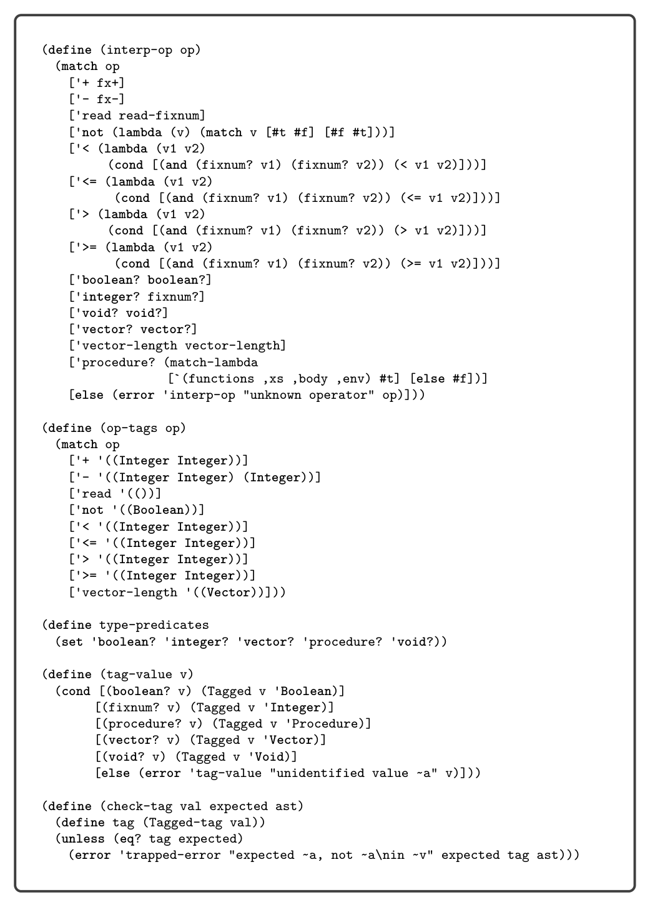

# 9.2 Representation of Tagged Values

with a tag that identifies what kind of value it is. We define the following struct to represent tagged values:

(struct Tagged (value tag) #:transparent)

The tags are Integer, Boolean, Void, Vector, and Procedure. Tags are closely related to types but do not always capture all the information that a type does. For example, a vector of type (Vector Any Any) is tagged with Vector, and a procedure of type (Any Any -> Any) is tagged with Procedure. Next consider the match case for accessing the element of a tuple. The check-tag auxiliary function (figure 9.4) is used to ensure that the first argument is a tuple and the second is an integer. If they are not, a trapped-error is raised. Recall from section 1.5 that when a definition interpreter raises a trapped-error error, the compiled code must also signal an error by exiting with return code 255. A trapped-error is also raised if the index is not less than the length of the vector.

9.2 Representation of Tagged Values

The interpreter for LDyn introduced a new kind of value: the tagged value. To compile LDyn to x86 we must decide how to represent tagged values at the bit level. Because almost every operation in LDyn involves manipulating tagged values, the representation must be efficient. Recall that all our values are 64 bits. We shall steal the right-most 3 bits to encode the tag. We use 001 to identify integers, 100 for Booleans, 010 for tuples, 011 for procedures, and 101 for the void value. We define the following auxiliary function for mapping types to tag codes:

tagof(Integer) = 001

tagof(Boolean) = 100

tagof((Vector … )) = 010

tagof(( … -> … )) = 011

tagof(Void) = 101

This stealing of 3 bits comes at some price: integers are now restricted to the range −260 to 260 −1. The stealing does not adversely affect tuples and procedures because those values are addresses, and our addresses are 8-byte aligned so the rightmost 3 bits are unused; they are always 000. Thus, we do not lose information by overwriting the rightmost 3 bits with the tag, and we can simply zero out the tag to recover the original address. To make tagged values into first-class entities, we can give them a type called Any and define operations such as Inject and Project for creating and using them, yielding the statically typed LAny intermediate language. We describe how to compile LDyn to LAny in section 9.4; in the next section we describe the LAny language in greater detail.

*Figure 9.3*

*Figure 9.4*

