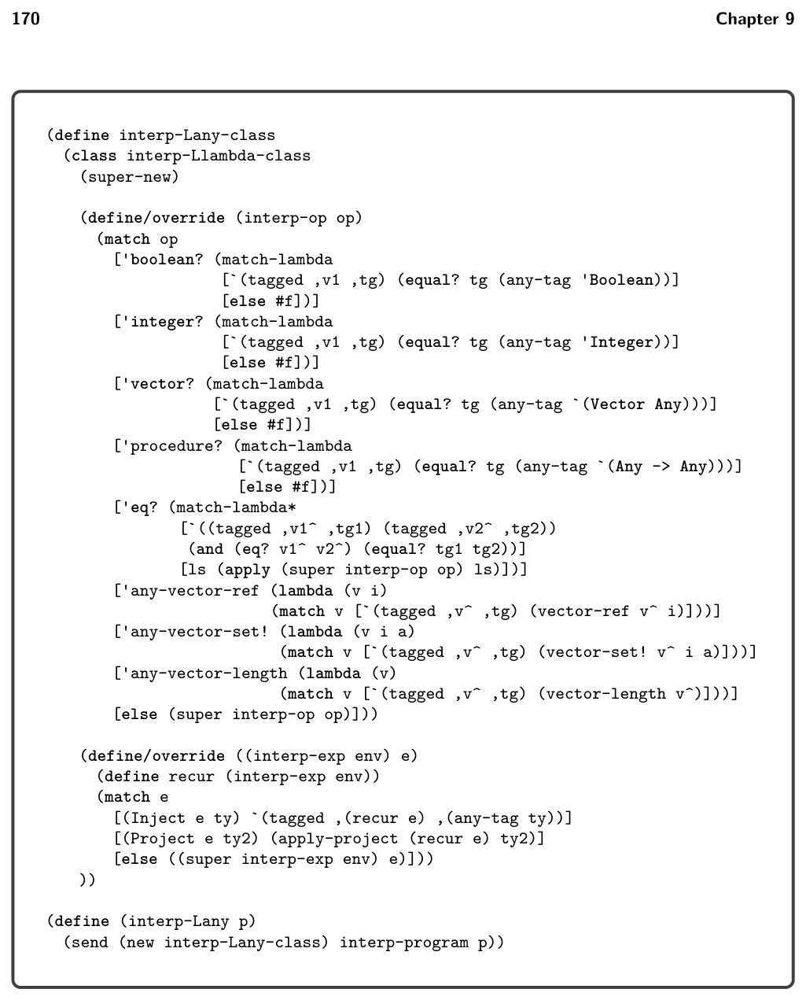

# 9.3 The LAny Language

*Figure 9.5*

9.3 The LAny Language

The definition of the abstract syntax of LAny is given in figure 9.5. The (Inject e T) form converts the value produced by expression e of type T into a tagged value. The (Project e T) form either converts the tagged value produced by expression e into a value of type T or halts the program if the type tag does not match T. Note that in both Inject and Project, the type T is restricted to be a flat type (the nonterminal ftype) which simplifies the implementation and complies with the needs for compiling LDyn. The any-vector operators adapt the tuple operations so that they can be applied to a value of type Any. They also generalize the tuple operations in that the index is not restricted to a literal integer in the grammar but is allowed to be any expression. The type predicates such as boolean? expect their argument to produce a tagged value; they return #t if the tag corresponds to the predicate and return #f otherwise.

The type checker for LAny is shown in figure 9.6 and it uses the auxiliary functions presented in figure 9.7. The interpreter for LAny is shown in figure 9.8 and its auxiliary functions are shown in figure 9.9.

*Figure 9.6*

*Figure 9.7*

*(super-new)*

*Figure 9.8*

*Figure 9.9*

