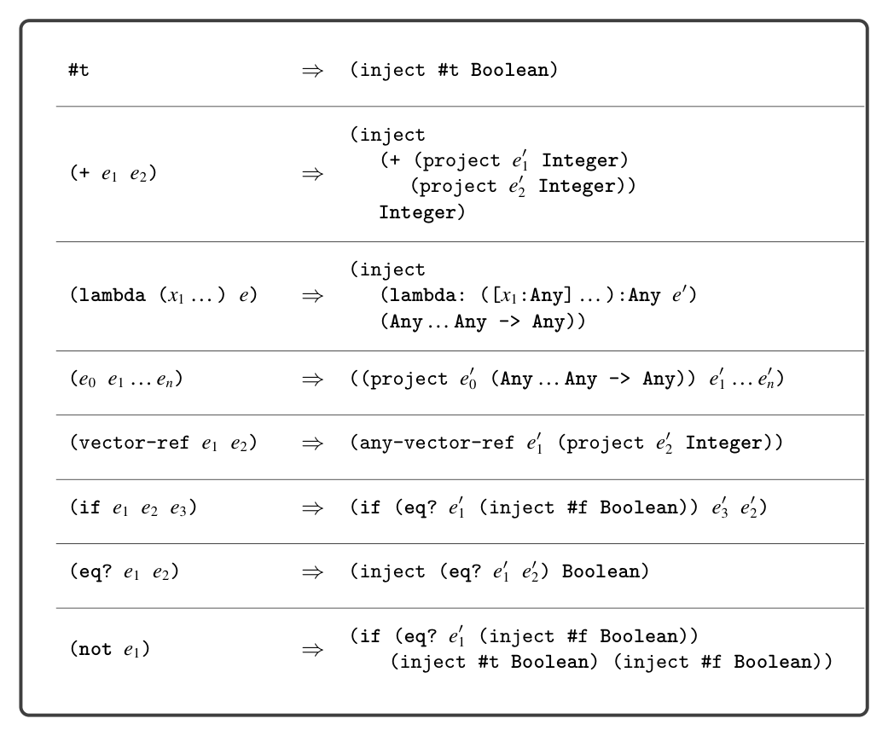

# 9.4 Cast Insertion: Compiling LDyn to LAny

*Figure 9.10*

9.4 Cast Insertion: Compiling LDyn to LAny

The cast_insert pass compiles from LDyn to LAny. Figure 9.10 shows the compi- lation of many of the LDyn forms into LAny. An important invariant of this pass is that given any subexpression e in the LDyn program, the pass will produce an expression e′ in LAny that has type Any. For example, the first row in figure 9.10 shows the compilation of the Boolean #t, which must be injected to produce an expression of type Any. The compilation of addition is shown in the second row of figure 9.10. The compilation of addition is representative of many primitive opera- tions: the arguments have type Any and must be projected to Integer before the addition can be performed. The compilation of lambda (third row of figure 9.10) shows what happens when we need to produce type annotations: we simply use Any. The compilation of if and eq? demonstrate how this pass has to account for some differences in behavior between LDyn and LAny. The LDyn language is more permissive than LAny regarding what kind of values can be used in various places. For example, the condition of an if does not have to be a Boolean. For eq?, the arguments need not be of the same type (in that case the result is #f).

