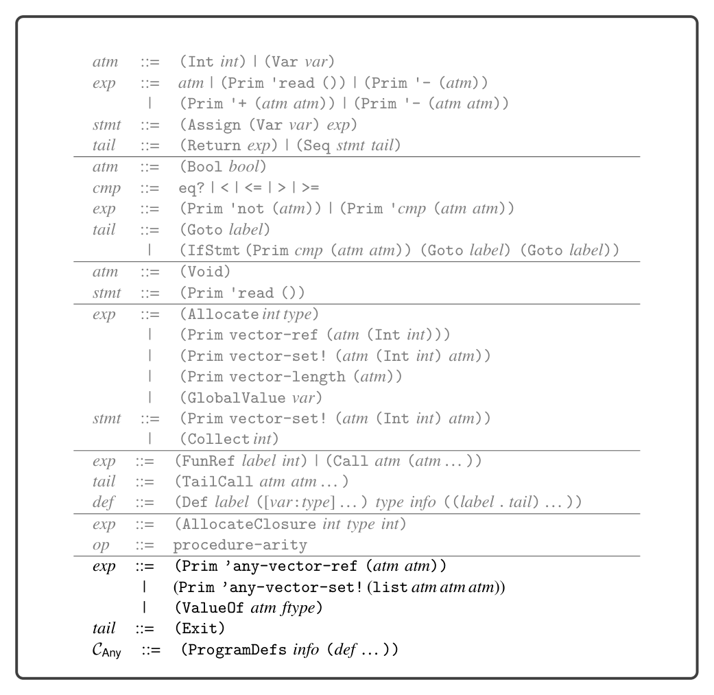

# 9.8 Select Instructions

(Prim 'any-vector-ref (list e1 e2)) ⇒ (Let v e′ 1 (Let i e′ 2 (If (Prim 'eq? (list (Prim 'tag-of-any (list (Var v))) (Int 2))) (If (Prim '< (list (Var i) (Prim 'any-vector-length (list (Var v))))) (Prim 'any-vector-ref (list (Var v) (Var i))) (Exit)) (Exit))))

9.6 Remove Complex Operands

The ValueOf and Exit forms are both complex expressions. The subexpression of ValueOf must be atomic.

9.7 Explicate Control and CAny

The output of explicate_control is the CAny language, whose syntax definition is shown in figure 9.11. The ValueOf form that we added to LAny remains an expression and the Exit expression becomes a tail. Also, note that the index argument of vector-ref and vector-set! is an atm, instead of an integer as it was in CTup (figure 6.12).

9.8 Select Instructions

In the select_instructions pass, we translate the primitive operations on the Any type to x86 instructions that manipulate the three tag bits of the tagged value. In the following descriptions, given an atom e we use a primed variable e′ to refer to the result of translating e into an x86 argument:

make-any We recommend compiling the make-any operation as follows if the tag is for Integer or Boolean. The salq instruction shifts the destination to the left by the number of bits specified by its source argument (in this case three, the length of the tag), and it preserves the sign of the integer. We use the orq instruction to combine the tag and the value to form the tagged value.

(Assign lhs (Prim 'make-any (list e (Int tag)))) ⇒ movq e′, lhs′

salq $3, lhs′

orq $tag, lhs′

The instruction selection for tuples and procedures is different because there is no need to shift them to the left. The rightmost 3 bits are already zeros, so we simply combine the value and the tag using orq.

*Figure 9.11*

(Assign lhs (Prim 'make-any (list e (Int tag)))) ⇒ movq e′, lhs′

orq $tag, lhs′

tag-of-any Recall that the tag-of-any operation extracts the type tag from a value of type Any. The type tag is the bottom 3 bits, so we obtain the tag by taking the bitwise-and of the value with 111 (7 decimal).

(Assign lhs (Prim 'tag-of-any (list e))) ⇒ movq e′, lhs′

andq $7, lhs′

ValueOf The instructions for ValueOf also differ, depending on whether the type T is a pointer (tuple or function) or not (integer or Boolean). The following shows the instruction selection for integers and Booleans, in which we produce an untagged value by shifting it to the right by 3 bits:

(Assign lhs (ValueOf e T)) ⇒ movq e′, lhs′

sarq $3, lhs′

In the case for tuples and procedures, we zero out the rightmost 3 bits. We accom- plish this by creating the bit pattern … 0111 (7 decimal) and apply bitwise-not to obtain … 11111000 (-8 decimal), which we movq into the destination lhs′. Finally, we apply andq with the tagged value to get the desired result.

(Assign lhs (ValueOf e T)) ⇒ movq $−8, lhs′

andq e′, lhs′

any-vector-length The any-vector-length operation combines the effect of ValueOf with accessing the length of a tuple from the tag stored at the zero index of the tuple.

(Assign lhs (Prim 'any-vector-length (list e1))) =⇒ movq $−8, %r11 andq e′ 1, %r11 movq 0(%r11), %r11 andq $126, %r11 sarq $1, %r11 movq %r11, lhs′

any-vector-ref This operation combines the effect of ValueOf with reading an element of the tuple (see section 6.6). However, the index may be an arbitrary atom, so instead of computing the offset at compile time, we must generate instructions to compute the offset at runtime as follows. Note the use of the new instruction imulq.

(Assign lhs (Prim 'any-vector-ref (list e1 e2))) =⇒ movq ¬111, %r11 andq e′ 1, %r11 movq e′ 2, %rax addq $1, %rax imulq $8, %rax addq %rax, %r11 movq 0(%r11) lhs′

