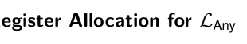
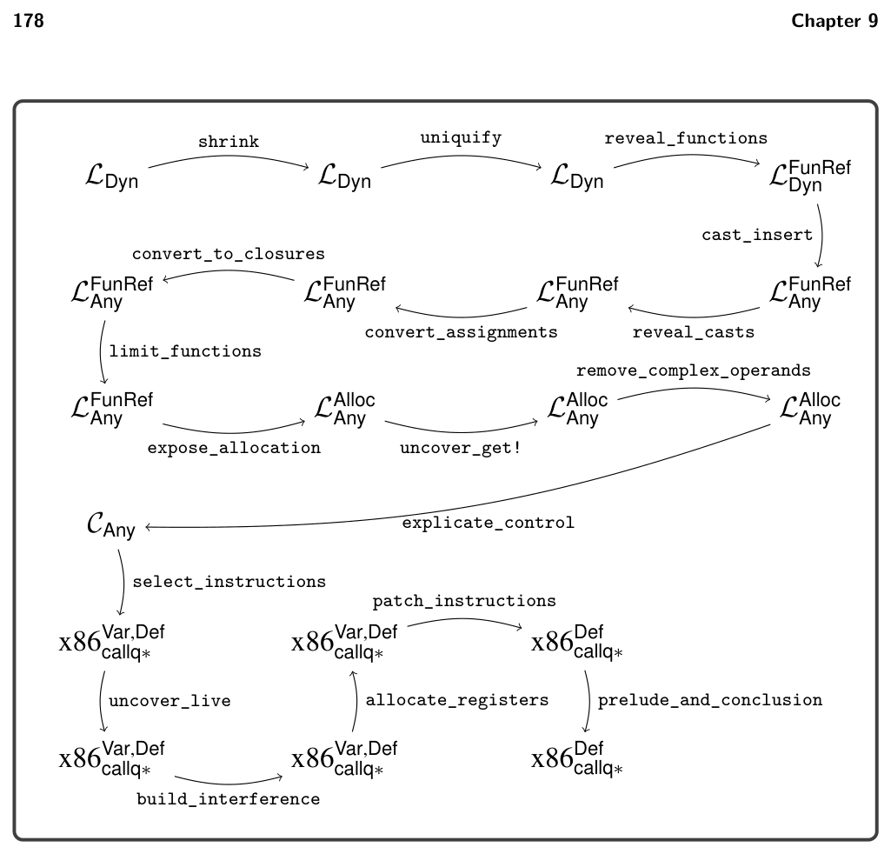

# 9.9 Register Allocation for LAny 

*Figure 9.12 gives an overview of the passes needed for the compilation of LDyn.*

*Figure 9.12 Diagram of the passes for LDyn, a dynamically typed language.*

