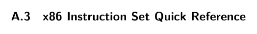

# A.3 x86 Instruction Set Quick Reference

tests A list of test numbers that specifies which tests to run (explained next).

The interp-tests function assumes that the subdirectory tests has a collection of Racket programs whose names all start with the family name, followed by an underscore and then the test number, and ending with the file extension .rkt. Also, for each test program that calls read one or more times, there is a file with the same name except that the file extension is .in, which provides the input for the Racket program. If the test program is expected to fail type checking, then there should be an empty file of the same name with extension .tyerr.

compiler-tests This function runs the compiler passes to generate x86 (a .s file) and then runs the GNU C compiler (gcc) to generate machine code. It runs the machine code and checks that the output is 42. The parameters to the compiler-tests function are similar to those of the interp-tests function, and they consist of

* a compiler name (a string),

* a type checker,

* description of the passes,

* name of a test-family, and

* a list of test numbers.

compile-file This function takes a description of the compiler passes (see the comment for interp-tests) and returns a function that, given a program file name (a string ending in .rkt), applies all the passes and writes the output to a file whose name is the same as the program file name with extension .rkt replaced by .s.

read-program This function takes a file path and parses that file (it must be a Racket program) into an abstract syntax tree.

parse-program This function takes an S-expression representation of an abstract syntax tree and converts it into the struct-based representation.

assert This function takes two parameters, a string (msg) and Boolean (bool), and displays the message msg if the Boolean bool is false.

lookup This function takes a key and an alist and returns the first value that is associated with the given key, if there is one. If not, an error is triggered. The alist may contain both immutable pairs (built with cons) and mutable pairs (built with mcons).

*Table A.1*

