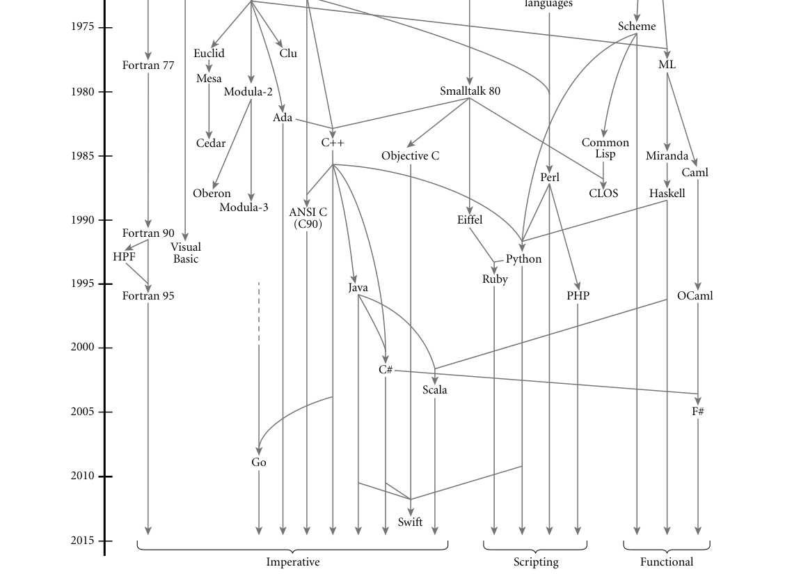

# A: Programming Languages Mentioned

## **A**

## **Programming Languages Mentioned**

**This appendix provides brief descriptions,** bibliographic references, and
(in many cases) URLs for on-line information concerning each of the principal
programming languages mentioned in this book. The URLs are accurate as of
June 2015, though they are subject to change as people move files around. Some
additional URLs can be found in the bibliographic references.
Bill Kinnersley maintains an index of on-line materials for approximately 2500
programming languages at* people.ku.edu/~nkinners/LangList/Extras/langlist.htm*.
Figure A.1 shows the genealogy of some of the more influential or widely used
programming languages. The date for each language indicates the approximate
time at which its features became widely known. Arrows indicate principal influ-
ences on design. Many influences, of course, cannot be shown in a single figure.

```
Ada : Originally intended to be the standard language for all software commis-
sioned by the U.S. Department of Defense [Ame83], now standardized by the
ISO [Int12b]. Prototypes designed by teams at several sites; final ’83 language
developed by a team at Honeywell’s Systems and Research Center in Min-
neapolis and Alsys Corp. in France, led by Jean Ichbiah. A very large language,
descended largely from Pascal. Design rationale articulated in a remarkably
clear companion document [IBFW91]. Ada 95 was a revision developed un-
der government contract by a team at Intermetrics, Inc. It fixed several sub-
tle problems in the earlier language, and added objects, shared-memory syn-
chronization, and many other features. Ada 2005 and Ada 2012 add a host of
additional features; for a summary see ada2012.org/comparison.html. Freely
available implementation (gnat) distributed as part of the GNU compiler col-
lection (gcc). Additional resources at adaic.org/ and ada-europe.org/.
Algol 60 : The original block-structured language. The definition by Naur et al.
[NBB+63] is considered a landmark of clarity and conciseness. It includes the
original use of Backus-Naur Form (BNF).
Algol 68 : A large and relatively complex successor to Algol 60, designed by a
committee led by A. van Wijngaarden. Includes (among other things) struc-
tures and unions, expression-based syntax, reference parameters, a reference
model of variables, and concurrency. The official definition [vMP+75] uses
```

**859**

Fortran 77

Fortran 90

Fortran 95

Visual

Basic
HPF
Python

Basic

PL/I

Cobol
Algol 58

Algol 60

Algol W

Pascal

Euclid

Mesa

Ada

C++

Objective C

C#

Clu

C
shell
languages

Lisp

Algol 68

Scheme

Simula

Simula 67
BCPL

ML

Caml

OCaml
Ruby
Java

Scala

Swift

Go

ANSI C

(C90)
Eiffel

CLOS
Haskell

Miranda

Perl

PHP

Common

Lisp

Smalltalk 80

Cedar

Oberon

Modula-3

Modula-2

1965

1970

1975

1980

1985

1990

1995

2000

Imperative
Scripting
Functional

2005

2010

2015

F#



*Figure A.1 Genealogy of selected programming languages. Dates are approximate. Arrows that continue at the botton of the page indicate ongoing evolution.*

