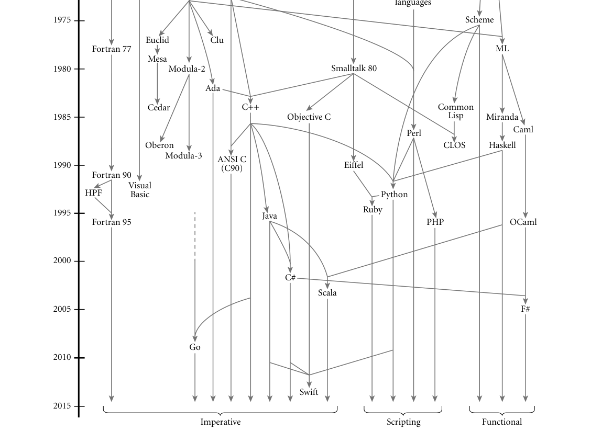

## **A**
**Programming Languages Mentioned**

**This appendix provides brief descriptions,** bibliographic references, and
(in many cases) URLs for on-line information concerning each of the principal
programming languages mentioned in this book. The URLs are accurate as of
June 2015, though they are subject to change as people move files around. Some
additional URLs can be found in the bibliographic references.
Bill Kinnersley maintains an index of on-line materials for approximately 2500
programming languages at* people.ku.edu/~nkinners/LangList/Extras/langlist.htm*.
Figure A.1 shows the genealogy of some of the more influential or widely used
programming languages. The date for each language indicates the approximate
time at which its features became widely known. Arrows indicate principal influ-
ences on design. Many influences, of course, cannot be shown in a single figure.

**Ada :** Originally intended to be the standard language for all software commis-
sioned by the U.S. Department of Defense [Ame83], now standardized by the
ISO [Int12b]. Prototypes designed by teams at several sites; final ’83 language
developed by a team at Honeywell’s Systems and Research Center in Min-
neapolis and Alsys Corp. in France, led by Jean Ichbiah. A very large language,
descended largely from Pascal. Design rationale articulated in a remarkably
clear companion document [IBFW91]. Ada 95 was a revision developed un-
der government contract by a team at Intermetrics, Inc. It fixed several sub-
tle problems in the earlier language, and added objects, shared-memory syn-
chronization, and many other features. Ada 2005 and Ada 2012 add a host of
additional features; for a summary see* ada2012.org/comparison.html*. Freely
available implementation (gnat) distributed as part of the GNU compiler col-
lection (gcc). Additional resources at* adaic.org/* and* ada-europe.org/*.
**Algol 60 :** The original block-structured language. The definition by Naur et al.
[NBB+63] is considered a landmark of clarity and conciseness. It includes the
original use of Backus-Naur Form (BNF).
**Algol 68 :** A large and relatively complex successor to Algol 60, designed by a
committee led by A. van Wijngaarden. Includes (among other things) struc-
tures and unions, expression-based syntax, reference parameters, a reference
model of variables, and concurrency. The official definition [vMP+75] uses

Fortran I
Fortran II

Cobol
Algol 58

Lisp

Algol 60

1960

Fortran IV

Basic

Simula

PL/I

1965

Algol W

Simula 67
BCPL

Algol 68

1970

Pascal

*Figure A.1 Genealogy of selected programming languages. Dates are approximate. Arrows that continue at the botton of the page indicate ongoing evolution.*

unconventional terminology and is very difficult to read; other sources (e.g.,
Pagan’s book [Pag76]) are more accessible.
**Algol W :** A smaller, simpler alternative to Algol 68, proposed by Niklaus Wirth
and C. A. R. Hoare [WH66, Sit72]. The precursor to Pascal. Introduced the
case statement.
**APL :** Designed by Kenneth Iverson in the late 1950s and early 1960s, primar-
ily for the manipulation of numeric arrays. Functional. Extremely concise.
Powerful set of operators. Employs an extended character set. Intended for
interactive use. Original syntax [Ive62] was nonlinear; implementations gen-
erally use a revised syntax due to a team at IBM [IBM87]. On-line resources at
*sigapl.org/*.
**Basic :** Simple imperative language, originally intended for interactive use.
Original version developed by John Kemeny and Thomas Kurtz of Dartmouth
College in the early 1960s. Dozens of dialects exist. Microsoft’s Visual Basic,
which bears little resemblance to the original, is the most widely used today
(resources available at* msdn.microsoft.com/en-us/library/sh9ywfdk.aspx*). Min-
imal subset defined by ANSI standard [Ame78].
**C :** One of the most successful imperative languages.
Originally defined by
Brian Kernighan and Dennis Ritchie of Bell Labs as part of the development
of Unix [KR88]. Concise syntax. Unusual declaration syntax. Intended for
systems programming. Weak type checking. No dynamic semantic checks.
Standardized by ANSI/ISO in 1990 [Ame90]. Extensions for international
character sets adopted in 1994.
More extensive changes adopted in 1999
and 2011 [Int99, Int11]. Popular open-source implementations include gcc
(*gnu.org/software/gcc/*) and clang/llvm (*clang.llvm.org/*).
**C# :** Object-oriented language originally designed by Anders Hejlsberg, Scott
Wiltamuth, and associates at Microsoft Corporation in the late 1990s and early
2000s [HTWG11, Mic12, ECM06a]. Versions 1 and 2 standardized by ECMA
and the ISO [ECM06a]; subsequent versions defined directly by Microsoft.
Serves as the principal language for the .NET platform, a runtime and middle-
ware system for multilanguage distributed computing. Includes most of Java’s
features, plus many from C++ and Visual Basic, including both reference and
value types, both contiguous and row-pointer arrays, both virtual and nonvir-
tual methods, operator overloading, delegates, generics, local type inference,
an “unsafe” superset with pointers, and the ability to invoke methods of dy-
namically typed objects across language boundaries. Commercial resources at
*msdn.microsoft.com/en-us/vstudio/hh388566.aspx*. Freely available implemen-
tation at* mono-project.com/docs/about-mono/languages/csharp/*.
**C++ :** The first object-oriented successor to C to gain widespread adoption. Still
widely considered the one most suited to “industrial strength” computing.
Originally designed by Bjarne Stroustrup of Bell Labs (now at Texas A & M
University). A large language. Standardized by the ISO in 1998; major re-
vision in 2011; updated in 2014. Includes (among other things) generalized
reference types, both static and dynamic method binding, extensive facili-

ties for overloading and coercion, multiple inheritance, and Turing-complete
generics. No automatic garbage collection. Many texts exist; aside from the
ISO standard [Int14b], Stroustrup’s is the most comprehensive [Str13]. Freely
available implementations included in the gcc and clang/llvm distributions
(see C). Stroustrup’s own resource page is at* stroustrup.com/C++.html*.
**Caml and OCaml :** Caml is a dialect of ML developed by Guy Cousineau and
colleagues at INRIA (the French National research institute) beginning in the
late 1980s. Evolved into Objective Caml (OCaml) around 1996, under the
leadership of Xavier Leroy; the revised language adds modules and object ori-
entation. Regarded by many as “more practical” than SML (the other principal
ML dialect), OCaml is widely used in industry. See also F#. On-line resources
at* caml.inria.fr/*.
**Cedar :** See Mesa and Cedar.
**Cilk :** Concurrent extension of C and C++ developed by Charles Leiserson and
associates at MIT beginning in the mid 1990s, and commercialized by Cilk
Arts, Inc. in 2006; acquired by Intel in 2009. Extensions to C are deliberately
minimal: a function can be spawned as a separate task; completion of subtasks
can be awaited* en masse* with sync; tasks can synchronize with each other
to a limited degree with inlets. Implementation employs a novel, provably
efficient* work-stealing* scheduler. On-line resources at* supertech.csail.mit.edu/*
*cilk/* and* /software.intel.com/en-us/intel-cilk-plus*.
**CLOS :** The Common Lisp Object System [Kee89; Sei05, Chaps. 16–17]. A set
of object-oriented extensions to Common Lisp, incorporated into the ANSI
standard language (see Common Lisp).
**Clu :** Developed by Barbara Liskov and associates at MIT in the late 1970s
[LG86]. Designed to provide an unusually powerful set of features for data
abstraction [LSAS77]. Also includes iterators and exception handling. Doc-
umentation and freely available implementations at* pmg.csail.mit.edu/CLU.*
*html*.
**Cobol :** Originally developed by the U.S. Department of Defense in the late
1950s and early 1960s by a team led by Grace Murray Hopper. Long the most
widely used programming language in the world. Standardized by ANSI in
1968; revised in 1974 and 1985. Intended principally for business data process-
ing. Introduced the concept of structures. Elaborate I/O facilities. Cobol 2002
and 2014 [Int14a] add a variety of modern language features, including object
orientation.
**Common Lisp :** Large, widely used dialect of Lisp (see also Lisp). Includes
(among other things) static scoping, an extensive type system, exception han-
dling, and object-oriented features (see CLOS). For years the standard refer-
ence was the book by Guy Steele, Jr. [Ste90]. Subsequently standardized by
ANSI [Ame96b]; recent text by Seibel [Sei05] Abridged hypertext version of
the standard available at* lispworks.com/documentation/HyperSpec/Front/index.*
*htm*.

**CSP :** See Occam.
**Eiffel :** An object-oriented language developed by Bertrand Meyer and asso-
ciates at the Société des Outils du Logiciel à Paris [Mey92b, ECM06b]. Includes
(among other things) multiple inheritance, automatic garbage collection, and
powerful mechanisms for renaming of data members and methods in derived
classes. On-line resources at* eiffel.com/*.
**Erlang :** A functional language with extensive support for distribution, fault
tolerance, and message passing. Developed by Joe Armstrong and colleagues
at Ericsson Computer Science Laboratory starting in the late 1980s [Arm13].
Distributed as open source since 1998. Used to implement a variety of prod-
ucts from Ericsson and other companies, particularly in the European telecom
industry. On-line resources at* erlang.org/*.
**Euclid :** Imperative language developed by Butler Lampson and associates at the
Xerox Palo Alto Research Center in the mid-1970s [LHL+77]. Designed to
eliminate many of the sources of common programming errors in Pascal, and
to facilitate formal verification of programs. Has closed scopes and module
types.
**F# :** A descendant of OCaml developed by Don Syme and colleagues at Mi-
crosoft Research. First public release was in 2005 [SGC13]. Differences from
OCaml are primarily to accommodate integration with the .NET framework.
On-line resources at* research.microsoft.com/fsharp/* and* msdn.microsoft.com/*
*en-us/library/dd233154.aspx*.
**Forth :** A small and rather ingenious stack-based language designed for inter-
pretation on machines with limited resources [Bro87, Int97]. Originally de-
veloped by Charles H. Moore in the late 1960s. Has a loyal following in the
instrumentation and process-control communities.
**Fortran :** The original high-level imperative language. Developed in the mid-
1950s by John Backus and associates at IBM. Important historical versions in-
clude Fortran I, Fortran II, Fortran IV, Fortran 77, and Fortran 90. The lat-
ter two were documented in a pair of ANSI standards. Fortran 90 [MR96]
(updated in 1995) was a major revision to the language, adding (among other
things) recursion, pointers, new control constructs, and a wealth of array oper-
ations. Fortran 2003 adds object orientation. Fortran 2008 [Int10] (approved
in 2010) adds several generics, co-arrays (arrays with an explicit extra “loca-
tion” dimension for distributed-memory machines), and a DO CONCURRENT
construct for loops whose iterations are independent. Fortran 77 continues
to be widely used. Freely available gfortran implementation conforms to
all modern standards, and is distributed as part of the gcc compiler suite
(*gnu.org/software/gcc/fortran/*). Support for the older g77 front end was dis-
continued as of gcc version 3.4.
**Go :** A statically typed language developed by Robert Griesemer, Rob Pike, Ken
Thompson, and colleagues at Google, beginning in 2007. Intended to com-
bine the simplicity of scripting languages with the efficiency of compilation,

and motivated in part by the perception that C++ had grown too large and
complicated. Includes garbage collection, strong typing, local type inference,
type extension and interfaces as an alternative to classes, variable-length and
associative arrays, and message-based concurrency. In active use both within
and outside Google. Online resources at* golang.org/*.
**Haskell :** The leading purely functional language. Descended from Miranda.
Designed by a committee of researchers beginning in 1987. Includes cur-
ried functions, higher order functions, nonstrict semantics, static polymor-
phic typing, pattern matching, list comprehensions, modules, monadic I/O,
type classes, and layout (indentation)-based syntactic grouping. Haskell 98
was for many years the standard; superceded by Haskell 2010 [PJ10]. On-line
resources at* haskell.org/*. Several concurrent variants have also been devised,
including Concurrent Haskell [JGF96] and pH [NA01].
**Icon :** The successor to Snobol. Developed by Ralph Griswold (Snobol’s prin-
cipal designer) at the University of Arizona [GG96]. Adopts more conven-
tional control-flow constructs, but with powerful iteration and search fa-
cilities based on pattern matching and backtracking. On-line resources at
*cs.arizona.edu/icon/*.
**Java :** Object-oriented language based largely on a subset of C++. Developed by
James Gosling and associates at Sun Microsystems in the early 1990s [AG06,
GJS+14].
Intended for the construction of highly portable, architecture-
neutral programs. Defined in conjunction with an intermediate* bytecode* for-
mat intended for execution on a Java* virtual machine* [LYBB14]. Includes
(among other things) a reference model of (class-typed) variables, mix-in in-
heritance, threads, and extensive predefined libraries for graphics, communi-
cation, and other activities. On-line resources at* docs.oracle.com/javase/*.
**JavaScript :** Simple scripting language developed by Brendan Eich at Netscape
Corp. in the mid 1990s for the purpose of client-side web scripting. Has no
connection to Java beyond superficial syntactic similarity. Embedded in most
commercial web browsers. Microsoft’s JScript is very similar. The two were
merged into a single ECMA standard in 1997; subsequently revised and cross-
standardized by the ISO [ECM11].
**Lisp :** The original functional language [McC60]. Developed by John McCarthy
in the late 1950s as a realization of Church’s lambda calculus. Many dialects ex-
ist. The two most common today are Common Lisp and Scheme (see separate
entries). Historically important dialects include Lisp 1.5 [MAE+65], MacLisp
[Moo78], and Interlisp [TM81].
**Lua :** Lightweight scripting language intended primarily for extension/embed-
ded settings. Originally developed by Roberto Ierusalimschy, Waldemar Celes,
and Luiz Henrique de Figueiredo at the Pontifical Catholic University of Rio
de Janeiro. Intended to be simple, fast, and easy to extend and to port to new
environments. The standard implementation is also quite small—well under
1 MB for the interpreter and all the standard libraries. Heavily used in the

gaming industry and in a wide variety of other fields. Online resources at
*lua.org/*.
**Mesa and Cedar :** Mesa [LR80] was a successor to Euclid developed in the
1970s at Xerox’s Palo Alto Research Center by a team led by Butler Lamp-
son. Includes monitor-based concurrency. Along with Interlisp and Smalltalk,
one of three companion projects that pioneered the use of personal worksta-
tions, with bitmapped displays, mice, and a graphical user interface. Cedar
[SZBH86] was a successor to Mesa with (among other things) complete type
safety, exceptions, and automatic garbage collection.
**Miranda :** Purely functional language designed by David Turner in the mid-
1980s [Tur86]. Descended from ML; has type inference and automatic curry-
ing. Adds list comprehensions (Section 8.6), and uses lazy evaluation for all
arguments. Uses indentation and line breaks for syntactic grouping. On-line
resources at* miranda.org.uk/*.
**ML :** Functional language with “Pascal-like” syntax. Originally designed in the
mid- to late 1970s by Robin Milner and associates at the University of Edin-
burgh as the meta-language (hence the name) for a program verification sys-
tem. Pioneered aggressive compile-time type inference and polymorphism.
Has a few imperative features. Several dialects exist; the most widely used are
Standard ML [MTHM97] and OCaml (see separate entry). Standard ML of
New Jersey, a project of Princeton University and Bell Labs, has produced freely
available implementations for many platforms (*smlnj.org/*).
**Modula and Modula-2 :** The immediate successors to Pascal, developed by
Niklaus Wirth. The original Modula [Wir77b] was an explicitly concurrent
monitor-based language. It is sometimes called Modula (1) to distinguish it
from its successors. The more influential Modula-2 [Wir85b] was originally
designed with coroutines (Section 9.5), but no real concurrency. Both lan-
guages provide mechanisms for module-as-manager style data abstractions.
Modula-2 was standardized by the ISO in 1996 [Int96]. Freely available imple-
mentation for several platforms available from* nongnu.org/gm2/*.
**Modula-3 :** A major extension to Modula-2 developed by Luca Cardelli, Jim
Donahue, Mick Jordan, Bill Kalsow, and Greg Nelson at the Digital Systems
Research Center and the Olivetti Research Center in the late 1980s [Har92].
Intended to provide a level of support for large, reliable, and maintainable
systems comparable to that of Ada, but in a simpler and more elegant form.
On-line resources at* modula3.org/*.
**Oberon :** A deliberately minimal language designed by Niklaus Wirth [Wir88b,
RW92]. Essentially a subset of Modula-2 [Wir88a], augmented with a mech-
anism for type extension (Section 10.2.4) [Wir88c].
On-line resources at
*oberon.ethz.ch/*.
**Objective-C :** An object-oriented extension to C based on Smalltalk-style
“messaging.”
Designed by Brad Cox and StepStone corporation in the
early 1980s.
Adopted by NeXT Software, Inc., in the late 1980s for their

NeXTStep operating system and programming environment.
Adopted by
Apple as the principal development language for Mac OS X after Apple ac-
quired NeXT in 1997. Substantially simpler than other object-oriented de-
scendants of C. Distinguished by fully dynamic method dispatch and un-
usual messaging syntax. Freely available implementation included in the gcc
distribution (see C). On-line documentation can be found with a search at
*developer.apple.com/library/mac/navigation*. Future development at Apple is
moving to Swift (see separate entry).
**OCaml :** See Caml.
**Occam :** A concurrent language [JG89] based on CSP [Hoa78], Hoare’s no-
tation for message-based communication using guarded commands and syn-
chronization send. The language of choice for systems built from INMOS
Corporation’s* transputer* processors, once widely used in Europe. Uses inden-
tation and line breaks for syntactic grouping. On-line resources at* wotug.org/*
*occam/*.
**Pascal :** Designed by Niklaus Wirth in the late 1960s [Wir71], largely in reaction
to Algol 68, which was widely perceived as bloated. Heavily used in the 1970s
and 1980s, particularly for teaching. Introduced subrange and enumeration
types. Unified structures and unions. For many years, the standard reference
was Wirth’s book with Kathleen Jensen [JW91]; subsequently standardized by
ISO and ANSI [Int90]. Freely available implementation available at* gnu-pascal.*
*de/gpc/h-index.html*.
**Perl :** A general-purpose scripting language designed by Larry Wall in the late
1980s [CfWO12].
Includes unusually extensive mechanisms for character
string manipulation and pattern matching based on (extended) regular ex-
pressions. Borrows features from C, sed, awk [AKW88], and various Unix
*shell* (command interpreter) languages. Is famous/infamous for having mul-
tiple ways of doing almost anything. Enjoyed an upsurge in popularity in the
late 1990s as a server-side web scripting language. Version 5 released in 1995;
version 6 still under development as of 2015. On-line resources at* perl.org/*.
**PHP :** A descendant of Perl designed for server-side web scripting. Scripts are
typically embedded in web pages. Originally created by Rasmus Lerdorf in
1995 to help manage his personal home page. The name is now officially a re-
cursive acronym (PHP: Hypertext Preprocessor). More recent versions due to
Andi Gutmans and Zeev Suraski, in cooperation with Lerdorf. Includes built-
in support for a wide range of Internet protocols and for access to dozens of dif-
ferent commercial database systems. Version 5 (2004) added extensive object-
oriented features, mix-in inheritance, iterator objects, autoloading, structured
exception handling, reflection, overloading, and optional type declarations for
parameters. On-line resources at* php.net/*.
**PL/I :** A large, general-purpose language designed in the mid-1960s as a suc-
cessor to Fortran, Cobol, and Algol [Bee70]. Never managed to displace its
predecessors; kept alive largely through IBM corporate influence.

**Postscript :** A stack-based language for the description of graphics and print
operations [Ado90]. Developed and marketed by Adobe Systems, Inc. Based
in part on Forth [Bro87]. Generated by many word processors and drawing
programs. Most professional-quality printers contain a Postscript interpreter.
**Prolog :** The most widely used logic programming language. Developed in the
early 1970s by Alain Colmeraurer and Philippe Roussel of the University of
Aix–Marseille in France and Robert Kowalski and associates at the University
of Edinburgh in Scotland. Many dialects exist. Partially standardized in 1995
[Int95]. Numerous implementations, both free and commercial, are available;
popular freely available versions include GNU Prolog (*gprolog.org/*) and SWI-
Prolog (*swi-prolog.org/*).
**Python :** A general-purpose, object-oriented scripting language designed by
Guido van Rossum in the early 1990s. Uses indentation for syntactic group-
ing. Includes dynamic typing, nested functions with lexical scoping, lambda
expressions and higher order functions, true iterators, list comprehensions, ar-
ray slices, reflection, structured exception handling, multiple inheritance, and
modules and dynamic loading. On-line resources at* python.org/*.
**R :** Open-source scripting language intended primarily for statistical analysis.
Based on the proprietary S statistical programming language, originally devel-
oped by John Chambers and others at Bell Labs. Supports first-class and higher
order functions, unlimited extent, call-by-need, multidimensional arrays and
slices, and an extensive library of statistical functions. On-line resources at
*r-project.org/*.
**Ruby :** An elegant, general-purpose, object-oriented scripting language de-
signed by Yukihiro “Matz” Matsumoto, beginning in 1993. First released in
1995. Inspired by Ada, Eiffel, and Perl, with traces of Python, Lisp, Clu, and
Smalltalk. Includes dynamic typing, arbitrary precision arithmetic, true iter-
ators, user-level threads, first-class and higher order functions, continuations,
reflection, Smalltalk-style messaging, mix-in inheritance, autoloading, struc-
tured exception handling, and support for the Tk windowing toolkit. The text
by Thomas and Hunt is a standard reference [TFH13]. On-line resources at
*ruby-lang.org/*.
**Rust :** A statically typed language for systems programming, initially developed
by Graydon Hoare and colleagues at Mozilla Research. Syntactically reminis-
cent of C, but with a strong emphasis on type safety, memory safety (without
automatic garbage collection), and concurrency. Includes local type inference,
Haskell-like type traits, generics, mix-in inheritance, pattern matching, and
inter-thread communication based on ownership transfer. Statically prohibits
both null and dangling pointers. On-line resources at* rust-lang.org/*.
**Scala :** Object-oriented functional language developed by Martin Odersky and
associates at the École Polytechnique Fédérale de Lausanne in Switzerland,
beginning in 2001. Intended for implementation on top of the Java Virtual
Machine, and motivated in part by perceived shorcomings in Java. Provides

arguably the most aggressive integration of functional features into an imper-
ative language. Has first-class and higher order functions, local type infer-
ence, lazy evaluation, pattern matching, currying, tail recursion, rich generics
(with covariance and contravariance), message-based concurrency, trait-based
inheritance (sort of a cross between classes and interfaces). Heavily used in
both industry and academia. Development funded by the European Research
Council. On-line resources at* scala-lang.org/*.
**Scheme :** A small, elegant dialect of Lisp (see also Lisp) developed in the
mid-1970s by Guy Steele and Gerald Sussman. Has static scoping and true
first-class functions. Widely used for teaching. The sixth revised standard
(R6RS) [SDF+07], released in 2007, substantially increased the size of the lan-
guage; in the wake of subsequent objections, the R7RS standard [SCG+13]
codifies a small core language similar to the R5RS version and a larger set of ex-
tensions. Earlier version standardized by the IEEE and ANSI [Ins91]. The book
by Abelson and Sussman [AS96], long used for introductory programming
classes at MIT and elsewhere, is a classic guide to fundamental programming
concepts, and to functional programming in particular. On-line resources at
*community.schemewiki.org/*.
**Simula:** Designed at the Norwegian Computing Center, Oslo, in the mid-1960s
by Ole-Johan Dahl, Bjørn Myhrhaug, and Kristen Nygaard [BDMN73, ND78].
Extends Algol 60 with* classes* and* coroutines*. The name of the language reflects
its suitability for discrete-event simulation (Section C 9.5.4). Free Simula-to-C
translator available at* directory.fsf.org/project/cim/*.
**Single Assignment C (SAC) :** A purely functional language designed for
high performance computing on array-based data [Sch03].
Developed by
Sven-Bodo Scholz and associates at University of Hertfordshire and several
other institutions beginning in 1994. Similar in spirit to Sisal, but with syntax
based as heavily as possible on C. On-line resources at* www.sac-home.org/*.
**Sisal :** A functional language with “imperative-style” syntax.
Developed by
James McGraw and associates at Lawrence Livermore National Laboratory
in the early to mid-1980s [FCO90, Can92].
Intended primarily for high-
performance scientific computing, with automatic parallelization. A descen-
dant of the dataflow language Val [McG82]. No longer under development at
LLNL; available open-source from* sisal.sourceforge.net/*.
**Smalltalk :** Considered by many to be the quintessential object-oriented lan-
guage. Developed by Alan Kay, Adele Goldberg, Dan Ingalls, and associates at
the Xerox Palo Alto Research Center throughout the 1970s, culminating in the
Smalltalk-80 language [GR89]. Anthropomorphic programming model based
on “messages” between active objects. On-line resources at* smalltalk.org/*.
**SML :** See ML.
**Snobol :** Developed by Ralph Griswold and associates at Bell Labs in the 1960s
[GPP71], culminating in SNOBOL4. Intended primarily for processing char-
acter strings. Included an extremely rich set of string-manipulating primitives

and a novel control-flow mechanism based on the notions of* success* and* fail-*
*ure*. On-line archive at* snobol4.org/*.
**SR :** Concurrent programming language developed by Greg Andrews and
colleagues at the University of Arizona in the 1980s [AO93].
Integrated
not only sequential and concurrent programming but also shared memory,
semaphores, message passing, remote procedures, and rendezvous into a sin-
gle conceptual framework and simple syntax. On-line archive at* cs.arizona.*
*edu/sr/*.
**Swift :** Dynamic object-oriented language developed by Apple as a successor to
Objective-C. Includes garbage collection, local type inference, array bounds
checking, associative arrays, tuples, first class lambda expressions with unlim-
ited extent, generics, and both value and reference variables of object type.
On-line resources at* developer.apple.com/swift/*.
**Tcl/Tk :** Tool command language (pronounced “tickle”). Scripting language
designed by John Ousterhout in the late 1980s [Ous94, WJH03]. Keyword-
based syntax resembles Unix command-line invocations and switches; punctu-
ation is relatively spare. Uses dynamic scoping. Supports reflection, recursive
invocation of interpreter. Tk (pronounced “tee-kay”) is a set of Tcl commands
for graphical user interface (GUI) programming. Designed by Ousterhout as
an extension to Tcl, Tk has also been embedded in Ruby, Perl, and several other
languages. On-line resources at* tcl.tk/*.
**Turing :** Derived from Euclid by Richard Holt and associates at the University
of Toronto in the early 1980s [HMRC88]. Originally intended as a pedagogical
language, but could be used for a wide range of applications. Descendants, also
developed by Holt’s group, include Turing Plus and Object-Oriented Turing.
**XSL :** Extensible Stylesheet Language, standardized by the World Wide Web
Consortium. Serves as the standard stylesheet language for XML (Extensible
Markup Language), the standard for self-descriptive tree-structured data, of
which XHTML is a dialect. Includes three substandards: XSLT (XSL Transfor-
mations) [Wor14], which specifies how to translate from one dialect of XML
to another; XPath [Wor07], used to name elements of an XML document; and
XSL-FO (XSL Formatting Objects) [Wor06b], which specifies how to format
documents. XSLT, though highly specialized to the transformation of XML, is
a Turing complete programming language [Kep04]. Standards and additional
resources at* w3.org/Style/XSL/*.

