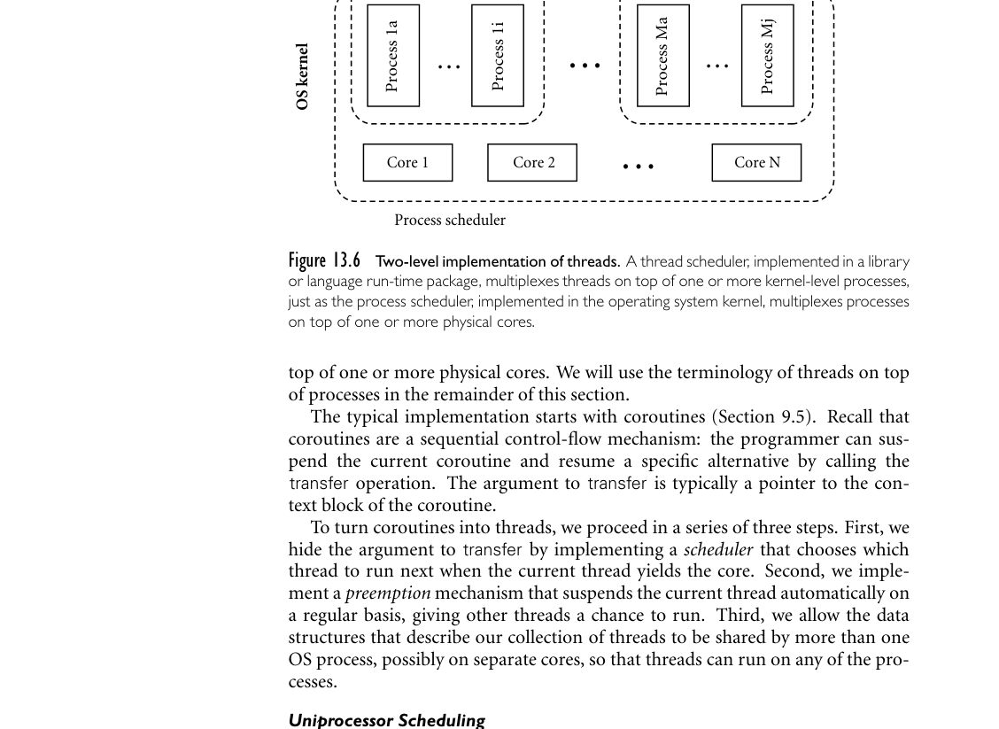

# Part III: Alternative Programming Models

## **III**

## **Alternative Programming Models**

As we noted in Chapter 1, programming languages are traditionally though imperfectly clas-
sified into various imperative and declarative families. We have had occasion in Parts I and II
to mention issues of particular importance to each of the major families. Moreover much of
what we have covered—syntax, semantics, naming, types, abstraction—applies uniformly to
all. Still, our attention has focused mostly on mainstream imperative languages. In Part III we
shift this focus.
Functional and logic languages are the principal nonimperative options. We consider them
in Chapters 11 and 12, respectively. In each case we structure our discussion around represen-
tative languages: Scheme and OCaml for functional programming, Prolog for logic program-
ming. In Chapter 11 we also cover eager and lazy evaluation, and first-class and higher-order
functions. In Chapter 12 we cover issues that make fully automatic, general purpose logic
programming difficult, and describe restrictions used in practice to keep the model tractable.
Optional sections in both chapters consider mathematical foundations: Lambda Calculus for
functional programming, Predicate Calculus for logic programming.
The remaining two chapters consider concurrent and scripting models, both of which are
increasingly popular, and cut across the imperative/declarative divide. Concurrency is driven
by the hardware parallelism of internetworked computers and by the coming explosion in mul-
tithreaded processors and chip-level multiprocessors. Scripting is driven by the growth of the
World Wide Web and by an increasing emphasis on programmer productivity, which places
rapid development and reusability above sheer run-time performance.
Chapter 13 begins with the fundamentals of concurrency, including communication and
synchronization, thread creation syntax, and the implementation of threads. The remainder of
the chapter is divided between* shared-memory* models, in which threads use explicit or implicit
synchronization mechanisms to manage a common set of variables, and (on the companion
site)* message-passing* models, in which threads interact only through explicit communication.
The first half of Chapter 14 surveys problem domains in which scripting plays a major role:
shell (command) languages, text processing and report generation, mathematics and statis-
tics, the “gluing” together of program components, extension mechanisms for complex ap-
plications, and client and server-side Web scripting. The second half considers some of the
more important language innovations championed by scripting languages: flexible scoping
and naming conventions, string and pattern manipulation (extended regular expressions), and
high level data types.

This page intentionally left blank

**1**
Alan Turing (1912–1954), after whom the Turing Award is named, was a British mathematician,
philosopher, and computer visionary. As intellectual leader of Britain’s cryptanalytic group dur-
ing World War II, he was instrumental in cracking the German “Enigma” code and turning the
tide of the war. He also helped lay the theoretical foundations of modern computer science, con-
ceived the general-purpose electronic computer, and pioneered the field of Artificial Intelligence.
Persecuted as a homosexual after the war, stripped of his security clearance, and sentenced to
“treatment” with drugs, he committed suicide.

**2**
Alonzo Church (1903–1995) was a member of the mathematics faculty at Princeton University
from 1929 to 1967, and at UCLA from 1967 to 1990. While at Princeton he supervised the doc-
toral theses of, among many others, Alan Turing, Stephen Kleene, Michael Rabin, and Dana
Scott. His codiscovery, with Turing, of undecidable problems was a major breakthrough in un-
derstanding the limits of mathematics.

```
The read-eval-print loop
(+ 3 4)
```

the interpreter will print

```
7
```

If the user types

```
eval: 7 is not a procedure
```

Unlike the situation in almost all other programming languages, extra parenthe-
ses change the semantics of Lisp/Scheme programs:

```
(+ 3 4)
=⇒7
((+ 3 4))
=⇒error
```

Here the =*⇒*means “evaluates to.” This symbol is not a part of the syntax of
Scheme itself.
■
One can prevent the Scheme interpreter from evaluating a parenthesized ex-
**EXAMPLE** 11.3

Quoting
pression by* quoting* it:

```
(quote (+ 3 4))
=⇒(+ 3 4)
```

Here the result is a three-element list. More commonly, quoting is specified with
a special shorthand notation consisting of a leading single quote mark:

```
'(+ 3 4)
=⇒(+ 3 4)
■
```

Though every expression has a type in Scheme, that type is generally not de-
termined until run time. Most predefined functions check dynamically to make
**EXAMPLE** 11.4

Dynamic typing
sure that their arguments are of appropriate types. The expression

```
Backtracking and
instantiation
we backtrack to the rainy(X) subgoal. The effect is similar to the breaking of
bindings between actual and formal parameters in an imperative programming
language, except that Prolog couches the bindings in terms of unification rather
than subroutine calls.
■
Space management for backtracking search in Prolog usually follows the
single-stack implementation of iterators described in Section C 9.5.3. The inter-
preter pushes a frame onto its stack every time it begins to pursue a new subgoal
G. If G fails, the frame is popped from the stack and the interpreter begins to
backtrack. If G succeeds, control returns to the “caller” (the parent in the search
tree), but G’s frame remains on the stack. Later subgoals will be given space above
```

### ...


*Figure 13.6 Two-level implementation of threads. A thread scheduler, implemented in a library or language run-time package, multiplexes threads on top of one or more kernel-level processes, just as the process scheduler, implemented in the operating system kernel, multiplexes processes on top of one or more physical cores.*

top of one or more physical cores. We will use the terminology of threads on top
of processes in the remainder of this section.
The typical implementation starts with coroutines (Section 9.5). Recall that
coroutines are a sequential control-flow mechanism: the programmer can sus-
pend the current coroutine and resume a specific alternative by calling the
transfer operation. The argument to transfer is typically a pointer to the con-
text block of the coroutine.
To turn coroutines into threads, we proceed in a series of three steps. First, we
hide the argument to transfer by implementing a* scheduler* that chooses which
thread to run next when the current thread yields the core. Second, we imple-
ment a* preemption* mechanism that suspends the current thread automatically on
a regular basis, giving other threads a chance to run. Third, we allow the data
structures that describe our collection of threads to be shared by more than one
OS process, possibly on separate cores, so that threads can run on any of the pro-
cesses.

**Uniprocessor Scheduling**



*Figure 13.7 illustrates the data structures employed by a simple scheduler. At any EXAMPLE 13.21*

Cooperative
multithreading on a
uniprocessor

particular time, a thread is either* blocked* (i.e., for synchronization) or* runnable*.
A runnable thread may actually be running on some process or it may be awaiting

