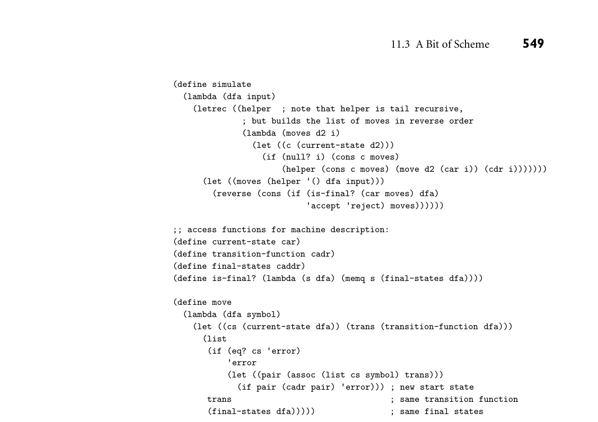
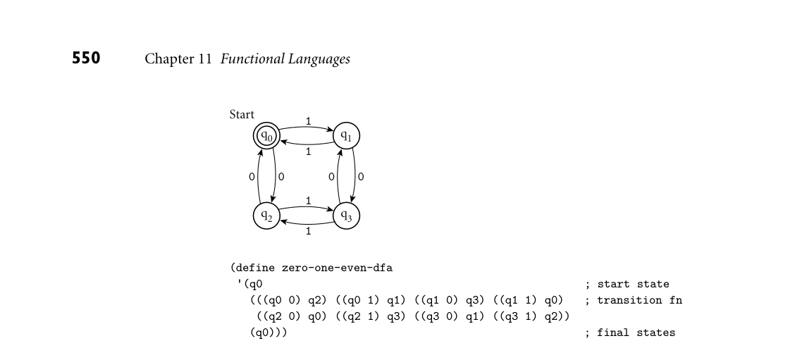
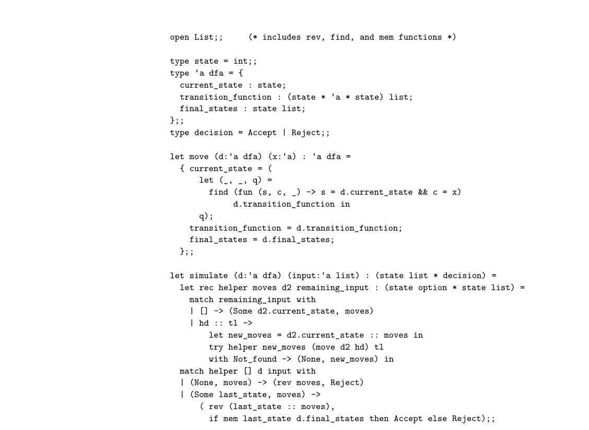
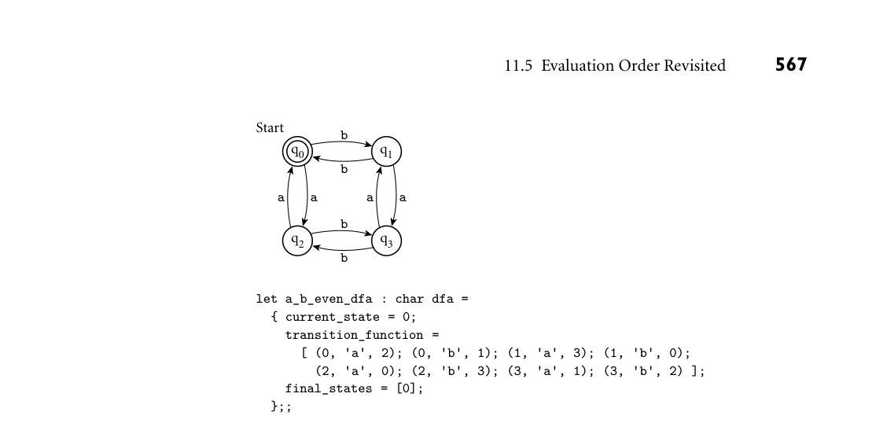

# Chapter 11: Functional Languages

11 Functional Languages

Previous chapters of this text have focused largely on imperative program- ming languages. In the current chapter and the next we emphasize functional and logic languages instead. While imperative languages are far more widely used, “industrial-strength” implementations exist for both functional and logic languages, and both models have commercially important applications. Lisp has traditionally been popular for the manipulation of symbolic data, particu- larly in the field of artificial intelligence. OCaml is heavily used in the financial services industry. In recent years functional languages—statically typed ones in particular—have become increasingly popular for scientific applications as well. Logic languages are widely used for formal specifications and theorem proving and, less widely, for many other applications. Of course, functional and logic languages have a great deal in common with their imperative cousins. Naming and scoping issues arise under every model. So do types, expressions, and the control-flow concepts of selection and recursion. All languages must be scanned, parsed, and analyzed semantically. In addition, functional languages make heavy use of subroutines—more so even than most von Neumann languages—and the notions of concurrency and nondeterminacy are as common in functional and logic languages as they are in the imperative case. As noted in Chapter 1, the boundaries between language categories tend to be rather fuzzy. One can write in a largely functional style in many imperative lan- guages, and many functional languages include imperative features (assignment and iteration). The most common logic language—Prolog—provides certain im- perative features as well. Finally, it is easy to build a logic programming system in most functional programming languages. Because of the overlap between imperative and functional concepts, we have had occasion several times in previous chapters to consider issues of particu- lar importance to functional programming languages. Most such languages de- pend heavily on polymorphism (the implicit parametric kind—Sections 7.1.2, 7.3, and 7.2.4). Most make heavy use of lists (Section 8.6). Several, historically, were dynamically scoped (Sections 3.3.6 and C 3.4.2). All employ recursion (Sec- tion 6.6) for repetitive execution, with the result that program behavior and per-

formance depend heavily on the evaluation rules for parameters (Section 6.6.2). All have a tendency to generate significant amounts of temporary data, which their implementations reclaim through garbage collection (Section 8.5.3). Our chapter begins with a brief introduction to the historical origins of the im- perative, functional, and logic programming models. We then enumerate funda- mental concepts in functional programming and consider how these are realized in the Scheme dialect of Lisp and the OCaml dialect of ML. More briefly, we also consider Common Lisp, Erlang, Haskell, Miranda, pH, Single Assignment C, and Sisal. We pay particular attention to issues of evaluation order and higher-order functions. For those with an interest in the theoretical foundations of functional programming, we provide (on the companion site) an introduction to functions, sets, and the lambda calculus. The formalism helps to clarify the notion of a pure functional language, and illuminates the places where practical languages diverge from the mathematical abstraction.

## 11.1 Historical Origins

To understand the differences among programming models, it can be helpful to consider their theoretical roots, all of which predate the developmentof electronic computers. The imperative and functional models grew out of work undertaken by mathematicians Alan Turing, Alonzo Church, Stephen Kleene, Emil Post, and others in the 1930s. Working largely independently, these individuals developed several very different formalizations of the notion of an algorithm, or effective procedure, based on automata, symbolic manipulation, recursive function defini- tions, and combinatorics. Over time, these various formalizations were shown to be equally powerful: anything that could be computed in one could be computed in the others. This result led Church to conjecture that any intuitively appealing model of computing would be equally powerful as well; this conjecture is known as Church’s thesis. Turing’s model of computing was the Turing machine, an automaton reminis- cent of a finite or pushdown automaton, but with the ability to access arbitrary cells of an unbounded storage “tape.”1 The Turing machine computes in an im- perative way, by changing the values in cells of its tape, just as a high-level im- perative program computes by changing the values of variables. Church’s model of computing is called the lambda calculus. It is based on the notion of param- eterized expressions (with each parameter introduced by an occurrence of the

1 Alan Turing (1912–1954), after whom the Turing Award is named, was a British mathematician, philosopher, and computer visionary. As intellectual leader of Britain’s cryptanalytic group dur- ing World War II, he was instrumental in cracking the German “Enigma” code and turning the tide of the war. He also helped lay the theoretical foundations of modern computer science, con- ceived the general-purpose electronic computer, and pioneered the field of Artificial Intelligence. Persecuted as a homosexual after the war, stripped of his security clearance, and sentenced to “treatment” with drugs, he committed suicide.

letter λ—hence the notation’s name).2 Lambda calculus was the inspiration for functional programming: one uses it to compute by substituting parameters into expressions, just as one computes in a high-level functional program by passing arguments to functions. The computing models of Kleene and Post are more ab- stract, and do not lend themselves directly to implementation as a programming language. The goal of early work in computability was not to understand computers (aside from purely mechanical devices, computers did not exist) but rather to formalize the notion of an effective procedure. Over time, this work allowed mathematicians to formalize the distinction between a constructive proof (one that shows how to obtain a mathematical object with some desired property) and a nonconstructive proof (one that merely shows that such an object must exist, perhaps by contradiction, or counting arguments, or reduction to some other theorem whose proof is nonconstructive). In effect, a program can be seen as a constructive proof of the proposition that, given any appropriate inputs, there exist outputs that are related to the inputs in a particular, desired way. Euclid’s al- gorithm, for example, can be thought of as a constructive proof of the proposition that every pair of non-negative integers has a greatest common divisor. Logic programming is also intimately tied to the notion of constructive proofs, but at a more abstract level. Rather than write a general constructive proof that works for all appropriate inputs, the logic programmer writes a set of axioms that allow the computer to discover a constructive proof for each particular set of inputs. We will consider logic programming in more detail in Chapter 12.

## 11.2 Functional Programming Concepts

In a strict sense of the term, functional programming defines the outputs of a program as a mathematical function of the inputs, with no notion of internal state, and thus no side effects. Among the languages we consider here, Miranda, Haskell, pH, Sisal, and Single Assignment C are purely functional. Erlang is nearly so. Most others include imperative features. To make functional programming practical, functional languages provide a number of features that are often miss- ing in imperative languages, including

First-class function values and higher-order functions Extensive polymorphism List types and operators

2 Alonzo Church (1903–1995) was a member of the mathematics faculty at Princeton University from 1929 to 1967, and at UCLA from 1967 to 1990. While at Princeton he supervised the doc- toral theses of, among many others, Alan Turing, Stephen Kleene, Michael Rabin, and Dana Scott. His codiscovery, with Turing, of undecidable problems was a major breakthrough in un- derstanding the limits of mathematics.

Structured function returns Constructors (aggregates) for structured objects Garbage collection

In Section 3.6.2 we defined a first-class value as one that can be passed as a parameter, returned from a subroutine, or (in a language with side effects) as- signed into a variable. Under a strict interpretation of the term, first-class status also requires the ability to create (compute) new values at run time. In the case of subroutines, this notion of first-class status requires nested lambda expressions that can capture values defined in surrounding scopes, giving those values unlim- ited extent (i.e., keeping them alive even after their scopes are no longer active). Subroutines are second-class values in most imperative languages, but first-class values (in the strict sense of the term) in all functional programming languages. A higher-order function takes a function as an argument, or returns a function as a result. Polymorphism is important in functional languages because it allows a func- tion to be used on as general a class of arguments as possible. As we have seen in Sections 7.1 and 7.2.4, Lisp and its dialects are dynamically typed, and thus inher- ently polymorphic, while ML and its relatives obtain polymorphism through the mechanism of type inference. Lists are important in functional languages because they have a natural recursive definition, and are easily manipulated by operating on their first element and (recursively) the remainder of the list. Recursion is im- portant because in the absence of side effects it provides the only means of doing anything repeatedly. Several of the items in our list of functional language features (recursion, struc- tured function returns, constructors, garbage collection) can be found in some but not all imperative languages. Fortran 77 has no recursion, nor does it allow structured types (i.e., arrays) to be returned from functions. Pascal and early ver- sions of Modula-2 allow only simple and pointer types to be returned from func- tions. As we saw in Section 7.1.3, several imperative languages, including Ada, C, and Fortran 90, provide aggregate constructs that allow a structured value to be specified in-line. In most imperative languages, however, such constructs are lacking or incomplete. C# and several scripting languages—Python and Ruby among them—provide aggregates capable of representing an (unnamed) func- tional value (a lambda expression), but few imperative languages are so expres- sive. A pure functional language must provide completely general aggregates: because there is no way to update existing objects, newly created ones must be initialized “all at once.” Finally, though garbage collection is increasingly com- mon in imperative languages, it is by no means universal, nor does it usually apply to the local variables of subroutines, which are typically allocated in the stack. Because of the desire to provide unlimited extent for first-class functions and other objects, functional languages tend to employ a (garbage-collected) heap for all dynamically allocated data (or at least for all data for which the compiler is unable to prove that stack allocation is safe). C++11 and Java 8 provide lambda expressions, but without unlimited extent.

Because Lisp was the original functional language, and is still one of the most widely used, several characteristics of Lisp are commonly, though inaccurately, described as though they pertained to functional programming in general. We will examine these characteristics (in the context of Scheme) in Section 11.3. They include

Homogeneity of programs and data: A program in Lisp is itself a list, and can be manipulated with the same mechanisms used to manipulate data. Self-definition: The operational semantics of Lisp can be defined elegantly in terms of an interpreter written in Lisp. Interaction with the user through a “read-eval-print” loop.

Many programmers—probably most—who have written significant amounts of software in both imperative and functional styles find the latter more aestheti- cally appealing. Moreover, experience with a variety of large commercial projects (see the Bibliographic Notes at the end of the chapter) suggests that the absence of side effects makes functional programs significantly easier to write, debug, and maintain than their imperative counterparts. When passed a given set of argu- ments, a pure function can always be counted on to return the same results. Is- sues of undocumented side effects, misordered updates, and dangling or (in most cases) uninitialized references simply don’t occur. At the same time, many imple- mentations of functional languages still fall short in terms of portability, richness of library packages, interfaces to other languages, and debugging and profiling tools. We will return to the tradeoffs between functional and imperative pro- gramming in Section 11.8.

## 11.3 A Bit of Scheme

Scheme was originally developed by Guy Steele and Gerald Sussman in the late 1970s, and has evolved through several revisions. The description here follows the 1998 R5RS (fifth revised standard), and should also be compliant with the 2013 R7RS. Most Scheme implementations employ an interpreter that runs a “read-eval- print” loop. The interpreter repeatedly reads an expression from standard input (generally typed by the user), evaluates that expression, and prints the resulting value. If the user types EXAMPLE 11.1

The read-eval-print loop (+ 3 4)

the interpreter will print

7

7

the interpreter will also print

7

(The number 7 is already fully evaluated.) To save the programmer the need to type an entire program verbatim at the keyboard, most Scheme implementations provide a load function that reads (and evaluates) input from a file:

(load "my_Scheme_program") ■

As we noted in Section 6.1, Scheme (like all Lisp dialects) uses Cambridge Polish notation for expressions. Parentheses indicate a function application (or in some cases the use of a macro). The first expression inside the left parenthesis indicates the function; the remaining expressions are its arguments. Suppose the user types EXAMPLE 11.2

Significance of parentheses ((+ 3 4))

When it sees the inner set of parentheses, the interpreter will call the function +, passing 3 and 4 as arguments. Because of the outer set of parentheses, it will then attempt to call 7 as a zero-argument function—a run-time error:

eval: 7 is not a procedure

Unlike the situation in almost all other programming languages, extra parenthe- ses change the semantics of Lisp/Scheme programs:

(+ 3 4) =⇒7 ((+ 3 4)) =⇒error

Here the =⇒means “evaluates to.” This symbol is not a part of the syntax of Scheme itself. ■ One can prevent the Scheme interpreter from evaluating a parenthesized ex- EXAMPLE 11.3

Quoting pression by quoting it:

(quote (+ 3 4)) =⇒(+ 3 4)

Here the result is a three-element list. More commonly, quoting is specified with a special shorthand notation consisting of a leading single quote mark:

'(+ 3 4) =⇒(+ 3 4) ■

Though every expression has a type in Scheme, that type is generally not de- termined until run time. Most predefined functions check dynamically to make EXAMPLE 11.4

(if (> a 0) (+ 2 3) (+ 2 "foo"))

will evaluate to 5 if a is positive, but will produce a run-time type clash error if a is negative or zero. More significantly, as noted in Section 7.1.2, functions that make sense for arguments of multiple types are implicitly polymorphic:

(define min (lambda (a b) (if (< a b) a b)))

The expression (min 123 456) will evaluate to 123; (min 3.14159 2.71828) will evaluate to 2.71828. ■ User-defined functions can implement their own type checks using predefined EXAMPLE 11.5

Type predicates type predicate functions:

```
(boolean? x)
; is x a Boolean?
(char? x)
; is x a character?
(string? x)
; is x a string?
(symbol? x)
; is x a symbol?
(number? x)
; is x a number?
(pair? x)
; is x a (not necessarily proper) pair?
(list? x)
; is x a (proper) list?
```

(This is not an exhaustive list.) ■ A symbol in Scheme is comparable to what other languages call an identifier. The lexical rules for identifiers vary among Scheme implementations, but are in general much looser than they are in other languages. In particular, identifiers are EXAMPLE 11.6

Liberal syntax for symbols permitted to contain a wide variety of punctuation marks:

(symbol? 'x$_%:&=*!) =⇒#t

The symbol #t representsthe Boolean value true. False is represented by #f. Note the use here of quote (‚); the symbol begins with x. ■ To create a function in Scheme one evaluates a lambda expression:3 EXAMPLE 11.7

lambda expressions (lambda (x) (* x x)) =⇒function

The first “argument” to lambda is a list of formal parameters for the function (in this case the single parameter x). The remaining “arguments” (again just one in this case) constitute the body of the function. As we shall see in Sec- tion 11.5, Scheme differentiates between functions and so-called special forms

3 A word of caution for readers familiar with Common Lisp: A lambda expression in Scheme eval- uates to a function. A lambda expression in Common Lisp is a function (or, more accurately, is automatically coerced to be a function, without evaluation). The distinction becomes important whenever lambda expressions are passed as parameters or returned from functions: they must be quoted in Common Lisp (with function or #’) to prevent evaluation. Common Lisp also dis- tinguishes between a symbol’s value and its meaning as a function; Scheme does not: if a symbol represents a function, then the function is the symbol’s value.

(lambda among them), which resemble functions but have special evaluation rules. Strictly speaking, only functions have arguments, but we will also use the term informally to refer to the subexpressions that look like arguments in a special form. ■ A lambda expression does not give its function a name; this can be done using let or define (to be introduced in the next subsection). In this sense, a lambda expression is like the aggregates that we used in Section 7.1.3 to specify array or record values. When a function is called, the language implementation restores the referenc- EXAMPLE 11.8

Function evaluation ing environment that was in effect when the lambda expression was evaluated (like all languages with static scope and first-class, nested subroutines, Scheme employs deep binding). It then augments this environment with bindings for the formal parameters and evaluates the expressions of the function body in order. The value of the last such expression (most often there is only one) becomes the value returned by the function:

((lambda (x) (* x x)) 3) =⇒9 ■

Simple conditional expressions can be written using if: EXAMPLE 11.9

if expressions (if (< 2 3) 4 5) =⇒4 (if #f 2 3) =⇒3

In general, Scheme expressions are evaluated in applicative order, as described in Section 6.6.2. Special forms such as lambda and if are exceptions to this rule. The implementation of if checks to see whether the first argument evaluates to #t. If so, it returns the value of the second argument, without evaluating the third argument. Otherwise it returns the value of the third argument, without evaluat- ing the second. We will return to the issue of evaluation order in Section 11.5. ■

## 11.3.1 Bindings

Names can be bound to values by introducing a nested scope: EXAMPLE 11.10

Nested scopes with let (let ((a 3) (b 4) (square (lambda (x) (* x x))) (plus +)) (sqrt (plus (square a) (square b)))) =⇒5.0

The special form let takes two or more arguments. The first of these is a list of pairs. In each pair, the first element is a name and the second is the value that the name is to represent within the remaining arguments to let. Remaining arguments are then evaluated in order; the value of the construct as a whole is the value of the final argument. The scope of the bindings produced by let is let’s second argument only:

(let ((a 3)) (let ((a 4) (b a)) (+ a b))) =⇒7

Here b takes the value of the outer a. The way in which names become visible “all at once” at the end of the declaration list precludes the definition of recursive functions. For these one employs letrec:

(letrec ((fact (lambda (n) (if (= n 1) 1 (* n (fact (- n 1))))))) (fact 5)) =⇒120

There is also a let* construct in which names become visible “one at a time” so that later ones can make use of earlier ones, but not vice versa. ■ As noted in Section 3.3, Scheme is statically scoped. (Common Lisp is also statically scoped. Most other Lisp dialects are dynamically scoped.) While let EXAMPLE 11.11

Global bindings with define and letrec allow the user to create nested scopes, they do not affect the meaning of global names (names known at the outermost level of the Scheme interpreter). For these Scheme provides a special form called define that has the side effect of creating a global binding for a name:

(define hypot (lambda (a b) (sqrt (+ (* a a) (* b b))))) (hypot 3 4) =⇒5 ■

## 11.3.2 Lists and Numbers

Like all Lisp dialects, Scheme provides a wealth of functions to manipulate lists. We saw many of these in Section 8.6; we do not repeat them all here. The three EXAMPLE 11.12

Basic list operations most important are car, which returns the head of a list, cdr (“coulder”), which returns the rest of the list (everything after the head), and cons, which joins a head to the rest of a list:

(car '(2 3 4)) =⇒2 (cdr '(2 3 4)) =⇒(3 4) (cons 2 '(3 4)) =⇒(2 3 4)

Also useful is the null? predicate, which determines whether its argument is the empty list. Recall that the notation ‚(2 3 4) indicates a proper list, in which the final element is the empty list:

For fast access to arbitrary elements of a sequence, Scheme provides a vector type that is indexed by integers, like an array, and may have elements of hetero- geneous types, like a record. Interested readers are referred to the Scheme man- ual [SDF+07] for further information. Scheme also provides a wealth of numeric and logical (Boolean) functions and special forms. The language manual describes a hierarchy of five numeric types: integer, rational, real, complex, and number. The last two levels are op- tional: implementations may choose not to provide any numbers that are not real. Most but not all implementations employ arbitrary-precision representations of both integers and rationals, with the latter stored internally as (numerator, de- nominator) pairs.

## 11.3.3 Equality Testing and Searching

Scheme provides several different equality-testing functions. For numerical com- parisons, = performs type conversions where necessary (e.g., to compare an in- teger and a floating-point number). For general-purpose use, eqv? performs a shallow comparison, while equal? performs a deep (recursive) comparison, us- ing eqv? at the leaves. The eq? function also performs a shallow comparison, and may be cheaper than eqv? in certain circumstances (in particular, eq? is not required to detect the equality of discrete values stored in different locations, though it may in some implementations). Further details were presented in Sec- tion 7.4. To search for elements in lists, Scheme provides two sets of functions, each of which has variants corresponding to the three general-purpose equality predi- cates. The functions memq, memv, and member take an element and a list as argu- EXAMPLE 11.13

List search functions ment, and return the longest suffix of the list (if any) beginning with the element:

(memq 'z '(x y z w)) =⇒(z w) (memv '(z) '(x y (z) w)) =⇒#f ; (eqv? '(z) '(z)) =⇒#f (member '(z) '(x y (z) w)) =⇒((z) w) ; (equal? '(z) '(z)) =⇒#t

The memq, memv, and member functions perform their comparisons using eq?, eqv?, and equal?, respectively. They return #f if the desired element is not found. It turns out that Scheme’s conditional expressions (e.g., if) treat anything other than #f as true.4 One therefore often sees expressions of the form

(if (memq desired-element list-that-might-contain-it) ... ■

4 One of the more confusing differences between Scheme and Common Lisp is that Common Lisp uses the empty list () for false, while most implementations of Scheme (including all that conform to the version 5 standard) treat it as true.

The functions assq, assv, and assoc search for values in association lists (oth- EXAMPLE 11.14

Searching association lists erwise known as A-lists). A-lists were introduced in Section C 3.4.2 in the context of name lookup for languages with dynamic scoping. An A-list is a dictionary implemented as a list of pairs.5 The first element of each pair is a key of some sort; the second element is information corresponding to that key. Assq, assv, and assoc take a key and an A-list as argument, and return the first pair in the list, if there is one, whose first element is eq?, eqv?, or equal?, respectively, to the key. If there is no matching pair, #f is returned. ■

## 11.3.4 Control Flow and Assignment

We have already seen the special form if. It has a cousin named cond that EXAMPLE 11.15

Multiway conditional expressions resembles a more general if... elsif... else:

(cond ((< 3 2) 1) ((< 4 3) 2) (else 3)) =⇒3

The arguments to cond are pairs. They are considered in order from first to last. The value of the overall expression is the value of the second element of the first pair in which the first element evaluates to #t. If none of the first elements eval- uates to #t, then the overall value is #f. The symbol else is permitted only as the first element of the last pair of the construct, where it serves as syntactic sugar for #t. ■ Recursion, of course, is the principal means of doing things repeatedly in Scheme. Many issues related to recursion were discussed in Section 6.6; we do not repeat that discussion here. For programmers who wish to make use of side effects, Scheme provides as- signment, sequencing, and iteration constructs. Assignment employs the special EXAMPLE 11.16

Assignment form set! and the functions set-car! and set-cdr!:

(let ((x 2) ; initialize x to 2 (l '(a b))) ; initialize l to (a b) (set! x 3) ; assign x the value 3 (set-car! l '(c d)) ; assign head of l the value (c d) (set-cdr! l '(e)) ; assign rest of l the value (e) ... x =⇒3 ... l =⇒((c d) e)

The return values of the various varieties of set! are implementation-depen- dent. ■ Sequencing uses the special form begin: EXAMPLE 11.17

Sequencing

```
(begin
(display "hi ")
(display "mom"))
```

Here we have used begin to sequence display expressions, which cause the in- terpreter to print their arguments. ■ Iteration uses the special form do and the function for-each: EXAMPLE 11.18

Iteration (define iter-fib (lambda (n) ; print the first n+1 Fibonacci numbers (do ((i 0 (+ i 1)) ; initially 0, inc'ed in each iteration (a 0 b) ; initially 0, set to b in each iteration (b 1 (+ a b))) ; initially 1, set to sum of a and b ((= i n) b) ; termination test and final value (display b) ; body of loop (display " ")))) ; body of loop

```
(for-each
(lambda (a b) (display (* a b)) (newline))
'(2 4 6)
'(3 5 7))
```

The first argument to do is a list of triples, each of which specifies a new variable, an initial value for that variable, and an expression to be evaluated and placed in a fresh instance of the variable at the end of each iteration. The second argument to do is a pair that specifies the termination condition and the expression to be returned. At the end of each iteration all new values of loop variables (e.g., a and b) are computed using the current values. Only after all new values are computed are the new variable instances created. The function for-each takes as argument a function and a sequence of lists. There must be as many lists as the function takes arguments, and the lists must

DESIGN & IMPLEMENTATION

11.1 Iteration in functional programs It is important to distinguish between iteration as a notation for repeated ex- ecution and iteration as a means of orchestrating side effects. One can in fact define iteration as syntactic sugar for tail recursion, and Val, Sisal, and pH do precisely that (with special syntax to facilitate the passing of values from one iteration to the next). Such a notation may still be entirely side-effect free, that is, entirely functional. In Scheme, assignment and I/O are the truly imperative features. We think of iteration as imperative because most Scheme programs that use it have assignments or I/O in their loops.

all be of the same length. For-each calls its function argument repeatedly, pass- ing successive sets of arguments from the lists. In the example shown here, the unnamed function produced by the lambda expression will be called on the ar- guments 2 and 3, 4 and 5, and 6 and 7. The interpreter will print

```
6
20
42
()
```

The last line is the return value of for-each, assumed here to be the empty list. The language definition allows this value to be implementation-dependent; the construct is executed for its side effects. ■ Two other control-flow constructs have been mentioned in previous chap- ters. Delay and force (Section 6.6.2) permit the lazy evaluation of expressions. Call-with-current-continuation (call/cc; Section 6.2.2) allows the cur- rent program counter and referencing environment to be saved in the form of a closure, and passed to a specified subroutine. We will mention delay and force again in Section 11.5.

## 11.3.5 Programs as Lists

As should be clear by now, a program in Scheme takes the form of a list. In technical terms, we say that Lisp and Scheme are homoiconic—self-representing. A parenthesized string of symbols (in which parentheses are balanced) is called an S-expression regardless of whether we think of it as a program or as a list. In fact, an unevaluated program is a list, and can be constructed, deconstructed, and otherwise manipulated with all the usual list functions. Just as quote can be used to inhibit the evaluation of a list that appears as an EXAMPLE 11.19

Evaluating data as code argument in a function call, Scheme provides an eval function that can be used to evaluate a list that has been created as a data structure:

(define compose (lambda (f g) (lambda (x) (f (g x))))) ((compose car cdr) '(1 2 3)) =⇒2

(define compose2 (lambda (f g) (eval (list 'lambda '(x) (list f (list g 'x))) (scheme-report-environment 5)))) ((compose2 car cdr) '(1 2 3)) =⇒2

In the first of these declarations, compose takes as arguments a pair of functions f and g. It returns as result a function that takes as parameter a value x, applies

g to it, then applies f, and finally returns the result. In the second declaration, compose2 performs the same function, but in a different way. The function list returns a list consisting of its (evaluated) arguments. In the body of compose2, this list is the unevaluated expression (lambda (x) (f (g x))). When passed to eval, this list evaluates to the desired function. The second argument of eval specifies the referencing environment in which the expression is to be evaluated. In our example we have specified the environment defined by the Scheme ver- sion 5 report [KCR+98]. ■ The original description of Lisp [MAE+65] included a self-definition of the language: code for a Lisp interpreter, written in Lisp. Though Scheme differs in many ways from this early Lisp (most notably in its use of lexical scoping), such a metacircular interpreter can still be written easily [AS96, Chap. 4]. The code is based on the functions eval and apply. The first of these we have just seen. The second, apply, takes two arguments: a function and a list. It achieves the effect of calling the function, with the elements of the list as arguments.

## 11.3.6 Extended Example: DFA Simulation in Scheme

To conclude our introduction to Scheme, we present a complete program to sim- EXAMPLE 11.20

Simulating a DFA in Scheme ulate the execution of a DFA (deterministic finite automaton). The code appears in Figure 11.1. Finite automata details can be found in Sections 2.2 and C 2.4.1. Here we represent a DFA as a list of three items: the start state, the transition function, and a list of final states. The transition function in turn is represented by a list of pairs. The first element of each pair is another pair, whose first element is a state and whose second element is an input symbol. If the current state and next input symbol match the first element of a pair, then the finite automaton enters the state given by the second element of the pair. To make this concrete, consider the DFA of Figure 11.2. It accepts all strings of zeros and ones in which each digit appears an even number of times. To simulate this machine, we pass it to the function simulate along with an input string. As it runs, the automaton accumulates as a list a trace of the states through which it has traveled. Once the input is exhausted, it adds accept or reject. For example, if we type

```
(simulate
zero-one-even-dfa
; machine description
'(0 1 1 0 1))
; input string
```

then the Scheme interpreter will print

(q0 q2 q3 q2 q0 q1 reject)

If we change the input string to 010010, the interpreter will print

(q0 q2 q3 q1 q3 q2 q0 accept) ■


*Figure 11.1 Scheme program to simulate the actions of a DFA. Given a machine description and an input symbol i, function move searches for a transition labeled i from the start state to some new state s. It then returns a new machine with the same transition function and final states, but with s as its “start” state. The main function, simulate, encapsulates a tail-recursive helper function that accumulates an inverted list of moves, returning when it has consumed all input symbols. The wrapper then checks to see if the helper ended in a final state; it returns the (properly ordered) series of moves, with accept or reject at the end. The functions cadr and caddr are defined as (lambda (x) (car (cdr x))) and (lambda (x) (car (cdr (cdr x)))), respectively. Scheme provides a large collection of such abbreviations.*

3CHECK YOUR UNDERSTANDING 1. What mathematical formalism underlies functional programming?

  2.
  List several distinguishing characteristics of functional programming lan-
  guages.

  3.
  Briefly describe the behavior of the Lisp/Scheme read-eval-print loop.
  4.
  What is a first-class value?


*Figure 11.2 DFA to accept all strings of zeros and ones containing an even number of each. At the bottom of the figure is a representation of the machine as a Scheme data structure, using the conventions of Figure 11.1.*

  5.
  Explain the difference between let, let*, and letrec in Scheme.
  6.
  Explain the difference between eq?, eqv?, and equal?.

  7.
  Describe three ways in which Scheme programs can depart from a purely
  functional programming model.
  8.
  What is an association list?
  9.
  What does it mean for a language to be homoiconic?

* What is an S-expression?
* Outline the behavior of eval and apply.

## 11.4 A Bit of OCaml

Like Lisp, ML has a complicated family tree. The original language was devised in the early 1970s by Robin Milner and others at Cambridge University. SML (“Standard” ML) and OCaml (Objective Caml) are the two most widely used di- alects today. Haskell, the most widely used language for functional programming research, is a separate descendant of ML (by way of Miranda). F#, developed by Microsoft and others, is a descendant of OCaml. Work on OCaml (and its predecessor, Caml) has been led since the early 1980s by researchers at INRIA, the French national computing research organization (the ‘O’ was added to the name with the introduction of object-oriented features

in the early 1990s). Among the ML family languages, OCaml is known for the efficiency of the INRIA implementation and for its widespread commercial adop- tion: among other domains, OCaml is popular in the finance industry. The INRIA OCaml distribution includes both a byte-code compiler (with ac- companying virtual machine) and an optimizing native-code compiler for a va- riety of machine architectures. The interpreter can be used either interactively or to execute a previously written program. The easiest way to learn the language is to experiment with the interpreter interactively. The examples in the remainder of this section all work in that environment. The interpreter repeatedly reads an expression from standard input, evaluates that expression, and prints the resulting value. If the user types EXAMPLE 11.21

Interacting with the interpreter 3 + 4;;

the interpreter will print

* : int = 7

Double semicolons are used to indicate the end of a “top-level form”—an expres- sion in the outermost scope. The output indicates that the user’s expression (-) was an integer of value 7. If the user types

7;;

the interpreter will also print

* : int = 7

(The number 7 is already fully evaluated.) Rather than type preexisting code into the interpreter directly, the programmer can instruct the interpreter to load it from a file:

#use "mycode.ml";;

The initial hash sign indicates that this is a directive to the interpreter, rather than an expression to be evaluated. ■ To invoke a function, one types the function name followed by its argu- EXAMPLE 11.22

Function call syntax ment(s):

cos 0.0;; =⇒1.0 min 3 4;; =⇒3

Here cos expects a single real-number argument; min expects two arguments of the same type, which must support comparison for ordering. As in our coverage of Scheme, we use =⇒as shorthand to indicate the result of evaluation. Note the absence of parentheses in function calls! Invocation is indicated sim- ply by juxtaposition. An expression such as foo (3, 4) does not apply foo to the two arguments 3 and 4, but rather to the tuple (3, 4). (A tuple is essen- tially a record whose elements are positional rather than named; more on this in Section 11.4.3.) ■ If we type in the name cos all by itself EXAMPLE 11.23

Function values cos;;

OCaml informs us that our expression is a function from floats to floats:

* : float -> float = <fun>

If we ask about (+) (which we must enclose in parentheses to avoid a syntax error), we learn that it is a function that maps two integers to a third:

* : int -> int -> int = <fun>

If we ask about min, we learn that it is polymorphic:

* : 'a -> 'a -> 'a = <fun>

As explained in Section 7.2.4, the ‚a is a type parameter; it indicates that the argument and result types of min can be arbitrary, so long as they are the same (of course, since min uses < internally, we will suffer a run-time exception if ‚a is a function type). ■ The lack of parentheses in function calls does raise the question: how do we EXAMPLE 11.24

unit type distinguish a simple named value from a call to a zero-argument function? The answer is to insist that such functions take a dummy, placeholder argument, indi- cated by empty parentheses. A call to a function with no (useful) arguments then looks much like a call to a zero-argument function in C:

```
let c_three = 3;;
let f_three () = 3;;
```

Here c_three is a constant of type int; f_three is a function of type unit -> int. The former can be used in any context that expects an integer; the latter returns an integer when called with a unit argument:

c_three;; =⇒3 f_three ();; =⇒3 ■

Lexical conventions in OCaml are straightforward: Identifiers are composed of upper- and lower-case letters, digits, underscores, and single quote marks; most are required to start with a lower-case letter or underscore (a few special kinds of names, including type constructors, variants, modules, and exceptions, must start with an upper-case letter). Comments are delimited with (* ... *), and are permitted to nest. Floating-point numbers are required to contain a decimal point: the expression cos 0 will generate a type-clash error message. Built-in types include Boolean values, integers, floating-point numbers, char- acters, and strings. Values of more complex types can be created using a vari- ety of type constructors, including lists, arrays, tuples, records, variants, objects, and classes; several of these are described in Section 11.4.3. As discussed in Sec- tion 7.2.4, type checking is performed by inferring a type for every expression, and then checking that whenever two expressions need to be of the same type (e.g., be- cause one is an argument and the other is the corresponding formal parameter), the inferences turn out to be the same. To support type inference, some operators that are overloaded in other languages are separate in OCaml. In particular, the usual arithmetic operations have both integer (+, -, *, /) and floating-point (+., -., *., /.) versions.

## 11.4.1 Equality and Ordering

Like most functional languages, OCaml uses a reference model for names. When comparing two expressions, either or both of which may simply be a name, there are two different notions of equality. The so-called “physical” comparators, == EXAMPLE 11.25

“Physical” and “structural” comparison and !=, perform what we called a “shallow” comparison in Section 7.4: they determine if the expressions refer to the same object, in the broad sense of the word. The so-called “structural” comparators, = and <>, perform what we called a “deep” comparison: they determine if the objects to which the expressions refer have the same internal structure or behavior. Thus the following expressions all evaluate to true:

physical (shallow) structural (deep)

```
2 == 2
2 = 2
"foo" != "foo"
"foo" = "foo"
[1; 2; 3] != [1; 2; 3]
[1; 2; 3] = [1; 1+1; 5-2]
```

In the first line, there is (conceptually) only one 2 in the world, so references to it are both physically and structurally equivalent. In the second line, two charac- ter strings with the same constituent characters are structurally but not physically equivalent. In the third line, two lists are physically different even if they look syntactically the same; they are structurally equivalent if their corresponding el- ements are structurally equivalent. Significantly, expressions whose values are functions can be compared for physical (shallow) equality, but cause a run-time exception if compared for structural equality (equivalent behavior for functions

is an undecidable problem). Structural comparison of cyclic structures can result in an infinite loop. ■ Comparison for ordering (<, >, <=, >=) is always based on deep comparison. It is defined in OCaml on all types other than functions. It does what one would normally expect on arithmetic types, characters, and strings (the latter works lex- icographically); on other types the results are deterministic but not necessarily intuitive. In all cases, the results are consistent with the structural equality test (=): if a = b, then a <= b and a >= b; if a <> b, then a < b or a > b. As with the equality tests, comparison of functions will cause a run-time exception; comparison of cyclic structures may not terminate.

## 11.4.2 Bindings and Lambda Expressions

New names in OCaml are introduced with let. An outermost (top-level) let EXAMPLE 11.26

Outermost declarations introduces a name that is visible throughout the remainder of its file or module:

let average = fun x y -> (x +. y) /. 2.;;

Here fun introduces a lambda expression. The names preceding the right ar- row (->) are parameters; the expression following the arrow is the body of the function—the value it will return. To make programs a bit more readable, given the ubiquity of function declarations, OCaml provides the following somewhat simpler syntactic sugar:

DESIGN & IMPLEMENTATION

11.2 Equality and ordering in SML and Haskell Unlike OCaml, SML provides a single equality operator: a built-in polymor- phic function defined on some but not all types. Equality tests are deep for expressions of immutable types and shallow for those of mutable types. Tests on unsupported (e.g., function) types produce a compile-time error message rather than a run-time exception. The ordering comparisons, by contrast, are defined as overloaded names for a collection of built-in functions, each of which works on a different type. As noted in Example 3.28 and Sidebar 7.7, Haskell unifies and extends the handling of equality and comparisons with a concept known as type classes.The equality operators (= and <>), for example, are declared (but not defined) in a predefined class Eq; any value that is passed to one of these operators will be inferred to be of some type in class Eq. Any value that is passed to one of the ordering operators (<, <=, >=, >) will similarly be inferred to be of some type in class Ord. This latter class is defined to be an extension of Eq; every type in class Ord must support the operators of class Eq as well. There is a strong analogy between type classes and the interfaces of languages with mix- in inheritance (Section 10.5).

let average x y = (x +. y) /. 2.;;

In either version of the function declaration, x and y will be inferred to be floats, because they are added with the floating-point +. operator. The programmer can document this explicitly if desired:

let average: float -> float -> float = fun x y -> (x +. y) /. 2.;;

or

let average (x:float) (y:float) :float = (x +. y) /. 2.;; ■

Nested scopes are created with the let...in... construct. To compute the EXAMPLE 11.27

Nested declarations area of a triangle given the lengths of its sides, we might use the following function based on Heron’s formula:

```
let triangle_area a b c =
let s = (a +. b +. c) /. 2.0 in
sqrt (s *. (s-.a) *. (s-.b) *. (s-.c));;
```

Here s is local to the expression following the in. It will be neither visible outside the triangle_area function nor in the body of its own definition (the expression between the inner = and the in). ■ In the case of recursion, of course, we do need a function to be visible within EXAMPLE 11.28

its declaration:

A recursive nested function (reprise of Example 7.38)

```
let fib n =
let rec fib_helper f1 f2 i =
if i = n then f2
else fib_helper f2 (f1 + f2) (i + 1) in
fib_helper 0 1 0;;
```

Here fib_helper is visible not only within the body of fib, but also within its own body. ■

## 11.4.3 Type Constructors

Lists

Programmers make heavy use of lists in most functional languages, and OCaml is no exception. Lists are naturally recursive, and lend themselves to manipula- tion with recursive functions. In scripting languages and dialects of Lisp, all of which are dynamically typed, lists can be heterogeneous—a single list may con- tain values of multiple, arbitrary types. In ML and its descendants, which perform EXAMPLE 11.29

Polymorphic list operators all checking at compile time, lists must be homogeneous—all elements must have the same type. At the same time, functions that manipulate lists without perform- ing operations on their members can take any kind of list as argument—they are naturally polymorphic:

```
let rec append l1 l2 =
if l1 = [] then l2
else hd l1 :: append (tl l1) l2;;
```

```
let rec member x l =
if l = [] then false
else if x = hd l then true
else member x (tl l);;
```

Here append is of type ‚a list -> ‚a list -> ‚a list; member is of type ‚a -> ‚a list -> bool. Empty brackets ([]) represent the empty list. The built-in :: constructor is analogous to cons in Lisp: it takes an element and a list and tacks the former onto the beginning of the latter; its type is ‚a -> ‚a list -> ‚a list. The hd and tl functions are analogous to car and cdr in Lisp: they return the head and the remainder, respectively, of a list created by ::. They are exported—together with many other useful routines (including append)—by the standard List library. (As it turns out, use of hd and tl is generally considered bad form in OCaml. Because they work only on nonempty lists, both functions must check their argument at run time and be prepared to throw an exception. OCaml’s pattern matching mechanism, which we will examine in Section 11.4.4, allows the checking to be performed at compile time, and almost always provides a better way to write the code.) ■ Lists in OCaml are immutable: once created, their content never changes. List EXAMPLE 11.30

List notation aggregates are most often written using “square bracket” notation, with semi- colons separating the internal elements. The expression [a; b; c] is the same as a :: b :: c :: []. Note that if a, b, and c are all of the same type (call it ‚t), the expression a :: b :: c will still generate a type-clash error message: the right-hand operand of the second :: needs to be of type ‚t list, not just ‚t. The built-in at-sign constructor, @, behaves like an infix version of append. The expression [a; b; c] @ [d; e; f; g] is the same as append [a; b; c] [d; e; f; g]; it evaluates to [a; b; c; d; e; f; g]. Since OCaml lists are homogeneous, one might wonder about the type of []. To make it to be compatible with any list, it is given type ‚a list. ■

Arrays and Strings

While lists have a natural recursive definition and dynamically variable length, their immutability and linear-time access cost (for an arbitrary element) make them less than ideal for many applications. OCaml therefore provides a more conventional array type. The length of an array is fixed at elaboration time (i.e., when its declaration is encountered at run time), but its elements can be accessed in constant time, and their values can be changed by imperative code. Array aggregates look much like lists, but with vertical bars immediately inside EXAMPLE 11.31

Array notation the square brackets:

Array indexing always starts at zero. Elements are accessed using the .() opera- tor:

five_primes.(2);; =⇒5

Unlike lists, arrays are mutable. Updates are made with the left-arrow assign- ment operator:

five_primes.(2) <- 4;; =⇒() five_primes.(2);; =⇒4

Note that the assignment itself returns the unit value; it is evaluated for its side effect. ■ Strings are essentially arrays of characters. They are delimited with double EXAMPLE 11.32

Strings as character arrays quotes, and indexed with the .[] operator:

let greeting = "hi, mom!";; greeting.[7];; =⇒'!'

As of OCaml 4.02, strings are immutable by default, but there is a related bytes type that supports updates:

let enquiry = Bytes.of_string greeting;; Bytes.set enquiry 7 '?';; =⇒() enquiry;; =⇒"hi, mom?"

■

Tuples and Records

Tuples, which we mentioned briefly in Example 11.22, are immutable, heteroge- neous, but fixed-size collections of values of simpler types. Tuple aggregates are written by separating the component values with commas and surrounding them with parentheses. In a chemical database, the element Mercury might be repre- EXAMPLE 11.33

Tuple notation sented by the tuple ("Hg", 80, 200.592), representing the element’s chemical symbol, atomic number, and standard atomic weight. This tuple is said to be of type string * int * float; the stars, suggestive of multiplication, reflect the fact that tuple values are drawn from the Cartesian product of the string, int, and float domains. Components of tuples are typically extracted via pattern matching (Sec- tion 11.4.4). In two-element tuples (often referred to as pairs), the components can also be obtained using the built-in polymorphic functions fst and snd:

fst ("Hg", 80);; =⇒"Hg" snd ("Hg", 80);; =⇒80 ■

Records are much like tuples, but the component values (fields) are named, rather than positional. The language implementation must choose an order for the internal representation of a record, but this order is not visible to the pro- grammer. To introduce field names to the compiler, each record type must be EXAMPLE 11.34

```
type element =
{name: string; atomic_number: int; atomic_weight: float};;
```

Record aggregates are enclosed in braces, with the fields (in any order) separated by semicolons:

```
let mercury =
{atomic_number = 80; name = "Hg"; atomic_weight = 200.592};;
```

Individual fields of a record are easily accessed by name, using familiar “dot” notation:

mercury.atomic_weight;; =⇒200.592 ■

At the programmer’s discretion, fields can be declared to be mutable: EXAMPLE 11.35

Mutable fields type sale_item = {name: string; mutable price: float};;

Like elements of an array, mutable fields can then be changed with the left-arrow operator:

let my_item = {name = "bike"; price = 699.95};; my_item.price;; =⇒699.95 my_item.price <- 800.00;; =⇒() my_item;; =⇒{name = "bike"; price = 800.} ■

As a convenience, the OCaml standard library defines a polymorphic ref type EXAMPLE 11.36

References that is essentially a record with a single mutable field. The exclamation-point operator ! is used to retrieve the object referred to by the reference; := is used for assignment:

let x = ref 3;; !x;; =⇒3 x := !x + 1;; =⇒() !x;; =⇒4 ■

Variant Types

Variant types, like records, must be declared, but instead of introducing a set of named fields, each of which is present in every value of the type, the declaration introduces a set of named constructors (variants), one of which will be present in each value of the type. In the simplest case, the constructors are all simply names, EXAMPLE 11.37

Variants as enumerations and the type is essentially an enumeration:

type weekday = Sun | Mon | Tue | Wed | Thu | Fri | Sat;;

Note that constructor names must begin with a capital letter. ■ In more complicated examples, a constructor may specify a type for its variant. The overall type is then essentially a union: EXAMPLE 11.38

type yearday = YMD of int * int * int | YD of int * int;;

This code defines YMD as a constructor that takes a three-integer tuple as argu- ment, and YD as a constructor that takes a two-integer tuple as argument. The intent is to allow days of the year to be specified either as (year, month, day) triples or as (year, day) pairs, where the second element of the pair may range from 1 to 366. In 2015 (a non–leap year), the Fourth of July could be represented either as YMD (2015, 7, 4) or as YD (2015, 185), though the equality test YMD (2015, 7, 4) = YD (2015, 185) would fail. (We could, if desired, define a special equality operator for such constructed values—see Exercise 11.16.) ■ Variant types are particularly useful for recursive structures, where different variants represent the base and inductive parts of a definition. The canonical EXAMPLE 11.39

Recursive variants example is a binary tree:

type 'a tree = Empty | Node of 'a * 'a tree * 'a tree;;

Given this definition, the tree

R

X

Y

W Z

can be written Node (‚R‚, Node (‚X‚, Empty, Empty), Node (‚Y‚, Node (‚Z‚, Empty, Empty), Node (‚W‚, Empty, Empty))). ■

## 11.4.4 Pattern Matching

Pattern matching, particularly for strings, appears in many programming lan- guages. Examples include Snobol, Icon, Perl, and the several other scripting lan- guages that have adopted Perl’s facilities (discussed in Section 14.4.2). ML is dis- tinctive in extending pattern matching to the full range of constructed values— including tuples, lists, records, and variants—and integrating it with static typing and type inference. A simple example in OCaml occurs when passing parameters. Suppose, for EXAMPLE 11.40

Pattern matching of parameters example, that we need a function to extract the atomic number from an element represented as a tuple:

let atomic_number (s, n, w) = n;; let mercury = ("Hg", 80, 200.592);; atomic_number mercury;; =⇒80

Here mercury, the argument to atomic_number, has been matched against the (single, tuple) parameter in the function definition, giving us names for its vari- ous fields, one of which we simply return. Since the other two fields are unused in the body of the function, we don’t really have to give them names: the “wild card” (_) pattern can be used instead:

let atomic_number (_, n, _) = n;; ■

Pattern matching also works when declaring local names: EXAMPLE 11.41

Pattern matching in local declarations let atomic_number e = let (_, n, _) = e in n;; ■

In both versions of the atomic_number function, pattern matching allows us to associate names with the components of some larger constructed value. The real power of pattern matching, however, arises not in such simple cases, but in cases where the structure of the value to be matched may not be known until run time. Consider for example a function to return an in-order list of the nodes of a EXAMPLE 11.42

The match construct binary tree:

type 'a tree = Empty | Node of 'a * 'a tree * 'a tree;;

```
let rec inorder t =
match t with
| Empty -> []
| Node (v, left, right) -> inorder left @ [v] @ inorder right;;
```

DESIGN & IMPLEMENTATION

11.3 Type Equivalence in OCaml Because of their use of type inference, ML-family languages generally provide the effect of structural type equivalence. Variants can be used to obtain the effect of name equivalence when desired:

```
type celsius_temp = CT of int;;
type fahrenheit_temp = FT of int;;
```

A value of type celsius_temp can then be obtained by using the CT construc- tor:

let freezing = CT(0);;

Unfortunately, celsius_temp does not automatically inherit the arithmetic operators and relations of int: the expression CT(0) + CT(20) will generate a type clash error message. Moreover, with the exception of the built-in compar- ison operators (<, >, <=, >=), there is no provision for overloading in OCaml: we can define cplus and fplus functions, but we cannot overload + itself.

The match construct compares a candidate expression (here t) with each of a series of patterns (here Empty and Node (v, left, right)). Each pattern is preceded by a vertical bar and separated by an arrow from an accompanying ex- pression. The value of the overall construct is the value of the accompanying expression for the first pattern that matches the candidate expression. When ap- plied to the tree of Example 11.39, our inorder function yields [‚X‚; ‚R‚; ‚Z‚; ‚Y‚; ‚W‚]. ■ In some cases, it can be helpful to guard a pattern with a Boolean expression. Suppose, for example, that we are looking for the value associated with a given EXAMPLE 11.43

Guards key in a list of key-value pairs:

```
let rec find key l =
match l with
| [] -> raise Not_found
| (k, v) :: rest when k = key -> v
| head :: rest -> find key rest;;
```

let squares = [(1,1); (2,4); (3,9); (4,16); (5,25)];;

Given these definitions, find 3 squares will return the value 9; find 6 squares will raise a Not_found exception. Note that the patterns in a match are consid- ered in program order: in our find function, we only use the third alternative when the guard in the second one fails. ■ When desired, a pattern can provide names at multiple levels of granularity. Consider, for example, the representation of a line segment as a pair of pairs indi- EXAMPLE 11.44

The as keyword cating the coordinates of the endpoints. Given a segment s, we can name both the (two-component) points and the individual coordinates using the as keyword:

let (((x1, y1) as p1), ((x2, y2) as p2)) = s;;

If s = ((1, 2), (3, 4)), then after this declaration, we have x1 = 1, y1 = 2, x2 = 3, y2 = 4, p1 = (1, 2), and p2 = (3, 4). ■ One use case for match is sufficiently common to warrant its own syntactic sugar. An example can be seen in our inorder function, whose body consists EXAMPLE 11.45

The function keyword of a match on the function’s (single) parameter. The special function keyword eliminates the need to name the parameter explicitly:

let rec inorder = function | Empty -> [] | Node (v, left, right) -> inorder left @ [v] @ inorder right;; ■

In many cases, an OCaml implementation can tell at compile time that a pat- tern match will succeed: it knows all necessary information about the structure of the value being matched against the pattern. In other cases, the implementation can tell that a match is doomed to fail, generally because the types of the pattern and the value cannot be unified. The more interesting cases are those in which the

pattern and the value have the same type (i.e., could be unified), but the success of the match cannot be determined until run time. If l is of type int list, for EXAMPLE 11.46

Run-time pattern matching example, then an attempt to “deconstruct” l into its head and tail may or may not succeed, depending on l’s value:

let head :: rest = l in ...

If l is [], the attempted match will raise a Match_failure exception. ■ By default, the OCaml compiler will issue a compile-time warning for any pat- tern match whose options are not exhaustive—i.e., whose structure does not in- clude all the possibilities inherent in the type of the candidate expression, and whose execution might therefore lead to a run-time exception. The compiler will also issue a warning if the pattern in a later arm of a multi-way match is com- pletely covered by one in an earlier arm (implying that the latter will never be chosen). A completely covered arm is probably an error, but harmless, in the sense that it will never result in a dynamic semantic error. Nonexhaustive cases may be intentional, if the programmer can predict that the pattern will always work at run time. The append function of Example 11.29 could have been written EXAMPLE 11.47

Coverage of patterns let rec append l1 l2 = if l1 = [] then l2 else let h::t = l1 in h :: append t l2;;

This version of the code is likely to elicit a warning: the compiler will fail to re- alize that the let construct in the else clause will be elaborated only if l1 is nonempty. (This example looks easy enough to figure out, but the general case is undecidable, and there is little point in providing special code to recognize easy cases.) Probably the best way to write the code is to use a two-way match instead of the if... then ... else:

```
let rec append l1 l2 =
match l1 with
| []
-> l2
| h::t -> h :: append t l2;;
```

Unlike either of the previous versions, this allows the compiler to verify that the matching is exhaustive. ■ In imperative languages, subroutines that need to produce more than one value often do so via modification of reference or result parameters. Functional languages, which need to avoid such side effects, must instead arrange to return multiple values from a function. In OCaml, these are easily composed into, and extracted from, a tuple. Consider, for example, a statistics routine that returns EXAMPLE 11.48

the mean and standard deviation of the values in a list:

Pattern matching against a tuple returned from a function

```
let stats l =
let rec helper rest n sum sum_squares =
match rest with
| [] -> let nf = float_of_int n in
(sum /. nf, sqrt (sum_squares /. nf))
| h :: t ->
helper t (n+1) (sum+.h) (sum_squares +. (h*.h)) in
helper l 0 0.0 0.0;;
```

To obtain the statistics for a given list, we can pattern match against the value returned from function stats:

let (mean, sd) = stats [1.; 2.; 3.; 4.; 5.];;

To which the interpreter responds

val mean : float = 3. val sd : float = 3.3166247903554 ■

## 11.4.5 Control Flow and Side Effects

We have seen several examples of if expressions in previous sections. Because it must yield a value, almost every if expression has both a then part and an else part. The only exception is when the then part has unit type, and is executed EXAMPLE 11.49

An if without an else for its side effect:

if a < 0 then print_string "negative"

Here the print_string call evaluates to (), as does, by convention, the implicit missing else clause; the overall expression thus has unit type. ■ I/O is a common form of side effect. OCaml provides standard library routines to read and print a variety of built-in types. It also supports formatted output in the style of C’s printf. While tail recursion and higher-order functions are strongly preferred when expressing repeated execution, iterative loops are also available. Perhaps their EXAMPLE 11.50

Insertion sort in OCaml most common application is to update arrays in place:

```
let insertion_sort a =
(* sort array a without making a copy *)
for i = 1 to Array.length a - 1 do
let t = a.(i) in
let j = ref i in
while !j > 0 && t < a.(!j - 1) do
a.(!j) <- a.(!j - 1);
j := !j - 1
done;
a.(!j) <- t
done;;
```

Note the use here of both <- assignment for array elements and := assignment for references. (Keep in mind that the exclamation point indicates dereference, not logical negation.) Note also the use of semicolons to separate the assignments inside the while loop, and again to separate the while loop from the assignment to a.(!j). The for and while loops both evaluate to (), as do both <- and := assignments. ■ We have noted in previous sections that many routines in the OCaml standard library will raise exceptions in certain circumstances. We raised one ourselves in Example 11.43. A simple exception is declared as follows: EXAMPLE 11.51

A simple exception exception Not_found;; ■

In more complex cases, an exception can take arguments: EXAMPLE 11.52

An exception with arguments exception Bad_arg of float * string;;

This latter exception might be raised by a hypothetical trigonometry library:

```
let arc_cos x =
if x < -1. || x > 1. then raise (Bad_arg (x, "in arc_cos"))
else acos x;;
```

The predefined acos function simply returns a “not-a-number” value (NaN— Section C 5.2.2) when its argument has a magnitude larger than 1. ■ Exceptions are caught in a with clause of a try expression: EXAMPLE 11.53

Catching an exception let special_meals = [("Tim Smith", "vegan"); ("Fatima Hussain", "halal")];;

```
let meal_type p =
try find p special_meals with Not_found -> "default";;
```

meal_type "Tim Smith";; =⇒"vegan" meal_type "Peng Chen";; =⇒"default"

An exception with an argument is only slightly more complicated:

```
open Printf;;
(* formatted I/O library *)
let c = try arc_cos v with Bad_arg (arg, loc) ->
(eprintf "Bad argument %f %s\n" arg loc; 0.0);;
```

Note that the expression after the arrow must have the same type as the expression between the try and with. Here we have printed an error message and then (after the semicolon) provided a value of 0. ■

## 11.4.6 Extended Example: DFA Simulation in OCaml

To conclude our introduction to OCaml, we reprise the DFA simulation pro- EXAMPLE 11.54

Simulating a DFA in OCaml gram originally presented in Scheme in Example 11.20. The code appears in Fig- ure 11.3. Finite automata details can be found in Sections 2.2 and C 2.4.1. Here we represent a DFA as a record with three fields: the start state, the transition function, and a list of final states. To represent the transition function we use a list of triples. The first two elements of each triple are a state and an input symbol. If these match the current state and next input symbol, then the finite automaton enters the state given by the third element of the triple. To make all this concrete, consider the DFA of Figure 11.4. It accepts all strings of as and bs in which each letter appears an even number of times. To simulate this machine, we pass it to the function simulate along with an input string. As it runs, the automaton accumulates as a list a trace of the states through which it has traveled. Once the input is exhausted, it packages the trace together in a tuple with either Accept or Reject. For example, if we type

simulate a_b_even_dfa ['a'; 'b'; 'b'; 'a'; 'b'];;

then the OCaml interpreter will print

* : state list * decision = ([0; 2; 3; 2; 0; 1], Reject)

If we change the input string to abaaba, the interpreter will print

* : state list * decision = ([0; 2; 3; 1; 3; 2; 0], Accept)
  ■

3CHECK YOUR UNDERSTANDING 12. Why does OCaml provide separate arithmetic operators for integer and floating-point values?

* Explain the difference between physical and structural equality of values in
  OCaml.

* How do lists in OCaml differ from those of Lisp and Scheme?
* Identify the values that OCaml treats as mutable.

* List three contexts in which OCaml performs pattern matching.
* Explain the difference between tuples and records in OCaml. How does an
  OCaml record differ from a record (structure) in languages like C or Pascal?
* What are OCaml variants? What features do they subsume from imperative
  languages such as C and Pascal?


*Figure 11.3 OCaml program to simulate the actions of a DFA. Given a machine description and an input symbol i, function move searches for a transition labeled i from the start state to some new state s. If the search fails, find raises exception Not_found, which propagates out of move; otherwise move returns a new machine with the same transition function and final states, but with s as its “start” state. Note that the code is polymorphic in the type of the input symbols. The main function, simulate, encapsulates a tail-recursive helper function that accumulates an inverted list of moves, returning when it has consumed all input symbols. The encapsulating function then checks to see if the helper ended in a final state; it returns the (properly ordered) series of moves, together with an Accept or Reject indication. The built-in option constructor (Example 7.6) is used to distinguish between a real state (Some s) and an error state (None).*


*Figure 11.4 DFA to accept all strings of as and bs containing an even number of each. At the bottom of the figure is a representation of the machine as an OCaml data structure, using the conventions of Figure 11.3. 11.5 Evaluation Order Revisited*

In Section 6.6.2 we observed that the subcomponents of many expressions can be evaluated in more than one order. In particular, one can choose to evaluate function arguments before passing them to a function, or to pass them unevalu- ated. The former option is called applicative-order evaluation; the latter is called normal-order evaluation. Like most imperative languages, Scheme and OCaml use applicative order in most cases. Normal order, which arises in the macros and call-by-name parameters of imperative languages, is available in special cases. Suppose, for example, that we have defined the following function in Scheme: EXAMPLE 11.55

Applicative and normal-order evaluation (define double (lambda (x) (+ x x)))

Evaluating the expression (double (* 3 4)) in applicative order (as Scheme does), we have

(double (* 3 4)) =⇒(double 12) =⇒(+ 12 12) =⇒24

Under normal-order evaluation we would have

(double (* 3 4)) =⇒(+ (* 3 4) (* 3 4)) =⇒(+ 12 (* 3 4)) =⇒(+ 12 12) =⇒24

Here we end up doing extra work: normal order causes us to evaluate (* 3 4) twice. ■ In other cases, applicative-order evaluation can end up doing extra work. Sup- EXAMPLE 11.56

Normal-order avoidance of unnecessary work pose we have defined the following:

```
(define switch
(lambda (x a b c)
(cond ((< x 0) a)
((= x 0) b)
((> x 0) c))))
```

Evaluating the expression (switch -1 (+ 1 2) (+ 2 3) (+ 3 4)) in applicative order, we have

(switch -1 (+ 1 2) (+ 2 3) (+ 3 4)) =⇒(switch -1 3 (+ 2 3) (+ 3 4)) =⇒(switch -1 3 5 (+ 3 4)) =⇒(switch -1 3 5 7) =⇒(cond ((< -1 0) 3) ((= -1 0) 5) ((> -1 0) 7)) =⇒(cond (#t 3) ((= -1 0) 5) ((> -1 0) 7)) =⇒3

(Here we have assumed that cond is built in, and evaluates its arguments lazily, even though switch is doing so eagerly.) Under normal-order evaluation we would have

(switch -1 (+ 1 2) (+ 2 3) (+ 3 4)) =⇒(cond ((< -1 0) (+ 1 2)) ((= -1 0) (+ 2 3)) ((> -1 0) (+ 3 4))) =⇒(cond (#t (+ 1 2)) ((= -1 0) (+ 2 3)) ((> -1 0) (+ 3 4))) =⇒(+ 1 2) =⇒3

Here normal-order evaluation avoids evaluating (+ 2 3) or (+ 3 4). (In this case, we have assumed that arithmetic and logical functions such as + and < are built in, and force the evaluation of their arguments.) ■

In our overview of Scheme we differentiated on several occasions between spe- cial forms and functions. Arguments to functions are always passed by sharing (Section 9.3.1), and are evaluated before they are passed (i.e., in applicative or- der). Arguments to special forms are passed unevaluated—in other words, by name. Each special form is free to choose internally when (and if) to evaluate its parameters. Cond, for example, takes a sequence of unevaluated pairs as argu- ments. It evaluates their cars internally, one at a time, stopping when it finds one that evaluates to #t. Together, special forms and functions are known as expression types in Scheme. Some expression types are primitive, in the sense that they must be built into the language implementation. Others are derived; they can be defined in terms of primitive expression types. In an eval/apply-based interpreter, primitive spe- cial forms are built into eval; primitive functions are recognized by apply. We have seen how the special form lambda can be used to create derived functions, which can be bound to names with let. Scheme provides an analogous special form, syntax-rules, that can be used to create derived special forms. These can then be bound to names with define-syntax and let-syntax. Derived spe- cial forms are known as macros in Scheme, but unlike most other macros, they are hygienic—lexically scoped, integrated into the language’s semantics, and im- mune from the problems of mistaken grouping and variable capture described in Section 3.7. Like C++ templates (Section C 7.3.2), Scheme macros are Tur- ing complete. They behave like functions whose arguments are passed by name (Section C 9.3.2) instead of by sharing. They are implemented, however, via log- ical expansion in the interpreter’s parser and semantic analyzer, rather than by delayed evaluation with thunks.

## 11.5.1 Strictness and Lazy Evaluation

Evaluation order can have an effect not only on execution speed but also on pro- gram correctness. A program that encounters a dynamic semantic error or an infinite regression in an “unneeded” subexpression under applicative-order eval- uation may terminate successfully under normal-order evaluation. A (side-effect- free) function is said to be strict if it is undefined (fails to terminate, or encounters an error) when any of its arguments is undefined. Such a function can safely eval- uate all its arguments, so its result will not depend on evaluation order. A function is said to be nonstrict if it does not impose this requirement—that is, if it is some- times defined even when one of its arguments is not. A language is said to be strict if it is defined in such a way that functions are always strict. A language is said to be nonstrict if it permits the definition of nonstrict functions. If a language always evaluates expressions in applicative order, then every function is guaranteed to be strict, because whenever an argument is undefined, its evaluation will fail and so will the function to which it is being passed. Contrapositively, a nonstrict lan- guage cannot use applicative order; it must use normal order to avoid evaluating unneeded arguments. Standard ML, OCaml, and (with the exception of macros) Scheme are strict. Miranda and Haskell are nonstrict.

Lazy evaluation, implemented automatically, gives us the advantage of normal- order evaluation (not evaluating unneeded subexpressions) while running within a constant factor of the speed of applicative-order evaluation for expressions in which everything is needed. The trick is to tag every argument internally with a “memo” that indicates its value, if known. Any attempt to evaluate the argu- ment sets the value in the memo as a side effect, or returns the value (without recalculating it) if it is already set. Returning to the expression of Example 11.55, (double (* 3 4)) will be com- EXAMPLE 11.57

Avoiding work with lazy evaluation piled in a lazy system as (double (f)), where f is a hidden closure with an in- ternal side effect:

(define f (lambda () (let ((done #f) ; memo initially unset (memo '()) (code (lambda () (* 3 4)))) (if done memo ; if memo is set, return it (begin (set! memo (code)) ; remember value (set! done #t) ; note that we set it memo))))) ; and return it ... (double (f)) =⇒(+ (f) (f)) =⇒(+ 12 (f)) ; first call computes value =⇒(+ 12 12) ; second call returns remembered value =⇒24

Here (* 3 4) will be evaluated only once. While the cost of manipulating memos will clearly be higher than that of the extra multiplication in this case, if we were to replace (* 3 4) with a very expensive operation, the savings could be substan- tial. ■ Lazy evaluation is particularly useful for “infinite” data structures, as described in Section 6.6.2. It can also be useful in programs that need to examine only a prefix of a potentially long list (see Exercise 11.10). Lazy evaluation is used for all arguments in Miranda and Haskell. It is available in Scheme through explicit

DESIGN & IMPLEMENTATION

11.4 Lazy evaluation One of the beauties of a purely functional language is that it makes lazy evalua- tion a completely transparent performance optimization: the programmer can think in terms of nonstrict functions and normal-order evaluation, counting on the implementation to avoid the cost of repeated evaluation. For languages with imperative features, however, this characterization does not hold: lazy evaluation is not transparent in the presence of side effects.

use of delay and force,6 and in OCaml through the similar mechanisms of the standard Lazy library. It can also be achieved implicitly in Scheme (in cer- tain contexts) through the use of macros. Where normal-order evaluation can be thought of as function evaluation using call-by-name parameters, lazy evaluation is sometimes said to employ “call by need.” In addition to Miranda and Haskell, call by need can be found in the R scripting language, widely used by statisticians. The principal problem with lazy evaluation is its behavior in the presence of side effects. If an argument contains a reference to a variable that may be modi- fied by an assignment, then the value of the argument will depend on whether it is evaluated before or after the assignment. Likewise, if the argument contains an assignment, values elsewhere in the program may depend on when evaluation oc- curs. These problems do not arise in Miranda or Haskell because they are purely functional: there are no side effects. Scheme and OCaml leave the problem up to the programmer, but require that every use of a delay-ed expression be enclosed in force, making it relatively easy to identify the places where side effects are an issue.

## 11.5.2 I/O: Streams and Monads

A major source of side effects can be found in traditional I/O: an input routine will generally return a different value every time it is called, and multiple calls to an output routine, though they never return a value, must occur in the proper order if the program is to be considered correct. One way to avoid these side effects is to model input and output as streams— unbounded-length lists whose elements are generated lazily. We saw an example of a stream in the infinite lists of Section 6.6.2 (an OCaml example appears in Exercise 11.18). If we model input and output as streams, then a program takes EXAMPLE 11.58

Stream-based program execution the form

(define output (my_prog input))

When it needs an input value, function my_prog forces evaluation of the car (head) of input, and passes the cdr (tail) on to the rest of the program. To drive execution, the language implementation repeatedly forces evaluation of the car of output, prints it, and repeats:

(define driver (lambda (s) (if (null? s) '() ; nothing left (begin (display (car s)) (driver (cdr s)))))) (driver output) ■

To make things concrete, suppose we want to write a purely functional pro- EXAMPLE 11.59

Interactive I/O with streams gram that prompts the user for a sequence of numbers (one at a time!) and prints their squares. If Scheme employed lazy evaluation of input and output streams (it doesn’t), then we could write:

```
(define squares
(lambda (s)
(cons "please enter a number\n"
(let ((n (car s)))
(if (eof-object? n) '()
(cons (* n n) (cons #\newline (squares (cdr s)))))))))
(define output (squares input)))
```

Prompts, inputs, and outputs (i.e., squares) would be interleaved naturally in time. In effect, lazy evaluation would force things to happen in the proper or- der: The car of output is the first prompt. The cadr of output (the head of the tail) is the first square, a value that requires evaluation of the car of input. The caddr of output (the head of the tail of the tail) is the second prompt. The cadddr of output (the head of the tail of the tail of the tail) is the second square, a value that requires evaluation of the cadr of input. ■ Streams formed the basis of the I/O system in early versions of Haskell. Unfor- tunately, while they successfully encapsulate the imperative nature of interaction at a terminal, streams don’t work very well for graphics or random access to files. They also make it difficult to accommodate I/O of different kinds (since all el- ements of a list in Haskell must be of a single type). More recent versions of Haskell employ a more general concept known as monads. Monads are drawn from a branch of mathematics known as category theory, but one doesn’t need to understand the theory to appreciate their usefulness in practice. In Haskell, monads are essentially a clever use of higher-order functions, coupled with a bit of syntactic sugar, that allow the programmer to chain together a sequence of ac- tions (function calls) that have to happen in order. The power of the idea comes from the ability to carry a hidden, structured value of arbitrary complexity from one action to the next. In many applications of monads, this extra hidden value plays the role of mutable state: differences between the values carried to successive actions act as side effects. As a motivating example somewhat simpler than I/O, consider the possibility EXAMPLE 11.60

Pseudorandom numbers in Haskell of creating a pseudorandom number generator (RNG) along the lines of Exam- ple 6.45. In that example we assumed that rand() would modify hidden state as a side effect, allowing it to return a different value every time it is called. This idiom isn’t possible in a pure functional language, but we can obtain a similar ef- fect by passing the state to the function and having it return new state along with the random number. This is exactly how the built-in function random works in Haskell. The following code calls random twice to illustrate its interface.

```
twoRandomInts :: StdGen -> ([Integer], StdGen)
-- type signature: twoRandomInts is a function that takes an
-- StdGen (the state of the RNG) and returns a tuple containing
-- a list of Integers and a new StdGen.
twoRandomInts gen = let
(rand1, gen2) = random gen
(rand2, gen3) = random gen2
in ([rand1, rand2], gen3)
```

```
main = let
gen = mkStdGen 123
-- new RNG, seeded with 123
ints = fst (twoRandomInts gen)
-- extract first element
in print ints
-- of returned tuple
```

Note that gen2, one of the return values from the first call to random, has been passed as an argument to the second call. Then gen3, one of the return values from the second call, is returned to main, where it could, if we wished, be passed to another function. This mechanism works, but it’s far from pretty: copies of the RNG state must be “threaded through” every function that needs a random number. This is particularly complicated for deeply nested functions. It is easy to make a mistake, and difficult to verify that one has not. Monads provide a more general solution to the problem of threading muta- ble state through a functional program. Here is our example rewritten to use Haskell’s standard IO monad, which includes a random number generator:

```
twoMoreRandomInts :: IO [Integer]
-- twoMoreRandomInts returns a list of Integers.
It also
-- implicitly accepts, and returns, all the state of the IO monad.
twoMoreRandomInts = do
rand1 <- randomIO
rand2 <- randomIO
return [rand1, rand2]
```

```
main = do
moreInts <- twoMoreRandomInts
print moreInts
```

There are several differences here. First, the type of the twoMoreRandomInts function has become IO [Integer]. This identifies it as an IO action—a function that (in addition to returning an explicit list of integers) invisibly accepts and returns the state of the IO monad (including the standard RNG). Similarly, the type of randomIO is IO Integer. To thread the IO state from one action to the next, the bodies of twoMoreRandomInts and main use do notation rather than let. A do block packages a sequence of actions together into a single, compound action. At each step along the way, it passes the (potentially modified) state of the monad from one action to the next. It also supports the “assignment” operator, <-, which separates the explicit return value from the hidden state and opens a

nested scope for its left-hand side, so all values “assigned” earlier in the sequence are visible to actions later in the sequence. The return operator in twoMoreRandomInts packages an explicit return value (in our case, a two-element list) together with the hidden state, to be returned to the caller. A similar use of return presumably appears inside randomIO. Everything we have done is purely functional—do and <- are sim- ply syntactic sugar—but the bookkeeping required to pass the state of the RNG from one invocation of random to the next has been hidden in a way that makes our code look imperative. ■ So what does this have to do with I/O? Consider the getChar function, which EXAMPLE 11.61

The state of the IO monad reads a character from standard input. Like rand, we expect it to return a different value every time we call it. Haskell therefore arranges for getChar to be of type IO Char: it returns a character, but also accepts, and passes on, the hidden state of the monad. In most Haskell monads, hidden state can be explicitly extracted and exam- ined. The IO monad, however, is abstract: only part of its state is defined in li- brary header files; the rest is implemented by the language run-time system. This is unavoidable because, in effect, the hidden state of the IO monad encompasses the real world. If this state were visible, a program could capture and reuse it, with the nonsensical expectation that we could “go back in time” and see what the user would have done in response to a different prompt last Tuesday. Unfortunately, IO state hiding means that a value of type IO T is permanently tainted: it can never be extracted from the monad to produce a “pure T.” ■ Because IO actions are just ordinary values, we can manipulate them in the same way as values of other data types. The most basic output action is putChar, EXAMPLE 11.62

Functional composition of actions of type Char -> IO () (monadic function with an explicit character argument and no explicit return). Given putChar, we can define putStr:

```
putStr :: String -> IO ()
putStr s = sequence_ (map putChar s)
```

Strings in Haskell are simply lists of characters. The map function takes a function f and a list l as argument, and returns a list that contains the results of applying f to the elements of l:

```
map :: (a->b) -> [a] -> [b]
map f [] = []
-- base case
map f (h:t) = f h : map f t
-- tail recursive case
-- ':' is like cons in Scheme
```

The result of map putChar s is a list of actions, each of which prints a character: it has type [IO ()]. The built-in function sequence_ converts this to a single action that prints a list. It could be defined as follows.

```
sequence_ :: [IO ()] -> IO ()
sequence_ [] = return ()
-- base case
sequence_ (a:more) = do a; sequence_ more
-- tail recursive case
```

As before, do provides a convenient way to chain actions together. For brevity, we have written the actions on a single line, separated by a semicolon. ■ The entry point of a Haskell program is always the function main. It has type IO (). Because Haskell is lazy (nonstrict), the action sequence returned by main remains hypothetical until the run-time system forces its evaluation. In practice, Haskell programs tend to have a small top-level structure of IO monad code that sequences I/O operations. The bulk of the program—both the computation of values and the determination of the order in which I/O actions should occur—is then purely functional. For a program whose I/O can be expressed in terms of EXAMPLE 11.63

Streams and the I/O monad streams, the top-level structure may consist of a single line:

main = interact my_program

The library function interact is of type (String -> String) -> IO (). It takes as argument a function from strings to strings (in this case my_program). It calls this function, passing the contents of standard input as argument, and writes the result to standard output. Internally, interact uses the function getContents, which returns the program’s input as a lazily evaluated string: a stream. In a more sophisticated program, main may orchestrate much more complex I/O actions, including graphics and random access to files. ■

DESIGN & IMPLEMENTATION

11.5 Monads Monads are very heavily used in Haskell. The IO monad serves as the central repository for imperative language features—not only I/O and random num- bers but also mutable global variables and shared-memory synchronization. Additional monads (with accessible hidden state) support partial functions and various container classes (lists and sets). When coupled with lazy evalua- tion, monadic containers in turn provide a natural foundation for backtrack- ing search, nondeterminism, and the functional equivalent of iterators. (In the list monad, for example, hidden state can carry the continuation needed to generate the tail of an infinite list.) The inability to extract values from the IO monad reflects the fact that the physical world is imperative, and that a language that needs to interact with the physical world in nontrivial ways must include imperative features. Put another way, the IO monad (unlike monads in general) is more than syntactic sugar: by hiding the state of the physical world it makes it possible to express things that could not otherwise be expressed in a functional way, provided that we are willing to enforce a sequential evaluation order. The beauty of monads is that they confine sequentiality to a relatively small fraction of the typical program, so that side effects cannot interfere with the bulk of the computation.

## 11.6 Higher-Order Functions

A function is said to be a higher-order function (also called a functional form) if it takes a function as an argument, or returns a function as a result. We have seen several examples already of higher-order functions in Scheme: call/cc (Sec- tion 6.2.2), for-each (Example 11.18), compose (Example 11.19), and apply (Section 11.3.5). We also saw a Haskell version of the higher-order function map in Section 11.5.2. The Scheme version of map is slightly more general. Like EXAMPLE 11.64

map function in Scheme for-each, it takes as argument a function and a sequence of lists. There must be as many lists as the function takes arguments, and the lists must all be of the same length. Map calls its function argument on corresponding sets of elements from the lists:

(map * '(2 4 6) '(3 5 7)) =⇒(6 20 42)

Where for-each is executed for its side effects, and has an implementation- dependent return value, map is purely functional: it returns a list composed of the values returned by its function argument. ■ Programmers in Scheme (or in OCaml, Haskell, or other functional languages) can easily define other higher-order functions. Suppose, for example, that we EXAMPLE 11.65

Folding (reduction) in Scheme want to be able to “fold” the elements of a list together, using an associative binary operator:

```
(define fold
(lambda (f i l)
(if (null? l) i
; i is commonly the identity element for f
(f (car l) (fold f i (cdr l))))))
```

Now (fold + 0 ‚(1 2 3 4 5)) gives us the sum of the first five natural numbers, and (fold * 1 ‚(1 2 3 4 5)) gives us their product. ■ A similar fold_left function is defined by OCaml’s List module: EXAMPLE 11.66

Folding in OCaml fold_left (+) 0 [1; 2; 3; 4; 5];; =⇒15 fold_left ( * ) 1 [1; 2; 3; 4; 5];; =⇒120

(The spaces around * are required to distinguish it from a comment delimiter.) For non associative operators, an analogous fold_right function folds the list from right-to-left. It is not tail-recursive, however, and tends to be used less of- ten. ■ One of the most common uses of higher-order functions is to build new func- EXAMPLE 11.67

Combining higher-order functions tions from existing ones:

(define total (lambda (l) (fold + 0 l))) (total '(1 2 3 4 5)) =⇒15

(define total-all (lambda (l) (map total l))) (total-all '((1 2 3 4 5) (2 4 6 8 10) (3 6 9 12 15))) =⇒(15 30 45)

(define make-double (lambda (f) (lambda (x) (f x x)))) (define twice (make-double +)) (define square (make-double *)) ■

Currying

A common operation, named for logician Haskell Curry, is to replace a multiargu- EXAMPLE 11.68

Partial application with currying ment function with a function that takes a single argument and returns a function that expects the remaining arguments:

(define curried-plus (lambda (a) (lambda (b) (+ a b)))) ((curried-plus 3) 4) =⇒7 (define plus-3 (curried-plus 3)) (plus-3 4) =⇒7

Among other things, currying gives us the ability to pass a “partially applied” function to a higher-order function:

(map (curried-plus 3) '(1 2 3)) =⇒(4 5 6) ■

It turns out that we can write a general-purpose function in Scheme that “cur- EXAMPLE 11.69

General-purpose curry function ries” its (binary) function argument:

(define curry (lambda (f) (lambda (a) (lambda (b) (f a b))))) (((curry +) 3) 4) =⇒7 (define curried-plus (curry +)) ■

DESIGN & IMPLEMENTATION

11.6 Higher-order functions If higher-order functions are so powerful and useful, why aren’t they more common in imperative programming languages? There would appear to be at least two important answers. First, much of the power of first-class func- tions depends on the ability to create new functions on the fly, and for that we need a function constructor—something like Scheme’s lambda or OCaml’s fun. Though they appear in several recent languages, function constructors are a significant departure from the syntax and semantics of traditional im- perative languages. Second, the ability to specify functions as return values, or to store them in variables (if the language has side effects), requires either that we eliminate function nesting (something that would again erode the abil- ity of programs to create functions with desired behaviors on the fly) or that we give local variables unlimited extent, thereby increasing the cost of storage management.

ML and its descendants make it especially easy to define curried functions— a fact that we glossed over in Section 11.4. Consider the following function in EXAMPLE 11.70

Tuples as OCaml function arguments OCaml:

```
# let plus (a, b) = a + b;;
val plus : int * int -> int = <fun>
```

The first line here, which we have shown beginning with a # prompt, is entered by the user. The second line is printed by the OCaml interpreter, and indicates the inferred type of plus. Though one may think of plus as a function of two arguments, the OCaml definition says that all functions take a single argument. What we have declared is a function that takes a two-element tuple as argument. To call plus, we juxtapose its name and the tuple that is its argument:

```
# plus (3, 4);;
- : int = 7
```

The parentheses here are not part of the function call syntax; they delimit the tuple (3, 4). ■ We can declare a single-argument function without parenthesizing its formal EXAMPLE 11.71

Optional parentheses on singleton arguments argument:

```
# let twice n = n + n;;
val twice = fn : int -> int
# twice 2;;
- : int = 4
```

We can add parenthesesin either the declaration or the call if we want, but because there is no comma inside, no tuple is implied:

```
# let double (n) = n + n;;
val double : int -> int = <fun>
# twice (2);;
- : int = 4
# twice 2;;
- : int = 4
# double (2);;
- : int = 4
# double 2;;
- : int = 4
```

Ordinary parentheses can be placed around any expression in OCaml. ■ Now consider the definition of a curried function: EXAMPLE 11.72

Simple curried function in OCaml # let curried_plus a = fun b -> a + b;; val curried_plus : int -> int -> int = <fun>

Here the type of curried_plus is the same as that of the built-in + in Exam- ple 11.23—namely int -> int -> int. This groups implicitly as int -> (int -> int). Where plus is a function mapping a pair (tuple) of integers to an inte- ger, curried_plus is a function mapping an integer to a function that maps an integer to an integer:

```
# curried_plus 3;;
- : int -> int = <fun>
```

# plus 3;; Error: This expression has type int but an expression was expected of type int * int ■

To make it easier to declare functions like curried_plus, ML-family lan- EXAMPLE 11.73

Shorthand notation for currying guages, OCaml among them, allow a sequence of operands in the formal param- eter position of a function declaration:

```
# let curried_plus a b = a + b;;
val curried_plus : int -> int -> int = <fun>
```

This form is simply shorthand for the declaration in the previous example; it does not declare a function of two arguments. Curried_plus has a single formal parameter, a. Its return value is a function with formal parameter b that in turn returns a + b. ■ Using tuple notation, a naive, non-curried fold function might be declared as EXAMPLE 11.74

Building fold_left in OCaml follows in OCaml:

```
# let rec fold (f, i, l) =
match l with
| [] -> i
| h :: t -> fold (f, f (i, h), t);;
val fold : ('a * 'b -> 'b) * 'b * 'a list -> 'b = <fun>
```

A curried version might be declared as follows:

```
# let rec curried_fold f i l =
match l with
| [] -> i
| h :: t -> curried_fold f (f (i, h)) t;;
val curried_fold : ('a * 'b -> 'a) -> 'a -> 'b list -> 'a = <fun>
```

Note the difference in the inferred types of the functions. The advantage of the curried version is its ability to accept a partial list of arguments:

```
# curried_fold plus;;
- : int -> int list -> int = <fun>
# curried_fold plus 0;;
- : int list -> int = <fun>
# curried_fold plus 0 [1; 2; 3; 4; 5];;
- : int = 15
```

To obtain the behavior of the built-in fold_left, we need to assume that the function f is also curried:

```
# let rec fold_left f i l =
match l with
| [] -> i
| h :: t -> fold_left f (f i h) t;;
val fold_left : ('a -> 'b -> 'a) -> 'a -> 'b list -> 'a = <fun>
# fold_left curried_plus 0 [1;2;3;4;5];;
- : int = 15
```

Note again the difference in the inferred type of the functions. ■ It is of course possible to define fold_left by nesting occurrences of the ex- plicit fun notation within the function’s body. The shorthand notation, with juxtaposed arguments, however, is substantially more intuitive and convenient. Note also that OCaml’s syntax for function calls—juxtaposition of function and EXAMPLE 11.75

Currying in OCaml vs Scheme argument—makes the use of a curried function more intuitive and convenient than it is in Scheme:

fold_left (+) 0 [1; 2; 3; 4; 5]; (* OCaml *) (((curried-fold +) 0) '(1 2 3 4 5)) ; Scheme ■

## 11.7 Theoretical Foundations

Mathematically, a function is a single-valued mapping: it associates every element in one set (the domain) with (at most) one element in another set (the range). In EXAMPLE 11.76

conventional notation, we indicate the domain and range of, say, the square root function by writing

Declarative (nonconstructive) function definition

sqrt : R −→R

We can also define functions using conventional set notation:

sqrt ≡  (x, y) ∈R × R | y > 0 ∧x = y2

Unfortunately, this notation is nonconstructive: it doesn’t tell us how to com- pute square roots. Church designed the lambda calculus to address this limita- tion. ■

IN MORE DEPTH

Lambda calculus is a constructive notation for function definitions. We consider it in more detail on the companion site. Any computable function can be written as

a lambda expression. Computation amounts to macro substitution of arguments into the function definition, followed by reduction to simplest form via simple and mechanical rewrite rules. The order in which these rules are applied captures the distinction between applicative and normal-order evaluation, as described in Section 6.6.2. Conventions on the use of certain simple functions (e.g., the identity function) allow selection, structures, and even arithmetic to be captured as lambda expressions. Recursion is captured through the notion of fixed points.

## 11.8 Functional Programming in Perspective

Side-effect-free programming is a very appealing idea. As discussed in Sections

6.1.2 and 6.3, side effects can make programs both hard to read and hard to com- pile. By contrast, the lack of side effects makes expressions referentially transpar- ent—independent of evaluation order. Programmers and compilers of a purely functional language can employ equational reasoning, in which the equivalence of two expressions at any point in time implies their equivalence at all times. Equa- tional reasoning in turn is highly appealing for parallel execution: In a purely functional language, the arguments to a function can safely be evaluated in paral- lel with each other. In a lazy functional language, they can be evaluated in parallel with (the beginning of) the function to which they are passed. We will consider these possibilities further in Section 13.4.5. Unfortunately, there are common programming idioms in which the canonical side effect—assignment—plays a central role. Critics of functional programming often point to these idioms as evidence of the need for imperative language fea- tures. I/O is one example. We have seen (in Section 11.5) that sequential access to files can be modeled in a functional manner using streams. For graphics and random file access we have also seen that the monads of Haskell can cleanly isolate the invocation of actions from the bulk of the language, and allow the full power of equational reasoning to be applied to both the computation of values and the determination of the order in which I/O actions should occur. Other commonly cited examples of “naturally imperative” idioms include

Initialization of complex structures: The heavy reliance on lists in the Lisp and ML families reflects the ease with which functions can build new lists out of the components of old lists. Other data structures—multidimensional arrays in particular—are much less easy to put together incrementally, particularly if the natural order in which to initialize the elements is not strictly row-major or column-major. Summarization: Many programs include code that scans a large data structure or a large amount of input data, counting the occurrences of various items or patterns. The natural way to keep track of the counts is with a dictionary data structure in which one repeatedly updates the count associated with the most recently noticed key.

In-place mutation: In programs with very large data sets, one must economize as much as possible on memory usage, to maximize the amount of data that will fit in memory or the cache. Sorting programs, for example, need to sort in place, rather than copying elements to a new array or list. Matrix-based scientific programs, likewise, need to update values in place.

These last three idioms are examples of what has been called the trivial update problem. If the use of a functional language forces the underlying implementation to create a new copy of the entire data structure every time one of its elements must change, then the result will be very inefficient. In imperative programs, the problem is avoided by allowing an existing structure to be modified in place. One can argue that while the trivial update problem causes trouble in Lisp and its relatives, it does not reflect an inherent weakness of functional programming per se. What is required for a solution is a combination of convenient notation— to access arbitrary elements of a complex structure—and an implementation that is able to determine when the old version of the structure will never be used again, so it can be updated in place instead of being copied. Sisal, pH, and Single Assignment C (SAC) combine array types and iterative syntax with purely functional semantics. The iterative constructs are defined as syntactic sugar for tail-recursive functions. When nested, these constructs can easily be used to initialize a multidimensional array. The semantics of the lan- guage say that each iteration of the loop returns a new copy of the entire array. The compiler can easily verify, however, that the old copy is never used after the return, and can therefore arrange to perform all updates in place. Similar opti- mizations could be performed in the absence of the imperative syntax, but require somewhat more complex analysis. Cann reports that the Livermore Sisal compiler

DESIGN & IMPLEMENTATION

11.7 Side effects and compilation As noted in Section 11.2, side-effect freedom has a strong conceptual appeal: it frees the programmer from concern over undocumented access to nonlo- cal variables, misordered updates, aliases, and dangling pointers. Side-effect freedom also has the potential, at least in theory, to allow the compiler to gen- erate faster code: like aliases, side effects often preclude the caching of values in registers (Section 3.5.1) or the use of constant and copy propagation (Sec- tions C 17.3 and C 17.4). So what are the technical obstacles to generating fast code for functional programs? The trivial update problem is certainly a challenge, as is the cost of heap management for values with unlimited extent. Type checking im- poses significant run-time costs in languages descended from Lisp, but not in those descended from ML. Memoization is expensive in Miranda and Haskell, though so-called strictness analysis may allow the compiler to eliminate it in cases where applicative order evaluation is provably equivalent. These chal- lenges are all the subject of continuing research.

was able to eliminate 99 to 100 percent of all copy operations in standard numeric benchmarks [Can92]. Scholz reports performance for SAC competitive with that of carefully optimized modern Fortran programs [Sch03]. Significant strides in both the theory and practice of functional programming have been made in recent years. Wadler [Wad98b] argued in the late 1990s that the principal remaining obstacles to the widespread adoption of functional lan- guages were social and commercial, not technical: most programmers have been trained in an imperative style; software libraries and development environments for functional programming are not yet as mature as those of their imperative cousins. Experience over the past decade appears to have borne out this charac- terization: with the development of better tools and a growing body of practical experience, functional languages have begun to see much wider use. Functional features have also begun to appear in such mainstream imperative languages as C#, Python, and Ruby.

3CHECK YOUR UNDERSTANDING 19. What is the difference between normal-order and applicative-order evaluation? What is lazy evaluation?

* What is the difference between a function and a special form in Scheme?
* What does it mean for a function to be strict?
* What is memoization?

* How can one accommodate I/O in a purely functional programming model?
* What is a higher-order function (also known as a functional form)? Give three
  examples.
* What is currying? What purpose does it serve in practical programs?

* What is the trivial update problem in functional programming?
* Summarize the arguments for and against side-effect-free programming.

* Why do functional languages make such heavy use of lists?

## 11.9 Summary and Concluding Remarks

In this chapter we have focused on the functional model of computing. Where an imperative program computes principally through iteration and side effects (i.e., the modification of variables), a functional program computes principally through substitution of parameters into functions. We began by enumerating a list of key issues in functional programming, including first-class and higher- order functions, polymorphism, control flow and evaluation order, and support

for list-based data. We then turned to a pair of concrete examples—the Scheme dialect of Lisp and the OCaml dialect of ML—to see how these issues may be addressed in a programming language. We also considered, more briefly, the lazy evaluation and monads found in Haskell. For imperative programming languages, the underlying formal model is often taken to be a Turing machine. For functional languages, the model is the lambda calculus. Both models evolved in the mathematical community as a means of formalizing the notion of an effective procedure, as used in constructive proofs. Aside from hardware-imposed limits on arithmetic precision, disk and memory space, and so on, the full power of lambda calculus is available in functional languages. While a full treatment of the lambda calculus could easily consume another book, we provided an overview on the companion site. We considered rewrite rules, evaluation order, and the Church-Rosser theorem. We noted that conventions on the use of very simple notation provide the computational power of integer arithmetic, selection, recursion, and structured data types. For practical reasons, many functional languages extend the lambda calculus with additional features, including assignment, I/O, and iteration. Lisp dialects, moreover, are homoiconic: programs look like ordinary data structures, and can be created, modified, and executed on the fly. Lists feature prominently in most functional programs, largely because they can easily be built incrementally, without the need to allocate and then modify state as separate operations. Many functional languages provide other structured data types as well. In Sisal and Single Assignment C, an emphasis on iterative syntax, tail-recursive semantics, and high-performance compilers allows multidi- mensional array-based functional programs to achieve performance comparable to that of imperative programs.

## 11.10 Exercises

## 11.1 Is the define primitive of Scheme an imperative language feature? Why or why not?

11.2 It is possible to write programs in a purely functional subset of an imper- ative language such as C, but certain limitations of the language quickly become apparent. What features would need to be added to your favorite imperative language to make it genuinely useful as a functional language? (Hint: What does Scheme have that C lacks?)

## 11.3 Explain the connection between short-circuit Boolean expressions and normal-order evaluation. Why is cond a special form in Scheme, rather than a function?

11.4 Write a program in your favorite imperative language that has the same in- put and output as the Scheme program of Figure 11.1. Can you make any general observations about the usefulness of Scheme for symbolic compu- tation, based on your experience?

## 11.5 Suppose we wish to remove adjacent duplicate elements from a list (e.g., after sorting). The following Scheme function accomplishes this goal:

```
(define unique
(lambda (L)
(cond
((null? L) L)
((null? (cdr L)) L)
((eqv? (car L) (car (cdr L))) (unique (cdr L)))
(else (cons (car L) (unique (cdr L)))))))
```

Write a similar function that uses the imperative features of Scheme to modify L “in place,” rather than building a new list. Compare your func- tion to the code above in terms of brevity, conceptual clarity, and speed.

11.6 Write tail-recursive versions of the following: (a) ;; compute integer log, base 2 ;; (number of bits in binary representation) ;; works only for positive integers (define log2 (lambda (n) (if (= n 1) 1 (+ 1 (log2 (quotient n 2))))))

(b) ;; find minimum element in a list (define min (lambda (l) (cond ((null? l) '()) ((null? (cdr l)) (car l)) (#t (let ((a (car l)) (b (min (cdr l)))) (if (< b a) b a))))))

11.7 Write purely functional Scheme functions to (a) return all rotations of a given list. For example, (rotate ‚(a b c d e)) should return ((a b c d e) (b c d e a) (c d e a b) (d e a b c) (e a b c d)) (in some order). (b) return a list containing all elements of a given list that satisfy a given predicate. For example, (filter (lambda (x) (< x 5)) ‚(3 9 5 8 2 4 7)) should return (3 2 4).

11.8 Write a purely functional Scheme function that returns a list of all permu- tations of a given list. For example, given (a b c), it should return ((a b c) (b a c) (b c a) (a c b) (c a b) (c b a)) (in some order).

11.9 Modify the Scheme program of Figure 11.1 or the OCaml program of Fig- ure 11.3 to simulate an NFA (nondeterministic finite automaton), rather than a DFA. (The distinction between these automata is described in Sec- tion 2.2.1.) Since you cannot “guess” correctly in the face of a multivalued

transition function, you will need either to use explicitly coded backtrack- ing to search for an accepting series of moves (if there is one), or keep track of all possible states that the machine could be in at a given point in time.

11.10 Consider the problem of determining whether two trees have the same fringe: the same set of leaves in the same order, regardless of internal struc- ture. An obvious way to solve this problem is to write a function flatten that takes a tree as argument and returns an ordered list of its leaves. Then we can say

```
(define same-fringe
(lambda (T1 T2)
(equal (flatten T1) (flatten T2))))
```

Write a straightforward version of flatten in Scheme. How efficient is same-fringe when the trees differ in their first few leaves? How would your answer differ in a language like Haskell, which uses lazy evaluation for all arguments? How hard is it to get Haskell’s behavior in Scheme, using delay and force?

11.11 In Example 11.59 we showed how to implement interactive I/O in terms of the lazy evaluation of streams. Unfortunately, our code would not work as written, because Scheme uses applicative-order evaluation. We can make it work, however, with calls to delay and force. Suppose we define input to be a function that returns an “istream”—a promise that when forced will yield a pair, the cdr of which is an istream:

(define input (lambda () (delay (cons (read) (input)))))

Now we can define the driver to expect an “ostream”—an empty list or a pair, the cdr of which is an ostream:

```
(define driver
(lambda (s)
(if (null? s) '()
(display (car s))
(driver (force (cdr s))))))
```

Note the use of force. Show how to write the function squares so that it takes an istream as argument and returns an ostream. You should then be able to type (driver (squares (input))) and see appropriate behavior.

11.12 Write new versions of cons, car, and cdr that operate on streams. Us- ing them, rewrite the code of the previous exercise to eliminate the calls to delay and force. Note that the stream version of cons will need to avoid evaluating its second argument; you will need to learn how to define macros (derived special forms) in Scheme.

11.13 Write the standard quicksort algorithm in Scheme, without using any im- perative language features. Be careful to avoid the trivial update problem; your code should run in expected time n log n. Rewrite your code using arrays (you will probably need to consult a Scheme manual for further information). Compare the running time and space requirements of your two sorts.

11.14 Write insert and find routines that manipulate binary search trees in Scheme (consult an algorithms text if you need more information). Ex- plain why the trivial update problem does not impact the asymptotic per- formance of insert.

11.15 Write an LL(1) parser generator in purely functional Scheme. If you con- sult Figure 2.24, remember that you will need to use tail recursion in place of iteration. Assume that the input CFG consists of a list of lists, one per nonterminal in the grammar. The first element of each sublist should be the nonterminal; the remaining elements should be the right-hand sides of the productions for which that nonterminal is the left-hand side. You may assume that the sublist for the start symbol will be the first one in the list. If we use quoted strings to represent grammar symbols, the calculator grammar of Figure 2.16 would look like this:

```
'(("program"
("stmt_list" "$$"))
("stmt_list" ("stmt" "stmt_list") ())
("stmt"
("id" ":=" "expr") ("read" "id") ("write" "expr"))
("expr"
("term" "term_tail"))
("term"
("factor" "factor_tail"))
("term_tail" ("add_op" "term" "term_tail") ())
("factor_tail" ("mult_op" "factor" "FT") ())
("add_op" ("+") ("-"))
("mult_op" ("*") ("/"))
("factor"
("id") ("number") ("(" "expr" ")")))
```

Your output should be a parse table that has this same format, except that every right-hand side is replaced by a pair (a 2-element list) whose first element is the predict set for the corresponding production, and whose second element is the right-hand side. For the calculator grammar, the table looks like this:

```
(("program" (("$$" "id" "read" "write") ("stmt_list" "$$")))
("stmt_list"
(("id" "read" "write") ("stmt" "stmt_list"))
(("$$") ()))
("stmt"
(("id") ("id" ":=" "expr"))
(("read") ("read" "id"))
(("write") ("write" "expr")))
("expr" (("(" "id" "number") ("term" "term_tail")))
```

```
("term" (("(" "id" "number") ("factor" "factor_tail")))
("term_tail"
(("+" "-") ("add_op" "term" "term_tail"))
(("$$" ")" "id" "read" "write") ()))
("factor_tail"
(("*" "/") ("mult_op" "factor" "factor_tail"))
(("$$" ")" "+" "-" "id" "read" "write") ()))
("add_op" (("+") ("+")) (("-") ("-")))
("mult_op" (("*") ("*")) (("/") ("/")))
("factor"
(("id") ("id"))
(("number") ("number"))
(("(") ("(" "expr" ")"))))
```

(Hint: You may want to define a right_context function that takes a nonterminal B as argument and returns a list of all pairs (A, β), where A is a nonterminal and β is a list of symbols, such that for some potentially different list of symbols α, A −→α B β. This function is useful for com- puting FOLLOW sets. You may also want to build a tail-recursive function that recomputes FIRST and FOLLOW sets until they converge. You will find it easier if you do not include ϵ in either set, but rather keep a separate estimate, for each nonterminal, of whether it may generate ϵ.)

## 11.16 Write an equality operator (call it =/) that works correctly on the yearday type of Example 11.38. (You may need to look up the rules that govern the occurrence of leap years.)

11.17 Create addition and subtraction functions for the celsius and fahrenheit temperature types introduced in Sidebar 11.3. To allow the two scales to be mixed, you should also define conversion functions ct_of_ft : fahrenheit_temp -> celsius_temp and ft_of_ct : celsius_temp -> fahrenheit_temp. Your conversions should round to the nearest de- gree (half degrees round up).

## 11.18 We can use encapsulation within functions to delay evaluation in OCaml:

```
type 'a delayed_list =
Pair of 'a * 'a delayed_list
| Promise of (unit -> 'a * 'a delayed_list);;
```

```
let head = function
| Pair (h, r) -> h
| Promise (f) -> let (a, b) = f() in a;;
```

```
let rest = function
| Pair (h, r) -> r
| Promise (f) -> let (a, b) = f() in b;;
```

```
let rec next_int n = (n, Promise (fun() -> next_int (n + 1)));;
let naturals = Promise (fun() -> next_int (1));;
```

we have

head naturals;; =⇒1 head (rest naturals);; =⇒2 head (rest (rest naturals));; =⇒3 ...

The delayed list naturals is effectively of unlimited length. It will be computed out only as far as actually needed. If a value is needed more than once, however, it will be recomputed every time. Show how to use pointers and assignment (Example 8.42) to memoize the values of a delayed_list, so that elements are computed only once.

## 11.19 Write an OCaml version of Example 11.67. Alternatively (or in addition), solve Exercises 11.5, 11.7, 11.8, 11.10, 11.13, 11.14, or 11.15 in OCaml.

11.20–11.23 In More Depth.

## 11.11 Explorations

11.24 Read the original self-definition of Lisp [MAE+65]. Compare it to a sim- ilar definition of Scheme [AS96, Chap. 4]. What is different? What has stayed the same? What is built into apply and eval in each definition? What do you think of the whole idea? Does a metacircular interpreter really define anything, or is it “circular reasoning”?

## 11.25 Read the Turing Award lecture of John Backus [Bac78], in which he argues for functional programming. How does his FP notation compare to the Lisp and ML language families?

11.26 Learn more about monads in Haskell. Pay particular attention to the def- inition of lists. Explain the relationship of the list monad to list com- prehensions (Example 8.58), iterators, continuations (Section 6.2.2), and backtracking search.

11.27 Read ahead and learn about transactional memory (Section 13.4.4). Then read up on STM Haskell [HMPH05]. Explain how monads facilitate the serialization of updates to locations shared between threads.

11.28 We have seen that Lisp and ML include such imperative features as assign- ment and iteration. How important are these? What do languages like Haskell give up (conversely, what do they gain) by insisting on a purely functional programming style? In a similar vein, what do you think of at- tempts in several recent imperative languages (notably Python and C#— see Sidebar 11.6) to facilitate functional programming with function con- structors and unlimited extent?

11.29 Investigate the compilation of functional programs. What special issues arise? What techniques are used to address them? Starting places for your search might include the compiler texts of Appel [App97], Wilhelm and Maurer [WM95], and Grune et al. [GBJ+12].

11.30–11.32 In More Depth.

## 11.12 Bibliographic Notes

Lisp, the original functional programming language, dates from the work of Mc- Carthy and his associates in the late 1950s. Bibliographic references for Erlang, Haskell, Lisp, Miranda, ML, OCaml, Scheme, Single Assignment C, and Sisal can be found in Appendix A. Historically important dialects of Lisp include Lisp 1.5 [MAE+65], MacLisp [Moo78] (no relation to the Apple Macintosh), and In- terlisp [TM81]. The book by Abelson and Sussman [AS96], long used for introductory pro- gramming classes at MIT and elsewhere, is a classic guide to fundamental pro- gramming concepts, and to functional programming in particular. Additional historical references can be found in the paper by Hudak [Hud89], which surveys the field from the point of view of Haskell. The lambda calculus was introduced by Church in 1941 [Chu41]. A classic reference is the text of Curry and Feys [CF58]. Barendregt’s book [Bar84] is a standard modern reference. Michaelson [Mic89] provides an accessible intro- duction to the formalism, together with a clear explanation of its relationship to Lisp and ML. Stansifer [Sta95, Sec. 7.6] provides a good informal discussion and correctness proof for the fixed-point combinator Y (see Exercise C 11.21). John Backus, one of the original developers of Fortran, argued forcefully for a move to functional programming in his 1977 Turing Award lecture [Bac78]. His functional programming notation is known as FP. Peyton Jones [Pey87, Pey92], Wilhelm and Maurer [WM95, Chap. 3], Appel [App97, Chap. 15], and Grune et al. [GBJ+12, Chap. 7] discuss the implementation of functional languages. Pey- ton Jones’s paper on the “awkward squad” [Pey01] is widely considered the defini- tive introduction to monads in Haskell. While Lisp dates from the early 1960s, it is only in recent years that functional languages have seen widespread use in large commercial systems. Wadler [Wad98a, Wad98b] describes the situation as of the late 1990s, when the tide began to turn. Descriptions of many subsequent projects can be found in the proceedings of the Commercial Users of Functional Programming workshop (cufp.galois.com), held annually since 2004. The Journal of Functional Programming also publishes a special category of articles on commercial use. Armstrong reports [Arm07] that the Ericsson AXD301, a telephone switching system comprising more than two million lines of Erlang code, has achieved an astonishing “nine nines” level of reliability—the equivalent of less than 32 ms of downtime per year.

