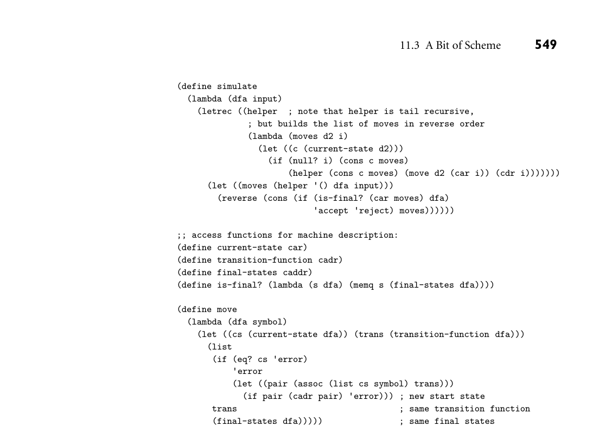

# 11.3 A Bit of Scheme

11.3 A Bit of Scheme 539

Because Lisp was the original functional language, and is still one of the most widely used, several characteristics of Lisp are commonly, though inaccurately, described as though they pertained to functional programming in general. We will examine these characteristics (in the context of Scheme) in Section 11.3. They include

Homogeneity of programs and data: A program in Lisp is itself a list, and can be manipulated with the same mechanisms used to manipulate data. Self-definition: The operational semantics of Lisp can be defined elegantly in terms of an interpreter written in Lisp. Interaction with the user through a “read-eval-print” loop.

Many programmers—probably most—who have written significant amounts of software in both imperative and functional styles find the latter more aestheti- cally appealing. Moreover, experience with a variety of large commercial projects (see the Bibliographic Notes at the end of the chapter) suggests that the absence of side effects makes functional programs significantly easier to write, debug, and maintain than their imperative counterparts. When passed a given set of argu- ments, a pure function can always be counted on to return the same results. Is- sues of undocumented side effects, misordered updates, and dangling or (in most cases) uninitialized references simply don’t occur. At the same time, many imple- mentations of functional languages still fall short in terms of portability, richness of library packages, interfaces to other languages, and debugging and profiling tools. We will return to the tradeoffs between functional and imperative pro- gramming in Section 11.8. 11.3 A Bit of Scheme

Scheme was originally developed by Guy Steele and Gerald Sussman in the late 1970s, and has evolved through several revisions. The description here follows the 1998 R5RS (fifth revised standard), and should also be compliant with the 2013 R7RS. Most Scheme implementations employ an interpreter that runs a “read-eval- print” loop. The interpreter repeatedly reads an expression from standard input (generally typed by the user), evaluates that expression, and prints the resulting value. If the user types EXAMPLE 11.1

The read-eval-print loop (+ 3 4)

the interpreter will print

7

If the user types

540 Chapter 11 Functional Languages

7

the interpreter will also print

7

(The number 7 is already fully evaluated.) To save the programmer the need to type an entire program verbatim at the keyboard, most Scheme implementations provide a load function that reads (and evaluates) input from a file:

(load "my_Scheme_program") ■

As we noted in Section 6.1, Scheme (like all Lisp dialects) uses Cambridge Polish notation for expressions. Parentheses indicate a function application (or in some cases the use of a macro). The first expression inside the left parenthesis indicates the function; the remaining expressions are its arguments. Suppose the user types EXAMPLE 11.2

Significance of parentheses ((+ 3 4))

When it sees the inner set of parentheses, the interpreter will call the function +, passing 3 and 4 as arguments. Because of the outer set of parentheses, it will then attempt to call 7 as a zero-argument function—a run-time error:

eval: 7 is not a procedure

Unlike the situation in almost all other programming languages, extra parenthe- ses change the semantics of Lisp/Scheme programs:

(+ 3 4) =⇒7 ((+ 3 4)) =⇒error

Here the =⇒means “evaluates to.” This symbol is not a part of the syntax of Scheme itself. ■ One can prevent the Scheme interpreter from evaluating a parenthesized ex- EXAMPLE 11.3

Quoting pression by quoting it:

(quote (+ 3 4)) =⇒(+ 3 4)

Here the result is a three-element list. More commonly, quoting is specified with a special shorthand notation consisting of a leading single quote mark:

'(+ 3 4) =⇒(+ 3 4) ■

Though every expression has a type in Scheme, that type is generally not de- termined until run time. Most predefined functions check dynamically to make EXAMPLE 11.4

Dynamic typing sure that their arguments are of appropriate types. The expression

11.3 A Bit of Scheme 541

(if (> a 0) (+ 2 3) (+ 2 "foo"))

will evaluate to 5 if a is positive, but will produce a run-time type clash error if a is negative or zero. More significantly, as noted in Section 7.1.2, functions that make sense for arguments of multiple types are implicitly polymorphic:

(define min (lambda (a b) (if (< a b) a b)))

The expression (min 123 456) will evaluate to 123; (min 3.14159 2.71828) will evaluate to 2.71828. ■ User-defined functions can implement their own type checks using predefined EXAMPLE 11.5

Type predicates type predicate functions:

(boolean? x) ; is x a Boolean? (char? x) ; is x a character? (string? x) ; is x a string? (symbol? x) ; is x a symbol? (number? x) ; is x a number? (pair? x) ; is x a (not necessarily proper) pair? (list? x) ; is x a (proper) list?

(This is not an exhaustive list.) ■ A symbol in Scheme is comparable to what other languages call an identifier. The lexical rules for identifiers vary among Scheme implementations, but are in general much looser than they are in other languages. In particular, identifiers are EXAMPLE 11.6

Liberal syntax for symbols permitted to contain a wide variety of punctuation marks:

(symbol? 'x$_%:&=*!) =⇒#t

The symbol #t representsthe Boolean value true. False is represented by #f. Note the use here of quote (‚); the symbol begins with x. ■ To create a function in Scheme one evaluates a lambda expression:3 EXAMPLE 11.7

lambda expressions (lambda (x) (* x x)) =⇒function

The first “argument” to lambda is a list of formal parameters for the function (in this case the single parameter x). The remaining “arguments” (again just one in this case) constitute the body of the function. As we shall see in Sec- tion 11.5, Scheme differentiates between functions and so-called special forms

3 A word of caution for readers familiar with Common Lisp: A lambda expression in Scheme eval- uates to a function. A lambda expression in Common Lisp is a function (or, more accurately, is automatically coerced to be a function, without evaluation). The distinction becomes important whenever lambda expressions are passed as parameters or returned from functions: they must be quoted in Common Lisp (with function or #’) to prevent evaluation. Common Lisp also dis- tinguishes between a symbol’s value and its meaning as a function; Scheme does not: if a symbol represents a function, then the function is the symbol’s value.

542 Chapter 11 Functional Languages

(lambda among them), which resemble functions but have special evaluation rules. Strictly speaking, only functions have arguments, but we will also use the term informally to refer to the subexpressions that look like arguments in a special form. ■ A lambda expression does not give its function a name; this can be done using let or define (to be introduced in the next subsection). In this sense, a lambda expression is like the aggregates that we used in Section 7.1.3 to specify array or record values. When a function is called, the language implementation restores the referenc- EXAMPLE 11.8

Function evaluation ing environment that was in effect when the lambda expression was evaluated (like all languages with static scope and first-class, nested subroutines, Scheme employs deep binding). It then augments this environment with bindings for the formal parameters and evaluates the expressions of the function body in order. The value of the last such expression (most often there is only one) becomes the value returned by the function:

((lambda (x) (* x x)) 3) =⇒9 ■

Simple conditional expressions can be written using if: EXAMPLE 11.9

if expressions (if (< 2 3) 4 5) =⇒4 (if #f 2 3) =⇒3

In general, Scheme expressions are evaluated in applicative order, as described in Section 6.6.2. Special forms such as lambda and if are exceptions to this rule. The implementation of if checks to see whether the first argument evaluates to #t. If so, it returns the value of the second argument, without evaluating the third argument. Otherwise it returns the value of the third argument, without evaluat- ing the second. We will return to the issue of evaluation order in Section 11.5. ■

11.3.1 Bindings

Names can be bound to values by introducing a nested scope: EXAMPLE 11.10

Nested scopes with let (let ((a 3) (b 4) (square (lambda (x) (* x x))) (plus +)) (sqrt (plus (square a) (square b)))) =⇒5.0

The special form let takes two or more arguments. The first of these is a list of pairs. In each pair, the first element is a name and the second is the value that the name is to represent within the remaining arguments to let. Remaining arguments are then evaluated in order; the value of the construct as a whole is the value of the final argument. The scope of the bindings produced by let is let’s second argument only:

11.3 A Bit of Scheme 543

(let ((a 3)) (let ((a 4) (b a)) (+ a b))) =⇒7

Here b takes the value of the outer a. The way in which names become visible “all at once” at the end of the declaration list precludes the definition of recursive functions. For these one employs letrec:

(letrec ((fact (lambda (n) (if (= n 1) 1 (* n (fact (- n 1))))))) (fact 5)) =⇒120

There is also a let* construct in which names become visible “one at a time” so that later ones can make use of earlier ones, but not vice versa. ■ As noted in Section 3.3, Scheme is statically scoped. (Common Lisp is also statically scoped. Most other Lisp dialects are dynamically scoped.) While let EXAMPLE 11.11

Global bindings with define and letrec allow the user to create nested scopes, they do not affect the meaning of global names (names known at the outermost level of the Scheme interpreter). For these Scheme provides a special form called define that has the side effect of creating a global binding for a name:

(define hypot (lambda (a b) (sqrt (+ (* a a) (* b b))))) (hypot 3 4) =⇒5 ■

11.3.2 Lists and Numbers

Like all Lisp dialects, Scheme provides a wealth of functions to manipulate lists. We saw many of these in Section 8.6; we do not repeat them all here. The three EXAMPLE 11.12

Basic list operations most important are car, which returns the head of a list, cdr (“coulder”), which returns the rest of the list (everything after the head), and cons, which joins a head to the rest of a list:

(car '(2 3 4)) =⇒2 (cdr '(2 3 4)) =⇒(3 4) (cons 2 '(3 4)) =⇒(2 3 4)

Also useful is the null? predicate, which determines whether its argument is the empty list. Recall that the notation ‚(2 3 4) indicates a proper list, in which the final element is the empty list:

(cdr '(2)) =⇒() (cons 2 3) =⇒(2 . 3) ; an improper list ■

544 Chapter 11 Functional Languages

For fast access to arbitrary elements of a sequence, Scheme provides a vector type that is indexed by integers, like an array, and may have elements of hetero- geneous types, like a record. Interested readers are referred to the Scheme man- ual [SDF+07] for further information. Scheme also provides a wealth of numeric and logical (Boolean) functions and special forms. The language manual describes a hierarchy of five numeric types: integer, rational, real, complex, and number. The last two levels are op- tional: implementations may choose not to provide any numbers that are not real. Most but not all implementations employ arbitrary-precision representations of both integers and rationals, with the latter stored internally as (numerator, de- nominator) pairs.

11.3.3 Equality Testing and Searching

Scheme provides several different equality-testing functions. For numerical com- parisons, = performs type conversions where necessary (e.g., to compare an in- teger and a floating-point number). For general-purpose use, eqv? performs a shallow comparison, while equal? performs a deep (recursive) comparison, us- ing eqv? at the leaves. The eq? function also performs a shallow comparison, and may be cheaper than eqv? in certain circumstances (in particular, eq? is not required to detect the equality of discrete values stored in different locations, though it may in some implementations). Further details were presented in Sec- tion 7.4. To search for elements in lists, Scheme provides two sets of functions, each of which has variants corresponding to the three general-purpose equality predi- cates. The functions memq, memv, and member take an element and a list as argu- EXAMPLE 11.13

List search functions ment, and return the longest suffix of the list (if any) beginning with the element:

(memq 'z '(x y z w)) =⇒(z w) (memv '(z) '(x y (z) w)) =⇒#f ; (eqv? '(z) '(z)) =⇒#f (member '(z) '(x y (z) w)) =⇒((z) w) ; (equal? '(z) '(z)) =⇒#t

The memq, memv, and member functions perform their comparisons using eq?, eqv?, and equal?, respectively. They return #f if the desired element is not found. It turns out that Scheme’s conditional expressions (e.g., if) treat anything other than #f as true.4 One therefore often sees expressions of the form

(if (memq desired-element list-that-might-contain-it) ... ■

4 One of the more confusing differences between Scheme and Common Lisp is that Common Lisp uses the empty list () for false, while most implementations of Scheme (including all that conform to the version 5 standard) treat it as true.

11.3 A Bit of Scheme 545

The functions assq, assv, and assoc search for values in association lists (oth- EXAMPLE 11.14

Searching association lists erwise known as A-lists). A-lists were introduced in Section C 3.4.2 in the context of name lookup for languages with dynamic scoping. An A-list is a dictionary implemented as a list of pairs.5 The first element of each pair is a key of some sort; the second element is information corresponding to that key. Assq, assv, and assoc take a key and an A-list as argument, and return the first pair in the list, if there is one, whose first element is eq?, eqv?, or equal?, respectively, to the key. If there is no matching pair, #f is returned. ■

11.3.4 Control Flow and Assignment

We have already seen the special form if. It has a cousin named cond that EXAMPLE 11.15

Multiway conditional expressions resembles a more general if... elsif... else:

(cond ((< 3 2) 1) ((< 4 3) 2) (else 3)) =⇒3

The arguments to cond are pairs. They are considered in order from first to last. The value of the overall expression is the value of the second element of the first pair in which the first element evaluates to #t. If none of the first elements eval- uates to #t, then the overall value is #f. The symbol else is permitted only as the first element of the last pair of the construct, where it serves as syntactic sugar for #t. ■ Recursion, of course, is the principal means of doing things repeatedly in Scheme. Many issues related to recursion were discussed in Section 6.6; we do not repeat that discussion here. For programmers who wish to make use of side effects, Scheme provides as- signment, sequencing, and iteration constructs. Assignment employs the special EXAMPLE 11.16

Assignment form set! and the functions set-car! and set-cdr!:

(let ((x 2) ; initialize x to 2 (l '(a b))) ; initialize l to (a b) (set! x 3) ; assign x the value 3 (set-car! l '(c d)) ; assign head of l the value (c d) (set-cdr! l '(e)) ; assign rest of l the value (e) ... x =⇒3 ... l =⇒((c d) e)

The return values of the various varieties of set! are implementation-depen- dent. ■ Sequencing uses the special form begin: EXAMPLE 11.17

Sequencing

5 For clarity, the figures in Section C 3.4.2 elided the internal structure of the pairs.

546 Chapter 11 Functional Languages

(begin (display "hi ") (display "mom"))

Here we have used begin to sequence display expressions, which cause the in- terpreter to print their arguments. ■ Iteration uses the special form do and the function for-each: EXAMPLE 11.18

Iteration (define iter-fib (lambda (n) ; print the first n+1 Fibonacci numbers (do ((i 0 (+ i 1)) ; initially 0, inc'ed in each iteration (a 0 b) ; initially 0, set to b in each iteration (b 1 (+ a b))) ; initially 1, set to sum of a and b ((= i n) b) ; termination test and final value (display b) ; body of loop (display " ")))) ; body of loop

(for-each (lambda (a b) (display (* a b)) (newline)) '(2 4 6) '(3 5 7))

The first argument to do is a list of triples, each of which specifies a new variable, an initial value for that variable, and an expression to be evaluated and placed in a fresh instance of the variable at the end of each iteration. The second argument to do is a pair that specifies the termination condition and the expression to be returned. At the end of each iteration all new values of loop variables (e.g., a and b) are computed using the current values. Only after all new values are computed are the new variable instances created. The function for-each takes as argument a function and a sequence of lists. There must be as many lists as the function takes arguments, and the lists must

DESIGN & IMPLEMENTATION

11.1 Iteration in functional programs It is important to distinguish between iteration as a notation for repeated ex- ecution and iteration as a means of orchestrating side effects. One can in fact define iteration as syntactic sugar for tail recursion, and Val, Sisal, and pH do precisely that (with special syntax to facilitate the passing of values from one iteration to the next). Such a notation may still be entirely side-effect free, that is, entirely functional. In Scheme, assignment and I/O are the truly imperative features. We think of iteration as imperative because most Scheme programs that use it have assignments or I/O in their loops.

11.3 A Bit of Scheme 547

all be of the same length. For-each calls its function argument repeatedly, pass- ing successive sets of arguments from the lists. In the example shown here, the unnamed function produced by the lambda expression will be called on the ar- guments 2 and 3, 4 and 5, and 6 and 7. The interpreter will print

6 20 42 ()

The last line is the return value of for-each, assumed here to be the empty list. The language definition allows this value to be implementation-dependent; the construct is executed for its side effects. ■ Two other control-flow constructs have been mentioned in previous chap- ters. Delay and force (Section 6.6.2) permit the lazy evaluation of expressions. Call-with-current-continuation (call/cc; Section 6.2.2) allows the cur- rent program counter and referencing environment to be saved in the form of a closure, and passed to a specified subroutine. We will mention delay and force again in Section 11.5.

11.3.5 Programs as Lists

As should be clear by now, a program in Scheme takes the form of a list. In technical terms, we say that Lisp and Scheme are homoiconic—self-representing. A parenthesized string of symbols (in which parentheses are balanced) is called an S-expression regardless of whether we think of it as a program or as a list. In fact, an unevaluated program is a list, and can be constructed, deconstructed, and otherwise manipulated with all the usual list functions. Just as quote can be used to inhibit the evaluation of a list that appears as an EXAMPLE 11.19

Evaluating data as code argument in a function call, Scheme provides an eval function that can be used to evaluate a list that has been created as a data structure:

(define compose (lambda (f g) (lambda (x) (f (g x))))) ((compose car cdr) '(1 2 3)) =⇒2

(define compose2 (lambda (f g) (eval (list 'lambda '(x) (list f (list g 'x))) (scheme-report-environment 5)))) ((compose2 car cdr) '(1 2 3)) =⇒2

In the first of these declarations, compose takes as arguments a pair of functions f and g. It returns as result a function that takes as parameter a value x, applies

548 Chapter 11 Functional Languages

g to it, then applies f, and finally returns the result. In the second declaration, compose2 performs the same function, but in a different way. The function list returns a list consisting of its (evaluated) arguments. In the body of compose2, this list is the unevaluated expression (lambda (x) (f (g x))). When passed to eval, this list evaluates to the desired function. The second argument of eval specifies the referencing environment in which the expression is to be evaluated. In our example we have specified the environment defined by the Scheme ver- sion 5 report [KCR+98]. ■ The original description of Lisp [MAE+65] included a self-definition of the language: code for a Lisp interpreter, written in Lisp. Though Scheme differs in many ways from this early Lisp (most notably in its use of lexical scoping), such a metacircular interpreter can still be written easily [AS96, Chap. 4]. The code is based on the functions eval and apply. The first of these we have just seen. The second, apply, takes two arguments: a function and a list. It achieves the effect of calling the function, with the elements of the list as arguments.

11.3.6 Extended Example: DFA Simulation in Scheme

To conclude our introduction to Scheme, we present a complete program to sim- EXAMPLE 11.20

Simulating a DFA in Scheme ulate the execution of a DFA (deterministic finite automaton). The code appears in Figure 11.1. Finite automata details can be found in Sections 2.2 and C 2.4.1. Here we represent a DFA as a list of three items: the start state, the transition function, and a list of final states. The transition function in turn is represented by a list of pairs. The first element of each pair is another pair, whose first element is a state and whose second element is an input symbol. If the current state and next input symbol match the first element of a pair, then the finite automaton enters the state given by the second element of the pair. To make this concrete, consider the DFA of Figure 11.2. It accepts all strings of zeros and ones in which each digit appears an even number of times. To simulate this machine, we pass it to the function simulate along with an input string. As it runs, the automaton accumulates as a list a trace of the states through which it has traveled. Once the input is exhausted, it adds accept or reject. For example, if we type

(simulate zero-one-even-dfa ; machine description '(0 1 1 0 1)) ; input string

then the Scheme interpreter will print

(q0 q2 q3 q2 q0 q1 reject)

If we change the input string to 010010, the interpreter will print

(q0 q2 q3 q1 q3 q2 q0 accept) ■

*Figure 11.1 Scheme program to simulate the actions of a DFA. Given a machine description and an input symbol i, function move searches for a transition labeled i from the start state to some new state s. It then returns a new machine with the same transition function and final states, but with s as its “start” state. The main function, simulate, encapsulates a tail-recursive helper function that accumulates an inverted list of moves, returning when it has consumed all input symbols. The wrapper then checks to see if the helper ended in a final state; it returns the (properly ordered) series of moves, with accept or reject at the end. The functions cadr and caddr are defined as (lambda (x) (car (cdr x))) and (lambda (x) (car (cdr (cdr x)))), respectively. Scheme provides a large collection of such abbreviations.*

11.3 A Bit of Scheme 549

(define simulate (lambda (dfa input) (letrec ((helper ; note that helper is tail recursive, ; but builds the list of moves in reverse order (lambda (moves d2 i) (let ((c (current-state d2))) (if (null? i) (cons c moves) (helper (cons c moves) (move d2 (car i)) (cdr i))))))) (let ((moves (helper '() dfa input))) (reverse (cons (if (is-final? (car moves) dfa) 'accept 'reject) moves))))))

;; access functions for machine description: (define current-state car) (define transition-function cadr) (define final-states caddr) (define is-final? (lambda (s dfa) (memq s (final-states dfa))))

(define move (lambda (dfa symbol) (let ((cs (current-state dfa)) (trans (transition-function dfa))) (list (if (eq? cs 'error) 'error (let ((pair (assoc (list cs symbol) trans))) (if pair (cadr pair) 'error))) ; new start state trans ; same transition function (final-states dfa))))) ; same final states

3CHECK YOUR UNDERSTANDING 1. What mathematical formalism underlies functional programming?

2. List several distinguishing characteristics of functional programming lan- guages.

3. Briefly describe the behavior of the Lisp/Scheme read-eval-print loop. 4. What is a first-class value?

