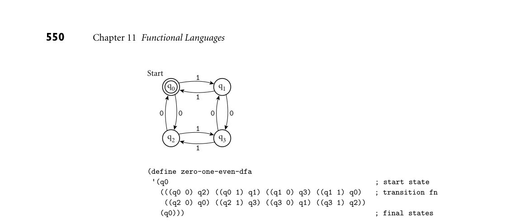
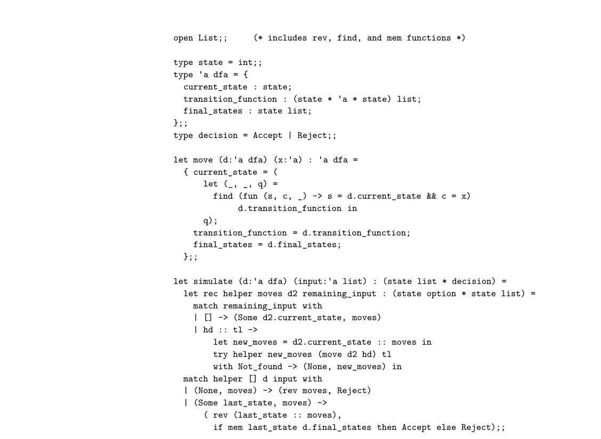

# 11.4 A Bit of OCaml

*Figure 11.2 DFA to accept all strings of zeros and ones containing an even number of each. At the bottom of the figure is a representation of the machine as a Scheme data structure, using the conventions of Figure 11.1.*

550 Chapter 11 Functional Languages

Start q1

1

q0

1

0 0 0 0

1

q2

1 q3

(define zero-one-even-dfa '(q0 ; start state (((q0 0) q2) ((q0 1) q1) ((q1 0) q3) ((q1 1) q0) ; transition fn ((q2 0) q0) ((q2 1) q3) ((q3 0) q1) ((q3 1) q2)) (q0))) ; final states

5. Explain the difference between let, let*, and letrec in Scheme. 6. Explain the difference between eq?, eqv?, and equal?.

7. Describe three ways in which Scheme programs can depart from a purely functional programming model. 8. What is an association list? 9. What does it mean for a language to be homoiconic?

10. What is an S-expression? 11. Outline the behavior of eval and apply.

11.4 A Bit of OCaml

Like Lisp, ML has a complicated family tree. The original language was devised in the early 1970s by Robin Milner and others at Cambridge University. SML (“Standard” ML) and OCaml (Objective Caml) are the two most widely used di- alects today. Haskell, the most widely used language for functional programming research, is a separate descendant of ML (by way of Miranda). F#, developed by Microsoft and others, is a descendant of OCaml. Work on OCaml (and its predecessor, Caml) has been led since the early 1980s by researchers at INRIA, the French national computing research organization (the ‘O’ was added to the name with the introduction of object-oriented features

11.4 A Bit of OCaml 551

in the early 1990s). Among the ML family languages, OCaml is known for the efficiency of the INRIA implementation and for its widespread commercial adop- tion: among other domains, OCaml is popular in the finance industry. The INRIA OCaml distribution includes both a byte-code compiler (with ac- companying virtual machine) and an optimizing native-code compiler for a va- riety of machine architectures. The interpreter can be used either interactively or to execute a previously written program. The easiest way to learn the language is to experiment with the interpreter interactively. The examples in the remainder of this section all work in that environment. The interpreter repeatedly reads an expression from standard input, evaluates that expression, and prints the resulting value. If the user types EXAMPLE 11.21

Interacting with the interpreter 3 + 4;;

the interpreter will print

- : int = 7

Double semicolons are used to indicate the end of a “top-level form”—an expres- sion in the outermost scope. The output indicates that the user’s expression (-) was an integer of value 7. If the user types

7;;

the interpreter will also print

- : int = 7

(The number 7 is already fully evaluated.) Rather than type preexisting code into the interpreter directly, the programmer can instruct the interpreter to load it from a file:

#use "mycode.ml";;

The initial hash sign indicates that this is a directive to the interpreter, rather than an expression to be evaluated. ■ To invoke a function, one types the function name followed by its argu- EXAMPLE 11.22

Function call syntax ment(s):

cos 0.0;; =⇒1.0 min 3 4;; =⇒3

552 Chapter 11 Functional Languages

Here cos expects a single real-number argument; min expects two arguments of the same type, which must support comparison for ordering. As in our coverage of Scheme, we use =⇒as shorthand to indicate the result of evaluation. Note the absence of parentheses in function calls! Invocation is indicated sim- ply by juxtaposition. An expression such as foo (3, 4) does not apply foo to the two arguments 3 and 4, but rather to the tuple (3, 4). (A tuple is essen- tially a record whose elements are positional rather than named; more on this in Section 11.4.3.) ■ If we type in the name cos all by itself EXAMPLE 11.23

Function values cos;;

OCaml informs us that our expression is a function from floats to floats:

- : float -> float = <fun>

If we ask about (+) (which we must enclose in parentheses to avoid a syntax error), we learn that it is a function that maps two integers to a third:

- : int -> int -> int = <fun>

If we ask about min, we learn that it is polymorphic:

- : 'a -> 'a -> 'a = <fun>

As explained in Section 7.2.4, the ‚a is a type parameter; it indicates that the argument and result types of min can be arbitrary, so long as they are the same (of course, since min uses < internally, we will suffer a run-time exception if ‚a is a function type). ■ The lack of parentheses in function calls does raise the question: how do we EXAMPLE 11.24

unit type distinguish a simple named value from a call to a zero-argument function? The answer is to insist that such functions take a dummy, placeholder argument, indi- cated by empty parentheses. A call to a function with no (useful) arguments then looks much like a call to a zero-argument function in C:

let c_three = 3;; let f_three () = 3;;

Here c_three is a constant of type int; f_three is a function of type unit -> int. The former can be used in any context that expects an integer; the latter returns an integer when called with a unit argument:

c_three;; =⇒3 f_three ();; =⇒3 ■

11.4 A Bit of OCaml 553

Lexical conventions in OCaml are straightforward: Identifiers are composed of upper- and lower-case letters, digits, underscores, and single quote marks; most are required to start with a lower-case letter or underscore (a few special kinds of names, including type constructors, variants, modules, and exceptions, must start with an upper-case letter). Comments are delimited with (* ... *), and are permitted to nest. Floating-point numbers are required to contain a decimal point: the expression cos 0 will generate a type-clash error message. Built-in types include Boolean values, integers, floating-point numbers, char- acters, and strings. Values of more complex types can be created using a vari- ety of type constructors, including lists, arrays, tuples, records, variants, objects, and classes; several of these are described in Section 11.4.3. As discussed in Sec- tion 7.2.4, type checking is performed by inferring a type for every expression, and then checking that whenever two expressions need to be of the same type (e.g., be- cause one is an argument and the other is the corresponding formal parameter), the inferences turn out to be the same. To support type inference, some operators that are overloaded in other languages are separate in OCaml. In particular, the usual arithmetic operations have both integer (+, -, *, /) and floating-point (+., -., *., /.) versions.

11.4.1 Equality and Ordering

Like most functional languages, OCaml uses a reference model for names. When comparing two expressions, either or both of which may simply be a name, there are two different notions of equality. The so-called “physical” comparators, == EXAMPLE 11.25

“Physical” and “structural” comparison and !=, perform what we called a “shallow” comparison in Section 7.4: they determine if the expressions refer to the same object, in the broad sense of the word. The so-called “structural” comparators, = and <>, perform what we called a “deep” comparison: they determine if the objects to which the expressions refer have the same internal structure or behavior. Thus the following expressions all evaluate to true:

physical (shallow) structural (deep)

2 == 2 2 = 2 "foo" != "foo" "foo" = "foo" [1; 2; 3] != [1; 2; 3] [1; 2; 3] = [1; 1+1; 5-2]

In the first line, there is (conceptually) only one 2 in the world, so references to it are both physically and structurally equivalent. In the second line, two charac- ter strings with the same constituent characters are structurally but not physically equivalent. In the third line, two lists are physically different even if they look syntactically the same; they are structurally equivalent if their corresponding el- ements are structurally equivalent. Significantly, expressions whose values are functions can be compared for physical (shallow) equality, but cause a run-time exception if compared for structural equality (equivalent behavior for functions

554 Chapter 11 Functional Languages

is an undecidable problem). Structural comparison of cyclic structures can result in an infinite loop. ■ Comparison for ordering (<, >, <=, >=) is always based on deep comparison. It is defined in OCaml on all types other than functions. It does what one would normally expect on arithmetic types, characters, and strings (the latter works lex- icographically); on other types the results are deterministic but not necessarily intuitive. In all cases, the results are consistent with the structural equality test (=): if a = b, then a <= b and a >= b; if a <> b, then a < b or a > b. As with the equality tests, comparison of functions will cause a run-time exception; comparison of cyclic structures may not terminate.

11.4.2 Bindings and Lambda Expressions

New names in OCaml are introduced with let. An outermost (top-level) let EXAMPLE 11.26

Outermost declarations introduces a name that is visible throughout the remainder of its file or module:

let average = fun x y -> (x +. y) /. 2.;;

Here fun introduces a lambda expression. The names preceding the right ar- row (->) are parameters; the expression following the arrow is the body of the function—the value it will return. To make programs a bit more readable, given the ubiquity of function declarations, OCaml provides the following somewhat simpler syntactic sugar:

DESIGN & IMPLEMENTATION

11.2 Equality and ordering in SML and Haskell Unlike OCaml, SML provides a single equality operator: a built-in polymor- phic function defined on some but not all types. Equality tests are deep for expressions of immutable types and shallow for those of mutable types. Tests on unsupported (e.g., function) types produce a compile-time error message rather than a run-time exception. The ordering comparisons, by contrast, are defined as overloaded names for a collection of built-in functions, each of which works on a different type. As noted in Example 3.28 and Sidebar 7.7, Haskell unifies and extends the handling of equality and comparisons with a concept known as type classes.The equality operators (= and <>), for example, are declared (but not defined) in a predefined class Eq; any value that is passed to one of these operators will be inferred to be of some type in class Eq. Any value that is passed to one of the ordering operators (<, <=, >=, >) will similarly be inferred to be of some type in class Ord. This latter class is defined to be an extension of Eq; every type in class Ord must support the operators of class Eq as well. There is a strong analogy between type classes and the interfaces of languages with mix- in inheritance (Section 10.5).

11.4 A Bit of OCaml 555

let average x y = (x +. y) /. 2.;;

In either version of the function declaration, x and y will be inferred to be floats, because they are added with the floating-point +. operator. The programmer can document this explicitly if desired:

let average: float -> float -> float = fun x y -> (x +. y) /. 2.;;

or

let average (x:float) (y:float) :float = (x +. y) /. 2.;; ■

Nested scopes are created with the let...in... construct. To compute the EXAMPLE 11.27

Nested declarations area of a triangle given the lengths of its sides, we might use the following function based on Heron’s formula:

let triangle_area a b c = let s = (a +. b +. c) /. 2.0 in sqrt (s *. (s-.a) *. (s-.b) *. (s-.c));;

Here s is local to the expression following the in. It will be neither visible outside the triangle_area function nor in the body of its own definition (the expression between the inner = and the in). ■ In the case of recursion, of course, we do need a function to be visible within EXAMPLE 11.28

its declaration:

A recursive nested function (reprise of Example 7.38)

let fib n = let rec fib_helper f1 f2 i = if i = n then f2 else fib_helper f2 (f1 + f2) (i + 1) in fib_helper 0 1 0;;

Here fib_helper is visible not only within the body of fib, but also within its own body. ■

11.4.3 Type Constructors

Lists

Programmers make heavy use of lists in most functional languages, and OCaml is no exception. Lists are naturally recursive, and lend themselves to manipula- tion with recursive functions. In scripting languages and dialects of Lisp, all of which are dynamically typed, lists can be heterogeneous—a single list may con- tain values of multiple, arbitrary types. In ML and its descendants, which perform EXAMPLE 11.29

Polymorphic list operators all checking at compile time, lists must be homogeneous—all elements must have the same type. At the same time, functions that manipulate lists without perform- ing operations on their members can take any kind of list as argument—they are naturally polymorphic:

556 Chapter 11 Functional Languages

let rec append l1 l2 = if l1 = [] then l2 else hd l1 :: append (tl l1) l2;;

let rec member x l = if l = [] then false else if x = hd l then true else member x (tl l);;

Here append is of type ‚a list -> ‚a list -> ‚a list; member is of type ‚a -> ‚a list -> bool. Empty brackets ([]) represent the empty list. The built-in :: constructor is analogous to cons in Lisp: it takes an element and a list and tacks the former onto the beginning of the latter; its type is ‚a -> ‚a list -> ‚a list. The hd and tl functions are analogous to car and cdr in Lisp: they return the head and the remainder, respectively, of a list created by ::. They are exported—together with many other useful routines (including append)—by the standard List library. (As it turns out, use of hd and tl is generally considered bad form in OCaml. Because they work only on nonempty lists, both functions must check their argument at run time and be prepared to throw an exception. OCaml’s pattern matching mechanism, which we will examine in Section 11.4.4, allows the checking to be performed at compile time, and almost always provides a better way to write the code.) ■ Lists in OCaml are immutable: once created, their content never changes. List EXAMPLE 11.30

List notation aggregates are most often written using “square bracket” notation, with semi- colons separating the internal elements. The expression [a; b; c] is the same as a :: b :: c :: []. Note that if a, b, and c are all of the same type (call it ‚t), the expression a :: b :: c will still generate a type-clash error message: the right-hand operand of the second :: needs to be of type ‚t list, not just ‚t. The built-in at-sign constructor, @, behaves like an infix version of append. The expression [a; b; c] @ [d; e; f; g] is the same as append [a; b; c] [d; e; f; g]; it evaluates to [a; b; c; d; e; f; g]. Since OCaml lists are homogeneous, one might wonder about the type of []. To make it to be compatible with any list, it is given type ‚a list. ■

Arrays and Strings

While lists have a natural recursive definition and dynamically variable length, their immutability and linear-time access cost (for an arbitrary element) make them less than ideal for many applications. OCaml therefore provides a more conventional array type. The length of an array is fixed at elaboration time (i.e., when its declaration is encountered at run time), but its elements can be accessed in constant time, and their values can be changed by imperative code. Array aggregates look much like lists, but with vertical bars immediately inside EXAMPLE 11.31

Array notation the square brackets:

let five_primes = [| 2; 3; 5; 7; 11 |];;

11.4 A Bit of OCaml 557

Array indexing always starts at zero. Elements are accessed using the .() opera- tor:

five_primes.(2);; =⇒5

Unlike lists, arrays are mutable. Updates are made with the left-arrow assign- ment operator:

five_primes.(2) <- 4;; =⇒() five_primes.(2);; =⇒4

Note that the assignment itself returns the unit value; it is evaluated for its side effect. ■ Strings are essentially arrays of characters. They are delimited with double EXAMPLE 11.32

Strings as character arrays quotes, and indexed with the .[] operator:

let greeting = "hi, mom!";; greeting.[7];; =⇒'!'

As of OCaml 4.02, strings are immutable by default, but there is a related bytes type that supports updates:

let enquiry = Bytes.of_string greeting;; Bytes.set enquiry 7 '?';; =⇒() enquiry;; =⇒"hi, mom?"

■

Tuples and Records

Tuples, which we mentioned briefly in Example 11.22, are immutable, heteroge- neous, but fixed-size collections of values of simpler types. Tuple aggregates are written by separating the component values with commas and surrounding them with parentheses. In a chemical database, the element Mercury might be repre- EXAMPLE 11.33

Tuple notation sented by the tuple ("Hg", 80, 200.592), representing the element’s chemical symbol, atomic number, and standard atomic weight. This tuple is said to be of type string * int * float; the stars, suggestive of multiplication, reflect the fact that tuple values are drawn from the Cartesian product of the string, int, and float domains. Components of tuples are typically extracted via pattern matching (Sec- tion 11.4.4). In two-element tuples (often referred to as pairs), the components can also be obtained using the built-in polymorphic functions fst and snd:

fst ("Hg", 80);; =⇒"Hg" snd ("Hg", 80);; =⇒80 ■

Records are much like tuples, but the component values (fields) are named, rather than positional. The language implementation must choose an order for the internal representation of a record, but this order is not visible to the pro- grammer. To introduce field names to the compiler, each record type must be EXAMPLE 11.34

Record notation declared:

558 Chapter 11 Functional Languages

type element = {name: string; atomic_number: int; atomic_weight: float};;

Record aggregates are enclosed in braces, with the fields (in any order) separated by semicolons:

let mercury = {atomic_number = 80; name = "Hg"; atomic_weight = 200.592};;

Individual fields of a record are easily accessed by name, using familiar “dot” notation:

mercury.atomic_weight;; =⇒200.592 ■

At the programmer’s discretion, fields can be declared to be mutable: EXAMPLE 11.35

Mutable fields type sale_item = {name: string; mutable price: float};;

Like elements of an array, mutable fields can then be changed with the left-arrow operator:

let my_item = {name = "bike"; price = 699.95};; my_item.price;; =⇒699.95 my_item.price <- 800.00;; =⇒() my_item;; =⇒{name = "bike"; price = 800.} ■

As a convenience, the OCaml standard library defines a polymorphic ref type EXAMPLE 11.36

References that is essentially a record with a single mutable field. The exclamation-point operator ! is used to retrieve the object referred to by the reference; := is used for assignment:

let x = ref 3;; !x;; =⇒3 x := !x + 1;; =⇒() !x;; =⇒4 ■

Variant Types

Variant types, like records, must be declared, but instead of introducing a set of named fields, each of which is present in every value of the type, the declaration introduces a set of named constructors (variants), one of which will be present in each value of the type. In the simplest case, the constructors are all simply names, EXAMPLE 11.37

Variants as enumerations and the type is essentially an enumeration:

type weekday = Sun | Mon | Tue | Wed | Thu | Fri | Sat;;

Note that constructor names must begin with a capital letter. ■ In more complicated examples, a constructor may specify a type for its variant. The overall type is then essentially a union: EXAMPLE 11.38

Variants as unions

11.4 A Bit of OCaml 559

type yearday = YMD of int * int * int | YD of int * int;;

This code defines YMD as a constructor that takes a three-integer tuple as argu- ment, and YD as a constructor that takes a two-integer tuple as argument. The intent is to allow days of the year to be specified either as (year, month, day) triples or as (year, day) pairs, where the second element of the pair may range from 1 to 366. In 2015 (a non–leap year), the Fourth of July could be represented either as YMD (2015, 7, 4) or as YD (2015, 185), though the equality test YMD (2015, 7, 4) = YD (2015, 185) would fail. (We could, if desired, define a special equality operator for such constructed values—see Exercise 11.16.) ■ Variant types are particularly useful for recursive structures, where different variants represent the base and inductive parts of a definition. The canonical EXAMPLE 11.39

Recursive variants example is a binary tree:

type 'a tree = Empty | Node of 'a * 'a tree * 'a tree;;

Given this definition, the tree

R

X

Y

W Z

can be written Node (‚R‚, Node (‚X‚, Empty, Empty), Node (‚Y‚, Node (‚Z‚, Empty, Empty), Node (‚W‚, Empty, Empty))). ■

11.4.4 Pattern Matching

Pattern matching, particularly for strings, appears in many programming lan- guages. Examples include Snobol, Icon, Perl, and the several other scripting lan- guages that have adopted Perl’s facilities (discussed in Section 14.4.2). ML is dis- tinctive in extending pattern matching to the full range of constructed values— including tuples, lists, records, and variants—and integrating it with static typing and type inference. A simple example in OCaml occurs when passing parameters. Suppose, for EXAMPLE 11.40

Pattern matching of parameters example, that we need a function to extract the atomic number from an element represented as a tuple:

let atomic_number (s, n, w) = n;; let mercury = ("Hg", 80, 200.592);; atomic_number mercury;; =⇒80

560 Chapter 11 Functional Languages

Here mercury, the argument to atomic_number, has been matched against the (single, tuple) parameter in the function definition, giving us names for its vari- ous fields, one of which we simply return. Since the other two fields are unused in the body of the function, we don’t really have to give them names: the “wild card” (_) pattern can be used instead:

let atomic_number (_, n, _) = n;; ■

Pattern matching also works when declaring local names: EXAMPLE 11.41

Pattern matching in local declarations let atomic_number e = let (_, n, _) = e in n;; ■

In both versions of the atomic_number function, pattern matching allows us to associate names with the components of some larger constructed value. The real power of pattern matching, however, arises not in such simple cases, but in cases where the structure of the value to be matched may not be known until run time. Consider for example a function to return an in-order list of the nodes of a EXAMPLE 11.42

The match construct binary tree:

type 'a tree = Empty | Node of 'a * 'a tree * 'a tree;;

let rec inorder t = match t with | Empty -> [] | Node (v, left, right) -> inorder left @ [v] @ inorder right;;

DESIGN & IMPLEMENTATION

11.3 Type Equivalence in OCaml Because of their use of type inference, ML-family languages generally provide the effect of structural type equivalence. Variants can be used to obtain the effect of name equivalence when desired:

type celsius_temp = CT of int;; type fahrenheit_temp = FT of int;;

A value of type celsius_temp can then be obtained by using the CT construc- tor:

let freezing = CT(0);;

Unfortunately, celsius_temp does not automatically inherit the arithmetic operators and relations of int: the expression CT(0) + CT(20) will generate a type clash error message. Moreover, with the exception of the built-in compar- ison operators (<, >, <=, >=), there is no provision for overloading in OCaml: we can define cplus and fplus functions, but we cannot overload + itself.

11.4 A Bit of OCaml 561

The match construct compares a candidate expression (here t) with each of a series of patterns (here Empty and Node (v, left, right)). Each pattern is preceded by a vertical bar and separated by an arrow from an accompanying ex- pression. The value of the overall construct is the value of the accompanying expression for the first pattern that matches the candidate expression. When ap- plied to the tree of Example 11.39, our inorder function yields [‚X‚; ‚R‚; ‚Z‚; ‚Y‚; ‚W‚]. ■ In some cases, it can be helpful to guard a pattern with a Boolean expression. Suppose, for example, that we are looking for the value associated with a given EXAMPLE 11.43

Guards key in a list of key-value pairs:

let rec find key l = match l with | [] -> raise Not_found | (k, v) :: rest when k = key -> v | head :: rest -> find key rest;;

let squares = [(1,1); (2,4); (3,9); (4,16); (5,25)];;

Given these definitions, find 3 squares will return the value 9; find 6 squares will raise a Not_found exception. Note that the patterns in a match are consid- ered in program order: in our find function, we only use the third alternative when the guard in the second one fails. ■ When desired, a pattern can provide names at multiple levels of granularity. Consider, for example, the representation of a line segment as a pair of pairs indi- EXAMPLE 11.44

The as keyword cating the coordinates of the endpoints. Given a segment s, we can name both the (two-component) points and the individual coordinates using the as keyword:

let (((x1, y1) as p1), ((x2, y2) as p2)) = s;;

If s = ((1, 2), (3, 4)), then after this declaration, we have x1 = 1, y1 = 2, x2 = 3, y2 = 4, p1 = (1, 2), and p2 = (3, 4). ■ One use case for match is sufficiently common to warrant its own syntactic sugar. An example can be seen in our inorder function, whose body consists EXAMPLE 11.45

The function keyword of a match on the function’s (single) parameter. The special function keyword eliminates the need to name the parameter explicitly:

let rec inorder = function | Empty -> [] | Node (v, left, right) -> inorder left @ [v] @ inorder right;; ■

In many cases, an OCaml implementation can tell at compile time that a pat- tern match will succeed: it knows all necessary information about the structure of the value being matched against the pattern. In other cases, the implementation can tell that a match is doomed to fail, generally because the types of the pattern and the value cannot be unified. The more interesting cases are those in which the

562 Chapter 11 Functional Languages

pattern and the value have the same type (i.e., could be unified), but the success of the match cannot be determined until run time. If l is of type int list, for EXAMPLE 11.46

Run-time pattern matching example, then an attempt to “deconstruct” l into its head and tail may or may not succeed, depending on l’s value:

let head :: rest = l in ...

If l is [], the attempted match will raise a Match_failure exception. ■ By default, the OCaml compiler will issue a compile-time warning for any pat- tern match whose options are not exhaustive—i.e., whose structure does not in- clude all the possibilities inherent in the type of the candidate expression, and whose execution might therefore lead to a run-time exception. The compiler will also issue a warning if the pattern in a later arm of a multi-way match is com- pletely covered by one in an earlier arm (implying that the latter will never be chosen). A completely covered arm is probably an error, but harmless, in the sense that it will never result in a dynamic semantic error. Nonexhaustive cases may be intentional, if the programmer can predict that the pattern will always work at run time. The append function of Example 11.29 could have been written EXAMPLE 11.47

Coverage of patterns let rec append l1 l2 = if l1 = [] then l2 else let h::t = l1 in h :: append t l2;;

This version of the code is likely to elicit a warning: the compiler will fail to re- alize that the let construct in the else clause will be elaborated only if l1 is nonempty. (This example looks easy enough to figure out, but the general case is undecidable, and there is little point in providing special code to recognize easy cases.) Probably the best way to write the code is to use a two-way match instead of the if... then ... else:

let rec append l1 l2 = match l1 with | [] -> l2 | h::t -> h :: append t l2;;

Unlike either of the previous versions, this allows the compiler to verify that the matching is exhaustive. ■ In imperative languages, subroutines that need to produce more than one value often do so via modification of reference or result parameters. Functional languages, which need to avoid such side effects, must instead arrange to return multiple values from a function. In OCaml, these are easily composed into, and extracted from, a tuple. Consider, for example, a statistics routine that returns EXAMPLE 11.48

the mean and standard deviation of the values in a list:

Pattern matching against a tuple returned from a function

11.4 A Bit of OCaml 563

let stats l = let rec helper rest n sum sum_squares = match rest with | [] -> let nf = float_of_int n in (sum /. nf, sqrt (sum_squares /. nf)) | h :: t -> helper t (n+1) (sum+.h) (sum_squares +. (h*.h)) in helper l 0 0.0 0.0;;

To obtain the statistics for a given list, we can pattern match against the value returned from function stats:

let (mean, sd) = stats [1.; 2.; 3.; 4.; 5.];;

To which the interpreter responds

val mean : float = 3. val sd : float = 3.3166247903554 ■

11.4.5 Control Flow and Side Effects

We have seen several examples of if expressions in previous sections. Because it must yield a value, almost every if expression has both a then part and an else part. The only exception is when the then part has unit type, and is executed EXAMPLE 11.49

An if without an else for its side effect:

if a < 0 then print_string "negative"

Here the print_string call evaluates to (), as does, by convention, the implicit missing else clause; the overall expression thus has unit type. ■ I/O is a common form of side effect. OCaml provides standard library routines to read and print a variety of built-in types. It also supports formatted output in the style of C’s printf. While tail recursion and higher-order functions are strongly preferred when expressing repeated execution, iterative loops are also available. Perhaps their EXAMPLE 11.50

Insertion sort in OCaml most common application is to update arrays in place:

let insertion_sort a = (* sort array a without making a copy *) for i = 1 to Array.length a - 1 do let t = a.(i) in let j = ref i in while !j > 0 && t < a.(!j - 1) do a.(!j) <- a.(!j - 1); j := !j - 1 done; a.(!j) <- t done;;

564 Chapter 11 Functional Languages

Note the use here of both <- assignment for array elements and := assignment for references. (Keep in mind that the exclamation point indicates dereference, not logical negation.) Note also the use of semicolons to separate the assignments inside the while loop, and again to separate the while loop from the assignment to a.(!j). The for and while loops both evaluate to (), as do both <- and := assignments. ■ We have noted in previous sections that many routines in the OCaml standard library will raise exceptions in certain circumstances. We raised one ourselves in Example 11.43. A simple exception is declared as follows: EXAMPLE 11.51

A simple exception exception Not_found;; ■

In more complex cases, an exception can take arguments: EXAMPLE 11.52

An exception with arguments exception Bad_arg of float * string;;

This latter exception might be raised by a hypothetical trigonometry library:

let arc_cos x = if x < -1. || x > 1. then raise (Bad_arg (x, "in arc_cos")) else acos x;;

The predefined acos function simply returns a “not-a-number” value (NaN— Section C 5.2.2) when its argument has a magnitude larger than 1. ■ Exceptions are caught in a with clause of a try expression: EXAMPLE 11.53

Catching an exception let special_meals = [("Tim Smith", "vegan"); ("Fatima Hussain", "halal")];;

let meal_type p = try find p special_meals with Not_found -> "default";;

meal_type "Tim Smith";; =⇒"vegan" meal_type "Peng Chen";; =⇒"default"

An exception with an argument is only slightly more complicated:

open Printf;; (* formatted I/O library *) let c = try arc_cos v with Bad_arg (arg, loc) -> (eprintf "Bad argument %f %s\n" arg loc; 0.0);;

Note that the expression after the arrow must have the same type as the expression between the try and with. Here we have printed an error message and then (after the semicolon) provided a value of 0. ■

11.4 A Bit of OCaml 565

11.4.6 Extended Example: DFA Simulation in OCaml

To conclude our introduction to OCaml, we reprise the DFA simulation pro- EXAMPLE 11.54

Simulating a DFA in OCaml gram originally presented in Scheme in Example 11.20. The code appears in Fig- ure 11.3. Finite automata details can be found in Sections 2.2 and C 2.4.1. Here we represent a DFA as a record with three fields: the start state, the transition function, and a list of final states. To represent the transition function we use a list of triples. The first two elements of each triple are a state and an input symbol. If these match the current state and next input symbol, then the finite automaton enters the state given by the third element of the triple. To make all this concrete, consider the DFA of Figure 11.4. It accepts all strings of as and bs in which each letter appears an even number of times. To simulate this machine, we pass it to the function simulate along with an input string. As it runs, the automaton accumulates as a list a trace of the states through which it has traveled. Once the input is exhausted, it packages the trace together in a tuple with either Accept or Reject. For example, if we type

simulate a_b_even_dfa ['a'; 'b'; 'b'; 'a'; 'b'];;

then the OCaml interpreter will print

- : state list * decision = ([0; 2; 3; 2; 0; 1], Reject)

If we change the input string to abaaba, the interpreter will print

- : state list * decision = ([0; 2; 3; 1; 3; 2; 0], Accept) ■

3CHECK YOUR UNDERSTANDING 12. Why does OCaml provide separate arithmetic operators for integer and floating-point values?

13. Explain the difference between physical and structural equality of values in OCaml.

14. How do lists in OCaml differ from those of Lisp and Scheme? 15. Identify the values that OCaml treats as mutable.

16. List three contexts in which OCaml performs pattern matching. 17. Explain the difference between tuples and records in OCaml. How does an OCaml record differ from a record (structure) in languages like C or Pascal? 18. What are OCaml variants? What features do they subsume from imperative languages such as C and Pascal?

*Figure 11.3 OCaml program to simulate the actions of a DFA. Given a machine description and an input symbol i, function move searches for a transition labeled i from the start state to some new state s. If the search fails, find raises exception Not_found, which propagates out of move; otherwise move returns a new machine with the same transition function and final states, but with s as its “start” state. Note that the code is polymorphic in the type of the input symbols. The main function, simulate, encapsulates a tail-recursive helper function that accumulates an inverted list of moves, returning when it has consumed all input symbols. The encapsulating function then checks to see if the helper ended in a final state; it returns the (properly ordered) series of moves, together with an Accept or Reject indication. The built-in option constructor (Example 7.6) is used to distinguish between a real state (Some s) and an error state (None).*

566 Chapter 11 Functional Languages

open List;; (* includes rev, find, and mem functions *)

type state = int;; type 'a dfa = { current_state : state; transition_function : (state * 'a * state) list; final_states : state list; };; type decision = Accept | Reject;;

let move (d:'a dfa) (x:'a) : 'a dfa = { current_state = ( let (_, _, q) = find (fun (s, c, _) -> s = d.current_state && c = x) d.transition_function in q); transition_function = d.transition_function; final_states = d.final_states; };;

let simulate (d:'a dfa) (input:'a list) : (state list * decision) = let rec helper moves d2 remaining_input : (state option * state list) = match remaining_input with | [] -> (Some d2.current_state, moves) | hd :: tl -> let new_moves = d2.current_state :: moves in try helper new_moves (move d2 hd) tl with Not_found -> (None, new_moves) in match helper [] d input with | (None, moves) -> (rev moves, Reject) | (Some last_state, moves) -> ( rev (last_state :: moves), if mem last_state d.final_states then Accept else Reject);;

