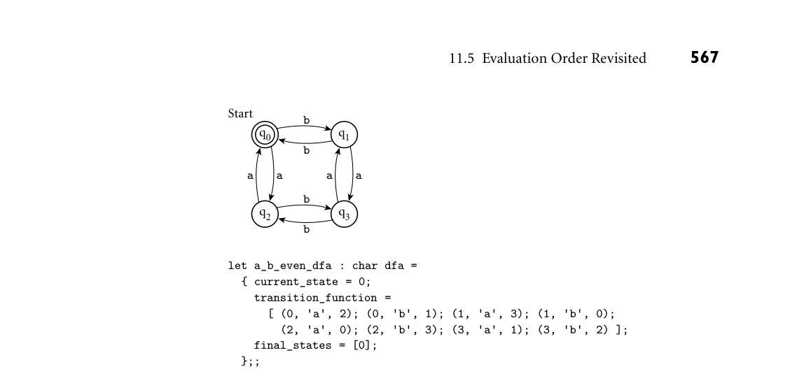

# 11.5 Evaluation Order Revisited

*Figure 11.4 DFA to accept all strings of as and bs containing an even number of each. At the bottom of the figure is a representation of the machine as an OCaml data structure, using the conventions of Figure 11.3. 11.5 Evaluation Order Revisited*

In Section 6.6.2 we observed that the subcomponents of many expressions can be evaluated in more than one order. In particular, one can choose to evaluate function arguments before passing them to a function, or to pass them unevalu- ated. The former option is called applicative-order evaluation; the latter is called normal-order evaluation. Like most imperative languages, Scheme and OCaml use applicative order in most cases. Normal order, which arises in the macros and call-by-name parameters of imperative languages, is available in special cases. Suppose, for example, that we have defined the following function in Scheme: EXAMPLE 11.55

Applicative and normal-order evaluation (define double (lambda (x) (+ x x)))

Evaluating the expression (double (* 3 4)) in applicative order (as Scheme does), we have

(double (* 3 4)) =⇒(double 12) =⇒(+ 12 12) =⇒24

Under normal-order evaluation we would have

(double (* 3 4)) =⇒(+ (* 3 4) (* 3 4)) =⇒(+ 12 (* 3 4)) =⇒(+ 12 12) =⇒24

Here we end up doing extra work: normal order causes us to evaluate (* 3 4) twice. ■ In other cases, applicative-order evaluation can end up doing extra work. Sup- EXAMPLE 11.56

Normal-order avoidance of unnecessary work pose we have defined the following:

(define switch (lambda (x a b c) (cond ((< x 0) a) ((= x 0) b) ((> x 0) c))))

Evaluating the expression (switch -1 (+ 1 2) (+ 2 3) (+ 3 4)) in applicative order, we have

(switch -1 (+ 1 2) (+ 2 3) (+ 3 4)) =⇒(switch -1 3 (+ 2 3) (+ 3 4)) =⇒(switch -1 3 5 (+ 3 4)) =⇒(switch -1 3 5 7) =⇒(cond ((< -1 0) 3) ((= -1 0) 5) ((> -1 0) 7)) =⇒(cond (#t 3) ((= -1 0) 5) ((> -1 0) 7)) =⇒3

(Here we have assumed that cond is built in, and evaluates its arguments lazily, even though switch is doing so eagerly.) Under normal-order evaluation we would have

(switch -1 (+ 1 2) (+ 2 3) (+ 3 4)) =⇒(cond ((< -1 0) (+ 1 2)) ((= -1 0) (+ 2 3)) ((> -1 0) (+ 3 4))) =⇒(cond (#t (+ 1 2)) ((= -1 0) (+ 2 3)) ((> -1 0) (+ 3 4))) =⇒(+ 1 2) =⇒3

Here normal-order evaluation avoids evaluating (+ 2 3) or (+ 3 4). (In this case, we have assumed that arithmetic and logical functions such as + and < are built in, and force the evaluation of their arguments.) ■

In our overview of Scheme we differentiated on several occasions between spe- cial forms and functions. Arguments to functions are always passed by sharing (Section 9.3.1), and are evaluated before they are passed (i.e., in applicative or- der). Arguments to special forms are passed unevaluated—in other words, by name. Each special form is free to choose internally when (and if) to evaluate its parameters. Cond, for example, takes a sequence of unevaluated pairs as argu- ments. It evaluates their cars internally, one at a time, stopping when it finds one that evaluates to #t. Together, special forms and functions are known as expression types in Scheme. Some expression types are primitive, in the sense that they must be built into the language implementation. Others are derived; they can be defined in terms of primitive expression types. In an eval/apply-based interpreter, primitive spe- cial forms are built into eval; primitive functions are recognized by apply. We have seen how the special form lambda can be used to create derived functions, which can be bound to names with let. Scheme provides an analogous special form, syntax-rules, that can be used to create derived special forms. These can then be bound to names with define-syntax and let-syntax. Derived spe- cial forms are known as macros in Scheme, but unlike most other macros, they are hygienic—lexically scoped, integrated into the language’s semantics, and im- mune from the problems of mistaken grouping and variable capture described in Section 3.7. Like C++ templates (Section C 7.3.2), Scheme macros are Tur- ing complete. They behave like functions whose arguments are passed by name (Section C 9.3.2) instead of by sharing. They are implemented, however, via log- ical expansion in the interpreter’s parser and semantic analyzer, rather than by delayed evaluation with thunks.

11.5.1 Strictness and Lazy Evaluation

Evaluation order can have an effect not only on execution speed but also on pro- gram correctness. A program that encounters a dynamic semantic error or an infinite regression in an “unneeded” subexpression under applicative-order eval- uation may terminate successfully under normal-order evaluation. A (side-effect- free) function is said to be strict if it is undefined (fails to terminate, or encounters an error) when any of its arguments is undefined. Such a function can safely eval- uate all its arguments, so its result will not depend on evaluation order. A function is said to be nonstrict if it does not impose this requirement—that is, if it is some- times defined even when one of its arguments is not. A language is said to be strict if it is defined in such a way that functions are always strict. A language is said to be nonstrict if it permits the definition of nonstrict functions. If a language always evaluates expressions in applicative order, then every function is guaranteed to be strict, because whenever an argument is undefined, its evaluation will fail and so will the function to which it is being passed. Contrapositively, a nonstrict lan- guage cannot use applicative order; it must use normal order to avoid evaluating unneeded arguments. Standard ML, OCaml, and (with the exception of macros) Scheme are strict. Miranda and Haskell are nonstrict.

Lazy evaluation, implemented automatically, gives us the advantage of normal- order evaluation (not evaluating unneeded subexpressions) while running within a constant factor of the speed of applicative-order evaluation for expressions in which everything is needed. The trick is to tag every argument internally with a “memo” that indicates its value, if known. Any attempt to evaluate the argu- ment sets the value in the memo as a side effect, or returns the value (without recalculating it) if it is already set. Returning to the expression of Example 11.55, (double (* 3 4)) will be com- EXAMPLE 11.57

Avoiding work with lazy evaluation piled in a lazy system as (double (f)), where f is a hidden closure with an in- ternal side effect:

(define f (lambda () (let ((done #f) ; memo initially unset (memo '()) (code (lambda () (* 3 4)))) (if done memo ; if memo is set, return it (begin (set! memo (code)) ; remember value (set! done #t) ; note that we set it memo))))) ; and return it ... (double (f)) =⇒(+ (f) (f)) =⇒(+ 12 (f)) ; first call computes value =⇒(+ 12 12) ; second call returns remembered value =⇒24

Here (* 3 4) will be evaluated only once. While the cost of manipulating memos will clearly be higher than that of the extra multiplication in this case, if we were to replace (* 3 4) with a very expensive operation, the savings could be substan- tial. ■ Lazy evaluation is particularly useful for “infinite” data structures, as described in Section 6.6.2. It can also be useful in programs that need to examine only a prefix of a potentially long list (see Exercise 11.10). Lazy evaluation is used for all arguments in Miranda and Haskell. It is available in Scheme through explicit

DESIGN & IMPLEMENTATION

11.4 Lazy evaluation One of the beauties of a purely functional language is that it makes lazy evalua- tion a completely transparent performance optimization: the programmer can think in terms of nonstrict functions and normal-order evaluation, counting on the implementation to avoid the cost of repeated evaluation. For languages with imperative features, however, this characterization does not hold: lazy evaluation is not transparent in the presence of side effects.

use of delay and force,6 and in OCaml through the similar mechanisms of the standard Lazy library. It can also be achieved implicitly in Scheme (in cer- tain contexts) through the use of macros. Where normal-order evaluation can be thought of as function evaluation using call-by-name parameters, lazy evaluation is sometimes said to employ “call by need.” In addition to Miranda and Haskell, call by need can be found in the R scripting language, widely used by statisticians. The principal problem with lazy evaluation is its behavior in the presence of side effects. If an argument contains a reference to a variable that may be modi- fied by an assignment, then the value of the argument will depend on whether it is evaluated before or after the assignment. Likewise, if the argument contains an assignment, values elsewhere in the program may depend on when evaluation oc- curs. These problems do not arise in Miranda or Haskell because they are purely functional: there are no side effects. Scheme and OCaml leave the problem up to the programmer, but require that every use of a delay-ed expression be enclosed in force, making it relatively easy to identify the places where side effects are an issue.

11.5.2 I/O: Streams and Monads

A major source of side effects can be found in traditional I/O: an input routine will generally return a different value every time it is called, and multiple calls to an output routine, though they never return a value, must occur in the proper order if the program is to be considered correct. One way to avoid these side effects is to model input and output as streams— unbounded-length lists whose elements are generated lazily. We saw an example of a stream in the infinite lists of Section 6.6.2 (an OCaml example appears in Exercise 11.18). If we model input and output as streams, then a program takes EXAMPLE 11.58

Stream-based program execution the form

(define output (my_prog input))

When it needs an input value, function my_prog forces evaluation of the car (head) of input, and passes the cdr (tail) on to the rest of the program. To drive execution, the language implementation repeatedly forces evaluation of the car of output, prints it, and repeats:

(define driver (lambda (s) (if (null? s) '() ; nothing left (begin (display (car s)) (driver (cdr s)))))) (driver output) ■

To make things concrete, suppose we want to write a purely functional pro- EXAMPLE 11.59

Interactive I/O with streams gram that prompts the user for a sequence of numbers (one at a time!) and prints their squares. If Scheme employed lazy evaluation of input and output streams (it doesn’t), then we could write:

(define squares (lambda (s) (cons "please enter a number\n" (let ((n (car s))) (if (eof-object? n) '() (cons (* n n) (cons #\newline (squares (cdr s))))))))) (define output (squares input)))

Prompts, inputs, and outputs (i.e., squares) would be interleaved naturally in time. In effect, lazy evaluation would force things to happen in the proper or- der: The car of output is the first prompt. The cadr of output (the head of the tail) is the first square, a value that requires evaluation of the car of input. The caddr of output (the head of the tail of the tail) is the second prompt. The cadddr of output (the head of the tail of the tail of the tail) is the second square, a value that requires evaluation of the cadr of input. ■ Streams formed the basis of the I/O system in early versions of Haskell. Unfor- tunately, while they successfully encapsulate the imperative nature of interaction at a terminal, streams don’t work very well for graphics or random access to files. They also make it difficult to accommodate I/O of different kinds (since all el- ements of a list in Haskell must be of a single type). More recent versions of Haskell employ a more general concept known as monads. Monads are drawn from a branch of mathematics known as category theory, but one doesn’t need to understand the theory to appreciate their usefulness in practice. In Haskell, monads are essentially a clever use of higher-order functions, coupled with a bit of syntactic sugar, that allow the programmer to chain together a sequence of ac- tions (function calls) that have to happen in order. The power of the idea comes from the ability to carry a hidden, structured value of arbitrary complexity from one action to the next. In many applications of monads, this extra hidden value plays the role of mutable state: differences between the values carried to successive actions act as side effects. As a motivating example somewhat simpler than I/O, consider the possibility EXAMPLE 11.60

Pseudorandom numbers in Haskell of creating a pseudorandom number generator (RNG) along the lines of Exam- ple 6.45. In that example we assumed that rand() would modify hidden state as a side effect, allowing it to return a different value every time it is called. This idiom isn’t possible in a pure functional language, but we can obtain a similar ef- fect by passing the state to the function and having it return new state along with the random number. This is exactly how the built-in function random works in Haskell. The following code calls random twice to illustrate its interface.

twoRandomInts :: StdGen -> ([Integer], StdGen) -- type signature: twoRandomInts is a function that takes an -- StdGen (the state of the RNG) and returns a tuple containing -- a list of Integers and a new StdGen. twoRandomInts gen = let (rand1, gen2) = random gen (rand2, gen3) = random gen2 in ([rand1, rand2], gen3)

main = let gen = mkStdGen 123 -- new RNG, seeded with 123 ints = fst (twoRandomInts gen) -- extract first element in print ints -- of returned tuple

Note that gen2, one of the return values from the first call to random, has been passed as an argument to the second call. Then gen3, one of the return values from the second call, is returned to main, where it could, if we wished, be passed to another function. This mechanism works, but it’s far from pretty: copies of the RNG state must be “threaded through” every function that needs a random number. This is particularly complicated for deeply nested functions. It is easy to make a mistake, and difficult to verify that one has not. Monads provide a more general solution to the problem of threading muta- ble state through a functional program. Here is our example rewritten to use Haskell’s standard IO monad, which includes a random number generator:

twoMoreRandomInts :: IO [Integer] -- twoMoreRandomInts returns a list of Integers. It also -- implicitly accepts, and returns, all the state of the IO monad. twoMoreRandomInts = do rand1 <- randomIO rand2 <- randomIO return [rand1, rand2]

main = do moreInts <- twoMoreRandomInts print moreInts

There are several differences here. First, the type of the twoMoreRandomInts function has become IO [Integer]. This identifies it as an IO action—a function that (in addition to returning an explicit list of integers) invisibly accepts and returns the state of the IO monad (including the standard RNG). Similarly, the type of randomIO is IO Integer. To thread the IO state from one action to the next, the bodies of twoMoreRandomInts and main use do notation rather than let. A do block packages a sequence of actions together into a single, compound action. At each step along the way, it passes the (potentially modified) state of the monad from one action to the next. It also supports the “assignment” operator, <-, which separates the explicit return value from the hidden state and opens a

nested scope for its left-hand side, so all values “assigned” earlier in the sequence are visible to actions later in the sequence. The return operator in twoMoreRandomInts packages an explicit return value (in our case, a two-element list) together with the hidden state, to be returned to the caller. A similar use of return presumably appears inside randomIO. Everything we have done is purely functional—do and <- are sim- ply syntactic sugar—but the bookkeeping required to pass the state of the RNG from one invocation of random to the next has been hidden in a way that makes our code look imperative. ■ So what does this have to do with I/O? Consider the getChar function, which EXAMPLE 11.61

The state of the IO monad reads a character from standard input. Like rand, we expect it to return a different value every time we call it. Haskell therefore arranges for getChar to be of type IO Char: it returns a character, but also accepts, and passes on, the hidden state of the monad. In most Haskell monads, hidden state can be explicitly extracted and exam- ined. The IO monad, however, is abstract: only part of its state is defined in li- brary header files; the rest is implemented by the language run-time system. This is unavoidable because, in effect, the hidden state of the IO monad encompasses the real world. If this state were visible, a program could capture and reuse it, with the nonsensical expectation that we could “go back in time” and see what the user would have done in response to a different prompt last Tuesday. Unfortunately, IO state hiding means that a value of type IO T is permanently tainted: it can never be extracted from the monad to produce a “pure T.” ■ Because IO actions are just ordinary values, we can manipulate them in the same way as values of other data types. The most basic output action is putChar, EXAMPLE 11.62

Functional composition of actions of type Char -> IO () (monadic function with an explicit character argument and no explicit return). Given putChar, we can define putStr:

putStr :: String -> IO () putStr s = sequence_ (map putChar s)

Strings in Haskell are simply lists of characters. The map function takes a function f and a list l as argument, and returns a list that contains the results of applying f to the elements of l:

map :: (a->b) -> [a] -> [b] map f [] = [] -- base case map f (h:t) = f h : map f t -- tail recursive case -- ':' is like cons in Scheme

The result of map putChar s is a list of actions, each of which prints a character: it has type [IO ()]. The built-in function sequence_ converts this to a single action that prints a list. It could be defined as follows.

sequence_ :: [IO ()] -> IO () sequence_ [] = return () -- base case sequence_ (a:more) = do a; sequence_ more -- tail recursive case

As before, do provides a convenient way to chain actions together. For brevity, we have written the actions on a single line, separated by a semicolon. ■ The entry point of a Haskell program is always the function main. It has type IO (). Because Haskell is lazy (nonstrict), the action sequence returned by main remains hypothetical until the run-time system forces its evaluation. In practice, Haskell programs tend to have a small top-level structure of IO monad code that sequences I/O operations. The bulk of the program—both the computation of values and the determination of the order in which I/O actions should occur—is then purely functional. For a program whose I/O can be expressed in terms of EXAMPLE 11.63

Streams and the I/O monad streams, the top-level structure may consist of a single line:

main = interact my_program

The library function interact is of type (String -> String) -> IO (). It takes as argument a function from strings to strings (in this case my_program). It calls this function, passing the contents of standard input as argument, and writes the result to standard output. Internally, interact uses the function getContents, which returns the program’s input as a lazily evaluated string: a stream. In a more sophisticated program, main may orchestrate much more complex I/O actions, including graphics and random access to files. ■

DESIGN & IMPLEMENTATION

11.5 Monads Monads are very heavily used in Haskell. The IO monad serves as the central repository for imperative language features—not only I/O and random num- bers but also mutable global variables and shared-memory synchronization. Additional monads (with accessible hidden state) support partial functions and various container classes (lists and sets). When coupled with lazy evalua- tion, monadic containers in turn provide a natural foundation for backtrack- ing search, nondeterminism, and the functional equivalent of iterators. (In the list monad, for example, hidden state can carry the continuation needed to generate the tail of an infinite list.) The inability to extract values from the IO monad reflects the fact that the physical world is imperative, and that a language that needs to interact with the physical world in nontrivial ways must include imperative features. Put another way, the IO monad (unlike monads in general) is more than syntactic sugar: by hiding the state of the physical world it makes it possible to express things that could not otherwise be expressed in a functional way, provided that we are willing to enforce a sequential evaluation order. The beauty of monads is that they confine sequentiality to a relatively small fraction of the typical program, so that side effects cannot interfere with the bulk of the computation.

