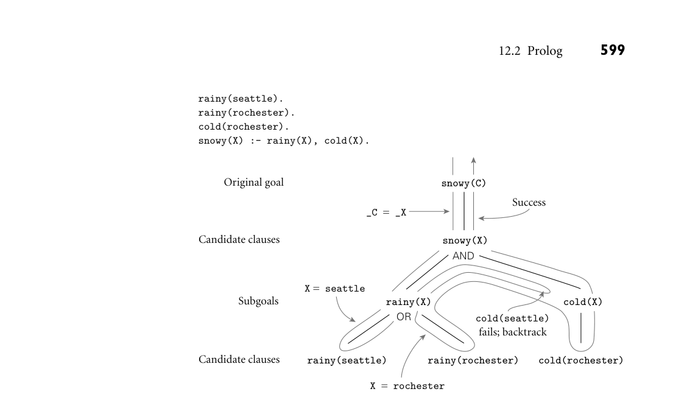
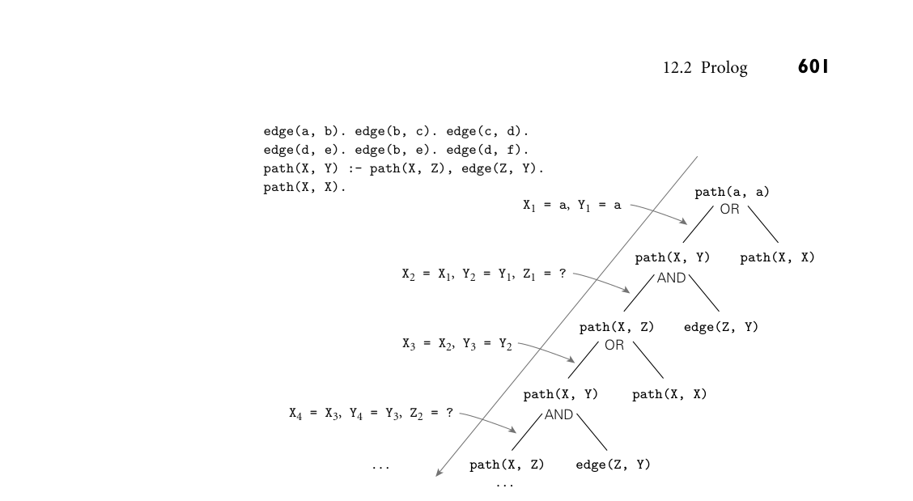
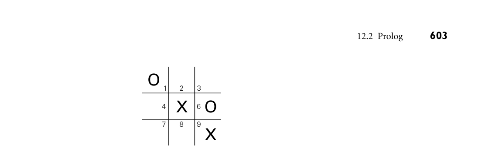
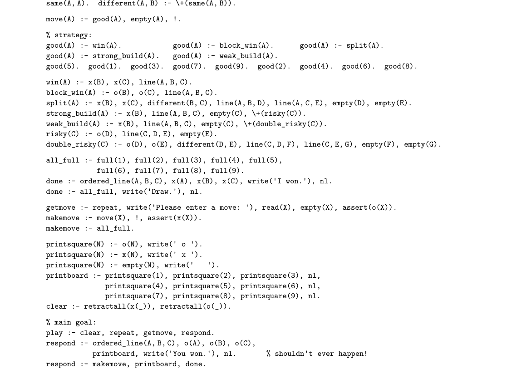

# 12.2 Prolog

12.2 Prolog 593

12.2 Prolog

Much as an imperative or functional language interpreter evaluates expressions in the context of a referencing environment in which various functions and con- stants have been defined, a Prolog interpreter runs in the context of a database of clauses (Horn clauses) that are assumed to be true.3 Each clause is composed of terms, which may be constants, variables, or structures. A constant is either an atom or a number. A structure can be thought of as either a logical predicate or a data structure. Atoms in Prolog are similar to symbols in Lisp. Lexically, an atom looks like EXAMPLE 12.4

Atoms, variables, scope, and type an identifier beginning with a lowercase letter, a sequence of “punctuation” char- acters, or a quoted character string:

foo my_Const + 'Hi, Mom'

Numbers resemble the integers and floating-point constants of other program- ming languages. A variable looks like an identifier beginning with an uppercase letter:

Foo My_var X

Variables can be instantiated to (i.e., can take on) arbitrary values at run time as a result of unification. The scope of every variable is limited to the clause in which it appears. There are no declarations. Type checking is dynamic: it occurs only when a program attempts to use a value as an operand at run time. ■ Structures consist of an atom called the functor and a list of arguments: EXAMPLE 12.5

Structures and predicates rainy(rochester) teaches(scott, cs254) bin_tree(foo, bin_tree(bar, glarch))

Prolog requires the opening parenthesis to come immediately after the functor, with no intervening space. Arguments can be arbitrary terms: constants, vari- ables, or (nested) structures. Internally, a typical Prolog implementation will rep- resent each structure as a tree of Lisp-like cons cells. Conceptually, the program- mer may prefer to think of certain structures (e.g., rainy) as logical predicates. We use the term “predicate” to refer to the combination of a functor and an “ar- ity” (number of arguments). The predicate rainy has arity 1. The predicate teaches has arity 2. ■ The clauses in a Prolog database can be classified as facts or rules, each of which ends with a period. A fact is a Horn clause without a right-hand side. It looks like EXAMPLE 12.6

Facts and rules a single term (the implication symbol is implicit):

3 In fact, for any given program, the database is assumed to characterize everything that is true. As we shall see in Section 12.4.3, this closed world assumption imposes certain limits on the expres- siveness of the language.

594 Chapter 12 Logic Languages

rainy(rochester).

A rule has a right-hand side:

snowy(X) :- rainy(X), cold(X).

The token :- is the implication symbol; the comma indicates “and.” Variables that appear in the head of a Horn clause are universally quantified: for all X, X is snowy if X is rainy and X is cold. ■ It is also possible to write a clause with an empty left-hand side. Such a clause is called a query, or a goal. Queries do not appear in Prolog programs. Rather, one builds a database of facts and rules and then initiates execution by giving the Prolog interpreter (or the compiled Prolog program) a query to be answered (i.e., a goal to be proven). In most implementations of Prolog, queries are entered with a special ?- ver- sion of the implication symbol. If we were to type the following: EXAMPLE 12.7

Queries rainy(seattle). rainy(rochester). ?- rainy(C).

the Prolog interpreter would respond with

C = seattle

Of course, C = rochester would also be a valid answer, but Prolog will find seattle first, because it comes first in the database. (Dependence on ordering is one of the ways in which Prolog departs from pure logic; we discuss this issue further in Section 12.4.) If we want to find all possible solutions, we can ask the interpreter to continue by typing a semicolon:

C = seattle ; C = rochester.

If there had been another possibility, the interpreter would have left off the final period and given us the opportunity to type another semicolon. Given

rainy(seattle). rainy(rochester). cold(rochester). snowy(X) :- rainy(X), cold(X).

the query

?- snowy(C).

will yield only one solution. ■

12.2 Prolog 595

12.2.1 Resolution and Unification

The resolution principle, due to Robinson [Rob65], says that if C1 and C2 are Horn clauses and the head of C1 matches one of the terms in the body of C2, then we can replace the term in C2 with the body of C1. Consider the following example. EXAMPLE 12.8

Resolution in Prolog takes(jane_doe, his201). takes(jane_doe, cs254). takes(ajit_chandra, art302). takes(ajit_chandra, cs254). classmates(X, Y) :- takes(X, Z), takes(Y, Z).

If we let X be jane_doe and Z be cs254, we can replace the first term on the right-hand side of the last clause with the (empty) body of the second clause, yielding the new rule

classmates(jane_doe, Y) :- takes(Y, cs254).

In other words, Y is a classmate of jane_doe if Y takes cs254. ■ Note that the last rule has a variable (Z) on the right-hand side that does not appear in the head. Such variables are existentially quantified: for all X and Y, X and Y are classmates if there exists a class Z that they both take. The pattern-matching process used to associate X with jane_doe and Z with cs254 is known as unification. Variables that are given values as a result of unifi- cation are said to be instantiated. The unification rules for Prolog state that

A constant unifies only with itself. Two structures unify if and only if they have the same functor and the same arity, and the corresponding arguments unify recursively. A variable unifies with anything. If the other thing has a value, then the vari- able is instantiated. If the other thing is an uninstantiated variable, then the two variables are associated in such a way that if either is given a value later, that value will be shared by both.

Unification of structures in Prolog is very much akin to ML’s unification of the EXAMPLE 12.9

Unification in Prolog and ML types of formal and actual parameters. A formal parameter of type int * ‚b list, for example, will unify with an actual parameter of type ‚a * real list in ML by instantiating ‚a to int and ‚b to real. ■ Equality in Prolog is defined in terms of “unifiability.” The goal =(A, B) suc- ceeds if and only if A and B can be unified. For the sake of convenience, the goal may be written as A = B; the infix notation is simply syntactic sugar. In keeping EXAMPLE 12.10

Equality and unification with the rules above, we have

596 Chapter 12 Logic Languages

?- a = a. true. % constant unifies with itself ?- a = b. false. % but not with another constant ?- foo(a, b) = foo(a, b). true. % structures are recursively identical ?- X = a. X = a. % variable unifies with constant ?- foo(a, b) = foo(X, b). X = a. % arguments must unify ■

It is possible for two variables to be unified without instantiating them. If we EXAMPLE 12.11

Unification without instantiation type

?- A = B.

the interpreter will simply respond

A = B.

If, however, we type

?- A = B, A = a, B = Y.

(unifying A and B before binding a to A) the interpreter will linearize the string of unifications and make it clear that all three variables are equal to a:

A = B, B = Y, Y = a.

In a similar vein, suppose we are given the following rules:

takes_lab(S) :- takes(S, C), has_lab(C). has_lab(D) :- meets_in(D, R), is_lab(R).

(S takes a lab class if S takes C and C is a lab class. Moreover D is a lab class if D meets in room R and R is a lab.) An attempt to resolve these rules will unify the head of the second with the second term in the body of the first, causing C and D to be unified, even though neither is instantiated. ■

12.2.2 Lists

Like equality checking, list manipulation is a sufficiently common operation in Prolog to warrant its own notation. The construct [a, b, c] is syntactic sugar EXAMPLE 12.12

List notation in Prolog for the structure .(a, .(b, .(c, []))), where [] is the empty list and . is a built-in cons-like predicate. With minor syntactic differences (parentheses v. brackets; commas v. semicolons), this notation should be familiar to users of ML or Lisp. Prolog adds an extra convenience, however—an optional vertical bar that delimits the “tail” of the list. Using this notation, [a, b, c] could be expressed as [a | [b, c]], [a, b | [c]], or [a, b, c | []]. The vertical-bar notation is particularly handy when the tail of the list is a variable:

12.2 Prolog 597

member(X, [X | _]). member(X, [_ | T]) :- member(X, T).

sorted([]). % empty list is sorted sorted([_]). % singleton is sorted sorted([A, B | T]) :- A =< B, sorted([B | T]). % compound list is sorted if first two elements are in order and % remainder of list (after first element) is sorted

Here =< is a built-in predicate that operates on numbers. The underscore is a placeholder for a variable that is not needed anywhere else in the clause. Note that [a, b | c] is the improper list .(a, .(b, c)). The sequence of tokens [a | b, c] is syntactically invalid. ■ One of the interesting things about Prolog resolution is that it does not in EXAMPLE 12.13

Functions, predicates, and two-way rules general distinguish between “input” and “output” arguments (there are certain exceptions, such as the is predicate described in the following subsection). Thus, given

append([], A, A). append([H | T], A, [H | L]) :- append(T, A, L).

We can type

?- append([a, b, c], [d, e], L). L = [a, b, c, d, e]. ?- append(X, [d, e], [a, b, c, d, e]). X = [a, b, c] ; false. ?- append([a, b, c], Y, [a, b, c, d, e]). Y = [d, e].

This example highlights the difference between functions and Prolog predi- cates. The former have a clear notion of inputs (arguments) and outputs (results); the latter do not. In an imperative or functional language we apply functions to arguments to generate results. In a logic language we search for values for which a predicate is true. (Not all logic languages are equally flexible. Mercury, for exam- ple, requires the programmer to specify in or out modes on arguments. These allow the compiler to generate substantially faster code.) Note that when the in- terpreter prints its response to our second query, it is not yet certain whether additional solutions might exist. Only after we enter a semicolon does it invest the effort to determine that there are none. ■

12.2.3 Arithmetic

The usual arithmetic operators are available in Prolog, but they play the role of predicates, not of functions. Thus +(2, 3), which may also be written 2 + 3, EXAMPLE 12.14

Arithmetic and the is predicate is a two-argument structure, not a function call. In particular, it will not unify with 5:

598 Chapter 12 Logic Languages

?- (2 + 3) = 5. false.

To handle arithmetic, Prolog provides a built-in predicate, is, that unifies its first argument with the arithmetic value of its second argument:

?- is(X, 1+2). X = 3. ?- X is 1+2. X = 3. % infix is also ok ?- 1+2 is 4-1. false. % 1st argument (1+2) is already instantiated ?- X is Y. ERROR % 2nd argument (Y) must already be instantiated ?- Y is 1+2, X is Y. Y = X, X = 3. % Y is instantiated before it is needed ■

12.2.4 Search/Execution Order

So how does Prolog go about answering a query (satisfying a goal)? What it needs is a sequence of resolution steps that will build the goal out of clauses in the database, or a proof that no such sequence exists. In the realm of formal logic, one can imagine two principal search strategies:

Start with existing clauses and work forward, attempting to derive the goal. This strategy is known as forward chaining. Start with the goal and work backward, attempting to “unresolve” it into a set of preexisting clauses. This strategy is known as backward chaining.

If the number of existing rules is very large, but the number of facts is small, it is possible for forward chaining to discover a solution more quickly than backward chaining. In most circumstances, however, backward chaining turns out to be more efficient. Prolog is defined to use backward chaining. Because resolution is associative and commutative (Exercise 12.5), a backward- chaining theorem prover can limit its search to sequences of resolutions in which terms on the right-hand side of a clause are unified with the heads of other clauses one by one in some particular order (e.g., left to right). The resulting search EXAMPLE 12.15

Search tree exploration can be described in terms of a tree of subgoals, as shown in Figure 12.1. The Prolog interpreter (or program) explores this tree depth first, from left to right. It starts at the beginning of the database, searching for a rule R whose head can be unified with the top-level goal. It then considers the terms in the body of R as subgoals, and attempts to satisfy them, recursively, left to right. If at any point a subgoal fails (cannot be satisfied), the interpreter returns to the previous subgoal and attempts to satisfy it in a different way (i.e., to unify it with the head of a different clause). ■

*Figure 12.1 Backtracking search in Prolog. The tree of potential resolutions consists of alter- nating AND and OR levels. An AND level consists of subgoals from the right-hand side of a rule, all of which must be satisfied. An OR level consists of alternative database clauses whose head will unify with the subgoal above; one of these must be satisfied. The notation _C = _X is meant to indicate that while both C and X are uninstantiated, they have been associated with one another in such a way that if either receives a value in the future it will be shared by both.*

12.2 Prolog 599

rainy(seattle). rainy(rochester). cold(rochester). snowy(X) :- rainy(X), cold(X).

snowy(C)

Original goal

Success

_C  =  _X

snowy(X)

Candidate clauses

AND

X =  seattle

rainy(X) cold(X)

Subgoals

cold(seattle) fails; backtrack

OR

rainy(seattle) rainy(rochester) cold(rochester)

Candidate clauses

X  =  rochester

The process of returning to previous goals is known as backtracking. It strongly resembles the control flow of generators in Icon (Section C 6.5.4). Whenever a unification operation is “undone” in order to pursue a different path through the search tree, variables that were given values or associated with one another as a result of that unification are returned to their uninstantiated or unassociated state. In Figure 12.1, for example, the binding of X to seattle is broken when EXAMPLE 12.16

Backtracking and instantiation we backtrack to the rainy(X) subgoal. The effect is similar to the breaking of bindings between actual and formal parameters in an imperative programming language, except that Prolog couches the bindings in terms of unification rather than subroutine calls. ■ Space management for backtracking search in Prolog usually follows the single-stack implementation of iterators described in Section C 9.5.3. The inter- preter pushes a frame onto its stack every time it begins to pursue a new subgoal G. If G fails, the frame is popped from the stack and the interpreter begins to backtrack. If G succeeds, control returns to the “caller” (the parent in the search tree), but G’s frame remains on the stack. Later subgoals will be given space above

600 Chapter 12 Logic Languages

this dormant frame. If subsequent backtracking causes the interpreter to search for alternative ways of satisfying G, control will be able to resume where it last left off. Note that G will not fail unless all of its subgoals (and all of its siblings to the right in the search tree) have also failed, implying that there is nothing above G’s frame in the stack. At the top level of the interpreter, a semicolon typed by the user is treated the same as failure of the most recently satisfied subgoal. The fact that clauses are ordered, and that the interpreter considers them from first to last, means that the results of a Prolog program are deterministic and pre- dictable. In fact, the combination of ordering and depth-first search means that the Prolog programmer must often consider the order to ensure that recursive programs will terminate. Suppose for example that we have a database describing EXAMPLE 12.17

Order of rule evaluation a directed acyclic graph:

edge(a, b). edge(b, c). edge(c, d). edge(d, e). edge(b, e). edge(d, f). path(X, X). path(X, Y) :- edge(Z, Y), path(X, Z).

The last two clauses tell us how to determine whether there is a path from node X to node Y. If we were to reverse the order of the terms on the right-hand side of the final clause, then the Prolog interpreter would search for a node Z that is reachable from X before checking to see whether there is an edge from Z to Y. The program would still work, but it would not be as efficient. ■ Now consider what would happen if in addition we were to reverse the order EXAMPLE 12.18

Infinite regression of the last two clauses:

path(X, Y) :- path(X, Z), edge(Z, Y). path(X, X).

From a logical point of view, our database still defines the same relationships. A Prolog interpreter, however, will no longer be able to find answers. Even a simple query like ?- path(a, a) will never terminate. To see why, consider Figure 12.2. The interpreter first unifies path(a, a) with the left-hand side of path(X, Y) :- path(X, Z), edge(Z, Y). It then considers the goals on the right-hand side, the first of which (path(X, Z)), unifies with the left-hand side of the very same rule, leading to an infinite regression. In effect, the Prolog interpreter gets lost in an infinite branch of the search tree, and never discovers finite branches to the right. We could avoid this problem by exploring the tree in breadth-first order, but that strategy was rejected by Prolog’s designers because of its expense: it can require substantially more space, and does not lend itself to a stack-based imple- mentation. ■

12.2.5 Extended Example: Tic-Tac-Toe

In the previous subsection we saw how the order of clauses in the Prolog database, EXAMPLE 12.19

Tic-tac-toe in Prolog and the order of terms within a right-hand side, can affect both the efficiency of

*Figure 12.2 Infinite regression in Prolog. In this figure even a simple query like ?- path(a, a) will never terminate: the interpreter will never find the trivial branch.*

12.2 Prolog 601

edge(a, b). edge(b, c). edge(c, d). edge(d, e). edge(b, e). edge(d, f). path(X, Y) :- path(X, Z), edge(Z, Y). path(X, X). X1 = a, Y1 = a

path(a, a)

OR

path(X, Y) path(X, X)

X2 = X1, Y2 = Y1, Z1 = ?

AND

path(X, Z) edge(Z, Y)

X3 = X2, Y3 = Y2

OR

path(X, Y) path(X, X)

X4 = X3, Y4 = Y3, Z2 = ?

AND

path(X, Z) edge(Z, Y)

. . . . . .

a Prolog program and its ability to terminate. Ordering also allows the Prolog programmer to indicate that certain resolutions are preferred, and should be con- sidered before other, “fallback” options. Consider, for example, the problem of making a move in tic-tac-toe. (Tic-tac-toe is a game played on a 3 × 3 grid of squares. Two players, X and O, take turns placing markers in empty squares. A player wins if he or she places three markers in a row, horizontally, vertically, or diagonally.) Let us number the squares from 1 to 9 in row-major order. Further, let us use the Prolog fact x(n) to indicate that player X has placed a marker in square n, and o(m) to indicate that player O has placed a marker in square m. For simplicity, let us assume that the computer is player X, and that it is X’s turn to move. We should like to be able to issue a query ?- move(A) that will cause the Prolog interpreter to choose a good square A for the computer to occupy next. Clearly we need to be able to tell whether three given squares lie in a row. One way to express this is:

ordered_line(1, 2, 3). ordered_line(4, 5, 6). ordered_line(7, 8, 9). ordered_line(1, 4, 7). ordered_line(2, 5, 8). ordered_line(3, 6, 9). ordered_line(1, 5, 9). ordered_line(3, 5, 7).

602 Chapter 12 Logic Languages

line(A, B, C) :- ordered_line(A, B, C). line(A, B, C) :- ordered_line(A, C, B). line(A, B, C) :- ordered_line(B, A, C). line(A, B, C) :- ordered_line(B, C, A). line(A, B, C) :- ordered_line(C, A, B). line(A, B, C) :- ordered_line(C, B, A).

It is easy to prove that there is no winning strategy for tic-tac-toe: either player can force a draw. Let us assume, however, that our program is playing against a less-than-perfect opponent. Our task then is never to lose, and to maximize our chances of winning if our opponent makes a mistake. The following rules work well:

move(A) :- good(A), empty(A).

full(A) :- x(A). full(A) :- o(A). empty(A) :- \+(full(A)).

% strategy: good(A) :- win(A). good(A) :- block_win(A). good(A) :- split(A). good(A) :- strong_build(A). good(A) :- weak_build(A).

The initial rule indicates that we can satisfy the goal move(A) by choosing a good, empty square. The \+ is a built-in predicate that succeeds if its argument (a goal) cannot be proven; we discuss it further in Section 12.2.6. Square n is empty if we cannot prove it is full; that is, if neither x(n) nor o(n) is in the database. The key to strategy lies in the ordering of the last five rules. Our first choice is to win:

win(A) :- x(B), x(C), line(A, B, C).

Our second choice is to prevent our opponent from winning:

block_win(A) :- o(B), o(C), line(A, B, C).

Our third choice is to create a “split”—a situation in which our opponent cannot prevent us from winning on the next move (see Figure 12.3):

split(A) :- x(B), x(C), different(B, C), line(A, B, D), line(A, C, E), empty(D), empty(E). same(A, A). different(A, B) :- \+(same(A, B)).

*Figure 12.3 A “split” in tac-tac-toe. If X takes the bottom center square (square 8), no future move by O will be able to stop X from winning the game—O cannot block both the 2–5–8 line and the 7–8–9 line.*

12.2 Prolog 603

2 3 O

1

X O

4 6

7 8 9

X

Here we have again relied on the built-in predicate \+. Our fourth choice is to build toward three in a row (i.e., to get two in a row) in such a way that the obvious blocking move won’t allow our opponent to build toward three in a row:

strong_build(A) :- x(B), line(A, B, C), empty(C), \+(risky(C)). risky(C) :- o(D), line(C, D, E), empty(E).

Barring that, our fifth choice is to build toward three in a row in such a way that the obvious blocking move won’t give our opponent a split:

weak_build(A) :- x(B), line(A, B, C), empty(C), \+(double_risky(C)). double_risky(C) :- o(D), o(E), different(D, E), line(C, D, F), line(C, E, G), empty(F), empty(G).

If none of these goals can be satisfied, our final, default choice is to pick an un- occupied square, giving priority to the center, the corners, and the sides in that order:

good(5). good(1). good(3). good(7). good(9). good(2). good(4). good(6). good(8). ■

3CHECK YOUR UNDERSTANDING 1. What mathematical formalism underlies logic programming?

2. What is a Horn clause? 3. Briefly describe the process of resolution in logic programming.

4. What is a unification? Why is it important in logic programming? 5. What are clauses, terms, and structures in Prolog? What are facts, rules, and queries?

604 Chapter 12 Logic Languages

6. Explain how Prolog differs from imperative languages in its handling of arith- metic. 7. Describe the difference between forward chaining and backward chaining. Which is used in Prolog by default? 8. Describe the Prolog search strategy. Discuss backtracking and the instantiation of variables.

12.2.6 Imperative Control Flow

We have seen that the ordering of clauses and of terms in Prolog is significant, with ramifications for efficiency, termination, and choice among alternatives. In addition to simple ordering, Prolog provides the programmer with severalexplicit control-flow features. The most important of these features is known as the cut. The cut is a zero-argument predicate written as an exclamation point: !. As a subgoal it always succeeds, but with a crucial side effect: it commits the interpreter to whatever choices have been made since unifying the parent goal with the left- hand side of the current rule, including the choice of that unification itself. For EXAMPLE 12.20

The cut example, recall our definition of list membership:

member(X, [X | _]). member(X, [_ | T]) :- member(X, T).

If a given atom a appears in list L n times, then the goal ?- member(a, L) can succeed n times. These “extra” successes may not always be appropriate. They can lead to wasted computation, particularly for long lists, when member is followed by a goal that may fail:

prime_candidate(X) :- member(X, Candidates), prime(X).

Suppose that prime(X) is expensive to compute. To determine whether a is a prime candidate, we first check to see whether it is a member of the Candidates list, and then check to see whether it is prime. If prime(a) fails, Prolog will backtrack and attempt to satisfy member(a, Candidates) again. If a is in the Candidates list more than once, then the subgoal will succeed again, leading to reconsideration of the prime(a) subgoal, even though that subgoal is doomed to fail. We can save substantial time by cutting off all further searches for a after the first is found:

member(X, [X | _]) :- !. member(X, [_ | T]) :- member(X, T).

12.2 Prolog 605

The cut on the right-hand side of the first rule says that if X is the head of L, we should not attempt to unify member(X, L) with the left-hand side of the second rule; the cut commits us to the first rule. ■ An alternative way to ensure that member(X, L) succeeds no more than once EXAMPLE 12.21

\+ and its implementation is to embed a use of \+ in the second clause:

member(X, [X | _]). member(X, [H | T]) :- X \= H, member(X, T).

Here X \= H means X and H will not unify; that is, \+(X = H). (In some Prolog dialects, \+ is written not. This name suggests an interpretation that may be somewhat misleading; we discuss the issue in Section 12.4.3.) Our new version of member will display the same high-level behavior as before, but will be slightly less efficient: now the interpreter will actually consider the second rule, abandoning it only after (re)unifying X with H and reversing the sense of the test. It turns out that \+ is actually implemented by a combination of the cut and two other built-in predicates, call and fail:

\+(P) :- call(P), !, fail. \+(P).

The call predicate takes a term as argument and attempts to satisfy it as a goal (terms are first-class values in Prolog). The fail predicate always fails. ■ In principle, it is possible to replace all uses of the cut with uses of \+ —to confine the cut to the implementation of \+. Doing so often makes a program easier to read. As we have seen, however, it often makes it less efficient. In some cases, explicit use of the cut may actually make a program easier to read. Consider EXAMPLE 12.22

Pruning unwanted answers with the cut our tic-tac-toe example. If we type semicolons at the program, it will continue to generate a series of increasingly poor moves from the same board position, even though we only want the first move. We can cut off consideration of the others by using the cut:

move(A) :- good(A), empty(A), !.

To achieve the same effect with \+ we would have to do more major surgery (Exercise 12.8). ■ In general, the cut can be used whenever we want the effect of if... then ... EXAMPLE 12.23

Using the cut for selection else:

statement :- condition, !, then_part. statement :- else_part. ■

The fail predicate can be used in conjunction with a “generator” to implement EXAMPLE 12.24

Looping with fail a loop. We have already seen (in Example 12.13) how to effect a generator by driving a set of rules “backward.” Recall our definition of append:

606 Chapter 12 Logic Languages

append([], A, A). append([H | T], A, [H | L]) :- append(T, A, L).

If we use write append(A, B, L), where L is instantiated but A and B are not, the interpreter will find an A and B for which the predicate is true. If backtracking forces it to return, the interpreter will look for another A and B; append will generate pairs on demand. (There is a strong analogy here to the generators of Icon, discussed in Section C 6.5.4.) Thus, to enumerate the ways in which a list can be partitioned into pairs, we can follow a use of append with fail:

print_partitions(L) :- append(A, B, L), write(A), write(' '), write(B), nl, fail.

The nl predicate prints a newline character. The query print_partitions([a, b, c]) produces the following output:

[] [a, b, c] [a] [b, c] [a, b] [c] [a, b, c] [] false.

If we don’t want the overall predicate to fail, we can add a final rule:

print_partitions(_).

Assuming this rule appears last, it will succeed after the output has appeared, and the interpreter will finish with “true.” ■ In some cases, we may have a generator that produces an unbounded sequence of values. The following, for example, generates all of the natural numbers: EXAMPLE 12.25

Looping with an unbounded generator natural(1). natural(N) :- natural(M), N is M+1.

We can use this generator in conjunction with a “test-cut” combination to iterate over the first n numbers:

my_loop(N) :- natural(I), write(I), nl, % loop body (nl prints a newline) I = N, !.

So long as I is less than N, the equality (unification) predicate will fail and back- tracking will pursue another alternative for natural. If I = N succeeds, however, then the cut will be executed, committing us to the current (final) choice of I, and successfully terminating the loop. ■

12.2 Prolog 607

This programming idiom—an unbounded generator with a test-cut termi- nator—is known as generate-and-test. Like the iterative constructs of Scheme (Section 11.3.4), it is generally used in conjunction with side effects. One such side effect, clearly, is I/O. Another is modification of the program database. Prolog provides a variety of I/O features. In addition to write and nl, which print to the current output file, the read predicate can be used to read terms from the current input file. Individual characters are read and written with get and put. Input and output can be redirected to different files using see and tell. Finally, the built-in predicates consult and reconsult can be used to read database clauses from a file, so they don’t have to be typed into the inter- preter by hand. (Some interpreters require this, allowing only queries to be en- tered interactively.) The predicate get attempts to unify its argument with the next printable char- EXAMPLE 12.26

Character input with get acter of input, skipping over ASCII characters with codes below 32.4 In effect, it behaves as if it were implemented in terms of the simpler predicates get0 and repeat:

get(X) :- repeat, get0(X), X >= 32, !.

The get0 predicate attempts to unify its argument with the single next character of input, regardless of value and, like get, cannot be resatisfied during back- tracking. The repeat predicate, by contrast, can succeed an arbitrary number of times; it behaves as if it were implemented with the following pair of rules:

repeat. repeat :- repeat.

Within the above definition of get, backtracking will return to repeat as often as needed to produce a printable character (one with ASCII code at least 32). In general, repeat allows us to turn any predicate with side effects into a genera- tor. ■

12.2.7 Database Manipulation

Clauses in Prolog are simply collections of terms, connected by the built-in pred- EXAMPLE 12.27

Prolog programs as data icates :- and ,, both of which can be written in either infix or prefix form:

⎫ ⎪ ⎪ ⎬

rainy(rochester). rainy(seattle). cold(rochester). snowy(X) :- rainy(X), cold(X).

⎪ ⎪ ⎭ ≡’,’(rainy(rochester), ’,’(rainy(seattle), ’,’(cold(rochester), :-(snowy(X), ’,’(rainy(X), cold(X))))))

4 Surprisingly, the ISO Prolog standard does not cover Unicode conformance.

608 Chapter 12 Logic Languages

Here the single quotes around the prefix commas serve to distinguish them from the commas that separate the arguments of a predicate. ■ The structural nature of clauses and database contents implies that Prolog, like Scheme, is homoiconic: it can represent itself. It can also modify itself. A EXAMPLE 12.28

Modifying the Prolog database running Prolog program can add clauses to its database with the built-in predicate assert, or remove them with retract:

?- rainy(X). X = seattle ; X = rochester. ?- assert(rainy(syracuse)). true. ?- rainy(X). X = seattle ; X = rochester ; X = syracuse. ?- retract(rainy(rochester)). true. ?- rainy(X). X = seattle ; X = syracuse.

There is also a retractall predicate that removes all matching clauses from the database. ■ Figure 12.4 contains a complete Prolog program for tic-tac-toe. It uses assert, EXAMPLE 12.29

Tic-tac-toe (full game) retractall, the cut, fail, repeat, and write to play an entire game. Moves are added to the database with assert. They are cleared with retractall at the beginning of each game. This way the user can play multiple games without restarting the interpreter. ■

DESIGN & IMPLEMENTATION

12.1 Homoiconic languages As we have noted, both Lisp/Scheme and Prolog are homoiconic. A few other languages, notably Snobol, Forth, and Tcl, share this property. What is its sig- nificance? For most programs the answer is: not much. So long as we write the sorts of programs that we’d write in other languages, the fact that programs and data look the same is really just a curiosity. It becomes something more if we are interested in metacomputing—the creation of programs that create or manipulate other programs, or that extend themselves. Metacomputing re- quires, at the least, that we have true first-class functions in the strict sense of the term—that is, that we be able to generate new functions whose behavior is determined dynamically. A homoiconic language can simplify metacomput- ing by eliminating the need to translate between internal (data structure) and external (syntactic) representations of programs or program extensions.

*Figure 12.4 Tic-tac-toe program in Prolog.*

12.2 Prolog 609

ordered_line(1, 2, 3). ordered_line(4, 5, 6). ordered_line(7, 8, 9). ordered_line(1, 4, 7). ordered_line(2, 5, 8). ordered_line(3, 6, 9). ordered_line(1, 5, 9). ordered_line(3, 5, 7). line(A, B, C) :- ordered_line(A, B, C). line(A, B, C) :- ordered_line(A, C, B). line(A, B, C) :- ordered_line(B, A, C). line(A, B, C) :- ordered_line(B, C, A). line(A, B, C) :- ordered_line(C, A, B). line(A, B, C) :- ordered_line(C, B, A).

full(A) :- x(A). full(A) :- o(A). empty(A) :- \+(full(A)). % NB: empty must be called with an already-instantiated A. same(A, A). different(A, B) :- \+(same(A, B)).

move(A) :- good(A), empty(A), !.

% strategy: good(A) :- win(A). good(A) :- block_win(A). good(A) :- split(A). good(A) :- strong_build(A). good(A) :- weak_build(A). good(5). good(1). good(3). good(7). good(9). good(2). good(4). good(6). good(8).

win(A) :- x(B), x(C), line(A, B, C). block_win(A) :- o(B), o(C), line(A, B, C). split(A) :- x(B), x(C), different(B, C), line(A, B, D), line(A, C, E), empty(D), empty(E). strong_build(A) :- x(B), line(A, B, C), empty(C), \+(risky(C)). weak_build(A) :- x(B), line(A, B, C), empty(C), \+(double_risky(C)). risky(C) :- o(D), line(C, D, E), empty(E). double_risky(C) :- o(D), o(E), different(D, E), line(C, D, F), line(C, E, G), empty(F), empty(G).

all_full :- full(1), full(2), full(3), full(4), full(5), full(6), full(7), full(8), full(9). done :- ordered_line(A, B, C), x(A), x(B), x(C), write('I won.'), nl. done :- all_full, write('Draw.'), nl.

getmove :- repeat, write('Please enter a move: '), read(X), empty(X), assert(o(X)). makemove :- move(X), !, assert(x(X)). makemove :- all_full.

printsquare(N) :- o(N), write(' o '). printsquare(N) :- x(N), write(' x '). printsquare(N) :- empty(N), write(' '). printboard :- printsquare(1), printsquare(2), printsquare(3), nl, printsquare(4), printsquare(5), printsquare(6), nl, printsquare(7), printsquare(8), printsquare(9), nl. clear :- retractall(x(_)), retractall(o(_)).

% main goal: play :- clear, repeat, getmove, respond. respond :- ordered_line(A, B, C), o(A), o(B), o(C), printboard, write('You won.'), nl. % shouldn't ever happen! respond :- makemove, printboard, done.

610 Chapter 12 Logic Languages

Individual terms in Prolog can be created, or their contents extracted, using EXAMPLE 12.30

The functor predicate the built-in predicates functor, arg, and =... The goal functor(T, F, N) succeeds if and only if T is a term with functor F and arity N:

?- functor(foo(a, b, c), foo, 3). true. ?- functor(foo(a, b, c), F, N). F = foo, N = 3. ?- functor(T, foo, 3). T = foo(_G10, _G37, _G24).

In the last line of output, the atoms with leading underscores are placeholders for uninstantiated variables. ■ The goal arg(N, T, A) succeeds if and only if its first two arguments (N and EXAMPLE 12.31

Creating terms at run time T) are instantiated, N is a natural number, T is a term, and A is the Nth argument of T:

?- arg(3, foo(a, b, c), A). A = c.

Using functor and arg together, we can create an arbitrary term:

?- functor(T, foo, 3), arg(1, T, a), arg(2, T, b), arg(3, T, c). T = foo(a, b, c).

Alternatively, we can use the (infix) =.. predicate, which “equates” a term with a list:

?- T =.. [foo, a, b, c]. T = foo(a, b, c).

?- foo(a, b, c) =.. [F, A1, A2, A3]. F = foo, A1 = a, A2 = b, A3 = c.

Note that

?- foo(a, b, c) = F(A1, A2, A3).

and

?- F(A1, A2, A3) = foo(a, b, c).

12.2 Prolog 611

do not work: the term preceding a left parenthesis must be an atom, not a vari- able. ■ Using =.. and call, the programmer can arrange to pursue (attempt to sat- EXAMPLE 12.32

Pursuing a dynamic goal isfy) a goal created at run time:

param_loop(L, H, F) :- natural(I), I >= L, G =.. [F, I], call(G), I = H, !.

The goal param_loop(5, 10, write) will produce the following output:

5678910 true.

If we want the numbers on separate lines we can write

?- param_loop(5, 10, writeln).

where

writeln(X) :- write(X), nl. ■

Taken together, the predicates described above allow a Prolog program to cre- ate and decompose clauses, and to add and subtract them from the database. So far, however, the only mechanism we have for perusing the database (i.e., to de- termine its contents) is the built-in search mechanism. To allow programs to EXAMPLE 12.33

Custom database perusal

DESIGN & IMPLEMENTATION

12.2 Reflection A reflection mechanism allows a program to reason about itself. While no widely used language is fully reflective, in the sense that it can inspect every aspect of its structure and current state, significant forms of reflection appear in several major languages, Prolog among them. Given the functor and arity of a starting goal, the clause predicate allows us to find everything related to that goal in the database. Using clause, we can in fact create a metacircular interpreter (Exercise 12.13)—an implementation of Prolog in itself—much as we could for Lisp using eval and apply (Section 11.3.5). We can also write evaluators that use nonstandard search orders (e.g., breadth-first or forward chaining; see Exercise 12.14). Other examples of rich reflection facilities ap- pear in Java, C#, and the major scripting languages. As we shall see in Sec- tion 16.3.1, these allow a program to inspect and reason about its complete type structure. A few languages (e.g., Python) allow a program to inspect its source code as text, but this is not as powerful as the homoiconic inspection of Prolog or Scheme, which allows a program to reason about its own code structure directly.

