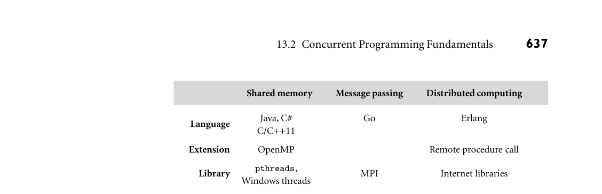
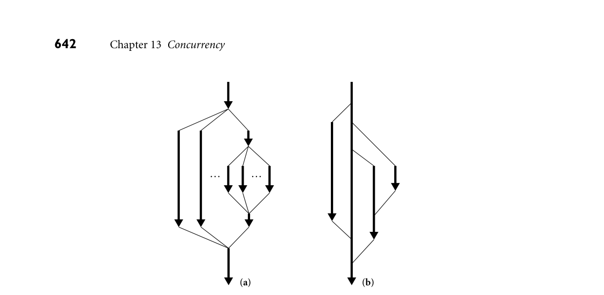
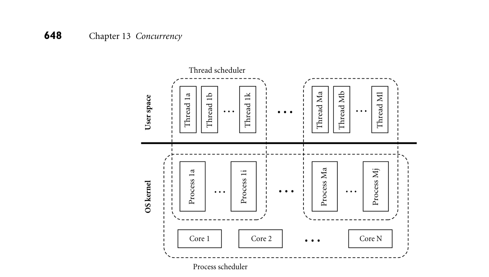
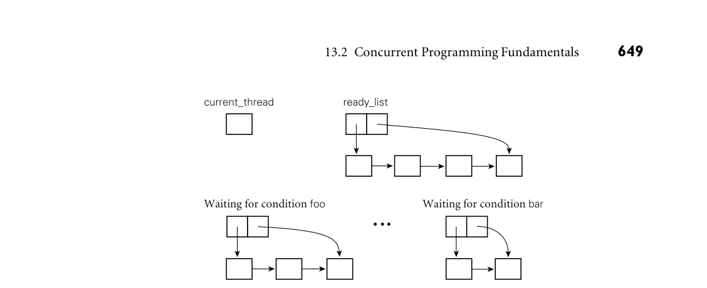

# 13.2 Concurrent Programming Fundamentals

7. Explain the distinction between a multiprocessor and a cluster; between a pro- cessor and a core. 8. What does it mean for memory in a multiprocessor to be uniform? What is the alternative? 9. Explain the coherence problem for multicore and multiprocessor caches.

10. What is a vector machine? Where does vector technology appear in modern systems?

13.2 Concurrent Programming Fundamentals

Within a concurrent program, we will use the term thread to refer to the active entity that the programmer thinks of as running concurrently with other threads. In most systems, the threads of a given program are implemented on top of one or more processes provided by the operating system. OS designers often distinguish between a heavyweight process, which has its own address space, and a collection of lightweight processes, which may share an address space. Lightweight processes were added to most variants of Unix in the late 1980s and early 1990s, to accom- modate the proliferation of shared-memory multiprocessors. We will sometimes use the word task to refer to a well-defined unit of work that must be performed by some thread. In one common programming idiom, a collection of threads shares a common “bag of tasks”—a list of work to be done. Each thread repeatedly removes a task from the bag, performs it, and goes back for another. Sometimes the work of a task entails adding new tasks to the bag. Unfortunately, terminology is inconsistent across systems and authors. Several languages call their threads processes. Ada calls them tasks. Several operating sys- tems call lightweight processes threads. The Mach OS, from which OSF Unix and Mac OS X are derived, calls the address space shared by lightweight processes a task. A few systems try to avoid ambiguity by coining new words, such as “actors,” “fibers,” or “filaments.” We will attempt to use the definitions of the preceding two paragraphs consistently, and to identify cases in which the terminology of particular languages or systems differs from this usage.

13.2.1 Communication and Synchronization

In any concurrent programming model, two of the most crucial issues to be ad- dressed are communication and synchronization. Communication refers to any mechanism that allows one thread to obtain information produced by another. Communication mechanisms for imperative programs are generally based on either shared memory or message passing. In a shared-memory programming model, some or all of a program’s variables are accessible to multiple threads.

For a pair of threads to communicate, one of them writes a value to a variable and the other simply reads it. In a pure message-passing programming model, threads have no common state: for a pair of threads to communicate, one of them must perform an explicit send operation to transmit data to another. (Some languages—Ada, Go, and Rust, for example—provide both messages and shared memory.) Synchronization refers to any mechanism that allows the programmer to con- trol the relative order in which operations occur in different threads. Synchro- nization is generally implicit in message-passing models: a message must be sent before it can be received. If a thread attempts to receive a message that has not yet been sent, it will wait for the sender to catch up. Synchronization is generally not implicit in shared-memory models: unless we do something special, a “receiving” thread could read the “old” value of a variable, before it has been written by the “sender.” In both shared-memory and message-based programs, synchronization can be implemented either by spinning (also called busy-waiting) or by blocking. In busy-wait synchronization, a thread runs a loop in which it keeps reevaluating some condition until that condition becomes true (e.g., until a message queue becomes nonempty or a shared variable attains a particular value)—presumably as a result of action in some other thread, running on some other core. Note that busy-waiting makes no sense on a uniprocessor: we cannot expect a condition to become true while we are monopolizing a resource (the one and only core) required to make it true. (A thread on a uniprocessor may sometimes busy-wait for the completion of I/O, but that’s a different situation: the I/O device runs in parallel with the processor.) In blocking synchronization (also called scheduler-based synchronization), the waiting thread voluntarily relinquishes its core to some other thread. Before do- ing so, it leaves a note in some data structure associated with the synchronization condition. A thread that makes the condition true at some point in the future will find the note and take action to make the blocked thread run again. We will con-

DESIGN & IMPLEMENTATION

13.2 Hardware and software communication As described in Section 13.1.2, the distinction between shared memory and message passing applies not only to languages and libraries but also to com- puter hardware. It is important to note that the model of communication and synchronization provided by the language or library need not necessarily agree with that of the underlying hardware. It is easy to implement message passing on top of shared-memory hardware. With a little more effort, one can also im- plement shared memory on top of message-passing hardware. Systems in this latter camp are sometimes referred to as software distributed shared memory (S-DSM).

*Figure 13.4 Examples of parallel programming systems. There is also a very large number of experimental, pedagogical, or niche proposals for each of the regions in the table.*

sider synchronization again briefly in Section 13.2.4, and then more thoroughly in Section 13.3.

13.2.2 Languages and Libraries

Thread-level concurrency can be provided to the programmer in the form of ex- plicitly concurrent languages, compiler-supported extensions to traditional se- quential languages, or library packages outside the language proper. All three options are widely used, though shared-memory languages are more common at the “low end” (for multicore and small multiprocessor machines), and message- passing libraries are more common at the “high end” (for massively parallel su- percomputers). Examples of systems in widespread use are categorized in Fig- ure 13.4. For many years, almost all parallel programming employed traditional sequen- tial languages (largely C and Fortran) augmented with libraries for synchroniza- tion or message passing, and this approach still dominates today. In the Unix world, shared memory parallelism has largely converged on the POSIX pthreads standard, which includes mechanisms to create, destroy, schedule, and synchro- nize threads. This standard became an official part of both C and C++ as of their 2011 versions. Similar functionality for Windows machines is provided by Microsoft’s thread package and compilers. For high-end scientific computing, message-based parallelism has likewise converged on the MPI (Message Passing Interface) standard, with open-source and commercial implementations available for almost every platform. While language support for concurrency goes back all the way to Algol 68 (and coroutines to Simula), and while such support was widely available in Ada by the late 1980s, widespread interest in these features didn’t really arise until the mid-1990s, when the explosive growth of the World Wide Web began to drive the development of parallel servers and concurrent client programs. This devel- opment coincided nicely with the introduction of Java, and Microsoft followed with C# a few years later. Though not yet as influential, many other languages, including Erlang, Go, Haskell, Rust, and Scala, are explicitly parallel as well.

In the realm of scientific programming, there is a long history of extensions to Fortran designed to facilitate the parallel execution of loop iterations. By the turn of the century this work had largely converged on a set of extensions known as OpenMP, available not only in Fortran but also in C and C++. Syntactically, OpenMP comprises a set of pragmas (compiler directives) to create and synchro- nize threads, and to schedule work among them. On machines composed of a network of multiprocessors, it is increasingly common to see hybrid programs that use OpenMP within a multiprocessor and MPI across them. In both the shared memory and message passing columns of Figure 13.4, the parallel constructs are intended for use within a single multithreaded program. For communication across program boundaries in distributed systems, program- mers have traditionally employed library implementations of the standard In- ternet protocols, in a manner reminiscent of file-based I/O (Section C 8.7). For client-server interaction, however, it can be attractive to provide a higher-level in- terface based on remote procedure calls (RPC), an alternative we consider further in Section C 13.5.4. In comparison to library packages, an explicitly concurrent programming lan- guage has the advantage of compiler support. It can make use of syntax other than subroutine calls, and can integrate communication and thread management more tightly with such concepts as type checking, scoping, and exceptions. At the same time, since most programs have historically been sequential, concurrent languages have been slow to gain widespread acceptance, particularly given that the presence of concurrent features can sometime make the sequential case more difficult to understand.

13.2.3 Thread Creation Syntax

Almost every concurrent system allows threads to be created (and destroyed) dy- namically. Syntactic and semantic details vary considerably from one language or library to another, but most conform to one of six principal options: co-begin, parallel loops, launch-at-elaboration, fork (with optional join), implicit receipt, and early reply. The first two options delimit threads with special control-flow constructs. The others use syntax resembling (or identical to) subroutines. At least one pedagogical language (SR) provided all six options. Most others pick and choose. Most libraries use fork/join, as do Java and C#. Ada uses both launch-at-elaboration and fork. OpenMP uses co-begin and parallel loops. RPC systems are typically based on implicit receipt.

Co-begin

The usual semantics of a compound statement (sometimes delimited with EXAMPLE 13.6

General form of co-begin begin... end) call for sequential execution of the constituent statements. A co- begin construct calls instead for concurrent execution:

stmt 1 stmt 2 . . . stmt n end

Each statement can itself be a sequential or parallel compound, or (commonly) a subroutine call. ■ Co-begin was the principal means of creating threads in Algol-68. It appears EXAMPLE 13.7

Co-begin in OpenMP in a variety of other systems as well, including OpenMP:

#pragma omp sections { # pragma omp section { printf("thread 1 here\n"); }

# pragma omp section { printf("thread 2 here\n"); } }

In C, OpenMP directives all begin with #pragma omp. (The # sign must appear in column one.) Most directives, like those shown here, must appear immediately before a loop construct or a compound statement delimited with curly braces. ■

Parallel Loops

Many concurrent systems, including OpenMP, several dialects of Fortran, and the Task Parallel Library for .NET, provide a loop whose iterations are to be executed concurrently. In OpenMP for C, we might say EXAMPLE 13.8

A parallel loop in OpenMP #pragma omp parallel for for (int i = 0; i < 3; i++) { printf("thread %d here\n", i); } ■

In C# with the Task Parallel Library, the equivalent code looks like this: EXAMPLE 13.9

A parallel loop in C# Parallel.For(0, 3, i => { Console.WriteLine("Thread " + i + "here"); });

The third argument to Parallel.For is a delegate, in this case a lambda ex- pression. A similar Foreach method expects two arguments—an iterator and a delegate. ■ In many systems it is the programmer’s responsibility to make sure that con- current execution of the loop iterations is safe, in the sense that correctness will never depend on the outcome of race conditions. Access to global variables, for example, must generally be synchronized, to make sure that iterations do not

conflict with one another. In a few languages (e.g., Occam), language rules pro- hibit conflicting accesses. The compiler checks to make sure that a variable writ- ten by one thread is neither read nor written by any concurrently active thread. In a similar but slightly more flexible vein, the do concurrent loop of Fortran 2008 constitutes an assertion on the programmer’s part that iterations of the loop are mutually independent, and hence can safely be executed in any order, or in parallel. Several rules on the content of the loop—some but not all of them en- forceable by the compiler—reduce the likelihood that programmers will make this assertion incorrectly. Historically, several parallel dialects of Fortran provided other forms of paral- lel loop, with varying semantics. The forall loop of High Performance Fortran (HPF) was subsequently incorporated into Fortran 95. Like do concurrent, it indicates that iterations can proceed in parallel. To resolve race conditions, however, it imposes automatic, internal synchronization on the constituent state- ments of the loop, each of which must be an assignment or a nested forall loop. Specifically, all reads of variables in a given assignment statement, in all iterations, must occur before any write to the left-hand side, in any iteration. The writes of the left-hand side in turn must occur before any reads in the next assignment statement. In the following example, the first assignment in the loop will read EXAMPLE 13.10

Forall in Fortran 95 n −1 elements of B and n −1 elements of C, and then update n −1 elements of A. Subsequently, the second assignment statement will read all n elements of A and then update n −1 of them:

forall (i=1:n-1) A(i) = B(i) + C(i) A(i+1) = A(i) + A(i+1) end forall

Note in particular that all of the updates to A(i) in the first assignment statement occur before any of the reads in the second assignment statement. Moreover in the second assignment statement the update to A(i+1) is not seen by the read of A(i) in the “subsequent” iteration: the iterations occur in parallel and each reads the variables on its right-hand side before updating its left-hand side. ■ For loops that iterate over the elements of an array, the forall semantics are ideally suited for execution on a vector machine. For more conventional mul- tiprocessors, HPF provides an extensive set of data distribution and alignment directives that allow the programmer to scatter elements across the memory as- sociated with a large number of processors. Within a forall loop, the compu- tation in a given assignment statement is usually performed by the processor that “owns” the element on the assignment’s left-hand side. In many cases an HPF or Fortran 95 compiler can prove that there are no dependences among certain (portions of) constituent statements of a forall loop, and can allow them to proceed without actually implementing synchronization. OpenMP does not enforce the statement-by-statement synchronization of forall, but it does provide significant support for scheduling and data manage- ment. Optional “clauses” on parallel directives can specify how many threads

to create, and which iterations of the loop to perform in which thread. They can also specify which program variables should be shared by all threads, and which should be split into a separate copy for each thread. It is even possible to specify that a private variable should be reduced across all threads at the end of the loop, using a commutative operator. To sum the elements of a very large vector, for EXAMPLE 13.11

Reduction in OpenMP example, one might write

double A[N]; ... double sum = 0; #pragma omp parallel for schedule(static) \ default(shared) reduction(+:sum) for (int i = 0; i < N; i++) { sum += A[i]; } printf("parallel sum: %f\n", sum);

Here the schedule(static) clause indicates that the compiler should divide the iterations evenly among threads, in contiguous groups. So if there are t threads, the first thread should get the first N/t iterations, the second should get the next N/t iterations, and so on. The default(shared) clause indicates that all vari- ables (other than i) should be shared by all threads, unless otherwise specified. The reduction(+:sum) clause makes sum an exception: every thread should have its own copy (initialized from the value in effect before the loop), and the copies should be combined (with +) at the end. If t is large, the compiler will probably sum the values using a tree of depth log(t). ■

Launch-at-Elaboration

In several languages, Ada among them, the code for a thread may be declared with syntax resembling that of a subroutine with no parameters. When the dec- laration is elaborated, a thread is created to execute the code. In Ada (which calls EXAMPLE 13.12

Elaborated tasks in Ada its threads tasks) we may write

procedure P is task T is ... end T; begin -- P ... end P;

Task T has its own begin... end block, which it begins to execute as soon as con- trol enters procedure P. If P is recursive, there may be many instances of T at the same time, all of which execute concurrently with each other and with whatever task is executing (the current instance of) P. The main program behaves like an initial default task.

*Figure 13.5 Lifetime of concurrent threads. With co-begin, parallel loops, or launch-at- elaboration (a), threads are always properly nested. With fork/join (b), more general patterns are possible.*

When control reaches the end of procedure P, it will wait for the appropriate instance of T (the one that was created at the beginning of this instance of P) to complete before returning. This rule ensures that the local variables of P (which are visible to T under the usual static scope rules) are never deallocated before T is done with them. ■

Fork/Join

Co-begin, parallel loops, and launch-at-elaboration all lead to a concurrent EXAMPLE 13.13

Co-begin vs fork/join control-flow pattern in which thread executions are properly nested (see Fig- ure 13.5a). The fork operation is more general: it makes the creation of threads an explicit, executable operation. The companion join operation, when provided, allows a thread to wait for the completion of a previously forked thread. Because fork and join are not tied to nested constructs, they can lead to arbitrary patterns of concurrent control flow (Figure 13.5b). ■ In addition to providing launch-at-elaboration tasks, Ada allows the program- EXAMPLE 13.14

Task types in Ada mer to define task types:

task type T is ... begin ... end T;

pt : access T := new T;

The new operation is a fork: it creates a new thread and starts it executing. There is no explicit join operation in Ada, though parent and child tasks can always syn- chronize with one another explicitly if desired (e.g., immediately before the child completes its execution). As with launch-at-elaboration, control will wait auto- matically at the end of any scope in which task types are declared for all threads using the scope to terminate. ■ Any information an Ada task needs in order to do its job must be communi- cated through shared variables or through explicit messages sent after the task has started execution. Most systems, by contrast, allow parameters to be passed to a thread at start-up time. In Java one obtains a thread by constructing an object of EXAMPLE 13.15

Thread creation in Java 2 some class derived from a predefined class called Thread:

class ImageRenderer extends Thread { ... ImageRenderer( args ) { // constructor }

DESIGN & IMPLEMENTATION

13.3 Task-parallel and data-parallel computing One of the most basic decisions a programmer has to make when writing a parallel program is how to divide work among threads. One common strategy, which works well on small machines, is to use a separate thread for each of the program’s major tasks or functions, and to pipeline or otherwise overlap their execution. In a word processor, for example, one thread might be devoted to breaking paragraphs into lines, another to pagination and figure placement, another to spelling and grammar checking, and another to rendering the im- age on the screen. This strategy is often known as task parallelism. Its principal disadvantage is that it doesn’t naturally scale to very large numbers of proces- sors. For that, one generally needs data parallelism, in which more or less the same operations are applied concurrently to the elements of some very large data set. An image manipulation program, for example, may divide the screen into n small tiles, and use a separate thread to process each tile. A game may use a separate thread for every moving character or object. A programming system whose features are designed for data parallelism is sometimes referred to as a data-parallel language or library. Task parallel pro- grams are commonly based on co-begin, launch-at-elaboration, or fork/join: the code in different threads can be different. Data parallel programs are com- monly based on parallel loops: each thread executes the same code, using dif- ferent data. OpenCL and CUDA, unsurprisingly, are in the data-parallel camp: programmable GPUs are optimized for data parallel programs.

public void run() { // code to be run by the thread } } ... ImageRenderer rend = new ImageRenderer( constructor args );

Superficially, the use of new resembles the creation of dynamic tasks in Ada. In Java, however, the new thread does not begin execution when first created. To start it, the parent (or some other thread) must call the method named start, which is defined in Thread:

rend.start();

Start makes the thread runnable, arranges for it to execute its run method, and returns to the caller. The programmer must define an appropriate run method in every class derived from Thread. The run method is meant to be called only by start; programmers should not call it directly, nor should they redefine start. There is also a join method:

rend.join(); // wait for completion ■

The constructor for a Java thread typically saves its arguments in fields that are later accessed by run. In effect, the class derived from Thread functions as an object closure, as described in Section 3.6.3. Several languages, Modula-3 and C# among them, use closures more explicitly. Rather than require every thread EXAMPLE 13.16

Thread creation in C# to be derived from a common Thread class, C# allows one to be created from an arbitrary ThreadStart delegate:

class ImageRenderer { ... public ImageRenderer( args ) { // constructor } public void Foo() { // Foo is compatible with ThreadStart; // its name is not significant // code to be run by the thread } } ... ImageRenderer rendObj = new ImageRenderer( constructor args ); Thread rend = new Thread(new ThreadStart(rendObj.Foo));

If thread arguments can be gleaned from the local context, this can even be writ- ten as

Thread rend = new Thread(delegate() { // code to be run by the thread });

(Remember, C# has unlimited extent for anonymous delegates.) Either way, the new thread is started and awaited just as it is in Java:

rend.Start(); ... rend.Join(); ■

As of Java 5 (with its java.util.concurrent library), programmers are dis- EXAMPLE 13.17

Thread pools in Java 5 couraged from creating threads explicitly. Rather, tasks to be accomplished are represented by objects that support the Runnable interface, and these are passed to an Executor object. The Executor in turn farms them out to a managed pool of threads:

class ImageRenderer implements Runnable { ... // constructor and run() method same as before } ... Executor pool = Executors.newFixedThreadPool(4); ... pool.execute(new ImageRenderer( constructor args ));

Here the argument to newFixedThreadPool (one of a large number of standard Executor factories) indicates that pool should manage four threads. Each task specified in a call to pool.execute will be run by one of these threads. By sepa- rating the concepts of task and thread, Java allows the programmer (or run-time code) to choose an Executor class whose level of true concurrency and sche- duling discipline are appropriate to the underlying OS and hardware. (In this example we have used a particularly simple pool, with exactly four threads.) C# has similar thread pool facilities. Like C# threads, they are based on delegates. ■

A particularly elegant realization of fork and join appears in the Cilk pro- EXAMPLE 13.18

Spawn and sync in Cilk gramming language, developed by researchers at MIT, and subsequently devel- oped into a commercial venture acquired by Intel. To fork a logically concurrent task in Cilk, one simply prepends the keyword spawn to an ordinary function call:

spawn foo( args );

At some later time, invocation of the built-in operation sync will join with all tasks previously spawned by the calling task. The principal innovation of Cilk is the mechanism for scheduling tasks. The language implementation includes

a highly efficient thread pool mechanism that explores the task-creation graph depth first with a near-minimal number of context switches and automatic load balancing across threads. Java 7 added a similar but more restricted mechanism in the form of a ForkJoinPool for the Executor service. ■

Implicit Receipt

We have assumed in all our examples so far that newly created threads will run in the address space of the creator. In RPC systems it is often desirable to create a new thread automatically in response to an incoming request from some other address space. Rather than have an existing thread execute a receive operation, a server can bind a communication channel to a local thread body or subroutine. When a request comes in, a new thread springs into existence to handle it. In effect, the bind operation grants remote clients the ability to perform a fork within the server’s address space, though the process is often less than fully automatic. We will consider RPC in more detail in Section C 13.5.4.

Early Reply

We normally think of sequential subroutines in terms of a single thread, which EXAMPLE 13.19

Modeling subroutines with fork/join saves its current context (its program counter and registers), executes the subrou- tine, and returns to what it was doing before. The effect is the same, however, if we have two threads—one that executes the caller and another that executes the callee. In this case, the call is essentially a fork/join pair. The caller waits for the callee to terminate before continuing execution. ■ Nothing dictates, however, that the callee has to terminate in order to release the caller; all it really has to do is complete the portion of its work on which re-

DESIGN & IMPLEMENTATION

13.4 Counterintuitive implementation Over the course of 13 chapters we have seen numerous cases in which the im- plementation of a language feature may run counter to the programmer’s in- tuition. Early reply—in which thread creation is usually delayed until the reply actually occurs—is but the most recent example. Others have included expres- sion evaluation order (Section 6.1.4), subroutine in-lining (Section 9.2.4), tail recursion (Section 6.6.1), nonstack allocation of activation records (for un- limited extent—Section 3.6.2), out-of-order or even noncontiguous layout of record fields (Section 8.1.2), variable lookup in a central reference table (Sec- tion C 3.4.2), immutable objects under a reference model of variables (Sec- tion 6.1.2), and implementations of generics (Section 7.3.1) that share code among instances with different type parameters. A compiler may, particularly at higher levels of code improvement, produce code that differs dramatically from the form and organization of its input. Unless otherwise constrained by the language definition, an implementation is free to choose any translation that is provably equivalent to the input.

sult parameters depend. Drawing inspiration from the detach operation used to launch coroutines in Simula (Example 9.47), a few languages (SR and Her- mes [SBG+91] among them) allow a callee to execute a reply operation that re- turns results to the caller without terminating. After an early reply, the two threads continue concurrently. Semantically, the portion of the callee prior to the reply plays much the same role as the constructor of a Java or C# thread; the portion after the reply plays the role of the run method. The usual implementation is also similar, and may run counter to the programmer’s intuition: since early reply is optional, and can appear in any subroutine, we can use the caller’s thread to execute the initial por- tion of the callee, and create a new thread only when—and if—the callee replies instead of returning.

13.2.4 Implementation of Threads

As we noted near the beginning of Section 13.2, the threads of a concurrent pro- gram are usually implemented on top of one or more processes provided by the operating system. At one extreme, we could use a separate OS process for ev- ery thread; at the other extreme we could multiplex all of a program’s threads on top of a single process. On a supercomputer with a separate core for every concurrent activity, or in a language in which threads are relatively heavyweight abstractions (long-lived, and created by the dozens rather than the thousands), the one-process-per-thread extreme is often acceptable. In a simple language on a uniprocessor, the all-threads-on-one-process extreme may be acceptable. Many EXAMPLE 13.20

Multiplexing threads on processes language implementations adopt an intermediate approach, with a potentially very large number of threads running on top of some smaller but nontrivial num- ber of processes (see Figure 13.6). ■ The problem with putting every thread on a separate process is that processes (even “lightweight” ones) are simply too expensive in many operating systems. Because they are implemented in the kernel, performing any operation on them requires a system call. Because they are general purpose, they provide features that most languages do not need, but have to pay for anyway. (Examples include separate address spaces, priorities, accounting information, and signal and I/O interfaces, all of which are beyond the scope of this book.) At the other extreme, there are two problems with putting all threads on top of a single process: first, it precludes parallel execution on a multicore or multiprocessor machine; second, if the currently running thread makes a system call that blocks (e.g., waiting for I/O), then none of the program’s other threads can run, because the single process is suspended by the OS. In the common two-level organization of concurrency (user-level threads on top of kernel-level processes), similar code appears at both levels of the system: the language run-time system implements threads on top of one or more pro- cesses in much the same way that the operating system implements processes on

*Figure 13.6 Two-level implementation of threads. A thread scheduler, implemented in a library or language run-time package, multiplexes threads on top of one or more kernel-level processes, just as the process scheduler, implemented in the operating system kernel, multiplexes processes on top of one or more physical cores.*

*Figure 13.7 illustrates the data structures employed by a simple scheduler. At any EXAMPLE 13.21*

*Figure 13.7 Data structures of a simple scheduler. A designated current thread is running. Threads on the ready list are runnable. Other threads are blocked, waiting for various conditions to become true. If threads run on top of more than one OS-level process, each such process will have its own current thread variable. If a thread makes a call into the operating system, its process may block in the kernel.*

its chance to do so. Context blocks for threads that are runnable but not currently running reside on a queue called the ready list. Context blocks for threads that are blocked for scheduler-based synchronization reside in data structures (usually queues) associated with the conditions for which they are waiting. To yield the core to another thread, a running thread calls the scheduler:

procedure reschedule() t : thread := dequeue(ready list) transfer(t)

Before calling into the scheduler, a thread that wants to run again at some point in the future must place its own context block in some appropriate data structure. If it is blocking for the sake of fairness—to give some other thread a chance to run—then it enqueues its context block on the ready list:

procedure yield() enqueue(ready list, current thread) reschedule()

To block for synchronization, a thread adds itself to a queue associated with the awaited condition:

procedure sleep on(ref Q : queue of thread) enqueue(Q, current thread) reschedule()

When a running thread performs an operation that makes a condition true, it removes one or more threads from the associated queue and enqueues them on the ready list. ■

Fairness becomes an issue whenever a thread may run for a significant amount of time while other threads are runnable. To give the illusion of concurrent activ- ity, even on a uniprocessor, we need to make sure that each thread gets a frequent “slice” of the processor. With cooperative multithreading, any long-running thread must yield its core explicitly from time to time (e.g., at the tops of loops), to al- low other threads to run. As noted in Section 13.1.1, this approach allows one improperly written thread to monopolize the system. Even with properly written threads, it leads to less than perfect fairness due to nonuniform times between yields in different threads.

Preemption

Ideally, we should like to multiplex each core fairly and at a relatively fine grain (i.e., many times per second) without requiring that threads call yield explicitly. On many systems we can do this in the language implementation by using timer signals for preemptive multithreading. When switching between threads we ask the operating system (which has access to the hardware clock) to deliver a signal to the currently running process at a specified time in the future. The OS delivers the signal by saving the context (registers and pc) of the process and transferring control to a previously specified handler routine in the language run-time system, as described in Section 9.6.1. When called, the handler modifies the state of the currently running thread to make it appear that the thread had just executed a call to the standard yield routine, and was about to execute its prologue. The handler then “returns” into yield, which transfers control to some other thread, as if the one that had been running had relinquished control of the process voluntarily. Unfortunately, the fact that a signal may arrive at an arbitrary time introduces a race between voluntary calls to the scheduler and the automatic calls triggered by preemption. To illustrate the problem, suppose that a signal arrives when the EXAMPLE 13.22

A race condition in preemptive multithreading currently running process has just enqueued the currently running thread onto the ready list in yield, and is about to call reschedule. When the signal handler “returns” into yield, the process will put the current thread into the ready list a second time. If at some point in the future the thread blocks for synchronization, its second entry in the ready list may cause it to run again immediately, when it should be waiting. Even worse problems can arise if a signal occurs in the middle of an enqueue, at a moment when the ready list is not even a properly structured queue. To resolve the race and avoid corruption of the ready list, thread packages commonly disable signal delivery during scheduler calls:

procedure yield() disable signals() enqueue(ready list, current thread) reschedule() reenable signals()

For this convention to work, every fragment of code that calls reschedule must disable signals prior to the call, and must reenable them afterward. (Recall that a similar mechanism served to protect data shared between the main program and

event handlers in Section 9.6.1.) In this case, because reschedule contains a call to transfer, signals may be disabled in one thread and reenabled in another. ■ It turns out that the sleep on routine must also assume that signals are dis- EXAMPLE 13.23

Disabling signals during context switch abled and enabled by the caller. To see why, suppose that a thread checks a condi- tion, finds that it is false, and then calls sleep on to suspend itself on a queue asso- ciated with the condition. Suppose further that a timer signal occurs immediately after checking the condition, but before the call to sleep on. Finally, suppose that the thread that is allowed to run after the signal makes the condition true. Since the first thread never got a chance to put itself on the condition queue, the second thread will not find it to make it runnable. When the first thread runs again, it will immediately suspend itself, and may never be awakened. To close this tim- ing window—this interval in which a concurrent event may compromise program correctness—the caller must ensure that signals are disabled before checking the condition:

disable signals() if not desired condition sleep on(condition queue) reenable signals

On a uniprocessor, disabling signals allows the check and the sleep to occur as a single, atomic operation. ■

Multiprocessor Scheduling

We can extend our preemptive thread package to run on top of more than one OS-provided process by arranging for the processes to share the ready list and re- lated data structures (condition queues, etc.; note that each process must have a separate current thread variable). If the processes run on different physical cores, then more than one thread will be able to run at once. If the processes share a single core, then the program will be able to make forward progress even when all but one of the processes are blocked in the operating system. Any thread that is runnable is placed in the ready list, where it becomes a candidate for execu- tion by any of the application’s processes. When a process calls reschedule, the queue-based ready list we have been using in our examples will give it the longest- waiting thread. The ready list of a more elaborate scheduler might give priority to interactive or time-critical threads, or to threads that last ran on the current core, and may therefore still have data in the cache. Just as preemption introduced a race between voluntary and automatic calls to scheduler operations, true or quasiparallelism introduces races between calls in separate OS processes. To resolve the races, we must implement additional synchronization to make scheduler operations in separate processes atomic. We will return to this subject in Section 13.3.4.

