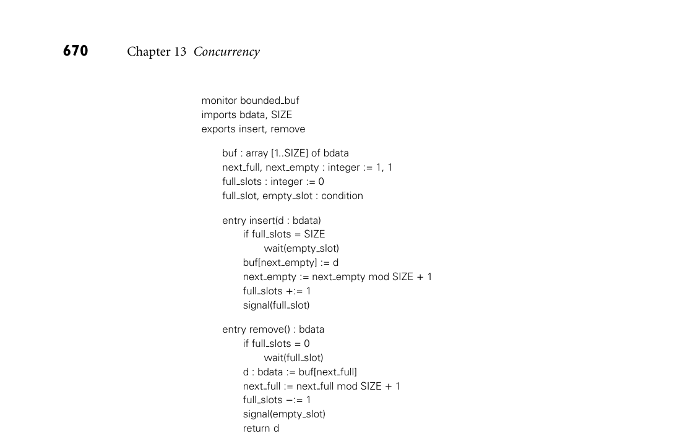
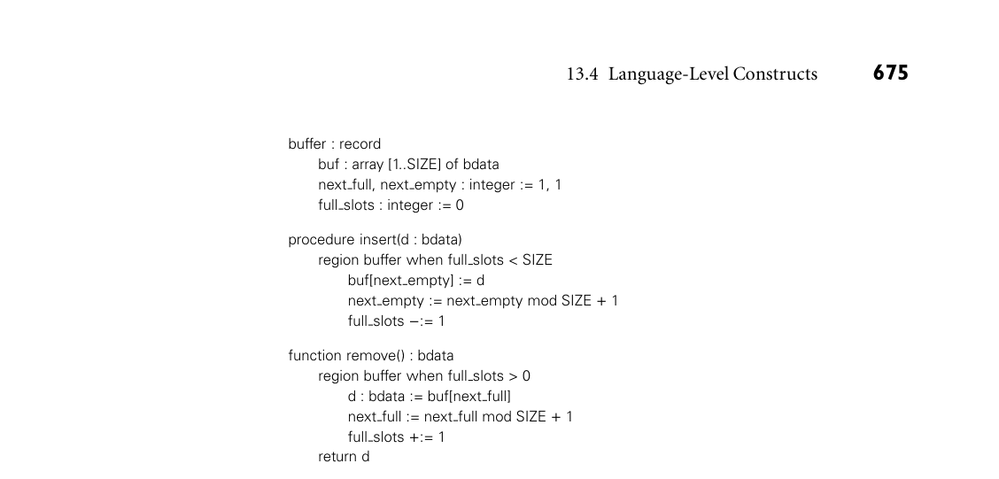
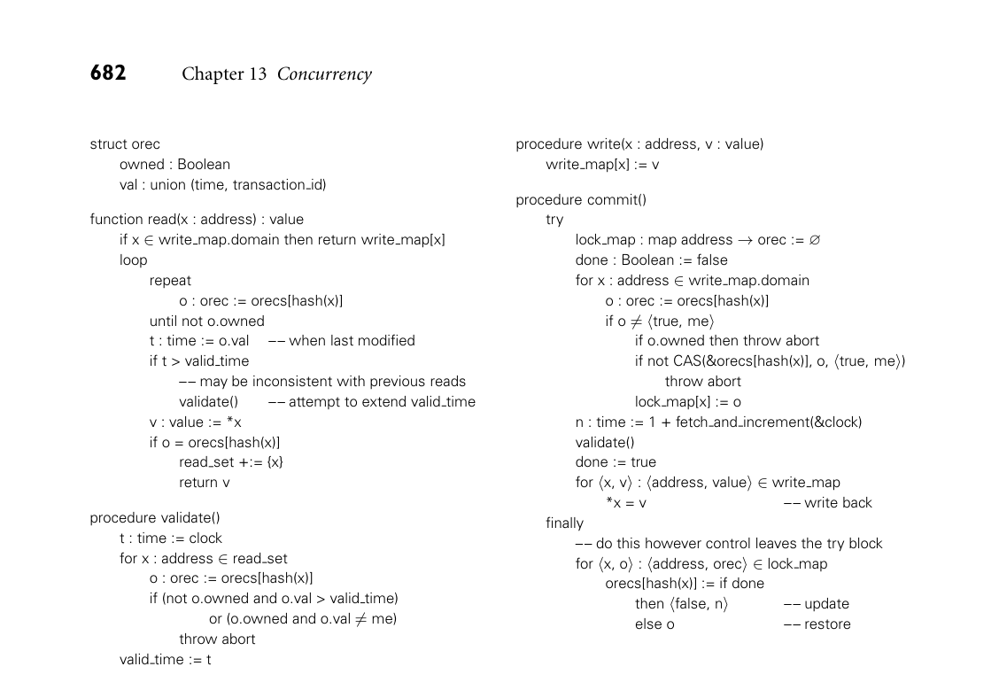

# 13.4 Language-Level Constructs

29. Explain how a reader–writer lock differs from an “ordinary” lock.

30. What is a barrier? In what types of programs are barriers common? 31. What does it mean for an algorithm to be nonblocking? What advantages do nonblocking algorithms have over algorithms based on locks? 32. What is sequential consistency? Why is it difficult to implement?

33. What information is provided by a memory consistency model? What is the relationship between hardware-level and language-level memory models?

34. Explain how to extend a preemptive uniprocessor scheduler to work correctly on a multiprocessor.

35. What is a spin-then-yield lock? 36. What is a bounded buffer?

37. What is a semaphore? What operations does it support? How do binary and general semaphores differ?

13.4 Language-Level Constructs

Though widely used, semaphores are also widely considered to be too “low level” for well-structured, maintainable code. They suffer from two principal problems. First, because their operations are simply subroutine calls, it is easy to leave one out (e.g., on a control path with several nested if statements). Second, unless they are hidden inside an abstraction, uses of a given semaphore tend to get scat- tered throughout a program, making it difficult to track them down for purposes of software maintenance.

13.4.1 Monitors

Monitors were suggested by Dijkstra [Dij72] as a solution to the problems of semaphores. They were developed more thoroughly by Brinch Hansen [Bri73], and formalized by Hoare [Hoa74] in the early 1970s. They have been incorpo- rated into at least a score of languages, of which Concurrent Pascal [Bri75], Mod- ula (1) [Wir77b], and Mesa [LR80] were probably the most influential.5 They

5 Together with Smalltalk and Interlisp, Mesa was one of three influentiallanguages to emerge from Xerox’s Palo Alto Research Center in the 1970s. All three were developed on the Alto personal computer, which pioneered such concepts as the bitmapped display, the mouse, the graphical user interface, WYSIWYG editing, Ethernet networking, and the laser printer. The Mesa project was led by Butler Lampson (1943–), who played a key role in the later development of Euclid and Cedar as well. For his contributions to personal and distributed computing, Lampson received the ACM Turing Award in 1992.

*Figure 13.17 Monitor-based code for a bounded buffer. Insert and remove are entry subrou- tines: they require exclusive access to the monitor’s data. Because conditions are memory-less, both insert and remove can safely end their operation with a signal.*

also strongly influenced the design of Java’s synchronization mechanisms, which we will consider in Section 13.4.3. A monitor is a module or object with operations, internal state, and a number of condition variables. Only one operation of a given monitor is allowed to be active at a given point in time. A thread that calls a busy monitor is automatically delayed until the monitor is free. On behalf of its calling thread, any operation may suspend itself by waiting on a condition variable. An operation may also signal a condition variable, in which case one of the waiting threads is resumed, usually the one that waited first. Because the operations (entries) of a monitor automatically exclude one an- other in time, the programmer is relieved of the responsibility of using P and V operations correctly. Moreover because the monitor is an abstraction, all opera- tions on the encapsulated data, including synchronization, are collected together in one place. Figure 13.17 shows a monitor-based solution to the bounded buffer EXAMPLE 13.40

Bounded buffer monitor problem. It is worth emphasizing that monitor condition variables are not the same as semaphores. Specifically, they have no “memory”: if no thread is wait- ing on a condition at the time that a signal occurs, then the signal has no effect.

By contrast a V operation on a semaphore increments the semaphore’s counter, allowing some future P operation to succeed, even if none is waiting now. ■

Semantic Details

Hoare’s definition of monitors employs one thread queue for every condition variable, plus two bookkeeping queues: the entry queue and the urgent queue. A thread that attempts to enter a busy monitor waits in the entry queue. When a thread executes a signal operation from within a monitor, and some other thread is waiting on the specified condition, then the signaling thread waits on the moni- tor’s urgent queue and the first thread on the appropriate condition queue obtains control of the monitor. If no thread is waiting on the signaled condition, then the signal operation is a no-op. When a thread leaves a monitor, either by complet- ing its operation or by waiting on a condition, it unblocks the first thread on the urgent queue or, if the urgent queue is empty, the first thread on the entry queue, if any. Many monitor implementations dispense with the urgent queue, or make other changes to Hoare’s original definition. From the programmer’s point of view, the two principal areas of variation are the semantics of the signal opera- tion and the management of mutual exclusion when a thread waits inside a nested sequence of two or more monitor calls. We will return to these issues below. Correctness for monitors depends on maintaining a monitor invariant. The invariant is a predicate that captures the notion that “the state of the monitor is consistent.” The invariant needs to be true initially, and at monitor exit. It also needs to be true at every wait statement and, in a Hoare monitor, at signal oper- ations as well. For our bounded buffer example, a suitable invariant would assert that full slots correctly indicates the number of items in the buffer, and that those items lie in slots numbered next full through next empty −1 (mod SIZE). Care- ful inspection of the code in Figure 13.17 reveals that the invariant does indeed hold initially, and that any time we modify one of the variables mentioned in the invariant, we always modify the others accordingly before waiting, signaling, or returning from an entry. Hoare defined his monitors in terms of semaphores. Conversely, it is easy to define semaphores in terms of monitors (Exercise 13.18). Together, the two def- initions prove that semaphores and monitors are equally powerful: each can ex- press all forms of synchronization expressible with the other.

Signals as Hints and Absolutes

In general, one signals a condition variable when some condition on which a thread may be waiting has become true. If we want to guarantee that the condi- tion is still true when the thread wakes up, then we need to switch to the thread as soon as the signal occurs—hence the need for the urgent queue, and the need to ensure the monitor invariant at signal operations. In practice, switching contexts EXAMPLE 13.41

How to wait for a signal (hint or absolute) on a signal tends to induce unnecessary scheduling overhead: a signaling thread seldom changes the condition associated with the signal during the remainder of its operation. To reduce the overhead, and to eliminate the need to ensure the

monitor invariant, Mesa specifies that signals are only hints: the language run- time system moves some waiting thread to the ready list, but the signaler retains control of the monitor, and the waiter must recheck the condition when it awakes. In effect, the standard idiom

if not desired condition wait (condition variable)

in a Hoare monitor becomes the following in Mesa:

while not desired condition wait(condition variable)

DESIGN & IMPLEMENTATION

13.5 Monitor signal semantics By specifying that signals are hints, instead of absolutes, Mesa and Modula-3 (and similarly Java and C#, which we consider in Section 13.4.3) avoid the need to perform an immediate context switch from a signaler to a waiting thread. They also admit simpler, though less efficient implementations that lack a one- to-one correspondence between signals and thread queues, or that do not nec- essarily guarantee that a waiting thread will be the first to run in its monitor after the signal occurs. This approach can lead to complications, however, if we want to ensure that an appropriate thread always runs in the wake of a signal. Suppose an awakened thread rechecks its condition and discovers that it still can’t run. If there may be some other thread that could run, the erroneously awakened thread may need to resignal the condition before it waits again:

if not desired condition loop wait (condition variable) if desired condition break signal (condition variable)

In effect the signal “cascades” from thread to thread until some thread is able to run. (If it is possible that no waiting thread will be able to run, then we will need additional logic to stop the cascading when every thread has been checked.) Alternatively, the thread that makes a condition (potentially) true can use a special broadcast version of the signal operation to awaken all wait- ing threads at once. Each thread will then recheck the condition and if ap- propriate wait again, without the need for explicit cascading. In either case (cascading signals or broadcast), signals as hints trade potentially high over- head in the worst case for potentially low overhead in the common case and a potentially simpler implementation.

Modula-3 takes a similar approach. An alternative appears in Concurrent Pascal, which specifies that a signal operation causes an immediate return from the monitor operation in which it appears. This rule keeps overhead low, and also preserves invariants, but precludes algorithms in which a thread does useful work in a monitor after signaling a condition. ■

Nested Monitor Calls

In most monitor languages, a wait in a nested sequence of monitor operations will release mutual exclusion on the innermost monitor, but will leave the outer monitors locked. This situation can lead to deadlock if the only way for another thread to reach a corresponding signal operation is through the same outer moni- tor(s). In general, we use the term “deadlock” to describe any situation in which a collection of threads are all waiting for each other, and none of them can proceed. In this specific case, the thread that entered the outer monitor first is waiting for the second thread to execute a signal operation; the second thread, however, is waiting for the first to leave the monitor. The alternative—to release exclusion on outer monitors when waiting in an inner one—was adopted by several early monitor implementations for unipro- cessors, including the original implementation of Modula [Wir77a]. It has a sig- nificant semantic drawback, however: it requires that the monitor invariant hold not only at monitor exit and (perhaps) at signal operations, but also at any sub- routine call that may result in a wait or (with Hoare semantics) a signal in a nested monitor. Such calls may not all be known to the programmer; they are certainly not syntactically distinguished in the source.

DESIGN & IMPLEMENTATION

13.6 The nested monitor problem While maintaining exclusion on outer monitor(s) when waiting in an inner one may lead to deadlock with a signaling thread, releasing those outer moni- tors may lead to similar (if a bit more subtle) deadlocks. When a waiting thread awakens it must reacquire exclusion on both inner and outer monitors. The innermost monitor is of course available, because the matching signal hap- pened there, but there is in general no way to ensure that unrelated threads will not be busy in the outer monitor(s). Moreover one of those threads may need access to the inner monitor in order to complete its work and release the outer monitor(s). If we insist that the awakened thread be the first to run in the inner monitor after the signal, then deadlock will result. One way to avoid this problem is to arrange for mutual exclusion across all the monitors of a program. This solution severely limits concurrency in multiprocessor imple- mentations, but may be acceptable on a uniprocessor. A more general solution is addressed in Exercise 13.21.

13.4.2 Conditional Critical Regions

Conditional critical regions (CCRs) are another alternative to semaphores, pro- posed by Brinch Hansen at about the same time as monitors [Bri73]. A critical EXAMPLE 13.42

Original CCR syntax region is a syntactically delimited critical section in which code is permitted to access a protected variable. A conditional critical region also specifies a Boolean condition, which must be true before control will enter the region:

region protected variable, when Boolean condition do . . . end region

No thread can access a protected variable except within a region statement for that variable, and any thread that reaches a region statement waits until the condition is true and no other thread is currently in a region for the same variable. Regions can nest, though as with nested monitor calls, the programmer needs to worry about deadlock. Figure 13.18 uses CCRs to implement a bounded buffer. ■ Conditional critical regions appeared in the concurrent language Edison [Bri81], and also seem to have influenced the synchronization mechanisms of Ada 95 and Java/C#. These later languages might be said to blend the features of monitors and CCRs, albeit in different ways.

Synchronization in Ada 95

The principal mechanism for synchronization in Ada, introduced in Ada 83, is based on message passing; we will describe it in Section 13.5. Ada 95 augments this mechanism with a notion of protected object. A protected object can have three types of methods: functions, procedures, and entries. Functions can only read the fields of the object; procedures and entries can read and write them. An

DESIGN & IMPLEMENTATION

13.7 Conditional critical regions Conditional critical regions avoid the question of signal semantics, because they use explicit Boolean conditions instead of condition variables, and be- cause conditions can be awaited only at the beginning of critical regions. At the same time, they introduce potentially significant inefficiency. In the gen- eral case, the code used to exit a conditional critical region must tentatively resume each waiting thread, allowing that thread to recheck its condition in its own referencing environment. Optimizations are possible in certain special cases (e.g., for conditions that depend only on global variables, or that consist of only a single Boolean variable), but in the worst case it may be necessary to perform context switches in and out of every waiting thread on every exit from a region.

*Figure 13.18 Conditional critical regions for a bounded buffer. Boolean conditions on the region statements eliminate the need for explicit condition variables.*

implicit reader–writer lock on the protected object ensures that potentially con- flicting operations exclude one another in time: a procedure or entry obtains ex- clusive access to the object; a function can operate concurrently with other func- tions, but not with a procedure or entry. Procedures and entries differ from one another in two important ways. First, an entry can have a Boolean expression guard, for which the calling task (thread) will wait before beginning execution (much as it would for the condition of a CCR). Second, an entry supports three special forms of call: timed calls, which abort after waiting for a specified amount of time, conditional calls, which execute alternative code if the call cannot proceed immediately, and asynchronous calls, which begin executing alternative code immediately, but abort it if the call is able to proceed before the alternative completes. In comparison to the conditions of CCRs, the guards on entries of protected objects in Ada 95 admit a more efficient implementation, because they do not have to be evaluated in the context of the calling thread. Moreover, because all guards are gathered together in the definition of the protected object, the com- piler can generate code to test them as a group as efficiently as possible, in a man- ner suggested by Kessels [Kes77]. Though an Ada task cannot wait on a condition in the middle of an entry (only at the beginning), it can requeue itself on an- other entry, achieving much the same effect. Ada 95 code for a bounded buffer would closely resemble the pseudocode of Figure 13.18; we leave the details to Exercise 13.23.

13.4.3 Synchronization in Java

In Java, every object accessible to more than one thread has an implicit mutual EXAMPLE 13.43

synchronized statement in Java exclusion lock, acquired and released by means of synchronized statements:

synchronized (my_shared_obj) { ... // critical section }

All executions of synchronized statements that refer to the same shared object exclude one another in time. Synchronized statements that refer to different objects may proceed concurrently. As a form of syntactic sugar, a method of a class may be prefixed with the synchronized keyword, in which case the body of the method is considered to have been surrounded by an implicit synchronized (this) statement. Invocations of nonsynchronized methods of a shared object— and direct accesses to public fields—can proceed concurrently with each other, or with a synchronized statement or method. ■ Within a synchronized statement or method, a thread can suspend itself by calling the predefined method wait. Wait has no arguments in Java: the core language does not distinguish among the different reasons why threads may be suspended on a given object (the java.util.concurrent library, which became standard with Java 5, does provide a mechanism for multiple conditions; more on this below). Like Mesa, Java allows a thread to be awoken for spurious reasons, or EXAMPLE 13.44

notify as hint in Java after a delay; programs must therefore embed the use of wait within a condition- testing loop:

while (!condition) { wait(); }

A thread that calls the wait method of an object releases the object’s lock. With nested synchronized statements, however, or with nested calls to synchronized methods, the thread does not release locks on any other objects. ■ To resume a thread that is suspended on a given object, some other thread must execute the predefined method notify from within a synchronized statement or method that refers to the same object. Like wait, notify has no arguments. In response to a notify call, the language run-time system picks an arbitrary thread suspended on the object and makes it runnable. If there are no such threads, then the notify is a no-op. As in Mesa, it may sometimes be appropriate to awaken all threads waiting in a given object; Java provides a built-in notifyAll method for this purpose. If threads are waiting for more than one condition (i.e., if their waits are em- bedded in dissimilar loops), there is no guarantee that the “right” thread will awaken. To ensure that an appropriate thread does wake up, the programmer may choose to use notifyAll instead of notify. To ensure that only one thread continues after wakeup, the first thread to discover that its condition has been

satisfied must modify the state of the object in such a way that other awakened threads, when they get to run, will simply go back to sleep. Unfortunately, since all waiting threads will end up reevaluating their conditions every time one of them can run, this “solution” to the multiple-condition problem can be quite expensive. The mechanisms for synchronization in C# are similar to the Java mechanisms just described. The C# lock statement is similar to Java’s synchronized. It cannot be used to label a method, but a similar effect can be achieved (a bit more clumsily) by specifying a Synchronized attribute for the method. The methods Pulse and PulseAll are used instead of notify and notifyAll.

Lock Variables

In early versions of Java, programmers concerned with efficiency generally needed to devise algorithms in which threads were never waiting for more than one con- dition within a given object at a given time. The java.util.concurrent pack- age, introduced in Java 5, provides a more general solution. (Similar solutions are possible in C#, but are not in the standard library.) As an alternative to EXAMPLE 13.45

Lock variables in Java 5 synchronized statements and methods, modern Java programmers can create explicit Lock variables. Code that might once have been written

synchronized (my_shared_obj) { ... // critical section }

DESIGN & IMPLEMENTATION

13.8 Condition variables in Java As illustrated by Mesa and Java, the distinction between monitors and CCRs is somewhat blurry. It turns out to be possible (see Exercise 13.22) to solve completely general synchronization problems in such a way that for every pro- tected object there is only one Boolean condition on which threads ever spin. The solutions, however, may not be pretty: they amount to low-level use of semaphores, without the implicit mutual exclusion of synchronized statements and methods. For programs that are naturally expressed with multiple condi- tions, Java’s basic synchronization mechanism (and the similar mechanism in C#) may force the programmer to choose between elegance and efficiency. The concurrency enhancements of Java 5 were a deliberate attempt to lessen this dilemma: Lock variables retain the distinction between mutual exclusion and condition synchronization characteristic of both monitors and CCRs, while allowing the programmer to partition waiting threads into equivalence classes that can be awoken independently. By varying the fineness of the partition the programmer can choose essentially any point on the spectrum between the simplicity of CCRs and the efficiency of Hoare-style monitors. Exercises 13.24 through 13.26 explore this issue further using bounded buffers as a running example.

may now be written

Lock l = new ReentrantLock(); l.lock(); try { ... // critical section } finally { l.unlock(); }

A similar interface supports reader–writer locks. ■ Like semaphores, Java Lock variables lack the implicit release at end of scope associated with synchronized statements and methods. The need for an explicit release introduces a potential source of bugs, but allows programmers to create algorithms in which locks are acquired and released in non-LIFO order (see Ex- ample 13.14). In a manner reminiscent of the timed entry calls of Ada 95, Java Lock variables also support a tryLock method, which acquires the lock only if it is available immediately, or within an optionally specified timeout interval (a Boolean return value indicates whether the attempt was successful). Finally, a EXAMPLE 13.46

Multiple Conditions in Java 5 Lock variable may have an arbitrary number of associated Condition variables, making it easy to write algorithms in which threads wait for multiple conditions, without resorting to notifyAll:

Condition c1 = l.newCondition(); Condition c2 = l.newCondition(); ... c1.await(); ... c2.signal(); ■

Java objects that use only synchronized methods (no locks or synchronized statements) closely resemble Mesa monitors in which there is a limit of one condi- tion variable per monitor (and in fact objects with synchronized statements are sometimes referred to as monitors in Java). By the same token, a synchronized statement in Java that begins with a wait in a loop resembles a CCR in which the retesting of conditions has been made explicit. Because notify also is explicit, a Java implementation need not reevaluate conditions (or wake up threads that do so explicitly) on every exit from a critical section—only those in which a notify occurs.

The Java Memory Model

The Java Memory Model, which we introduced in Section 13.3.3, specifies exactly which operations are guaranteed to be ordered across threads. It also specifies, for every pair of reads and writes in a program execution, whether the read is permitted to return the value written by the write. Informally, a Java thread is allowed to buffer or reorder its writes (in hardware or in software) until the point at which it writes a volatile variable or leaves a

monitor (releases a lock, leaves a synchronized block, or waits). At that point all its previous writes must be visible to other threads. Similarly, a thread is al- lowed to keep cached copies of values written by other threads until it reads a volatile variable or enters a monitor (acquires a lock, enters a synchronized block, or wakes up from a wait). At that point any subsequent reads must obtain new copies of anything that has been written by other threads. The compiler is free to reorder ordinary reads and writes in the absence of intrathread data dependences. It can also move ordinary reads and writes down past a subsequent volatile read, up past a previous volatile write, or into a synchronized block from above or below. It cannot reorder volatile accesses, monitor entry, or monitor exit with respect to one another. If the compiler can prove that a volatile variable or monitor isn’t used by more than one thread during a given interval of time, it can reorder its operations like ordinary accesses. For data-race-free programs, these rules ensure the ap- pearance of sequential consistency. Moreover even in the presence of races, Java implementations ensure that reads and writes of object references and of 32-bit and smaller quantities are always atomic, and that every read returns the value written either by some unordered write or by some immediately preceding or- dered write. Formalization of the Java memory model proved to be a surprisingly difficult task. Most of the difficulty stemmed from the desire to specify meaningful seman- tics for programs with data races. The C++11 memory model, also introduced in Section 13.3.3, avoids this complexity by simply prohibiting such programs. To first approximation, C++ defines a happens-before ordering on memory accesses, similar to the ordering in Java, and then guarantees sequential consistency for programs in which all conflicting accesses are ordered. Modest additional com- plexity is introduced by allowing the programmer to specify weaker ordering on individual reads and writes of atomic variables; we consider this feature in Ex- ploration 13.42.

13.4.4 Transactional Memory

All the general-purpose mechanisms we have considered for atomicity—sema- phores, monitors, conditional critical regions—are essentially syntactic variants on locks. Critical sections that need to exclude one another must acquire and release the same lock. Critical sections that are mutually independent can run in parallel only if they acquire and release separate locks. This creates an unfortu- nate tradeoff for programmers: it is easy to write a data-race-free program with a single lock, but such a program will not scale: as cores and threads are added, the lock will become a bottleneck, and program performance will stagnate. To increase scalability, skillful programmers partition their program data into equiv- alence classes, each protected by a separate lock. A critical section must then acquire the locks for every accessed equivalence class. If different critical sections acquire locks in different orders, deadlock can result. Enforcing a common or- der can be difficult, however, because we may not be able to predict, when an

operation starts, which data it will eventually need to access. Worse, the fact that correctness depends on locking order means that lock-based program fragments do not compose: we cannot take existing lock-based abstractions and safely call them from within a new critical section. These issues suggest that locks may be too low level a mechanism. From a semantic point of view, the mapping between locks and critical sections is an im- plementation detail; all we really want is a composable atomic construct. Trans- actional memory (TM) is an attempt to provide exactly that.

Atomicity without Locks

Transactions have long been used, with great success, to achieve atomicity for database operations. The usual implementation is speculative: transactions in different threads proceed concurrently unless and until they conflict for access to some common record in the database. In the absence of conflicts, transactions run perfectly in parallel. When conflicts arise, the underlying system arbitrates between the conflicting threads. One gets to continue, and hopefully commit its updates to the database; the others abort and start over (after “rolling back” the work they had done so far). The overall effect is that transactions achieve sig- nificant parallelism at the implementation level, but appear to serialize in some global total order at the level of program semantics. The idea of using more lightweight transactions to achieve atomicity for op- erations on in-memory data structures dates from 1993, when Herlihy and Moss proposed what was essentially a multiword generalization of the load_linked/ store_conditional, instructions mentioned in Example 13.29. Their transac- tional memory (TM) began to receive renewed attention (and higher-level seman- tics) about a decade later, when it became clear to many researchers that multicore processors were going to be successful only with the development of simpler pro- gramming techniques. The basic idea of TM is very simple: the programmer labels code blocks as EXAMPLE 13.47

A simple atomic block atomic—

atomic { –– your code here }

—and the underlying system takes responsibility for executing these blocks in parallel whenever possible. If the code inside the atomic block can safely be rolled back in the event of conflict, then the implementation can be based on specula- tion. ■ In some speculation-based systems, a transaction that needs to wait for some precondition can “deliberately” abort itself with an explicit retry primitive. The system will refrain from restarting the transaction until some previously read lo- cation has been changed by another thread. Transactional code for a bounded EXAMPLE 13.48

Bounded buffer with transactions buffer would be very similar to that of Figure 13.18. We would simply replace

with

atomic atomic if full slots = SIZE then retry and if full slots = 0 then retry ... ...

TM avoids the need to specify object(s) on which to implement mutual exclusion. It also allows the condition test to be placed anywhere inside the atomic block. ■

Many different implementations of TM have been proposed, both in hardware and in software. As of 2015, hardware support is commercially available in IBM’s z and p series machines, and in Intel’s recent versions of the x86. Language-level support is available in Haskell and in several experimental languages and dialects. A formal proposal for transactional extensions to C++ is under consideration for the next revision of the language, expected in 2017 [Int15]. It will be several years before we know how much TM can simplify concurrency in practice, but current signs are promising.

An Example Implementation

There is a surprising amount of variety among software TM systems. We outline one possible implementation here, based, in large part, on the TL2 system of Dice et al. [DSS06] and the TinySTM system of Riegel et al. [FRF08]. Every active transaction keeps track of the locations it has read and the loca- tions and values it has written. It also maintains a valid time value that indicates the most recent logical time at which all of the values it has read so far were known to be correct. Times are obtained from a global clock variable that increases by one each time a transaction attempts to commit. Finally, threads share a global table of ownership records (orecs), indexed by hashing the address of a shared lo- cation. Each orec contains either (1) the most recent logical time at which any of the locations covered by (hashing to) that orec was updated, or (2) the ID t of a transaction that is currently trying to commit a change to one of those locations. In case (1), the orec is said to be unowned; in case (2) the orec—and, by extension, all locations that hash to it—is said to be owned by t. The compiler translates each atomic block into code roughly equivalent to the EXAMPLE 13.49

Translation of an atomic block following:

loop valid time := clock read set := write map := ∅ try –– your code here commit() break except when abort –– continue loop

*Figure 13.19 Possible pseudocode for a software TM system. The read and write routines are used to replace ordinary loads and stores within the body of the transaction. The validate routine is called from both read and commit. It attempts to verify that no previously read value has since been overwritten and, if successful, updates valid time. Various fence instructions (not shown) may be needed if the underlying hardware is not sequentially consistent.*

shown in Figure 13.19. Also shown is the commit routine, called at the end of the try block above. ■ Briefly, a transaction buffers its (speculative) writes until it is ready to commit. It then locks all the locations it needs to write, verifies that all the locations it previously read have not been overwritten since, and then writes back and unlocks the locations. At all times, the transaction knows that all of its reads were mutually consistent at time valid time. If it ever tries to read a new location that has been updated since valid time, it attempts to extend this time to the current value of the global clock. If it is able to perform a similar extension at commit time, after having locked all locations it needs to change, then the aggregate effect of the transaction as a whole will be as if it had occurred instantaneously at commit time. To implement retry (not shown in Figure 13.19), we can add an optional list of threads to every orec. A retrying thread will add itself to the list of every location

in its read_set and then perform a P operation on a thread-specific semaphore. Meanwhile, any thread that commits a change to an orec with waiting threads performs a V on the semaphore of each of those threads. This mechanism will sometimes result in unnecessary wakeups, but these do not impact correctness. Upon wakeup, a thread removes itself from all thread lists before restarting its transaction.

Challenges

Many subtleties have been glossed over in our example implementation. The translation in Example 13.49 will not behave correctly if code inside the atomic block throws an exception (other than abort) or executes a return or an exit out of some surrounding loop. The pseudocode of Figure 13.19 also fails to consider that transactions may be nested. Several additional issues are still the subject of debate among TM designers. What should we do about operations inside transactions (I/O, system calls, etc.) that cannot easily be rolled back, and how do we prevent such transactions from ever calling retry? How do we discourage programmers from creating transac- tions so large they almost always conflict with one another, and cannot run in par- allel? Should a program ever be able to detect that transactions are aborting? How should transactions interact with locks and with nonblocking data structures? Should races between transactions and nontransactional code be considered pro- gram bugs? If so, should there be any constraints on the behavior that may result? These and similar questions will need to be answered by any production-quality TM-capable language.

13.4.5 Implicit Synchronization

In several shared-memory languages, the operations that threads can perform on shared data are restricted in such a way that synchronization can be implicit in the operations themselves, rather than appearing as separate, explicit operations. We have seen one example of implicit synchronization already: the forall loop of HPF and Fortran 95 (Example 13.10). Separate iterations of a forall loop proceed concurrently, semantically in lock-step with each other: each iteration reads all data used in its instance of the first assignment statement before any iteration updates its instance of the left-hand side. The left-hand side updates in turn occur before any iteration reads the data used in its instance of the sec- ond assignment statement, and so on. Compilation of forall loops for vector machines, while far from trivial, is more or less straightforward. On a more con- ventional multiprocessor, however, good performance usually depends on high- quality dependence analysis, which allows the compiler to identify situations in which statements within a loop do not in fact depend on one another, and can proceed without synchronization. Dependence analysis plays a crucial role in other languages as well. In Side- bar 11.1 we mentioned the purely functional languages Sisal and pH (recall that

iterative constructs in these languages are syntactic sugar for tail recursion). Be- cause these languages are side-effect free, their constructs can be evaluated in any order, or concurrently, as long as no construct attempts to use a value that has yet to be computed. The Sisal implementation developed at Lawrence Livermore Na- tional Lab used extensive compiler analysis to identify promising constructs for parallel execution. It also employed tags on data objects that indicate whether the object’s value had been computed yet. When the compiler was unable to guaran- tee that a value would have been computed by the time it was needed at run time, the generated code used tag bits for synchronization, spinning or blocking until they were properly set. Sisal’s developers claimed (in 1992) that their language and compiler rivaled parallel Fortran in performance [Can92]. Automatic parallelization, first for vector machines and then for general- purpose machines, was a major topic of research in the 1980s and 1990s. It achieved considerable success with well-structured data-parallel programs, largely for scientific applications, and largely but not entirely in Fortran. Auto- matic identification of thread-level parallelism in more general, irregularly struc- tured programs proved elusive, however, as did compilation for message-passing hardware. Research in this area continues, and has branched out to languages like Matlab and R.

Futures

Implicit synchronization can also be achieved without compiler analysis. The EXAMPLE 13.50

future construct in Multilisp Multilisp [Hal85, MKH91] dialect of Scheme allowed the programmer to enclose any function evaluation in a special future construct:

(future (my-function my-args))

In a purely functional program, future is semantically neutral: assuming all eval- uations terminate, program behavior will be exactly the same as if (my-function my-args) had appeared without the surrounding call. In the implementation, however, future arranges for the embedded function to be evaluated by a sep- arate thread of control. The parent thread continues to execute until it actually tries to use the return value of my-function, at which point it waits for execution of the future to complete. If two or more arguments to a function are enclosed in futures, then evaluation of the arguments can proceed in parallel:

(parent (future (child1 args1 )) (future (child2 args2 ))) ■

There were no additional synchronization mechanisms in Multilisp: future itself was the language’s only addition to Scheme. Many subsequent languages and systems have provided future as part of a larger feature set. Using C#’s Task EXAMPLE 13.51

Futures in C# Parallel Library (TPL), we might write

var description = Task.Factory.StartNew(() => GetDescription()); var numberInStock = Task.Factory.StartNew(() => GetInventory()); ... Console.WriteLine("We have " + numberInStock.Result + " copies of " + description.Result + " in stock");

Static library class Task.Factory is used to generate futures, known as “tasks” in C#. The Create method supports generic type inference, allowing us to pass a delegate compatible with Func<T> (function returning T), for any T. We’ve specified the delegates here as lambda expressions. If GetDescription returns a String, description will be of type Task<String>; if GetInventory returns an int, numberInStock will be of type Task<int>. The Java standard library provides similar facilities, but the lack of delegates, properties (like Result), type inference (var), and automatic boxing (of the int returned by GetInventory) make the syntax quite a bit more cumbersome. Java also requires that the programmer pass newly created Futures to an explicitly created Executor object that will be responsible for running them. Scala provides syntax for futures as simple as that of C#, with even richer semantics. ■ Futures are also available in C++, where they are designed to interoperate with EXAMPLE 13.52

Futures in C++11 lambda expressions, object closures, and a variety of mechanisms for threading and asynchronous (delayed) computation. Perhaps the simplest use case employs the generic async function, which takes a function f and a list of arguments a1, ..., an, and returns a future that will eventually yield f(a1, ... , an):

string ip_address_of(const char* hostname) { // do Internet name lookup (potentially slow) } ...

DESIGN & IMPLEMENTATION

13.9 Side-effect freedom and implicit synchronization In a partially imperative program (in Multilisp, C#, Scala, etc.), the program- mer must take care to make sure that concurrent execution of futures will not compromise program correctness. The expression (parent (future (child1 args1 )) (future (child2 args2 ))) may produce unpredictable behavior if the evaluations of child1 and child2 depend on one another, or if the evaluation of parent depends on any aspect of child1 and child2 other than their return values. Such behavior may be very difficult to debug. Languages like Sisal and Haskell avoid the problem by permitting only side- effect–free programs. In a key sense, pure functional languages are ideally suited to parallel exe- cution: they eliminate all artificial connections—all anti- and output depen- dences (Section C 17.6)—among expressions: all that remains is the actual data flow. Two principal barriers to performance remain: (1) the standard challenges of efficient code generation for functional programs (Section 11.8), and (2) the need to identify which potentially parallel code fragments are large enough and independent enough to merit the overhead of thread creation and implicit synchronization.

auto query = async(ip_address_of, "www.cs.rochester.edu"); ... cout << query.get() << "\n"; // prints "192.5.53.208"

Here variable query, which we declared with the auto keyword, will be inferred to have type future<string>. ■ In some ways the future construct of Multilisp resembles the built-in delay and force of Scheme (Section 6.6.2). Where future supports concurrency, how- ever, delay supports lazy evaluation: it defers evaluation of its embedded func- tion until the return value is known to be needed. Any use of a delayed expres- sion in Scheme must be surrounded by force. By contrast, synchronization on a Multilisp future is implicit—there is no analog of force. A more complicated variant of the C++ async, not used in Example 13.52, allows the programmer to insist that the future be run in a separate thread—or, alternatively, that it remain unevaluated until get is called (at which point it will execute in the calling thread). When async is used as shown in our example, the choice of implementation is left to the run-time system—as it is in Multilisp.

Parallel Logic Programming

Several researchers have noted that the backtracking search of logic languages such as Prolog is also amenable to parallelization. Two strategies are possible. The first is to pursue in parallel the subgoals found in the right-hand side of a rule. This strategy is known as AND parallelism. The fact that variables in logic, once initialized, are never subsequently modified ensures that parallel branches of an AND cannot interfere with one another. The second strategy is known as OR parallelism; it pursues alternative resolutions in parallel. Because they will gener- ally employ different unifications, branches of an OR must use separate copies of their variables. In a search tree such as that of Figure 12.1, AND parallelism and OR parallelism create new threads at alternating levels. OR parallelism is speculative: since success is required on only one branch, work performed on other branches is in some sense wasted. OR parallelism works well, however, when a goal cannot be satisfied (in which case the entire tree must be searched), or when there is high variance in the amount of execution time re- quired to satisfy a goal in different ways (in which case exploring several branches at once reduces the expected time to find the first solution). Both AND and OR parallelism are problematic in Prolog, because they fail to adhere to the deter- ministic search order required by language semantics. Parlog [Che92], which supports both AND and OR parallelism, is the best known of the parallel Prolog dialects.

