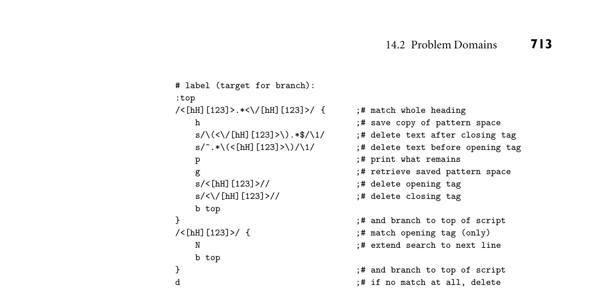
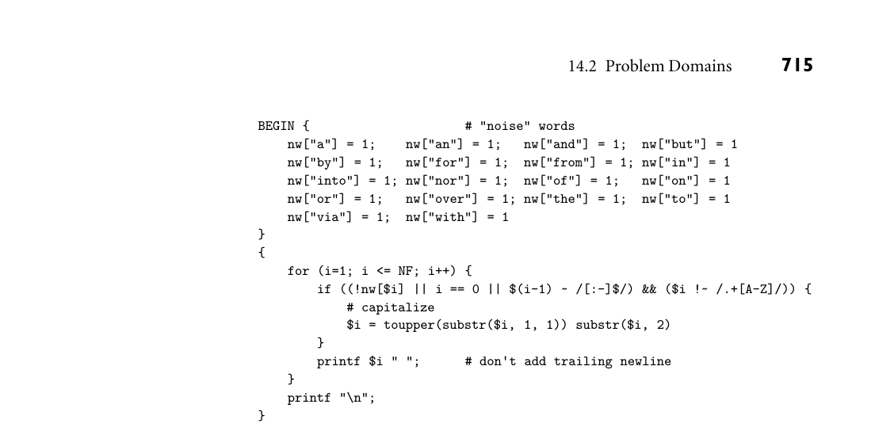
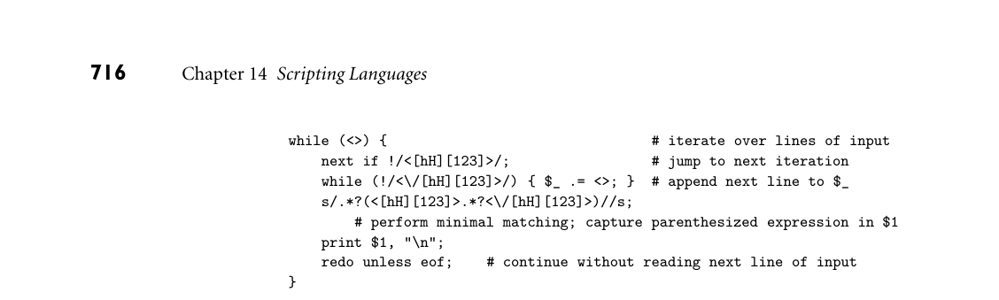
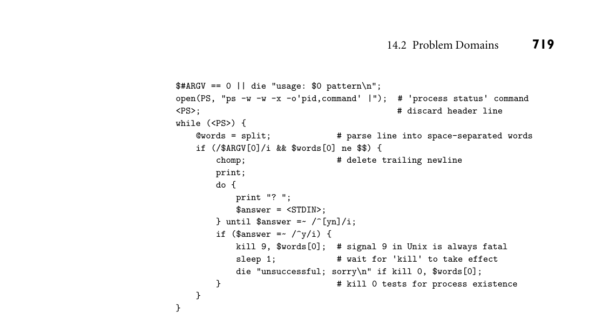
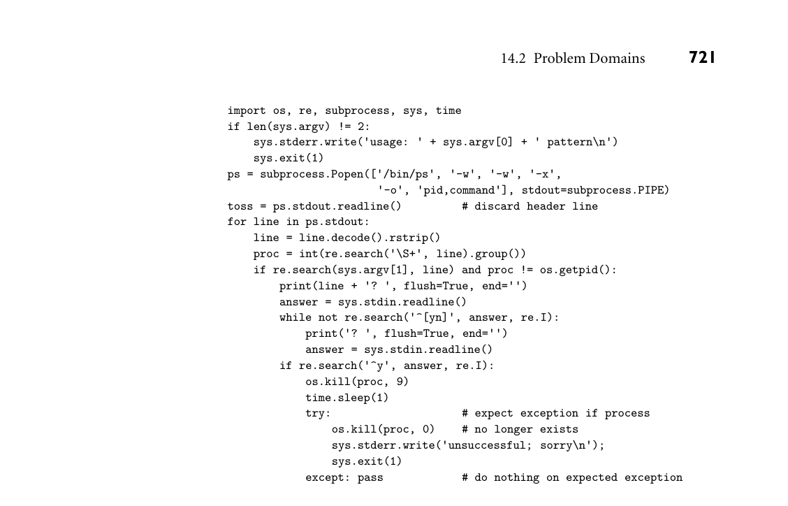
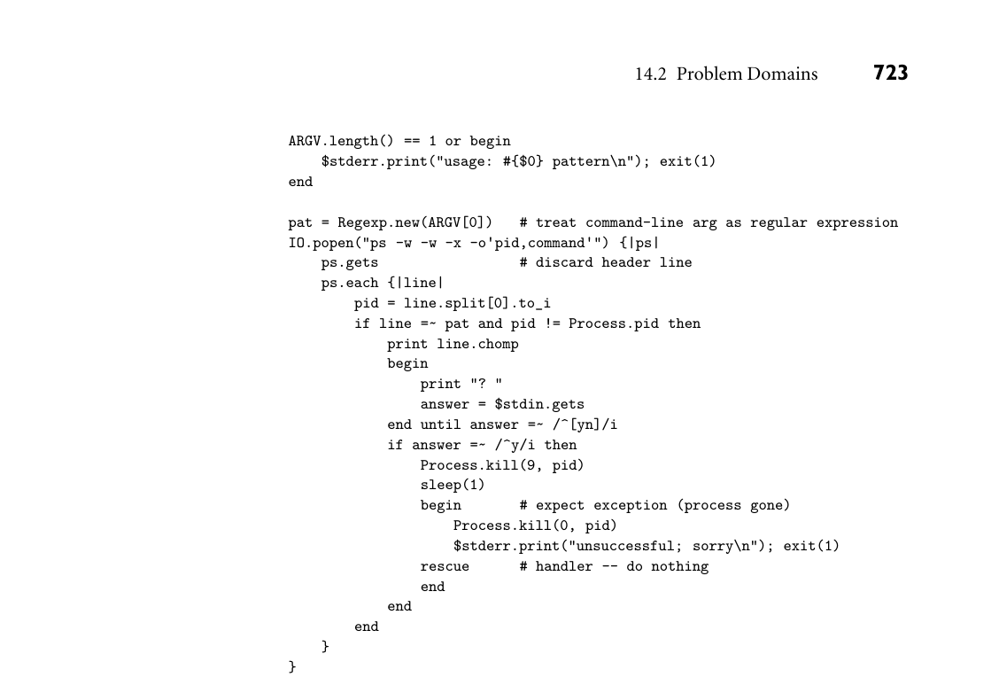
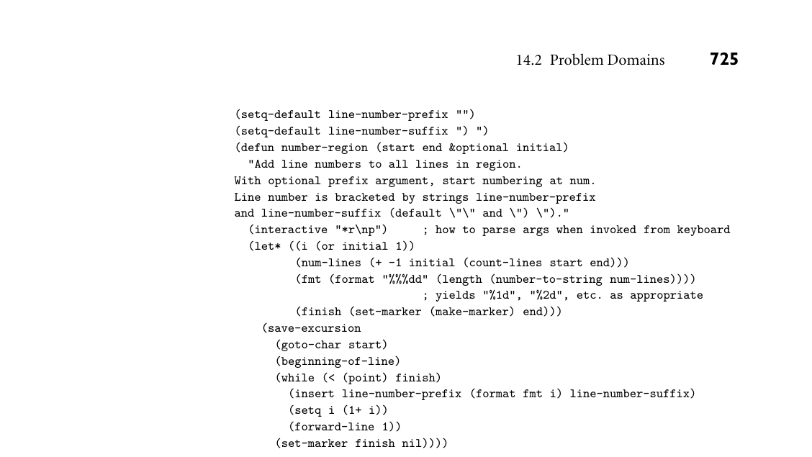

# 14.2 Problem Domains

704 Chapter 14 Scripting Languages

much more fundamental, and have much more direct support. Perl, for one, provides well over 100 built-in commands that access operating system func- tions for input and output, file and directory manipulation, process manage- ment, database access, sockets, interprocess communication and synchroniza- tion, protection and authorization, time-of-day clock, and network commu- nication. These built-in commands are generally a good bit easier to use than corresponding library calls in languages like C. Sophisticated pattern matching and string manipulation. In keeping with their text processing and report generation ancestry, and to facilitate the manip- ulation of textual input and output for external programs, scripting languages tend to have extraordinarily rich facilities for pattern matching, search, and string manipulation. Typically these are based on extended regular expressions. We discuss them further in Section 14.4.2. High-level data types. High-level data types like sets, bags, dictionaries, lists, and tuples are increasingly common in the standard library packages of conven- tional programming languages. A few languages (notably C++) allow users to redefine standard infix operators to make these types as easy to use as more primitive, hardware-centric types. Scripting languages go one step further by building high-level types into the syntax and semantics of the language itself. In most scripting languages, for example, it is commonplace to have an “array” that is indexed by character strings, with an underlying implementation based on hash tables. Storage is invariably garbage collected.

Much of the most rapid change in programming languages today is occurring in scripting languages. This can be attributed to several causes, including the continued growth of the Web, the dynamism of the open-source community, and the comparatively low investment required to create a new scripting language. Where a compiled, industrial-quality language like Java or C# requires a multiyear investment by a very large programming team, a single talented designer, working alone, can create a usable implementation of a new scripting language in only a year or two. Due in part to this rapid change, newer scripting languages have been able to incorporate some of the most innovative concepts in language design. Ruby, for example, has a uniform object model (much like Smalltalk), true iterators (like Clu), lambda expressions, (like Lisp), array slices (like Fortran 90), structured exception handling, multiway assignment, and reflection. Python has many of these features as well, and a few that Ruby lacks, including Haskell-style list com- prehensions. 14.2 Problem Domains

Some general-purpose languages—Scheme and Visual Basic, for example—are widely used for scripting. Conversely, some scripting languages, including Perl,

14.2 Problem Domains 705

Python, and Ruby, are intended by their designers for general-purpose use, with features intended to support “programming in the large”: modules, separate compilation, reflection, program development environments, and so on. For the most part, however, scripting languages tend to see their principal use in well- defined problem domains. We consider some of these in the following subsec- tions.

14.2.1 Shell (Command) Languages

In the days of punch-card computing (through perhaps the mid 1970s), simple command languages allowed the user to “script” the processing of a card deck. A control card at the front of the deck, for example, might indicate that the upcom- ing cards represented a program to be compiled, or perhaps machine language for the compiler itself, or input for a program already compiled and stored on disk. A control card embedded later in the deck might test the exit status of the most recently executed program and choose what to do next based on whether that program completed successfully. Given the linear nature of a card deck, however (one can’t in general back up), command languages for batch processing tended not to be very sophisticated. JCL, for example, had no iteration constructs. With the development of interactive timesharing in the 1960s and early 1970s, command languages became much more sophisticated. Louis Pouzin wrote a simple command interpreter for CTSS, the Compatible Time Sharing System at MIT, in 1963 and 1964. When work began on the groundbreaking Multics sys- tem in 1964, Pouzin sketched the design of an extended command language, with quoting and argument-passing mechanisms, for which he coined the term “shell.” The subsequent implementation served as inspiration for Ken Thompson in the design of the original Unix shell in 1973. In the mid-1970s, Stephen Bourne and John Mashey separately extended the Thompson shell with control flow and vari- ables; Bourne’s design was adopted as the Unix standard, taking the place (and the name) of the Thompson shell, sh. In the late 1970s Bill Joy developed the so-called “C shell” (csh), inspired at least in part by Mashey’s syntax, and introducing significant enhancementsfor in- teractive use, including history, aliases, and job control. The tcsh version of csh adds command-line editing and command completion. David Korn incorpo- rated these mechanisms into a direct descendant of the Bourne shell, ksh, which is very similar to the standard POSIX shell [Int03b]. The popular “Bourne-again” shell, bash, is an open-source version of ksh. While tcsh is still popular in some quarters, ksh/bash/POSIX sh is substantially better for writing shell scripts, and comparable for interactive use. In addition to features designed for interactive use, which we will not consider further here, shell languages provide a wealth of mechanisms to manipulate file- names, arguments, and commands, and to glue together other programs. Most of these features are retained by more general scripting languages. We consider a few of them here, using bash syntax. The discussion is of necessity heavily simplified; full details can be found in the bash man page, or in various on-line tutorials.

706 Chapter 14 Scripting Languages

Filename and Variable Expansion

Most users of a Unix shell are familiar with “wildcard” expansion of file names. The following command will list all files in the current directory whose names EXAMPLE 14.3

“Wildcards” and “globbing” end in .pdf:

ls *.pdf

The shell expands the pattern *.pdf into a list of all matching names. If there are three of them (say fig1.pdf, fig2.pdf, and fig3.pdf), the result is equivalent to

ls fig1.pdf fig2.pdf fig3.pdf

Filename expansion is sometimes called “globbing,” after the original Unix glob command that implemented it. In addition to * wildcards, one can usually specify “don’t care” or alternative characters or substrings. The pattern fig?.pdf will match (expand to) any file(s) with a single character between the g and the dot. The pattern fig[0-9].pdf will require that character to be a digit. The pattern fig3.{eps,pdf} will match both fig3.eps and fig3.pdf. ■ Filename expansion is particularly useful in loops. Such loops may be typed directly from the keyboard, or embedded in scripts intended for later execution. Suppose, for example, that we wish to create PDF versions of all our EPS figures:1 EXAMPLE 14.4

For loops in the shell for fig in *.eps do ps2pdf $fig done

The for construct arranges for the shell variable fig to take on the names in the expansion of *.eps, one at a time, in consecutive iterations of the loop. The dollar sign in line 3 causes the value of fig to be expanded into the ps2pdf com- mand before it is executed. (Interestingly, ps2pdf is itself a shell script that calls the gs Postscript interpreter.) Optional braces can be used to separate a variable name from following characters, as in cp $foo ${foo}_backup. ■ Multiple commands can be entered on a single line if they are separated by EXAMPLE 14.5

A whole loop on one line semicolons. The following, for example, is equivalent to the loop in the previous example:

for fig in *.eps; do ps2pdf $fig; done ■

1 Postscript is a programming language developed at Adobe Systems, Inc. for the description of images and documents (we consider it again in Sidebar 15.1). Encapsulated Postscript (EPS) is a restricted form of Postscript intended for figures that are to be embedded in other documents. Portable Document Format (PDF, also by Adobe) is a self-contained file format that combines a subset of Postscript with font embedding and compression mechanisms. It is strictly less powerful than Postscript from a computational perspective, but much more portable, and faster and easier to render.

14.2 Problem Domains 707

Tests, Queries, and Conditions

The loop above will execute ps2pdf for every EPS file in the current directory. Suppose, however, that we already have some PDF files, and only want to create EXAMPLE 14.6

Conditional tests in the shell the ones that are missing:

for fig in *.eps do target=${fig%.eps}.pdf if [ $fig -nt $target ] then ps2pdf $fig fi done

The third line of this script is a variable assignment. The expression ${fig%.eps} within the right-hand side expands to the value of fig with any trailing .eps re- moved. Similar special expansions can be used to test or modify the value of a variable in many different ways. The square brackets in line four delimit a con- ditional test. The -nt operator checks to see whether the file named by its left operand is newer than the file named by its right operand (or if the left operand exists but the right does not). Similar file query operators can be used to check many other properties of files. Additional operators can be used for arithmetic or string comparisons. ■

DESIGN & IMPLEMENTATION

14.3 Built-in commands in the shell Commands in the shell generally take the form of a sequence of words, the first of which is the name of the command. Most commands are executable pro- grams, found in directories on the shell’s search path. A large number, however (about 50 in bash), are builtins—commands that the shell recognizes and ex- ecutes itself, rather than starting an external program. Interestingly, several commands that are available as separate programs are duplicated as builtins, either for the sake of efficiency or to provide additional semantics. Conditional tests, for example, were originally supported by the external test command (for which square brackets are syntactic sugar), but these occur sufficiently often in scripts that execution speed improved significantly when a built-in version was added. By contrast, while the kill command is not used very often, the built-in version allows processes to be identified by small integer or symbolic names from the shell’s job control mechanism. The external ver- sion supports only the longer and comparatively unintuitive process identifiers supplied by the operating system.

708 Chapter 14 Scripting Languages

Pipes and Redirection

One of the principal innovations of Unix was the ability to chain commands to- gether, “piping” the output of one to the input of the next. Like most shells, bash uses the vertical bar character (|) to indicate a pipe. To count the number of fig- EXAMPLE 14.7

Pipes ures in our directory, without distinguishing between EPS and PDF versions, we might type

for fig in *; do echo ${fig%.*}; done | sort -u | wc -l

Here the first command, a for loop, prints the names of all files with extensions (dot-suffixes) removed. The echo command inside the loop simply prints its arguments. The sort -u command after the loop removes duplicates, and the wc -l command counts lines. ■ Like most shells, bash also allows output to be redirected to a file, or input read from a file. To create a list of figures, we might type EXAMPLE 14.8

Output redirection for fig in *; do echo ${fig%.*}; done | sort -u > all_figs

The “greater than” sign indicates output redirection. If doubled (sort -u >> all_figs) it causes output to be appended to the specified file, rather than over- writing the previous contents. In a similar vein, the “less than” sign indicates input redirection. Suppose we want to print our list of figures all on one line, separated by spaces, instead of on multiple lines. On a Unix system we can type

tr '\n' ' ' < all_figs

This invocation of the standard tr command converts all newline characters to spaces. Because tr was written as a simple filter, it does not accept a list of files on the command line; it only reads standard input. ■ For any executing Unix program, the operating system keeps track of a list of open files. By convention, standard input and standard output (stdin and stdout) are files numbers 0 and 1. File number 2 is by convention standard error (stderr), to which programs are supposed to print diagnostic error messages. One of the advantages of the sh family of shells over the csh family is the abil- ity to redirect stderr and other open files independent of stdin and stdout. Consider, for example, the ps2pdf script. Undernormal circumstances this script EXAMPLE 14.9

Redirection of stderr and stdout works silently. If it encounters an error, however, it prints a message to stdout and quits. This violation of convention (the message should go to stderr) is harmless when the command is invoked from the keyboard. If it is embedded in a script, however, and the output of the script is directed to a file, the error mes- sage may end up in the file instead of on the screen, and go unnoticed by the user. With bash we can type

ps2pdf my_fig.eps 1>&2

14.2 Problem Domains 709

Here 1>&2 means “make ps2pdf send file 1 (stdout) to the same place that the surrounding context would normally send file 2 (stderr).” ■ Finally, like most shells, bash allows the user to provide the input to a com- EXAMPLE 14.10

Heredocs (in-line input) mand in-line:

tr '\n' ' ' <<END list of input lines END

The <<END indicates that subsequent input lines, up to a line containing only END, are to be supplied as input to tr. Such in-line input (traditionally called a “here document”) is seldom used interactively, but is highly useful in shell scripts. ■

Quoting and Expansion

Several examples in the preceding subsections have implicitly relied on the as- sumption that file names do not contain spaces. Returning to Example 14.4, we EXAMPLE 14.11

Problematic spaces in file names will encounter a “file not found” error if we try to run our loop in a directory that contains a file named two words.eps: ps2pdf will end up interpreting its arguments as two words instead of one, and will try to translate file two (which doesn’t exist) into words.eps. To avoid problems like this, shells typically pro- vide a quoting mechanism that will group words together into strings. We could fix Example 14.4 by typing

for fig in *.eps do ps2pdf "$fig" done

Here the double quotes around $fig cause it to be interpreted as a single word, even if it contains white space. ■ But this is not the only kind of quoting. Single (straight or forward) quotes EXAMPLE 14.12

Single and double quotes also group text into words, but inhibit filename and variable expansion in the quoted text. Thus

foo=bar single='$foo' double="$foo" echo $single $double

will print “$foo bar”. ■ Several other bracketing constructs in bash group the text inside, for various purposes. Command lists enclosed in parentheses are passed to a subshell for EXAMPLE 14.13

Subshells evaluation. If the opening parenthesis is preceded by a dollar sign, the output of the nested command list is expanded into the surrounding context:

710 Chapter 14 Scripting Languages

for fig in $(cat my_figs); do ps2pdf ${fig}.eps; done

Here cat is the standard command to print the content of a file. Most shells use backward single quotes for the same purpose (`cat my_figs`); bash supports this syntax as well, for backward compatibility. ■ Command lists enclosed in braces are treated by bash as a single unit. They EXAMPLE 14.14

Brace-quoted blocks in the shell can be used, for example, to redirect the output of a sequence of commands:

{ date; ls; } >> file_list

Unlike parenthesized lists, commands enclosed in braces are executed by the cur- rent shell. From a programming languages perspective, parentheses and braces behave “backward” from the way they do in C: parentheses introduce a nested dynamic scope in bash, while braces are purely for grouping. In particular, vari- ables that are assigned new values within a parenthesized command list will revert to their previous values once the list has completed execution. ■ When not surrounded by white space, braces perform pattern-based list gen- EXAMPLE 14.15

Pattern-based list generation eration, in a manner similar to filename expansion, but without the connec- tion to the file system. For example, echo abc{12,34,56}xyz prints abc12xyz abc34xyz abc56xyz. Also, as we have seen, braces serve to delimit variable names when the opening brace is preceded by a dollar sign. ■ In Example 14.6 we used square brackets to enclose a conditional expression. Double square brackets serve a similar purpose, but with more C-like expression syntax, and without filename expansion. Double parentheses are used to enclose arithmetic computations, again with C-like syntax. The interpolation of commands in $( ) or backquotes, patterns in { }, and arithmetic expressions in (( )) are all considered forms of expansion, analogous to filename expansion and variable expansion. The splitting of strings into words is also considered a form of expansion, as is the replacement, in certain contexts, of tilde (~) characters with the name of the user’s home directory. All told, these give us seven different kinds of expansion in bash. All of the various bracketing constructs have rules governing which kinds of expansion are performed within. The rules are intended to be as intuitive as pos- sible, but they are not uniform across constructs. Filename expansion, for exam- ple, does not occur within [[ ]]-bracketed conditions. Similarly, a double-quote character may appear inside a double-quoted string if escaped with a backslash, but a single-quote character may not appear inside a single-quoted string.

Functions

Users can define functions in bash that then work like built-in commands. Many EXAMPLE 14.16

User-defined shell functions users, for example, define ll as a shortcut for ls -l, which lists files in the cur- rent directory in “long format”:

function ll () { ls -l "$@" }

14.2 Problem Domains 711

Within the function, $1 represents the first parameter, $2 represents the second, and so on. In the definition of ll, $@ represents the entire parameter list. Func- tions can be arbitrarily complex. In particular, bash supports both local variables and recursion. Shells in the csh family provide a more primitive alias mecha- nism that works via macro expansion. ■

The #! Convention

As noted above, shell commands can be read from a script file. To execute them EXAMPLE 14.17

The #! convention in script files in the current shell, one uses the “dot” command:

. my_script

where my_script is the name of the file. Many operating systems, including most versions of Unix, allow one to turn a script file into an executable program, so that users can simply type

my_script

Two steps are required. First, the file must be marked executable in the eyes of the operating system. On Unix one types chmod +x my_script. Second, the file must be self-descriptive in a way that allows the operating system to tell which shell (or other interpreter) will understand the contents. Under Unix, the file must begin with the characters #!, followed by the name of the shell. The typical bash script thus begins with

#!/bin/bash

Specifying the full path name is a safety feature: it anticipates the possibility that the user may have a search path for commands on which some other program named bash appears before the shell. (Unfortunately, the requirement for full path names makes #! lines nonportable, since shells and other interpreters may be installed in different places on different machines.) ■

3CHECK YOUR UNDERSTANDING 1. Give a plausible one-sentence definition of “scripting language.” 2. List the principal ways in which scripting languages differ from conventional “systems” languages. 3. From what two principal sets of ancestors are modern scripting languages descended?

4. What IBM creation is generally considered the first general-purpose scripting language?

5. What is the most popular language for server-side web scripting?

712 Chapter 14 Scripting Languages

6. How does the notion of context in Perl differ from coercion?

7. What is globbing? What is a wildcard? 8. What is a pipe in Unix? What is redirection?

9. Describe the three standard I/O streams provided to every Unix process. 10. Explain the significance of the #! convention in Unix shell scripts.

DESIGN & IMPLEMENTATION

14.4 Magic numbers When the Unix kernel is asked to execute a file (via the execve system call), it checks the first few bytes of the file for a “magic number” that indicates the file’s type. Some values correspond to directly executable object file formats. UnderLinux, for example, the first four bytes of an object file are 0x7f45_4c46 (⟨del⟩ELF in ASCII). Under Mac OS X they are 0xfeed_face. If the first two bytes are 0x2321 (#! in ASCII), the kernel assumes that the file is a script, and reads subsequent characters to find the name of the interpreter. The #! convention in Unix is the main reason that most scripting languages use # as the opening comment delimiter. Early versions of sh used the no-op command (:) as a way to introduce comments. Joy’s C shell introduced #, whereupon some versions of sh were modified to launch csh when asked to execute a script that appeared to begin with a C shell comment. This mecha- nism evolved into the more general mechanism used in many (though not all) variants of Unix today.

14.2.2 Text Processing and Report Generation

Shell languages tend to be heavily string-oriented. Commands are strings, parsed into lists of words. Variables are string-valued. Variable expansion mechanisms allow the user to extract prefixes, suffixes, or arbitrary substrings. Concatenation is indicated by simple juxtaposition. There are elaborate quoting conventions. Few more conventional languages have similar support for strings. At the same time, shell languages are clearly not intended for the sort of text manipulation commonly performed in editors like emacs or vim. Search and substitution, in particular, are missing, and many other tasks that editors accom- plish with a single keystroke—insertion, deletion, replacement, bracket match- ing, forward and backward motion—would be awkward to implement, or simply make no sense, in the context of the shell. For repetitive text manipulation it is natural to want to automate the editing process. Tools to accomplish this task constitute the second principal class of ancestors for modern scripting languages.

*Figure 14.1 Script in sed to extract headers from an HTML file. The script assumes that opening and closing tags are properly matched, and that headers do not nest.*

Sed

As a simple text processing example, consider the problem of extracting all head- EXAMPLE 14.18

Extracting HTML headers with sed ers from a web page (an HTML file). These are strings delimited by <h1> ... </h1>, <h2> ... </h2>, and <h3> ... </h3> tags. Accomplishing this task in an editor like emacs, vim, or even Microsoft Word is straightforward but tedious: one must search for an opening tag, delete preceding text, search for a closing tag, mark the current position (as the starting point for the next deletion), and re- peat. A program to perform these tasks in sed, the Unix “stream editor,” appears in Figure 14.1. The code consists of a label and three commands, the first two of which are compound. The first compound command prints the first header, if any, found in the portion of the input currently being examined (what sed calls the pattern space). The second compound command appends a new line to the pattern space whenever it already contains a header-opening tag. Both compound commands, and several of the subcommands, use regular expression patterns, de- limited by slashes. We will discuss these patterns further in Section 14.4.2. The third command (the lone d) simply deletes the pattern space. Because each com- pound command ends with a branch back to the top of the script, the second will execute only if the first does not, and the delete will execute only if neither compound does. ■ The editor heritage of sed is clear in this example. Commands are generally one character long, and there are no variables—no state of any kind beyond the program counter and text that is being edited. These limitations make sed best suited to “one-line programs,” typically entered verbatim from the keyboard with the -e command-line switch. The following, for example, will read from standard EXAMPLE 14.19

One-line scripts in sed input, delete blank lines, and (implicitly) print the nonblank lines to standard output:

*Figure 14.2 Script in awk to extract headers from an HTML file. Unlike the sed script, this version prints interior lines incrementally. It again assumes that the input is well formed.*

sed -e'/^[[:space:]]*$/d'

Here ^ represents the beginning of the line and $ represents the end. The [[:space:]] expression matches any white-space character in the local char- acter set, to be repeated an arbitrary number of times, as indicated by the Kleene star (*). The d indicates deletion. Nondeleted lines are printed by default. ■

Awk

In an attempt to address the limitations of sed, Alfred Aho, Peter Weinberger, and Brian Kernighan designed awk in 1977 (the name is based on the initial letters of their last names). Awk is in some sense an evolutionary link between stream editors like sed and full-fledged scripting languages. It retains sed’s line-at-a- time filter model of computation, but allows the user to escape this model when desired, and replaces single-character editing commands with syntax reminiscent of C. Awk provides (typeless) variables and a variety of control-flow constructs, including subroutines. An awk program consists of a sequence of patterns, each of which has an as- sociated action. For every line of input, the interpreter executes, in order, the actions whose patterns evaluate to true. An example with a single pattern-action EXAMPLE 14.20

Extracting HTML headers with awk pair appears in Figure 14.2. It performs essentially the same task as the sed script of Figure 14.1. Lines that contain no opening tag are ignored. In a line with an opening tag, we delete any text that precedes the header. We then print lines until we find the closing tag, and repeat if there is another opening tag on the same line. We fall back into the interpreter’s main loop when we’re cleanly outside any header. Several conventions can be seen in this example. The current input line is available in the pseudovariable $0. The getline function reads into this variable

*Figure 14.3 Script in awk to capitalize a title. The BEGIN block is executed before reading any input lines. The main block has no explicit pattern, so it is applied to every input line.*

by default. The substr(s, a, b) function extracts the portion of string s start- ing at position a and with length b. If b is omitted, the extracted portion runs to the end of s. Conditions, like patterns, can use regular expressions; we can see an example in the do ... while loop. By default, regular expressions match against $0. ■ Perhaps the two most important innovations of awk are fields and associative arrays, neither of which appears in Figure 14.2. Like the shell, awk parses each input line into a series of words (fields). By default these are delimited by white space, though the user can change this behavior dynamically by assigning a regu- lar expression to the built-in variable FS (field separator). The fields of the current input line are available in the pseudovariables $1, $2, .... The built-in variable NR gives the total number of fields. Awk is frequently used for field-based one-line programs. The following, for example, will print the second word of every line of EXAMPLE 14.21

Fields in awk standard input:

awk '{ print $2 }' ■

Associative arrays will be considered in more detail in Section 14.4.3. Briefly, they combine the functionality of hash tables with the syntax of arrays. We can EXAMPLE 14.22

Capitalizing a title in awk illustrate both fields and associative arrays with an example script (Figure 14.3) that capitalizes each line of its input as if it were a title. The script declines to modify “noise” words (articles, conjunctions, and short prepositions) unless they are the first word of the title or of a subtitle, where a subtitle follows a word ending with a colon or a dash. The script also declines to modify words in which any letter other than the first is already capitalized. ■

*Figure 14.4 Script in Perl to extract headers from an HTML file. For simplicity we have again adopted the strategy of buffering entire headers, rather than printing them incrementally.*

Perl

Perl was originally developed by Larry Wall in 1987, while he was working at the National Security Agency. The original version was, to first approximation, an at- tempt to combine the best features of sed, awk, and sh. It was a Unix-only tool, meant primarily for text processing (the name stands for “practical extraction and report language”). Over the years Perl grew into a large and complex lan- guage, with an enormous user community. For many years it was clearly the most popular and widely used scripting language, though that lead has more recently been lost to Python, Ruby, and others. Perl is fast enough for much general- purpose use, and includes separate compilation, modularization, and dynamic library mechanisms appropriate for large-scale projects. It has been ported to almost every known operating system. Perl consists of a relatively simple language core, augmented with an enormous number of built-in library functions and an equally enormous number of short- cuts and special cases. A hint at this richness of expression can be found in the standard language reference [CfWO12, p. 722], which lists (only) the 97 built-in functions “whose behavior varies the most across platforms.” The cover of the third edition was emblazoned with the motto: “There’s more than one way to do it.” We will return to Perl several times in this chapter, notably in Sections 14.2.4 and 14.4. For the moment we content ourselves with a simple text-processing EXAMPLE 14.23

Extracting HTML headers with Perl example, again to extract headers from an HTML file (Figure 14.4). We can see several Perl shortcuts in this figure, most of which help to make the code shorter than the equivalent programs in sed (Figure 14.1) and awk (Figure 14.2). Angle brackets (<>) are the “readline” operator, used for text file input. Normally they surround a file handle variable name, but as a special case, empty angle brackets generate as input the concatenation of all files specified on the command line when the script was first invoked (or standard input, if there were no such files). When a readline operator appears by itself in the control expression of a while loop (but nowhere else in the language), it generates its input a line at a time into the pseudovariable $_. Several other operators work on $_ by default. Regular expressions, for example, can be used to search within arbitrary strings, but when none is specified, $_ is assumed.

14.2 Problem Domains 717

The next statement is similar to continue in C or Fortran: it jumps to the bottom of the innermost loop and begins the next iteration. The redo statement also skips the remainder of the current iteration, but returns to the top of the loop, without reevaluating the control expression. In our example program, redo allows us to append additional input to the current line, rather than reading a new line. Because end-of-file is normally detected by an undefined return value from <>, and because that failure will happen only once per file, we must explicitly test for eof when using redo here. Note that if and its symmetric opposite, unless, can be used as either a prefix or a postfix test. Readers familiar with Perl may have noticed two subtle but key innovations in the substitution command of line 4 of the script. First, where the expression .* (in sed, awk, and Perl) matches the longest possible string of characters that permits subsequent portions of the match to succeed, the expression .*? in Perl matches the shortest possible such string. This distinction allows us to easily iso- late the first header in a given line. Second, much as sed allows later portions of a regular expression to refer back to earlier, parenthesized portions (line 4 of Figure 14.1), Perl allows such captured strings to be used outside the regular ex- pression. We have leveraged this feature to print matched headers in line 6 of Figure 14.4. In general, the regular expressions of Perl are significantly more pow- erful than those of sed and awk; we will return to this subject in more detail in Section 14.4.2. ■

14.2.3 Mathematics and Statistics

As we noted in our discussions of sed and awk, one of the distinguishing charac- teristics of text processing and report generation is the frequent use of “one-line programs” and other simple scripts. Anyone who has ever entered formulas in the cells of a spreadsheet realizes that similar needs arise in mathematics and statis- tics. And just as shell and report generation tools have evolved into powerful languages for general-purpose computing, so too have notations and tools for mathematical and statistical computing. In Section 8.2.1 (“Slices and Array Operations”), we mentioned APL, one of the more unusual languages of the 1960s. Originally conceived as a pen-and- paper notation for teaching applied mathematics, APL retained its emphasis on the concise, elegant expression of mathematical algorithms when it evolved into a programming language. Though it lacked both easy access to other programs and sophisticated string manipulation, APL displayed all the other characteristics of scripting described in Section 14.1.1, and one sometimes finds it listed as a scripting language. The modern successors to APL include a trio of commercial packages for math- ematical computing: Maple, Mathematica, and Matlab. Though their design philosophies differ, each provides extensive support for numerical methods, sym- bolic mathematics (formula manipulation), data visualization, and mathematical

718 Chapter 14 Scripting Languages

modeling. All three provide powerful scripting languages, with a heavy orienta- tion toward scientific and engineering applications. As the “3 Ms” are to mathematical computing, so the S and R languages are to statistical computing. Originally developed at Bell Labs by John Chambers and colleagues in the late 1970s, S is a commercial package widely used in the statistics community and in quantitative branches of the social and behavioral sciences. R is an open-source alternative to S that is largely though not entirely compatible with its commercial cousin. Among other things, R supports multidimensional array and list types, array slice operations, user-defined infix operators, call-by- need parameters, first-class functions, and unlimited extent.

14.2.4 “Glue” Languages and General-Purpose Scripting

From their text-processing ancestors, scripting languages inherit a rich set of pat- tern matching and string manipulation mechanisms. From command interpreter shells they inherit a wide variety of additional features including simple syntax; flexible typing; easy creation and management of subprograms, with I/O redirec- tion and access to completion status; file queries; easy interactive and file-based I/O; easy access to command-line arguments, environment strings, process iden- tifiers, time-of-day clock, and so on; and automatic interpreter start-up (the #! convention). As noted in Section 14.1.1, many scripting languages have inter- preters that will accept commands interactively. The combination of shell and text-processing mechanisms allows a scripting language to prepare input to, and parse output from, subsidiary processes. As a EXAMPLE 14.24

“Force quit” script in Perl simple example, consider the (Unix-specific) “force quit” Perl script shown in Fig- ure 14.5. Invoked with a regular expression as argument, the script identifies all of the user’s currently running processes whose name, process id, or command-line arguments match that regular expression. It prints the information for each, and prompts the user for an indication of whether the process should be killed. The second line of the code starts a subsidiary process to execute the Unix ps command. The command-line arguments cause ps to print the process id and name of all processes owned by the current user, together with their full command-line arguments. The pipe symbol (|) at the end of the command in- dicates that the output of ps is to be fed to the script through the PS file handle. The main while loop then iterates over the lines of this output. Within the loop, the if condition matches each line against $ARGV[0], the regular expression pro- vided on the script’s command line. It also compares the first word of the line (the process id) against $$, the id of the Perl interpreter currently running the script. Scalar variables (which in Perl include strings) begin with a dollar sign ($). Arrays begin with an at sign (@). In the first line of the while loop in Figure 14.5, the input line ($_, implicitly) is split into space-separated words, which are then assigned into the array @words. In the following line, $words[0] refers to the first element of this array, a scalar. A single variable name may have different values when interpreted as a scalar, an array, a hash table, a subroutine, or a file

*Figure 14.5 Script in Perl to “force quit” errant processes. Perl’s text processing features allow us to parse the output of ps, rather than filtering it through an external tool like sed or awk.*

handle. The choice of interpretation depends on the leading punctuation mark and on the context in which the name appears. We shall have more to say about context in Perl in Section 14.4.3. ■ Beyond the combination of shell and text-processing mechanisms, the typi- cal glue language provides an extensive library of built-in operations to access features of the underlying operating system, including files, directories, and I/O; processes and process groups; protection and authorization; interprocess com- munication and synchronization; timing and signals; and sockets, name service, and network communication. Just as text-processing mechanisms minimize the need to employ external tools like sed, awk, and grep, operating system builtins minimize the need for other external tools. At the same time, scripting languages have, over time, developed a rich set of features for internal computation. Most have significantly better support for mathematics than is typically found in a shell. Several, including Scheme, Python, and Ruby, support arbitrary precision arithmetic. Most provide extensive support for higher-level types, including arrays, strings, tuples, lists, and hashes (associa- tive arrays). Several support classes and object orientation. Some support itera- tors, continuations, threads, reflection, and first-class and higher-order functions. Some, including Perl, Python, and Ruby, support modules and dynamic loading, for “programming in the large.” These features serve to maximize the amount of code that can be written in the scripting language itself, and to minimize the need to escape to a more traditional, compiled language.

720 Chapter 14 Scripting Languages

In summary, the philosophy of general-purpose scripting is to make it as easy as possible to construct the overall framework of a program, escaping to exter- nal tools only for special-purpose tasks, and to compiled languages only when performance is at a premium.

Python

As noted in Section 14.1, Rexx is generally considered the first of the general- purpose scripting languages, predating Perl and Tcl by almost a decade. Perl and Tcl are roughly contemporaneous: both were initially developed in the late 1980s. Perl was originally intended for glue and text-processing applications. Tcl was originally an extension language, but soon grew into glue applications as well. As the popularity of scripting grew in the 1990s, users were motivated to develop additional languages, to provide additional features, address the needs of specific application domains (more on this in subsequent sections), or support a style of programming more in keeping with the personal taste of their designers. Python was originally developed by Guido van Rossum at CWI in Amsterdam, the Netherlands, in the early 1990s. He continued his work at CNRI in Reston, Virginia, beginning in 1995. After a series of subsequent moves, he joined Google in 2005. Recent versions of the language are owned by the Python Software Foun- dation. All releases are open source. Figure 14.6 presents a Python version of the “force quit” program from Exam- EXAMPLE 14.25

“Force quit” script in Python ple 14.24. Reflecting the maturation of programming language design, Python was from the beginning an object-oriented language.2 It includes a standard li- brary as rich as that of Perl, but partitioned into a collection of namespaces rem- iniscent of those of C++, Java, or C#. The first line of our script imports symbols from the os, re, subprocess, sys, and time library modules. The fifth line launches ps as an external program, and arranges for its output to be available to the script through a Unix pipe. We discard the initial (header) line of output from the subprocess by calling the output pipe’s readline method. We then use a Python for loop to iterate over the remaining lines. Perhaps the most distinctive feature of Python, though hardly the most impor- tant, is its reliance on indentation for syntactic grouping. Python not only uses line breaks to separate commands; it also specifies that the body of a structured statement consists of precisely those subsequent statements that are indented one more tab stop. Like the “more than one way to do it” philosophy of Perl, Python’s use of indentation tends to arouse strong feelings among users: some strongly positive, some strongly negative. The regular expression (re) library has all of the power available in Perl, but employs the somewhat more verbose syntax of method calls, rather than the built- in notation of Perl. The search routine returns a “match object” that captures,

2 Rexx and Tcl have object-oriented extensions, named Object Rexx and Incr Tcl, respectively. Perl 5 includes some (rather awkward) object-oriented features; Perl 6 will have more uniform object support.

*Figure 14.6 Script in Python 3 to “force quit” errant processes. Compare with Figure 14.5.*

lazily, the places in the string at which the pattern appears. If no match is found, search returns None, the empty object, instead. In a condition, None is inter- preted as false, while a true match object is interpreted as true. The match object in turn supports a variety of methods, including group, which returns the sub- string corresponding to the first match. The re.I flag to search indicates case insensitivity. Note that group returns a string. Unlike Perl and Tcl, Python will not coerce this to an integer—hence the need for the explicit type conversion on the second line of the body of the for loop. As in Perl, the readline method does not remove the newline character at the end of an input line; we use the rstrip method to do this. The print function adds a newline to the end of its argument list unless given a different end string. Unless explicitly instructed to flush, it also tends to buffer its output, waiting to call the OS until it has a large amount of data; this needs to be defeated for interactive IO. The sleep and kill routines are available as library built-ins in Python, much as they are in Perl; there is no need to start a separate program. When given a signal number of 0, kill tests for process existence. Instead of returning a status code, however, as it does in Perl, Python’s kill throws an exception if the process does not exist. We use a try block to catch this exception in the expected case. ■

722 Chapter 14 Scripting Languages

While our “force quit” program may convey, at least in part, the “feel” of Perl and Python, it cannot capture the breadth of their capabilities. Python in- cludes many of the more interesting features discussed in earlier chapters, includ- ing nested functions with static scoping, lambda expressions and higher-order functions, true iterators, list comprehensions, array slice operations, reflection, structured exception handling, multiple inheritance, and modules and dynamic loading. Many of these also appear in Ruby.

Ruby

Ruby was developed in Japan in the early 1990s by Yukihiro “Matz” Matsumoto. Matz writes that he “wanted a language more powerful than Perl, and more object-oriented than Python” [TFH13, Foreword]. The first public release was made available in 1995, and quickly gained widespread popularity in Japan. With the publication in 2001 of English-language documentation [TFH13, 1st ed.], Ruby spread rapidly elsewhere as well. Much of its success can be credited to the Ruby on Rails web-development framework. Originally released by David Heinemeier Hansson in 2004, Rails was subsequently adopted by several major players—notably Apple, which included it in the 10.5 “Leopard” release of the Mac OS, and Twitter, which used it for early versions of their infrastructure. In keeping with Matz’s original motivation, Ruby is a pure object-oriented lan- EXAMPLE 14.26

Method call syntax in Ruby guage, in the sense of Smalltalk: everything—even instances of built-in types—is an object. Integers have more than 25 built-in methods. Strings have more than 75. Smalltalk-like syntax is even supported: 2 * 4 + 5 is syntactic sugar for (2.*(4)).+(5), which is in turn equivalent to (2.send(‚*‚, 4)).send(‚+‚, 5).3 ■ Figure 14.7 presents a Ruby version of our “force quit” program. Newline EXAMPLE 14.27

“Force quit” script in Ruby characters serve to end the current statement, but indentation is not significant. A dollar sign ($) at the beginning of an identifier indicates a global name. Though it doesn’t appear in this example, an at sign (@) indicates an instance variable of the current object. Double at signs (@@) indicate an instance variable of the current class. Probably the most distinctive feature of Figure 14.7 is its use of blocks and it- erators. The IO.popen class method takes as argument a string that specifies the name and arguments of an external program. The method also accepts, in a man- ner reminiscent of Smalltalk, an associated block, specified as a multiline fragment of Ruby code delimited with curly braces. The associated block is essentially an extra parameter to popen, passed as a closure. The closure is invoked by popen, passing as parameter a file handle (an object of class IO) that represents the out- put of the external command. The |ps| at the beginning of the block specifies the name by which this handle is known within the block. In a similar vein, the each

3 Parentheses here are significant. Infix arithmetic follows conventional precedence rules, but method invocation proceeds from left to right. Likewise, parentheses can be omitted around ar- gument lists, but the method-selecting dot (.) groups more tightly than the argument-separating comma (,), so 2.send ’*’, 4.send ’+’, 5 evaluates to 18, not 13.

*Figure 14.7 Script in Ruby to “force quit” errant processes. Compare with Figures 14.5 and 14.6.*

method of object ps is an iterator that invokes the associated block (the code in braces beginning with |line|) once for every line of data. For those more com- fortable with traditional for loop syntax, the iterator can also be written

for line in PS ... end

In addition to (true) iterators, Ruby provides continuations, first-class and higher-order functions, and closures with unlimited extent. Its module mech- anism supports an extended form of mix-in inheritance. Though a class cannot inherit data members from a module, it can inherit code. Run-time type checking makes such inheritance more or less straightforward. Methods of modules that have not been explicitly included into the current class can be accessed as qual- ified names; Process.kill is an example in Figure 14.7. Methods sleep and exit belong to module Kernel, which is included by class Object, and is thus available everywhere without qualification. Like popen, they are class methods,

724 Chapter 14 Scripting Languages

rather than instance methods; they have no notion of “current object.” Variables stdin and stderr refer to global objects of class IO. Regular expression operations in Ruby are methods of class Regexp, and can be invoked with standard object-oriented syntax. For convenience, Perl-like nota- tion is also supported as syntactic sugar; we have used this notation in Figure 14.7. The rescue clause of the innermost begin ... end block is an exception han- dler. As in the Python code of Figure 14.6, it allows us to determine whether the kill operation has succeeded by catching the (expected) exception that arises when we attempt to refer to a process after it has died. ■

14.2.5 Extension Languages

Most applications accept some sort of commands, which tell them what to do. Sometimes these commands are entered textually; more often they are triggered by user interface events such as mouse clicks, menu selections, and keystrokes. Commands in a graphical drawing program might save or load a drawing; select, insert, delete, or modify its parts; choose a line style, weight, or color; zoom or rotate the display; or modify user preferences. An extension language serves to increase the usefulness of an application by al- lowing the user to create new commands, generally using the existing commands as building blocks. Extension languages are widely regarded as an essential feature of sophisticated tools. Adobe’s graphics suite (Illustrator, Photoshop, InDesign, etc.) can be extended (scripted) using JavaScript, Visual Basic (on Windows), or AppleScript (on the Mac). Disney and Industrial Light & Magic use Python to extend their internal (proprietary) tools. The computer gaming industry makes heavy use of Lua for scripting of both commercial and open-source game en- gines. Many commercially available tools, including AutoCAD, Maya, Director, and Flash, have their own unique scripting languages. This list barely scratches the surface. To admit extension, a tool must

incorporate, or communicate with, an interpreter for a scripting language. provide hooks that allow scripts to call the tool’s existing commands. allow the user to tie newly defined commands to user interface events.

With care, these mechanisms can be made independentof any particular scripting language. Microsoft’s Windows Script interface allows almost any language to be used to script the operating system, web server, and browser. GIMP, the widely used GNU Image Manipulation Program, has a comparably general interface: it comes with a built-in interpreter for a dialect of Scheme, and supports plug-ins (externally provided interpreter modules) for Perl and Tcl, among others. There is a tendency, of course, for user communities to converge on a favorite language, to facilitate sharing of code. Microsoft tools are usually scripted with PowerShell; GIMP with Scheme; Adobe tools with Visual Basic on the PC, or AppleScript on the Mac.

*Figure 14.8 Emacs Lisp function to number the lines in a selected region of text.*

One of the oldest existing extension mechanisms is that of the emacs text ed- itor, used to write this book. An enormous number of extension packages have been created for emacs; many of them are installed by default in the standard distribution. In fact much of what users consider the editor’s core functionality is actually provided by extensions; the truly built-in parts are comparatively small. The extension language for emacs is a dialect of Lisp called Emacs Lisp, or EXAMPLE 14.28

Numbering lines with Emacs Lisp elisp, for short. An example script appears in Figure 14.8. It assumes that the user has used the standard marking mechanism to select a region of text. It then inserts a line number at the beginning of every line in the region. The first line is numbered 1 by default, but an alternative starting number can be specified with an optional parameter. Line numbers are bracketed with a prefix and suffix that are “ ” (empty) and “) ” by default, but can be changed by the user if desired. To maintain existing alignment, small numbers are padded on the left with enough spaces to match the width of the number on the final line. Many features of Emacs Lisp can be seen in this example. The setq-default command is an assignment that is visible in the current buffer (editing session) and in any concurrent buffers that haven’t explicitly overridden the previous value. The defun command defines a new command. Its arguments are, in or- der, the command name, formal parameter list, documentation string, interactive specification, and body. The argument list for number-region includes the start and end locations of the currently marked region, and the optional initial line number. The documentation string is automatically incorporated into the on-

726 Chapter 14 Scripting Languages

line help system. The interactive specification controls how arguments are passed when the command is invoked through the user interface. (The command can also be called from other scripts, in which case arguments are passed in the con- ventional way.) The “*” raises an exception if the buffer is read-only. The “r” represents the beginning and end of the currently marked region. The “\n” sep- arates the “r” from the following “p,” which indicates an optional numeric prefix argument. When the command is bound to a keystroke, a prefix argument of, say, 10 can be specified by preceding the keystroke with “C-u 10” (control-U 10). As usual in Lisp, the let* command introduces a set of local variables in which later entries in the list (fmt) can refer to earlier entries (num-lines). A marker is an index into the buffer that is automatically updated to maintain its position when text is inserted in front of it. We create the finish marker so that newly in- serted line numbers do not alter our notion of where the to-be-numbered region ends. We set finish to nil at the end of the script to relieve emacs of the need to keep updating the marker between now and whenever the garbage collector gets around to reclaiming it. The format command is similar to sprintf in C. We have used it, once in the declaration of fmt and again in the call to insert, to pad all line numbers out to an appropriate length. The save-excursion command is roughly equivalent to an exception handler (e.g., a Java try block) with a finally clause that restores the current focus of attention ((point)) and the borders of the marked region. Our script can be supplied to emacs by including it in a personal start-up file (usually ~/.emacs), by using the interactive load-file command to read some other file in which it resides, or by loading it into a buffer, placing the focus of attention immediately after it, and executing the interactive eval-last-sexp command. Once any of these has been done, we can invoke our command in- teractively by typing M-x number-region <RET> (meta-X, followed by the com- mand name and the return key). Alternatively, we can bind our command to a keyboard shortcut:

(define-key global-map [?\C-#] 'number-region)

This one-line script, executed in any of the ways described above, binds our number-region command to key combination “control-number-sign”. ■

3CHECK YOUR UNDERSTANDING 11. What is meant by the pattern space in sed? 12. Briefly describe the fields and associative arrays of awk.

13. In what ways did even early versions of Perl improve on sed and awk? 14. Explain the special relationship between while loops and file handles in Perl. What is the meaning of the empty file handle, <>? 15. Name three widely used commercial packages for mathematical computing.

