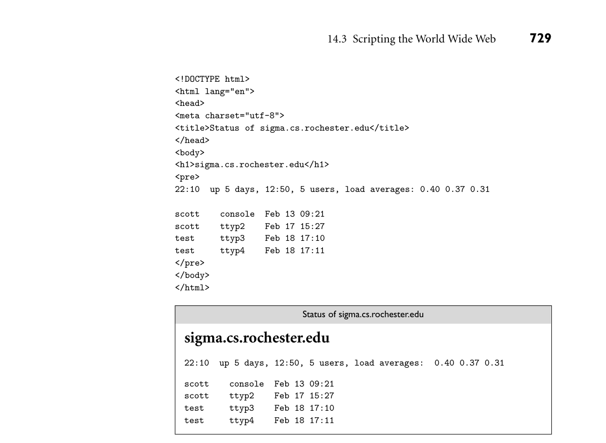
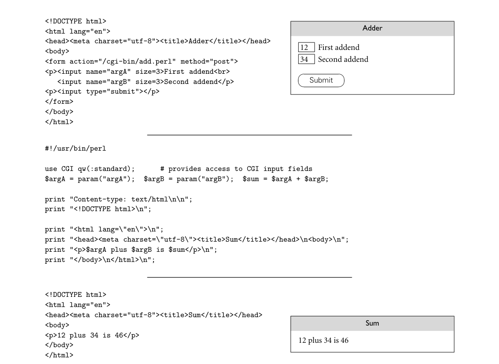
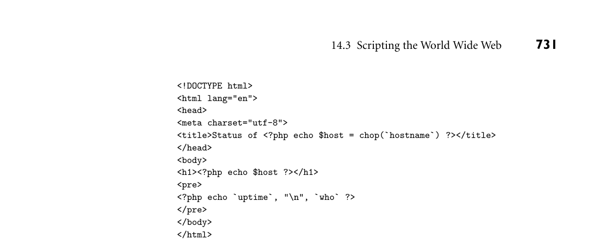
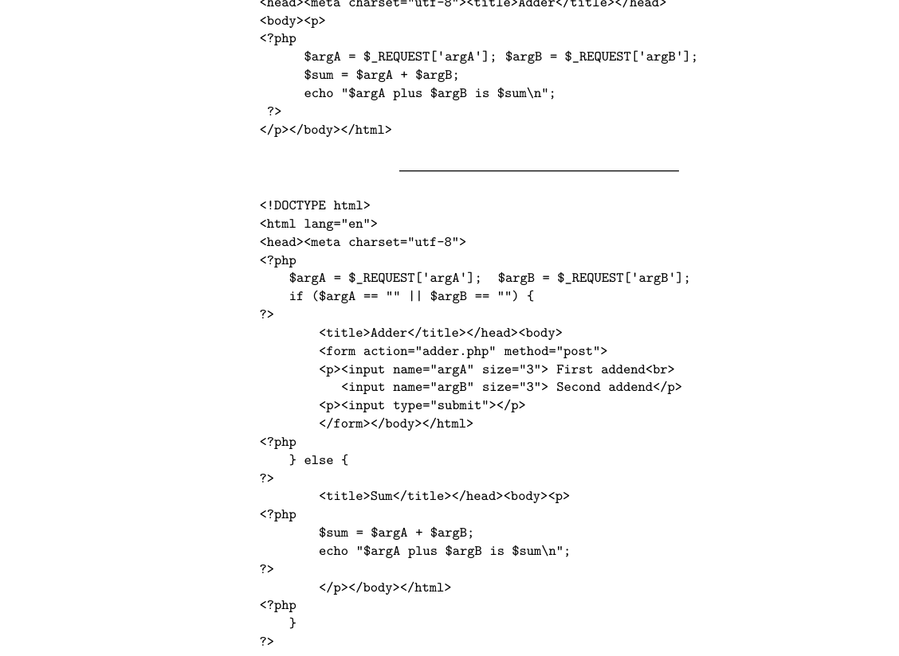
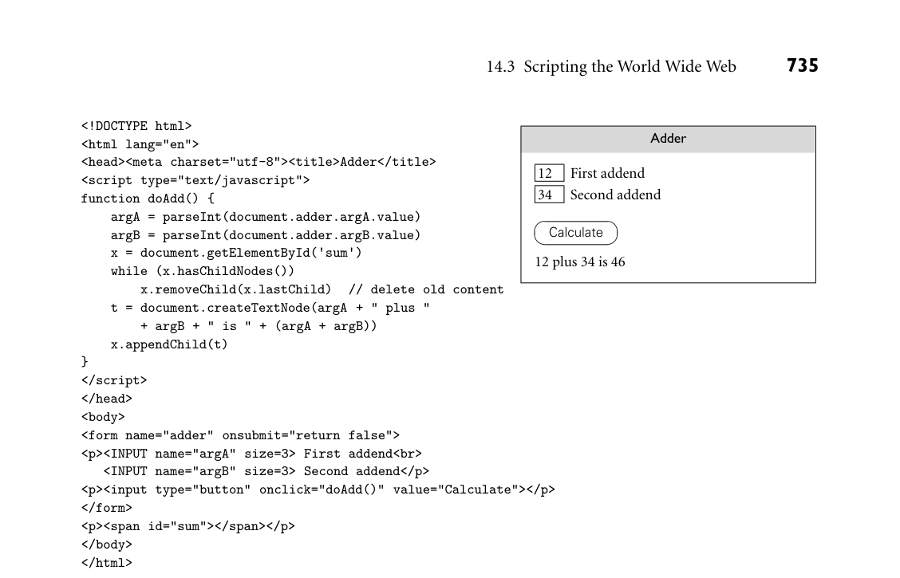

# 14.3 Scripting the World Wide Web

14.3 Scripting the World Wide Web 727

16. List several distinctive features of the R statistical scripting language.

17. Explain the meaning of the $ and @ characters at the beginning of variable names in Perl. Explain the different meanings of $, @, and @@ in Ruby.

18. Which of the languages described in Section 14.2.4 uses indentation to control syntactic grouping?

19. List several distinctive features of Python. 20. Describe, briefly, how Ruby uses blocks and iterators.

21. What capabilities must a scripting language provide in order to be used for extension?

22. Name several commercial tools that use extension languages.

14.3 Scripting the World Wide Web

Much of the content of the World Wide Web—particularly the content that is vis- ible to search engines—is static: pages that seldom, if ever, change. But hypertext, the abstract notion on which the Web is based, was always conceived as a way to represent “the complex, the changing, and the indeterminate” [Nel65]. Much of the power of the Web today lies in its ability to deliver pages that move, play sounds, respond to user actions, or—perhaps most important—contain infor- mation created or formatted on demand, in response to the page-fetch request. From a programming languages point of view, simple playback of recorded audio or video is not particularly interesting. We therefore focus our attention here on content that is generated on the fly by a program—a script—associated with an Internet URI (uniform resource identifier).4 Suppose we type a URI into a browser on a client machine, and the browser sends a request to the appropriate web server. If the content is dynamically created, an obvious first question is: does the script that creates it run on the server or the client machine? These options are known as server-side and client-side web scripting, respectively. Server-side scripts are typically used when the service provider wants to re- tain complete control over the content of the page, but can’t (or doesn’t want to) create the content in advance. Examples include the pages returned by search engines, Internet retailers, auction sites, and any organization that provides its clients with on-line access to personal accounts. Client-side scripts are typically used for tasks that don’t need access to proprietary information, and are more

4 The term “URI” is often used interchangeably with “URL” (uniform resource locator), but the World Wide Web Consortium distinguishes between the two. All URIs are hierarchical (multi- part) names. URLs are one kind of URIs; they use a naming scheme that indicates where to find the resource. Other URIs can use other naming schemes.

*Figure 14.9 A simple CGI script in Perl. If this script is named status.perl, and is installed in the server’s cgi-bin directory, then a user anywhere on the Internet can obtain summary statistics and a list of users currently logged into the server by typing hostname/cgi-bin/status.perl into a browser window.*

efficient if executed on the client’s machine. Examples include interactive anima- tion, error-checking of fill-in forms, and a wide variety of other self-contained calculations.

14.3.1 CGI Scripts

The original mechanism for server-side web scripting was the Common Gateway Interface (CGI). A CGI script is an executable program residing in a special di- rectory known to the web server program. When a client requests the URI corre- sponding to such a program, the server executes the program and sends its output back to the client. Naturally, this output needs to be something that the browser will understand—typically HTML. CGI scripts may be written in any language available on the server’s machine, though Perl is particularly popular: its string-handling and “glue” mechanisms are ideally suited to generating HTML, and it was already widely available during the early years of the Web. As a simple if somewhat artificial example, suppose we EXAMPLE 14.29

Remote monitoring with a CGI script would like to be able to monitor the status of a server machine shared by some community of users. The Perl script in Figure 14.9 creates a web page titled by the name of the server machine, and containing the output of the uptime and who commands (two simple sources of status information). The script’s initial print command produces an HTTP message header, indicating that what follows is HTML. Sample output from executing the script appears in Figure 14.10. ■ CGI scripts are commonly used to process on-line forms. A simple example EXAMPLE 14.30

Adder web form with a CGI script appears in Figure 14.11. The form element in the HTML file specifies the URI of the CGI script, which is invoked when the user hits the Submit button. Values previously entered into the input fields are passed to the script either as a trailing

*Figure 14.10 Sample output from the script of Figure 14.9. HTML source appears at top; the rendered page is below.*

part of the URI (for a get-type form) or on the standard input stream (for a post-type form, shown here).5 With either method, we can access the values using the param routine of the standard CGI Perl library, loaded at the beginning of our script. ■

14.3.2 Embedded Server-Side Scripts

Though widely used, CGI scripts have several disadvantages:

5 One typically uses post type forms for one-time requests. A get type form appears a little clumsier, because arguments are visibly embedded in the URI, but this gives it the advantage of repeatability: it can be “bookmarked” by client browsers.

730 Chapter 14 Scripting Languages

*Figure 14.11 An interactive CGI form. Source for the original web page is shown at the upper left, with the rendered page to the right. The user has entered 12 and 34 in the text fields. When the Submit button is pressed, the client browser sends a request to the server for URI /cgi-bin/add.perl. The values 12 and 13 are contained within the request. The Perl script, shown in the middle, uses these values to generate a new web page, shown in HTML at the bottom left, with the rendered page to the right.*

The web server must launch each script as a separate program, with potentially significant overhead (though a CGI script compiled to native code can be very fast once running). Because the server has little control over the behavior of a script, scripts must generally be installed in a trusted directory by trusted system administrators; they cannot reside in arbitrary locations as ordinary pages do.

*Figure 14.12 A simple PHP script embedded in a web page. When served by a PHP-enabled host, this page performs the equivalent of the CGI script of Figure 14.9.*

The name of the script appears in the URI, typically prefixed with the name of the trusted directory, so static and dynamic pages look different to end users. Each script must generate not only dynamic content but also the HTML tags that are needed to format and display it. This extra “boilerplate” makes scripts more difficult to write.

To address these disadvantages, most web servers provide a “module-loading” mechanism that allows interpreters for one or more scripting languages to be incorporated into the server itself. Scripts in the supported language(s) can then be embedded in “ordinary” web pages. The web server interprets such scripts directly, without launching an external program. It then replaces the scripts with the output they produce, before sending the page to the client. Clients have no way to even know that the scripts exist. Embeddable server-side scripting languages include PHP, PowerShell (in Mi- crosoft Active Server Pages), Ruby, Cold Fusion (from Macromedia Corp.), and Java (via “Servlets” in Java Server Pages). The most common of these is PHP. Though descended from Perl, PHP has been extensively customized for its target domain, with built-in support for (among other things) e-mail and MIME en- coding, all the standard Internet communication protocols, authentication and security, HTML and URI manipulation, and interaction with dozens of database systems. The PHP equivalent of Figure 14.9 appears in Figure 14.12. Most of the text EXAMPLE 14.31

Remote monitoring with a PHP script in this figure is standard HTML. PHP code is embedded between <?php and ?> delimiters. These delimiters are not themselves HTML; rather, they indicate a processing instruction that needs to be executed by the PHP interpreter to generate replacement text. The “boilerplate” parts of the page can thus appear verbatim; they need not be generated by print (Perl) or echo (PHP) commands. Note that the separate script fragments are part of a single program. The $host variable, for example, is set in the first fragment and used again in the second. ■

*Figure 14.13 A fragmented PHP script. The if and for statements work as one might expect, despite the intervening raw HTML. When requested by a browser, this page displays the numbers from 0 to 19, with odd numbers written in bold.*

PHP scripts can even be broken into fragments in the middle of structured EXAMPLE 14.32

A fragmented PHP script statements. Figure 14.13 contains a script in which if and for statements span fragments. In effect, the HTML text between the end of one script fragment and the beginning of the next behaves as if it had been output by an echo command. Web designers are free to use whichever approach (echo or escape to raw HTML) seems most convenient for the task at hand. ■

Self-Posting Forms

By changing the action attribute of the FORM element, we can arrange for the EXAMPLE 14.33

Adder web form with a PHP script Adder page of Figure 14.11 to invoke a PHP script instead of a CGI script:

<form action="add.php" method="post">

The PHP script itself is shown in the top half of Figure 14.14. Form values are made available to the script in an associative array (hash table) named _REQUEST. No special library is required. ■ Because our PHP script is executed directly by the web server, it can safely EXAMPLE 14.34

Self-posting Adder web form reside in an arbitrary web directory, including the one in which the Adder page resides. In fact, by checking to see how a page was requested, we can merge the form and the script into a single page, and let it service its own requests! We illustrate this option in the bottom half of Figure 14.14. ■

14.3 Scripting the World Wide Web 733

*Figure 14.14 An interactive PHP web page. The script at top could be used in place of the script in the middle of Figure 14.11. The lower script in the current figure replaces both the web page at the top and the script in the middle of Figure 14.11. It checks to see if it has received a full set of arguments. If it hasn’t, it displays the fill-in form; if it has, it displays results.*

734 Chapter 14 Scripting Languages

14.3.3 Client-Side Scripts

While embedded server-side scripts are generally faster than CGI scripts, at least when start-up cost predominates, communication across the Internet is still too slow for truly interactive pages. If we want the behavior or appearance of the page to change as the user moves the mouse, clicks, types, or hides or exposes windows, we really need to execute some sort of script on the client’s machine. Because they run on the web designer’s site, CGI scripts and, to a lesser extent, embeddable server-side scripts can be written in many different languages. All the client ever sees is standard HTML. Client-side scripts, by contrast, require an interpreter on the client’s machine. By virtue of having been “in the right place at the right time” historically, JavaScript is supported with at least some degree of consistency by almost all of the world’s web browsers. Given the number of legacy browsers still running, and the difficulty of convincing users to upgrade or to install new plug-ins, pages intended for use outside a limited domain (e.g., the desktops of a single company) almost always use JavaScript for interactive features. Figure 14.15 shows a page with embedded JavaScript that imitates (on the EXAMPLE 14.35

Adder web form in JavaScript client) the behavior of the Adder scripts of Figures 14.11 and 14.14. Function doAdd is defined in the header of the page so it is available throughout. In partic- ular, it will be invoked when the user clicks on the Calculate button. By default, the input values are character strings; we use the parseInt function to convert them to integers. The parentheses around (argA + argB) in the final assign- ment statement then force the use of integer addition. The other occurrences of + are string concatenation. To disable the usual mechanism whereby input data are submitted to the server when the user hits the enter or return key, we have specified a dummy behavior for the onsubmit attribute of the form. Rather than replace the page with output text, as our CGI and PHP scripts did, we have chosen in our JavaScript version to append the output at the bottom. The HTML SPAN element provides a named place in the document where this output can be inserted, and the getElementById JavaScript method provides us with a reference to this element. The HTML Document Object Model (DOM), standard- ized by the World Wide Web Consortium, specifies a very large number of other elements, attributes, and user actions, all of which are accessible in JavaScript. Through them, scripts can, at appropriate times, inspect or alter almost any as- pect of the content, structure, or style of a page. ■

14.3.4 Java Applets and Other Embedded Elements

As an alternative to requiring client-side scripts to interact with the DOM of a web page, many browsers support an embedding mechanism that allows a browser plug-in to assume responsibility for some rectangular region of the page, in which it can then display whatever it wants. In other words, plug-ins are less a matter of scripting the browser than of bypassing it entirely. Historically, plug-ins were

*Figure 14.15 An interactive JavaScript web page. Source appears at left. The rendered version on the right shows the appearance of the page after the user has entered two values and hit the Calculate button, causing the output message to appear. By entering new values and clicking again, the user can calculate as many sums as desired. Each new calculation will replace the output message.*

widely used for content—animations and video in particular—that were poorly supported by HTML. Programs designed to be run by a Java plug-in are commonly known as ap- plets. Consider, for example, an applet to display a clock with moving hands. EXAMPLE 14.36

Embedding an applet in a web page Legacy browsers have supported several different applet tags, but as of HTML5 the standard syntax looks like this:

<embed type="application/x-java-applet" code="Clock.class">

The type attribute informs the browser that the embedded element is expected to be a Java applet; the code element provides the applet’s URI. Additional attributes can be used to specify such properties as the required interpreter version number and the size of the needed display space. ■ As one might infer from the existence of the type attribute, embed tags can re- quest execution by a wide variety of plug-ins—not just a Java Virtual Machine. As of 2015, the most widely used plug-in is Adobe’s Flash Player. Though scriptable,

736 Chapter 14 Scripting Languages

Flash Player is more accurately described as a multimedia display engine than a general purpose programming language interpreter. Over time, plug-ins have proven to be a major source of browser security bugs. Almost any nontrivial plug-in requires access to operating system services— network IO, local file space, graphics acceleration, and so on. Providing just enough service to make the plug-in useful—but not enough to allow it to do any harm—has proven extremely difficult. To address this problem, extensive mul- timedia support has been built into the HTML5 standard, allowing the browser itself to assume responsibility for much of what was once accomplished with plug- ins. Security is still a problem, but the number of software modules that must be trusted—and the number of points at which an attacker might try to gain entrance—is significantly reduced. Many browsers now disable Java by default. Some disable Flash as well.

14.3.5 XSLT

Most readers will undoubtedly have had the opportunity to write, or at least to read, the HTML (hypertext markup language) used to compose web pages. HTML has, for the most part, a nested structure in which fragments of docu- ments (elements) are delimited by tags that indicate their purpose or appearance. We saw in Section 14.2.2, for example, that top-level headings are delimited with <h1> and </h1>. Unfortunately, as a result of the chaotic and informal way in which the Web evolved, HTML ended up with many inconsistencies in its design, and incompatibilities among the versions implemented by different vendors.

DESIGN & IMPLEMENTATION

14.5 JavaScript and Java Despite its name, JavaScript has no connection to Java beyond some superficial syntactic similarity. The language was originally developed by Brendan Eich at Netscape Corp. in 1995. Eich called his creation LiveScript, but the company chose to rename it as part of a joint marketing agreement with Sun Microsys- tems, prior to its public release. Trademark on the JavaScript name is actually owned by Oracle, which acquired Sun in 2010. Netscape’s browser was the market leader in 1995, and JavaScript usage grew extremely fast. To remain competitive, developers at Microsoft added JavaScript support to Internet Explorer, but they used the name JScript in- stead, and they introduced a number of incompatibilities with the Netscape version of the language. A common version was standardized as ECMAScript by the European standards body in 1997 (and subsequently by the ISO), but major incompatibilities remained in the Document Object Models provided by different browsers. These have been gradually resolved through a series of standards from the World Wide Web Consortium, but legacy pages and legacy browsers continue to plague web developers.

14.3 Scripting the World Wide Web 737

XML (extensible markup language) is a more recent and general language in which to capture structured data. Compared to HTML, its syntax and seman- tics are more regular and consistent, and more consistently implemented across platforms. It is extensible, meaning that users can define their own tags. It also makes a clear distinction between the content of a document (the data it captures) and the presentation of that data. Presentation, in fact, is deferred to a compan- ion standard known as XSL (extensible stylesheet language). XSLT is a portion of XSL devoted to transforming XML: selecting, reorganizing, and modifying tags and the elements they delimit—in effect, scripting the processing of data repre- sented in XML.

DESIGN & IMPLEMENTATION

14.6 How far can you trust a script? Security becomes an issue whenever code is executed using someone else’s re- sources. On a hosting machine, web servers are usually installed with very lim- ited access rights, and with only a limited view of the host’s file system. This strategy limits the set of pages accessible through the server to a well-defined subset of what would be visible to users logged into the hosting machine di- rectly. By contrast, CGI scripts are separate executable programs, and can po- tentially run with the privileges of whoever installs them. To prevent users on the hosting machine from accidentally or intentionally passing their privileges to arbitrary users on the Internet, most system administrators configure their machines so that CGI scripts must reside in a special directory, and be installed by a trusted user. Embedded server-side scripts can reside in any file because they are guaranteed to run with the (limited) rights of the server itself. A larger risk is posed by code downloaded over the Internet and executed on a client machine. Because such code is in general untrusted, it must be executed in a carefully controlled environment, sometimes called a sandbox, to prevent it from doing any damage. As a general rule, embedded JavaScript cannot access the local file system, memory management system, or network, nor can it manipulate documents from other sites. Java applets, likewise, have only limited ability to access external resources. Reality is a bit more compli- cated, of course: Sometimes, a script needs access to, say, a temporary file of limited size, or a network connection to a trusted server. Mechanisms exist to certify sites as trusted, or to allow a trusted site to certify the trustworthiness of pages from other sites. Scripts on pages obtained through a trusted mecha- nism may then be given extended rights. Such mechanisms must be used with care. Finding the right balance between security and functionality remains one of the central challenges of the Web, and of distributed computing in general. (More on this topic can be found in Section 16.2.4, and in Explorations 16.19 and 16.20.)

