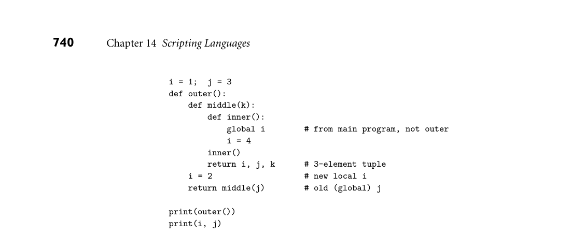
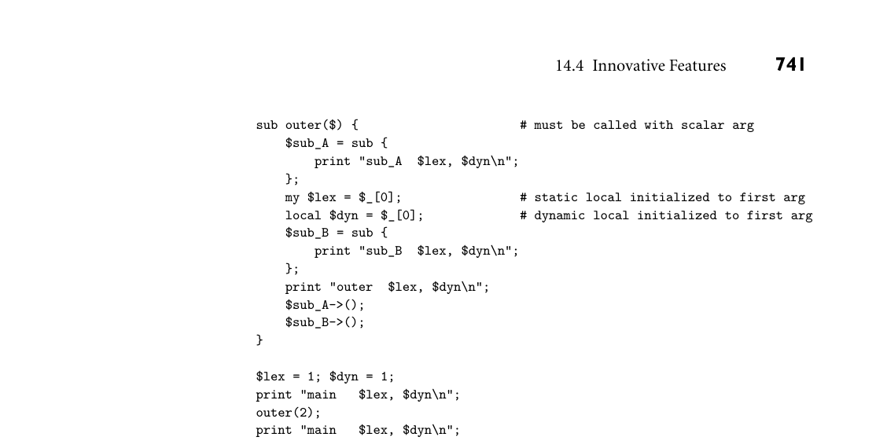
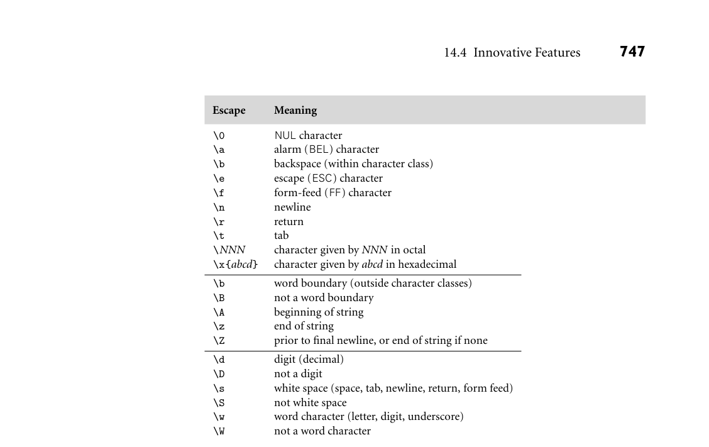
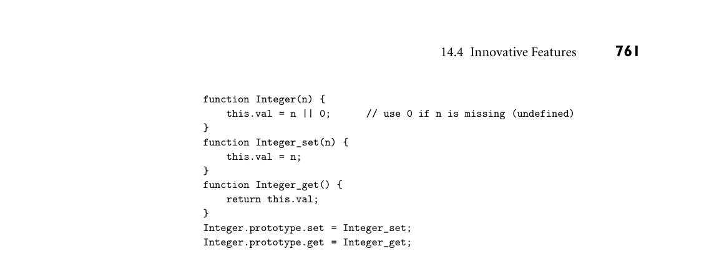

# 14.4 Innovative Features

IN MORE DEPTH

XML can be used to create specialized markup languages for a very wide range of application domains. XHTML is an almost (but not quite) backward compatible variant of HTML that conforms to the XML standard. Web tools are increasingly being designed to generate XHTML. On the companion site, we consider a variety of topics related to XML, with a particular emphasis on XSLT. We elaborate on the distinction between content and presentation, introduce the general notion of stylesheet languages, and de- scribe the document type definitions (DTDs) and schemas used to define domain- specific applications of XML, using XHTML as an example. Because tags are required to nest, an XML document has a natural tree-based structure. XSLT is designed to process these trees via recursive traversal. Though it can be used for almost any task that takes XML as input, perhaps its most com- mon use is to transform XML into formatted output—often XHTML to be pre- sented in a browser. As an extended example, we consider the formatting of an XML-based bibliographic database.

3CHECK YOUR UNDERSTANDING 23. Explain the distinction between server-side and client-side web scripting.

24. List the tradeoffs between CGI scripts and embedded PHP. 25. Why are CGI scripts usually installed only in a special directory?

26. Explain how a PHP page can service its own requests. 27. Why might we prefer to execute a web script on the server rather than the client? Why might we sometimes prefer the client instead? 28. What is the HTML Document Object Model? What is its significance for client- side scripting? 29. What is the relationship between JavaScript and Java?

30. What is an applet? Why applets are usually not considered an example of scripting?

31. What is HTML? XML? XSLT? How are they related to one another?

14.4 Innovative Features

In Section 14.1.1, we listed several common characteristics of scripting languages:

2. Economy of expression 3. Lack of declarations; simple scoping rules 4. Flexible dynamic typing 5. Easy access to other programs 6. Sophisticated pattern matching and string manipulation 7. High-level data types

Several of these are discussed in more detail in the subsections below. Specifi- cally, Section 14.4.1 considers naming and scoping in scripting languages; Sec- tion 14.4.2 discusses string and pattern manipulation; and Section 14.4.3 con- siders data types. Items (1), (2), and (5) in our list, while important, are not particularly difficult or subtle, and will not be considered further here.

14.4.1 Names and Scopes

Most scripting languages (Scheme is the obvious exception) do not require vari- ables to be declared. A few languages, notably Perl and JavaScript, permit optional declarations, primarily as a sort of compiler-checked documentation. Perl can be run in a mode (use strict ‚vars‚) that requires declarations. With or without declarations, most scripting languages use dynamic typing. Values are generally self-descriptive, so the interpreter can perform type checking at run time, or co- erce values when appropriate. Nesting and scoping conventions vary quite a bit. Scheme, Python, JavaScript, and R provide the classic combination of nested subroutines and static (lexical) scope. Tcl allows subroutines to nest, but uses dynamic scoping. Named subrou- tines (methods) do not nest in PHP or Ruby, and they are only sort of nest in Perl (more on this below as well), but Perl and Ruby join Scheme, Python, JavaScript, and R in providing first-class anonymous local subroutines. Nested blocks are statically scoped in Perl. In Ruby, they are part of the named scope in which they appear. Scheme, Perl, Python, Ruby, JavaScript, and R all provide unlimited extent for variables captured in closures. PHP, R, and the major glue languages (Perl, Tcl, Python, Ruby) all have sophisticated namespace mechanisms for infor- mation hiding and the selective import of names from separate modules.

What Is the Scope of an Undeclared Variable?

In languages with static scoping, the lack of declarations raises an interesting question: when we access a variable x, how do we know if it is local, global, or (if scopes can nest) something in-between? Existing languages take several different approaches. In Perl, all variables are global unless explicitly declared. In PHP, they are local unless explicitly imported (and all imports are global, since scopes do not nest). Ruby, too, has only two real levels of scoping, but as we saw in Sec- tion 14.2.4, it distinguishes between them using prefix characters on names: foo is a local variable; $foo is a global variable; @foo is an instance variable of the cur- rent object (the one whose method is currently executing); @@foo is an instance

*Figure 14.16 A program to illustrate scope rules in Python. There is one instance each of j and k, but two of i: one global and one local to outer. The scope of the latter is all of outer, not just the portion after the assignment. The global statement provides inner with access to the outermost i, so it can write it without defining a new instance.*

variable of the current object’s class (shared by all sibling instances). (Note: as we shall see in Section 14.4.3, Perl uses similar prefix characters to indicate type. These very different uses are a potential source of confusion for programmers who switch between the two languages.) Perhaps the most interesting scope-resolution rule is that of Python and R. In these languages, a variable that is written is assumed to be local, unless it is explic- itly imported. A variable that is only read in a given scope is found in the closest enclosing scope that contains a defining write. Consider, for example, the Python EXAMPLE 14.37

Scoping rules in Python program of Figure 14.16. Here we have a set of nested subroutines, as indicated by indentation level. The main program calls outer, which calls middle, which in turn calls inner. Before its call, the main program writes both i and j. Outer reads j (to pass it to middle), but does not write it. It does, however, write i. Consequently, outer reads the global j, but has its own i, different from the global one. Middle reads both i and j, but it does not write either, so it must find them in surrounding scopes. It finds i in outer, and j at the global level. Inner, for its part, also writes the global i. When executed, the program prints

(2, 3, 3) 4 3

Note that while the tuple returned from middle (forwarded on by outer, and printed by the main program) has a 2 as its first element, the global i still con- tains the 4 that was written by inner. Note also that while the write to i in outer appears textually after the read of i in middle, its scope extends over all of outer, including the body of middle. ■ Interestingly, there is no way in Python for a nested routine to write a variable that belongs to a surrounding but nonglobal scope. In Figure 14.16, inner could EXAMPLE 14.38

*Figure 14.17 A program to illustrate scope rules in Perl. The my operator creates a statically scoped local variable; the local operator creates a new dynamically scoped instance of a global variable. The static scope extends from the point of declaration to the lexical end of the block; the dynamic scope extends from elaboration to the end of the block’s execution.*

does provide this functionality. Rather than declare i to be global, R uses a “su- perassignment” operator. Where a normal assignment i <- 4 assigns the value 4 into a local variable i, the superassignment i <<- 4 assigns 4 into whatever i would be found under the normal rules of static (lexical) scoping. ■

Scoping in Perl

Perl has evolved over the years. At first, there were only global variables. Locals were soon added for the sake of modularity, so a subroutine with a variable named i wouldn’t have to worry about modifying a global i that was needed elsewhere in the code. Unfortunately, locals were originally defined in terms of dynamic scoping, and the need for backward compatibility required that this behavior be retained when static scoping was added in Perl 5. Consequently, the language provides both mechanisms. Any variable that is not declared is global in Perl by default. Variables declared with the local operator are dynamically scoped. Variables declared with the my operator are statically scoped. The difference can be seen in Figure 14.17, in EXAMPLE 14.39

Static and dynamic scoping in Perl which subroutine outer declares two local variables, lex and dyn. The former is statically scoped; the latter is dynamically scoped. Both are initialized to be a copy of foo’s first parameter. (Parameters are passed in the pseudovariable @_. The first element of this array is $_[0].) Two lexically identical anonymous subroutines are nested inside outer, one before and one after the redeclarations of $lex and $dyn. References to these are

stored in local variables sub_A and sub_B. Because static scopes in Perl extend from a declaration to the end of its block, sub_A sees the global $lex, while sub_B sees outer’s $lex. In contrast, because the declaration of local $dyn occurs before either sub_A or sub_B is called, both see this local version. Our program prints

main 1, 1 outer 2, 2 sub_A 1, 2 sub_B 2, 2 main 1, 1 ■

In cases where static scoping would normally access a variable at an in-between EXAMPLE 14.40

Accessing globals in Perl level of nesting, Perl allows the programmer to force the use of a global variable with the our operator, whose name is intended to contrast with my:

($x, $y, $z) = (1, 1, 1); # global scope { # middle scope my ($x, $y) = (2, 2); local $z = 3; { # inner scope our ($x, $z); # use globals print "$x, $y, $z\n"; } }

Here there is one lexical instance of z and two of x and y—one global, one in the middle scope. There is also a dynamic z in the middle scope. When it executes

DESIGN & IMPLEMENTATION

14.7 Thinking about dynamic scoping In Section 3.3.6, we described dynamic scope rules as introducing a new mean- ing for a name that remains visible, wherever we are in the program, until con- trol leaves the scope in which the new meaning was created. This conceptual model mirrors the association list implementation described in Section C 3.4.2 and, as described in Sidebar 3.6, probably accounts for the use of dynamic scoping in early dialects of Lisp. Documentation for Perl suggests a semantically equivalent but conceptually different model. Rather than saying that a local declaration introduces a new variable whose name hides previous declarations, Perl says that there is a single variable, at the global level, whose previous value is saved when the new decla- ration is encountered, and then automatically restored when control leaves the new declaration’s scope. This model mirrors the underlying implementation in Perl, which uses a central reference table (also described in Section C 3.4.2). In keeping with this model and implementation, Perl does not allow a local operator to create a dynamic instance of a variable that is not global.

its print statement, the inner scope finds the y from the middle scope. It finds the global x, however, because of the our operator on line 6. Now what about z? The rules require us to start with static scoping, ignoring local operators. According, then, to the our operator in the inner scope, we are using the global z. Once we know this, we look to see whether a dynamic (local) redeclaration of z is in effect. In this case indeed it is, and our program prints 1, 2, 3. As it turns out, the our declaration in the inner scope had no effect on this program. If only x had been declared our, we would still have used the global z, and then found the dynamic instance from the middle scope. ■

14.4.2 String and Pattern Manipulation

When we first considered regular expressions, in Section 2.1.1, we noted that many scripting languages and related tools employ extended versions of the no- tation. Some extensions are simply a matter of convenience. Others increase the expressive power of the notation, allowing us to generate (match) nonregular sets of strings. Still other extensions serve to tie the notation to other language fea- tures. We have already seen examples of extended regular expressions in sed (Fig- ure 14.1), awk (Figures 14.2 and 14.3), Perl (Figures 14.4 and 14.5), Python (Fig- ure 14.6), and Ruby (Figure 14.7). Many readers will also be familiar with grep, the stand-alone Unix pattern-matching tool (see Sidebar 14.8). While there are many different implementations of extended regular expres- sions (“REs” for short), with slightly different syntax, most fall into two main groups. The first group includes awk, egrep (the most widely used of several different versions of grep), and the regex library for C. These implement REs as defined in the POSIX standard [Int03b]. Languages in the second group follow the lead of Perl, which provides a large set of extensions, sometimes referred to as “advanced REs.” Perl-like advanced REs appear in PHP, Python, Ruby, JavaScript, Emacs Lisp, Java, and C#. They can also be found in third-party packages for C++ and other languages. A few tools, including sed, classic grep, and older Unix editors, provide so-called “basic” REs, less capable than those of egrep. In certain languages and tools—notably sed, awk, Perl, PHP, Ruby, and JavaScript—regular expressions are tightly integrated into the rest of the lan- guage, with special syntax and built-in operators. In these languages an RE is typ- ically delimited with slash characters, though other delimiters may be accepted in some cases (and Perl in fact provides slightly different semantics for a few alterna- tive delimiters). In most other languages, REs are expressed as ordinary character strings, and are manipulated by passing them to library routines. Over the next few pages we will consider POSIX and advanced REs in more detail. Following Perl, we will use slashes as delimiters. Our coverage will of necessity be incom- plete. The chapter on REs in the Perl book [CfWO12, Chap. 5] is over 100 pages long. The corresponding Unix man page totals some 40 pages.

POSIX Regular Expressions

Like the “true” regular expressions of formal language theory, extended REs sup- EXAMPLE 14.41

Basic operations in POSIX REs port concatenation, alternation, and Kleene closure. Parentheses are used for grouping:

/ab(cd|ef)g*/ matches abcd, abcdg, abefg, abefgg, abcdggg, etc. ■

Several other quantifiers (generalizationsof Kleene closure) are also available: ? EXAMPLE 14.42

Extra quantifiers in POSIX REs indicates zero or one repetitions, + indicates one or more repetitions, {n} indi- cates exactly n repetitions, {n,} indicates at least n repetitions, and {n, m} indi- cates n–m repetitions:

/a(bc)*/ matches a, abc, abcbc, abcbcbc, etc. /a(bc)?/ matches a or abc /a(bc)+/ matches abc, abcbc, abcbcbc, etc. /a(bc){3}/ matches abcbcbc only /a(bc){2,}/ matches abcbc, abcbcbc, etc. /a(bc){1,3}/ matches abc, abcbc, and abcbcbc (only) ■

Two zero-length assertions, ^ and $, match only at the beginning and end, re- spectively, of a target string. Thus while /abe/ will match abe, abet, babe, and EXAMPLE 14.43

Zero-length assertions label, /^abe/ will match only the first two of these, /abe$/ will match only the first and the third, and /^abe$/ will match only the first. ■ As an abbreviation for the alternation of set of single characters (e.g., /a|e|i| EXAMPLE 14.44

Character classes o|u/), extended REs permit character classes to be specified with square brackets:

/b[aeiou]d/ matches bad, bed, bid, bod, and bud

DESIGN & IMPLEMENTATION

14.8 The grep command and the birth of Unix tools Historically, regular expression tools have their roots in the pattern matching mechanism of the ed line editor, which dates from the earliest days of Unix. In 1973, Doug McIlroy, head of the department where Unix was born, was working on a project in computerized voice synthesis. As part of this project he was using the editor to search for potentially challenging words in an on- line dictionary. The process was both tedious and slow. At McIlroy’s request, Ken Thompson extracted the pattern matcher from ed and made it a stand- alone tool. He named his creation grep, after the g/re/p command sequence in the editor: g for “global”; / / to search for a regular expression (re); p to print [HH97a, Chap. 9]. Thompson’s creation was one of the first in a large suite of stream-based Unix tools. As described in Section 14.2.1, such tools are frequently combined with pipes to perform a variety of filtering, transforming, and formatting op- erations.

Ranges are also permitted:

/0x[0-9a-fA-F]+/ matches any hexadecimal integer ■

Outside a character class, a dot (.) matches any character other than a newline. The expression /b.d/, for example, matches not only bad, bbd, bcd, and so on, EXAMPLE 14.45

The dot (.) character but also b:d, b7d, and many, many others, including sequences in which the middle character isn’t printable. In a Unicode-enabled version of Perl, there are tens of thousands of options. ■ A caret (^) at the beginning of a character class indicates negation: the class expression matches anything other than the characters inside. Thus /b[^aq]d/ EXAMPLE 14.46

Negation and quoting in character classes matches anything matched by /b.d/ except for bad and bqd. A caret, right bracket, or hyphen can be specified inside a character class by preceding it with a backslash. A backslash will similarly protect any of the special characters | ( ) [ ] { } $ . * + ? outside a character class.6 To match a literal backslash, use two of them in a row:

/a\\b/ matches a\b ■

Several character class expressions are predefined in the POSIX standard. As we saw in Example 14.19, the expression [:space:] can be used to cap- EXAMPLE 14.47

Predefined POSIX character classes ture white space. For punctuation there is [:punct:]. The exact defini- tions of these classes depend on the local character set and language. Note, too, that the expressions must be used inside a built-up character class; they aren’t classes by themselves. A variable name in C, for example, might be matched by /[[:alpha:]_][[:alpha:][:digit:]_]*/ or, a bit more simply, /[[:alpha:]_][[:alnum:]_]*/. Additional syntax, not described here, allows character classes to capture Unicode collating elements (multibyte sequences such as a character and associated accents) that collate (sort) as if they were single ele- ments. Perl provides less cumbersome versionsof most of these special classes. ■

Perl Extensions

Extended REs are a central part of Perl. The built-in =~ operator is used to test EXAMPLE 14.48

RE matching in Perl for matching:

$foo = "albatross"; if ($foo =~ /ba.*s+/) ... # true if ($foo =~ /^ba.*s+/) ... # false (no match at start of string)

The string to be matched against can also be left unspecified, in which case Perl uses the pseudovariable $_ by default:

$_ = "albatross"; if (/ba.*s+/) ... # true if (/^ba.*s+/) ... # false

Recall that $_ is set automatically when iterating over the lines of a file. It is also the default index variable in for loops. ■ The !~ operator returns true when a pattern does not match: EXAMPLE 14.49

Negating a match in Perl if ("albatross" !~ /^ba.*s+/) ... # true ■

For substitution, the binary “mixfix” operator s/// replaces whatever lies be- EXAMPLE 14.50

RE substitution in Perl tween the first and second slashes with whatever lies between the second and the third:

$foo = "albatross"; $foo =~ s/lbat/c/; # "across"

Again, if a left-hand side is not specified, s/// matches and modifies $_. ■

Modifiers and Escape Sequences

Both matches and substitutions can be modified by adding one or more char- acters after the closing delimiter. A trailing i, for example, makes the match case-insensitive: EXAMPLE 14.51

Trailing modifiers on RE matches $foo = "Albatross"; if ($foo =~ /^al/i) ... # true

A trailing g on a substitution replaces all occurrences of the regular expression:

$foo = "albatross"; $foo =~ s/[aeiou]/-/g; # "-lb-tr-ss" ■

DESIGN & IMPLEMENTATION

14.9 Automata for regular expressions POSIX regular expressions are typically implemented using the constructions described in Section 2.2.1, which transform the RE into an NFA and then a DFA. Advanced REs of the sort provided by Perl are typically implemented via backtracking search in the obvious NFA. The NFA-to-DFA construction is usually not employed because it fails to preserve some of the advanced RE extensions (notably the capture mechanism described in Examples 14.55– 14.58) [CfWO12, pp. 241–246]. Some implementations use a DFA first to de- termine whether there is a match, and then an NFA or backtracking search to actually effect the match. This strategy pays the price of the slower automaton only when it’s sure to be worthwhile.

*Figure 14.18 Regular expression escape sequences in Perl. Sequences in the top portion of the table represent individual characters. Sequences in the middle are zero-width assertions. Sequences at the bottom are built-in character classes. Note that these are only examples: Perl assigns a meaning to almost every backslash-character sequence.*

For matching in multiline strings, a trailing s allows a dot (.) to match an em- bedded newline (which it normally cannot). A trailing m allows $ and ^ to match immediately before and after such a newline, respectively. A trailing x causes Perl to ignore both comments and embedded white space in the pattern so that partic- ularly complicated expressions can be broken across multiple lines, documented, and indented. In the tradition of C and its relatives (Example 8.29), Perl allows nonprinting characters to be specified in REs using backslash escape sequences. Some of the most frequently used examples appear in the top portion of Figure 14.18. Perl also provides several zero-width assertions, in addition to the standard ^ and $. Examples are shown in the middle of the figure. The \A and \Z escapes differ from ^ and $ in that they continue to match only at the beginning and end of the string, respectively, even in multiline searches that use the modifier m. Finally, Perl provides several built-in character classes, some of which are shown at the bottom of the figure. These can be used both inside and outside user-defined (i.e., bracket-delimited) classes. Note that \b has different meanings inside and outside such classes.

Greedy and Minimal Matches

The usual rule for matching in REs is sometimes called “left-most longest”: when a pattern can match at more than one place within a string, the chosen match will be the one that starts at the earliest possible position within the string, and then extends as far as possible. In the string abcbcbcde, for example, the pattern EXAMPLE 14.52

Greedy and minimal matching /(bc)+/ can match in six different ways:

abcbcbcde abcbcbcde abcbcbcde abcbcbcde abcbcbcde abcbcbcde

The third of these is “left-most longest,” also known as greedy. In some cases, however, it may be desirable to obtain a “left-most shortest” or minimal match. This corresponds to the first alternative above. ■ We saw a more realistic example in Example 14.23 (Figure 14.4), which con- EXAMPLE 14.53

Minimal matching of HTML headers tains the following substitution:

s/.*?(<[hH][123]>.*?<\/[hH][123]>)//s;

Assuming that the HTML input is well formed, and that headers do not nest, this substitution deletes everything between the beginning of the string (implicitly $_) and the end of the first embedded header. It does so by using the *? quantifier instead of the usual *. Without the question marks, the pattern would match through (and the substitution would delete through) the end of the last header in the string. Recall that the trailing s modifier allows our headers to span lines. In general, *? matches the smallest number of instances of the preceding subexpression that will allow the overall match to succeed. Similarly, +? matches at least one instance, but no more than necessary to allow the overall match to suc- ceed, and ?? matches either zero or one instances, with a preference for zero. ■

Variable Interpolation and Capture

Like double-quoted strings, regular expressions in Perl support variable interpo- lation. Any dollar sign that does not immediately precede a vertical bar, closing parenthesis, or end of string is assumed to introduce the name of a Perl variable, whose value as a string is expanded prior to passing the pattern to the regular expression evaluator. This allows us to write code that generates patterns at run EXAMPLE 14.54

Variable interpolation in extended REs time:

$prefix = ... $suffix = ... if ($foo =~ /^$prefix.*$suffix$/) ...

Note the two different roles played by $ in this example. ■ The flow of information can go the other way as well: we can pull the values of variables out of regular expressions. We saw a simple example in the sed script EXAMPLE 14.55

Variable capture in extended REs of Figure 14.1:

s/^.*\(<[hH][123]>\)/\1/ ;# delete text before opening tag

The equivalent in Perl would look something like this:

$line =~ s/^.*(<[hH][123]>)/\1/;

Every parenthesized fragment of a Perl RE is said to capture the text that it matches. The captured strings may be referenced in the right-hand side of the substitution as \1, \2, and so on. Outside the expression they remain available (until the next substitution is executed) as $1, $2, and so on:

print "Opening tag: ", $1, "\n"; ■

DESIGN & IMPLEMENTATION

14.10 Compiling regular expressions Before it can be used as the basis of a search, a regular expression must be compiled into a deterministic or nondeterministic (backtracking) automaton. Patterns that are clearly constant can be compiled once, either when the pro- gram is loaded or when they are first encountered. Patterns that contain in- terpolated strings, however, must in the general case be recompiled whenever they are encountered, at potentially significant run-time cost. A programmer who knows that interpolated variables will never change can inhibit recom- pilation by attaching a trailing o modifier to the regular expression, in which case the expression will be compiled the first time it is encountered, and never thereafter. For expressions that must sometimes but not always be recompiled, the programmer can use the qr operator to force recompilation of a pattern, yielding a result that can be used repeatedly and efficiently:

for (@patterns) { # iterate over patterns my $pat = qr($_); # compile to automaton for (@strings) { # iterate over strings if (/$pat/) { # no recompilation required print; # print all strings that match print "\n"; } } print "\n"; }

One can even use a captured string later in the RE itself. Such a string is called EXAMPLE 14.56

Backreferences in extended REs a backreference:

if (/.*?(<[hH]([123])>.*?<\/[hH]\2>)/) { print "header: $1\n"; }

Here we have used \2 to insist that the closing tag of an HTML header match the opening tag. ■ One can, of course capture multiple strings: EXAMPLE 14.57

Dissecting a floating-point literal if (/^([+-]?)((\d+)\.|(\d*)\.(\d+))(e([+-]?\d+))?$/) { # floating-point number print "sign: ", $1, "\n"; print "integer: ", $3, $4, "\n"; print "fraction: ", $5, "\n"; print "mantissa: ", $2, "\n"; print "exponent: ", $7, "\n"; }

As in the previous example, the numbering corresponds to the occurrence of left parentheses, read from left to right. With input -123.45e-6 we see

sign: - integer: 123 fraction: 45 mantissa: 123.45 exponent: -6

Note that because of alternation, exactly one of $3 and $4 is guaranteed to be set. Note also that while we need the sixth set of parentheses for grouping (it has a ? quantifier), we don’t really need it for capture. ■ For simple matches, Perl also provides pseudovariables named $`, $&, and $‚. These name the portions of the string before, in, and after the most recent match, EXAMPLE 14.58

Implicit capture of prefix, match, and suffix respectively:

$line = <>; chop $line; # delete trailing newline $line =~ /is/; print "prefix($`) match($&) suffix($')\n";

With input “now is the time”, this code prints

prefix(now ) match(is) suffix( the time) ■

3CHECK YOUR UNDERSTANDING 32. Name a scripting language that uses dynamic scoping. 33. Summarize the strategies used in Perl, PHP, Ruby, and Python to determine the scope of variables that are not declared. 34. Describe the conceptual model for dynamically scoped variables in Perl.

35. List the principal features found in POSIX regular expressions, but not in the regular expressions of formal language theory (Section 2.1.1).

36. List the principal features found in Perl REs, but not in those of POSIX. 37. Explain the purpose of search modifiers (characters following the final delim- iter) in Perl-type regular expressions. 38. Describe the three main categories of escape sequences in Perl-type regular expressions. 39. Explain the difference between greedy and minimal matches.

40. Describe the notion of capture in regular expressions.

14.4.3 Data Types

As we have seen, scripting languages don’t generally require (or even permit) the declaration of types for variables. Most perform extensive run-time checks to make sure that values are never used in inappropriate ways. Some languages (e.g., Scheme, Python, and Ruby) are relatively strict about this checking; the program- mer who wants to convert from one type to another must say so explicitly. If we EXAMPLE 14.59

Coercion in Ruby and Perl type the following in Ruby,

a = "4" print a + 3, "\n"

we get the following message at run time: “In ‘+’: no implicit conversion of Fixnum into String (TypeError).” Perl is much more forgiving. As we saw in Example 14.2, the program

$a = "4"; print $a . 3 . "\n"; # '.' is concatenation print $a + 3 . "\n"; # '+' is addition

prints 43 and 7. ■ In general, Perl (and likewise Rexx and Tcl) takes the position that program- mers should check for the errors they care about, and in the absence of such checks the program should do something reasonable. Perl is willing, for example, EXAMPLE 14.60

$a[3] = "1"; # (array @a was previously undefined) print $a[3] + $a[4], "\n";

Here $a[4] is uninitialized and hence has value undef. In a numeric context (as an operand of +) the string "1" evaluates to 1, and undef evaluates to 0. Added together, these yield 1, which is converted to a string and printed. ■ A comparable code fragment in Ruby requires a bit more care. Before we can EXAMPLE 14.61

Explicit conversion in Ruby subscript a we must make sure that it refers to an array:

a = [] # empty array assignment a[3] = "1"

If the first line were not present (and a had not been initialized in any other way), the second line would have generated an “undefined local variable” error. After these assignments, a[3] is a string, but other elements of a are nil. We cannot concatenate a string and nil, nor can we add them (both operators are specified in Ruby using the operator +). If we want concatenation, and a[4] may be nil, we must say

print a[3] + String(a[4]), "\n"

If we want addition, we must say

print Integer(a[3]) + Integer(a[4]), "\n"

■ As these examples suggest, Perl (and likewise Tcl) uses a value model of vari- ables. Scheme, Python, and Ruby use a reference model. PHP and JavaScript, like Java, use a value model for variables of primitive type and a reference model for variables of object type. The distinction is less important in PHP and JavaScript than it is in Java, because the same variable can hold a primitive value at one point in time and an object reference at another.

Numeric Types

As we have seen in Section 14.4.2, scripting languages generallyprovide a very rich set of mechanisms for string and pattern manipulation. Syntax and interpolation conventions vary, but the underlying functionality is remarkably consistent, and heavily influenced by Perl. The underlying support for numeric types shows a bit more variation across languages, but the programming model is again remark- ably consistent: users are, to first approximation, encouraged to think of numeric values as “simply numbers,” and not to worry about the distinction between fixed and floating point, or about the limits of available precision. Internally, numbers in JavaScript are always double-precision floating point; they are doubles by default in Lua as well. In Tcl they are strings, converted to integers or floating-point numbers (and back again) when arithmetic is needed. PHP uses integers (guaranteed to be at least 32 bits wide), plus double-precision

floating point. To these Perl and Ruby add arbitrary precision (multiword) in- tegers, sometimes known as bignums. Python has bignums too, plus support for complex numbers. Scheme has all of the above, plus precise rationals, maintained as ⟨numerator, denominator⟩pairs. In all cases the interpreter “up-converts” as necessary when doing arithmetic on values with different representations, or when overflow would otherwise occur. Perl is scrupulous about hiding the distinctions among different numeric rep- resentations. Most other languages allow the user to determine which is being used, though this is seldom necessary. Ruby is perhaps the most explicit about the existence of different representations: classes Fixnum, Bignum, and Float (double-precision floating point) have overlapping but not identical sets of built- in methods. In particular, integers have iterator methods, which floating-point numbers do not, and floating-point numbers have rounding and error checking methods, which integers do not. Fixnum and Bignum are both descendants of Integer.

Composite Types

The type constructors of compiled languages like C, Fortran, and Ada were cho- sen largely for the sake of efficient implementation. Arrays and records, in partic- ular, have straightforward time- and space-efficient implementations, which we studied in Chapter 8. Efficiency, however, is less important in scripting languages. Designers have felt free to choose type constructors oriented more toward ease of understanding than pure run-time performance. In particular, most script- ing languages place a heavy emphasis on mappings, sometimes called dictionaries, hashes, or associative arrays. As might be guessed from the third of these names, a mapping is typically implemented with a hash table. Access time for a hash re- mains O(1), but with a significantly higher constant than is typical for a compiled array or record. Perl, the oldest of the widely used scripting languages, inherits its principal composite types—the array and the hash—from awk. It also uses prefix char- acters on variable names as an indication of type: $foo is a scalar (a number, Boolean, string, or pointer [which Perl calls a “reference”]); @foo is an array; %foo is a hash; &foo is a subroutine; and plain foo is a filehandle or an I/O format, depending on context. Ordinary arrays in Perl are indexed using square brackets and integers starting EXAMPLE 14.62

Perl arrays with 0:

@colors = ("red", "green", "blue"); # initializer syntax print $colors[1]; # green

Note that we use the @ prefix when referring to the array as a whole, and the $ prefix when referring to one of its (scalar) elements. Arrays are self-expanding: assignment to an out-of-bounds element simply makes the array larger (at the cost of dynamic memory allocation and copying). Uninitialized elements have the value undef by default. ■ Hashes are indexed using curly braces and character string names: EXAMPLE 14.63

%complements = ("red" => "cyan", "green" => "magenta", "blue" => "yellow"); print $complements{"blue"}; # yellow

These, too, are self-expanding. Records and objects are typically built from hashes. Where the C programmer would write fred.age = 19, the Perl programmer writes $fred{"age"} = 19. In object-oriented code, $fred is more likely to be a reference, in which case we have $fred->{"age"} = 19. ■ Python and Ruby, like Perl, provide both conventional arrays and hashes. They EXAMPLE 14.64

Arrays and hashes in Python and Ruby use square brackets for indexing in both cases, and distinguish between array and hash initializers (aggregates) using bracket and brace delimiters, respectively:

colors = ["red", "green", "blue"] complements = {"red" => "cyan", "green" => "magenta", "blue" => "yellow"} print colors[2], complements["blue"]

DESIGN & IMPLEMENTATION

14.11 Typeglobs in Perl It turns out that a global name in Perl can have multiple independent mean- ings. It is possible, for example, to use $foo, @foo, %foo, &foo and two differ- ent meanings of foo, all in the same program. To keep track of these multiple meanings, Perl interposes a level of indirection between the symbol table entry for foo and the various values foo may have. The intermediate structure is called a typeglob. It has one slot for each of foo’s meanings. It also has a name of its own: *foo. By manipulating typeglobs, the expert Perl programmer can actually modify the table used by the interpreter to look up names at run time. The simplest use is to create an alias:

*a = *b;

After executing this statement, a and b are indistinguishable; they both refer to the same typeglob, and changes made to (any meaning of) one of them will be visible through the other. Perl also supports selective aliasing, in which one slot of a typeglob is made to point to a value from a different typeglob:

*a = \&b;

The backslash operator (\) in Perl is used to create a pointer. After executing this statement, &a (the meaning of a as a function) will be the same as &b, but all other meanings of a will remain the same. Selective aliasing is used, among other things, to implement the mechanism that imports names from libraries in Perl.

(This is Ruby syntax; Python uses : in place of =>.) ■ As a purely object-oriented language, Ruby defines subscripting as syntactic EXAMPLE 14.65

Array access methods in Ruby sugar for invocations of the [] (get) and []= (put) methods:

c = colors[2] # same as c = colors. colors[2] = c # same as colors.[]=(2, c) ■

In addition to arrays (which it calls lists) and hashes (which it calls dictionar- ies), Python provides two other composite types: tuples and sets. A tuple is es- EXAMPLE 14.66

Tuples in Python sentially an immutable list (array). The initializer syntax uses parentheses rather than brackets:

crimson = (0xdc, 0x14, 0x3c) # R,G,B components

Tuples are more efficient to access than arrays: their immutability eliminates the need for most bounds and resizing checks. They also form the basis of multiway assignment:

a, b = b, a # swap

Parentheses can be omitted in this example: the comma groups more tightly than the assignment operator. ■ Python sets are like dictionaries that don’t map to anything of interest, but sim- EXAMPLE 14.67

Sets in Python ply serve to indicate whether elements are present or absent. Unlike dictionaries, they also support union, intersection, and difference operations:

X = set(['a', 'b', 'c', 'd']) # set constructor Y = set(['c', 'd', 'e', 'f']) # takes array as parameter U = X | Y # (['a', 'b', 'c', 'd', 'e', 'f']) I = X & Y # (['c', 'd']) D = X - Y # (['a', 'b']) O = X ^ Y # (['a', 'b', 'e', 'f']) 'c' in I # True

■ PHP and Tcl have simpler composite types: they eliminate the distinction be- EXAMPLE 14.68

Conflated types in PHP, Tcl, and JavaScript tween arrays and hashes. An array is simply a hash for which the programmer chooses to use numeric keys. JavaScript employs a similar simplification, unify- ing arrays, hashes, and objects. The usual obj.attr notation to access a mem- ber of an object (what JavaScript calls a property) is simply syntactic sugar for obj["attr"]. So objects are hashes, and arrays are objects with integer property names. ■ Higher-dimensional types are straightforward to create in most scripting lan- guages: one can define arrays of (references to) hashes, hashes of (references to) arrays, and so on. Alternatively, one can create a “flattened” implementation by EXAMPLE 14.69

matrix = {} # empty dictionary (hash) matrix[2, 3] = 4 # key is (2, 3)

This idiom provides the appearance and functionality of multidimensional ar- rays, though not their efficiency. There exist extension libraries for Python that provide more efficient homogeneous arrays, with only slightly more awkward syntax. Numeric and statistical scripting languages, such as Maple, Mathemat- ica, Matlab, and R, have much more extensive support for multidimensional ar- rays. ■

Context

In Section 7.2.2 we defined the notion of type compatibility, which determines, in a statically typed language, which types can be used in which contexts. In this definition the term “context” refersto information about how a value will be used. In C, for example, one might say that in the declaration

double d = 3;

the 3 on the right-hand side occurs in a context that expects a floating-point number. The C compiler coerces the 3 to make it a double instead of an int. In Section 7.2.3 we went on to define the notion of type inference, which al- lows a compiler to determine the type of an expression based on the types of its constituent parts and, in some cases, the context in which it appears. We saw an extreme example in ML and its descendants, which use a sophisticated form of inference to determine types for most objects without the need for declarations. In both of these cases—compatibility and inference—contextual information is used at compile time only. Perl extends the notion of context to drive deci- sions made at run time. More specifically, each operator in Perl determines, at compile time, and for each of its arguments, whether that argument should be interpreted as a scalar or a list. Conversely each argument (which may itself be a nested operator) is able to tell, at run time, which kind of context it occupies, and can consequently exhibit different behavior. As a simple example, the assignment operator (=) provides a scalar or list con- EXAMPLE 14.70

Scalar and list context in Perl text to its right-hand side based on the type of its left-hand side. This type is always known at compile time, and is usually obvious to the casual reader, be- cause the left-hand side is a name and its prefix character is either a dollar sign ($), implying a scalar context, or an at (@) or percent (%) sign, implying a list context. If we write

$time = gmtime();

Perl’s standard gmtime() library function will return the time as a character string, along the lines of "Wed May 6 04:36:30 2015". On the other hand, if we write

the same function will return (30, 36, 4, 6, 4, 115, 3, 125, 0), a nine- element array indicating seconds, minutes, hours, day of month, month of year (with January = 0), year (counting from 1900), day of week (with Sunday = 0), day of year, and (as a 0/1 Boolean value) an indication of whether it’s a leap year. ■ So how does gmtime know what to do? By calling the built-in function EXAMPLE 14.71

Using wantarray to determine calling context wantarray. This returns true if the current function was called in a list context, and false if it was called in a scalar context. By convention, functions typically indicate an error by returning the empty array when called in a list context, and the undefined value (undef) when called in a scalar context:

if ( something went wrong ) { return wantarray ? () : undef; } ■

14.4.4 Object Orientation

Though not an object-oriented language, Perl 5 has features that allow one to program in an object-oriented style.7 PHP and JavaScript have cleaner, more conventional-looking object-oriented features, but both allow the programmer to use a more traditional imperative style as well. Python and Ruby are explicitly and uniformly object-oriented. Perl uses a value model for variables; objects are always accessed via pointers. In PHP and JavaScript, a variable can hold either a value of a primitive type or a reference to an object of composite type. In contrast to Perl, however, these languages provide no way to speak of the reference itself, only the object to which it refers. Python and Ruby use a uniform reference model. Classes are themselves objects in Python and Ruby, much as they are in Small- talk. They are merely types in PHP, much as they are in C++, Java, or C#. Classes in Perl are simply an alternative way of looking at packages (namespaces). JavaScript, remarkably, has objects but no classes; its inheritance is based on a concept known as prototypes, initially introduced by the Self programming lan- guage.

Perl 5

Object support in Perl 5 boils down to two main things: (1) a “blessing” mecha- nism that associates a reference with a package, and (2) special syntax for method calls that automatically passes an object reference or package name as the ini- tial argument to a function. While any reference can in principle be blessed, the usual convention is to use a hash, so that fields can be named as shown in Exam- ple 14.63.

*Figure 14.19 Object-oriented programming in Perl. Blessing a reference (object) into package Integer allows Integer’s functions to serve as the object’s methods.*

As a very simple example, consider the Perl code of Figure 14.19. Here we have EXAMPLE 14.72

A simple class in Perl defined a package, Integer, that plays the role of a class. It has three functions, one of which (new) is intended to be used as a constructor, and two of which (set and get) are intended to be used as accessors. Given this definition we can write

$c1 = Integer->new(2); # Integer::new("Integer", 2) $c2 = new Integer(3); # alternative syntax $c3 = new Integer; # no initial value specified

Both Integer->new and new Integer are syntactic sugar for calls to Integer:: new with an additional first argument that contains the name of the package (class) as a character string. In the first line of function new we assign this string into the variable $class. (The shift operator returns the first element of pseu- dovariable @_ [the function’s arguments], and shifts the remaining arguments, if any, so they will be seen if shift is used again.) We then create a reference to a new hash, store it in local variable $self, and invoke the bless operator to associate it with the appropriate class. With a second call to shift we retrieve the initial value for our integer, if any. (The “or” expression [||] allows us to use 0 instead if no explicit argument was present.) We assign this initial value into the val field of $self using the usual Perl syntax to dereference a pointer and subscript a hash. Finally we return a reference to the newly created object. ■ Once a reference has been blessed, Perl allows it to be used with method in- EXAMPLE 14.73

Invoking methods in Perl vocation syntax: c1->get() and get c1() are syntactic sugar for Integer:: get($c1). Note that this call passes a reference as the additional first parameter, rather than the name of a package. Given the declarations of $c1, $c2, and $c3 from Example 14.72, the following code

print $c1->get, " ", $c2->get, " ", $c3->get, " ", "\n"; $c1->set(4); $c2->set(5); $c3->set(6); print $c1->get, " ", $c2->get, " ", $c3->get, " ", "\n";

will print

2 3 0 4 5 6

As usual in Perl, if an argument list is empty, the parentheses can be omitted. ■ Inheritance in Perl is obtained by means of the @ISA array, initialized at the global level of a package. Extending the previous example, we might define a EXAMPLE 14.74

Inheritance in Perl Tally class that inherits from Integer:

{ package Tally; @ISA = ("Integer");

sub inc { my $self = shift; $self->{val}++; } } ... $t1 = new Tally(3); $t1->inc; $t1->inc; print $t1->get, "\n"; # prints 5

The inc method of t1 works as one might expect. However when Perl sees a call to Tally::new or Tally::get (neither of which is actually in the package), it uses the @ISA array to locate additional package(s) in which these methods may be found. We can list as many packages as we like in the @ISA array; Perl supports multiple inheritance. The possibility that new may be called through Tally rather than Integer explains the use of shift to obtain the class name in Figure 14.19. If we had used "Integer" explicitly we would not have obtained the desired behavior when creating a Tally object. ■ Most often packages (and thus classes) in Perl are declared in separate modules EXAMPLE 14.75

Inheritance via use base (files). In this case, one must import the module corresponding to a superclass in addition to modifying @ISA. The standard base module provides convenient syntax for this combined operation, and is the preferredway to specify inheritance relationships:

{ package Tally; use base ("Integer"); ... ■

PHP and JavaScript

While Perl’s mechanisms suffice to create object-oriented programs, dynamic lookup makes them slower than equivalent imperative programs, and it seems fair to characterize the syntax as less than elegant. Objects are more fundamental to PHP and JavaScript. PHP 4 provided a variety of object-oriented features, which were heavily re- vised in PHP 5. The newer version of the language provides a reference model of (class-typed) variables, interfaces and mix-in inheritance, abstract methods and classes, final methods and classes, static and constant members, and access con- trol specifiers (public, protected, and private) reminiscent of those of Java, C#, and C++. In contrast to all other languages discussed in this subsection, class declarations in PHP must include declarations of all members (fields and meth- ods), and the set of members in a given class cannot subsequently change (though one can of course declare derived classes with additional members). JavaScript takes the unusual approach of providing objects—with inheritance and dynamic method dispatch—without providing classes. Such a language is said to be object-based, as opposed to object-oriented. Functions are first-class entities in JavaScript—objects, in fact. A method is simply a function that is referred to by a property (member) of an object. When we call o.m, the keyword this will refer to o during the execution of the function referred to by m. Likewise when we call new f, this will refer to a newly created (initially empty) object during the execution of f. A constructor in JavaScript is thus a function whose purpose is to assign values into properties (fields and methods) of a newly created object. Associated with every constructor f is an object f.prototype. If object o was constructed by f, then JavaScript will look in f.prototype whenever we attempt to use a property of o that o itself does not provide. In effect, o inherits from f.prototype anything that it does not override. Prototype properties are commonly used to hold methods. They can also be used for constants or for what other languages would call “class variables.” Figure 14.20 illustrates the use of prototypes. It is roughly equivalent to the EXAMPLE 14.76

Prototypes in JavaScript Perl code of Figure 14.19. Function Integer serves as a constructor. Assignments to properties of Integer.prototype serve to establish methods for objects con- structed by Integer. Using the code in the figure, we can write

c2 = new Integer(3); c3 = new Integer;

document.write(c2.get() + "&nbsp;&nbsp;" + c3.get() + " "); c2.set(4); c3.set(5); document.write(c2.get() + "&nbsp;&nbsp;" + c3.get() + " ");

This code will print

*Figure 14.20 Object-oriented programming in JavaScript. The Integer function is used as a constructor. Assignments to members of its prototype object serve to establish methods. These will be available to any object created by Integer that doesn’t have corresponding members of its own.*

Interestingly, the lack of a formal notion of class means that we can override EXAMPLE 14.77

Overriding instance methods in JavaScript methods and fields on an object-by-object basis:

c2.set = new Function("n", "this.val = n * n;"); // anonymous function constructor c2.set(3); c3.set(4); // these call different methods! document.write(c2.get() + "&nbsp;&nbsp;" + c3.get() + " ");

If nothing else has changed since the previous example, this code will print

9 4 ■

To obtain the effect of inheritance, we can write EXAMPLE 14.78

Inheritance in JavaScript function Tally(n) { this.base(n); // call to base constructor } function Tally_inc() { this.val++; } Tally.prototype = new Integer; // inherit methods Tally.prototype.base = Integer; // make base constructor available Tally.prototype.inc = Tally_inc; // new method ... t1 = new Tally(3); t1.inc(); t1.inc(); document.write(t1.get() + " ");

This code will print a 5. ■ ECMAScript 6, expected to become official in 2015, adds a formal notion of classes to the language, along with a host of other features. Classes are defined in a backward compatible way—essentially as syntactic sugar for constructors with prototypes.

Python and Ruby

As we have noted, both Python and Ruby are explicitly object-oriented. Both employ a uniform reference model for variables. Like Smalltalk, both incorporate an object hierarchy in which classes themselves are represented by objects. The root class in Python is called object; in Ruby it is Object. In both Python and Ruby, each class has a single distinguished constructor, EXAMPLE 14.79

Constructors in Python and Ruby which cannot be overloaded. In Python it is __init__; in Ruby it is initialize. To create a new object in Python one says my_object = My_class(args); in Ruby one says my_object = My_class.new(args). In each case the args are passed to the constructor. To achieve the effect of overloading, with different numbers or types of arguments, one must arrange for the single constructor to inspect its arguments explicitly. We employed a similar idiom in Perl (in the new routine of Figure 14.19) and JavaScript (in the Integer function of Figure 14.20). ■ Both Python and Ruby are more flexible than PHP or more traditional object- oriented languages regarding the contents (members) of a class. New fields can be added to a Python object simply by assigning to them: my_object.new_field = value. The set of methods, however, is fixed when the class is first defined. In Ruby only methods are visible outside a class (“put” and “get” methods must be used to access fields), and all methods must be explicitly declared. It is possible, however, to modify an existing class declaration, adding or overriding methods. One can even do this on an object-by-object basis. As a result, two objects of the same class may not display the same behavior. Python and Ruby differ in many other ways. The initial parameter to methods EXAMPLE 14.80

Naming class members in Python and Ruby is explicit in Python; by convention it is usually named self. In Ruby self is a keyword, and the parameter it represents is invisible. Any variable beginning with a single @ sign in Ruby is a field of the current object. Within a Python method, uses of object members must name the object explicitly. One must, for example, write self.print(); just print() will not suffice. ■ Ruby methods may be public, protected, or private.8 Access control in Python is purely a matter of convention; both methods and fields are universally accessible. Finally, Python has multiple inheritance. Ruby has mix-in inheri- tance: a class cannot obtain data from more than one ancestor. Unlike most other languages, however, Ruby allows an interface (mix-in) to define not only the sig- natures of methods but also their implementation (code).

3CHECK YOUR UNDERSTANDING 41. Contrast the philosophies of Perl and Ruby with regard to error checking and reporting.

8 The meanings of private and protected in Ruby are different from those in C++, Java, or C#: private methods in Ruby are available only to the current instance of an object; protected methods are available to any instance of the current class or its descendants.

42. Compare the numeric types of popular scripting languages to those of com- piled languages like C or Fortran. 43. What are bignums? Which languages support them?

44. What are associative arrays? By what other names are they sometimes known? 45. Why don’t most scripting languages provide direct support for records?

46. What is a typeglob in Perl? What purpose does it serve? 47. Describe the tuple and set types of Python.

48. Explain the unification of arrays and hashes in PHP and Tcl. 49. Explain the unification of arrays and objects in JavaScript. 50. Explain how tuples and hashes can be used to emulate multidimensional ar- rays in Python.

51. Explain the concept of context in Perl. How is it related to type compatibil- ity and type inference? What are the two principal contexts defined by the language’s operators?

DESIGN & IMPLEMENTATION

14.12 Executable class declarations Both Python and Ruby take the interesting position that class declarations are executable code. Elaboration of a declaration executes the code inside. Among other things, we can use this mechanism to achieve the effect of conditional compilation:

class My_class # Ruby code def initialize(a, b) @a = a; @b = b; end if expensive_function() def get() return @a end else def get() return @b end end end

Instead of computing the expensive function inside get, on every invocation, we compute it once, ahead of time, and define an appropriate specialized ver- sion of get.

