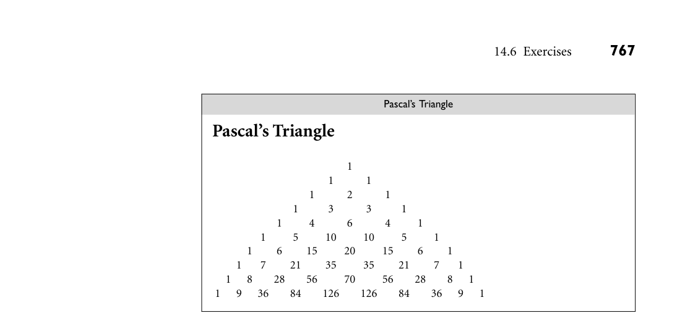

# 14.6 Exercises

14.6 Exercises 765

lack of declarations, simple scoping rules, flexible dynamic typing, easy access to other programs, sophisticated pattern matching and string manipulation, and high-level data types. We began our chapter by tracing the historical development of scripting, start- ing with the command interpreter, or shell programs of the mid-1970s, and the text processing and report generation tools that followed soon thereafter. We looked in particular at the “Bourne-again” shell, bash, and the Unix tools sed and awk. We also mentioned such special-purpose domains as mathematics and statistics, where scripting languages are widely used for data analysis, visualiza- tion, modeling, and simulation. We then turned to the three domains that dom- inate scripting today: “glue” (coordination) applications, configuration and ex- tension, and scripting of the World Wide Web. For many years, Perl was the most popular of the general-purpose “glue” lan- guages, but Python and Ruby have clearly overtaken it at this point. Several script- ing languages, including Python, Scheme, and Lua, are widely used to extend the functionality of complex applications. In addition, many commercial packages have their own proprietary extension languages. Web scripting comes in many forms. On the server side of an HTTP con- nection, the Common Gateway Interface (CGI) standard allows a URI to name a program that will be used to generate dynamic content. Alternatively, web- page-embedded scripts, often written in PHP, can be used to create dynamic con- tent in a way that is invisible to users. To reduce the load on servers, and to improve interactive responsiveness, scripts can also be executed within the client browser. JavaScript is the dominant notation in this domain; it uses the HTML Document Object Model (DOM) to manipulate web-page elements. For more demanding tasks, many browsers can be directed to run a Java applet, which takes full responsibility for some portion of the “screen real estate,” but this strategy comes with security concerns that are increasingly viewed as unacceptable. With the emergence of HTML5, most dynamic content—multimedia in particular— can be handled directly by the browser. At the same time, XML has emerged as the standard format for structured, presentation-independent information, with load-time transformation via XSL. Because of their rapid evolution, scripting languages have been able to take ad- vantage of many of the most powerful and elegant mechanisms described in pre- vious chapters, including first-class and higher-order functions, unlimited extent, iterators, garbage collection, list comprehensions, and object orientation—not to mention extended regular expressions and such high-level data types as dictionar- ies, sets, and tuples. Given current trends, scripting languages are likely to become increasingly ubiquitous, and to remain a principal focus of language innovation. 14.6 Exercises

14.1 Does filename “globbing” provide the expressive power of standard regu- lar expressions? Explain.

766 Chapter 14 Scripting Languages

14.2 Write shell scripts to (a) Replace blanks with underscores in the names of all files in the current directory. (b) Rename every file in the current directory by prepending to its name a textual representation of its modification date. (c) Find all eps files in the file hierarchy below the current directory, and create any corresponding pdf files that are missing or out of date. (d) Print the names of all files in the file hierarchy below the current di- rectory for which a given predicate evaluates to true. Your (quoted) predicate should be specified on the command line using the syntax of the Unix test command, with one or more at signs (@) standing in for the name of the candidate file. 14.3 In Example 14.16 we used "$@" to refer to the parameters passed to ll. What would happen if we removed the quote marks? (Hint: Try this for files whose names contain spaces!) Read the man page for bash and learn the difference between $@ and $*. Create versions of ll that use $* or "$*" instead of "$@". Explain what’s going on. 14.4 (a) Extend the code in Figure 14.5, 14.6, or 14.7 to try to kill processes more gently. You’ll want to read the man page for the standard kill command. Use a TERM signal first. If that doesn’t work, ask the user if you should resort to KILL. (b) Extend your solution to part (a) so that the script accepts an optional argument specifying the signal to be used. Alternatives to TERM and KILL include HUP, INT, QUIT, and ABRT. 14.5 Write a Perl, Python, or Ruby script that creates a simple concordance: a sorted list of significant words appearing in an input document, with a sublist for each that indicates the lines on which the word occurs, with up to six words of surrounding context. Exclude from your list all common articles, conjunctions, prepositions, and pronouns. 14.6 Write Emacs Lisp scripts to (a) Insert today’s date into the current buffer at the insertion point (cur- rent cursor location). (b) Place quote marks (" ") around the word surrounding the insertion point. (c) Fix end-of-sentence spaces in the current buffer. Use the following heuristic: if a period, question mark, or exclamation point is followed by a single space (possibly with closing quote marks, parentheses, brackets, or braces in-between), then add an extra space, unless the character preceding the period, question mark, or exclamation point is a capital letter (in which case we assume it is an abbreviation).

*Figure 14.21 Pascal’s triangle rendered in a web page (Exercise 14.8).*

(d) Run the contents of the current buffer through your favorite spell checker, and create a new buffer containing a list of misspelled words. (e) Delete one misspelled word from the buffer created in (d), and place the cursor (insertion point) on top of the first occurrence of that mis- spelled word in the current buffer. 14.7 Explain the circumstances under which it makes sense to realize an inter- active task on the Web as a CGI script, an embedded server-side script, or a client-side script. For each of these implementation choices, give three examples of tasks for which it is clearly the preferred approach. 14.8 (a) Write a web page with embedded PHP to print the first 10 rows of Pascal’s triangle (see Example C 17.10 if you don’t know what this is). When rendered, your output should look like Figure 14.21. (b) Modify your page to create a self-posting form that accepts the num- ber of desired rows in an input field. (c) Rewrite your page in JavaScript. 14.9 Create a fill-in web form that uses a JavaScript implementation of the Luhn formula (Exercise 4.10) to check for typos in credit card numbers. (But don’t use real credit card numbers; homework exercises don’t tend to be very secure!) 14.10 (a) Modify the code of Figure 14.15 (Example 14.35) so that it replaces the form with its output, as the CGI and PHP versions of Figures 14.11 and 14.14 do. (b) Modify the CGI and PHP scripts of Figures 14.11 and 14.14 (Exam- ples 14.30 and 14.34) so they appear to append their output to the bottom of the form, as the JavaScript version of Figure 14.15 does.

768 Chapter 14 Scripting Languages

14.11 Run the following program in Perl:

sub foo { my $lex = $_[0]; sub bar { print "$lex\n"; } bar(); }

foo(2); foo(3);

You may be surprised by the output. Perl 5 allows named subroutines to nest, but does not create closures for them properly. Rewrite the code above to create a reference to an anonymous local subroutine and verify that it does create closures correctly. Add the line use diagnostics; to the beginning of the original version and run it again. Based on the expla- nation this will give you, speculate as to how nested named subroutines are implemented in Perl 5. 14.12 Write a program that will map the web pages stored in the file hierarchy below the current directory. Your output should itself be a web page, con- taining the names of all directories and .html files, printed at levels of indentation corresponding to their level in the file hierarchy. Each .html file name should be a live link to its file. Use whatever language(s) seem most appropriate to the task. 14.13 In Section 14.4.1 we claimed that nested blocks in Ruby were part of the named scope in which they appear. Verify this claim by running the fol- lowing Ruby script and explaining its output:

def foo(x) y = 2 bar = proc { print x, "\n" y = 3 } bar.call() print y, "\n" end

foo(3)

Now comment out the second line (y = 2) and run the script again. Ex- plain what happens. Restate our claim about scoping more carefully and precisely. 14.14 Write a Perl script to translate English measurements (in, ft, yd, mi) into metric equivalents (cm, m, km). You may want to learn about the e mod- ifier on regular expressions, which allows the right-hand side of an s///e expression to contain executable code.

