# Part III: Alternative Programming Models

III Alternative Programming Models

As we noted in Chapter 1, programming languages are traditionally though imperfectly clas- sified into various imperative and declarative families. We have had occasion in Parts I and II to mention issues of particular importance to each of the major families. Moreover much of what we have covered—syntax, semantics, naming, types, abstraction—applies uniformly to all. Still, our attention has focused mostly on mainstream imperative languages. In Part III we shift this focus. Functional and logic languages are the principal nonimperative options. We consider them in Chapters 11 and 12, respectively. In each case we structure our discussion around represen- tative languages: Scheme and OCaml for functional programming, Prolog for logic program- ming. In Chapter 11 we also cover eager and lazy evaluation, and first-class and higher-order functions. In Chapter 12 we cover issues that make fully automatic, general purpose logic programming difficult, and describe restrictions used in practice to keep the model tractable. Optional sections in both chapters consider mathematical foundations: Lambda Calculus for functional programming, Predicate Calculus for logic programming. The remaining two chapters consider concurrent and scripting models, both of which are increasingly popular, and cut across the imperative/declarative divide. Concurrency is driven by the hardware parallelism of internetworked computers and by the coming explosion in mul- tithreaded processors and chip-level multiprocessors. Scripting is driven by the growth of the World Wide Web and by an increasing emphasis on programmer productivity, which places rapid development and reusability above sheer run-time performance. Chapter 13 begins with the fundamentals of concurrency, including communication and synchronization, thread creation syntax, and the implementation of threads. The remainder of the chapter is divided between shared-memory models, in which threads use explicit or implicit synchronization mechanisms to manage a common set of variables, and (on the companion site) message-passing models, in which threads interact only through explicit communication. The first half of Chapter 14 surveys problem domains in which scripting plays a major role: shell (command) languages, text processing and report generation, mathematics and statis- tics, the “gluing” together of program components, extension mechanisms for complex ap- plications, and client and server-side Web scripting. The second half considers some of the more important language innovations championed by scripting languages: flexible scoping and naming conventions, string and pattern manipulation (extended regular expressions), and high level data types.

11 Functional Languages

Previous chapters of this text have focused largely on imperative program- ming languages. In the current chapter and the next we emphasize functional and logic languages instead. While imperative languages are far more widely used, “industrial-strength” implementations exist for both functional and logic languages, and both models have commercially important applications. Lisp has traditionally been popular for the manipulation of symbolic data, particu- larly in the field of artificial intelligence. OCaml is heavily used in the financial services industry. In recent years functional languages—statically typed ones in particular—have become increasingly popular for scientific applications as well. Logic languages are widely used for formal specifications and theorem proving and, less widely, for many other applications. Of course, functional and logic languages have a great deal in common with their imperative cousins. Naming and scoping issues arise under every model. So do types, expressions, and the control-flow concepts of selection and recursion. All languages must be scanned, parsed, and analyzed semantically. In addition, functional languages make heavy use of subroutines—more so even than most von Neumann languages—and the notions of concurrency and nondeterminacy are as common in functional and logic languages as they are in the imperative case. As noted in Chapter 1, the boundaries between language categories tend to be rather fuzzy. One can write in a largely functional style in many imperative lan- guages, and many functional languages include imperative features (assignment and iteration). The most common logic language—Prolog—provides certain im- perative features as well. Finally, it is easy to build a logic programming system in most functional programming languages. Because of the overlap between imperative and functional concepts, we have had occasion several times in previous chapters to consider issues of particu- lar importance to functional programming languages. Most such languages de- pend heavily on polymorphism (the implicit parametric kind—Sections 7.1.2, 7.3, and 7.2.4). Most make heavy use of lists (Section 8.6). Several, historically, were dynamically scoped (Sections 3.3.6 and C 3.4.2). All employ recursion (Sec- tion 6.6) for repetitive execution, with the result that program behavior and per-

formance depend heavily on the evaluation rules for parameters (Section 6.6.2). All have a tendency to generate significant amounts of temporary data, which their implementations reclaim through garbage collection (Section 8.5.3). Our chapter begins with a brief introduction to the historical origins of the im- perative, functional, and logic programming models. We then enumerate funda- mental concepts in functional programming and consider how these are realized in the Scheme dialect of Lisp and the OCaml dialect of ML. More briefly, we also consider Common Lisp, Erlang, Haskell, Miranda, pH, Single Assignment C, and Sisal. We pay particular attention to issues of evaluation order and higher-order functions. For those with an interest in the theoretical foundations of functional programming, we provide (on the companion site) an introduction to functions, sets, and the lambda calculus. The formalism helps to clarify the notion of a pure functional language, and illuminates the places where practical languages diverge from the mathematical abstraction. 11.1 Historical Origins

To understand the differences among programming models, it can be helpful to consider their theoretical roots, all of which predate the developmentof electronic computers. The imperative and functional models grew out of work undertaken by mathematicians Alan Turing, Alonzo Church, Stephen Kleene, Emil Post, and others in the 1930s. Working largely independently, these individuals developed several very different formalizations of the notion of an algorithm, or effective procedure, based on automata, symbolic manipulation, recursive function defini- tions, and combinatorics. Over time, these various formalizations were shown to be equally powerful: anything that could be computed in one could be computed in the others. This result led Church to conjecture that any intuitively appealing model of computing would be equally powerful as well; this conjecture is known as Church’s thesis. Turing’s model of computing was the Turing machine, an automaton reminis- cent of a finite or pushdown automaton, but with the ability to access arbitrary cells of an unbounded storage “tape.”1 The Turing machine computes in an im- perative way, by changing the values in cells of its tape, just as a high-level im- perative program computes by changing the values of variables. Church’s model of computing is called the lambda calculus. It is based on the notion of param- eterized expressions (with each parameter introduced by an occurrence of the

1 Alan Turing (1912–1954), after whom the Turing Award is named, was a British mathematician, philosopher, and computer visionary. As intellectual leader of Britain’s cryptanalytic group dur- ing World War II, he was instrumental in cracking the German “Enigma” code and turning the tide of the war. He also helped lay the theoretical foundations of modern computer science, con- ceived the general-purpose electronic computer, and pioneered the field of Artificial Intelligence. Persecuted as a homosexual after the war, stripped of his security clearance, and sentenced to “treatment” with drugs, he committed suicide.

letter λ—hence the notation’s name).2 Lambda calculus was the inspiration for functional programming: one uses it to compute by substituting parameters into expressions, just as one computes in a high-level functional program by passing arguments to functions. The computing models of Kleene and Post are more ab- stract, and do not lend themselves directly to implementation as a programming language. The goal of early work in computability was not to understand computers (aside from purely mechanical devices, computers did not exist) but rather to formalize the notion of an effective procedure. Over time, this work allowed mathematicians to formalize the distinction between a constructive proof (one that shows how to obtain a mathematical object with some desired property) and a nonconstructive proof (one that merely shows that such an object must exist, perhaps by contradiction, or counting arguments, or reduction to some other theorem whose proof is nonconstructive). In effect, a program can be seen as a constructive proof of the proposition that, given any appropriate inputs, there exist outputs that are related to the inputs in a particular, desired way. Euclid’s al- gorithm, for example, can be thought of as a constructive proof of the proposition that every pair of non-negative integers has a greatest common divisor. Logic programming is also intimately tied to the notion of constructive proofs, but at a more abstract level. Rather than write a general constructive proof that works for all appropriate inputs, the logic programmer writes a set of axioms that allow the computer to discover a constructive proof for each particular set of inputs. We will consider logic programming in more detail in Chapter 12. 11.2 Functional Programming Concepts

In a strict sense of the term, functional programming defines the outputs of a program as a mathematical function of the inputs, with no notion of internal state, and thus no side effects. Among the languages we consider here, Miranda, Haskell, pH, Sisal, and Single Assignment C are purely functional. Erlang is nearly so. Most others include imperative features. To make functional programming practical, functional languages provide a number of features that are often miss- ing in imperative languages, including

First-class function values and higher-order functions Extensive polymorphism List types and operators

2 Alonzo Church (1903–1995) was a member of the mathematics faculty at Princeton University from 1929 to 1967, and at UCLA from 1967 to 1990. While at Princeton he supervised the doc- toral theses of, among many others, Alan Turing, Stephen Kleene, Michael Rabin, and Dana Scott. His codiscovery, with Turing, of undecidable problems was a major breakthrough in un- derstanding the limits of mathematics.

Structured function returns Constructors (aggregates) for structured objects Garbage collection

In Section 3.6.2 we defined a first-class value as one that can be passed as a parameter, returned from a subroutine, or (in a language with side effects) as- signed into a variable. Under a strict interpretation of the term, first-class status also requires the ability to create (compute) new values at run time. In the case of subroutines, this notion of first-class status requires nested lambda expressions that can capture values defined in surrounding scopes, giving those values unlim- ited extent (i.e., keeping them alive even after their scopes are no longer active). Subroutines are second-class values in most imperative languages, but first-class values (in the strict sense of the term) in all functional programming languages. A higher-order function takes a function as an argument, or returns a function as a result. Polymorphism is important in functional languages because it allows a func- tion to be used on as general a class of arguments as possible. As we have seen in Sections 7.1 and 7.2.4, Lisp and its dialects are dynamically typed, and thus inher- ently polymorphic, while ML and its relatives obtain polymorphism through the mechanism of type inference. Lists are important in functional languages because they have a natural recursive definition, and are easily manipulated by operating on their first element and (recursively) the remainder of the list. Recursion is im- portant because in the absence of side effects it provides the only means of doing anything repeatedly. Several of the items in our list of functional language features (recursion, struc- tured function returns, constructors, garbage collection) can be found in some but not all imperative languages. Fortran 77 has no recursion, nor does it allow structured types (i.e., arrays) to be returned from functions. Pascal and early ver- sions of Modula-2 allow only simple and pointer types to be returned from func- tions. As we saw in Section 7.1.3, several imperative languages, including Ada, C, and Fortran 90, provide aggregate constructs that allow a structured value to be specified in-line. In most imperative languages, however, such constructs are lacking or incomplete. C# and several scripting languages—Python and Ruby among them—provide aggregates capable of representing an (unnamed) func- tional value (a lambda expression), but few imperative languages are so expres- sive. A pure functional language must provide completely general aggregates: because there is no way to update existing objects, newly created ones must be initialized “all at once.” Finally, though garbage collection is increasingly com- mon in imperative languages, it is by no means universal, nor does it usually apply to the local variables of subroutines, which are typically allocated in the stack. Because of the desire to provide unlimited extent for first-class functions and other objects, functional languages tend to employ a (garbage-collected) heap for all dynamically allocated data (or at least for all data for which the compiler is unable to prove that stack allocation is safe). C++11 and Java 8 provide lambda expressions, but without unlimited extent.

Because Lisp was the original functional language, and is still one of the most widely used, several characteristics of Lisp are commonly, though inaccurately, described as though they pertained to functional programming in general. We will examine these characteristics (in the context of Scheme) in Section 11.3. They include

Homogeneity of programs and data: A program in Lisp is itself a list, and can be manipulated with the same mechanisms used to manipulate data. Self-definition: The operational semantics of Lisp can be defined elegantly in terms of an interpreter written in Lisp. Interaction with the user through a “read-eval-print” loop.

Many programmers—probably most—who have written significant amounts of software in both imperative and functional styles find the latter more aestheti- cally appealing. Moreover, experience with a variety of large commercial projects (see the Bibliographic Notes at the end of the chapter) suggests that the absence of side effects makes functional programs significantly easier to write, debug, and maintain than their imperative counterparts. When passed a given set of argu- ments, a pure function can always be counted on to return the same results. Is- sues of undocumented side effects, misordered updates, and dangling or (in most cases) uninitialized references simply don’t occur. At the same time, many imple- mentations of functional languages still fall short in terms of portability, richness of library packages, interfaces to other languages, and debugging and profiling tools. We will return to the tradeoffs between functional and imperative pro- gramming in Section 11.8. 11.3 A Bit of Scheme

Scheme was originally developed by Guy Steele and Gerald Sussman in the late 1970s, and has evolved through several revisions. The description here follows the 1998 R5RS (fifth revised standard), and should also be compliant with the 2013 R7RS. Most Scheme implementations employ an interpreter that runs a “read-eval- print” loop. The interpreter repeatedly reads an expression from standard input (generally typed by the user), evaluates that expression, and prints the resulting value. If the user types EXAMPLE 11.1

The read-eval-print loop (+ 3 4)

the interpreter will print

7

7

the interpreter will also print

7

(The number 7 is already fully evaluated.) To save the programmer the need to type an entire program verbatim at the keyboard, most Scheme implementations provide a load function that reads (and evaluates) input from a file:

(load "my_Scheme_program") ■

As we noted in Section 6.1, Scheme (like all Lisp dialects) uses Cambridge Polish notation for expressions. Parentheses indicate a function application (or in some cases the use of a macro). The first expression inside the left parenthesis indicates the function; the remaining expressions are its arguments. Suppose the user types EXAMPLE 11.2

Significance of parentheses ((+ 3 4))

When it sees the inner set of parentheses, the interpreter will call the function +, passing 3 and 4 as arguments. Because of the outer set of parentheses, it will then attempt to call 7 as a zero-argument function—a run-time error:

eval: 7 is not a procedure

Unlike the situation in almost all other programming languages, extra parenthe- ses change the semantics of Lisp/Scheme programs:

(+ 3 4) =⇒7 ((+ 3 4)) =⇒error

Here the =⇒means “evaluates to.” This symbol is not a part of the syntax of Scheme itself. ■ One can prevent the Scheme interpreter from evaluating a parenthesized ex- EXAMPLE 11.3

Quoting pression by quoting it:

(quote (+ 3 4)) =⇒(+ 3 4)

Here the result is a three-element list. More commonly, quoting is specified with a special shorthand notation consisting of a leading single quote mark:

'(+ 3 4) =⇒(+ 3 4) ■

Though every expression has a type in Scheme, that type is generally not de- termined until run time. Most predefined functions check dynamically to make EXAMPLE 11.4

(if (> a 0) (+ 2 3) (+ 2 "foo"))

will evaluate to 5 if a is positive, but will produce a run-time type clash error if a is negative or zero. More significantly, as noted in Section 7.1.2, functions that make sense for arguments of multiple types are implicitly polymorphic:

(define min (lambda (a b) (if (< a b) a b)))

The expression (min 123 456) will evaluate to 123; (min 3.14159 2.71828) will evaluate to 2.71828. ■ User-defined functions can implement their own type checks using predefined EXAMPLE 11.5

Type predicates type predicate functions:

(boolean? x) ; is x a Boolean? (char? x) ; is x a character? (string? x) ; is x a string? (symbol? x) ; is x a symbol? (number? x) ; is x a number? (pair? x) ; is x a (not necessarily proper) pair? (list? x) ; is x a (proper) list?

(This is not an exhaustive list.) ■ A symbol in Scheme is comparable to what other languages call an identifier. The lexical rules for identifiers vary among Scheme implementations, but are in general much looser than they are in other languages. In particular, identifiers are EXAMPLE 11.6

Liberal syntax for symbols permitted to contain a wide variety of punctuation marks:

(symbol? 'x$_%:&=*!) =⇒#t

The symbol #t representsthe Boolean value true. False is represented by #f. Note the use here of quote (‚); the symbol begins with x. ■ To create a function in Scheme one evaluates a lambda expression:3 EXAMPLE 11.7

lambda expressions (lambda (x) (* x x)) =⇒function

The first “argument” to lambda is a list of formal parameters for the function (in this case the single parameter x). The remaining “arguments” (again just one in this case) constitute the body of the function. As we shall see in Sec- tion 11.5, Scheme differentiates between functions and so-called special forms

3 A word of caution for readers familiar with Common Lisp: A lambda expression in Scheme eval- uates to a function. A lambda expression in Common Lisp is a function (or, more accurately, is automatically coerced to be a function, without evaluation). The distinction becomes important whenever lambda expressions are passed as parameters or returned from functions: they must be quoted in Common Lisp (with function or #’) to prevent evaluation. Common Lisp also dis- tinguishes between a symbol’s value and its meaning as a function; Scheme does not: if a symbol represents a function, then the function is the symbol’s value.

(lambda among them), which resemble functions but have special evaluation rules. Strictly speaking, only functions have arguments, but we will also use the term informally to refer to the subexpressions that look like arguments in a special form. ■ A lambda expression does not give its function a name; this can be done using let or define (to be introduced in the next subsection). In this sense, a lambda expression is like the aggregates that we used in Section 7.1.3 to specify array or record values. When a function is called, the language implementation restores the referenc- EXAMPLE 11.8

Function evaluation ing environment that was in effect when the lambda expression was evaluated (like all languages with static scope and first-class, nested subroutines, Scheme employs deep binding). It then augments this environment with bindings for the formal parameters and evaluates the expressions of the function body in order. The value of the last such expression (most often there is only one) becomes the value returned by the function:

((lambda (x) (* x x)) 3) =⇒9 ■

Simple conditional expressions can be written using if: EXAMPLE 11.9

if expressions (if (< 2 3) 4 5) =⇒4 (if #f 2 3) =⇒3

In general, Scheme expressions are evaluated in applicative order, as described in Section 6.6.2. Special forms such as lambda and if are exceptions to this rule. The implementation of if checks to see whether the first argument evaluates to #t. If so, it returns the value of the second argument, without evaluating the third argument. Otherwise it returns the value of the third argument, without evaluat- ing the second. We will return to the issue of evaluation order in Section 11.5. ■

11.3.1 Bindings

Names can be bound to values by introducing a nested scope: EXAMPLE 11.10

Nested scopes with let (let ((a 3) (b 4) (square (lambda (x) (* x x))) (plus +)) (sqrt (plus (square a) (square b)))) =⇒5.0

The special form let takes two or more arguments. The first of these is a list of pairs. In each pair, the first element is a name and the second is the value that the name is to represent within the remaining arguments to let. Remaining arguments are then evaluated in order; the value of the construct as a whole is the value of the final argument. The scope of the bindings produced by let is let’s second argument only:

(let ((a 3)) (let ((a 4) (b a)) (+ a b))) =⇒7

Here b takes the value of the outer a. The way in which names become visible “all at once” at the end of the declaration list precludes the definition of recursive functions. For these one employs letrec:

(letrec ((fact (lambda (n) (if (= n 1) 1 (* n (fact (- n 1))))))) (fact 5)) =⇒120

There is also a let* construct in which names become visible “one at a time” so that later ones can make use of earlier ones, but not vice versa. ■ As noted in Section 3.3, Scheme is statically scoped. (Common Lisp is also statically scoped. Most other Lisp dialects are dynamically scoped.) While let EXAMPLE 11.11

Global bindings with define and letrec allow the user to create nested scopes, they do not affect the meaning of global names (names known at the outermost level of the Scheme interpreter). For these Scheme provides a special form called define that has the side effect of creating a global binding for a name:

(define hypot (lambda (a b) (sqrt (+ (* a a) (* b b))))) (hypot 3 4) =⇒5 ■

11.3.2 Lists and Numbers

Like all Lisp dialects, Scheme provides a wealth of functions to manipulate lists. We saw many of these in Section 8.6; we do not repeat them all here. The three EXAMPLE 11.12

Basic list operations most important are car, which returns the head of a list, cdr (“coulder”), which returns the rest of the list (everything after the head), and cons, which joins a head to the rest of a list:

(car '(2 3 4)) =⇒2 (cdr '(2 3 4)) =⇒(3 4) (cons 2 '(3 4)) =⇒(2 3 4)

Also useful is the null? predicate, which determines whether its argument is the empty list. Recall that the notation ‚(2 3 4) indicates a proper list, in which the final element is the empty list:

For fast access to arbitrary elements of a sequence, Scheme provides a vector type that is indexed by integers, like an array, and may have elements of hetero- geneous types, like a record. Interested readers are referred to the Scheme man- ual [SDF+07] for further information. Scheme also provides a wealth of numeric and logical (Boolean) functions and special forms. The language manual describes a hierarchy of five numeric types: integer, rational, real, complex, and number. The last two levels are op- tional: implementations may choose not to provide any numbers that are not real. Most but not all implementations employ arbitrary-precision representations of both integers and rationals, with the latter stored internally as (numerator, de- nominator) pairs.

11.3.3 Equality Testing and Searching

Scheme provides several different equality-testing functions. For numerical com- parisons, = performs type conversions where necessary (e.g., to compare an in- teger and a floating-point number). For general-purpose use, eqv? performs a shallow comparison, while equal? performs a deep (recursive) comparison, us- ing eqv? at the leaves. The eq? function also performs a shallow comparison, and may be cheaper than eqv? in certain circumstances (in particular, eq? is not required to detect the equality of discrete values stored in different locations, though it may in some implementations). Further details were presented in Sec- tion 7.4. To search for elements in lists, Scheme provides two sets of functions, each of which has variants corresponding to the three general-purpose equality predi- cates. The functions memq, memv, and member take an element and a list as argu- EXAMPLE 11.13

List search functions ment, and return the longest suffix of the list (if any) beginning with the element:

(memq 'z '(x y z w)) =⇒(z w) (memv '(z) '(x y (z) w)) =⇒#f ; (eqv? '(z) '(z)) =⇒#f (member '(z) '(x y (z) w)) =⇒((z) w) ; (equal? '(z) '(z)) =⇒#t

The memq, memv, and member functions perform their comparisons using eq?, eqv?, and equal?, respectively. They return #f if the desired element is not found. It turns out that Scheme’s conditional expressions (e.g., if) treat anything other than #f as true.4 One therefore often sees expressions of the form

(if (memq desired-element list-that-might-contain-it) ... ■

4 One of the more confusing differences between Scheme and Common Lisp is that Common Lisp uses the empty list () for false, while most implementations of Scheme (including all that conform to the version 5 standard) treat it as true.

The functions assq, assv, and assoc search for values in association lists (oth- EXAMPLE 11.14

Searching association lists erwise known as A-lists). A-lists were introduced in Section C 3.4.2 in the context of name lookup for languages with dynamic scoping. An A-list is a dictionary implemented as a list of pairs.5 The first element of each pair is a key of some sort; the second element is information corresponding to that key. Assq, assv, and assoc take a key and an A-list as argument, and return the first pair in the list, if there is one, whose first element is eq?, eqv?, or equal?, respectively, to the key. If there is no matching pair, #f is returned. ■

11.3.4 Control Flow and Assignment

We have already seen the special form if. It has a cousin named cond that EXAMPLE 11.15

Multiway conditional expressions resembles a more general if... elsif... else:

(cond ((< 3 2) 1) ((< 4 3) 2) (else 3)) =⇒3

The arguments to cond are pairs. They are considered in order from first to last. The value of the overall expression is the value of the second element of the first pair in which the first element evaluates to #t. If none of the first elements eval- uates to #t, then the overall value is #f. The symbol else is permitted only as the first element of the last pair of the construct, where it serves as syntactic sugar for #t. ■ Recursion, of course, is the principal means of doing things repeatedly in Scheme. Many issues related to recursion were discussed in Section 6.6; we do not repeat that discussion here. For programmers who wish to make use of side effects, Scheme provides as- signment, sequencing, and iteration constructs. Assignment employs the special EXAMPLE 11.16

Assignment form set! and the functions set-car! and set-cdr!:

(let ((x 2) ; initialize x to 2 (l '(a b))) ; initialize l to (a b) (set! x 3) ; assign x the value 3 (set-car! l '(c d)) ; assign head of l the value (c d) (set-cdr! l '(e)) ; assign rest of l the value (e) ... x =⇒3 ... l =⇒((c d) e)

The return values of the various varieties of set! are implementation-depen- dent. ■ Sequencing uses the special form begin: EXAMPLE 11.17

Sequencing

(begin (display "hi ") (display "mom"))

Here we have used begin to sequence display expressions, which cause the in- terpreter to print their arguments. ■ Iteration uses the special form do and the function for-each: EXAMPLE 11.18

Iteration (define iter-fib (lambda (n) ; print the first n+1 Fibonacci numbers (do ((i 0 (+ i 1)) ; initially 0, inc'ed in each iteration (a 0 b) ; initially 0, set to b in each iteration (b 1 (+ a b))) ; initially 1, set to sum of a and b ((= i n) b) ; termination test and final value (display b) ; body of loop (display " ")))) ; body of loop

(for-each (lambda (a b) (display (* a b)) (newline)) '(2 4 6) '(3 5 7))

The first argument to do is a list of triples, each of which specifies a new variable, an initial value for that variable, and an expression to be evaluated and placed in a fresh instance of the variable at the end of each iteration. The second argument to do is a pair that specifies the termination condition and the expression to be returned. At the end of each iteration all new values of loop variables (e.g., a and b) are computed using the current values. Only after all new values are computed are the new variable instances created. The function for-each takes as argument a function and a sequence of lists. There must be as many lists as the function takes arguments, and the lists must

DESIGN & IMPLEMENTATION

11.1 Iteration in functional programs It is important to distinguish between iteration as a notation for repeated ex- ecution and iteration as a means of orchestrating side effects. One can in fact define iteration as syntactic sugar for tail recursion, and Val, Sisal, and pH do precisely that (with special syntax to facilitate the passing of values from one iteration to the next). Such a notation may still be entirely side-effect free, that is, entirely functional. In Scheme, assignment and I/O are the truly imperative features. We think of iteration as imperative because most Scheme programs that use it have assignments or I/O in their loops.

all be of the same length. For-each calls its function argument repeatedly, pass- ing successive sets of arguments from the lists. In the example shown here, the unnamed function produced by the lambda expression will be called on the ar- guments 2 and 3, 4 and 5, and 6 and 7. The interpreter will print

6 20 42 ()

The last line is the return value of for-each, assumed here to be the empty list. The language definition allows this value to be implementation-dependent; the construct is executed for its side effects. ■ Two other control-flow constructs have been mentioned in previous chap- ters. Delay and force (Section 6.6.2) permit the lazy evaluation of expressions. Call-with-current-continuation (call/cc; Section 6.2.2) allows the cur- rent program counter and referencing environment to be saved in the form of a closure, and passed to a specified subroutine. We will mention delay and force again in Section 11.5.

11.3.5 Programs as Lists

As should be clear by now, a program in Scheme takes the form of a list. In technical terms, we say that Lisp and Scheme are homoiconic—self-representing. A parenthesized string of symbols (in which parentheses are balanced) is called an S-expression regardless of whether we think of it as a program or as a list. In fact, an unevaluated program is a list, and can be constructed, deconstructed, and otherwise manipulated with all the usual list functions. Just as quote can be used to inhibit the evaluation of a list that appears as an EXAMPLE 11.19

Evaluating data as code argument in a function call, Scheme provides an eval function that can be used to evaluate a list that has been created as a data structure:

(define compose (lambda (f g) (lambda (x) (f (g x))))) ((compose car cdr) '(1 2 3)) =⇒2

(define compose2 (lambda (f g) (eval (list 'lambda '(x) (list f (list g 'x))) (scheme-report-environment 5)))) ((compose2 car cdr) '(1 2 3)) =⇒2

In the first of these declarations, compose takes as arguments a pair of functions f and g. It returns as result a function that takes as parameter a value x, applies

g to it, then applies f, and finally returns the result. In the second declaration, compose2 performs the same function, but in a different way. The function list returns a list consisting of its (evaluated) arguments. In the body of compose2, this list is the unevaluated expression (lambda (x) (f (g x))). When passed to eval, this list evaluates to the desired function. The second argument of eval specifies the referencing environment in which the expression is to be evaluated. In our example we have specified the environment defined by the Scheme ver- sion 5 report [KCR+98]. ■ The original description of Lisp [MAE+65] included a self-definition of the language: code for a Lisp interpreter, written in Lisp. Though Scheme differs in many ways from this early Lisp (most notably in its use of lexical scoping), such a metacircular interpreter can still be written easily [AS96, Chap. 4]. The code is based on the functions eval and apply. The first of these we have just seen. The second, apply, takes two arguments: a function and a list. It achieves the effect of calling the function, with the elements of the list as arguments.

11.3.6 Extended Example: DFA Simulation in Scheme

To conclude our introduction to Scheme, we present a complete program to sim- EXAMPLE 11.20

Simulating a DFA in Scheme ulate the execution of a DFA (deterministic finite automaton). The code appears in Figure 11.1. Finite automata details can be found in Sections 2.2 and C 2.4.1. Here we represent a DFA as a list of three items: the start state, the transition function, and a list of final states. The transition function in turn is represented by a list of pairs. The first element of each pair is another pair, whose first element is a state and whose second element is an input symbol. If the current state and next input symbol match the first element of a pair, then the finite automaton enters the state given by the second element of the pair. To make this concrete, consider the DFA of Figure 11.2. It accepts all strings of zeros and ones in which each digit appears an even number of times. To simulate this machine, we pass it to the function simulate along with an input string. As it runs, the automaton accumulates as a list a trace of the states through which it has traveled. Once the input is exhausted, it adds accept or reject. For example, if we type

(simulate zero-one-even-dfa ; machine description '(0 1 1 0 1)) ; input string

then the Scheme interpreter will print

(q0 q2 q3 q2 q0 q1 reject)

If we change the input string to 010010, the interpreter will print

(q0 q2 q3 q1 q3 q2 q0 accept) ■

*Figure 11.1 Scheme program to simulate the actions of a DFA. Given a machine description and an input symbol i, function move searches for a transition labeled i from the start state to some new state s. It then returns a new machine with the same transition function and final states, but with s as its “start” state. The main function, simulate, encapsulates a tail-recursive helper function that accumulates an inverted list of moves, returning when it has consumed all input symbols. The wrapper then checks to see if the helper ended in a final state; it returns the (properly ordered) series of moves, with accept or reject at the end. The functions cadr and caddr are defined as (lambda (x) (car (cdr x))) and (lambda (x) (car (cdr (cdr x)))), respectively. Scheme provides a large collection of such abbreviations.*

3CHECK YOUR UNDERSTANDING 1. What mathematical formalism underlies functional programming?

2. List several distinguishing characteristics of functional programming lan- guages.

3. Briefly describe the behavior of the Lisp/Scheme read-eval-print loop. 4. What is a first-class value?

*Figure 11.2 DFA to accept all strings of zeros and ones containing an even number of each. At the bottom of the figure is a representation of the machine as a Scheme data structure, using the conventions of Figure 11.1.*

5. Explain the difference between let, let*, and letrec in Scheme. 6. Explain the difference between eq?, eqv?, and equal?.

7. Describe three ways in which Scheme programs can depart from a purely functional programming model. 8. What is an association list? 9. What does it mean for a language to be homoiconic?

10. What is an S-expression? 11. Outline the behavior of eval and apply.

11.4 A Bit of OCaml

Like Lisp, ML has a complicated family tree. The original language was devised in the early 1970s by Robin Milner and others at Cambridge University. SML (“Standard” ML) and OCaml (Objective Caml) are the two most widely used di- alects today. Haskell, the most widely used language for functional programming research, is a separate descendant of ML (by way of Miranda). F#, developed by Microsoft and others, is a descendant of OCaml. Work on OCaml (and its predecessor, Caml) has been led since the early 1980s by researchers at INRIA, the French national computing research organization (the ‘O’ was added to the name with the introduction of object-oriented features

in the early 1990s). Among the ML family languages, OCaml is known for the efficiency of the INRIA implementation and for its widespread commercial adop- tion: among other domains, OCaml is popular in the finance industry. The INRIA OCaml distribution includes both a byte-code compiler (with ac- companying virtual machine) and an optimizing native-code compiler for a va- riety of machine architectures. The interpreter can be used either interactively or to execute a previously written program. The easiest way to learn the language is to experiment with the interpreter interactively. The examples in the remainder of this section all work in that environment. The interpreter repeatedly reads an expression from standard input, evaluates that expression, and prints the resulting value. If the user types EXAMPLE 11.21

Interacting with the interpreter 3 + 4;;

the interpreter will print

- : int = 7

Double semicolons are used to indicate the end of a “top-level form”—an expres- sion in the outermost scope. The output indicates that the user’s expression (-) was an integer of value 7. If the user types

7;;

the interpreter will also print

- : int = 7

(The number 7 is already fully evaluated.) Rather than type preexisting code into the interpreter directly, the programmer can instruct the interpreter to load it from a file:

#use "mycode.ml";;

The initial hash sign indicates that this is a directive to the interpreter, rather than an expression to be evaluated. ■ To invoke a function, one types the function name followed by its argu- EXAMPLE 11.22

Function call syntax ment(s):

cos 0.0;; =⇒1.0 min 3 4;; =⇒3

Here cos expects a single real-number argument; min expects two arguments of the same type, which must support comparison for ordering. As in our coverage of Scheme, we use =⇒as shorthand to indicate the result of evaluation. Note the absence of parentheses in function calls! Invocation is indicated sim- ply by juxtaposition. An expression such as foo (3, 4) does not apply foo to the two arguments 3 and 4, but rather to the tuple (3, 4). (A tuple is essen- tially a record whose elements are positional rather than named; more on this in Section 11.4.3.) ■ If we type in the name cos all by itself EXAMPLE 11.23

Function values cos;;

OCaml informs us that our expression is a function from floats to floats:

- : float -> float = <fun>

If we ask about (+) (which we must enclose in parentheses to avoid a syntax error), we learn that it is a function that maps two integers to a third:

- : int -> int -> int = <fun>

If we ask about min, we learn that it is polymorphic:

- : 'a -> 'a -> 'a = <fun>

As explained in Section 7.2.4, the ‚a is a type parameter; it indicates that the argument and result types of min can be arbitrary, so long as they are the same (of course, since min uses < internally, we will suffer a run-time exception if ‚a is a function type). ■ The lack of parentheses in function calls does raise the question: how do we EXAMPLE 11.24

unit type distinguish a simple named value from a call to a zero-argument function? The answer is to insist that such functions take a dummy, placeholder argument, indi- cated by empty parentheses. A call to a function with no (useful) arguments then looks much like a call to a zero-argument function in C:

let c_three = 3;; let f_three () = 3;;

Here c_three is a constant of type int; f_three is a function of type unit -> int. The former can be used in any context that expects an integer; the latter returns an integer when called with a unit argument:

c_three;; =⇒3 f_three ();; =⇒3 ■

Lexical conventions in OCaml are straightforward: Identifiers are composed of upper- and lower-case letters, digits, underscores, and single quote marks; most are required to start with a lower-case letter or underscore (a few special kinds of names, including type constructors, variants, modules, and exceptions, must start with an upper-case letter). Comments are delimited with (* ... *), and are permitted to nest. Floating-point numbers are required to contain a decimal point: the expression cos 0 will generate a type-clash error message. Built-in types include Boolean values, integers, floating-point numbers, char- acters, and strings. Values of more complex types can be created using a vari- ety of type constructors, including lists, arrays, tuples, records, variants, objects, and classes; several of these are described in Section 11.4.3. As discussed in Sec- tion 7.2.4, type checking is performed by inferring a type for every expression, and then checking that whenever two expressions need to be of the same type (e.g., be- cause one is an argument and the other is the corresponding formal parameter), the inferences turn out to be the same. To support type inference, some operators that are overloaded in other languages are separate in OCaml. In particular, the usual arithmetic operations have both integer (+, -, *, /) and floating-point (+., -., *., /.) versions.

11.4.1 Equality and Ordering

Like most functional languages, OCaml uses a reference model for names. When comparing two expressions, either or both of which may simply be a name, there are two different notions of equality. The so-called “physical” comparators, == EXAMPLE 11.25

“Physical” and “structural” comparison and !=, perform what we called a “shallow” comparison in Section 7.4: they determine if the expressions refer to the same object, in the broad sense of the word. The so-called “structural” comparators, = and <>, perform what we called a “deep” comparison: they determine if the objects to which the expressions refer have the same internal structure or behavior. Thus the following expressions all evaluate to true:

physical (shallow) structural (deep)

2 == 2 2 = 2 "foo" != "foo" "foo" = "foo" [1; 2; 3] != [1; 2; 3] [1; 2; 3] = [1; 1+1; 5-2]

In the first line, there is (conceptually) only one 2 in the world, so references to it are both physically and structurally equivalent. In the second line, two charac- ter strings with the same constituent characters are structurally but not physically equivalent. In the third line, two lists are physically different even if they look syntactically the same; they are structurally equivalent if their corresponding el- ements are structurally equivalent. Significantly, expressions whose values are functions can be compared for physical (shallow) equality, but cause a run-time exception if compared for structural equality (equivalent behavior for functions

is an undecidable problem). Structural comparison of cyclic structures can result in an infinite loop. ■ Comparison for ordering (<, >, <=, >=) is always based on deep comparison. It is defined in OCaml on all types other than functions. It does what one would normally expect on arithmetic types, characters, and strings (the latter works lex- icographically); on other types the results are deterministic but not necessarily intuitive. In all cases, the results are consistent with the structural equality test (=): if a = b, then a <= b and a >= b; if a <> b, then a < b or a > b. As with the equality tests, comparison of functions will cause a run-time exception; comparison of cyclic structures may not terminate.

11.4.2 Bindings and Lambda Expressions

New names in OCaml are introduced with let. An outermost (top-level) let EXAMPLE 11.26

Outermost declarations introduces a name that is visible throughout the remainder of its file or module:

let average = fun x y -> (x +. y) /. 2.;;

Here fun introduces a lambda expression. The names preceding the right ar- row (->) are parameters; the expression following the arrow is the body of the function—the value it will return. To make programs a bit more readable, given the ubiquity of function declarations, OCaml provides the following somewhat simpler syntactic sugar:

DESIGN & IMPLEMENTATION

11.2 Equality and ordering in SML and Haskell Unlike OCaml, SML provides a single equality operator: a built-in polymor- phic function defined on some but not all types. Equality tests are deep for expressions of immutable types and shallow for those of mutable types. Tests on unsupported (e.g., function) types produce a compile-time error message rather than a run-time exception. The ordering comparisons, by contrast, are defined as overloaded names for a collection of built-in functions, each of which works on a different type. As noted in Example 3.28 and Sidebar 7.7, Haskell unifies and extends the handling of equality and comparisons with a concept known as type classes.The equality operators (= and <>), for example, are declared (but not defined) in a predefined class Eq; any value that is passed to one of these operators will be inferred to be of some type in class Eq. Any value that is passed to one of the ordering operators (<, <=, >=, >) will similarly be inferred to be of some type in class Ord. This latter class is defined to be an extension of Eq; every type in class Ord must support the operators of class Eq as well. There is a strong analogy between type classes and the interfaces of languages with mix- in inheritance (Section 10.5).

let average x y = (x +. y) /. 2.;;

In either version of the function declaration, x and y will be inferred to be floats, because they are added with the floating-point +. operator. The programmer can document this explicitly if desired:

let average: float -> float -> float = fun x y -> (x +. y) /. 2.;;

or

let average (x:float) (y:float) :float = (x +. y) /. 2.;; ■

Nested scopes are created with the let...in... construct. To compute the EXAMPLE 11.27

Nested declarations area of a triangle given the lengths of its sides, we might use the following function based on Heron’s formula:

let triangle_area a b c = let s = (a +. b +. c) /. 2.0 in sqrt (s *. (s-.a) *. (s-.b) *. (s-.c));;

Here s is local to the expression following the in. It will be neither visible outside the triangle_area function nor in the body of its own definition (the expression between the inner = and the in). ■ In the case of recursion, of course, we do need a function to be visible within EXAMPLE 11.28

its declaration:

A recursive nested function (reprise of Example 7.38)

let fib n = let rec fib_helper f1 f2 i = if i = n then f2 else fib_helper f2 (f1 + f2) (i + 1) in fib_helper 0 1 0;;

Here fib_helper is visible not only within the body of fib, but also within its own body. ■

11.4.3 Type Constructors

Lists

Programmers make heavy use of lists in most functional languages, and OCaml is no exception. Lists are naturally recursive, and lend themselves to manipula- tion with recursive functions. In scripting languages and dialects of Lisp, all of which are dynamically typed, lists can be heterogeneous—a single list may con- tain values of multiple, arbitrary types. In ML and its descendants, which perform EXAMPLE 11.29

Polymorphic list operators all checking at compile time, lists must be homogeneous—all elements must have the same type. At the same time, functions that manipulate lists without perform- ing operations on their members can take any kind of list as argument—they are naturally polymorphic:

let rec append l1 l2 = if l1 = [] then l2 else hd l1 :: append (tl l1) l2;;

let rec member x l = if l = [] then false else if x = hd l then true else member x (tl l);;

Here append is of type ‚a list -> ‚a list -> ‚a list; member is of type ‚a -> ‚a list -> bool. Empty brackets ([]) represent the empty list. The built-in :: constructor is analogous to cons in Lisp: it takes an element and a list and tacks the former onto the beginning of the latter; its type is ‚a -> ‚a list -> ‚a list. The hd and tl functions are analogous to car and cdr in Lisp: they return the head and the remainder, respectively, of a list created by ::. They are exported—together with many other useful routines (including append)—by the standard List library. (As it turns out, use of hd and tl is generally considered bad form in OCaml. Because they work only on nonempty lists, both functions must check their argument at run time and be prepared to throw an exception. OCaml’s pattern matching mechanism, which we will examine in Section 11.4.4, allows the checking to be performed at compile time, and almost always provides a better way to write the code.) ■ Lists in OCaml are immutable: once created, their content never changes. List EXAMPLE 11.30

List notation aggregates are most often written using “square bracket” notation, with semi- colons separating the internal elements. The expression [a; b; c] is the same as a :: b :: c :: []. Note that if a, b, and c are all of the same type (call it ‚t), the expression a :: b :: c will still generate a type-clash error message: the right-hand operand of the second :: needs to be of type ‚t list, not just ‚t. The built-in at-sign constructor, @, behaves like an infix version of append. The expression [a; b; c] @ [d; e; f; g] is the same as append [a; b; c] [d; e; f; g]; it evaluates to [a; b; c; d; e; f; g]. Since OCaml lists are homogeneous, one might wonder about the type of []. To make it to be compatible with any list, it is given type ‚a list. ■

Arrays and Strings

While lists have a natural recursive definition and dynamically variable length, their immutability and linear-time access cost (for an arbitrary element) make them less than ideal for many applications. OCaml therefore provides a more conventional array type. The length of an array is fixed at elaboration time (i.e., when its declaration is encountered at run time), but its elements can be accessed in constant time, and their values can be changed by imperative code. Array aggregates look much like lists, but with vertical bars immediately inside EXAMPLE 11.31

Array notation the square brackets:

Array indexing always starts at zero. Elements are accessed using the .() opera- tor:

five_primes.(2);; =⇒5

Unlike lists, arrays are mutable. Updates are made with the left-arrow assign- ment operator:

five_primes.(2) <- 4;; =⇒() five_primes.(2);; =⇒4

Note that the assignment itself returns the unit value; it is evaluated for its side effect. ■ Strings are essentially arrays of characters. They are delimited with double EXAMPLE 11.32

Strings as character arrays quotes, and indexed with the .[] operator:

let greeting = "hi, mom!";; greeting.[7];; =⇒'!'

As of OCaml 4.02, strings are immutable by default, but there is a related bytes type that supports updates:

let enquiry = Bytes.of_string greeting;; Bytes.set enquiry 7 '?';; =⇒() enquiry;; =⇒"hi, mom?"

■

Tuples and Records

Tuples, which we mentioned briefly in Example 11.22, are immutable, heteroge- neous, but fixed-size collections of values of simpler types. Tuple aggregates are written by separating the component values with commas and surrounding them with parentheses. In a chemical database, the element Mercury might be repre- EXAMPLE 11.33

Tuple notation sented by the tuple ("Hg", 80, 200.592), representing the element’s chemical symbol, atomic number, and standard atomic weight. This tuple is said to be of type string * int * float; the stars, suggestive of multiplication, reflect the fact that tuple values are drawn from the Cartesian product of the string, int, and float domains. Components of tuples are typically extracted via pattern matching (Sec- tion 11.4.4). In two-element tuples (often referred to as pairs), the components can also be obtained using the built-in polymorphic functions fst and snd:

fst ("Hg", 80);; =⇒"Hg" snd ("Hg", 80);; =⇒80 ■

Records are much like tuples, but the component values (fields) are named, rather than positional. The language implementation must choose an order for the internal representation of a record, but this order is not visible to the pro- grammer. To introduce field names to the compiler, each record type must be EXAMPLE 11.34

type element = {name: string; atomic_number: int; atomic_weight: float};;

Record aggregates are enclosed in braces, with the fields (in any order) separated by semicolons:

let mercury = {atomic_number = 80; name = "Hg"; atomic_weight = 200.592};;

Individual fields of a record are easily accessed by name, using familiar “dot” notation:

mercury.atomic_weight;; =⇒200.592 ■

At the programmer’s discretion, fields can be declared to be mutable: EXAMPLE 11.35

Mutable fields type sale_item = {name: string; mutable price: float};;

Like elements of an array, mutable fields can then be changed with the left-arrow operator:

let my_item = {name = "bike"; price = 699.95};; my_item.price;; =⇒699.95 my_item.price <- 800.00;; =⇒() my_item;; =⇒{name = "bike"; price = 800.} ■

As a convenience, the OCaml standard library defines a polymorphic ref type EXAMPLE 11.36

References that is essentially a record with a single mutable field. The exclamation-point operator ! is used to retrieve the object referred to by the reference; := is used for assignment:

let x = ref 3;; !x;; =⇒3 x := !x + 1;; =⇒() !x;; =⇒4 ■

Variant Types

Variant types, like records, must be declared, but instead of introducing a set of named fields, each of which is present in every value of the type, the declaration introduces a set of named constructors (variants), one of which will be present in each value of the type. In the simplest case, the constructors are all simply names, EXAMPLE 11.37

Variants as enumerations and the type is essentially an enumeration:

type weekday = Sun | Mon | Tue | Wed | Thu | Fri | Sat;;

Note that constructor names must begin with a capital letter. ■ In more complicated examples, a constructor may specify a type for its variant. The overall type is then essentially a union: EXAMPLE 11.38

type yearday = YMD of int * int * int | YD of int * int;;

This code defines YMD as a constructor that takes a three-integer tuple as argu- ment, and YD as a constructor that takes a two-integer tuple as argument. The intent is to allow days of the year to be specified either as (year, month, day) triples or as (year, day) pairs, where the second element of the pair may range from 1 to 366. In 2015 (a non–leap year), the Fourth of July could be represented either as YMD (2015, 7, 4) or as YD (2015, 185), though the equality test YMD (2015, 7, 4) = YD (2015, 185) would fail. (We could, if desired, define a special equality operator for such constructed values—see Exercise 11.16.) ■ Variant types are particularly useful for recursive structures, where different variants represent the base and inductive parts of a definition. The canonical EXAMPLE 11.39

Recursive variants example is a binary tree:

type 'a tree = Empty | Node of 'a * 'a tree * 'a tree;;

Given this definition, the tree

R

X

Y

W Z

can be written Node (‚R‚, Node (‚X‚, Empty, Empty), Node (‚Y‚, Node (‚Z‚, Empty, Empty), Node (‚W‚, Empty, Empty))). ■

11.4.4 Pattern Matching

Pattern matching, particularly for strings, appears in many programming lan- guages. Examples include Snobol, Icon, Perl, and the several other scripting lan- guages that have adopted Perl’s facilities (discussed in Section 14.4.2). ML is dis- tinctive in extending pattern matching to the full range of constructed values— including tuples, lists, records, and variants—and integrating it with static typing and type inference. A simple example in OCaml occurs when passing parameters. Suppose, for EXAMPLE 11.40

Pattern matching of parameters example, that we need a function to extract the atomic number from an element represented as a tuple:

let atomic_number (s, n, w) = n;; let mercury = ("Hg", 80, 200.592);; atomic_number mercury;; =⇒80

Here mercury, the argument to atomic_number, has been matched against the (single, tuple) parameter in the function definition, giving us names for its vari- ous fields, one of which we simply return. Since the other two fields are unused in the body of the function, we don’t really have to give them names: the “wild card” (_) pattern can be used instead:

let atomic_number (_, n, _) = n;; ■

Pattern matching also works when declaring local names: EXAMPLE 11.41

Pattern matching in local declarations let atomic_number e = let (_, n, _) = e in n;; ■

In both versions of the atomic_number function, pattern matching allows us to associate names with the components of some larger constructed value. The real power of pattern matching, however, arises not in such simple cases, but in cases where the structure of the value to be matched may not be known until run time. Consider for example a function to return an in-order list of the nodes of a EXAMPLE 11.42

The match construct binary tree:

type 'a tree = Empty | Node of 'a * 'a tree * 'a tree;;

let rec inorder t = match t with | Empty -> [] | Node (v, left, right) -> inorder left @ [v] @ inorder right;;

DESIGN & IMPLEMENTATION

11.3 Type Equivalence in OCaml Because of their use of type inference, ML-family languages generally provide the effect of structural type equivalence. Variants can be used to obtain the effect of name equivalence when desired:

type celsius_temp = CT of int;; type fahrenheit_temp = FT of int;;

A value of type celsius_temp can then be obtained by using the CT construc- tor:

let freezing = CT(0);;

Unfortunately, celsius_temp does not automatically inherit the arithmetic operators and relations of int: the expression CT(0) + CT(20) will generate a type clash error message. Moreover, with the exception of the built-in compar- ison operators (<, >, <=, >=), there is no provision for overloading in OCaml: we can define cplus and fplus functions, but we cannot overload + itself.

The match construct compares a candidate expression (here t) with each of a series of patterns (here Empty and Node (v, left, right)). Each pattern is preceded by a vertical bar and separated by an arrow from an accompanying ex- pression. The value of the overall construct is the value of the accompanying expression for the first pattern that matches the candidate expression. When ap- plied to the tree of Example 11.39, our inorder function yields [‚X‚; ‚R‚; ‚Z‚; ‚Y‚; ‚W‚]. ■ In some cases, it can be helpful to guard a pattern with a Boolean expression. Suppose, for example, that we are looking for the value associated with a given EXAMPLE 11.43

Guards key in a list of key-value pairs:

let rec find key l = match l with | [] -> raise Not_found | (k, v) :: rest when k = key -> v | head :: rest -> find key rest;;

let squares = [(1,1); (2,4); (3,9); (4,16); (5,25)];;

Given these definitions, find 3 squares will return the value 9; find 6 squares will raise a Not_found exception. Note that the patterns in a match are consid- ered in program order: in our find function, we only use the third alternative when the guard in the second one fails. ■ When desired, a pattern can provide names at multiple levels of granularity. Consider, for example, the representation of a line segment as a pair of pairs indi- EXAMPLE 11.44

The as keyword cating the coordinates of the endpoints. Given a segment s, we can name both the (two-component) points and the individual coordinates using the as keyword:

let (((x1, y1) as p1), ((x2, y2) as p2)) = s;;

If s = ((1, 2), (3, 4)), then after this declaration, we have x1 = 1, y1 = 2, x2 = 3, y2 = 4, p1 = (1, 2), and p2 = (3, 4). ■ One use case for match is sufficiently common to warrant its own syntactic sugar. An example can be seen in our inorder function, whose body consists EXAMPLE 11.45

The function keyword of a match on the function’s (single) parameter. The special function keyword eliminates the need to name the parameter explicitly:

let rec inorder = function | Empty -> [] | Node (v, left, right) -> inorder left @ [v] @ inorder right;; ■

In many cases, an OCaml implementation can tell at compile time that a pat- tern match will succeed: it knows all necessary information about the structure of the value being matched against the pattern. In other cases, the implementation can tell that a match is doomed to fail, generally because the types of the pattern and the value cannot be unified. The more interesting cases are those in which the

pattern and the value have the same type (i.e., could be unified), but the success of the match cannot be determined until run time. If l is of type int list, for EXAMPLE 11.46

Run-time pattern matching example, then an attempt to “deconstruct” l into its head and tail may or may not succeed, depending on l’s value:

let head :: rest = l in ...

If l is [], the attempted match will raise a Match_failure exception. ■ By default, the OCaml compiler will issue a compile-time warning for any pat- tern match whose options are not exhaustive—i.e., whose structure does not in- clude all the possibilities inherent in the type of the candidate expression, and whose execution might therefore lead to a run-time exception. The compiler will also issue a warning if the pattern in a later arm of a multi-way match is com- pletely covered by one in an earlier arm (implying that the latter will never be chosen). A completely covered arm is probably an error, but harmless, in the sense that it will never result in a dynamic semantic error. Nonexhaustive cases may be intentional, if the programmer can predict that the pattern will always work at run time. The append function of Example 11.29 could have been written EXAMPLE 11.47

Coverage of patterns let rec append l1 l2 = if l1 = [] then l2 else let h::t = l1 in h :: append t l2;;

This version of the code is likely to elicit a warning: the compiler will fail to re- alize that the let construct in the else clause will be elaborated only if l1 is nonempty. (This example looks easy enough to figure out, but the general case is undecidable, and there is little point in providing special code to recognize easy cases.) Probably the best way to write the code is to use a two-way match instead of the if... then ... else:

let rec append l1 l2 = match l1 with | [] -> l2 | h::t -> h :: append t l2;;

Unlike either of the previous versions, this allows the compiler to verify that the matching is exhaustive. ■ In imperative languages, subroutines that need to produce more than one value often do so via modification of reference or result parameters. Functional languages, which need to avoid such side effects, must instead arrange to return multiple values from a function. In OCaml, these are easily composed into, and extracted from, a tuple. Consider, for example, a statistics routine that returns EXAMPLE 11.48

the mean and standard deviation of the values in a list:

Pattern matching against a tuple returned from a function

let stats l = let rec helper rest n sum sum_squares = match rest with | [] -> let nf = float_of_int n in (sum /. nf, sqrt (sum_squares /. nf)) | h :: t -> helper t (n+1) (sum+.h) (sum_squares +. (h*.h)) in helper l 0 0.0 0.0;;

To obtain the statistics for a given list, we can pattern match against the value returned from function stats:

let (mean, sd) = stats [1.; 2.; 3.; 4.; 5.];;

To which the interpreter responds

val mean : float = 3. val sd : float = 3.3166247903554 ■

11.4.5 Control Flow and Side Effects

We have seen several examples of if expressions in previous sections. Because it must yield a value, almost every if expression has both a then part and an else part. The only exception is when the then part has unit type, and is executed EXAMPLE 11.49

An if without an else for its side effect:

if a < 0 then print_string "negative"

Here the print_string call evaluates to (), as does, by convention, the implicit missing else clause; the overall expression thus has unit type. ■ I/O is a common form of side effect. OCaml provides standard library routines to read and print a variety of built-in types. It also supports formatted output in the style of C’s printf. While tail recursion and higher-order functions are strongly preferred when expressing repeated execution, iterative loops are also available. Perhaps their EXAMPLE 11.50

Insertion sort in OCaml most common application is to update arrays in place:

let insertion_sort a = (* sort array a without making a copy *) for i = 1 to Array.length a - 1 do let t = a.(i) in let j = ref i in while !j > 0 && t < a.(!j - 1) do a.(!j) <- a.(!j - 1); j := !j - 1 done; a.(!j) <- t done;;

Note the use here of both <- assignment for array elements and := assignment for references. (Keep in mind that the exclamation point indicates dereference, not logical negation.) Note also the use of semicolons to separate the assignments inside the while loop, and again to separate the while loop from the assignment to a.(!j). The for and while loops both evaluate to (), as do both <- and := assignments. ■ We have noted in previous sections that many routines in the OCaml standard library will raise exceptions in certain circumstances. We raised one ourselves in Example 11.43. A simple exception is declared as follows: EXAMPLE 11.51

A simple exception exception Not_found;; ■

In more complex cases, an exception can take arguments: EXAMPLE 11.52

An exception with arguments exception Bad_arg of float * string;;

This latter exception might be raised by a hypothetical trigonometry library:

let arc_cos x = if x < -1. || x > 1. then raise (Bad_arg (x, "in arc_cos")) else acos x;;

The predefined acos function simply returns a “not-a-number” value (NaN— Section C 5.2.2) when its argument has a magnitude larger than 1. ■ Exceptions are caught in a with clause of a try expression: EXAMPLE 11.53

Catching an exception let special_meals = [("Tim Smith", "vegan"); ("Fatima Hussain", "halal")];;

let meal_type p = try find p special_meals with Not_found -> "default";;

meal_type "Tim Smith";; =⇒"vegan" meal_type "Peng Chen";; =⇒"default"

An exception with an argument is only slightly more complicated:

open Printf;; (* formatted I/O library *) let c = try arc_cos v with Bad_arg (arg, loc) -> (eprintf "Bad argument %f %s\n" arg loc; 0.0);;

Note that the expression after the arrow must have the same type as the expression between the try and with. Here we have printed an error message and then (after the semicolon) provided a value of 0. ■

11.4.6 Extended Example: DFA Simulation in OCaml

To conclude our introduction to OCaml, we reprise the DFA simulation pro- EXAMPLE 11.54

Simulating a DFA in OCaml gram originally presented in Scheme in Example 11.20. The code appears in Fig- ure 11.3. Finite automata details can be found in Sections 2.2 and C 2.4.1. Here we represent a DFA as a record with three fields: the start state, the transition function, and a list of final states. To represent the transition function we use a list of triples. The first two elements of each triple are a state and an input symbol. If these match the current state and next input symbol, then the finite automaton enters the state given by the third element of the triple. To make all this concrete, consider the DFA of Figure 11.4. It accepts all strings of as and bs in which each letter appears an even number of times. To simulate this machine, we pass it to the function simulate along with an input string. As it runs, the automaton accumulates as a list a trace of the states through which it has traveled. Once the input is exhausted, it packages the trace together in a tuple with either Accept or Reject. For example, if we type

simulate a_b_even_dfa ['a'; 'b'; 'b'; 'a'; 'b'];;

then the OCaml interpreter will print

- : state list * decision = ([0; 2; 3; 2; 0; 1], Reject)

If we change the input string to abaaba, the interpreter will print

- : state list * decision = ([0; 2; 3; 1; 3; 2; 0], Accept) ■

3CHECK YOUR UNDERSTANDING 12. Why does OCaml provide separate arithmetic operators for integer and floating-point values?

13. Explain the difference between physical and structural equality of values in OCaml.

14. How do lists in OCaml differ from those of Lisp and Scheme? 15. Identify the values that OCaml treats as mutable.

16. List three contexts in which OCaml performs pattern matching. 17. Explain the difference between tuples and records in OCaml. How does an OCaml record differ from a record (structure) in languages like C or Pascal? 18. What are OCaml variants? What features do they subsume from imperative languages such as C and Pascal?

*Figure 11.3 OCaml program to simulate the actions of a DFA. Given a machine description and an input symbol i, function move searches for a transition labeled i from the start state to some new state s. If the search fails, find raises exception Not_found, which propagates out of move; otherwise move returns a new machine with the same transition function and final states, but with s as its “start” state. Note that the code is polymorphic in the type of the input symbols. The main function, simulate, encapsulates a tail-recursive helper function that accumulates an inverted list of moves, returning when it has consumed all input symbols. The encapsulating function then checks to see if the helper ended in a final state; it returns the (properly ordered) series of moves, together with an Accept or Reject indication. The built-in option constructor (Example 7.6) is used to distinguish between a real state (Some s) and an error state (None).*

*Figure 11.4 DFA to accept all strings of as and bs containing an even number of each. At the bottom of the figure is a representation of the machine as an OCaml data structure, using the conventions of Figure 11.3. 11.5 Evaluation Order Revisited*

In Section 6.6.2 we observed that the subcomponents of many expressions can be evaluated in more than one order. In particular, one can choose to evaluate function arguments before passing them to a function, or to pass them unevalu- ated. The former option is called applicative-order evaluation; the latter is called normal-order evaluation. Like most imperative languages, Scheme and OCaml use applicative order in most cases. Normal order, which arises in the macros and call-by-name parameters of imperative languages, is available in special cases. Suppose, for example, that we have defined the following function in Scheme: EXAMPLE 11.55

Applicative and normal-order evaluation (define double (lambda (x) (+ x x)))

Evaluating the expression (double (* 3 4)) in applicative order (as Scheme does), we have

(double (* 3 4)) =⇒(double 12) =⇒(+ 12 12) =⇒24

Under normal-order evaluation we would have

(double (* 3 4)) =⇒(+ (* 3 4) (* 3 4)) =⇒(+ 12 (* 3 4)) =⇒(+ 12 12) =⇒24

Here we end up doing extra work: normal order causes us to evaluate (* 3 4) twice. ■ In other cases, applicative-order evaluation can end up doing extra work. Sup- EXAMPLE 11.56

Normal-order avoidance of unnecessary work pose we have defined the following:

(define switch (lambda (x a b c) (cond ((< x 0) a) ((= x 0) b) ((> x 0) c))))

Evaluating the expression (switch -1 (+ 1 2) (+ 2 3) (+ 3 4)) in applicative order, we have

(switch -1 (+ 1 2) (+ 2 3) (+ 3 4)) =⇒(switch -1 3 (+ 2 3) (+ 3 4)) =⇒(switch -1 3 5 (+ 3 4)) =⇒(switch -1 3 5 7) =⇒(cond ((< -1 0) 3) ((= -1 0) 5) ((> -1 0) 7)) =⇒(cond (#t 3) ((= -1 0) 5) ((> -1 0) 7)) =⇒3

(Here we have assumed that cond is built in, and evaluates its arguments lazily, even though switch is doing so eagerly.) Under normal-order evaluation we would have

(switch -1 (+ 1 2) (+ 2 3) (+ 3 4)) =⇒(cond ((< -1 0) (+ 1 2)) ((= -1 0) (+ 2 3)) ((> -1 0) (+ 3 4))) =⇒(cond (#t (+ 1 2)) ((= -1 0) (+ 2 3)) ((> -1 0) (+ 3 4))) =⇒(+ 1 2) =⇒3

Here normal-order evaluation avoids evaluating (+ 2 3) or (+ 3 4). (In this case, we have assumed that arithmetic and logical functions such as + and < are built in, and force the evaluation of their arguments.) ■

In our overview of Scheme we differentiated on several occasions between spe- cial forms and functions. Arguments to functions are always passed by sharing (Section 9.3.1), and are evaluated before they are passed (i.e., in applicative or- der). Arguments to special forms are passed unevaluated—in other words, by name. Each special form is free to choose internally when (and if) to evaluate its parameters. Cond, for example, takes a sequence of unevaluated pairs as argu- ments. It evaluates their cars internally, one at a time, stopping when it finds one that evaluates to #t. Together, special forms and functions are known as expression types in Scheme. Some expression types are primitive, in the sense that they must be built into the language implementation. Others are derived; they can be defined in terms of primitive expression types. In an eval/apply-based interpreter, primitive spe- cial forms are built into eval; primitive functions are recognized by apply. We have seen how the special form lambda can be used to create derived functions, which can be bound to names with let. Scheme provides an analogous special form, syntax-rules, that can be used to create derived special forms. These can then be bound to names with define-syntax and let-syntax. Derived spe- cial forms are known as macros in Scheme, but unlike most other macros, they are hygienic—lexically scoped, integrated into the language’s semantics, and im- mune from the problems of mistaken grouping and variable capture described in Section 3.7. Like C++ templates (Section C 7.3.2), Scheme macros are Tur- ing complete. They behave like functions whose arguments are passed by name (Section C 9.3.2) instead of by sharing. They are implemented, however, via log- ical expansion in the interpreter’s parser and semantic analyzer, rather than by delayed evaluation with thunks.

11.5.1 Strictness and Lazy Evaluation

Evaluation order can have an effect not only on execution speed but also on pro- gram correctness. A program that encounters a dynamic semantic error or an infinite regression in an “unneeded” subexpression under applicative-order eval- uation may terminate successfully under normal-order evaluation. A (side-effect- free) function is said to be strict if it is undefined (fails to terminate, or encounters an error) when any of its arguments is undefined. Such a function can safely eval- uate all its arguments, so its result will not depend on evaluation order. A function is said to be nonstrict if it does not impose this requirement—that is, if it is some- times defined even when one of its arguments is not. A language is said to be strict if it is defined in such a way that functions are always strict. A language is said to be nonstrict if it permits the definition of nonstrict functions. If a language always evaluates expressions in applicative order, then every function is guaranteed to be strict, because whenever an argument is undefined, its evaluation will fail and so will the function to which it is being passed. Contrapositively, a nonstrict lan- guage cannot use applicative order; it must use normal order to avoid evaluating unneeded arguments. Standard ML, OCaml, and (with the exception of macros) Scheme are strict. Miranda and Haskell are nonstrict.

Lazy evaluation, implemented automatically, gives us the advantage of normal- order evaluation (not evaluating unneeded subexpressions) while running within a constant factor of the speed of applicative-order evaluation for expressions in which everything is needed. The trick is to tag every argument internally with a “memo” that indicates its value, if known. Any attempt to evaluate the argu- ment sets the value in the memo as a side effect, or returns the value (without recalculating it) if it is already set. Returning to the expression of Example 11.55, (double (* 3 4)) will be com- EXAMPLE 11.57

Avoiding work with lazy evaluation piled in a lazy system as (double (f)), where f is a hidden closure with an in- ternal side effect:

(define f (lambda () (let ((done #f) ; memo initially unset (memo '()) (code (lambda () (* 3 4)))) (if done memo ; if memo is set, return it (begin (set! memo (code)) ; remember value (set! done #t) ; note that we set it memo))))) ; and return it ... (double (f)) =⇒(+ (f) (f)) =⇒(+ 12 (f)) ; first call computes value =⇒(+ 12 12) ; second call returns remembered value =⇒24

Here (* 3 4) will be evaluated only once. While the cost of manipulating memos will clearly be higher than that of the extra multiplication in this case, if we were to replace (* 3 4) with a very expensive operation, the savings could be substan- tial. ■ Lazy evaluation is particularly useful for “infinite” data structures, as described in Section 6.6.2. It can also be useful in programs that need to examine only a prefix of a potentially long list (see Exercise 11.10). Lazy evaluation is used for all arguments in Miranda and Haskell. It is available in Scheme through explicit

DESIGN & IMPLEMENTATION

11.4 Lazy evaluation One of the beauties of a purely functional language is that it makes lazy evalua- tion a completely transparent performance optimization: the programmer can think in terms of nonstrict functions and normal-order evaluation, counting on the implementation to avoid the cost of repeated evaluation. For languages with imperative features, however, this characterization does not hold: lazy evaluation is not transparent in the presence of side effects.

use of delay and force,6 and in OCaml through the similar mechanisms of the standard Lazy library. It can also be achieved implicitly in Scheme (in cer- tain contexts) through the use of macros. Where normal-order evaluation can be thought of as function evaluation using call-by-name parameters, lazy evaluation is sometimes said to employ “call by need.” In addition to Miranda and Haskell, call by need can be found in the R scripting language, widely used by statisticians. The principal problem with lazy evaluation is its behavior in the presence of side effects. If an argument contains a reference to a variable that may be modi- fied by an assignment, then the value of the argument will depend on whether it is evaluated before or after the assignment. Likewise, if the argument contains an assignment, values elsewhere in the program may depend on when evaluation oc- curs. These problems do not arise in Miranda or Haskell because they are purely functional: there are no side effects. Scheme and OCaml leave the problem up to the programmer, but require that every use of a delay-ed expression be enclosed in force, making it relatively easy to identify the places where side effects are an issue.

11.5.2 I/O: Streams and Monads

A major source of side effects can be found in traditional I/O: an input routine will generally return a different value every time it is called, and multiple calls to an output routine, though they never return a value, must occur in the proper order if the program is to be considered correct. One way to avoid these side effects is to model input and output as streams— unbounded-length lists whose elements are generated lazily. We saw an example of a stream in the infinite lists of Section 6.6.2 (an OCaml example appears in Exercise 11.18). If we model input and output as streams, then a program takes EXAMPLE 11.58

Stream-based program execution the form

(define output (my_prog input))

When it needs an input value, function my_prog forces evaluation of the car (head) of input, and passes the cdr (tail) on to the rest of the program. To drive execution, the language implementation repeatedly forces evaluation of the car of output, prints it, and repeats:

(define driver (lambda (s) (if (null? s) '() ; nothing left (begin (display (car s)) (driver (cdr s)))))) (driver output) ■

To make things concrete, suppose we want to write a purely functional pro- EXAMPLE 11.59

Interactive I/O with streams gram that prompts the user for a sequence of numbers (one at a time!) and prints their squares. If Scheme employed lazy evaluation of input and output streams (it doesn’t), then we could write:

(define squares (lambda (s) (cons "please enter a number\n" (let ((n (car s))) (if (eof-object? n) '() (cons (* n n) (cons #\newline (squares (cdr s))))))))) (define output (squares input)))

Prompts, inputs, and outputs (i.e., squares) would be interleaved naturally in time. In effect, lazy evaluation would force things to happen in the proper or- der: The car of output is the first prompt. The cadr of output (the head of the tail) is the first square, a value that requires evaluation of the car of input. The caddr of output (the head of the tail of the tail) is the second prompt. The cadddr of output (the head of the tail of the tail of the tail) is the second square, a value that requires evaluation of the cadr of input. ■ Streams formed the basis of the I/O system in early versions of Haskell. Unfor- tunately, while they successfully encapsulate the imperative nature of interaction at a terminal, streams don’t work very well for graphics or random access to files. They also make it difficult to accommodate I/O of different kinds (since all el- ements of a list in Haskell must be of a single type). More recent versions of Haskell employ a more general concept known as monads. Monads are drawn from a branch of mathematics known as category theory, but one doesn’t need to understand the theory to appreciate their usefulness in practice. In Haskell, monads are essentially a clever use of higher-order functions, coupled with a bit of syntactic sugar, that allow the programmer to chain together a sequence of ac- tions (function calls) that have to happen in order. The power of the idea comes from the ability to carry a hidden, structured value of arbitrary complexity from one action to the next. In many applications of monads, this extra hidden value plays the role of mutable state: differences between the values carried to successive actions act as side effects. As a motivating example somewhat simpler than I/O, consider the possibility EXAMPLE 11.60

Pseudorandom numbers in Haskell of creating a pseudorandom number generator (RNG) along the lines of Exam- ple 6.45. In that example we assumed that rand() would modify hidden state as a side effect, allowing it to return a different value every time it is called. This idiom isn’t possible in a pure functional language, but we can obtain a similar ef- fect by passing the state to the function and having it return new state along with the random number. This is exactly how the built-in function random works in Haskell. The following code calls random twice to illustrate its interface.

twoRandomInts :: StdGen -> ([Integer], StdGen) -- type signature: twoRandomInts is a function that takes an -- StdGen (the state of the RNG) and returns a tuple containing -- a list of Integers and a new StdGen. twoRandomInts gen = let (rand1, gen2) = random gen (rand2, gen3) = random gen2 in ([rand1, rand2], gen3)

main = let gen = mkStdGen 123 -- new RNG, seeded with 123 ints = fst (twoRandomInts gen) -- extract first element in print ints -- of returned tuple

Note that gen2, one of the return values from the first call to random, has been passed as an argument to the second call. Then gen3, one of the return values from the second call, is returned to main, where it could, if we wished, be passed to another function. This mechanism works, but it’s far from pretty: copies of the RNG state must be “threaded through” every function that needs a random number. This is particularly complicated for deeply nested functions. It is easy to make a mistake, and difficult to verify that one has not. Monads provide a more general solution to the problem of threading muta- ble state through a functional program. Here is our example rewritten to use Haskell’s standard IO monad, which includes a random number generator:

twoMoreRandomInts :: IO [Integer] -- twoMoreRandomInts returns a list of Integers. It also -- implicitly accepts, and returns, all the state of the IO monad. twoMoreRandomInts = do rand1 <- randomIO rand2 <- randomIO return [rand1, rand2]

main = do moreInts <- twoMoreRandomInts print moreInts

There are several differences here. First, the type of the twoMoreRandomInts function has become IO [Integer]. This identifies it as an IO action—a function that (in addition to returning an explicit list of integers) invisibly accepts and returns the state of the IO monad (including the standard RNG). Similarly, the type of randomIO is IO Integer. To thread the IO state from one action to the next, the bodies of twoMoreRandomInts and main use do notation rather than let. A do block packages a sequence of actions together into a single, compound action. At each step along the way, it passes the (potentially modified) state of the monad from one action to the next. It also supports the “assignment” operator, <-, which separates the explicit return value from the hidden state and opens a

nested scope for its left-hand side, so all values “assigned” earlier in the sequence are visible to actions later in the sequence. The return operator in twoMoreRandomInts packages an explicit return value (in our case, a two-element list) together with the hidden state, to be returned to the caller. A similar use of return presumably appears inside randomIO. Everything we have done is purely functional—do and <- are sim- ply syntactic sugar—but the bookkeeping required to pass the state of the RNG from one invocation of random to the next has been hidden in a way that makes our code look imperative. ■ So what does this have to do with I/O? Consider the getChar function, which EXAMPLE 11.61

The state of the IO monad reads a character from standard input. Like rand, we expect it to return a different value every time we call it. Haskell therefore arranges for getChar to be of type IO Char: it returns a character, but also accepts, and passes on, the hidden state of the monad. In most Haskell monads, hidden state can be explicitly extracted and exam- ined. The IO monad, however, is abstract: only part of its state is defined in li- brary header files; the rest is implemented by the language run-time system. This is unavoidable because, in effect, the hidden state of the IO monad encompasses the real world. If this state were visible, a program could capture and reuse it, with the nonsensical expectation that we could “go back in time” and see what the user would have done in response to a different prompt last Tuesday. Unfortunately, IO state hiding means that a value of type IO T is permanently tainted: it can never be extracted from the monad to produce a “pure T.” ■ Because IO actions are just ordinary values, we can manipulate them in the same way as values of other data types. The most basic output action is putChar, EXAMPLE 11.62

Functional composition of actions of type Char -> IO () (monadic function with an explicit character argument and no explicit return). Given putChar, we can define putStr:

putStr :: String -> IO () putStr s = sequence_ (map putChar s)

Strings in Haskell are simply lists of characters. The map function takes a function f and a list l as argument, and returns a list that contains the results of applying f to the elements of l:

map :: (a->b) -> [a] -> [b] map f [] = [] -- base case map f (h:t) = f h : map f t -- tail recursive case -- ':' is like cons in Scheme

The result of map putChar s is a list of actions, each of which prints a character: it has type [IO ()]. The built-in function sequence_ converts this to a single action that prints a list. It could be defined as follows.

sequence_ :: [IO ()] -> IO () sequence_ [] = return () -- base case sequence_ (a:more) = do a; sequence_ more -- tail recursive case

As before, do provides a convenient way to chain actions together. For brevity, we have written the actions on a single line, separated by a semicolon. ■ The entry point of a Haskell program is always the function main. It has type IO (). Because Haskell is lazy (nonstrict), the action sequence returned by main remains hypothetical until the run-time system forces its evaluation. In practice, Haskell programs tend to have a small top-level structure of IO monad code that sequences I/O operations. The bulk of the program—both the computation of values and the determination of the order in which I/O actions should occur—is then purely functional. For a program whose I/O can be expressed in terms of EXAMPLE 11.63

Streams and the I/O monad streams, the top-level structure may consist of a single line:

main = interact my_program

The library function interact is of type (String -> String) -> IO (). It takes as argument a function from strings to strings (in this case my_program). It calls this function, passing the contents of standard input as argument, and writes the result to standard output. Internally, interact uses the function getContents, which returns the program’s input as a lazily evaluated string: a stream. In a more sophisticated program, main may orchestrate much more complex I/O actions, including graphics and random access to files. ■

DESIGN & IMPLEMENTATION

11.5 Monads Monads are very heavily used in Haskell. The IO monad serves as the central repository for imperative language features—not only I/O and random num- bers but also mutable global variables and shared-memory synchronization. Additional monads (with accessible hidden state) support partial functions and various container classes (lists and sets). When coupled with lazy evalua- tion, monadic containers in turn provide a natural foundation for backtrack- ing search, nondeterminism, and the functional equivalent of iterators. (In the list monad, for example, hidden state can carry the continuation needed to generate the tail of an infinite list.) The inability to extract values from the IO monad reflects the fact that the physical world is imperative, and that a language that needs to interact with the physical world in nontrivial ways must include imperative features. Put another way, the IO monad (unlike monads in general) is more than syntactic sugar: by hiding the state of the physical world it makes it possible to express things that could not otherwise be expressed in a functional way, provided that we are willing to enforce a sequential evaluation order. The beauty of monads is that they confine sequentiality to a relatively small fraction of the typical program, so that side effects cannot interfere with the bulk of the computation.

11.6 Higher-Order Functions

A function is said to be a higher-order function (also called a functional form) if it takes a function as an argument, or returns a function as a result. We have seen several examples already of higher-order functions in Scheme: call/cc (Sec- tion 6.2.2), for-each (Example 11.18), compose (Example 11.19), and apply (Section 11.3.5). We also saw a Haskell version of the higher-order function map in Section 11.5.2. The Scheme version of map is slightly more general. Like EXAMPLE 11.64

map function in Scheme for-each, it takes as argument a function and a sequence of lists. There must be as many lists as the function takes arguments, and the lists must all be of the same length. Map calls its function argument on corresponding sets of elements from the lists:

(map * '(2 4 6) '(3 5 7)) =⇒(6 20 42)

Where for-each is executed for its side effects, and has an implementation- dependent return value, map is purely functional: it returns a list composed of the values returned by its function argument. ■ Programmers in Scheme (or in OCaml, Haskell, or other functional languages) can easily define other higher-order functions. Suppose, for example, that we EXAMPLE 11.65

Folding (reduction) in Scheme want to be able to “fold” the elements of a list together, using an associative binary operator:

(define fold (lambda (f i l) (if (null? l) i ; i is commonly the identity element for f (f (car l) (fold f i (cdr l))))))

Now (fold + 0 ‚(1 2 3 4 5)) gives us the sum of the first five natural numbers, and (fold * 1 ‚(1 2 3 4 5)) gives us their product. ■ A similar fold_left function is defined by OCaml’s List module: EXAMPLE 11.66

Folding in OCaml fold_left (+) 0 [1; 2; 3; 4; 5];; =⇒15 fold_left ( * ) 1 [1; 2; 3; 4; 5];; =⇒120

(The spaces around * are required to distinguish it from a comment delimiter.) For non associative operators, an analogous fold_right function folds the list from right-to-left. It is not tail-recursive, however, and tends to be used less of- ten. ■ One of the most common uses of higher-order functions is to build new func- EXAMPLE 11.67

Combining higher-order functions tions from existing ones:

(define total (lambda (l) (fold + 0 l))) (total '(1 2 3 4 5)) =⇒15

(define total-all (lambda (l) (map total l))) (total-all '((1 2 3 4 5) (2 4 6 8 10) (3 6 9 12 15))) =⇒(15 30 45)

(define make-double (lambda (f) (lambda (x) (f x x)))) (define twice (make-double +)) (define square (make-double *)) ■

Currying

A common operation, named for logician Haskell Curry, is to replace a multiargu- EXAMPLE 11.68

Partial application with currying ment function with a function that takes a single argument and returns a function that expects the remaining arguments:

(define curried-plus (lambda (a) (lambda (b) (+ a b)))) ((curried-plus 3) 4) =⇒7 (define plus-3 (curried-plus 3)) (plus-3 4) =⇒7

Among other things, currying gives us the ability to pass a “partially applied” function to a higher-order function:

(map (curried-plus 3) '(1 2 3)) =⇒(4 5 6) ■

It turns out that we can write a general-purpose function in Scheme that “cur- EXAMPLE 11.69

General-purpose curry function ries” its (binary) function argument:

(define curry (lambda (f) (lambda (a) (lambda (b) (f a b))))) (((curry +) 3) 4) =⇒7 (define curried-plus (curry +)) ■

DESIGN & IMPLEMENTATION

11.6 Higher-order functions If higher-order functions are so powerful and useful, why aren’t they more common in imperative programming languages? There would appear to be at least two important answers. First, much of the power of first-class func- tions depends on the ability to create new functions on the fly, and for that we need a function constructor—something like Scheme’s lambda or OCaml’s fun. Though they appear in several recent languages, function constructors are a significant departure from the syntax and semantics of traditional im- perative languages. Second, the ability to specify functions as return values, or to store them in variables (if the language has side effects), requires either that we eliminate function nesting (something that would again erode the abil- ity of programs to create functions with desired behaviors on the fly) or that we give local variables unlimited extent, thereby increasing the cost of storage management.

ML and its descendants make it especially easy to define curried functions— a fact that we glossed over in Section 11.4. Consider the following function in EXAMPLE 11.70

Tuples as OCaml function arguments OCaml:

# let plus (a, b) = a + b;; val plus : int * int -> int = <fun>

The first line here, which we have shown beginning with a # prompt, is entered by the user. The second line is printed by the OCaml interpreter, and indicates the inferred type of plus. Though one may think of plus as a function of two arguments, the OCaml definition says that all functions take a single argument. What we have declared is a function that takes a two-element tuple as argument. To call plus, we juxtapose its name and the tuple that is its argument:

# plus (3, 4);; - : int = 7

The parentheses here are not part of the function call syntax; they delimit the tuple (3, 4). ■ We can declare a single-argument function without parenthesizing its formal EXAMPLE 11.71

Optional parentheses on singleton arguments argument:

# let twice n = n + n;; val twice = fn : int -> int # twice 2;; - : int = 4

We can add parenthesesin either the declaration or the call if we want, but because there is no comma inside, no tuple is implied:

# let double (n) = n + n;; val double : int -> int = <fun> # twice (2);; - : int = 4 # twice 2;; - : int = 4 # double (2);; - : int = 4 # double 2;; - : int = 4

Ordinary parentheses can be placed around any expression in OCaml. ■ Now consider the definition of a curried function: EXAMPLE 11.72

Simple curried function in OCaml # let curried_plus a = fun b -> a + b;; val curried_plus : int -> int -> int = <fun>

Here the type of curried_plus is the same as that of the built-in + in Exam- ple 11.23—namely int -> int -> int. This groups implicitly as int -> (int -> int). Where plus is a function mapping a pair (tuple) of integers to an inte- ger, curried_plus is a function mapping an integer to a function that maps an integer to an integer:

# curried_plus 3;; - : int -> int = <fun>

# plus 3;; Error: This expression has type int but an expression was expected of type int * int ■

To make it easier to declare functions like curried_plus, ML-family lan- EXAMPLE 11.73

Shorthand notation for currying guages, OCaml among them, allow a sequence of operands in the formal param- eter position of a function declaration:

# let curried_plus a b = a + b;; val curried_plus : int -> int -> int = <fun>

This form is simply shorthand for the declaration in the previous example; it does not declare a function of two arguments. Curried_plus has a single formal parameter, a. Its return value is a function with formal parameter b that in turn returns a + b. ■ Using tuple notation, a naive, non-curried fold function might be declared as EXAMPLE 11.74

Building fold_left in OCaml follows in OCaml:

# let rec fold (f, i, l) = match l with | [] -> i | h :: t -> fold (f, f (i, h), t);; val fold : ('a * 'b -> 'b) * 'b * 'a list -> 'b = <fun>

A curried version might be declared as follows:

# let rec curried_fold f i l = match l with | [] -> i | h :: t -> curried_fold f (f (i, h)) t;; val curried_fold : ('a * 'b -> 'a) -> 'a -> 'b list -> 'a = <fun>

Note the difference in the inferred types of the functions. The advantage of the curried version is its ability to accept a partial list of arguments:

# curried_fold plus;; - : int -> int list -> int = <fun> # curried_fold plus 0;; - : int list -> int = <fun> # curried_fold plus 0 [1; 2; 3; 4; 5];; - : int = 15

To obtain the behavior of the built-in fold_left, we need to assume that the function f is also curried:

# let rec fold_left f i l = match l with | [] -> i | h :: t -> fold_left f (f i h) t;; val fold_left : ('a -> 'b -> 'a) -> 'a -> 'b list -> 'a = <fun> # fold_left curried_plus 0 [1;2;3;4;5];; - : int = 15

Note again the difference in the inferred type of the functions. ■ It is of course possible to define fold_left by nesting occurrences of the ex- plicit fun notation within the function’s body. The shorthand notation, with juxtaposed arguments, however, is substantially more intuitive and convenient. Note also that OCaml’s syntax for function calls—juxtaposition of function and EXAMPLE 11.75

Currying in OCaml vs Scheme argument—makes the use of a curried function more intuitive and convenient than it is in Scheme:

fold_left (+) 0 [1; 2; 3; 4; 5]; (* OCaml *) (((curried-fold +) 0) '(1 2 3 4 5)) ; Scheme ■

11.7 Theoretical Foundations

Mathematically, a function is a single-valued mapping: it associates every element in one set (the domain) with (at most) one element in another set (the range). In EXAMPLE 11.76

conventional notation, we indicate the domain and range of, say, the square root function by writing

Declarative (nonconstructive) function definition

sqrt : R −→R

We can also define functions using conventional set notation:

sqrt ≡  (x, y) ∈R × R | y > 0 ∧x = y2

Unfortunately, this notation is nonconstructive: it doesn’t tell us how to com- pute square roots. Church designed the lambda calculus to address this limita- tion. ■

IN MORE DEPTH

Lambda calculus is a constructive notation for function definitions. We consider it in more detail on the companion site. Any computable function can be written as

a lambda expression. Computation amounts to macro substitution of arguments into the function definition, followed by reduction to simplest form via simple and mechanical rewrite rules. The order in which these rules are applied captures the distinction between applicative and normal-order evaluation, as described in Section 6.6.2. Conventions on the use of certain simple functions (e.g., the identity function) allow selection, structures, and even arithmetic to be captured as lambda expressions. Recursion is captured through the notion of fixed points.

11.8 Functional Programming in Perspective

Side-effect-free programming is a very appealing idea. As discussed in Sections 6.1.2 and 6.3, side effects can make programs both hard to read and hard to com- pile. By contrast, the lack of side effects makes expressions referentially transpar- ent—independent of evaluation order. Programmers and compilers of a purely functional language can employ equational reasoning, in which the equivalence of two expressions at any point in time implies their equivalence at all times. Equa- tional reasoning in turn is highly appealing for parallel execution: In a purely functional language, the arguments to a function can safely be evaluated in paral- lel with each other. In a lazy functional language, they can be evaluated in parallel with (the beginning of) the function to which they are passed. We will consider these possibilities further in Section 13.4.5. Unfortunately, there are common programming idioms in which the canonical side effect—assignment—plays a central role. Critics of functional programming often point to these idioms as evidence of the need for imperative language fea- tures. I/O is one example. We have seen (in Section 11.5) that sequential access to files can be modeled in a functional manner using streams. For graphics and random file access we have also seen that the monads of Haskell can cleanly isolate the invocation of actions from the bulk of the language, and allow the full power of equational reasoning to be applied to both the computation of values and the determination of the order in which I/O actions should occur. Other commonly cited examples of “naturally imperative” idioms include

Initialization of complex structures: The heavy reliance on lists in the Lisp and ML families reflects the ease with which functions can build new lists out of the components of old lists. Other data structures—multidimensional arrays in particular—are much less easy to put together incrementally, particularly if the natural order in which to initialize the elements is not strictly row-major or column-major. Summarization: Many programs include code that scans a large data structure or a large amount of input data, counting the occurrences of various items or patterns. The natural way to keep track of the counts is with a dictionary data structure in which one repeatedly updates the count associated with the most recently noticed key.

In-place mutation: In programs with very large data sets, one must economize as much as possible on memory usage, to maximize the amount of data that will fit in memory or the cache. Sorting programs, for example, need to sort in place, rather than copying elements to a new array or list. Matrix-based scientific programs, likewise, need to update values in place.

These last three idioms are examples of what has been called the trivial update problem. If the use of a functional language forces the underlying implementation to create a new copy of the entire data structure every time one of its elements must change, then the result will be very inefficient. In imperative programs, the problem is avoided by allowing an existing structure to be modified in place. One can argue that while the trivial update problem causes trouble in Lisp and its relatives, it does not reflect an inherent weakness of functional programming per se. What is required for a solution is a combination of convenient notation— to access arbitrary elements of a complex structure—and an implementation that is able to determine when the old version of the structure will never be used again, so it can be updated in place instead of being copied. Sisal, pH, and Single Assignment C (SAC) combine array types and iterative syntax with purely functional semantics. The iterative constructs are defined as syntactic sugar for tail-recursive functions. When nested, these constructs can easily be used to initialize a multidimensional array. The semantics of the lan- guage say that each iteration of the loop returns a new copy of the entire array. The compiler can easily verify, however, that the old copy is never used after the return, and can therefore arrange to perform all updates in place. Similar opti- mizations could be performed in the absence of the imperative syntax, but require somewhat more complex analysis. Cann reports that the Livermore Sisal compiler

DESIGN & IMPLEMENTATION

11.7 Side effects and compilation As noted in Section 11.2, side-effect freedom has a strong conceptual appeal: it frees the programmer from concern over undocumented access to nonlo- cal variables, misordered updates, aliases, and dangling pointers. Side-effect freedom also has the potential, at least in theory, to allow the compiler to gen- erate faster code: like aliases, side effects often preclude the caching of values in registers (Section 3.5.1) or the use of constant and copy propagation (Sec- tions C 17.3 and C 17.4). So what are the technical obstacles to generating fast code for functional programs? The trivial update problem is certainly a challenge, as is the cost of heap management for values with unlimited extent. Type checking im- poses significant run-time costs in languages descended from Lisp, but not in those descended from ML. Memoization is expensive in Miranda and Haskell, though so-called strictness analysis may allow the compiler to eliminate it in cases where applicative order evaluation is provably equivalent. These chal- lenges are all the subject of continuing research.

was able to eliminate 99 to 100 percent of all copy operations in standard numeric benchmarks [Can92]. Scholz reports performance for SAC competitive with that of carefully optimized modern Fortran programs [Sch03]. Significant strides in both the theory and practice of functional programming have been made in recent years. Wadler [Wad98b] argued in the late 1990s that the principal remaining obstacles to the widespread adoption of functional lan- guages were social and commercial, not technical: most programmers have been trained in an imperative style; software libraries and development environments for functional programming are not yet as mature as those of their imperative cousins. Experience over the past decade appears to have borne out this charac- terization: with the development of better tools and a growing body of practical experience, functional languages have begun to see much wider use. Functional features have also begun to appear in such mainstream imperative languages as C#, Python, and Ruby.

3CHECK YOUR UNDERSTANDING 19. What is the difference between normal-order and applicative-order evaluation? What is lazy evaluation?

20. What is the difference between a function and a special form in Scheme? 21. What does it mean for a function to be strict? 22. What is memoization?

23. How can one accommodate I/O in a purely functional programming model? 24. What is a higher-order function (also known as a functional form)? Give three examples. 25. What is currying? What purpose does it serve in practical programs?

26. What is the trivial update problem in functional programming? 27. Summarize the arguments for and against side-effect-free programming.

28. Why do functional languages make such heavy use of lists?

11.9 Summary and Concluding Remarks

In this chapter we have focused on the functional model of computing. Where an imperative program computes principally through iteration and side effects (i.e., the modification of variables), a functional program computes principally through substitution of parameters into functions. We began by enumerating a list of key issues in functional programming, including first-class and higher- order functions, polymorphism, control flow and evaluation order, and support

for list-based data. We then turned to a pair of concrete examples—the Scheme dialect of Lisp and the OCaml dialect of ML—to see how these issues may be addressed in a programming language. We also considered, more briefly, the lazy evaluation and monads found in Haskell. For imperative programming languages, the underlying formal model is often taken to be a Turing machine. For functional languages, the model is the lambda calculus. Both models evolved in the mathematical community as a means of formalizing the notion of an effective procedure, as used in constructive proofs. Aside from hardware-imposed limits on arithmetic precision, disk and memory space, and so on, the full power of lambda calculus is available in functional languages. While a full treatment of the lambda calculus could easily consume another book, we provided an overview on the companion site. We considered rewrite rules, evaluation order, and the Church-Rosser theorem. We noted that conventions on the use of very simple notation provide the computational power of integer arithmetic, selection, recursion, and structured data types. For practical reasons, many functional languages extend the lambda calculus with additional features, including assignment, I/O, and iteration. Lisp dialects, moreover, are homoiconic: programs look like ordinary data structures, and can be created, modified, and executed on the fly. Lists feature prominently in most functional programs, largely because they can easily be built incrementally, without the need to allocate and then modify state as separate operations. Many functional languages provide other structured data types as well. In Sisal and Single Assignment C, an emphasis on iterative syntax, tail-recursive semantics, and high-performance compilers allows multidi- mensional array-based functional programs to achieve performance comparable to that of imperative programs. 11.10 Exercises

11.1 Is the define primitive of Scheme an imperative language feature? Why or why not? 11.2 It is possible to write programs in a purely functional subset of an imper- ative language such as C, but certain limitations of the language quickly become apparent. What features would need to be added to your favorite imperative language to make it genuinely useful as a functional language? (Hint: What does Scheme have that C lacks?) 11.3 Explain the connection between short-circuit Boolean expressions and normal-order evaluation. Why is cond a special form in Scheme, rather than a function? 11.4 Write a program in your favorite imperative language that has the same in- put and output as the Scheme program of Figure 11.1. Can you make any general observations about the usefulness of Scheme for symbolic compu- tation, based on your experience?

11.5 Suppose we wish to remove adjacent duplicate elements from a list (e.g., after sorting). The following Scheme function accomplishes this goal:

(define unique (lambda (L) (cond ((null? L) L) ((null? (cdr L)) L) ((eqv? (car L) (car (cdr L))) (unique (cdr L))) (else (cons (car L) (unique (cdr L)))))))

Write a similar function that uses the imperative features of Scheme to modify L “in place,” rather than building a new list. Compare your func- tion to the code above in terms of brevity, conceptual clarity, and speed. 11.6 Write tail-recursive versions of the following: (a) ;; compute integer log, base 2 ;; (number of bits in binary representation) ;; works only for positive integers (define log2 (lambda (n) (if (= n 1) 1 (+ 1 (log2 (quotient n 2))))))

(b) ;; find minimum element in a list (define min (lambda (l) (cond ((null? l) '()) ((null? (cdr l)) (car l)) (#t (let ((a (car l)) (b (min (cdr l)))) (if (< b a) b a)))))) 11.7 Write purely functional Scheme functions to (a) return all rotations of a given list. For example, (rotate ‚(a b c d e)) should return ((a b c d e) (b c d e a) (c d e a b) (d e a b c) (e a b c d)) (in some order). (b) return a list containing all elements of a given list that satisfy a given predicate. For example, (filter (lambda (x) (< x 5)) ‚(3 9 5 8 2 4 7)) should return (3 2 4). 11.8 Write a purely functional Scheme function that returns a list of all permu- tations of a given list. For example, given (a b c), it should return ((a b c) (b a c) (b c a) (a c b) (c a b) (c b a)) (in some order). 11.9 Modify the Scheme program of Figure 11.1 or the OCaml program of Fig- ure 11.3 to simulate an NFA (nondeterministic finite automaton), rather than a DFA. (The distinction between these automata is described in Sec- tion 2.2.1.) Since you cannot “guess” correctly in the face of a multivalued

transition function, you will need either to use explicitly coded backtrack- ing to search for an accepting series of moves (if there is one), or keep track of all possible states that the machine could be in at a given point in time. 11.10 Consider the problem of determining whether two trees have the same fringe: the same set of leaves in the same order, regardless of internal struc- ture. An obvious way to solve this problem is to write a function flatten that takes a tree as argument and returns an ordered list of its leaves. Then we can say

(define same-fringe (lambda (T1 T2) (equal (flatten T1) (flatten T2))))

Write a straightforward version of flatten in Scheme. How efficient is same-fringe when the trees differ in their first few leaves? How would your answer differ in a language like Haskell, which uses lazy evaluation for all arguments? How hard is it to get Haskell’s behavior in Scheme, using delay and force? 11.11 In Example 11.59 we showed how to implement interactive I/O in terms of the lazy evaluation of streams. Unfortunately, our code would not work as written, because Scheme uses applicative-order evaluation. We can make it work, however, with calls to delay and force. Suppose we define input to be a function that returns an “istream”—a promise that when forced will yield a pair, the cdr of which is an istream:

(define input (lambda () (delay (cons (read) (input)))))

Now we can define the driver to expect an “ostream”—an empty list or a pair, the cdr of which is an ostream:

(define driver (lambda (s) (if (null? s) '() (display (car s)) (driver (force (cdr s))))))

Note the use of force. Show how to write the function squares so that it takes an istream as argument and returns an ostream. You should then be able to type (driver (squares (input))) and see appropriate behavior. 11.12 Write new versions of cons, car, and cdr that operate on streams. Us- ing them, rewrite the code of the previous exercise to eliminate the calls to delay and force. Note that the stream version of cons will need to avoid evaluating its second argument; you will need to learn how to define macros (derived special forms) in Scheme.

11.13 Write the standard quicksort algorithm in Scheme, without using any im- perative language features. Be careful to avoid the trivial update problem; your code should run in expected time n log n. Rewrite your code using arrays (you will probably need to consult a Scheme manual for further information). Compare the running time and space requirements of your two sorts. 11.14 Write insert and find routines that manipulate binary search trees in Scheme (consult an algorithms text if you need more information). Ex- plain why the trivial update problem does not impact the asymptotic per- formance of insert. 11.15 Write an LL(1) parser generator in purely functional Scheme. If you con- sult Figure 2.24, remember that you will need to use tail recursion in place of iteration. Assume that the input CFG consists of a list of lists, one per nonterminal in the grammar. The first element of each sublist should be the nonterminal; the remaining elements should be the right-hand sides of the productions for which that nonterminal is the left-hand side. You may assume that the sublist for the start symbol will be the first one in the list. If we use quoted strings to represent grammar symbols, the calculator grammar of Figure 2.16 would look like this:

'(("program" ("stmt_list" "$$")) ("stmt_list" ("stmt" "stmt_list") ()) ("stmt" ("id" ":=" "expr") ("read" "id") ("write" "expr")) ("expr" ("term" "term_tail")) ("term" ("factor" "factor_tail")) ("term_tail" ("add_op" "term" "term_tail") ()) ("factor_tail" ("mult_op" "factor" "FT") ()) ("add_op" ("+") ("-")) ("mult_op" ("*") ("/")) ("factor" ("id") ("number") ("(" "expr" ")")))

Your output should be a parse table that has this same format, except that every right-hand side is replaced by a pair (a 2-element list) whose first element is the predict set for the corresponding production, and whose second element is the right-hand side. For the calculator grammar, the table looks like this:

(("program" (("$$" "id" "read" "write") ("stmt_list" "$$"))) ("stmt_list" (("id" "read" "write") ("stmt" "stmt_list")) (("$$") ())) ("stmt" (("id") ("id" ":=" "expr")) (("read") ("read" "id")) (("write") ("write" "expr"))) ("expr" (("(" "id" "number") ("term" "term_tail")))

("term" (("(" "id" "number") ("factor" "factor_tail"))) ("term_tail" (("+" "-") ("add_op" "term" "term_tail")) (("$$" ")" "id" "read" "write") ())) ("factor_tail" (("*" "/") ("mult_op" "factor" "factor_tail")) (("$$" ")" "+" "-" "id" "read" "write") ())) ("add_op" (("+") ("+")) (("-") ("-"))) ("mult_op" (("*") ("*")) (("/") ("/"))) ("factor" (("id") ("id")) (("number") ("number")) (("(") ("(" "expr" ")"))))

(Hint: You may want to define a right_context function that takes a nonterminal B as argument and returns a list of all pairs (A, β), where A is a nonterminal and β is a list of symbols, such that for some potentially different list of symbols α, A −→α B β. This function is useful for com- puting FOLLOW sets. You may also want to build a tail-recursive function that recomputes FIRST and FOLLOW sets until they converge. You will find it easier if you do not include ϵ in either set, but rather keep a separate estimate, for each nonterminal, of whether it may generate ϵ.) 11.16 Write an equality operator (call it =/) that works correctly on the yearday type of Example 11.38. (You may need to look up the rules that govern the occurrence of leap years.) 11.17 Create addition and subtraction functions for the celsius and fahrenheit temperature types introduced in Sidebar 11.3. To allow the two scales to be mixed, you should also define conversion functions ct_of_ft : fahrenheit_temp -> celsius_temp and ft_of_ct : celsius_temp -> fahrenheit_temp. Your conversions should round to the nearest de- gree (half degrees round up). 11.18 We can use encapsulation within functions to delay evaluation in OCaml:

type 'a delayed_list = Pair of 'a * 'a delayed_list | Promise of (unit -> 'a * 'a delayed_list);;

let head = function | Pair (h, r) -> h | Promise (f) -> let (a, b) = f() in a;;

let rest = function | Pair (h, r) -> r | Promise (f) -> let (a, b) = f() in b;;

let rec next_int n = (n, Promise (fun() -> next_int (n + 1)));; let naturals = Promise (fun() -> next_int (1));;

we have

head naturals;; =⇒1 head (rest naturals);; =⇒2 head (rest (rest naturals));; =⇒3 ...

The delayed list naturals is effectively of unlimited length. It will be computed out only as far as actually needed. If a value is needed more than once, however, it will be recomputed every time. Show how to use pointers and assignment (Example 8.42) to memoize the values of a delayed_list, so that elements are computed only once. 11.19 Write an OCaml version of Example 11.67. Alternatively (or in addition), solve Exercises 11.5, 11.7, 11.8, 11.10, 11.13, 11.14, or 11.15 in OCaml.

11.20–11.23 In More Depth. 11.11 Explorations

11.24 Read the original self-definition of Lisp [MAE+65]. Compare it to a sim- ilar definition of Scheme [AS96, Chap. 4]. What is different? What has stayed the same? What is built into apply and eval in each definition? What do you think of the whole idea? Does a metacircular interpreter really define anything, or is it “circular reasoning”? 11.25 Read the Turing Award lecture of John Backus [Bac78], in which he argues for functional programming. How does his FP notation compare to the Lisp and ML language families? 11.26 Learn more about monads in Haskell. Pay particular attention to the def- inition of lists. Explain the relationship of the list monad to list com- prehensions (Example 8.58), iterators, continuations (Section 6.2.2), and backtracking search. 11.27 Read ahead and learn about transactional memory (Section 13.4.4). Then read up on STM Haskell [HMPH05]. Explain how monads facilitate the serialization of updates to locations shared between threads. 11.28 We have seen that Lisp and ML include such imperative features as assign- ment and iteration. How important are these? What do languages like Haskell give up (conversely, what do they gain) by insisting on a purely functional programming style? In a similar vein, what do you think of at- tempts in several recent imperative languages (notably Python and C#— see Sidebar 11.6) to facilitate functional programming with function con- structors and unlimited extent?

11.29 Investigate the compilation of functional programs. What special issues arise? What techniques are used to address them? Starting places for your search might include the compiler texts of Appel [App97], Wilhelm and Maurer [WM95], and Grune et al. [GBJ+12].

11.30–11.32 In More Depth. 11.12 Bibliographic Notes

Lisp, the original functional programming language, dates from the work of Mc- Carthy and his associates in the late 1950s. Bibliographic references for Erlang, Haskell, Lisp, Miranda, ML, OCaml, Scheme, Single Assignment C, and Sisal can be found in Appendix A. Historically important dialects of Lisp include Lisp 1.5 [MAE+65], MacLisp [Moo78] (no relation to the Apple Macintosh), and In- terlisp [TM81]. The book by Abelson and Sussman [AS96], long used for introductory pro- gramming classes at MIT and elsewhere, is a classic guide to fundamental pro- gramming concepts, and to functional programming in particular. Additional historical references can be found in the paper by Hudak [Hud89], which surveys the field from the point of view of Haskell. The lambda calculus was introduced by Church in 1941 [Chu41]. A classic reference is the text of Curry and Feys [CF58]. Barendregt’s book [Bar84] is a standard modern reference. Michaelson [Mic89] provides an accessible intro- duction to the formalism, together with a clear explanation of its relationship to Lisp and ML. Stansifer [Sta95, Sec. 7.6] provides a good informal discussion and correctness proof for the fixed-point combinator Y (see Exercise C 11.21). John Backus, one of the original developers of Fortran, argued forcefully for a move to functional programming in his 1977 Turing Award lecture [Bac78]. His functional programming notation is known as FP. Peyton Jones [Pey87, Pey92], Wilhelm and Maurer [WM95, Chap. 3], Appel [App97, Chap. 15], and Grune et al. [GBJ+12, Chap. 7] discuss the implementation of functional languages. Pey- ton Jones’s paper on the “awkward squad” [Pey01] is widely considered the defini- tive introduction to monads in Haskell. While Lisp dates from the early 1960s, it is only in recent years that functional languages have seen widespread use in large commercial systems. Wadler [Wad98a, Wad98b] describes the situation as of the late 1990s, when the tide began to turn. Descriptions of many subsequent projects can be found in the proceedings of the Commercial Users of Functional Programming workshop (cufp.galois.com), held annually since 2004. The Journal of Functional Programming also publishes a special category of articles on commercial use. Armstrong reports [Arm07] that the Ericsson AXD301, a telephone switching system comprising more than two million lines of Erlang code, has achieved an astonishing “nine nines” level of reliability—the equivalent of less than 32 ms of downtime per year.

12 Logic Languages

Having considered functional languages in some detail, we now turn to logic languages. The overlap between imperative and functional concepts in pro- gramming language design has led us to discuss the latter at numerous points throughout the text. We have had less occasion to remark on features of logic programming languages. Logic of course is used heavily in the design of digi- tal circuits, and most programming languages provide a logical (Boolean) type and operators. Logic is also heavily used in the formal study of language seman- tics, specifically in axiomatic semantics.1 In the 1970s, with the work of Alain Colmeraurer and Philippe Roussel of the University of Aix–Marseille in France and Robert Kowalski and associates at the University of Edinburgh in Scotland, researchers also began to employ the process of logical deduction as a general- purpose model of computing. We introduce the basic concepts of logic programming in Section 12.1. We then survey the most widely used logic language, Prolog, in Section 12.2. We consider, in turn, the concepts of resolution and unification, support for lists and arithmetic, and the search-based execution model. After presenting an extended example based on the game of tic-tac-toe, we turn to the more advanced topics of imperative control flow and database manipulation. Much as functional programming is based on the formalism of lambda calcu- lus, Prolog and other logic languages are based on first-order predicate calculus. A brief introduction to this formalism appears in Section C 12.3 on the compan- ion site. Where functional languages capture the full capabilities of the lambda calculus, however (within the limits, at least, of memory and other resources), logic languages do not capture the full power of predicate calculus. We consider the relevant limitations as part of a general evaluation of logic programming in Section 12.4.

1 Axiomatic semantics models each statement or expression in the language as a predicate trans- former—an inference rule that takes a set of conditions known to be true initially and derives a new set of conditions guaranteed to be true after the construct has been evaluated. The study of formal semantics is beyond the scope of this book.

12.1 Logic Programming Concepts

Logic programming systems allow the programmer to state a collection of axioms from which theorems can be proven. The user of a logic program states a theorem, or goal, and the language implementation attempts to find a collection of axioms and inference steps (including choices of values for variables) that together imply the goal. Of the several existing logic languages, Prolog is by far the most widely used. In almost all logic languages, axioms are written in a standard form known as EXAMPLE 12.1

Horn clauses a Horn clause. A Horn clause consists of a head,2 or consequent term H, and a body consisting of terms Bi:

H ←B1, B2, . . . , Bn

The semantics of this statement are that when the Bi are all true, we can deduce that H is true as well. When reading aloud, we say “H, if B1, B2, ..., and Bn.” Horn clauses can be used to capture most, but not all, logical statements. (We return to the issue of completeness in Section C 12.3.) ■ In order to derive new statements, a logic programming system combines ex- isting statements, canceling like terms, through a process known as resolution. If EXAMPLE 12.2

Resolution we know that A and B imply C, for example, and that C implies D, we can deduce that A and B imply D:

C ←A, B

D ←C

D ←A, B

In general, terms like A, B, C, and D may consist not only of constants (“Rochester is rainy”) but also of predicates applied to atoms or to variables: rainy(Rochester), rainy(Seattle), rainy(X). ■ During resolution, free variables may acquire values through unification with EXAMPLE 12.3

Unification expressions in matching terms, much as variables acquire types in ML (Sec- tion 7.2.4):

flowery(X) ←rainy(X)

rainy(Rochester)

flowery(Rochester)

In the following section we consider Prolog in more detail. We return to formal logic, and to its relationship to Prolog, in Section C 12.3. ■

12.2 Prolog

Much as an imperative or functional language interpreter evaluates expressions in the context of a referencing environment in which various functions and con- stants have been defined, a Prolog interpreter runs in the context of a database of clauses (Horn clauses) that are assumed to be true.3 Each clause is composed of terms, which may be constants, variables, or structures. A constant is either an atom or a number. A structure can be thought of as either a logical predicate or a data structure. Atoms in Prolog are similar to symbols in Lisp. Lexically, an atom looks like EXAMPLE 12.4

Atoms, variables, scope, and type an identifier beginning with a lowercase letter, a sequence of “punctuation” char- acters, or a quoted character string:

foo my_Const + 'Hi, Mom'

Numbers resemble the integers and floating-point constants of other program- ming languages. A variable looks like an identifier beginning with an uppercase letter:

Foo My_var X

Variables can be instantiated to (i.e., can take on) arbitrary values at run time as a result of unification. The scope of every variable is limited to the clause in which it appears. There are no declarations. Type checking is dynamic: it occurs only when a program attempts to use a value as an operand at run time. ■ Structures consist of an atom called the functor and a list of arguments: EXAMPLE 12.5

Structures and predicates rainy(rochester) teaches(scott, cs254) bin_tree(foo, bin_tree(bar, glarch))

Prolog requires the opening parenthesis to come immediately after the functor, with no intervening space. Arguments can be arbitrary terms: constants, vari- ables, or (nested) structures. Internally, a typical Prolog implementation will rep- resent each structure as a tree of Lisp-like cons cells. Conceptually, the program- mer may prefer to think of certain structures (e.g., rainy) as logical predicates. We use the term “predicate” to refer to the combination of a functor and an “ar- ity” (number of arguments). The predicate rainy has arity 1. The predicate teaches has arity 2. ■ The clauses in a Prolog database can be classified as facts or rules, each of which ends with a period. A fact is a Horn clause without a right-hand side. It looks like EXAMPLE 12.6

Facts and rules a single term (the implication symbol is implicit):

3 In fact, for any given program, the database is assumed to characterize everything that is true. As we shall see in Section 12.4.3, this closed world assumption imposes certain limits on the expres- siveness of the language.

rainy(rochester).

A rule has a right-hand side:

snowy(X) :- rainy(X), cold(X).

The token :- is the implication symbol; the comma indicates “and.” Variables that appear in the head of a Horn clause are universally quantified: for all X, X is snowy if X is rainy and X is cold. ■ It is also possible to write a clause with an empty left-hand side. Such a clause is called a query, or a goal. Queries do not appear in Prolog programs. Rather, one builds a database of facts and rules and then initiates execution by giving the Prolog interpreter (or the compiled Prolog program) a query to be answered (i.e., a goal to be proven). In most implementations of Prolog, queries are entered with a special ?- ver- sion of the implication symbol. If we were to type the following: EXAMPLE 12.7

Queries rainy(seattle). rainy(rochester). ?- rainy(C).

the Prolog interpreter would respond with

C = seattle

Of course, C = rochester would also be a valid answer, but Prolog will find seattle first, because it comes first in the database. (Dependence on ordering is one of the ways in which Prolog departs from pure logic; we discuss this issue further in Section 12.4.) If we want to find all possible solutions, we can ask the interpreter to continue by typing a semicolon:

C = seattle ; C = rochester.

If there had been another possibility, the interpreter would have left off the final period and given us the opportunity to type another semicolon. Given

rainy(seattle). rainy(rochester). cold(rochester). snowy(X) :- rainy(X), cold(X).

the query

?- snowy(C).

12.2.1 Resolution and Unification

The resolution principle, due to Robinson [Rob65], says that if C1 and C2 are Horn clauses and the head of C1 matches one of the terms in the body of C2, then we can replace the term in C2 with the body of C1. Consider the following example. EXAMPLE 12.8

Resolution in Prolog takes(jane_doe, his201). takes(jane_doe, cs254). takes(ajit_chandra, art302). takes(ajit_chandra, cs254). classmates(X, Y) :- takes(X, Z), takes(Y, Z).

If we let X be jane_doe and Z be cs254, we can replace the first term on the right-hand side of the last clause with the (empty) body of the second clause, yielding the new rule

classmates(jane_doe, Y) :- takes(Y, cs254).

In other words, Y is a classmate of jane_doe if Y takes cs254. ■ Note that the last rule has a variable (Z) on the right-hand side that does not appear in the head. Such variables are existentially quantified: for all X and Y, X and Y are classmates if there exists a class Z that they both take. The pattern-matching process used to associate X with jane_doe and Z with cs254 is known as unification. Variables that are given values as a result of unifi- cation are said to be instantiated. The unification rules for Prolog state that

A constant unifies only with itself. Two structures unify if and only if they have the same functor and the same arity, and the corresponding arguments unify recursively. A variable unifies with anything. If the other thing has a value, then the vari- able is instantiated. If the other thing is an uninstantiated variable, then the two variables are associated in such a way that if either is given a value later, that value will be shared by both.

Unification of structures in Prolog is very much akin to ML’s unification of the EXAMPLE 12.9

Unification in Prolog and ML types of formal and actual parameters. A formal parameter of type int * ‚b list, for example, will unify with an actual parameter of type ‚a * real list in ML by instantiating ‚a to int and ‚b to real. ■ Equality in Prolog is defined in terms of “unifiability.” The goal =(A, B) suc- ceeds if and only if A and B can be unified. For the sake of convenience, the goal may be written as A = B; the infix notation is simply syntactic sugar. In keeping EXAMPLE 12.10

Equality and unification with the rules above, we have

?- a = a. true. % constant unifies with itself ?- a = b. false. % but not with another constant ?- foo(a, b) = foo(a, b). true. % structures are recursively identical ?- X = a. X = a. % variable unifies with constant ?- foo(a, b) = foo(X, b). X = a. % arguments must unify ■

It is possible for two variables to be unified without instantiating them. If we EXAMPLE 12.11

Unification without instantiation type

?- A = B.

the interpreter will simply respond

A = B.

If, however, we type

?- A = B, A = a, B = Y.

(unifying A and B before binding a to A) the interpreter will linearize the string of unifications and make it clear that all three variables are equal to a:

A = B, B = Y, Y = a.

In a similar vein, suppose we are given the following rules:

takes_lab(S) :- takes(S, C), has_lab(C). has_lab(D) :- meets_in(D, R), is_lab(R).

(S takes a lab class if S takes C and C is a lab class. Moreover D is a lab class if D meets in room R and R is a lab.) An attempt to resolve these rules will unify the head of the second with the second term in the body of the first, causing C and D to be unified, even though neither is instantiated. ■

12.2.2 Lists

Like equality checking, list manipulation is a sufficiently common operation in Prolog to warrant its own notation. The construct [a, b, c] is syntactic sugar EXAMPLE 12.12

List notation in Prolog for the structure .(a, .(b, .(c, []))), where [] is the empty list and . is a built-in cons-like predicate. With minor syntactic differences (parentheses v. brackets; commas v. semicolons), this notation should be familiar to users of ML or Lisp. Prolog adds an extra convenience, however—an optional vertical bar that delimits the “tail” of the list. Using this notation, [a, b, c] could be expressed as [a | [b, c]], [a, b | [c]], or [a, b, c | []]. The vertical-bar notation is particularly handy when the tail of the list is a variable:

member(X, [X | _]). member(X, [_ | T]) :- member(X, T).

sorted([]). % empty list is sorted sorted([_]). % singleton is sorted sorted([A, B | T]) :- A =< B, sorted([B | T]). % compound list is sorted if first two elements are in order and % remainder of list (after first element) is sorted

Here =< is a built-in predicate that operates on numbers. The underscore is a placeholder for a variable that is not needed anywhere else in the clause. Note that [a, b | c] is the improper list .(a, .(b, c)). The sequence of tokens [a | b, c] is syntactically invalid. ■ One of the interesting things about Prolog resolution is that it does not in EXAMPLE 12.13

Functions, predicates, and two-way rules general distinguish between “input” and “output” arguments (there are certain exceptions, such as the is predicate described in the following subsection). Thus, given

append([], A, A). append([H | T], A, [H | L]) :- append(T, A, L).

We can type

?- append([a, b, c], [d, e], L). L = [a, b, c, d, e]. ?- append(X, [d, e], [a, b, c, d, e]). X = [a, b, c] ; false. ?- append([a, b, c], Y, [a, b, c, d, e]). Y = [d, e].

This example highlights the difference between functions and Prolog predi- cates. The former have a clear notion of inputs (arguments) and outputs (results); the latter do not. In an imperative or functional language we apply functions to arguments to generate results. In a logic language we search for values for which a predicate is true. (Not all logic languages are equally flexible. Mercury, for exam- ple, requires the programmer to specify in or out modes on arguments. These allow the compiler to generate substantially faster code.) Note that when the in- terpreter prints its response to our second query, it is not yet certain whether additional solutions might exist. Only after we enter a semicolon does it invest the effort to determine that there are none. ■

12.2.3 Arithmetic

The usual arithmetic operators are available in Prolog, but they play the role of predicates, not of functions. Thus +(2, 3), which may also be written 2 + 3, EXAMPLE 12.14

?- (2 + 3) = 5. false.

To handle arithmetic, Prolog provides a built-in predicate, is, that unifies its first argument with the arithmetic value of its second argument:

?- is(X, 1+2). X = 3. ?- X is 1+2. X = 3. % infix is also ok ?- 1+2 is 4-1. false. % 1st argument (1+2) is already instantiated ?- X is Y. ERROR % 2nd argument (Y) must already be instantiated ?- Y is 1+2, X is Y. Y = X, X = 3. % Y is instantiated before it is needed ■

12.2.4 Search/Execution Order

So how does Prolog go about answering a query (satisfying a goal)? What it needs is a sequence of resolution steps that will build the goal out of clauses in the database, or a proof that no such sequence exists. In the realm of formal logic, one can imagine two principal search strategies:

Start with existing clauses and work forward, attempting to derive the goal. This strategy is known as forward chaining. Start with the goal and work backward, attempting to “unresolve” it into a set of preexisting clauses. This strategy is known as backward chaining.

If the number of existing rules is very large, but the number of facts is small, it is possible for forward chaining to discover a solution more quickly than backward chaining. In most circumstances, however, backward chaining turns out to be more efficient. Prolog is defined to use backward chaining. Because resolution is associative and commutative (Exercise 12.5), a backward- chaining theorem prover can limit its search to sequences of resolutions in which terms on the right-hand side of a clause are unified with the heads of other clauses one by one in some particular order (e.g., left to right). The resulting search EXAMPLE 12.15

Search tree exploration can be described in terms of a tree of subgoals, as shown in Figure 12.1. The Prolog interpreter (or program) explores this tree depth first, from left to right. It starts at the beginning of the database, searching for a rule R whose head can be unified with the top-level goal. It then considers the terms in the body of R as subgoals, and attempts to satisfy them, recursively, left to right. If at any point a subgoal fails (cannot be satisfied), the interpreter returns to the previous subgoal and attempts to satisfy it in a different way (i.e., to unify it with the head of a different clause). ■

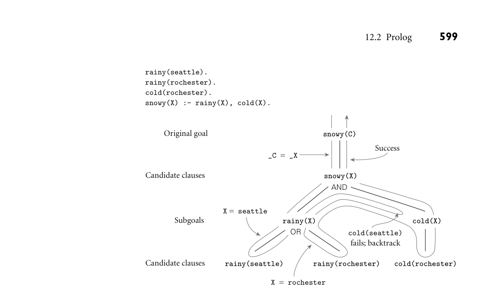
*Figure 12.1 Backtracking search in Prolog. The tree of potential resolutions consists of alter- nating AND and OR levels. An AND level consists of subgoals from the right-hand side of a rule, all of which must be satisfied. An OR level consists of alternative database clauses whose head will unify with the subgoal above; one of these must be satisfied. The notation _C = _X is meant to indicate that while both C and X are uninstantiated, they have been associated with one another in such a way that if either receives a value in the future it will be shared by both.*

The process of returning to previous goals is known as backtracking. It strongly resembles the control flow of generators in Icon (Section C 6.5.4). Whenever a unification operation is “undone” in order to pursue a different path through the search tree, variables that were given values or associated with one another as a result of that unification are returned to their uninstantiated or unassociated state. In Figure 12.1, for example, the binding of X to seattle is broken when EXAMPLE 12.16

Backtracking and instantiation we backtrack to the rainy(X) subgoal. The effect is similar to the breaking of bindings between actual and formal parameters in an imperative programming language, except that Prolog couches the bindings in terms of unification rather than subroutine calls. ■ Space management for backtracking search in Prolog usually follows the single-stack implementation of iterators described in Section C 9.5.3. The inter- preter pushes a frame onto its stack every time it begins to pursue a new subgoal G. If G fails, the frame is popped from the stack and the interpreter begins to backtrack. If G succeeds, control returns to the “caller” (the parent in the search tree), but G’s frame remains on the stack. Later subgoals will be given space above

this dormant frame. If subsequent backtracking causes the interpreter to search for alternative ways of satisfying G, control will be able to resume where it last left off. Note that G will not fail unless all of its subgoals (and all of its siblings to the right in the search tree) have also failed, implying that there is nothing above G’s frame in the stack. At the top level of the interpreter, a semicolon typed by the user is treated the same as failure of the most recently satisfied subgoal. The fact that clauses are ordered, and that the interpreter considers them from first to last, means that the results of a Prolog program are deterministic and pre- dictable. In fact, the combination of ordering and depth-first search means that the Prolog programmer must often consider the order to ensure that recursive programs will terminate. Suppose for example that we have a database describing EXAMPLE 12.17

Order of rule evaluation a directed acyclic graph:

edge(a, b). edge(b, c). edge(c, d). edge(d, e). edge(b, e). edge(d, f). path(X, X). path(X, Y) :- edge(Z, Y), path(X, Z).

The last two clauses tell us how to determine whether there is a path from node X to node Y. If we were to reverse the order of the terms on the right-hand side of the final clause, then the Prolog interpreter would search for a node Z that is reachable from X before checking to see whether there is an edge from Z to Y. The program would still work, but it would not be as efficient. ■ Now consider what would happen if in addition we were to reverse the order EXAMPLE 12.18

Infinite regression of the last two clauses:

path(X, Y) :- path(X, Z), edge(Z, Y). path(X, X).

From a logical point of view, our database still defines the same relationships. A Prolog interpreter, however, will no longer be able to find answers. Even a simple query like ?- path(a, a) will never terminate. To see why, consider Figure 12.2. The interpreter first unifies path(a, a) with the left-hand side of path(X, Y) :- path(X, Z), edge(Z, Y). It then considers the goals on the right-hand side, the first of which (path(X, Z)), unifies with the left-hand side of the very same rule, leading to an infinite regression. In effect, the Prolog interpreter gets lost in an infinite branch of the search tree, and never discovers finite branches to the right. We could avoid this problem by exploring the tree in breadth-first order, but that strategy was rejected by Prolog’s designers because of its expense: it can require substantially more space, and does not lend itself to a stack-based imple- mentation. ■

12.2.5 Extended Example: Tic-Tac-Toe

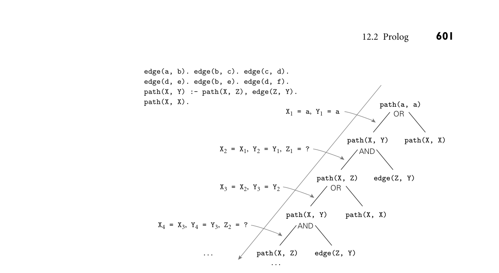
*Figure 12.2 Infinite regression in Prolog. In this figure even a simple query like ?- path(a, a) will never terminate: the interpreter will never find the trivial branch.*

a Prolog program and its ability to terminate. Ordering also allows the Prolog programmer to indicate that certain resolutions are preferred, and should be con- sidered before other, “fallback” options. Consider, for example, the problem of making a move in tic-tac-toe. (Tic-tac-toe is a game played on a 3 × 3 grid of squares. Two players, X and O, take turns placing markers in empty squares. A player wins if he or she places three markers in a row, horizontally, vertically, or diagonally.) Let us number the squares from 1 to 9 in row-major order. Further, let us use the Prolog fact x(n) to indicate that player X has placed a marker in square n, and o(m) to indicate that player O has placed a marker in square m. For simplicity, let us assume that the computer is player X, and that it is X’s turn to move. We should like to be able to issue a query ?- move(A) that will cause the Prolog interpreter to choose a good square A for the computer to occupy next. Clearly we need to be able to tell whether three given squares lie in a row. One way to express this is:

ordered_line(1, 2, 3). ordered_line(4, 5, 6). ordered_line(7, 8, 9). ordered_line(1, 4, 7). ordered_line(2, 5, 8). ordered_line(3, 6, 9). ordered_line(1, 5, 9). ordered_line(3, 5, 7).

line(A, B, C) :- ordered_line(A, B, C). line(A, B, C) :- ordered_line(A, C, B). line(A, B, C) :- ordered_line(B, A, C). line(A, B, C) :- ordered_line(B, C, A). line(A, B, C) :- ordered_line(C, A, B). line(A, B, C) :- ordered_line(C, B, A).

It is easy to prove that there is no winning strategy for tic-tac-toe: either player can force a draw. Let us assume, however, that our program is playing against a less-than-perfect opponent. Our task then is never to lose, and to maximize our chances of winning if our opponent makes a mistake. The following rules work well:

move(A) :- good(A), empty(A).

full(A) :- x(A). full(A) :- o(A). empty(A) :- \+(full(A)).

% strategy: good(A) :- win(A). good(A) :- block_win(A). good(A) :- split(A). good(A) :- strong_build(A). good(A) :- weak_build(A).

The initial rule indicates that we can satisfy the goal move(A) by choosing a good, empty square. The \+ is a built-in predicate that succeeds if its argument (a goal) cannot be proven; we discuss it further in Section 12.2.6. Square n is empty if we cannot prove it is full; that is, if neither x(n) nor o(n) is in the database. The key to strategy lies in the ordering of the last five rules. Our first choice is to win:

win(A) :- x(B), x(C), line(A, B, C).

Our second choice is to prevent our opponent from winning:

block_win(A) :- o(B), o(C), line(A, B, C).

Our third choice is to create a “split”—a situation in which our opponent cannot prevent us from winning on the next move (see Figure 12.3):

split(A) :- x(B), x(C), different(B, C), line(A, B, D), line(A, C, E), empty(D), empty(E). same(A, A). different(A, B) :- \+(same(A, B)).

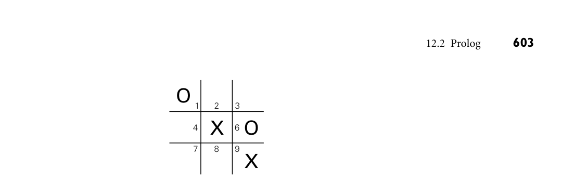
*Figure 12.3 A “split” in tac-tac-toe. If X takes the bottom center square (square 8), no future move by O will be able to stop X from winning the game—O cannot block both the 2–5–8 line and the 7–8–9 line.*

Here we have again relied on the built-in predicate \+. Our fourth choice is to build toward three in a row (i.e., to get two in a row) in such a way that the obvious blocking move won’t allow our opponent to build toward three in a row:

strong_build(A) :- x(B), line(A, B, C), empty(C), \+(risky(C)). risky(C) :- o(D), line(C, D, E), empty(E).

Barring that, our fifth choice is to build toward three in a row in such a way that the obvious blocking move won’t give our opponent a split:

weak_build(A) :- x(B), line(A, B, C), empty(C), \+(double_risky(C)). double_risky(C) :- o(D), o(E), different(D, E), line(C, D, F), line(C, E, G), empty(F), empty(G).

If none of these goals can be satisfied, our final, default choice is to pick an un- occupied square, giving priority to the center, the corners, and the sides in that order:

good(5). good(1). good(3). good(7). good(9). good(2). good(4). good(6). good(8). ■

3CHECK YOUR UNDERSTANDING 1. What mathematical formalism underlies logic programming?

2. What is a Horn clause? 3. Briefly describe the process of resolution in logic programming.

4. What is a unification? Why is it important in logic programming? 5. What are clauses, terms, and structures in Prolog? What are facts, rules, and queries?

6. Explain how Prolog differs from imperative languages in its handling of arith- metic. 7. Describe the difference between forward chaining and backward chaining. Which is used in Prolog by default? 8. Describe the Prolog search strategy. Discuss backtracking and the instantiation of variables.

12.2.6 Imperative Control Flow

We have seen that the ordering of clauses and of terms in Prolog is significant, with ramifications for efficiency, termination, and choice among alternatives. In addition to simple ordering, Prolog provides the programmer with severalexplicit control-flow features. The most important of these features is known as the cut. The cut is a zero-argument predicate written as an exclamation point: !. As a subgoal it always succeeds, but with a crucial side effect: it commits the interpreter to whatever choices have been made since unifying the parent goal with the left- hand side of the current rule, including the choice of that unification itself. For EXAMPLE 12.20

The cut example, recall our definition of list membership:

member(X, [X | _]). member(X, [_ | T]) :- member(X, T).

If a given atom a appears in list L n times, then the goal ?- member(a, L) can succeed n times. These “extra” successes may not always be appropriate. They can lead to wasted computation, particularly for long lists, when member is followed by a goal that may fail:

prime_candidate(X) :- member(X, Candidates), prime(X).

Suppose that prime(X) is expensive to compute. To determine whether a is a prime candidate, we first check to see whether it is a member of the Candidates list, and then check to see whether it is prime. If prime(a) fails, Prolog will backtrack and attempt to satisfy member(a, Candidates) again. If a is in the Candidates list more than once, then the subgoal will succeed again, leading to reconsideration of the prime(a) subgoal, even though that subgoal is doomed to fail. We can save substantial time by cutting off all further searches for a after the first is found:

member(X, [X | _]) :- !. member(X, [_ | T]) :- member(X, T).

The cut on the right-hand side of the first rule says that if X is the head of L, we should not attempt to unify member(X, L) with the left-hand side of the second rule; the cut commits us to the first rule. ■ An alternative way to ensure that member(X, L) succeeds no more than once EXAMPLE 12.21

\+ and its implementation is to embed a use of \+ in the second clause:

member(X, [X | _]). member(X, [H | T]) :- X \= H, member(X, T).

Here X \= H means X and H will not unify; that is, \+(X = H). (In some Prolog dialects, \+ is written not. This name suggests an interpretation that may be somewhat misleading; we discuss the issue in Section 12.4.3.) Our new version of member will display the same high-level behavior as before, but will be slightly less efficient: now the interpreter will actually consider the second rule, abandoning it only after (re)unifying X with H and reversing the sense of the test. It turns out that \+ is actually implemented by a combination of the cut and two other built-in predicates, call and fail:

\+(P) :- call(P), !, fail. \+(P).

The call predicate takes a term as argument and attempts to satisfy it as a goal (terms are first-class values in Prolog). The fail predicate always fails. ■ In principle, it is possible to replace all uses of the cut with uses of \+ —to confine the cut to the implementation of \+. Doing so often makes a program easier to read. As we have seen, however, it often makes it less efficient. In some cases, explicit use of the cut may actually make a program easier to read. Consider EXAMPLE 12.22

Pruning unwanted answers with the cut our tic-tac-toe example. If we type semicolons at the program, it will continue to generate a series of increasingly poor moves from the same board position, even though we only want the first move. We can cut off consideration of the others by using the cut:

move(A) :- good(A), empty(A), !.

To achieve the same effect with \+ we would have to do more major surgery (Exercise 12.8). ■ In general, the cut can be used whenever we want the effect of if... then ... EXAMPLE 12.23

Using the cut for selection else:

statement :- condition, !, then_part. statement :- else_part. ■

The fail predicate can be used in conjunction with a “generator” to implement EXAMPLE 12.24

Looping with fail a loop. We have already seen (in Example 12.13) how to effect a generator by driving a set of rules “backward.” Recall our definition of append:

append([], A, A). append([H | T], A, [H | L]) :- append(T, A, L).

If we use write append(A, B, L), where L is instantiated but A and B are not, the interpreter will find an A and B for which the predicate is true. If backtracking forces it to return, the interpreter will look for another A and B; append will generate pairs on demand. (There is a strong analogy here to the generators of Icon, discussed in Section C 6.5.4.) Thus, to enumerate the ways in which a list can be partitioned into pairs, we can follow a use of append with fail:

print_partitions(L) :- append(A, B, L), write(A), write(' '), write(B), nl, fail.

The nl predicate prints a newline character. The query print_partitions([a, b, c]) produces the following output:

[] [a, b, c] [a] [b, c] [a, b] [c] [a, b, c] [] false.

If we don’t want the overall predicate to fail, we can add a final rule:

print_partitions(_).

Assuming this rule appears last, it will succeed after the output has appeared, and the interpreter will finish with “true.” ■ In some cases, we may have a generator that produces an unbounded sequence of values. The following, for example, generates all of the natural numbers: EXAMPLE 12.25

Looping with an unbounded generator natural(1). natural(N) :- natural(M), N is M+1.

We can use this generator in conjunction with a “test-cut” combination to iterate over the first n numbers:

my_loop(N) :- natural(I), write(I), nl, % loop body (nl prints a newline) I = N, !.

So long as I is less than N, the equality (unification) predicate will fail and back- tracking will pursue another alternative for natural. If I = N succeeds, however, then the cut will be executed, committing us to the current (final) choice of I, and successfully terminating the loop. ■

This programming idiom—an unbounded generator with a test-cut termi- nator—is known as generate-and-test. Like the iterative constructs of Scheme (Section 11.3.4), it is generally used in conjunction with side effects. One such side effect, clearly, is I/O. Another is modification of the program database. Prolog provides a variety of I/O features. In addition to write and nl, which print to the current output file, the read predicate can be used to read terms from the current input file. Individual characters are read and written with get and put. Input and output can be redirected to different files using see and tell. Finally, the built-in predicates consult and reconsult can be used to read database clauses from a file, so they don’t have to be typed into the inter- preter by hand. (Some interpreters require this, allowing only queries to be en- tered interactively.) The predicate get attempts to unify its argument with the next printable char- EXAMPLE 12.26

Character input with get acter of input, skipping over ASCII characters with codes below 32.4 In effect, it behaves as if it were implemented in terms of the simpler predicates get0 and repeat:

get(X) :- repeat, get0(X), X >= 32, !.

The get0 predicate attempts to unify its argument with the single next character of input, regardless of value and, like get, cannot be resatisfied during back- tracking. The repeat predicate, by contrast, can succeed an arbitrary number of times; it behaves as if it were implemented with the following pair of rules:

repeat. repeat :- repeat.

Within the above definition of get, backtracking will return to repeat as often as needed to produce a printable character (one with ASCII code at least 32). In general, repeat allows us to turn any predicate with side effects into a genera- tor. ■

12.2.7 Database Manipulation

Clauses in Prolog are simply collections of terms, connected by the built-in pred- EXAMPLE 12.27

Prolog programs as data icates :- and ,, both of which can be written in either infix or prefix form:

⎫ ⎪ ⎪ ⎬

rainy(rochester). rainy(seattle). cold(rochester). snowy(X) :- rainy(X), cold(X).

⎪ ⎪ ⎭ ≡’,’(rainy(rochester), ’,’(rainy(seattle), ’,’(cold(rochester), :-(snowy(X), ’,’(rainy(X), cold(X))))))

Here the single quotes around the prefix commas serve to distinguish them from the commas that separate the arguments of a predicate. ■ The structural nature of clauses and database contents implies that Prolog, like Scheme, is homoiconic: it can represent itself. It can also modify itself. A EXAMPLE 12.28

Modifying the Prolog database running Prolog program can add clauses to its database with the built-in predicate assert, or remove them with retract:

?- rainy(X). X = seattle ; X = rochester. ?- assert(rainy(syracuse)). true. ?- rainy(X). X = seattle ; X = rochester ; X = syracuse. ?- retract(rainy(rochester)). true. ?- rainy(X). X = seattle ; X = syracuse.

There is also a retractall predicate that removes all matching clauses from the database. ■ Figure 12.4 contains a complete Prolog program for tic-tac-toe. It uses assert, EXAMPLE 12.29

Tic-tac-toe (full game) retractall, the cut, fail, repeat, and write to play an entire game. Moves are added to the database with assert. They are cleared with retractall at the beginning of each game. This way the user can play multiple games without restarting the interpreter. ■

DESIGN & IMPLEMENTATION

12.1 Homoiconic languages As we have noted, both Lisp/Scheme and Prolog are homoiconic. A few other languages, notably Snobol, Forth, and Tcl, share this property. What is its sig- nificance? For most programs the answer is: not much. So long as we write the sorts of programs that we’d write in other languages, the fact that programs and data look the same is really just a curiosity. It becomes something more if we are interested in metacomputing—the creation of programs that create or manipulate other programs, or that extend themselves. Metacomputing re- quires, at the least, that we have true first-class functions in the strict sense of the term—that is, that we be able to generate new functions whose behavior is determined dynamically. A homoiconic language can simplify metacomput- ing by eliminating the need to translate between internal (data structure) and external (syntactic) representations of programs or program extensions.

ordered_line(1, 2, 3). ordered_line(4, 5, 6). ordered_line(7, 8, 9). ordered_line(1, 4, 7). ordered_line(2, 5, 8). ordered_line(3, 6, 9). ordered_line(1, 5, 9). ordered_line(3, 5, 7). line(A, B, C) :- ordered_line(A, B, C). line(A, B, C) :- ordered_line(A, C, B). line(A, B, C) :- ordered_line(B, A, C). line(A, B, C) :- ordered_line(B, C, A). line(A, B, C) :- ordered_line(C, A, B). line(A, B, C) :- ordered_line(C, B, A).

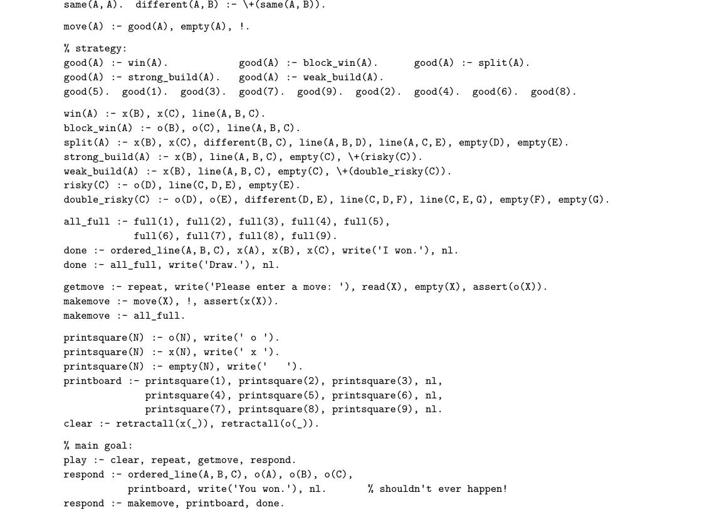
*Figure 12.4 Tic-tac-toe program in Prolog.*

Individual terms in Prolog can be created, or their contents extracted, using EXAMPLE 12.30

The functor predicate the built-in predicates functor, arg, and =... The goal functor(T, F, N) succeeds if and only if T is a term with functor F and arity N:

?- functor(foo(a, b, c), foo, 3). true. ?- functor(foo(a, b, c), F, N). F = foo, N = 3. ?- functor(T, foo, 3). T = foo(_G10, _G37, _G24).

In the last line of output, the atoms with leading underscores are placeholders for uninstantiated variables. ■ The goal arg(N, T, A) succeeds if and only if its first two arguments (N and EXAMPLE 12.31

Creating terms at run time T) are instantiated, N is a natural number, T is a term, and A is the Nth argument of T:

?- arg(3, foo(a, b, c), A). A = c.

Using functor and arg together, we can create an arbitrary term:

?- functor(T, foo, 3), arg(1, T, a), arg(2, T, b), arg(3, T, c). T = foo(a, b, c).

Alternatively, we can use the (infix) =.. predicate, which “equates” a term with a list:

?- T =.. [foo, a, b, c]. T = foo(a, b, c).

?- foo(a, b, c) =.. [F, A1, A2, A3]. F = foo, A1 = a, A2 = b, A3 = c.

Note that

?- foo(a, b, c) = F(A1, A2, A3).

and

?- F(A1, A2, A3) = foo(a, b, c).

do not work: the term preceding a left parenthesis must be an atom, not a vari- able. ■ Using =.. and call, the programmer can arrange to pursue (attempt to sat- EXAMPLE 12.32

Pursuing a dynamic goal isfy) a goal created at run time:

param_loop(L, H, F) :- natural(I), I >= L, G =.. [F, I], call(G), I = H, !.

The goal param_loop(5, 10, write) will produce the following output:

5678910 true.

If we want the numbers on separate lines we can write

?- param_loop(5, 10, writeln).

where

writeln(X) :- write(X), nl. ■

Taken together, the predicates described above allow a Prolog program to cre- ate and decompose clauses, and to add and subtract them from the database. So far, however, the only mechanism we have for perusing the database (i.e., to de- termine its contents) is the built-in search mechanism. To allow programs to EXAMPLE 12.33

Custom database perusal

DESIGN & IMPLEMENTATION

12.2 Reflection A reflection mechanism allows a program to reason about itself. While no widely used language is fully reflective, in the sense that it can inspect every aspect of its structure and current state, significant forms of reflection appear in several major languages, Prolog among them. Given the functor and arity of a starting goal, the clause predicate allows us to find everything related to that goal in the database. Using clause, we can in fact create a metacircular interpreter (Exercise 12.13)—an implementation of Prolog in itself—much as we could for Lisp using eval and apply (Section 11.3.5). We can also write evaluators that use nonstandard search orders (e.g., breadth-first or forward chaining; see Exercise 12.14). Other examples of rich reflection facilities ap- pear in Java, C#, and the major scripting languages. As we shall see in Sec- tion 16.3.1, these allow a program to inspect and reason about its complete type structure. A few languages (e.g., Python) allow a program to inspect its source code as text, but this is not as powerful as the homoiconic inspection of Prolog or Scheme, which allows a program to reason about its own code structure directly.

“reason” in more general ways, Prolog provides a clause predicate that attempts to match its two arguments against the head and body of some existing clause in the database:

?- clause(snowy(X), B). B = rainy(X), cold(X).

Here we have discovered that there is a single rule in the database whose head is a single-argument term with functor snowy. The body of that rule is the conjunc- tion B = rainy(X), cold(X). If there had been more such clauses, we would have had the opportuity to ask for them them by entering semicolons. Prolog re- quires that the first argument to clause be sufficiently instantiated that its func- tor and arity can be determined. A clause with no body (a fact) matches the body true:

?- clause(rainy(rochester), true). true.

Note that clause is quite different from call: it does not attempt to satisfy a goal, but simply to match it against an existing clause:

?- clause(snowy(rochester), true). false. ■

Various other built-in predicates can also be used to “deconstruct” the contents of a clause. The var predicate takes a single argument; it succeeds as a goal if and only if its argument is an uninstantiated variable. The atom and integer predicates succeed as goals if and only if their arguments are atoms and integers, respectively. The name predicate takes two arguments. It succeeds as a goal if and only if its first argument is an atom and its second is a list composed of the ASCII codes for the characters of that atom. 12.3 Theoretical Foundations

In mathematical logic, a predicate is a function that maps constants (atoms) or variables to the values true and false. If rainy is a predicate, for example, we might EXAMPLE 12.34

Predicates as mathematical objects have rainy(Seattle) = true and rainy(Tijuana) = false. Predicate calculus provides a notation and inference rules for constructing and reasoning about propositions (statements) composed of predicate applications, operators (and, or, not, etc.), and the quantifiers ∀and ∃. Logic programming formalizes the search for variable values that will make a given proposition true. ■

IN MORE DEPTH

In conventional logical notation there are many ways to state a given proposition. Logic programming is built on clausal form, which provides a unique expression for every proposition. Many though not all clausal forms can be cast as a collec- tion of Horn clauses, and thus translated into Prolog. On the companion site we trace the steps required to translate an arbitrary proposition into clausal form. We also characterize the cases in which this form can and cannot be translated into Prolog.

12.4 Logic Programming in Perspective

In the abstract, logic programming is a very compelling idea: it suggests a model of computing in which we simply list the logical properties of an unknown value, and then the computer figures out how to find it (or tells us it doesn’t exist). Unfortunately, reality falls quite a bit short of the vision, for both theoretical and practical reasons.

12.4.1 Parts of Logic Not Covered

As noted in Section 12.3, Horn clauses do not capture all of first-order pred- icate calculus. In particular, they cannot be used to express statements whose clausal form includes a disjunction with more than one non-negated term. We can sometimes get around this problem in Prolog by using the \+ predicate, but the semantics are not the same (see Section 12.4.3).

12.4.2 Execution Order

In Section 12.2.4, we saw that one must often consider execution order to ensure that a Prolog search will terminate. Even for searches that terminate, naive code can be very inefficient. Consider the problem of sorting. A natural declarative EXAMPLE 12.35

Sorting incredibly slowly

DESIGN & IMPLEMENTATION

12.3 Implementing logic Predicate calculus is a significantly higher-level notation than lambda calculus. It is much more abstract—much less algorithmic. It is natural, therefore, that a language like Prolog not provide the full power of predicate calculus, and that it include extensions to make it more algorithmic. We may someday reach the point where programming systems are capable of discovering good algorithms from very high-level declarative specifications, but we are not there yet.

way to say that L2 is the sorted version of L1 is to say that L2 is a permutation of L1 and L2 is sorted:

declarative_sort(L1, L2) :- permutation(L1, L2), sorted(L2). permutation([], []). permutation(L, [H | T]) :- append(P, [H | S], L), append(P, S, W), permutation(W, T).

(The append and sorted predicates are defined in Section 12.2.2.) Unfortu- nately, Prolog’s default search strategy may take exponential time to sort a list based on these rules: it will generate permutations until it finds one that is sorted. ■ While logic is inherently declarative, most logic languages explore the tree of possible resolutions in deterministic order. Prolog provides a variety of predi- cates, including the cut, fail, and repeat, to control that execution order (Sec- tion 12.2.6). It also provides predicates, including assert, retract, and call, to manipulate its database explicitly during execution. To obtain a more efficient sort, the Prolog programmer must adopt a less nat- EXAMPLE 12.36

Quicksort in Prolog ural, “imperative” definition:

quicksort([], []). quicksort([A | L1], L2) :- partition(A, L1, P1, S1), quicksort(P1, P2), quicksort(S1, S2), append(P2, [A | S2], L2). partition(A, [], [], []). partition(A, [H | T], [H | P], S) :- A >= H, partition(A, T, P, S). partition(A, [H | T], P, [H | S]) :- A =< H, partition(A, T, P, S).

Even this sort is less efficient than one might hope in certain cases. When given an already-sorted list, for example, it takes quadratic time, instead of O(n log n). A good heuristic for quicksort is to partition the list using the median of the first, middle, and last elements. Unfortunately, Prolog provides no easy way to access the middle and final elements of a list (it has no arrays). ■

DESIGN & IMPLEMENTATION

12.4 Alternative search strategies Some approaches to logic programming attempt to customize the run-time search strategy in a way that is likely to satisfy goals quickly. Darlington [Dar90], for example, describes a technique in which, when an intermediate goal G fails, we try to find alternative instantiations of the variables in G that will allow it to succeed, before backing up to previous goals and seeing whether the alternative instantiations will work in them as well. This “failure-directed search” seems to work well for certain classes of problems. Unfortunately, no general technique is known that will automatically discover the best algorithm (or even just a “good” one) for any given problem.

As we saw in Chapter 10, it can be useful to distinguish between the specifica- tion of a program and its implementation. The specification says what the pro- gram is to do; the implementation says how it is to do it. Horn clauses provide an excellent notation for specifications. When augmented with search rules (as in Prolog) they allow implementations to be expressed in the same notation.

12.4.3 Negation and the “Closed World” Assumption

A collection of Horn clauses, such as the facts and rules of a Prolog database, constitutes a list of things assumed to be true. It does not include any things assumed to be false. This reliance on purely “positive” logic implies that Prolog’s \+ predicate is different from logical negation. Unless the database is assumed to contain everything that is true (this is the closed world assumption), the goal \+(T) can succeed simply because our current knowledge is insufficient to prove T. Moreover, negation in Prolog occurs outside any implicit existential quantifiers EXAMPLE 12.37

Negation as failure on the right-hand side of a rule. Thus

?- \+(takes(X, his201)).

where X is uninstantiated, means

? ¬∃X[takes(X, his201)]

rather than ? ∃X[¬takes(X, his201)]

If our database indicates that jane_doe takes his201, then the goal takes(X, his201) can succeed, and \+(takes(X, his201)) will fail:

?- \+(takes(X, his201)). false.

If we had a way to put the negation inside the quantifier, we might hope for an implementation that would respond

?- \+(takes(X, his201)). X = ajit_chandra

or even

?- \+(takes(X, his201)). X != jane_doe

A complete characterization of the values of X for which ¬takes(X, his201) is true would require a complete exploration of the resolution tree, something that Prolog does only when all goals fail, or when repeatedly prompted with semi- colons. Mechanisms to incorporate some sort of “constructive negation” into logic programming are an active topic of research. ■ It is worth noting that the definition of \+ in terms of failure means that vari- EXAMPLE 12.38

Negation and instantiation able bindings are lost whenever \+ succeeds. For example:

?- takes(X, his201). X = jane_doe ?- \+(takes(X, his201)). false. ?- \+(\+(takes(X, his201))). true. % no value for X provided

When takes first succeeds, X is bound to jane_doe. When the inner \+ fails, the binding is broken. Then when the outer \+ succeeds, a new binding is created to an uninstantiated value. Prolog provides no way to pull the binding of X out through the double negation. ■

3CHECK YOUR UNDERSTANDING 9. Explain the purpose of the cut (!) in Prolog. How does it relate to \+?

10. Describe three ways in which Prolog programs can depart from a pure logic programming model.

11. Describe the generate-and-test programming idiom. 12. Summarize Prolog’s facilities for database manipulation. Be sure to mention assert, retract, and clause. 13. What sorts of logical statements cannot be captured in Horn clauses?

14. What is the closed world assumption? What problems does it cause for logic programming?

12.5 Summary and Concluding Remarks

In this chapter we have focused on the logic model of computing. Where an imperative program computes principally through iteration and side effects, and a functional program computes principally through substitution of parameters into functions, a logic program computes through the resolution of logical state- ments, driven by the ability to unify variables and terms. Much of our discussion was driven by an examination of the principal logic language, Prolog, which we used to illustrate clauses and terms, resolution and

unification, search/execution order, list manipulation, and high-order predicates for inspection and modification of the logic database. Like imperative and functional programming, logic programming is related to constructive proofs. But where an imperative or functional program in some sense is a proof (of the ability to generate outputs from inputs), a logic program is a set of axioms from which the computer attempts to construct a proof. And where imperative and functional programming provide the full power of Turing machines and lambda calculus, respectively (ignoring hardware-imposed limits on arithmetic precision, disk and memory space, etc.), Prolog provides less than the full generality of resolution theorem proving, in the interests of time and space efficiency. At the same time, Prolog extends its formal counterpart with true arithmetic, I/O, imperative control flow, and higher-order predicates for self- inspection and modification. Like Lisp/Scheme, Prolog makes heavy use of lists, largely because they can easily be built incrementally, without the need to allocate and then modify state as separate operations. And like Lisp/Scheme (but unlike ML and its descendants), Prolog is homoiconic: programs look like ordinary data structures, and can be created, modified, and executed on the fly. As we stressed in Chapter 1, different models of computing are appealing in different ways. Imperative programs more closely mirror the underlying hard- ware, and can more easily be “tweaked” for high performance. Purely functional programs avoid the semantic complexity of side effects, and have proved partic- ularly handy for the manipulation of symbolic (nonnumeric) data. Logic pro- grams, with their highly declarative semantics and their emphasis on unification, are well suited to problems that emphasize relationships and search. At the same time, their de-emphasis of control flow can lead to inefficiency. At the current state of the art, computers have surpassed people in their ability to deal with low- level details (e.g., of instruction scheduling), but people are still better at inventing good algorithms. As we also stressed in Chapter 1, the borders between language classes are often very fuzzy. The backtracking search of Prolog strongly resembles the execution of generators in Icon. Unification in Prolog resembles (but is more powerful than) the pattern-matching capabilities of ML and Haskell. (Unification is also used for type checking in ML and Haskell, and for template instantiation in C++, but those are compile-time activities.) There is much to be said for programming in a purely functional or logic-based style. While most Scheme and Prolog programs make some use of imperative language features, those features tend to be responsible for a disproportionate share of program bugs. At the same time, there seem to be programming tasks— interactive I/O, for example—that are almost impossible to accomplish without side effects.

12.6 Exercises

12.1 Starting with the clauses at the beginning of Example 12.17, use resolution (as illustrated in Example 12.3) to show, in two different ways, that there is a path from a to e. 12.2 Solve Exercise 6.22 in Prolog. 12.3 Consider the Prolog gcd program in Figure 1.2. Does this program work “backward” as well as forward? (Given integers d and n, can you use it to generate a sequence of integers m such that gcd(n, m) = d?) Explain your answer. 12.4 In the spirit of Example 11.20, write a Prolog program that exploits back- tracking to simulate the execution of a nondeterministic finite automaton. 12.5 Show that resolution is commutative and associative. Specifically, if A, B, and C are Horn clauses, show that (A ⊕B) = (B ⊕A) and that ((A ⊕B) ⊕ C) = (A ⊕(B ⊕C)), where ⊕indicates resolution. Be sure to think about what happens to variables that are instantiated as a result of unification. 12.6 In Example 12.8, the query ?- classmates(jane_doe, X) will succeed three times: twice with X = jane_doe and once with X = ajit_chandra. Show how to modify the classmates(X, Y) rule so that a student is not considered a classmate of himself or herself. 12.7 Modify Example 12.17 so that the goal path(X, Y), for arbitrary already- instantiated X and Y, will succeed no more than once, even if there are multiple paths from X to Y. 12.8 Using only \+ (no cuts), modify the tic-tac-toe example of Section 12.2.5 so it will generate only one candidate move from a given board position. How does your solution compare to the cut-based one (Example 12.22)? 12.9 Prove the claim, made in Example 12.19, that there is no winning strategy in tic-tac-toe—that either player can force a draw. 12.10 Prove that the tic-tac-toe strategy of Example 12.19 is optimal (wins against an imperfect opponent whenever possible, draws otherwise), or give a counterexample. 12.11 Starting with the tic-tac-toe program of Figure 12.4, draw a directed acyclic graph in which every clause is a node and an arc from A to B indi- cates that it is important, either for correctness or efficiency, that A come before B in the program. (Do not draw any other arcs.) Any topologi- cal sort of your graph should constitute an equally efficient version of the program. (Is the existing program one of them?) 12.12 Write Prolog rules to define a version of the member predicate that will generate all members of a list during backtracking, but without generating duplicates. Note that the cut and\+ based versions of Example 12.20 will

not suffice; when asked to look for an uninstantiated member, they find only the head of the list. 12.13 Use the clause predicate of Prolog to implement the call predicate (pretend that it isn’t built in). You needn’t implement all of the built-in predicates of Prolog; in particular, you may ignore the various imperative control-flow mechanisms and database manipulators. Extend your code by making the database an explicit argument to call, effectively produc- ing a metacircular interpreter. 12.14 Use the clause predicate of Prolog to write a predicate call_bfs that attempts to satisfy goals breadth-first. (Hint: You will want to keep a queue of yet-to-be-pursued subgoals, each of which is represented by a stack that captures backtracking alternatives.) 12.15 Write a (list-based) insertion sort algorithm in Prolog. Here’s what it looks like in C, using arrays:

void insertion_sort(int A[], int N) { int i, j, t; for (i = 1; i < N; i++) { t = A[i]; for (j = i; j > 0; j--) { if (t >= A[j-1]) break; A[j] = A[j-1]; } A[j] = t; } }

12.16 Quicksort works well for large lists, but has higher overhead than insertion sort for short lists. Write a sort algorithm in Prolog that uses quicksort initially, but switches to insertion sort (as defined in the previous exercise) for sublists of 15 or fewer elements. (Hint: You can count the number of elements during the partition operation.) 12.17 Write a Prolog sorting routine that is guaranteed to take O(n log n) time in the worst case. (Hint: Try merge sort; a description can be found in almost any algorithms or data structures text.) 12.18 Consider the following interaction with a Prolog interpreter:

?- Y = X, X = foo(X). Y = foo(foo(foo(foo(foo(foo(foo(foo(foo(foo(foo( foo(foo(foo(foo(foo(foo(foo(foo(foo(foo(foo(foo( foo(foo(foo(foo(foo(foo(foo(foo(foo(foo(foo(foo( foo(foo(foo(foo(foo(foo(foo(foo(foo(foo(foo(foo( foo(foo(foo(foo(foo(foo(...

which a structure like this one would be useful? If not, can you suggest how a Prolog interpreter might implement checks to forbid its creation? How expensive would those checks be? Would the cost in your opinion be justified?

12.19–12.21 In More Depth. 12.7 Explorations

12.22 Learn about alternative search strategies for Prolog and other logic lan- guages. How do forward chaining solvers work? What are the prospects for intelligent hybrid strategies? 12.23 Between 1982 and 1992 the Japanese government invested large sums of money in logic programming. Research the Fifth Generation project, ad- ministered by the Japanese Ministry of International Trade and Industry (MITI). What were its goals? What was achieved? What was not? How tightly were the goals and outcomes tied to Prolog? What lessons can we learn from the project today? 12.24 Read ahead to Chapter 14 and learn about XSLT, a language used to ma- nipulate data represented in XML, the extended markup language (of which XHTML, the latest standard for web pages, is an example). XSLT is generally described as declarative. Is it logic based? How does it com- pare to Prolog in expressive power, level of abstraction, and execution ef- ficiency? 12.25 Repeat the previous question for SQL, the database query language (for an introduction, type “SQL tutorial” into your favorite Internet search en- gine). 12.26 Spreadsheets like Microsoft Excel are sometimes characterized as declar- ative programming. Is this fair? Ignoring extensions like Visual Basic macros, does the ability to define relationships among cells provide Turing complete expressive power? Compare the execution model to that of Pro- log. How is the order of update for cells determined? Can data be pushed “both ways,” as they can in Prolog?

12.27–12.30 In More Depth. 12.8 Bibliographic Notes

Logic programming has its roots in automated theorem proving. Much of the the- oretical groundwork was laid by Horn in the early 1950s [Hor51], and by Robin- son in the early 1960s [Rob65]. The breakthrough for computing came in the

early 1970s, when Colmeraurer and Roussel at the University of Aix–Marseille in France and Kowalski and his colleagues at the University of Edinburgh in Scotland developed the initial version of Prolog. The early history of the lan- guage is recounted by Robinson [Rob83]. Theoretical foundations are covered by Lloyd [Llo87]. Prolog was originally intended for research in natural language processing, but it soon became apparent that it could serve as a general-purpose language. Several versions of Prolog have since evolved. The one described here is the widely used Edinburgh dialect. The ISO standard [Int95] is similar. Several other logic languages have been developed, though none rivaled Pro- log in popularity. OPS5 [BFKM86] used forward chaining. Gödel [HL94] in- cludes modules, strong typing, a richer variety of logical operators, and enhanced control of execution order. Parlog is a parallel Prolog dialect; we will mention it briefly in Section 13.4.5. Mercury [SHC96] adopts a variety of features from ML-family functional languages, including static type inference, monad-like I/O, higher-order predicates, closures, currying, and lambda expressions. It is com- piled, rather than interpreted, and requires the programmer to specify modes (in, out) for predicate arguments. Database query languages stemming from Datalog [Ull85][UW08, Secs. 4.2– 4.4] are implemented using forward chaining. CLP (Constraint Logic Program- ming) and its variants are largely based on Prolog, but employ a more general constraint-satisfaction mechanism in place of unification [JM94]. The Associa- tion for Logic Programming can be found on-line at www.cs.nmsu.edu/ALP/.

13

Concurrency

The bulk of this text has focused, implicitly, on sequential programs: pro- grams with a single active execution context. As we saw in Chapter 6, sequen- tiality is fundamental to imperative programming. It also tends to be implicit in declarative programming, partly because practical functional and logic languages usually include some imperative features, and partly because people tend to de- velop imperative implementations and mental models of declarative programs (applicative order reduction, backward chaining with backtracking), even when language semantics do not require such a model. By contrast, a program is said to be concurrent if it may have more than one active execution context—more than one “thread of control.” Concurrency has at least three important motivations:

1. To capture the logical structure of a problem. Many programs, particularly servers and graphical applications, must keep track of more than one largely independent “task” at the same time. Often the simplest and most logical way to structure such a program is to represent each task with a separate thread of control. We touched on this “multithreaded” structure when discussing coroutines (Section 9.5) and events (Section 9.6); we will return to it in Sec- tion 13.1.1. 2. To exploit parallel hardware, for speed. Long a staple of high-end servers and supercomputers, multiple processors (or multiple cores within a processor) have become ubiquitous in desktop, laptop, and mobile devices. To use these cores effectively, programs must generally be written (or rewritten) with con- currency in mind. 3. To cope with physical distribution. Applications that run across the Internet or a more local group of machines are inherently concurrent. So are many embed- ded applications: the control systems of a modern automobile, for example, may span dozens of processors spread throughout the vehicle.

In general, we use the word concurrent to characterize any system in which two or more tasks may be underway (at an unpredictable point in their execution) at the same time. Under this definition, coroutines are not concurrent, because at

any given time, all but one of them is stopped at a well-known place. A concurrent system is parallel if more than one task can be physically active at once; this re- quires more than one processor. The distinction is purely an implementation and performance issue: from a semantic point of view, there is no difference between true parallelism and the “quasiparallelism” of a system that switches between tasks at unpredictable times. A parallel system is distributed if its processors are associ- ated with people or devices that are physically separated from one another in the real world. Under these definitions, “concurrent” applies to all three motivations above. “Parallel” applies to the second and third; “distributed” applies to only the third. We will focus in this chapter on concurrency and parallelism. Parallelism has become a pressing concern since 2005 or so, with the proliferation of multicore processors. We will have less occasion to touch on distribution. While languages have been designed for distributed computing, most distributed systems run sep- arate programs on every networked processor, and use message-passing library routines to communicate among them. We begin our study with an overview of the ways in which parallelism may be used in modern programs. Our overview will touch on the motivation for concurrency (even on uniprocessors) and the concept of races, which are the principal source of complexity in concurrent programs. We will also briefly survey the architectural features of modern multicore and multiprocessor ma- chines. In Section 13.2 we consider the contrast between shared-memory and message-passing models of concurrency, and between language and library-based implementations. Building on coroutines, we explain how a language or li- brary can create and schedule threads. Section 13.3 focuses on low-level mecha- nisms for shared-memory synchronization. Section 13.4 extends the discussion to language-level constructs. Message-passing models of concurrency are consid- ered in Section 13.5 (mostly on the companion site). 13.1 Background and Motivation

Concurrency is not a new idea. Much of the theoretical groundwork was laid in the 1960s, and Algol 68 includes concurrent programming features. Widespread interest in concurrency is a relatively recent phenomenon, however; it stems in part from the availability of low-cost multicore and multiprocessor machines, and in part from the proliferation of graphical, multimedia, and web-based applica- tions, all of which are naturally represented by concurrent threads of control.

Levels of Parallelism

Parallelism arises at every level of a modern computer system. It is comparatively easy to exploit at the level of circuits and gates, where signals can propagate down thousands of connections at once. As we move up first to processors and cores, and then to the many layers of software that run on top of them, the granularity

of parallelism—the size and complexity of tasks—increases at every level, and it becomes increasingly difficult to figure out what work should be done by each task and how tasks should coordinate. For 40 years, microarchitectural research was largely devoted to finding more and better ways to exploit the instruction-level parallelism (ILP) available in ma- chine language programs. As we saw in Chapter 5, the combination of deep, superscalar pipelines and aggressive speculation allows a modern processor to track dependences among hundreds of “in-flight” instructions, make progress on scores of them, and complete several in every cycle. Shortly after the turn of the century, it became apparent that a limit had been reached: there simply wasn’t any more instruction-level parallelism available in conventional programs. At the next higher level of granularity, so-called vector parallelism is available in programs that perform operations repeatedly on every element of a very large data set. Processors designed to exploit this parallelism were the dominant form of supercomputer from the late 1960s through the early 1990s. Their legacy lives on in the vector instructions of mainstream processors (e.g., the MMX, SSE, and AVX extensions to the x86 instruction set), and in modern graphical processing units (GPUs), whose peak performance can exceed that of the typical CPU (cen- tral processing unit—a conventional core) by a factor of more than 100. Unfortunately, vector parallelism arises in only certain kinds of programs. Given the end of ILP, and the limits on clock frequency imposed by heat dissi- pation (Section C 5.4.4), general-purpose computing today must obtain its per- formance improvements from multicore processors, which require coarser-grain thread-level parallelism. The move to multicore has thus entailed a fundamental shift in the nature of programming: where parallelism was once a largely invisible implementation detail, it must now be written explicitly into high-level program structure.

Levels of Abstraction

On today’s multicore machines, different kinds of programmers need to under- stand concurrency at different levels of detail, and use it in different ways. The simplest, most abstract case arises when using “black box” parallel li- braries. A sorting routine or a linear algebra package, for example, may execute in parallel without its caller needing to understand how. In the database world, queries expressed in SQL (Structured Query Language) often execute in paral- lel as well. Microsoft’s .NET Framework includes a Language-Integrated Query mechanism (LINQ) that allows database-style queries to be made of program data structures, again with parallelism “under the hood.” At a slightly less abstract level, a programmer may know that certain tasks are mutually independent (because, for example, they access disjoint sets of

variables). Such tasks can safely execute in parallel.1 In C#, for example, we can EXAMPLE 13.1

Independent tasks in C# write the following using the Task Parallel Library:

Parallel.For(0, 100, i => { A[i] = foo(A[i]); });

The first two arguments to Parallel.For are “loop” bounds; the third is a dele- gate, here written as a lambda expression. Assuming A is a 100-element array, and that the invocations of foo are truly independent, this code will have the same ef- fect as the obvious traditional for loop, except that it will run faster, making use of as many cores as possible (up to 100). ■ If our tasks are not independent, it may still be possible to run them in parallel if we explicitly synchronize their interactions. Synchronization serves to eliminate races between threads by controlling the ways in which their actions can interleave in time. Suppose function foo in the previous example subtracts 1 from A[i] EXAMPLE 13.2

A simple race condition and also counts the number of times that the result is zero. Naively we might implement foo as

int zero_count; public static int foo(int n) { int rtn = n - 1; if (rtn == 0) zero_count++; return rtn; }

Consider now what may happen when two or more instances of this code run concurrently:

Thread 1 . . . Thread 2 r1 := zero count . . . r1 := r1 + 1 r1 := zero count zero count := r1 r1 := r1 + 1 . . . zero count := r1 . . .

If the instructions interleave roughly as shown, both threads may load the same value of zero count, both may increment it by one, and both may store the (only one greater) value back into zero count. The result may be less than what we expect. In general, a race condition occurs whenever two or more threads are “racing” toward points in the code at which they touch some common object, and the behavior of the system depends on which thread gets there first. In this particular example, the store of zero count in Thread 1 is racing with the load in Thread 2.

If Thread 1 gets there first, we will get the “right” result; if Thread 2 gets there first, we won’t. ■ The most common purpose of synchronization is to make some sequence of instructions, known as a critical section, appear to be atomic—to happen “all at once” from the point of view of every other thread. In our example, the critical section is a load, an increment, and a store. The most common way to make the sequence atomic is with a mutual exclusion lock, which we acquire before the first instruction of the sequence and release after the last. We will study locks in Sections 13.3.1 and 13.3.5. In Sections 13.3.2 and 13.4.4 we will also consider mechanisms that achieve atomicity without locks. At lower levels of abstraction, expert programmers may need to understand hardware and run-time systems in sufficient detail to implement synchronization mechanisms. This chapter should convey a sense of the issues, but a full treatment at this level is beyond the scope of the current text.

13.1.1 The Case for Multithreaded Programs

Our first motivation for concurrency—to capture the logical structure of certain applications—has arisen several times in earlier chapters. In Section C 8.7.1 we noted that interactive I/O must often interrupt the execution of the current pro- gram. In a video game, for example, we must handle keystrokes and mouse or joystick motions while continually updating the image on the screen. The stan- dard way to structure such a program, as described in Section 9.6.2, is to execute the input handlers in a separate thread of control, which coexists with one or more threads responsible for updating the screen. In Section 9.5, we considered a screen saver program that used coroutines to interleave “sanity checks” on the file system with updates to a moving picture on the screen. We also considered discrete-event simulation, which uses coroutines to represent the active entities of some real-world system. The semantics of discrete-event simulation require that events occur atomi- cally at fixed points in time. Coroutines provide a natural implementation, be- cause they execute one at a time: so long as we never switch coroutines in the mid- dle of a to-be-atomic operation, all will be well. In our other examples, however— and indeed in most “naturally concurrent” programs—there is no need for corou- tine semantics. By assigning concurrent tasks to threads instead of to coroutines, we acknowledge that those tasks can proceed in parallel if more than one core is available. We also move responsibility for figuring out which thread should run when from the programmer to the language implementation. In return, we give up any notion of trivial atomicity. The need for multithreaded programs is easily seen in web-based applications. EXAMPLE 13.3

Multithreaded web browser In a browser such as Chrome or Firefox (see Figure 13.1), there are typically many different threads simultaneously active, each of which is likely to communicate with a remote (and possibly very slow) server several times before completing its task. When the user clicks on a link, the browser creates a thread to request the

specified document. For all but the tiniest pages, this thread will then receive a se- ries of message “packets.” As these packets begin to arrive the thread must format them for presentation on the screen. The formatting task is akin to typesetting: the thread must access fonts, assemble words, and break the words into lines. For many special tags within the page, the formatting thread will spawn additional threads: one for each image, one for the background if any, one to format each table, and possibly more to handle separate frames. Each spawned thread will communicate with the server to obtain the information it needs (e.g., the con- tents of an image) for its particular task. The user, meanwhile, can access items in menus to create new browser windows, edit bookmarks, change preferences, and so on, all in “parallel” with the rendering of page elements. ■ The use of many threads ensures that comparatively fast operations (e.g., dis- play of text) do not wait for slow operations (e.g., display of large images). When- ever one thread blocks (waits for a message or I/O), the run-time or operating system will automatically switch execution on the core to run a different thread. In a preemptive thread package, these context switches will occur at other times as well, to prevent any one thread from hogging processor resources. Any reader who remembersearly, more sequential browsers will appreciate the difference that multithreading makes in perceived performance and responsiveness, even on a single-core machine.

The Dispatch Loop Alternative

Without language or library support for threads, a browser must either adopt a EXAMPLE 13.4

Dispatch loop web browser more sequential structure, or centralize the handling of all delay-inducing events in a single dispatch loop (see Figure 13.2). Data structures associated with the dispatch loop keep track of all the tasks the browser has yet to complete. The state of a task may be quite complicated. For the high-level task of rendering a page, the state must indicate which packets have been received and which are still outstanding. It must also identify the various subtasks of the page (images, tables, frames, etc.) so that we can find them all and reclaim their state if the user clicks on a “stop” button. To guarantee good interactive response, we must make sure that no subaction of continue task takes very long to execute. Clearly we must end the current ac- tion whenever we wait for a message. We must also end it whenever we read from a file, since disk operations are slow. Finally, if any task needs to compute for longer than about a tenth of a second (the typical human perceptual threshold), then we must divide the task into pieces, between which we save state and return to the top of the loop. These considerations imply that the condition at the top of the loop must cover the full range of asynchronous events, and that evalua- tions of the condition must be interleaved with continued execution of any tasks that were subdivided due to lengthy computation. (In practice we would proba- bly need a more sophisticated mechanism than simple interleaving to ensure that neither input-driven nor compute-bound tasks hog more than their share of re- sources.) ■

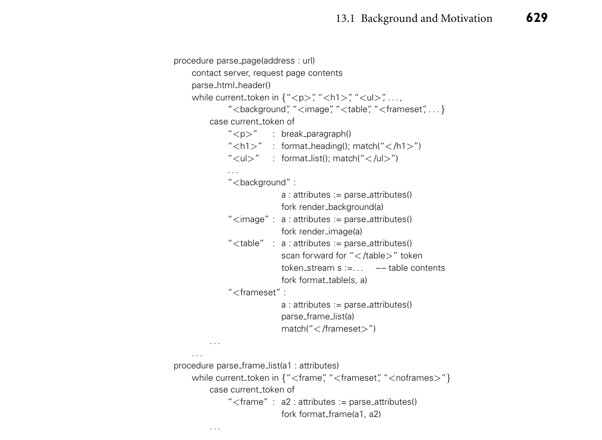
*Figure 13.1 Thread-based code from a hypothetical Web browser. To first approximation, the parse page subroutine is the root of a recursive descent parser for HTML. In several cases, however, the actions associated with recognition of a construct (background, image, table, frame- set) proceed concurrently with continued parsing of the page itself. In this example, concurrent threads are created with the fork operation. An additional thread would likely execute in re- sponse to keyboard and mouse events.*

The principal problem with a dispatch loop—beyond the complexity of subdi- viding tasks and saving state—is that it hides the algorithmic structure of the pro- gram. Every distinct task (retrieving a page, rendering an image, walking through nested menus) could be described elegantly with standard control-flow mech- anisms, if not for the fact that we must return to the top of the dispatch loop at every delay-inducing operation. In effect, the dispatch loop turns the program “inside out,” making the management of tasks explicit and the control flow within tasks implicit. The resulting complexity is similar to what we encountered when

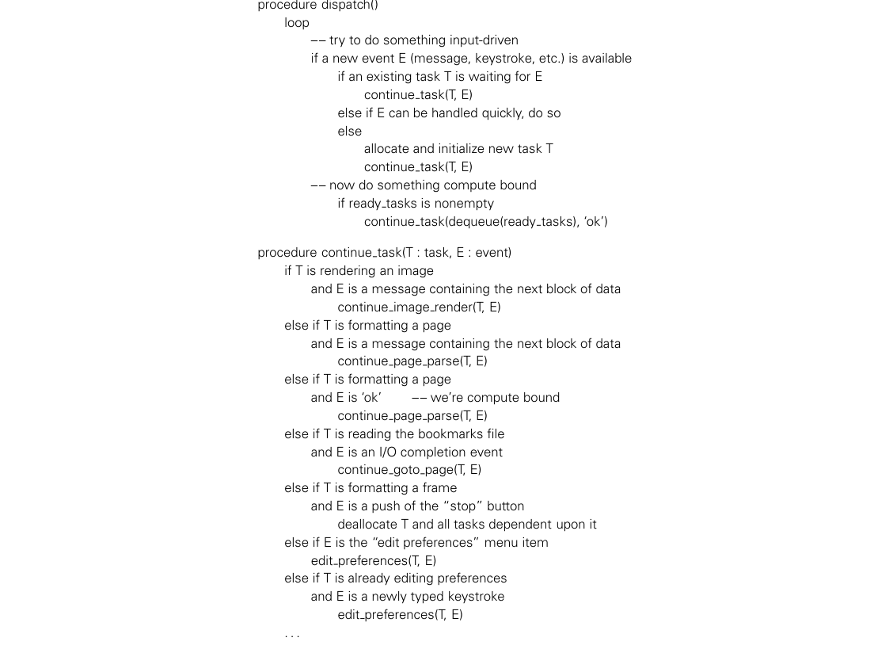
*Figure 13.2 Dispatch loop from a hypothetical non-thread-based Web browser. The clauses in continue task must cover all possible combinations of task state and triggering event. The code in each clause performs the next coherent unit of work for its task, returning when (1) it must wait for an event, (2) it has consumed a significant amount of compute time, or (3) the task is complete. Prior to returning, respectively, code (1) places the task in a dictionary (used by dispatch) that maps awaited events to the tasks that are waiting for them, (2) enqueues the task in ready tasks, or (3) deallocates the task.*

trying to enumerate a recursive set with iterator objects in Section 6.5.3, only worse. Like true iterators, a thread package turns the program “right side out,” making the management of tasks (threads) implicit and the control flow within threads explicit.

13.1.2 Multiprocessor Architecture

Parallel computer hardware is enormously diverse. A distributed system—one that we think of in terms of interactions among separate programs running on separate machines—may be as large as the Internet, or as small as the components of a cell phone. A parallel but nondistributed system—one that we think of in terms of a single program running on a single machine—may still be very large. China’s Tianhe-2 supercomputer, for example, has more than 3 million cores, consumes over 17 MW of power, and occupies 720 square meters of floor space (about a fifth of an acre). Historically, most parallel but nondistributed machines were homogeneous— their processors were all identical. In recent years, many machines have added programmable GPUs, first as separate processors, and more recently as separate portions of a single processor chip. While the cores of a GPU are internally homo- geneous, they are very different from those of the typical CPU, leading to a glob- ally heterogeneous system. Future systems may have cores of many other kinds as well, each specialized to particular kinds of programs or program components. In an ideal world, programming languages and runtimes would map program fragments to suitable cores at suitable times, but this sort of automation is still very much a research goal. As of 2015, programmers who want to make use of the GPU write appropriate portions of their code in special-purpose languages like OpenCL or CUDA, which emphasize repetitive operations over vectors. A main program, running on the CPU, then ships the resulting “kernels” to the GPU explicitly. In the remainder of this chapter, we will concentrate on thread-level paral- lelism for homogeneous machines. For these, many of the most important archi- tectural questions involve the memory system. In some machines, all of physical memory is accessible to every core, and the hardware guarantees that every write is quickly visible everywhere. At the other extreme, some machines partition main memory among processors, forcing cores to interact through some sepa- rate message-passing mechanism. In intermediate designs, some machines share memory in a noncoherent fashion, making writes on one core visible to another only when both have explicitly flushed their caches. From the point of view of language or library implementation, the principal distinction between shared-memory and message-passing hardware is that mes- sages typically require the active participation of cores at both ends of the con- nection: one to send, the other to receive. On a shared-memory machine, a core can read and write remote memory without any other core’s assistance. On small machines (2–4 processors, say), main memory may be uniform— equally distant from all processors. On larger machines (and even on some very

small machines), memory may be nonuniform instead—each bank may be physi- cally adjacent to a particular processor or small group of processors. Cores in any processor can then access the memory of any other, but local memory is faster. Assuming all memory is cached, of course, the difference appears only on cache misses, where the penalty for local memory is lower.

Memory Coherence

As suggested by the notion of noncoherent memory, caches introduce a serious problem for shared-memory machines: unless we do something special, a core that has cached a particular memory location may run for an arbitrarily long time without seeing changes that have been made to that location by other cores. This problem—how to keep cached copies of a memory location consistent with EXAMPLE 13.5

The cache coherence problem

DESIGN & IMPLEMENTATION

13.1 What, exactly, is a processor? From roughly 1975 to 2005, a processor typically ran only one thread at a time, and occupied one full chip. Today, most vendors still use the term “pro- cessor” to refer to the physical device that “does the computing,” and whose pins connect it to the rest of the computer, but the internal structure is much more complicated: there may be more than one chip inside the physical pack- age, each chip may have multiple cores (each of which would have been called a “processor” in previous hardware generations), and each core may have multiple hardware threads (independent register sets, which allow the core’s pipeline(s) to run a mix of instructions drawn from multiple software threads). A modern processor may also include many megabytes of on-chip cache, or- ganized into multiple levels, and physically distributed and shared among the cores in complicated ways. Increasingly, processors may incorporate on-chip memory controllers, network interfaces, graphical processing units, or other formerly “peripheral” components, making continued use of the term “pro- cessor” problematic but no less common. From a software perspective, the good news is that operating systems and programming languages generally model every concurrent activity as a thread, regardless of whether it shares a core, a chip, or a package with other threads. We will follow this convention for most of the rest of this chapter, ignoring the complexity of the underlying hardware. When we need to refer to the hardware on which a thread runs, we will usually call it a “core.” The bad news is that a model of computing in which “everything is just a thread” hides details that are crucial to understanding and improving performance. Future chips are likely to include ever larger numbers of heterogeneous cores and complex on- chip networks. To use these chips effectively, language implementations will need to become much more sophisticated about scheduling threads onto the underlying hardware. How much of the task will need to be visible to the application programmer remains to be determined.

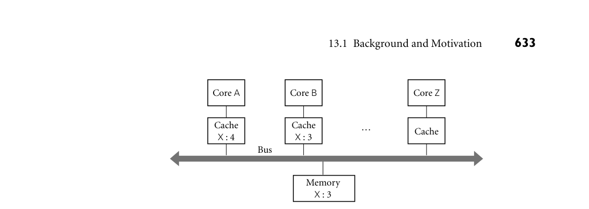
*Figure 13.3 The cache coherence problem for shared-memory multicore and multiprocessor machines. Here cores A and B have both read variable X from memory. As a side effect, a copy of X has been created in the cache of each core. If A now changes X to 4 and B reads X again, how do we ensure that the result is a 4 and not the still-cached 3? Similarly, if Z reads X into its cache, how do we ensure that it obtains the 4 from A’s cache instead of the stale 3 from memory?*

one another—is known as the coherence problem (see Figure 13.3). On a simple bus-based machine, the problem is relatively easy to solve: the broadcast nature of the communication medium allows cache controllers to eavesdrop (snoop) on the memory traffic of other cores. When a core needs to write a cache line, it requests an exclusive copy, and waits for other cores to invalidate their copies. On a bus the waiting is trivial, and the natural ordering of messages determines who wins in the event of near-simultaneous requests. Cores that try to access a line in the wake of invalidation must go back to memory (or to another core’s cache) to obtain an up-to-date copy. ■ Bus-based cache coherence algorithms are now a standard, built-in part of most commercial microprocessors. On large machines, the lack of a broadcast bus makes cache coherence a significantly more difficult problem; commercial imple- mentations are available, but they are complex and expensive. On both small and large machines, the fact that coherence is not instantaneous (it takes time for no- tifications to propagate) means that we must consider the order in which updates to different locations appear to occur from the point of view of different proces- sors. Ensuring a consistent view is a surprisingly difficult problem; we will return to it in Section 13.3.3. As of 2015, there are multicore versions of every major instruction set ar- chitecture, including ARM, x86, Power, SPARC, x86-64, and IA-64 (Itanium). Small, cache-coherent multiprocessors built from these are available from dozens of manufacturers. Larger, cache-coherent shared-memory multiprocessors are available from several manufacturers, including Oracle, HP, IBM, and SGI.

Supercomputers

Though dwarfed financially by the rest of the computer industry, supercomput- ing has always played a disproportionate role in the development of computer

technology and the advancement of human knowledge. Supercomputers have changed dramatically over time, and they continue to evolve at a very rapid pace. They have always, however, been parallel machines. Because of the complexity of cache coherence, it is difficult to build large shared-memory machines. SGI sells machines with as many as 256 processors (2048 cores). Cray builds even larger shared-memory machines, but without the ability to cache remote locations. For the most part, however, the vector super- computers of the 1960s–80s were displaced not by large multiprocessors, but by modest numbers of smaller multiprocessors or by very large numbers of com- modity (mainstream) processors, connected by custom high-performance net- works. As network technology “trickled down” into the broader market, these machines in turn gave way to clusters composed of both commodity multicore processors and commodity networks (Gigabit Ethernet or Infiniband). As of 2015, clusters have come to dominate everything from modest server farms up to all but the very fastest supercomputer sites. Large-scale on-line services like Google, Amazon, or Facebook are typically backed by clusters with tens or hun- dreds of thousands of cores (in Google’s case, probably millions). Today’s fastest machines are constructed from special high-density multicore chips with low per-core operating power. The Tianhe-2 (the fastest machine in the world as of June 2015) uses a 2:3 mix of Intel 12-core Ivy Bridge and 61-core Phi processors, at 10 W and 5 W per core, respectively. Given current trends, it seems likely that future machines, both high-end and commodity, will be increas- ingly dense and increasingly heterogeneous. From a programming language perspective, the special challenge of supercom- puting is to accommodate nonuniform access times and (in most cases) the lack of hardware support for shared memory across the full machine. Today’s su- percomputers are programmed mostly with message-passing libraries (MPI in particular) and with languages and libraries in which there is a clear syntactic distinction between local and remote memory access.

3CHECK YOUR UNDERSTANDING 1. Explain the distinctions among concurrent, parallel, and distributed.

2. Explain the motivation for concurrency. Why do people write concurrent programs? What accounts for the increased interest in concurrency in recent years?

3. Describe the implementation levels at which parallelism appears in modern systems, and the levels of abstraction at which it may be considered by the programmer. 4. What is a race condition? What is synchronization?

5. What is a context switch? Preemption? 6. Explain the concept of a dispatch loop. What are its advantages and disadvan- tages with respect to multithreaded code?

7. Explain the distinction between a multiprocessor and a cluster; between a pro- cessor and a core. 8. What does it mean for memory in a multiprocessor to be uniform? What is the alternative? 9. Explain the coherence problem for multicore and multiprocessor caches.

10. What is a vector machine? Where does vector technology appear in modern systems?

13.2 Concurrent Programming Fundamentals

Within a concurrent program, we will use the term thread to refer to the active entity that the programmer thinks of as running concurrently with other threads. In most systems, the threads of a given program are implemented on top of one or more processes provided by the operating system. OS designers often distinguish between a heavyweight process, which has its own address space, and a collection of lightweight processes, which may share an address space. Lightweight processes were added to most variants of Unix in the late 1980s and early 1990s, to accom- modate the proliferation of shared-memory multiprocessors. We will sometimes use the word task to refer to a well-defined unit of work that must be performed by some thread. In one common programming idiom, a collection of threads shares a common “bag of tasks”—a list of work to be done. Each thread repeatedly removes a task from the bag, performs it, and goes back for another. Sometimes the work of a task entails adding new tasks to the bag. Unfortunately, terminology is inconsistent across systems and authors. Several languages call their threads processes. Ada calls them tasks. Several operating sys- tems call lightweight processes threads. The Mach OS, from which OSF Unix and Mac OS X are derived, calls the address space shared by lightweight processes a task. A few systems try to avoid ambiguity by coining new words, such as “actors,” “fibers,” or “filaments.” We will attempt to use the definitions of the preceding two paragraphs consistently, and to identify cases in which the terminology of particular languages or systems differs from this usage.

13.2.1 Communication and Synchronization

In any concurrent programming model, two of the most crucial issues to be ad- dressed are communication and synchronization. Communication refers to any mechanism that allows one thread to obtain information produced by another. Communication mechanisms for imperative programs are generally based on either shared memory or message passing. In a shared-memory programming model, some or all of a program’s variables are accessible to multiple threads.

For a pair of threads to communicate, one of them writes a value to a variable and the other simply reads it. In a pure message-passing programming model, threads have no common state: for a pair of threads to communicate, one of them must perform an explicit send operation to transmit data to another. (Some languages—Ada, Go, and Rust, for example—provide both messages and shared memory.) Synchronization refers to any mechanism that allows the programmer to con- trol the relative order in which operations occur in different threads. Synchro- nization is generally implicit in message-passing models: a message must be sent before it can be received. If a thread attempts to receive a message that has not yet been sent, it will wait for the sender to catch up. Synchronization is generally not implicit in shared-memory models: unless we do something special, a “receiving” thread could read the “old” value of a variable, before it has been written by the “sender.” In both shared-memory and message-based programs, synchronization can be implemented either by spinning (also called busy-waiting) or by blocking. In busy-wait synchronization, a thread runs a loop in which it keeps reevaluating some condition until that condition becomes true (e.g., until a message queue becomes nonempty or a shared variable attains a particular value)—presumably as a result of action in some other thread, running on some other core. Note that busy-waiting makes no sense on a uniprocessor: we cannot expect a condition to become true while we are monopolizing a resource (the one and only core) required to make it true. (A thread on a uniprocessor may sometimes busy-wait for the completion of I/O, but that’s a different situation: the I/O device runs in parallel with the processor.) In blocking synchronization (also called scheduler-based synchronization), the waiting thread voluntarily relinquishes its core to some other thread. Before do- ing so, it leaves a note in some data structure associated with the synchronization condition. A thread that makes the condition true at some point in the future will find the note and take action to make the blocked thread run again. We will con-

DESIGN & IMPLEMENTATION

13.2 Hardware and software communication As described in Section 13.1.2, the distinction between shared memory and message passing applies not only to languages and libraries but also to com- puter hardware. It is important to note that the model of communication and synchronization provided by the language or library need not necessarily agree with that of the underlying hardware. It is easy to implement message passing on top of shared-memory hardware. With a little more effort, one can also im- plement shared memory on top of message-passing hardware. Systems in this latter camp are sometimes referred to as software distributed shared memory (S-DSM).

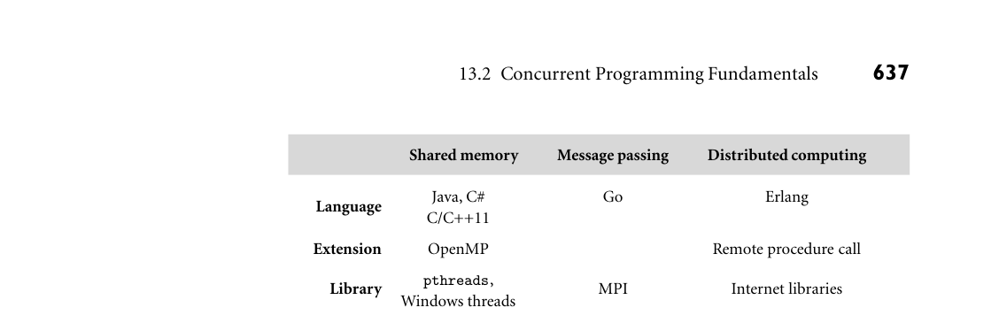
*Figure 13.4 Examples of parallel programming systems. There is also a very large number of experimental, pedagogical, or niche proposals for each of the regions in the table.*

sider synchronization again briefly in Section 13.2.4, and then more thoroughly in Section 13.3.

13.2.2 Languages and Libraries

Thread-level concurrency can be provided to the programmer in the form of ex- plicitly concurrent languages, compiler-supported extensions to traditional se- quential languages, or library packages outside the language proper. All three options are widely used, though shared-memory languages are more common at the “low end” (for multicore and small multiprocessor machines), and message- passing libraries are more common at the “high end” (for massively parallel su- percomputers). Examples of systems in widespread use are categorized in Fig- ure 13.4. For many years, almost all parallel programming employed traditional sequen- tial languages (largely C and Fortran) augmented with libraries for synchroniza- tion or message passing, and this approach still dominates today. In the Unix world, shared memory parallelism has largely converged on the POSIX pthreads standard, which includes mechanisms to create, destroy, schedule, and synchro- nize threads. This standard became an official part of both C and C++ as of their 2011 versions. Similar functionality for Windows machines is provided by Microsoft’s thread package and compilers. For high-end scientific computing, message-based parallelism has likewise converged on the MPI (Message Passing Interface) standard, with open-source and commercial implementations available for almost every platform. While language support for concurrency goes back all the way to Algol 68 (and coroutines to Simula), and while such support was widely available in Ada by the late 1980s, widespread interest in these features didn’t really arise until the mid-1990s, when the explosive growth of the World Wide Web began to drive the development of parallel servers and concurrent client programs. This devel- opment coincided nicely with the introduction of Java, and Microsoft followed with C# a few years later. Though not yet as influential, many other languages, including Erlang, Go, Haskell, Rust, and Scala, are explicitly parallel as well.

In the realm of scientific programming, there is a long history of extensions to Fortran designed to facilitate the parallel execution of loop iterations. By the turn of the century this work had largely converged on a set of extensions known as OpenMP, available not only in Fortran but also in C and C++. Syntactically, OpenMP comprises a set of pragmas (compiler directives) to create and synchro- nize threads, and to schedule work among them. On machines composed of a network of multiprocessors, it is increasingly common to see hybrid programs that use OpenMP within a multiprocessor and MPI across them. In both the shared memory and message passing columns of Figure 13.4, the parallel constructs are intended for use within a single multithreaded program. For communication across program boundaries in distributed systems, program- mers have traditionally employed library implementations of the standard In- ternet protocols, in a manner reminiscent of file-based I/O (Section C 8.7). For client-server interaction, however, it can be attractive to provide a higher-level in- terface based on remote procedure calls (RPC), an alternative we consider further in Section C 13.5.4. In comparison to library packages, an explicitly concurrent programming lan- guage has the advantage of compiler support. It can make use of syntax other than subroutine calls, and can integrate communication and thread management more tightly with such concepts as type checking, scoping, and exceptions. At the same time, since most programs have historically been sequential, concurrent languages have been slow to gain widespread acceptance, particularly given that the presence of concurrent features can sometime make the sequential case more difficult to understand.

13.2.3 Thread Creation Syntax

Almost every concurrent system allows threads to be created (and destroyed) dy- namically. Syntactic and semantic details vary considerably from one language or library to another, but most conform to one of six principal options: co-begin, parallel loops, launch-at-elaboration, fork (with optional join), implicit receipt, and early reply. The first two options delimit threads with special control-flow constructs. The others use syntax resembling (or identical to) subroutines. At least one pedagogical language (SR) provided all six options. Most others pick and choose. Most libraries use fork/join, as do Java and C#. Ada uses both launch-at-elaboration and fork. OpenMP uses co-begin and parallel loops. RPC systems are typically based on implicit receipt.

Co-begin

The usual semantics of a compound statement (sometimes delimited with EXAMPLE 13.6

General form of co-begin begin... end) call for sequential execution of the constituent statements. A co- begin construct calls instead for concurrent execution:

stmt 1 stmt 2 . . . stmt n end

Each statement can itself be a sequential or parallel compound, or (commonly) a subroutine call. ■ Co-begin was the principal means of creating threads in Algol-68. It appears EXAMPLE 13.7

Co-begin in OpenMP in a variety of other systems as well, including OpenMP:

#pragma omp sections { # pragma omp section { printf("thread 1 here\n"); }

# pragma omp section { printf("thread 2 here\n"); } }

In C, OpenMP directives all begin with #pragma omp. (The # sign must appear in column one.) Most directives, like those shown here, must appear immediately before a loop construct or a compound statement delimited with curly braces. ■

Parallel Loops

Many concurrent systems, including OpenMP, several dialects of Fortran, and the Task Parallel Library for .NET, provide a loop whose iterations are to be executed concurrently. In OpenMP for C, we might say EXAMPLE 13.8

A parallel loop in OpenMP #pragma omp parallel for for (int i = 0; i < 3; i++) { printf("thread %d here\n", i); } ■

In C# with the Task Parallel Library, the equivalent code looks like this: EXAMPLE 13.9

A parallel loop in C# Parallel.For(0, 3, i => { Console.WriteLine("Thread " + i + "here"); });

The third argument to Parallel.For is a delegate, in this case a lambda ex- pression. A similar Foreach method expects two arguments—an iterator and a delegate. ■ In many systems it is the programmer’s responsibility to make sure that con- current execution of the loop iterations is safe, in the sense that correctness will never depend on the outcome of race conditions. Access to global variables, for example, must generally be synchronized, to make sure that iterations do not

conflict with one another. In a few languages (e.g., Occam), language rules pro- hibit conflicting accesses. The compiler checks to make sure that a variable writ- ten by one thread is neither read nor written by any concurrently active thread. In a similar but slightly more flexible vein, the do concurrent loop of Fortran 2008 constitutes an assertion on the programmer’s part that iterations of the loop are mutually independent, and hence can safely be executed in any order, or in parallel. Several rules on the content of the loop—some but not all of them en- forceable by the compiler—reduce the likelihood that programmers will make this assertion incorrectly. Historically, several parallel dialects of Fortran provided other forms of paral- lel loop, with varying semantics. The forall loop of High Performance Fortran (HPF) was subsequently incorporated into Fortran 95. Like do concurrent, it indicates that iterations can proceed in parallel. To resolve race conditions, however, it imposes automatic, internal synchronization on the constituent state- ments of the loop, each of which must be an assignment or a nested forall loop. Specifically, all reads of variables in a given assignment statement, in all iterations, must occur before any write to the left-hand side, in any iteration. The writes of the left-hand side in turn must occur before any reads in the next assignment statement. In the following example, the first assignment in the loop will read EXAMPLE 13.10

Forall in Fortran 95 n −1 elements of B and n −1 elements of C, and then update n −1 elements of A. Subsequently, the second assignment statement will read all n elements of A and then update n −1 of them:

forall (i=1:n-1) A(i) = B(i) + C(i) A(i+1) = A(i) + A(i+1) end forall

Note in particular that all of the updates to A(i) in the first assignment statement occur before any of the reads in the second assignment statement. Moreover in the second assignment statement the update to A(i+1) is not seen by the read of A(i) in the “subsequent” iteration: the iterations occur in parallel and each reads the variables on its right-hand side before updating its left-hand side. ■ For loops that iterate over the elements of an array, the forall semantics are ideally suited for execution on a vector machine. For more conventional mul- tiprocessors, HPF provides an extensive set of data distribution and alignment directives that allow the programmer to scatter elements across the memory as- sociated with a large number of processors. Within a forall loop, the compu- tation in a given assignment statement is usually performed by the processor that “owns” the element on the assignment’s left-hand side. In many cases an HPF or Fortran 95 compiler can prove that there are no dependences among certain (portions of) constituent statements of a forall loop, and can allow them to proceed without actually implementing synchronization. OpenMP does not enforce the statement-by-statement synchronization of forall, but it does provide significant support for scheduling and data manage- ment. Optional “clauses” on parallel directives can specify how many threads

to create, and which iterations of the loop to perform in which thread. They can also specify which program variables should be shared by all threads, and which should be split into a separate copy for each thread. It is even possible to specify that a private variable should be reduced across all threads at the end of the loop, using a commutative operator. To sum the elements of a very large vector, for EXAMPLE 13.11

Reduction in OpenMP example, one might write

double A[N]; ... double sum = 0; #pragma omp parallel for schedule(static) \ default(shared) reduction(+:sum) for (int i = 0; i < N; i++) { sum += A[i]; } printf("parallel sum: %f\n", sum);

Here the schedule(static) clause indicates that the compiler should divide the iterations evenly among threads, in contiguous groups. So if there are t threads, the first thread should get the first N/t iterations, the second should get the next N/t iterations, and so on. The default(shared) clause indicates that all vari- ables (other than i) should be shared by all threads, unless otherwise specified. The reduction(+:sum) clause makes sum an exception: every thread should have its own copy (initialized from the value in effect before the loop), and the copies should be combined (with +) at the end. If t is large, the compiler will probably sum the values using a tree of depth log(t). ■

Launch-at-Elaboration

In several languages, Ada among them, the code for a thread may be declared with syntax resembling that of a subroutine with no parameters. When the dec- laration is elaborated, a thread is created to execute the code. In Ada (which calls EXAMPLE 13.12

Elaborated tasks in Ada its threads tasks) we may write

procedure P is task T is ... end T; begin -- P ... end P;

Task T has its own begin... end block, which it begins to execute as soon as con- trol enters procedure P. If P is recursive, there may be many instances of T at the same time, all of which execute concurrently with each other and with whatever task is executing (the current instance of) P. The main program behaves like an initial default task.

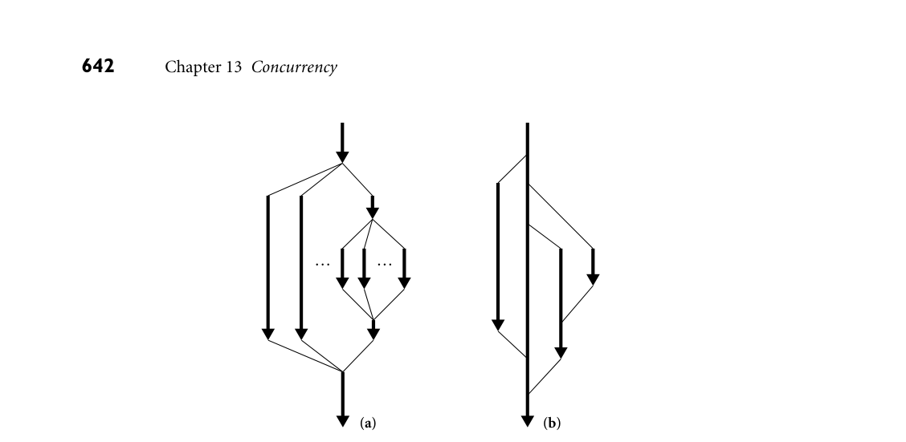
*Figure 13.5 Lifetime of concurrent threads. With co-begin, parallel loops, or launch-at- elaboration (a), threads are always properly nested. With fork/join (b), more general patterns are possible.*

When control reaches the end of procedure P, it will wait for the appropriate instance of T (the one that was created at the beginning of this instance of P) to complete before returning. This rule ensures that the local variables of P (which are visible to T under the usual static scope rules) are never deallocated before T is done with them. ■

Fork/Join

Co-begin, parallel loops, and launch-at-elaboration all lead to a concurrent EXAMPLE 13.13

Co-begin vs fork/join control-flow pattern in which thread executions are properly nested (see Fig- ure 13.5a). The fork operation is more general: it makes the creation of threads an explicit, executable operation. The companion join operation, when provided, allows a thread to wait for the completion of a previously forked thread. Because fork and join are not tied to nested constructs, they can lead to arbitrary patterns of concurrent control flow (Figure 13.5b). ■ In addition to providing launch-at-elaboration tasks, Ada allows the program- EXAMPLE 13.14

Task types in Ada mer to define task types:

task type T is ... begin ... end T;

pt : access T := new T;

The new operation is a fork: it creates a new thread and starts it executing. There is no explicit join operation in Ada, though parent and child tasks can always syn- chronize with one another explicitly if desired (e.g., immediately before the child completes its execution). As with launch-at-elaboration, control will wait auto- matically at the end of any scope in which task types are declared for all threads using the scope to terminate. ■ Any information an Ada task needs in order to do its job must be communi- cated through shared variables or through explicit messages sent after the task has started execution. Most systems, by contrast, allow parameters to be passed to a thread at start-up time. In Java one obtains a thread by constructing an object of EXAMPLE 13.15

Thread creation in Java 2 some class derived from a predefined class called Thread:

class ImageRenderer extends Thread { ... ImageRenderer( args ) { // constructor }

DESIGN & IMPLEMENTATION

13.3 Task-parallel and data-parallel computing One of the most basic decisions a programmer has to make when writing a parallel program is how to divide work among threads. One common strategy, which works well on small machines, is to use a separate thread for each of the program’s major tasks or functions, and to pipeline or otherwise overlap their execution. In a word processor, for example, one thread might be devoted to breaking paragraphs into lines, another to pagination and figure placement, another to spelling and grammar checking, and another to rendering the im- age on the screen. This strategy is often known as task parallelism. Its principal disadvantage is that it doesn’t naturally scale to very large numbers of proces- sors. For that, one generally needs data parallelism, in which more or less the same operations are applied concurrently to the elements of some very large data set. An image manipulation program, for example, may divide the screen into n small tiles, and use a separate thread to process each tile. A game may use a separate thread for every moving character or object. A programming system whose features are designed for data parallelism is sometimes referred to as a data-parallel language or library. Task parallel pro- grams are commonly based on co-begin, launch-at-elaboration, or fork/join: the code in different threads can be different. Data parallel programs are com- monly based on parallel loops: each thread executes the same code, using dif- ferent data. OpenCL and CUDA, unsurprisingly, are in the data-parallel camp: programmable GPUs are optimized for data parallel programs.

public void run() { // code to be run by the thread } } ... ImageRenderer rend = new ImageRenderer( constructor args );

Superficially, the use of new resembles the creation of dynamic tasks in Ada. In Java, however, the new thread does not begin execution when first created. To start it, the parent (or some other thread) must call the method named start, which is defined in Thread:

rend.start();

Start makes the thread runnable, arranges for it to execute its run method, and returns to the caller. The programmer must define an appropriate run method in every class derived from Thread. The run method is meant to be called only by start; programmers should not call it directly, nor should they redefine start. There is also a join method:

rend.join(); // wait for completion ■

The constructor for a Java thread typically saves its arguments in fields that are later accessed by run. In effect, the class derived from Thread functions as an object closure, as described in Section 3.6.3. Several languages, Modula-3 and C# among them, use closures more explicitly. Rather than require every thread EXAMPLE 13.16

Thread creation in C# to be derived from a common Thread class, C# allows one to be created from an arbitrary ThreadStart delegate:

class ImageRenderer { ... public ImageRenderer( args ) { // constructor } public void Foo() { // Foo is compatible with ThreadStart; // its name is not significant // code to be run by the thread } } ... ImageRenderer rendObj = new ImageRenderer( constructor args ); Thread rend = new Thread(new ThreadStart(rendObj.Foo));

If thread arguments can be gleaned from the local context, this can even be writ- ten as

Thread rend = new Thread(delegate() { // code to be run by the thread });

(Remember, C# has unlimited extent for anonymous delegates.) Either way, the new thread is started and awaited just as it is in Java:

rend.Start(); ... rend.Join(); ■

As of Java 5 (with its java.util.concurrent library), programmers are dis- EXAMPLE 13.17

Thread pools in Java 5 couraged from creating threads explicitly. Rather, tasks to be accomplished are represented by objects that support the Runnable interface, and these are passed to an Executor object. The Executor in turn farms them out to a managed pool of threads:

class ImageRenderer implements Runnable { ... // constructor and run() method same as before } ... Executor pool = Executors.newFixedThreadPool(4); ... pool.execute(new ImageRenderer( constructor args ));

Here the argument to newFixedThreadPool (one of a large number of standard Executor factories) indicates that pool should manage four threads. Each task specified in a call to pool.execute will be run by one of these threads. By sepa- rating the concepts of task and thread, Java allows the programmer (or run-time code) to choose an Executor class whose level of true concurrency and sche- duling discipline are appropriate to the underlying OS and hardware. (In this example we have used a particularly simple pool, with exactly four threads.) C# has similar thread pool facilities. Like C# threads, they are based on delegates. ■

A particularly elegant realization of fork and join appears in the Cilk pro- EXAMPLE 13.18

Spawn and sync in Cilk gramming language, developed by researchers at MIT, and subsequently devel- oped into a commercial venture acquired by Intel. To fork a logically concurrent task in Cilk, one simply prepends the keyword spawn to an ordinary function call:

spawn foo( args );

At some later time, invocation of the built-in operation sync will join with all tasks previously spawned by the calling task. The principal innovation of Cilk is the mechanism for scheduling tasks. The language implementation includes

a highly efficient thread pool mechanism that explores the task-creation graph depth first with a near-minimal number of context switches and automatic load balancing across threads. Java 7 added a similar but more restricted mechanism in the form of a ForkJoinPool for the Executor service. ■

Implicit Receipt

We have assumed in all our examples so far that newly created threads will run in the address space of the creator. In RPC systems it is often desirable to create a new thread automatically in response to an incoming request from some other address space. Rather than have an existing thread execute a receive operation, a server can bind a communication channel to a local thread body or subroutine. When a request comes in, a new thread springs into existence to handle it. In effect, the bind operation grants remote clients the ability to perform a fork within the server’s address space, though the process is often less than fully automatic. We will consider RPC in more detail in Section C 13.5.4.

Early Reply

We normally think of sequential subroutines in terms of a single thread, which EXAMPLE 13.19

Modeling subroutines with fork/join saves its current context (its program counter and registers), executes the subrou- tine, and returns to what it was doing before. The effect is the same, however, if we have two threads—one that executes the caller and another that executes the callee. In this case, the call is essentially a fork/join pair. The caller waits for the callee to terminate before continuing execution. ■ Nothing dictates, however, that the callee has to terminate in order to release the caller; all it really has to do is complete the portion of its work on which re-

DESIGN & IMPLEMENTATION

13.4 Counterintuitive implementation Over the course of 13 chapters we have seen numerous cases in which the im- plementation of a language feature may run counter to the programmer’s in- tuition. Early reply—in which thread creation is usually delayed until the reply actually occurs—is but the most recent example. Others have included expres- sion evaluation order (Section 6.1.4), subroutine in-lining (Section 9.2.4), tail recursion (Section 6.6.1), nonstack allocation of activation records (for un- limited extent—Section 3.6.2), out-of-order or even noncontiguous layout of record fields (Section 8.1.2), variable lookup in a central reference table (Sec- tion C 3.4.2), immutable objects under a reference model of variables (Sec- tion 6.1.2), and implementations of generics (Section 7.3.1) that share code among instances with different type parameters. A compiler may, particularly at higher levels of code improvement, produce code that differs dramatically from the form and organization of its input. Unless otherwise constrained by the language definition, an implementation is free to choose any translation that is provably equivalent to the input.

sult parameters depend. Drawing inspiration from the detach operation used to launch coroutines in Simula (Example 9.47), a few languages (SR and Her- mes [SBG+91] among them) allow a callee to execute a reply operation that re- turns results to the caller without terminating. After an early reply, the two threads continue concurrently. Semantically, the portion of the callee prior to the reply plays much the same role as the constructor of a Java or C# thread; the portion after the reply plays the role of the run method. The usual implementation is also similar, and may run counter to the programmer’s intuition: since early reply is optional, and can appear in any subroutine, we can use the caller’s thread to execute the initial por- tion of the callee, and create a new thread only when—and if—the callee replies instead of returning.

13.2.4 Implementation of Threads

As we noted near the beginning of Section 13.2, the threads of a concurrent pro- gram are usually implemented on top of one or more processes provided by the operating system. At one extreme, we could use a separate OS process for ev- ery thread; at the other extreme we could multiplex all of a program’s threads on top of a single process. On a supercomputer with a separate core for every concurrent activity, or in a language in which threads are relatively heavyweight abstractions (long-lived, and created by the dozens rather than the thousands), the one-process-per-thread extreme is often acceptable. In a simple language on a uniprocessor, the all-threads-on-one-process extreme may be acceptable. Many EXAMPLE 13.20

Multiplexing threads on processes language implementations adopt an intermediate approach, with a potentially very large number of threads running on top of some smaller but nontrivial num- ber of processes (see Figure 13.6). ■ The problem with putting every thread on a separate process is that processes (even “lightweight” ones) are simply too expensive in many operating systems. Because they are implemented in the kernel, performing any operation on them requires a system call. Because they are general purpose, they provide features that most languages do not need, but have to pay for anyway. (Examples include separate address spaces, priorities, accounting information, and signal and I/O interfaces, all of which are beyond the scope of this book.) At the other extreme, there are two problems with putting all threads on top of a single process: first, it precludes parallel execution on a multicore or multiprocessor machine; second, if the currently running thread makes a system call that blocks (e.g., waiting for I/O), then none of the program’s other threads can run, because the single process is suspended by the OS. In the common two-level organization of concurrency (user-level threads on top of kernel-level processes), similar code appears at both levels of the system: the language run-time system implements threads on top of one or more pro- cesses in much the same way that the operating system implements processes on

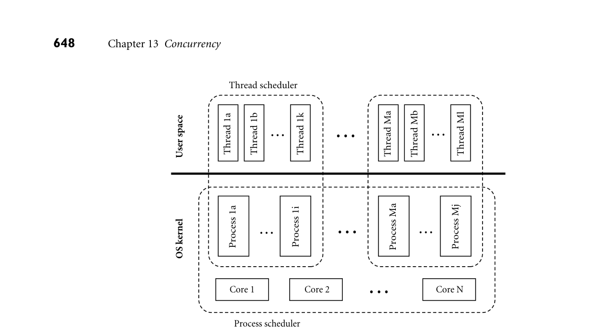
*Figure 13.6 Two-level implementation of threads. A thread scheduler, implemented in a library or language run-time package, multiplexes threads on top of one or more kernel-level processes, just as the process scheduler, implemented in the operating system kernel, multiplexes processes on top of one or more physical cores.*

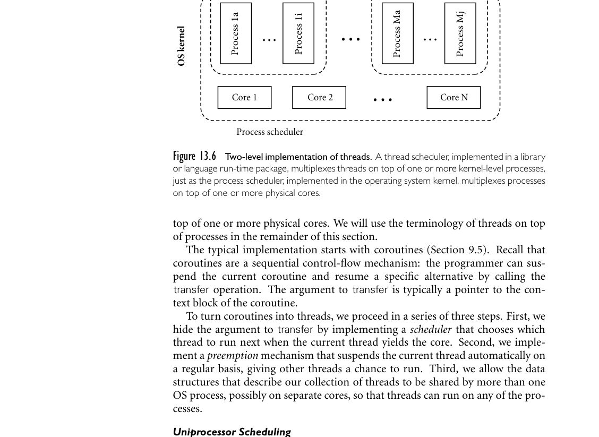
*Figure 13.7 illustrates the data structures employed by a simple scheduler. At any EXAMPLE 13.21*

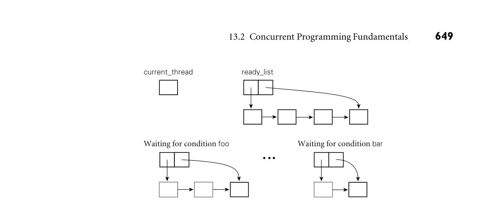
*Figure 13.7 Data structures of a simple scheduler. A designated current thread is running. Threads on the ready list are runnable. Other threads are blocked, waiting for various conditions to become true. If threads run on top of more than one OS-level process, each such process will have its own current thread variable. If a thread makes a call into the operating system, its process may block in the kernel.*

its chance to do so. Context blocks for threads that are runnable but not currently running reside on a queue called the ready list. Context blocks for threads that are blocked for scheduler-based synchronization reside in data structures (usually queues) associated with the conditions for which they are waiting. To yield the core to another thread, a running thread calls the scheduler:

procedure reschedule() t : thread := dequeue(ready list) transfer(t)

Before calling into the scheduler, a thread that wants to run again at some point in the future must place its own context block in some appropriate data structure. If it is blocking for the sake of fairness—to give some other thread a chance to run—then it enqueues its context block on the ready list:

procedure yield() enqueue(ready list, current thread) reschedule()

To block for synchronization, a thread adds itself to a queue associated with the awaited condition:

procedure sleep on(ref Q : queue of thread) enqueue(Q, current thread) reschedule()

When a running thread performs an operation that makes a condition true, it removes one or more threads from the associated queue and enqueues them on the ready list. ■

Fairness becomes an issue whenever a thread may run for a significant amount of time while other threads are runnable. To give the illusion of concurrent activ- ity, even on a uniprocessor, we need to make sure that each thread gets a frequent “slice” of the processor. With cooperative multithreading, any long-running thread must yield its core explicitly from time to time (e.g., at the tops of loops), to al- low other threads to run. As noted in Section 13.1.1, this approach allows one improperly written thread to monopolize the system. Even with properly written threads, it leads to less than perfect fairness due to nonuniform times between yields in different threads.

Preemption

Ideally, we should like to multiplex each core fairly and at a relatively fine grain (i.e., many times per second) without requiring that threads call yield explicitly. On many systems we can do this in the language implementation by using timer signals for preemptive multithreading. When switching between threads we ask the operating system (which has access to the hardware clock) to deliver a signal to the currently running process at a specified time in the future. The OS delivers the signal by saving the context (registers and pc) of the process and transferring control to a previously specified handler routine in the language run-time system, as described in Section 9.6.1. When called, the handler modifies the state of the currently running thread to make it appear that the thread had just executed a call to the standard yield routine, and was about to execute its prologue. The handler then “returns” into yield, which transfers control to some other thread, as if the one that had been running had relinquished control of the process voluntarily. Unfortunately, the fact that a signal may arrive at an arbitrary time introduces a race between voluntary calls to the scheduler and the automatic calls triggered by preemption. To illustrate the problem, suppose that a signal arrives when the EXAMPLE 13.22

A race condition in preemptive multithreading currently running process has just enqueued the currently running thread onto the ready list in yield, and is about to call reschedule. When the signal handler “returns” into yield, the process will put the current thread into the ready list a second time. If at some point in the future the thread blocks for synchronization, its second entry in the ready list may cause it to run again immediately, when it should be waiting. Even worse problems can arise if a signal occurs in the middle of an enqueue, at a moment when the ready list is not even a properly structured queue. To resolve the race and avoid corruption of the ready list, thread packages commonly disable signal delivery during scheduler calls:

procedure yield() disable signals() enqueue(ready list, current thread) reschedule() reenable signals()

For this convention to work, every fragment of code that calls reschedule must disable signals prior to the call, and must reenable them afterward. (Recall that a similar mechanism served to protect data shared between the main program and

event handlers in Section 9.6.1.) In this case, because reschedule contains a call to transfer, signals may be disabled in one thread and reenabled in another. ■ It turns out that the sleep on routine must also assume that signals are dis- EXAMPLE 13.23

Disabling signals during context switch abled and enabled by the caller. To see why, suppose that a thread checks a condi- tion, finds that it is false, and then calls sleep on to suspend itself on a queue asso- ciated with the condition. Suppose further that a timer signal occurs immediately after checking the condition, but before the call to sleep on. Finally, suppose that the thread that is allowed to run after the signal makes the condition true. Since the first thread never got a chance to put itself on the condition queue, the second thread will not find it to make it runnable. When the first thread runs again, it will immediately suspend itself, and may never be awakened. To close this tim- ing window—this interval in which a concurrent event may compromise program correctness—the caller must ensure that signals are disabled before checking the condition:

disable signals() if not desired condition sleep on(condition queue) reenable signals

On a uniprocessor, disabling signals allows the check and the sleep to occur as a single, atomic operation. ■

Multiprocessor Scheduling

We can extend our preemptive thread package to run on top of more than one OS-provided process by arranging for the processes to share the ready list and re- lated data structures (condition queues, etc.; note that each process must have a separate current thread variable). If the processes run on different physical cores, then more than one thread will be able to run at once. If the processes share a single core, then the program will be able to make forward progress even when all but one of the processes are blocked in the operating system. Any thread that is runnable is placed in the ready list, where it becomes a candidate for execu- tion by any of the application’s processes. When a process calls reschedule, the queue-based ready list we have been using in our examples will give it the longest- waiting thread. The ready list of a more elaborate scheduler might give priority to interactive or time-critical threads, or to threads that last ran on the current core, and may therefore still have data in the cache. Just as preemption introduced a race between voluntary and automatic calls to scheduler operations, true or quasiparallelism introduces races between calls in separate OS processes. To resolve the races, we must implement additional synchronization to make scheduler operations in separate processes atomic. We will return to this subject in Section 13.3.4.

3CHECK YOUR UNDERSTANDING 11. Explain the differences among coroutines, threads, lightweight processes, and heavyweight processes.

12. What is quasiparallelism? 13. Describe the bag of tasks programming model.

14. What is busy-waiting? What is its principal alternative? 15. Name four explicitly concurrent programming languages.

16. Why don’t message-passing programs require explicit synchronization mech- anisms?

17. What are the tradeoffs between language-based and library-based implemen- tations of concurrency?

18. Explain the difference between data parallelism and task parallelism. 19. Describe six different mechanisms commonly used to create new threads of control in a concurrent program. 20. In what sense is fork/join more powerful than co-begin?

21. What is a thread pool in Java? What purpose does it serve? 22. What is meant by a two-level thread implementation? 23. What is a ready list?

24. Describe the progressive implementation of scheduling, preemption, and (true) parallelism on top of coroutines.

13.3 Implementing Synchronization

As noted in Section 13.2.1, synchronization is the principal semantic challenge for shared-memory concurrent programs. Typically, synchronization serves either to make some operation atomic or to delay that operation until some necessary pre- condition holds. As noted in Section 13.1, atomicity is most commonly achieved with mutual exclusion locks. Mutual exclusion ensures that only one thread is ex- ecuting some critical section of code at a given point in time. Critical sections typically transform a shared data structure from one consistent state to another. Condition synchronization allows a thread to wait for a precondition, often ex- pressed as a predicate on the value(s) in one or more shared variables. It is tempt- ing to think of mutual exclusion as a form of condition synchronization (don’t proceed until no other thread is in its critical section), but this sort of condition would require consensus among all extant threads, something that condition syn- chronization doesn’t generally provide.

Our implementation of parallel threads, sketched at the end of Section 13.2.4, requires both atomicity and condition synchronization. Atomicity of operations on the ready list and related data structures ensures that they always satisfy a set of logical invariants: the lists are well formed, each thread is either running or resides in exactly one list, and so forth. Condition synchronization appears in the requirement that a process in need of a thread to run must wait until the ready list is nonempty. It is worth emphasizing that we do not in general want to overly synchronize programs. To do so would eliminate opportunities for parallelism, which we gen- erally want to maximize in the interest of performance. Moreover not all races are bad. If two processes are racing to dequeue the last thread from the ready list, we don’t generally care which succeeds and which waits for another thread. We do care that the implementation of dequeue does not have internal, instruction-level races that might compromise the ready list’s integrity. In general, our goal is to provide only as much synchronization as is necessary to eliminate “bad” races— those that might otherwise cause the program to produce incorrect results. In the first subsection below we consider busy-wait synchronization. In the second we present an alternative, called nonblocking synchronization, in which atomicity is achieved without the need for mutual exclusion. In the third sub- section we return to the subject of memory consistency (originally mentioned in Section 13.1.2), and discuss its implications for the semantics and implementa- tion of language-level synchronization mechanisms. Finally, in Sections 13.3.4 and 13.3.5, we use busy-waiting among processes to implement a parallelism-safe thread scheduler, and then use this scheduler in turn to implement the most basic scheduler-based synchronization mechanism: namely, semaphores.

13.3.1 Busy-Wait Synchronization

Busy-wait condition synchronization is easy if we can cast a condition in the form of “location X contains value Y”: a thread that needs to wait for the condition can simply read X in a loop, waiting for Y to appear. To wait for a condition involving more than one location, one needs atomicity to read the locations together, but given that, the implementation is again a simple loop. Other forms of busy-wait synchronization are somewhat trickier. In the re- mainder of this section we consider spin locks, which provide mutual exclusion, and barriers, which ensure that no thread continues past a given point in a pro- gram until all threads have reached that point.

Spin Locks

Dekker is generally credited with finding the first two-thread mutual exclu- sion algorithm that requires no atomic instructions other than load and store. Dijkstra [Dij65] published a version that works for n threads in 1965. Peterson [Pet81] published a much simpler two-thread algorithm in 1981. Building on

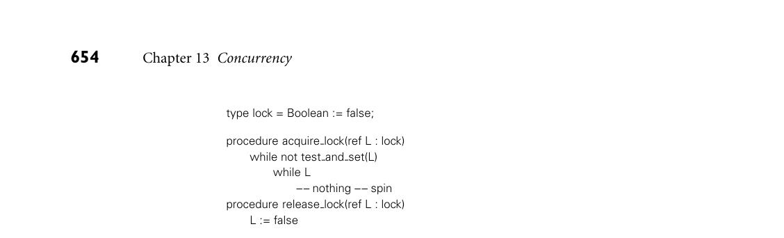
*Figure 13.8 A simple test-and-test_and_set lock. Waiting processes spin with ordinary read (load) instructions until the lock appears to be free, then use test_and_set to acquire it. The very first access is a test_and_set, for speed in the common (no competition) case.*

Peterson’s algorithm, one can construct a hierarchical n-thread lock, but it re- quires O(n log n) space and O(log n) time to get one thread into its critical sec- tion [YA93]. Lamport [Lam87]2 published an n-thread algorithm in 1987 that takes O(n) space and O(1) time in the absence of competition for the lock. Un- fortunately, it requires O(n) time when multiple threads attempt to enter their critical section at once. While all of these algorithms are historically important, a practical spin lock needs to run in constant time and space, and for this one needs an atomic in- struction that does more than load or store. Beginning in the 1960s, hardware designers began to equip their processors with instructions that read, modify, and write a memory location as a single atomic operation. The simplest such instruc- EXAMPLE 13.24

The basic test and set lock tion is known as test_and_set. It sets a Boolean variable to true and returns an indication of whether the variable was previously false. Given test_and_set, acquiring a spin lock is almost trivial:

while not test and set(L) –– nothing –– spin ■

In practice, embedding test_and_set in a loop tends to result in unaccept- able amounts of communication on a multicore or multiprocessor machine, as the cache coherence mechanism attempts to reconcile writes by multiple cores at- tempting to acquire the lock. This overdemand for hardware resources is known as contention, and is a major obstacle to good performance on large machines. To reduce contention, the writers of synchronization libraries often employ a EXAMPLE 13.25

Test-and-test and set test-and-test_and_set lock, which spins with ordinary reads (satisfied by the cache) until it appears that the lock is free (see Figure 13.8). When a thread re- leases a lock there still tends to be a flurry of bus or interconnect activity as waiting

2 Leslie Lamport (1941–) has made a variety of seminal contributions to the theory of parallel and distributed computing, including synchronization algorithms, the notion of “happens-before” causality, Byzantine agreement, the Paxos consensus algorithm, and the temporal logic of actions. He also created the LATEX macro package, with which this book was typeset. He received the ACM Turing Award in 2013.

threads perform their test_and_sets, but at least this activity happens only at the boundaries of critical sections. On a large machine, contention can be further reduced by implementing a backoff strategy, in which a thread that is unsuccessful in attempting to acquire a lock waits for a while before trying again. ■ Many processors provide atomic instructions more powerful than test_and_ set. Some can swap the contents of a register and a memory location atomically. Some can add a constant to a memory location atomically, returning the previous value. Several processors, including the x86, the IA-64, and the SPARC, provide a particularly useful instruction called compare_and_swap (CAS). This instruc- tion takes three arguments: a location, an expected value, and a new value. It checks to see whether the expected value appears in the specified location, and if so replaces it with the new value, atomically. In either case, it returns an in- dication of whether the change was made. Using instructions like atomic_add or compare_and_swap, one can build spin locks that are fair, in the sense that threads are guaranteed to acquire the lock in the order in which they first attempt to do so. One can also build locks that work well—with no contention, even at release time—on arbitrarily large machines [MCS91, Sco13]. These topics are be- yond the scope of the current text. (It is perhaps worth mentioning that fairness is a two-edged sword: while it may be desirable from a semantic point of view, it tends to undermine cache locality, and interacts very badly with preemption.) An important variant on mutual exclusion is the reader–writer lock [CHP71]. Reader–writer locks recognize that if several threads wish to read the same data structure, they can do so simultaneously without mutual interference. It is only when a thread wants to write the data structure that we need to prevent other threads from reading or writing simultaneously. Most busy-wait mutual ex- clusion locks can be extended to allow concurrent access by readers (see Exer- cise 13.8).

Barriers

Data-parallel algorithms are often structured as a series of high-level steps, or phases, typically expressed as iterations of some outermost loop. Correctness of- ten depends on making sure that every thread completes the previous step before any moves on to the next. A barrier serves to provide this synchronization. As a concrete example, finite element analysis models a physical object—a EXAMPLE 13.26

Barriers in finite element analysis bridge, let us say—as an enormous collection of tiny fragments. Each fragment of the bridge imparts forces to the fragments adjacent to it. Gravity exerts a down- ward force on all fragments. Abutments exert an upward force on the fragments that make up base plates. The wind exerts forces on surface fragments. To eval- uate stress on the bridge as a whole (e.g., to assess its stability and resistance to failures), a finite element program might divide the fragments among a large col- lection of threads (probably one per core). Beginning with the external forces, the program would then proceed through a sequence of iterations. In each it- eration, each thread would recompute the forces on its fragments based on the forces found in the previous iteration. Between iterations, the threads would

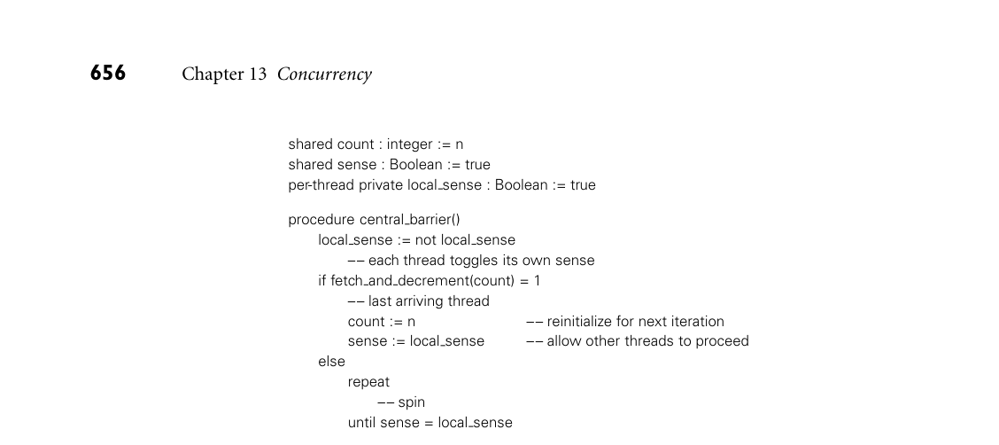
*Figure 13.9 A simple “sense-reversing” barrier. Each thread has its own copy of local sense. Threads share a single copy of count and sense.*

synchronize with a barrier. The program would halt when no thread found a significant change in any forces during the last iteration. ■ The simplest way to implement a busy-wait barrier is to use a globally shared EXAMPLE 13.27

The “sense-reversing” barrier counter, modified by an atomic fetch_and_decrement instruction. The counter begins at n, the number of threads in the program. As each thread reaches the barrier it decrements the counter. If it is not the last to arrive, the thread then spins on a Boolean flag. The final thread (the one that changes the counter from 1 to 0) flips the Boolean flag, allowing the other threads to proceed. To make it easy to reuse the barrier data structures in successive iterations (known as barrier episodes), threads wait for alternating values of the flag each time through. Code for this simple barrier appears in Figure 13.9. ■ Like a simple spin lock, the “sense-reversing” barrier can lead to unacceptable levels of contention on large machines. Moreover the serialization of access to the counter implies that the time to achieve an n-thread barrier is O(n). It is possible to do better, but even the fastest software barriers require O(log n) time to synchronize n threads [MCS91]. Large multiprocessors sometimes provide special hardware to reduce this bound to close to constant time. The Java 7 Phaser class provides unusually flexible barrier support. The set of EXAMPLE 13.28

Java 7 phasers participating threads can change from one phaser episode to another. When the number is large, the phaser can be tiered to run in logarithmic time. Moreover, arrival and departure can be specified as separate operations: in between, a thread can do work that (a) does not require that all other threads have arrived, and (b) does not have to be completed before any other threads depart. ■

13.3.2 Nonblocking Algorithms

When a lock is acquired at the beginning of a critical section, and released at the end, no other thread can execute a similarly protected piece of code at the same time. As long as every thread follows the same conventions, code within the critical section is atomic—it appears to happen all at once. But this is not the only possible way to achieve atomicity. Suppose we wish to make an arbitrary update EXAMPLE 13.29

Atomic update with CAS to a shared location:

x := foo(x);

Note that this update involves at least two accesses to x: one to read the old value and one to write the new. We could protect the sequence with a lock:

acquire(L) r1 := x r2 := foo(r1) –– probably a multi-instruction sequence x := r2 release(L)

But we can also do this without a lock, using compare_and_swap:

start: r1 := x r2 := foo(r1) –– probably a multi-instruction sequence r2 := CAS(x, r1, r2) –– replace x if it hasn’t changed if !r2 goto start

If several cores execute this code simultaneously, one of them is guaranteed to suc- ceed the first time around the loop. The others will fail and try again. This exam- ple illustrates that CAS is a universal primitive for single-location atomic update. A similar primitive, known as load_linked/store_conditional, is available on ARM, MIPS, and Power processors; we consider it in Exercise 13.7. ■ In our discussions thus far, we have used a definition of “blocking” that comes from operating systems: a thread that blocks gives up the core instead of actively spinning. An alternative definition comes from the theory of concurrent algo- rithms. Here the choice between spinning and giving up the core is immaterial: a thread is said to be “blocked” if it cannot make forward progress without action by other threads. Conversely, an operation is said to be nonblocking if in every reachable state of the system, any thread executing that operation is guaranteed to complete in a finite number of steps if it gets to run by itself (without further interference by other threads). In this theoretical sense of the word, locks are inherently blocking, regardless of implementation: if one thread holds a lock, no other thread that needs that lock can proceed. By contrast, the CAS-based code of Example 13.29 is nonblocking: if the CAS operation fails, it is because some other thread has made progress.

Moreover if all threads but one stop running (e.g., because of preemption), the remaining thread is guaranteed to make progress. We can generalize from Example 13.29 to design a variety of special-purpose concurrent data structures that operate without locks. Modifications to these structures often (though not always) follow the pattern

repeat prepare CAS –– (or some other atomic operation) until success clean up

If it reads more than one location, the “prepare” part of the algorithm may need to double-check to make sure that none of the values has changed (i.e., that all were read consistently) before moving on to the CAS. A read-only operation may simply return once this double-checking is successful. In the CAS-based update of Example 13.29, the “prepare” part of the algorithm reads the old value of x and figures out what the new value ought to be; the “clean up” part is empty. In other algorithms there may be significant cleanup. In all cases, the keys to correctness are that (1) the “prepare” part is harmless if we need to repeat; (2) the CAS, if successful, logically completes the operation in a way that is visible to all other threads; and (3) the “clean up,” if needed, can be performed by any thread if the original thread is delayed. Performing cleanup for another thread’s operation is often referred to as helping. Figure 13.10 illustrates a widely used nonblocking concurrent queue. The EXAMPLE 13.30

The M&S queue dequeue operation does not require cleanup, but the enqueue operation does. To add an element to the end of the queue, a thread reads the current tail pointer to find the last node in the queue, and uses a CAS to change the next pointer of that node to point to the new node instead of being null. If the CAS succeeds (no other thread has already updated the relevant next pointer), then the new node has been inserted. As cleanup, the tail pointer must be updated to point to the new node, but any thread can do this—and will, if it discovers that tail–>next is not null. ■ Nonblocking algorithms have several advantages over blocking algorithms. They are inherently tolerant of page faults and preemption: if a thread stops run- ning partway through an operation, it never prevents other threads from making progress. Nonblocking algorithms can also safely be used in signal (event) and interrupt handlers, avoiding problems like the one described in Example 13.22. For several important data structures and algorithms, including stacks, queues, sorted lists, priority queues, hash tables, and memory management, nonblocking algorithms can also be faster than locks. Unfortunately, these algorithms tend to be exceptionally subtle and difficult to devise. They are used primarily in the im- plementation of language-level concurrency mechanisms and in standard library packages.

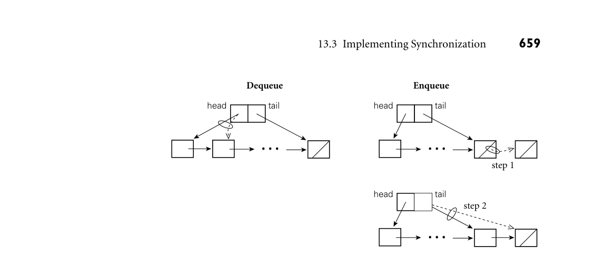
*Figure 13.10 Operations on a nonblocking concurrent queue. In the dequeue operation (left), a single CAS swings the head pointer to the next node in the queue. In the enqueue operation (right), a first CAS changes the next pointer of the tail node to point at the new node, at which point the operation is said to have logically completed. A subsequent “cleanup” CAS, which can be performed by any thread, swings the tail pointer to point at the new node as well.*

13.3.3 Memory Consistency

In all our discussions so far, we have depended, implicitly, on hardware memory coherence. Unfortunately, coherence alone is not enough to make a multipro- cessor or even a single multicore processor behave as most programmers would expect. We must also worry, when more than one location is written at about the same time, about the order in which the writes become visible to different cores. Intuitively, most programmers expect shared memory to be sequentially con- sistent—to make all writes visible to all cores in the same order, and to make any given core’s writes visible in the order they were performed. Unfortunately, this behavior turns out to be very hard to implement efficiently—hard enough that most hardware designers simply don’t provide it. Instead, they provide one of sev- eral relaxed memory models, in which certain loads and stores may appear to occur “out of order.” Relaxed consistency has important ramifications for language de- signers, compiler writers, and the implementors of synchronization mechanisms and nonblocking algorithms.

The Cost of Ordering

The fundamental problem with sequential consistency is that straightforward im- plementations require both hardware and compilers to serialize operations that we would rather be able to perform in arbitrary order. Consider, for example, the implementation of an ordinary store instruction. EXAMPLE 13.31

Write buffers and consistency In the event of a cache miss, this instruction can take hundreds of cycles to com- plete. Rather than wait, most processors are designed to continue executing

subsequent instructions while the store completes “in the background.” Stores that are not yet visible in even the L1 cache (or that occurred after a store that is not yet visible) are kept in a queue called the write buffer. Loads are checked against the entries in this buffer, so a core always sees its own previous stores, and sequential programs execute correctly. But consider a concurrent program in which thread A sets a flag (call it inspected) to true and then reads location X. At roughly the same time, thread B updates X from 0 to 1 and then reads the flag. If B’s read reveals that inspected has not yet been set, the programmer might naturally assume that A is going to read new value (1) for X: after all, B updates X before checking the flag, and A sets the flag before reading X, so A cannot have read X already. On most machines, however, A can read X while its write of inspected is still in its write buffer. Like- wise, B can read inspected while its write of X is still in its write buffer. The result can be very unintuitive behavior:

Initially:  inspected = false;  X = 0

Core A:

Core B:

inspected := true

X := 1

xa := X

ib := inspected

A’s write of inspected precedes its read of X in program order. B’s write of X precedes its read of inspected in program order. B’s read of inspected appears to precede A’s write of inspected, because it sees the unset value. And yet A’s read of X appears to precede B’s write of X as well, leaving us with xA = 0 and ib = false. This sort of “temporal loop” may also be caused by standard compiler opti- mizations. Traditionally, a compiler is free to reorder instructions (in the ab- sence of a data dependence) to improve the expected performance of the proces- sor pipelines. In this example, a compiler that generates code for either A or B (without considering the other) may choose to reverse the order of operations on inspected and X, producing an apparent temporal loop even in the absence of hardware reordering. ■

Forcing Order with Fences and Synchronization Instructions

To avoid temporal loops, implementors of concurrent languages and libraries must generally use special synchronization or memory fence instructions. At some expense, these force orderings not normally guaranteed by the hardware.3 Their presence also inhibits instruction reordering in the compiler. In Example 13.31, both A and B must prevent their read from bypassing (com- pleting before) the logically earlier write. Typically this can be accomplished by

3 Fences are also sometimes known as memory barriers. They are unrelated to the garbage col- lection barriers of Section 8.5.3 (“Tracing Collection”), the synchronization barriers of Sec- tion 13.3.1, or the RTL barriers of Section C 15.2.1.

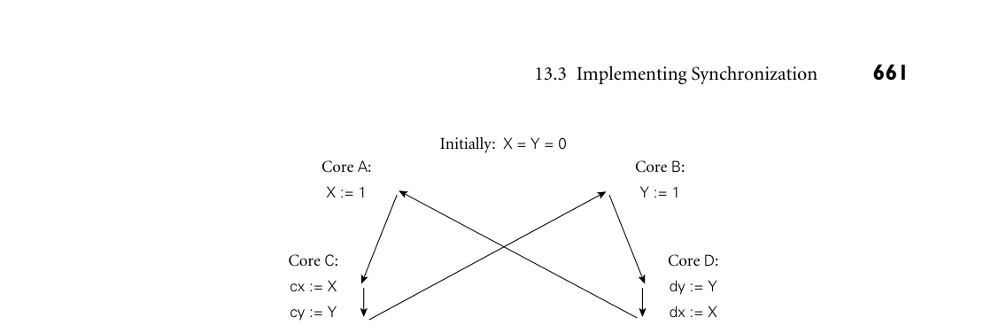
*Figure 13.11 Concurrent propagation of writes. On some machines, it is possible for concur- rent writes to reach cores in different orders. Arrows show apparent temporal ordering. Here C may read cy = 0 and cx = 1, while D reads dx = 0 and dy = 1.*

identifying either the read or the write as a synchronization instruction (e.g., by implementing it with an XCHG instruction on the x86) or by inserting a fence between them (e.g., membar StoreLoad on the SPARC). Sometimes, as in Example 13.31, the use of synchronization or fence instruc- tions is enough to restore intuitive behavior. Other cases, however, require more significant changes to the program. An example appears in Figure 13.11. Cores EXAMPLE 13.32

Distributed consistency A and B write locations X and Y, respectively. Both locations are read by cores C and D. If C is physically close to A in a distributed memory machine, and D is close to B, and if coherence messages propagate concurrently, we must con- sider the possibility that C and D will see the writes in opposite orders, leading to another temporal loop. On machines where this problem arises, fences and synchronization instruc- tions may not suffice to solve the problem. The language or library implementor (or even the application programmer) may need to bracket the writes of X and Y with (fenced) writes to some common location, to ensure that one of the origi- nal writes completes before the other starts. The most straightforward way to do this is to enclose the writes in a lock-based critical section. Even then, additional measures may be needed to ensure that the reads of X and Y are not executed out of order by either C or D. ■

Simplifying Language-Level Reasoning

For programs running on a single core, regardless of the complexity of the un- derlying pipeline and memory hierarchy, every manufacturer guarantees that in- structions will appear to occur in program order: no instruction will fail to see the effects of some prior instruction, nor will it see the effects of any subsequent instruction. For programs running on a muilticore or multiprocessor machine, manufacturers also guarantee, under certain circumstances, that instructions ex- ecuted on one core will be seen, in order, by instructions on other cores. Unfor- tunately, these circumstances vary from one machine to another. Some imple- mentations of the MIPS and PA-RISC processors were sequentially consistent, as are IBM’s z-Series mainframe machines: if a load on core B sees a value written

by a store on core A, then, transitively, everything before the store on A is guar- anteed to have happened before everything after the load on B. Other processors and implementations are more relaxed. In particular, most machines admit the loop of Example 13.31. The SPARC and x86 preclude the loop of Example 13.32 (Figure 13.11), but the Power, ARM, and Itanium all allow it. Given this variation across machines, what is a language designer to do? The answer, first suggested by Sarita Adve and now embedded in Java, C++, and (less formally) other languages, is to define a memory model that captures the notion of a “properly synchronized” program, and then provide the illusion of sequen- tial consistency for all such programs. In effect, the memory model constitutes a contract between the programmer and the language implementation: if the pro- grammer follows the rules of the contract, the implementation will hide all the ordering eccentricities of the underlying hardware. In the usual formulation, memory models distinguish between “ordinary” variable accesses and special synchronization accesses; the latter include not only lock acquire and release, but also reads and writes of any variable declared with a special synchronization keyword (volatile in Java or C#, atomic in C++). Ordering of operations across cores is based solely on synchronization accesses. We say that operation A happens before operation C (A ≺HB C) if (1) A comes before C in program order in a single thread; (2) A and C are synchronization operations and the language definition says that A comes before C; or (3) there exists an operation B such that A ≺HB B and B ≺HB C. Two ordinary accesses are said to conflict if they occur in different threads, they refer to the same location, and at least one of them is a write. They are said to con- stitute a data race if they conflict and they are not ordered—the implementation might allow either one to happen first, and program behavior might change as a result. Given these definitions, the memory model contract is straightforward: executions of data-race–free programs are always sequentially consistent. In most cases, an acquire of a mutual exclusion lock is ordered after the most recent prior release. A read of a volatile (atomic) variable is ordered after the write that stored the value that was read. Various other operations (e.g., the transactions we will study in Section 13.4.4) may also contribute to cross-thread ordering. A simple example of ordering appears in Figure 13.12, where thread A sets EXAMPLE 13.33

Using volatile to avoid a data race variable initialized to indicate that it is safe for thread B to use reference p. If initialized had not been declared as volatile, there would be no cross-thread or- dering between A’s write of true and B’s loop-terminating read. Access to both initialized and p would then be data races. Under the hood, the compiler would have been free to move the write of true before the initialization of p (remem- ber, threads are often separately compiled, and the compiler has no obvious way to tell that the writes to p and initialized have anything to do with one another). Similarly, on a machine with a relaxed hardware memory model, the processor and memory system would have been free to perform the writes in either order, regardless of the order specified by the compiler in machine code. On B’s core, it would also have been possible for either the compiler or the hardware to read p

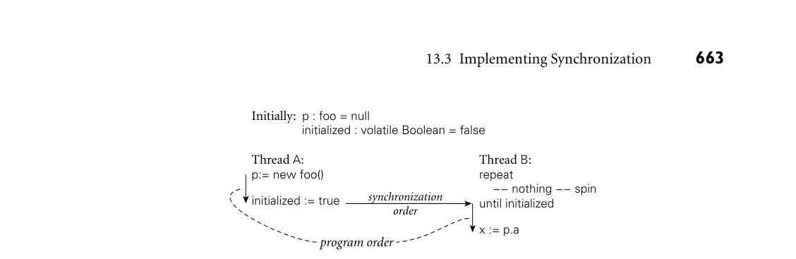
*Figure 13.12 Protecting initialization with a volatile flag. Here labeling initialized as volatile avoids a data race, and ensures that B will not access p until it is safe to do so.*

before confirming that initialized was true. The volatile declaration precludes all these undesirable possibilities. Returning to Example 13.31, we might avoid a temporal loop by declaring both X and inspected as volatile, or by enclosing accesses to them in atomic oper- ations, bracketed by lock acquire and release. In Example 13.32, volatile dec- larations on X and Y will again suffice to ensure sequential consistency, but the cost may be somewhat higher: on some machines, the compiler may need to use extra locks or special instructions to force a total order among writes to disjoint locations. ■ Synchronization races are common in multithreaded programs. Whether they are bugs or expected behavior depends on the application. Data races, on the other hand, are almost always program bugs. They are so hard to reason about— and so rarely useful—that the C++ memory model outlaws them altogether: given a program with a data race, a C++ implementation is permitted to display any behavior whatsoever. Ada has similar rules. For Java, by contrast, an empha- sis on embedded applications motivated the language designers to constrain the behavior of racy programs in ways that would preserve the integrity of the under- lying virtual machine. A Java program that contains a data race must continue to follow all the normal language rules, and any read that is not ordered with respect to a unique preceding write must return a value that might have been written by some previous write to the same location, or by a write that is unordered with respect to the read. We will return to the Java Memory Model in Section 13.4.3, after we have discussed the language’s synchronization mechanisms.

13.3.4 Scheduler Implementation

To implement user-level threads, OS-level processes must synchronize access to the ready list and condition queues, generally by means of spinning. Code for EXAMPLE 13.34

Scheduling threads on processes a simple reentrant thread scheduler (one that can be “reentered” safely by a sec- ond process before the first one has returned) appears in Figure 13.13. As in the code in Section 13.2.4, we disable timer signals before entering scheduler code, to

*Figure 13.13 Pseudocode for part of a simple reentrant (parallelism-safe) scheduler. Every process has its own copy of current thread. There is a single shared scheduler lock and a single ready list. If processes have dedicated cores, then the low level lock can be an ordinary spin lock; otherwise it can be a “spin-then-yield” lock (Figure 13.14). The loop inside reschedule busy-waits until the ready list is nonempty. The code for sleep on cannot disable timer signals and acquire the scheduler lock itself, because the caller needs to test a condition and then block as a single atomic operation.*

protect the ready list and condition queues from concurrent access by a process and its own signal handler. ■ Our code assumes a single “low-level” lock (scheduler lock) that protects the entire scheduler. Before saving its context block on a queue (e.g., in yield or EXAMPLE 13.35

A race condition in thread scheduling sleep on), a thread must acquire the scheduler lock. It must then release the lock after returning from reschedule. Of course, because reschedule calls transfer, the lock will usually be acquired by one thread (the same one that disables timer

signals) and released by another (the same one that reenables timer signals). The code for yield can implement synchronization itself, because its work is self- contained. The code for sleep on, on the other hand, cannot, because a thread must generally check a condition and block if necessary as a single atomic opera- tion:

disable signals() acquire lock(scheduler lock) if not desired condition sleep on(condition queue) release lock(scheduler lock) reenable signals()

If the signal and lock operations were moved inside of sleep on, the following race could arise: thread A checks the condition and finds it to be false; thread B makes the condition true, but finds the condition queue to be empty; thread A sleeps on the condition queue forever. ■ A spin lock will suffice for the “low-level” lock that protects the ready list and condition queues, so long as every process runs on a different core. As we noted in Section 13.2.1, however, it makes little sense to spin for a condition that can only be made true by some other process using the core on which we are spinning. If we know that we’re running on a uniprocessor, then we don’t need a lock on the scheduler (just the disabled signals). If we might be running on a uniprocessor, EXAMPLE 13.36

A “spin-then-yield” lock however, or on a multiprocessor with fewer cores than processes, then we must be prepared to give up the core if unable to obtain a lock. The easiest way to do this is with a “spin-then-yield” lock, first suggested by Ousterhout [Ous82]. A simple example of such a lock appears in Figure 13.14. On a multiprogrammed machine, it might also be desirable to relinquish the core inside reschedule when the ready list is empty: though no other process of the current application will be able to do anything, overall system throughput may improve if we allow the operating system to give the core to a process from another application. ■ On a large multiprocessor we might increase concurrency by employing a sep- arate lock for each condition queue, and another for the ready list. We would have to be careful, however, to make sure it wasn’t possible for one process to put a thread into a condition queue (or the ready list) and for another process to at- tempt to transfer into that thread before the first process had finished transferring out of it (see Exercise 13.13).

Scheduler-Based Synchronization

The problem with busy-wait synchronization is that it consumes processor cycles—cycles that are therefore unavailable for other computation. Busy-wait synchronization makes sense only if (1) one has nothing better to do with the current core, or (2) the expected wait time is less than the time that would be required to switch contexts to some other thread and then switch back again. To ensure acceptable performance on a wide variety of systems, most concurrent

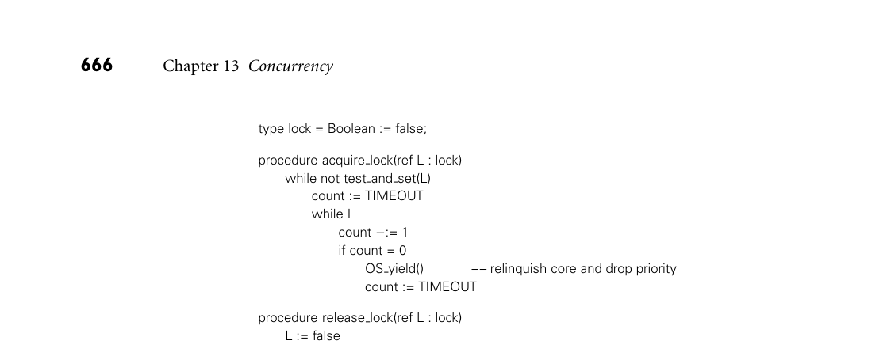
*Figure 13.14 A simple spin-then-yield lock, designed for execution on a multiprocessor that may be multiprogrammed (i.e., on which OS-level processes may be preempted). If unable to acquire the lock in a fixed, short amount of time, a process calls the OS scheduler to yield its core and to lower its priority enough that other processes (if any) will be allowed to run. Hopefully the lock will be available the next time the yielding process is scheduled for execution.*

programming languages employ scheduler-based synchronization mechanisms, which switch to a different thread when the one that was running blocks. In the following subsection we consider semaphores, the most common form of scheduler-based synchronization. In Section 13.4 we consider the higher-level no- tions of monitors, conditional critical regions, and transactional memory. In each case, scheduler-based synchronization mechanisms remove the waiting thread from the scheduler’s ready list, returning it only when the awaited condition is true (or is likely to be true). By contrast, a spin-then-yield lock is still a busy-wait mechanism: the currently running process relinquishes the core, but remains on the ready list. It will perform a test_and_set operation every time the lock appears to be free, until it finally succeeds. It is worth noting that busy-wait syn- chronization is generally “level-independent”—it can be thought of as synchro- nizing threads, processes, or cores, as desired. Scheduler-based synchronization is “level-dependent”—it is specific to threads when implemented in the language run-time system, or to processes when implemented in the operating system. We will use a bounded buffer abstraction to illustrate the semantics of various EXAMPLE 13.37

The bounded buffer problem scheduler-based synchronization mechanisms. A bounded buffer is a concurrent queue of limited size into which producer threads insert data, and from which consumer threads remove data. The buffer serves to even out fluctuations in the relative rates of progress of the two classes of threads, increasing system through- put. A correct implementation of a bounded buffer requires both atomicity and condition synchronization: the former to ensure that no thread sees the buffer in an inconsistent state in the middle of some other thread’s operation; the latter to force consumers to wait when the buffer is empty and producers to wait when the buffer is full. ■

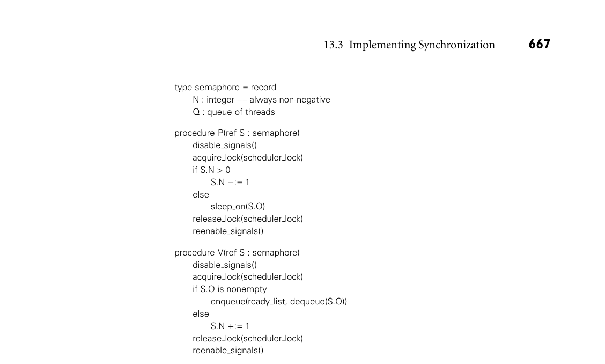
*Figure 13.15 Semaphore operations, for use with the scheduler code of Figure 13.13.*

13.3.5 Semaphores

Semaphores are the oldest of the scheduler-based synchronization mechanisms. They were described by Dijkstra in the mid-1960s [Dij68a], and appear in Al- gol 68. They are still heavily used today, particularly in library-based implemen- tations of concurrency. A semaphore is basically a counter with two associated operations, P and V.4 A EXAMPLE 13.38

Semaphore implementation thread that calls V atomically increments the counter. A thread that calls P waits until the counter is positive and then decrements it. We generally require that semaphores be fair, in the sense that threads complete P operations in the order that they started them. Implementations of P and V in terms of our scheduler operations appear in Figure 13.15. Note that we have elided the matching incre- ment and decrement when a V allows a thread that is waiting in P to continue right away. ■ A semaphore whose counter is initialized to one and for which P and V oper- ations always occur in matched pairs is known as a binary semaphore. It serves as

4 P stands for the Dutch word passeren (to pass) or proberen (to test); V stands for vrijgeven (to release) or verhogen (to increment). To keep them straight, speakers of English may wish to think of P as standing for “pause,” since a thread will pause at a P operation if the semaphore count is negative. Algol 68 calls the P and V operations down and up, respectively.

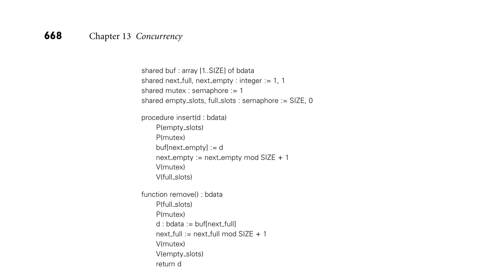
*Figure 13.16 Semaphore-based code for a bounded buffer. The mutex binary semaphore protects the data structure proper. The full slots and empty slots general semaphores ensure that no operation starts until it is safe to do so.*

a scheduler-based mutual exclusion lock: the P operation acquires the lock; V re- leases it. More generally, a semaphore whose counter is initialized to k can be used to arbitrate access to k copies of some resource. The value of the counter at any particular time indicates the number of copies not currently in use. Exercise 13.19 notes that binary semaphores can be used to implement general semaphores, so the two are of equal expressive power, if not of equal convenience. Figure 13.16 shows a semaphore-based solution to the bounded buffer prob- EXAMPLE 13.39

Bounded buffer with semaphores lem. It uses a binary semaphore for mutual exclusion, and two general (or count- ing) semaphores for condition synchronization. Exercise 13.17 considers the use of semaphores to construct an n-thread barrier. ■

3CHECK YOUR UNDERSTANDING 25. What is mutual exclusion? What is a critical section? 26. What does it mean for an operation to be atomic? Explain the difference be- tween atomicity and condition synchronization. 27. Describe the behavior of a test_and_set instruction. Show how to use it to build a spin lock. 28. Describe the behavior of the compare_and_swap instruction. What advan- tages does it offer in comparison to test_and_set?

29. Explain how a reader–writer lock differs from an “ordinary” lock.

30. What is a barrier? In what types of programs are barriers common? 31. What does it mean for an algorithm to be nonblocking? What advantages do nonblocking algorithms have over algorithms based on locks? 32. What is sequential consistency? Why is it difficult to implement?

33. What information is provided by a memory consistency model? What is the relationship between hardware-level and language-level memory models?

34. Explain how to extend a preemptive uniprocessor scheduler to work correctly on a multiprocessor.

35. What is a spin-then-yield lock? 36. What is a bounded buffer?

37. What is a semaphore? What operations does it support? How do binary and general semaphores differ?

13.4 Language-Level Constructs

Though widely used, semaphores are also widely considered to be too “low level” for well-structured, maintainable code. They suffer from two principal problems. First, because their operations are simply subroutine calls, it is easy to leave one out (e.g., on a control path with several nested if statements). Second, unless they are hidden inside an abstraction, uses of a given semaphore tend to get scat- tered throughout a program, making it difficult to track them down for purposes of software maintenance.

13.4.1 Monitors

Monitors were suggested by Dijkstra [Dij72] as a solution to the problems of semaphores. They were developed more thoroughly by Brinch Hansen [Bri73], and formalized by Hoare [Hoa74] in the early 1970s. They have been incorpo- rated into at least a score of languages, of which Concurrent Pascal [Bri75], Mod- ula (1) [Wir77b], and Mesa [LR80] were probably the most influential.5 They

5 Together with Smalltalk and Interlisp, Mesa was one of three influentiallanguages to emerge from Xerox’s Palo Alto Research Center in the 1970s. All three were developed on the Alto personal computer, which pioneered such concepts as the bitmapped display, the mouse, the graphical user interface, WYSIWYG editing, Ethernet networking, and the laser printer. The Mesa project was led by Butler Lampson (1943–), who played a key role in the later development of Euclid and Cedar as well. For his contributions to personal and distributed computing, Lampson received the ACM Turing Award in 1992.

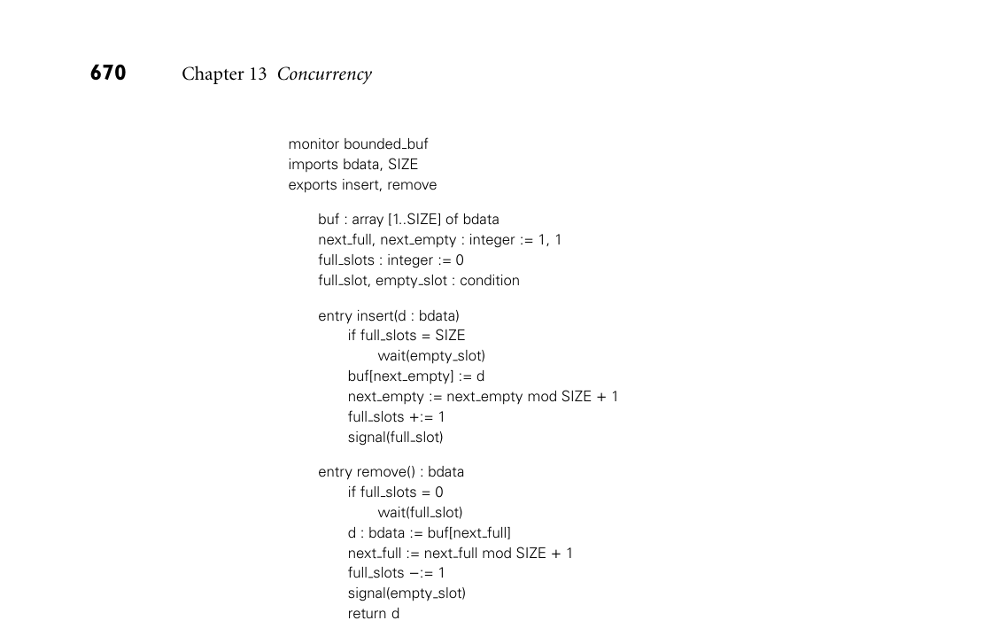
*Figure 13.17 Monitor-based code for a bounded buffer. Insert and remove are entry subrou- tines: they require exclusive access to the monitor’s data. Because conditions are memory-less, both insert and remove can safely end their operation with a signal.*

also strongly influenced the design of Java’s synchronization mechanisms, which we will consider in Section 13.4.3. A monitor is a module or object with operations, internal state, and a number of condition variables. Only one operation of a given monitor is allowed to be active at a given point in time. A thread that calls a busy monitor is automatically delayed until the monitor is free. On behalf of its calling thread, any operation may suspend itself by waiting on a condition variable. An operation may also signal a condition variable, in which case one of the waiting threads is resumed, usually the one that waited first. Because the operations (entries) of a monitor automatically exclude one an- other in time, the programmer is relieved of the responsibility of using P and V operations correctly. Moreover because the monitor is an abstraction, all opera- tions on the encapsulated data, including synchronization, are collected together in one place. Figure 13.17 shows a monitor-based solution to the bounded buffer EXAMPLE 13.40

Bounded buffer monitor problem. It is worth emphasizing that monitor condition variables are not the same as semaphores. Specifically, they have no “memory”: if no thread is wait- ing on a condition at the time that a signal occurs, then the signal has no effect.

By contrast a V operation on a semaphore increments the semaphore’s counter, allowing some future P operation to succeed, even if none is waiting now. ■

Semantic Details

Hoare’s definition of monitors employs one thread queue for every condition variable, plus two bookkeeping queues: the entry queue and the urgent queue. A thread that attempts to enter a busy monitor waits in the entry queue. When a thread executes a signal operation from within a monitor, and some other thread is waiting on the specified condition, then the signaling thread waits on the moni- tor’s urgent queue and the first thread on the appropriate condition queue obtains control of the monitor. If no thread is waiting on the signaled condition, then the signal operation is a no-op. When a thread leaves a monitor, either by complet- ing its operation or by waiting on a condition, it unblocks the first thread on the urgent queue or, if the urgent queue is empty, the first thread on the entry queue, if any. Many monitor implementations dispense with the urgent queue, or make other changes to Hoare’s original definition. From the programmer’s point of view, the two principal areas of variation are the semantics of the signal opera- tion and the management of mutual exclusion when a thread waits inside a nested sequence of two or more monitor calls. We will return to these issues below. Correctness for monitors depends on maintaining a monitor invariant. The invariant is a predicate that captures the notion that “the state of the monitor is consistent.” The invariant needs to be true initially, and at monitor exit. It also needs to be true at every wait statement and, in a Hoare monitor, at signal oper- ations as well. For our bounded buffer example, a suitable invariant would assert that full slots correctly indicates the number of items in the buffer, and that those items lie in slots numbered next full through next empty −1 (mod SIZE). Care- ful inspection of the code in Figure 13.17 reveals that the invariant does indeed hold initially, and that any time we modify one of the variables mentioned in the invariant, we always modify the others accordingly before waiting, signaling, or returning from an entry. Hoare defined his monitors in terms of semaphores. Conversely, it is easy to define semaphores in terms of monitors (Exercise 13.18). Together, the two def- initions prove that semaphores and monitors are equally powerful: each can ex- press all forms of synchronization expressible with the other.

Signals as Hints and Absolutes

In general, one signals a condition variable when some condition on which a thread may be waiting has become true. If we want to guarantee that the condi- tion is still true when the thread wakes up, then we need to switch to the thread as soon as the signal occurs—hence the need for the urgent queue, and the need to ensure the monitor invariant at signal operations. In practice, switching contexts EXAMPLE 13.41

How to wait for a signal (hint or absolute) on a signal tends to induce unnecessary scheduling overhead: a signaling thread seldom changes the condition associated with the signal during the remainder of its operation. To reduce the overhead, and to eliminate the need to ensure the

monitor invariant, Mesa specifies that signals are only hints: the language run- time system moves some waiting thread to the ready list, but the signaler retains control of the monitor, and the waiter must recheck the condition when it awakes. In effect, the standard idiom

if not desired condition wait (condition variable)

in a Hoare monitor becomes the following in Mesa:

while not desired condition wait(condition variable)

DESIGN & IMPLEMENTATION

13.5 Monitor signal semantics By specifying that signals are hints, instead of absolutes, Mesa and Modula-3 (and similarly Java and C#, which we consider in Section 13.4.3) avoid the need to perform an immediate context switch from a signaler to a waiting thread. They also admit simpler, though less efficient implementations that lack a one- to-one correspondence between signals and thread queues, or that do not nec- essarily guarantee that a waiting thread will be the first to run in its monitor after the signal occurs. This approach can lead to complications, however, if we want to ensure that an appropriate thread always runs in the wake of a signal. Suppose an awakened thread rechecks its condition and discovers that it still can’t run. If there may be some other thread that could run, the erroneously awakened thread may need to resignal the condition before it waits again:

if not desired condition loop wait (condition variable) if desired condition break signal (condition variable)

In effect the signal “cascades” from thread to thread until some thread is able to run. (If it is possible that no waiting thread will be able to run, then we will need additional logic to stop the cascading when every thread has been checked.) Alternatively, the thread that makes a condition (potentially) true can use a special broadcast version of the signal operation to awaken all wait- ing threads at once. Each thread will then recheck the condition and if ap- propriate wait again, without the need for explicit cascading. In either case (cascading signals or broadcast), signals as hints trade potentially high over- head in the worst case for potentially low overhead in the common case and a potentially simpler implementation.

Modula-3 takes a similar approach. An alternative appears in Concurrent Pascal, which specifies that a signal operation causes an immediate return from the monitor operation in which it appears. This rule keeps overhead low, and also preserves invariants, but precludes algorithms in which a thread does useful work in a monitor after signaling a condition. ■

Nested Monitor Calls

In most monitor languages, a wait in a nested sequence of monitor operations will release mutual exclusion on the innermost monitor, but will leave the outer monitors locked. This situation can lead to deadlock if the only way for another thread to reach a corresponding signal operation is through the same outer moni- tor(s). In general, we use the term “deadlock” to describe any situation in which a collection of threads are all waiting for each other, and none of them can proceed. In this specific case, the thread that entered the outer monitor first is waiting for the second thread to execute a signal operation; the second thread, however, is waiting for the first to leave the monitor. The alternative—to release exclusion on outer monitors when waiting in an inner one—was adopted by several early monitor implementations for unipro- cessors, including the original implementation of Modula [Wir77a]. It has a sig- nificant semantic drawback, however: it requires that the monitor invariant hold not only at monitor exit and (perhaps) at signal operations, but also at any sub- routine call that may result in a wait or (with Hoare semantics) a signal in a nested monitor. Such calls may not all be known to the programmer; they are certainly not syntactically distinguished in the source.

DESIGN & IMPLEMENTATION

13.6 The nested monitor problem While maintaining exclusion on outer monitor(s) when waiting in an inner one may lead to deadlock with a signaling thread, releasing those outer moni- tors may lead to similar (if a bit more subtle) deadlocks. When a waiting thread awakens it must reacquire exclusion on both inner and outer monitors. The innermost monitor is of course available, because the matching signal hap- pened there, but there is in general no way to ensure that unrelated threads will not be busy in the outer monitor(s). Moreover one of those threads may need access to the inner monitor in order to complete its work and release the outer monitor(s). If we insist that the awakened thread be the first to run in the inner monitor after the signal, then deadlock will result. One way to avoid this problem is to arrange for mutual exclusion across all the monitors of a program. This solution severely limits concurrency in multiprocessor imple- mentations, but may be acceptable on a uniprocessor. A more general solution is addressed in Exercise 13.21.

13.4.2 Conditional Critical Regions

Conditional critical regions (CCRs) are another alternative to semaphores, pro- posed by Brinch Hansen at about the same time as monitors [Bri73]. A critical EXAMPLE 13.42

Original CCR syntax region is a syntactically delimited critical section in which code is permitted to access a protected variable. A conditional critical region also specifies a Boolean condition, which must be true before control will enter the region:

region protected variable, when Boolean condition do . . . end region

No thread can access a protected variable except within a region statement for that variable, and any thread that reaches a region statement waits until the condition is true and no other thread is currently in a region for the same variable. Regions can nest, though as with nested monitor calls, the programmer needs to worry about deadlock. Figure 13.18 uses CCRs to implement a bounded buffer. ■ Conditional critical regions appeared in the concurrent language Edison [Bri81], and also seem to have influenced the synchronization mechanisms of Ada 95 and Java/C#. These later languages might be said to blend the features of monitors and CCRs, albeit in different ways.

Synchronization in Ada 95

The principal mechanism for synchronization in Ada, introduced in Ada 83, is based on message passing; we will describe it in Section 13.5. Ada 95 augments this mechanism with a notion of protected object. A protected object can have three types of methods: functions, procedures, and entries. Functions can only read the fields of the object; procedures and entries can read and write them. An

DESIGN & IMPLEMENTATION

13.7 Conditional critical regions Conditional critical regions avoid the question of signal semantics, because they use explicit Boolean conditions instead of condition variables, and be- cause conditions can be awaited only at the beginning of critical regions. At the same time, they introduce potentially significant inefficiency. In the gen- eral case, the code used to exit a conditional critical region must tentatively resume each waiting thread, allowing that thread to recheck its condition in its own referencing environment. Optimizations are possible in certain special cases (e.g., for conditions that depend only on global variables, or that consist of only a single Boolean variable), but in the worst case it may be necessary to perform context switches in and out of every waiting thread on every exit from a region.

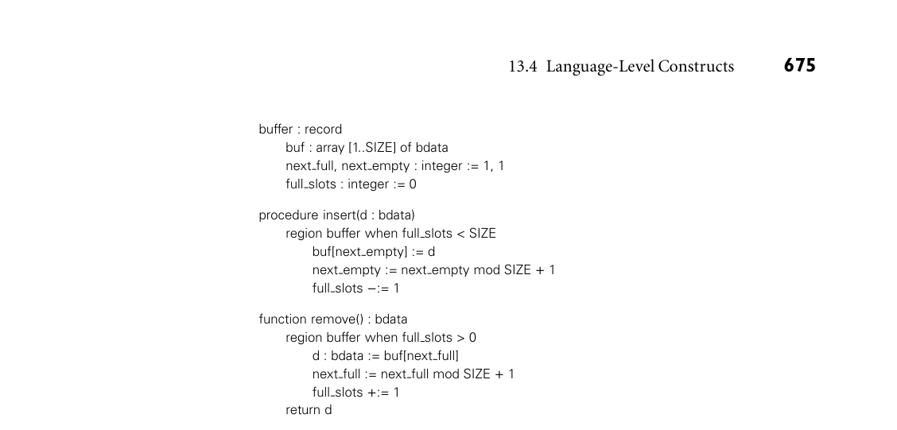
*Figure 13.18 Conditional critical regions for a bounded buffer. Boolean conditions on the region statements eliminate the need for explicit condition variables.*

implicit reader–writer lock on the protected object ensures that potentially con- flicting operations exclude one another in time: a procedure or entry obtains ex- clusive access to the object; a function can operate concurrently with other func- tions, but not with a procedure or entry. Procedures and entries differ from one another in two important ways. First, an entry can have a Boolean expression guard, for which the calling task (thread) will wait before beginning execution (much as it would for the condition of a CCR). Second, an entry supports three special forms of call: timed calls, which abort after waiting for a specified amount of time, conditional calls, which execute alternative code if the call cannot proceed immediately, and asynchronous calls, which begin executing alternative code immediately, but abort it if the call is able to proceed before the alternative completes. In comparison to the conditions of CCRs, the guards on entries of protected objects in Ada 95 admit a more efficient implementation, because they do not have to be evaluated in the context of the calling thread. Moreover, because all guards are gathered together in the definition of the protected object, the com- piler can generate code to test them as a group as efficiently as possible, in a man- ner suggested by Kessels [Kes77]. Though an Ada task cannot wait on a condition in the middle of an entry (only at the beginning), it can requeue itself on an- other entry, achieving much the same effect. Ada 95 code for a bounded buffer would closely resemble the pseudocode of Figure 13.18; we leave the details to Exercise 13.23.

13.4.3 Synchronization in Java

In Java, every object accessible to more than one thread has an implicit mutual EXAMPLE 13.43

synchronized statement in Java exclusion lock, acquired and released by means of synchronized statements:

synchronized (my_shared_obj) { ... // critical section }

All executions of synchronized statements that refer to the same shared object exclude one another in time. Synchronized statements that refer to different objects may proceed concurrently. As a form of syntactic sugar, a method of a class may be prefixed with the synchronized keyword, in which case the body of the method is considered to have been surrounded by an implicit synchronized (this) statement. Invocations of nonsynchronized methods of a shared object— and direct accesses to public fields—can proceed concurrently with each other, or with a synchronized statement or method. ■ Within a synchronized statement or method, a thread can suspend itself by calling the predefined method wait. Wait has no arguments in Java: the core language does not distinguish among the different reasons why threads may be suspended on a given object (the java.util.concurrent library, which became standard with Java 5, does provide a mechanism for multiple conditions; more on this below). Like Mesa, Java allows a thread to be awoken for spurious reasons, or EXAMPLE 13.44

notify as hint in Java after a delay; programs must therefore embed the use of wait within a condition- testing loop:

while (!condition) { wait(); }

A thread that calls the wait method of an object releases the object’s lock. With nested synchronized statements, however, or with nested calls to synchronized methods, the thread does not release locks on any other objects. ■ To resume a thread that is suspended on a given object, some other thread must execute the predefined method notify from within a synchronized statement or method that refers to the same object. Like wait, notify has no arguments. In response to a notify call, the language run-time system picks an arbitrary thread suspended on the object and makes it runnable. If there are no such threads, then the notify is a no-op. As in Mesa, it may sometimes be appropriate to awaken all threads waiting in a given object; Java provides a built-in notifyAll method for this purpose. If threads are waiting for more than one condition (i.e., if their waits are em- bedded in dissimilar loops), there is no guarantee that the “right” thread will awaken. To ensure that an appropriate thread does wake up, the programmer may choose to use notifyAll instead of notify. To ensure that only one thread continues after wakeup, the first thread to discover that its condition has been

satisfied must modify the state of the object in such a way that other awakened threads, when they get to run, will simply go back to sleep. Unfortunately, since all waiting threads will end up reevaluating their conditions every time one of them can run, this “solution” to the multiple-condition problem can be quite expensive. The mechanisms for synchronization in C# are similar to the Java mechanisms just described. The C# lock statement is similar to Java’s synchronized. It cannot be used to label a method, but a similar effect can be achieved (a bit more clumsily) by specifying a Synchronized attribute for the method. The methods Pulse and PulseAll are used instead of notify and notifyAll.

Lock Variables

In early versions of Java, programmers concerned with efficiency generally needed to devise algorithms in which threads were never waiting for more than one con- dition within a given object at a given time. The java.util.concurrent pack- age, introduced in Java 5, provides a more general solution. (Similar solutions are possible in C#, but are not in the standard library.) As an alternative to EXAMPLE 13.45

Lock variables in Java 5 synchronized statements and methods, modern Java programmers can create explicit Lock variables. Code that might once have been written

synchronized (my_shared_obj) { ... // critical section }

DESIGN & IMPLEMENTATION

13.8 Condition variables in Java As illustrated by Mesa and Java, the distinction between monitors and CCRs is somewhat blurry. It turns out to be possible (see Exercise 13.22) to solve completely general synchronization problems in such a way that for every pro- tected object there is only one Boolean condition on which threads ever spin. The solutions, however, may not be pretty: they amount to low-level use of semaphores, without the implicit mutual exclusion of synchronized statements and methods. For programs that are naturally expressed with multiple condi- tions, Java’s basic synchronization mechanism (and the similar mechanism in C#) may force the programmer to choose between elegance and efficiency. The concurrency enhancements of Java 5 were a deliberate attempt to lessen this dilemma: Lock variables retain the distinction between mutual exclusion and condition synchronization characteristic of both monitors and CCRs, while allowing the programmer to partition waiting threads into equivalence classes that can be awoken independently. By varying the fineness of the partition the programmer can choose essentially any point on the spectrum between the simplicity of CCRs and the efficiency of Hoare-style monitors. Exercises 13.24 through 13.26 explore this issue further using bounded buffers as a running example.

may now be written

Lock l = new ReentrantLock(); l.lock(); try { ... // critical section } finally { l.unlock(); }

A similar interface supports reader–writer locks. ■ Like semaphores, Java Lock variables lack the implicit release at end of scope associated with synchronized statements and methods. The need for an explicit release introduces a potential source of bugs, but allows programmers to create algorithms in which locks are acquired and released in non-LIFO order (see Ex- ample 13.14). In a manner reminiscent of the timed entry calls of Ada 95, Java Lock variables also support a tryLock method, which acquires the lock only if it is available immediately, or within an optionally specified timeout interval (a Boolean return value indicates whether the attempt was successful). Finally, a EXAMPLE 13.46

Multiple Conditions in Java 5 Lock variable may have an arbitrary number of associated Condition variables, making it easy to write algorithms in which threads wait for multiple conditions, without resorting to notifyAll:

Condition c1 = l.newCondition(); Condition c2 = l.newCondition(); ... c1.await(); ... c2.signal(); ■

Java objects that use only synchronized methods (no locks or synchronized statements) closely resemble Mesa monitors in which there is a limit of one condi- tion variable per monitor (and in fact objects with synchronized statements are sometimes referred to as monitors in Java). By the same token, a synchronized statement in Java that begins with a wait in a loop resembles a CCR in which the retesting of conditions has been made explicit. Because notify also is explicit, a Java implementation need not reevaluate conditions (or wake up threads that do so explicitly) on every exit from a critical section—only those in which a notify occurs.

The Java Memory Model

The Java Memory Model, which we introduced in Section 13.3.3, specifies exactly which operations are guaranteed to be ordered across threads. It also specifies, for every pair of reads and writes in a program execution, whether the read is permitted to return the value written by the write. Informally, a Java thread is allowed to buffer or reorder its writes (in hardware or in software) until the point at which it writes a volatile variable or leaves a

monitor (releases a lock, leaves a synchronized block, or waits). At that point all its previous writes must be visible to other threads. Similarly, a thread is al- lowed to keep cached copies of values written by other threads until it reads a volatile variable or enters a monitor (acquires a lock, enters a synchronized block, or wakes up from a wait). At that point any subsequent reads must obtain new copies of anything that has been written by other threads. The compiler is free to reorder ordinary reads and writes in the absence of intrathread data dependences. It can also move ordinary reads and writes down past a subsequent volatile read, up past a previous volatile write, or into a synchronized block from above or below. It cannot reorder volatile accesses, monitor entry, or monitor exit with respect to one another. If the compiler can prove that a volatile variable or monitor isn’t used by more than one thread during a given interval of time, it can reorder its operations like ordinary accesses. For data-race-free programs, these rules ensure the ap- pearance of sequential consistency. Moreover even in the presence of races, Java implementations ensure that reads and writes of object references and of 32-bit and smaller quantities are always atomic, and that every read returns the value written either by some unordered write or by some immediately preceding or- dered write. Formalization of the Java memory model proved to be a surprisingly difficult task. Most of the difficulty stemmed from the desire to specify meaningful seman- tics for programs with data races. The C++11 memory model, also introduced in Section 13.3.3, avoids this complexity by simply prohibiting such programs. To first approximation, C++ defines a happens-before ordering on memory accesses, similar to the ordering in Java, and then guarantees sequential consistency for programs in which all conflicting accesses are ordered. Modest additional com- plexity is introduced by allowing the programmer to specify weaker ordering on individual reads and writes of atomic variables; we consider this feature in Ex- ploration 13.42.

13.4.4 Transactional Memory

All the general-purpose mechanisms we have considered for atomicity—sema- phores, monitors, conditional critical regions—are essentially syntactic variants on locks. Critical sections that need to exclude one another must acquire and release the same lock. Critical sections that are mutually independent can run in parallel only if they acquire and release separate locks. This creates an unfortu- nate tradeoff for programmers: it is easy to write a data-race-free program with a single lock, but such a program will not scale: as cores and threads are added, the lock will become a bottleneck, and program performance will stagnate. To increase scalability, skillful programmers partition their program data into equiv- alence classes, each protected by a separate lock. A critical section must then acquire the locks for every accessed equivalence class. If different critical sections acquire locks in different orders, deadlock can result. Enforcing a common or- der can be difficult, however, because we may not be able to predict, when an

operation starts, which data it will eventually need to access. Worse, the fact that correctness depends on locking order means that lock-based program fragments do not compose: we cannot take existing lock-based abstractions and safely call them from within a new critical section. These issues suggest that locks may be too low level a mechanism. From a semantic point of view, the mapping between locks and critical sections is an im- plementation detail; all we really want is a composable atomic construct. Trans- actional memory (TM) is an attempt to provide exactly that.

Atomicity without Locks

Transactions have long been used, with great success, to achieve atomicity for database operations. The usual implementation is speculative: transactions in different threads proceed concurrently unless and until they conflict for access to some common record in the database. In the absence of conflicts, transactions run perfectly in parallel. When conflicts arise, the underlying system arbitrates between the conflicting threads. One gets to continue, and hopefully commit its updates to the database; the others abort and start over (after “rolling back” the work they had done so far). The overall effect is that transactions achieve sig- nificant parallelism at the implementation level, but appear to serialize in some global total order at the level of program semantics. The idea of using more lightweight transactions to achieve atomicity for op- erations on in-memory data structures dates from 1993, when Herlihy and Moss proposed what was essentially a multiword generalization of the load_linked/ store_conditional, instructions mentioned in Example 13.29. Their transac- tional memory (TM) began to receive renewed attention (and higher-level seman- tics) about a decade later, when it became clear to many researchers that multicore processors were going to be successful only with the development of simpler pro- gramming techniques. The basic idea of TM is very simple: the programmer labels code blocks as EXAMPLE 13.47

A simple atomic block atomic—

atomic { –– your code here }

—and the underlying system takes responsibility for executing these blocks in parallel whenever possible. If the code inside the atomic block can safely be rolled back in the event of conflict, then the implementation can be based on specula- tion. ■ In some speculation-based systems, a transaction that needs to wait for some precondition can “deliberately” abort itself with an explicit retry primitive. The system will refrain from restarting the transaction until some previously read lo- cation has been changed by another thread. Transactional code for a bounded EXAMPLE 13.48

Bounded buffer with transactions buffer would be very similar to that of Figure 13.18. We would simply replace

with

atomic atomic if full slots = SIZE then retry and if full slots = 0 then retry ... ...

TM avoids the need to specify object(s) on which to implement mutual exclusion. It also allows the condition test to be placed anywhere inside the atomic block. ■

Many different implementations of TM have been proposed, both in hardware and in software. As of 2015, hardware support is commercially available in IBM’s z and p series machines, and in Intel’s recent versions of the x86. Language-level support is available in Haskell and in several experimental languages and dialects. A formal proposal for transactional extensions to C++ is under consideration for the next revision of the language, expected in 2017 [Int15]. It will be several years before we know how much TM can simplify concurrency in practice, but current signs are promising.

An Example Implementation

There is a surprising amount of variety among software TM systems. We outline one possible implementation here, based, in large part, on the TL2 system of Dice et al. [DSS06] and the TinySTM system of Riegel et al. [FRF08]. Every active transaction keeps track of the locations it has read and the loca- tions and values it has written. It also maintains a valid time value that indicates the most recent logical time at which all of the values it has read so far were known to be correct. Times are obtained from a global clock variable that increases by one each time a transaction attempts to commit. Finally, threads share a global table of ownership records (orecs), indexed by hashing the address of a shared lo- cation. Each orec contains either (1) the most recent logical time at which any of the locations covered by (hashing to) that orec was updated, or (2) the ID t of a transaction that is currently trying to commit a change to one of those locations. In case (1), the orec is said to be unowned; in case (2) the orec—and, by extension, all locations that hash to it—is said to be owned by t. The compiler translates each atomic block into code roughly equivalent to the EXAMPLE 13.49

Translation of an atomic block following:

loop valid time := clock read set := write map := ∅ try –– your code here commit() break except when abort –– continue loop

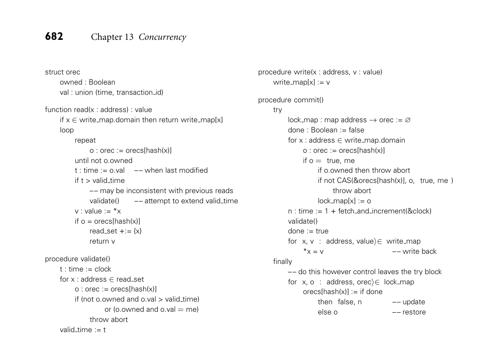
*Figure 13.19 Possible pseudocode for a software TM system. The read and write routines are used to replace ordinary loads and stores within the body of the transaction. The validate routine is called from both read and commit. It attempts to verify that no previously read value has since been overwritten and, if successful, updates valid time. Various fence instructions (not shown) may be needed if the underlying hardware is not sequentially consistent.*

shown in Figure 13.19. Also shown is the commit routine, called at the end of the try block above. ■ Briefly, a transaction buffers its (speculative) writes until it is ready to commit. It then locks all the locations it needs to write, verifies that all the locations it previously read have not been overwritten since, and then writes back and unlocks the locations. At all times, the transaction knows that all of its reads were mutually consistent at time valid time. If it ever tries to read a new location that has been updated since valid time, it attempts to extend this time to the current value of the global clock. If it is able to perform a similar extension at commit time, after having locked all locations it needs to change, then the aggregate effect of the transaction as a whole will be as if it had occurred instantaneously at commit time. To implement retry (not shown in Figure 13.19), we can add an optional list of threads to every orec. A retrying thread will add itself to the list of every location

in its read_set and then perform a P operation on a thread-specific semaphore. Meanwhile, any thread that commits a change to an orec with waiting threads performs a V on the semaphore of each of those threads. This mechanism will sometimes result in unnecessary wakeups, but these do not impact correctness. Upon wakeup, a thread removes itself from all thread lists before restarting its transaction.

Challenges

Many subtleties have been glossed over in our example implementation. The translation in Example 13.49 will not behave correctly if code inside the atomic block throws an exception (other than abort) or executes a return or an exit out of some surrounding loop. The pseudocode of Figure 13.19 also fails to consider that transactions may be nested. Several additional issues are still the subject of debate among TM designers. What should we do about operations inside transactions (I/O, system calls, etc.) that cannot easily be rolled back, and how do we prevent such transactions from ever calling retry? How do we discourage programmers from creating transac- tions so large they almost always conflict with one another, and cannot run in par- allel? Should a program ever be able to detect that transactions are aborting? How should transactions interact with locks and with nonblocking data structures? Should races between transactions and nontransactional code be considered pro- gram bugs? If so, should there be any constraints on the behavior that may result? These and similar questions will need to be answered by any production-quality TM-capable language.

13.4.5 Implicit Synchronization

In several shared-memory languages, the operations that threads can perform on shared data are restricted in such a way that synchronization can be implicit in the operations themselves, rather than appearing as separate, explicit operations. We have seen one example of implicit synchronization already: the forall loop of HPF and Fortran 95 (Example 13.10). Separate iterations of a forall loop proceed concurrently, semantically in lock-step with each other: each iteration reads all data used in its instance of the first assignment statement before any iteration updates its instance of the left-hand side. The left-hand side updates in turn occur before any iteration reads the data used in its instance of the sec- ond assignment statement, and so on. Compilation of forall loops for vector machines, while far from trivial, is more or less straightforward. On a more con- ventional multiprocessor, however, good performance usually depends on high- quality dependence analysis, which allows the compiler to identify situations in which statements within a loop do not in fact depend on one another, and can proceed without synchronization. Dependence analysis plays a crucial role in other languages as well. In Side- bar 11.1 we mentioned the purely functional languages Sisal and pH (recall that

iterative constructs in these languages are syntactic sugar for tail recursion). Be- cause these languages are side-effect free, their constructs can be evaluated in any order, or concurrently, as long as no construct attempts to use a value that has yet to be computed. The Sisal implementation developed at Lawrence Livermore Na- tional Lab used extensive compiler analysis to identify promising constructs for parallel execution. It also employed tags on data objects that indicate whether the object’s value had been computed yet. When the compiler was unable to guaran- tee that a value would have been computed by the time it was needed at run time, the generated code used tag bits for synchronization, spinning or blocking until they were properly set. Sisal’s developers claimed (in 1992) that their language and compiler rivaled parallel Fortran in performance [Can92]. Automatic parallelization, first for vector machines and then for general- purpose machines, was a major topic of research in the 1980s and 1990s. It achieved considerable success with well-structured data-parallel programs, largely for scientific applications, and largely but not entirely in Fortran. Auto- matic identification of thread-level parallelism in more general, irregularly struc- tured programs proved elusive, however, as did compilation for message-passing hardware. Research in this area continues, and has branched out to languages like Matlab and R.

Futures

Implicit synchronization can also be achieved without compiler analysis. The EXAMPLE 13.50

future construct in Multilisp Multilisp [Hal85, MKH91] dialect of Scheme allowed the programmer to enclose any function evaluation in a special future construct:

(future (my-function my-args))

In a purely functional program, future is semantically neutral: assuming all eval- uations terminate, program behavior will be exactly the same as if (my-function my-args) had appeared without the surrounding call. In the implementation, however, future arranges for the embedded function to be evaluated by a sep- arate thread of control. The parent thread continues to execute until it actually tries to use the return value of my-function, at which point it waits for execution of the future to complete. If two or more arguments to a function are enclosed in futures, then evaluation of the arguments can proceed in parallel:

(parent (future (child1 args1 )) (future (child2 args2 ))) ■

There were no additional synchronization mechanisms in Multilisp: future itself was the language’s only addition to Scheme. Many subsequent languages and systems have provided future as part of a larger feature set. Using C#’s Task EXAMPLE 13.51

Futures in C# Parallel Library (TPL), we might write

var description = Task.Factory.StartNew(() => GetDescription()); var numberInStock = Task.Factory.StartNew(() => GetInventory()); ... Console.WriteLine("We have " + numberInStock.Result + " copies of " + description.Result + " in stock");

Static library class Task.Factory is used to generate futures, known as “tasks” in C#. The Create method supports generic type inference, allowing us to pass a delegate compatible with Func<T> (function returning T), for any T. We’ve specified the delegates here as lambda expressions. If GetDescription returns a String, description will be of type Task<String>; if GetInventory returns an int, numberInStock will be of type Task<int>. The Java standard library provides similar facilities, but the lack of delegates, properties (like Result), type inference (var), and automatic boxing (of the int returned by GetInventory) make the syntax quite a bit more cumbersome. Java also requires that the programmer pass newly created Futures to an explicitly created Executor object that will be responsible for running them. Scala provides syntax for futures as simple as that of C#, with even richer semantics. ■ Futures are also available in C++, where they are designed to interoperate with EXAMPLE 13.52

Futures in C++11 lambda expressions, object closures, and a variety of mechanisms for threading and asynchronous (delayed) computation. Perhaps the simplest use case employs the generic async function, which takes a function f and a list of arguments a1, ..., an, and returns a future that will eventually yield f(a1, ... , an):

string ip_address_of(const char* hostname) { // do Internet name lookup (potentially slow) } ...

DESIGN & IMPLEMENTATION

13.9 Side-effect freedom and implicit synchronization In a partially imperative program (in Multilisp, C#, Scala, etc.), the program- mer must take care to make sure that concurrent execution of futures will not compromise program correctness. The expression (parent (future (child1 args1 )) (future (child2 args2 ))) may produce unpredictable behavior if the evaluations of child1 and child2 depend on one another, or if the evaluation of parent depends on any aspect of child1 and child2 other than their return values. Such behavior may be very difficult to debug. Languages like Sisal and Haskell avoid the problem by permitting only side- effect–free programs. In a key sense, pure functional languages are ideally suited to parallel exe- cution: they eliminate all artificial connections—all anti- and output depen- dences (Section C 17.6)—among expressions: all that remains is the actual data flow. Two principal barriers to performance remain: (1) the standard challenges of efficient code generation for functional programs (Section 11.8), and (2) the need to identify which potentially parallel code fragments are large enough and independent enough to merit the overhead of thread creation and implicit synchronization.

auto query = async(ip_address_of, "www.cs.rochester.edu"); ... cout << query.get() << "\n"; // prints "192.5.53.208"

Here variable query, which we declared with the auto keyword, will be inferred to have type future<string>. ■ In some ways the future construct of Multilisp resembles the built-in delay and force of Scheme (Section 6.6.2). Where future supports concurrency, how- ever, delay supports lazy evaluation: it defers evaluation of its embedded func- tion until the return value is known to be needed. Any use of a delayed expres- sion in Scheme must be surrounded by force. By contrast, synchronization on a Multilisp future is implicit—there is no analog of force. A more complicated variant of the C++ async, not used in Example 13.52, allows the programmer to insist that the future be run in a separate thread—or, alternatively, that it remain unevaluated until get is called (at which point it will execute in the calling thread). When async is used as shown in our example, the choice of implementation is left to the run-time system—as it is in Multilisp.

Parallel Logic Programming

Several researchers have noted that the backtracking search of logic languages such as Prolog is also amenable to parallelization. Two strategies are possible. The first is to pursue in parallel the subgoals found in the right-hand side of a rule. This strategy is known as AND parallelism. The fact that variables in logic, once initialized, are never subsequently modified ensures that parallel branches of an AND cannot interfere with one another. The second strategy is known as OR parallelism; it pursues alternative resolutions in parallel. Because they will gener- ally employ different unifications, branches of an OR must use separate copies of their variables. In a search tree such as that of Figure 12.1, AND parallelism and OR parallelism create new threads at alternating levels. OR parallelism is speculative: since success is required on only one branch, work performed on other branches is in some sense wasted. OR parallelism works well, however, when a goal cannot be satisfied (in which case the entire tree must be searched), or when there is high variance in the amount of execution time re- quired to satisfy a goal in different ways (in which case exploring several branches at once reduces the expected time to find the first solution). Both AND and OR parallelism are problematic in Prolog, because they fail to adhere to the deter- ministic search order required by language semantics. Parlog [Che92], which supports both AND and OR parallelism, is the best known of the parallel Prolog dialects.

3CHECK YOUR UNDERSTANDING 38. What is a monitor? How do monitor condition variables differ from sema- phores?

39. Explain the difference between treating monitor signals as hints and treating them as absolutes.

40. What is a monitor invariant? Under what circumstances must it be guaranteed to hold?

41. Describe the nested monitor problem and some potential solutions. 42. What is deadlock?

43. What is a conditional critical region? How does it differ from a monitor? 44. Summarize the synchronization mechanisms of Ada 95, Java, and C#. Con- trast them with one another, and with monitors and conditional critical re- gions. Be sure to explain the features added to Java 5.

45. What is transactional memory? What advantages does it offer over algorithms based on locks? What challenges will need to be overcome before it enters widespread use?

46. Describe the semantics of the HPF/Fortran 95 forall loop. How does it differ from do concurrent?

47. Why might pure functional languages be said to provide a particularly attrac- tive setting for concurrent programming?

48. What are futures? In what languages do they appear? What precautions must the programmer take when using them?

49. Explain the difference between AND parallelism and OR parallelism in Prolog.

13.5 Message Passing

Shared-memory concurrency has become ubiquitous on multicore processors and multiprocessor servers. Message passing, however, still dominates both dis- tributed and high-end computing. Supercomputers and large-scale clusters are programmed primarily in Fortran or C/C++ with the MPI library package. Dis- tributed computing increasingly relies on client–server abstractions layered on top of libraries that implement the TCP/IP Internet standard. As in shared- memory computing, scores of message-passing languages have also been devel- oped for particular application domains, or for research or pedagogical purposes.

IN MORE DEPTH

Three central issues in message-based concurrency—naming, sending, and receiving—are explored on the companion site. A name may refer directly to a process, to some communication resource associated with a process (often called an entry or port), or to an independent socket or channel abstraction. A send op- eration may be entirely asynchronous, in which case the sender continues while the underlying system attempts to deliver the message, or the sender may wait, typically for acknowledgment of receipt or for the return of a reply. A receive operation, for its part, may be executed explicitly, or it may implicitly trigger execution of some previously specified handler routine. When implicit receipt is coupled with senders waiting for replies, the combination is typically known as remote procedure call (RPC). In addition to message-passing libraries, RPC systems typically rely on a language-aware tool known as a stub compiler.

13.6 Summary and Concluding Remarks

Concurrency and parallelism have become ubiquitous in modern computer sys- tems. It is probably safe to say that most computer research and development today involves concurrency in one form or another. High-end computer systems have always been parallel, and multicore PCs and cellphones are now ubiquitous. Even on uniprocessors, graphical and networked applications are typically con- current. In this chapter we have provided an introduction to concurrent programming with an emphasis on programming language issues. We began with an overview of the motivations for concurrency and of the architecture of modern multipro- cessors. We then surveyed the fundamentals of concurrent software, including communication, synchronization, and the creation and management of threads. We distinguished between shared-memory and message-passing models of com- munication and synchronization, and between language- and library-based im- plementations of concurrency. Our survey of thread creation and management described some six different constructs for creating threads: co-begin, parallel loops, launch-at-elaboration, fork/join, implicit receipt, and early reply. Of these fork/join is the most com- mon; it is found in a host of languages, and in library-based packages such as MPI and OpenMP. RPC systems typically use fork/join internally to implement implicit receipt. Regardless of the thread-creation mechanism, most concurrent programming systems implement their language- or library-level threads on top of a collection of OS-level processes, which the operating system implements in a similar manner on top of a collection of hardware cores. We built our sam- ple implementation in stages, beginning with coroutines on a uniprocessor, then adding a ready list and scheduler, then timers for preemption, and finally parallel scheduling on multiple cores.

The bulk of the chapter focused on shared-memory programming models, and on synchronization in particular. We distinguished between atomicity and con- dition synchronization, and between busy-wait and scheduler-based implemen- tations. Among busy-wait mechanisms we looked in particular at spin locks and barriers. Among scheduler-based mechanisms we looked at semaphores, moni- tors, and conditional critical regions. Of the three, semaphores are the simplest, and remain widely used, particularly in operating systems. Monitors and condi- tional critical regions provide better encapsulation and abstraction, but are not amenable to implementation in a library. Conditional critical regions might be argued to provide the most pleasant programming model, but cannot in general be implemented as efficiently as monitors. We also considered the implicit synchronization provided by parallel func- tional languages and by parallelizing compilers for such data-parallel languages as High Performance Fortran. For programs written in a functional style, we considered the future mechanism introduced by Multilisp and subsequently in- corporated into many other languages, including Java, C#, C++, and Scala. As an alternative to lock-based atomicity, we considered nonblocking data structures, which avoid performance anomalies due to inopportune preemption and page faults. For certain common structures, nonblocking algorithms can outperform locks even in the common case. Unfortunately, they tend to be ex- traordinarily subtle and difficult to create. Transactional memory (TM) was originally conceived as a general-purpose means of building nonblocking code for arbitrary data structures. Most recent implementations, however, have given up on nonblocking guarantees, focusing instead on the ability to specify atomicity without devising an explicit locking protocol. Like conditional critical regions, TM sacrifices performance for the sake of programmability. Prototype implementations are now available for a wide va- riety of languages, with hardware support in several commercial instruction sets. Our section on message passing, mostly on the companion site, drew exam- ples from several libraries and languages, and considered how processes name each other, how long they block when sending a message, and whether receipt is implicit or explicit. Distributed computing increasingly relies on remote proce- dure calls, which combine remote-invocation send (wait for a reply) with implicit message receipt. As in previous chapters, we saw many cases in which language design and lan- guage implementation influence one another. Some mechanisms (cactus stacks, conditional critical regions, content-based message screening) are sufficiently complex that many language designers have chosen not to provide them. Other mechanisms (Ada-style parameter modes) have been developed specifically to fa- cilitate an efficient implementation technique. And in still other cases (the se- mantics of no-wait send, blocking inside a monitor), implementation issues play a major role in some larger set of tradeoffs. Despite the very long history of concurrent language design, until recently most multithreaded programs relied on library-based thread packages. Even C and C++ are now explicitly parallel, however, and it is hard to imagine any new

languages being designed for purely sequential execution. As of 2015, explic- itly parallel languages have yet to seriously undermine the dominance of MPI for high-end scientific computing, though this, too, may change in coming years. 13.7 Exercises

13.1 Give an example of a “benign” race condition—one whose outcome affects program behavior, but not correctness. 13.2 We have defined the ready list of a thread package to contain all threads that are runnable but not running, with a separate variable to identify the currently running thread. Could we just as easily have defined the ready list to contain all runnable threads, with the understanding that the one at the head of the list is running? (Hint: Think about multiprocessors.) 13.3 Imagine you are writing the code to manage a hash table that will be shared among several concurrent threads. Assume that operations on the table need to be atomic. You could use a single mutual exclusion lock to protect the entire table, or you could devise a scheme with one lock per hash- table bucket. Which approach is likely to work better, under what circum- stances? Why? 13.4 The typical spin lock holds only one bit of data, but requires a full word of storage, because only full words can be read, modified, and written atomically in hardware. Consider, however, the hash table of the previ- ous exercise. If we choose to employ a separate lock for each bucket of the table, explain how to implement a “two-level” locking scheme that cou- ples a conventional spin lock for the table as a whole with a single bit of locking information for each bucket. Explain why such a scheme might be desirable, particularly in a table with external chaining. 13.5 Drawing inspiration from Examples 13.29 and 13.30, design a non- blocking linked-list implementation of a stack using compare_and_swap. (When CAS was first introduced, on the IBM 370 architecture, this algo- rithm was one of the driving applications [Tre86].) 13.6 Building on the previous exercise, suppose that stack nodes are dynami- cally allocated. If we read a pointer and then are delayed (e.g., due to pre- emption), the node to which the pointer refers may be reclaimed and then reallocated for a different purpose. A subsequent compare-and-swap may then succeed when logically it should not. This issue is known as the ABA problem. Give a concrete example—an interleaving of operations in two or more threads—where the ABA problem may result in incorrect behavior for your stack. Explain why this behavior cannot occur in systems with au- tomatic garbage collection. Suggest what might be done to avoid it in systems with manual storage management.

13.7 We noted in Section 13.3.2 that several processors, including the ARM, MIPS, and Power, provide an alternative to compare_and_swap (CAS) known as load_linked/store_conditional (LL/SC). A load_linked instruction loads a memory location into a register and stores certain bookkeeping information into hidden processor registers. A store_ conditional instruction stores the register back into the memory loca- tion, but only if the location has not been modified by any other processor since the load_linked was executed. Like compare_and_swap, store_ conditional returns an indication of whether it succeeded or not. (a) Rewrite the code sequence of Example 13.29 using LL/SC. (b) On most machines, an SC instruction can fail for any of several “spu- rious” reasons, including a page fault, a cache miss, or the occurrence of an interrupt in the time since the matching LL. What steps must a programmer take to make sure that algorithms work correctly in the face of such failures? (c) Discuss the relative advantages of LL/SC and CAS. Consider how they might be implemented on a cache-coherent multiprocessor. Are there situations in which one would work but the other would not? (Hints: Consider algorithms in which a thread may need to touch more than one memory location. Also consider algorithms in which the contents of a memory location might be changed and then restored, as in the previous exercise.) 13.8 Starting with the test-and-test_and_set lock of Figure 13.8, implement busy-wait code that will allow readers to access a data structure concur- rently. Writers will still need to lock out both readers and other writers. You may use any reasonable atomic instruction(s) (e.g., LL/SC). Consider the issue of fairness. In particular, if there are always readers interested in accessing the data structure, your algorithm should ensure that writers are not locked out forever. 13.9 Assuming the Java memory model, (a) Explain why it is not sufficient in Figure 13.11 to label X and Y as volatile. (b) Explain why it is sufficient, in that same figure, to enclose C’s reads (and similarly those of D) in a synchronized block for some com- mon shared object O. (c) Explain why it is sufficient, in Example 13.31, to label both inspected and X as volatile, but not to label only one.

(Hint: You may find it useful to consult Doug Lea’s Java Memory Model “Cookbook for Compiler Writers,” at gee.cs.oswego.edu/dl/jmm/cookbook. html). 13.10 Implement the nonblocking queue of Example 13.30 on an x86. (Com- plete pseudocode can be found in the paper by Michael and Scott [MS98].)

Do you need fence instructions to ensure consistency? If you have access to appropriate hardware, port your code to a machine with a more relaxed memory model (e.g., ARM or Power). What new fences or atomic refer- ences do you need? 13.11 Consider the implementation of software transactional memory in Fig- ure 13.19. (a) How would you implement the read set, write map, and lock map data structures? You will want to minimize the cost not only of insert and lookup operations but also of (1) “zeroing out” the table at the end of a transaction, so it can be used again; and (2) extending the table if it becomes too full. (b) The validate routine is called in two different places. Expand these calls in-line and customize them to the calling context. What opti- mizations can you achieve? (c) Optimize the commit routine to exploit the fact that a final validation is unnecessary if no other transaction has committed since valid time. (d) Further optimize commit by observing that the for loop in the finally clause really needs to iterate over orecs, not over addresses (there may be a difference, if more than one address hashes to the same orec). What data, ideally, should lock map hold? 13.12 The code of Example 13.35 could fairly be accused of displaying poor ab- straction. If we make desired condition a delegate (a subroutine or object closure), can we pass it as an extra parameter, and move the signal and scheduler lock management inside sleep on? (Hint: Consider the code for the P operation in Figure 13.15.) 13.13 The mechanism used in Figure 13.13 to make scheduler code reentrant employs a single OS-provided lock for all the scheduling data structures of the application. Among other things, this mechanism prevents threads on separate processors from performing P or V operations on unrelated semaphores, even when none of the operations needs to block. Can you devise another synchronization mechanism for scheduler-related opera- tions that admits a higher degree of concurrency but that is still correct? 13.14 Show how to implement a lock-based concurrent set as a singly linked sorted list. Your implementation should support insert, find, and remove operations, and should permit operations on separate portions of the list to occur concurrently (so a single lock for the entire list will not suffice). (Hint: You will want to use a “walking lock” idiom in which acquire and release operations are interleaved in non-LIFO order.) 13.15 (Difficult) Implement a nonblocking version of the set of the previous ex- ercise. (Hint: You will probably discover that insertion is easy but deletion is hard. Consider a lazy deletion mechanism in which cleanup [physical re- moval of a node] may occur well after logical completion of the removal. For further details see the work of Harris [Har01].)

13.16 To make spin locks useful on a multiprogrammed multiprocessor, one might want to ensure that no process is ever preempted in the middle of a critical section. That way it would always be safe to spin in user space, be- cause the process holding the lock would be guaranteed to be running on some other processor, rather than preempted and possibly in need of the current processor. Explain why an operating system designer might not want to give user processes the ability to disable preemption arbitrarily. (Hint: Think about fairness and multiple users.) Can you suggest a way to get around the problem? (References to several possible solutions can be found in the paper by Kontothanassis, Wisniewski, and Scott [KWS97].) 13.17 Show how to use semaphores to construct a scheduler-based n-thread bar- rier. 13.18 Prove that monitors and semaphores are equally powerful. That is, use each to implement the other. In the monitor-based implementation of semaphores, what is your monitor invariant? 13.19 Show how to use binary semaphores to implement general semaphores. 13.20 In Example 13.38 (Figure 13.15), suppose we replaced the middle four lines of procedure P with

if S.N = 0 sleep on(S.Q) S.N −:= 1

and the middle four lines of procedure V with

S.N +:= 1 if S.Q is nonempty enqueue(ready list, dequeue(S.Q))

What is the problem with this new version? Explain how it connects to the question of hints and absolutes in Section 13.4.1. 13.21 Suppose that every monitor has a separate mutual exclusion lock, so that different threads can run in different monitors concurrently, and that we want to release exclusion on both inner and outer monitors when a thread waits in a nested call. When the thread awakens it will need to reacquire the outer locks. How can we ensure its ability to do so? (Hint: Think about the order in which to acquire locks, and be prepared to abandon Hoare semantics. For further hints, see Wettstein [Wet78].) 13.22 Show how general semaphores can be implemented with conditional criti- cal regions in which all threads wait for the same condition, thereby avoid- ing the overhead of unproductive wake-ups. 13.23 Write code for a bounded buffer using the protected object mechanism of Ada 95.

*Figure 13.20 The Dining Philosophers. Hungry philosophers must contend for the forks to their left and right in order to eat.*

13.24 Repeat the previous exercise in Java using synchronized statements or methods. Try to make your solution as simple and conceptually clear as possible. You will probably want to use notifyAll. 13.25 Give a more efficient solution to the previous exercise that avoids the use of notifyAll. (Warning: It is tempting to observe that the buffer can never be both full and empty at the same time, and to assume therefore that waiting threads are either all producers or all consumers. This need not be the case, however: if the buffer ever becomes even a temporary perfor- mance bottleneck, there may be an arbitrary number of waiting threads, including both producers and consumers.) 13.26 Repeat the previous exercise using Java Lock variables. 13.27 Explain how escape analysis, mentioned briefly in Sidebar 10.3, could be used to reduce the cost of certain synchronized statements and methods in Java. 13.28 The dining philosophers problem [Dij72] is a classic exercise in synchro- nization (Figure 13.20). Five philosophers sit around a circular table. In the center is a large communal plate of spaghetti. Each philosopher repeat- edly thinks for a while and then eats for a while, at intervals of his or her own choosing. On the table between each pair of adjacent philosophers is a single fork. To eat, a philosopher requires both adjacent forks: the one on the left and the one on the right. Because they share a fork, adjacent philosophers cannot eat simultaneously. Write a solution to the dining philosophers problem in which each philosopher is represented by a process and the forks are represented by shared data. Synchronize access to the forks using semaphores, monitors, or conditional critical regions. Try to maximize concurrency.

13.29 In the previous exercise you may have noticed that the dining philosophers are prone to deadlock. One has to worry about the possibility that all five of them will pick up their right-hand forks simultaneously, and then wait forever for their left-hand neighbors to finish eating. Discuss as many strategies as you can think of to address the deadlock problem. Can you describe a solution in which it is provably impossible for any philosopher to go hungry forever? Can you describe a solution that is fair in a strong sense of the word (i.e., in which no one philosopher gets more chance to eat than some other over the long term)? For a particularly elegant solution, see the paper by Chandy and Misra [CM84]. 13.30 In some concurrent programming systems, global variables are shared by all threads. In others, each newly created thread has a separate copy of the global variables, commonly initialized to the values of the globals of the creating thread. Under this private globals approach, shared data must be allocated from a special heap. In still other programming systems, the programmer can specify which global variables are to be private and which are to be shared. Discuss the tradeoffs between private and shared global variables. Which would you prefer to have available, for which sorts of programs? How would you implement each? Are some options harder to implement than others? To what extent do your answers depend on the nature of processes provided by the operating system? 13.31 Rewrite Example 13.51 in Java. 13.32 AND parallelism in logic languages is analogous to the parallel evaluation of arguments in a functional language (e.g., Multilisp). Does OR par- allelism have a similar analog? (Hint: Think about special forms [Sec- tion 11.5].) Can you suggest a way to obtain the effect of OR parallelism in Multilisp? 13.33 In Section 13.4.5 we claimed that both AND parallelism and OR paral- lelism were problematic in Prolog, because they failed to adhere to the deterministic search order required by language semantics. Elaborate on this claim. What specifically can go wrong?

13.34–13.38 In More Depth. 13.8 Explorations

13.39 The MMX, SSE, and AVX extensions to the x86 instruction set and the Al- tiVec extensions to the Power instruction set make vector operations avail- able to general-purpose code. Learn about these instructions and research their history. What sorts of code are they used for? How are they related to vector supercomputers? To modern graphics processors?

13.40 The “Top 500” list (top500.org) maintains information, over time, on the 500 most powerful computers in the world, as measured on the Linpack performance benchmark. Explore the site. Pay particular attention to the historical trends in the kinds of machines deployed. Can you explain these trends? How many cases can you find of supercomputer technology mov- ing into the mainstream, and vice versa? 13.41 In Section 13.3.3 we noted that different processors provide different lev- els of memory consistency and different mechanisms to force additional ordering when needed. Learn more about these hardware memory mod- els. You might want to start with the tutorial by Adve and Gharachor- loo [AG96]. 13.42 In Sections 13.3.3 and 13.4.3 we presented a very high-level summary of the Java and C++ memory models. Learn their details. Also investigate the (more loosely specified) models of Ada and C#. How do these compare? How efficiently can each be implemented on various real machines? What are the challenges for implementors? For Java, explore the controversy that arose around the memory model in the original definition of the language (updated in Java 5—see the paper by Manson et al. [MPA05] for a discus- sion). For C++, pay particular attention to the ability to specify weakened consistency on loads and stores of atomic variables. 13.43 In Section 13.3.2 we presented a brief introduction to the design of non- blocking concurrent data structures, which work correctly without locks. Learn more about this topic. How hard is it to write correct nonblocking code? How does the performance compare to that of lock-based code? You might want to start with the work of Michael [MS98] and Sundell [Sun04]. For a more theoretical foundation, start with Herlihy’s original article on wait freedom [Her91] and the more recent concept of obstruction free- dom [HLM03], or check out the text by Herlihy and Shavit [HS12]. 13.44 As possible improvements to reader-writer locks, learn about sequence locks [Lam05] and the RCU (read-copy update) synchronization id- iom [MAK+01]. Both of these are heavily used in the operating systems community. Discuss the challenges involved in applying them to code written by “nonexperts.” 13.45 The first software transactional memory systems grew out of work on non- blocking concurrent data structures, and were in fact nonblocking. Most recent systems, however, are lock based. Read the position paper by En- nals [Enn06] and the more recent papers of Marathe and Moir [MM08] and Tabba et al. [TWGM07]. What do you think? Should TM systems be nonblocking? 13.46 The most widely used language-level transactional memory is the STM monad of Haskell, supported by the Glasgow Haskell compiler and run- time system. Read up on its syntax and implementation [HMPH05]. Pay

particular attention to the retry and orElse mechanisms. Discuss their similarities to—and advantages over—conditional critical regions. 13.47 Study the documentation for some of your favorite library packages (the C and C++ standard libraries, perhaps, or the .NET and Java libraries, or the many available packages for mathematical computing). Which routines can safely be called from a multithreaded program? Which cannot? What accounts for the difference? Why not make all routines thread safe? 13.48 Undertake a detailed study of several concurrent languages. Download implementations and use them to write parallel programs of several dif- ferent sorts. (You might, for example, try Conway’s Game of Life, Delau- nay Triangulation, and Gaussian Elimination; descriptions of all of these can easily be found on the Web.) Write a paper about your experience. What worked well? What didn’t? Languages you might consider include Ada, C#, Cilk, Erlang, Go, Haskell, Java, Modula-3, Occam, Rust, SR, and Swift. References for all of these can be found in Appendix A. 13.49 Learn about the supercomputing languages discussed in the Bibliographic Notes at the end of the chapter: Co-Array Fortran, Titanium, and UPC; and Chapel, Fortress, and X10. How do these compare to one another? To MPI and OpenMP? To languages with less of a focus on “high-end” computing? 13.50 In the spirit of the previous question, learn about the SHMEM library package, originally developed by Robert Numrich of Cray, Inc., and now standardized as OpenSHMEM (openshmem.org). SHMEM is widely used for parallel programming on both large-scale multiprocessors and clusters. It has been characterized as a cross between shared memory and message passing. Is this a fair characterization? Under what circumstances might a shmem program be expected to outperform solutions in MPI or OpenMP? 13.51 Much of this chapter has been devoted to the management of races in par- allel programs. The complexity of the task suggests a tantalizing question: is it possible to design a concurrent programming language that is pow- erful enough to be widely useful, and in which programs are inherently race-free? For three very different takes on a (mostly) affirmative answer, see the work of Edward Lee [Lee06], the various concurrent dialects of Haskell [NA01, JGF96], and Deterministic Parallel Java (DPJ) [BAD+09].

13.52–13.54 In More Depth. 13.9 Bibliographic Notes

Much of the early study of concurrency stems from a pair of articles by Dijk- stra [Dij68a, Dij72]. Andrews and Schneider [AS83] provided an excellent snap- shot of the field in the early 1980s. Holt et al. [HGLS78] is a useful reference for many of the classic problems in concurrency and synchronization.

Peterson’s two-process synchronization algorithm appears in a remarkably el- egant and readable two-page paper [Pet81]. Lamport’s 1978 article on “Time, Clocks, and the Ordering of Events in a Distributed System” [Lam78] argued convincingly that the notion of global time cannot be well defined, and that dis- tributed algorithms must therefore be based on causal happens before relation- ships among individual processes. Reader–writer locks are due to Courtois, Hey- mans, and Parnas [CHP71]. Java 7 phasers were inspired in part by the work of Shirako et al. [SPSS08]. Mellor-Crummey and Scott [MCS91] survey the princi- pal busy-wait synchronization algorithms and introduce locks and barriers that scale without contention to very large machines. The seminal paper on lock-free synchronization is that of Herlihy [Her91]. The nonblocking concurrent queue of Example 13.30 is due to Michael and Scott [MS96]. Herlihy and Shavit [HS12] and Scott [Sco13] provide modern, book-length coverage of synchronization and concurrent data structures. Adve and Gharachorloo introduce the notion of hardware memory models [AG96]. Pugh explains the problems with the original Java Memory Model [Pug00]; the revised model is described by Manson, Pugh, and Adve [MPA05]. The mem- ory model for C++11 is described by Boehm and Adve [BA08]. Boehm has ar- gued convincingly that threads cannot be implemented correctly without com- piler support [Boe05]. The original paper on transactional memory is by Her- lihy and Moss [HM93]. Harris, Larus, and Rajwar provide a book-length sur- vey of the field as of late 2010 [HLR10]. Larus and Kozyrakis provide a briefer overview [LK08]. Two recent generations of parallel languages for high-end computing have been highly influential. The Partitioned Global Address Space (PGAS) languages include Co-Array Fortran (CAF), Unified Parallel C (UPC), and Titanium (a di- alect of Java). They support a single global name space for variables, but employ an “extra dimension” of addressing to access data not on the local core. Much of the functionality of CAF has been adopted into Fortran 2008. The so-called HPCS languages—Chapel, Fortress, and X10—build on experience with the PGAS lan- guages, but target a broader range of hardware, applications, and styles of paral- lelism. All three include transactional features. For all of these, a web search is probably the best source of current information. MPI [Mes12] is documented in a variety of articles and books. The lat- est version draws several features from an earlier, competing system known as PVM (Parallel Virtual Machine) [Sun90, GBD+94]. Remote procedure call re- ceived increasing attention in the wake of Nelson’s doctoral research [BN84]. The Open Network Computing RPC standard is documented in Internet RFC number 1831 [Sri95]. RPC also forms the basis of such higher-level standards as CORBA, COM, JavaBeans, and SOAP. Software distributed shared memory (S-DSM) was originally proposed by Li as part of his doctoral research [LH89]. The TreadMarks system from Rice Uni- versity was widely considered the most mature and robust of the various imple- mentations [ACD+96].

14 Scripting Languages

Traditional programming languages are intended primarily for the con- struction of self-contained applications: programs that accept some sort of input, manipulate it in some well-understood way, and generate appropriate output. But most actual uses of computers require the coordination of multiple programs. A large institutional payroll system, for example, must process time-reporting data from card readers, scanned paper forms, and manual (keyboard) entry; execute thousands of database queries; enforce hundreds of legal and institutional rules; create an extensive “paper trail” for record-keeping, auditing, and tax preparation purposes; print paychecks; and communicate with servers around the world for on-line direct deposit, tax withholding, retirement accumulation, medical insur- ance, and so on. These tasks are likely to involve dozens or hundreds of separately executable programs. Coordination among these programs is certain to require tests and conditionals, loops, variables and types, subroutines and abstractions— the same sorts of logical tools that a conventional language provides inside an application. On a much smaller scale, a graphic artist or photojournalist may routinely download pictures from a digital camera; convert them to a favorite format; rotate the pictures that were shot in vertical orientation; down-sample them to create browsable thumbnail versions; index them by date, subject, and color histogram; back them up to a remote archive; and then reinitialize the camera’s memory. Performing these steps by hand is likely to be both tedious and error-prone. In a similar vein, the creation of a dynamic web page may require authentication and authorization, database lookup, image manipulation, remote communica- tion, and the reading and writing of HTML text. All these scenarios suggest a need for programs that coordinate other programs. It is of course possible to write coordination code in Java, C, or some other conventional language, but it isn’t always easy. Conventional languages tend to stress efficiency, maintainability, portability, and the static detection of errors. Their type systems tend to be built around such hardware-level concepts as fixed- size integers, floating-point numbers, characters, and arrays. By contrast scripting languages tend to stress flexibility, rapid development, local customization, and

dynamic (run-time) checking. Their type systems, likewise, tend to embrace such high-level concepts as tables, patterns, lists, and files. General-purpose scripting languages like Perl, Python, and Ruby are some- times called glue languages, because they were originally designed to “glue” ex- isting programs together to build a larger system. With the growth of the World Wide Web, scripting languages have become the standard way to generate dy- namic content, both on servers and with the client browser. They are also widely used to customize or extend the functionality of such “scriptable” systems as edi- tors, spreadsheets, games, and presentation tools. We consider the history and nature of scripting in more detail in Section 14.1. We then turn in Section 14.2 to some of the problem domains in which scripting is widely used. These include command interpretation (shells), text processing and report generation, mathematics and statistics, general-purpose program co- ordination, and configuration and extension. In Section 14.3 we consider several forms of scripting used on the World Wide Web, including CGI scripts, server- and client-side processing of scripts embedded in web pages, Java applets, and (on the companion site) XSLT. Finally, in Section 14.4, we consider some of the more interesting language features, common to many scripting languages, that distinguish them from their more traditional “mainstream” cousins. We look in particular at naming, scoping, and typing; string and pattern manipulation; and high-level structured data. We will not provide a detailed introduction to any one scripting language, though we will consider concrete examples in several. As in most of this book, the emphasis will be on underlying concepts. 14.1 What Is a Scripting Language?

Modern scripting languages have two principal sets of ancestors. In one set are the command interpreters or “shells” of traditional batch and “terminal” (command- line) computing. In the other set are various tools for text processing and report generation. Examples in the first set include IBM’s JCL, the MS-DOS command interpreter, and the Unix sh and csh shell families. Examples in the second set include IBM’s RPG and Unix’s sed and awk. From these evolved Rexx, IBM’s “Restructured Extended Executor,” which dates from 1979, and Perl, originally devised by Larry Wall in the late 1980s, and still one of the most widely used general-purpose scripting languages. Other general-purpose scripting languages include Python, Ruby, PowerShell (for Windows), and AppleScript (for the Mac). With the growth of the World Wide Web in the late 1990s, Perl was widely adopted for “server-side” web scripting, in which a web server executes a pro- gram (on the server’s machine) to generate the content of a page. One early web-scripting enthusiast was Rasmus Lerdorf, who created a collection of scripts to track access to his personal home page. Originally written in Perl but soon redesigned as a full-fledged and independent language, these scripts evolved into PHP, now the most popular platform for server-side web scripting. PHP competi- tors include JSP (Java Server Pages), Ruby on Rails, and, on Microsoft platforms,

PowerShell. For scripting on the client computer, all major browsers implement JavaScript, a language developed by Netscape Corporation in the mid 1990s, and standardized by ECMA (the European standards body) in 1999 [ECM11]. In a classic paper on scripting [Ous98], John Ousterhout, the creator of Tcl, suggested that “Scripting languages assume that a collection of useful components already exist in other languages. They are intended not for writing applications from scratch but rather for combining components.” Ousterhout envisioned a future in which programmers would increasingly rely on scripting languages for the top-level structure of their systems, where clarity, reusability, and ease of de- velopment are crucial. Traditional “systems languages” like C, C++, or Java, he argued, would be used for self-contained, reusable system components, which emphasize complex algorithms or execution speed. As a general rule of thumb that still seems reasonable today, he suggested that code could be developed 5 to 10 times faster in a scripting language, but would run 10 to 20 times faster in a traditional systems language. Some authors reserve the term “scripting” for the glue languages used to coor- dinate multiple programs. In common usage, however, scripting is a broader and vaguer concept, encompassing not only web scripting but also extension languages. These are typically embedded within some larger host program, which they can then control. Many readers will be familiar with the Visual Ba- sic “macros” of Microsoft Office and related applications. Others may be fa- miliar with the Lisp-based extension language of the emacs text editor, or the widespread use of Lua in the computer gaming industry. Several other languages, including Tcl, Rexx, Python, and the Guile and Elk dialects of Scheme, have im- plementations designed to be embedded in other applications. In a similar vein, several widely used commercial applications provide their own proprietary exten- sion languages. For graphical user interface (GUI) programming, the Tk toolkit, originally designed for use with Tcl, has been incorporated into several scripting languages, including Perl, Python, and Ruby. One can also view XSLT (extensible stylesheet language transformations) as a scripting language, albeit somewhat different from the others considered in this chapter. XSLT is part of the growing family of XML (extensible markup language) tools. We consider it further in Section 14.3.5.

14.1.1 Common Characteristics

While it is difficult to define scripting languages precisely, there are several char- acteristics that they tend to have in common:

Both batch and interactive use. A few scripting languages (notably Perl) have a compiler that insists on reading the entire source program before it produces any output. Most other languages, however, are willing to compile or inter- pret their input line by line. Rexx, Python, Tcl, Guile, and (with short helper scripts) Ruby and Lua will all accept commands from the keyboard.

Economy of expression. To support both rapid development and interactive use, scripting languages tend to require a minimum of “boilerplate.” Some make heavy use of punctuation and very short identifiers (Perl is notorious for this), while others (e.g., Rexx, Tcl, and AppleScript) tend to be more “English-like,” with lots of words and not much punctuation. All attempt to avoid the exten- sive declarations and top-level structure common to conventional languages. Where a trivial program looks like this in Java: EXAMPLE 14.1

Trivial programs in conventional and scripting languages class Hello { public static void main(String[] args) { System.out.println("Hello, world!"); } }

and like this in Ada:

with ada.text_IO; use ada.text_IO; procedure hello is begin put_line("Hello, world!"); end hello;

in Perl, Python, or Ruby it is simply

print "Hello, world!\n" ■

Lack of declarations; simple scoping rules. Most scripting languages dispense with declarations, and provide simple rules to govern the scope of names. In some languages (e.g., Perl) everything is global by default; optional declarations can be used to limit a variable to a nested scope. In other languages (e.g., PHP and Tcl), everything is local by default; globals must be explicitly imported. Python adopts the interesting rule that any variable that is assigned a value is local to the block in which the assignment appears. Special syntax is required to assign to a variable in a surrounding scope.

DESIGN & IMPLEMENTATION

14.1 Compiling interpreted languages Several times in this chapter we will make reference to “the compiler” for a scripting language. As we saw in Examples 1.9 and 1.10, interpreters almost never work with source code; a front-end translator first replaces that source with some sort of intermediate form. For most implementations of most of the languages described in this chapter, the front end is sufficiently complex to deserve the name “compiler.” Intermediate forms are typically internal data structures (e.g., a syntax tree) or “byte-code” representations reminiscent of those of Java.

Flexible dynamic typing. In keeping with the lack of declarations, most script- ing languages are dynamically typed. In some (e.g., PHP, Python, Ruby, and Scheme), the type of a variable is checked immediately prior to use. In others (e.g., Rexx, Perl, and Tcl), a variable will be interpreted differently in different contexts. In Perl, for example, the program EXAMPLE 14.2

Coercion in Perl $a = "4"; print $a . 3 . "\n"; # '.' is concatenation print $a + 3 . "\n"; # '+' is addition

will print

43 7

This contextual interpretation is similar to coercion, except that there isn’t nec- essarily a notion of the “natural” type from which an object must be converted; the various possible interpretations may all be equally “natural.” We shall have more to say about context in Perl in Section 14.4.3. ■ Easy access to system facilities. Most programming languages provide a way to ask the underlying operating system to run another program, or to perform some operation directly. In scripting languages, however, these requests are

DESIGN & IMPLEMENTATION

14.2 Canonical implementations Because they are usually implemented with interpreters, scripting languages tend to be easy to port from one machine to another—substantially easier than compilers for which one must write a new code generator. Given a native com- piler for the language in which the interpreter is written, the only difficult part (and it may indeed be difficult) is to implement any necessary modifications to the part of the interpreter that provides the interface to the operating system. At the same time, the ease of porting an interpreter means that many script- ing languages, including Perl, Python, and Ruby, have a single widely used implementation, which serves as the de facto language definition. Reading a book on Perl, it can be difficult to tell how a subtle program will behave. When in doubt, one may need to “try it out.” Rexx and JavaScript are arguably the only widely used scripting languages that have both a formal definition codi- fied by an international standards body and a nontrivial number of indepen- dent implementations. (Lua [and Scheme, if you count it as scripting] have detailed reference manuals and multiple implementations, though no formal blessing from a standards body. Dart has an ECMA standard, but as of 2015, only Google implementations. Sed, awk, and sh have all been standardized by POSIX [Int03b], but none of them can really be described as a full-fledged scripting language.)

much more fundamental, and have much more direct support. Perl, for one, provides well over 100 built-in commands that access operating system func- tions for input and output, file and directory manipulation, process manage- ment, database access, sockets, interprocess communication and synchroniza- tion, protection and authorization, time-of-day clock, and network commu- nication. These built-in commands are generally a good bit easier to use than corresponding library calls in languages like C. Sophisticated pattern matching and string manipulation. In keeping with their text processing and report generation ancestry, and to facilitate the manip- ulation of textual input and output for external programs, scripting languages tend to have extraordinarily rich facilities for pattern matching, search, and string manipulation. Typically these are based on extended regular expressions. We discuss them further in Section 14.4.2. High-level data types. High-level data types like sets, bags, dictionaries, lists, and tuples are increasingly common in the standard library packages of conven- tional programming languages. A few languages (notably C++) allow users to redefine standard infix operators to make these types as easy to use as more primitive, hardware-centric types. Scripting languages go one step further by building high-level types into the syntax and semantics of the language itself. In most scripting languages, for example, it is commonplace to have an “array” that is indexed by character strings, with an underlying implementation based on hash tables. Storage is invariably garbage collected.

Much of the most rapid change in programming languages today is occurring in scripting languages. This can be attributed to several causes, including the continued growth of the Web, the dynamism of the open-source community, and the comparatively low investment required to create a new scripting language. Where a compiled, industrial-quality language like Java or C# requires a multiyear investment by a very large programming team, a single talented designer, working alone, can create a usable implementation of a new scripting language in only a year or two. Due in part to this rapid change, newer scripting languages have been able to incorporate some of the most innovative concepts in language design. Ruby, for example, has a uniform object model (much like Smalltalk), true iterators (like Clu), lambda expressions, (like Lisp), array slices (like Fortran 90), structured exception handling, multiway assignment, and reflection. Python has many of these features as well, and a few that Ruby lacks, including Haskell-style list com- prehensions. 14.2 Problem Domains

Python, and Ruby, are intended by their designers for general-purpose use, with features intended to support “programming in the large”: modules, separate compilation, reflection, program development environments, and so on. For the most part, however, scripting languages tend to see their principal use in well- defined problem domains. We consider some of these in the following subsec- tions.

14.2.1 Shell (Command) Languages

In the days of punch-card computing (through perhaps the mid 1970s), simple command languages allowed the user to “script” the processing of a card deck. A control card at the front of the deck, for example, might indicate that the upcom- ing cards represented a program to be compiled, or perhaps machine language for the compiler itself, or input for a program already compiled and stored on disk. A control card embedded later in the deck might test the exit status of the most recently executed program and choose what to do next based on whether that program completed successfully. Given the linear nature of a card deck, however (one can’t in general back up), command languages for batch processing tended not to be very sophisticated. JCL, for example, had no iteration constructs. With the development of interactive timesharing in the 1960s and early 1970s, command languages became much more sophisticated. Louis Pouzin wrote a simple command interpreter for CTSS, the Compatible Time Sharing System at MIT, in 1963 and 1964. When work began on the groundbreaking Multics sys- tem in 1964, Pouzin sketched the design of an extended command language, with quoting and argument-passing mechanisms, for which he coined the term “shell.” The subsequent implementation served as inspiration for Ken Thompson in the design of the original Unix shell in 1973. In the mid-1970s, Stephen Bourne and John Mashey separately extended the Thompson shell with control flow and vari- ables; Bourne’s design was adopted as the Unix standard, taking the place (and the name) of the Thompson shell, sh. In the late 1970s Bill Joy developed the so-called “C shell” (csh), inspired at least in part by Mashey’s syntax, and introducing significant enhancementsfor in- teractive use, including history, aliases, and job control. The tcsh version of csh adds command-line editing and command completion. David Korn incorpo- rated these mechanisms into a direct descendant of the Bourne shell, ksh, which is very similar to the standard POSIX shell [Int03b]. The popular “Bourne-again” shell, bash, is an open-source version of ksh. While tcsh is still popular in some quarters, ksh/bash/POSIX sh is substantially better for writing shell scripts, and comparable for interactive use. In addition to features designed for interactive use, which we will not consider further here, shell languages provide a wealth of mechanisms to manipulate file- names, arguments, and commands, and to glue together other programs. Most of these features are retained by more general scripting languages. We consider a few of them here, using bash syntax. The discussion is of necessity heavily simplified; full details can be found in the bash man page, or in various on-line tutorials.

Filename and Variable Expansion

Most users of a Unix shell are familiar with “wildcard” expansion of file names. The following command will list all files in the current directory whose names EXAMPLE 14.3

“Wildcards” and “globbing” end in .pdf:

ls *.pdf

The shell expands the pattern *.pdf into a list of all matching names. If there are three of them (say fig1.pdf, fig2.pdf, and fig3.pdf), the result is equivalent to

ls fig1.pdf fig2.pdf fig3.pdf

Filename expansion is sometimes called “globbing,” after the original Unix glob command that implemented it. In addition to * wildcards, one can usually specify “don’t care” or alternative characters or substrings. The pattern fig?.pdf will match (expand to) any file(s) with a single character between the g and the dot. The pattern fig[0-9].pdf will require that character to be a digit. The pattern fig3.{eps,pdf} will match both fig3.eps and fig3.pdf. ■ Filename expansion is particularly useful in loops. Such loops may be typed directly from the keyboard, or embedded in scripts intended for later execution. Suppose, for example, that we wish to create PDF versions of all our EPS figures:1 EXAMPLE 14.4

For loops in the shell for fig in *.eps do ps2pdf $fig done

The for construct arranges for the shell variable fig to take on the names in the expansion of *.eps, one at a time, in consecutive iterations of the loop. The dollar sign in line 3 causes the value of fig to be expanded into the ps2pdf com- mand before it is executed. (Interestingly, ps2pdf is itself a shell script that calls the gs Postscript interpreter.) Optional braces can be used to separate a variable name from following characters, as in cp $foo ${foo}_backup. ■ Multiple commands can be entered on a single line if they are separated by EXAMPLE 14.5

A whole loop on one line semicolons. The following, for example, is equivalent to the loop in the previous example:

for fig in *.eps; do ps2pdf $fig; done ■

1 Postscript is a programming language developed at Adobe Systems, Inc. for the description of images and documents (we consider it again in Sidebar 15.1). Encapsulated Postscript (EPS) is a restricted form of Postscript intended for figures that are to be embedded in other documents. Portable Document Format (PDF, also by Adobe) is a self-contained file format that combines a subset of Postscript with font embedding and compression mechanisms. It is strictly less powerful than Postscript from a computational perspective, but much more portable, and faster and easier to render.

Tests, Queries, and Conditions

The loop above will execute ps2pdf for every EPS file in the current directory. Suppose, however, that we already have some PDF files, and only want to create EXAMPLE 14.6

Conditional tests in the shell the ones that are missing:

for fig in *.eps do target=${fig%.eps}.pdf if [ $fig -nt $target ] then ps2pdf $fig fi done

The third line of this script is a variable assignment. The expression ${fig%.eps} within the right-hand side expands to the value of fig with any trailing .eps re- moved. Similar special expansions can be used to test or modify the value of a variable in many different ways. The square brackets in line four delimit a con- ditional test. The -nt operator checks to see whether the file named by its left operand is newer than the file named by its right operand (or if the left operand exists but the right does not). Similar file query operators can be used to check many other properties of files. Additional operators can be used for arithmetic or string comparisons. ■

DESIGN & IMPLEMENTATION

14.3 Built-in commands in the shell Commands in the shell generally take the form of a sequence of words, the first of which is the name of the command. Most commands are executable pro- grams, found in directories on the shell’s search path. A large number, however (about 50 in bash), are builtins—commands that the shell recognizes and ex- ecutes itself, rather than starting an external program. Interestingly, several commands that are available as separate programs are duplicated as builtins, either for the sake of efficiency or to provide additional semantics. Conditional tests, for example, were originally supported by the external test command (for which square brackets are syntactic sugar), but these occur sufficiently often in scripts that execution speed improved significantly when a built-in version was added. By contrast, while the kill command is not used very often, the built-in version allows processes to be identified by small integer or symbolic names from the shell’s job control mechanism. The external ver- sion supports only the longer and comparatively unintuitive process identifiers supplied by the operating system.

Pipes and Redirection

One of the principal innovations of Unix was the ability to chain commands to- gether, “piping” the output of one to the input of the next. Like most shells, bash uses the vertical bar character (|) to indicate a pipe. To count the number of fig- EXAMPLE 14.7

Pipes ures in our directory, without distinguishing between EPS and PDF versions, we might type

for fig in *; do echo ${fig%.*}; done | sort -u | wc -l

Here the first command, a for loop, prints the names of all files with extensions (dot-suffixes) removed. The echo command inside the loop simply prints its arguments. The sort -u command after the loop removes duplicates, and the wc -l command counts lines. ■ Like most shells, bash also allows output to be redirected to a file, or input read from a file. To create a list of figures, we might type EXAMPLE 14.8

Output redirection for fig in *; do echo ${fig%.*}; done | sort -u > all_figs

The “greater than” sign indicates output redirection. If doubled (sort -u >> all_figs) it causes output to be appended to the specified file, rather than over- writing the previous contents. In a similar vein, the “less than” sign indicates input redirection. Suppose we want to print our list of figures all on one line, separated by spaces, instead of on multiple lines. On a Unix system we can type

tr '\n' ' ' < all_figs

This invocation of the standard tr command converts all newline characters to spaces. Because tr was written as a simple filter, it does not accept a list of files on the command line; it only reads standard input. ■ For any executing Unix program, the operating system keeps track of a list of open files. By convention, standard input and standard output (stdin and stdout) are files numbers 0 and 1. File number 2 is by convention standard error (stderr), to which programs are supposed to print diagnostic error messages. One of the advantages of the sh family of shells over the csh family is the abil- ity to redirect stderr and other open files independent of stdin and stdout. Consider, for example, the ps2pdf script. Undernormal circumstances this script EXAMPLE 14.9

Redirection of stderr and stdout works silently. If it encounters an error, however, it prints a message to stdout and quits. This violation of convention (the message should go to stderr) is harmless when the command is invoked from the keyboard. If it is embedded in a script, however, and the output of the script is directed to a file, the error mes- sage may end up in the file instead of on the screen, and go unnoticed by the user. With bash we can type

Here 1>&2 means “make ps2pdf send file 1 (stdout) to the same place that the surrounding context would normally send file 2 (stderr).” ■ Finally, like most shells, bash allows the user to provide the input to a com- EXAMPLE 14.10

Heredocs (in-line input) mand in-line:

tr '\n' ' ' <<END list of input lines END

The <<END indicates that subsequent input lines, up to a line containing only END, are to be supplied as input to tr. Such in-line input (traditionally called a “here document”) is seldom used interactively, but is highly useful in shell scripts. ■

Quoting and Expansion

Several examples in the preceding subsections have implicitly relied on the as- sumption that file names do not contain spaces. Returning to Example 14.4, we EXAMPLE 14.11

Problematic spaces in file names will encounter a “file not found” error if we try to run our loop in a directory that contains a file named two words.eps: ps2pdf will end up interpreting its arguments as two words instead of one, and will try to translate file two (which doesn’t exist) into words.eps. To avoid problems like this, shells typically pro- vide a quoting mechanism that will group words together into strings. We could fix Example 14.4 by typing

for fig in *.eps do ps2pdf "$fig" done

Here the double quotes around $fig cause it to be interpreted as a single word, even if it contains white space. ■ But this is not the only kind of quoting. Single (straight or forward) quotes EXAMPLE 14.12

Single and double quotes also group text into words, but inhibit filename and variable expansion in the quoted text. Thus

foo=bar single='$foo' double="$foo" echo $single $double

will print “$foo bar”. ■ Several other bracketing constructs in bash group the text inside, for various purposes. Command lists enclosed in parentheses are passed to a subshell for EXAMPLE 14.13

for fig in $(cat my_figs); do ps2pdf ${fig}.eps; done

Here cat is the standard command to print the content of a file. Most shells use backward single quotes for the same purpose (`cat my_figs`); bash supports this syntax as well, for backward compatibility. ■ Command lists enclosed in braces are treated by bash as a single unit. They EXAMPLE 14.14

Brace-quoted blocks in the shell can be used, for example, to redirect the output of a sequence of commands:

{ date; ls; } >> file_list

Unlike parenthesized lists, commands enclosed in braces are executed by the cur- rent shell. From a programming languages perspective, parentheses and braces behave “backward” from the way they do in C: parentheses introduce a nested dynamic scope in bash, while braces are purely for grouping. In particular, vari- ables that are assigned new values within a parenthesized command list will revert to their previous values once the list has completed execution. ■ When not surrounded by white space, braces perform pattern-based list gen- EXAMPLE 14.15

Pattern-based list generation eration, in a manner similar to filename expansion, but without the connec- tion to the file system. For example, echo abc{12,34,56}xyz prints abc12xyz abc34xyz abc56xyz. Also, as we have seen, braces serve to delimit variable names when the opening brace is preceded by a dollar sign. ■ In Example 14.6 we used square brackets to enclose a conditional expression. Double square brackets serve a similar purpose, but with more C-like expression syntax, and without filename expansion. Double parentheses are used to enclose arithmetic computations, again with C-like syntax. The interpolation of commands in $( ) or backquotes, patterns in { }, and arithmetic expressions in (( )) are all considered forms of expansion, analogous to filename expansion and variable expansion. The splitting of strings into words is also considered a form of expansion, as is the replacement, in certain contexts, of tilde (~) characters with the name of the user’s home directory. All told, these give us seven different kinds of expansion in bash. All of the various bracketing constructs have rules governing which kinds of expansion are performed within. The rules are intended to be as intuitive as pos- sible, but they are not uniform across constructs. Filename expansion, for exam- ple, does not occur within [[ ]]-bracketed conditions. Similarly, a double-quote character may appear inside a double-quoted string if escaped with a backslash, but a single-quote character may not appear inside a single-quoted string.

Functions

Users can define functions in bash that then work like built-in commands. Many EXAMPLE 14.16

User-defined shell functions users, for example, define ll as a shortcut for ls -l, which lists files in the cur- rent directory in “long format”:

function ll () { ls -l "$@" }

Within the function, $1 represents the first parameter, $2 represents the second, and so on. In the definition of ll, $@ represents the entire parameter list. Func- tions can be arbitrarily complex. In particular, bash supports both local variables and recursion. Shells in the csh family provide a more primitive alias mecha- nism that works via macro expansion. ■

The #! Convention

As noted above, shell commands can be read from a script file. To execute them EXAMPLE 14.17

The #! convention in script files in the current shell, one uses the “dot” command:

. my_script

where my_script is the name of the file. Many operating systems, including most versions of Unix, allow one to turn a script file into an executable program, so that users can simply type

my_script

Two steps are required. First, the file must be marked executable in the eyes of the operating system. On Unix one types chmod +x my_script. Second, the file must be self-descriptive in a way that allows the operating system to tell which shell (or other interpreter) will understand the contents. Under Unix, the file must begin with the characters #!, followed by the name of the shell. The typical bash script thus begins with

#!/bin/bash

Specifying the full path name is a safety feature: it anticipates the possibility that the user may have a search path for commands on which some other program named bash appears before the shell. (Unfortunately, the requirement for full path names makes #! lines nonportable, since shells and other interpreters may be installed in different places on different machines.) ■

3CHECK YOUR UNDERSTANDING 1. Give a plausible one-sentence definition of “scripting language.” 2. List the principal ways in which scripting languages differ from conventional “systems” languages. 3. From what two principal sets of ancestors are modern scripting languages descended?

4. What IBM creation is generally considered the first general-purpose scripting language?

6. How does the notion of context in Perl differ from coercion?

7. What is globbing? What is a wildcard? 8. What is a pipe in Unix? What is redirection?

9. Describe the three standard I/O streams provided to every Unix process. 10. Explain the significance of the #! convention in Unix shell scripts.

DESIGN & IMPLEMENTATION

14.4 Magic numbers When the Unix kernel is asked to execute a file (via the execve system call), it checks the first few bytes of the file for a “magic number” that indicates the file’s type. Some values correspond to directly executable object file formats. UnderLinux, for example, the first four bytes of an object file are 0x7f45_4c46 (⟨del⟩ELF in ASCII). Under Mac OS X they are 0xfeed_face. If the first two bytes are 0x2321 (#! in ASCII), the kernel assumes that the file is a script, and reads subsequent characters to find the name of the interpreter. The #! convention in Unix is the main reason that most scripting languages use # as the opening comment delimiter. Early versions of sh used the no-op command (:) as a way to introduce comments. Joy’s C shell introduced #, whereupon some versions of sh were modified to launch csh when asked to execute a script that appeared to begin with a C shell comment. This mecha- nism evolved into the more general mechanism used in many (though not all) variants of Unix today.

14.2.2 Text Processing and Report Generation

Shell languages tend to be heavily string-oriented. Commands are strings, parsed into lists of words. Variables are string-valued. Variable expansion mechanisms allow the user to extract prefixes, suffixes, or arbitrary substrings. Concatenation is indicated by simple juxtaposition. There are elaborate quoting conventions. Few more conventional languages have similar support for strings. At the same time, shell languages are clearly not intended for the sort of text manipulation commonly performed in editors like emacs or vim. Search and substitution, in particular, are missing, and many other tasks that editors accom- plish with a single keystroke—insertion, deletion, replacement, bracket match- ing, forward and backward motion—would be awkward to implement, or simply make no sense, in the context of the shell. For repetitive text manipulation it is natural to want to automate the editing process. Tools to accomplish this task constitute the second principal class of ancestors for modern scripting languages.

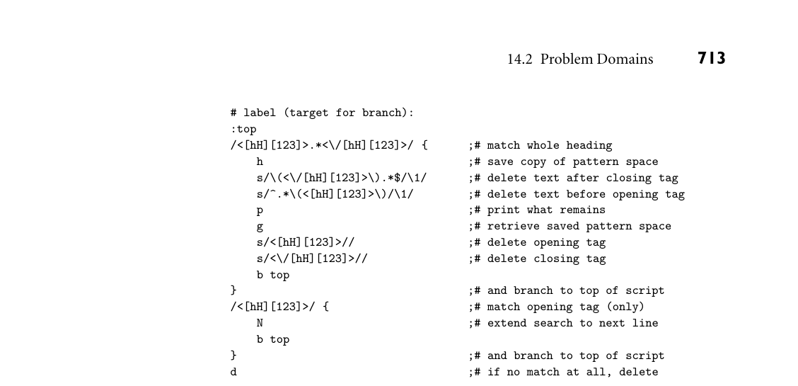
*Figure 14.1 Script in sed to extract headers from an HTML file. The script assumes that opening and closing tags are properly matched, and that headers do not nest.*

Sed

As a simple text processing example, consider the problem of extracting all head- EXAMPLE 14.18

Extracting HTML headers with sed ers from a web page (an HTML file). These are strings delimited by <h1> ... </h1>, <h2> ... </h2>, and <h3> ... </h3> tags. Accomplishing this task in an editor like emacs, vim, or even Microsoft Word is straightforward but tedious: one must search for an opening tag, delete preceding text, search for a closing tag, mark the current position (as the starting point for the next deletion), and re- peat. A program to perform these tasks in sed, the Unix “stream editor,” appears in Figure 14.1. The code consists of a label and three commands, the first two of which are compound. The first compound command prints the first header, if any, found in the portion of the input currently being examined (what sed calls the pattern space). The second compound command appends a new line to the pattern space whenever it already contains a header-opening tag. Both compound commands, and several of the subcommands, use regular expression patterns, de- limited by slashes. We will discuss these patterns further in Section 14.4.2. The third command (the lone d) simply deletes the pattern space. Because each com- pound command ends with a branch back to the top of the script, the second will execute only if the first does not, and the delete will execute only if neither compound does. ■ The editor heritage of sed is clear in this example. Commands are generally one character long, and there are no variables—no state of any kind beyond the program counter and text that is being edited. These limitations make sed best suited to “one-line programs,” typically entered verbatim from the keyboard with the -e command-line switch. The following, for example, will read from standard EXAMPLE 14.19

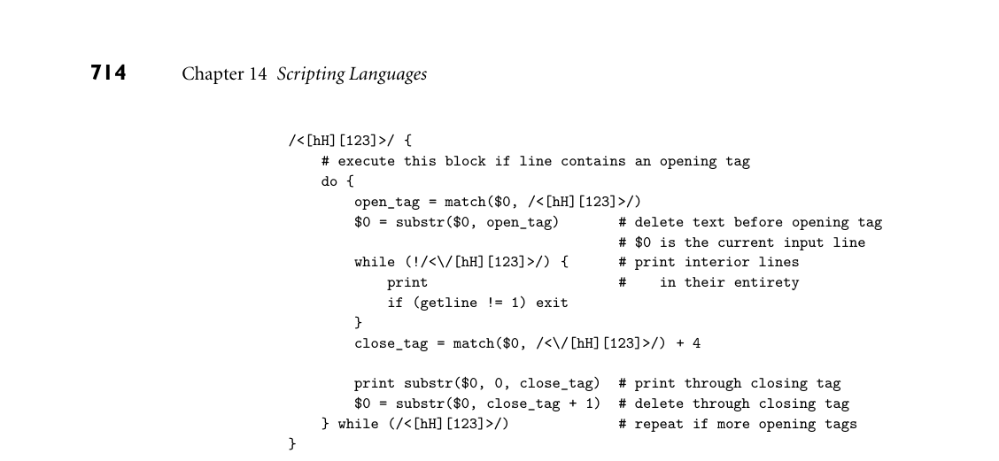
*Figure 14.2 Script in awk to extract headers from an HTML file. Unlike the sed script, this version prints interior lines incrementally. It again assumes that the input is well formed.*

sed -e'/^[[:space:]]*$/d'

Here ^ represents the beginning of the line and $ represents the end. The [[:space:]] expression matches any white-space character in the local char- acter set, to be repeated an arbitrary number of times, as indicated by the Kleene star (*). The d indicates deletion. Nondeleted lines are printed by default. ■

Awk

In an attempt to address the limitations of sed, Alfred Aho, Peter Weinberger, and Brian Kernighan designed awk in 1977 (the name is based on the initial letters of their last names). Awk is in some sense an evolutionary link between stream editors like sed and full-fledged scripting languages. It retains sed’s line-at-a- time filter model of computation, but allows the user to escape this model when desired, and replaces single-character editing commands with syntax reminiscent of C. Awk provides (typeless) variables and a variety of control-flow constructs, including subroutines. An awk program consists of a sequence of patterns, each of which has an as- sociated action. For every line of input, the interpreter executes, in order, the actions whose patterns evaluate to true. An example with a single pattern-action EXAMPLE 14.20

Extracting HTML headers with awk pair appears in Figure 14.2. It performs essentially the same task as the sed script of Figure 14.1. Lines that contain no opening tag are ignored. In a line with an opening tag, we delete any text that precedes the header. We then print lines until we find the closing tag, and repeat if there is another opening tag on the same line. We fall back into the interpreter’s main loop when we’re cleanly outside any header. Several conventions can be seen in this example. The current input line is available in the pseudovariable $0. The getline function reads into this variable

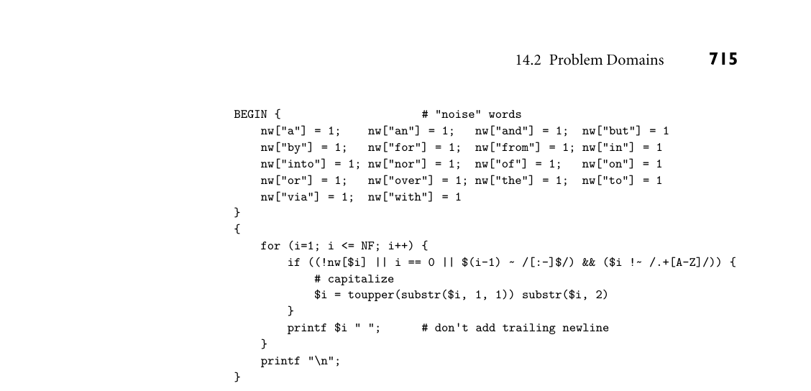
*Figure 14.3 Script in awk to capitalize a title. The BEGIN block is executed before reading any input lines. The main block has no explicit pattern, so it is applied to every input line.*

by default. The substr(s, a, b) function extracts the portion of string s start- ing at position a and with length b. If b is omitted, the extracted portion runs to the end of s. Conditions, like patterns, can use regular expressions; we can see an example in the do ... while loop. By default, regular expressions match against $0. ■ Perhaps the two most important innovations of awk are fields and associative arrays, neither of which appears in Figure 14.2. Like the shell, awk parses each input line into a series of words (fields). By default these are delimited by white space, though the user can change this behavior dynamically by assigning a regu- lar expression to the built-in variable FS (field separator). The fields of the current input line are available in the pseudovariables $1, $2, .... The built-in variable NR gives the total number of fields. Awk is frequently used for field-based one-line programs. The following, for example, will print the second word of every line of EXAMPLE 14.21

Fields in awk standard input:

awk '{ print $2 }' ■

Associative arrays will be considered in more detail in Section 14.4.3. Briefly, they combine the functionality of hash tables with the syntax of arrays. We can EXAMPLE 14.22

Capitalizing a title in awk illustrate both fields and associative arrays with an example script (Figure 14.3) that capitalizes each line of its input as if it were a title. The script declines to modify “noise” words (articles, conjunctions, and short prepositions) unless they are the first word of the title or of a subtitle, where a subtitle follows a word ending with a colon or a dash. The script also declines to modify words in which any letter other than the first is already capitalized. ■

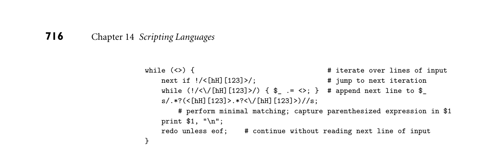
*Figure 14.4 Script in Perl to extract headers from an HTML file. For simplicity we have again adopted the strategy of buffering entire headers, rather than printing them incrementally.*

Perl

Perl was originally developed by Larry Wall in 1987, while he was working at the National Security Agency. The original version was, to first approximation, an at- tempt to combine the best features of sed, awk, and sh. It was a Unix-only tool, meant primarily for text processing (the name stands for “practical extraction and report language”). Over the years Perl grew into a large and complex lan- guage, with an enormous user community. For many years it was clearly the most popular and widely used scripting language, though that lead has more recently been lost to Python, Ruby, and others. Perl is fast enough for much general- purpose use, and includes separate compilation, modularization, and dynamic library mechanisms appropriate for large-scale projects. It has been ported to almost every known operating system. Perl consists of a relatively simple language core, augmented with an enormous number of built-in library functions and an equally enormous number of short- cuts and special cases. A hint at this richness of expression can be found in the standard language reference [CfWO12, p. 722], which lists (only) the 97 built-in functions “whose behavior varies the most across platforms.” The cover of the third edition was emblazoned with the motto: “There’s more than one way to do it.” We will return to Perl several times in this chapter, notably in Sections 14.2.4 and 14.4. For the moment we content ourselves with a simple text-processing EXAMPLE 14.23

Extracting HTML headers with Perl example, again to extract headers from an HTML file (Figure 14.4). We can see several Perl shortcuts in this figure, most of which help to make the code shorter than the equivalent programs in sed (Figure 14.1) and awk (Figure 14.2). Angle brackets (<>) are the “readline” operator, used for text file input. Normally they surround a file handle variable name, but as a special case, empty angle brackets generate as input the concatenation of all files specified on the command line when the script was first invoked (or standard input, if there were no such files). When a readline operator appears by itself in the control expression of a while loop (but nowhere else in the language), it generates its input a line at a time into the pseudovariable $_. Several other operators work on $_ by default. Regular expressions, for example, can be used to search within arbitrary strings, but when none is specified, $_ is assumed.

The next statement is similar to continue in C or Fortran: it jumps to the bottom of the innermost loop and begins the next iteration. The redo statement also skips the remainder of the current iteration, but returns to the top of the loop, without reevaluating the control expression. In our example program, redo allows us to append additional input to the current line, rather than reading a new line. Because end-of-file is normally detected by an undefined return value from <>, and because that failure will happen only once per file, we must explicitly test for eof when using redo here. Note that if and its symmetric opposite, unless, can be used as either a prefix or a postfix test. Readers familiar with Perl may have noticed two subtle but key innovations in the substitution command of line 4 of the script. First, where the expression .* (in sed, awk, and Perl) matches the longest possible string of characters that permits subsequent portions of the match to succeed, the expression .*? in Perl matches the shortest possible such string. This distinction allows us to easily iso- late the first header in a given line. Second, much as sed allows later portions of a regular expression to refer back to earlier, parenthesized portions (line 4 of Figure 14.1), Perl allows such captured strings to be used outside the regular ex- pression. We have leveraged this feature to print matched headers in line 6 of Figure 14.4. In general, the regular expressions of Perl are significantly more pow- erful than those of sed and awk; we will return to this subject in more detail in Section 14.4.2. ■

14.2.3 Mathematics and Statistics

As we noted in our discussions of sed and awk, one of the distinguishing charac- teristics of text processing and report generation is the frequent use of “one-line programs” and other simple scripts. Anyone who has ever entered formulas in the cells of a spreadsheet realizes that similar needs arise in mathematics and statis- tics. And just as shell and report generation tools have evolved into powerful languages for general-purpose computing, so too have notations and tools for mathematical and statistical computing. In Section 8.2.1 (“Slices and Array Operations”), we mentioned APL, one of the more unusual languages of the 1960s. Originally conceived as a pen-and- paper notation for teaching applied mathematics, APL retained its emphasis on the concise, elegant expression of mathematical algorithms when it evolved into a programming language. Though it lacked both easy access to other programs and sophisticated string manipulation, APL displayed all the other characteristics of scripting described in Section 14.1.1, and one sometimes finds it listed as a scripting language. The modern successors to APL include a trio of commercial packages for math- ematical computing: Maple, Mathematica, and Matlab. Though their design philosophies differ, each provides extensive support for numerical methods, sym- bolic mathematics (formula manipulation), data visualization, and mathematical

modeling. All three provide powerful scripting languages, with a heavy orienta- tion toward scientific and engineering applications. As the “3 Ms” are to mathematical computing, so the S and R languages are to statistical computing. Originally developed at Bell Labs by John Chambers and colleagues in the late 1970s, S is a commercial package widely used in the statistics community and in quantitative branches of the social and behavioral sciences. R is an open-source alternative to S that is largely though not entirely compatible with its commercial cousin. Among other things, R supports multidimensional array and list types, array slice operations, user-defined infix operators, call-by- need parameters, first-class functions, and unlimited extent.

14.2.4 “Glue” Languages and General-Purpose Scripting

From their text-processing ancestors, scripting languages inherit a rich set of pat- tern matching and string manipulation mechanisms. From command interpreter shells they inherit a wide variety of additional features including simple syntax; flexible typing; easy creation and management of subprograms, with I/O redirec- tion and access to completion status; file queries; easy interactive and file-based I/O; easy access to command-line arguments, environment strings, process iden- tifiers, time-of-day clock, and so on; and automatic interpreter start-up (the #! convention). As noted in Section 14.1.1, many scripting languages have inter- preters that will accept commands interactively. The combination of shell and text-processing mechanisms allows a scripting language to prepare input to, and parse output from, subsidiary processes. As a EXAMPLE 14.24

“Force quit” script in Perl simple example, consider the (Unix-specific) “force quit” Perl script shown in Fig- ure 14.5. Invoked with a regular expression as argument, the script identifies all of the user’s currently running processes whose name, process id, or command-line arguments match that regular expression. It prints the information for each, and prompts the user for an indication of whether the process should be killed. The second line of the code starts a subsidiary process to execute the Unix ps command. The command-line arguments cause ps to print the process id and name of all processes owned by the current user, together with their full command-line arguments. The pipe symbol (|) at the end of the command in- dicates that the output of ps is to be fed to the script through the PS file handle. The main while loop then iterates over the lines of this output. Within the loop, the if condition matches each line against $ARGV[0], the regular expression pro- vided on the script’s command line. It also compares the first word of the line (the process id) against $$, the id of the Perl interpreter currently running the script. Scalar variables (which in Perl include strings) begin with a dollar sign ($). Arrays begin with an at sign (@). In the first line of the while loop in Figure 14.5, the input line ($_, implicitly) is split into space-separated words, which are then assigned into the array @words. In the following line, $words[0] refers to the first element of this array, a scalar. A single variable name may have different values when interpreted as a scalar, an array, a hash table, a subroutine, or a file

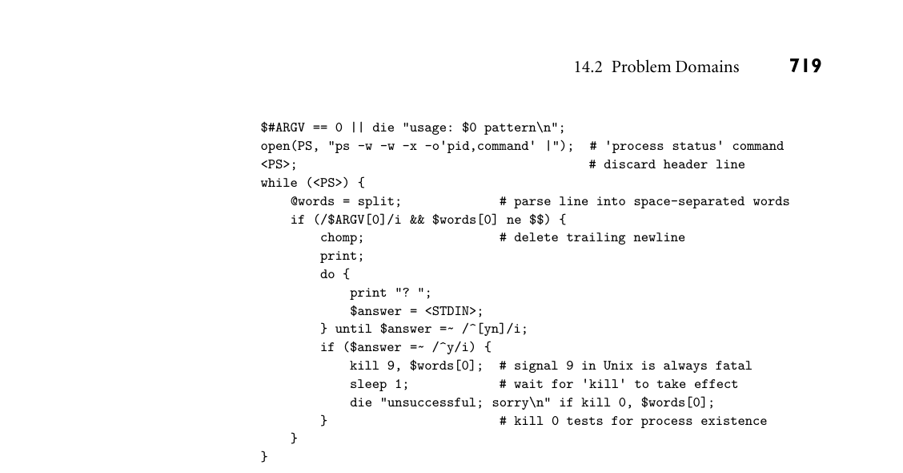
*Figure 14.5 Script in Perl to “force quit” errant processes. Perl’s text processing features allow us to parse the output of ps, rather than filtering it through an external tool like sed or awk.*

handle. The choice of interpretation depends on the leading punctuation mark and on the context in which the name appears. We shall have more to say about context in Perl in Section 14.4.3. ■ Beyond the combination of shell and text-processing mechanisms, the typi- cal glue language provides an extensive library of built-in operations to access features of the underlying operating system, including files, directories, and I/O; processes and process groups; protection and authorization; interprocess com- munication and synchronization; timing and signals; and sockets, name service, and network communication. Just as text-processing mechanisms minimize the need to employ external tools like sed, awk, and grep, operating system builtins minimize the need for other external tools. At the same time, scripting languages have, over time, developed a rich set of features for internal computation. Most have significantly better support for mathematics than is typically found in a shell. Several, including Scheme, Python, and Ruby, support arbitrary precision arithmetic. Most provide extensive support for higher-level types, including arrays, strings, tuples, lists, and hashes (associa- tive arrays). Several support classes and object orientation. Some support itera- tors, continuations, threads, reflection, and first-class and higher-order functions. Some, including Perl, Python, and Ruby, support modules and dynamic loading, for “programming in the large.” These features serve to maximize the amount of code that can be written in the scripting language itself, and to minimize the need to escape to a more traditional, compiled language.

In summary, the philosophy of general-purpose scripting is to make it as easy as possible to construct the overall framework of a program, escaping to exter- nal tools only for special-purpose tasks, and to compiled languages only when performance is at a premium.

Python

As noted in Section 14.1, Rexx is generally considered the first of the general- purpose scripting languages, predating Perl and Tcl by almost a decade. Perl and Tcl are roughly contemporaneous: both were initially developed in the late 1980s. Perl was originally intended for glue and text-processing applications. Tcl was originally an extension language, but soon grew into glue applications as well. As the popularity of scripting grew in the 1990s, users were motivated to develop additional languages, to provide additional features, address the needs of specific application domains (more on this in subsequent sections), or support a style of programming more in keeping with the personal taste of their designers. Python was originally developed by Guido van Rossum at CWI in Amsterdam, the Netherlands, in the early 1990s. He continued his work at CNRI in Reston, Virginia, beginning in 1995. After a series of subsequent moves, he joined Google in 2005. Recent versions of the language are owned by the Python Software Foun- dation. All releases are open source. Figure 14.6 presents a Python version of the “force quit” program from Exam- EXAMPLE 14.25

“Force quit” script in Python ple 14.24. Reflecting the maturation of programming language design, Python was from the beginning an object-oriented language.2 It includes a standard li- brary as rich as that of Perl, but partitioned into a collection of namespaces rem- iniscent of those of C++, Java, or C#. The first line of our script imports symbols from the os, re, subprocess, sys, and time library modules. The fifth line launches ps as an external program, and arranges for its output to be available to the script through a Unix pipe. We discard the initial (header) line of output from the subprocess by calling the output pipe’s readline method. We then use a Python for loop to iterate over the remaining lines. Perhaps the most distinctive feature of Python, though hardly the most impor- tant, is its reliance on indentation for syntactic grouping. Python not only uses line breaks to separate commands; it also specifies that the body of a structured statement consists of precisely those subsequent statements that are indented one more tab stop. Like the “more than one way to do it” philosophy of Perl, Python’s use of indentation tends to arouse strong feelings among users: some strongly positive, some strongly negative. The regular expression (re) library has all of the power available in Perl, but employs the somewhat more verbose syntax of method calls, rather than the built- in notation of Perl. The search routine returns a “match object” that captures,

2 Rexx and Tcl have object-oriented extensions, named Object Rexx and Incr Tcl, respectively. Perl 5 includes some (rather awkward) object-oriented features; Perl 6 will have more uniform object support.

*Figure 14.6 Script in Python 3 to “force quit” errant processes. Compare with Figure 14.5.*

lazily, the places in the string at which the pattern appears. If no match is found, search returns None, the empty object, instead. In a condition, None is inter- preted as false, while a true match object is interpreted as true. The match object in turn supports a variety of methods, including group, which returns the sub- string corresponding to the first match. The re.I flag to search indicates case insensitivity. Note that group returns a string. Unlike Perl and Tcl, Python will not coerce this to an integer—hence the need for the explicit type conversion on the second line of the body of the for loop. As in Perl, the readline method does not remove the newline character at the end of an input line; we use the rstrip method to do this. The print function adds a newline to the end of its argument list unless given a different end string. Unless explicitly instructed to flush, it also tends to buffer its output, waiting to call the OS until it has a large amount of data; this needs to be defeated for interactive IO. The sleep and kill routines are available as library built-ins in Python, much as they are in Perl; there is no need to start a separate program. When given a signal number of 0, kill tests for process existence. Instead of returning a status code, however, as it does in Perl, Python’s kill throws an exception if the process does not exist. We use a try block to catch this exception in the expected case. ■

While our “force quit” program may convey, at least in part, the “feel” of Perl and Python, it cannot capture the breadth of their capabilities. Python in- cludes many of the more interesting features discussed in earlier chapters, includ- ing nested functions with static scoping, lambda expressions and higher-order functions, true iterators, list comprehensions, array slice operations, reflection, structured exception handling, multiple inheritance, and modules and dynamic loading. Many of these also appear in Ruby.

Ruby

Ruby was developed in Japan in the early 1990s by Yukihiro “Matz” Matsumoto. Matz writes that he “wanted a language more powerful than Perl, and more object-oriented than Python” [TFH13, Foreword]. The first public release was made available in 1995, and quickly gained widespread popularity in Japan. With the publication in 2001 of English-language documentation [TFH13, 1st ed.], Ruby spread rapidly elsewhere as well. Much of its success can be credited to the Ruby on Rails web-development framework. Originally released by David Heinemeier Hansson in 2004, Rails was subsequently adopted by several major players—notably Apple, which included it in the 10.5 “Leopard” release of the Mac OS, and Twitter, which used it for early versions of their infrastructure. In keeping with Matz’s original motivation, Ruby is a pure object-oriented lan- EXAMPLE 14.26

Method call syntax in Ruby guage, in the sense of Smalltalk: everything—even instances of built-in types—is an object. Integers have more than 25 built-in methods. Strings have more than 75. Smalltalk-like syntax is even supported: 2 * 4 + 5 is syntactic sugar for (2.*(4)).+(5), which is in turn equivalent to (2.send(‚*‚, 4)).send(‚+‚, 5).3 ■ Figure 14.7 presents a Ruby version of our “force quit” program. Newline EXAMPLE 14.27

“Force quit” script in Ruby characters serve to end the current statement, but indentation is not significant. A dollar sign ($) at the beginning of an identifier indicates a global name. Though it doesn’t appear in this example, an at sign (@) indicates an instance variable of the current object. Double at signs (@@) indicate an instance variable of the current class. Probably the most distinctive feature of Figure 14.7 is its use of blocks and it- erators. The IO.popen class method takes as argument a string that specifies the name and arguments of an external program. The method also accepts, in a man- ner reminiscent of Smalltalk, an associated block, specified as a multiline fragment of Ruby code delimited with curly braces. The associated block is essentially an extra parameter to popen, passed as a closure. The closure is invoked by popen, passing as parameter a file handle (an object of class IO) that represents the out- put of the external command. The |ps| at the beginning of the block specifies the name by which this handle is known within the block. In a similar vein, the each

3 Parentheses here are significant. Infix arithmetic follows conventional precedence rules, but method invocation proceeds from left to right. Likewise, parentheses can be omitted around ar- gument lists, but the method-selecting dot (.) groups more tightly than the argument-separating comma (,), so 2.send ’*’, 4.send ’+’, 5 evaluates to 18, not 13.

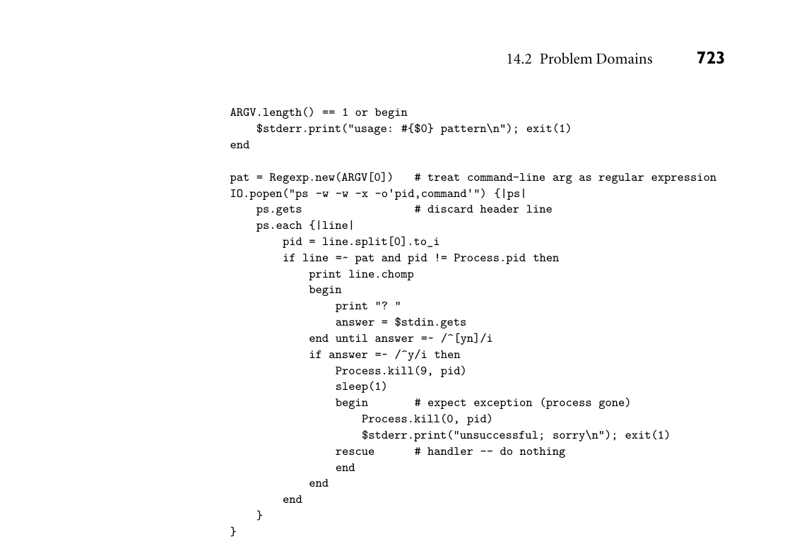
*Figure 14.7 Script in Ruby to “force quit” errant processes. Compare with Figures 14.5 and 14.6.*

method of object ps is an iterator that invokes the associated block (the code in braces beginning with |line|) once for every line of data. For those more com- fortable with traditional for loop syntax, the iterator can also be written

for line in PS ... end

In addition to (true) iterators, Ruby provides continuations, first-class and higher-order functions, and closures with unlimited extent. Its module mech- anism supports an extended form of mix-in inheritance. Though a class cannot inherit data members from a module, it can inherit code. Run-time type checking makes such inheritance more or less straightforward. Methods of modules that have not been explicitly included into the current class can be accessed as qual- ified names; Process.kill is an example in Figure 14.7. Methods sleep and exit belong to module Kernel, which is included by class Object, and is thus available everywhere without qualification. Like popen, they are class methods,

rather than instance methods; they have no notion of “current object.” Variables stdin and stderr refer to global objects of class IO. Regular expression operations in Ruby are methods of class Regexp, and can be invoked with standard object-oriented syntax. For convenience, Perl-like nota- tion is also supported as syntactic sugar; we have used this notation in Figure 14.7. The rescue clause of the innermost begin ... end block is an exception han- dler. As in the Python code of Figure 14.6, it allows us to determine whether the kill operation has succeeded by catching the (expected) exception that arises when we attempt to refer to a process after it has died. ■

14.2.5 Extension Languages

Most applications accept some sort of commands, which tell them what to do. Sometimes these commands are entered textually; more often they are triggered by user interface events such as mouse clicks, menu selections, and keystrokes. Commands in a graphical drawing program might save or load a drawing; select, insert, delete, or modify its parts; choose a line style, weight, or color; zoom or rotate the display; or modify user preferences. An extension language serves to increase the usefulness of an application by al- lowing the user to create new commands, generally using the existing commands as building blocks. Extension languages are widely regarded as an essential feature of sophisticated tools. Adobe’s graphics suite (Illustrator, Photoshop, InDesign, etc.) can be extended (scripted) using JavaScript, Visual Basic (on Windows), or AppleScript (on the Mac). Disney and Industrial Light & Magic use Python to extend their internal (proprietary) tools. The computer gaming industry makes heavy use of Lua for scripting of both commercial and open-source game en- gines. Many commercially available tools, including AutoCAD, Maya, Director, and Flash, have their own unique scripting languages. This list barely scratches the surface. To admit extension, a tool must

incorporate, or communicate with, an interpreter for a scripting language. provide hooks that allow scripts to call the tool’s existing commands. allow the user to tie newly defined commands to user interface events.

With care, these mechanisms can be made independentof any particular scripting language. Microsoft’s Windows Script interface allows almost any language to be used to script the operating system, web server, and browser. GIMP, the widely used GNU Image Manipulation Program, has a comparably general interface: it comes with a built-in interpreter for a dialect of Scheme, and supports plug-ins (externally provided interpreter modules) for Perl and Tcl, among others. There is a tendency, of course, for user communities to converge on a favorite language, to facilitate sharing of code. Microsoft tools are usually scripted with PowerShell; GIMP with Scheme; Adobe tools with Visual Basic on the PC, or AppleScript on the Mac.

*Figure 14.8 Emacs Lisp function to number the lines in a selected region of text.*

One of the oldest existing extension mechanisms is that of the emacs text ed- itor, used to write this book. An enormous number of extension packages have been created for emacs; many of them are installed by default in the standard distribution. In fact much of what users consider the editor’s core functionality is actually provided by extensions; the truly built-in parts are comparatively small. The extension language for emacs is a dialect of Lisp called Emacs Lisp, or EXAMPLE 14.28

Numbering lines with Emacs Lisp elisp, for short. An example script appears in Figure 14.8. It assumes that the user has used the standard marking mechanism to select a region of text. It then inserts a line number at the beginning of every line in the region. The first line is numbered 1 by default, but an alternative starting number can be specified with an optional parameter. Line numbers are bracketed with a prefix and suffix that are “ ” (empty) and “) ” by default, but can be changed by the user if desired. To maintain existing alignment, small numbers are padded on the left with enough spaces to match the width of the number on the final line. Many features of Emacs Lisp can be seen in this example. The setq-default command is an assignment that is visible in the current buffer (editing session) and in any concurrent buffers that haven’t explicitly overridden the previous value. The defun command defines a new command. Its arguments are, in or- der, the command name, formal parameter list, documentation string, interactive specification, and body. The argument list for number-region includes the start and end locations of the currently marked region, and the optional initial line number. The documentation string is automatically incorporated into the on-

line help system. The interactive specification controls how arguments are passed when the command is invoked through the user interface. (The command can also be called from other scripts, in which case arguments are passed in the con- ventional way.) The “*” raises an exception if the buffer is read-only. The “r” represents the beginning and end of the currently marked region. The “\n” sep- arates the “r” from the following “p,” which indicates an optional numeric prefix argument. When the command is bound to a keystroke, a prefix argument of, say, 10 can be specified by preceding the keystroke with “C-u 10” (control-U 10). As usual in Lisp, the let* command introduces a set of local variables in which later entries in the list (fmt) can refer to earlier entries (num-lines). A marker is an index into the buffer that is automatically updated to maintain its position when text is inserted in front of it. We create the finish marker so that newly in- serted line numbers do not alter our notion of where the to-be-numbered region ends. We set finish to nil at the end of the script to relieve emacs of the need to keep updating the marker between now and whenever the garbage collector gets around to reclaiming it. The format command is similar to sprintf in C. We have used it, once in the declaration of fmt and again in the call to insert, to pad all line numbers out to an appropriate length. The save-excursion command is roughly equivalent to an exception handler (e.g., a Java try block) with a finally clause that restores the current focus of attention ((point)) and the borders of the marked region. Our script can be supplied to emacs by including it in a personal start-up file (usually ~/.emacs), by using the interactive load-file command to read some other file in which it resides, or by loading it into a buffer, placing the focus of attention immediately after it, and executing the interactive eval-last-sexp command. Once any of these has been done, we can invoke our command in- teractively by typing M-x number-region <RET> (meta-X, followed by the com- mand name and the return key). Alternatively, we can bind our command to a keyboard shortcut:

(define-key global-map [?\C-#] 'number-region)

This one-line script, executed in any of the ways described above, binds our number-region command to key combination “control-number-sign”. ■

3CHECK YOUR UNDERSTANDING 11. What is meant by the pattern space in sed? 12. Briefly describe the fields and associative arrays of awk.

13. In what ways did even early versions of Perl improve on sed and awk? 14. Explain the special relationship between while loops and file handles in Perl. What is the meaning of the empty file handle, <>? 15. Name three widely used commercial packages for mathematical computing.

16. List several distinctive features of the R statistical scripting language.

17. Explain the meaning of the $ and @ characters at the beginning of variable names in Perl. Explain the different meanings of $, @, and @@ in Ruby.

18. Which of the languages described in Section 14.2.4 uses indentation to control syntactic grouping?

19. List several distinctive features of Python. 20. Describe, briefly, how Ruby uses blocks and iterators.

21. What capabilities must a scripting language provide in order to be used for extension?

22. Name several commercial tools that use extension languages.

14.3 Scripting the World Wide Web

Much of the content of the World Wide Web—particularly the content that is vis- ible to search engines—is static: pages that seldom, if ever, change. But hypertext, the abstract notion on which the Web is based, was always conceived as a way to represent “the complex, the changing, and the indeterminate” [Nel65]. Much of the power of the Web today lies in its ability to deliver pages that move, play sounds, respond to user actions, or—perhaps most important—contain infor- mation created or formatted on demand, in response to the page-fetch request. From a programming languages point of view, simple playback of recorded audio or video is not particularly interesting. We therefore focus our attention here on content that is generated on the fly by a program—a script—associated with an Internet URI (uniform resource identifier).4 Suppose we type a URI into a browser on a client machine, and the browser sends a request to the appropriate web server. If the content is dynamically created, an obvious first question is: does the script that creates it run on the server or the client machine? These options are known as server-side and client-side web scripting, respectively. Server-side scripts are typically used when the service provider wants to re- tain complete control over the content of the page, but can’t (or doesn’t want to) create the content in advance. Examples include the pages returned by search engines, Internet retailers, auction sites, and any organization that provides its clients with on-line access to personal accounts. Client-side scripts are typically used for tasks that don’t need access to proprietary information, and are more

4 The term “URI” is often used interchangeably with “URL” (uniform resource locator), but the World Wide Web Consortium distinguishes between the two. All URIs are hierarchical (multi- part) names. URLs are one kind of URIs; they use a naming scheme that indicates where to find the resource. Other URIs can use other naming schemes.

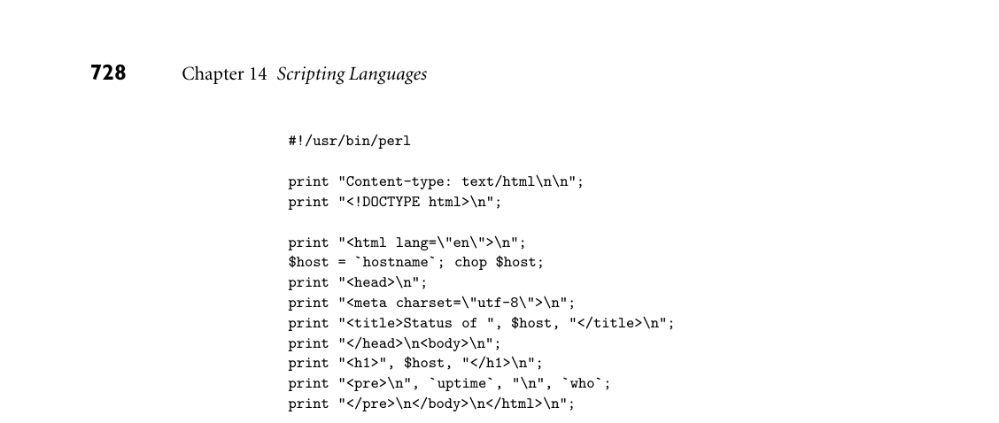
*Figure 14.9 A simple CGI script in Perl. If this script is named status.perl, and is installed in the server’s cgi-bin directory, then a user anywhere on the Internet can obtain summary statistics and a list of users currently logged into the server by typing hostname/cgi-bin/status.perl into a browser window.*

efficient if executed on the client’s machine. Examples include interactive anima- tion, error-checking of fill-in forms, and a wide variety of other self-contained calculations.

14.3.1 CGI Scripts

The original mechanism for server-side web scripting was the Common Gateway Interface (CGI). A CGI script is an executable program residing in a special di- rectory known to the web server program. When a client requests the URI corre- sponding to such a program, the server executes the program and sends its output back to the client. Naturally, this output needs to be something that the browser will understand—typically HTML. CGI scripts may be written in any language available on the server’s machine, though Perl is particularly popular: its string-handling and “glue” mechanisms are ideally suited to generating HTML, and it was already widely available during the early years of the Web. As a simple if somewhat artificial example, suppose we EXAMPLE 14.29

Remote monitoring with a CGI script would like to be able to monitor the status of a server machine shared by some community of users. The Perl script in Figure 14.9 creates a web page titled by the name of the server machine, and containing the output of the uptime and who commands (two simple sources of status information). The script’s initial print command produces an HTTP message header, indicating that what follows is HTML. Sample output from executing the script appears in Figure 14.10. ■ CGI scripts are commonly used to process on-line forms. A simple example EXAMPLE 14.30

Adder web form with a CGI script appears in Figure 14.11. The form element in the HTML file specifies the URI of the CGI script, which is invoked when the user hits the Submit button. Values previously entered into the input fields are passed to the script either as a trailing

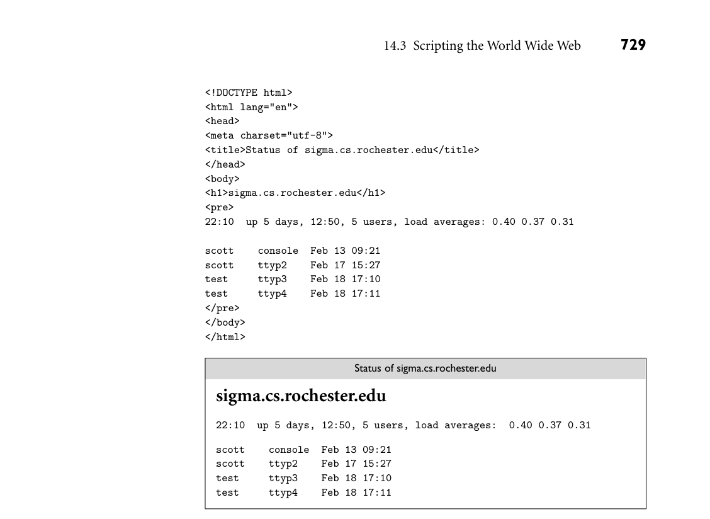
*Figure 14.10 Sample output from the script of Figure 14.9. HTML source appears at top; the rendered page is below.*

part of the URI (for a get-type form) or on the standard input stream (for a post-type form, shown here).5 With either method, we can access the values using the param routine of the standard CGI Perl library, loaded at the beginning of our script. ■

14.3.2 Embedded Server-Side Scripts

Though widely used, CGI scripts have several disadvantages:

5 One typically uses post type forms for one-time requests. A get type form appears a little clumsier, because arguments are visibly embedded in the URI, but this gives it the advantage of repeatability: it can be “bookmarked” by client browsers.

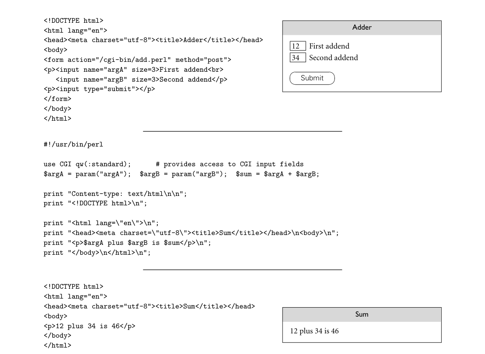
*Figure 14.11 An interactive CGI form. Source for the original web page is shown at the upper left, with the rendered page to the right. The user has entered 12 and 34 in the text fields. When the Submit button is pressed, the client browser sends a request to the server for URI /cgi-bin/add.perl. The values 12 and 13 are contained within the request. The Perl script, shown in the middle, uses these values to generate a new web page, shown in HTML at the bottom left, with the rendered page to the right.*

The web server must launch each script as a separate program, with potentially significant overhead (though a CGI script compiled to native code can be very fast once running). Because the server has little control over the behavior of a script, scripts must generally be installed in a trusted directory by trusted system administrators; they cannot reside in arbitrary locations as ordinary pages do.

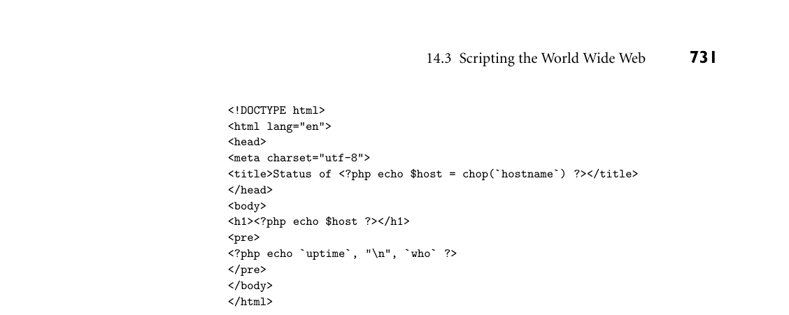
*Figure 14.12 A simple PHP script embedded in a web page. When served by a PHP-enabled host, this page performs the equivalent of the CGI script of Figure 14.9.*

The name of the script appears in the URI, typically prefixed with the name of the trusted directory, so static and dynamic pages look different to end users. Each script must generate not only dynamic content but also the HTML tags that are needed to format and display it. This extra “boilerplate” makes scripts more difficult to write.

To address these disadvantages, most web servers provide a “module-loading” mechanism that allows interpreters for one or more scripting languages to be incorporated into the server itself. Scripts in the supported language(s) can then be embedded in “ordinary” web pages. The web server interprets such scripts directly, without launching an external program. It then replaces the scripts with the output they produce, before sending the page to the client. Clients have no way to even know that the scripts exist. Embeddable server-side scripting languages include PHP, PowerShell (in Mi- crosoft Active Server Pages), Ruby, Cold Fusion (from Macromedia Corp.), and Java (via “Servlets” in Java Server Pages). The most common of these is PHP. Though descended from Perl, PHP has been extensively customized for its target domain, with built-in support for (among other things) e-mail and MIME en- coding, all the standard Internet communication protocols, authentication and security, HTML and URI manipulation, and interaction with dozens of database systems. The PHP equivalent of Figure 14.9 appears in Figure 14.12. Most of the text EXAMPLE 14.31

Remote monitoring with a PHP script in this figure is standard HTML. PHP code is embedded between <?php and ?> delimiters. These delimiters are not themselves HTML; rather, they indicate a processing instruction that needs to be executed by the PHP interpreter to generate replacement text. The “boilerplate” parts of the page can thus appear verbatim; they need not be generated by print (Perl) or echo (PHP) commands. Note that the separate script fragments are part of a single program. The $host variable, for example, is set in the first fragment and used again in the second. ■

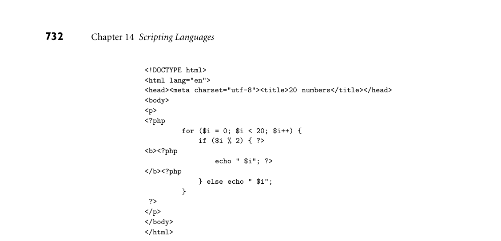
*Figure 14.13 A fragmented PHP script. The if and for statements work as one might expect, despite the intervening raw HTML. When requested by a browser, this page displays the numbers from 0 to 19, with odd numbers written in bold.*

PHP scripts can even be broken into fragments in the middle of structured EXAMPLE 14.32

A fragmented PHP script statements. Figure 14.13 contains a script in which if and for statements span fragments. In effect, the HTML text between the end of one script fragment and the beginning of the next behaves as if it had been output by an echo command. Web designers are free to use whichever approach (echo or escape to raw HTML) seems most convenient for the task at hand. ■

Self-Posting Forms

By changing the action attribute of the FORM element, we can arrange for the EXAMPLE 14.33

Adder web form with a PHP script Adder page of Figure 14.11 to invoke a PHP script instead of a CGI script:

<form action="add.php" method="post">

The PHP script itself is shown in the top half of Figure 14.14. Form values are made available to the script in an associative array (hash table) named _REQUEST. No special library is required. ■ Because our PHP script is executed directly by the web server, it can safely EXAMPLE 14.34

Self-posting Adder web form reside in an arbitrary web directory, including the one in which the Adder page resides. In fact, by checking to see how a page was requested, we can merge the form and the script into a single page, and let it service its own requests! We illustrate this option in the bottom half of Figure 14.14. ■

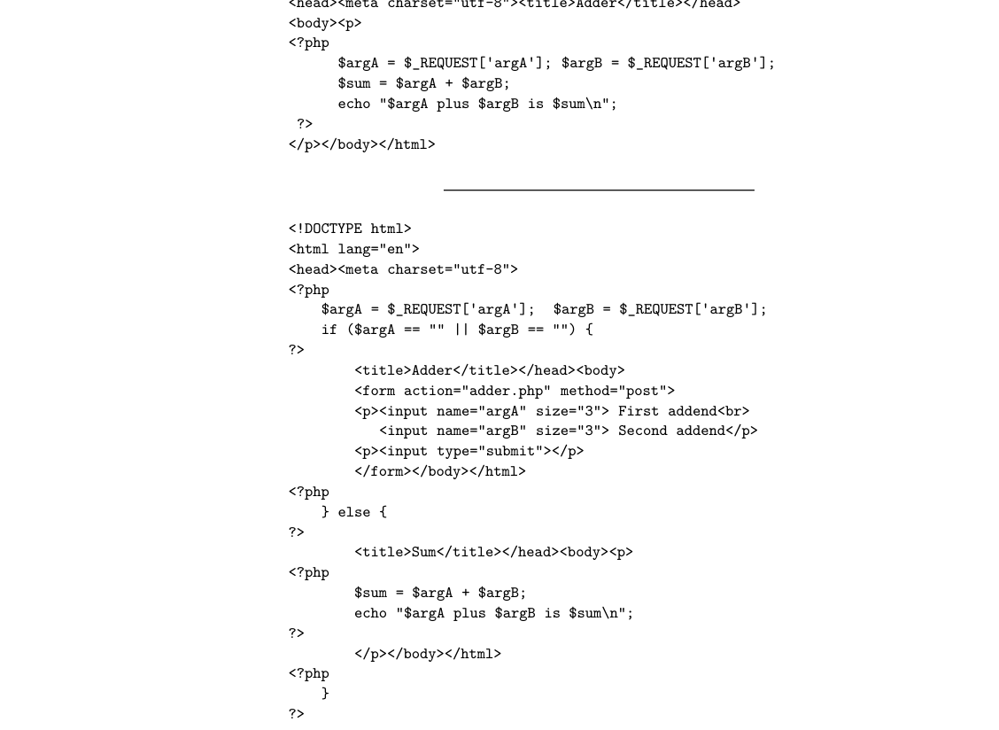
*Figure 14.14 An interactive PHP web page. The script at top could be used in place of the script in the middle of Figure 14.11. The lower script in the current figure replaces both the web page at the top and the script in the middle of Figure 14.11. It checks to see if it has received a full set of arguments. If it hasn’t, it displays the fill-in form; if it has, it displays results.*

14.3.3 Client-Side Scripts

While embedded server-side scripts are generally faster than CGI scripts, at least when start-up cost predominates, communication across the Internet is still too slow for truly interactive pages. If we want the behavior or appearance of the page to change as the user moves the mouse, clicks, types, or hides or exposes windows, we really need to execute some sort of script on the client’s machine. Because they run on the web designer’s site, CGI scripts and, to a lesser extent, embeddable server-side scripts can be written in many different languages. All the client ever sees is standard HTML. Client-side scripts, by contrast, require an interpreter on the client’s machine. By virtue of having been “in the right place at the right time” historically, JavaScript is supported with at least some degree of consistency by almost all of the world’s web browsers. Given the number of legacy browsers still running, and the difficulty of convincing users to upgrade or to install new plug-ins, pages intended for use outside a limited domain (e.g., the desktops of a single company) almost always use JavaScript for interactive features. Figure 14.15 shows a page with embedded JavaScript that imitates (on the EXAMPLE 14.35

Adder web form in JavaScript client) the behavior of the Adder scripts of Figures 14.11 and 14.14. Function doAdd is defined in the header of the page so it is available throughout. In partic- ular, it will be invoked when the user clicks on the Calculate button. By default, the input values are character strings; we use the parseInt function to convert them to integers. The parentheses around (argA + argB) in the final assign- ment statement then force the use of integer addition. The other occurrences of + are string concatenation. To disable the usual mechanism whereby input data are submitted to the server when the user hits the enter or return key, we have specified a dummy behavior for the onsubmit attribute of the form. Rather than replace the page with output text, as our CGI and PHP scripts did, we have chosen in our JavaScript version to append the output at the bottom. The HTML SPAN element provides a named place in the document where this output can be inserted, and the getElementById JavaScript method provides us with a reference to this element. The HTML Document Object Model (DOM), standard- ized by the World Wide Web Consortium, specifies a very large number of other elements, attributes, and user actions, all of which are accessible in JavaScript. Through them, scripts can, at appropriate times, inspect or alter almost any as- pect of the content, structure, or style of a page. ■

14.3.4 Java Applets and Other Embedded Elements

As an alternative to requiring client-side scripts to interact with the DOM of a web page, many browsers support an embedding mechanism that allows a browser plug-in to assume responsibility for some rectangular region of the page, in which it can then display whatever it wants. In other words, plug-ins are less a matter of scripting the browser than of bypassing it entirely. Historically, plug-ins were

*Figure 14.15 An interactive JavaScript web page. Source appears at left. The rendered version on the right shows the appearance of the page after the user has entered two values and hit the Calculate button, causing the output message to appear. By entering new values and clicking again, the user can calculate as many sums as desired. Each new calculation will replace the output message.*

widely used for content—animations and video in particular—that were poorly supported by HTML. Programs designed to be run by a Java plug-in are commonly known as ap- plets. Consider, for example, an applet to display a clock with moving hands. EXAMPLE 14.36

Embedding an applet in a web page Legacy browsers have supported several different applet tags, but as of HTML5 the standard syntax looks like this:

<embed type="application/x-java-applet" code="Clock.class">

The type attribute informs the browser that the embedded element is expected to be a Java applet; the code element provides the applet’s URI. Additional attributes can be used to specify such properties as the required interpreter version number and the size of the needed display space. ■ As one might infer from the existence of the type attribute, embed tags can re- quest execution by a wide variety of plug-ins—not just a Java Virtual Machine. As of 2015, the most widely used plug-in is Adobe’s Flash Player. Though scriptable,

Flash Player is more accurately described as a multimedia display engine than a general purpose programming language interpreter. Over time, plug-ins have proven to be a major source of browser security bugs. Almost any nontrivial plug-in requires access to operating system services— network IO, local file space, graphics acceleration, and so on. Providing just enough service to make the plug-in useful—but not enough to allow it to do any harm—has proven extremely difficult. To address this problem, extensive mul- timedia support has been built into the HTML5 standard, allowing the browser itself to assume responsibility for much of what was once accomplished with plug- ins. Security is still a problem, but the number of software modules that must be trusted—and the number of points at which an attacker might try to gain entrance—is significantly reduced. Many browsers now disable Java by default. Some disable Flash as well.

14.3.5 XSLT

Most readers will undoubtedly have had the opportunity to write, or at least to read, the HTML (hypertext markup language) used to compose web pages. HTML has, for the most part, a nested structure in which fragments of docu- ments (elements) are delimited by tags that indicate their purpose or appearance. We saw in Section 14.2.2, for example, that top-level headings are delimited with <h1> and </h1>. Unfortunately, as a result of the chaotic and informal way in which the Web evolved, HTML ended up with many inconsistencies in its design, and incompatibilities among the versions implemented by different vendors.

DESIGN & IMPLEMENTATION

14.5 JavaScript and Java Despite its name, JavaScript has no connection to Java beyond some superficial syntactic similarity. The language was originally developed by Brendan Eich at Netscape Corp. in 1995. Eich called his creation LiveScript, but the company chose to rename it as part of a joint marketing agreement with Sun Microsys- tems, prior to its public release. Trademark on the JavaScript name is actually owned by Oracle, which acquired Sun in 2010. Netscape’s browser was the market leader in 1995, and JavaScript usage grew extremely fast. To remain competitive, developers at Microsoft added JavaScript support to Internet Explorer, but they used the name JScript in- stead, and they introduced a number of incompatibilities with the Netscape version of the language. A common version was standardized as ECMAScript by the European standards body in 1997 (and subsequently by the ISO), but major incompatibilities remained in the Document Object Models provided by different browsers. These have been gradually resolved through a series of standards from the World Wide Web Consortium, but legacy pages and legacy browsers continue to plague web developers.

XML (extensible markup language) is a more recent and general language in which to capture structured data. Compared to HTML, its syntax and seman- tics are more regular and consistent, and more consistently implemented across platforms. It is extensible, meaning that users can define their own tags. It also makes a clear distinction between the content of a document (the data it captures) and the presentation of that data. Presentation, in fact, is deferred to a compan- ion standard known as XSL (extensible stylesheet language). XSLT is a portion of XSL devoted to transforming XML: selecting, reorganizing, and modifying tags and the elements they delimit—in effect, scripting the processing of data repre- sented in XML.

DESIGN & IMPLEMENTATION

14.6 How far can you trust a script? Security becomes an issue whenever code is executed using someone else’s re- sources. On a hosting machine, web servers are usually installed with very lim- ited access rights, and with only a limited view of the host’s file system. This strategy limits the set of pages accessible through the server to a well-defined subset of what would be visible to users logged into the hosting machine di- rectly. By contrast, CGI scripts are separate executable programs, and can po- tentially run with the privileges of whoever installs them. To prevent users on the hosting machine from accidentally or intentionally passing their privileges to arbitrary users on the Internet, most system administrators configure their machines so that CGI scripts must reside in a special directory, and be installed by a trusted user. Embedded server-side scripts can reside in any file because they are guaranteed to run with the (limited) rights of the server itself. A larger risk is posed by code downloaded over the Internet and executed on a client machine. Because such code is in general untrusted, it must be executed in a carefully controlled environment, sometimes called a sandbox, to prevent it from doing any damage. As a general rule, embedded JavaScript cannot access the local file system, memory management system, or network, nor can it manipulate documents from other sites. Java applets, likewise, have only limited ability to access external resources. Reality is a bit more compli- cated, of course: Sometimes, a script needs access to, say, a temporary file of limited size, or a network connection to a trusted server. Mechanisms exist to certify sites as trusted, or to allow a trusted site to certify the trustworthiness of pages from other sites. Scripts on pages obtained through a trusted mecha- nism may then be given extended rights. Such mechanisms must be used with care. Finding the right balance between security and functionality remains one of the central challenges of the Web, and of distributed computing in general. (More on this topic can be found in Section 16.2.4, and in Explorations 16.19 and 16.20.)

IN MORE DEPTH

XML can be used to create specialized markup languages for a very wide range of application domains. XHTML is an almost (but not quite) backward compatible variant of HTML that conforms to the XML standard. Web tools are increasingly being designed to generate XHTML. On the companion site, we consider a variety of topics related to XML, with a particular emphasis on XSLT. We elaborate on the distinction between content and presentation, introduce the general notion of stylesheet languages, and de- scribe the document type definitions (DTDs) and schemas used to define domain- specific applications of XML, using XHTML as an example. Because tags are required to nest, an XML document has a natural tree-based structure. XSLT is designed to process these trees via recursive traversal. Though it can be used for almost any task that takes XML as input, perhaps its most com- mon use is to transform XML into formatted output—often XHTML to be pre- sented in a browser. As an extended example, we consider the formatting of an XML-based bibliographic database.

3CHECK YOUR UNDERSTANDING 23. Explain the distinction between server-side and client-side web scripting.

24. List the tradeoffs between CGI scripts and embedded PHP. 25. Why are CGI scripts usually installed only in a special directory?

26. Explain how a PHP page can service its own requests. 27. Why might we prefer to execute a web script on the server rather than the client? Why might we sometimes prefer the client instead? 28. What is the HTML Document Object Model? What is its significance for client- side scripting? 29. What is the relationship between JavaScript and Java?

30. What is an applet? Why applets are usually not considered an example of scripting?

31. What is HTML? XML? XSLT? How are they related to one another?

14.4 Innovative Features

In Section 14.1.1, we listed several common characteristics of scripting languages:

2. Economy of expression 3. Lack of declarations; simple scoping rules 4. Flexible dynamic typing 5. Easy access to other programs 6. Sophisticated pattern matching and string manipulation 7. High-level data types

Several of these are discussed in more detail in the subsections below. Specifi- cally, Section 14.4.1 considers naming and scoping in scripting languages; Sec- tion 14.4.2 discusses string and pattern manipulation; and Section 14.4.3 con- siders data types. Items (1), (2), and (5) in our list, while important, are not particularly difficult or subtle, and will not be considered further here.

14.4.1 Names and Scopes

Most scripting languages (Scheme is the obvious exception) do not require vari- ables to be declared. A few languages, notably Perl and JavaScript, permit optional declarations, primarily as a sort of compiler-checked documentation. Perl can be run in a mode (use strict ‚vars‚) that requires declarations. With or without declarations, most scripting languages use dynamic typing. Values are generally self-descriptive, so the interpreter can perform type checking at run time, or co- erce values when appropriate. Nesting and scoping conventions vary quite a bit. Scheme, Python, JavaScript, and R provide the classic combination of nested subroutines and static (lexical) scope. Tcl allows subroutines to nest, but uses dynamic scoping. Named subrou- tines (methods) do not nest in PHP or Ruby, and they are only sort of nest in Perl (more on this below as well), but Perl and Ruby join Scheme, Python, JavaScript, and R in providing first-class anonymous local subroutines. Nested blocks are statically scoped in Perl. In Ruby, they are part of the named scope in which they appear. Scheme, Perl, Python, Ruby, JavaScript, and R all provide unlimited extent for variables captured in closures. PHP, R, and the major glue languages (Perl, Tcl, Python, Ruby) all have sophisticated namespace mechanisms for infor- mation hiding and the selective import of names from separate modules.

What Is the Scope of an Undeclared Variable?

In languages with static scoping, the lack of declarations raises an interesting question: when we access a variable x, how do we know if it is local, global, or (if scopes can nest) something in-between? Existing languages take several different approaches. In Perl, all variables are global unless explicitly declared. In PHP, they are local unless explicitly imported (and all imports are global, since scopes do not nest). Ruby, too, has only two real levels of scoping, but as we saw in Sec- tion 14.2.4, it distinguishes between them using prefix characters on names: foo is a local variable; $foo is a global variable; @foo is an instance variable of the cur- rent object (the one whose method is currently executing); @@foo is an instance

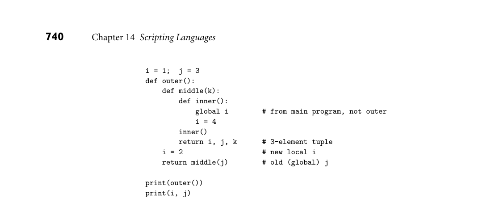
*Figure 14.16 A program to illustrate scope rules in Python. There is one instance each of j and k, but two of i: one global and one local to outer. The scope of the latter is all of outer, not just the portion after the assignment. The global statement provides inner with access to the outermost i, so it can write it without defining a new instance.*

variable of the current object’s class (shared by all sibling instances). (Note: as we shall see in Section 14.4.3, Perl uses similar prefix characters to indicate type. These very different uses are a potential source of confusion for programmers who switch between the two languages.) Perhaps the most interesting scope-resolution rule is that of Python and R. In these languages, a variable that is written is assumed to be local, unless it is explic- itly imported. A variable that is only read in a given scope is found in the closest enclosing scope that contains a defining write. Consider, for example, the Python EXAMPLE 14.37

Scoping rules in Python program of Figure 14.16. Here we have a set of nested subroutines, as indicated by indentation level. The main program calls outer, which calls middle, which in turn calls inner. Before its call, the main program writes both i and j. Outer reads j (to pass it to middle), but does not write it. It does, however, write i. Consequently, outer reads the global j, but has its own i, different from the global one. Middle reads both i and j, but it does not write either, so it must find them in surrounding scopes. It finds i in outer, and j at the global level. Inner, for its part, also writes the global i. When executed, the program prints

(2, 3, 3) 4 3

Note that while the tuple returned from middle (forwarded on by outer, and printed by the main program) has a 2 as its first element, the global i still con- tains the 4 that was written by inner. Note also that while the write to i in outer appears textually after the read of i in middle, its scope extends over all of outer, including the body of middle. ■ Interestingly, there is no way in Python for a nested routine to write a variable that belongs to a surrounding but nonglobal scope. In Figure 14.16, inner could EXAMPLE 14.38

*Figure 14.17 A program to illustrate scope rules in Perl. The my operator creates a statically scoped local variable; the local operator creates a new dynamically scoped instance of a global variable. The static scope extends from the point of declaration to the lexical end of the block; the dynamic scope extends from elaboration to the end of the block’s execution.*

does provide this functionality. Rather than declare i to be global, R uses a “su- perassignment” operator. Where a normal assignment i <- 4 assigns the value 4 into a local variable i, the superassignment i <<- 4 assigns 4 into whatever i would be found under the normal rules of static (lexical) scoping. ■

Scoping in Perl

Perl has evolved over the years. At first, there were only global variables. Locals were soon added for the sake of modularity, so a subroutine with a variable named i wouldn’t have to worry about modifying a global i that was needed elsewhere in the code. Unfortunately, locals were originally defined in terms of dynamic scoping, and the need for backward compatibility required that this behavior be retained when static scoping was added in Perl 5. Consequently, the language provides both mechanisms. Any variable that is not declared is global in Perl by default. Variables declared with the local operator are dynamically scoped. Variables declared with the my operator are statically scoped. The difference can be seen in Figure 14.17, in EXAMPLE 14.39

Static and dynamic scoping in Perl which subroutine outer declares two local variables, lex and dyn. The former is statically scoped; the latter is dynamically scoped. Both are initialized to be a copy of foo’s first parameter. (Parameters are passed in the pseudovariable @_. The first element of this array is $_[0].) Two lexically identical anonymous subroutines are nested inside outer, one before and one after the redeclarations of $lex and $dyn. References to these are

stored in local variables sub_A and sub_B. Because static scopes in Perl extend from a declaration to the end of its block, sub_A sees the global $lex, while sub_B sees outer’s $lex. In contrast, because the declaration of local $dyn occurs before either sub_A or sub_B is called, both see this local version. Our program prints

main 1, 1 outer 2, 2 sub_A 1, 2 sub_B 2, 2 main 1, 1 ■

In cases where static scoping would normally access a variable at an in-between EXAMPLE 14.40

Accessing globals in Perl level of nesting, Perl allows the programmer to force the use of a global variable with the our operator, whose name is intended to contrast with my:

($x, $y, $z) = (1, 1, 1); # global scope { # middle scope my ($x, $y) = (2, 2); local $z = 3; { # inner scope our ($x, $z); # use globals print "$x, $y, $z\n"; } }

Here there is one lexical instance of z and two of x and y—one global, one in the middle scope. There is also a dynamic z in the middle scope. When it executes

DESIGN & IMPLEMENTATION

14.7 Thinking about dynamic scoping In Section 3.3.6, we described dynamic scope rules as introducing a new mean- ing for a name that remains visible, wherever we are in the program, until con- trol leaves the scope in which the new meaning was created. This conceptual model mirrors the association list implementation described in Section C 3.4.2 and, as described in Sidebar 3.6, probably accounts for the use of dynamic scoping in early dialects of Lisp. Documentation for Perl suggests a semantically equivalent but conceptually different model. Rather than saying that a local declaration introduces a new variable whose name hides previous declarations, Perl says that there is a single variable, at the global level, whose previous value is saved when the new decla- ration is encountered, and then automatically restored when control leaves the new declaration’s scope. This model mirrors the underlying implementation in Perl, which uses a central reference table (also described in Section C 3.4.2). In keeping with this model and implementation, Perl does not allow a local operator to create a dynamic instance of a variable that is not global.

its print statement, the inner scope finds the y from the middle scope. It finds the global x, however, because of the our operator on line 6. Now what about z? The rules require us to start with static scoping, ignoring local operators. According, then, to the our operator in the inner scope, we are using the global z. Once we know this, we look to see whether a dynamic (local) redeclaration of z is in effect. In this case indeed it is, and our program prints 1, 2, 3. As it turns out, the our declaration in the inner scope had no effect on this program. If only x had been declared our, we would still have used the global z, and then found the dynamic instance from the middle scope. ■

14.4.2 String and Pattern Manipulation

When we first considered regular expressions, in Section 2.1.1, we noted that many scripting languages and related tools employ extended versions of the no- tation. Some extensions are simply a matter of convenience. Others increase the expressive power of the notation, allowing us to generate (match) nonregular sets of strings. Still other extensions serve to tie the notation to other language fea- tures. We have already seen examples of extended regular expressions in sed (Fig- ure 14.1), awk (Figures 14.2 and 14.3), Perl (Figures 14.4 and 14.5), Python (Fig- ure 14.6), and Ruby (Figure 14.7). Many readers will also be familiar with grep, the stand-alone Unix pattern-matching tool (see Sidebar 14.8). While there are many different implementations of extended regular expres- sions (“REs” for short), with slightly different syntax, most fall into two main groups. The first group includes awk, egrep (the most widely used of several different versions of grep), and the regex library for C. These implement REs as defined in the POSIX standard [Int03b]. Languages in the second group follow the lead of Perl, which provides a large set of extensions, sometimes referred to as “advanced REs.” Perl-like advanced REs appear in PHP, Python, Ruby, JavaScript, Emacs Lisp, Java, and C#. They can also be found in third-party packages for C++ and other languages. A few tools, including sed, classic grep, and older Unix editors, provide so-called “basic” REs, less capable than those of egrep. In certain languages and tools—notably sed, awk, Perl, PHP, Ruby, and JavaScript—regular expressions are tightly integrated into the rest of the lan- guage, with special syntax and built-in operators. In these languages an RE is typ- ically delimited with slash characters, though other delimiters may be accepted in some cases (and Perl in fact provides slightly different semantics for a few alterna- tive delimiters). In most other languages, REs are expressed as ordinary character strings, and are manipulated by passing them to library routines. Over the next few pages we will consider POSIX and advanced REs in more detail. Following Perl, we will use slashes as delimiters. Our coverage will of necessity be incom- plete. The chapter on REs in the Perl book [CfWO12, Chap. 5] is over 100 pages long. The corresponding Unix man page totals some 40 pages.

POSIX Regular Expressions

Like the “true” regular expressions of formal language theory, extended REs sup- EXAMPLE 14.41

Basic operations in POSIX REs port concatenation, alternation, and Kleene closure. Parentheses are used for grouping:

/ab(cd|ef)g*/ matches abcd, abcdg, abefg, abefgg, abcdggg, etc. ■

Several other quantifiers (generalizationsof Kleene closure) are also available: ? EXAMPLE 14.42

Extra quantifiers in POSIX REs indicates zero or one repetitions, + indicates one or more repetitions, {n} indi- cates exactly n repetitions, {n,} indicates at least n repetitions, and {n, m} indi- cates n–m repetitions:

/a(bc)*/ matches a, abc, abcbc, abcbcbc, etc. /a(bc)?/ matches a or abc /a(bc)+/ matches abc, abcbc, abcbcbc, etc. /a(bc){3}/ matches abcbcbc only /a(bc){2,}/ matches abcbc, abcbcbc, etc. /a(bc){1,3}/ matches abc, abcbc, and abcbcbc (only) ■

Two zero-length assertions, ^ and $, match only at the beginning and end, re- spectively, of a target string. Thus while /abe/ will match abe, abet, babe, and EXAMPLE 14.43

Zero-length assertions label, /^abe/ will match only the first two of these, /abe$/ will match only the first and the third, and /^abe$/ will match only the first. ■ As an abbreviation for the alternation of set of single characters (e.g., /a|e|i| EXAMPLE 14.44

Character classes o|u/), extended REs permit character classes to be specified with square brackets:

/b[aeiou]d/ matches bad, bed, bid, bod, and bud

DESIGN & IMPLEMENTATION

14.8 The grep command and the birth of Unix tools Historically, regular expression tools have their roots in the pattern matching mechanism of the ed line editor, which dates from the earliest days of Unix. In 1973, Doug McIlroy, head of the department where Unix was born, was working on a project in computerized voice synthesis. As part of this project he was using the editor to search for potentially challenging words in an on- line dictionary. The process was both tedious and slow. At McIlroy’s request, Ken Thompson extracted the pattern matcher from ed and made it a stand- alone tool. He named his creation grep, after the g/re/p command sequence in the editor: g for “global”; / / to search for a regular expression (re); p to print [HH97a, Chap. 9]. Thompson’s creation was one of the first in a large suite of stream-based Unix tools. As described in Section 14.2.1, such tools are frequently combined with pipes to perform a variety of filtering, transforming, and formatting op- erations.

Ranges are also permitted:

/0x[0-9a-fA-F]+/ matches any hexadecimal integer ■

Outside a character class, a dot (.) matches any character other than a newline. The expression /b.d/, for example, matches not only bad, bbd, bcd, and so on, EXAMPLE 14.45

The dot (.) character but also b:d, b7d, and many, many others, including sequences in which the middle character isn’t printable. In a Unicode-enabled version of Perl, there are tens of thousands of options. ■ A caret (^) at the beginning of a character class indicates negation: the class expression matches anything other than the characters inside. Thus /b[^aq]d/ EXAMPLE 14.46

Negation and quoting in character classes matches anything matched by /b.d/ except for bad and bqd. A caret, right bracket, or hyphen can be specified inside a character class by preceding it with a backslash. A backslash will similarly protect any of the special characters | ( ) [ ] { } $ . * + ? outside a character class.6 To match a literal backslash, use two of them in a row:

/a\\b/ matches a\b ■

Several character class expressions are predefined in the POSIX standard. As we saw in Example 14.19, the expression [:space:] can be used to cap- EXAMPLE 14.47

Predefined POSIX character classes ture white space. For punctuation there is [:punct:]. The exact defini- tions of these classes depend on the local character set and language. Note, too, that the expressions must be used inside a built-up character class; they aren’t classes by themselves. A variable name in C, for example, might be matched by /[[:alpha:]_][[:alpha:][:digit:]_]*/ or, a bit more simply, /[[:alpha:]_][[:alnum:]_]*/. Additional syntax, not described here, allows character classes to capture Unicode collating elements (multibyte sequences such as a character and associated accents) that collate (sort) as if they were single ele- ments. Perl provides less cumbersome versionsof most of these special classes. ■

Perl Extensions

Extended REs are a central part of Perl. The built-in =~ operator is used to test EXAMPLE 14.48

RE matching in Perl for matching:

$foo = "albatross"; if ($foo =~ /ba.*s+/) ... # true if ($foo =~ /^ba.*s+/) ... # false (no match at start of string)

The string to be matched against can also be left unspecified, in which case Perl uses the pseudovariable $_ by default:

$_ = "albatross"; if (/ba.*s+/) ... # true if (/^ba.*s+/) ... # false

Recall that $_ is set automatically when iterating over the lines of a file. It is also the default index variable in for loops. ■ The !~ operator returns true when a pattern does not match: EXAMPLE 14.49

Negating a match in Perl if ("albatross" !~ /^ba.*s+/) ... # true ■

For substitution, the binary “mixfix” operator s/// replaces whatever lies be- EXAMPLE 14.50

RE substitution in Perl tween the first and second slashes with whatever lies between the second and the third:

$foo = "albatross"; $foo =~ s/lbat/c/; # "across"

Again, if a left-hand side is not specified, s/// matches and modifies $_. ■

Modifiers and Escape Sequences

Both matches and substitutions can be modified by adding one or more char- acters after the closing delimiter. A trailing i, for example, makes the match case-insensitive: EXAMPLE 14.51

Trailing modifiers on RE matches $foo = "Albatross"; if ($foo =~ /^al/i) ... # true

A trailing g on a substitution replaces all occurrences of the regular expression:

$foo = "albatross"; $foo =~ s/[aeiou]/-/g; # "-lb-tr-ss" ■

DESIGN & IMPLEMENTATION

14.9 Automata for regular expressions POSIX regular expressions are typically implemented using the constructions described in Section 2.2.1, which transform the RE into an NFA and then a DFA. Advanced REs of the sort provided by Perl are typically implemented via backtracking search in the obvious NFA. The NFA-to-DFA construction is usually not employed because it fails to preserve some of the advanced RE extensions (notably the capture mechanism described in Examples 14.55– 14.58) [CfWO12, pp. 241–246]. Some implementations use a DFA first to de- termine whether there is a match, and then an NFA or backtracking search to actually effect the match. This strategy pays the price of the slower automaton only when it’s sure to be worthwhile.

*Figure 14.18 Regular expression escape sequences in Perl. Sequences in the top portion of the table represent individual characters. Sequences in the middle are zero-width assertions. Sequences at the bottom are built-in character classes. Note that these are only examples: Perl assigns a meaning to almost every backslash-character sequence.*

For matching in multiline strings, a trailing s allows a dot (.) to match an em- bedded newline (which it normally cannot). A trailing m allows $ and ^ to match immediately before and after such a newline, respectively. A trailing x causes Perl to ignore both comments and embedded white space in the pattern so that partic- ularly complicated expressions can be broken across multiple lines, documented, and indented. In the tradition of C and its relatives (Example 8.29), Perl allows nonprinting characters to be specified in REs using backslash escape sequences. Some of the most frequently used examples appear in the top portion of Figure 14.18. Perl also provides several zero-width assertions, in addition to the standard ^ and $. Examples are shown in the middle of the figure. The \A and \Z escapes differ from ^ and $ in that they continue to match only at the beginning and end of the string, respectively, even in multiline searches that use the modifier m. Finally, Perl provides several built-in character classes, some of which are shown at the bottom of the figure. These can be used both inside and outside user-defined (i.e., bracket-delimited) classes. Note that \b has different meanings inside and outside such classes.

Greedy and Minimal Matches

The usual rule for matching in REs is sometimes called “left-most longest”: when a pattern can match at more than one place within a string, the chosen match will be the one that starts at the earliest possible position within the string, and then extends as far as possible. In the string abcbcbcde, for example, the pattern EXAMPLE 14.52

Greedy and minimal matching /(bc)+/ can match in six different ways:

abcbcbcde abcbcbcde abcbcbcde abcbcbcde abcbcbcde abcbcbcde

The third of these is “left-most longest,” also known as greedy. In some cases, however, it may be desirable to obtain a “left-most shortest” or minimal match. This corresponds to the first alternative above. ■ We saw a more realistic example in Example 14.23 (Figure 14.4), which con- EXAMPLE 14.53

Minimal matching of HTML headers tains the following substitution:

s/.*?(<[hH][123]>.*?<\/[hH][123]>)//s;

Assuming that the HTML input is well formed, and that headers do not nest, this substitution deletes everything between the beginning of the string (implicitly $_) and the end of the first embedded header. It does so by using the *? quantifier instead of the usual *. Without the question marks, the pattern would match through (and the substitution would delete through) the end of the last header in the string. Recall that the trailing s modifier allows our headers to span lines. In general, *? matches the smallest number of instances of the preceding subexpression that will allow the overall match to succeed. Similarly, +? matches at least one instance, but no more than necessary to allow the overall match to suc- ceed, and ?? matches either zero or one instances, with a preference for zero. ■

Variable Interpolation and Capture

Like double-quoted strings, regular expressions in Perl support variable interpo- lation. Any dollar sign that does not immediately precede a vertical bar, closing parenthesis, or end of string is assumed to introduce the name of a Perl variable, whose value as a string is expanded prior to passing the pattern to the regular expression evaluator. This allows us to write code that generates patterns at run EXAMPLE 14.54

Variable interpolation in extended REs time:

$prefix = ... $suffix = ... if ($foo =~ /^$prefix.*$suffix$/) ...

Note the two different roles played by $ in this example. ■ The flow of information can go the other way as well: we can pull the values of variables out of regular expressions. We saw a simple example in the sed script EXAMPLE 14.55

Variable capture in extended REs of Figure 14.1:

s/^.*\(<[hH][123]>\)/\1/ ;# delete text before opening tag

The equivalent in Perl would look something like this:

$line =~ s/^.*(<[hH][123]>)/\1/;

Every parenthesized fragment of a Perl RE is said to capture the text that it matches. The captured strings may be referenced in the right-hand side of the substitution as \1, \2, and so on. Outside the expression they remain available (until the next substitution is executed) as $1, $2, and so on:

print "Opening tag: ", $1, "\n"; ■

DESIGN & IMPLEMENTATION

14.10 Compiling regular expressions Before it can be used as the basis of a search, a regular expression must be compiled into a deterministic or nondeterministic (backtracking) automaton. Patterns that are clearly constant can be compiled once, either when the pro- gram is loaded or when they are first encountered. Patterns that contain in- terpolated strings, however, must in the general case be recompiled whenever they are encountered, at potentially significant run-time cost. A programmer who knows that interpolated variables will never change can inhibit recom- pilation by attaching a trailing o modifier to the regular expression, in which case the expression will be compiled the first time it is encountered, and never thereafter. For expressions that must sometimes but not always be recompiled, the programmer can use the qr operator to force recompilation of a pattern, yielding a result that can be used repeatedly and efficiently:

for (@patterns) { # iterate over patterns my $pat = qr($_); # compile to automaton for (@strings) { # iterate over strings if (/$pat/) { # no recompilation required print; # print all strings that match print "\n"; } } print "\n"; }

One can even use a captured string later in the RE itself. Such a string is called EXAMPLE 14.56

Backreferences in extended REs a backreference:

if (/.*?(<[hH]([123])>.*?<\/[hH]\2>)/) { print "header: $1\n"; }

Here we have used \2 to insist that the closing tag of an HTML header match the opening tag. ■ One can, of course capture multiple strings: EXAMPLE 14.57

Dissecting a floating-point literal if (/^([+-]?)((\d+)\.|(\d*)\.(\d+))(e([+-]?\d+))?$/) { # floating-point number print "sign: ", $1, "\n"; print "integer: ", $3, $4, "\n"; print "fraction: ", $5, "\n"; print "mantissa: ", $2, "\n"; print "exponent: ", $7, "\n"; }

As in the previous example, the numbering corresponds to the occurrence of left parentheses, read from left to right. With input -123.45e-6 we see

sign: - integer: 123 fraction: 45 mantissa: 123.45 exponent: -6

Note that because of alternation, exactly one of $3 and $4 is guaranteed to be set. Note also that while we need the sixth set of parentheses for grouping (it has a ? quantifier), we don’t really need it for capture. ■ For simple matches, Perl also provides pseudovariables named $`, $&, and $‚. These name the portions of the string before, in, and after the most recent match, EXAMPLE 14.58

Implicit capture of prefix, match, and suffix respectively:

$line = <>; chop $line; # delete trailing newline $line =~ /is/; print "prefix($`) match($&) suffix($')\n";

With input “now is the time”, this code prints

prefix(now ) match(is) suffix( the time) ■

3CHECK YOUR UNDERSTANDING 32. Name a scripting language that uses dynamic scoping. 33. Summarize the strategies used in Perl, PHP, Ruby, and Python to determine the scope of variables that are not declared. 34. Describe the conceptual model for dynamically scoped variables in Perl.

35. List the principal features found in POSIX regular expressions, but not in the regular expressions of formal language theory (Section 2.1.1).

36. List the principal features found in Perl REs, but not in those of POSIX. 37. Explain the purpose of search modifiers (characters following the final delim- iter) in Perl-type regular expressions. 38. Describe the three main categories of escape sequences in Perl-type regular expressions. 39. Explain the difference between greedy and minimal matches.

40. Describe the notion of capture in regular expressions.

14.4.3 Data Types

As we have seen, scripting languages don’t generally require (or even permit) the declaration of types for variables. Most perform extensive run-time checks to make sure that values are never used in inappropriate ways. Some languages (e.g., Scheme, Python, and Ruby) are relatively strict about this checking; the program- mer who wants to convert from one type to another must say so explicitly. If we EXAMPLE 14.59

Coercion in Ruby and Perl type the following in Ruby,

a = "4" print a + 3, "\n"

we get the following message at run time: “In ‘+’: no implicit conversion of Fixnum into String (TypeError).” Perl is much more forgiving. As we saw in Example 14.2, the program

$a = "4"; print $a . 3 . "\n"; # '.' is concatenation print $a + 3 . "\n"; # '+' is addition

prints 43 and 7. ■ In general, Perl (and likewise Rexx and Tcl) takes the position that program- mers should check for the errors they care about, and in the absence of such checks the program should do something reasonable. Perl is willing, for example, EXAMPLE 14.60

$a[3] = "1"; # (array @a was previously undefined) print $a[3] + $a[4], "\n";

Here $a[4] is uninitialized and hence has value undef. In a numeric context (as an operand of +) the string "1" evaluates to 1, and undef evaluates to 0. Added together, these yield 1, which is converted to a string and printed. ■ A comparable code fragment in Ruby requires a bit more care. Before we can EXAMPLE 14.61

Explicit conversion in Ruby subscript a we must make sure that it refers to an array:

a = [] # empty array assignment a[3] = "1"

If the first line were not present (and a had not been initialized in any other way), the second line would have generated an “undefined local variable” error. After these assignments, a[3] is a string, but other elements of a are nil. We cannot concatenate a string and nil, nor can we add them (both operators are specified in Ruby using the operator +). If we want concatenation, and a[4] may be nil, we must say

print a[3] + String(a[4]), "\n"

If we want addition, we must say

print Integer(a[3]) + Integer(a[4]), "\n"

■ As these examples suggest, Perl (and likewise Tcl) uses a value model of vari- ables. Scheme, Python, and Ruby use a reference model. PHP and JavaScript, like Java, use a value model for variables of primitive type and a reference model for variables of object type. The distinction is less important in PHP and JavaScript than it is in Java, because the same variable can hold a primitive value at one point in time and an object reference at another.

Numeric Types

As we have seen in Section 14.4.2, scripting languages generallyprovide a very rich set of mechanisms for string and pattern manipulation. Syntax and interpolation conventions vary, but the underlying functionality is remarkably consistent, and heavily influenced by Perl. The underlying support for numeric types shows a bit more variation across languages, but the programming model is again remark- ably consistent: users are, to first approximation, encouraged to think of numeric values as “simply numbers,” and not to worry about the distinction between fixed and floating point, or about the limits of available precision. Internally, numbers in JavaScript are always double-precision floating point; they are doubles by default in Lua as well. In Tcl they are strings, converted to integers or floating-point numbers (and back again) when arithmetic is needed. PHP uses integers (guaranteed to be at least 32 bits wide), plus double-precision

floating point. To these Perl and Ruby add arbitrary precision (multiword) in- tegers, sometimes known as bignums. Python has bignums too, plus support for complex numbers. Scheme has all of the above, plus precise rationals, maintained as ⟨numerator, denominator⟩pairs. In all cases the interpreter “up-converts” as necessary when doing arithmetic on values with different representations, or when overflow would otherwise occur. Perl is scrupulous about hiding the distinctions among different numeric rep- resentations. Most other languages allow the user to determine which is being used, though this is seldom necessary. Ruby is perhaps the most explicit about the existence of different representations: classes Fixnum, Bignum, and Float (double-precision floating point) have overlapping but not identical sets of built- in methods. In particular, integers have iterator methods, which floating-point numbers do not, and floating-point numbers have rounding and error checking methods, which integers do not. Fixnum and Bignum are both descendants of Integer.

Composite Types

The type constructors of compiled languages like C, Fortran, and Ada were cho- sen largely for the sake of efficient implementation. Arrays and records, in partic- ular, have straightforward time- and space-efficient implementations, which we studied in Chapter 8. Efficiency, however, is less important in scripting languages. Designers have felt free to choose type constructors oriented more toward ease of understanding than pure run-time performance. In particular, most script- ing languages place a heavy emphasis on mappings, sometimes called dictionaries, hashes, or associative arrays. As might be guessed from the third of these names, a mapping is typically implemented with a hash table. Access time for a hash re- mains O(1), but with a significantly higher constant than is typical for a compiled array or record. Perl, the oldest of the widely used scripting languages, inherits its principal composite types—the array and the hash—from awk. It also uses prefix char- acters on variable names as an indication of type: $foo is a scalar (a number, Boolean, string, or pointer [which Perl calls a “reference”]); @foo is an array; %foo is a hash; &foo is a subroutine; and plain foo is a filehandle or an I/O format, depending on context. Ordinary arrays in Perl are indexed using square brackets and integers starting EXAMPLE 14.62

Perl arrays with 0:

@colors = ("red", "green", "blue"); # initializer syntax print $colors[1]; # green

Note that we use the @ prefix when referring to the array as a whole, and the $ prefix when referring to one of its (scalar) elements. Arrays are self-expanding: assignment to an out-of-bounds element simply makes the array larger (at the cost of dynamic memory allocation and copying). Uninitialized elements have the value undef by default. ■ Hashes are indexed using curly braces and character string names: EXAMPLE 14.63

%complements = ("red" => "cyan", "green" => "magenta", "blue" => "yellow"); print $complements{"blue"}; # yellow

These, too, are self-expanding. Records and objects are typically built from hashes. Where the C programmer would write fred.age = 19, the Perl programmer writes $fred{"age"} = 19. In object-oriented code, $fred is more likely to be a reference, in which case we have $fred->{"age"} = 19. ■ Python and Ruby, like Perl, provide both conventional arrays and hashes. They EXAMPLE 14.64

Arrays and hashes in Python and Ruby use square brackets for indexing in both cases, and distinguish between array and hash initializers (aggregates) using bracket and brace delimiters, respectively:

colors = ["red", "green", "blue"] complements = {"red" => "cyan", "green" => "magenta", "blue" => "yellow"} print colors[2], complements["blue"]

DESIGN & IMPLEMENTATION

14.11 Typeglobs in Perl It turns out that a global name in Perl can have multiple independent mean- ings. It is possible, for example, to use $foo, @foo, %foo, &foo and two differ- ent meanings of foo, all in the same program. To keep track of these multiple meanings, Perl interposes a level of indirection between the symbol table entry for foo and the various values foo may have. The intermediate structure is called a typeglob. It has one slot for each of foo’s meanings. It also has a name of its own: *foo. By manipulating typeglobs, the expert Perl programmer can actually modify the table used by the interpreter to look up names at run time. The simplest use is to create an alias:

*a = *b;

After executing this statement, a and b are indistinguishable; they both refer to the same typeglob, and changes made to (any meaning of) one of them will be visible through the other. Perl also supports selective aliasing, in which one slot of a typeglob is made to point to a value from a different typeglob:

*a = \&b;

The backslash operator (\) in Perl is used to create a pointer. After executing this statement, &a (the meaning of a as a function) will be the same as &b, but all other meanings of a will remain the same. Selective aliasing is used, among other things, to implement the mechanism that imports names from libraries in Perl.

(This is Ruby syntax; Python uses : in place of =>.) ■ As a purely object-oriented language, Ruby defines subscripting as syntactic EXAMPLE 14.65

Array access methods in Ruby sugar for invocations of the [] (get) and []= (put) methods:

c = colors[2] # same as c = colors. colors[2] = c # same as colors.[]=(2, c) ■

In addition to arrays (which it calls lists) and hashes (which it calls dictionar- ies), Python provides two other composite types: tuples and sets. A tuple is es- EXAMPLE 14.66

Tuples in Python sentially an immutable list (array). The initializer syntax uses parentheses rather than brackets:

crimson = (0xdc, 0x14, 0x3c) # R,G,B components

Tuples are more efficient to access than arrays: their immutability eliminates the need for most bounds and resizing checks. They also form the basis of multiway assignment:

a, b = b, a # swap

Parentheses can be omitted in this example: the comma groups more tightly than the assignment operator. ■ Python sets are like dictionaries that don’t map to anything of interest, but sim- EXAMPLE 14.67

Sets in Python ply serve to indicate whether elements are present or absent. Unlike dictionaries, they also support union, intersection, and difference operations:

X = set(['a', 'b', 'c', 'd']) # set constructor Y = set(['c', 'd', 'e', 'f']) # takes array as parameter U = X | Y # (['a', 'b', 'c', 'd', 'e', 'f']) I = X & Y # (['c', 'd']) D = X - Y # (['a', 'b']) O = X ^ Y # (['a', 'b', 'e', 'f']) 'c' in I # True

■ PHP and Tcl have simpler composite types: they eliminate the distinction be- EXAMPLE 14.68

Conflated types in PHP, Tcl, and JavaScript tween arrays and hashes. An array is simply a hash for which the programmer chooses to use numeric keys. JavaScript employs a similar simplification, unify- ing arrays, hashes, and objects. The usual obj.attr notation to access a mem- ber of an object (what JavaScript calls a property) is simply syntactic sugar for obj["attr"]. So objects are hashes, and arrays are objects with integer property names. ■ Higher-dimensional types are straightforward to create in most scripting lan- guages: one can define arrays of (references to) hashes, hashes of (references to) arrays, and so on. Alternatively, one can create a “flattened” implementation by EXAMPLE 14.69

matrix = {} # empty dictionary (hash) matrix[2, 3] = 4 # key is (2, 3)

This idiom provides the appearance and functionality of multidimensional ar- rays, though not their efficiency. There exist extension libraries for Python that provide more efficient homogeneous arrays, with only slightly more awkward syntax. Numeric and statistical scripting languages, such as Maple, Mathemat- ica, Matlab, and R, have much more extensive support for multidimensional ar- rays. ■

Context

In Section 7.2.2 we defined the notion of type compatibility, which determines, in a statically typed language, which types can be used in which contexts. In this definition the term “context” refersto information about how a value will be used. In C, for example, one might say that in the declaration

double d = 3;

the 3 on the right-hand side occurs in a context that expects a floating-point number. The C compiler coerces the 3 to make it a double instead of an int. In Section 7.2.3 we went on to define the notion of type inference, which al- lows a compiler to determine the type of an expression based on the types of its constituent parts and, in some cases, the context in which it appears. We saw an extreme example in ML and its descendants, which use a sophisticated form of inference to determine types for most objects without the need for declarations. In both of these cases—compatibility and inference—contextual information is used at compile time only. Perl extends the notion of context to drive deci- sions made at run time. More specifically, each operator in Perl determines, at compile time, and for each of its arguments, whether that argument should be interpreted as a scalar or a list. Conversely each argument (which may itself be a nested operator) is able to tell, at run time, which kind of context it occupies, and can consequently exhibit different behavior. As a simple example, the assignment operator (=) provides a scalar or list con- EXAMPLE 14.70

Scalar and list context in Perl text to its right-hand side based on the type of its left-hand side. This type is always known at compile time, and is usually obvious to the casual reader, be- cause the left-hand side is a name and its prefix character is either a dollar sign ($), implying a scalar context, or an at (@) or percent (%) sign, implying a list context. If we write

$time = gmtime();

Perl’s standard gmtime() library function will return the time as a character string, along the lines of "Wed May 6 04:36:30 2015". On the other hand, if we write

the same function will return (30, 36, 4, 6, 4, 115, 3, 125, 0), a nine- element array indicating seconds, minutes, hours, day of month, month of year (with January = 0), year (counting from 1900), day of week (with Sunday = 0), day of year, and (as a 0/1 Boolean value) an indication of whether it’s a leap year. ■ So how does gmtime know what to do? By calling the built-in function EXAMPLE 14.71

Using wantarray to determine calling context wantarray. This returns true if the current function was called in a list context, and false if it was called in a scalar context. By convention, functions typically indicate an error by returning the empty array when called in a list context, and the undefined value (undef) when called in a scalar context:

if ( something went wrong ) { return wantarray ? () : undef; } ■

14.4.4 Object Orientation

Though not an object-oriented language, Perl 5 has features that allow one to program in an object-oriented style.7 PHP and JavaScript have cleaner, more conventional-looking object-oriented features, but both allow the programmer to use a more traditional imperative style as well. Python and Ruby are explicitly and uniformly object-oriented. Perl uses a value model for variables; objects are always accessed via pointers. In PHP and JavaScript, a variable can hold either a value of a primitive type or a reference to an object of composite type. In contrast to Perl, however, these languages provide no way to speak of the reference itself, only the object to which it refers. Python and Ruby use a uniform reference model. Classes are themselves objects in Python and Ruby, much as they are in Small- talk. They are merely types in PHP, much as they are in C++, Java, or C#. Classes in Perl are simply an alternative way of looking at packages (namespaces). JavaScript, remarkably, has objects but no classes; its inheritance is based on a concept known as prototypes, initially introduced by the Self programming lan- guage.

Perl 5

Object support in Perl 5 boils down to two main things: (1) a “blessing” mecha- nism that associates a reference with a package, and (2) special syntax for method calls that automatically passes an object reference or package name as the ini- tial argument to a function. While any reference can in principle be blessed, the usual convention is to use a hash, so that fields can be named as shown in Exam- ple 14.63.

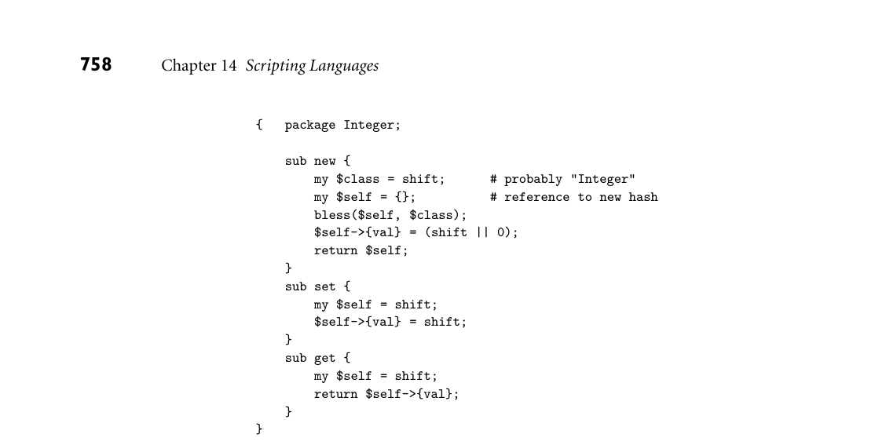
*Figure 14.19 Object-oriented programming in Perl. Blessing a reference (object) into package Integer allows Integer’s functions to serve as the object’s methods.*

As a very simple example, consider the Perl code of Figure 14.19. Here we have EXAMPLE 14.72

A simple class in Perl defined a package, Integer, that plays the role of a class. It has three functions, one of which (new) is intended to be used as a constructor, and two of which (set and get) are intended to be used as accessors. Given this definition we can write

$c1 = Integer->new(2); # Integer::new("Integer", 2) $c2 = new Integer(3); # alternative syntax $c3 = new Integer; # no initial value specified

Both Integer->new and new Integer are syntactic sugar for calls to Integer:: new with an additional first argument that contains the name of the package (class) as a character string. In the first line of function new we assign this string into the variable $class. (The shift operator returns the first element of pseu- dovariable @_ [the function’s arguments], and shifts the remaining arguments, if any, so they will be seen if shift is used again.) We then create a reference to a new hash, store it in local variable $self, and invoke the bless operator to associate it with the appropriate class. With a second call to shift we retrieve the initial value for our integer, if any. (The “or” expression [||] allows us to use 0 instead if no explicit argument was present.) We assign this initial value into the val field of $self using the usual Perl syntax to dereference a pointer and subscript a hash. Finally we return a reference to the newly created object. ■ Once a reference has been blessed, Perl allows it to be used with method in- EXAMPLE 14.73

Invoking methods in Perl vocation syntax: c1->get() and get c1() are syntactic sugar for Integer:: get($c1). Note that this call passes a reference as the additional first parameter, rather than the name of a package. Given the declarations of $c1, $c2, and $c3 from Example 14.72, the following code

print $c1->get, " ", $c2->get, " ", $c3->get, " ", "\n"; $c1->set(4); $c2->set(5); $c3->set(6); print $c1->get, " ", $c2->get, " ", $c3->get, " ", "\n";

will print

2 3 0 4 5 6

As usual in Perl, if an argument list is empty, the parentheses can be omitted. ■ Inheritance in Perl is obtained by means of the @ISA array, initialized at the global level of a package. Extending the previous example, we might define a EXAMPLE 14.74

Inheritance in Perl Tally class that inherits from Integer:

{ package Tally; @ISA = ("Integer");

sub inc { my $self = shift; $self->{val}++; } } ... $t1 = new Tally(3); $t1->inc; $t1->inc; print $t1->get, "\n"; # prints 5

The inc method of t1 works as one might expect. However when Perl sees a call to Tally::new or Tally::get (neither of which is actually in the package), it uses the @ISA array to locate additional package(s) in which these methods may be found. We can list as many packages as we like in the @ISA array; Perl supports multiple inheritance. The possibility that new may be called through Tally rather than Integer explains the use of shift to obtain the class name in Figure 14.19. If we had used "Integer" explicitly we would not have obtained the desired behavior when creating a Tally object. ■ Most often packages (and thus classes) in Perl are declared in separate modules EXAMPLE 14.75

Inheritance via use base (files). In this case, one must import the module corresponding to a superclass in addition to modifying @ISA. The standard base module provides convenient syntax for this combined operation, and is the preferredway to specify inheritance relationships:

{ package Tally; use base ("Integer"); ... ■

PHP and JavaScript

While Perl’s mechanisms suffice to create object-oriented programs, dynamic lookup makes them slower than equivalent imperative programs, and it seems fair to characterize the syntax as less than elegant. Objects are more fundamental to PHP and JavaScript. PHP 4 provided a variety of object-oriented features, which were heavily re- vised in PHP 5. The newer version of the language provides a reference model of (class-typed) variables, interfaces and mix-in inheritance, abstract methods and classes, final methods and classes, static and constant members, and access con- trol specifiers (public, protected, and private) reminiscent of those of Java, C#, and C++. In contrast to all other languages discussed in this subsection, class declarations in PHP must include declarations of all members (fields and meth- ods), and the set of members in a given class cannot subsequently change (though one can of course declare derived classes with additional members). JavaScript takes the unusual approach of providing objects—with inheritance and dynamic method dispatch—without providing classes. Such a language is said to be object-based, as opposed to object-oriented. Functions are first-class entities in JavaScript—objects, in fact. A method is simply a function that is referred to by a property (member) of an object. When we call o.m, the keyword this will refer to o during the execution of the function referred to by m. Likewise when we call new f, this will refer to a newly created (initially empty) object during the execution of f. A constructor in JavaScript is thus a function whose purpose is to assign values into properties (fields and methods) of a newly created object. Associated with every constructor f is an object f.prototype. If object o was constructed by f, then JavaScript will look in f.prototype whenever we attempt to use a property of o that o itself does not provide. In effect, o inherits from f.prototype anything that it does not override. Prototype properties are commonly used to hold methods. They can also be used for constants or for what other languages would call “class variables.” Figure 14.20 illustrates the use of prototypes. It is roughly equivalent to the EXAMPLE 14.76

Prototypes in JavaScript Perl code of Figure 14.19. Function Integer serves as a constructor. Assignments to properties of Integer.prototype serve to establish methods for objects con- structed by Integer. Using the code in the figure, we can write

c2 = new Integer(3); c3 = new Integer;

document.write(c2.get() + "&nbsp;&nbsp;" + c3.get() + " "); c2.set(4); c3.set(5); document.write(c2.get() + "&nbsp;&nbsp;" + c3.get() + " ");

This code will print

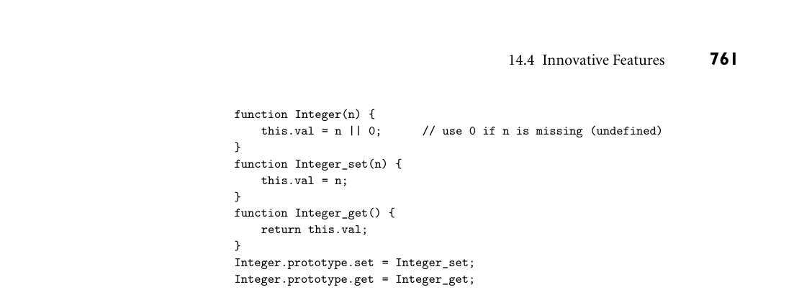
*Figure 14.20 Object-oriented programming in JavaScript. The Integer function is used as a constructor. Assignments to members of its prototype object serve to establish methods. These will be available to any object created by Integer that doesn’t have corresponding members of its own.*

Interestingly, the lack of a formal notion of class means that we can override EXAMPLE 14.77

Overriding instance methods in JavaScript methods and fields on an object-by-object basis:

c2.set = new Function("n", "this.val = n * n;"); // anonymous function constructor c2.set(3); c3.set(4); // these call different methods! document.write(c2.get() + "&nbsp;&nbsp;" + c3.get() + " ");

If nothing else has changed since the previous example, this code will print

9 4 ■

To obtain the effect of inheritance, we can write EXAMPLE 14.78

Inheritance in JavaScript function Tally(n) { this.base(n); // call to base constructor } function Tally_inc() { this.val++; } Tally.prototype = new Integer; // inherit methods Tally.prototype.base = Integer; // make base constructor available Tally.prototype.inc = Tally_inc; // new method ... t1 = new Tally(3); t1.inc(); t1.inc(); document.write(t1.get() + " ");

This code will print a 5. ■ ECMAScript 6, expected to become official in 2015, adds a formal notion of classes to the language, along with a host of other features. Classes are defined in a backward compatible way—essentially as syntactic sugar for constructors with prototypes.

Python and Ruby

As we have noted, both Python and Ruby are explicitly object-oriented. Both employ a uniform reference model for variables. Like Smalltalk, both incorporate an object hierarchy in which classes themselves are represented by objects. The root class in Python is called object; in Ruby it is Object. In both Python and Ruby, each class has a single distinguished constructor, EXAMPLE 14.79

Constructors in Python and Ruby which cannot be overloaded. In Python it is __init__; in Ruby it is initialize. To create a new object in Python one says my_object = My_class(args); in Ruby one says my_object = My_class.new(args). In each case the args are passed to the constructor. To achieve the effect of overloading, with different numbers or types of arguments, one must arrange for the single constructor to inspect its arguments explicitly. We employed a similar idiom in Perl (in the new routine of Figure 14.19) and JavaScript (in the Integer function of Figure 14.20). ■ Both Python and Ruby are more flexible than PHP or more traditional object- oriented languages regarding the contents (members) of a class. New fields can be added to a Python object simply by assigning to them: my_object.new_field = value. The set of methods, however, is fixed when the class is first defined. In Ruby only methods are visible outside a class (“put” and “get” methods must be used to access fields), and all methods must be explicitly declared. It is possible, however, to modify an existing class declaration, adding or overriding methods. One can even do this on an object-by-object basis. As a result, two objects of the same class may not display the same behavior. Python and Ruby differ in many other ways. The initial parameter to methods EXAMPLE 14.80

Naming class members in Python and Ruby is explicit in Python; by convention it is usually named self. In Ruby self is a keyword, and the parameter it represents is invisible. Any variable beginning with a single @ sign in Ruby is a field of the current object. Within a Python method, uses of object members must name the object explicitly. One must, for example, write self.print(); just print() will not suffice. ■ Ruby methods may be public, protected, or private.8 Access control in Python is purely a matter of convention; both methods and fields are universally accessible. Finally, Python has multiple inheritance. Ruby has mix-in inheri- tance: a class cannot obtain data from more than one ancestor. Unlike most other languages, however, Ruby allows an interface (mix-in) to define not only the sig- natures of methods but also their implementation (code).

3CHECK YOUR UNDERSTANDING 41. Contrast the philosophies of Perl and Ruby with regard to error checking and reporting.

8 The meanings of private and protected in Ruby are different from those in C++, Java, or C#: private methods in Ruby are available only to the current instance of an object; protected methods are available to any instance of the current class or its descendants.

42. Compare the numeric types of popular scripting languages to those of com- piled languages like C or Fortran. 43. What are bignums? Which languages support them?

44. What are associative arrays? By what other names are they sometimes known? 45. Why don’t most scripting languages provide direct support for records?

46. What is a typeglob in Perl? What purpose does it serve? 47. Describe the tuple and set types of Python.

48. Explain the unification of arrays and hashes in PHP and Tcl. 49. Explain the unification of arrays and objects in JavaScript. 50. Explain how tuples and hashes can be used to emulate multidimensional ar- rays in Python.

51. Explain the concept of context in Perl. How is it related to type compatibil- ity and type inference? What are the two principal contexts defined by the language’s operators?

DESIGN & IMPLEMENTATION

14.12 Executable class declarations Both Python and Ruby take the interesting position that class declarations are executable code. Elaboration of a declaration executes the code inside. Among other things, we can use this mechanism to achieve the effect of conditional compilation:

class My_class # Ruby code def initialize(a, b) @a = a; @b = b; end if expensive_function() def get() return @a end else def get() return @b end end end

Instead of computing the expensive function inside get, on every invocation, we compute it once, ahead of time, and define an appropriate specialized ver- sion of get.

52. Compare the approaches to object orientation taken by Perl 5, PHP 5, JavaScript, Python, and Ruby. 53. What is meant by the blessing of a reference in Perl?

54. What are prototypes in JavaScript? What purpose do they serve?

14.5 Summary and Concluding Remarks

Scripting languages serve primarily to control and coordinate other software components. Though their roots go back to interpreted languages of the 1960s, for many years they were largely ignored by academic computer science. With an increasing emphasis on programmer productivity, however, and with the explo- sion of the World Wide Web, scripting languages have seen enormous growth in interest and popularity, both in industry and in academia. Many significant ad- vances have been made by commercial developers and by the open-source com- munity. Scripting languages may well come to dominate programming in the 21st century, with traditional compiled languages more and more seen as special- purpose tools. In comparison to their traditional cousins, scripting languages emphasize flex- ibility and richness of expression over sheer run-time performance. Common characteristics include both batch and interactive use, economy of expression,

DESIGN & IMPLEMENTATION

14.13 Worse Is Better Any discussion of the relative merits of scripting and “systems” languages in- variably ends up addressing the tradeoffs between expressivenessand flexibility on the one hand and compile-time safety and performance on the other. It may also digress into questions of “quick-and-dirty” versus “polished” applications. An interesting take on this debate can be found in the widely circulated essays of Richard Gabriel (www.dreamsongs.com/WorseIsBetter.html). While working for Lucid Corp. in 1989, Gabriel found himself asking why Unix and C had been so successful at attracting users, while Common Lisp (Lucid’s principal focus) had not. His explanation contrasts “The Right Thing,” as exemplified by Common Lisp, with a “Worse Is Better” philosophy, as exemplified by C and Unix. “The Right Thing” emphasizes complete, correct, consistent, and ele- gant design. “Worse Is Better” emphasizes the rapid development of software that does most of what users need most of the time, and can be tuned and im- proved incrementally, based on field experience. Much of scripting, and Perl in particular, fits the “Worse Is Better” philosophy (Ruby and Scheme enthusiasts might beg to disagree). Gabriel, for his part, says he still hasn’t made up his mind; his essays argue both points of view.

lack of declarations, simple scoping rules, flexible dynamic typing, easy access to other programs, sophisticated pattern matching and string manipulation, and high-level data types. We began our chapter by tracing the historical development of scripting, start- ing with the command interpreter, or shell programs of the mid-1970s, and the text processing and report generation tools that followed soon thereafter. We looked in particular at the “Bourne-again” shell, bash, and the Unix tools sed and awk. We also mentioned such special-purpose domains as mathematics and statistics, where scripting languages are widely used for data analysis, visualiza- tion, modeling, and simulation. We then turned to the three domains that dom- inate scripting today: “glue” (coordination) applications, configuration and ex- tension, and scripting of the World Wide Web. For many years, Perl was the most popular of the general-purpose “glue” lan- guages, but Python and Ruby have clearly overtaken it at this point. Several script- ing languages, including Python, Scheme, and Lua, are widely used to extend the functionality of complex applications. In addition, many commercial packages have their own proprietary extension languages. Web scripting comes in many forms. On the server side of an HTTP con- nection, the Common Gateway Interface (CGI) standard allows a URI to name a program that will be used to generate dynamic content. Alternatively, web- page-embedded scripts, often written in PHP, can be used to create dynamic con- tent in a way that is invisible to users. To reduce the load on servers, and to improve interactive responsiveness, scripts can also be executed within the client browser. JavaScript is the dominant notation in this domain; it uses the HTML Document Object Model (DOM) to manipulate web-page elements. For more demanding tasks, many browsers can be directed to run a Java applet, which takes full responsibility for some portion of the “screen real estate,” but this strategy comes with security concerns that are increasingly viewed as unacceptable. With the emergence of HTML5, most dynamic content—multimedia in particular— can be handled directly by the browser. At the same time, XML has emerged as the standard format for structured, presentation-independent information, with load-time transformation via XSL. Because of their rapid evolution, scripting languages have been able to take ad- vantage of many of the most powerful and elegant mechanisms described in pre- vious chapters, including first-class and higher-order functions, unlimited extent, iterators, garbage collection, list comprehensions, and object orientation—not to mention extended regular expressions and such high-level data types as dictionar- ies, sets, and tuples. Given current trends, scripting languages are likely to become increasingly ubiquitous, and to remain a principal focus of language innovation. 14.6 Exercises

14.2 Write shell scripts to (a) Replace blanks with underscores in the names of all files in the current directory. (b) Rename every file in the current directory by prepending to its name a textual representation of its modification date. (c) Find all eps files in the file hierarchy below the current directory, and create any corresponding pdf files that are missing or out of date. (d) Print the names of all files in the file hierarchy below the current di- rectory for which a given predicate evaluates to true. Your (quoted) predicate should be specified on the command line using the syntax of the Unix test command, with one or more at signs (@) standing in for the name of the candidate file. 14.3 In Example 14.16 we used "$@" to refer to the parameters passed to ll. What would happen if we removed the quote marks? (Hint: Try this for files whose names contain spaces!) Read the man page for bash and learn the difference between $@ and $*. Create versions of ll that use $* or "$*" instead of "$@". Explain what’s going on. 14.4 (a) Extend the code in Figure 14.5, 14.6, or 14.7 to try to kill processes more gently. You’ll want to read the man page for the standard kill command. Use a TERM signal first. If that doesn’t work, ask the user if you should resort to KILL. (b) Extend your solution to part (a) so that the script accepts an optional argument specifying the signal to be used. Alternatives to TERM and KILL include HUP, INT, QUIT, and ABRT. 14.5 Write a Perl, Python, or Ruby script that creates a simple concordance: a sorted list of significant words appearing in an input document, with a sublist for each that indicates the lines on which the word occurs, with up to six words of surrounding context. Exclude from your list all common articles, conjunctions, prepositions, and pronouns. 14.6 Write Emacs Lisp scripts to (a) Insert today’s date into the current buffer at the insertion point (cur- rent cursor location). (b) Place quote marks (" ") around the word surrounding the insertion point. (c) Fix end-of-sentence spaces in the current buffer. Use the following heuristic: if a period, question mark, or exclamation point is followed by a single space (possibly with closing quote marks, parentheses, brackets, or braces in-between), then add an extra space, unless the character preceding the period, question mark, or exclamation point is a capital letter (in which case we assume it is an abbreviation).

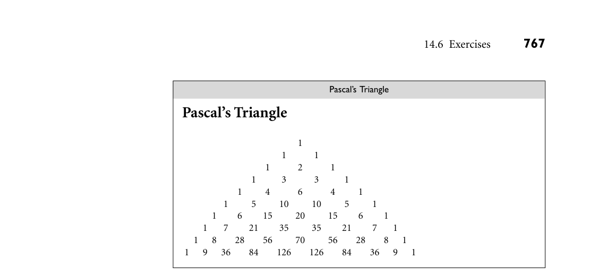
*Figure 14.21 Pascal’s triangle rendered in a web page (Exercise 14.8).*

(d) Run the contents of the current buffer through your favorite spell checker, and create a new buffer containing a list of misspelled words. (e) Delete one misspelled word from the buffer created in (d), and place the cursor (insertion point) on top of the first occurrence of that mis- spelled word in the current buffer. 14.7 Explain the circumstances under which it makes sense to realize an inter- active task on the Web as a CGI script, an embedded server-side script, or a client-side script. For each of these implementation choices, give three examples of tasks for which it is clearly the preferred approach. 14.8 (a) Write a web page with embedded PHP to print the first 10 rows of Pascal’s triangle (see Example C 17.10 if you don’t know what this is). When rendered, your output should look like Figure 14.21. (b) Modify your page to create a self-posting form that accepts the num- ber of desired rows in an input field. (c) Rewrite your page in JavaScript. 14.9 Create a fill-in web form that uses a JavaScript implementation of the Luhn formula (Exercise 4.10) to check for typos in credit card numbers. (But don’t use real credit card numbers; homework exercises don’t tend to be very secure!) 14.10 (a) Modify the code of Figure 14.15 (Example 14.35) so that it replaces the form with its output, as the CGI and PHP versions of Figures 14.11 and 14.14 do. (b) Modify the CGI and PHP scripts of Figures 14.11 and 14.14 (Exam- ples 14.30 and 14.34) so they appear to append their output to the bottom of the form, as the JavaScript version of Figure 14.15 does.

14.11 Run the following program in Perl:

sub foo { my $lex = $_[0]; sub bar { print "$lex\n"; } bar(); }

foo(2); foo(3);

You may be surprised by the output. Perl 5 allows named subroutines to nest, but does not create closures for them properly. Rewrite the code above to create a reference to an anonymous local subroutine and verify that it does create closures correctly. Add the line use diagnostics; to the beginning of the original version and run it again. Based on the expla- nation this will give you, speculate as to how nested named subroutines are implemented in Perl 5. 14.12 Write a program that will map the web pages stored in the file hierarchy below the current directory. Your output should itself be a web page, con- taining the names of all directories and .html files, printed at levels of indentation corresponding to their level in the file hierarchy. Each .html file name should be a live link to its file. Use whatever language(s) seem most appropriate to the task. 14.13 In Section 14.4.1 we claimed that nested blocks in Ruby were part of the named scope in which they appear. Verify this claim by running the fol- lowing Ruby script and explaining its output:

def foo(x) y = 2 bar = proc { print x, "\n" y = 3 } bar.call() print y, "\n" end

foo(3)

Now comment out the second line (y = 2) and run the script again. Ex- plain what happens. Restate our claim about scoping more carefully and precisely. 14.14 Write a Perl script to translate English measurements (in, ft, yd, mi) into metric equivalents (cm, m, km). You may want to learn about the e mod- ifier on regular expressions, which allows the right-hand side of an s///e expression to contain executable code.

14.15 Write a Perl script to find, for each input line, the longest substring that appears at least twice within the line, without overlapping. (Warning: This is harder than it sounds. Remember that by default Perl searches for a left- most longest match.) 14.16 Perl provides an alternative (?:... ) form of parentheses that supports grouping in regular expressions without performing capture. Using this syntax, Example 14.57 could have been written as follows:

if (/^([+-]?)((\d+)\.|(\d*)\.(\d+))(?:e([+-]?\d+))?$/) { # floating-point number print "sign: ", $1, "\n"; print "integer: ", $3, $4, "\n"; print "fraction: ", $5, "\n"; print "mantissa: ", $2, "\n"; print "exponent: ", $6, "\n"; # not $7 }

What purpose does this extra notation serve? Why might the code here be preferable to that of Example 14.57? 14.17 Consider again the sed code of Figure 14.1. It is tempting to write the first of the compound statements as follows (note the differences in the three substitution commands):

/<[hH][123]>.*<\/[hH][123]>/ { ;# match whole heading h ;# save copy of pattern space s/^.*\(<[hH][123]>\)/\1/ ;# delete text before opening tag s/\(<\/[hH][123]>\).*$/\1/ ;# delete text after closing tag p ;# print what remains g ;# retrieve saved pattern space s/^.*<\/[hH][123]>// ;# delete through closing tag b top

Explain why this doesn’t work. (Hint: Remember the difference between greedy and minimal matches [Example 14.53]. Sed lacks the latter.) 14.18 Consider the following regular expression in Perl: /^(?:((?:ab)+) |a((?:ba)*))$/. Describe, in English, the set of strings it will match. Show a natural NFA for this set, together with the minimal DFA. Describe the substrings that should be captured in each matching string. Based on this example, discuss the practicality of using DFAs to match strings in Perl. 14.19–14.21 In More Depth. 14.7 Explorations

domain—professional typesetting—influenced its design. Features you might wish to consider include dynamic scoping, the relatively impover- ished arithmetic and control-flow facilities, and the use of macros as the fundamental control abstraction. 14.23 Research the security mechanisms of JavaScript and/or Java applets. What exactly are programs allowed to do and why? What potentially useful fea- tures have not been provided because they can’t be made secure? What potential security holes remain in the features that are provided? 14.24 Learn about web crawlers—programs that explore the World Wide Web. Build a crawler that searches for something of interest. What language features or tools seem most useful for the task? Warning: Automated web crawling is a public activity, subject to strict rules of etiquette. Before cre- ating a crawler, do a web search and learn the rules, and test your code very carefully before letting it outside your local subnet (or even your own ma- chine). In particular, be aware that rapid-fire requests to the same server constitute a denial of service attack, a potentially criminal offense. 14.25 In Sidebar 14.9 we noted that the “extended” REs of awk and egrep are typically implemented by translating first to an NFA and then to a DFA, while those of Perl and its ilk are typically implemented via backtracking search. Some tools, including GNU ggrep, use a variant of the Boyer- Moore-Gosper algorithm [BM77, KMP77] for faster deterministic search. Find out how this algorithm works. What are its advantages? Could it be used in languages like Perl? 14.26 In Sidebar 14.10 we noted that nonconstant patterns must generally be recompiled whenever they are used. Perl programmers who wish to re- duce the resulting overhead can inhibit recompilation using the o trailing modifier or the qr quoting operator. Investigate the impact of these mech- anisms on performance. Also speculate as to the extent to which it might be possible for the language implementation to determine, automatically and efficiently, when recompilation should occur. 14.27 Our coverage of Perl REs in Section 14.4.2 was incomplete. Features not covered include look-ahead and look-behind (context) assertions, com- ments, incremental enabling and disabling of modifiers, embedded code, conditionals, Unicode support, nonslash delimiters, and the translitera- tion (tr///) operator. Learn how these work. Explain if (and how) they extend the expressive power of the notation. How could each be emulated (possibly with surrounding Perl code) if it were not available? 14.28 Investigate the details of RE support in PHP, Tcl, Python, Ruby, JavaScript, Emacs Lisp, Java, and C#. Write a paper that documents, as concisely as possible, the differences among these, using Perl as a reference for com- parison. 14.29 Do a web search for Perl 6, a community-based effort that has been in the works for many years. Write a report that summarizes the changes with

respect to Perl 5. What do you think of these changes? If you were in charge of the revision, what would you do differently? 14.30 Learn about AJAX, a collection of web technologies that allows a JavaScript program to interact with web servers “in the background,” to dynamically update a page in a browser after its initial loading. What kinds of ap- plications can you build in AJAX that you couldn’t easily build otherwise? What features of JavaScript are most important for making the technology work? 14.31 Learn about Dart, a language developed at Google. Initially intended as a successor to JavaScript, Dart is now supported only as a language in which to develop code that will be translated into JavaScript. What explains the change in strategy? What are the odds that some other competitor to JavaScript will emerge in future years?

14.32–14.35 In More Depth. 14.8 Bibliographic Notes

Most of the major scripting languages and their predecessors are described in books by the language designers or their close associates: awk [AKW88], Perl [CfWO12], PHP [TML13], Python [vRD11], and Ruby [TFH13]. Several of these books have versions available on-line. Most of the languages are also de- scribed in a variety of other texts, and most have dedicated web sites: perl.org, php.net, python.org, ruby-lang.org. Extensive documentation for Perl is pre- installed on many machines; type man perl for an index. Rexx [Ame96a] was standardized by ANSI, the American National Standards Institute. JavaScript [ECM11] is standardized by ECMA, the European stan- dards body. Guile (gnu.org/software/guile/) is GNU’s Scheme implementation for scripting. Standards for the World Wide Web, including HTML5, XML, XSL, XPath, and XSLT, are promulgated by the World Wide Web Consortium: www.w3.org. For those updating their pages to HTML5, the validation service at validator.w3.org is particularly useful. High-quality tutorials on many web- related topics can be found at w3schools.com. Hauben and Hauben [HH97a] describe the historical roots of the Internet, including early work on Unix. Original articles on the various Unix shell lan- guages include those of Mashey [Mas76], Bourne [Bou78], and Korn [Kor94]. The original reference on APL is by Iverson [Ive62]. Ousterhout [Ous98] makes the case for scripting languages in general, and Tcl in particular. Chonacky and Winch [CW05] compare and contrast Maple, Mathematica, and Matlab. Richard Gabriel’s collection of “Worse Is Better” papers can be found at www.dreamsongs. com/WorseIsBetter.html. A similar comparison of Tcl and Scheme can be found in the introductory chapter of Abelson, Greenspun, and Sandon’s on-line Tcl for Web Nerds guide (philip.greenspun.com/tcl/index.adp).

