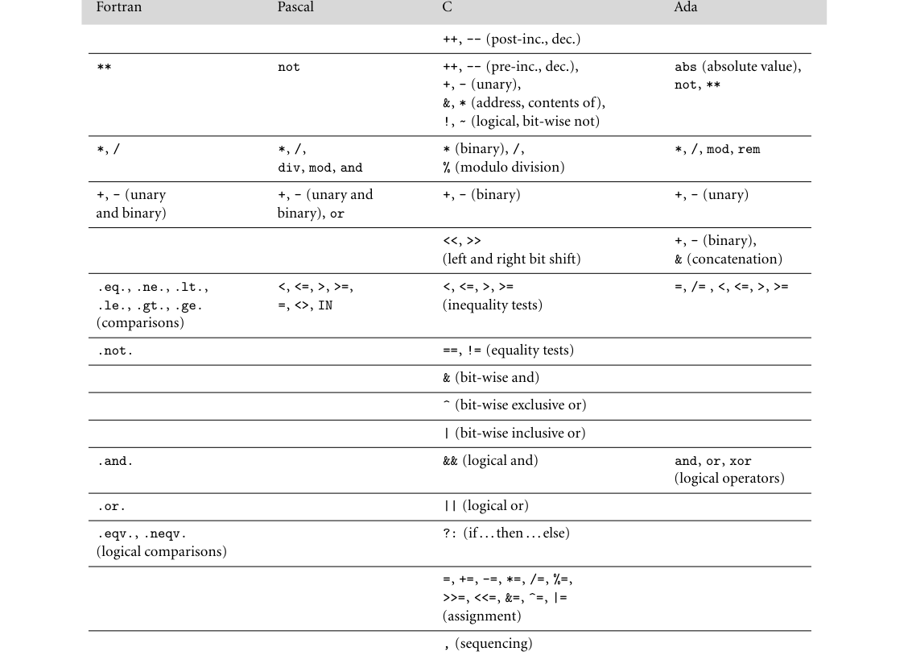
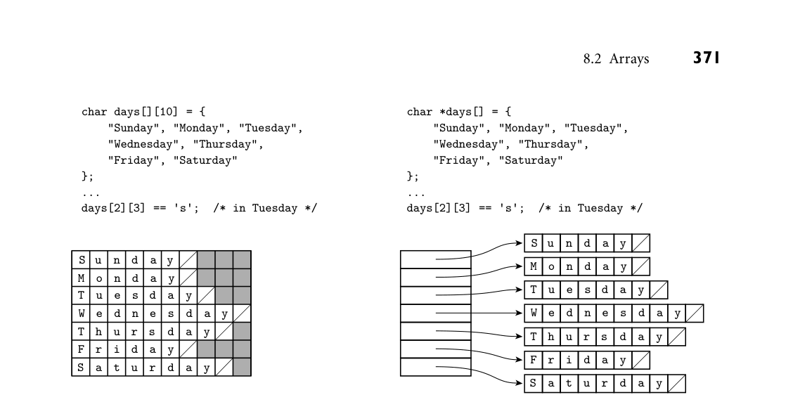

# Part II: Core Issues in Language Design

## **II**

## **Core Issues in Language Design**

Having laid the foundation in Part I, we now turn to issues that lie at the core of most program-
ming languages: control flow, data types, and abstractions of both control and data.
Chapter 6 considers* control flow*, including expression evaluation, sequencing, selection,
iteration, and recursion. In many cases we will see design decisions that reflect the sometimes
complementary but often competing goals of conceptual clarity and efficient implementation.
Several issues, including the distinction between references and values and between applicative
(eager) and lazy evaluation, will recur in later chapters.
The next two chapters consider the subject of* types*. Chapter 7 covers* type systems* and* type*
*checking*, including the notions of equivalence, compatibility, and inference of types. It also
considers the subject of* parametric polymorphism*, in both its implicit and explicit (generic)
forms. Chapter 8 then presents a survey of concrete* composite types*, including records and
variants, arrays, strings, sets, pointers, lists, and files. The section on pointers includes an
introduction to garbage collection techniques.
Both control and data are amenable to* abstraction*, the process whereby complexity is hid-
den behind a simple and well-defined interface.* Control abstraction* is the subject of Chap-
ter 9.* Subroutines* are the most common control abstraction, but we also consider exceptions
and coroutines, and return briefly to the subjects of continuations and iterators, introduced in
Chapter 6. The coverage of subroutines focuses on calling sequences and on parameter-passing
mechanisms.
Chapter 10 returns to the subject of* data abstraction*, introduced in Chapter 3. In many
modern languages this subject takes the form of* object orientation*, characterized by an encapsu-
lation mechanism, inheritance, and dynamic method dispatch (subtype polymorphism). Our
coverage of object-oriented languages will also touch on constructors, access control, generics,
closures, and mix-in and multiple inheritance.

This page intentionally left blank

**223**

Operators are typically simpler, taking only one or two arguments, and dispensing
**EXAMPLE** 6.2

Typical operators
with the parentheses and commas:

```
a + b
- c
```

```
As we saw in Section 3.5.2, some languages define their operators as syntactic
sugar for more “normal”-looking functions. In Ada, for example, a + b is short
for "+"(a, b); in C++, a + b is short for a.operator+(b) or operator+(a,
b) (whichever is defined).
■
In general, a language may specify that function calls (operator invocations)
employ prefix, infix, or postfix notation.
These terms indicate, respectively,
whether the function name appears before, among, or after its several arguments:
```

prefix:
*op* a b
or
*op* (a, b)
or
(*op* a b)
infix:
a* op* b
postfix:
a b* op*

Most imperative languages use infix notation for binary operators and prefix
notation for unary operators and (with parentheses around the arguments) other
functions. Lisp uses prefix notation for all functions, but with the third of the
**EXAMPLE** 6.3

Cambridge Polish (prefix)
notation
variants above: in what is known as* Cambridge Polish*1 notation, it places the
function name* inside* the parentheses:

```
(* (+ 1 3) 2)
; that would be (1 + 3) * 2 in infix
(append a b c my_list)
■
```

ML-family languages dispense with the parentheses altogether, except when
**EXAMPLE** 6.4

Juxtaposition in ML
they are required for disambiguation:

```
max (2 + 3) 4;;
=⇒5
■
```

**1**
Prefix notation was popularized by Polish logicians of the early 20th century; Lisp-like parenthe-
sized syntax was first employed (for noncomputational purposes) by philosopher W. V. Quine of
Harvard University (Cambridge, MA).

or

**2**
Most authors use the term “infix” only for binary operators. Multiword operators may be called
“mixfix,” or left unnamed.

```
, (sequencing)
```



*Figure 6.1 Operator precedence levels in Fortran, Pascal, C, and Ada. The operators at the top of the figure group most tightly.*

```
4**(3**2); the language syntax does not allow the unparenthesized form. In
languages that allow assignments inside expressions (an option we will consider
more in Section 6.1.2), assignment associates right-to-left. Thus in C, a = b =
a + c assigns a + c into b and then assigns the same value into a.
■
Haskell is unusual in allowing the programmer to specify both the associativity
EXAMPLE 6.11
```

```
User-defined precedence
and associativity in Haskell
and the precedence of user-defined operators. The predefined ^ operator, for ex-
```

d
a
y
S
a
t
u
r

s
h

F
i
r



*Figure 8.9 Contiguous array allocation vs row pointers in C. The declaration on the left is a true two-dimensional array. The slashed boxes are NUL bytes; the shaded areas are holes. The declaration on the right is a ragged array of pointers to arrays of characters. The arrays of characters may be located anywhere in memory—next to each other or separated, and in any order. In both cases, we have omitted bounds in the declaration that can be deduced from the size of the initializer (aggregate). Both data structures permit individual characters to be accessed using double subscripts, but the memory layout (and corresponding address arithmetic) is quite different.*

**Address Calculations**

### For the usual contiguous layout of arrays, calculating the address of a particular

### element is somewhat complicated, but straightforward. Suppose a compiler is

**EXAMPLE** 8.25
Indexing a contiguous array
### given the following declaration for a three-dimensional array:

A : array [*L*1 . .* U*1] of array [*L*2 . .*U*2] of array [*L*3 . .* U*3] of elem type;

### Let us define constants for the sizes of the three dimensions:

*S*3
= size of elem type

*S*2
=
(*U*3* −**L*3 + 1)* ×** S*3
*S*1
=
(*U*2* −**L*2 + 1)* ×** S*2

Here the size of a row (*S*2) is the size of an individual element (*S*3) times the
### number of elements in a row (assuming row-major layout). The size of a plane

(*S*1) is the size of a row (*S*2) times the number of rows in a plane. The address of
A[i, j, k] is then
