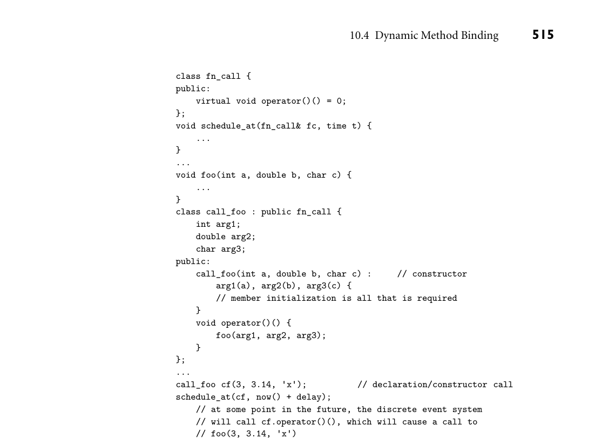
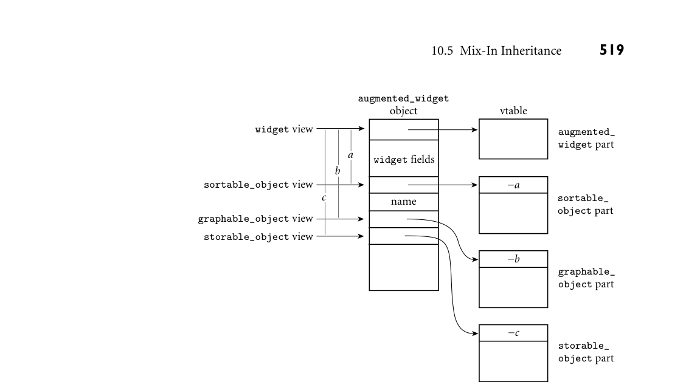

# Chapter 10: Data Abstraction and Object Orientation

10 Data Abstraction and Object Orientation

In Chapter 3 we presented several stages in the development of data ab- straction, with an emphasis on the scoping mechanisms that control the visibility of names. We began with global variables, whose lifetime spans program execu- tion. We then added local variables, whose lifetime is limited to the execution of a single subroutine; nested scopes, which allow subroutines themselves to be local; and static variables, whose lifetime spans execution, but whose names are visible only within a single scope. These were followed by modules, which allow a collec- tion of subroutines to share a set of static variables; module types, which allow the programmer to instantiate multiple instances of a given abstraction, and classes, which allow the programmer to define families of related abstractions. Ordinary modules encourage a “manager” style of programming, in which a module exports an abstract type. Module types and classes allow the module itself to be the abstract type. The distinction becomes apparent in two ways. First, the explicit create and destroy routines typically exported from a manager module are replaced by creation and destruction of an instance of the module type. Second, invocation of a routine in a particular module instance replaces invocation of a general routine that expects a variable of the exported type as argument. Classes build on the module-as-type approach by adding mechanisms for inheritance, which allows new abstractions to be defined as refinements or extensions to existing ones, and dynamic method binding, which allows a new version of an abstraction to display newly refined behavior, even when used in a context that expects an earlier version. An instance of a class is known as an object; languages and programming techniques based on classes are said to be object-oriented.1 The stepwise evolution of data abstraction mechanisms presented in Chapter 3 is a useful way to organize ideas, but it does not completely reflect the historical development of language features. In particular, it would be inaccurate to sug- gest that object-oriented programming developed as an outgrowth of modules.

Rather, all three of the fundamental concepts of object-oriented programming— encapsulation, inheritance, and dynamic method binding—have their roots in the Simula programming language, developed in the mid-1960s by Ole-Johan Dahl and Kristen Nygaard of the Norwegian Computing Center.2 In comparison to modern object-oriented languages, Simula was weak in the data hiding part of encapsulation, and it was in this area that Clu, Modula, Euclid, and related lan- guages made important contributions in the 1970s. At the same time, the ideas of inheritance and dynamic method binding were adopted and refined in Smalltalk over the course of the 1970s. Smalltalk employed a distinctive “message-based” programming model, with dynamic typing and unusual terminologyand syntax. The dynamic typing tended to make implementations relatively slow, and delayed the reporting of errors. The language was also tightly integrated into a graphical programming environment, making it difficult to port across systems. For these reasons, Smalltalk was less widely used than one might have expected, given the influence it had on subse- quent developments. Languages like Eiffel, C++, Ada 95, Fortran 2003, Java, and C# represented to a large extent a reintegration of the inheritance and dynamic method binding of Smalltalk with “mainstream” imperative syntax and seman- tics. In an alternative vein, Objective-C combined Smalltalk-style messaging and dynamic typing, in a relatively pure and unadulterated form, with traditional C syntax for intra-object operations. Object orientation has also become impor- tant in functional languages, as exemplified by the Common Lisp Object System (CLOS [Kee89; Ste90, Chap. 28]) and the objects of OCaml. More recently, dynamically typed objects have gained new popularity in lan- guages like Python and Ruby, while statically typed objects continue to appear in languages like Scala and Go. Swift, the successor to Objective-C, follows the pattern of its predecessor (and of OCaml, in fact) in layering dynamically typed objects on top of an otherwise statically typed language. In Section 10.1 we provide an overview of object-oriented programming and of its three fundamental concepts. We consider encapsulation and data hiding in more detail in Section 10.2. We then consider object initialization and finaliza- tion in Section 10.3, and dynamic method binding in Section 10.4. In Section 10.6 (mostly on the companion site) we consider the subject of multiple inheritance, in which a class is defined in terms of more than one existing class. As we shall see, multiple inheritance introduces some particularly thorny semantic and imple- mentation challenges. Finally, in Section 10.7, we revisit the definition of object orientation, considering the extent to which a language can or should model ev-

2 Kristen Nygaard (1926–2002) was widely admired as a mathematician, computer language pi- oneer, and social activist. His career included positions with the Norwegian Defense Research Establishment, the Norwegian Operational Research Society, the Norwegian Computing Center, the Universities of Aarhus and Oslo, and a variety of labor, political, and social organizations. Ole-Johan Dahl (1931–2002) also held positions at the Norwegian Defense Research Establish- ment and the Norwegian Computing Center, and was the founding member of the Informatics department at Oslo. Together, Nygaard and Dahl shared the 2001 ACM Turing Award.

erything as an object. Most of our discussion will focus on Smalltalk, Eiffel, C++, and Java, though we shall have occasion to mention many other languages as well. We will return to the subject of dynamically typed objects in Section 14.4.4. 10.1 Object-Oriented Programming

Object-oriented programming can be seen as an attempt to enhance opportuni- ties for code reuse by making it easy to define new abstractions as extensions or refinements of existing abstractions. As a starting point for examples, consider a EXAMPLE 10.1

list_node class in C++ collection of integers, implemented as a doubly linked list of records (we’ll con- sider collections of other types of objects in Section 10.1.1). Figure 10.1 contains C++ code for the elements of our collection. The example employs a “module-as- type” style of abstraction: each element is a separate object of class list_node. The class contains both data members (prev, next, head_node, and val) and subroutine members (predecessor, successor, insert_before and remove). Subroutine members are called methods in many object-oriented languages; data members are also called fields. The keyword this in C++ refers to the object of which the currently executing method is a member. In Smalltalk and Objective-C, the equivalent keyword is self; in Eiffel it is current. ■ Given the existence of the list_node class, we could define a list of integers as EXAMPLE 10.2

list class that uses list_node follows:

class list { list_node header; public: // no explicit constructor required; // implicit construction of 'header' suffices int empty() { return header.singleton(); } list_node* head() { return header.successor(); } void append(list_node *new_node) { header.insert_before(new_node); } ~list() { // destructor if (!header.singleton()) throw new list_err("attempt to delete nonempty list"); } };

To create an empty list, one could then write

class list_err { // exception public: const char *description; list_err(const char *s) {description = s;} };

*Figure 10.1 A simple class for list nodes in C++. In this example we envision a list of integers.*

Records to be inserted into a list are created in much the same way:

list_node* elem_ptr = new list_node; ■

In C++, one can also simply declare an object of a given class: EXAMPLE 10.3

Declaration of in-line (expanded) objects list my_list; list_node elem;

Our list class includes such an object (header) as a field. When created with new, an object is allocated in the heap; when created via elaboration of a decla- ration it is allocated statically or on the stack, depending on lifetime (Eiffel calls such objects “expanded”). Whether on the stack or in the heap, object creation causes the invocation of a programmer-specified initialization routine, known as a constructor. In C++ and its descendants, Java and C#, the name of the con- structor is the same as that of the class itself. C++ also allows the programmer to specify a destructor method that will be invoked automatically when an object is destroyed, either by explicit programmer action or by return from the subroutine in which it was declared. The destructor’s name is also the same as that of the class, but with a leading tilde (~). Destructors are commonly used for storage management and error checking. ■ If a constructor has parameters, corresponding arguments must be provided when declaring an in-line object or creating an object in the heap. Suppose, for EXAMPLE 10.4

Constructor arguments example, that our list_node constructor had been written to take an explicit parameter:

class list_node { ... list_node(int v) { prev = next = head_node = this; val = v; }

Each in-line declaration or call to new would then need to provide a value:

list_node element1(0); // in-line list_node *e_ptr = new list_node(13); // heap

As we shall see in Section 10.3.1, C++ actually allows us to declare both construc- tors, and uses the usual rules of function overloading to differentiate between them: declarations without a value will call the no-parameter constructor; decla- rations with an integer argument will call the integer-parameter constructor. ■

Public and Private Members

The public label within the declaration of list_node separates members re- quired by the implementation of the abstraction from members available to users of the abstraction. In the terminology of Section 3.3.4, members that appear after the public label are exported from the class; members that appear before the la- bel are not. C++ also provides a private label, so the publicly visible portions of a class can be listed first if desired (or even intermixed). In many other languages, public data and subroutine members (fields and methods) must be individually so labeled (more on this in Section 10.2.2). Note that C++ classes are open scopes, as defined in Section 3.3.4; nothing needs to be explicitly imported. In many languages—C++ among them—certain information can be left out of the initial declaration of a module or class, and provided in a separate file not visible to users of the abstraction. In our running example, we could declare the EXAMPLE 10.5

Method declaration without definition public methods of list_node without providing their bodies:

class list_node { list_node* prev; list_node* next; list_node* head_node; public: int val; list_node(); list_node* predecessor(); list_node* successor(); bool singleton(); void insert_before(list_node* new_node);

DESIGN & IMPLEMENTATION

10.1 What goes in a class declaration? Two rules govern the choice of what to put in the declaration of a class, rather than in a separate definition. First, the declaration must contain all the in- formation that a programmer needs in order to use the abstraction correctly. Second, the declaration must contain all the information that the compiler needs in order to generate code. The second rule is generally broader: it tends to force information that is not required by the first rule into (the private part of) the interface, particularly in languages that use a value model of variables, instead of a reference model. If the compiler must generate code to allocate space (e.g., in stack frames) to hold an instance of a class, then it must know the size of that instance; this is the rationale for including private fields in the class declaration. In addition, if the compiler is to expand any method calls in- line then it must have their code available. In-line expansion of the smallest, most common methods of an object-oriented program tends to be crucial for good performance.

void remove(); ~list_node(); }; ■

This somewhat abbreviated class declaration might then be put in a.h “header” file, with method bodies relegated to a .cc “implementation” file. (C++ con- ventions for separate compilation are similar to those of C, which we saw in Sec- tion C 3.8. The file name suffixes used here are those expected by the GNU g++ compiler.) Within a.cc file, the header of a method definition must identify the EXAMPLE 10.6

Separate method definition class to which it belongs by using a :: scope resolution operator:

void list_node::insert_before(list_node* new_node) { if (!new_node->singleton()) throw new list_err("attempt to insert node already on list"); prev->next = new_node; new_node->prev = prev; new_node->next = this; prev = new_node; new_node->head_node = head_node; } ■

Tiny Subroutines

Object-oriented programs tend to make many more subroutine calls than do ordinary imperative programs, and the subroutines tend to be shorter. Lots of things that would be accomplished by direct access to record fields in a von Neu- mann language tend to be hidden inside object methods in an object-oriented language. Many programmers in fact consider it bad style to declare public fields, because doing so gives users of an abstraction direct access to the internal repre- sentation, and makes it impossible to change that representation without chang- ing the user code as well. Arguably, we should make the val field of list_node private, with get_val and set_val methods to read and write it. C# provides a property mechanism specifically designed to facilitate the decla- EXAMPLE 10.7

property and indexer methods in C# ration of methods (called accessors) to “get” and “set” private fields. Using this mechanism, a C# version of our val field could be written as follows:

class list_node { ... int val; // val (lower case 'v') is private public int Val { get { // presence of get accessor and optional return val; // set accessor means that Val is a property } set { val = value; // value is a keyword: argument to set } } ... }

Users of the list_node class can now access the (private) val field through the (public) Val property as if it were a field:

list_node n; ... int a = n.Val; // implicit call to get method n.Val = 3; // implicit call to set method

In effect, C# indexers provide the look of direct field access (from the perspec- tive of a class’s users) while preserving the ability to change the implementation. A similar indexer mechanism can make objects of arbitrary classes look like ar- rays, with conventional subscript syntax in both l-value and r-value contexts. An example appears in Sidebar 8.3. In C++, operator overloading and references can be used to provide the equiv- alent of indexers, but not of properties. ■

Derived Classes

Suppose now that we already have a list abstraction, and would like a queue ab- EXAMPLE 10.8

queue class derived from list straction. We could define the queue from scratch, but much of the code would look the same as in Figure 10.1. In an object-oriented language we have the alter- native of deriving the queue from the list, allowing it to inherit preexisting fields and methods:

class queue : public list { // queue is derived from list public: // no specialized constructor or destructor required void enqueue(int v) { append(new list_node(v)); // append is inherited from list } int dequeue() { if (empty()) throw new list_err("attempt to dequeue from empty queue"); list_node* p = head(); // head is also inherited p->remove(); int v = p->val; delete p; return v; } };

Here queue is said to be a derived class (also called a child class or subclass); list is said to be a base class (also called a parent class or superclass). The derived class inherits all the fields and methods of the base class, automatically. All the programmer needs to declare explicitly are members that a queue has but a list lacks—in this case, the enqueue and dequeue methods. We shall see examples shortly in which derived classes have extra fields as well. ■

In C++, public members of a base class are always visible inside the methods of a derived class. They are visible to users of the derived class only if the base class name is preceded with the keyword public in the first line of the derived class’s declaration. Of course, we may not always want these members to be visible. In EXAMPLE 10.9

Hiding members of a base class our queue example, we have chosen to pass integers to and from enqueue and dequeue, and to allocate and deallocate the list_nodes internally. If we want to keep these list nodes hidden, we must prevent the user from accessing the head and append methods of class list. We can do so by making list a private base class instead:

class queue : private list { ...

To make the empty method visible again, we can call it out explicitly:

public: using list::empty;

We will discuss the visibility of class members in more detail in Section 10.2.2. ■

When an object of a derived class is created in C++, the compiler arranges to call the constructor for the base class first, and then to call the constructor of the derived class. In our queue example, where the derived class lacks a constructor, the list constructor will still be called—which is, of course, what we want. We will discuss constructors further in Section 10.3. By deriving new classes from old ones, the programmer can create arbitrar- ily deep class hierarchies, with additional functionality at every level of the tree. The standard libraries for Smalltalk and Java are as many as seven and eight levels deep, respectively. (Unlike C++, both Smalltalk and Java have a single root su- perclass, Object, from which all other classes are derived. C#, Objective-C, and Eiffel have a similar class; Eiffel calls it ANY.)

Modifying Base Class Methods

In addition to defining new fields and methods, and hiding those it no longer wants to be visible, a derived class can redefine a member of a base class simply by providing a new version. In our queue example, we might want to define a new EXAMPLE 10.10

Redefining a method in a derived class head method that “peeks” at the first element of the queue, without removing it:

class queue : private list { ... int head() { if (empty()) throw new list_err("attempt to peek at head of empty queue"); return list::head()->val; }

Note that the head method of class list is still visible to methods of class queue (but not to its users!) when identified with the scope resolution opera- tor (list::). ■

Other object-oriented languages provide other means of accessing the mem- bers of a base class. In Smalltalk, Objective-C, Java, and C#, one uses the keyword EXAMPLE 10.11

Accessing base class members base or super:

list::head(); // C++ super.head(); // Java base.head(); // C# super head. // Smalltalk [super head] // Objective-C ■

In Eiffel, one must explicitly rename methods inherited from a base class, in EXAMPLE 10.12

Renaming methods in Eiffel order to make them accessible:

class queue inherit list rename head as list_head ... -- other renames end

Within methods of queue, the head method of list can be invoked as list_head. C++ and Eiffel cannot use the keyword super, because it would be ambiguous in the presence of multiple inheritance. ■

Objects as Fields of Other Objects

As an alternative to deriving queue from list, we might choose to include a EXAMPLE 10.13

A queue that contains a list list as a field of a queue instead:

class queue { list contents; public: bool empty() { return contents.empty(); } void enqueue(const int v) { contents.append(new list_node(v)); } int dequeue() { if (empty()) throw new list_err("attempt to dequeue from empty queue"); list_node* p = contents.head(); p->remove(); int v = p->val; delete p; return v; } };

The practical difference is small in this example. The choice mainly boils down to whether we think of a queue as a special kind of list, or whether we think of a queue as an abstraction that uses a list as part of its implementation. The cases in which inheritance is most compelling are those in which we want to be able to use an object of a derived class (a “client,” say) in a context that expects an object of a base class (a “person,” say), and have that object behave in a special way by virtue of belonging to the derived class (e.g., include extra information when printed). We will consider these sorts of cases in Section 10.4. ■

10.1.1 Classes and Generics

The astute reader may have noticed that our various lists and queues have all embedded the assumption that the item in each list node is an integer. In practice, we should like to be able to have lists and queues of many kinds of items, all based on a single copy of the bulk of the code. In a dynamically typed language like Ruby or Python, this is natural: the val field would have no static type, and objects of any kind could be added to, and removed from, lists and queues. In a statically typed language like C++, it is tempting to create a general- purpose list_node class that has no val field, and then derive subclasses (e.g., int_list_node) that add the values. While this approach can be made to work, it has some unfortunate limitations. Suppose we define a gp_list_node type, EXAMPLE 10.14

Base class for general-purpose lists with the fields and methods needed to implement list operations, but without a val payload:

class gp_list_node { gp_list_node* prev; gp_list_node* next; gp_list_node* head_node; public: gp_list_node(); // assume method bodies given separately gp_list_node* predecessor(); gp_list_node* successor(); bool singleton(); void insert_before(gp_list_node* new_node); void remove(); ~gp_list_node(); };

To create nodes that can be used in a list of integers, we will need a val field and some constructors:

class int_list_node : public gp_list_node { public: int val; // the actual data in a node int_list_node() { val = 0; } int_list_node(int v) { val = v; } ...

Initialization of the prev, next, and head_node fields will remain in the hands of the gp_list_node constructor, which will be called automatically whenever we create a int_list_node object. The singleton, insert_before, and remove methods can likewise be inherited from gp_list_node intact, as can the destruc- tor. ■ But what about successor and predecessor? If we leave these unchanged, EXAMPLE 10.15

The problem with type-specific extensions they will continue to return values of type gp_list_node, not int_list_node:

int_list_node* p = ... // whatever int v = p->successor().val // won't compile!

As far as the compiler is concerned, the successor of an int_list_node will have no val field. To fix the problem, we will need explicit casts:

int_list_node* predecessor() { return static_cast<int_list_node*>(gp_list_node::predecessor()); } int_list_node* successor() { return static_cast<int_list_node*>(gp_list_node::successor()); }

In a similar vein, we can create a general-purpose list class:

class gp_list { gp_list_node head_node; public: bool empty(); // method bodies again given separately gp_list_node* head(); void append(gp_list_node *new_node); ~gp_list(); };

But if we extend it to create an int_list class, we will need a cast in the head method:

class int_list : public gp_list { public: int_list_node* head() { // redefinition; hides original return static_cast<int_list_node*>(gp_list::head()); } };

Assuming we write our code correctly, none of our casts will introduce bugs. They may, however, prevent the compiler from catching bugs if we write our code in- correctly:

class string_list_node : public gp_list_node { // analogous to int_list_node ... }; ... string_list_node n("boo!"); int_list L; L.append(&n); cout << "0x" << hex << L.head()->val;

On the author’s 64-bit Macbook, this code prints “0x6f6f6208.” What hap- pened? Method int_list::append, inherited from gp_list, expects a pa- rameter of type gp_list_node*, and since string_list_node is derived from gp_list_node, a pointer to node n is acceptable. But when we peek at this node, the cast in L.head() tells the compiler not to complain when we treat the node (which can’t be proven to be anything more specific than a gp_list_node) as if we were certain it held an int. Not coincidentally, the upper three bytes of 0x6f6f6208 contain, in reverse order, the ASCII codes of the characters “boo.” ■ Things get even worse if we try to define a general-purpose analogue of the EXAMPLE 10.16

How do you name an unknown type? queue from Examples 10.8–10.10:

class gp_queue : private gp_list { public: using gp_list::empty; void enqueue(const ?? v); // what is "??" ? ?? dequeue(); ?? head(); };

How do we talk about the objects the queue is supposed to contain when we don’t even know their type? ■ The answer, of course, is generics (Section C 7.3.2)—templates, in C++. These EXAMPLE 10.17

Generic lists in C++ allow us to define a list_node<T> class that can be instantiated for any data type T, without the need for either inheritance or type casts:

template<typename V> class list_node { list_node<V>* prev; list_node<V>* next; list_node<V>* head_node; public: V val; list_node<V>* predecessor() { ... list_node<V>* successor() { ... void insert_before(list_node<V>* new_node) { ... ... };

template<typename V> class list { list_node<V> header; public: list_node<V>* head() { ... void append(list_node<V> *new_node) { ... ... };

template<typename V> class queue : private list<V> { public: using list<V>::empty; void enqueue(const V v) { ... V dequeue() { ... V head() { ... };

typedef list_node<int> int_list_node; typedef list_node<string> string_list_node; typedef list<int> int_list; ...

DESIGN & IMPLEMENTATION

10.2 Containers/collections In object-oriented programming, an abstraction that holds a collection of ob- jects of some given class is often called a container. Common containers in- clude sorted and unsorted sets, stacks, queues, and dictionaries, implemented as lists, trees, hash tables, and various other concrete data structures. All of the major object-oriented languages include extensive container libraries. A few of the issues involved in their creation have been hinted at in this section: Which classes are derived from which others? When do we say that “X is a Y” instead of “X contains / uses a Y”? Which operations are supported, and what is their time complexity? How much “memory churn” (heap allocation and garbage collection) does each operation incur? Is everything type safe? How extensive is the use of generics? How easy is it to iterate over the contents of a con- tainer? Given these many questions, the design of safe, efficient, and flexible container libraries is a complex and difficult art. For an approach that builds on the gp_list_node base class of Example 10.14, but still leverages templates to avoid the need for type casts, see Exercise 10.8.

int_list_node n(3); string_list_node s("boo!"); int_list L; L.append(&n); // ok L.append(&s); // will not compile! ■

In a nutshell, generics exist for the purpose of abstracting over unrelated types, something that inheritance does not support. In addition to C++, generics appear in most other statically typed object-oriented languages, including Eiffel, Java, C#, and OCaml.

3CHECK YOUR UNDERSTANDING 1. What are generally considered to be the three defining characteristics of object-oriented programming? 2. In what programming language of the 1960s does object orientation find its roots? Who invented that language? Summarize the evolution of the three defining characteristics since that time.

3. Name three important benefits of abstraction. 4. What are the more common names for subroutine member and data member?

5. What is a property in C#? 6. What is the purpose of the “private” part of an object interface? Why can’t it be hidden completely? 7. What is the purpose of the :: operator in C++?

8. Explain why in-line subroutines are particularly important in object-oriented languages.

9. What are constructors and destructors? 10. Give two other terms, each, for base class and derived class.

11. Explain why generics may be useful in an object-oriented language, despite the extensive polymorphism already provided by inheritance.

10.2 Encapsulation and Inheritance

Encapsulation mechanisms enable the programmer to group data and the sub- routines that operate on them together in one place, and to hide irrelevant details from the users of an abstraction. In the preceding section (and like- wise Section 3.3.5) we cast object-oriented programming as an extension of the

“module-as-type” mechanisms of Simula and Euclid. It is also possible to cast object-oriented programming in a “module-as-manager” framework. In the first subsection below we consider the data-hiding mechanisms of modules in non-object-oriented languages. In the second subsection we consider the new data-hiding issues that arise when we add inheritance to modules. In the third subsection we briefly return to the module-as-manager approach, and show how several languages, including Ada 95 and Fortran 2003, add inheritance to records, allowing (static) modules to continue to provide data hiding.

10.2.1 Modules

Scope rules for data hiding were one of the principal innovations of Clu, Modula, Euclid, and other module-based languages of the 1970s. In Clu and Euclid, the declaration and definition (header and body) of a module always appeared to- gether. In Modula-2, programmers had the option of placing the header and the body in separate files. Unfortunately, there was no way to divide the header into public and private parts; everything in it was public (i.e., exported). The only concession to data hiding was that pointer types could be declared in a header without revealing the structure of the objects to which they pointed. Compilers could generate code for the users of a module (Sidebar 10.1) without the hidden information, since pointers are all of equal size on most machines. Ada increases flexibility by allowing the header of a package to be divided into EXAMPLE 10.18

Data hiding in Ada public and private parts. Details of an exported type can be made opaque by putting them in the private part of the header and simply naming the type in the public part:

package foo is -- header ... type T is private; ... private -- definitions below here are inaccessible to users ... type T is ... -- full definition ... end foo;

The private part provides the information the compiler needs to allocate objects “in line.” A change to the body of a module never forces recompilation of any of the users of the module. A change to the private part of the module header may force recompilation, but it never requires changes to the source code of the users. A change to the public part of a header is a change to the module’s interface: it will often require us to change the code of users. ■ Because they affect only the visibility of names, static, manager-style modules introduce no special code generation issues. Storage for variables and other data inside a module is managed in precisely the same way as storage for data imme- diately outside the module. If the module appears in a global scope, then its data

can be allocated statically. If the module appears within a subroutine, then its data can be allocated on the stack, at known offsets, when the subroutine is called, and reclaimed when it returns. Module types, as in Euclid and ML, are somewhat more complicated: they allow a module to have an arbitrary number of instances. The obvious imple- mentation then resembles that of a record. If all of the data in the module have a statically known size, then each individual datum can be assigned a static offset within the module’s storage. If the size of some of the data is not known until run time, then the module’s storage can be divided into fixed-size and variable-size portions, with a dope vector (descriptor) at the beginning of the fixed-size por- tion. Instances of the module can be allocated statically, on the stack, or in the heap, as appropriate.

The “this” Parameter

One additional complication arises for subroutines inside a module. How do they know which variables to use? We could, of course, replicate the code for each subroutine in each instance of the module, just as we replicate the data. This replication would be highly wasteful, however, as the copies would vary only in the details of address computations. A better technique is to create a single instance of each module subroutine, and to pass that instance, at run time, the address of the storage of the appropriate module instance. This address takes the form of an extra, hidden first parameter for every module subroutine. A Euclid EXAMPLE 10.19

The hidden this parameter call of the form

my_stack.push(x)

is translated as if it were really

push(my_stack, x)

where my_stack is passed by reference. The same translation occurs in object- oriented languages. ■

Making Do without Module Headers

As noted in Section C 3.8, Java packages and C/C++/C# namespaces can be spread across multiple compilation units (files). In C, C++, and C#, a single file can also contain pieces of more than one namespace. More significantly, many modern languages, including Java and C#, dispense with the notion of separate headers and bodies. While the programmer must still define the interface (and specify it via public declarations), there is no need to manually identify code that needs to be in the header for implementation reasons: instead the compiler is responsible for extracting this information automatically from the full text of the module. For software engineering purposes it may still be desirable to create preliminary “skeleton” versions of a module, against which other modules can be compiled, but this is optional. To assist in project management and documentation, many Java and C# implementations provide a tool that will extract from the complete text of a module the minimum information required by its users.

10.2.2 Classes

With the introduction of inheritance, object-oriented languages must supple- ment the scope rules of module-based languages to cover additional issues. For example, how much control should a base class exercise over the visibility of its members in derived classes? Should private members of a base class be visible to methods of a derived class? Should public members of a base class always be public members of a derived class (i.e., be visible to users of the derived class)? We touched on these questions in Example 10.9, where we declared class queue as a private list, hiding public members of the base class from users of the derived class—except for method empty, which we made explicitly visible again with a using declaration. C++ allows the inverse strategy as well: methods of an EXAMPLE 10.20

Hiding inherited methods otherwise public base class can be explicitly deleted from the derived class:

class queue : public list { ... void append(list_node *new_node) = delete;

Similar deletion mechanisms can be found in Eiffel, Python, and Ruby. ■ In addition to the public and private labels, C++ allows members of a class to be designated protected. A protected member is visible only to methods of its own class or of classes derived from that class. In our examples, a protected member M of list would be accessible not only to methods of list itself but also to methods of queue. Unlike public members, however, M would not be visible to arbitrary users of list or queue objects. The protected keyword can also be used when specifying a base class: EXAMPLE 10.21

protected base class in C++ class derived : protected base { ...

Here public members of the base class act like protected members of the derived class. ■ The basic philosophy behind the visibility rules of C++ can be summarized as follows:

Any class can limit the visibility of its members. Public members are visible anywhere the class declaration is in scope. Private members are visible only inside the class’s methods. Protected members are visible inside methods of the class or its descendants. (As an exception to the normal rules, a class can specify that certain other friend classes or subroutines should have access to its private members.) A derived class can restrict the visibility of members of a base class, but can never increase it.3 Private members of a base class are never visible in a derived

class. Protected and public members of a public base class are protected or public, respectively, in a derived class. Protected and public members of a protected base class are protected members of a derived class. Protected and public members of a private base class are private members of a derived class. A derived class that limits the visibility of members of a base class by declaring that base class protected or private can restore the visibility of individual members of the base class by inserting a using declaration in the protected or public portion of the derived class declaration. A derived class can make methods (though not fields) of a base class inaccessi- ble (to others and to itself) by explicitly delete-ing them.

Other object-oriented languages take different approaches to visibility. Eif- fel is more flexible than C++ in the patterns of visibility it can support, but it does not adhere to the first of the C++ principles above. Derived classes in Eif- fel can both restrict and increase the visibility of members of base classes. Every method (called a feature in Eiffel) can specify its own export status. If the status is {NONE} then the member is effectively private (called secret in Eiffel). If the status is {ANY} then the member is effectively public (called generally available in Eiffel). In the general case the status can be an arbitrary list of class names, in which case the feature is said to be selectively available to those classes and their descendants only. Any feature inherited from a base class can be given a new status in a derived class. Java and C# follow C++ in the declaration of public, protected, and private members, but do not provide the protected and private designa- tions for base classes; a derived class can neither increase nor restrict the visibility of members of a base class. It can, however, hide a field or override a method by defining a new one with the same name; the lack of a scope resolution operator makes the old member inaccessible to users of the new class. In Java, the overrid- ing version of a method cannot have more restrictive visibility than the version in the base class. The protected keyword has a slightly different meaning in Java than it does in C++: a protected member of a Java class is visible not only within derived classes but also within the entire package (namespace) in which the class is de- clared. A class member with no explicit access modifier in Java is visible through- out the package in which the class is declared, but not in any derived classes that reside in other packages. C# defines protected as C++ does, but provides an additional internal keyword that makes a member visible throughout the as- sembly in which the class appears. (An assembly is a collection of linked-together compilation units, comparable to a .jar file in Java.) Members of a C# class are private by default. In Smalltalk and Objective-C, the issue of member visibility never arises: the language allows code at run time to attempt a call of any method name in any object. If the method exists (with the right number of parameters), then the invocation proceeds; otherwise a run-time error results. There is no way in these languages to make a method available to some parts of a program but not to

others. In a related vein, Python class members are always public. In Ruby, fields are always private; more than that, they are accessible only to methods of the individual object to which they belong.

Static Fields and Methods

Orthogonal to the visibility implied by public, private, or protected, most object-oriented languages allow individual fields and methods to be declared static. Static class members are thought of as “belonging” to the class as a whole, not to any individual object. They are therefore sometimes referred to as class fields and methods, as opposed to instance fields and methods. (This termi- nology is most common in languages that create a special metaobject to represent each class—see Example 10.26. The class fields and methods are thought of as belonging to the metaobject.) A single copy of each static field is shared by all instances of its class: changes made to that field in methods of one object will be visible to methods of all other objects of the class. A static method, for its part, has no this parameter (explicit or implicit); it cannot access nonstatic (instance) fields. A nonstatic (instance) method, on the other hand, can access both static and nonstatic fields.

10.2.3 Nesting (Inner Classes)

Many languages allow class declarations to nest. This raises an immediate ques- tion: if Inner is a member of Outer, can Inner’s methods see Outer’s members, and if so, which instance do they see? The simplest answer, adopted in C++ and C#, is to allow access to only the static members of the outer class, since these have only a single instance. In effect, nesting serves simply as a means of information hiding. Java takes a more sophisticated approach. It allows a nested (inner) class EXAMPLE 10.22

Inner classes in Java to access arbitrary members of its surrounding class. Each instance of the inner class must therefore belong to an instance of the outer class.

class Outer { int n; class Inner { public void bar() { n = 1; } } Inner i; Outer() { i = new Inner(); } // constructor public void foo() { n = 0; System.out.println(n); // prints 0 i.bar(); System.out.println(n); // prints 1 } }

If there are multiple instances of Outer, each instance will have a different n, and calls to Inner.bar will access the appropriate n. To make this work, each instance of Inner (of which there may of course be an arbitrary number) must contain a hidden pointer to the instance of Outer to which it belongs. If a nested class in Java is declared to be static, it behaves as in C++ and C#, with access to only the static members of the surrounding class. Java classes can also be nested inside methods. Such a local class has access not only to all members of the surrounding class but also to the parameters and variables of the method in which it is nested. The catch is that any parameters or variables that the nested class actually uses must be “effectively final”—either declared final explicitly or at least never modified (by the nested class, the sur- rounding method, or any other code) after the nested class is elaborated. This rule permits the implementation to make a copy of the referenced objects rather than maintaining a reference (i.e., a static link) to the frame of the surrounding method. ■ Inner and local classes in Java are widely used to create object closures, as de- scribed in Section 3.6.3. In Section 9.6.2 we used them as handlers for events. We also noted that a local class in Java can be anonymous: it can appear, in-line, inside a call to new (Example 9.54).

10.2.4 Type Extensions

Smalltalk, Objective-C, Eiffel, C++, Java, and C# were all designed from the out- set as object-oriented languages, either starting from scratch or from an exist- ing language without a strong encapsulation mechanism. They all support a module-as-type approach to abstraction, in which a single mechanism (the class) provides both encapsulation and inheritance. Several other languages, includ- ing Modula-3 and Oberon (both successors to Modula-2), CLOS, Ada 95/2005, and Fortran 2003, can be characterized as object-oriented extensions to languages in which modules already provide encapsulation. Rather than alter the existing module mechanism, these languages provide inheritance and dynamic method binding through a mechanism for extending records. In Ada 2005, our list and queue abstractions could be defined as shown in EXAMPLE 10.23

List and queue abstractions in Ada 2005 Figure 10.2. To control access to the structure of types, we hide them inside Ada packages. The procedures initialize, finalize, enqueue, and dequeue of g_list.queue can convert their parameter self to a list_ptr, because queue is an extension of list. Package g_list.queue is said to be a child of package g_list because its name is prefixed with that of its parent. A child package in Ada is similar to a derived class in Eiffel or C++, except that it is still a manager, not a type. Like Eiffel, but unlike C++, Ada allows the body of a child package to see the private parts of the parent package. All of the list and queue subroutines in Figure 10.2 take an explicit first param- eter. Ada 95 and CLOS do not use “object.method()” notation. Python and Ada 2005 do use this notation, but only as syntactic sugar: a call to A.B(C, D)

*Figure 10.2 Generic list and queue abstractions in Ada 2005. The tagged types list and queue provide inheritance; the packages provide encapsulation. Declaring self to have type access XX (instead of XX_ptr) causes the compiler to recognize the subroutine as a method of the tagged type; ptr.method(args) is syntactic sugar for method(ptr,args) if ptr refers to an object of a tagged type. Function delete_node (next page) uses the Unchecked_Deallocation library package to create a type-specific routine for memory reclamation. The expression list_ptr(self) is a (type-safe) cast. (continued)*

*Figure 10.2 (continued)*

is interpreted as a call to B(A, C, D), where B is declared as a three-parameter subroutine. Arbitrary Ada code can pass an object of type queue to any routine that expects a list; as in Java, there is no way for a derived type to hide the public members of a base type. ■

10.2.5 Extending without Inheritance

The desire to extend the functionality of an existing abstraction is one of the prin- cipal motivations for object-oriented programming. Inheritance is the standard mechanism that makes such extension possible. There are times, however, when inheritance is not an option, particularly when dealing with preexisting code. The class one wants to extend may not permit inheritance, for instance: in Java, it may be labeled final; in C#, it may be sealed. Even if inheritance is possible in prin- ciple, there may be a large body of existing code that uses the original class name, and it may not be feasible to go back and change all the variable and parameter declarations to use a new derived type. For situations like these, C# provides extension methods, which give the appear- EXAMPLE 10.24

Extension methods in C# ance of extending an existing class:

static class AddToString { public static int toInt(this string s) { return int.Parse(s); } }

An extension method must be static, and must be declared in a static class. Its first parameter must be prefixed with the keyword this. The method can then be invoked as if it were a member of the class of which this is an instance:

int n = myString.toInt();

Together, the method declaration and use are syntactic sugar for

static class AddToString { public static int toInt (string s) { // no 'this' return int.Parse(s); } } ... int n = AddToString.toInt(myString); ■

No special functionality is available to extension methods. In particular, they cannot access private members of the class that they extend, nor do they support dynamic method binding (Section 10.4). By contrast, several scripting languages, including JavaScript and Ruby, really do allow the programmer to add new meth- ods to existing classes—or even to individual objects. We will explore these op- tions further in Section 14.4.4.

3CHECK YOUR UNDERSTANDING 12. What is meant by an opaque export from a module? 13. What are private types in Ada?

14. Explain the significance of the this parameter in object-oriented languages. 15. How do Java and C# make do without explicit class headers? 16. Explain the distinctions among private, protected, and public class members in C++.

17. Explain the distinctions among private, protected, and public base classes in C++.

18. Describe the notion of selective availability in Eiffel. 19. How do the rules for member name visibility in Smalltalk and Objective-C differ from the rules of most other object-oriented languages? 20. How do inner classes in Java differ from most other nested classes?

21. Describe the key design difference between the object-oriented features of Smalltalk, Eiffel, and C++ on the one hand, and Ada, CLOS, and Fortran on the other. 22. What are extension methods in C#? What purpose do they serve?

10.3 Initialization and Finalization

In Section 3.2 we defined the lifetime of an object to be the interval during which it occupies space and can thus hold data. Most object-oriented languages provide some sort of special mechanism to initialize an object automatically at the begin- ning of its lifetime. When written in the form of a subroutine, this mechanism is known as a constructor. Though the name might be thought to imply otherwise, a constructor does not allocate space; it initializes space that has already been al- located. A few languages provide a similar destructor mechanism to finalize an object automatically at the end of its lifetime. Several important issues arise:

Choosing a constructor: An object-oriented language may permit a class to have zero, one, or many distinct constructors. In the latter case, different construc- tors may have different names, or it may be necessary to distinguish among them by number and types of arguments. References and values: If variables are references, then every object must be cre- ated explicitly, and it is easy to ensure that an appropriate constructor is called. If variables are values, then object creation can happen implicitly as a result of elaboration. In this latter case, the language must either permit objects to begin

their lifetime uninitialized, or it must provide a way to choose an appropriate constructor for every elaborated object. Execution order: When an object of a derived class is created in C++, the com- piler guarantees that the constructors for any base classes will be executed, out- ermost first, before the constructor for the derived class. Moreover, if a class has members that are themselves objects of some class, then the constructors for the members will be called before the constructor for the object in which they are contained. These rules are a source of considerable syntactic and se- mantic complexity: when combined with multiple constructors, elaborated objects, and multiple inheritance, they can sometimes induce a complicated sequence of nested constructor invocations, with overload resolution, before control even enters a given scope. Other languages have simpler rules. Garbage collection: Most object-oriented languages provide some sort of con- structor mechanism. Destructors are comparatively rare. Their principal pur- pose is to facilitate manual storage reclamation in languages like C++. If the language implementation collects garbage automatically, then the need for de- structors is greatly reduced.

In the remainder of this section we consider these issues in more detail.

10.3.1 Choosing a Constructor

Smalltalk, Eiffel, C++, Java, and C# all allow the programmer to specify more than one constructor for a given class. In C++, Java, and C#, the constructors behave like overloaded subroutines: they must be distinguished by their numbers and types of arguments. In Smalltalk and Eiffel, different constructors can have EXAMPLE 10.25

Naming constructors in Eiffel different names; code that creates an object must name a constructor explicitly. In Eiffel one might say

class COMPLEX creation new_cartesian, new_polar feature {ANY} x, y : REAL

new_cartesian(x_val, y_val : REAL) is do x := x_val; y := y_val end

new_polar(rho, theta : REAL) is do x := rho * cos(theta) y := rho * sin(theta) end

feature {NONE}

-- private methods

end -- class COMPLEX ... a, b : COMPLEX ... !!b.new_cartesian(0, 1) !!a.new_polar(1, pi/2)

The !! operator is Eiffel’s equivalent of new. Because class COMPLEX specified constructor (“creator”) methods, the compiler will insist that every use of !! specify a constructor name and arguments. There is no straightforward analog of this code in C++; the fact that both constructors take two real arguments means that they could not be distinguished by overloading. ■ Smalltalk resembles Eiffel in the use of multiple named constructors, but it dis- tinguishes more sharply between operations that pertain to an individual object and operations that pertain to a class of objects. Smalltalk also adopts an anthro- pomorphic programming model in which every operation is seen as being exe- cuted by some specific object in response to a request (a “message”) from some other object. Since it makes little sense for an object O to create itself, O must be created by some other object (call it C) that represents O’s class. Of course, because C is an object, it must itself belong to some class. The result of this rea- soning is a system in which each class definition really introduces a pair of classes and a pair of objects to represent them. Objective-C and CLOS have similar dual hierarchies, as do Python and Ruby. Consider, for example, the standard class named Date. Corresponding to EXAMPLE 10.26

Metaclasses in Smalltalk Date is a single object (call it D) that performs operations on behalf of the class. In particular, it is D that creates new objects of class Date. Because only objects execute operations (classes don’t), we don’t really need a name for D; we can sim- ply use the name of the class it represents:

todaysDate <- Date today

This code causes D to execute the today constructor of class Date, and assigns a reference to the newly created object into a variable named todaysDate. So what is the class of D ? It clearly isn’t Date, because D represents class Date. Smalltalk says that D is an object (in fact the only object) of the metaclass Date class. For technical reasons, it is also necessary for Date class to be represented by an object. To avoid an infinite regression, all objects that represent metaclasses are instances of a single class named Metaclass. ■ A few historic languages—notably Modula-3 and Oberon— provided no con- structors at all: the programmer had to initialize everything explicitly. Ada 95

supports automatic calls to constructors and destructors (Initialize and Finalize routines) only for objects of types derived from the standard library type Controlled.

10.3.2 References and Values

Many object-oriented languages, including Simula, Smalltalk, Python, Ruby, and Java, use a programming model in which variables refer to objects. A few lan- guages, including C++ and Ada, allow a variable to have a value that is an object. Eiffel uses a reference model by default, but allows the programmer to specify that certain classes should be expanded, in which case variables of those classes will use a value model. In a similar vein, C# and Swift use struct to define types whose variables are values, and class to define types whose variables are refer- ences. With a reference model for variables, every object is created explicitly, and it is easy to ensure that an appropriate constructor is called. With a value model for variables, object creation can happen implicitly as a result of elaboration. In Ada, which doesn’t provide automatic calls to constructors by default, elaborated objects begin life uninitialized, and it is possible to accidentally attempt to use a variable before it has a value. In C++, the compiler ensures that an appropriate constructor is called for every elaborated object, but the rules it uses to identify constructors and their arguments can sometimes be confusing. If a C++ variable of class type foo is declared with no initial value, then the EXAMPLE 10.27

Declarations and constructors in C++ compiler will call foo’s zero-argument constructor (if no such constructor exists, but other constructors do, then the declaration is a static semantic error—a call to a nonexistent subroutine):

foo b; // calls foo::foo()

DESIGN & IMPLEMENTATION

10.3 The value/reference tradeoff The reference model of variables is arguably more elegant than the value model, particularly for object-oriented languages, but generally requires that objects be allocated from the heap, and imposes (in the absence of compiler optimizations) an extra level of indirection on every access. The value model tends to be more efficient, but makes it difficult to control initialization. In languages with a reference model (including Java), an optimization known as escape analysis can sometimes allow the compiler to determine that refer- ences to a given object will always be contained within (will never escape) a given method. In this case the object can be allocated in the method’s stack frame, avoiding the overhead of heap allocation and, more significantly, even- tual garbage collection.

If the programmer wants to call a different constructor, the declaration must spec- ify constructor arguments to drive overload resolution:

foo b(10, 'x'); // calls foo::foo(int, char) foo c{10, 'x'}; // alternative syntax in C++11 ■

The most common argument list consists of a single object, of the same type as EXAMPLE 10.28

Copy constructors the object being declared:

foo a; ... foo b(a); // calls foo::foo(foo&) foo c{a}; // alternative syntax

Usually the programmer’s intent is to declare a new object whose initial value is “the same as” that of the existing object. In this case it may be more natural to write

foo a; // calls foo::foo() ... foo b = a; // calls foo::foo(foo&)

In recognition of this intent, a single-argument constructor (of matching type) is sometimes called a copy constructor. It is important to realize that the equals sign (=) in this most recent declaration of b indicates initialization, not assignment. The effect is exactly the same as in the declarations foo b(a) or foo b{a}. It is not the same as in the similar code fragment

foo a, b; // calls foo::foo() twice ... b = a; // calls foo::operator=(foo&)

Here a and b are initialized with the zero-argument constructor, and the later use of the equals sign indicates assignment, not initialization. The distinction is a common source of confusion in C++ programs. It arises from the combination of a value model of variables and an insistence that every elaborated object be initialized by a constructor. The rules are simpler in languages that use a uniform value model for class-type variables: if every object is created by an explicit call to new or its equivalent, each such call provides the “hook” at which to call a constructor. ■ In C++, the requirement that every object be constructed (and likewise de- EXAMPLE 10.29

Temporary objects structed) applies not only to objects with names but also to temporary objects. The following, for example, entails a call to both the string(const char*) con- structor and the ~string() destructor:

The destructor is called at the end of the output statement: the temporary object behaves as if its scope were just the line shown here. In a similar vein, the following entails not only two calls to the default string constructor (to initialize a and b) and a call to string::operator+(), but also a constructor call to initialize the temporary object returned by operator+()—the object whose length is then queried by the caller:

string a, b; ... (a + b).length();

As is customary for values returned from functions, the space for the temporary object is likely to be allocated (at a statically known offset) in the stack frame of the caller—that is, in the routine that calls both operator+() and length(). ■

Now consider the code for some function f, returning a value of class type EXAMPLE 10.30

Return value optimization foo. If instances of foo are too big to fit in a register, the compiler will arrange for f’s caller to pass an extra, hidden parameter that specifies the location into which f should construct the return value. If the return statement itself creates a temporary object—

return foo( args )

—that object can easily be constructed at the caller-specified address. But suppose f’s source looks more like this:

foo rtn; ... // complex code to initialize the fields of rtn return rtn;

Because we have used a named, non-temporary variable, the compiler may need to invoke a copy constructor to copy rtn into the location in the caller’s frame.4 It is also permitted, however (if other return statements don’t have conflicting needs), to construct rtn itself at the caller-specified location from the outset, and to elide the copy operation. This option is known as return value optimization. It turns out to significantly improve the performance of many C++ programs. In Example 10.29, the value a + b was passed immediately to length(), allow- ing the compiler to use the same temporary object in the caller’s frame as both the return value from operator+() and the this argument for length(). In other programs the compiler may need to invoke a copy constructor after a function returns:

foo c; ... c = f( args );

Here the location of c cannot be passed as the hidden parameter to f unless the compiler is able to prove that c’s value will not be used (via an alias, perhaps) during the call. The bottom line: returning an object from a function in C++ may entail zero, one, or two invocations of the return type’s copy constructor, de- pending on whether the compiler is able to optimize either or both of the return statement and the subsequent use in the caller. ■ While Eiffel has both dynamically allocated and expanded objects, its strategy EXAMPLE 10.31

Eiffel constructors and expanded objects with regard to constructors is somewhat simpler. Specifically, every variable is initialized to a default value. For built-in types (integer, floating-point, character, etc.), which are always expanded, the default values are all zero. For references to objects, the default value is void (null). For variables of expanded class types, the defaults are applied recursively to members. As noted above, new objects are created by invoking Eiffel’s !! creation operator:

!!var.creator(args)

where var is a variable of some class type T and creator is a constructor for T. In the common case, var will be a reference, and the creation operator will allocate space for an object of class T and then call the object’s constructor. This same syntax is permitted, however, when T is an expanded class type, in which case var will actually be an object, rather than a reference. In this case, the !!

DESIGN & IMPLEMENTATION

10.4 Initialization and assignment Issues around initialization and assignment in C++ can sometimes have a sur- prising effect on performance—and potentially on program behavior as well. As noted in the body of the text, “foo a = b” is likely to be more efficient than “foo a; a = b”—and may lead to different behavior if foo’s copy constructor and assignment operator have not been designed to be semantically equivalent. Similar issues may arise with operator+() and operator+=(), operator*() and operator*=(), and the other analogous pairs of operations. Similar issues may also arise when making function calls. A parameter that is passed by value typically induces an implicit call to a copy constructor. A parameter that is passed by reference does not, and may be equally acceptable, especially if declared to be const. (In C++11, the value parameter may also use a move constructor.) From a performance perspective, the cost of a copy or more constructor may or may not be outweighed by the cost of indirection and the possibility that code improvement may be inhibited by potential aliases. From a behavioral perspective, calls to different constructors and operators, induced by tiny source code changes, can be a source of very subtle bugs. C++ programmers must exercise great care to avoid side effects in constructors and to ensure that all intuitively equivalent methods have identical semantics in practice. Even then, performance tradeoffs may be very hard to predict.

operator simply passes to the constructor (a reference to) the already-allocated object. ■

10.3.3 Execution Order

As we have seen, C++ insists that every object be initialized before it can be used. Moreover, if the object’s class (call it B) is derived from some other class (call it A), C++ insists on calling an A constructor before calling a B constructor, so that the derived class is guaranteed never to see its inherited fields in an inconsistent state. When the programmer creates an object of class B (either via declaration or with a call to new), the creation operation specifies arguments for a B constructor. These arguments allow the C++ compiler to resolve overloading when multiple constructors exist. But where does the compiler obtain arguments for the A con- structor? Adding them to the creation syntax (as Simula did) would be a clear violation of abstraction. The answer adopted in C++ is to allow the header of the EXAMPLE 10.32

Specification of base class constructor arguments constructor of a derived class to specify base class constructor arguments:

foo::foo( foo params ) : bar( bar args ) { ...

Here foo is derived from bar. The list foo params consists of formal parameters for this particular foo constructor. Between the parameter list and the opening brace of the subroutine definition is a “call” to a constructor for the base class bar. The arguments to the bar constructor can be arbitrarily complicated ex- pressions involving the foo parameters. The compiler will arrange to execute the bar constructor before beginning execution of the foo constructor. ■ Similar syntax allows the C++ programmer to specify constructor arguments EXAMPLE 10.33

Specification of member constructor arguments or initial values for members of the class. In Figure 10.1, for example, we could have used this syntax to initialize prev, next, head_node, and val in the con- structor for list_node:

DESIGN & IMPLEMENTATION

10.5 Initialization of “expanded” objects C++ inherits from C a design philosophy that emphasizes execution speed, minimal run-time support, and suitability for “systems” programming, in which the programmer needs to be able to write code whose mapping to as- sembly language is straightforward and self-evident. The use of a value model for variables in C++ is thus more than an attempt to be backward compatible with C; it reflects the desire to allocate variables statically or on the stack when- ever possible, to avoid the overhead of dynamic allocation, deallocation, and frequent indirection. In later sections we shall see several other manifestations of the C++ philosophy, including manual storage reclamation (Section 10.3.4) and static method binding (Section 10.4.1).

list_node() : prev(this), next(this), head_node(this), val(0) { // empty body -- nothing else to do }

Given that all of these members have simple (pointer or integer) types, there will be no significant difference in the generated code. But suppose we have members that are themselves objects of some nontrivial class:

class foo : bar { mem1_t member1; // mem1_t and mem2_t member2; // mem2_t are classes ... }

foo::foo( foo params ) : bar( bar args ), member1(mem1 init val ), member2( mem2 init val ) { ...

Here the use of embedded calls in the header of the foo constructor causes the compiler to call the copy constructors for the member objects, rather than call- ing the default (zero-argument) constructors, followed by operator= within the body of the constructor. Both semantics and performance may be different as a result. ■ When the code of one constructor closely resembles that of another, C++ also EXAMPLE 10.34

Constructor forwarding allows the member-and-base-class-initializer syntax to be used to forward one constructor to another. In Example 10.4 we introduced a new integer-parameter constructor for the list_node class of Figure 10.1. Given the existence of this new constructor, we could re-write the default (no-parameter) constructor as

class list_node { ... list_node() : list_node(0) { } // forward to (int) constructor

Any declaration of a list_node that does not provide an argument will now call the integer-parameter constructor with an argument of 0. ■ Like C++, Java insists that a constructor for a base class be called before the EXAMPLE 10.35

Invocation of base class constructor in Java constructor for a derived class. The syntax is a bit simpler, however; the initial line of the code for the derived class constructor may consist of a “call” to the base class constructor:

super( args );

(C# has a similar mechanism.) As noted in Section 10.1, super is a Java keyword that refers to the base class of the class in whose code it appears. If the call to super is missing, the Java compiler automatically inserts a call to the base class’s zero-argument constructor (in which case such a constructor must exist). ■

Because Java uses a reference model uniformly for all objects, any class mem- bers that are themselves objects will actually be references, rather than “expanded” objects (to use the Eiffel term). Java simply initializes such members to null. If the programmer wants something different, he or she must call new explicitly within the constructor of the surrounding class. Smalltalk and (in the common case) C# and Eiffel adopt a similar approach. In C#, members whose types are structs are initialized by setting all of their fields to zero or null. In Eiffel, if a class contains members of an expanded class type, that type is required to have a single constructor, with no arguments; the Eiffel compiler arranges to call this constructor when the surrounding object is created. Smalltalk, Eiffel, CLOS, and Objective-C are all more lax than C++ regarding the initialization of base classes. The compiler or interpreter arranges to call the constructor (creator, initializer) for each newly created object automatically, but it does not arrange to call constructors for base classes automatically; all it does is initialize base class data members to default (zero or null) values. If the derived class wants different behavior, its constructor(s) must call a constructor for the base class explicitly.

10.3.4 Garbage Collection

When a C++ object is destroyed, the destructor for the derived class is called first, followed by those of the base class(es), in reverse order of derivation. By far the most common use of destructors in C++ is manual storage reclamation. Consider EXAMPLE 10.36

Reclaiming space with destructors again the queue class of Figure10.8. Because our queue is derived from the list of Figure 10.2, its default destructor will call the explicit ~list destructor, which will throw an exception if the list (i.e., the queue) is nonempty. Suppose instead that we wish to allow the destruction of a nonempty queue, and simply clean up its space. Since queue nodes are created by enqueue, and are used only within the code of the queue itself, we can safely arrange for the queue’s destructor to delete any nodes that remain:

~queue() { while (!empty()) { list_node* p = contents.head(); p->remove(); delete p; } }

Alternatively, since dequeue has already been designed to delete the node that contained the dequeued element:

~queue() { while (!empty()) { int v = dequeue(); } }

In modern C++ code, storage management is often facilitated through the use of smart pointers (Section 8.5.3). These arrange, in the destructor for a pointer, to determine whether any other pointers to the same object continue to exist—and if not, to reclaim that pointed-to object. ■ In languages with automatic garbage collection, there is much less need for destructors. In fact, the entire idea of destruction is suspect in a garbage-collected language, because the programmer has little or no control over when an object is going to be destroyed. Java and C# allow the programmer to declare a finalize method that will be called immediately before the garbage collector reclaims the space for an object, but the feature is not widely used.

3CHECK YOUR UNDERSTANDING 23. Does a constructor allocate space for an object? Explain. 24. What is a metaclass in Smalltalk?

25. Why is object initialization simpler in a language with a reference model of variables (as opposed to a value model)? 26. How does a C++ (or Java or C#) compiler tell which constructor to use for a given object? How does the answer differ for Eiffel and Smalltalk? 27. What is escape analysis? Describe why it might be useful in a language with a reference model of variables. 28. Summarize the rules in C++ that determine the order in which constructors are called for a class, its base class(es), and the classes of its fields. How are these rules simplified in other languages?

29. Explain the difference between initialization and assignment in C++. 30. Why does C++ need destructors more than Eiffel does?

10.4 Dynamic Method Binding

One of the principal consequences of inheritance/type extension is that a derived class D has all the members—data and subroutines—of its base class C. As long as D does not hide any of the publicly visible members of C (see Exercise 10.15), it makes sense to allow an object of class D to be used in any context that expects an object of class C: anything we might want to do to an object of class C we can also do to an object of class D. In other words, a derived class that does not hide any publicly visible members of its base class is a subtype of that base class. The ability to use a derived class in a context that expects its base class is called subtype polymorphism. If we imagine an administrative computing system for a EXAMPLE 10.37

class person { ... class student : public person { ... class professor : public person { ...

Because both student and professor objects have all the properties of a person object, we should be able to use them in a person context:

student s; professor p; ... person *x = &s; person *y = &p;

Moreover a subroutine like

void person::print_mailing_label() { ...

would be polymorphic—capable of accepting arguments of multiple types:

s.print_mailing_label(); // i.e., print_mailing_label(s) p.print_mailing_label(); // i.e., print_mailing_label(p)

As with other forms of polymorphism, we depend on the fact that print_mail- ing_label uses only those features of its formal parameter that all actual param- eters will have in common. ■ But now suppose that we have redefined print_mailing_label in each of EXAMPLE 10.38

Static and dynamic method binding the two derived classes. We might, for example, want to encode certain infor- mation (student’s year in school, professor’s home department) in the corner of the label. Now we have multiple versions of our subroutine—student:: print_mailing_label and professor::print_mailing_label, rather than the single, polymorphic person::print_mailing_label. Which version we will get depends on the object:

s.print_mailing_label(); // student::print_mailing_label(s) p.print_mailing_label(); // professor::print_mailing_label(p)

But what about

x->print_mailing_label(); // ?? y->print_mailing_label(); // ??

Does the choice of the method to be called depend on the types of the variables x and y, or on the classes of the objects s and p to which those variables refer? ■ The first option (use the type of the reference) is known as static method bind- ing. The second option (use the class of the object) is known as dynamic method binding. Dynamic method binding is central to object-oriented programming. Imagine, for example, that our administrative computing program has created a list of persons who have overdue library books. The list may contain both students and professors. If we traverse the list and print a mailing label for each person, dynamic method binding will ensure that the correct printing rou- tine is called for each individual. In this situation the definitions in the derived classes are said to override the definition in the base class.

Semantics and Performance

The principal argument against static method binding—and thus in favor of dynamic binding based on the type of the referenced object—is that the static approach denies the derived class control over the consistency of its own state. Suppose, for example, that we are building an I/O library that contains a EXAMPLE 10.39

The need for dynamic binding text_file class:

class text_file { char *name; long position; // file pointer public: void seek(long whence); ... };

Now suppose we have a derived class read_ahead_text_file:

class read_ahead_text_file : public text_file { char *upcoming_characters; public: void seek(long whence); // redefinition ... };

The code for read_ahead_text_file::seek will undoubtedly need to change the value of the cached upcoming_characters. If the method is not dynami- cally dispatched, however, we cannot guarantee that this will happen: if we pass a read_ahead_text_file reference to a subroutine that expects a text_file ref- erence as argument, and if that subroutine then calls seek, we’ll get the version of seek in the base class. ■ Unfortunately, as we shall see in Section 10.4.3, dynamic method binding imposes run-time overhead. While this overhead is generally modest, it is nonetheless a concern for small subroutines in performance-critical applications. Smalltalk, Objective-C, Python, and Ruby use dynamic method binding for all methods. Java and Eiffel use dynamic method binding by default, but allow indi- vidual methods and (in Java) classes to be labeled final (Java) or frozen (Eiffel), in which case they cannot be overridden by derived classes, and can therefore employ an optimized implementation. Simula, C++, C#, and Ada 95 use static method binding by default, but allow the programmer to specify dynamic binding when desired. In these latter languages it is common terminology to distinguish between overriding a method that uses dynamic binding and (merely) redefining a method that uses static binding. For the sake of clarity, C# requires explicit use of the keywords override and new whenever a method in a derived class overrides or redefines (respectively) a method of the same name in a base class. Java and C++11 have similar annotations whose use is encouraged but not required.

10.4.1 Virtual and Nonvirtual Methods

In Simula, C++, and C#, which use static method binding by default, the pro- grammer can specify that particular methods should use dynamic binding by labeling them as virtual. Calls to virtual methods are dispatched to the ap- propriate implementation at run time, based on the class of the object, rather than the type of the reference. In C++ and C#, the keyword virtual prefixes the EXAMPLE 10.40

Virtual methods in C++ and C# subroutine declaration:5

class person { public: virtual void print_mailing_label(); ... ■

Ada 95 adopts a different approach. Rather than associate dynamic dispatch with particular methods, the Ada 95 programmer associates it with certain refer- ences. In our mailing label example, a formal parameter or an access variable EXAMPLE 10.41

Class-wide types in Ada 95 (pointer) can be declared to be of the class-wide type person‚Class, in which case all calls to all methods of that parameter or variable will be dispatched based on the class of the object to which it refers:

type person is tagged record ... type student is new person with ... type professor is new person with ...

procedure print_mailing_label(r : person) is ... procedure print_mailing_label(s : student) is ... procedure print_mailing_label(p : professor) is ...

procedure print_appropriate_label(r : person'Class) is begin print_mailing_label(r); -- calls appropriate overloaded version, depending -- on type of r at run time end print_appropriate_label; ■

10.4.2 Abstract Classes

In most object-oriented languages it is possible to omit the body of a virtual method in a base class. In Java and C#, one does so by labeling both the class EXAMPLE 10.42

Abstract methods in Java and C# and the missing method as abstract:

5 C++ also uses the virtual keyword in certain circumstances to prefix the name of a base class in the header of the declaration of a derived class. This usage supports the very different purpose of shared multiple inheritance, which we will consider in Section C 10.6.3.

abstract class person { ... public abstract void print_mailing_label(); ... ■

The notation in C++ is somewhat less intuitive: one follows the subroutine dec- EXAMPLE 10.43

Abstract methods in C++ laration with an “assignment” to zero:

class person { ... public: virtual void print_mailing_label() = 0; ...

C++ refers to abstract methods as pure virtual methods. ■ Regardless of declaration syntax, a class is said to be abstract if it has at least one abstract method. It is not possible to declare an object of an abstract class, because it would be missing at least one member. The only purpose of an abstract class is to serve as a base for other, concrete classes. A concrete class (or one of its intermediate ancestors) must provide a real definition for every abstract method it inherits. The existence of an abstract method in a base class provides a “hook” for dynamic method binding; it allows the programmer to write code that calls methods of (references to) objects of the base class, under the assumption that appropriate concrete methods will be invoked at run time. Classes that have no members other than abstract methods—no fields or method bodies—are called interfaces in Java, C#, and Ada 2005. They support a restricted, “mix-in” form of multiple inheritance, which we will consider in Section 10.5.6

10.4.3 Member Lookup

With static method binding (as in Simula, C++, C#, or Ada 95), the compiler can always tell which version of a method to call, based on the type of the variable being used. With dynamic method binding, however, the object referred to by EXAMPLE 10.44

Vtables a reference or pointer variable must contain sufficient information to allow the code generated by the compiler to find the right version of the method at run time. The most common implementation represents each object with a record whose first field contains the address of a virtual method table (vtable) for the object’s class (see Figure 10.3). The vtable is an array whose ith entry indicates the address of the code for the object’s ith virtual method. All objects of a given concrete class share the same vtable. ■ Suppose that the this (self) pointer for methods is passed in register r1, EXAMPLE 10.45

Implementation of a virtual method call that m is the third method of class foo, and that f is a pointer to an object of class foo. Then the code to call f->m() looks something like this:

*Figure 10.3 Implementation of virtual methods. The representation of object F begins with the address of the vtable for class foo. (All objects of this class will point to the same vtable.) The vtable itself consists of an array of addresses, one for the code of each virtual method of the class. The remainder of F consists of the representations of its fields.*

*Figure 10.4 Implementation of single inheritance. As in Figure 10.3, the representation of object B begins with the address of its class’s vtable. The first four entries in the table represent the same members as they do for foo, except that one—m—has been overridden and now contains the address of the code for a different subroutine. Additional fields of bar follow the ones inherited from foo in the representation of B; additional virtual methods follow the ones inherited from foo in the vtable of class bar.*

r1 := f r2 := ∗r1 –– vtable address r2 := ∗(r2 + (3−1) × 4) –– assuming 4 = sizeof (address) call ∗r2

On a typical modern machine this calling sequence is two instructions (both of which access memory) longer than a call to a statically identified method. The extra overhead can be avoided whenever the compiler can deduce the type of the relevant object at compile time. The deduction is trivial for calls to methods of object-valued variables (as opposed to references and pointers). ■ If bar is derived from foo, we place its additional fields at the end of the EXAMPLE 10.46

Implementation of single inheritance “record” that represents it. We create a vtable for bar by copying the vtable for foo, replacing the entries of any virtual methods overridden by bar, and append- ing entries for any virtual methods introduced in bar (see Figure 10.4). If we have an object of class bar we can safely assign its address into a variable of type foo*:

class foo { ... class bar : public foo { ... ... foo F; bar B; foo* q; bar* s; ... q = &B; // ok; references through q will use prefixes // of B's data space and vtable s = &F; // static semantic error; F lacks the additional // data and vtable entries of a bar

In C++ (as in all statically typed object-oriented languages), the compiler can verify the type correctness of this code statically. It may not know what the class of the object referred to by q will be at run time, but it knows that it will either be foo or something derived (directly or indirectly) from foo, and this ensures that it will have all the members that may be accessed by foo-specific code. ■ C++ allows “backward” assignments by means of a dynamic_cast operator: EXAMPLE 10.47

Casts in C++ s = dynamic_cast<bar*>(q); // performs a run-time check

If the run-time check fails, s is assigned a null pointer. For backward compatibil- ity C++ also supports traditional C-style casts of object pointers and references:

s = (bar*) q; // permitted, but risky

With a C-style cast it is up to the programmer to ensure that the actual object involved is of an appropriate type: no dynamic semantic check is performed. ■ Java and C# employ the traditional cast notation, but perform the dy- namic check. Eiffel has a reverse assignment operator, ?=, which (like the C++ EXAMPLE 10.48

Reverse assignment in Eiffel and C# dynamic_cast) assigns an object reference into a variable if and only if the type at run time is acceptable:

DESIGN & IMPLEMENTATION

10.6 Reverse assignment Implementations of Eiffel, Java, C#, and C++ support dynamic checks on re- verse assignment by including in each vtable the address of a run-time type de- scriptor. In C++, dynamic_cast is permitted only on pointers and references of polymorphic types (classes with virtual methods), since objects of nonpoly- morphic types do not have vtables. A separate static_cast operation can be used on nonpolymorphic types, but it performs no run-time check, and is thus inherently unsafe when applied to a pointer of a derived class type.

class foo ... class bar inherit foo ... ... f : foo b : bar ... f := b -- always ok b ?= f -- reverse assignment: b gets f if f refers to a bar object -- at run time; otherwise b gets void

C# provides an as operator that performs a similar function. ■ As noted in Section 7.3, Smalltalk employs “duck typing”: variables are un- typed references, and a reference to any object may be assigned into any vari- able. Only when code actually attempts to invoke an operation (send a “mes- sage”) at run time does the language implementation check to see whether the operation is supported by the object; if so, the object’s type is assumed to be ac- ceptable. The implementation is straightforward: fields of an object are never

DESIGN & IMPLEMENTATION

10.7 The fragile base class problem Under certain circumstances, it can be desirable to perform method lookup at run time even when the language permits compile-time lookup. In Java, for example, dynamic lookup (or “just-in-time” compilation) can help to avoid important instances of the fragile base class problem, in which seemingly be- nign changes to a base class may break the behavior of a derived class. Java implementations depend on the presence of a large standard library. This library is expected to evolve over time. Though the designers will presum- ably be careful to maximize backward compatibility—seldom if ever deleting any members of a class—it is likely that users of old versions of the library will on occasion attempt to run code that was written with a new version of the library in mind. In such a situation it would be disastrous to rely on static as- sumptions about the representation of library classes: code that tries to use a newly added library feature could end up accessing memory beyond the end of the available representation. Run-time method lookup, by contrast (or com- pilation performed against the currently available version of the library), will produce a helpful “member not found in your version of the class” dynamic error message. A variety of other techniques can be used to guard against aspects of the fragile base class problem. In Objective-C, for example, modifications to a li- brary class typically take the form of a separately compiled extension called a category, which is loaded into a program at run time. The loading mecha- nism updates the dictionary in which the runtime system performs dynamic method lookup. Without the category, attempts to use the new functionality will automatically elicit a “method not found” error.

public; methods provide the only means of object interaction. The representa- tion of an object begins with the address of a type descriptor. The type descriptor contains a dictionary that maps method names to code fragments. At run time, the Smalltalk interpreter performs a lookup operation in the dictionary to see if the method is supported. If not, it generates a “message not understood” error— the equivalent of a type-clash error in Lisp. CLOS, Objective-C, Swift, and the object-oriented scripting languages provide similar semantics, and invite similar implementations. The dynamic approach is arguably more flexible than the static, but it imposes significant cost when methods are small, and delays the reporting of errors. In addition to imposing the overhead of indirection, virtual methods often preclude the in-line expansion of subroutines at compile time. The lack of in-line subroutines can be a serious performance problem when subroutines are small and frequently called. Like C, C++ attempts to avoid run-time overhead when- ever possible: hence its use of static method binding as the default, and its heavy reliance on object-valued variables, for which even virtual methods can be dis- patched at compile time.

10.4.4 Object Closures

We have noted (in Section 3.6.4 and elsewhere) that object closures can be used in an object-oriented language to achieve roughly the same effect as subroutine closures in a language with nested subroutines—namely, to encapsulate a method with context for later execution. It should be noted that this mechanism relies, for its full generality, on dynamic method binding. Recall the plus_x object closure EXAMPLE 10.49

Virtual methods in an object closure from Example 3.36, here adapted to the apply_to_A code of Example 9.23, and rewritten in generic form:

template<typename T> class un_op { public: virtual T operator()(T i) const = 0; };

class plus_x : public un_op<int> { const int x; public: plus_x(int n) : x(n) { } virtual int operator()(int i) const { return i + x; } };

void apply_to_A(const un_op<int>& f, int A[], int A_size) { int i; for (i = 0; i < A_size; i++) A[i] = f(A[i]); } ...

int A[10]; apply_to_A(plus_x(2), A, 10);

Any object derived from un_op<int> can be passed to apply_to_A. The “right” function will always be called because operator() is virtual. ■ A particularly useful idiom for many applications is to encapsulate a method and its arguments in an object closure for later execution. Suppose, for example, EXAMPLE 10.50

Encapsulating arguments that we are writing a discrete event simulation, as described in Section C 9.5.4. We might like a general mechanism that allows us to schedule a call to an arbitrary subroutine, with an arbitrary set of parameters, to occur at some future point in time. If the subroutines we want to have called vary in their numbers and types of parameters, we won’t be able to pass them to a general-purpose schedule_at routine. We can solve the problem with object closures, as shown in Figure 10.5. This technique is sufficiently common that C++11 supports it with standard li- brary routines. The fn_call and call_foo classes of Figure 10.5 could be omit- ted in C++11. Function schedule_at would then be defined to take an object of class std::function<void()> (function object encapsulating a function to be called with zero arguments) as its first parameter. Object cf, which Figure 10.5 passes in that first parameter position, would be declared as

std::function<void()> cf = std::bind(foo, 3, 3.14, 'x');

The bind routine (an automatically instantiated generic function) encapsulates its first parameter (a function) together with the arguments that should eventually be passed to that function. The standard library even provides a “placeholder” mechanism (not shown here) that allows the programmer to bind only a subset of the function’s parameters, so that parameters eventually passed to the function object can be used to fill in the remaining positions. ■ Object closures are commonly used in Java (and several other languages) to encapsulate start-up arguments for newly created threads of control (more on this in Section 13.2.3). They can also be used (as noted in Exploration 6.46) to implement iterators via the visitor pattern.

3CHECK YOUR UNDERSTANDING 31. Explain the difference between dynamic and static method binding (i.e., be- tween virtual and nonvirtual methods). 32. Summarize the fundamental argument for dynamic method binding. Why do C++ and C# use static method binding by default? 33. Explain the distinction between redefining and overriding a method.

34. What is a class-wide type in Ada 95? 35. Explain the connection between dynamic method binding and polymor- phism.

*Figure 10.5 Subroutine pointers and virtual methods. Class call_foo encapsulates a subrou- tine pointer and values to be passed to the subroutine. It exports a parameter-less subroutine that can be used to trigger the encapsulated call.*

36. What is an abstract method (also called a pure virtual method in C++ and a deferred feature in Eiffel)? 37. What is reverse assignment? Why does it require a run-time check?

38. What is a vtable? How is it used? 39. What is the fragile base class problem?

40. What is an abstract (deferred) class? 41. Explain the importance of virtual methods for object closures.

10.5 Mix-In Inheritance

When building an object-oriented system, it is often difficult to design a perfect inheritance tree, in which every class has exactly one parent. A cat may be an animal, a pet, a family_member, or an object_of_affection. A widget in the company database may be a sortable_object (from the reporting system’s perspective), a graphable_object (from the window system’s perspective), or a storable_object (from the file system’s perspective); how do we choose just one? In the general case, we could imagine allowing a class to have an arbitrary number of parents, each of which could provide it with both fields and methods (both abstract and concrete). This sort of “true” multiple inheritance is provided by several languages, including C++, Eiffel, CLOS, OCaml, and Python; we will consider it in Section 10.6. Unfortunately, it introduces considerable complexity in both language semantics and run-time implementation. In practice, a more limited mechanism, known as mix-in inheritance, is often all we really need. Consider our widgets, for example. Odds are, the reporting system doesn’t EXAMPLE 10.51

The motivation for interfaces really define what a widget is; it simply needs to be able to manipulate widgets in certain well-defined ways—to sort them, for example. Likewise, the windowing system probably doesn’t need to provide any state or functionality for widgets; it simply needs to be able to display them on a screen. To capture these sorts of re- quirements, a language with mix-in inheritance allows the programmer to define the interface that a class must provide in order for its objects to be used in certain contexts. For widgets, the reporting system might define a sortable_object interface; the window system might define a graphable_object interface; the file system might define a storable_object interface. No actual functional- ity would be provided by any of the interfaces: the designer of the widget class would need to provide appropriate implementations. ■ In effect—as we noted in Section 10.4.2—an interface is a class containing only abstract methods—no fields or method bodies. So long as it inherits from only one “real” parent, a class can “mix in” an arbitrary number of interfaces. If a for- mal parameter of a subroutine is declared to have an interface type, then any class that implements (inherits from) that interface can be passed as the corresponding actual parameter. The classes of objects that can legitimately be passed need not have a common class ancestor. In recent years, mix-ins have become a common approach—arguably the dominant approach—to multiple inheritance. Though details vary from one lan- guage to another, interfaces appear in Java, C#, Scala, Objective-C, Swift, Go, Ada 2005, and Ruby, among others. Elaborating on our widget example, suppose that we have been given general- EXAMPLE 10.52

Mixing interfaces into a derived class purpose Java code that will sort objects according to some textual field, display a graphic representation of an object within a web browser window (hiding and refreshing as appropriate), and store references to objects by name in a dictionary data structure. Each of these capabilities would be represented by an interface.

If we have already developed some complicated class of widget objects, we can make use of the general-purpose code by mixing the appropriate interfaces into classes derived from widget, as shown in Figure 10.6. ■

10.5.1 Implementation

In a language like Ruby, Objective-C, or Swift, which uses dynamic method lookup, the methods of an interface can simply be added to the method dictio- nary of any class that implements the interface. In any context that requires the interface type, the usual lookup mechanism will find the proper methods. In a language with fully static typing, in which pointers to methods are expected to lie at known vtable offsets, new machinery is required. The challenge boils down to a need for multiple views of an object. In Figure 10.6, method dictionary.insert expects a storable_object EXAMPLE 10.53

view of its parameter—a way to find the parameter’s get_stored_name method. The get_stored_name method, however, is implementedby augmented_widget, and will expect an augmented_widget view of its this parameter—a way to find the object’s fields and other methods. Given that augmented_widget implements three different interfaces, there is no way that a single vtable can suffice: its first entry can’t be the first method of sortable_object, graphable_object, and storable_object simultaneously. The most common solution, shown in Figure 10.7, is to include three extra vtable pointers in each augmented_widget object—one for each of the imple- mented interfaces. For each interface view we can then use a pointer to the place within the object where the corresponding vtable pointer appears. The offset of that pointer from the beginning of the object is known as the “this correction”; it is stored at the beginning of the vtable. Suppose now that we wish to call dictionary.insert on an augmented_ widget object w, whose address is currently in register r1. The compiler, which knows the offset c of w’s storable_object vtable pointer, will add c to r1 be- fore passing it to insert. So far so good. What happens when insert calls storable_object.get_stored_name? Assuming that the storable_object view of w is available in, say, register r1, the compiler will generate code that looks something like this:

Compile-time implementation of mix-in inheritance

r2 := ∗r1 –– vtable address r3 := ∗r2 –– this correction r3 +:= r1 –– address of w call ∗(r2+4) –– method address

Here we have assumed that the this correction occupies the first four bytes of the vtable, and that the address of get_stored_name lies immediately af- ter it, in the table’s first regular slot. We have also assumed that this should be passed in register r3, and that there are no other arguments. On a typi- cal modern machine this code is two instructions (a load and a subtraction)

*Figure 10.6 Interface classes in Java. By implementing the sortable_object interface in named_widget and the graphable_object and storable_object interfaces in augmented_ widget, we obtain the ability to pass objects of those classes to and from such routines as sorted_list.insert, browser_window.add_to_window, and dictionary.insert.*

*Figure 10.7 Implementation of mix-in inheritance. Objects of class augmented_widget con- tain four vtable addresses, one for the class itself (as in Figure 10.3), and three for the imple- mented interfaces. The view of the object that is passed to interface routines points directly at the relevant vtable pointer. The vtable then begins with a “this correction” offset, used to regenerate a pointer to the object itself.*

longer than the code required with single inheritance. Once it executes, however, augmented_widget.get_stored_name will be running with exactly the param- eter it expects: a reference to an augmented_widget object. ■

10.5.2 Extensions

The description of interfaces above reflects historical versions of Java, with one omission: in addition to abstract methods, an interface can define static final (constant) fields. Because such fields can never change, they introduce no run- time complexity or overhead—the compiler can, effectively, expand them in place wherever they are used. Beginning with Java 8, interfaces have also been extended to allow static and default methods, both of which are given bodies—code—in the declara- tion of the interface. A static method, like a static final field, introduces no implementation complexity: it requires no access to object fields, so there is no ambiguity about what view to pass as this—there is no this parameter. De- fault methods are a bit more tricky. Their code is intended to be used by any class that does not override it. This convention is particularly valuable for library

maintainers: it allows new methods to be added to an existing library interface without breaking existing user code, which would otherwise have to be updated to implement the new methods in any class that inherits from the interface. Suppose, for example, that we are engaged in a localization project, which EXAMPLE 10.54

Use of default methods aims to adapt some existing code to multiple languages and cultures. In the code of Figure 10.6, we might wish to add a new get_local_name method to the storable_object interface. Given a reference to a storable_object, up- dated user code could then call this new method, rather than get_stored_name, to obtain a string appropriate for use in the local context. A concrete class that inherits from storable_object, and that has been updated as part of the local- ization project, might provide its own implementation of get_local_name. But what about classes that haven’t been updated yet (or that may never be updated)? These could leverage default methods to fall back on some general-purpose trans- lation mechanism:

default String get_local_name() { return backup_translation(get_stored_name()); }

To use the default, each concrete class that inherits from storable_object would need to be recompiled, but its source code could remain unchanged. ■ Because a default method is defined within the interface declaration, it can see only the methods and (static) fields of the interface itself (along with any visible names from surrounding scopes). In particular, it has no access to other mem- bers of classes that inherit from the interface, and thus no need of an object view that would allow it to find those members. At the same time, the method does require access to the object’s interface-specific vtable. In our storable_object EXAMPLE 10.55

Implementation of default methods example, the default get_local_name has to be able to find, and call, the version of get_stored_name defined by the concrete class. The usual way to implement this access depends on tiny forwarding routines: for each class C that inherits from storable_object and that needs the default code, the compiler generates a static, C-specific forwarding routine that accepts the concrete-class-specific this parameter, adds back in the this correction that the regular calling sequence just subtracted out, and passes the resulting pointer-to-vtable-pointer to the default method. ■ As it turns out, the equivalent of default methods has long been provided by the Scala programming language, whose mix-ins are known as traits. In fact, traits support not only default methods but also mutable fields. Rather than try to create a view that would make these fields directly accessible, the Scala compiler generates, for each concrete class that inherits from the trait, a pair of hidden accessor methods analogous to the properties of C# (Example 10.7). References to the accessor methods are then included in the interface-specific vtable, where they can be called by default methods. In any class that does not provide its own definition of a trait field, the compiler creates a new private field to be used by the accessor methods.

10.6 True Multiple Inheritance

As described in Section 10.5, mix-in inheritance allows an interface to specify functionality that must be provided by an inheriting class in order for objects of that class to be used in a given context. Crucially, an interface does not, for the most part, provide that functionality itself. Even default methods serve mainly to orchestrate access to functionality provided by the inheriting class. At times it can be useful to inherit real functionality from more than one base class. Suppose, for example, that our administrative computing system needs EXAMPLE 10.56

Deriving from two base classes to keep track of information about every system user, and that the university provides every student with an account. It may then be desirable to derive class student from both person and system_user. In C++ we can say

class student : public person, public system_user { ...

Now an object of class student will have all the fields and methods of both a person and a system_user. The declaration in Eiffel is analogous:

class student inherit person system_user feature ... ■

True multiple inheritance appears in several other languages as well, including CLOS, OCaml, and Python. Many older languages, including Simula, Smalltalk, Modula-3, and Oberon, provided only single inheritance. Mix-in inheritance is a common compromise.

IN MORE DEPTH

Multiple inheritance introduces a wealth of semantic and pragmatic issues, which we consider on the companion site:

Suppose two parent classes provide a method with the same name. Which one do we use in the child? Can we access both? Suppose two parent classes are both derived from some common “grandpar- ent” class. Does the “grandchild” have one copy or two of the grandparent’s fields? Our implementation of single inheritance relies on the fact that the represen- tation of an object of the parent class is a prefix of the representation of an object of a derived class. With multiple inheritance, how can each parent be a prefix of the child?

Multiple inheritance with a common “grandparent” is known as repeated in- heritance. Repeated inheritance with separate copies of the grandparent is known as replicated inheritance; repeated inheritance with a single copy of the grandpar- ent is known as shared inheritance. Shared inheritance is the default in Eiffel. Replicated inheritance is the default in C++. Both languages allow the program- mer to obtain the other option when desired.

10.7 Object-Oriented Programming Revisited

At the beginning of this chapter, we characterized object-oriented programming in terms of three fundamental concepts: encapsulation, inheritance, and dynamic method binding. Encapsulation allows the implementation details of an abstrac- tion to be hidden behind a simple interface. Inheritance allows a new abstraction to be defined as an extension or refinement of some existing abstraction, obtain- ing some or all of its characteristics automatically. Dynamic method binding al- lows the new abstraction to display its new behavior even when used in a context that expects the old abstraction. Different programming languages support these fundamental concepts to dif- ferent degrees. In particular, languages differ in the extent to which they require the programmer to write in an object-oriented style. Some authors argue that a truly object-oriented language should make it difficult or impossible to write programs that are not object-oriented. From this purist point of view, an object- oriented language should present a uniform object model of computing, in which every data type is a class, every variable is a reference to an object, and every subroutine is an object method. Moreover, objects should be thought of in an- thropomorphic terms: as active entities responsible for all computation. Smalltalk and Ruby come close to this ideal. In fact, as described in the subsec- tion below (mostly on the companion site), even such control-flow mechanisms as selection and iteration are modeled as method invocations in Smalltalk. On the other hand, Ada 95 and Fortran 2003 are probably best characterized as von Neu- mann languages that permit the programmer to write in an object-oriented style if desired. So what about C++? It certainly has a wealth of features, including several (multiple inheritance, elaborate access control, strict initialization order, destruc- tors, generics) that are useful in object-oriented programs and that are not found in Smalltalk. At the same time, it has a wealth of problematic wrinkles. Its simple types are not classes. It has subroutines outside of classes. It uses static method binding and replicated multiple inheritance by default, rather than the more costly virtual alternatives. Its unchecked C-style type casts provide a ma- jor loophole for type checking and access control. Its lack of garbage collection is a major obstacle to the creation of correct, self-contained abstractions. Probably most serious of all, C++ retains all of the low-level mechanisms of C, allowing the programmer to escape or subvert the object-oriented model of programming

entirely. It has been suggested that the best C++ programmers are those who did not learn C first: they are not as tempted to write “C-style” programs in the newer language. On balance, it is probably safe to say that C++ is an object-oriented language in the same sense that Common Lisp is a functional language. With the possible exception of garbage collection, C++ provides all of the necessary tools, but it requires substantial discipline on the part of the programmer to use those tools “correctly.”

10.7.1 The Object Model of Smalltalk

Historically, Smalltalk was considered the canonical object-oriented language. The original version of the language was designed by Alan Kay as part of his doc- toral work at the University of Utah in the late 1960s. It was then adopted by the Software Concepts Group at the Xerox Palo Alto Research Center (PARC), and went through five major revisions in the 1970s, culminating in the Smalltalk-80 language.7

IN MORE DEPTH

We have mentioned several features of Smalltalk in previous sections. A some- what longer treatment can be found on the companion site, where we focus in particular on Smalltalk’s anthropomorphic programming model. A full intro- duction to the language is beyond the scope of this book.

3CHECK YOUR UNDERSTANDING 42. What is mix-in inheritance? What problem does it solve?

43. Outline a possible implementation of mix-in inheritance for a language with statically typed objects. Explain in particular the need for interface-specific views of an object. 44. Describe how mix-ins (and their implementation) can be extended with de- fault method implementations, static (constant) fields, and even mutable fields. 45. What does true multiple inheritance make possible that mix-in inheritance does not?

7 Alan Kay (1940–) joined PARC in 1972. In addition to developing Smalltalk and its graphical user interface, he conceived and promoted the idea of the laptop computer, well before it was feasible to build one. He became a Fellow at Apple Computer in 1984, and has subsequently held positions at Disney and Hewlett-Packard. He received the ACM Turing Award in 2003.

46. What is repeated inheritance? What is the distinction between replicated and shared repeated inheritance? 47. What does it mean for a language to provide a uniform object model? Name two languages that do so.

10.8 Summary and Concluding Remarks

This has been the last of our six core chapters on language design: names (Chap- ter 3), control flow (Chapter 6), type systems (Chapter 7), composite types (Chapter 8), subroutines (Chapter 9), and objects (Chapter 10). We began in Section 10.1 by identifying three fundamental concepts of object- oriented programming: encapsulation, inheritance, and dynamic method binding. We also introduced the terminology of classes, objects, and methods. We had already seen encapsulation in the modules of Chapter 3. Encapsulation allows the details of a complicated data abstraction to be hidden behind a comparatively simple interface. Inheritance extends the utility of encapsulation by making it easy for programmers to define new abstractions as refinements or extensions of existing abstractions. Inheritance provides a natural basis for polymorphic sub- routines: if a subroutine expects an instance of a given class as argument, then an object of any class derived from the expected one can be used instead (assuming that it retains the entire existing interface). Dynamic method binding extends this form of polymorphism by arranging for a call to one of the parameter’s methods to use the implementation associated with the class of the actual object at run time, rather than the implementation associated with the declared class of the pa- rameter. We noted that some languages, including Modula-3, Oberon, Ada 95, and Fortran 2003, support object orientation through a type extension mecha- nism, in which encapsulation is associated with modules, but inheritance and dynamic method binding are associated with a special form of record. In later sections we covered object initialization and finalization, dynamic method binding, and (on the companion site) multiple inheritance in some de- tail. In many cases we discovered tradeoffs between functionality on the one hand and simplicity and execution speed on the other. Treating variables as references, rather than values, often leads to simpler semantics, but requires extra indirec- tion. Garbage collection, as previously noted in Section 8.5.3, dramatically eases the creation and maintenance of software, but imposes run-time costs. Dynamic method binding requires (in the general case) that methods be dispatched us- ing vtables or some other lookup mechanism. Fully general implementations of multiple inheritance tend to impose overheads even when unused. In several cases we saw time/space tradeoffs as well. In-line subroutines, as pre- viously noted in Section 9.2.4, can dramatically improve the performance of code with many small subroutines, not only by eliminating the overhead of the sub- routine calls themselves, but by allowing register allocation, common subexpres-

sion analysis, and other “global” code improvements to be applied across calls. At the same time, in-line expansion generally increases the size of object code. Exercises C 10.28 and C 10.30 explore similar tradeoffs in the implementation of multiple inheritance. Historically, Smalltalk was widely regarded as the purest and most flexible of the object-oriented languages. Its lack of compile-time type checking, however, together with its “message-based” model of computation and its need for dy- namic method lookup, tended to make its implementations rather slow. C++, with its object-valued variables, default static binding, minimal dynamic checks, and high-quality compilers, was largely responsible for popularizing object- oriented programming in the 1990s. Today objects are ubiquitous—in statically typed, compiled languages like Java and C#; in dynamically typed languages like Python, Ruby, PHP, and JavaScript; and even in systems based on binary compo- nents or human-readable service invocations over the World Wide Web (more on these in the Bibliographic Notes). 10.9 Exercises

10.1 Some language designers argue that object orientation eliminates the need for nested subroutines. Do you agree? Why or why not? 10.2 Design a class hierarchy to represent syntax trees for the CFG of Fig- ure 4.5. Provide a method in each class to return the value of a node. Provide constructors that play the role of the make_leaf, make_un_op, and make_bin_op subroutines. 10.3 Repeat the previous exercise, but using a variant record (union) type to represent syntax tree nodes. Repeat again using type extensions. Com- pare the three solutions in terms of clarity, abstraction, type safety, and extensibility. 10.4 Using the C# indexer mechanism, create a hash table class that can be indexed like an array. (In effect, create a simple version of the System .Collections.Hashtable container class.) Alternatively, use an over- loaded version of operator[] to build a similar class in C++. 10.5 In the spirit of Example 10.8, write a double-ended queue (deque) abstrac- tion (pronounced “deck”), derived from a doubly linked list base class. 10.6 Use templates (generics) to abstract your solutions to the previous two questions over the type of data in the container. 10.7 Repeat Exercise 10.5 in Python or Ruby. Write a simple program to demonstrate that generics are not needed to abstract over types. What happens if you mix objects of different types in the same deque? 10.8 When using the list class of Example 10.17, the typical C++ programmer will use a pointer type for generic parameter V, so that list_nodes point to the elements of the list. An alternative implementation would include

next and prev pointers for the list within the elements themselves— typically by arranging for the element type to inherit from something like the gp_list_node class of Example 10.14. The result is sometimes called an intrusive list. (a) Explain how you might build intrusive lists in C++ without requir- ing users to pepper their code with explicit type casts. Hint: given multiple inheritance, you will probably need to determine, for each concrete element type, the offset within the representation of the type at which the next and prev pointers appear. For further ideas, search for information on the boost::intrusive::list class of the popu- lar Boost library. (b) Discuss the relative advantages and disadvantages of intrusive and non-intrusive lists. 10.9 Can you emulate the inner class of Example 10.22 in C# or C++? (Hint: You’ll need an explicit version of Java’s hidden reference to the surround- ing class.) 10.10 Write a package body for the list abstraction of Figure 10.2. 10.11 Rewrite the list and queue abstractions in Eiffel, Java, and/or C#. 10.12 Using C++, Java, or C#, implement a Complex class in the spirit of Exam- ple 10.25. Discuss the time and space tradeoffs between maintaining all four values (x, y, ρ, and θ) in the state of the object, or keeping only two and computing the others on demand. 10.13 Repeat the previous two exercises for Python and/or Ruby. 10.14 Compare Java final methods with C++ nonvirtual methods. How are they the same? How are they different? 10.15 In several object-oriented languages, including C++ and Eiffel, a derived class can hide members of the base class. In C++, for example, we can declare a base class to be public, protected, or private:

class B : public A { ... // public members of A are public members of B // protected members of A are protected members of B ... class C : protected A { ... // public and protected members of A are protected members of C ... class D : private A { ... // public and protected members of A are private members of D

In all cases, private members of A are inaccessible to methods of B, C, or D. Consider the impact of protected and private base classes on dy- namic method binding. Under what circumstances can a reference to an object of class B, C, or D be assigned into a variable of type A*?

10.16 What happens to the implementation of a class if we redefine a data mem- ber? For example, suppose we have

class foo { public: int a; char *b; }; ... class bar : public foo { public: float c; int b; };

Does the representation of a bar object contain one b field or two? If two, are both accessible, or only one? Under what circumstances? 10.17 Discuss the relative merits of classes and type extensions. Which do you prefer? Why? 10.18 Building on the outline of Example 10.28, write a program that illustrates the difference between copy constructors and operator= in C++. Your code should include examples of each situation in which one of these may be called (don’t forget parameter passing and function returns). In- strument the copy constructors and assignment operators in each of your classes so that they will print their names when called. Run your program to verify that its behavior matches your expectations. 10.19 What do you think of the decision, in C++, C#, and Ada 95, to use static method binding, rather than dynamic, by default? Is the gain in imple- mentation speed worth the loss in abstraction and reusability? Assum- ing that we sometimes want static binding, do you prefer the method-by- method approach of C++ and C#, or the variable-by-variable approach of Ada 95? Why? 10.20 If foo is an abstract class in a C++ program, why is it acceptable to declare variables of type foo*, but not of type foo? 10.21 Consider the Java program shown in Figure 10.8. Assume that this is to be compiled to native code on a machine with 4-byte addresses.

(a) Draw a picture of the layout in memory of the object created at line 15. Show all virtual function tables. (b) Give assembly-level pseudocode for the call to c.val at line 19. You may assume that the address of c is in register r1 immediately before the call, and that this same register should be used to pass the hidden this parameter. You may ignore the need to save and restore registers, and don’t worry about where to put the return value.

*Figure 10.8 A simple program in Java.*

(c) Give assembly-level pseudocode for the call to c.ping at line 17. Again, assume that the address of c is in register r1, that this is the same register that should be used to pass this, and that you don’t need to save or restore any registers. (d) Give assembly-levelpseudocode for the body of method Counter.ping (again ignoring register save/restore).

10.22 In Ruby, as in Java 8 or Scala, an interface (mix-in) can provide method code as well as signatures. (It can’t provide data members; that would be multiple inheritance.) Explain why dynamic typing makes this feature more powerful than it is in the other languages.

10.23–10.31 In More Depth.

10.10 Explorations

10.32 Return for a moment to Exercise 3.7. Build a (more complete) C++ ver- sion of the singly linked list library of Figure 3.16. Discuss the issue of

storage management. Under what circumstances should one delete the el- ements of a list when deleting the list itself? What should the destructor for list_node do? Should it delete its data member? Should it recursively delete node next? 10.33 The discussion in this chapter has focused on the classic “class-based” ap- proach to object-oriented programming languages, pioneered by Simula and Smalltalk. There is an alternative, “object-based” approach that dis- penses with the notion of class. In object-based programming, methods are directly associated with objects, and new objects are created using ex- isting objects as prototypes. Learn about Self, the canonical object-based programming language, and JavaScript, the most widely used. What do you think of their approach? How does it compare to the class-based al- ternative? You may find it helpful to read the coverage of JavaScript in Section 14.4.4. 10.34 As described in Section C 5.5.1, performance on pipelined processors de- pends critically on the ability of the hardware to successfully predict the outcome of branches, so that processing of subsequent instructions can begin before processing of the branch has completed. In object-oriented programs, however, knowing the outcome of a branch is not enough: be- cause branches are so often dispatched through vtables, one must also pre- dict the destination. Learn how branch prediction works in one or more modern processors. How well do these processors handle object-oriented programs? 10.35 Explore the implementation of mix-in inheritance in a just-in-time (native code) Java compiler. Does it follow the strategy of Section 10.5? How efficient is it? 10.36 Explore the implementation of mix-in inheritance in Ruby. How does it differ from that of Java? 10.37 Learn about type hierarchy analysis and type propagation, which can some- times be used to infer the concrete type of objects at compile time, al- lowing the compiler to generate direct calls to methods, rather than indi- recting through vtables. How effective are these techniques? What frac- tion of method calls are they able to optimize in typical benchmarks? What are their limitations? (You might start with the papers of Bacon and Sweeney [BS96] and Diwan et al. [DMM96].)

10.38–10.39 In More Depth. 10.11 Bibliographic Notes

Appendix A contains bibliographic citations for the various languages discussed in this chapter, including Simula, Smalltalk, C++, Eiffel, Java, C#, Modula-3, Oberon, Ada 95, Fortran 2003, Python, Ruby, Objective-C, Swift, Go, OCaml,

and CLOS. Other object-oriented versions of Lisp include Loops [BS83] and Fla- vors [Moo86]. Ellis and Stroustrup [ES90] provide extensive discussion of both semantic and pragmatic issues for historic versions of C++. Parts III and IV of Stroustrup’s text [Str13] provide a comprehensive survey of the design and implementation of container classes in C++. Deutsch and Schiffman [DS84] describe techniques to implement Smalltalk efficiently. Borning and Ingalls [BI82] discuss multiple in- heritance in an extension to Smalltalk-80. Strongtalk [Sun06] is a strongly typed successor to Smalltalk developed at Sun Microsystems in the 1990s, and since re- leased as open source. Gil and Sweeney [GS99] describe optimizations that can be used to reduce the time and space complexity of multiple inheritance. Dolby [Dol97] describes how an optimizing compiler can identify circum- stances in which a nested object can be expanded (in the Eiffel sense) while retain- ing reference semantics. Bacon and Sweeney [BS96] and Diwan et al. [DMM96] discuss techniques to infer the concrete type of objects at compile time, thereby avoiding the overhead of vtable indirection. Driesen [Dri93] presents an alter- native to vtables that requires whole-program analysis, but provides extremely efficient method dispatch, even in languages with dynamic typing and multiple inheritance. Binary component systems allow code produced by arbitrary compilers for ar- bitrary languages to be joined together into a working program, often spanning a distributed collection of machines. CORBA [Sie00] is a component standard promulgated by the Object Management Group, a consortium of over 700 com- panies. .NET is a competing standard from Microsoft Corporation (microsoft. com/net), based in part on their earlier ActiveX, DCOM, and OLE [Bro96] prod- ucts. JavaBeans [Sun97] is a CORBA-compliant binary standard for components written in Java. With the explosion of web services, distributed systems have been designed to exchange and manipulate objects in human-readable form. SOAP [Wor12], orig- inally an acronym for Simple Object Access Protocol, is a standard for web-based information transfer and method invocation. Its underlying data is typically en- coded as XML (extensible markup language) [Wor06a]. In recent years, SOAP has largely been supplanted by REST (Representational State Transfer) [Fie00], a more informal set of conventions layered on top of ordinary HTTP. The underly- ing data in REST may take a variety of forms—most commonly JSON (JavaScript Object Notation) [ECM13]. Many of the seminal papers in object-oriented programming have appeared in the proceedings of the ACM OOPSLA conferences (Object-Oriented Program- ming Systems, Languages, and Applications), held annually since 1986, and pub- lished as special issues of ACM SIGPLAN Notices. Wegner [Weg90] enumerates the defining characteristics of object orientation. Meyer [Mey92b, Sec. 21.10] explains the rationale for dynamic method binding. Ungar and Smith [US91] describe Self, the canonical object-based (as opposed to class-based) language.

