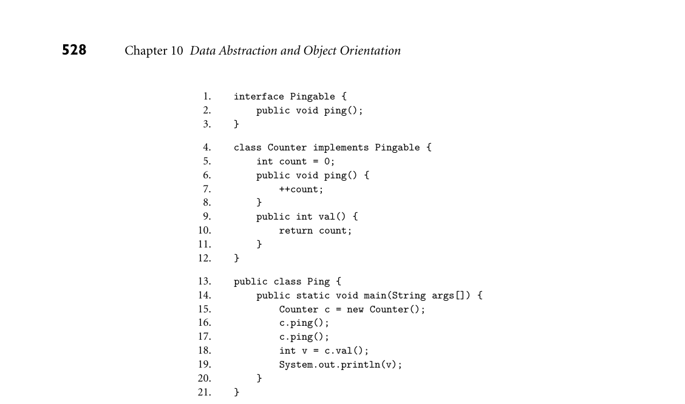

# 10.10 Explorations

### **528**

Chapter 10* Data Abstraction and Object Orientation*
```
1.
interface Pingable {
2.
public void ping();
3.
}
```

```
4.
class Counter implements Pingable {
5.
int count = 0;
6.
public void ping() {
7.
++count;
8.
}
9.
public int val() {
10.
return count;
11.
}
12.
}
```

```
13.
public class Ping {
14.
public static void main(String args[]) {
15.
Counter c = new Counter();
16.
c.ping();
17.
c.ping();
18.
int v = c.val();
19.
System.out.println(v);
20.
}
21.
}
```



*Figure 10.8 A simple program in Java.*

```
(c)
Give assembly-level pseudocode for the call to c.ping at line 17.
Again, assume that the address of c is in register r1, that this is the
same register that should be used to pass this, and that you don’t
need to save or restore any registers.
(d) Give assembly-levelpseudocode for the body of method Counter.ping
(again ignoring register save/restore).
```

### 10.22

In Ruby, as in Java 8 or Scala, an interface (mix-in) can provide method
code as well as signatures. (It can’t provide data members; that would
be multiple inheritance.) Explain why dynamic typing makes this feature
more powerful than it is in the other languages.
### 10.23–10.31 In More Depth.

## 10.10

### **Explorations**

### 10.32

Return for a moment to Exercise 3.7. Build a (more complete) C++ ver-
sion of the singly linked list library of Figure 3.16. Discuss the issue of
