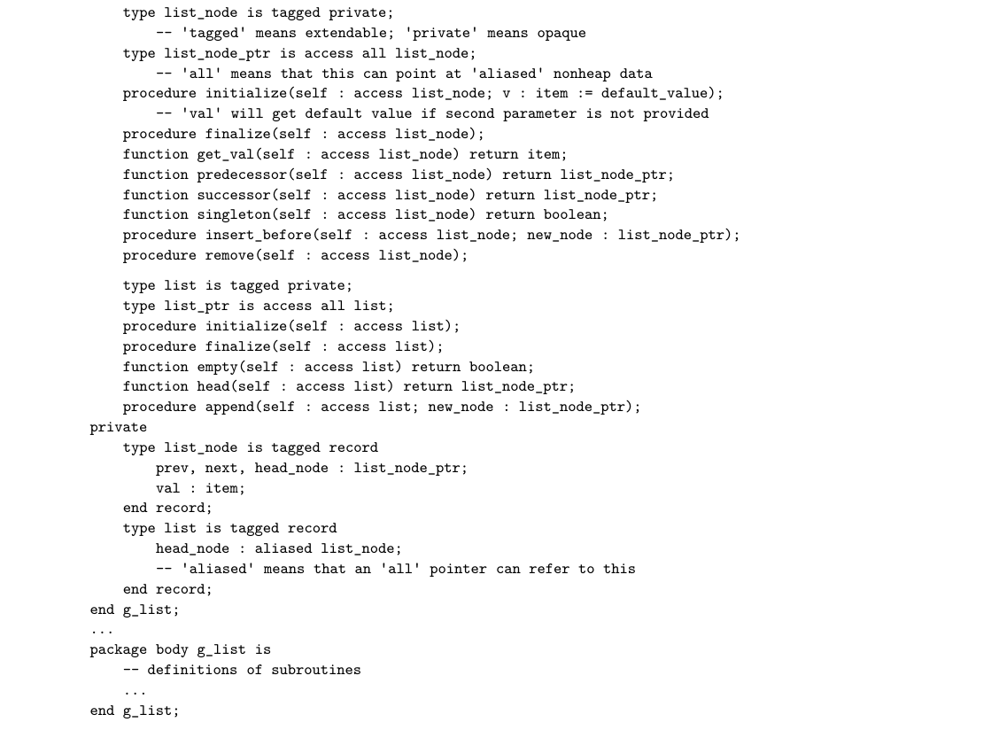
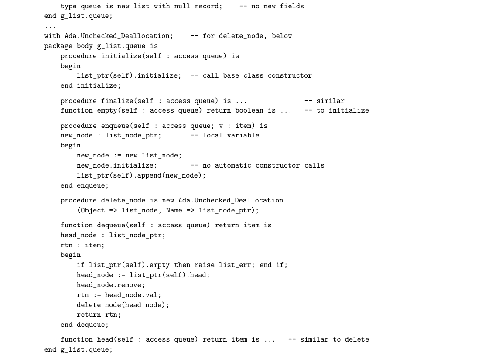

# 10.2 Encapsulation and Inheritance

int_list_node n(3); string_list_node s("boo!"); int_list L; L.append(&n); // ok L.append(&s); // will not compile! ■

In a nutshell, generics exist for the purpose of abstracting over unrelated types, something that inheritance does not support. In addition to C++, generics appear in most other statically typed object-oriented languages, including Eiffel, Java, C#, and OCaml.

3CHECK YOUR UNDERSTANDING 1. What are generally considered to be the three defining characteristics of object-oriented programming? 2. In what programming language of the 1960s does object orientation find its roots? Who invented that language? Summarize the evolution of the three defining characteristics since that time.

3. Name three important benefits of abstraction. 4. What are the more common names for subroutine member and data member?

5. What is a property in C#? 6. What is the purpose of the “private” part of an object interface? Why can’t it be hidden completely? 7. What is the purpose of the :: operator in C++?

8. Explain why in-line subroutines are particularly important in object-oriented languages.

9. What are constructors and destructors? 10. Give two other terms, each, for base class and derived class.

11. Explain why generics may be useful in an object-oriented language, despite the extensive polymorphism already provided by inheritance.

10.2 Encapsulation and Inheritance

Encapsulation mechanisms enable the programmer to group data and the sub- routines that operate on them together in one place, and to hide irrelevant details from the users of an abstraction. In the preceding section (and like- wise Section 3.3.5) we cast object-oriented programming as an extension of the

“module-as-type” mechanisms of Simula and Euclid. It is also possible to cast object-oriented programming in a “module-as-manager” framework. In the first subsection below we consider the data-hiding mechanisms of modules in non-object-oriented languages. In the second subsection we consider the new data-hiding issues that arise when we add inheritance to modules. In the third subsection we briefly return to the module-as-manager approach, and show how several languages, including Ada 95 and Fortran 2003, add inheritance to records, allowing (static) modules to continue to provide data hiding.

10.2.1 Modules

Scope rules for data hiding were one of the principal innovations of Clu, Modula, Euclid, and other module-based languages of the 1970s. In Clu and Euclid, the declaration and definition (header and body) of a module always appeared to- gether. In Modula-2, programmers had the option of placing the header and the body in separate files. Unfortunately, there was no way to divide the header into public and private parts; everything in it was public (i.e., exported). The only concession to data hiding was that pointer types could be declared in a header without revealing the structure of the objects to which they pointed. Compilers could generate code for the users of a module (Sidebar 10.1) without the hidden information, since pointers are all of equal size on most machines. Ada increases flexibility by allowing the header of a package to be divided into EXAMPLE 10.18

Data hiding in Ada public and private parts. Details of an exported type can be made opaque by putting them in the private part of the header and simply naming the type in the public part:

package foo is -- header ... type T is private; ... private -- definitions below here are inaccessible to users ... type T is ... -- full definition ... end foo;

The private part provides the information the compiler needs to allocate objects “in line.” A change to the body of a module never forces recompilation of any of the users of the module. A change to the private part of the module header may force recompilation, but it never requires changes to the source code of the users. A change to the public part of a header is a change to the module’s interface: it will often require us to change the code of users. ■ Because they affect only the visibility of names, static, manager-style modules introduce no special code generation issues. Storage for variables and other data inside a module is managed in precisely the same way as storage for data imme- diately outside the module. If the module appears in a global scope, then its data

can be allocated statically. If the module appears within a subroutine, then its data can be allocated on the stack, at known offsets, when the subroutine is called, and reclaimed when it returns. Module types, as in Euclid and ML, are somewhat more complicated: they allow a module to have an arbitrary number of instances. The obvious imple- mentation then resembles that of a record. If all of the data in the module have a statically known size, then each individual datum can be assigned a static offset within the module’s storage. If the size of some of the data is not known until run time, then the module’s storage can be divided into fixed-size and variable-size portions, with a dope vector (descriptor) at the beginning of the fixed-size por- tion. Instances of the module can be allocated statically, on the stack, or in the heap, as appropriate.

The “this” Parameter

One additional complication arises for subroutines inside a module. How do they know which variables to use? We could, of course, replicate the code for each subroutine in each instance of the module, just as we replicate the data. This replication would be highly wasteful, however, as the copies would vary only in the details of address computations. A better technique is to create a single instance of each module subroutine, and to pass that instance, at run time, the address of the storage of the appropriate module instance. This address takes the form of an extra, hidden first parameter for every module subroutine. A Euclid EXAMPLE 10.19

The hidden this parameter call of the form

my_stack.push(x)

is translated as if it were really

push(my_stack, x)

where my_stack is passed by reference. The same translation occurs in object- oriented languages. ■

Making Do without Module Headers

As noted in Section C 3.8, Java packages and C/C++/C# namespaces can be spread across multiple compilation units (files). In C, C++, and C#, a single file can also contain pieces of more than one namespace. More significantly, many modern languages, including Java and C#, dispense with the notion of separate headers and bodies. While the programmer must still define the interface (and specify it via public declarations), there is no need to manually identify code that needs to be in the header for implementation reasons: instead the compiler is responsible for extracting this information automatically from the full text of the module. For software engineering purposes it may still be desirable to create preliminary “skeleton” versions of a module, against which other modules can be compiled, but this is optional. To assist in project management and documentation, many Java and C# implementations provide a tool that will extract from the complete text of a module the minimum information required by its users.

10.2.2 Classes

With the introduction of inheritance, object-oriented languages must supple- ment the scope rules of module-based languages to cover additional issues. For example, how much control should a base class exercise over the visibility of its members in derived classes? Should private members of a base class be visible to methods of a derived class? Should public members of a base class always be public members of a derived class (i.e., be visible to users of the derived class)? We touched on these questions in Example 10.9, where we declared class queue as a private list, hiding public members of the base class from users of the derived class—except for method empty, which we made explicitly visible again with a using declaration. C++ allows the inverse strategy as well: methods of an EXAMPLE 10.20

Hiding inherited methods otherwise public base class can be explicitly deleted from the derived class:

class queue : public list { ... void append(list_node *new_node) = delete;

Similar deletion mechanisms can be found in Eiffel, Python, and Ruby. ■ In addition to the public and private labels, C++ allows members of a class to be designated protected. A protected member is visible only to methods of its own class or of classes derived from that class. In our examples, a protected member M of list would be accessible not only to methods of list itself but also to methods of queue. Unlike public members, however, M would not be visible to arbitrary users of list or queue objects. The protected keyword can also be used when specifying a base class: EXAMPLE 10.21

protected base class in C++ class derived : protected base { ...

Here public members of the base class act like protected members of the derived class. ■ The basic philosophy behind the visibility rules of C++ can be summarized as follows:

Any class can limit the visibility of its members. Public members are visible anywhere the class declaration is in scope. Private members are visible only inside the class’s methods. Protected members are visible inside methods of the class or its descendants. (As an exception to the normal rules, a class can specify that certain other friend classes or subroutines should have access to its private members.) A derived class can restrict the visibility of members of a base class, but can never increase it.3 Private members of a base class are never visible in a derived

class. Protected and public members of a public base class are protected or public, respectively, in a derived class. Protected and public members of a protected base class are protected members of a derived class. Protected and public members of a private base class are private members of a derived class. A derived class that limits the visibility of members of a base class by declaring that base class protected or private can restore the visibility of individual members of the base class by inserting a using declaration in the protected or public portion of the derived class declaration. A derived class can make methods (though not fields) of a base class inaccessi- ble (to others and to itself) by explicitly delete-ing them.

Other object-oriented languages take different approaches to visibility. Eif- fel is more flexible than C++ in the patterns of visibility it can support, but it does not adhere to the first of the C++ principles above. Derived classes in Eif- fel can both restrict and increase the visibility of members of base classes. Every method (called a feature in Eiffel) can specify its own export status. If the status is {NONE} then the member is effectively private (called secret in Eiffel). If the status is {ANY} then the member is effectively public (called generally available in Eiffel). In the general case the status can be an arbitrary list of class names, in which case the feature is said to be selectively available to those classes and their descendants only. Any feature inherited from a base class can be given a new status in a derived class. Java and C# follow C++ in the declaration of public, protected, and private members, but do not provide the protected and private designa- tions for base classes; a derived class can neither increase nor restrict the visibility of members of a base class. It can, however, hide a field or override a method by defining a new one with the same name; the lack of a scope resolution operator makes the old member inaccessible to users of the new class. In Java, the overrid- ing version of a method cannot have more restrictive visibility than the version in the base class. The protected keyword has a slightly different meaning in Java than it does in C++: a protected member of a Java class is visible not only within derived classes but also within the entire package (namespace) in which the class is de- clared. A class member with no explicit access modifier in Java is visible through- out the package in which the class is declared, but not in any derived classes that reside in other packages. C# defines protected as C++ does, but provides an additional internal keyword that makes a member visible throughout the as- sembly in which the class appears. (An assembly is a collection of linked-together compilation units, comparable to a .jar file in Java.) Members of a C# class are private by default. In Smalltalk and Objective-C, the issue of member visibility never arises: the language allows code at run time to attempt a call of any method name in any object. If the method exists (with the right number of parameters), then the invocation proceeds; otherwise a run-time error results. There is no way in these languages to make a method available to some parts of a program but not to

others. In a related vein, Python class members are always public. In Ruby, fields are always private; more than that, they are accessible only to methods of the individual object to which they belong.

Static Fields and Methods

Orthogonal to the visibility implied by public, private, or protected, most object-oriented languages allow individual fields and methods to be declared static. Static class members are thought of as “belonging” to the class as a whole, not to any individual object. They are therefore sometimes referred to as class fields and methods, as opposed to instance fields and methods. (This termi- nology is most common in languages that create a special metaobject to represent each class—see Example 10.26. The class fields and methods are thought of as belonging to the metaobject.) A single copy of each static field is shared by all instances of its class: changes made to that field in methods of one object will be visible to methods of all other objects of the class. A static method, for its part, has no this parameter (explicit or implicit); it cannot access nonstatic (instance) fields. A nonstatic (instance) method, on the other hand, can access both static and nonstatic fields.

10.2.3 Nesting (Inner Classes)

Many languages allow class declarations to nest. This raises an immediate ques- tion: if Inner is a member of Outer, can Inner’s methods see Outer’s members, and if so, which instance do they see? The simplest answer, adopted in C++ and C#, is to allow access to only the static members of the outer class, since these have only a single instance. In effect, nesting serves simply as a means of information hiding. Java takes a more sophisticated approach. It allows a nested (inner) class EXAMPLE 10.22

Inner classes in Java to access arbitrary members of its surrounding class. Each instance of the inner class must therefore belong to an instance of the outer class.

class Outer { int n; class Inner { public void bar() { n = 1; } } Inner i; Outer() { i = new Inner(); } // constructor public void foo() { n = 0; System.out.println(n); // prints 0 i.bar(); System.out.println(n); // prints 1 } }

If there are multiple instances of Outer, each instance will have a different n, and calls to Inner.bar will access the appropriate n. To make this work, each instance of Inner (of which there may of course be an arbitrary number) must contain a hidden pointer to the instance of Outer to which it belongs. If a nested class in Java is declared to be static, it behaves as in C++ and C#, with access to only the static members of the surrounding class. Java classes can also be nested inside methods. Such a local class has access not only to all members of the surrounding class but also to the parameters and variables of the method in which it is nested. The catch is that any parameters or variables that the nested class actually uses must be “effectively final”—either declared final explicitly or at least never modified (by the nested class, the sur- rounding method, or any other code) after the nested class is elaborated. This rule permits the implementation to make a copy of the referenced objects rather than maintaining a reference (i.e., a static link) to the frame of the surrounding method. ■ Inner and local classes in Java are widely used to create object closures, as de- scribed in Section 3.6.3. In Section 9.6.2 we used them as handlers for events. We also noted that a local class in Java can be anonymous: it can appear, in-line, inside a call to new (Example 9.54).

10.2.4 Type Extensions

Smalltalk, Objective-C, Eiffel, C++, Java, and C# were all designed from the out- set as object-oriented languages, either starting from scratch or from an exist- ing language without a strong encapsulation mechanism. They all support a module-as-type approach to abstraction, in which a single mechanism (the class) provides both encapsulation and inheritance. Several other languages, includ- ing Modula-3 and Oberon (both successors to Modula-2), CLOS, Ada 95/2005, and Fortran 2003, can be characterized as object-oriented extensions to languages in which modules already provide encapsulation. Rather than alter the existing module mechanism, these languages provide inheritance and dynamic method binding through a mechanism for extending records. In Ada 2005, our list and queue abstractions could be defined as shown in EXAMPLE 10.23

List and queue abstractions in Ada 2005 Figure 10.2. To control access to the structure of types, we hide them inside Ada packages. The procedures initialize, finalize, enqueue, and dequeue of g_list.queue can convert their parameter self to a list_ptr, because queue is an extension of list. Package g_list.queue is said to be a child of package g_list because its name is prefixed with that of its parent. A child package in Ada is similar to a derived class in Eiffel or C++, except that it is still a manager, not a type. Like Eiffel, but unlike C++, Ada allows the body of a child package to see the private parts of the parent package. All of the list and queue subroutines in Figure 10.2 take an explicit first param- eter. Ada 95 and CLOS do not use “object.method()” notation. Python and Ada 2005 do use this notation, but only as syntactic sugar: a call to A.B(C, D)

*Figure 10.2 Generic list and queue abstractions in Ada 2005. The tagged types list and queue provide inheritance; the packages provide encapsulation. Declaring self to have type access XX (instead of XX_ptr) causes the compiler to recognize the subroutine as a method of the tagged type; ptr.method(args) is syntactic sugar for method(ptr,args) if ptr refers to an object of a tagged type. Function delete_node (next page) uses the Unchecked_Deallocation library package to create a type-specific routine for memory reclamation. The expression list_ptr(self) is a (type-safe) cast. (continued)*

*Figure 10.2 (continued)*

is interpreted as a call to B(A, C, D), where B is declared as a three-parameter subroutine. Arbitrary Ada code can pass an object of type queue to any routine that expects a list; as in Java, there is no way for a derived type to hide the public members of a base type. ■

10.2.5 Extending without Inheritance

The desire to extend the functionality of an existing abstraction is one of the prin- cipal motivations for object-oriented programming. Inheritance is the standard mechanism that makes such extension possible. There are times, however, when inheritance is not an option, particularly when dealing with preexisting code. The class one wants to extend may not permit inheritance, for instance: in Java, it may be labeled final; in C#, it may be sealed. Even if inheritance is possible in prin- ciple, there may be a large body of existing code that uses the original class name, and it may not be feasible to go back and change all the variable and parameter declarations to use a new derived type. For situations like these, C# provides extension methods, which give the appear- EXAMPLE 10.24

Extension methods in C# ance of extending an existing class:

static class AddToString { public static int toInt(this string s) { return int.Parse(s); } }

An extension method must be static, and must be declared in a static class. Its first parameter must be prefixed with the keyword this. The method can then be invoked as if it were a member of the class of which this is an instance:

int n = myString.toInt();

Together, the method declaration and use are syntactic sugar for

static class AddToString { public static int toInt (string s) { // no 'this' return int.Parse(s); } } ... int n = AddToString.toInt(myString); ■

No special functionality is available to extension methods. In particular, they cannot access private members of the class that they extend, nor do they support dynamic method binding (Section 10.4). By contrast, several scripting languages, including JavaScript and Ruby, really do allow the programmer to add new meth- ods to existing classes—or even to individual objects. We will explore these op- tions further in Section 14.4.4.

