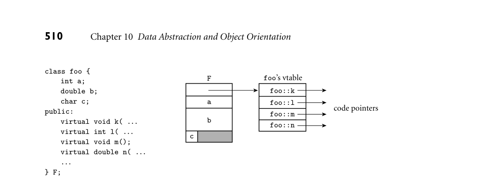
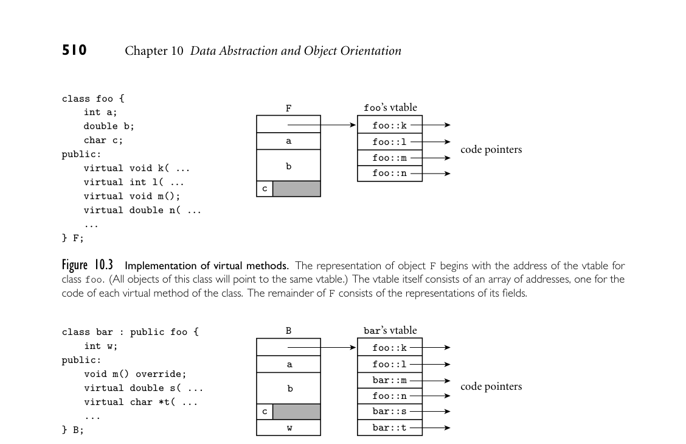

# 10.4 Dynamic Method Binding

10.4 Dynamic Method Binding 505

In modern C++ code, storage management is often facilitated through the use of smart pointers (Section 8.5.3). These arrange, in the destructor for a pointer, to determine whether any other pointers to the same object continue to exist—and if not, to reclaim that pointed-to object. ■ In languages with automatic garbage collection, there is much less need for destructors. In fact, the entire idea of destruction is suspect in a garbage-collected language, because the programmer has little or no control over when an object is going to be destroyed. Java and C# allow the programmer to declare a finalize method that will be called immediately before the garbage collector reclaims the space for an object, but the feature is not widely used.

3CHECK YOUR UNDERSTANDING 23. Does a constructor allocate space for an object? Explain. 24. What is a metaclass in Smalltalk?

25. Why is object initialization simpler in a language with a reference model of variables (as opposed to a value model)? 26. How does a C++ (or Java or C#) compiler tell which constructor to use for a given object? How does the answer differ for Eiffel and Smalltalk? 27. What is escape analysis? Describe why it might be useful in a language with a reference model of variables. 28. Summarize the rules in C++ that determine the order in which constructors are called for a class, its base class(es), and the classes of its fields. How are these rules simplified in other languages?

29. Explain the difference between initialization and assignment in C++. 30. Why does C++ need destructors more than Eiffel does?

10.4 Dynamic Method Binding

One of the principal consequences of inheritance/type extension is that a derived class D has all the members—data and subroutines—of its base class C. As long as D does not hide any of the publicly visible members of C (see Exercise 10.15), it makes sense to allow an object of class D to be used in any context that expects an object of class C: anything we might want to do to an object of class C we can also do to an object of class D. In other words, a derived class that does not hide any publicly visible members of its base class is a subtype of that base class. The ability to use a derived class in a context that expects its base class is called subtype polymorphism. If we imagine an administrative computing system for a EXAMPLE 10.37

Derived class objects in a base class context university, we might derive classes student and professor from class person:

506 Chapter 10 Data Abstraction and Object Orientation

class person { ... class student : public person { ... class professor : public person { ...

Because both student and professor objects have all the properties of a person object, we should be able to use them in a person context:

student s; professor p; ... person *x = &s; person *y = &p;

Moreover a subroutine like

void person::print_mailing_label() { ...

would be polymorphic—capable of accepting arguments of multiple types:

s.print_mailing_label(); // i.e., print_mailing_label(s) p.print_mailing_label(); // i.e., print_mailing_label(p)

As with other forms of polymorphism, we depend on the fact that print_mail- ing_label uses only those features of its formal parameter that all actual param- eters will have in common. ■ But now suppose that we have redefined print_mailing_label in each of EXAMPLE 10.38

Static and dynamic method binding the two derived classes. We might, for example, want to encode certain infor- mation (student’s year in school, professor’s home department) in the corner of the label. Now we have multiple versions of our subroutine—student:: print_mailing_label and professor::print_mailing_label, rather than the single, polymorphic person::print_mailing_label. Which version we will get depends on the object:

s.print_mailing_label(); // student::print_mailing_label(s) p.print_mailing_label(); // professor::print_mailing_label(p)

But what about

x->print_mailing_label(); // ?? y->print_mailing_label(); // ??

Does the choice of the method to be called depend on the types of the variables x and y, or on the classes of the objects s and p to which those variables refer? ■ The first option (use the type of the reference) is known as static method bind- ing. The second option (use the class of the object) is known as dynamic method binding. Dynamic method binding is central to object-oriented programming. Imagine, for example, that our administrative computing program has created a list of persons who have overdue library books. The list may contain both students and professors. If we traverse the list and print a mailing label for each person, dynamic method binding will ensure that the correct printing rou- tine is called for each individual. In this situation the definitions in the derived classes are said to override the definition in the base class.

10.4 Dynamic Method Binding 507

Semantics and Performance

The principal argument against static method binding—and thus in favor of dynamic binding based on the type of the referenced object—is that the static approach denies the derived class control over the consistency of its own state. Suppose, for example, that we are building an I/O library that contains a EXAMPLE 10.39

The need for dynamic binding text_file class:

class text_file { char *name; long position; // file pointer public: void seek(long whence); ... };

Now suppose we have a derived class read_ahead_text_file:

class read_ahead_text_file : public text_file { char *upcoming_characters; public: void seek(long whence); // redefinition ... };

The code for read_ahead_text_file::seek will undoubtedly need to change the value of the cached upcoming_characters. If the method is not dynami- cally dispatched, however, we cannot guarantee that this will happen: if we pass a read_ahead_text_file reference to a subroutine that expects a text_file ref- erence as argument, and if that subroutine then calls seek, we’ll get the version of seek in the base class. ■ Unfortunately, as we shall see in Section 10.4.3, dynamic method binding imposes run-time overhead. While this overhead is generally modest, it is nonetheless a concern for small subroutines in performance-critical applications. Smalltalk, Objective-C, Python, and Ruby use dynamic method binding for all methods. Java and Eiffel use dynamic method binding by default, but allow indi- vidual methods and (in Java) classes to be labeled final (Java) or frozen (Eiffel), in which case they cannot be overridden by derived classes, and can therefore employ an optimized implementation. Simula, C++, C#, and Ada 95 use static method binding by default, but allow the programmer to specify dynamic binding when desired. In these latter languages it is common terminology to distinguish between overriding a method that uses dynamic binding and (merely) redefining a method that uses static binding. For the sake of clarity, C# requires explicit use of the keywords override and new whenever a method in a derived class overrides or redefines (respectively) a method of the same name in a base class. Java and C++11 have similar annotations whose use is encouraged but not required.

508 Chapter 10 Data Abstraction and Object Orientation

10.4.1 Virtual and Nonvirtual Methods

In Simula, C++, and C#, which use static method binding by default, the pro- grammer can specify that particular methods should use dynamic binding by labeling them as virtual. Calls to virtual methods are dispatched to the ap- propriate implementation at run time, based on the class of the object, rather than the type of the reference. In C++ and C#, the keyword virtual prefixes the EXAMPLE 10.40

Virtual methods in C++ and C# subroutine declaration:5

class person { public: virtual void print_mailing_label(); ... ■

Ada 95 adopts a different approach. Rather than associate dynamic dispatch with particular methods, the Ada 95 programmer associates it with certain refer- ences. In our mailing label example, a formal parameter or an access variable EXAMPLE 10.41

Class-wide types in Ada 95 (pointer) can be declared to be of the class-wide type person‚Class, in which case all calls to all methods of that parameter or variable will be dispatched based on the class of the object to which it refers:

type person is tagged record ... type student is new person with ... type professor is new person with ...

procedure print_mailing_label(r : person) is ... procedure print_mailing_label(s : student) is ... procedure print_mailing_label(p : professor) is ...

procedure print_appropriate_label(r : person'Class) is begin print_mailing_label(r); -- calls appropriate overloaded version, depending -- on type of r at run time end print_appropriate_label; ■

10.4.2 Abstract Classes

In most object-oriented languages it is possible to omit the body of a virtual method in a base class. In Java and C#, one does so by labeling both the class EXAMPLE 10.42

Abstract methods in Java and C# and the missing method as abstract:

5 C++ also uses the virtual keyword in certain circumstances to prefix the name of a base class in the header of the declaration of a derived class. This usage supports the very different purpose of shared multiple inheritance, which we will consider in Section C 10.6.3.

10.4 Dynamic Method Binding 509

abstract class person { ... public abstract void print_mailing_label(); ... ■

The notation in C++ is somewhat less intuitive: one follows the subroutine dec- EXAMPLE 10.43

Abstract methods in C++ laration with an “assignment” to zero:

class person { ... public: virtual void print_mailing_label() = 0; ...

C++ refers to abstract methods as pure virtual methods. ■ Regardless of declaration syntax, a class is said to be abstract if it has at least one abstract method. It is not possible to declare an object of an abstract class, because it would be missing at least one member. The only purpose of an abstract class is to serve as a base for other, concrete classes. A concrete class (or one of its intermediate ancestors) must provide a real definition for every abstract method it inherits. The existence of an abstract method in a base class provides a “hook” for dynamic method binding; it allows the programmer to write code that calls methods of (references to) objects of the base class, under the assumption that appropriate concrete methods will be invoked at run time. Classes that have no members other than abstract methods—no fields or method bodies—are called interfaces in Java, C#, and Ada 2005. They support a restricted, “mix-in” form of multiple inheritance, which we will consider in Section 10.5.6

10.4.3 Member Lookup

With static method binding (as in Simula, C++, C#, or Ada 95), the compiler can always tell which version of a method to call, based on the type of the variable being used. With dynamic method binding, however, the object referred to by EXAMPLE 10.44

Vtables a reference or pointer variable must contain sufficient information to allow the code generated by the compiler to find the right version of the method at run time. The most common implementation represents each object with a record whose first field contains the address of a virtual method table (vtable) for the object’s class (see Figure 10.3). The vtable is an array whose ith entry indicates the address of the code for the object’s ith virtual method. All objects of a given concrete class share the same vtable. ■ Suppose that the this (self) pointer for methods is passed in register r1, EXAMPLE 10.45

Implementation of a virtual method call that m is the third method of class foo, and that f is a pointer to an object of class foo. Then the code to call f->m() looks something like this:

6 Terminology differs in other languages. In Eiffel, an interface is called a fully deferred class. In Scala, it’s called a trait.

*Figure 10.3 Implementation of virtual methods. The representation of object F begins with the address of the vtable for class foo. (All objects of this class will point to the same vtable.) The vtable itself consists of an array of addresses, one for the code of each virtual method of the class. The remainder of F consists of the representations of its fields.*

*Figure 10.4 Implementation of single inheritance. As in Figure 10.3, the representation of object B begins with the address of its class’s vtable. The first four entries in the table represent the same members as they do for foo, except that one—m—has been overridden and now contains the address of the code for a different subroutine. Additional fields of bar follow the ones inherited from foo in the representation of B; additional virtual methods follow the ones inherited from foo in the vtable of class bar.*

r1 := f r2 := ∗r1 –– vtable address r2 := ∗(r2 + (3−1) × 4) –– assuming 4 = sizeof (address) call ∗r2

On a typical modern machine this calling sequence is two instructions (both of which access memory) longer than a call to a statically identified method. The extra overhead can be avoided whenever the compiler can deduce the type of the relevant object at compile time. The deduction is trivial for calls to methods of object-valued variables (as opposed to references and pointers). ■ If bar is derived from foo, we place its additional fields at the end of the EXAMPLE 10.46

Implementation of single inheritance “record” that represents it. We create a vtable for bar by copying the vtable for foo, replacing the entries of any virtual methods overridden by bar, and append- ing entries for any virtual methods introduced in bar (see Figure 10.4). If we have an object of class bar we can safely assign its address into a variable of type foo*:

10.4 Dynamic Method Binding 511

class foo { ... class bar : public foo { ... ... foo F; bar B; foo* q; bar* s; ... q = &B; // ok; references through q will use prefixes // of B's data space and vtable s = &F; // static semantic error; F lacks the additional // data and vtable entries of a bar

In C++ (as in all statically typed object-oriented languages), the compiler can verify the type correctness of this code statically. It may not know what the class of the object referred to by q will be at run time, but it knows that it will either be foo or something derived (directly or indirectly) from foo, and this ensures that it will have all the members that may be accessed by foo-specific code. ■ C++ allows “backward” assignments by means of a dynamic_cast operator: EXAMPLE 10.47

Casts in C++ s = dynamic_cast<bar*>(q); // performs a run-time check

If the run-time check fails, s is assigned a null pointer. For backward compatibil- ity C++ also supports traditional C-style casts of object pointers and references:

s = (bar*) q; // permitted, but risky

With a C-style cast it is up to the programmer to ensure that the actual object involved is of an appropriate type: no dynamic semantic check is performed. ■ Java and C# employ the traditional cast notation, but perform the dy- namic check. Eiffel has a reverse assignment operator, ?=, which (like the C++ EXAMPLE 10.48

Reverse assignment in Eiffel and C# dynamic_cast) assigns an object reference into a variable if and only if the type at run time is acceptable:

DESIGN & IMPLEMENTATION

10.6 Reverse assignment Implementations of Eiffel, Java, C#, and C++ support dynamic checks on re- verse assignment by including in each vtable the address of a run-time type de- scriptor. In C++, dynamic_cast is permitted only on pointers and references of polymorphic types (classes with virtual methods), since objects of nonpoly- morphic types do not have vtables. A separate static_cast operation can be used on nonpolymorphic types, but it performs no run-time check, and is thus inherently unsafe when applied to a pointer of a derived class type.

512 Chapter 10 Data Abstraction and Object Orientation

class foo ... class bar inherit foo ... ... f : foo b : bar ... f := b -- always ok b ?= f -- reverse assignment: b gets f if f refers to a bar object -- at run time; otherwise b gets void

C# provides an as operator that performs a similar function. ■ As noted in Section 7.3, Smalltalk employs “duck typing”: variables are un- typed references, and a reference to any object may be assigned into any vari- able. Only when code actually attempts to invoke an operation (send a “mes- sage”) at run time does the language implementation check to see whether the operation is supported by the object; if so, the object’s type is assumed to be ac- ceptable. The implementation is straightforward: fields of an object are never

DESIGN & IMPLEMENTATION

10.7 The fragile base class problem Under certain circumstances, it can be desirable to perform method lookup at run time even when the language permits compile-time lookup. In Java, for example, dynamic lookup (or “just-in-time” compilation) can help to avoid important instances of the fragile base class problem, in which seemingly be- nign changes to a base class may break the behavior of a derived class. Java implementations depend on the presence of a large standard library. This library is expected to evolve over time. Though the designers will presum- ably be careful to maximize backward compatibility—seldom if ever deleting any members of a class—it is likely that users of old versions of the library will on occasion attempt to run code that was written with a new version of the library in mind. In such a situation it would be disastrous to rely on static as- sumptions about the representation of library classes: code that tries to use a newly added library feature could end up accessing memory beyond the end of the available representation. Run-time method lookup, by contrast (or com- pilation performed against the currently available version of the library), will produce a helpful “member not found in your version of the class” dynamic error message. A variety of other techniques can be used to guard against aspects of the fragile base class problem. In Objective-C, for example, modifications to a li- brary class typically take the form of a separately compiled extension called a category, which is loaded into a program at run time. The loading mecha- nism updates the dictionary in which the runtime system performs dynamic method lookup. Without the category, attempts to use the new functionality will automatically elicit a “method not found” error.

10.4 Dynamic Method Binding 513

public; methods provide the only means of object interaction. The representa- tion of an object begins with the address of a type descriptor. The type descriptor contains a dictionary that maps method names to code fragments. At run time, the Smalltalk interpreter performs a lookup operation in the dictionary to see if the method is supported. If not, it generates a “message not understood” error— the equivalent of a type-clash error in Lisp. CLOS, Objective-C, Swift, and the object-oriented scripting languages provide similar semantics, and invite similar implementations. The dynamic approach is arguably more flexible than the static, but it imposes significant cost when methods are small, and delays the reporting of errors. In addition to imposing the overhead of indirection, virtual methods often preclude the in-line expansion of subroutines at compile time. The lack of in-line subroutines can be a serious performance problem when subroutines are small and frequently called. Like C, C++ attempts to avoid run-time overhead when- ever possible: hence its use of static method binding as the default, and its heavy reliance on object-valued variables, for which even virtual methods can be dis- patched at compile time.

10.4.4 Object Closures

We have noted (in Section 3.6.4 and elsewhere) that object closures can be used in an object-oriented language to achieve roughly the same effect as subroutine closures in a language with nested subroutines—namely, to encapsulate a method with context for later execution. It should be noted that this mechanism relies, for its full generality, on dynamic method binding. Recall the plus_x object closure EXAMPLE 10.49

Virtual methods in an object closure from Example 3.36, here adapted to the apply_to_A code of Example 9.23, and rewritten in generic form:

template<typename T> class un_op { public: virtual T operator()(T i) const = 0; };

class plus_x : public un_op<int> { const int x; public: plus_x(int n) : x(n) { } virtual int operator()(int i) const { return i + x; } };

void apply_to_A(const un_op<int>& f, int A[], int A_size) { int i; for (i = 0; i < A_size; i++) A[i] = f(A[i]); } ...

514 Chapter 10 Data Abstraction and Object Orientation

int A[10]; apply_to_A(plus_x(2), A, 10);

Any object derived from un_op<int> can be passed to apply_to_A. The “right” function will always be called because operator() is virtual. ■ A particularly useful idiom for many applications is to encapsulate a method and its arguments in an object closure for later execution. Suppose, for example, EXAMPLE 10.50

Encapsulating arguments that we are writing a discrete event simulation, as described in Section C 9.5.4. We might like a general mechanism that allows us to schedule a call to an arbitrary subroutine, with an arbitrary set of parameters, to occur at some future point in time. If the subroutines we want to have called vary in their numbers and types of parameters, we won’t be able to pass them to a general-purpose schedule_at routine. We can solve the problem with object closures, as shown in Figure 10.5. This technique is sufficiently common that C++11 supports it with standard li- brary routines. The fn_call and call_foo classes of Figure 10.5 could be omit- ted in C++11. Function schedule_at would then be defined to take an object of class std::function<void()> (function object encapsulating a function to be called with zero arguments) as its first parameter. Object cf, which Figure 10.5 passes in that first parameter position, would be declared as

std::function<void()> cf = std::bind(foo, 3, 3.14, 'x');

The bind routine (an automatically instantiated generic function) encapsulates its first parameter (a function) together with the arguments that should eventually be passed to that function. The standard library even provides a “placeholder” mechanism (not shown here) that allows the programmer to bind only a subset of the function’s parameters, so that parameters eventually passed to the function object can be used to fill in the remaining positions. ■ Object closures are commonly used in Java (and several other languages) to encapsulate start-up arguments for newly created threads of control (more on this in Section 13.2.3). They can also be used (as noted in Exploration 6.46) to implement iterators via the visitor pattern.

3CHECK YOUR UNDERSTANDING 31. Explain the difference between dynamic and static method binding (i.e., be- tween virtual and nonvirtual methods). 32. Summarize the fundamental argument for dynamic method binding. Why do C++ and C# use static method binding by default? 33. Explain the distinction between redefining and overriding a method.

34. What is a class-wide type in Ada 95? 35. Explain the connection between dynamic method binding and polymor- phism.

*Figure 10.5 Subroutine pointers and virtual methods. Class call_foo encapsulates a subrou- tine pointer and values to be passed to the subroutine. It exports a parameter-less subroutine that can be used to trigger the encapsulated call.*

36. What is an abstract method (also called a pure virtual method in C++ and a deferred feature in Eiffel)? 37. What is reverse assignment? Why does it require a run-time check?

38. What is a vtable? How is it used? 39. What is the fragile base class problem?

40. What is an abstract (deferred) class? 41. Explain the importance of virtual methods for object closures.

