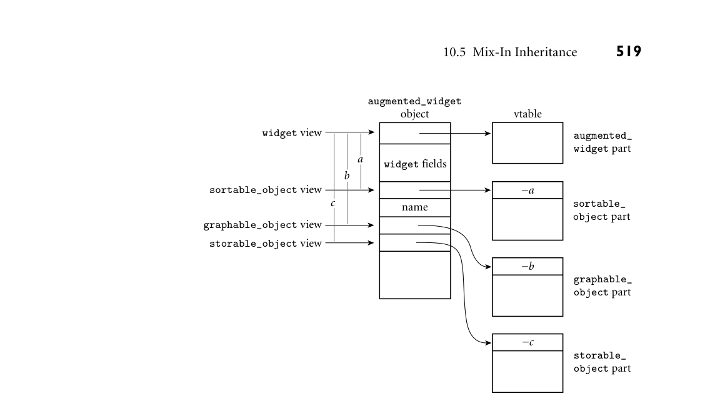

# 10.5 Mix-In Inheritance

**516**
Chapter 10* Data Abstraction and Object Orientation*

## 10.5

**Mix-In Inheritance**
```
When building an object-oriented system, it is often difficult to design a perfect
inheritance tree, in which every class has exactly one parent. A cat may be an
animal, a pet, a family_member, or an object_of_affection. A widget in
the company database may be a sortable_object (from the reporting system’s
perspective), a graphable_object (from the window system’s perspective), or
a storable_object (from the file system’s perspective); how do we choose just
one?
In the general case, we could imagine allowing a class to have an arbitrary
number of parents, each of which could provide it with both fields and methods
(both abstract and concrete). This sort of “true” multiple inheritance is provided
by several languages, including C++, Eiffel, CLOS, OCaml, and Python; we will
consider it in Section 10.6. Unfortunately, it introduces considerable complexity
in both language semantics and run-time implementation. In practice, a more
limited mechanism, known as mix-in inheritance, is often all we really need.
Consider our widgets, for example. Odds are, the reporting system doesn’t
EXAMPLE 10.51
```

```
The motivation for
interfaces
really define what a widget is; it simply needs to be able to manipulate widgets in
certain well-defined ways—to sort them, for example. Likewise, the windowing
system probably doesn’t need to provide any state or functionality for widgets; it
simply needs to be able to display them on a screen. To capture these sorts of re-
quirements, a language with mix-in inheritance allows the programmer to define
the interface that a class must provide in order for its objects to be used in certain
contexts. For widgets, the reporting system might define a sortable_object
interface; the window system might define a graphable_object interface; the
file system might define a storable_object interface. No actual functional-
ity would be provided by any of the interfaces: the designer of the widget class
would need to provide appropriate implementations.
■
In effect—as we noted in Section 10.4.2—an interface is a class containing only
abstract methods—no fields or method bodies. So long as it inherits from only
one “real” parent, a class can “mix in” an arbitrary number of interfaces. If a for-
mal parameter of a subroutine is declared to have an interface type, then any class
that implements (inherits from) that interface can be passed as the corresponding
actual parameter. The classes of objects that can legitimately be passed need not
have a common class ancestor.
In recent years, mix-ins have become a common approach—arguably the
dominant approach—to multiple inheritance. Though details vary from one lan-
guage to another, interfaces appear in Java, C#, Scala, Objective-C, Swift, Go,
Ada 2005, and Ruby, among others.
Elaborating on our widget example, suppose that we have been given general-
EXAMPLE 10.52
```

Mixing interfaces into a
derived class
purpose Java code that will sort objects according to some textual field, display a
graphic representation of an object within a web browser window (hiding and
refreshing as appropriate), and store references to objects by name in a dictionary
data structure. Each of these capabilities would be represented by an interface.

```
view of its parameter—a way to find the parameter’s get_stored_name method.
The get_stored_name method, however, is implementedby augmented_widget,
and will expect an augmented_widget view of its this parameter—a way to find
the object’s fields and other methods. Given that augmented_widget implements
three different interfaces, there is no way that a single vtable can suffice: its first
entry can’t be the first method of sortable_object, graphable_object, and
storable_object simultaneously.
The most common solution, shown in Figure 10.7, is to include three extra
vtable pointers in each augmented_widget object—one for each of the imple-
mented interfaces. For each interface view we can then use a pointer to the place
within the object where the corresponding vtable pointer appears. The offset of
that pointer from the beginning of the object is known as the “this correction”;
it is stored at the beginning of the vtable.
Suppose now that we wish to call dictionary.insert on an augmented_
widget object w, whose address is currently in register r1. The compiler, which
knows the offset c of w’s storable_object vtable pointer, will add c to r1 be-
fore passing it to insert. So far so good. What happens when insert calls
storable_object.get_stored_name?
Assuming that the storable_object
view of w is available in, say, register r1, the compiler will generate code that looks
something like this:
```

```
r2 := ∗r1
–– vtable address
r3 := ∗r2
–– this correction
r3 +:= r1
–– address of w
call ∗(r2+4)
–– method address
```

```
Here we have assumed that the this correction occupies the first four bytes
of the vtable, and that the address of get_stored_name lies immediately af-
ter it, in the table’s first regular slot. We have also assumed that this should
be passed in register r3, and that there are no other arguments. On a typi-
cal modern machine this code is two instructions (a load and a subtraction)
```

widget view

widget fields

name

vtable

−*a*

−*b*

−*c*

sortable_object view

graphable_object view

storable_object view



*Figure 10.7 Implementation of mix-in inheritance. Objects of class augmented_widget con- tain four vtable addresses, one for the class itself (as in Figure 10.3), and three for the imple- mented interfaces. The view of the object that is passed to interface routines points directly at the relevant vtable pointer. The vtable then begins with a “this correction” offset, used to regenerate a pointer to the object itself.*

```
longer than the code required with single inheritance. Once it executes, however,
augmented_widget.get_stored_name will be running with exactly the param-
eter it expects: a reference to an augmented_widget object.
■
```

10.5.2** Extensions**

```
The description of interfaces above reflects historical versions of Java, with one
omission: in addition to abstract methods, an interface can define static final
(constant) fields. Because such fields can never change, they introduce no run-
time complexity or overhead—the compiler can, effectively, expand them in place
wherever they are used.
Beginning with Java 8, interfaces have also been extended to allow static
and default methods, both of which are given bodies—code—in the declara-
tion of the interface. A static method, like a static final field, introduces
no implementation complexity: it requires no access to object fields, so there is
no ambiguity about what view to pass as this—there is no this parameter. De-
fault methods are a bit more tricky. Their code is intended to be used by any
class that does not override it. This convention is particularly valuable for library
```

