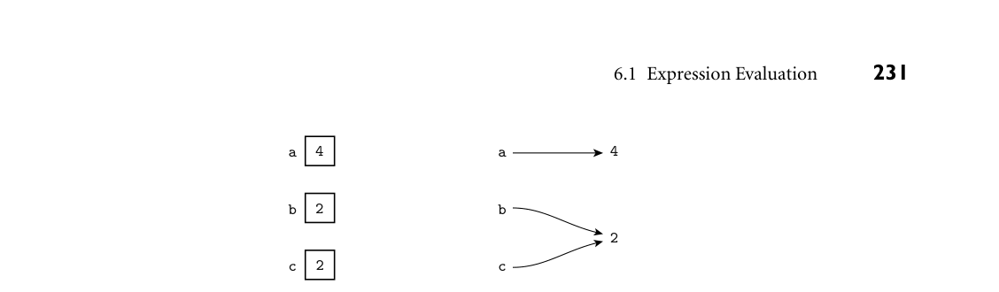

# 6.1 Expression Evaluation

224 Chapter 6 Control Flow

dition turns out to be false, execution branches to a handler that executes in place of the remainder of the protected fragment (in the case of exception han- dling), or in place of the entire protected fragment (in the case of speculation). For speculation, the language implementation must be able to undo, or “roll back,” any visible effects of the protected code. 8. Nondeterminacy: The ordering or choice among statements or expressions is deliberately left unspecified, implying that any alternative will lead to correct results. Some languages require the choice to be random, or fair, in some for- mal sense of the word.

Though the syntactic and semantic details vary from language to language, these categories cover all of the control-flow constructs and mechanisms found in most programming languages. A programmer who thinks in terms of these categories, rather than the syntax of some particular language, will find it easy to learn new languages, evaluate the tradeoffs among languages, and design and reason about algorithms in a language-independent way. Subroutines are the subject of Chapter 9. Concurrency is the subject of Chap- ter 13. Exception handling and speculation are discussed in those chapters as well, in Sections 9.4 and 13.4.4. The bulk of the current chapter (Sections 6.3 through 6.7) is devoted to the five remaining categories. We begin in Section 6.1 by considering the evaluation of expressions—the building blocks on which all higher-level ordering is based. We consider the syntactic form of expressions, the precedence and associativity of operators, the order of evaluation of operands, and the semantics of the assignment statement. We focus in particular on the distinction between variables that hold a value and variables that hold a reference to a value; this distinction will play an important role many times in future chap- ters. In Section 6.2 we consider the difference between structured and unstructured (goto-based) control flow. The relative importance of different categories of control flow varies signif- icantly among the different classes of programming languages. Sequencing is central to imperative (von Neumann and object-oriented) languages, but plays a relatively minor role in functional languages, which emphasize the evaluation of expressions, de-emphasizing or eliminating statements (e.g., assignments) that affect program output in any way other than through the return of a value. Sim- ilarly, functional languages make heavy use of recursion, while imperative lan- guages tend to emphasize iteration. Logic languages tend to de-emphasize or hide the issue of control flow entirely: The programmer simply specifies a set of infer- ence rules; the language implementation must find an order in which to apply those rules that will allow it to deduce values that satisfy some desired property. 6.1 Expression Evaluation

An expression generally consists of either a simple object (e.g., a literal constant, or a named variable or constant) or an operator or function applied to a col-

6.1 Expression Evaluation 225

lection of operands or arguments, each of which in turn is an expression. It is conventional to use the term operator for built-in functions that use special, simple syntax, and to use the term operand for an argument of an operator. In EXAMPLE 6.1

A typical function call most imperative languages, function calls consist of a function name followed by a parenthesized, comma-separated list of arguments, as in

my_func(A, B, C) ■

Operators are typically simpler, taking only one or two arguments, and dispensing EXAMPLE 6.2

Typical operators with the parentheses and commas:

a + b - c

As we saw in Section 3.5.2, some languages define their operators as syntactic sugar for more “normal”-looking functions. In Ada, for example, a + b is short for "+"(a, b); in C++, a + b is short for a.operator+(b) or operator+(a, b) (whichever is defined). ■ In general, a language may specify that function calls (operator invocations) employ prefix, infix, or postfix notation. These terms indicate, respectively, whether the function name appears before, among, or after its several arguments:

prefix: op a b or op (a, b) or (op a b) infix: a op b postfix: a b op

Most imperative languages use infix notation for binary operators and prefix notation for unary operators and (with parentheses around the arguments) other functions. Lisp uses prefix notation for all functions, but with the third of the EXAMPLE 6.3

Cambridge Polish (prefix) notation variants above: in what is known as Cambridge Polish1 notation, it places the function name inside the parentheses:

(* (+ 1 3) 2) ; that would be (1 + 3) * 2 in infix (append a b c my_list) ■

ML-family languages dispense with the parentheses altogether, except when EXAMPLE 6.4

Juxtaposition in ML they are required for disambiguation:

max (2 + 3) 4;; =⇒5 ■

1 Prefix notation was popularized by Polish logicians of the early 20th century; Lisp-like parenthe- sized syntax was first employed (for noncomputational purposes) by philosopher W. V. Quine of Harvard University (Cambridge, MA).

226 Chapter 6 Control Flow

A few languages, notably ML and the R scripting language, allow the user to create new infix operators. Smalltalk uses infix notation for all functions (which it calls messages), both built-in and user-defined. The following Smalltalk state- EXAMPLE 6.5

Mixfix notation in Smalltalk ment sends a “displayOn: at:” message to graphical object myBox, with ar- guments myScreen and 100@50 (a pixel location). It corresponds to what other languages would call the invocation of the “displayOn: at:” function with ar- guments myBox, myScreen, and 100@50.

myBox displayOn: myScreen at: 100@50 ■

This sort of multiword infix notation occurs occasionally in other languages as EXAMPLE 6.6

Conditional expressions well.2 In Algol one can say

a := if b <> 0 then a/b else 0;

Here “if... then ... else” is a three-operand infix operator. The equivalent op- erator in C is written “... ? ... : ...”:

a = b != 0 ? a/b : 0; ■

Postfix notation is used for most functions in Postscript, Forth, the input lan- guage of certain hand-held calculators, and the intermediate code of some com- pilers. Postfix appears in a few places in other languages as well. Examples in- clude the pointer dereferencing operator (^) of Pascal and the post-increment and decrement operators (++ and --) of C and its descendants.

6.1.1 Precedence and Associativity

Most languages provide a rich set of built-in arithmetic and logical operators. When written in infix notation, without parentheses, these operators lead to am- biguity as to what is an operand of what. In Fortran, for example, which uses ** EXAMPLE 6.7

A complicated Fortran expression for exponentiation, how should we parse a + b * c**d**e/f? Should this be grouped as

((((a + b) * c)**d)**e)/f

or

a + (((b * c)**d)**(e/f))

or

2 Most authors use the term “infix” only for binary operators. Multiword operators may be called “mixfix,” or left unnamed.

6.1 Expression Evaluation 227

a + ((b * (c**(d**e)))/f)

or yet some other option? (In Fortran, the answer is the last of the options shown.) ■ In any given language, the choice among alternative evaluation orders depends on the precedence and associativity of operators, concepts we introduced in Sec- tion 2.1.3. Issues of precedence and associativity do not arise in prefix or postfix notation. Precedence rules specify that certain operators, in the absence of parentheses, group “more tightly” than other operators. In most languages multiplication and EXAMPLE 6.8

Precedence in four influential languages division group more tightly than addition and subtraction, so 2 + 3 × 4 is 14 and not 20. Details vary widely from one language to another, however. Figure 6.1 shows the levels of precedence for several well-known languages. ■ The precedence structure of C (and, with minor variations, of its descendants, C++, Java, and C#) is substantially richer than that of most other languages. It is, in fact, richer than shown in Figure 6.1, because several additional constructs, including type casts, function calls, array subscripting, and record field selection, are classified as operators in C. It is probably fair to say that most C program- mers do not remember all of their language’s precedence levels. The intent of the language designers was presumably to ensure that “the right thing” will usu- ally happen when parentheses are not used to force a particular evaluation order. Rather than count on this, however, the wise programmer will consult the manual or add parentheses. It is also probably fair to say that the relatively flat precedence hierarchy of Pas- EXAMPLE 6.9

A “gotcha” in Pascal precedence cal was a mistake. Novice Pascal programmers would frequently write conditions like

if A < B and C < D then (* ouch *)

Unless A, B, C, and D were all of type Boolean, which is unlikely, this code would result in a static semantic error, since the rules of precedence cause it to group as A < (B and C) < D. (And even if all four operands were of type Boolean, the result was almost certain to be something other than what the programmer intended.) Most languages avoid this problem by giving arithmetic operators higher prece- dence than relational (comparison) operators, which in turn have higher prece- dence than the logical operators. Notable exceptions include APL and Smalltalk, in which all operators are of equal precedence; parentheses must be used to specify grouping. ■ Associativity rules specify whether sequences of operators of equal precedence EXAMPLE 6.10

Common rules for associativity group to the right or to the left. Conventions here are somewhat more uniform across languages, but still display some variety. The basic arithmetic operators almost always associate left-to-right, so 9 - 3 - 2 is 4 and not 8. In Fortran, as noted above, the exponentiation operator (**) follows standard mathematical convention, and associates right-to-left, so 4**3**2 is 262144 and not 4096. In Ada, exponentiation does not associate: one must write either (4**3)**2 or

*Figure 6.1 Operator precedence levels in Fortran, Pascal, C, and Ada. The operators at the top of the figure group most tightly.*

228 Chapter 6 Control Flow

Fortran Pascal C Ada

++, -- (post-inc., dec.)

** not ++, -- (pre-inc., dec.), +, - (unary), &, * (address, contents of), !, ~ (logical, bit-wise not)

abs (absolute value), not, **

*, / *, /, div, mod, and * (binary), /, % (modulo division) *, /, mod, rem

+, - (unary and binary) +, - (unary and binary), or +, - (binary) +, - (unary)

<<, >> (left and right bit shift) +, - (binary), & (concatenation)

.eq., .ne., .lt., .le., .gt., .ge. (comparisons)

<, <=, >, >=, =, <>, IN <, <=, >, >= (inequality tests) =, /= , <, <=, >, >=

.not. ==, != (equality tests)

& (bit-wise and)

^ (bit-wise exclusive or)

| (bit-wise inclusive or)

.and. && (logical and) and, or, xor (logical operators)

.or. || (logical or)

.eqv., .neqv. (logical comparisons) ?: (if ...then ...else)

=, +=, -=, *=, /=, %=, >>=, <<=, &=, ^=, |= (assignment)

, (sequencing)

4**(3**2); the language syntax does not allow the unparenthesized form. In languages that allow assignments inside expressions (an option we will consider more in Section 6.1.2), assignment associates right-to-left. Thus in C, a = b = a + c assigns a + c into b and then assigns the same value into a. ■ Haskell is unusual in allowing the programmer to specify both the associativity EXAMPLE 6.11

User-defined precedence and associativity in Haskell and the precedence of user-defined operators. The predefined ^ operator, for ex-

6.1 Expression Evaluation 229

ample, which indicates integer exponentiation, is declared in the standard library (and could be redefined by the programmer) as

infixr 8 ^

Here infixr means “right associative infix operator,” so 4 ^ 3 ^ 2 groups as 4 ^ (3 ^ 2) rather than as (4 ^ 3) ^ 2. The similar infixl and infix dec- larations specify left associativity and nonassociativity, respectively. Precedence levels run from 0 (loosest) to 9 (tightest). If no “fixity” declaration is provided, newly defined operators are left associative by default, and group at level 9. Func- tion application (specified simply via juxtaposition in Haskell) groups tightest of all—effectively at level 10. ■ Because the rules for precedence and associativity vary so much from one lan- guage to another, a programmer who works in several languages is wise to make liberal use of parentheses.

6.1.2 Assignments

In a purely functional language, expressions are the building blocks of programs, and computation consists entirely of expression evaluation. The effect of any individual expression on the overall computation is limited to the value that ex- pression provides to its surrounding context. Complex computations employ re- cursion to generate a potentially unbounded number of values, expressions, and contexts. In an imperative language, by contrast, computation typically consists of an ordered series of changes to the values of variables in memory. Assignments pro- vide the principal means by which to make the changes. Each assignment takes a pair of arguments: a value and a reference to a variable into which the value should be placed. In general, a programming language construct is said to have a side effect if it influences subsequent computation (and ultimately program output) in any way other than by returning a value for use in the surrounding context. Assignment is perhaps the most fundamental side effect: while the evaluation of an assignment may sometimes yield a value, what we really care about is the fact that it changes the value of a variable, thereby influencing the result of any later computation in which the variable appears. Many imperative languages distinguish between expressions, which always pro- duce a value, and may or may not have side effects, and statements, which are ex- ecuted solely for their side effects, and return no useful value. Given the centrality of assignment, imperative programming is sometimes described as “computing by means of side effects.” At the opposite extreme, purely functional languages have no side effects. As a result, the value of an expression in such a language depends only on the referenc- ing environment in which the expression is evaluated, not on the time at which

230 Chapter 6 Control Flow

the evaluation occurs. If an expression yields a certain value at one point in time, it is guaranteed to yield the same value at any point in time. In fancier terms, expressions in a purely functional language are said to be referentially transparent. Haskell and Miranda are purely functional. Many other languages are mixed: ML and Lisp are mostly functional, but make assignment available to program- mers who want it. C#, Python, and Ruby are mostly imperative, but provide a variety of features (first-class functions, polymorphism, functional values and aggregates, garbage collection, unlimited extent) that allow them to be used in a largely functional style. We will return to functional programming, and the features it requires, in several future sections, including 6.2.2, 6.6, 7.3, 8.5.3, 8.6, and all of Chapter 11.

References and Values

On the surface, assignment appears to be a very straightforward operation. Be- low the surface, however, there are some subtle but important differences in the semantics of assignment in different imperative languages. These differences are often invisible, because they do not affect the behavior of simple programs. They have a major impact, however, on programs that use pointers, and will be ex- plored in further detail in Section 8.5. We provide an introduction to the issues here. Consider the following assignments in C: EXAMPLE 6.12

L-values and r-values d = a; a = b + c;

In the first statement, the right-hand side of the assignment refers to the value of a, which we wish to place into d. In the second statement, the left-hand side refers to the location of a, where we want to put the sum of b and c. Both interpretations—value and location—are possible because a variable in C (as in many other languages) is a named container for a value. We sometimes say that languages like C use a value model of variables. Because of their use on the left- hand side of assignment statements, expressions that denote locations are referred to as l-values. Expressions that denote values (possibly the value stored in a loca- tion) are referred to as r-values. Under a value model of variables, a given expres- sion can be either an l-value or an r-value, depending on the context in which it appears. ■ Of course, not all expressions can be l-values, because not all values have a location, and not all names are variables. In most languages it makes no sense to EXAMPLE 6.13

L-values in C say 2 + 3 = a, or even a = 2 + 3, if a is the name of a constant. By the same token, not all l-values are simple names; both l-values and r-values can be complicated expressions. In C one may write

(f(a)+3)->b[c] = 2;

In this expression f(a) returns a pointer to some element of an array of pointers to structures (records). The assignment places the value 2 into the c-th element

*Figure 6.2 The value (left) and reference (right) models of variables. Under the reference model, it becomes important to distinguish between variables that refer to the same object and variables that refer to different objects whose values happen (at the moment) to be equal.*

6.1 Expression Evaluation 231

4 a 4

a

2 b

b

2

2 c

c

of field b of the structure pointed at by the third array element after the one to which f’s return value points. ■ In C++ it is even possible for a function to return a reference to a structure, EXAMPLE 6.14

L-values in C++ rather than a pointer to it, allowing one to write

g(a).b[c] = 2; ■

We will consider references further in Section 9.3.1. A language can make the distinction between l-values and r-values more ex- plicit by employing a reference model of variables. Languages that do this include Algol 68, Clu, Lisp/Scheme, ML, and Smalltalk. In these languages, a variable is not a named container for a value; rather, it is a named reference to a value. The EXAMPLE 6.15

Variables as values and references following fragment of code is syntactically valid in both Pascal and Clu:

b := 2; c := b; a := b + c;

A Pascal programmer might describe this code by saying: “We put the value 2 in b and then copy it into c. We then read these values, add them together, and place the resulting 4 in a.” The Clu programmer would say: “We let b refer to 2 and then let c refer to it also. We then pass these references to the + operator, and let a refer to the result, namely 4.” These two ways of thinking are illustrated in Figure 6.2. With a value model of variables, any integer variable can contain the value 2. With a reference model of variables, there is (at least conceptually) only one 2—a sort of Platonic Ideal— to which any variable can refer. The practical effect is the same in this example, because integers are immutable: the value of 2 never changes, so we can’t tell the difference between two copies of the number 2 and two references to “the” number 2. ■ In a language that uses the reference model, every variable is an l-value. When it appears in a context that expects an r-value, it must be dereferenced to obtain the value to which it refers. In most languages with a reference model (including Clu), the dereference is implicit and automatic. In ML, the programmer must use

232 Chapter 6 Control Flow

an explicit dereference operator, denoted with a prefix exclamation point. We will revisit ML pointers in Section 8.5.1. The difference between the value and reference models of variables becomes particularly important (specifically, it can affect program output and behavior) if the values to which variables refer can change “in place,” as they do in many programs with linked data structures, or if it is possible for variables to refer to different objects that happen to have the “same” value. In this latter case it be- comes important to distinguish between variables that refer to the same object and variables that refer to different objects whose values happen (at the moment) to be equal. (Lisp, as we shall see in Sections 7.4 and 11.3.3, provides more than one notion of equality, to accommodate this distinction.) We will discuss the value and reference models of variables further in Section 8.5. Java uses a value model for built-in types and a reference model for user- defined types (classes). C# and Eiffel allow the programmer to choose between the value and reference models for each individual user-defined type. A C# class is a reference type; a struct is a value type.

Boxing

A drawback of using a value model for built-in types is that they can’t be passed uniformly to methods that expect class-typed parameters. Early versions of Java EXAMPLE 6.16

Wrapper classes required the programmer to “wrap” objects of built-in types inside corresponding predefined class types in order to insert them in standard container (collection) classes:

import java.util.Hashtable; ... Hashtable ht = new Hashtable(); ... Integer N = new Integer(13); // Integer is a "wrapper" class ht.put(N, new Integer(31)); Integer M = (Integer) ht.get(N); int m = M.intValue();

The wrapper class was needed here because Hashtable expects a parameter of object type, and an int is not an object. ■

DESIGN & IMPLEMENTATION

6.1 Implementing the reference model It is tempting to assume that the reference model of variables is inherently more expensive than the value model, since a naive implementation would require a level of indirection on every access. As we shall see in Section 8.5.1, however, most compilers for languages with a reference model use multiple copies of immutable objects for the sake of efficiency, achieving exactly the same performance for simple types that they would with a value model.

6.1 Expression Evaluation 233

C# and more recent versions of Java perform automatic boxing and unboxing EXAMPLE 6.17

Boxing in Java 5 and C# operations that avoid the wrapper syntax in many cases:

ht.put(13, 31); int m = (Integer) ht.get(13);

Here the Java compiler creates hidden Integer objects to hold the values 13 and 31, so they may be passed to put as references. The Integer cast on the return value is still needed, to make sure that the hash table entry for 13 is really an integer and not, say, a floating-point number or string. Generics, which we will consider in Section 7.3.1, allow the programmer to declare a table containing only integers. In Java, this would eliminate the need to cast the return value. In C#, it would eliminate the need for boxing. ■

Orthogonality

A common design goal is to make the various features of a language as orthogonal as possible. Orthogonality means that features can be used in any combination, the combinations all make sense, and the meaning of a given feature is consistent, regardless of the other features with which it is combined. Algol 68 was one of the first languages to make orthogonality a principal design goal, and in fact few languages since have given the goal such weight. Among other things, Algol 68 is said to be expression-oriented: it has no separate notion of statement. Arbitrary expressions can appear in contexts that would call for a statement in many other languages, and constructs that are considered to be statements in other languages can appear within expressions. The following, for EXAMPLE 6.18

Expression orientation in Algol 68 example, is valid in Algol 68:

begin a := if b < c then d else e; a := begin f(b); g(c) end; g(d); 2 + 3 end

Here the value of the if... then ... else construct is either the value of its then part or the value of its else part, depending on the value of the condition. The value of the “statement list” on the right-hand side of the second assignment is the value of its final “statement,” namely the return value of g(c). There is no need to distinguish between procedures and functions, because every subroutine call returns a value. The value returned by g(d) is discarded in this example. Finally, the value of the code fragment as a whole is 5, the sum of 2 and 3. ■ C takes an intermediate approach. It distinguishes between statements and ex- pressions, but one of the classes of statement is an “expression statement,” which computes the value of an expression and then throws it away; in effect, this allows an expression to appear in any context that would require a statement in most other languages. Unfortunately, as we noted in Section 3.7, the reverse is not the

234 Chapter 6 Control Flow

case: statements cannot in general be used in an expression context. C provides special expression forms for selection and sequencing. Algol 60 defines if... then ... else as both a statement and an expression. Both Algol 68 and C allow assignments within expressions. The value of an assignment is simply the value of its right-hand side. Where most of the descen- dants of Algol 60 use the := token to represent assignment, C follows Fortran in simply using =. It uses == to represent a test for equality (Fortran uses .eq.). Moreover, in any context that expects a Boolean value, C accepts anything that EXAMPLE 6.19

A “gotcha” in C conditions can be coerced to be an integer. It interprets zero as false; any other value is true.3 As a result, both of the following constructs are valid—common—in C:

if (a == b) { /* do the following if a equals b */ ...

if (a = b) { /* assign b into a and then do the following if the result is nonzero */ ...

Programmers who are accustomed to Ada or some other language in which = is the equality test frequently write the second form above when the first is what is intended. This sort of bug can be very hard to find. ■ Though it provides a true Boolean type (bool), C++ shares the problem of C, because it provides automatic coercions from numeric, pointer, and enumeration types. Java and C# eliminate the problem by disallowing integers in Boolean con- texts. The assignment operator is still =, and the equality test is still ==, but the statement if (a = b) ... will generate a compile-time type clash error unless a and b are both of Boolean type.

Combination Assignment Operators

Because they rely so heavily on side effects, imperative programs must frequently update a variable. It is thus common in many languages to see statements like EXAMPLE 6.20

Updating assignments a = a + 1;

or, worse,

b.c[3].d = b.c[3].d * e;

Such statements are not only cumbersome to write and to read (we must examine both sides of the assignment carefully to see if they really are the same), they also

3 Historically, C lacked a separate Boolean type. C99 added _Bool, but it’s really just a 1-bit integer.

6.1 Expression Evaluation 235

result in redundant address calculations (or at least extra work to eliminate the redundancy in the code improvement phase of compilation). ■ If the address calculation has a side effect, then we may need to write a pair of EXAMPLE 6.21

Side effects and updates statements instead. Consider the following code in C:

void update(int A[], int index_fn(int n)) { int i, j; /* calculate i */ ... j = index_fn(i); A[j] = A[j] + 1; }

Here we cannot safely write

A[index_fn(i)] = A[index_fn(i)] + 1;

We have to introduce the temporary variable j because we don’t know whether index_fn has a side effect or not. If it is being used, for example, to keep a log of elements that have been updated, then we shall want to make sure that update calls it only once. ■ To eliminate the clutter and compile- or run-time cost of redundant address calculations, and to avoid the issue of repeated side effects, many languages, be- ginning with Algol 68, and including C and its descendants, provide so-called assignment operators to update a variable. Using assignment operators, the state- EXAMPLE 6.22

Assignment operators ments in Example 6.20 can be written as follows:

a += 1; b.c[3].d *= e;

and the two assignments in the update function can be replaced with

A[index_fn(i)] += 1;

In addition to being aesthetically cleaner, the assignment operator form guaran- tees that the address calculation and any side effects happen only once. ■ As shown in Figure 6.1, C provides 10 different assignment operators, one for each of its binary arithmetic and bit-wise operators. C also provides prefix and EXAMPLE 6.23

Prefix and postfix inc/dec postfix increment and decrement operations. These allow even simpler code in update:

A[index_fn(i)]++;

or

++A[index_fn(i)];

236 Chapter 6 Control Flow

More significantly, increment and decrement operators provide elegant syntax for code that uses an index or a pointer to traverse an array:

A[--i] = b; *p++ = *q++;

When prefixed to an expression, the ++ or -- operator increments or decrements its operand before providing a value to the surrounding context. In the postfix form, ++ or -- updates its operand after providing a value. If i is 3 and p and q point to the initial elements of a pair of arrays, then b will be assigned into A[2] (not A[3]), and the second assignment will copy the initial elements of the arrays (not the second elements). ■ The prefix forms of ++ and -- are syntactic sugar for += and -=. We could EXAMPLE 6.24

Advantages of postfix inc/dec have written

A[i -= 1] = b;

above. The postfix forms are not syntactic sugar. To obtain an effect similar to the second statement above we would need an auxiliary variable and a lot of extra notation:

*(t = p, p += 1, t) = *(t = q, q += 1, t); ■

Both the assignment operators (+=, -=) and the increment and decrement op- erators (++, --) do “the right thing” when applied to pointers in C (assuming those pointers point into an array). If p points to element i of an array, where each element occupies n bytes (including any bytes required for alignment, as discussed in Section C 5.1), then p += 3 points to element i + 3, 3n bytes later in memory. We will discuss pointers and arrays in C in more detail in Section 8.5.1.

Multiway Assignment

We have already seen that the right associativity of assignment (in languages that allow assignment in expressions) allows one to write things like a = b = c. In EXAMPLE 6.25

Simple multiway assignment several languages, including Clu, ML, Perl, Python, and Ruby, it is also possible to write

a, b = c, d;

Here the comma in the right-hand side is not the sequencing operator of C. Rather, it serves to define an expression, or tuple, consisting of multiple r-values. The comma operator on the left-hand side produces a tuple of l-values. The effect of the assignment is to copy c into a and d into b.4 ■ While we could just as easily have written EXAMPLE 6.26

Advantages of multiway assignment

4 The syntax shown here is for Perl, Python, and Ruby. Clu uses := for assignment. ML requires parentheses around each tuple.

6.1 Expression Evaluation 237

a = c; b = d;

the multiway (tuple) assignment allows us to write things like

a, b = b, a; (* swap a and b *)

which would otherwise require auxiliary variables. Moreover, multiway assign- ment allows functions to return tuples, as well as single values:

a, b, c = foo(d, e, f);

This notation eliminates the asymmetry (nonorthogonality) of functions in most programming languages, which allow an arbitrary number of arguments, but only a single return. ■

3CHECK YOUR UNDERSTANDING 1. Name eight major categories of control-flow mechanisms. 2. What distinguishes operators from other sorts of functions?

3. Explain the difference between prefix, infix, and postfix notation. What is Cambridge Polish notation? Name two programming languages that use post- fix notation. 4. Why don’t issues of associativity and precedence arise in Postscript or Forth?

5. What does it mean for an expression to be referentially transparent? 6. What is the difference between a value model of variables and a reference model of variables? Why is the distinction important? 7. What is an l-value? An r-value?

8. Why is the distinction between mutable and immutable values important in the implementation of a language with a reference model of variables? 9. Define orthogonality in the context of programming language design. 10. What is the difference between a statement and an expression? What does it mean for a language to be expression-oriented? 11. What are the advantages of updating a variable with an assignment operator, rather than with a regular assignment in which the variable appears on both the left- and right-hand sides?

238 Chapter 6 Control Flow

6.1.3 Initialization

Because they already provide a construct (the assignment statement) to set the value of a variable, imperative languages do not always provide a means of spec- ifying an initial value for a variable in its declaration. There are several reasons, however, why such initial values may be useful:

1. As suggested in Figure 3.3, a static variable that is local to a subroutine needs an initial value in order to be useful. 2. For any statically allocated variable, an initial value that is specified in the dec- laration can be preallocated in global memory by the compiler, avoiding the cost of assigning an initial value at run time. 3. Accidental use of an uninitialized variable is one of the most common pro- gramming errors. One of the easiest ways to prevent such errors (or at least ensure that erroneous behavior is repeatable) is to give every variable a value when it is first declared.

Most languages allow variables of built-in types to be initialized in their dec- larations. A more complete and orthogonal approach to initialization requires a notation for aggregates: built-up structured values of user-defined composite types. Aggregates can be found in several languages, including C, C++, Ada, For- tran 90, and ML; we will discuss them further in Section 7.1.3. It should be emphasized that initialization saves time only for variables that are statically allocated. Variables allocated in the stack or heap at run time must be initialized at run time.5 It is also worth noting that the problem of using an uninitialized variable occurs not only after elaboration, but also as a result of any operation that destroys a variable’s value without providing a new one. Two of the most common such operations are explicit deallocation of an object referenced through a pointer and modification of the tag of a variant record. We will consider these operations further in Sections 8.5 and C 8.1.3, respectively. If a variable is not given an initial value explicitly in its declaration, the lan- guage may specify a default value. In C, for example, statically allocated variables for which the programmer does not provide an initial value are guaranteed to be represented in memory as if they had been initialized to zero. For most types on most machines, this is a string of zero bits, allowing the language implementation to exploit the fact that most operating systems (for security reasons) fill newly allocated memory with zeros. Zero-initialization applies recursively to the sub- components of variables of user-defined composite types. Java and C# provide a similar guarantee for the fields of all class-typed objects, not just those that are statically allocated. Most scripting languages provide a default initial value for all variables, of all types, regardless of scope or lifetime.

5 For variables that are accessed indirectly (e.g., in languages that employ a reference model of variables), a compiler can often reduce the cost of initializing a stack or heap variable by placing the initial value in static memory, and only creating the pointer to it at elaboration time.

6.1 Expression Evaluation 239

Dynamic Checks

Instead of giving every uninitialized variable a default value, a language or imple- mentation can choose to define the use of an uninitialized variable as a dynamic semantic error, and can catch these errors at run time. The advantage of the se- mantic checks is that they will often identify a program bug that is masked or made more subtle by the presence of a default value. With appropriate hardware support, uninitialized variable checks can even be as cheap as default values, at least for certain types. In particular, a compiler that relies on the IEEE standard for floating-point arithmetic can fill uninitialized floating-point numbers with a signaling NaN value, as discussed in Section C 5.2.2. Any attempt to use such a value in a computation will result in a hardware interrupt, which the language implementation may catch (with a little help from the operating system), and use to trigger a semantic error message. For most types on most machines, unfortunately, the costs of catching all uses of an uninitialized variable at run time are considerably higher. If every possible bit pattern of the variable’s representation in memory designates some legitimate value (and this is often the case), then extra space must be allocated somewhere to hold an initialized/uninitialized flag. This flag must be set to “uninitialized” at elaboration time and to “initialized” at assignment time. It must also be checked (by extra code) at every use, or at least at every use that the code improver is unable to prove is redundant.

Definite Assignment

For local variables of methods, Java and C# define a notion of definite assignment that precludes the use of uninitialized variables. This notion is based on the con- trol flow of the program, and can be statically checked by the compiler. Roughly EXAMPLE 6.27

Programs outlawed by definite assignment speaking, every possible control path to an expression must assign a value to every variable in that expression. This is a conservative rule; it can sometimes prohibit programs that would never actually use an uninitialized variable. In Java:

int i; int j = 3; ... if (j > 0) { i = 2; } ... // no assignments to j in here if (j > 0) { System.out.println(i); // error: "i might not have been initialized" }

While a human being might reason that i will be used only when it has previously been given a value, such determinations are undecidable in the general case, and the compiler does not attempt them. ■

240 Chapter 6 Control Flow

Constructors

Many object-oriented languages (Java and C# among them) allow the program- mer to define types for which initialization of dynamically allocated variables occurs automatically, even when no initial value is specified in the declaration. Some—notably C++—also distinguish carefully between initialization and as- signment. Initialization is interpreted as a call to a constructor function for the variable’s type, with the initial value as an argument. In the absence of coercion, assignment is interpreted as a call to the type’s assignment operator or, if none has been defined, as a simple bit-wise copy of the value on the assignment’s right- hand side. The distinction between initialization and assignment is particularly important for user-defined abstract data types that perform their own storage management. A typical example occurs in variable-length character strings. An assignment to such a string must generally deallocate the space consumed by the old value of the string before allocating space for the new value. An initialization of the string must simply allocate space. Initialization with a nontrivial value is generally cheaper than default initialization followed by assignment, because it avoids deallocation of the space allocated for the default value. We will return to this issue in Section 10.3.2. Neither Java nor C# distinguishes between initialization and assignment: an initial value can be given in a declaration, but this is the same as an immedi- ate subsequent assignment. Java uses a reference model for all variables of user- defined object types, and provides for automatic storage reclamation, so assign- ment never copies values. C# allows the programmer to specify a value model when desired (in which case assignment does copy values), but otherwise mirrors Java.

6.1.4 Ordering within Expressions

While precedence and associativity rules define the order in which binary infix operators are applied within an expression, they do not specify the order in which the operands of a given operator are evaluated. For example, in the expression EXAMPLE 6.28

Indeterminate ordering a - f(b) - c * d

we know from associativity that f(b) will be subtracted from a before perform- ing the second subtraction, and we know from precedence that the right operand of that second subtraction will be the result of c * d, rather than merely c, but without additional information we do not know whether a - f(b) will be evalu- ated before or after c * d. Similarly, in a subroutine call with multiple arguments

f(a, g(b), h(c))

we do not know the order in which the arguments will be evaluated. ■ There are two main reasons why the order can be important:

6.1 Expression Evaluation 241

1. Side effects: If f(b) may modify d, then the value of a - f(b) - c * d will EXAMPLE 6.29

A value that depends on ordering depend on whether the first subtraction or the multiplication is performed first. Similarly, if g(b) may modify a and/or c, then the values passed to f(a, g(b), h(c)) will depend on the order in which the arguments are eval- uated. ■ 2. Code improvement: The order of evaluation of subexpressions has an impact on both register allocation and instruction scheduling. In the expression a * b EXAMPLE 6.30

An optimization that depends on ordering + f(c), it is probably desirable to call f before evaluating a * b, because the product, if calculated first, would need to be saved during the call to f, and f might want to use all the registers in which it might easily be saved. In a similar vein, consider the sequence

a := B[i]; c := a * 2 + d * 3;

On an in-order processor, it is probably desirable to evaluate d * 3 before eval- uating a * 2, because the previous statement, a := B[i], will need to load a value from memory. Because loads are slow, if the processor attempts to use the value of a in the next instruction (or even the next few instructions on many machines), it will have to wait. If it does something unrelated instead (i.e., evaluate d * 3), then the load can proceed in parallel with other compu- tation. ■

Because of the importance of code improvement, most language manuals say that the order of evaluation of operands and arguments is undefined. (Java and C# are unusual in this regard: they require left-to-right evaluation.) In the ab- sence of an enforced order, the compiler can choose whatever order is likely to result in faster code.

DESIGN & IMPLEMENTATION

6.2 Safety versus performance A recurring theme in any comparison between C++ and Java is the latter’s will- ingness to accept additional run-time cost in order to obtain cleaner semantics or increased reliability. Definite assignment is one example: it may force the programmer to perform “unnecessary” initializations on certain code paths, but in so doing it avoids the many subtle errors that can arise from missing initialization in other languages. Similarly, the Java specification mandates au- tomatic garbage collection, and its reference model of user-definedtypes forces most objects to be allocated in the heap. As we shall see in future chapters, Java also requires both dynamic binding of all method invocations and run-time checks for out-of-bounds array references, type clashes, and other dynamic semantic errors. Clever compilers can reduce or eliminate the cost of these requirements in certain common cases, but for the most part the Java design reflects an evolutionary shift away from performance as the overriding design goal.

242 Chapter 6 Control Flow

Applying Mathematical Identities

Some language implementations (e.g., for dialects of Fortran) allow the compiler to rearrange expressions involving operators whose mathematical abstractions are commutative, associative, and/or distributive, in order to generate faster code. Consider the following Fortran fragment: EXAMPLE 6.31

Optimization and mathematical “laws” a = b + c d = c + e + b

Some compilers will rearrange this as

a = b + c d = b + c + e

They can then recognize the common subexpression in the first and second state- ments, and generate code equivalent to

a = b + c d = a + e

Similarly,

a = b/c/d e = f/d/c

may be rearranged as

t = c * d a = b/t e = f/t ■

Unfortunately, while mathematical arithmetic obeys a variety of commuta- tive, associative, and distributive laws, computer arithmetic is not as orderly. The

DESIGN & IMPLEMENTATION

6.3 Evaluation order Expression evaluation presents a difficult tradeoff between semantics and im- plementation. To limit surprises, most language definitions require the com- piler, if it ever reorders expressions, to respect any ordering imposed by paren- theses. The programmer can therefore use parentheses to prevent the applica- tion of arithmetic “identities” when desired. No similar guarantee exists with respect to the order of evaluation of operands and arguments. It is therefore unwise to write expressions in which a side effect of evaluating one operand or argument can affect the value of another. As we shall see in Section 6.3, some languages, notably Euclid and Turing, outlaw such side effects.

6.1 Expression Evaluation 243

problem is that numbers in a computer are of limited precision. Suppose a, b, EXAMPLE 6.32

Overflow and arithmetic “identities” and c are all integers between two billion and three billion. With 32-bit arith- metic, the expression b - c + d can be evaluated safely left-to-right (232 is a little less than 4.3 billion). If the compiler attempts to reorganize this expression as b + d - c, however (e.g., in order to delay its use of c), then arithmetic overflow will occur. Despite our intuition from math, this reorganization is unsafe. ■ Many languages, including Pascal and most of its descendants, provide dy- namic semantic checks to detect arithmetic overflow. In some implementations these checks can be disabled to eliminate their run-time overhead. In C and C++, the effect of arithmetic overflow is implementation-dependent. In Java, it is well defined: the language definition specifies the size of all numeric types, and re- quires two’s complement integer and IEEE floating-point arithmetic. In C#, the programmer can explicitly request the presence or absence of checks by tagging an expression or statement with the checked or unchecked keyword. In a com- pletely different vein, Scheme, Common Lisp, and several scripting languages place no a priori limit on the size of integers; space is allocated to hold extra-large values on demand. Even in the absence of overflow, the limited precision of floating-point arith- metic can cause different arrangements of the “same” expression to produce sig- nificantly different results, invisibly. Single-precision IEEE floating-point num- EXAMPLE 6.33

Reordering and numerical stability bers devote one bit to the sign, eight bits to the exponent (power of two), and 23 bits to the mantissa. Under this representation, a + b is guaranteed to result in a loss of information if | log2(a/b)| > 23. Thus if b = -c, then a + b + c may appear to be zero, instead of a, if the magnitude of a is small, while the magnitudes of b and c are large. In a similar vein, a number like 0.1 cannot be represented precisely, because its binary representation is a “repeating decimal”: 0.0001001001.... For certain values of x, (0.1 + x) * 10.0 and 1.0 + (x * 10.0) can differ by as much as 25%, even when 0.1 and x are of the same mag- nitude. ■

6.1.5 Short-Circuit Evaluation

Boolean expressions provide a special and important opportunity for code im- provement and increased readability. Consider the expression (a < b) and EXAMPLE 6.34

Short-circuited expressions (b < c). If a is greater than b, there is really no point in checking to see whether b is less than c; we know the overall expression must be false. Similarly, in the expression (a > b) or (b > c), if a is indeed greater than b there is no point in checking to see whether b is greater than c; we know the overall expression must be true. A compiler that performs short-circuit evaluation of Boolean expressions will generate code that skips the second half of both of these computations when the overall value can be determined from the first half. ■ Short-circuit evaluation can save significant amounts of time in certain situa- EXAMPLE 6.35

Saving time with short-circuiting tions:

if (very_unlikely_condition && very_expensive_function()) ... ■

244 Chapter 6 Control Flow

But time is not the only consideration, or even the most important. Short- EXAMPLE 6.36

Short-circuit pointer chasing circuiting changes the semantics of Boolean expressions. In C, for example, one can use the following code to search for an element in a list:

p = my_list; while (p && p->key != val) p = p->next;

C short-circuits its && and || operators, and uses zero for both null and false, so p->key will be accessed if and only if p is non-null. The syntactically similar code in Pascal does not work, because Pascal does not short-circuit and and or:

p := my_list; while (p <> nil) and (p^.key <> val) do (* ouch! *) p := p^.next;

Here both of the <> relations will be evaluated before and-ing their results to- gether. At the end of an unsuccessful search, p will be nil, and the attempt to access p^.key will be a run-time (dynamic semantic) error, which the compiler may or may not have generated code to catch. To avoid this situation, the Pascal programmer must introduce an auxiliary Boolean variable and an extra level of nesting:

p := my_list; still_searching := true; while still_searching do if p = nil then still_searching := false else if p^.key = val then still_searching := false else p := p^.next; ■

Short-circuit evaluation can also be used to avoid out-of-bound subscripts: EXAMPLE 6.37

Short-circuiting and other errors const int MAX = 10; int A[MAX]; /* indices from 0 to 9 */ ... if (i >= 0 && i < MAX && A[i] > foo) ...

division by zero:

if (d == 0 || n/d < threshold) ...

and various other errors. ■

6.1 Expression Evaluation 245

There are situations, however, in which short circuiting may not be appropri- ate. In particular, if expressions E1 and E2 both have side effects, we may want the conjunction E1 and E2 (and likewise E1 or E2) to evaluate both halves (Ex- ercise 6.12). To accommodate such situations while still allowing short-circuit evaluation in scenarios like those of Examples 6.35 through 6.37, a few languages include both regular and short-circuit Boolean operators. In Ada, for example, EXAMPLE 6.38

Optional short-circuiting the regular Boolean operators are and and or; the short-circuit versions are the two-word combinations and then and or else:

found_it := p /= null and then p.key = val; ... if d = 0.0 or else n/d < threshold then ...

(Ada uses /= for “not equal.”) In C, the bit-wise & and | operators can be used as non-short-circuiting alternatives to && and || when their arguments are logical (zero or one) values. ■ If we think of and and or as binary operators, short circuiting can be consid- ered an example of delayed or lazy evaluation: the operands are “passed” uneval- uated. Internally, the operator evaluates the first operand in any case, the second only when needed. In a language like Algol 68, which allows arbitrary control flow constructs to be used inside expressions, conditional evaluation can be specified explicitly with if... then ... else; see Exercise 6.13. When used to determine the flow of control in a selection or iteration con- struct, short-circuit Boolean expressions do not really have to calculate a Boolean value; they simply have to ensure that control takes the proper path in any given situation. We will look more closely at the generation of code for short-circuit expressions in Section 6.4.1.

3CHECK YOUR UNDERSTANDING 12. Given the ability to assign a value into a variable, why is it useful to be able to specify an initial value?

13. What are aggregates? Why are they useful? 14. Explain the notion of definite assignment in Java and C#.

15. Why is it generally expensive to catch all uses of uninitialized variables at run time?

16. Why is it impossible to catch all uses of uninitialized variables at compile time? 17. Why do most languages leave unspecified the order in which the arguments of an operator or function are evaluated? 18. What is short-circuit Boolean evaluation? Why is it useful?

