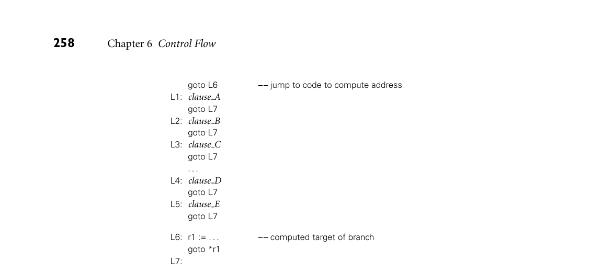
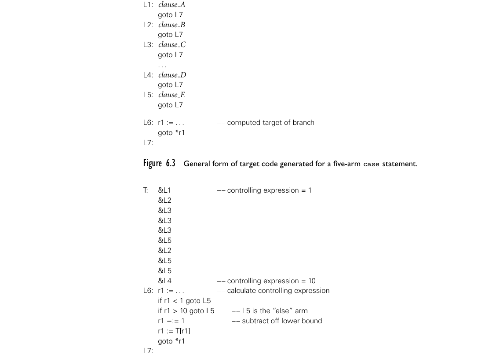

# 6.4 Selection

6.4 Selection 253

procedure rand(ref n : integer)

but most programmers would find this less appealing. Ada strikes a compromise: it allows side effects in functions in the form of changes to static or global vari- ables, but does not allow a function to modify its parameters. ■ 6.4 Selection

Selection statements in most imperative languages employ some variant of the EXAMPLE 6.46

Selection in Algol 60 if... then ... else notation introduced in Algol 60:

if condition then statement else if condition then statement else if condition then statement ... else statement ■

As we saw in Section 2.3.2, languages differ in the details of the syntax. In Algol 60 and Pascal both the then clause and the else clause were defined to contain a single statement (this could of course be a begin... end compound statement). To avoid grammatical ambiguity, Algol 60 required that the statement after the then begin with something other than if (begin is fine). Pascal eliminated this restriction in favor of a “disambiguating rule” that associated an else with the closest unmatched then. Algol 68, Fortran 77, and more modern languages avoid the ambiguity by allowing a statement list to follow either then or else, with a terminating keyword at the end of the construct. To keep terminators from piling up at the end of nested if statements, most EXAMPLE 6.47

elsif/elif languages with terminators provide a special elsif or elif keyword. In Ruby, one writes

if a == b then ... elsif a == c then ... elsif a == d then ... else ... end ■

In Lisp, the equivalent construct is EXAMPLE 6.48

cond in Lisp (cond ((= A B) (...))

254 Chapter 6 Control Flow

((= A C) (...)) ((= A D) (...)) (T (...)))

Here cond takes as arguments a sequence of pairs. In each pair the first ele- ment is a condition; the second is an expression to be returned as the value of the overall construct if the condition evaluates to T (T means “true” in most Lisp dialects). ■

6.4.1 Short-Circuited Conditions

While the condition in an if... then ... else statement is a Boolean expression, there is usually no need for evaluation of that expression to result in a Boolean value in a register. Most machines provide conditional branch instructions that capture simple comparisons. Put another way, the purpose of the Boolean expres- sion in a selection statement is not to compute a value to be stored, but to cause control to branch to various locations. This observation allows us to generate particularly efficient code (called jump code) for expressions that are amenable to the short-circuit evaluation of Section 6.1.5. Jump code is applicable not only to selection statements such as if... then ... else, but to logically controlled loops as well; we will consider the latter in Section 6.5.5. In the usual process of code generation, a synthesized attribute of the root of an expression subtree acquires the name of a register into which the value of the expression will be computed at run time. The surrounding context then uses this register name when generating code that uses the expression. In jump code, inherited attributes of the root inform it of the addresses to which control should branch if the expression is true or false, respectively. Suppose, for example, that we are generating code for the following source: EXAMPLE 6.49

Code generation for a Boolean condition if ((A > B) and (C > D)) or (E ̸= F) then then clause else else clause

In a language without short-circuit evaluation, the output code would look some- thing like this:

r1 := A –– load r2 := B r1 := r1 > r2 r2 := C r3 := D

6.4 Selection 255

r2 := r2 > r3 r1 := r1 & r2 r2 := E r3 := F r2 := r2 ̸= r3 r1 := r1 | r2 if r1 = 0 goto L2 L1: then clause –– (label not actually used) goto L3 L2: else clause L3:

The root of the subtree for ((A > B) and (C > D)) or (E ̸= F) would name r1 as the register containing the expression value. ■ In jump code, by contrast, the inherited attributes of the condition’s root EXAMPLE 6.50

Code generation for short-circuiting would indicate that control should “fall through” to L1 if the condition is true, or branch to L2 if the condition is false. Output code would then look something like this:

r1 := A r2 := B if r1 <= r2 goto L4 r1 := C r2 := D if r1 > r2 goto L1 L4: r1 := E r2 := F if r1 = r2 goto L2 L1: then clause goto L3 L2: else clause L3:

Here the value of the Boolean condition is never explicitly placed into a register. Rather it is implicit in the flow of control. Moreover for most values of A, B, C, D, and E, the execution path through the jump code is shorter and therefore faster (assuming good branch prediction) than the straight-line code that calculates the value of every subexpression. ■

DESIGN & IMPLEMENTATION

6.5 Short-circuit evaluation Short-circuit evaluation is one of those happy cases in programming language design where a clever language feature yields both more useful semantics and a faster implementation than existing alternatives. Other at least arguable exam- ples include case statements, local scopes for for loop indices (Section 6.5.1), and Ada-style parameter modes (Section 9.3.1).

256 Chapter 6 Control Flow

If the value of a short-circuited expression is needed explicitly, it can of course EXAMPLE 6.51

Short-circuit creation of a Boolean value be generated, while still using jump code for efficiency. The Ada fragment

found_it := p /= null and then p.key = val;

is equivalent to

if p /= null and then p.key = val then found_it := true; else found_it := false; end if;

and can be translated as

r1 := p if r1 = 0 goto L1 r2 := r1→key if r2 ̸= val goto L1 r1 := 1 goto L2 L1: r1 := 0 L2: found it := r1

The astute reader will notice that the first goto L1 can be replaced by goto L2, since r1 already contains a zero in this case. The code improvement phase of the compiler will notice this also, and make the change. It is easier to fix this sort of thing in the code improver than it is to generate the better version of the code in the first place. The code improver has to be able to recognize jumps to redundant instructions for other reasons anyway; there is no point in building special cases into the short-circuit evaluation routines. ■

6.4.2 Case/Switch Statements

The case statements of Algol W and its descendants provide alternative syntax EXAMPLE 6.52

case statements and nested ifs for a special case of nested if... then ... else. When each condition compares the same expression to a different compile-time constant, then the following code (written here in Ada)

i := ... -- potentially complicated expression if i = 1 then clause A elsif i = 2 or i = 7 then clause B elsif i in 3..5 then clause C elsif i = 10 then clause D else clause E end if;

6.4 Selection 257

can be rewritten as

case ... -- potentially complicated expression is when 1 => clause A when 2 | 7 => clause B when 3..5 => clause C when 10 => clause D when others => clause E end case;

The elided code fragments (clause A, clause B, etc.) after the arrows are called the arms of the case statement. The lists of constants in front of the arrows are case statement labels. The constants in the label lists must be disjoint, and must be of a type compatible with the tested (“controlling”) expression. Most languages allow this type to be anything whose values are discrete: integers, characters, enumera- tions, and subranges of the same. C# and (recent versions of) Java allow strings as well. ■ The case statement version of the code above is certainly less verbose than the if... then ... else version, but syntactic elegance is not the principal motivation for providing a case statement in a programming language. The principal mo- tivation is to facilitate the generation of efficient target code. The if... then ... EXAMPLE 6.53

Translation of nested ifs else statement is most naturally translated as follows:

r1 := . . . –– calculate controlling expression if r1 ̸= 1 goto L1 clause A goto L6 L1: if r1 = 2 goto L2 if r1 ̸= 7 goto L3 L2: clause B goto L6 L3: if r1 < 3 goto L4 if r1 > 5 goto L4 clause C goto L6 L4: if r1 ̸= 10 goto L5 clause D goto L6 L5: clause E L6: ■

Rather than test its controlling expression sequentially against a series of pos- sible values, the case statement is meant to compute an address to which it jumps in a single instruction. The general form of the anticipated target code appears EXAMPLE 6.54

Jump tables in Figure 6.3. The elided calculation at label L6 can take any of several forms. The most common of these simply indexes into an array, as shown in Figure 6.4.

*Figure 6.3 General form of target code generated for a five-arm case statement.*

*Figure 6.4 Jump table to control branching in a case statement. This code replaces the last three lines of Figure 6.3.*

The “code” at label T in that figure is in fact an array of addresses, known as a jump table. It contains one entry for each integer between the lowest and highest values, inclusive, found among the case statement labels. The code at L6 checks to make sure that the controlling expression is within the bounds of the array (if not, we should execute the others arm of the case statement). It then fetches the corresponding entry from the table and branches to it. ■

6.4 Selection 259

Alternative Implementations

A jump table is fast: it begins executing the correct arm of the case statement in constant time, regardless of the value of the controlling expression. It is also space efficient when the overall set of case statement labels is dense and does not contain large ranges. It can consume an extraordinarily large amount of space, however, if the set of labels is nondense, or includes large value ranges. Alter- native methods to compute the address to which to branch include sequential testing, hashing, and binary search. Sequential testing (as in an if... then ... else statement) is the method of choice if the total number of case statement labels is small. It chooses an arm in O(n) time, where n is the number of labels. A hash table is attractive if the set of label values is large, but has many missing values and no large ranges. With an appropriate hash function it will choose the right arm in O(1) time. Unfortunately, a hash table, like a jump table, requires a separate entry for each possible value of the controlling tested expression, making it unsuitable for statements with large value ranges. Binary search can accommo- date ranges easily. It chooses an arm in O(log n) time. To generate good code for all possible case statements, a compiler needs to be prepared to use a variety of strategies. During compilation it can generate code for the various arms of the case statement as it finds them, while simultaneously building up an internal data structure to describe the label set. Once it has seen all the arms, it can decide which form of target code to generate. For the sake of simplicity, most compilers employ only some of the possible implementations. Some use binary search in lieu of hashing. Some generate only jump tables; oth- ers only that plus sequential testing. Users of less sophisticated compilers may need to restructure their case statements if the generated code turns out to be unexpectedly large or slow.

Syntax and Label Semantics

As with if... then ... else statements, the syntactic details of case statements vary from language to language. Different languages use different punctuation to delimit labels and arms. More significantly, languages differ in whether they permit label ranges, whether they permit (or require) a default (others) clause, and in how they handle a value that fails to match any label at run time. In some languages (e.g., Modula), it is a dynamic semantic error for the con- trolling expression to have a value that does not appear in the label lists. Ada

DESIGN & IMPLEMENTATION

6.6 Case statements Case statements are one of the clearest examples of language design driven by implementation. Their primary reason for existence is to facilitate the gener- ation of jump tables. Ranges in label lists (not permitted in Pascal or C) may reduce efficiency slightly, but binary search is still dramatically faster than the equivalent series of ifs.

260 Chapter 6 Control Flow

requires the labels to cover all possible values in the domain of the controlling expression’s type; if the type has a very large number of values, then this cover- age must be accomplished using ranges or an others clause. In some languages, notably C and Fortran 90, it is not an error for the tested expression to evaluate to a missing value. Rather, the entire construct has no effect when the value is missing.

The C switch Statement

C’s syntax for case (switch) statements (retained by C++ and Java) is unusual in several respects:

switch (... /* controlling expression */) { case 1: clause A break; case 2: case 7: clause B break; case 3: case 4: case 5: clause C break; case 10: clause D break; default: clause E break; }

Here each possible value for the tested expression must have its own label within the switch; ranges are not allowed. In fact, lists of labels are not al- lowed, but the effect of lists can be achieved by allowing a label (such as 2, 3, and 4 above) to have an empty arm that simply “falls through” into the code for the subsequent label. Because of the provision for fall-through, an explicit break statement must be used to get out of the switch at the end of an arm, rather than falling through into the next. There are rare circumstances in which the ability to EXAMPLE 6.55

Fall-through in C switch statements fall through is convenient:

letter_case = lower; switch (c) { ... case 'A' : letter_case = upper; /* FALL THROUGH! */ case 'a' : ... break; ... } ■

