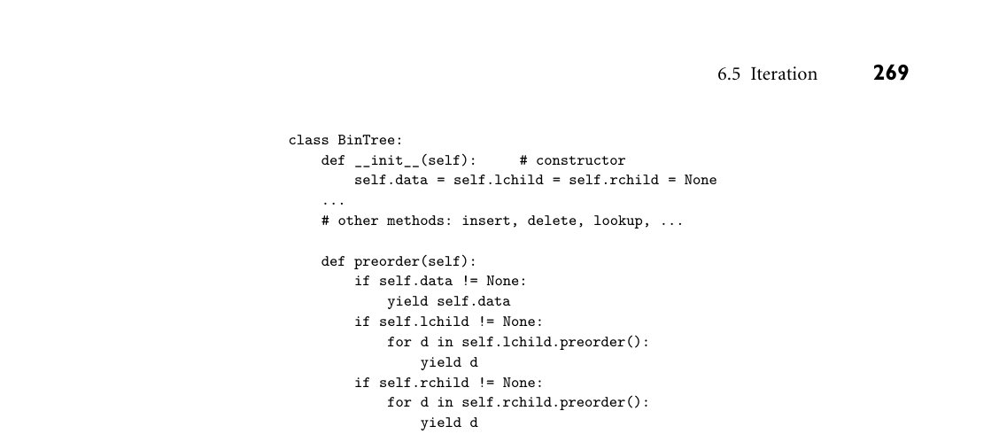
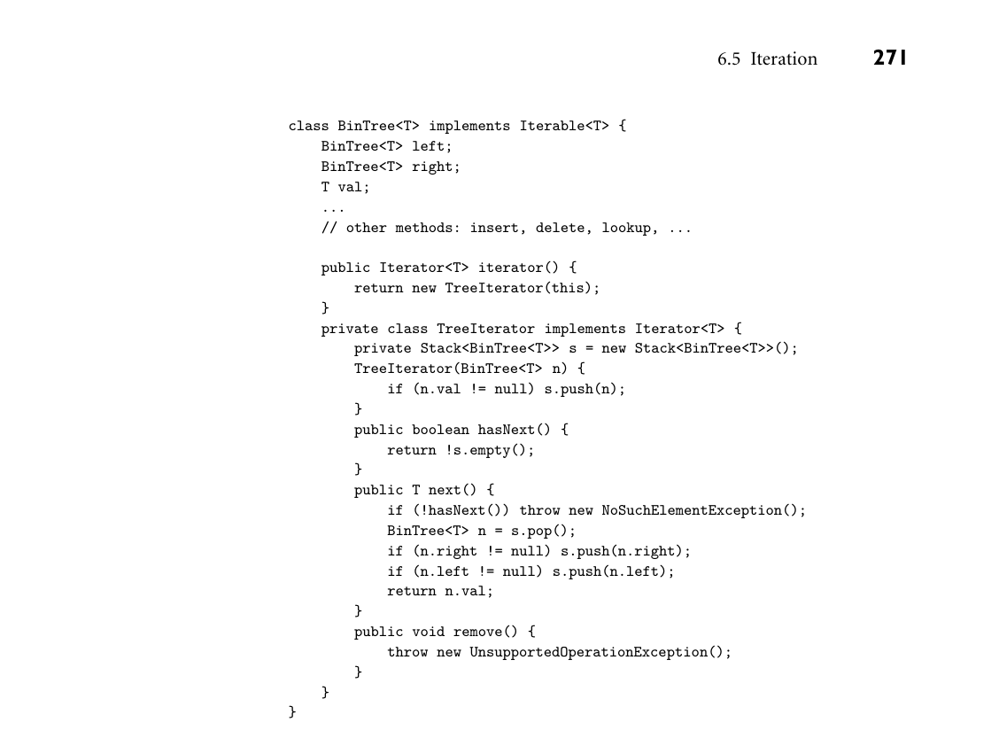

# 6.5 Iteration

6.5 Iteration 261

Most of the time, however, the need to insert a break at the end of each arm— and the compiler’s willingness to accept arms without breaks, silently—is a recipe for unexpected and difficult-to-diagnose bugs. C# retains the familiar C syntax, including multiple consecutive labels, but requires every nonempty arm to end with a break, goto, continue, or return.

3CHECK YOUR UNDERSTANDING 19. List the principal uses of goto, and the structured alternatives to each.

20. Explain the distinction between exceptions and multilevel returns. 21. What are continuations? What other language features do they subsume?

22. Why is sequencing a comparatively unimportant form of control flow in Lisp? 23. Explain why it may sometimes be useful for a function to have side effects. 24. Describe the jump code implementation of short-circuit Boolean evaluation.

25. Why do imperative languages commonly provide a case or switch statement in addition to if... then ... else? 26. Describe three different search strategies that might be employed in the im- plementation of a case statement, and the circumstances in which each would be desirable.

27. Explain the use of break to terminate the arms of a C switch statement, and the behavior that arises if a break is accidentally omitted.

6.5 Iteration

Iteration and recursion are the two mechanisms that allow a computer to per- form similar operations repeatedly. Without at least one of these mechanisms, the running time of a program (and hence the amount of work it can do and the amount of space it can use) would be a linear function of the size of the program text. In a very real sense, it is iteration and recursion that make computers useful for more than fixed-size tasks. In this section we focus on iteration. Recursion is the subject of Section 6.6. Programmers in imperative languages tend to use iteration more than they use recursion (recursion is more common in functional languages). In most lan- guages, iteration takes the form of loops. Like the statements in a sequence, the it- erations of a loop are generally executed for their side effects: their modifications of variables. Loops come in two principal varieties, which differ in the mecha- nisms used to determine how many times to iterate. An enumeration-controlled loop is executed once for every value in a given finite set; the number of iterations is known before the first iteration begins. A logically controlled loop is executed

262 Chapter 6 Control Flow

until some Boolean condition (which must generally depend on values altered in the loop) changes value. Most (though not all) languages provide separate con- structs for these two varieties of loop.

6.5.1 Enumeration-Controlled Loops

Enumeration-controlled iteration originated with the do loop of Fortran I. Sim- ilar mechanisms have been adopted in some form by almost every subsequent language, but syntax and semantics vary widely. Even Fortran’s own loop has evolved considerably over time. The modern Fortran version looks something EXAMPLE 6.56

Fortran 90 do loop like this:

do i = 1, 10, 2 ... enddo

Variable i is called the index of the loop. The expressions that follow the equals sign are i’s initial value, its bound, and the step size. With the values shown here, the body of the loop (the statements between the loop header and the enddo de- limiter) will execute five times, with i set to 1, 3, ..., 9 in successive iterations. ■

Many other languages provide similar functionality. In Modula-2 one would EXAMPLE 6.57

Modula-2 for loop say

FOR i := first TO last BY step DO ... END

By choosing different values of first, last, and step, we could arrange to iter- ate over an arbitrary arithmetic sequence of integers, namely i = first, first + step, ..., first + ⌊(last −first)/step⌋× step. ■ Following the lead of Clu, many modern languages allow enumeration- controlled loops to iterate over much more general finite sets—the nodes of a tree, for example, or the elements of a collection. We consider these more general iterators in Section 6.5.3. For the moment we focus on arithmetic sequences. For the sake of simplicity, we use the name “for loop” as a general term, even for languages that use a different keyword.

Code Generation for for Loops

Naively, the loop of Example 6.57 can be translated as EXAMPLE 6.58

Obvious translation of a for loop r1 := first r2 := step r3 := last L1: if r1 > r3 goto L2 . . . –– loop body; use r1 for i r1 := r1 + r2 goto L1 L2: ■

6.5 Iteration 263

A slightly better if less straightforward translation is EXAMPLE 6.59

for loop translation with test at the bottom r1 := first r2 := step r3 := last goto L2 L1: . . . –– loop body; use r1 for i r1 := r1 + r2 L2: if r1 ≤r3 goto L1

This version is likely to be faster, because each iteration contains a single con- ditional branch, rather than a conditional branch at the top and an uncondi- tional branch at the bottom. (We will consider yet another version in Exer- cise C 17.4.) ■ Note that both of these translations employ a loop-ending test that is funda- mentally directional: as shown, they assume that all the realized values of i will be smaller than last. If the loop goes “the other direction”—that is, if first > last, and step < 0—then we will need to use the inverse test to end the loop. To allow the compiler to make the right choice, many languages restrict the generality of their arithmetic sequences. Commonly, step is required to be a compile-time constant. Ada actually limits the choices to ±1. Several languages, including both Ada and Pascal, require special syntax for loops that iterate “backward” (for i in reverse 10..1 in Ada; for i := 10 downto 1 in Pascal). Obviously, one can generate code that checks the sign of step at run time, and chooses a test accordingly. The obvious translations, however, are either time or space inefficient. An arguably more attractive approach, adopted by many EXAMPLE 6.60

for loop translation with an iteration count Fortran compilers, is to precompute the number of iterations, place this iteration count in a register, decrement the register at the end of each iteration, and branch back to the top of the loop if the count is not yet zero:

r1 := first r2 := step r3 := max(⌊(last −first + step)/step⌋, 0) –– iteration count –– NB: this calculation may require several instructions. –– It is guaranteed to result in a value within the precision of the machine, –– but we may have to be careful to avoid overflow during its calculation. if r3 ≤0 goto L2 L1: . . . –– loop body; use r1 for i r1 := r1 + r2 r3 := r3 −1 if r3 > 0 goto L1 i := r1 L2: ■

The use of the iteration count avoids the need to test the sign of step within the loop. Assuming we have been suitably careful in precomputing the count, it EXAMPLE 6.61

A “gotcha” in the naive loop translation also avoids a problem we glossed over in the naive translations of Examples 6.58

264 Chapter 6 Control Flow

and 6.59: If last is near the maximum value representable by integers on our machine, naively adding step to the final legitimate value of i may result in arith- metic overflow. The “wrapped” number may then appear to be smaller (much smaller!) than last, and we may have translated perfectly good source code into an infinite loop. ■ Some processors, including the Power family, PA-RISC, and most CISC ma- chines, can decrement the iteration count, test it against zero, and conditionally branch, all in a single instruction. For many loops this results in very efficient code.

Semantic Complications

The astute reader may have noticed that use of an iteration count is fundamen- tally dependent on being able to predict the number of iterations before the loop begins to execute. While this prediction is possible in many languages, including Fortran and Ada, it is not possible in others, notably C and its descendants. The difference stems largely from the following question: is the for loop construct only for iteration, or is it simply meant to make enumeration easy? If the lan- guage insists on enumeration, then an iteration count works fine. If enumeration is only one possible purpose for the loop—more specifically, if the number of iter- ations or the sequence of index values may change as a result of executing the first few iterations—then we may need to use a more general implementation, along the lines of Example 6.59, modified if necessary to handle dynamic discovery of the direction of the terminating test.

DESIGN & IMPLEMENTATION

6.7 Numerical imprecision Among its many changes to the do loop of Fortran IV, Fortran 77 allowed the index, bounds, and step size of the loop to be floating-point numbers, not just integers. Interestingly, this feature was taken back out of the language in Fortran 90. The problem with real-number sequences is that limited precision can cause comparisons (e.g., between the index and the bound) to produce unexpected or even implementation-dependent results when the values are close to one another. Should

for x := 1.0 to 2.0 by 1.0 / 3.0

execute three iterations or four? It depends on whether 1.0 / 3.0 is rounded up or down. The Fortran 90 designers appear to have decided that such ambiguity is philosophically inconsistent with the idea of finite enumeration. The pro- grammer who wants to iterate over floating-point values must use an explicit comparison in a pretest or post-test loop (Section 6.5.5).

6.5 Iteration 265

The choice between requiring and (merely) enabling enumeration manifests itself in several specific questions:

1. Can control enter or leave the loop in any way other than through the enumer- ation mechanism? 2. What happens if the loop body modifies variables that were used to compute the end-of-loop bound? 3. What happens if the loop body modifies the index variable itself? 4. Can the program read the index variable after the loop has completed, and if so, what will its value be?

Questions (1) and (2) are relatively easy to resolve. Most languages allow a break/exit statement to leave a for loop early. Fortran IV allowed a goto to jump into a loop, but this was generally regarded as a language flaw; Fortran 77 and most other languages prohibit such jumps. Similarly, most languages (but not C; see Section 6.5.2) specify that the bound is computed only once, before the first iteration, and kept in a temporary location. Subsequent changes to variables used to compute the bound have no effect on how many times the loop iterates. Questions (3) and (4) are more difficult. Suppose we write (in no particular EXAMPLE 6.62

Changing the index in a for loop language)

for i := 1 to 10 by 2 ... if i = 3 i := 6

What should happen at the end of the i=3 iteration? Should the next iteration have i = 5 (the next element of the arithmetic sequence specified in the loop header), i = 8 (2 more than 6), or even conceivably i = 7 (the next value of the sequence after 6)? One can imagine reasonable arguments for each of these options. To avoid the need to choose, many languages prohibit changes to the loop index within the body of the loop. Fortran makes the prohibition a mat- ter of programmer discipline: the implementation is not required to catch an erroneous update. Pascal provided an elaborate set of conservative rules [Int90, Sec. 6.8.3.9] that allowed the compiler to catch all possible updates. These rules were complicated by the fact that the index variable was declared outside the loop; it might be visible to subroutines called from the loop even if it was not passed as a parameter. ■ If control escapes the loop with a break/exit, the natural value for the in- EXAMPLE 6.63

Inspecting the index after a for loop dex would seem to be the one that was current at the time of the escape. For “normal” termination, on the other hand, the natural value would seem to be the first one that exceeds the loop bound. Certainly that is the value that will be produced by the implementation of Example 6.59. Unfortunately, as we noted in Example 6.60, the “next” value for some loops may be outside the range of integer precision. For other loops, it may be semantically invalid:

266 Chapter 6 Control Flow

c : ’a’..’z’ –– character subrange ... for c := ’a’ to ’z’ do ... –– what comes after ’z’?

Requiring the post-loop value to always be the index of the final iteration is unattractive from an implementation perspective: it would force us to replace Example 6.59 with a translation that has an extra branch instruction in every it- eration:

r1 := ’a’ r2 := ’z’ if r1 > r2 goto L3 –– Code improver may remove this test, –– since ’a’ and ’z’ are constants. L1: . . . –– loop body; use r1 for i if r1 = r2 goto L2 r1 := r1 + 1 goto L1 L2: i := r1 L3:

Of course, the compiler must generate this sort of code in any event (or use an iteration count) if arithmetic overflow may interfere with testing the terminating condition. To permit the compiler to use the fastest correct implementation in all cases, several languages, including Fortran 90 and Pascal, say that the value of the index is undefined after the end of the loop. ■ An attractive solution to both the index modification problem and the post- loop value problem was pioneered by Algol W and Algol 68, and subsequently adopted by Ada, Modula 3, and many other languages. In these, the header of the loop is considered to contain a declaration of the index. Its type is inferred from the bounds of the loop, and its scope is the loop’s body. Because the index is not visible outside the loop, its value is not an issue. Of course, the programmer must not give the index the same name as any variable that must be accessed within the loop, but this is a strictly local issue: it has no ramifications outside the loop.

6.5.2 Combination Loops

Algol 60 provided a single loop construct that subsumed the properties of more modern enumeration and logically controlled loops. It allowed the programmer to specify an arbitrary number of “enumerators,” each of which could be a single value, a range of values similar to those of modern enumeration-controlled loops, or an expression with a terminating condition. Common Lisp provides an even more powerful facility, with four separate sets of clauses, to initialize index vari- ables (of which there may be an arbitrary number), test for loop termination (in any of several ways), evaluate body expressions, and clean up at loop termination.

6.5 Iteration 267

A much simpler form of combination loop appears in C and its successors. Semantically, the C for loop is logically controlled. It was designed, however, to make enumeration easy. Our Modula-2 example EXAMPLE 6.64

Combination (for) loop in C FOR i := first TO last BY step DO ... END

would usually be written in C as

for (i = first; i <= last; i += step) { ... }

With caveats for a few special cases, C defines this to be equivalent to

{ i = first; while (i <= last) { ... i += step; } ■ }

This definition means that it is the programmer’s responsibility to worry about the effect of overflow on testing of the terminating condition. It also means that both the index and any variables contained in the terminating condition can be modified by the body of the loop, or by subroutines it calls, and these changes will affect the loop control. This, too, is the programmer’s responsibility. Any of the three clauses in the for loop header can be null (the condition is considered true if missing). Alternatively, a clause can consist of a sequence of comma-separated expressions. The advantage of the C for loop over its while loop equivalent is compactness and clarity. In particular, all of the code affecting

DESIGN & IMPLEMENTATION

6.8 for loops Modern for loops reflect the impact of both semantic and implementation challenges. Semantic challenges include changes to loop indices or bounds from within the loop, the scope of the index variable (and its value, if any, out- side the loop), and gotos that enter or leave the loop. Implementation chal- lenges include the imprecision of floating-point values, the direction of the bottom-of-loop test, and overflow at the end of the iteration range. The “com- bination loops” of C (Section 6.5.2) move responsibility for these challenges out of the compiler and into the application program.

268 Chapter 6 Control Flow

the flow of control is localized within the header. In the while loop, one must read both the top and the bottom of the loop to know what is going on. While the logical iteration semantics of the C for loop eliminate any ambigu- ity about the value of the index variable after the end of the loop, it may still be convenient to make the index local to the body of the loop, by declaring it in the header’s initialization clause. In Example 6.64, variable i must be declared in the surrounding scope. If we instead write EXAMPLE 6.65

C for loop with a local index for (int i = first; i <= last; i += step) { ... }

then i will not be visible outside. It will still, however, be vulnerable to (deliberate or accidental) modification within the loop. ■

6.5.3 Iterators

In all of the examples we have seen so far (with the possible exception of the com- bination loops of Algol 60, Common Lisp, or C), a for loop iterates over the ele- ments of an arithmetic sequence. In general, however, we may wish to iterate over the elements of any well-defined set (what are often called collections, or instances of a container class, in object-oriented code). Clu introduced an elegant iterator mechanism (also found in Python, Ruby, and C#) to do precisely that. Euclid and several more recent languages, notably C++, Java, and Ada 2012, define a stan- dard interface for iterator objects (sometimes called enumerators) that are equally easy to use, but not as easy to write. Icon, conversely, provides a generalization of iterators, known as generators, that combines enumeration with backtracking search.7

True Iterators

Clu, Python, Ruby, and C# allow any container abstraction to provide an iterator that enumerates its items. The iterator resembles a subroutine that is permitted to contain yield statements, each of which produces a loop index value. For loops are then designed to incorporate a call to an iterator. The Modula-2 fragment EXAMPLE 6.66

Simple iterator in Python FOR i := first TO last BY step DO ... END

would be written as follows in Python:

7 Unfortunately, terminology is not consistent across languages. Euclid uses the term “generator” for what are called “iterator objects” here. Python uses it for what are called “true iterators” here.

*Figure 6.5 Python iterator for preorder enumeration of the nodes of a binary tree. Because Python is dynamically typed, this code will work for any data that support the operations needed by insert, lookup, and so on (probably just <). In a statically typed language, the BinTree class would need to be generic.*

for i in range(first, last, step): ...

Here range is a built-in iterator that yields the integers from first to first + ⌊(last −first)/step⌋× step in increments of step. ■ When called, the iterator calculates the first index value of the loop, which it returns to the main program by executing a yield statement. The yield be- haves like return, except that when control transfers back to the iterator after completion of the first iteration of the loop, the iterator continues where it last left off—not at the beginning of its code. When the iterator has no more elements to yield it simply returns (without a value), thereby terminating the loop. In effect, an iterator is a separate thread of control, with its own program counter, whose execution is interleaved with that of the for loop to which it sup- plies index values.8 The iteration mechanism serves to “decouple” the algorithm required to enumerate elements from the code that uses those elements. The range iterator is predefined in Python. As a more illustrative example, EXAMPLE 6.67

Python iterator for tree enumeration consider the preorder enumeration of values stored in a binary tree. A Python iterator for this task appears in Figure 6.5. Invoked from the header of a for loop, it yields the value in the root node (if any) for the first iteration and then calls itself recursively, twice, to enumerate values in the left and right subtrees. ■

8 Because iterators are interleaved with loops in a very regular way, they can be implemented more easily (and cheaply) than fully general threads. We will consider implementation options further in Section C 9.5.3.

270 Chapter 6 Control Flow

Iterator Objects

As realized in most imperative languages, iteration involves both a special form of for loop and a mechanism to enumerate values for the loop. These concepts can be separated. Euclid, C++, Java, and Ada 2012 all provide enumeration- controlled loops reminiscent of those of Python. They have no yield statement, however, and no separate thread-like context to enumerate values; rather, an it- erator is an ordinary object (in the object-oriented sense of the word) that pro- vides methods for initialization, generation of the next index value, and testing for completion. Between calls, the state of the iterator must be kept in the object’s data members. Figure 6.6 contains the Java equivalent of the BinTree class of Figure 6.5. EXAMPLE 6.68

Java iterator for tree enumeration Given this code, we can write

BinTree<Integer> myTree = ... ... for (Integer i : myTree) { System.out.println(i); }

The loop here is syntactic sugar for

for (Iterator<Integer> it = myTree.iterator(); it.hasNext();) { Integer i = it.next(); System.out.println(i); }

The expression following the colon in the more concise version of the loop must be an object that supports the standard Iterable interface. This interface in- cludes an iterator() method that returns an Iterator object. ■ C++ takes a related but somewhat different approach. With appropriate defi- EXAMPLE 6.69

Iteration in C++11 nitions, the Java for loop of the previous example could be written as follows in C++11:

tree_node* my_tree = ... ... for (int n : *my_tree) { cout << n << "\n"; }

DESIGN & IMPLEMENTATION

6.9 “True” iterators and iterator objects While the iterator library mechanisms of C++ and Java are highly useful, it is worth emphasizing that they are not the functional equivalents of “true” iterators, as found in Clu, Python, Ruby, and C#. Their key limitation is the need to maintain all intermediate state in the form of explicit data structures, rather than in the program counter and local variables of a resumable execu- tion context.

*Figure 6.6 Java code for preorder enumeration of the nodes of a binary tree. The nested TreeIterator class uses an explicit Stack object (borrowed from the standard library) to keep track of subtrees whose nodes have yet to be enumerated. Java generics, specified as <T> type arguments for BinTree, Stack, Iterator, and Iterable, allow next to return an object of the appropriate type, rather than the undifferentiated Object. The remove method is part of the Iterator interface, and must therefore be provided, if only as a placeholder.*

This loop is syntactic sugar for

for (tree_node::iterator it = my_tree->begin(); it != my_tree->end(); ++it) { int n = *it; cout << n << "\n"; }

Where a Java iterator has methods to produce successive elements of a collection on demand (and to indicate when there are no more), a C++ iterator is designed

272 Chapter 6 Control Flow

to act as a special kind of pointer. Support routines in the standard library lever- age the language’s unusually flexible operator overloading and reference mecha- nisms to redefine comparison (!=), increment (++), dereference (*), and so on in a way that makes iterating over the elements of a collection look very much like using pointer arithmetic to traverse a conventional array (“Pointers and Arrays in C,” Section 8.5.1). As in the Java example, iterator it encapsulates all the state needed to find successive elements of the collection, and to determine when there are no more. To obtain the current element, we “dereference” the iterator, using the * or -> operators. The initial value of the iterator is produced by a collection’s begin method. To advance to the following element, we use the increment (++) opera- tor. The end method returns a special iterator that “points beyond the end” of the collection. The increment (++) operator must return a reference that tests equal to this special iterator when the collection has been exhausted. ■ Code to implement our C++ tree iterator is somewhat messier than the Java version of Figure 6.6, due to operator overloading, the value model of variables (which requires explicit references and pointers), and the lack of garbage collec- tion. We leave the details to Exercise 6.19.

Iterating with First-Class Functions

In functional languages, the ability to specify a function “in line” facilitates a pro- gramming idiom in which the body of a loop is written as a function, with the loop index as an argument. This function is then passed as the final argument to an iterator, which is itself a function. In Scheme we might write EXAMPLE 6.70

Passing the “loop body” to an iterator in Scheme (define uptoby (lambda (low high step f) (if (<= low high) (begin (f low) (uptoby (+ low step) high step f)) '())))

We could then sum the first 50 odd numbers as follows:

(let ((sum 0)) (uptoby 1 100 2 (lambda (i) (set! sum (+ sum i)))) sum) =⇒2500

Here the body of the loop, (set! sum (+ sum i)), is an assignment. The =⇒ symbol (not a part of Scheme) is used here to mean “evaluates to.” ■ Smalltalk, which we consider in Section C 10.7.1, supports a similar idiom: EXAMPLE 6.71

Iteration with blocks in Smalltalk sum <- 0. 1 to: 100 by: 2 do: [:i | sum <- sum + i]

6.5 Iteration 273

Like a lambda expression in Scheme, a square-bracketed block in Smalltalk creates a first-class function, which we then pass as argument to the to: by: do: iterator. The iterator calls the function repeatedly, passing successive values of the index variable i as argument. ■ Iterators in Ruby are also similar, with functional semantics but syntax remi- niscent of Python or C#. Our uptoby iterator in Ruby could be written as follows: EXAMPLE 6.72

Iterating with procs in Ruby def uptoby(first, last, inc) while first <= last do yield first first += inc end end ... sum = 0 uptoby(1, 100, 2) { |i| sum += i } puts sum =⇒2500

This code is defined as syntactic sugar for

def uptoby(first, last, inc, block) while first <= last do block.call(first) first += inc end end ... sum = 0 uptoby(1, 100, 2, Proc.new { |i| sum += i }) puts sum

When a block, delimited by braces or do... end, follows the parameter list of a function invocation, Ruby passes a closure representing the block (a “proc”) as an implicit extra argument to the function. Within the body of the function, yield is defined as a call to the function’s last parameter, which must be a proc, and need not be explicitly declared. For added convenience, all of Ruby’s collection objects (arrays, ranges, map- pings, and sets) support a method named each that will invoke a block for every element of the collection. To sum the first 100 integers (without the step size of 2), we could say

sum = 0 (1..100).each { |i| sum += i } puts sum =⇒5050

This code serves as the definition of conventional for-loop syntax, which is fur- ther syntactic sugar:

274 Chapter 6 Control Flow

sum = 0 for i in (1..100) do sum += i end puts sum

In Lisp and Scheme, one can define similar syntactic sugar using continuations (Section 6.2.2) and lazy evaluation (Section 6.6.2); we consider this possibility in Exercises 6.34 and 6.35. ■

Iterating without Iterators

In a language with neither true iterators nor iterator objects, we can still decou- EXAMPLE 6.73

Imitating iterators in C ple the enumeration of a collection from actual use of the elements by adopting appropriate programming conventions. In C, for example, we might define a tree_iter type and associated functions that could be used in a loop as follows:

bin_tree *my_tree; tree_iter ti; ... for (ti_create(my_tree, &ti); !ti_done(ti); ti_next(&ti)) { bin_tree *n = ti_val(ti); ... } ti_delete(&ti);

There are two principal differences between this code and the more structured al- ternatives: (1) the syntax of the loop is a good bit less elegant (and arguably more prone to accidental errors), and (2) the code for the iterator is simply a type and some associated functions—C provides no abstraction mechanism to group them together as a module or a class. By providing a standard interface for iterator ab- stractions, object-oriented languages facilitate the design of higher-order mech- anisms that manipulate whole collections: sorting them, merging them, finding their intersection or difference, and so on. We leave the C code for tree_iter and the various ti_ functions to Exercise 6.20. ■

6.5.4 Generators in Icon

Icon generalizes the concept of iterators, providing a generator mechanism that causes any expression in which it is embedded to enumerate multiple values on demand.

IN MORE DEPTH

We consider Icon generators in more detail on the companion site. The language’s enumeration-controlled loop, the every loop, can contain not only a generator,

6.5 Iteration 275

but any expression that contains a generator. Generators can also be used in con- structs like if statements, which will execute their nested code if any generated value makes the condition true, automatically searching through all the possi- bilities. When generators are nested, Icon explores all possible combinations of generated values, and will even backtrack where necessary to undo unsuccessful control-flow branches or assignments.

6.5.5 Logically Controlled Loops

In comparison to enumeration-controlled loops, logically controlled loops have many fewer semantic subtleties. The only real question to be answered is where within the body of the loop the terminating condition is tested. By far the most common approach is to test the condition before each iteration. The familiar EXAMPLE 6.74

while loop in Algol-W while loop syntax for this was introduced in Algol-W:

while condition do statement

To allow the body of the loop to be a statement list, most modern languages use an explicit concluding keyword (e.g., end), or bracket the body with delimiters (e.g., { ...}). A few languages (notably Python) indicate the body with an extra level of indentation. ■

Post-test Loops

Occasionally it is handy to be able to test the terminating condition at the bottom of a loop. Pascal introduced special syntax for this case, which was retained in Modula but dropped in Ada. A post-test loop allows us, for example, to write EXAMPLE 6.75

Post-test loop in Pascal and Modula repeat readln(line) until line[1] = '$';

instead of

readln(line); while line[1] <> '$' do readln(line);

The difference between these constructs is particularly important when the body of the loop is longer. Note that the body of a post-test loop is always executed at least once. ■ C provides a post-test loop whose condition works “the other direction” (i.e., EXAMPLE 6.76

Post-test loop in C “while” instead of “until”):

do { line = read_line(stdin); } while (line[0] != '$');

■

276 Chapter 6 Control Flow

Mid-test Loops

Finally, as we noted in Section 6.2.1, it is sometimes appropriate to test the ter- minating condition in the middle of a loop. In many languages this “mid-test” can be accomplished with a special statement nested inside a conditional: exit in Ada, break in C, last in Perl. In Section 6.4.2 we saw a somewhat unusual use EXAMPLE 6.77

break statement in C of break to leave a C switch statement. More conventionally, C also uses break to exit the closest for, while, or do loop:

for (;;) { line = read_line(stdin); if (all_blanks(line)) break; consume_line(line); }

Here the missing condition in the for loop header is assumed to always be true. (C programmers have traditionally preferred this syntax to the equivalent while (1), presumably because it was faster in certain early C compilers.) ■ In some languages, an exit statement takes an optional loop-name argument EXAMPLE 6.78

Exiting a nested loop in Ada that allows control to escape a nested loop. In Ada we might write

outer: loop get_line(line, length); for i in 1..length loop exit outer when line(i) = '$'; consume_char(line(i)); end loop; end loop outer; ■

In Perl this would be EXAMPLE 6.79

Exiting a nested loop in Perl outer: while (<>) { # iterate over lines of input foreach $c (split //) { # iterate over remaining chars last outer if ($c =~ '\$'); # exit main loop if we see a $ sign consume_char($c); } } ■

Java extends the C/C++ break statement in a similar fashion, with optional labels on loops.

3CHECK YOUR UNDERSTANDING 28. Describe three subtleties in the implementation of enumeration-controlled loops. 29. Why do most languagesnot allow the bounds or increment of an enumeration- controlled loop to be floating-point numbers?

