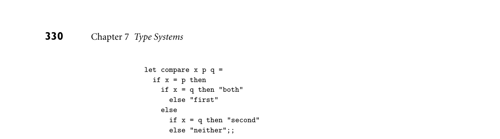

# 7.2 Type Checking

3. Name two programming languages that are strongly but dynamically typed. 4. What is a type clash?

5. Discuss the differences among the denotational, structural, and abstraction- based views of types.

6. What does it mean for a set of language features (e.g., a type system) to be orthogonal? 7. What are aggregates? 8. What are option types? What purpose do they serve?

9. What is polymorphism? What distinguishes its parametric and subtype vari- eties? What are generics?

10. What is the difference between discrete and scalar types? 11. Give two examples of languages that lack a Boolean type. What do they use instead? 12. In what ways may an enumeration type be preferable to a collection of named constants? In what ways may a subrange type be preferable to its base type? In what ways may a string be preferable to an array of characters?

7.2 Type Checking

In most statically typed languages, every definition of an object (constant, vari- able, subroutine, etc.) must specify the object’s type. Moreover, many of the con- texts in which an object might appear are also typed, in the sense that the rules of the language constrain the types that an object in that context may validly possess. In the subsections below we will consider the topics of type equivalence, type com- patibility, and type inference. Of the three, type compatibility is the one of most concern to programmers. It determines when an object of a certain type can be used in a certain context. At a minimum, the object can be used if its type and the type expected by the context are equivalent (i.e., the same). In many languages, however, compatibility is a looser relationship than equivalence: objects and con- texts are often compatible even when their types are different. Our discussion of type compatibility will touch on the subjects of type conversion (also called cast- ing), which changes a value of one type into a value of another; type coercion, which performs a conversion automatically in certain contexts; and nonconvert- ing type casts, which are sometimes used in systems programming to interpret the bits of a value of one type as if they represented a value of some other type. Whenever an expression is constructed from simpler subexpressions, the ques- tion arises: given the types of the subexpressions (and possibly the type expected

by the surrounding context), what is the type of the expression as a whole? This question is answered by type inference. Type inference is often trivial: the sum of two integers is still an integer, for example. In other cases (e.g., when dealing with sets) it is a good bit trickier. Type inference plays a particularly important role in ML, Miranda, and Haskell, in which almost all type annotations are optional, and will be inferred by the compiler when omitted.

7.2.1 Type Equivalence

In a language in which the user can define new types, there are two principal ways of defining type equivalence. Structural equivalence is based on the content of type definitions: roughly speaking, two types are the same if they consist of the same components, put together in the same way. Name equivalence is based on the lexical occurrence of type definitions: roughly speaking, each definition introduces a new type. Structural equivalence is used in Algol-68, Modula-3, and (with various wrinkles) C and ML. Name equivalence appears in Java, C#, standard Pascal, and most Pascal descendants, including Ada. The exact definition of structural equivalence varies from one language to an- other. It requires that one decide which potential differences between types are important, and which may be considered unimportant. Most people would prob- ably agree that the format of a declaration should not matter—identical declara- tions that differ only in spacing or line breaks should still be considered equiva- lent. Likewise, in a Pascal-like language with structural equivalence, EXAMPLE 7.17

Trivial differences in type type R1 = record a, b : integer end;

should probably be considered the same as

type R2 = record a : integer; b : integer end;

But what about

type R3 = record b : integer; a : integer end;

Should the reversal of the order of the fields change the type? ML says no; most languages say yes. ■ In a similar vein, consider the following arrays, again in a Pascal-like notation: EXAMPLE 7.18

type str = array [1..10] of char;

type str = array [0..9] of char;

Here the length of the array is the same in both cases, but the index values are different. Should these be considered equivalent? Most languages say no, but some (including Fortran and Ada) consider them compatible. ■ To determine if two types are structurally equivalent, a compiler can expand their definitions by replacing any embedded type names with their respective def- initions, recursively, until nothing is left but a long string of type constructors, field names, and built-in types. If these expanded strings are the same, then the types are equivalent, and conversely. Recursive and pointer-based types compli- cate matters, since their expansion does not terminate, but the problem is not insurmountable; we consider a solution in Exercise 8.15. Structural equivalence is a straightforward but somewhat low-level, imple- EXAMPLE 7.19

The problem with structural equivalence mentation-oriented way to think about types. Its principal problem is an inability to distinguish between types that the programmer may think of as distinct, but which happen by coincidence to have the same internal structure:

1. type student = record 2. name, address : string 3. age : integer

4. type school = record 5. name, address : string 6. age : integer

7. x : student; 8. y : school; 9. . . . 10. x := y; –– is this an error?

Most programmers would probably want to be informed if they accidentally as- signed a value of type school into a variable of type student, but a compiler whose type checking is based on structural equivalence will blithely accept such an as- signment. Name equivalence is based on the assumption that if the programmer goes to the effort of writing two type definitions, then those definitions are probably meant to represent different types. In the example above, variables x and y will be considered to have different types under name equivalence: x uses the type declared at line 1; y uses the type declared at line 4. ■

Variants of Name Equivalence

One subtlety in the use of name equivalence arises in the simplest of type decla- rations: EXAMPLE 7.20

Alias types type new_type = old_type; (* Algol family syntax *)

Here new_type is said to be an alias for old_type. Should we treat them as two names for the same type, or as names for two different types that happen to have the same internal structure? The “right” approach may vary from one program to another. ■ Users of any Unix-like system will be familiar with the notion of permission bits EXAMPLE 7.21

Semantically equivalent alias types on files. These specify whether the file is readable, writable, and/or executable by its owner, group members, or others. Within the system libraries, the set of permissions for a file is represented as a value of type mode_t. In C, this type is commonly defined as an alias for the predefined 16-bit unsigned integer type:

typedef uint16_t mode_t;

While C uses structural equivalence for scalar types,3 we can imagine the issue that would arise if it used name equivalence uniformly. By convention, permis- sion sets are manipulated using bitwise integer operators:

mode_t my_permissions = S_IRUSR | S_IWUSR | S_IRGRP; /* I can read and write; members of my group can read. */ ... if (my_permissions & S_IWUSR) ...

This convention depends on the equivalence of mode_t and uint16_t. One could ask programmers to convert mode_t objects explicitly to uint_16 be- fore applying an integer operator—or even suggest that mode_t be an abstract type, with insert, remove, and lookup operations that hide the internal representation—but C programmers would probably regard either of these op- tions as unnecessarily cumbersome: in “systems” code, it seems reasonable to treat mode_t and uint16_t the same. ■ Unfortunately, there are other times when aliased types should probably not EXAMPLE 7.22

Semantically distinct alias types be the same:

type celsius_temp = real; fahrenheit_temp = real; var c : celsius_temp; f : fahrenheit_temp; ... f := c; (* this should probably be an error *) ■

A language in which aliased types are considered distinct is said to have strict name equivalence. A language in which aliased types are considered equivalent is said to have loose name equivalence. Most Pascal-family languages use loose name equivalence. Ada achieves the best of both worlds by allowing the programmer EXAMPLE 7.23

Derived types and subtypes in Ada to indicate whether an alias represents a derived type or a subtype. A subtype is

compatible with its base (parent) type; a derived type is incompatible. (Subtypes of the same base type are also compatible with each other.) Our examples above would be written

subtype mode_t is integer range 0..2**16-1; -- unsigned 16-bit integer ... type celsius_temp is new integer; type fahrenheit_temp is new integer; ■

One way to think about the difference between strict and loose name equiva- lence is to remember the distinction between declarations and definitions (Sec- tion 3.3.3). Understrict name equivalence, a declaration type A = B is considered a definition. Under loose name equivalence it is merely a declaration; A shares the definition of B. Consider the following example: EXAMPLE 7.24

Name vs structural equivalence 1. type cell = . . . –– whatever 2. type alink = pointer to cell 3. type blink = alink 4. p, q : pointer to cell 5. r : alink 6. s : blink 7. t : pointer to cell 8. u : alink

Here the declaration at line 3 is an alias; it defines blink to be “the same as” alink. Under strict name equivalence, line 3 is both a declaration and a definition, and blink is a new type, distinct from alink. Under loose name equivalence, line 3 is just a declaration; it uses the definition at line 2. Under strict name equivalence, p and q have the same type, because they both use the anonymous (unnamed) type definition on the right-hand side of line 4, and r and u have the same type, because they both use the definition at line 2. Under loose name equivalence, r, s, and u all have the same type, as do p and q. Under structural equivalence, all six of the variables shown have the same type, namely pointer to whatever cell is. ■ Both structural and name equivalence can be tricky to implement in the pres- ence of separate compilation. We will return to this issue in Section 15.6.

Type Conversion and Casts

In a language with static typing, there are many contexts in which values of a specific type are expected. In the statement EXAMPLE 7.25

Contexts that expect a given type a := expression

we expect the right-hand side to have the same type as a. In the expression

the overloaded + symbol designates either integer or floating-point addition; we therefore expect either that a and b will both be integers, or that they will both be reals. In a call to a subroutine,

foo(arg1, arg2, . . . , argN)

we expect the types of the arguments to match those of the formal parameters, as declared in the subroutine’s header. ■ Suppose for the moment that we require in each of these cases that the types (expected and provided) be exactly the same. Then if the programmer wishes to use a value of one type in a context that expects another, he or she will need to specify an explicit type conversion (also sometimes called a type cast). Depending on the types involved, the conversion may or may not require code to be executed at run time. There are three principal cases:

1. The types would be considered structurally equivalent, but the language uses name equivalence. In this case the types employ the same low-level represen- tation, and have the same set of values. The conversion is therefore a purely conceptual operation; no code will need to be executed at run time. 2. The types have different sets of values, but the intersecting values are repre- sented in the same way. One type may be a subrange of the other, for example, or one may consist of two’s complement signed integers, while the other is unsigned. If the provided type has some values that the expected type does not, then code must be executed at run time to ensure that the current value is among those that are valid in the expected type. If the check fails, then a dynamic semantic error results. If the check succeeds, then the underlying rep- resentation of the value can be used, unchanged. Some language implemen- tations may allow the check to be disabled, resulting in faster but potentially unsafe code. 3. The types have different low-level representations, but we can nonetheless de- fine some sort of correspondence among their values. A 32-bit integer, for example, can be converted to a double-precision IEEE floating-point number with no loss of precision. Most processors provide a machine instruction to effect this conversion. A floating-point number can be converted to an integer by rounding or truncating, but fractional digits will be lost, and the conver- sion will overflow for many exponent values. Again, most processors provide a machine instruction to effect this conversion. Conversions between different lengths of integers can be effected by discarding or sign-extending high-order bytes.

We can illustrate these options with the following examples of type conversions EXAMPLE 7.26

Type conversions in Ada in Ada:

n : integer; -- assume 32 bits r : long_float; -- assume IEEE double-precision t : test_score; -- as in Example 7.15 c : celsius_temp; -- as in Example 7.23

... t := test_score(n); -- run-time semantic check required n := integer(t); -- no check req.; every test_score is an int r := long_float(n); -- requires run-time conversion n := integer(r); -- requires run-time conversion and check n := integer(c); -- no run-time code required c := celsius_temp(n); -- no run-time code required

In each of the six assignments, the name of a type is used as a pseudofunc- tion that performs a type conversion. The first conversion requires a run-time check to ensure that the value of n is within the bounds of a test_score. The second conversion requires no code, since every possible value of t is acceptable for n. The third and fourth conversions require code to change the low-level rep- resentation of values. The fourth conversion also requires a semantic check. It is generally understood that converting from a floating-point value to an integer results in the loss of fractional digits; this loss is not an error. If the conversion results in integer overflow, however, an error needs to result. The final two con- versions require no run-time code; the integer and celsius_temp types (at least as we have defined them) have the same sets of values and the same under- lying representation. A purist might say that celsius_temp should be defined as new integer range -273..integer‚last, in which case a run-time semantic check would be required on the final conversion. ■ A type conversion in C (what C calls a type cast) is specified by using the name EXAMPLE 7.27

Type conversions in C of the desired type, in parentheses, as a prefix operator:

r = (float) n; /* generates code for run-time conversion */ n = (int) r; /* also run-time conversion, with no overflow check */

C and its descendants do not by default perform run-time checks for arith- metic overflow on any operation, though such checks can be enabled if desired in C#. ■

Nonconverting Type Casts Occasionally, particularly in systems programs, one needs to change the type of a value without changing the underlying im- plementation; in other words, to interpret the bits of a value of one type as if they were another type. One common example occurs in memory allocation algo- rithms, which use a large array of bytes to represent a heap, and then reinterpret portions of that array as pointers and integers (for bookkeeping purposes), or as various user-allocated data structures. Another common example occurs in high- performance numeric software, which may need to reinterpret a floating-point number as an integer or a record, in order to extract the exponent, significand, and sign fields. These fields can be used to implement special-purpose algorithms for square root, trigonometric functions, and so on. A change of type that does not alter the underlying bits is called a noncon- verting type cast, or sometimes a type pun. It should not be confused with

use of the term cast for conversions in languages like C. In Ada, nonconvert- EXAMPLE 7.28

Unchecked conversions in Ada ing casts can be effected using instances of a built-in generic subroutine called unchecked_conversion:

-- assume 'float' has been declared to match IEEE single-precision function cast_float_to_int is new unchecked_conversion(float, integer); function cast_int_to_float is new unchecked_conversion(integer, float); ... f := cast_int_to_float(n); n := cast_float_to_int(f); ■

C++ inherits the casting mechanism of C, but also provides a family of se- EXAMPLE 7.29

mantically cleaner alternatives. Specifically, static_cast performs a type con- version, reinterpret_cast performs a nonconverting type cast, and dynamic_ cast allows programs that manipulate pointers of polymorphic types to perform assignments whose validity cannot be guaranteed statically, but can be checked at run time (more on this in Chapter 10). Syntax for each of these is that of a generic function:

Conversions and nonconverting casts in C++

DESIGN & IMPLEMENTATION

7.6 Nonconverting casts C programmers sometimes attempt a nonconverting type cast (type pun) by taking the address of an object, converting the type of the resulting pointer, and then dereferencing:

r = *((float *) &n);

This arcane bit of hackery usually incurs no run-time cost, because most (but not all!) implementations use the same representation for pointers to integers and pointers to floating-point values—namely, an address. The ampersand operator (&) means “address of,” or “pointer to.” The parenthesized (float *) is the type name for “pointer to float” (float is a built-in floating-point type). The prefix * operator is a pointer dereference. The overall construct causes the compiler to interpret the bits of n as if it were a float. The reinterpretation will succeed only if n is an l-value (has an address), and ints and floats have the same size (again, this second condition is often but not always true in C). If n does not have an address then the compiler will announce a static semantic error. If int and float do not occupy the same number of bytes, then the effect of the cast may depend on a variety of factors, including the relative size of the objects, the alignment and “endian-ness” of memory (Section C 5.2), and the choices the compiler has made regarding what to place in adjacent locations in memory. Safer and more portable nonconverting casts can be achieved in C by means of unions (variant records); we consider this option in Exercise C 8.24.

double d = ... int n = static_cast<int>(d);

There is also a const_cast that can be used to remove read-only qualification. C-style type casts in C++ are defined in terms of const_cast, static_cast, and reinterpret_cast; the precise behavior depends on the source and target types. ■ Any nonconverting type cast constitutes a dangerous subversion of the lan- guage’s type system. In a language with a weak type system such subversions can be difficult to find. In a language with a strong type system, the use of explicit nonconverting type casts at least labels the dangerous points in the code, facilitat- ing debugging if problems arise.

7.2.2 Type Compatibility

Most languages do not require equivalence of types in every context. Instead, they merely say that a value’s type must be compatible with that of the context in which it appears. In an assignment statement, the type of the right-hand side must be compatible with that of the left-hand side. The types of the operands of + must both be compatible with some common type that supports addition (integers, real numbers, or perhaps strings or sets). In a subroutine call, the types of any arguments passed into the subroutine must be compatible with the types of the corresponding formal parameters, and the types of any formal parameters passed back to the caller must be compatible with the types of the corresponding arguments. The definition of type compatibility varies greatly from language to language. Ada takes a relatively restrictive approach: an Ada type S is compatible with an expected type T if and only if (1) S and T are equivalent, (2) one is a subtype of the other (or both are subtypes of the same base type), or (3) both are arrays, with the same numbers and types of elements in each dimension. Pascal was only slightly more lenient: in addition to allowing the intermixing of base and subrange types, it allowed an integer to be used in a context where a real was expected.

Coercion

Whenever a language allows a value of one type to be used in a context that ex- pects another, the language implementation must perform an automatic, implicit conversion to the expected type. This conversion is called a type coercion. Like the explicit conversions of Section 7.2.1, coercion may require run-time code to per- form a dynamic semantic check or to convert between low-level representations. C, which has a relatively weak type system, performs quite a bit of coercion. EXAMPLE 7.30

Coercion in C It allows values of most numeric types to be intermixed in expressions, and will coerce types back and forth “as necessary.” Consider the following declarations:

short int s; unsigned long int l; char c; /* may be signed or unsigned -- implementation-dependent */ float f; /* usually IEEE single-precision */ double d; /* usually IEEE double-precision */

Suppose that these variables are 16, 32, 8, 32, and 64 bits in length, respectively— as is common on 32-bit machines. Coercion may have a variety of effects when a variable of one type is assigned into another:

s = l; /* l's low-order bits are interpreted as a signed number. */ l = s; /* s is sign-extended to the longer length, then its bits are interpreted as an unsigned number. */ s = c; /* c is either sign-extended or zero-extended to s's length; the result is then interpreted as a signed number. */ f = l; /* l is converted to floating-point. Since f has fewer significant bits, some precision may be lost. */ d = f; /* f is converted to the longer format; no precision is lost. */ f = d; /* d is converted to the shorter format; precision may be lost. If d's value cannot be represented in single-precision, the result is undefined, but NOT a dynamic semantic error. */ ■

Coercion is a somewhat controversial subject in language design. Because it allows types to be mixed without an explicit indication of intent on the part of the programmer, it represents a significant weakening of type security. At the same time, some designers have argued that coercions are a natural way in which to support abstraction and program extensibility, by making it easier to use new types in conjunction with existing ones. This extensibility argument is particu- larly compelling in scripting languages (Chapter 14), which are dynamically typed and emphasize ease of programming. Most scripting languages support a wide variety of coercions, though there is some variation: Perl will coerce almost any- thing; Ruby is much more conservative. Among statically typed languages, there is even more variety. Ada coerces nothing but explicit constants, subranges, and in certain cases arrays with the same type of elements. Pascal would coerce integers to floating-point in expres- sions and assignments. Fortran will also coerce floating-point values to integers in assignments, at a potential loss of precision. C will perform these same coercions on arguments to functions. Some compiled languages even support coercion on arrays and records. For- tran 90 permits this whenever the expected and actual types have the same shape. Two arrays have the same shape if they have the same number of dimensions, each dimension has the same size (i.e., the same number of elements), and the individual elements have the same shape. Two records have the same shape if they have the same number of fields, and corresponding fields, in order, have the same shape. Field names do not matter, nor do the actual high and low bounds of array dimensions. Ada’s coercion rules for arrays are roughly equivalent to those of Fortran 90. C provides no operations that take an entire array as an operand.

C does, however, allow arrays and pointers to be intermixed in many cases; we will discuss this unusual form of type compatibility further in Section 8.5.1. Nei- ther Ada nor C allows records (structures) to be intermixed unless their types are name equivalent. C++ provides what may be the most extreme example of coercion in a stat- ically typed language. In addition to a rich set of built-in rules, C++ allows the programmer to define coercion operations to and from existing types when defin- ing a new type (a class). The rules for applying these operations interact in com- plicated ways with the rules for resolving overloading (Section 3.5.2); they add significant flexibility to the language, but are one of the most difficult C++ fea- tures to understand and use correctly.

Overloading and Coercion

We have noted (in Section 3.5) that overloading and coercion (as well as vari- ous forms of polymorphism) can sometimes be used to similar effect. It is worth elaborating on the distinctions here. An overloaded name can refer to more than one object; the ambiguity must be resolved by context. Consider the addition of EXAMPLE 7.31

Coercion vs overloading of addends numeric quantities. In the expression a + b, + may refer to either the integer or the floating-point addition operation. In a language without coercion, a and b must either both be integer or both be real; the compiler chooses the appropriate interpretation of + depending on their type. In a language with coercion, + refers to the floating-point addition operation if either a or b is real; otherwise it refers to the integer addition operation. If only one of a and b is real, the other is co- erced to match. One could imagine a language in which + was not overloaded, but rather referred to floating-point addition in all cases. Coercion could still allow + to take integer arguments, but they would always be converted to real. The prob- lem with this approach is that conversions from integer to floating-point format take a non-negligible amount of time, especially on machines without hardware conversion instructions, and floating-point addition is significantly more expen- sive than integer addition. ■ In most languages, literal constants (e.g., numbers, character strings, the empty set [[ ]] or the null pointer [nil]) can be intermixed in expressions with values of many types. One might say that constants are overloaded: nil for ex- ample might be thought of as referring to the null pointer value for whatever type is needed in the surrounding context. More commonly, however, constants are simply treated as a special case in the language’s type-checking rules. Inter- nally, the compiler considers a constant to have one of a small number of built- in “constant types” (int const, real const, string, null), which it then coerces to some more appropriate type as necessary, even if coercions are not supported elsewhere in the language. Ada formalizes this notion of “constant type” for nu- meric quantities: an integer constant (one without a decimal point) is said to have type universal_integer; a real-number constant (one with an embedded decimal point and/or an exponent) is said to have type universal_real. The universal_integer type is compatible with any integer type; universal_real is compatible with any fixed-point or floating-point type.

Universal Reference Types

For systems programming, or to facilitate the writing of general-purpose con- tainer (collection) objects (lists, stacks, queues, sets, etc.) that hold references to other objects, several languages provide a universal reference type. In C and C++, this type is called void *. In Clu it is called any; in Modula-2, address; in Modula-3, refany; in Java, Object; in C#, object. Arbitrary l-values can be assigned into an object of universal reference type, with no concern about type safety: because the type of the object referred to by a universal reference is un- known, the compiler will not allow any operations to be performed on that object. Assignments back into objects of a particular reference type (e.g., a pointer to a programmer-specified record type) are a bit trickier, if type safety is to be main- tained. We would not want a universal reference to a floating-point number, for example, to be assigned into a variable that is supposed to hold a reference to an integer, because subsequent operations on the “integer” would interpret the bits of the object incorrectly. In object-oriented languages, the question of how to en- sure the validity of a universal-to-specific assignment generalizes to the question of how to ensure the validity of any assignment in which the type of the object on left-hand side supports operations that the object on the right-hand side may not. One way to ensure the safety of universal to specific assignments (or, in general, less specific to more specific assignments) is to make objects self-descriptive— that is, to include in the representation of each object a tag that indicates its type. This approach is common in object-oriented languages, which generally need it for dynamic method binding. Type tags in objects can consume a non- trivial amount of space, but allow the implementation to prevent the assignment of an object of one type into a variable of another. In Java and C#, a universal to specific assignment requires a type cast, and will generate an exception if the universal reference does not refer to an object of the casted type. In Eiffel, the equivalent operation uses a special assignment operator (?= instead of :=); in C++ it uses a dynamic_cast operation. In early versions of Java and C#, programmers would often create container EXAMPLE 7.32

Java container of Object classes that held objects of the universal reference class (Object or object, re- spectively). This idiom has become less common with the introduction of gener- ics (to be discussed in Section 7.3.1), but it is still occasionally used for containers that hold objects of more than one class. When an object is removed from such a container, it must be assigned (with a type cast) into a variable of an appropriate class before anything interesting can be done with it:

import java.util.*; // library containing Stack container class ... Stack myStack = new Stack(); String s = "Hi, Mom"; Foo f = new Foo(); // f is of user-defined class type Foo ...

myStack.push(s); myStack.push(f); // we can push any kind of object on a stack ... s = (String) myStack.pop(); // type cast is required, and will generate an exception at run // time if element at top-of-stack is not a string ■

In a language without type tags, the assignment of a universal reference into an object of a specific reference type cannot be checked, because objects are not self- descriptive: there is no way to identify their type at run time. The programmer must therefore resort to an (unchecked) type conversion.

7.2.3 Type Inference

We have seen how type checking ensures that the components of an expression (e.g., the arguments of a binary operator) have appropriate types. But what de- termines the type of the overall expression? In many cases, the answer is easy. The result of an arithmetic operator usually has the same type as the operands (possibly after coercing one of them, if their types were not the same). The re- sult of a comparison is usually Boolean. The result of a function call has the type declared in the function’s header. The result of an assignment (in languages in which assignments are expressions) has the same type as the left-hand side. In a few cases, however, the answer is not obvious. Operations on subranges and com- posite objects, for example, do not necessarily preserve the types of the operands. We examine these cases in the remainder of this subsection. In the following sec- tion, we consider a more elaborate form of type inference found in ML, Miranda, and Haskell.

Subranges and Sets

For arithmetic operators, a simple example of inference arises when one or more operands have subrange types. Given the following Pascal definitions, for exam- EXAMPLE 7.33

Inference of subrange types ple,

type Atype = 0..20; Btype = 10..20; var a : Atype; b : Btype;

what is the type of a + b? Certainly it is neither Atype nor Btype, since the possible values range from 10 to 40. One could imagine it being a new anonymous subrange type with 10 and 40 as bounds. The usual answer is to say that the result of any arithmetic operation on a subrange has the subrange’s base type—in this case, integer.

If the result of an arithmetic operation is assigned into a variable of a sub- range type, then a dynamic semantic check may be required. To avoid the ex- pense of some unnecessary checks, a compiler may keep track at compile time of the largest and smallest possible values of each expression, in essence comput- ing the anonymous 10... 40 type. More sophisticated techniques can be used to eliminate many checks in loops; we will consider these in Section C 17.5.2. ■ Operations with type implications also occur when manipulating sets. Pascal EXAMPLE 7.34

Type inference for sets and Modula, for example, supported union (+), intersection (*), and difference (-) on sets of discrete values. Set operands were said to have compatible types if their elements had the same base type T. The result of a set operation was then of type set of T. As with subranges, a compiler could avoid the need for run-time bounds checks in certain cases by keeping track of the minimum and maximum possible members of the set expression. ■

Declarations

Ada was among the first languages to make the index of a for loop a new, local variable, accessible only in the loop. Rather than require the programmer to spec- ify the type of this variable, the language implicitly assigned it the base type of the expressions provided as bounds for the loop. Extensions of this idea appear in several more recent languages, including Scala, C# 3.0, C++11, Go, and Swift, all of which allow the programmer to omit type information from a variable declaration when the intent of the declaration can be inferred from context. In C#, for example, one can write EXAMPLE 7.35

var declarations in C# var i = 123; // equiv. to int i = 123; var map = new Dictionary<string, int>(); // equiv. to // Dictionary<string, int> map = new Dictionary<string, int>();

Here the (easily determined) type of the right-hand side of the assignment can be used to infer the variable’s type, freeing us from the need to declare it explicitly. We can achieve a similar effect in C++ with the auto keyword; in Scala we simply omit the type name when declaring an initialized variable or constant. ■ The convenience of inference increases with complex declarations. Suppose, EXAMPLE 7.36

Avoiding messy declarations for example, that we want to perform what mathematicians call a reduction on the elements of a list—a “folding together” of values using some binary function. Using C++ lambda syntax (Section 3.6.4), we might write

auto reduce = , int s) { // the initial value of s should be the identity element for f for (auto e : L) { s = f(e, s); } return s; }; } ... int sum = reduce(my_list, {return a+b;}, 0); int product = reduce(my_list, {return a*b;}, 1);

Here the auto keyword allows us to omit what would have been a rather daunting indication of type:

int (*reduce) (list<int>, int (*)(int, int), int) = ... = , int s){... ■

C++ in fact goes one step further, with a decltype keyword that can be used to EXAMPLE 7.37

decltype in C++11 match the type of any existing expression. The decltype keyword is particularly handy in templates, where it is sometimes impossible to provide an appropriate static type name. Consider, for example, a generic arithmetic package, parame- terized by operand types A and B:

template <typename A, typename B> ... A a; B b; decltype(a + b) sum;

Here the type of sum depends on the types of A and B under the C++ coercion rules. If A and B are both int, for example, then sum will be an int. If one of A and B is double and the other is int, then sum will be a double. With appropri- ate (user-provided) coercion rules, sum might be inferred to have a complex (real + imaginary) or arbitrary-precision (“bignum”) type. ■

7.2.4 Type Checking in ML

The most sophisticated form of type inference occurs in the ML family of func- tional languages, including Haskell, F#, and the OCaml and SML dialects of ML itself. Programmers have the option of declaring the types of objects in these lan- guages, in which case the compiler behaves much like that of a more traditional statically typed language. As we noted near the beginning of Section 7.1, how- ever, programmers may also choose not to declare certain types, in which case the compiler will infer them, based on the known types of literal constants, the explicitly declared types of any objects that have them, and the syntactic structure

of the program. ML-style type inference is the invention of the language’s creator, Robin Milner.4 The key to the inference mechanism is to unify the (partial) type information available for two expressions whenever the rules of the type system say that their types must be the same. Information known about each is then known about the other as well. Any discovered inconsistencies are identified as static semantic er- rors. Any expression whose type remains incompletely specified after inference is automatically polymorphic; this is the implicit parametric polymorphism referred to in Section 7.1.2. ML family languages also incorporate a powerful run-time pattern-matching facility and several unconventional structured types, including ordered tuples, (unordered) records, lists, a datatype mechanism that subsumes unions and recursive types, and a rich module system with inheritance (type ex- tension) and explicit parametric polymorphism (generics). We will consider ML types in more detail in Section 11.4. The following is an OCaml version of the tail-recursive Fibonacci function EXAMPLE 7.38

Fibonacci function in OCaml introduced in Example 6.87:

1. let fib n = 2. let rec fib_helper n1 n2 i = 3. if i = n then n2 4. else fib_helper n2 (n1 + n2) (i + 1) in 5. fib_helper 0 1 0;;

The inner let construct introduces a nested scope: function fib_helper is nested inside fib. The body of the outer function, fib, is the expression fib_helper 0 1 0. The body of fib_helper is an if... then ... else expres- sion; it evaluates to either n2 or to fib_helper n2 (n1 + n2) (i + 1), de- pending on whether the third argument to fib_helper is n or not. The keyword rec indicates that fib_helper is recursive, so its name should be made available within its own body—not just in the body of the let. Given this function definition, an OCaml compiler will reason roughly as fol- lows: Parameter i of fib_helper must have type int, because it is added to 1 at line 4. Similarly, parameter n of fib must have type int, because it is com- pared to i at line 3. In the call to fib_helper at line 5, the types of all three arguments are int, and since this is the only call, the types of n1 and n2 are int. Moreover the type of i is consistent with the earlier inference, namely int, and the types of the arguments to the recursive call at line 4 are similarly consistent. Since fib_helper returns n2 at line 3, the result of the call at line 5 will be an int. Since fib immediately returns this result as its own result, the return type of fib is int. ■

4 Robin Milner (1934–2010), of Cambridge University’s Computer Laboratory, was responsible not only for the development of ML and its type system, but for the Logic of Computable Func- tions, which provides a formal basis for machine-assisted proof construction, and the Calculus of Communicating Systems, which provides a general theory of concurrency. He received the ACM Turing Award in 1991.

Of course, if any of our functions or parameters had been declared with explicit EXAMPLE 7.39

Checking with explicit types types, these would have been checked for consistency with all the other evidence. We might, for example, have begun with

let fib (n : int) : int = ...

to indicate that the function’s parameter and return value were both expected to be integers. In a sense, explicit type declarations in OCaml serve as compiler- checked documentation. ■ Because OCaml is a functional language, every construct is an expression. The EXAMPLE 7.40

Expression types compiler infers a type for every object and every expression. Because functions are first-class values, they too have types. The type of fib above is int -> int; that is, a function from integers to integers. The type of fib_helper is int -> int -> int -> int; that is, a function that takes three integer arguments and produces an integer result. Note that parentheses are generally omitted in both declarations of and calls to multiargument functions. If we had said

let rec fib_helper (n1, n2, i) = if i = n then n2 else fib_helper (n2, n1+n2, i+1) in ...

then fib_helper would have accepted a single expression—a three-element tu- ple—as argument.5 ■ Type correctness in the ML family amounts to what we might call type consis- tency: a program is type correct if the type checking algorithm can reason out a unique type for every expression, with no contradictions and no ambiguous oc- currences of overloaded names. If the programmer uses an object inconsistently, EXAMPLE 7.41

Type inconsistency the compiler will complain. In a program containing the following definition,

let circum r = r *. 2.0 *. 3.14159;;

the compiler will infer that circum’s parameter is of type float, because it is combined with the floating-point constants 2.0 and 3.14159, using *., the floating-point multiplication operator (here the dot is part of the operator name; there is a separate integer multiplication operator, *). If we attempt to apply circum to an integer argument, the compiler will produce a type clash error mes- sage. ■ Though the language is usually compiled in production environments, the standard OCaml distribution also includes an interactive interpreter. The pro- grammer can interact with the interpreter “on line,” giving it input a line at a

time. The interpreter processes this input incrementally, generating an interme- diate representation for each source code function, and producing any appropri- ate static error messages. This style of interaction blurs the traditional distinc- tion between interpretation and compilation. While the language implementa- tion remains active during program execution, it performs all possible semantic checks—everything that the production compiler would check—before evaluat- ing a given program fragment. In comparison to languages in which programmers must declare all types ex- plicitly, the type inference of ML-family languages has the advantage of brevity and convenience for interactive use. More important, it provides a powerful form of implicit parametric polymorphism more or less for free. While all uses of EXAMPLE 7.42

Polymorphic functions objects in an OCaml program must be consistent, they do not have to be com- pletely specified. Consider the OCaml function shown in Figure 7.1. Here the equality test (=) is a built-in polymorphic function of type ‚a -> ‚a -> bool; that is, a function that takes two arguments of the same type and produces a Boolean result. The token ‚a is called a type variable; it stands for any type,

DESIGN & IMPLEMENTATION

7.7 Type classes for overloaded functions in Haskell In the OCaml code of Figure 7.1, parameters x, p, and q must support the equality operator (=). OCaml makes this easy by allowing anything to be compared for equality, and then checking at run time to make sure that the comparison actually makes sense. An attempt to compare two functions, for example, will result in a run-time error. This is unfortunate, given that most other type checking in OCaml (and in other ML-family languages) can happen at compile time. In a similar vein, OCaml provides a built-in definition of or- dering (<, >, <=, and >=) on almost all types, even when it doesn’t make sense, so that the programmer can create polymorphic functions like min, max, and sort, which require it. A function like average, which might plausibly work in a polymorphic fashion for all numeric types (presumably with roundoff for integers) cannot be defined in OCaml: each numeric type has its own addition and division operations; there is no operator overloading. Haskell overcomes these limitations using the machinery of type classes. As mentioned in Example 3.28, these explicitly identify the types that support a particular overloaded function or set of functions. Elements of any type in the Ord class, for example, support the <, >, <=, and >= operations. Elements of any type in the Enum class are countable; Num types support addition, subtrac- tion, and multiplication; Fractional and Real types additionally support division. In the Haskell equivalent of the code in Figure 7.1, parameters x, p, and q would be inferred to belong to some type in the class Eq. Elements of an array passed to sort would be inferred to belong to some type in the class Ord. Type consistency in Haskell can thus be verified entirely at compile time: there is no need for run-time checks.

*Figure 7.1 An OCaml program to illustrate checking for type consistency.*

and takes, implicitly, the role of an explicit type parameter in a generic construct (Sections 7.3.1 and 10.1.1). Every instance of ‚a in a given call to = must repre- sent the same type, but instances of ‚a in different calls can be different. Starting with the type of =, an OCaml compiler can reason that the type of compare is ‚a -> ‚a -> ‚a -> string. Thus compare is polymorphic; it does not de- pend on the types of x, p, and q, so long as they are all the same. The key point to observe is that the programmer did not have to do anything special to make compare polymorphic: polymorphism is a natural consequence of ML-style type inference. ■

Type Checking

An OCaml compiler verifies type consistency with respect to a well-defined set of constraints. For example,

All occurrences of the same identifier (subject to scope rules) have the same type. In an if... then ... else expression, the condition is of type bool, and the then and else clauses have the same type. A programmer-defined function has type ‚a -> ‚b -> ... -> ‚r, where ‚a, ‚b, and so forth are the types of the function’s parameters, and ‚r is the type of its result (the expression that forms its body). When a function is applied (called), the types of the arguments that are passed are the same as the types of the parameters in the function’s definition. The type of the application (i.e., the expression constituted by the call) is the same as the type of the result in the function’s definition.

In any case where two types A and B are required to be “the same,” the OCaml compiler must unify what it knows about A and B to produce a (potentially more detailed) description of their common type. The inference can work in either direction, or both directions at once. For example, if the compiler has determined EXAMPLE 7.43

A simple instance of unification that E1 is an expression of type ‚a * int (that is, a two-element tuple whose second element is known to be an integer), and that E2 is an expression of type string * ‚b, then in the expression if x then E1 else E2, it can infer that ‚a is string and ‚b is int. Thus x is of type bool, and E1 and E2 are of type string * int. ■

