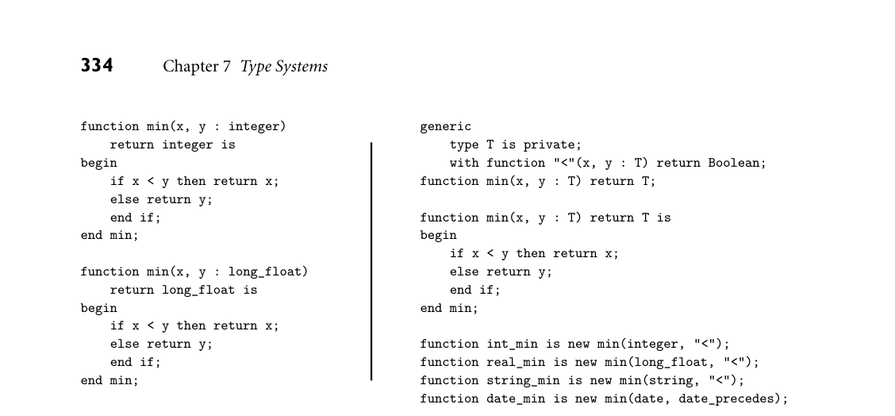
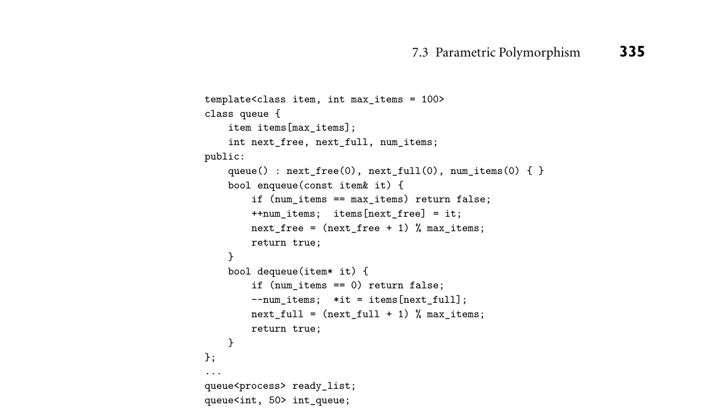
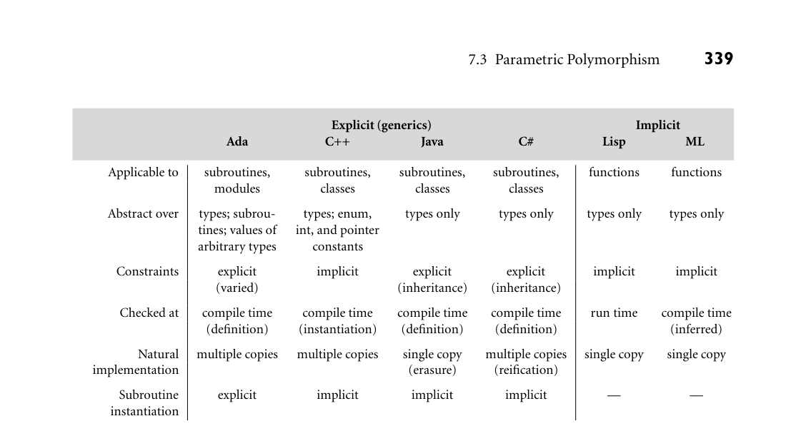

# 7.3 Parametric Polymorphism

7.3 Parametric Polymorphism 331

DESIGN & IMPLEMENTATION

7.8 Unification Unification is a powerful technique. In addition to its role in type inference (which also arises in the templates [generics] of C++), unification plays a cen- tral role in the computational model of Prolog and other logic languages. We will consider this latter role in Section 12.1. In the general case the cost of uni- fying the types of two expressions can be exponential [Mai90], but the patho- logical cases tend not to arise in practice.

3CHECK YOUR UNDERSTANDING 13. What is the difference between type equivalence and type compatibility?

14. Discuss the comparative advantages of structural and name equivalence for types. Name three languages that use each approach.

15. Explain the difference between strict and loose name equivalence. 16. Explain the distinction between derived types and subtypes in Ada.

17. Explain the differences among type conversion, type coercion, and nonconvert- ing type casts.

18. Summarize the arguments for and against coercion. 19. Under what circumstances does a type conversion require a run-time check?

20. What purpose is served by universal reference types? 21. What is type inference? Describe three contexts in which it occurs. 22. Under what circumstances does an ML compiler announce a type clash?

23. Explain how the type inference of ML leads naturally to polymorphism. 24. Why do ML programmers often declare the types of variables, even when they don’t have to? 25. What is unification? What is its role in ML?

7.3 Parametric Polymorphism

As we have seen in the previous section, functions in ML-family languages are naturally polymorphic. Consider the simple task of finding the minimum of two values. In OCaml, the function EXAMPLE 7.44

Finding the minimum in OCaml or Haskell let min x y = if x < y then x else y;;

332 Chapter 7 Type Systems

can be applied to arguments of any type, though sometimes the built-in definition of < may not be what the programmer would like. In Haskell the same function (minus the trailing semicolons) could be applied to arguments of any type in the class Ord; the programmer could add new types to this class by providing a definition of <. Sophisticated type inference allows the compiler to perform most checking at compile time in OCaml, and all of it in Haskell (see Sidebar 7.7 for details). In OCaml, our min function would be said to have type ‚a -> ‚a -> ‚a; in Haskell, it would be Ord a => a -> a -> a. While the explicit parameters of min are x and y, we can think of a as an extra, implicit parameter—a type parame- ter. For this reason, ML-family languages are said to provide implicit parametric polymorphism. ■ Languages without compile-time type inference can provide similar conve- nience and expressiveness, if we are willing to delay type checking until run time. In Scheme, our min function would be written like this: EXAMPLE 7.45

Implicit polymorphism in Scheme (define min (lambda (a b) (if (< a b) a b)))

As in OCaml or Haskell, it makes no mention of types. The typical Scheme im- plementation employs an interpreter that examines the arguments to min and determines, at run time, whether they are mutually compatible and support a < operator. Given the definition above, the expression (min 123 456) evaluates to 123; (min 3.14159 2.71828) evaluates to 2.71828. The expression (min "abc" "def") produces a run-time error when evaluated, because the string comparison operator is named string<?, not <. ■ Similar run-time checks for object-oriented languages were pioneered by Smalltalk, and appear in Objective C, Swift, Python, and Ruby, among others. In these languages, an object is assumed to have an acceptable type if it supports whatever method is currently being invoked. In Ruby, for example, min is a pre- EXAMPLE 7.46

Duck typing in Ruby defined method supported by collection classes. Assuming that the elements of collection C support a comparison (<=> operator), C.min will return the mini- mum element:

[5, 9, 3, 6].min # 3 (array) (2..10).min # 2 (range) ["apple", "pear", "orange"].min # "apple" (lexicographic order) ["apple", "pear", "orange"].min { |a,b| a.length <=> b.length } # "pear"

For the final call to min, we have provided, as a trailing block, an alternative defi- nition of the comparison operator. ■ This operational style of checking (an object has an acceptable type if it sup- ports the requested method) is sometimes known as duck typing. It takes its name from the notion that “if it walks like a duck and quacks like a duck, then it must be a duck.” 6

6 The origins of this “duck test” colloquialism are uncertain, but they go back at least as far as the early 20th century. Among other things, the test was widely cited in the 1940s and 50s as a means of identifying supposed Communist sympathizers.

7.3 Parametric Polymorphism 333

7.3.1 Generic Subroutines and Classes

The disadvantage of polymorphism in Scheme, Smalltalk, Ruby, and the like is the need for run-time checking, which incurs nontrivial costs, and delays the report- ing of errors. The implicit polymorphism of ML-family languages avoids these disadvantages, but requires advanced type inference. For other compiled lan- guages, explicit parametric polymorphism (otherwise known as generics) allows the programmer to specify type parameters when declaring a subroutine or class. The compiler then uses these parameters in the course of static type checking. Languages that provide generics include Ada, C++ (which calls them tem- plates), Eiffel, Java, C#, and Scala. As a concrete example, consider the overloaded EXAMPLE 7.47

Generic min function in Ada min functions on the left side of Figure 7.2. Here the integer and floating-point versions differ only in the types of the parameters and return value. We can ex- ploit this similarity to define a single version that works not only for integers and reals, but for any type whose values are totally ordered. This code appears on the right side of Figure 7.2. The initial (bodyless) declaration of min is preceded by a generic clause specifying that two things are required in order to create a concrete instance of a minimum function: a type, T, and a corresponding com- parison routine. This declaration is followed by the actual code for min, and instantiations of this code for integer and floating-point types. Given appropriate comparison routines (not shown), we can also instantiate versions for types like string and date, as shown on the last two lines. (The "<" operation mentioned in the definition of string_min is presumably overloaded; the compiler resolves the overloading by finding the version of "<" that takes arguments of type T, where T is already known to be string.) ■ In an object-oriented language, generics are most often used to parameterize entire classes. Among other things, such classes may serve as containers—data EXAMPLE 7.48

Generic queues in C++ abstractions whose instances hold a collection of other objects, but whose opera- tions are generally oblivious to the type of the objects they contain. Examples of containers include stack, queue, heap, set, and dictionary (mapping) abstractions, implemented as lists, arrays, trees, or hash tables. In the absence of generics, it is possible in some languages (C is an obvious example, as were early versions of Java and C#) to define a queue of references to arbitrary objects, but use of such a queue requires type casts that abandon compile-time checking (Exercise 7.8). A simple generic queue in C++ appears in Figure 7.3. ■ We can think of generic parameters as supporting compile-time customiza- tion, allowing the compiler to create an appropriate version of the parameterized subroutine or class. In some languages—Java and C#, for example—generic pa- rameters must always be types. Other languages are more general. In Ada and C++, for example, a generic can be parameterized by values as well. We can see EXAMPLE 7.49

Generic parameters an example in Figure 7.3, where an integer parameter has been used to specify the

*Figure 7.2 Overloading (left) versus generics (right) in Ada.*

maximum length of the queue. In C++, this value must be a compile-time con- stant; in Ada, which supports dynamic-size arrays (Section 8.2.2), its evaluation can be delayed until elaboration time. ■

Implementation Options

Generics can be implemented several ways. In most implementations of Ada and C++ they are a purely static mechanism: all the work required to create and use multiple instances of the generic code takes place at compile time. In the usual case, the compiler creates a separate copy of the code for every instance. (C++

DESIGN & IMPLEMENTATION

7.9 Generics in ML Perhaps surprisingly, given the implicit polymorphism that comes “for free” with type inference, both OCaml and SML provide explicit polymorphism— generics—as well, in the form of parameterized modules called functors. Un- like the implicit polymorphism, functors allow the OCaml or SML program- mer to indicate that a collection of functions and other values (i.e., the contents of a module) share a common set of generic parameters. This sharing is then enforced by the compiler. Moreover, any types exported by a functor invoca- tion (generic instantiation) are guaranteed to be distinct, even though their signatures (interfaces) are the same. As in Ada and C++, generic parameters in ML can be values as well as types. NB: While Haskell also provides something called a Functor (specifically, a type class that supports a mapping function), its use of the term has little in common with that of OCaml and SML.

*Figure 7.3 Generic array-based queue in C++.*

goes farther, and arranges to type-check each of these instances independently.) If several queues are instantiated with the same set of arguments, then the compiler may share the code of the enqueue and dequeue routines among them. A clever compiler may arrange to share the code for a queue of integers with the code for a queue of floating-point numbers, if the two types happen to have the same size, but this sort of optimization is not required, and the programmer should not be surprised if it doesn’t occur. Java, by contrast, guarantees that all instances of a given generic will share the same code at run time. In effect, if T is a generic type parameter in Java, then ob- jects of class T are treated as instances of the standard base class Object, except that the programmer does not have to insert explicit casts to use them as objects of class T, and the compiler guarantees, statically, that the elided casts will never fail. C# plots an intermediate course. Like C++, it will create specialized imple- mentations of a generic for different primitive or value types. Like Java, however, it requires that the generic code itself be demonstrably type safe, independent of the arguments provided in any particular instantiation. We will examine the tradeoffs among C++, Java, and C# generics in more detail in Section C 7.3.2.

Generic Parameter Constraints

Because a generic is an abstraction, it is important that its interface (the header of its declaration) provide all the information that must be known by a user of the abstraction. Several languages, including Ada, Java, C#, Scala, OCaml, and SML,

336 Chapter 7 Type Systems

attempt to enforce this rule by constraining generic parameters. Specifically, they require that the operations permitted on a generic parameter type be explicitly declared. In Ada, the programmer can specify the operations of a generic type parameter EXAMPLE 7.50

with constraints in Ada by means of a trailing with clause. We saw a simple example in the “minimum” function of Figure 7.2 (right side). The declaration of a generic sorting routine in Ada might be similar:

generic type T is private; type T_array is array (integer range <>) of T; with function "<"(a1, a2 : T) return boolean; procedure sort(A : in out T_array);

Without the with clause, procedure sort would be unable to compare ele- ments of A for ordering, because type T is private—it supports only assign- ment, testing for equality and inequality, and a few other standard attributes (e.g., size). ■ Java and C# employ a particularly clean approach to constraints that exploits the ability of object-oriented types to inherit methods from a parent type or in- terface. We defer a full discussion of inheritance to Chapter 10. For now, we note that it allows the Java or C# programmer to require that a generic parameter sup- port a particular set of methods, much as the type classes of Haskell constrain the types of acceptable parameters to an implicitly polymorphic function. In Java, we EXAMPLE 7.51

Generic sorting routine in Java might declare and use a sorting routine as follows:

DESIGN & IMPLEMENTATION

7.10 Overloading and polymorphism Given that a compiler will often create multiple instances of the code for a generic subroutine, specialized to a given set of generic parameters, one might be forgiven for wondering: what exactly is the difference between the left and right sides of Figure 7.2? The answer lies in the generality of the polymorphic code. With overloading the programmer must write a separate min routine for every type, and while the compiler will choose among these automatically, the fact that they do something similar with their arguments is purely a matter of convention. Generics, on the other hand, allow the compiler to create an appropriate version for every needed type. The similarity of the calling syntax (and of the generated code, when conventions are followed) has led some au- thors to refer to overloading as ad hoc (special case) polymorphism. There is no particular reason, however, for the programmer to think of polymorphism in terms of multiple copies: from a semantic (conceptual) point of view, over- loaded subroutines use a single name for more than one thing; a polymorphic subroutine is a single thing.

7.3 Parametric Polymorphism 337

public static <T extends Comparable<T>> void sort(T A[]) { ... if (A[i].compareTo(A[j]) >= 0) ... ... } ... Integer[] myArray = new Integer[50]; ... sort(myArray);

Where C++ requires a template<type args> prefix before a generic method, Java puts the type parameters immediately in front of the method’s return type. The extends clause constitutes a generic constraint: Comparable is an interface (a set of required methods) from the Java standard library; it includes the method compareTo. This method returns −1, 0, or 1, respectively, depending on whether the current object is less than, equal to, or greater than the object passed as a pa- rameter. The compiler checks to make sure that the objects in any array passed to sort are of a type that implements Comparable, and are therefore guaran- teed to provide compareTo. If T had needed additional interfaces (that is, if we had wanted more constraints), they could have been specified with a comma- separated list: <T extends I1, I2, I3>. ■ C# syntax is similar: EXAMPLE 7.52

Generic sorting routine in C# static void sort<T>(T[] A) where T : IComparable { ... if (A[i].CompareTo(A[j]) >= 0) ... ... } ... int[] myArray = new int[50]; sort(myArray);

C# puts the type parameters after the name of the subroutine, and the constraints (the where clause) after the regular parameter list. The compiler is smart enough to recognize that int is a primitive type, and generates a customized implemen- tation of sort, eliminating the need for Java’s Integer wrapper class, and pro- ducing faster code. ■ A few languages forgo explicit constraints, but still check how parameters are used. In C++, for example, the header of a generic sorting routine can be ex- EXAMPLE 7.53

Generic sorting routine in C++ tremely simple:

template<typename T> void sort(T A[], int A_size) { ...

No mention is made of the need for a comparison operator. The body of a generic can (attempt to) perform arbitrary operations on objects of a generic parameter

338 Chapter 7 Type Systems

type, but if the generic is instantiated with a type that does not support that oper- ation, the compiler will announce a static semantic error. Unfortunately, because the header of the generic does not necessarily specify which operations will be required, it can be difficult for the programmer to predict whether a particular instantiation will cause an error message. Worse, in some cases the type provided in a particular instantiation may support an operation required by the generic’s code, but that operation may not do “the right thing.” Suppose in our C++ sort- ing example that the code for sort makes use of the < operator. For ints and doubles, this operator will do what one would expect. For character strings, however, it will compare pointers, to see which referenced character has a lower address in memory. If the programmer is expecting comparison for lexicographic ordering, the results may be surprising! To avoid surprises, it is best to avoid implicit use of the operations of a generic parameter type. The next version of the C++ standard is likely to incorporate syn- tax for explicit template constraints [SSD13]. For now, the comparison routine can be provided as a method of class T, an extra argument to the sort routine, or an extra generic parameter. To facilitate the first of these options, the program- mer may choose to emulate Java or C#, encapsulating the required methods in an abstract base class from which the type T may inherit. ■

Implicit Instantiation

Because a class is a type, one must generally create an instance of a generic class EXAMPLE 7.54

Generic class instance in C++ (i.e., an object) before the generic can be used. The declaration provides a natural place to provide generic arguments:

queue<int, 50> *my_queue = new queue<int, 50>(); // C++ ■

Some languages (Ada among them) also require generic subroutines to be in- EXAMPLE 7.55

Generic subroutine instance in Ada stantiated explicitly before they can be used:

procedure int_sort is new sort(integer, int_array, "<"); ... int_sort(my_array); ■

Other languages (C++, Java, and C# among them) do not require this. Instead they treat generic subroutines as a form of overloading. Given the C++ sorting EXAMPLE 7.56

Implicit instantiation in C++ routine of Example 7.53 and the following objects:

int ints[10]; double reals[50]; string strings[30]; // library class string has lexicographic operator<

we can perform the following calls without instantiating anything explicitly:

sort(ints, 10); sort(reals, 50); sort(strings, 30);

*Figure 7.4 Mechanisms for parametric polymorphism in Ada, C++, Java, C#, Lisp, and ML. Erasure and reification are discussed in Section C 7.3.2.*

In each case, the compiler will implicitly instantiate an appropriate version of the sort routine. Java and C# have similar conventions. To keep the language man- ageable, the rules for implicit instantiation in C++ are more restrictive than the rules for resolving overloaded subroutines in general. In particular, the compiler will not coerce a subroutine argument to match a type expression containing a generic parameter (Exercise C 7.26). ■ Figure 7.4 summarizes the features of Ada, C++, Java, and C# generics, and of the implicit parametric polymorphism of Lisp and ML. Further explanation of some of the details appears in Section C 7.3.2.

7.3.2 Generics in C++, Java, and C#

Several of the key tradeoffs in the design of generics can be illustrated by com- paring the features of C++, Java, and C#. C++ is by far the most ambitious of the three. Its templates are intended for almost any programming task that re- quires substantially similar but not identical copies of an abstraction. Java and C# provide generics purely for the sake of polymorphism. Java’s design was heavily influenced by the desire for backward compatibility, not only with existing ver- sions of the language, but with existing virtual machines and libraries. The C# designers, though building on an existing language, did not feel as constrained. They had been planning for generics from the outset, and were able to engineer substantial new support into the .NET virtual machine.

