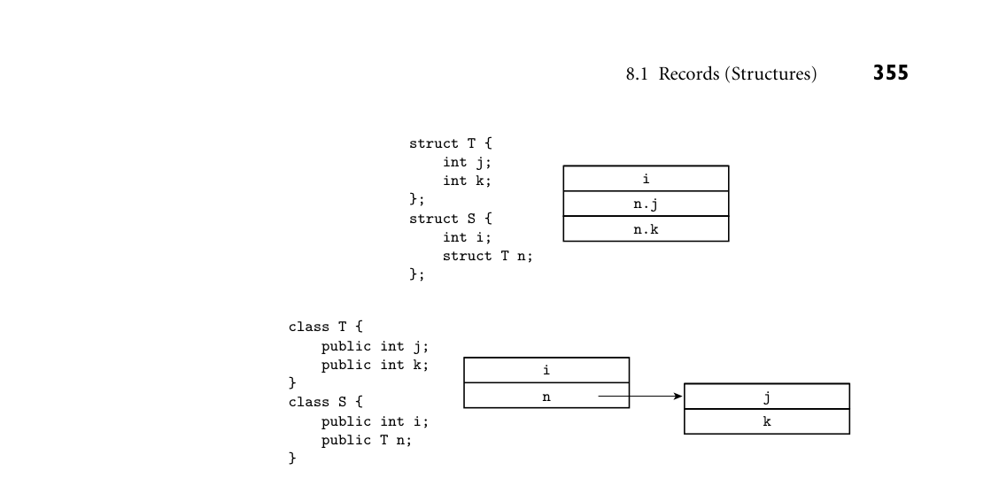
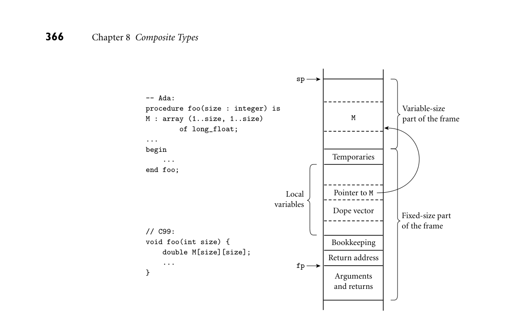

# Chapter 8: Composite Types

8 Composite Types

Chapter 7 introduced the notion of types as a way to organize the many values and objects manipulated by computer programs. It also introduced ter- minology for both built-in and composite types. As we noted in Section 7.1.4, composite types are formed by joining together one or more simpler types using a type constructor. From a denotational perspective, the constructors can be mod- eled as operations on sets, with each set representing one of the simpler types. In the current chapter we will survey the most important type constructors: records, arrays, strings, sets, pointers, lists, and files. In the section on records we will also consider both variants (unions) and tuples. In the section on point- ers, we will take a more detailed look at the value and reference models of vari- ables introduced in Section 6.1.2, and the heap management issues introduced in Section 3.2. The section on files (mostly on the companion site) will include a discussion of input and output mechanisms.

8.1 Records (Structures)

Record types allow related data of heterogeneous types to be stored and manipu- lated together. Originally introduced by Cobol, records also appeared in Algol 68, which called them structures, and introduced the keyword struct. Many mod- ern languages, including C and its descendants, employ the Algol terminology. Fortran 90 simply calls its records “types”: they are the only form of programmer- defined type other than arrays, which have their own special syntax. Structures in C++ are defined as a special form of class (one in which members are globally visible by default). Java has no distinguished notion of struct; its program- mers use classes in all cases. C# and Swift use a reference model for variables of class types, and a value model for variables of struct types. In these languages, structs do not support inheritance. For the sake of simplicity, we will use the term “record” in most of our discussion to refer to the relevant construct in all these languages.

8.1.1 Syntax and Operations

In C, a simple record might be defined as follows: EXAMPLE 8.1

A C struct struct element { char name[2]; int atomic_number; double atomic_weight; _Bool metallic; }; ■

Each of the record components is known as a field. To refer to a given field of a record, most languages use “dot” notation: EXAMPLE 8.2

Accessing record fields element copper; const double AN = 6.022e23; /* Avogadro's number */ ... copper.name[0] = 'C'; copper.name[1] = 'u'; double atoms = mass / copper.atomic_weight * AN;

In Fortran 90 one would say copper%name and copper%atomic_weight. Cobol reverses the order of the field and record names: name of copper and atomic_ weight of copper. In Common Lisp, one would say (element-name copper) and (element-atomic_weight copper). ■ Most languages allow record definitions to be nested. Again in C: EXAMPLE 8.3

Nested records struct ore { char name[30]; struct { char name[2]; int atomic_number; double atomic_weight; _Bool metallic; } element_yielded; };

Alternatively, one could say

```
struct ore {
char name[30];
struct element element_yielded;
};
```

In Fortran 90 and Common Lisp, only the second alternative is permitted: record fields can have record types, but the declarations cannot be lexically nested. Naming for nested records is straightforward: malachite.element_

yielded.atomic_number in C; atomic_number of element_yielded of mal- achite in Cobol; (element-atomic_number (ore-element_yielded mala- chite)) in Common Lisp. ■ As noted in Example 7.17, ML and its relatives differ from most languages in EXAMPLE 8.4

OCaml records and tuples specifying that the order of record fields is insignificant. The OCaml record value {name = "Cu"; atomic_number = 29; atomic_weight = 63.546; metallic = true} is the same as the value {atomic_number = 29; name = "Cu"; atomic_ weight = 63.546; metallic = true}—they will test true for equality. OCaml’s tuples, which we mentioned briefly in Section 7.2.4, and will visit again in Section 11.4.3, resemble records whose fields are ordered, but unnamed. In SML, the other leading ML dialect, the resemblance is actually equivalence: tuples are defined as syntactic sugar for records whose field names are small inte- gers. The values ("Cu", 29), {1 = "Cu", 2 = 29}, and {2 = 29, 1 = "Cu"} will all test true for equality in SML. ■

8.1.2 Memory Layout and Its Impact

The fields of a record are usually stored in adjacent locations in memory. In its symbol table, the compiler keeps track of the offset of each field within each record type. When it needs to access a field, the compiler will often generate a load or store instruction with displacement addressing. For a local object, the base register is typically the frame pointer; the displacement is then the sum of the record’s offset from the register and the field’s offset within the record. A likely layout for our element type on a 32-bit machine appears in Figure 8.1. EXAMPLE 8.5

Memory layout for a record type Because the name field is only two characters long, it occupies two bytes in mem- ory. Since atomic_number is an integer, and must (on most machines) be word- aligned, there is a two-byte “hole” between the end of name and the beginning of atomic_number. Similarly, since Boolean variables (in most language imple- mentations) occupy a single byte, there are three bytes of empty space between the end of the metallic field and the next aligned location. In an array of elements, most compilers would devote 20 bytes to every member of the array. ■

DESIGN & IMPLEMENTATION

8.1 Struct tags and typedef in C and C++ One of the peculiarities of the C type system is that struct tags are not exactly type names. In Example 8.1, the name of the type is the two-word phrase struct element. We used this name to declare the element_yielded field of the second struct in Example 8.3. To obtain a one-word name, one can say typedef struct element element_t, or even typedef struct element element: struct tags and typedef names have separate name spaces, so the same name can be used in each. C++ eliminates this idiosyncrasy by allowing the struct tag to be used as a type name without the struct prefix; in effect, it performs the typedef implicitly.


*Figure 8.1 Likely layout in memory for objects of type element on a 32-bit machine. Align- ment restrictions lead to the shaded “holes.”*

In a language with a value model of variables, nested records are naturally embedded in the parent record, where they function as large fields with word or double-word alignment. In a language with a reference model of variables, fields of record type are typically references to data in another location. The difference is a matter not only of memory layout, but also of semantics. We can see the difference in Figure 8.2. In C, with a value model of variables, data is laid out as EXAMPLE 8.6

Nested records as values shown at the top of the figure. In the following code, using the declarations at the top of the figure, the assignment of s1 into s2 copies the embedded T:

struct S s1; struct S s2; s1.n.j = 0; s2 = s1; s2.n.j = 7; printf("%d\n", s1.n.j); /* prints 0 */ ■

In Java, by contrast, with a reference model of variables, data is laid out as EXAMPLE 8.7

Nested records as references shown at the bottom of the figure. In the following code, using the declarations at the bottom of the figure, assignment of s1 into s2 copies only the reference, so s2.n.j is an alias for s1.n.j:

S s1 = new S(); s1.n = new T(); // fields initialized to 0 S s2 = s1; s2.n.j = 7; System.out.println(s1.n.j); // prints 7 ■

A few languages and implementations allow the programmer to specify that a EXAMPLE 8.8

Layout of packed types record type (or an array, set, or file type) should be packed. In Ada, one uses a pragma:

```
type element = record
...
end;
pragma Pack(element);
```


*Figure 8.2 Layout of memory for a nested struct (class) in C (top) and Java (bottom). This layout reflects the fact that n is an embedded value in C, but a reference in Java. We have assumed here that integers and pointers have equal size.*

When compiling with gcc, one uses an attribute:

```
struct __attribute__ ((__packed__)) element {
...
}
```

The Ada syntax is built into the language; the gcc syntax is a GNU extension. In either case, the directive asks the compiler to optimize for space instead of speed. Typically, a compiler will implement a packed record without holes, by simply “pushing the fields together.” To access a nonaligned field, however, it will have to issue a multi-instruction sequence that retrieves the pieces of the field from memory and then reassembles them in a register. A likely packed layout for our element type (again for a 32-bit machine) appears in Figure 8.3. It is 15 bytes in length. An array of packed element records would probably devote 16 bytes to each member of the array; that is, it would align each element. A packed array of packed records might devote only 15 bytes to each; only every fourth element would be aligned. ■ Most languages allow a value to be assigned to an entire record in a single EXAMPLE 8.9

Assignment and comparison of records operation:

my_element := copper;

Ada also allows records to be compared for equality (if my_element = copper then ...). Many other languages (including C and its successors) support as- signment but not equality testing, though C++ allows the programmer to define the latter for individual record types. ■


*Figure 8.3 Likely memory layout for packed element records. The atomic_number and atomic_weight fields are nonaligned, and can only be read or written (on most machines) via multi-instruction sequences.*

For small records, both copies and comparisons can be performed in-line on a field-by-field basis. For longer records, we can save significantly on code space by deferring to a library routine. A block_copy routine can take source address, destination address, and length as arguments, but the analogous block_compare routine would fail on records with different (garbage) data in the holes. One solution is to arrange for all holes to contain some predictable value (e.g., zero), but this requires code at every elaboration point. Another is to have the compiler generate a customized field-by-field comparison routine for every record type. Different routines would be called to compare records of different types. In addition to complicating comparisons, holes in records waste space. Pack- EXAMPLE 8.10

Minimizing holes by sorting fields ing eliminates holes, but at potentially heavy cost in access time. A compromise, adopted by some compilers, is to sort a record’s fields according to the size of their alignment constraints. All byte-aligned fields might come first, followed by any half-word aligned fields, word-aligned fields, and (if the hardware requires) double-word-aligned fields. For our element type, the resulting rearrangement is shown in Figure 8.4. ■ In most cases, reordering of fields is purely an implementation issue: the pro- grammer need not be aware of it, so long as all instances of a record type are reordered in the same way. The exception occurs in systems programs, which sometimes “look inside” the implementation of a data type with the expectation that it will be mapped to memory in a particular way. A kernel programmer, for example, may count on a particular layout strategy in order to define a record

DESIGN & IMPLEMENTATION

8.2 The order of record fields Issues of record field order are intimately tied to implementation tradeoffs: Holes in records waste space, but alignment makes for faster access. If holes contain garbage we can’t compare records by looping over words or bytes, but zeroing out the holes would incur costs in time and code space. Predictable layout is important for mirroring hardware structures in “systems” languages, but reorganization may be advantageous in large records if we can group fre- quently accessed fields together, so they lie in the same cache line.


*Figure 8.4 Rearranging record fields to minimize holes. By sorting fields according to the size of their alignment constraint, a compiler can minimize the space devoted to holes, while keeping the fields aligned.*

that mimics the organization of memory-mapped control registers for a partic- ular Ethernet device. C and C++, which are designed in large part for systems programs, guarantee that the fields of a struct will be allocated in the order declared. The first field is guaranteed to have the coarsest alignment required by the hardware for any type (generally a four- or eight-byte boundary). Sub- sequent fields have the natural alignment for their type. Fortran 90 allows the programmer to specify that fields must not be reordered; in the absence of such a specification the compiler can choose its own order. To accommodate systems programs, Ada, C, and C++ all allow the programmer to specify exactly how many bits to devote to each field of a record. Where a “packed” directive is es- sentially a nonbinding indication of the programmer’s priorities, bit lengths on field declarations are a binding specification of assembly-level layout.

8.1.3 Variant Records (Unions)

Programming languages of the 1960s and 1970s were designed in an era of se- vere memory constraints. Many allowed the programmer to specify that certain variables (presumably ones that would never be used at the same time) should be allocated “on top of” one another, sharing the same bytes in memory. C’s syntax, EXAMPLE 8.11

A union in C heavily influenced by Algol 68, looks very much like a struct:

```
union {
int i;
double d;
_Bool b;
};
```

The overall size of this union would be that of its largest member (presumably d). Exactly which bytes of d would be overlapped by i and b is implementation de- pendent, and presumably influenced by the relative sizes of types, their alignment constraints, and the endian-ness of the hardware. ■ In practice, unions have been used for two main purposes. The first arises in systems programs, where unions allow the same set of bytes to be interpreted in

different ways at different times. The canonical example occurs in memory man- agement, where storage may sometimes be treated as unallocated space (perhaps in need of “zeroing out”), sometimes as bookkeeping information (length and header fields to keep track of free and allocated blocks), and sometimes as user- allocated data of arbitrary type. While nonconverting type casts (Section 7.2.1) can be used to implement heap management routines, unions are a better indi- cation of the programmer’s intent: the bits are not being reinterpreted, they are being used for independent purposes.1 The second, historical purpose for unions was to represent alternative sets of fields within a record. A record representing an employee, for example, might EXAMPLE 8.12

Motivation for variant records have several common fields (name, address, phone, department, ID number) and various other fields depending on whether the person in question works on a salaried, hourly, or consulting basis. Traditional C unions were awkward when used for this purpose. A much cleaner syntax appeared in the variant records of Pascal and its successors, which allow the programmer to specify that certain fields within a record should overlap in memory. Similar functionality was added to C11 and C++11 in the form of anonymous unions. ■

IN MORE DEPTH

We discuss unions and variant records in more detail on the companion site. Topics we consider include syntax, safety, and memory layout issues. Safety is a particular concern: where nonconverting type casts allow a programmer to cir- cumvent the language’s type system explicitly, a naive realization of unions makes it easy to do so by accident. Ada imposes limits on the use of unions and variant records that allow the compiler to verify, statically, that all programs are type-safe. We also note that inheritance in object-oriented languages provides an attractive alternative to type-safe variant records in most cases. This observation largely accounts for the omission of unions and variant records from most more recent languages.

3CHECK YOUR UNDERSTANDING 1. What are struct tags in C? How are they related to type names? How did they change in C++?

  2.
  How do the records of ML differ from those of most other languages?
  3.
  Discuss the significance of “holes” in records. Why do they arise? What prob-
  lems do they cause?

1 By contrast, the other example mentioned under Nonconverting Type Casts in Section 7.2.1— examination of the internal structure of a floating-point number—does indeed reinterpret bits. Unions can also be used in this case (Exercise C 8.24), but here a nonconverting cast is a better indication of intent.

  4.
  Why is it easier to implement assignment than comparison for records?

  5.
  What is packing? What are its advantages and disadvantages?
  6.
  Why might a compiler reorder the fields of a record? What problems might
  this cause?
  7.
  Briefly describe two purposes for unions/variant records.

8.2 Arrays

Arrays are the most common and important composite data types. They have been a fundamental part of almost every high-level language, beginning with For- tran I. Unlike records, which group related fields of disparate types, arrays are usually homogeneous. Semantically, they can be thought of as a mapping from an index type to a component or element type. Some languages (e.g., Fortran) re- quire that the index type be integer; many languages allow it to be any discrete type. Some languages (e.g., Fortran 77) require that the element type of an array be scalar. Most (including Fortran 90) allow any element type. Some languages (notably scripting languages, but also some newer imperative languages, including Go and Swift) allow nondiscrete index types. The resulting associative arrays must generally be implemented with hash tables or search trees; we consider them in Section 14.4.3. Associative arrays also resemble the dictio- nary or map types supported by the standard libraries of many object-oriented languages. In C++, operator overloading allows these types to use conventional array-like syntax. For the purposes of this chapter, we will assume that array indices are discrete. This admits a (much more efficient) contiguous allocation scheme, to be described in Section 8.2.3. We will also assume that arrays are dense—that a large fraction of their elements are not equal to zero or some other default value. The alternative—sparse arrays—arises in many important scien- tific problems. For these, libraries (or, in rare cases, the language itself) may support an alternative implementation that explicitly enumerates only the non- default values.

8.2.1 Syntax and Operations

Most languages refer to an element of an array by appending a subscript—usually delimited by square brackets—to the name of the array: A[3]. A few languages— notably Fortran and Ada—use parentheses instead: A(3). In some languages one declares an array by appending subscript notation to EXAMPLE 8.13

Array declarations the syntax that would be used to declare a scalar. In C:

char upper[26];

In Fortran:

```
character, dimension (1:26) :: upper
character (26) upper
! shorthand notation
```

In C, the lower bound of an index range is always zero: the indices of an n-element array are 0 . . .n−1. In Fortran, the lower bound of the index range is one by default. Fortran 90 allows a different lower bound to be specified if desired, using the notation shown in the first of the two declarations above. Many Algol descendants use an array constructor instead. In Ada, for exam- ple, one might say

upper : array (character range 'a'..'z') of character; ■

Most languages make it easy to declare multidimensional arrays: EXAMPLE 8.14

Multidimensional arrays mat : array (1..10, 1..10) of long_float; -- Ada

```
real, dimension (10,10) :: mat
! Fortran
```

In some languages, one can also declare a multidimensional array by using the array constructor more than once in the same declaration. In Modula-3, for example,

VAR mat : ARRAY [1..10], [1..10] OF REAL;

is syntactic sugar for

VAR mat : ARRAY [1..10] OF ARRAY [1..10] OF REAL;

and mat[3, 4] is syntactic sugar for mat[3][4]. ■ In Ada, by contrast, EXAMPLE 8.15

Multidimensional vs built-up arrays mat1 : array (1..10, 1..10) of long_float;

is not the same as

```
type vector is array (integer range <>) of long_float;
type matrix is array (integer range <>) of vector (1..10);
mat2 : matrix (1..10);
```

Variable mat1 is a two-dimensional array; mat2 is an array of one-dimensional arrays. With the former declaration, we can access individual real numbers as mat1(3, 4); with the latter we must say mat2(3)(4). The two-dimensional array is arguably more elegant, but the array of arrays supports additional op- erations: it allows us to name the rows of mat2 individually (mat2(3) is a 10- element, single-dimensional array), and it allows us to take slices, as discussed

below (mat2(3)(2..6) is a five-element array of real numbers; mat2(3..7) is a five-element array of ten-element arrays). ■ In C, one must also declare an array of arrays, and use two-subscript notation, EXAMPLE 8.16

Arrays of arrays in C but C’s integration of pointers and arrays (to be discussed in Section 8.5.1) means that slices are not supported:

double mat[10][10];

Given this definition, mat[3][4] denotes an individual element of the array, but mat[3] denotes a reference, either to the third row of the array or to the first element of that row, depending on context. ■

DESIGN & IMPLEMENTATION

8.3 Is [ ] an operator? Associative arrays in C++ are typically defined by overloading operator[ ]. C#, like C++, provides extensive facilities for operator overloading, but it does not use these facilities to support associative arrays. Instead, the language pro- vides a special indexer mechanism, with its own unique syntax:

```
class directory {
Hashtable table;
// from standard library
...
public directory() {
// constructor
table = new Hashtable();
}
...
public string this[string name] {
// indexer method
get {
return (string) table[name];
}
set {
table[name] = value;
// value is implicitly
}
}
}
// a parameter of set
...
directory d = new directory();
...
d["Jane Doe"] = "234-5678";
Console.WriteLine(d["Jane Doe"]);
```

Why the difference? In C++, operator[] can return a reference (an explicit l-value), which can be used on either side of an assignment (further informa- tion can be found under “References in C++” in Section 9.3.1). C# has no comparable l-value mechanism, so it needs separate methods to get and set the value of d["Jane Doe"].


*Figure 8.5 Array slices (sections) in Fortran 90. Much like the values in the header of an enumeration-controlled loop (Section 6.5.1), a : b : c in a subscript indicates positions a, a + c, a + 2c, . . . through b. If a or b is omitted, the corresponding bound of the array is assumed. If c is omitted, 1 is assumed. It is even possible to use negative values of c in order to select positions in reverse order. The slashes in the second subscript of the lower right example delimit an explicit list of positions.*

Slices and Array Operations

A slice or section is a rectangular portion of an array. Fortran 90 provides ex- EXAMPLE 8.17

Array slice operations tensive facilities for slicing, as do Go and many scripting languages. Figure 8.5 illustrates some of the possibilities in Fortran 90, using the declaration of mat from Example 8.14. Ada provides more limited support: a slice is simply a con- tiguous range of elements in a one-dimensional array. As we saw in Example 8.15, the elements can themselves be arrays, but there is no way to extract a slice along both dimensions as a single operation. ■ In most languages, the only operations permitted on an array are selection of an element (which can then be used for whatever operations are valid on its type), and assignment. A few languages (e.g., Ada and Fortran 90) allow arrays to be compared for equality. Ada allows one-dimensional arrays whose elements are discrete to be compared for lexicographic ordering: A < B if the first element of A that is not equal to the corresponding element of B is less than that correspond- ing element. Ada also allows the built-in logical operators (or, and, xor) to be applied to Boolean arrays. Fortran 90 has a very rich set of array operations: built-in operations that take entire arrays as arguments. Because Fortran uses structural type equivalence, the

operands of an array operator need only have the same element type and shape. In particular, slices of the same shape can be intermixed in array operations, even if the arrays from which they were sliced have very different shapes. Any of the built-in arithmetic operators will take arrays as operands; the result is an array, of the same shape as the operands, whose elements are the result of applying the operator to corresponding elements. As a simple example, A + B is an array each of whose elements is the sum of the corresponding elements of A and B. Fortran 90 also provides a huge collection of intrinsic, or built-in functions. More than 60 of these (including logic and bit manipulation, trigonometry, logs and exponents, type conversion, and string manipulation) are defined on scalars, but will also perform their operation element-wise if passed arrays as arguments. The function tan(A), for example, returns an array consisting of the tangents of the elements of A. Many additional intrinsic functions are defined solely on arrays. These include searching and summarization, transposition, and reshaping and subscript permutation. Fortran 90 draws significant inspiration from APL, an array manipulation lan- guage developed by Iverson and others in the early to mid-1960s.2 APL was de- signed primarily as a terse mathematical notation for array manipulations. It employs an enormous character set that made it difficult to use with traditional keyboards and textual displays. Its variables are all arrays, and many of the spe- cial characters denote array operations. APL implementations are designed for interpreted, interactive use. They are best suited to “quick and dirty” solution of mathematical problems. The combination of very powerful operators with very terse notation makes APL programs notoriously difficult to read and understand. J, a successor to APL, uses a conventional character set.

8.2.2 Dimensions, Bounds, and Allocation

In all of the examples in the previous subsection, the shape of the array (including bounds) was specified in the declaration. For such static shape arrays, storage can be managed in the usual way: static allocation for arrays whose lifetime is the entire program; stack allocation for arrays whose lifetime is an invocation of a subroutine; heap allocation for dynamically allocated arrays with more general lifetime. Storage management is more complex for arrays whose shape is not known until elaboration time, or whose shape may change during execution. For these the compiler must arrange not only to allocate space, but also to make shape information available at run time (without such information, indexing would not be possible). Some dynamically typed languages allow run-time binding of

2 Kenneth Iverson (1920–2004), a Canadian mathematician, joined the faculty at Harvard Uni- versity in 1954, where he conceived APL as a notation for describing mathematical algorithms. He moved to IBM in 1960, where he helped develop the notation into a practical programming language. He was named an IBM Fellow in 1970, and received the ACM Turing Award in 1979.

both the number and bounds of dimensions. Compiled languages may allow the bounds to be dynamic, but typically require the number of dimensions to be static. A local array whose shape is known at elaboration time may still be allocated in the stack. An array whose size may change during execution must generally be allocated in the heap. In the first subsection below we consider the descriptors, or dope vectors,3 used to hold shape information at run time. We then consider stack- and heap-based allocation, respectively, for dynamic shape arrays.

Dope Vectors

During compilation, the symbol table maintains dimension and bounds infor- mation for every array in the program. For every record, it maintains the offset of every field. When the number and bounds of array dimensions are statically known, the compiler can look them up in the symbol table in order to compute the address of elements of the array. When these values are not statically known, the compiler must generate code to look them up in a dope vector at run time. In the general case a dope vector must specify the lower bound of each dimen- sion and the size of each dimension other than the last (which is always the size of the element type, and will thus be statically known). If the language implemen- tation performs dynamic semantic checks for out-of-bounds subscripts in array references, then the dope vector may contain upper bounds as well. Given lower bounds and sizes, the upper bound information is redundant, but including it avoids the need to recompute repeatedly at run time. The contents of the dope vector are initialized at elaboration time, or when- ever the number or bounds of dimensions change. In a language like Fortran 90, whose notion of shape includes dimension sizes but not lower bounds, an assign- ment statement may need to copy not only the data of an array, but dope vector contents as well. In a language that provides both a value model of variables and arrays of dy- namic shape, we must consider the possibility that a record will contain a field whose size is not statically known. In this case the compiler may use dope vectors not only for dynamic shape arrays, but also for dynamic shape records. The dope vector for a record typically indicates the offset of each field from the beginning of the record.

Stack Allocation

Subroutine parameters and local variables provide the simplest examples of dy- namic shape arrays. Early versions of Pascal required the shape of all arrays to be specified statically. Standard Pascal allowed dynamic arrays as subroutine param- eters, with shape fixed at subroutine call time. Such parameters are sometimes

3 The name “dope vector” presumably derives from the notion of “having the dope on (some- thing),” a colloquial expression that originated in horse racing: advance knowledge that a horse has been drugged (“doped”) is of significant, if unethical, use in placing bets.


*Figure 8.6 A dynamic local array in C. Function square multiplies a matrix by itself and replaces the original with the product. To do so it needs a scratch array of the same shape as the parameter. Note that the declarations of M and T both rely on parameter n.*

known as conformant arrays. Among other things, they facilitate the construc- tion of linear algebra libraries, whose routines must typically work on arrays of arbitrary size. To implement such an array, the compiler arranges for the caller to pass both the data of the array and an appropriate dope vector. If the array is of dynamic shape in the caller’s context, the dope vector may already be available. If the array is of static shape in the caller’s context, an appropriate dope vector will need to be created prior to the call. Ada and C (though not C++) support dynamic shape for both parameters and local variables. Among other things, local arrays can be declared to match the EXAMPLE 8.18

Local arrays of dynamic shape in C shape of conformant array parameters, facilitating the implementation of algo- rithms that require temporary space for calculations. Figure 8.6 contains a simple example in C. Function square accepts an array parameter M of dynamic shape and allocates a local variable T of the same dynamic shape. ■ In many languages, including Ada and C, the shape of a local array becomes EXAMPLE 8.19

Stack allocation of elaborated arrays fixed at elaboration time. For such arrays it is still possible to place the space for the array in the stack frame of its subroutine, but an extra level of indirection is required (see Figure 8.7). In order to ensure that every local object can be found using a known offset from the frame pointer, we divide the stack frame into a fixed-size part and a variable-size part. An object whose size is statically known goes in the fixed-size part. An object whose size is not known until elaboration time goes in the variable-size part, and a pointer to it, together with a dope vec- tor, goes in the fixed-size part. If the elaboration of the array is buried in a nested block, the compiler delays allocating space (i.e., changing the stack pointer) until the block is entered. It still allocates space for the pointer and the dope vector


*Figure 8.7 Elaboration-time allocation of arrays. Here M is a square two-dimensional array whose bounds are determined by a parameter passed to foo at run time. The compiler arranges for a pointer to M and a dope vector to reside at static offsets from the frame pointer. M cannot be placed among the other local variables because it would prevent those higher in the frame from having static offsets. Additional variable-size arrays or records are easily accommodated.*

among the local variables when the subroutine itself is entered. Records of dy- namic shape are handled in a similar way. ■ Fortran 90 allows specification of the bounds of an array to be delayed until EXAMPLE 8.20

Elaborated arrays in Fortran 90 after elaboration, but it does not allow those bounds to change once they have been defined:

```
real, dimension (:,:), allocatable :: mat
! mat is two-dimensional, but with unspecified bounds
...
allocate (mat (a:b, 0:m-1))
! first dimension has bounds a..b; second has bounds 0..m-1
...
deallocate (mat)
! implementation is now free to reclaim mat's space
```

Execution of an allocate statement can be treated like the elaboration of a dy- namic shape array in a nested block. Execution of a deallocate statement can

be treated like the end of the nested block (restoring the previous stack pointer) if there are no other arrays beyond the specified one in the stack. Alternatively, dynamic shape arrays can be allocated in the heap, as described in the following subsection. ■

Heap Allocation

Arrays that can change shape at arbitrary times are sometimes said to be fully dynamic. Because changes in size do not in general occur in FIFO order, stack allocation will not suffice; fully dynamic arrays must be allocated in the heap. Several languages, including all the major scripting languages, allow strings— arrays of characters—to change size after elaboration time. Java and C# provide EXAMPLE 8.21

Dynamic strings in Java and C# a similar capability (with a similar implementation), but describe the semantics differently: string variables in these languages are references to immutable string objects:

```
String s = "short";
// This is Java; use lower-case 'string' in C#
...
s = s + " but sweet";
// + is the concatenation operator
```

Here the declaration String s introduces a string variable, which we initialize with a reference to the constant string "short". In the subsequent assignment, + creates a new string containing the concatenation of the old s and the constant " but sweet"; s is then set to refer to this new string, rather than the old. Note that arrays of characters are not the same as strings in Java and C#: the length of an array is fixed at elaboration time, and its elements can be modified in place. ■ Dynamically resizable arrays (other than strings) appear in APL, Common Lisp, and the various scripting languages. They are also supported by the vector, Vector, and ArrayList classes of the C++, Java, and C# libraries, respectively. In contrast to the allocate-able arrays of Fortran 90, these arrays can change their shape—in particular, can grow—while retaining their current content. In many cases, increasing the size will require that the run-time system allocate a larger block, copy any data that are to be retained from the old block to the new, and then deallocate the old. If the number of dimensions of a fully dynamic array is statically known, the dope vector can be kept, together with a pointer to the data, in the stack frame of the subroutine in which the array was declared. If the number of dimensions can change, the dope vector must generally be placed at the beginning of the heap block instead. In the absence of garbage collection, the compiler must arrange to reclaim the space occupied by fully dynamic arrays when control returns from the subrou- tine in which they were declared. Space for stack-allocated arrays is of course reclaimed automatically by popping the stack.

8.2.3 Memory Layout

Arrays in most language implementations are stored in contiguous locations in memory. In a one-dimensional array, the second element of the array is stored immediately after the first; the third is stored immediately after the second, and so forth. For arrays of records, alignment constraints may result in small holes between consecutive elements. For multidimensional arrays, it still makes sense to put the first element of the array in the array’s first memory location. But which element comes next? There are two reasonable answers, called row-major and column-major order. In EXAMPLE 8.22

Row-major vs column-major array layout row-major order, consecutive locations in memory hold elements that differ by one in the final subscript (except at the ends of rows). A[2, 4], for example, is followed by A[2, 5]. In column-major order, consecutive locations hold el- ements that differ by one in the initial subscript: A[2, 4] is followed by A[3, 4]. These options are illustrated for two-dimensional arrays in Figure 8.8. The layouts for three or more dimensions are analogous. Fortran uses column-major order; most other languages use row-major order. (Correspondence with Fran Allen4 suggests that column-major order was originally adopted in order to ac- commodate idiosyncrasies of the console debugger and instruction set of the IBM model 704 computer, on which the language was first implemented.) The advan- tage of row-major order is that it makes it easy to define a multidimensional array as an array of subarrays, as described in Section 8.2.1. With column-major order, the elements of the subarray would not be contiguous in memory. ■ The difference between row- and column-major layout can be important for programs that use nested loops to access all the elements of a large, multidi- mensional array. On modern machines the speed of such loops is often limited by memory system performance, which depends heavily on the effectiveness of caching (Section C 5.1). Figure 8.8 shows the orientation of cache lines for row- EXAMPLE 8.23

Array layout and cache performance and column-major layout of arrays. When code traversesa small array, all or most of its elements are likely to remain in the cache through the end of the nested loops, and the orientation of cache lines will not matter. For a large array, how- ever, lines that are accessed early in the traversal are likely to be evicted to make room for lines accessed later in the traversal. If array elements are accessed in order of consecutive addresses, then each miss will bring into the cache not only the desired element, but the next several elements as well. If elements are accessed across cache lines instead (i.e., along the rows of a Fortran array, or the columns of an array in most other languages), then there is a good chance that almost every

4 Fran Allen (1932–) joined IBM’s T. J. Watson Research Center in 1957, and stayed for her entire professional career. Her seminal paper, Program Optimization [All69] helped launch the field of code improvement. Her PTRAN (Parallel TRANslation) group, founded in the early 1980s, developed much of the theory of automatic parallelization. In 1989 Dr. Allen became the first woman to be named an IBM Fellow. In 2006 she became the first to receive the ACM Turing Award.


*Figure 8.8 Row- and column-major memory layout for two-dimensional arrays. In row-major order, the elements of a row are contiguous in memory; in column-major order, the elements of a column are contiguous. The second cache line of each array is shaded, on the assumption that each element is an eight-byte floating-point number, that cache lines are 32 bytes long (a common size), and that the array begins at a cache line boundary. If the array is indexed from A[0,0] to A[9,9], then in the row-major case elements A[0,4] through A[0,7] share a cache line; in the column-major case elements A[4,0] through A[7,0] share a cache line.*

access will result in a cache miss, dramatically reducing the performance of the code. In C, one should write

```
for (i = 0; i < N; i++) {
/* rows */
for (j = 0; j < N; j++) {
/* columns */
... A[i][j] ...
}
}
```

In Fortran:

do j = 1, N ! columns do i = 1, N ! rows ... A(i, j) ... end do end do ■

Row-Pointer Layout

Some languages employ an alternative to contiguous allocation for some arrays. Rather than require the rows of an array to be adjacent, they allow them to lie anywhere in memory, and create an auxiliary array of pointers to the rows. If the array has more than two dimensions, it may be allocated as an array of pointers to arrays of pointers to .... This row-pointer memory layout requires more space

in most cases, but has three potential advantages. The first is of historical interest only: on machines designed before about 1980, row-pointer layout sometimes led to faster code (see the discussion of address calculations below). Second, row- pointer layout allows the rows to have different lengths, without devoting space to holes at the ends of the rows. This representation is sometimes called a ragged array. The lack of holes may sometimes offset the increased space for pointers. Third, row-pointer layout allows a program to construct an array from preexisting rows (possibly scattered throughout memory) without copying. C, C++, and C# provide both contiguous and row-pointer organizations for multidimensional arrays. Technically speaking, the contiguous layout is a true multidimensional array, while the row-pointer layout is an array of pointers to arrays. Java uses the row-pointer layout for all arrays. By far the most common use of the row-pointer layout in C is to represent EXAMPLE 8.24

Contiguous vs row-pointer array layout arrays of strings. A typical example appears in Figure 8.9. In this example (repre- senting the days of the week), the row-pointer memory layout consumes 57 bytes for the characters themselves (including a NUL byte at the end of each string), plus 28 bytes for pointers (assuming a 32-bit architecture), for a total of 85 bytes. The contiguous layout alternative devotes 10 bytes to each day (room enough for Wednesday and its NUL byte), for a total of 70 bytes. The additional space required for the row-pointer organization comes to 21 percent. In some cases, row point- ers may actually save space. A Java compiler written in C, for example, would probably use row pointers to store the character-string representations of the 51 Java keywords and word-like literals. This data structure would use 55 × 4 = 220 bytes for the pointers (on a 32-bit machine), plus 366 bytes for the keywords, for a total of 586 bytes. Since the longest keyword (synchronized) requires 13 bytes (including space for the terminating NUL), a contiguous two-dimensional array would consume 55 × 13 = 715 bytes (716 when aligned). In this case, row pointers save a little over 18%. ■

DESIGN & IMPLEMENTATION

8.4 Array layout The layout of arrays in memory, like the ordering of record fields, is intimately tied to tradeoffs in design and implementation. While column-major layout appears to offer no advantages on modern machines, its continued use in For- tran means that programmers must be aware of the underlying implementa- tion in order to achieve good locality in nested loops. Row-pointer layout, likewise, has no performance advantage on modern machines (and a likely performance penalty, at least for numeric code), but it is a more natural fit for the “reference to object” data organization of languages like Java. Its impacts on space consumption and locality may be positive or negative, depending on the details of individual applications.


*Figure 8.9 Contiguous array allocation vs row pointers in C. The declaration on the left is a true two-dimensional array. The slashed boxes are NUL bytes; the shaded areas are holes. The declaration on the right is a ragged array of pointers to arrays of characters. The arrays of characters may be located anywhere in memory—next to each other or separated, and in any order. In both cases, we have omitted bounds in the declaration that can be deduced from the size of the initializer (aggregate). Both data structures permit individual characters to be accessed using double subscripts, but the memory layout (and corresponding address arithmetic) is quite different.*

Address Calculations

For the usual contiguous layout of arrays, calculating the address of a particular element is somewhat complicated, but straightforward. Suppose a compiler is EXAMPLE 8.25

Indexing a contiguous array given the following declaration for a three-dimensional array:

A : array [L1 . . U1] of array [L2 . .U2] of array [L3 . . U3] of elem type;

Let us define constants for the sizes of the three dimensions:

S3 = size of elem type

S2 = (U3 −L3 + 1) × S3 S1 = (U2 −L2 + 1) × S2

Here the size of a row (S2) is the size of an individual element (S3) times the number of elements in a row (assuming row-major layout). The size of a plane (S1) is the size of a row (S2) times the number of rows in a plane. The address of A[i, j, k] is then


*Figure 8.10 Virtual location of an array with nonzero lower bounds. By computing the constant portions of an array index at compile time, we effectively index into an array whose starting address is offset in memory, but whose lower bounds are all zero.*

address of A

+ (i −L1) × S1

+ (j −L2) × S2

+ (k −L3) × S3

As written, this computation involves three multiplications and six additions/sub- tractions. We could compute the entire expression at run time, but in most cases a little rearrangement reveals that much of the computation can be performed at compile time. In particular, if the bounds of the array are known at compile time, then S1, S2, and S3 are compile-time constants, and the subtractions of lower bounds can be distributed out of the parentheses:

(i × S1) + (j × S2) + (k × S3) + address of A

−[(L1 × S1) + (L2 × S2) + (L3 × S3)]

The bracketed expression in this formula is a compile-time constant (assuming the bounds of A are statically known). If A is a global variable, then the address of A is statically known as well, and can be incorporated in the bracketed expression. If A is a local variable of a subroutine (with static shape), then the address of A can be decomposed into a static offset (included in the bracketed expression) plus the contents of the frame pointer at run time. We can think of the address of A plus the bracketed expression as calculating the location of an imaginary array whose [i, j, k]th element coincides with that of A, but whose lower bound in each dimension is zero. This imaginary array is illustrated in Figure 8.10. ■ If i, j, and/or k is known at compile time, then additional portions of the cal- EXAMPLE 8.26

Static and dynamic portions of an array index culation of the address of A[i, j, k] will move from the dynamic to the static part of

the formula shown above. If all of the subscripts are known, then the entire ad- dress can be calculated statically. Conversely, if any of the bounds of the array are not known at compile time, then portions of the calculation will move from the static to the dynamic part of the formula. For example, if L1 is not known until run time, but k is known to be 3 at compile time, then the calculation becomes

(i × S1) + (j × S2) −(L1 × S1) + address of A −[(L2 × S2) + (L3 × S3) −(3 × S3)]

Again, the bracketed part can be computed at compile time. If lower bounds are always restricted to zero, as they are in C, then they never contribute to run-time cost. ■ In all our examples, we have ignored the issue of dynamic semantic checks for out-of-bound subscripts. We explore the code for these in Exercise 8.10. In Section C 17.5.2 we will consider code improvement techniques that can be used to eliminate many checks statically, particularly in enumeration-controlled loops. The notion of “static part” and “dynamic part” of an address computation EXAMPLE 8.27

Indexing complex structures generalizes to more than just arrays. Suppose, for example, that V is a messy local array of records containing a nested, two-dimensional array in field M. The address of V[i].M[3, j] could be calculated as

DESIGN & IMPLEMENTATION

8.5 Lower bounds on array indices In C, the lower bound of every array dimension is always zero. It is often as- sumed that the language designers adopted this convention in order to avoid subtracting lower bounds from indices at run time, thereby avoiding a poten- tial source of inefficiency. As our discussion has shown, however, the compiler can avoid any run-time cost by translating to a virtual starting location. (The one exception to this statement occurs when the lower bound has a very large absolute value: if any index (scaled by element size) exceeds the maximum off- set available with displacement mode addressing [typically 215 bytes on RISC machines], then subtraction may still be required at run time.) A more likely explanation lies in the interoperability of arrays and pointers in C (Section 8.5.1): C’s conventions allow the compiler to generate code for an index operation on a pointer without worrying about the lower bound of the array into which the pointer points. Interestingly, Fortran array dimensions have a default lower bound of 1; unless the programmer explicitly specifies a lower bound of 0, the compiler must always translate to a virtual starting location.

i × S V 1 −L V 1 × S V 1 +M’s offset as a field

+(3 −L M 1 ) × S M 1 +j × S M 2 −L M 2 × S M 2 +fp + offset of V in frame

Here the calculations on the left must be performed at run time; the calculations on the right can be performed at compile time. (The notation for bounds and size places the name of the variable in a superscript and the dimension in a subscript: LM 2 is the lower bound of the second dimension of M.) ■ Address calculation for arrays that use row pointers is comparatively straight- EXAMPLE 8.28

Indexing a row-pointer array forward. Using our three-dimensional array A as an example, the expression A[i, j, k] is equivalent, in C notation, to (*(*A[i])[j])[k]. If the intermediate pointer loads both hit in the cache, the code to evaluate this expression is likely to be comparable in cost to that of the contiguous allocation case (Example 8.26). If the intermediate loads miss in the cache, it will be substantially slower. On a 1970s CISC machine, the balance would probably have tipped the other way: multiplies would have been slower, and memory accesses faster. In any event (contiguous or row-pointer allocation, old or new machine), important code improvements will often be possible when several array references use the same subscript expression, or when array references are embedded in loops. ■

3CHECK YOUR UNDERSTANDING 8. What is an array slice? For what purposes are slices useful? 9. Is there any significant difference between a two-dimensional array and an array of one-dimensional arrays? 10. What is the shape of an array?

* What is a dope vector? What purpose does it serve?
* Under what circumstances can an array declared within a subroutine be al-
  located in the stack? Under what circumstances must it be allocated in the
  heap?

* What is a conformant array?
* Discuss the comparative advantages of contiguous and row-pointer layout for
  arrays.
* Explain the difference between row-major and column-major layout for con-
  tiguously allocated arrays. Why does a programmer need to know which lay-

out the compiler uses? Why do most language designers consider row-major layout to be better? 16. How much of the work of computing the address of an element of an array can be performed at compile time? How much must be performed at run time?

8.3 Strings

In some languages, a string is simply an array of characters. In other languages, strings have special status, with operations that are not available for arrays of other sorts. Scripting languages like Perl, Python, and Ruby have extensive suites of built-in string operators and functions, including sophisticated pat- tern matching facilities based on regular expressions. Some special-purpose languages—Icon, in particular—provide even more sophisticated mechanisms, including general-purpose generators and backtracking search. We will consider the string and pattern-matching facilities of scripting languages in more detail in Section 14.4.2. Icon was discussed in Section C 6.5.4. In the remainder of the current section we focus on the role of strings in more traditional languages. Almost all programming languages allow literal strings to be specified as a se- quence of characters, usually enclosed in single or double quote marks. Most lan- guages distinguish between literal characters (often delimited with single quotes) and literal strings (often delimited with double quotes). A few languages make no such distinction, defining a character as simply a string of length one. Most lan- guages also provide escape sequences that allow nonprinting characters and quote marks to appear inside literal strings. C and C++ provide a very rich set of escape sequences. An arbitrary charac- EXAMPLE 8.29

Character escapes in C and C++ ter can be represented by a backslash followed by (a) 1 to 3 octal (base 8) digits, (b) an x and one or more hexadecimal (base-16) digits, (c) a u and exactly four hexadecimal digits, or (d) a U and exactly eight hexadecimal digits. The \U no- tation is meant to capture the four-byte (32-bit) Unicode character set described in Sidebar 7.3. The \u notation is for characters in the Basic Multilingual Plane. Many of the most common control characters also have single-character escape sequences, many of which have been adopted by other languages as well. For ex- ample, \n is a line feed; \t is a tab; \r is a carriage return; \\ is a backslash. C# omits the octal sequences of C and C++; Java also omits the 32-bit extended sequences. ■ The set of operations provided for strings is strongly tied to the implementa- tion envisioned by the language designer(s). Several languages that do not in gen- eral allow arrays to change size dynamically do provide this flexibility for strings. The rationale is twofold. First, manipulation of variable-length strings is fun- damental to a huge number of computer applications, and in some sense “de- serves” special treatment. Second, the fact that strings are one-dimensional, have

one-byte elements, and never contain references to anything else makes dynamic- size strings easier to implement than general dynamic arrays. Some languages require that the length of a string-valued variable be bound no later than elaboration time, allowing the variable to be implemented as a con- tiguous array of characters in the current stack frame. Ada supports a few string operations, including assignment and comparison for lexicographic ordering. C, EXAMPLE 8.30

char* assignment in C on the other hand, provides only the ability to create a pointer to a string literal. Because of C’s unification of arrays and pointers, even assignment is not sup- ported. Given the declaration char *s, the statement s = "abc" makes s point to the constant "abc" in static storage. If s is declared as an array, rather than a pointer (char s[4]), then the statement will trigger an error message from the compiler. To assign one array into another in C, the program must copy the characters individually. ■ Other languages allow the length of a string-valued variable to change over its lifetime, requiring that the variable be implemented as a block or chain of blocks in the heap. ML and Lisp provide strings as a built-in type. C++, Java, and C# provide them as predefined classes of object, in the formal, object-oriented sense. In all these languages a string variable is a reference to a string. Assigning a new value to such a variable makes it refer to a different object—each such object is immutable. Concatenation and other string operators implicitly create new objects. The space used by objects that are no longer reachable from any variable is reclaimed automatically.

8.4 Sets

A programming language set is an unordered collection of an arbitrary number of distinct values of a common type. Sets were introduced by Pascal, and have been supported by many subsequent languages. The type from which elements of a set are drawn is known as the base or universe type. Pascal sets were restricted EXAMPLE 8.31

Set types in Pascal to discrete base types, and overloaded +, *, and - to provide set union, intersec- tion, and difference operations, respectively. The intended implementation was a characteristic array—a bit vector whose length (in bits) is the number of distinct values of the base type. A one in the kth position in the bit vector indicates that the kth element of the base type is a member of the set; a zero indicates that it is not. In a language that uses ASCII, a set of characters would occupy 128 bits—16 bytes. Operations on bit-vector sets can make use of fast logical instructions on most machines. Union is bit-wise or; intersection is bit-wise and; difference is bit-wise not, followed by bit-wise and. ■ Unfortunately, bit vectors do not work well for large base types: a set of inte- gers, represented as a bit vector, would consume some 500 megabytes on a 32-bit machine. With 64-bit integers, a bit-vector set would consume more memory than is currently contained on all the computers in the world. Because of this problem, some languages (including early versions of Pascal, though not the ISO standard) limited sets to base types of fewer than some fixed number of values.

For sets of elements drawn from a large universe, most modern languages use alternative implementations, whose size is proportional to the number of ele- ments present, rather than to the number of values in the base type. Most lan- guages also provide a built-in iterator (Section 6.5.3) to yield the elements of the set. A distinction is often made between sorted lists, whose base type must sup- port some notion of ordering, and whose iterators yield the elements smallest-to- largest, and unordered lists, whose iterators yield the elements in arbitrary order. Ordered sets are commonly implemented with skip lists or various sorts of trees. Unordered sets are commonly implemented with hash tables. Some languages (Python and Swift, for example) provide sets as a built-in type constructor. The Python version can be seen in Example 14.67. In many object- oriented languages, sets are supported by the standard library instead. A few lan- EXAMPLE 8.32

Emulating a set with a map in Go guages and libraries have no built-in set constructor, but do provide associative arrays (also known as “hashes,” “dictionaries,” or “maps”). These can be used to emulate unordered sets, by mapping all (and only) the desired elements to some dummy value. In Go, for example, we can write

```
my_set := make(map[int]bool)
// mapping from int to bool
my_set[3] = true
// inserts <3, true> in mapping
...
delete(my_set, i)
// removes <i, true>, if present
...
if my_set[j] { ...
// true if present
```

If M is a mapping from type D to type R in Go, and if k ∈D is not mapped to anything in R, the expression M[k] will return the “zero value” of type R. For Booleans, the zero value happens to be false, so the test in the last line of our example will return false if j is not in my_set. Deleting a no-longer-present element is preferable to mapping it explicitly to false, because deletion reclaims the space in the underlying hash table; mapping to false does not. ■

8.5 Pointers and Recursive Types

A recursive type is one whose objects may contain one or more references to other objects of the type. Most recursive types are records, since they need to contain something in addition to the reference, implying the existence of heterogeneous fields. Recursive types are used to build a wide variety of “linked” data structures, including lists and trees. In languages that use a reference model of variables, it is easy for a record of type foo to include a reference to another record of type foo: every variable (and hence every record field) is a reference anyway. In languages that use a value model of variables, recursive types require the notion of a pointer: a variable (or field) whose value is a reference to some object. Pointers were first introduced in PL/I.

In some languages (e.g., Pascal, Modula-3, and Ada 83), pointers were re- stricted to point only to objects in the heap. The only way to create a new pointer value (without using variant records or casts to bypass the type system) was to call a built-in function that allocated a new object in the heap and returned a pointer to it. In other languages, both old and new, one can create a pointer to a nonheap object by using an “address of” operator. We will examine pointer operations and the ramifications of the reference and value models in more detail in the first subsection below. In any language that permits new objects to be allocated from the heap, the question arises: how and when is storage reclaimed for objects that are no longer needed? In short-lived programs it may be acceptable simply to leave the storage unused, but in most cases unused space must be reclaimed, to make room for other things. A program that fails to reclaim the space for objects that are no longer needed is said to “leak memory.” If such a program runs for an extended period of time, it may run out of space and crash. Some languages, including C, C++, and Rust, require the programmer to re- claim space explicitly. Other languages, including Java, C#, Scala, Go, and all the functional and scripting languages, require the language implementation to re- claim unused objects automatically. Explicit storage reclamation simplifies the language implementation, but raises the possibility that the programmer will forget to reclaim objects that are no longer live (thereby leaking memory), or will accidentally reclaim objects that are still in use (thereby creating dangling references). Automatic storage reclamation (otherwise known as garbage collec- tion) dramatically simplifies the programmer’s task, but imposes certain run- time costs, and raises the question of how the language implementation is to distinguish garbage from active objects. We will discuss dangling references and garbage collection further in Sections 8.5.2 and 8.5.3, respectively.

8.5.1 Syntax and Operations

Operations on pointers include allocation and deallocation of objects in the heap, dereferencing of pointers to access the objects to which they point, and assign-

DESIGN & IMPLEMENTATION

8.6 Implementation of pointers It is common for programmers (and even textbook writers) to equate pointers with addresses, but this is a mistake. A pointer is a high-level concept: a ref- erence to an object. An address is a low-level concept: the location of a word in memory. Pointers are often implemented as addresses, but not always. On a machine with a segmented memory architecture, a pointer may consist of a segment id and an offset within the segment. In a language that attempts to catch uses of dangling references, a pointer may contain both an address and an access key.

ment of one pointer into another. The behavior of these operations depends heavily on whether the language is functional or imperative, and on whether it employs a reference or value model for variables/names. Functional languages generally employ a reference model for names (a purely functional language has no variables or assignments). Objects in a functional lan- guage tend to be allocated automatically as needed, with a structure determined by the language implementation. Variables in an imperative language may use either a value or a reference model, or some combination of the two. In C or Ada, which employ a value model, the assignment A = B puts the value of B into A. If we want B to refer to an object, and we want A = B to make A refer to the object to which B refers, then A and B must be pointers. In Smalltalk or Ruby, which employ a reference model, the assignment A = B always makes A refer to the same object to which B refers. Java charts an intermediate course, in which the usual implementation of the reference model is made explicit in the language semantics. Variables of built-in Java types (integers, floating-point numbers, characters, and Booleans) employ a value model; variables of user-defined types (strings, arrays, and other objects in the object-oriented sense of the word) employ a reference model. The assignment A = B in Java places the value of B into A if A and B are of built-in type; it makes A refer to the object to which B refers if A and B are of user-defined type. C# mir- rors Java by default, but additional language features, explicitly labeled “unsafe,” allow systems programmers to use pointers when desired.

Reference Model

In ML-family languages, the variant mechanism can be used to declare recursive EXAMPLE 8.33

Tree type in OCaml types (shown here in OCaml syntax):

type chr_tree = Empty | Node of char * chr_tree * chr_tree;;

Here a chr_tree is either an Empty leaf or a Node consisting of a character and two child trees. (Further details can be found in Section 11.4.3.) It is natural in OCaml to include a chr_tree within a chr_tree because every variable is a reference. The tree Node (‚R‚, Node (‚X‚, Empty, Empty), Node (‚Y‚, Node (‚Z‚, Empty, Empty), Node (‚W‚, Empty, Empty))) would most likely be represented in memory as shown in Figure 8.11. Each individ- ual rectangle in the right-hand portion of this figure represents a block of storage allocated from the heap. In effect, the tree is a tuple (record) tagged to indicate that it is a Node. This tuple in turn refers to two other tuples that are also tagged as Nodes. At the fringe of the tree are tuples that are tagged as Empty; these contain no further references. Because all Empty tuples are the same, the implementation is free to use just one, and to have every reference point to it. ■ In Lisp, which uses a reference model of variables but is not statically typed, EXAMPLE 8.34

Tree type in Lisp our tree could be specified textually as ‚(#\R (#\X ()()) (#\Y (#\Z ()()) (#\W ()()))). Each level of parentheses brackets the elements of a list. In this case, the outermost such list contains three elements: the character R and nested


*Figure 8.11 Implementation of a tree in ML. The abstract (conceptual) tree is shown at the lower left.*

lists to represent the left and right subtrees. (The prefix #\ notation serves the same purpose as surrounding quotes in other languages.) Semantically, each list is a pair of references: one to the head and one to the remainder of the list. As we noted in Section 8.5.1, these semantics are almost always reflected in the im- plementation by a cons cell containing two pointers. A binary tree can thus be represented as a three-element (three cons cell) list, as shown in Figure 8.12. At the top level of the figure, the first cons cell points to R; the second and third point to nested lists representing the left and right subtrees. Each block of mem- ory is tagged to indicate whether it is a cons cell or an atom. An atom is anything other than a cons cell; that is, an object of a built-in type (integer, real, character, string, etc.), or a user-defined structure (record) or array. The uniformity of Lisp lists (everything is a cons cell or an atom) makes it easy to write polymorphic functions, though without the static type checking of ML. ■ If one programs in a purely functional style in ML or in Lisp, the data struc- tures created with recursive types turn out to be acyclic. New objects refer to old ones, but old ones neverchange, and thus neverpoint to new ones. Circular struc- tures are typically defined by using the imperative features of the languages. (For an exception to this rule, see Exercise 8.21.) In ML, the imperative features in- clude an explicit notion of pointer, discussed briefly under “Value Model” below. Even when writing in a functional style, one often finds a need for types that are mutually recursive. In a compiler, for example, it is likely that symbol table EXAMPLE 8.35

Mutually recursive types in OCaml records and syntax tree nodes will need to refer to each other. A syntax tree node that represents a subroutine call will need to refer to the symbol table record that represents the subroutine. The symbol table record, for its part, will need to refer to the syntax tree node at the root of the subtree that represents the subroutine’s code. If types are declared one at a time, and if names must be declared before they can be used, then whichever mutually recursive type is declared first will be


*Figure 8.12 Implementation of a tree in Lisp. A diagonal slash through a box indicates a null pointer. The C and A tags serve to distinguish the two kinds of memory blocks: cons cells and blocks containing atoms.*

unable to refer to the other. ML family languagesaddress this problem by allowing types to be declared together as a group. Using OCaml syntax,

```
type subroutine_info = {code: syn_tree_node; ...}
(* record *)
and subr_call_info
= {subr: sym_tab_rec; ...}
(* record *)
and sym_tab_rec =
(* variant *)
Variable of ...
| Type of ...
| ...
| Subroutine of subroutine_info
and syn_tree_node =
(* variant *)
Expression of ...
| Loop of ...
| ...
| Subr_call of subr_call_info;;
```

Mutually recursive types of this sort are trivial in Lisp, since it is dynamically typed. (Common Lisp includes a notion of structures, but field types are not declared. In simpler Lisp dialects programmers use nested lists in which fields are merely positional conventions.) ■

Value Model

In Ada, our tree data type would be declared as follows: EXAMPLE 8.36

Tree types in Ada and C type chr_tree; type chr_tree_ptr is access chr_tree; type chr_tree is record left, right : chr_tree_ptr; val : character; end record;

In C, the equivalent declaration is

```
struct chr_tree {
struct chr_tree *left, *right;
char val;
};
```

As mentioned in Section 3.3.3, Ada and C both rely on incomplete type declara- tions to accommodate recursive definition. ■ No aggregate syntax is available for linked data structures in Ada or C; a tree must be constructed node by node. To allocate a new node from the heap, the EXAMPLE 8.37

Allocating heap nodes programmer calls a built-in function. In Ada:

my_ptr := new chr_tree;

In C:

my_ptr = malloc(sizeof(struct chr_tree));

C’s malloc is defined as a library function, not a built-in part of the language (though many compilers recognize and optimize it as a special case). The pro- grammer must specify the size of the allocated object explicitly, and while the return value (of type void*) can be assigned into any pointer, the assignment is not type safe. ■ C++, Java, and C# replace malloc with a built-in, type-safe new: EXAMPLE 8.38

Object-oriented allocation of heap nodes my_ptr = new chr_tree( arg list );

In addition to “knowing” the size of the requested type, the C++/Java/C# new will automatically call any user-specified constructor (initialization) function, passing the specified argument list. In a similar but less flexible vein, Ada’s new may specify an initial value for the allocated object:

my_ptr := new chr_tree'(null, null, 'X'); ■

After we have allocated and linked together appropriate nodes in C or Ada, EXAMPLE 8.39

Pointer-based tree our tree example is likely to be implemented as shown in Figure 8.13. A leaf is distinguished from an internal node simply by the fact that its two pointer fields are null. ■ To access the object referred to by a pointer, most languages use an explicit EXAMPLE 8.40

Pointer dereferencing dereferencing operator. In Pascal and Modula this operator took the form of a postfix “up-arrow”:


*Figure 8.13 Typical implementation of a tree in a language with explicit pointers. As in Figure 8.12, a diagonal slash through a box indicates a null pointer.*

my_ptr^.val := 'X';

In C it is a prefix star:

(*my_ptr).val = 'X';

Because pointers so often referto records (structs), for which the prefix notation is awkward, C also provides a postfix “right-arrow” operator that plays the role of the “up-arrow dot” combination in Pascal:

my_ptr->val = 'X'; ■

On the assumption that pointers almost always refer to records, Ada dispenses EXAMPLE 8.41

Implicit dereferencing in Ada with dereferencing altogether. The same dot-based syntax can be used to access either a field of the record foo or a field of the record pointed to by foo, depending on the type of foo:

```
T : chr_tree;
P : chr_tree_ptr;
...
T.val := 'X';
P.val := 'Y';
```

In those cases in which one actually wants to name the entire object referred to by a pointer, Ada provides a special “pseudofield” called all:

T := P.all;

In essence, pointers in Ada are automatically dereferenced when needed. ■ The imperative features of OCaml and other ML dialects include an assign- EXAMPLE 8.42

Pointer dereferencing in OCaml ment statement, but this statement requires that the left-hand side be a pointer: its effect is to make the pointer refer to the object on the right-hand side. To ac- cess the object referred to by a pointer, one uses an exclamation point as a prefix dereferencing operator:

```
let p = ref 2;;
(* p is a pointer to 2 *)
...
p := 3;;
(* p now points to 3 *)
...
let n = !p in ...
(* n is simply 3 *)
```

The net result is to make the distinction between l-values and r-values very ex- plicit. Most languages blur the distinction by implicitly dereferencing variables on the right-hand side of every assignment statement. Ada and Go blur the distinc- tion further by dereferencing pointers automatically in certain circumstances. ■

The imperative features of Lisp do not include a dereferencing operator. Since every object has a self-evident type, and assignment is performed using a small set of built-in operators, there is never any ambiguity as to what is intended. Assignment in Common Lisp employs the setf operator (Scheme uses set!, EXAMPLE 8.43

Assignment in Lisp set-car!, and set-cdr!), rather than the more common = or :=. For example, if foo refers to a list, then (cdr foo) is the right-hand (“rest of list”) pointer of the first node in the list, and the assignment (set-cdr! foo foo) makes this pointer refer back to foo, creating a one-node circular list:

foo C

foo C

C

C

A a

A b

A a

A b ■

Pointers and Arrays in C

Pointers and arrays are closely linked in C. Consider the following declarations: EXAMPLE 8.44

Array names and pointers in C int n; int *a; /* pointer to integer */ int b[10]; /* array of 10 integers */

Now all of the following are valid:

  1.
  a = b;
  /* make a point to the initial element of b */
  2.
  n = a[3];
  3.
  n = *(a+3);
  /* equivalent to previous line */
  4.
  n = b[3];
  5.
  n = *(b+3);
  /* equivalent to previous line */

In most contexts, an unsubscripted array name in C is automatically converted to a pointer to the array’s first element (the one with index zero), as shown here in line 1. (Line 5 embodies the same conversion.) Lines 3 and 5 illustrate pointer arithmetic: Given a pointer to an element of an array, the addition of an integer k produces a pointer to the element k positions later in the array (earlier if k is

negative). The prefix * is a pointer dereference operator. Pointer arithmetic is valid only within the bounds of a single array, but C compilers are not required to check this. Remarkably, the subscript operator [ ] in C is actually defined in terms of pointer arithmetic: lines 2 and 4 are syntactic sugar for lines 3 and 5, respec- tively. More precisely, E1[E2], for any expressions E1 and E2, is defined to be (*((E1)+(E2))), which is of course the same as (*((E2)+(E1))). (Extra parentheses have been used in this definition to avoid any questions of prece- dence if E1 and E2 are complicated expressions.) Correctness requires only that one operand of [ ] have an array or pointer type and the other have an integral type. Thus A[3] is equivalent to 3[A], something that comes as a surprise to most programmers. ■

DESIGN & IMPLEMENTATION

8.7 Stack smashing The lack of bounds checking on array subscripts and pointer arithmetic is a major source of bugs and security problems in C. Many of the most infamous Internet viruses have propagated by means of stack smashing, a particularly nasty form of buffer overflow attack. Consider a (very naive) routine designed to read a number from an input stream:

```
int get_acct_num(FILE *s) {
char buf[100];
char *p = buf;
do {
/* read from stream s: */
*p = getc(s);
} while (*p++ != '\n');
*p = '\0';
/* convert ascii to int: */
return atoi(buf);
}
```

buf

Stack growth

Higher addresses

Return address

Previous (calling) frame

If the stream provides more than 100 characters without a newline (‚\n‚), those characters will overwrite memory beyond the confines of buf, as shown by the large white arrow in the figure. A careful attacker may be able to invent a string whose bits include both a sequence of valid machine instructions and a replacement value for the subroutine’s return address. When the routine attempts to return, it will jump into the attacker’s instructions instead. Stack smashing can be prevented by manually checking array bounds in C, or by configuring the hardware to prevent the execution of instructions in the stack (see Sidebar C 9.10). It would never have been a problem in the first place, however, if C had been designed for automatic bounds checks.

In addition to allowing an integer to be added to a pointer, C allows pointers to be subtracted from one another or compared for ordering, provided that they refer to elements of the same array. The comparison p < q, for example, tests EXAMPLE 8.45

Pointer comparison and subtraction in C to see if p refers to an element closer to the beginning of the array than the one referred to by q. The expression p - q returns the number of array positions that separate the elements to which p and q refer. All arithmetic operations on point- ers “scale” their results as appropriate, based on the size of the referenced objects. For multidimensional arrays with row-pointer layout, a[i][j] is equivalent to (*(a+i))[j] or *(a[i]+j) or *(*(a+i)+j). ■ Despite the interoperability of pointers and arrays in C, programmers need to be aware that the two are not the same, particularly in the context of variable declarations, which need to allocate space when elaborated. The declaration of EXAMPLE 8.46

Pointer and array declarations in C a pointer variable allocates space to hold a pointer, while the declaration of an array variable allocates space to hold the whole array. In the case of an array the declaration must specify a size for each dimension. Thus int *a[n], when elaborated, will allocate space for n row pointers; int a[n][m] will allocate space for a two-dimensional array with contiguous layout.5 As a convenience, a variable declaration that includes initialization to an aggregate can omit the size of the outermost dimension if that information can be inferred from the contents of the aggregate:

int a[][2] = {{1, 2}, {3, 4}, {5, 6}}; // three rows ■

DESIGN & IMPLEMENTATION

8.8 Pointers and arrays Many C programs use pointers instead of subscripts to iterate over the ele- ments of arrays. Before the development of modern optimizing compilers, pointer-based array traversal often served to eliminate redundant address cal- culations, thereby leading to faster code. With modern compilers, however, the opposite may be true: redundant address calculations can be identified as common subexpressions, and certain other code improvements are easier for indices than they are for pointers. In particular, as we shall see in Chapter 17, pointers make it significantly more difficult for the code improver to determine when two l-values may be aliases for one other. Today the use of pointer arithmetic is mainly a matter of personal taste: some C programmers consider pointer-based algorithms to be more elegant than their array-based counterparts, while others find them harder to read. Certainly the fact that arrays are passed as pointers makes it natural to write subroutines in the pointer style.

5 To read declarations in C, it is helpful to follow the following rule: start at the name of the variable and work right as far as possible, subject to parentheses; then work left as far as possible; then jump out a level of parentheses and repeat. Thus int *a[n] means that a is an n-element array of pointers to integers, while int (*a)[n] means that a is a pointer to an n-element array of integers.

When an array is included in the argument list of a function call, C passes a EXAMPLE 8.47

Arrays as parameters in C pointer to the first element of the array, not the array itself. For a one-dimen- sional array of integers, the corresponding formal parameter may be declared as int a[ ] or int *a. For a two-dimensional array of integers with row-pointer layout, the formal parameter may be declared as int *a[ ] or int **a. For a two- dimensional array with contiguous layout, the formal parameter may be declared as int a[ ][m] or int (*a)[m]. The size of the first dimension is irrelevant; all that is passed is a pointer, and C performs no dynamic checks to ensure that references are within the bounds of the array. ■ In all cases, a declaration must allow the compiler (or human reader) to deter- mine the size of the elements of an array or, equivalently, the size of the objects referred to by a pointer. Thus neither int a[ ][ ] nor int (*a)[ ] is a valid variable or parameter declaration: neither provides the compiler with the size information it needs to generate code for a + i or a[i]. The built-in sizeof operator returns the size in bytes of an object or type. EXAMPLE 8.48

sizeof in C When given an array as argument it returns the size of the entire array. When given a pointer as argument it returns the size of the pointer itself. If a is an array, sizeof(a) / sizeof(a[0]) returns the number of elements in the array. Similarly, if pointers occupy 4 bytes and double-precision floating-point numbers occupy 8 bytes, then given

```
double *a;
/* pointer to double */
double (*b)[10];
/* pointer to array of 10 doubles */
```

we have sizeof(a)= sizeof(b)= 4, sizeof(*a)= sizeof(*b[0])= 8, and sizeof(*b)= 80. In most cases, sizeof can be evaluated at compile time. The principal exception occurs for variable-length arrays, whose size may not be known until elaboration time:

void f(int len) { int A[len]; /* sizeof(A) == len * sizeof(int) */ ■

3CHECK YOUR UNDERSTANDING 17. Name three languages that provide particularly extensive support for charac- ter strings. 18. Why might a language permit operations on strings that it does not provide for arrays? 19. What are the strengths and weaknesses of the bit-vector representation for sets? How else might sets be implemented? 20. Discuss the tradeoffs between pointers and the recursive types that arise nat- urally in a language with a reference model of variables.

* Summarize the ways in which one dereferences a pointer in various program-
  ming languages.
* What is the difference between a pointer and an address? Between a pointer
  and a reference?
* Discuss the advantages and disadvantages of the interoperability of pointers
  and arrays in C.

* Under what circumstances must the bounds of a C array be specified in its
  declaration?

8.5.2 Dangling References

When a heap-allocated object is no longer live, a long-running program needs to reclaim the object’s space. Stack objects are reclaimed automatically as part of the subroutine calling sequence. How are heap objects reclaimed? There are two alternatives. Languages like C, C++, and Rust require the programmer to EXAMPLE 8.49

Explicit storage reclamation reclaim an object explicitly. In C, for example, one says free(my_ptr); in C++, delete my_ptr. C++ provides additional functionality: prior to reclaiming the space, it automatically calls any user-provided destructor function for the object. A destructor can reclaim space for subsidiary objects, remove the object from indices or tables, print messages, or perform any other operation appropriate at the end of the object’s lifetime. ■ A dangling reference is a live pointer that no longer points to a valid object. In languages like C and C++, which allow the programmer to create pointers EXAMPLE 8.50

Dangling reference to a stack variable in C++ to stack objects, a dangling reference may be created when a subroutine returns while some pointer in a wider scope still refers to a local object of that subroutine:

int i = 3; int *p = &i; ... void foo() { int n = 5; p = &n; } ... cout << *p; // prints 3 foo(); ... cout << *p; // undefined behavior: n is no longer live ■

In a language with explicit reclamation of heap objects, a dangling reference is EXAMPLE 8.51

Dangling reference to a heap variable in C++ created whenever the programmer reclaims an object to which pointers still refer:

```
int *p = new int;
*p = 3;
...
cout << *p;
// prints 3
delete p;
...
cout << *p;
// undefined behavior: *p has been reclaimed
```

Note that even if the reclamation operation were to change its argument to a null pointer, this would not solve the problem, because other pointers might still refer to the same object. ■ Because a language implementation may reuse the space of reclaimed stack and heap objects, a program that uses a dangling reference may read or write bits in memory that are now part of some other object. It may even modify bits that are now part of the implementation’s bookkeeping information, corrupting the structure of the stack or heap. Algol 68 addressed the problem of dangling references to stack objects by for- bidding a pointer from pointing to any object whose lifetime was briefer than that of the pointer itself. Unfortunately, this rule is difficult to enforce. Among other things, since both pointers and objects to which pointers might refer can be passed as arguments to subroutines, dynamic semantic checks are possible only if reference parameters are accompanied by a hidden indication of lifetime. Ada has a more restrictive rule that is easier to enforce: it forbids a pointer from pointing to any object whose lifetime is briefer than that of the pointer’s type.

IN MORE DEPTH

On the companion site we consider two mechanisms that are sometimes used to catch dangling references at run time. Tombstones introduce an extra level of indirection on every pointer access. When an object is reclaimed, the indirection word (tombstone) is marked in a way that invalidates future references to the object. Locks and keys add a word to every pointer and to every object in the heap; these words must match for the pointer to be valid. Tombstones can be used in languages that permit pointers to nonheap objects, but they introduce the secondary problem of reclaiming the tombstones themselves. Locks and keys are somewhat simpler, but they work only for objects in the heap.

8.5.3 Garbage Collection

Explicit reclamation of heap objects is a serious burden on the programmer and a major source of bugs (memory leaks and dangling references). The code required to keep track of object lifetimes makes programs more difficult to design, imple- ment, and maintain. An attractive alternative is to have the language implemen- tation notice when objects are no longer useful and reclaim them automatically.

Automatic reclamation (otherwise known as garbage collection) is more or less es- sential for functional languages: delete is a very imperative sort of operation, and the ability to construct and return arbitrary objects from functions means that many objects that would be allocated on the stack in an imperative language must be allocated from the heap in a functional language, to give them unlimited extent. Over time, automatic garbage collection has become popular for imperative languages as well. It can be found in, among others, Java, C#, Scala, Go, and all the major scripting languages. Automatic collection is difficult to implement, but the difficulty pales in comparison to the convenience enjoyed by programmers once the implementation exists. Automatic collection also tends to be slower than manual reclamation, though it eliminates any need to check for dangling references.

Reference Counts

When is an object no longer useful? One possible answer is: when no pointers to it exist.6 The simplest garbage collection technique simply places a counter in each object that keeps track of the number of pointers that refer to the object. When the object is created, this reference count is set to one, to represent the pointer

DESIGN & IMPLEMENTATION

8.9 Garbage collection Garbage collection presents a classic tradeoff between convenience and safety on the one hand and performance on the other. Manual storage reclamation, implemented correctly by the application program, is almost invariably faster than any automatic garbage collector. It is also more predictable: automatic collection is notorious for its tendency to introduce intermittent “hiccups” in the execution of real-time or interactive programs. Ada takes the unusual position of refusing to take a stand: the language design makes automatic garbage collection possible, but implementations are not required to provide it, and programmers can request manual reclamation with a built-in routine called Unchecked_Deallocation. Newer versions of the language provide extensive facilities whereby programmers can implement their own storage managers (garbage collected or not), with different types of pointers corresponding to different storage “pools.” In a similar vein, the Real Time Specification for Java allows the program- mer to create so-called scoped memory areas that are accessible to only a sub- set of the currently running threads. When all threads with access to a given area terminate, the area is reclaimed in its entirety. Objects allocated in a scoped memory area are never examined by the garbage collector; perfor- mance anomalies due to garbage collection can therefore be avoided by pro- viding scoped memory to every real-time thread.

returned by the new operation. When one pointer is assigned into another, the run-time system decrements the reference count of the object (if any) formerly referred to by the assignment’s left-hand side, and increments the count of the object referred to by the right-hand side. On subroutine return, the calling se- quence epilogue must decrement the reference count of any object referred to by a local pointer that is about to be destroyed. When a reference count reaches zero, its object can be reclaimed. Recursively, the run-time system must decrement counts for any objects referred to by pointers within the object being reclaimed, and reclaim those objects if their counts reach zero. To prevent the collector from following garbage addresses, each pointer must be initialized to null at elabora- tion time. In order for reference counts to work, the language implementation must be able to identify the location of every pointer. When a subroutine returns, it must be able to tell which words in the stack frame represent pointers; when an object in the heap is reclaimed, it must be able to tell which words within the object represent pointers. The standard technique to track this information relies on type descriptors generated by the compiler. There is one descriptor for every dis- tinct type in the program, plus one for the stack frame of each subroutine, and one for the set of global variables. Most descriptors are simply a table that lists the offsets within the type at which pointers can be found, together with the ad- dresses of descriptors for the types of the objects referred to by those pointers. For a tagged variant record (discriminated union) type, the descriptor is a bit more complicated: it must contain a list of values (or ranges) for the tag, to- gether with a table for the corresponding variant. For untagged variant records, there is no acceptable solution: reference counts work only if the language is strongly typed (but see the discussion of “Conservative Collection” at the end of Section 8.5.3). The most important problem with reference counts stems from their defini- EXAMPLE 8.52

Reference counts and circular structures tion of a “useful object.” While it is definitely true that an object is useless if no references to it exist, it may also be useless when references do exist. As shown in Figure 8.14, reference counts may fail to collect circular structures. They work well only for structures that are guaranteed to be noncircular. Many language implementations use reference counts for variable-length strings; strings never contain references to anything else. Perl uses reference counts for all dynami- cally allocated data; the manual warns the programmer to break cycles manually when data aren’t needed anymore. Some purely functional languages may also be able to use reference counts safely in all cases, if the lack of an assignment state- ment prevents them from introducing circularity. Finally, reference counts can be used to reclaim tombstones. While it is certainly possible to create a circular structure with tombstones, the fact that the programmer is responsible for ex- plicit deallocation of heap objects implies that reference counts will fail to reclaim tombstones only when the programmer has failed to reclaim the objects to which they refer. ■


*Figure 8.14 Reference counts and circular lists. The list shown here cannot be found via any program variable, but because it is circular, every cell contains a nonzero count.*

Smart Pointers The general term smart pointer refers to a program-level ob- ject (implemented on top of the language proper) that mimics the behavior of a pointer, but with additional semantics. The most common use of smart pointers is to implement reference counting in a language that normally supports only manual storage reclamation. Other uses include bounds checking on pointer arithmetic, instrumentation for debugging or performance analysis, and track- ing of references to external objects—e.g., open files. Particularly rich support for smart pointers can be found in the C++ stan- dard library, whose unique_ptr, shared_ptr, and weak_ptr classes leverage operator overloading, constructors, destructors, and move semantics to simplify the otherwise difficult task of manual reclamation. A unique_ptr is what its name implies—the only reference to an object. If the unique_ptr is destroyed (typically because the function in which it was declared returns), then the ob- ject to which it points is reclaimed by the pointer’s destructor, as suggested in Section 8.5.2. If one unique_ptr is assigned into another (or passed as a pa- rameter), the overloaded assignment operator or constructor transfers ownership of the pointed-to object by changing the old pointer to null. (Move seman- tics, which we will describe in more detail in under “References in C++” in Sec- tion 9.3.1, often allow the compiler to optimize away the cost of the ownership transfer.) The shared_ptr type implements a reference count for the pointed-to object, typically storing it in a hidden, tombstone-like intermediate object. Counts are incremented in shared_ptr constructors, decremented in destructors, and ad-

justed (in both directions) by assignment operations. When circular structures are required, or when the programmer wants to maintain bookkeeping infor- mation without artificially extending object lifetimes, a weak_ptr can be used to point to an object without contributing to reference counting. The C++ li- brary will reclaim an object when no shared_ptr to it remains; any remaining weak_ptrs will subsequently behave as if they were null.

Tracing Collection

As we have seen, reference counting defines an object to be useful if there exists a pointer to it. A better definition might say that an object is useful if it can be reached by following a chain of valid pointers starting from something that has a name (i.e., something outside the heap). According to this definition, the blocks in the bottom half of Figure 8.14 are useless, even though their reference counts are nonzero. Tracing collectors work by recursively exploring the heap, starting from external pointers, to determine what is useful.

Mark-and-Sweep The classic mechanism to identify useless blocks, under this more accurate definition, is known as mark-and-sweep. It proceeds in three main steps, executed by the garbage collector when the amount of free space remaining in the heap falls below some minimum threshold:

* The collector walks through the heap, tentatively marking every block as “use-
  less.”

DESIGN & IMPLEMENTATION

8.10 What exactly is garbage? Reference counting implicitly defines a garbage object as one to which no pointers exist. Tracing implicitly defines it as an object that is no longer reach- able from outside the heap. Ideally, we’d like an even stronger definition: a garbage object is one that the program will never use again. We settle for non- reachability because this ideal definition is undecidable. The difference can matter in practice: if a program maintains a pointer to an object it will never use again, then the garbage collector will be unable to reclaim it. If the number of such objects grows with time, then the program has a memory leak, despite the presence of a garbage collector. (Trivially we could imagine a program that added every newly allocated object to a global list, but never actually perused the list. Such a program would defeat the collector entirely.) For the sake of space efficiency, programmers are advised to “zero out” any pointers they no longer need. Doing this can be difficult, but not as difficult as fully manually reclamation—in particular, we do not need to realize when we are zeroing the last pointer to a given object. For the same reason, dangling references can never arise: the garbage collector will refrain from reclaiming any object that is reachable along some other path.

* Beginning with all pointers outside the heap, the collector recursively explores
  all linked data in the program, marking each newly discovered block as “use-
  ful.” (When it encounters a block that is already marked as “useful,” the col-
  lector knows it has reached the block over some previous path, and returns
  without recursing.)
* The collector again walks through the heap, moving every block that is still
  marked “useless” to the free list.

Several potential problems with this algorithm are immediately apparent. First, both the initial and final walks through the heap require that the collec- tor be able to tell where every “in-use” block begins and ends. In a language with variable-size heap blocks, every block must begin with an indication of its size, and of whether it is currently free. Second, the collector must be able in Step 2 to find the pointers contained within each block. The standard solution is to place a pointer to a type descriptor near the beginning of each block.

Pointer Reversal The exploration step (Step 2) of mark-and-sweep collection is naturally recursive. The obvious implementation needs a stack whose maximum depth is proportional to the longest chain through the heap. In practice, the space for this stack may not be available: after all, we run garbage collection when we’re about to run out of space!7 An alternative implementation of the exploration EXAMPLE 8.53

Heap tracing with pointer reversal step uses a technique first suggested by Schorr and Waite [SW67] to embed the equivalent of the stack in already-existing fields in heap blocks. More specifically, as the collector explores the path to a given block, it reverses the pointers it follows, so that each points back to the previous block instead of forward to the next. This pointer-reversal technique is illustrated in Figure 8.15. As it explores, the collector keeps track of the current block and the block from whence it came. To return from block X to block U (after part (d) of the figure), the collec- tor will use the reversed pointer in U to restore its notion of previous block (T). It will then flip the reversed pointer back to X and update its notion of current block to U. If the block to which it has returned contains additional pointers, the collector will proceed forward again; otherwise it will return across the pre- vious reversed pointer and try again. At most one pointer in every block will be reversed at any given time. This pointer must be marked, probably by means of another bookkeeping field at the beginning of each block. (We could mark the pointer by setting one of its low-order bits, but the cost in time would probably be prohibitive: we’d have to search the block on every visit.) ■

Stop-and-Copy In a language with variable-size heap blocks, the garbage col- lector can reduce external fragmentation by performing storage compaction.

7 In many language implementations, the stack and heap grow toward each other from opposite ends of memory (Section 15.4); if the heap is full, the stack can’t grow. In a system with virtual memory the distance between the two may theoretically be enormous, but the space that backs them up on disk is still limited, and shared between them.


*Figure 8.15 Heap exploration via pointer reversal. The block currently under examination is indicated by the curr pointer. The previous block is indicated by the prev pointer. As the garbage collector moves from one block to the next, it changes the pointer it follows to refer back to the previous block. When it returns to a block it restores the pointer. Each reversed pointer must be marked (indicated with a shaded box), to distinguish it from other, forward pointers in the same block.*

Many garbage collectors employ a technique known as stop-and-copy that achieves compaction while simultaneously eliminating Steps 1 and 3 in the stan- dard mark-and-sweep algorithm. Specifically, they divide the heap into two re- gions of equal size. All allocation happens in the first half. When this half is (nearly) full, the collector begins its exploration of reachable data structures. Each reachable block is copied into contiguous locations in the second half of the heap, with no external fragmentation. The old version of the block, in the first half of the heap, is overwritten with a “useful” flag and a pointer to the new location. Any other pointer that refers to the same block (and is found later in the exploration) is set to point to the new location. When the collector finishes its exploration, all useful objects have been moved (and compacted) into the second

half of the heap, and nothing in the first half is needed anymore. The collector can therefore swap its notion of first and second halves, and the program can con- tinue. Obviously, this algorithm suffers from the fact that only half of the heap can be used at any given time, but in a system with virtual memory it is only the virtual space that is underutilized; each “half” of the heap can occupy most of physical memory as needed. Moreover, by eliminating Steps 1 and 3 of standard mark-and-sweep, stop-and-copy incurs overhead proportional to the number of nongarbage blocks, rather than the total number of blocks.

Generational Collection To further reduce the cost of tracing collection, some garbage collectors employ a “generational” technique, exploiting the observation that most dynamically allocated objects are short lived. The heap is divided into multiple regions (often two). When space runs low the collector first examines the youngest region (the “nursery”), which it assumes is likely to have the high- est proportion of garbage. Only if it is unable to reclaim sufficient space in this region does the collector examine the next-older region. To avoid leaking storage in long-running systems, the collector must be prepared, if necessary, to exam- ine the entire heap. In most cases, however, the overhead of collection will be proportional to the size of the youngest region only.

DESIGN & IMPLEMENTATION

8.11 Reference counts versus tracing Reference counts require a counter field in every heap object. For small ob- jects such as cons cells, this space overhead may be significant. The ongoing expense of updating reference counts when pointers are changed can also be significant in a program with large amounts of pointer manipulation. Other garbage collection techniques, however, have similar overheads. Tracing gener- ally requires a reversed pointer indicator in every heap block, which reference counting does not, and generational collectors must generally incur overhead on every pointer assignment in order to keep track of pointers into the newest section of the heap. The two principal tradeoffs between reference counting and tracing are the inability of the former to handle cycles and the tendency of the latter to “stop the world” periodically in order to reclaim space. On the whole, implementors tend to favor reference counting for applications in which circularity is not an issue, and tracing collectors in the general case. Some real-world systems mix the two approaches, using reference counts on an ongoing basis, with an occa- sional tracing collection to catch any circular structures. The “stop the world” problem can also be addressed with incremental or concurrent collectors, which interleave their execution with the rest of the program, but these tend to have higher total overhead. Efficient, effective garbage collection techniques remain an active area of research.

Any object that survives some small number of collections (often one) in its current region is promoted (moved) to the next older region, in a manner remi- niscent of stop-and-copy. Tracing of the nursery requires, of course, that point- ers from old objects to new objects we treated as external “roots” of exploration. Promotion likewise requires that pointers from old objects to new objects be up- dated to reflect the new locations. While old-space-to-new-space pointers tend to be rare, a generational collector must be able to find them all quickly. At each pointer assignment, the compiler generates code to check whether the new value is an old-to-new pointer; if so, it adds the pointer to a hidden list accessible to the collector. This instrumentation on assignments is known as a write barrier.8

Conservative Collection Language implementors have traditionally assumed that automatic storage reclamation is possible only in languages that are strongly typed: both reference counts and tracing collection require that we be able to find the pointers within an object. If we are willing to admit the possibility that some garbage will go unreclaimed, it turns out that we can implement mark-and-sweep collection without being able to find pointers [BW88]. The key is to observe that any given block in the heap spans a relatively small number of addresses. There is only a very small probability that some word in memory that is not a pointer will happen to contain a bit pattern that looks like one of those addresses. If we assume, conservatively, that everything that seems to point into a heap block is in fact a valid pointer, then we can proceed with mark-and-sweep collec- tion. When space runs low, the collector (as usual) tentatively marks all blocks in the heap as useless. It then scans all word-aligned quantities in the stack and in global storage. If any of these words appears to contain the address of something in the heap, the collector marks the block that contains that address as useful. Recursively, the collector then scans all word-aligned quantities in the block, and marks as useful any other blocks whose addresses are found therein. Finally (as usual), the collector reclaims any blocks that are still marked useless. The algorithm is completely safe (in the sense that it never reclaims useful blocks) so long as the programmer never “hides” a pointer. In C, for example, the collector is unlikely to function correctly if the programmer casts a pointer to int and then xors it with a constant, with the expectation of restoring and using the pointer at a later time. In addition to sometimes leaving garbage unclaimed, conservative collection suffers from the inability to perform compaction: the col- lector can never be sure which “pointers” should be changed.

8 Unfortunately, the word “barrier”is heavily overloaded. Garbage collection barriers are unrelated to the synchronization barriers of Section 13.3.1, the memory barriers of Section 13.3.3, or the RTL barriers of Section C 15.2.1.

3CHECK YOUR UNDERSTANDING 25. What are dangling references? How are they created, and why are they a prob- lem?

* What is garbage? How is it created, and why is it a problem? Discuss the
  comparative advantages of reference counts and tracing collection as a means
  of solving the problem.
* What are smart pointers? What purpose do they serve?

* Summarize the differences among mark-and-sweep, stop-and-copy, and gen-
  erational garbage collection.
* What is pointer reversal? What problem does it address?
* What is “conservative” garbage collection? How does it work?

* Do dangling references and garbage ever arise in the same programming lan-
  guage? Why or why not?

* Why was automatic garbage collection so slow to be adopted by imperative
  programming languages?
* What are the advantages and disadvantages of allowing pointers to refer to
  objects that do not lie in the heap?

8.6 Lists

A list is defined recursively as either the empty list or a pair consisting of an initial object (which may be either a list or an atom) and another (shorter) list. Lists are ideally suited to programming in functional and logic languages, which do most of their work via recursion and higher-order functions (to be described in Section 11.6). Lists can also be used in imperative programs. They are supported by built- in type constructors in a few traditional compiled languages (e.g., Clu) and in most modern scripting languages. They are also commonly supported by library classes in object-oriented languages, and programmers can build their own in any language with records and pointers. Since many of the standard list operations tend to generate garbage, lists tend to work best in a language with automatic garbage collection. One key aspect of lists is very different in the two main functional language families. Lists in ML are homogeneous: every element of the list must have the same type. Lisp lists, by contrast, are heterogeneous: any object may be placed in a list, so long as it is never used in an inconsistent fashion.9 These different EXAMPLE 8.54

Lists in ML and Lisp

9 Recall that objects are self-descriptive in Lisp. The only type checking occurs when a function “deliberately” inspects an argument to see whether it is a list or an atom of some particular type.

approaches lead to different implementations. An ML list is usually a chain of blocks, each of which contains an element and a pointer to the next block. A Lisp list is a chain of cons cells, each of which contains two pointers, one to the element and one to the next cons cell (see Figures 8.11 and 8.12). For historical reasons, the two pointers in a cons cell are known as the car and the cdr; they represent the head of the list and the remaining elements, respectively. In both semantics (homogeneity vs heterogeneity) and implementation (chained blocks vs cons cells), Clu resembles ML, while Python and Prolog (to be discussed in Section 12.2) resemble Lisp. ■ Both ML and Lisp provide convenient notation for lists. In the OCaml dialect EXAMPLE 8.55

List notation of ML, a list is enclosed in square brackets, with elements separated by semi- colons: [a; b; c; d]. A Lisp list is enclosed in parentheses, with elements sep- arated by white space: (a b c d). In both cases, the notation represents a proper list—one whose innermost pair consists of the final element and the empty list. In Lisp, it is also possible to construct an improper list, whose final pair contains two elements. (Strictly speaking, such a list does not conform to the standard re- cursive definition.) Lisp systems provide a more general, but cumbersome dotted list notation that captures both proper and improper lists. A dotted list is either an atom (possibly null) or a pair consisting of two dotted lists separated by a pe- riod and enclosed in parentheses. The dotted list (a . (b . (c . (d . null)))) is the same as (a b c d). The list (a . (b . (c . d))) is improper; its final cons cell contains a pointer to d in the second position, where a pointer to a list is normally required. ■ Both ML and Lisp provide a wealth of built-in polymorphic functions to ma- nipulate arbitrary lists. Because programs are lists in Lisp, Lisp must distin- guish between lists that are to be evaluated and lists that are to be left “as is,”

DESIGN & IMPLEMENTATION

8.12 car and cdr The names of the functions car and cdr are historical accidents: they de- rive from the original (1959) implementation of Lisp on the IBM 704 at MIT. The machine architecture included 15-bit “address” and “decrement” fields in some of the (36-bit) loop-control instructions, together with additional in- structions to load an index register from, or store it to, one of these fields within a 36-bit memory word. The designers of the Lisp interpreter decided to make cons cells mimic the internal format of instructions, so they could exploit these special instructions. In now archaic usage, memory words were also known as “registers.” What might appropriately have been called “first” and “rest” pointers thus came to be known as the CAR (contents of address field of register) and CDR (contents of decrement field of register). The 704, incidentally, was also the machine on which Fortran was first developed, and the first commercial machine to include hardware floating-point and magnetic core memory.

as structures. To prevent a literal list from being evaluated, the Lisp programmer may quote it: (quote (a b c d)), abbreviated ‚(a b c d). To evaluate an in- ternal list (e.g., one returned by a function), the programmer may pass it to the built-in function eval. In ML, programs are not lists, so a literal list is always a structural aggregate. The most fundamental operations on lists are those that construct them from EXAMPLE 8.56

Basic list operations in Lisp their components or extract their components from them. In Lisp:

(cons 'a '(b)) =⇒(a b) (car '(a b)) =⇒a (car nil) =⇒?? (cdr '(a b c)) =⇒(b c) (cdr '(a)) =⇒nil (cdr nil) =⇒?? (append '(a b) '(c d)) =⇒(a b c d)

Here we have used =⇒to mean “evaluates to.” The car and cdr of the empty list (nil) are defined to be nil in Common Lisp; in Scheme they result in a dynamic semantic error. ■ In OCaml the equivalent operations are written as follows: EXAMPLE 8.57

Basic list operations in OCaml a :: [b] =⇒[a; b] hd [a, b] =⇒a hd [] =⇒run-time exception tl [a, b, c] =⇒[b, c] tl [a] =⇒[] tl [] =⇒run-time exception [a, b] @ [c, d] =⇒[a; b; c; d]

Run-time exceptions may be caught by the program if desired; further details will appear in Section 9.4. ■ Both ML and Lisp provide many additional list functions, including ones that test a list to see if it is empty; return the length of a list; return the nth element of a list, or a list consisting of all but the first n elements; reverse the order of the elements of a list; search a list for elements matching some predicate; or apply a function to every element of a list, returning the results as a list. Several languages, including Miranda, Haskell, Python, and F#, provide lists that resemble those of ML, but with an important additional mechanism, known as list comprehensions. These are adapted from traditional mathematical set nota- tion. A common form comprises an expression, an enumerator, and one or more filters. In Haskell, the following denotes a list of the squares of all odd numbers EXAMPLE 8.58

List comprehensions less than 100:

[i*i | i <- [1..100], i `mod` 2 == 1]

In Python we would write

[i*i for i in range(1, 100) if i % 2 == 1]

In F# the equivalent is

[for i in 1..100 do if i % 2 = 1 then yield i*i]

All of these are meant to capture the mathematical

{i × i | i ∈{1, . . . , 100} ∧i mod 2 = 1}

We could of course create an equivalent list with a series of appropriate function calls. The brevity of the list comprehension syntax, however, can sometimes lead to remarkably elegant programs (see, e.g., Exercise 8.22). ■

8.7 Files and Input/Output

Input/output (I/O) facilities allow a program to communicate with the outside world. In discussing this communication, it is customary to distinguish between interactive I/O and I/O with files. Interactive I/O generally implies communica- tion with human users or physical devices, which work in parallel with the run- ning program, and whose input to the program may depend on earlier output from the program (e.g., prompts). Files generally refer to off-line storage imple- mented by the operating system. Files may be further categorized into those that are temporary and those that are persistent. Temporary files exist for the duration of a single program run; their purpose is to store information that is too large to fit in the memory available to the program. Persistent files allow a program to read data that existed before the program began running, and to write data that will continue to exist after the program has ended. I/O is one of the most difficult aspects of a language to design, and one that displays the least commonality from one language to the next. Some languages provide built-in file data types and special syntactic constructs for I/O. Others relegate I/O entirely to library packages, which export a (usually opaque) file type and a variety of input and output subroutines. The principal advantage of language integration is the ability to employ non-subroutine-call syntax, and to perform operations (e.g., type checking on subroutine calls with varying numbers of parameters) that may not otherwise be available to library routines. A purely library-based approach to I/O, on the other hand, may keep a substantial amount of “clutter” out of the language definition.

IN MORE DEPTH

An overview of language-level I/O mechanisms can be found on the companion site. After a brief introduction to interactive and file-based I/O, we focus mainly on the common case of text files. The data in a text file are stored in character

form, but may be converted to and from internal types during read and write operations. As examples, we consider the text I/O facilities of Fortran, Ada, C, and C++.

3CHECK YOUR UNDERSTANDING 34. Why are lists so heavily used in functional programming languages? 35. What are list comprehensions? What languages support them?

* Compare and contrast the support for lists in ML- and Lisp-family languages.
* Explain the distinction between interactive and file-based I/O; between tem-
  porary and persistent files.
* What are some of the tradeoffs between supporting I/O in the language
  proper versus supporting it in libraries?

8.8 Summary and Concluding Remarks

This section concludes the fourth of our six core chapters on language design (names [from Part I], control flow, type systems, composite types, subroutines, and classes). In our survey of composite types, we spent the most time on records, arrays, and recursive types. Key issues for records include the syntax and seman- tics of variant records, whole-record operations, type safety, and the interaction of each of these with memory layout. Memory layout is also important for arrays, in which it interacts with binding time for shape; static, stack, and heap-based allocation strategies; efficient array traversal in numeric applications; the inter- operability of pointers and arrays in C; and the available set of whole-array and slice-based operations. For recursive data types, much depends on the choice between the value and reference models of variables/names. Recursive types are a natural fallout of the reference model; with the value model they require the notion of a pointer: a variable whose value is a reference. The distinction between values and refer- ences is important from an implementation point of view: it would be wasteful to implement built-in types as references, so languages with a reference model generally implement built-in and user-defined types differently. Java reflects this distinction in the language semantics, calling for a value model of built-in types and a reference model for objects of user-defined class types. Recursive types are generally used to create linked data structures. In most cases these structures must be allocated from a heap. In some languages, the pro- grammer is responsible for deallocating heap objects that are no longer needed. In other languages, the language run-time system identifies and reclaims such garbage automatically. Explicit deallocation is a burden on the programmer, and

leads to the problems of memory leaks and dangling references. While language im- plementations almost never attempt to catch memory leaks (see Exploration 3.34 and Exercise C 8.28, however, for some ideas on this subject) tombstones or locks and keys are sometimes used to catch dangling references. Automatic garbage collection can be expensive, but has proved increasingly popular. Most garbage- collection techniques rely either on reference counts or on some form of recursive exploration (tracing) of currently accessible structures. Techniques in this latter category include mark-and-sweep, stop-and-copy, and generational collection. Few areas of language design display as much variation as I/O. Our discus- sion (largely on the companion site) distinguished between interactive I/O, which tends to be very platform specific, and file-based I/O, which subdivides into tem- porary files, used for voluminous data within a single program run, and persistent files, used for off-line storage. Files also subdivide into those that represent their information in a binary form that mimics layout in memory and those that con- vert to and from character-based text. In comparison to binary files, text files generally incur both time and space overhead, but they have the important ad- vantages of portability and human readability. In our examination of types, we saw many examples of language innovations that have served to improve the clarity and maintainability of programs, often with little or no performance overhead. Examples include the original idea of user-defined types (Algol 68), enumeration and subrange types (Pascal), the in- tegration of records and variants (Pascal), and the distinction between subtypes and derived types in Ada. In Chapter 10 we will examine what many consider the most important language innovation of the past 30 years, namely object orienta- tion. As in previous chapters, we saw several cases in which a language’s conve- nience, orthogonality, or type safety appears to have been compromised in or- der to simplify the compiler, or to make compiled programs smaller or faster. Examples include the lack of an equality test for records in many languages, the requirement in Pascal and Ada that the variant portion of a record lie at the end, the limitations in many languages on the maximum size of sets, the lack of type checking for I/O in C, and the general lack of dynamic semantic checks in many language implementations. We also saw several examples of language features introduced at least in part for the sake of efficient implementation. These in- clude packed types, multilength numeric types, decimal arithmetic, and C-style pointer arithmetic. At the same time, one can identify a growing willingness on the part of lan- guage designers and users to tolerate complexity and cost in language implemen- tation in order to improve semantics. Examples here include the type-safe variant records of Ada; the standard-length numeric types of Java and C#; the variable- length strings and string operators of modern scripting languages; the late bind- ing of array bounds in Ada, C, and the various scripting languages; and the wealth of whole-array and slice-based array operations in Fortran 90. One might also in- clude the polymorphic type inference of ML and its descendants. Certainly one should include the widespread adoption of automatic garbage collection. Once

considered too expensive for production-quality imperative languages, garbage collection is now standard not only in functional and scripting languages, but in Ada, Java, C#, Scala, and Go, among others.

8.9 Exercises

8.1 Suppose we are compiling for a machine with 1-byte characters, 2-byte shorts, 4-byte integers, and 8-byte reals, and with alignment rules that re- quire the address of every primitive data element to be an even multiple of the element’s size. Suppose further that the compiler is not permitted to reorder fields. How much space will be consumed by the following array? Explain.

A : array [0..9] of record s : short c : char t : short d : char r : real i : integer

8.2 In Example 8.10 we suggested the possibility of sorting record fields by their alignment requirement, to minimize holes. In the example, we sorted smallest-alignment-first. What would happen if we sorted longest- alignment-first? Do you see any advantages to this scheme? Any disad- vantages? If the record as a whole must be an even multiple of the longest alignment, do the two approaches ever differ in total space required?

8.3 Give Ada code to map from lowercase to uppercase letters, using (a) an array (b) a function

Note the similarity of syntax: in both cases upper(‚a‚) is ‚A‚.

8.4 In Section 8.2.2 we noted that in a language with dynamic arrays and a value model of variables, records could have fields whose size is not known at compile time. To accommodate these, we suggested using a dope vector for the record, to track the offsets of the fields. Suppose instead that we want to maintain a static offset for each field. Can we devise an alternative strategy inspired by the stack frame layout of Figure 8.7, and divide each record into a fixed-size part and a variable-size part? What problems would we need to address? (Hint: Consider nested records.)

8.5 Explain how to extend Figure 8.7 to accommodate subroutine arguments that are passed by value, but whose shape is not known until the subroutine is called at run time.

8.6 Explain how to obtain the effect of Fortran 90’s allocate statement for one-dimensional arrays using pointers in C. You will probably find that your solution does not generalize to multidimensional arrays. Why not? If you are familiar with C++, show how to use its class facilities to solve the problem.

8.7 Example 8.24, which considered the layout of a two-dimensional array of characters, counted only the space devoted to characters and pointers. This is appropriate if the space is allocated statically, as a global array of days or keywords known at compile time. Supposed instead that space is allocated in the heap, with 4 or 8 bytes of overhead for each contiguous block of storage. How does this change the tradeoffs in space efficiency?

8.8 Consider the array indexing calculation of Example 8.25. Suppose that i, j, and k are already loaded into registers, and that A’s elements are inte- gers, allocated contiguously in memory on a 32-bit machine. Show, in the pseudo-assembly notation of Sidebar 5.1, the instruction sequence to load A[i, j, k] into a register. You may assume the existence of an indexed ad- dressing mode capable of scaling by small powers of two. Assuming the final memory load is a cache hit, how many cycles is your code likely to require on a modern processor?

8.9 Continuing the previous exercise, suppose that A has row-pointer layout, and that i, j, and k are again available in registers. Show pseudo-assembler code to load A[i, j, k] into a register. Assuming that all memory loads are cache hits, how many cycles is your code likely to require on a modern pro- cessor?

8.10 Repeat the preceding two exercises, modifying your code to include run- time checking of array subscript bounds.

8.11 In Section 8.2.3 we discussed how to differentiate between the constant and variable portions of an array reference, in order to efficiently access the sub- parts of array and record objects. An alternative approach is to generate naive code and count on the compiler’s code improver to find the constant portions, group them together, and calculate them at compile time. Discuss the advantages and disadvantages of each approach.

8.12 Consider the following C declaration, compiled on a 64-bit x86 machine:

```
struct {
int n;
char c;
} A[10][10];
```

If the address of A[0][0] is 1000 (decimal), what is the address of A[3][7]?

8.13 Suppose we are generating code for an imperative language on a machine with 8-byte floating-point numbers, 4-byte integers, 1-byte characters, and 4-byte alignment for both integers and floating-point numbers. Suppose

further that we plan to use contiguous row-major layout for multidimen- sional arrays, that we do not wish to reorder fields of records or pack either records or arrays, and that we will assume without checking that all array subscripts are in bounds. (a) Consider the following variable declarations:

A : array [1..10, 10..100] of real i : integer x : real

Show the code that our compiler should generate for the following as- signment: x := A[3,i]. Explain how you arrived at your answer. (b) Consider the following more complex declarations:

r : record x : integer y : char A : array [1..10, 10..20] of record z : real B : array [0..71] of char j, k : integer

Assume that these declarations are local to the current subroutine. Note the lower bounds on indices in A; the first element is A[1,10]. Describe how r would be laid out in memory. Then show code to load r.A[2,j].B[k] into a register. Be sure to indicate which portions of the address calculation could be performed at compile time.

8.14 Suppose A is a 10×10 array of (4-byte) integers, indexed from [0][0] through [9][9]. Suppose further that the address of A is currently in register r1, the value of integer i is currently in register r2, and the value of integer j is currently in register r3. Give pseudo-assembly language for a code sequence that will load the value of A[i][j] into register r1 (a) assuming that A is implemented using (row-major) contiguous allocation; (b) assuming that A is implemented using row pointers. Each line of your pseudocode should correspond to a single instruction on a typical modern machine. You may use as many registers as you need. You need not preserve the values in r1, r2, and r3. You may assume that i and j are in bounds, and that addresses are 4 bytes long. Which code sequence is likely to be faster? Why?

8.15 Pointers and recursive type definitions complicate the algorithm for deter- mining structural equivalence of types. Consider, for example, the follow- ing definitions:

type A = record x : pointer to B y : real

type B = record x : pointer to A y : real

The simple definition of structural equivalence given in Section 7.2.1 (ex- pand the subparts recursively until all you have is a string of built-in types and type constructors; then compare them) does not work: we get an infi- nite expansion (type A = record x : pointer to record x : pointer to record x : pointer to record . . . ). The obvious reinterpretation is to say two types A and B are equivalent if any sequence of field selections, array subscripts, pointer dereferences, and other operations that takes one down into the structure of A, and that ends at a built-in type, always encounters the same field names, and ends at the same built-in type when used to dive into the structure of B—and vice versa. Under this reinterpretation, A and B above have the same type. Give an algorithm based on this reinterpretation that could be used in a compiler to determine structural equivalence. (Hint: The fastest approach is due to J. Král [Krá73]. It is based on the algorithm used to find the smallest deterministic finite automaton that accepts a given reg- ular language. This algorithm was outlined in Example 2.15; details can be found in any automata theory textbook [e.g., [HMU07]].)

8.16 Explain the meaning of the following C declarations:

```
double *a[n];
double (*b)[n];
double (*c[n])();
double (*d())[n];
```

8.17 In Ada 83, pointers (access variables) can point only to objects in the heap. Ada 95 allows a new kind of pointer, the access all type, to point to other objects as well, provided that those objects have been declared to be aliased:

```
type int_ptr is access all Integer;
foo : aliased Integer;
ip : int_ptr;
...
ip := foo'Access;
```

The ‚Access attribute is roughly equivalent to C’s “address of” (&) oper- ator. How would you implement access all types and aliased objects? How would your implementation interact with automatic garbage collec- tion (assuming it exists) for objects in the heap?

8.18 As noted in Section 8.5.2, Ada 95 forbids an access all pointer from re- ferring to any object whose lifetime is briefer than that of the pointer’s type. Can this rule be enforced completely at compile time? Why or why not?

8.19 In much of the discussion of pointers in Section 8.5, we assumed implicitly that every pointer into the heap points to the beginning of a dynamically allocated block of storage. In some languages, including Algol 68 and C, pointers may also point to data inside a block in the heap. If you were trying to implement dynamic semantic checks for dangling references or, alterna- tively, automatic garbage collection (precise or conservative), how would your task be complicated by the existence of such “internal pointers”? 8.20 (a) Occasionally one encounters the suggestion that a garbage-collected language should provide a delete operation as an optimization: by explicitly delete-ing objects that will never be used again, the pro- grammer might save the garbage collector the trouble of finding and re- claiming those objects automatically, thereby improving performance. What do you think of this suggestion? Explain. (b) Alternatively, one might allow the programmer to “tenure” an object, so that it will never be a candidate for reclamation. Is this a good idea?

8.21 In Example 8.52 we noted that functional languages can safely use reference counts since the lack of an assignment statement prevents them from intro- ducing circularity. This isn’t strictly true; constructs like the Lisp letrec can also be used to make cycles, so long as uses of circularly defined names are hidden inside lambda expressions in each definition:

```
(define foo
(lambda ()
(letrec ((a (lambda(f) (if f #\A b)))
(b (lambda(f) (if f #\B c)))
(c (lambda(f) (if f #\C a))))
a)))
```

Each of the functions a, b, and c contains a reference to the next:

((foo) #t) =⇒#\A (((foo) #f) #t) =⇒#\B ((((foo) #f) #f) #t) =⇒#\C (((((foo) #f) #f) #f) #t) =⇒#\A

How might you address this circularity without giving up on reference counts?

8.22 Here is a skeleton for the standard quicksort algorithm in Haskell:

```
quicksort [] = []
quicksort (a : l) = quicksort [...] ++ [a] ++ quicksort [...]
```

The ++ operator denotes list concatenation (similar to @ in ML). The : operator is equivalent to ML’s :: or Lisp’s cons. Show how to express the two elided expressions as list comprehensions.

8.23–8.31 In More Depth.

## 8.10 Explorations

8.32 If you have access to a compiler that provides optional dynamic semantic checks for out-of-bounds array subscripts, use of an inappropriate record variant, and/or dangling or uninitialized pointers, experiment with the cost of these checks. How much do they add to the execution time of programs that make a significant number of checked accesses? Experiment with dif- ferent levels of optimization (code improvement) to see what effect each has on the overhead of checks.

8.33 Write a library package that might be used by a language implementation to manage sets of elements drawn from a very large base type (e.g., integer). You should support membership tests, union, intersection, and difference. Does your package allocate memory from the heap? If so, what would a compiler that assumed the use of your package need to do to make sure that space was reclaimed when no longer needed?

8.34 Learn about SETL [SDDS86], a programming language based on sets, de- signed by Jack Schwartz of New York University. List the mechanisms pro- vided as built-in set operations. Compare this list with the set facilities of other programming languages. What data structure(s) might a SETL im- plementation use to represent sets in a program?

8.35 The HotSpot Java compiler and virtual machine implements an entire suite of garbage collectors: a traditional generational collector, a compacting col- lector for the old generation, a low pause-time parallel collector for the nursery, a high-throughput parallel collector for the old generation, and a “mostly concurrent” collector for the old generation that runs in parallel with the main program. Learn more about these algorithms. When is each used, and why?

8.36 Implement your favorite garbage collection algorithm in Ada. Alternatively, implement a simplified version of the shared_ptr class in C++, for which storage is garbage collected. You’ll want to use templates (generics) so that your class can be instantiated for arbitrary pointed-to types.

8.37 Experiment with the cost of garbage collection in your favorite language im- plementation. What kind of collector does it use? Can you create artificial programs for which it performs particularly well or poorly?

8.38 Learn about weak references in Java. How do they interact with garbage collection? How do they compare to weak_ptr objects in C++? Describe several scenarios in which they may be useful.

8.39–8.41 In More Depth.

## 8.11 Bibliographic Notes

While arrays are the oldest composite data type, they remain an active subject of language design. Representative contemporary work can be found in the pro- ceedings of the 2014 SIGPLAN International Workshop on Libraries, Languages, and Compilers for Array Programming [Hen14]. Implementation issues for ar- rays and records are discussed in all the standard compiler texts. Chamberlain and Snyder describe support for sparse arrays in the ZPL programming lan- guage [CS01]. Tombstones are due to Lomet [Lom75, Lom85]. Locks and keys are due to Fischer and LeBlanc [FL80]. The latter also discuss how to check for various other dynamic semantic errors in Pascal, including those that arise with variant records. Garbage collection remains a very active topic of research. Much of the ongoing work is reported at ISMM, the annual International Symposium on Memory Management (www.sigplan.org/Conferences/ISMM). Constant-space (pointer-reversing) mark-and-sweep garbage collection is due to Schorr and Waite [SW67]. Stop-and-copy collection was developed by Fenichel and Yochel- son [FY69], based on ideas due to Minsky. Deutsch and Bobrow [DB76] de- scribe an incremental garbage collector that avoids the “stop-the-world” phe- nomenon. Wilson and Johnstone [WJ93] describe a later incremental collector. The conservative collector described at the end of Section 8.5.3 is due to Boehm and Weiser [BW88]. Cohen [Coh81] surveys garbage-collection techniques as of 1981; Wilson [Wil92b] and Jones and Lins [JL96] provide somewhat more recent views. Bacon et al. [BCR04] argue that reference counting and tracing are really dual views of the same underlying storage problem.

