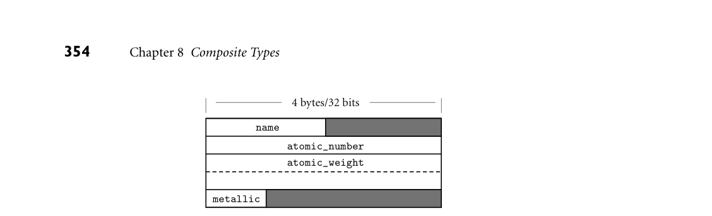
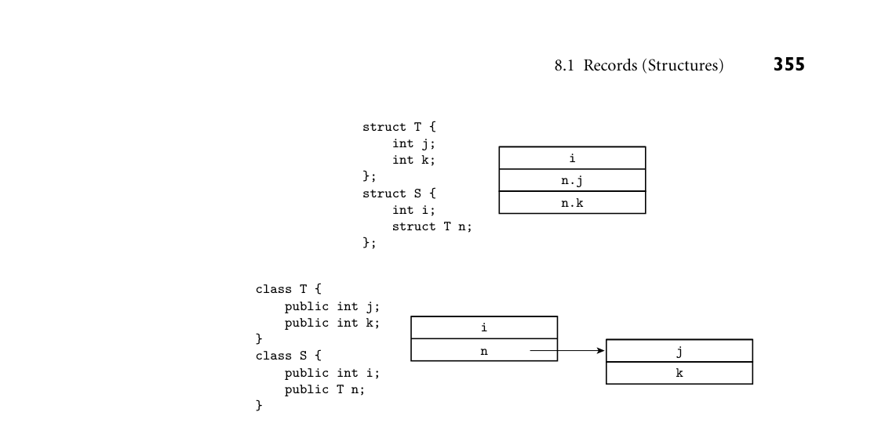
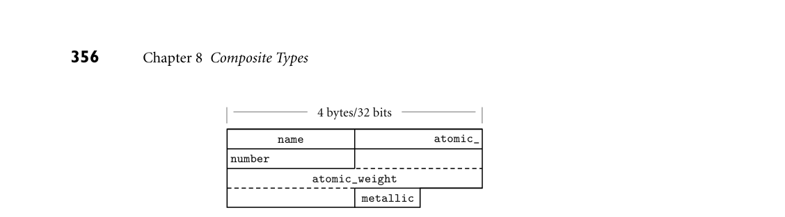
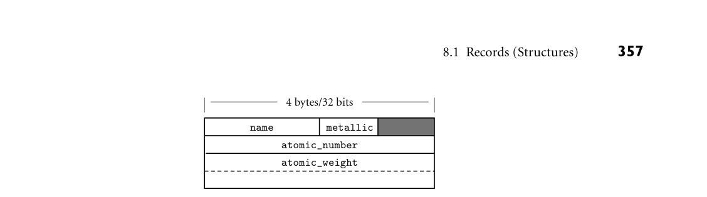

# 8.1 Records (Structures)

8 Composite Types

Chapter 7 introduced the notion of types as a way to organize the many values and objects manipulated by computer programs. It also introduced ter- minology for both built-in and composite types. As we noted in Section 7.1.4, composite types are formed by joining together one or more simpler types using a type constructor. From a denotational perspective, the constructors can be mod- eled as operations on sets, with each set representing one of the simpler types. In the current chapter we will survey the most important type constructors: records, arrays, strings, sets, pointers, lists, and files. In the section on records we will also consider both variants (unions) and tuples. In the section on point- ers, we will take a more detailed look at the value and reference models of vari- ables introduced in Section 6.1.2, and the heap management issues introduced in Section 3.2. The section on files (mostly on the companion site) will include a discussion of input and output mechanisms. 8.1 Records (Structures)

Record types allow related data of heterogeneous types to be stored and manipu- lated together. Originally introduced by Cobol, records also appeared in Algol 68, which called them structures, and introduced the keyword struct. Many mod- ern languages, including C and its descendants, employ the Algol terminology. Fortran 90 simply calls its records “types”: they are the only form of programmer- defined type other than arrays, which have their own special syntax. Structures in C++ are defined as a special form of class (one in which members are globally visible by default). Java has no distinguished notion of struct; its program- mers use classes in all cases. C# and Swift use a reference model for variables of class types, and a value model for variables of struct types. In these languages, structs do not support inheritance. For the sake of simplicity, we will use the term “record” in most of our discussion to refer to the relevant construct in all these languages.

8.1.1 Syntax and Operations

In C, a simple record might be defined as follows: EXAMPLE 8.1

A C struct struct element { char name[2]; int atomic_number; double atomic_weight; _Bool metallic; }; ■

Each of the record components is known as a field. To refer to a given field of a record, most languages use “dot” notation: EXAMPLE 8.2

Accessing record fields element copper; const double AN = 6.022e23; /* Avogadro's number */ ... copper.name[0] = 'C'; copper.name[1] = 'u'; double atoms = mass / copper.atomic_weight * AN;

In Fortran 90 one would say copper%name and copper%atomic_weight. Cobol reverses the order of the field and record names: name of copper and atomic_ weight of copper. In Common Lisp, one would say (element-name copper) and (element-atomic_weight copper). ■ Most languages allow record definitions to be nested. Again in C: EXAMPLE 8.3

Nested records struct ore { char name[30]; struct { char name[2]; int atomic_number; double atomic_weight; _Bool metallic; } element_yielded; };

Alternatively, one could say

struct ore { char name[30]; struct element element_yielded; };

In Fortran 90 and Common Lisp, only the second alternative is permitted: record fields can have record types, but the declarations cannot be lexically nested. Naming for nested records is straightforward: malachite.element_

yielded.atomic_number in C; atomic_number of element_yielded of mal- achite in Cobol; (element-atomic_number (ore-element_yielded mala- chite)) in Common Lisp. ■ As noted in Example 7.17, ML and its relatives differ from most languages in EXAMPLE 8.4

OCaml records and tuples specifying that the order of record fields is insignificant. The OCaml record value {name = "Cu"; atomic_number = 29; atomic_weight = 63.546; metallic = true} is the same as the value {atomic_number = 29; name = "Cu"; atomic_ weight = 63.546; metallic = true}—they will test true for equality. OCaml’s tuples, which we mentioned briefly in Section 7.2.4, and will visit again in Section 11.4.3, resemble records whose fields are ordered, but unnamed. In SML, the other leading ML dialect, the resemblance is actually equivalence: tuples are defined as syntactic sugar for records whose field names are small inte- gers. The values ("Cu", 29), {1 = "Cu", 2 = 29}, and {2 = 29, 1 = "Cu"} will all test true for equality in SML. ■

8.1.2 Memory Layout and Its Impact

The fields of a record are usually stored in adjacent locations in memory. In its symbol table, the compiler keeps track of the offset of each field within each record type. When it needs to access a field, the compiler will often generate a load or store instruction with displacement addressing. For a local object, the base register is typically the frame pointer; the displacement is then the sum of the record’s offset from the register and the field’s offset within the record. A likely layout for our element type on a 32-bit machine appears in Figure 8.1. EXAMPLE 8.5

Memory layout for a record type Because the name field is only two characters long, it occupies two bytes in mem- ory. Since atomic_number is an integer, and must (on most machines) be word- aligned, there is a two-byte “hole” between the end of name and the beginning of atomic_number. Similarly, since Boolean variables (in most language imple- mentations) occupy a single byte, there are three bytes of empty space between the end of the metallic field and the next aligned location. In an array of elements, most compilers would devote 20 bytes to every member of the array. ■

DESIGN & IMPLEMENTATION

8.1 Struct tags and typedef in C and C++ One of the peculiarities of the C type system is that struct tags are not exactly type names. In Example 8.1, the name of the type is the two-word phrase struct element. We used this name to declare the element_yielded field of the second struct in Example 8.3. To obtain a one-word name, one can say typedef struct element element_t, or even typedef struct element element: struct tags and typedef names have separate name spaces, so the same name can be used in each. C++ eliminates this idiosyncrasy by allowing the struct tag to be used as a type name without the struct prefix; in effect, it performs the typedef implicitly.

*Figure 8.1 Likely layout in memory for objects of type element on a 32-bit machine. Align- ment restrictions lead to the shaded “holes.”*

In a language with a value model of variables, nested records are naturally embedded in the parent record, where they function as large fields with word or double-word alignment. In a language with a reference model of variables, fields of record type are typically references to data in another location. The difference is a matter not only of memory layout, but also of semantics. We can see the difference in Figure 8.2. In C, with a value model of variables, data is laid out as EXAMPLE 8.6

Nested records as values shown at the top of the figure. In the following code, using the declarations at the top of the figure, the assignment of s1 into s2 copies the embedded T:

struct S s1; struct S s2; s1.n.j = 0; s2 = s1; s2.n.j = 7; printf("%d\n", s1.n.j); /* prints 0 */ ■

In Java, by contrast, with a reference model of variables, data is laid out as EXAMPLE 8.7

Nested records as references shown at the bottom of the figure. In the following code, using the declarations at the bottom of the figure, assignment of s1 into s2 copies only the reference, so s2.n.j is an alias for s1.n.j:

S s1 = new S(); s1.n = new T(); // fields initialized to 0 S s2 = s1; s2.n.j = 7; System.out.println(s1.n.j); // prints 7 ■

A few languages and implementations allow the programmer to specify that a EXAMPLE 8.8

Layout of packed types record type (or an array, set, or file type) should be packed. In Ada, one uses a pragma:

type element = record ... end; pragma Pack(element);

*Figure 8.2 Layout of memory for a nested struct (class) in C (top) and Java (bottom). This layout reflects the fact that n is an embedded value in C, but a reference in Java. We have assumed here that integers and pointers have equal size.*

When compiling with gcc, one uses an attribute:

struct __attribute__ ((__packed__)) element { ... }

The Ada syntax is built into the language; the gcc syntax is a GNU extension. In either case, the directive asks the compiler to optimize for space instead of speed. Typically, a compiler will implement a packed record without holes, by simply “pushing the fields together.” To access a nonaligned field, however, it will have to issue a multi-instruction sequence that retrieves the pieces of the field from memory and then reassembles them in a register. A likely packed layout for our element type (again for a 32-bit machine) appears in Figure 8.3. It is 15 bytes in length. An array of packed element records would probably devote 16 bytes to each member of the array; that is, it would align each element. A packed array of packed records might devote only 15 bytes to each; only every fourth element would be aligned. ■ Most languages allow a value to be assigned to an entire record in a single EXAMPLE 8.9

Assignment and comparison of records operation:

my_element := copper;

Ada also allows records to be compared for equality (if my_element = copper then ...). Many other languages (including C and its successors) support as- signment but not equality testing, though C++ allows the programmer to define the latter for individual record types. ■

*Figure 8.3 Likely memory layout for packed element records. The atomic_number and atomic_weight fields are nonaligned, and can only be read or written (on most machines) via multi-instruction sequences.*

For small records, both copies and comparisons can be performed in-line on a field-by-field basis. For longer records, we can save significantly on code space by deferring to a library routine. A block_copy routine can take source address, destination address, and length as arguments, but the analogous block_compare routine would fail on records with different (garbage) data in the holes. One solution is to arrange for all holes to contain some predictable value (e.g., zero), but this requires code at every elaboration point. Another is to have the compiler generate a customized field-by-field comparison routine for every record type. Different routines would be called to compare records of different types. In addition to complicating comparisons, holes in records waste space. Pack- EXAMPLE 8.10

Minimizing holes by sorting fields ing eliminates holes, but at potentially heavy cost in access time. A compromise, adopted by some compilers, is to sort a record’s fields according to the size of their alignment constraints. All byte-aligned fields might come first, followed by any half-word aligned fields, word-aligned fields, and (if the hardware requires) double-word-aligned fields. For our element type, the resulting rearrangement is shown in Figure 8.4. ■ In most cases, reordering of fields is purely an implementation issue: the pro- grammer need not be aware of it, so long as all instances of a record type are reordered in the same way. The exception occurs in systems programs, which sometimes “look inside” the implementation of a data type with the expectation that it will be mapped to memory in a particular way. A kernel programmer, for example, may count on a particular layout strategy in order to define a record

DESIGN & IMPLEMENTATION

8.2 The order of record fields Issues of record field order are intimately tied to implementation tradeoffs: Holes in records waste space, but alignment makes for faster access. If holes contain garbage we can’t compare records by looping over words or bytes, but zeroing out the holes would incur costs in time and code space. Predictable layout is important for mirroring hardware structures in “systems” languages, but reorganization may be advantageous in large records if we can group fre- quently accessed fields together, so they lie in the same cache line.

*Figure 8.4 Rearranging record fields to minimize holes. By sorting fields according to the size of their alignment constraint, a compiler can minimize the space devoted to holes, while keeping the fields aligned.*

that mimics the organization of memory-mapped control registers for a partic- ular Ethernet device. C and C++, which are designed in large part for systems programs, guarantee that the fields of a struct will be allocated in the order declared. The first field is guaranteed to have the coarsest alignment required by the hardware for any type (generally a four- or eight-byte boundary). Sub- sequent fields have the natural alignment for their type. Fortran 90 allows the programmer to specify that fields must not be reordered; in the absence of such a specification the compiler can choose its own order. To accommodate systems programs, Ada, C, and C++ all allow the programmer to specify exactly how many bits to devote to each field of a record. Where a “packed” directive is es- sentially a nonbinding indication of the programmer’s priorities, bit lengths on field declarations are a binding specification of assembly-level layout.

8.1.3 Variant Records (Unions)

Programming languages of the 1960s and 1970s were designed in an era of se- vere memory constraints. Many allowed the programmer to specify that certain variables (presumably ones that would never be used at the same time) should be allocated “on top of” one another, sharing the same bytes in memory. C’s syntax, EXAMPLE 8.11

A union in C heavily influenced by Algol 68, looks very much like a struct:

union { int i; double d; _Bool b; };

The overall size of this union would be that of its largest member (presumably d). Exactly which bytes of d would be overlapped by i and b is implementation de- pendent, and presumably influenced by the relative sizes of types, their alignment constraints, and the endian-ness of the hardware. ■ In practice, unions have been used for two main purposes. The first arises in systems programs, where unions allow the same set of bytes to be interpreted in

different ways at different times. The canonical example occurs in memory man- agement, where storage may sometimes be treated as unallocated space (perhaps in need of “zeroing out”), sometimes as bookkeeping information (length and header fields to keep track of free and allocated blocks), and sometimes as user- allocated data of arbitrary type. While nonconverting type casts (Section 7.2.1) can be used to implement heap management routines, unions are a better indi- cation of the programmer’s intent: the bits are not being reinterpreted, they are being used for independent purposes.1 The second, historical purpose for unions was to represent alternative sets of fields within a record. A record representing an employee, for example, might EXAMPLE 8.12

Motivation for variant records have several common fields (name, address, phone, department, ID number) and various other fields depending on whether the person in question works on a salaried, hourly, or consulting basis. Traditional C unions were awkward when used for this purpose. A much cleaner syntax appeared in the variant records of Pascal and its successors, which allow the programmer to specify that certain fields within a record should overlap in memory. Similar functionality was added to C11 and C++11 in the form of anonymous unions. ■

IN MORE DEPTH

We discuss unions and variant records in more detail on the companion site. Topics we consider include syntax, safety, and memory layout issues. Safety is a particular concern: where nonconverting type casts allow a programmer to cir- cumvent the language’s type system explicitly, a naive realization of unions makes it easy to do so by accident. Ada imposes limits on the use of unions and variant records that allow the compiler to verify, statically, that all programs are type-safe. We also note that inheritance in object-oriented languages provides an attractive alternative to type-safe variant records in most cases. This observation largely accounts for the omission of unions and variant records from most more recent languages.

3CHECK YOUR UNDERSTANDING 1. What are struct tags in C? How are they related to type names? How did they change in C++?

2. How do the records of ML differ from those of most other languages? 3. Discuss the significance of “holes” in records. Why do they arise? What prob- lems do they cause?

1 By contrast, the other example mentioned under Nonconverting Type Casts in Section 7.2.1— examination of the internal structure of a floating-point number—does indeed reinterpret bits. Unions can also be used in this case (Exercise C 8.24), but here a nonconverting cast is a better indication of intent.

