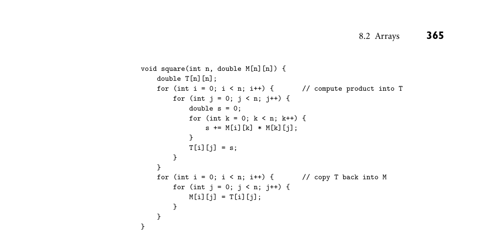
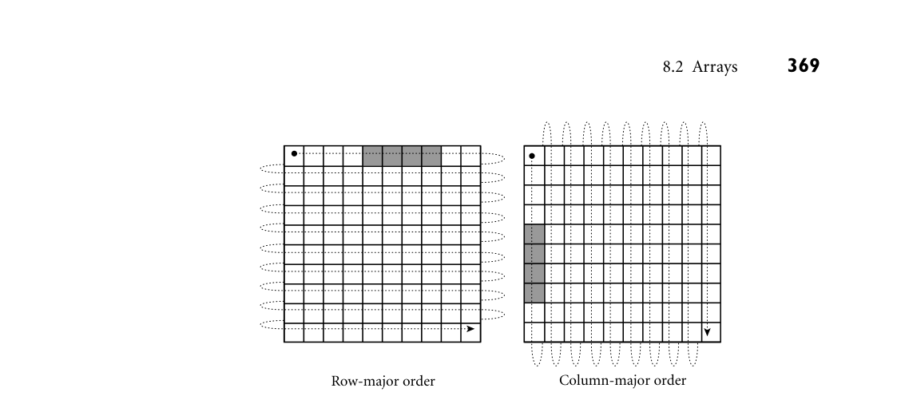
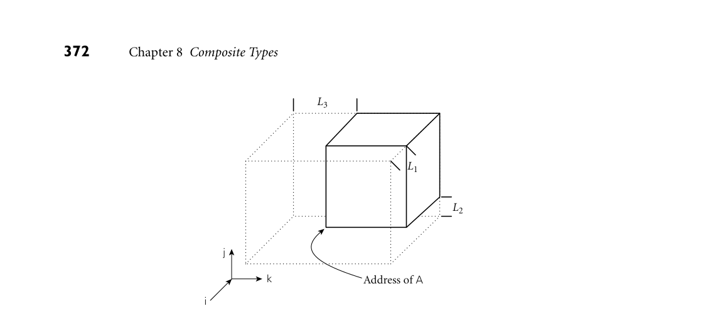

# 8.2 Arrays

8.2 Arrays 359

4. Why is it easier to implement assignment than comparison for records?

5. What is packing? What are its advantages and disadvantages? 6. Why might a compiler reorder the fields of a record? What problems might this cause? 7. Briefly describe two purposes for unions/variant records.

8.2 Arrays

Arrays are the most common and important composite data types. They have been a fundamental part of almost every high-level language, beginning with For- tran I. Unlike records, which group related fields of disparate types, arrays are usually homogeneous. Semantically, they can be thought of as a mapping from an index type to a component or element type. Some languages (e.g., Fortran) re- quire that the index type be integer; many languages allow it to be any discrete type. Some languages (e.g., Fortran 77) require that the element type of an array be scalar. Most (including Fortran 90) allow any element type. Some languages (notably scripting languages, but also some newer imperative languages, including Go and Swift) allow nondiscrete index types. The resulting associative arrays must generally be implemented with hash tables or search trees; we consider them in Section 14.4.3. Associative arrays also resemble the dictio- nary or map types supported by the standard libraries of many object-oriented languages. In C++, operator overloading allows these types to use conventional array-like syntax. For the purposes of this chapter, we will assume that array indices are discrete. This admits a (much more efficient) contiguous allocation scheme, to be described in Section 8.2.3. We will also assume that arrays are dense—that a large fraction of their elements are not equal to zero or some other default value. The alternative—sparse arrays—arises in many important scien- tific problems. For these, libraries (or, in rare cases, the language itself) may support an alternative implementation that explicitly enumerates only the non- default values.

8.2.1 Syntax and Operations

Most languages refer to an element of an array by appending a subscript—usually delimited by square brackets—to the name of the array: A[3]. A few languages— notably Fortran and Ada—use parentheses instead: A(3). In some languages one declares an array by appending subscript notation to EXAMPLE 8.13

Array declarations the syntax that would be used to declare a scalar. In C:

char upper[26];

360 Chapter 8 Composite Types

In Fortran:

character, dimension (1:26) :: upper character (26) upper ! shorthand notation

In C, the lower bound of an index range is always zero: the indices of an n-element array are 0 . . .n−1. In Fortran, the lower bound of the index range is one by default. Fortran 90 allows a different lower bound to be specified if desired, using the notation shown in the first of the two declarations above. Many Algol descendants use an array constructor instead. In Ada, for exam- ple, one might say

upper : array (character range 'a'..'z') of character; ■

Most languages make it easy to declare multidimensional arrays: EXAMPLE 8.14

Multidimensional arrays mat : array (1..10, 1..10) of long_float; -- Ada

real, dimension (10,10) :: mat ! Fortran

In some languages, one can also declare a multidimensional array by using the array constructor more than once in the same declaration. In Modula-3, for example,

VAR mat : ARRAY [1..10], [1..10] OF REAL;

is syntactic sugar for

VAR mat : ARRAY [1..10] OF ARRAY [1..10] OF REAL;

and mat[3, 4] is syntactic sugar for mat[3][4]. ■ In Ada, by contrast, EXAMPLE 8.15

Multidimensional vs built-up arrays mat1 : array (1..10, 1..10) of long_float;

is not the same as

type vector is array (integer range <>) of long_float; type matrix is array (integer range <>) of vector (1..10); mat2 : matrix (1..10);

Variable mat1 is a two-dimensional array; mat2 is an array of one-dimensional arrays. With the former declaration, we can access individual real numbers as mat1(3, 4); with the latter we must say mat2(3)(4). The two-dimensional array is arguably more elegant, but the array of arrays supports additional op- erations: it allows us to name the rows of mat2 individually (mat2(3) is a 10- element, single-dimensional array), and it allows us to take slices, as discussed

8.2 Arrays 361

below (mat2(3)(2..6) is a five-element array of real numbers; mat2(3..7) is a five-element array of ten-element arrays). ■ In C, one must also declare an array of arrays, and use two-subscript notation, EXAMPLE 8.16

Arrays of arrays in C but C’s integration of pointers and arrays (to be discussed in Section 8.5.1) means that slices are not supported:

double mat[10][10];

Given this definition, mat[3][4] denotes an individual element of the array, but mat[3] denotes a reference, either to the third row of the array or to the first element of that row, depending on context. ■

DESIGN & IMPLEMENTATION

8.3 Is [ ] an operator? Associative arrays in C++ are typically defined by overloading operator[ ]. C#, like C++, provides extensive facilities for operator overloading, but it does not use these facilities to support associative arrays. Instead, the language pro- vides a special indexer mechanism, with its own unique syntax:

class directory { Hashtable table; // from standard library ... public directory() { // constructor table = new Hashtable(); } ... public string this[string name] { // indexer method get { return (string) table[name]; } set { table[name] = value; // value is implicitly } } } // a parameter of set ... directory d = new directory(); ... d["Jane Doe"] = "234-5678"; Console.WriteLine(d["Jane Doe"]);

Why the difference? In C++, operator[] can return a reference (an explicit l-value), which can be used on either side of an assignment (further informa- tion can be found under “References in C++” in Section 9.3.1). C# has no comparable l-value mechanism, so it needs separate methods to get and set the value of d["Jane Doe"].

*Figure 8.5 Array slices (sections) in Fortran 90. Much like the values in the header of an enumeration-controlled loop (Section 6.5.1), a : b : c in a subscript indicates positions a, a + c, a + 2c, . . . through b. If a or b is omitted, the corresponding bound of the array is assumed. If c is omitted, 1 is assumed. It is even possible to use negative values of c in order to select positions in reverse order. The slashes in the second subscript of the lower right example delimit an explicit list of positions.*

Slices and Array Operations

A slice or section is a rectangular portion of an array. Fortran 90 provides ex- EXAMPLE 8.17

Array slice operations tensive facilities for slicing, as do Go and many scripting languages. Figure 8.5 illustrates some of the possibilities in Fortran 90, using the declaration of mat from Example 8.14. Ada provides more limited support: a slice is simply a con- tiguous range of elements in a one-dimensional array. As we saw in Example 8.15, the elements can themselves be arrays, but there is no way to extract a slice along both dimensions as a single operation. ■ In most languages, the only operations permitted on an array are selection of an element (which can then be used for whatever operations are valid on its type), and assignment. A few languages (e.g., Ada and Fortran 90) allow arrays to be compared for equality. Ada allows one-dimensional arrays whose elements are discrete to be compared for lexicographic ordering: A < B if the first element of A that is not equal to the corresponding element of B is less than that correspond- ing element. Ada also allows the built-in logical operators (or, and, xor) to be applied to Boolean arrays. Fortran 90 has a very rich set of array operations: built-in operations that take entire arrays as arguments. Because Fortran uses structural type equivalence, the

8.2 Arrays 363

operands of an array operator need only have the same element type and shape. In particular, slices of the same shape can be intermixed in array operations, even if the arrays from which they were sliced have very different shapes. Any of the built-in arithmetic operators will take arrays as operands; the result is an array, of the same shape as the operands, whose elements are the result of applying the operator to corresponding elements. As a simple example, A + B is an array each of whose elements is the sum of the corresponding elements of A and B. Fortran 90 also provides a huge collection of intrinsic, or built-in functions. More than 60 of these (including logic and bit manipulation, trigonometry, logs and exponents, type conversion, and string manipulation) are defined on scalars, but will also perform their operation element-wise if passed arrays as arguments. The function tan(A), for example, returns an array consisting of the tangents of the elements of A. Many additional intrinsic functions are defined solely on arrays. These include searching and summarization, transposition, and reshaping and subscript permutation. Fortran 90 draws significant inspiration from APL, an array manipulation lan- guage developed by Iverson and others in the early to mid-1960s.2 APL was de- signed primarily as a terse mathematical notation for array manipulations. It employs an enormous character set that made it difficult to use with traditional keyboards and textual displays. Its variables are all arrays, and many of the spe- cial characters denote array operations. APL implementations are designed for interpreted, interactive use. They are best suited to “quick and dirty” solution of mathematical problems. The combination of very powerful operators with very terse notation makes APL programs notoriously difficult to read and understand. J, a successor to APL, uses a conventional character set.

8.2.2 Dimensions, Bounds, and Allocation

In all of the examples in the previous subsection, the shape of the array (including bounds) was specified in the declaration. For such static shape arrays, storage can be managed in the usual way: static allocation for arrays whose lifetime is the entire program; stack allocation for arrays whose lifetime is an invocation of a subroutine; heap allocation for dynamically allocated arrays with more general lifetime. Storage management is more complex for arrays whose shape is not known until elaboration time, or whose shape may change during execution. For these the compiler must arrange not only to allocate space, but also to make shape information available at run time (without such information, indexing would not be possible). Some dynamically typed languages allow run-time binding of

2 Kenneth Iverson (1920–2004), a Canadian mathematician, joined the faculty at Harvard Uni- versity in 1954, where he conceived APL as a notation for describing mathematical algorithms. He moved to IBM in 1960, where he helped develop the notation into a practical programming language. He was named an IBM Fellow in 1970, and received the ACM Turing Award in 1979.

364 Chapter 8 Composite Types

both the number and bounds of dimensions. Compiled languages may allow the bounds to be dynamic, but typically require the number of dimensions to be static. A local array whose shape is known at elaboration time may still be allocated in the stack. An array whose size may change during execution must generally be allocated in the heap. In the first subsection below we consider the descriptors, or dope vectors,3 used to hold shape information at run time. We then consider stack- and heap-based allocation, respectively, for dynamic shape arrays.

Dope Vectors

During compilation, the symbol table maintains dimension and bounds infor- mation for every array in the program. For every record, it maintains the offset of every field. When the number and bounds of array dimensions are statically known, the compiler can look them up in the symbol table in order to compute the address of elements of the array. When these values are not statically known, the compiler must generate code to look them up in a dope vector at run time. In the general case a dope vector must specify the lower bound of each dimen- sion and the size of each dimension other than the last (which is always the size of the element type, and will thus be statically known). If the language implemen- tation performs dynamic semantic checks for out-of-bounds subscripts in array references, then the dope vector may contain upper bounds as well. Given lower bounds and sizes, the upper bound information is redundant, but including it avoids the need to recompute repeatedly at run time. The contents of the dope vector are initialized at elaboration time, or when- ever the number or bounds of dimensions change. In a language like Fortran 90, whose notion of shape includes dimension sizes but not lower bounds, an assign- ment statement may need to copy not only the data of an array, but dope vector contents as well. In a language that provides both a value model of variables and arrays of dy- namic shape, we must consider the possibility that a record will contain a field whose size is not statically known. In this case the compiler may use dope vectors not only for dynamic shape arrays, but also for dynamic shape records. The dope vector for a record typically indicates the offset of each field from the beginning of the record.

Stack Allocation

Subroutine parameters and local variables provide the simplest examples of dy- namic shape arrays. Early versions of Pascal required the shape of all arrays to be specified statically. Standard Pascal allowed dynamic arrays as subroutine param- eters, with shape fixed at subroutine call time. Such parameters are sometimes

3 The name “dope vector” presumably derives from the notion of “having the dope on (some- thing),” a colloquial expression that originated in horse racing: advance knowledge that a horse has been drugged (“doped”) is of significant, if unethical, use in placing bets.

*Figure 8.6 A dynamic local array in C. Function square multiplies a matrix by itself and replaces the original with the product. To do so it needs a scratch array of the same shape as the parameter. Note that the declarations of M and T both rely on parameter n.*

known as conformant arrays. Among other things, they facilitate the construc- tion of linear algebra libraries, whose routines must typically work on arrays of arbitrary size. To implement such an array, the compiler arranges for the caller to pass both the data of the array and an appropriate dope vector. If the array is of dynamic shape in the caller’s context, the dope vector may already be available. If the array is of static shape in the caller’s context, an appropriate dope vector will need to be created prior to the call. Ada and C (though not C++) support dynamic shape for both parameters and local variables. Among other things, local arrays can be declared to match the EXAMPLE 8.18

Local arrays of dynamic shape in C shape of conformant array parameters, facilitating the implementation of algo- rithms that require temporary space for calculations. Figure 8.6 contains a simple example in C. Function square accepts an array parameter M of dynamic shape and allocates a local variable T of the same dynamic shape. ■ In many languages, including Ada and C, the shape of a local array becomes EXAMPLE 8.19

Stack allocation of elaborated arrays fixed at elaboration time. For such arrays it is still possible to place the space for the array in the stack frame of its subroutine, but an extra level of indirection is required (see Figure 8.7). In order to ensure that every local object can be found using a known offset from the frame pointer, we divide the stack frame into a fixed-size part and a variable-size part. An object whose size is statically known goes in the fixed-size part. An object whose size is not known until elaboration time goes in the variable-size part, and a pointer to it, together with a dope vec- tor, goes in the fixed-size part. If the elaboration of the array is buried in a nested block, the compiler delays allocating space (i.e., changing the stack pointer) until the block is entered. It still allocates space for the pointer and the dope vector

*Figure 8.7 Elaboration-time allocation of arrays. Here M is a square two-dimensional array whose bounds are determined by a parameter passed to foo at run time. The compiler arranges for a pointer to M and a dope vector to reside at static offsets from the frame pointer. M cannot be placed among the other local variables because it would prevent those higher in the frame from having static offsets. Additional variable-size arrays or records are easily accommodated.*

among the local variables when the subroutine itself is entered. Records of dy- namic shape are handled in a similar way. ■ Fortran 90 allows specification of the bounds of an array to be delayed until EXAMPLE 8.20

Elaborated arrays in Fortran 90 after elaboration, but it does not allow those bounds to change once they have been defined:

real, dimension (:,:), allocatable :: mat ! mat is two-dimensional, but with unspecified bounds ... allocate (mat (a:b, 0:m-1)) ! first dimension has bounds a..b; second has bounds 0..m-1 ... deallocate (mat) ! implementation is now free to reclaim mat's space

Execution of an allocate statement can be treated like the elaboration of a dy- namic shape array in a nested block. Execution of a deallocate statement can

8.2 Arrays 367

be treated like the end of the nested block (restoring the previous stack pointer) if there are no other arrays beyond the specified one in the stack. Alternatively, dynamic shape arrays can be allocated in the heap, as described in the following subsection. ■

Heap Allocation

Arrays that can change shape at arbitrary times are sometimes said to be fully dynamic. Because changes in size do not in general occur in FIFO order, stack allocation will not suffice; fully dynamic arrays must be allocated in the heap. Several languages, including all the major scripting languages, allow strings— arrays of characters—to change size after elaboration time. Java and C# provide EXAMPLE 8.21

Dynamic strings in Java and C# a similar capability (with a similar implementation), but describe the semantics differently: string variables in these languages are references to immutable string objects:

String s = "short"; // This is Java; use lower-case 'string' in C# ... s = s + " but sweet"; // + is the concatenation operator

Here the declaration String s introduces a string variable, which we initialize with a reference to the constant string "short". In the subsequent assignment, + creates a new string containing the concatenation of the old s and the constant " but sweet"; s is then set to refer to this new string, rather than the old. Note that arrays of characters are not the same as strings in Java and C#: the length of an array is fixed at elaboration time, and its elements can be modified in place. ■ Dynamically resizable arrays (other than strings) appear in APL, Common Lisp, and the various scripting languages. They are also supported by the vector, Vector, and ArrayList classes of the C++, Java, and C# libraries, respectively. In contrast to the allocate-able arrays of Fortran 90, these arrays can change their shape—in particular, can grow—while retaining their current content. In many cases, increasing the size will require that the run-time system allocate a larger block, copy any data that are to be retained from the old block to the new, and then deallocate the old. If the number of dimensions of a fully dynamic array is statically known, the dope vector can be kept, together with a pointer to the data, in the stack frame of the subroutine in which the array was declared. If the number of dimensions can change, the dope vector must generally be placed at the beginning of the heap block instead. In the absence of garbage collection, the compiler must arrange to reclaim the space occupied by fully dynamic arrays when control returns from the subrou- tine in which they were declared. Space for stack-allocated arrays is of course reclaimed automatically by popping the stack.

368 Chapter 8 Composite Types

8.2.3 Memory Layout

Arrays in most language implementations are stored in contiguous locations in memory. In a one-dimensional array, the second element of the array is stored immediately after the first; the third is stored immediately after the second, and so forth. For arrays of records, alignment constraints may result in small holes between consecutive elements. For multidimensional arrays, it still makes sense to put the first element of the array in the array’s first memory location. But which element comes next? There are two reasonable answers, called row-major and column-major order. In EXAMPLE 8.22

Row-major vs column-major array layout row-major order, consecutive locations in memory hold elements that differ by one in the final subscript (except at the ends of rows). A[2, 4], for example, is followed by A[2, 5]. In column-major order, consecutive locations hold el- ements that differ by one in the initial subscript: A[2, 4] is followed by A[3, 4]. These options are illustrated for two-dimensional arrays in Figure 8.8. The layouts for three or more dimensions are analogous. Fortran uses column-major order; most other languages use row-major order. (Correspondence with Fran Allen4 suggests that column-major order was originally adopted in order to ac- commodate idiosyncrasies of the console debugger and instruction set of the IBM model 704 computer, on which the language was first implemented.) The advan- tage of row-major order is that it makes it easy to define a multidimensional array as an array of subarrays, as described in Section 8.2.1. With column-major order, the elements of the subarray would not be contiguous in memory. ■ The difference between row- and column-major layout can be important for programs that use nested loops to access all the elements of a large, multidi- mensional array. On modern machines the speed of such loops is often limited by memory system performance, which depends heavily on the effectiveness of caching (Section C 5.1). Figure 8.8 shows the orientation of cache lines for row- EXAMPLE 8.23

Array layout and cache performance and column-major layout of arrays. When code traversesa small array, all or most of its elements are likely to remain in the cache through the end of the nested loops, and the orientation of cache lines will not matter. For a large array, how- ever, lines that are accessed early in the traversal are likely to be evicted to make room for lines accessed later in the traversal. If array elements are accessed in order of consecutive addresses, then each miss will bring into the cache not only the desired element, but the next several elements as well. If elements are accessed across cache lines instead (i.e., along the rows of a Fortran array, or the columns of an array in most other languages), then there is a good chance that almost every

4 Fran Allen (1932–) joined IBM’s T. J. Watson Research Center in 1957, and stayed for her entire professional career. Her seminal paper, Program Optimization [All69] helped launch the field of code improvement. Her PTRAN (Parallel TRANslation) group, founded in the early 1980s, developed much of the theory of automatic parallelization. In 1989 Dr. Allen became the first woman to be named an IBM Fellow. In 2006 she became the first to receive the ACM Turing Award.

*Figure 8.8 Row- and column-major memory layout for two-dimensional arrays. In row-major order, the elements of a row are contiguous in memory; in column-major order, the elements of a column are contiguous. The second cache line of each array is shaded, on the assumption that each element is an eight-byte floating-point number, that cache lines are 32 bytes long (a common size), and that the array begins at a cache line boundary. If the array is indexed from A[0,0] to A[9,9], then in the row-major case elements A[0,4] through A[0,7] share a cache line; in the column-major case elements A[4,0] through A[7,0] share a cache line.*

access will result in a cache miss, dramatically reducing the performance of the code. In C, one should write

for (i = 0; i < N; i++) { /* rows */ for (j = 0; j < N; j++) { /* columns */ ... A[i][j] ... } }

In Fortran:

do j = 1, N ! columns do i = 1, N ! rows ... A(i, j) ... end do end do ■

Row-Pointer Layout

Some languages employ an alternative to contiguous allocation for some arrays. Rather than require the rows of an array to be adjacent, they allow them to lie anywhere in memory, and create an auxiliary array of pointers to the rows. If the array has more than two dimensions, it may be allocated as an array of pointers to arrays of pointers to .... This row-pointer memory layout requires more space

370 Chapter 8 Composite Types

in most cases, but has three potential advantages. The first is of historical interest only: on machines designed before about 1980, row-pointer layout sometimes led to faster code (see the discussion of address calculations below). Second, row- pointer layout allows the rows to have different lengths, without devoting space to holes at the ends of the rows. This representation is sometimes called a ragged array. The lack of holes may sometimes offset the increased space for pointers. Third, row-pointer layout allows a program to construct an array from preexisting rows (possibly scattered throughout memory) without copying. C, C++, and C# provide both contiguous and row-pointer organizations for multidimensional arrays. Technically speaking, the contiguous layout is a true multidimensional array, while the row-pointer layout is an array of pointers to arrays. Java uses the row-pointer layout for all arrays. By far the most common use of the row-pointer layout in C is to represent EXAMPLE 8.24

Contiguous vs row-pointer array layout arrays of strings. A typical example appears in Figure 8.9. In this example (repre- senting the days of the week), the row-pointer memory layout consumes 57 bytes for the characters themselves (including a NUL byte at the end of each string), plus 28 bytes for pointers (assuming a 32-bit architecture), for a total of 85 bytes. The contiguous layout alternative devotes 10 bytes to each day (room enough for Wednesday and its NUL byte), for a total of 70 bytes. The additional space required for the row-pointer organization comes to 21 percent. In some cases, row point- ers may actually save space. A Java compiler written in C, for example, would probably use row pointers to store the character-string representations of the 51 Java keywords and word-like literals. This data structure would use 55 × 4 = 220 bytes for the pointers (on a 32-bit machine), plus 366 bytes for the keywords, for a total of 586 bytes. Since the longest keyword (synchronized) requires 13 bytes (including space for the terminating NUL), a contiguous two-dimensional array would consume 55 × 13 = 715 bytes (716 when aligned). In this case, row pointers save a little over 18%. ■

DESIGN & IMPLEMENTATION

8.4 Array layout The layout of arrays in memory, like the ordering of record fields, is intimately tied to tradeoffs in design and implementation. While column-major layout appears to offer no advantages on modern machines, its continued use in For- tran means that programmers must be aware of the underlying implementa- tion in order to achieve good locality in nested loops. Row-pointer layout, likewise, has no performance advantage on modern machines (and a likely performance penalty, at least for numeric code), but it is a more natural fit for the “reference to object” data organization of languages like Java. Its impacts on space consumption and locality may be positive or negative, depending on the details of individual applications.

*Figure 8.9 Contiguous array allocation vs row pointers in C. The declaration on the left is a true two-dimensional array. The slashed boxes are NUL bytes; the shaded areas are holes. The declaration on the right is a ragged array of pointers to arrays of characters. The arrays of characters may be located anywhere in memory—next to each other or separated, and in any order. In both cases, we have omitted bounds in the declaration that can be deduced from the size of the initializer (aggregate). Both data structures permit individual characters to be accessed using double subscripts, but the memory layout (and corresponding address arithmetic) is quite different.*

Address Calculations

For the usual contiguous layout of arrays, calculating the address of a particular element is somewhat complicated, but straightforward. Suppose a compiler is EXAMPLE 8.25

Indexing a contiguous array given the following declaration for a three-dimensional array:

A : array [L1 . . U1] of array [L2 . .U2] of array [L3 . . U3] of elem type;

Let us define constants for the sizes of the three dimensions:

S3 = size of elem type

S2 = (U3 −L3 + 1) × S3 S1 = (U2 −L2 + 1) × S2

Here the size of a row (S2) is the size of an individual element (S3) times the number of elements in a row (assuming row-major layout). The size of a plane (S1) is the size of a row (S2) times the number of rows in a plane. The address of A[i, j, k] is then

*Figure 8.10 Virtual location of an array with nonzero lower bounds. By computing the constant portions of an array index at compile time, we effectively index into an array whose starting address is offset in memory, but whose lower bounds are all zero.*

address of A

+ (i −L1) × S1

+ (j −L2) × S2

+ (k −L3) × S3

As written, this computation involves three multiplications and six additions/sub- tractions. We could compute the entire expression at run time, but in most cases a little rearrangement reveals that much of the computation can be performed at compile time. In particular, if the bounds of the array are known at compile time, then S1, S2, and S3 are compile-time constants, and the subtractions of lower bounds can be distributed out of the parentheses:

(i × S1) + (j × S2) + (k × S3) + address of A

−[(L1 × S1) + (L2 × S2) + (L3 × S3)]

The bracketed expression in this formula is a compile-time constant (assuming the bounds of A are statically known). If A is a global variable, then the address of A is statically known as well, and can be incorporated in the bracketed expression. If A is a local variable of a subroutine (with static shape), then the address of A can be decomposed into a static offset (included in the bracketed expression) plus the contents of the frame pointer at run time. We can think of the address of A plus the bracketed expression as calculating the location of an imaginary array whose [i, j, k]th element coincides with that of A, but whose lower bound in each dimension is zero. This imaginary array is illustrated in Figure 8.10. ■ If i, j, and/or k is known at compile time, then additional portions of the cal- EXAMPLE 8.26

Static and dynamic portions of an array index culation of the address of A[i, j, k] will move from the dynamic to the static part of

8.2 Arrays 373

the formula shown above. If all of the subscripts are known, then the entire ad- dress can be calculated statically. Conversely, if any of the bounds of the array are not known at compile time, then portions of the calculation will move from the static to the dynamic part of the formula. For example, if L1 is not known until run time, but k is known to be 3 at compile time, then the calculation becomes

(i × S1) + (j × S2) −(L1 × S1) + address of A −[(L2 × S2) + (L3 × S3) −(3 × S3)]

Again, the bracketed part can be computed at compile time. If lower bounds are always restricted to zero, as they are in C, then they never contribute to run-time cost. ■ In all our examples, we have ignored the issue of dynamic semantic checks for out-of-bound subscripts. We explore the code for these in Exercise 8.10. In Section C 17.5.2 we will consider code improvement techniques that can be used to eliminate many checks statically, particularly in enumeration-controlled loops. The notion of “static part” and “dynamic part” of an address computation EXAMPLE 8.27

Indexing complex structures generalizes to more than just arrays. Suppose, for example, that V is a messy local array of records containing a nested, two-dimensional array in field M. The address of V[i].M[3, j] could be calculated as

DESIGN & IMPLEMENTATION

8.5 Lower bounds on array indices In C, the lower bound of every array dimension is always zero. It is often as- sumed that the language designers adopted this convention in order to avoid subtracting lower bounds from indices at run time, thereby avoiding a poten- tial source of inefficiency. As our discussion has shown, however, the compiler can avoid any run-time cost by translating to a virtual starting location. (The one exception to this statement occurs when the lower bound has a very large absolute value: if any index (scaled by element size) exceeds the maximum off- set available with displacement mode addressing [typically 215 bytes on RISC machines], then subtraction may still be required at run time.) A more likely explanation lies in the interoperability of arrays and pointers in C (Section 8.5.1): C’s conventions allow the compiler to generate code for an index operation on a pointer without worrying about the lower bound of the array into which the pointer points. Interestingly, Fortran array dimensions have a default lower bound of 1; unless the programmer explicitly specifies a lower bound of 0, the compiler must always translate to a virtual starting location.

374 Chapter 8 Composite Types

i × S V 1 −L V 1 × S V 1 +M’s offset as a field

+(3 −L M 1 ) × S M 1 +j × S M 2 −L M 2 × S M 2 +fp + offset of V in frame

Here the calculations on the left must be performed at run time; the calculations on the right can be performed at compile time. (The notation for bounds and size places the name of the variable in a superscript and the dimension in a subscript: LM 2 is the lower bound of the second dimension of M.) ■ Address calculation for arrays that use row pointers is comparatively straight- EXAMPLE 8.28

Indexing a row-pointer array forward. Using our three-dimensional array A as an example, the expression A[i, j, k] is equivalent, in C notation, to (*(*A[i])[j])[k]. If the intermediate pointer loads both hit in the cache, the code to evaluate this expression is likely to be comparable in cost to that of the contiguous allocation case (Example 8.26). If the intermediate loads miss in the cache, it will be substantially slower. On a 1970s CISC machine, the balance would probably have tipped the other way: multiplies would have been slower, and memory accesses faster. In any event (contiguous or row-pointer allocation, old or new machine), important code improvements will often be possible when several array references use the same subscript expression, or when array references are embedded in loops. ■

3CHECK YOUR UNDERSTANDING 8. What is an array slice? For what purposes are slices useful? 9. Is there any significant difference between a two-dimensional array and an array of one-dimensional arrays? 10. What is the shape of an array?

11. What is a dope vector? What purpose does it serve? 12. Under what circumstances can an array declared within a subroutine be al- located in the stack? Under what circumstances must it be allocated in the heap?

13. What is a conformant array? 14. Discuss the comparative advantages of contiguous and row-pointer layout for arrays. 15. Explain the difference between row-major and column-major layout for con- tiguously allocated arrays. Why does a programmer need to know which lay-

