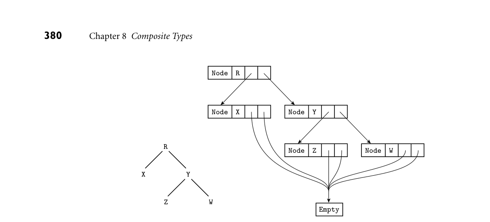
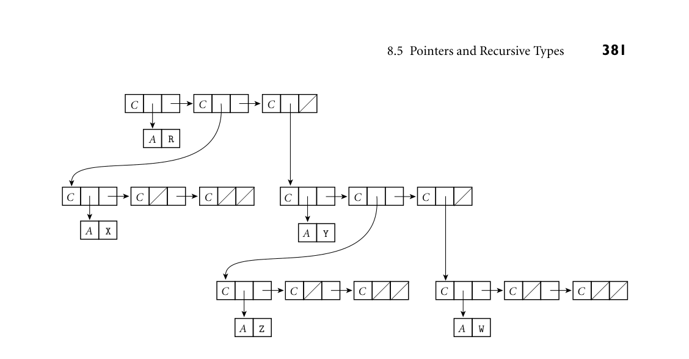
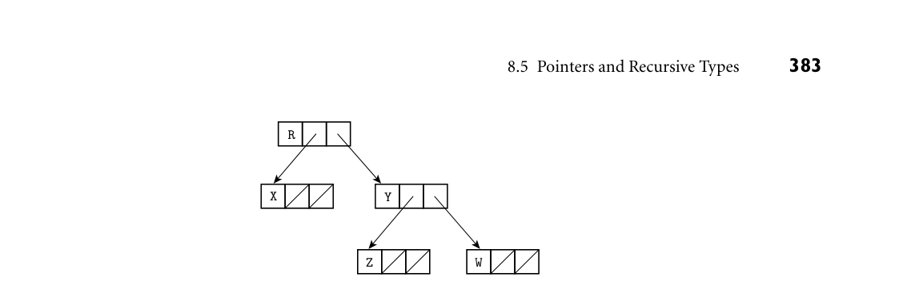
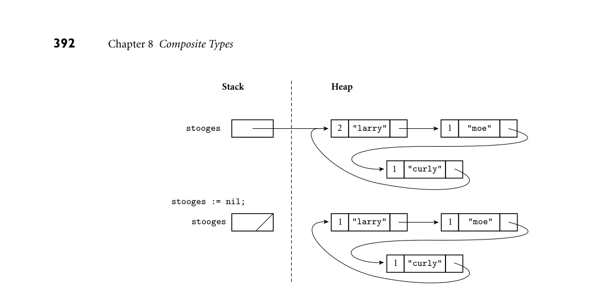
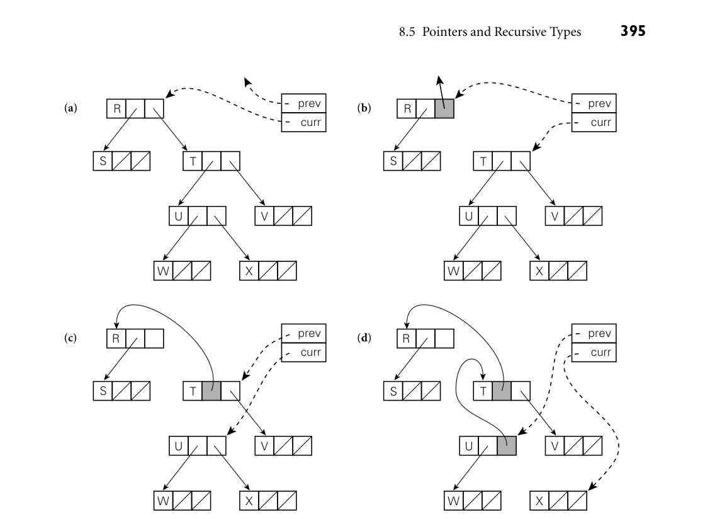

# 8.5 Pointers and Recursive Types

8.5 Pointers and Recursive Types 377

For sets of elements drawn from a large universe, most modern languages use alternative implementations, whose size is proportional to the number of ele- ments present, rather than to the number of values in the base type. Most lan- guages also provide a built-in iterator (Section 6.5.3) to yield the elements of the set. A distinction is often made between sorted lists, whose base type must sup- port some notion of ordering, and whose iterators yield the elements smallest-to- largest, and unordered lists, whose iterators yield the elements in arbitrary order. Ordered sets are commonly implemented with skip lists or various sorts of trees. Unordered sets are commonly implemented with hash tables. Some languages (Python and Swift, for example) provide sets as a built-in type constructor. The Python version can be seen in Example 14.67. In many object- oriented languages, sets are supported by the standard library instead. A few lan- EXAMPLE 8.32

Emulating a set with a map in Go guages and libraries have no built-in set constructor, but do provide associative arrays (also known as “hashes,” “dictionaries,” or “maps”). These can be used to emulate unordered sets, by mapping all (and only) the desired elements to some dummy value. In Go, for example, we can write

my_set := make(map[int]bool) // mapping from int to bool my_set[3] = true // inserts <3, true> in mapping ... delete(my_set, i) // removes <i, true>, if present ... if my_set[j] { ... // true if present

If M is a mapping from type D to type R in Go, and if k ∈D is not mapped to anything in R, the expression M[k] will return the “zero value” of type R. For Booleans, the zero value happens to be false, so the test in the last line of our example will return false if j is not in my_set. Deleting a no-longer-present element is preferable to mapping it explicitly to false, because deletion reclaims the space in the underlying hash table; mapping to false does not. ■ 8.5 Pointers and Recursive Types

A recursive type is one whose objects may contain one or more references to other objects of the type. Most recursive types are records, since they need to contain something in addition to the reference, implying the existence of heterogeneous fields. Recursive types are used to build a wide variety of “linked” data structures, including lists and trees. In languages that use a reference model of variables, it is easy for a record of type foo to include a reference to another record of type foo: every variable (and hence every record field) is a reference anyway. In languages that use a value model of variables, recursive types require the notion of a pointer: a variable (or field) whose value is a reference to some object. Pointers were first introduced in PL/I.

378 Chapter 8 Composite Types

In some languages (e.g., Pascal, Modula-3, and Ada 83), pointers were re- stricted to point only to objects in the heap. The only way to create a new pointer value (without using variant records or casts to bypass the type system) was to call a built-in function that allocated a new object in the heap and returned a pointer to it. In other languages, both old and new, one can create a pointer to a nonheap object by using an “address of” operator. We will examine pointer operations and the ramifications of the reference and value models in more detail in the first subsection below. In any language that permits new objects to be allocated from the heap, the question arises: how and when is storage reclaimed for objects that are no longer needed? In short-lived programs it may be acceptable simply to leave the storage unused, but in most cases unused space must be reclaimed, to make room for other things. A program that fails to reclaim the space for objects that are no longer needed is said to “leak memory.” If such a program runs for an extended period of time, it may run out of space and crash. Some languages, including C, C++, and Rust, require the programmer to re- claim space explicitly. Other languages, including Java, C#, Scala, Go, and all the functional and scripting languages, require the language implementation to re- claim unused objects automatically. Explicit storage reclamation simplifies the language implementation, but raises the possibility that the programmer will forget to reclaim objects that are no longer live (thereby leaking memory), or will accidentally reclaim objects that are still in use (thereby creating dangling references). Automatic storage reclamation (otherwise known as garbage collec- tion) dramatically simplifies the programmer’s task, but imposes certain run- time costs, and raises the question of how the language implementation is to distinguish garbage from active objects. We will discuss dangling references and garbage collection further in Sections 8.5.2 and 8.5.3, respectively.

8.5.1 Syntax and Operations

Operations on pointers include allocation and deallocation of objects in the heap, dereferencing of pointers to access the objects to which they point, and assign-

DESIGN & IMPLEMENTATION

8.6 Implementation of pointers It is common for programmers (and even textbook writers) to equate pointers with addresses, but this is a mistake. A pointer is a high-level concept: a ref- erence to an object. An address is a low-level concept: the location of a word in memory. Pointers are often implemented as addresses, but not always. On a machine with a segmented memory architecture, a pointer may consist of a segment id and an offset within the segment. In a language that attempts to catch uses of dangling references, a pointer may contain both an address and an access key.

8.5 Pointers and Recursive Types 379

ment of one pointer into another. The behavior of these operations depends heavily on whether the language is functional or imperative, and on whether it employs a reference or value model for variables/names. Functional languages generally employ a reference model for names (a purely functional language has no variables or assignments). Objects in a functional lan- guage tend to be allocated automatically as needed, with a structure determined by the language implementation. Variables in an imperative language may use either a value or a reference model, or some combination of the two. In C or Ada, which employ a value model, the assignment A = B puts the value of B into A. If we want B to refer to an object, and we want A = B to make A refer to the object to which B refers, then A and B must be pointers. In Smalltalk or Ruby, which employ a reference model, the assignment A = B always makes A refer to the same object to which B refers. Java charts an intermediate course, in which the usual implementation of the reference model is made explicit in the language semantics. Variables of built-in Java types (integers, floating-point numbers, characters, and Booleans) employ a value model; variables of user-defined types (strings, arrays, and other objects in the object-oriented sense of the word) employ a reference model. The assignment A = B in Java places the value of B into A if A and B are of built-in type; it makes A refer to the object to which B refers if A and B are of user-defined type. C# mir- rors Java by default, but additional language features, explicitly labeled “unsafe,” allow systems programmers to use pointers when desired.

Reference Model

In ML-family languages, the variant mechanism can be used to declare recursive EXAMPLE 8.33

Tree type in OCaml types (shown here in OCaml syntax):

type chr_tree = Empty | Node of char * chr_tree * chr_tree;;

Here a chr_tree is either an Empty leaf or a Node consisting of a character and two child trees. (Further details can be found in Section 11.4.3.) It is natural in OCaml to include a chr_tree within a chr_tree because every variable is a reference. The tree Node (‚R‚, Node (‚X‚, Empty, Empty), Node (‚Y‚, Node (‚Z‚, Empty, Empty), Node (‚W‚, Empty, Empty))) would most likely be represented in memory as shown in Figure 8.11. Each individ- ual rectangle in the right-hand portion of this figure represents a block of storage allocated from the heap. In effect, the tree is a tuple (record) tagged to indicate that it is a Node. This tuple in turn refers to two other tuples that are also tagged as Nodes. At the fringe of the tree are tuples that are tagged as Empty; these contain no further references. Because all Empty tuples are the same, the implementation is free to use just one, and to have every reference point to it. ■ In Lisp, which uses a reference model of variables but is not statically typed, EXAMPLE 8.34

Tree type in Lisp our tree could be specified textually as ‚(#\R (#\X ()()) (#\Y (#\Z ()()) (#\W ()()))). Each level of parentheses brackets the elements of a list. In this case, the outermost such list contains three elements: the character R and nested

*Figure 8.11 Implementation of a tree in ML. The abstract (conceptual) tree is shown at the lower left.*

380 Chapter 8 Composite Types

Node R

Node X Node Y

Z Node W R

Node

X

Y

W Z

Empty

lists to represent the left and right subtrees. (The prefix #\ notation serves the same purpose as surrounding quotes in other languages.) Semantically, each list is a pair of references: one to the head and one to the remainder of the list. As we noted in Section 8.5.1, these semantics are almost always reflected in the im- plementation by a cons cell containing two pointers. A binary tree can thus be represented as a three-element (three cons cell) list, as shown in Figure 8.12. At the top level of the figure, the first cons cell points to R; the second and third point to nested lists representing the left and right subtrees. Each block of mem- ory is tagged to indicate whether it is a cons cell or an atom. An atom is anything other than a cons cell; that is, an object of a built-in type (integer, real, character, string, etc.), or a user-defined structure (record) or array. The uniformity of Lisp lists (everything is a cons cell or an atom) makes it easy to write polymorphic functions, though without the static type checking of ML. ■ If one programs in a purely functional style in ML or in Lisp, the data struc- tures created with recursive types turn out to be acyclic. New objects refer to old ones, but old ones neverchange, and thus neverpoint to new ones. Circular struc- tures are typically defined by using the imperative features of the languages. (For an exception to this rule, see Exercise 8.21.) In ML, the imperative features in- clude an explicit notion of pointer, discussed briefly under “Value Model” below. Even when writing in a functional style, one often finds a need for types that are mutually recursive. In a compiler, for example, it is likely that symbol table EXAMPLE 8.35

Mutually recursive types in OCaml records and syntax tree nodes will need to refer to each other. A syntax tree node that represents a subroutine call will need to refer to the symbol table record that represents the subroutine. The symbol table record, for its part, will need to refer to the syntax tree node at the root of the subtree that represents the subroutine’s code. If types are declared one at a time, and if names must be declared before they can be used, then whichever mutually recursive type is declared first will be

*Figure 8.12 Implementation of a tree in Lisp. A diagonal slash through a box indicates a null pointer. The C and A tags serve to distinguish the two kinds of memory blocks: cons cells and blocks containing atoms.*

8.5 Pointers and Recursive Types 381

C C

C

R

A

C C C C

C C

X

A

Y

A

C C C

C C C

Z

A W

A

unable to refer to the other. ML family languagesaddress this problem by allowing types to be declared together as a group. Using OCaml syntax,

type subroutine_info = {code: syn_tree_node; ...} (* record *) and subr_call_info = {subr: sym_tab_rec; ...} (* record *) and sym_tab_rec = (* variant *) Variable of ... | Type of ... | ... | Subroutine of subroutine_info and syn_tree_node = (* variant *) Expression of ... | Loop of ... | ... | Subr_call of subr_call_info;;

Mutually recursive types of this sort are trivial in Lisp, since it is dynamically typed. (Common Lisp includes a notion of structures, but field types are not declared. In simpler Lisp dialects programmers use nested lists in which fields are merely positional conventions.) ■

382 Chapter 8 Composite Types

Value Model

In Ada, our tree data type would be declared as follows: EXAMPLE 8.36

Tree types in Ada and C type chr_tree; type chr_tree_ptr is access chr_tree; type chr_tree is record left, right : chr_tree_ptr; val : character; end record;

In C, the equivalent declaration is

struct chr_tree { struct chr_tree *left, *right; char val; };

As mentioned in Section 3.3.3, Ada and C both rely on incomplete type declara- tions to accommodate recursive definition. ■ No aggregate syntax is available for linked data structures in Ada or C; a tree must be constructed node by node. To allocate a new node from the heap, the EXAMPLE 8.37

Allocating heap nodes programmer calls a built-in function. In Ada:

my_ptr := new chr_tree;

In C:

my_ptr = malloc(sizeof(struct chr_tree));

C’s malloc is defined as a library function, not a built-in part of the language (though many compilers recognize and optimize it as a special case). The pro- grammer must specify the size of the allocated object explicitly, and while the return value (of type void*) can be assigned into any pointer, the assignment is not type safe. ■ C++, Java, and C# replace malloc with a built-in, type-safe new: EXAMPLE 8.38

Object-oriented allocation of heap nodes my_ptr = new chr_tree( arg list );

In addition to “knowing” the size of the requested type, the C++/Java/C# new will automatically call any user-specified constructor (initialization) function, passing the specified argument list. In a similar but less flexible vein, Ada’s new may specify an initial value for the allocated object:

my_ptr := new chr_tree'(null, null, 'X'); ■

After we have allocated and linked together appropriate nodes in C or Ada, EXAMPLE 8.39

Pointer-based tree our tree example is likely to be implemented as shown in Figure 8.13. A leaf is distinguished from an internal node simply by the fact that its two pointer fields are null. ■ To access the object referred to by a pointer, most languages use an explicit EXAMPLE 8.40

Pointer dereferencing dereferencing operator. In Pascal and Modula this operator took the form of a postfix “up-arrow”:

*Figure 8.13 Typical implementation of a tree in a language with explicit pointers. As in Figure 8.12, a diagonal slash through a box indicates a null pointer.*

8.5 Pointers and Recursive Types 383

R

X Y

Z W

my_ptr^.val := 'X';

In C it is a prefix star:

(*my_ptr).val = 'X';

Because pointers so often referto records (structs), for which the prefix notation is awkward, C also provides a postfix “right-arrow” operator that plays the role of the “up-arrow dot” combination in Pascal:

my_ptr->val = 'X'; ■

On the assumption that pointers almost always refer to records, Ada dispenses EXAMPLE 8.41

Implicit dereferencing in Ada with dereferencing altogether. The same dot-based syntax can be used to access either a field of the record foo or a field of the record pointed to by foo, depending on the type of foo:

T : chr_tree; P : chr_tree_ptr; ... T.val := 'X'; P.val := 'Y';

In those cases in which one actually wants to name the entire object referred to by a pointer, Ada provides a special “pseudofield” called all:

T := P.all;

In essence, pointers in Ada are automatically dereferenced when needed. ■ The imperative features of OCaml and other ML dialects include an assign- EXAMPLE 8.42

Pointer dereferencing in OCaml ment statement, but this statement requires that the left-hand side be a pointer: its effect is to make the pointer refer to the object on the right-hand side. To ac- cess the object referred to by a pointer, one uses an exclamation point as a prefix dereferencing operator:

384 Chapter 8 Composite Types

let p = ref 2;; (* p is a pointer to 2 *) ... p := 3;; (* p now points to 3 *) ... let n = !p in ... (* n is simply 3 *)

The net result is to make the distinction between l-values and r-values very ex- plicit. Most languages blur the distinction by implicitly dereferencing variables on the right-hand side of every assignment statement. Ada and Go blur the distinc- tion further by dereferencing pointers automatically in certain circumstances. ■

The imperative features of Lisp do not include a dereferencing operator. Since every object has a self-evident type, and assignment is performed using a small set of built-in operators, there is never any ambiguity as to what is intended. Assignment in Common Lisp employs the setf operator (Scheme uses set!, EXAMPLE 8.43

Assignment in Lisp set-car!, and set-cdr!), rather than the more common = or :=. For example, if foo refers to a list, then (cdr foo) is the right-hand (“rest of list”) pointer of the first node in the list, and the assignment (set-cdr! foo foo) makes this pointer refer back to foo, creating a one-node circular list:

foo C

foo C

C

C

A a

A b

A a

A b ■

Pointers and Arrays in C

Pointers and arrays are closely linked in C. Consider the following declarations: EXAMPLE 8.44

Array names and pointers in C int n; int *a; /* pointer to integer */ int b[10]; /* array of 10 integers */

Now all of the following are valid:

1. a = b; /* make a point to the initial element of b */ 2. n = a[3]; 3. n = *(a+3); /* equivalent to previous line */ 4. n = b[3]; 5. n = *(b+3); /* equivalent to previous line */

In most contexts, an unsubscripted array name in C is automatically converted to a pointer to the array’s first element (the one with index zero), as shown here in line 1. (Line 5 embodies the same conversion.) Lines 3 and 5 illustrate pointer arithmetic: Given a pointer to an element of an array, the addition of an integer k produces a pointer to the element k positions later in the array (earlier if k is

8.5 Pointers and Recursive Types 385

negative). The prefix * is a pointer dereference operator. Pointer arithmetic is valid only within the bounds of a single array, but C compilers are not required to check this. Remarkably, the subscript operator [ ] in C is actually defined in terms of pointer arithmetic: lines 2 and 4 are syntactic sugar for lines 3 and 5, respec- tively. More precisely, E1[E2], for any expressions E1 and E2, is defined to be (*((E1)+(E2))), which is of course the same as (*((E2)+(E1))). (Extra parentheses have been used in this definition to avoid any questions of prece- dence if E1 and E2 are complicated expressions.) Correctness requires only that one operand of [ ] have an array or pointer type and the other have an integral type. Thus A[3] is equivalent to 3[A], something that comes as a surprise to most programmers. ■

DESIGN & IMPLEMENTATION

8.7 Stack smashing The lack of bounds checking on array subscripts and pointer arithmetic is a major source of bugs and security problems in C. Many of the most infamous Internet viruses have propagated by means of stack smashing, a particularly nasty form of buffer overflow attack. Consider a (very naive) routine designed to read a number from an input stream:

int get_acct_num(FILE *s) { char buf[100]; char *p = buf; do { /* read from stream s: */ *p = getc(s); } while (*p++ != '\n'); *p = '\0'; /* convert ascii to int: */ return atoi(buf); }

buf

Stack growth

Higher addresses

Return address

Previous (calling) frame

If the stream provides more than 100 characters without a newline (‚\n‚), those characters will overwrite memory beyond the confines of buf, as shown by the large white arrow in the figure. A careful attacker may be able to invent a string whose bits include both a sequence of valid machine instructions and a replacement value for the subroutine’s return address. When the routine attempts to return, it will jump into the attacker’s instructions instead. Stack smashing can be prevented by manually checking array bounds in C, or by configuring the hardware to prevent the execution of instructions in the stack (see Sidebar C 9.10). It would never have been a problem in the first place, however, if C had been designed for automatic bounds checks.

386 Chapter 8 Composite Types

In addition to allowing an integer to be added to a pointer, C allows pointers to be subtracted from one another or compared for ordering, provided that they refer to elements of the same array. The comparison p < q, for example, tests EXAMPLE 8.45

Pointer comparison and subtraction in C to see if p refers to an element closer to the beginning of the array than the one referred to by q. The expression p - q returns the number of array positions that separate the elements to which p and q refer. All arithmetic operations on point- ers “scale” their results as appropriate, based on the size of the referenced objects. For multidimensional arrays with row-pointer layout, a[i][j] is equivalent to (*(a+i))[j] or *(a[i]+j) or *(*(a+i)+j). ■ Despite the interoperability of pointers and arrays in C, programmers need to be aware that the two are not the same, particularly in the context of variable declarations, which need to allocate space when elaborated. The declaration of EXAMPLE 8.46

Pointer and array declarations in C a pointer variable allocates space to hold a pointer, while the declaration of an array variable allocates space to hold the whole array. In the case of an array the declaration must specify a size for each dimension. Thus int *a[n], when elaborated, will allocate space for n row pointers; int a[n][m] will allocate space for a two-dimensional array with contiguous layout.5 As a convenience, a variable declaration that includes initialization to an aggregate can omit the size of the outermost dimension if that information can be inferred from the contents of the aggregate:

int a[][2] = {{1, 2}, {3, 4}, {5, 6}}; // three rows ■

DESIGN & IMPLEMENTATION

8.8 Pointers and arrays Many C programs use pointers instead of subscripts to iterate over the ele- ments of arrays. Before the development of modern optimizing compilers, pointer-based array traversal often served to eliminate redundant address cal- culations, thereby leading to faster code. With modern compilers, however, the opposite may be true: redundant address calculations can be identified as common subexpressions, and certain other code improvements are easier for indices than they are for pointers. In particular, as we shall see in Chapter 17, pointers make it significantly more difficult for the code improver to determine when two l-values may be aliases for one other. Today the use of pointer arithmetic is mainly a matter of personal taste: some C programmers consider pointer-based algorithms to be more elegant than their array-based counterparts, while others find them harder to read. Certainly the fact that arrays are passed as pointers makes it natural to write subroutines in the pointer style.

5 To read declarations in C, it is helpful to follow the following rule: start at the name of the variable and work right as far as possible, subject to parentheses; then work left as far as possible; then jump out a level of parentheses and repeat. Thus int *a[n] means that a is an n-element array of pointers to integers, while int (*a)[n] means that a is a pointer to an n-element array of integers.

8.5 Pointers and Recursive Types 387

When an array is included in the argument list of a function call, C passes a EXAMPLE 8.47

Arrays as parameters in C pointer to the first element of the array, not the array itself. For a one-dimen- sional array of integers, the corresponding formal parameter may be declared as int a[ ] or int *a. For a two-dimensional array of integers with row-pointer layout, the formal parameter may be declared as int *a[ ] or int **a. For a two- dimensional array with contiguous layout, the formal parameter may be declared as int a[ ][m] or int (*a)[m]. The size of the first dimension is irrelevant; all that is passed is a pointer, and C performs no dynamic checks to ensure that references are within the bounds of the array. ■ In all cases, a declaration must allow the compiler (or human reader) to deter- mine the size of the elements of an array or, equivalently, the size of the objects referred to by a pointer. Thus neither int a[ ][ ] nor int (*a)[ ] is a valid variable or parameter declaration: neither provides the compiler with the size information it needs to generate code for a + i or a[i]. The built-in sizeof operator returns the size in bytes of an object or type. EXAMPLE 8.48

sizeof in C When given an array as argument it returns the size of the entire array. When given a pointer as argument it returns the size of the pointer itself. If a is an array, sizeof(a) / sizeof(a[0]) returns the number of elements in the array. Similarly, if pointers occupy 4 bytes and double-precision floating-point numbers occupy 8 bytes, then given

double *a; /* pointer to double */ double (*b)[10]; /* pointer to array of 10 doubles */

we have sizeof(a)= sizeof(b)= 4, sizeof(*a)= sizeof(*b[0])= 8, and sizeof(*b)= 80. In most cases, sizeof can be evaluated at compile time. The principal exception occurs for variable-length arrays, whose size may not be known until elaboration time:

void f(int len) { int A[len]; /* sizeof(A) == len * sizeof(int) */ ■

3CHECK YOUR UNDERSTANDING 17. Name three languages that provide particularly extensive support for charac- ter strings. 18. Why might a language permit operations on strings that it does not provide for arrays? 19. What are the strengths and weaknesses of the bit-vector representation for sets? How else might sets be implemented? 20. Discuss the tradeoffs between pointers and the recursive types that arise nat- urally in a language with a reference model of variables.

388 Chapter 8 Composite Types

21. Summarize the ways in which one dereferences a pointer in various program- ming languages. 22. What is the difference between a pointer and an address? Between a pointer and a reference? 23. Discuss the advantages and disadvantages of the interoperability of pointers and arrays in C.

24. Under what circumstances must the bounds of a C array be specified in its declaration?

8.5.2 Dangling References

When a heap-allocated object is no longer live, a long-running program needs to reclaim the object’s space. Stack objects are reclaimed automatically as part of the subroutine calling sequence. How are heap objects reclaimed? There are two alternatives. Languages like C, C++, and Rust require the programmer to EXAMPLE 8.49

Explicit storage reclamation reclaim an object explicitly. In C, for example, one says free(my_ptr); in C++, delete my_ptr. C++ provides additional functionality: prior to reclaiming the space, it automatically calls any user-provided destructor function for the object. A destructor can reclaim space for subsidiary objects, remove the object from indices or tables, print messages, or perform any other operation appropriate at the end of the object’s lifetime. ■ A dangling reference is a live pointer that no longer points to a valid object. In languages like C and C++, which allow the programmer to create pointers EXAMPLE 8.50

Dangling reference to a stack variable in C++ to stack objects, a dangling reference may be created when a subroutine returns while some pointer in a wider scope still refers to a local object of that subroutine:

int i = 3; int *p = &i; ... void foo() { int n = 5; p = &n; } ... cout << *p; // prints 3 foo(); ... cout << *p; // undefined behavior: n is no longer live ■

In a language with explicit reclamation of heap objects, a dangling reference is EXAMPLE 8.51

Dangling reference to a heap variable in C++ created whenever the programmer reclaims an object to which pointers still refer:

8.5 Pointers and Recursive Types 389

int *p = new int; *p = 3; ... cout << *p; // prints 3 delete p; ... cout << *p; // undefined behavior: *p has been reclaimed

Note that even if the reclamation operation were to change its argument to a null pointer, this would not solve the problem, because other pointers might still refer to the same object. ■ Because a language implementation may reuse the space of reclaimed stack and heap objects, a program that uses a dangling reference may read or write bits in memory that are now part of some other object. It may even modify bits that are now part of the implementation’s bookkeeping information, corrupting the structure of the stack or heap. Algol 68 addressed the problem of dangling references to stack objects by for- bidding a pointer from pointing to any object whose lifetime was briefer than that of the pointer itself. Unfortunately, this rule is difficult to enforce. Among other things, since both pointers and objects to which pointers might refer can be passed as arguments to subroutines, dynamic semantic checks are possible only if reference parameters are accompanied by a hidden indication of lifetime. Ada has a more restrictive rule that is easier to enforce: it forbids a pointer from pointing to any object whose lifetime is briefer than that of the pointer’s type.

IN MORE DEPTH

On the companion site we consider two mechanisms that are sometimes used to catch dangling references at run time. Tombstones introduce an extra level of indirection on every pointer access. When an object is reclaimed, the indirection word (tombstone) is marked in a way that invalidates future references to the object. Locks and keys add a word to every pointer and to every object in the heap; these words must match for the pointer to be valid. Tombstones can be used in languages that permit pointers to nonheap objects, but they introduce the secondary problem of reclaiming the tombstones themselves. Locks and keys are somewhat simpler, but they work only for objects in the heap.

8.5.3 Garbage Collection

Explicit reclamation of heap objects is a serious burden on the programmer and a major source of bugs (memory leaks and dangling references). The code required to keep track of object lifetimes makes programs more difficult to design, imple- ment, and maintain. An attractive alternative is to have the language implemen- tation notice when objects are no longer useful and reclaim them automatically.

390 Chapter 8 Composite Types

Automatic reclamation (otherwise known as garbage collection) is more or less es- sential for functional languages: delete is a very imperative sort of operation, and the ability to construct and return arbitrary objects from functions means that many objects that would be allocated on the stack in an imperative language must be allocated from the heap in a functional language, to give them unlimited extent. Over time, automatic garbage collection has become popular for imperative languages as well. It can be found in, among others, Java, C#, Scala, Go, and all the major scripting languages. Automatic collection is difficult to implement, but the difficulty pales in comparison to the convenience enjoyed by programmers once the implementation exists. Automatic collection also tends to be slower than manual reclamation, though it eliminates any need to check for dangling references.

Reference Counts

When is an object no longer useful? One possible answer is: when no pointers to it exist.6 The simplest garbage collection technique simply places a counter in each object that keeps track of the number of pointers that refer to the object. When the object is created, this reference count is set to one, to represent the pointer

DESIGN & IMPLEMENTATION

8.9 Garbage collection Garbage collection presents a classic tradeoff between convenience and safety on the one hand and performance on the other. Manual storage reclamation, implemented correctly by the application program, is almost invariably faster than any automatic garbage collector. It is also more predictable: automatic collection is notorious for its tendency to introduce intermittent “hiccups” in the execution of real-time or interactive programs. Ada takes the unusual position of refusing to take a stand: the language design makes automatic garbage collection possible, but implementations are not required to provide it, and programmers can request manual reclamation with a built-in routine called Unchecked_Deallocation. Newer versions of the language provide extensive facilities whereby programmers can implement their own storage managers (garbage collected or not), with different types of pointers corresponding to different storage “pools.” In a similar vein, the Real Time Specification for Java allows the program- mer to create so-called scoped memory areas that are accessible to only a sub- set of the currently running threads. When all threads with access to a given area terminate, the area is reclaimed in its entirety. Objects allocated in a scoped memory area are never examined by the garbage collector; perfor- mance anomalies due to garbage collection can therefore be avoided by pro- viding scoped memory to every real-time thread.

6 Throughout the following discussion we will use the pointer-based terminology of languages with a value model of variables. The techniques apply equally well, however, to languages with a reference model of variables.

8.5 Pointers and Recursive Types 391

returned by the new operation. When one pointer is assigned into another, the run-time system decrements the reference count of the object (if any) formerly referred to by the assignment’s left-hand side, and increments the count of the object referred to by the right-hand side. On subroutine return, the calling se- quence epilogue must decrement the reference count of any object referred to by a local pointer that is about to be destroyed. When a reference count reaches zero, its object can be reclaimed. Recursively, the run-time system must decrement counts for any objects referred to by pointers within the object being reclaimed, and reclaim those objects if their counts reach zero. To prevent the collector from following garbage addresses, each pointer must be initialized to null at elabora- tion time. In order for reference counts to work, the language implementation must be able to identify the location of every pointer. When a subroutine returns, it must be able to tell which words in the stack frame represent pointers; when an object in the heap is reclaimed, it must be able to tell which words within the object represent pointers. The standard technique to track this information relies on type descriptors generated by the compiler. There is one descriptor for every dis- tinct type in the program, plus one for the stack frame of each subroutine, and one for the set of global variables. Most descriptors are simply a table that lists the offsets within the type at which pointers can be found, together with the ad- dresses of descriptors for the types of the objects referred to by those pointers. For a tagged variant record (discriminated union) type, the descriptor is a bit more complicated: it must contain a list of values (or ranges) for the tag, to- gether with a table for the corresponding variant. For untagged variant records, there is no acceptable solution: reference counts work only if the language is strongly typed (but see the discussion of “Conservative Collection” at the end of Section 8.5.3). The most important problem with reference counts stems from their defini- EXAMPLE 8.52

Reference counts and circular structures tion of a “useful object.” While it is definitely true that an object is useless if no references to it exist, it may also be useless when references do exist. As shown in Figure 8.14, reference counts may fail to collect circular structures. They work well only for structures that are guaranteed to be noncircular. Many language implementations use reference counts for variable-length strings; strings never contain references to anything else. Perl uses reference counts for all dynami- cally allocated data; the manual warns the programmer to break cycles manually when data aren’t needed anymore. Some purely functional languages may also be able to use reference counts safely in all cases, if the lack of an assignment state- ment prevents them from introducing circularity. Finally, reference counts can be used to reclaim tombstones. While it is certainly possible to create a circular structure with tombstones, the fact that the programmer is responsible for ex- plicit deallocation of heap objects implies that reference counts will fail to reclaim tombstones only when the programmer has failed to reclaim the objects to which they refer. ■

*Figure 8.14 Reference counts and circular lists. The list shown here cannot be found via any program variable, but because it is circular, every cell contains a nonzero count.*

392 Chapter 8 Composite Types

Stack Heap

stooges 2 "larry"

1 "moe"

1 "curly"

stooges := nil;

stooges

1 "larry" 1 "moe"

1 "curly"

Smart Pointers The general term smart pointer refers to a program-level ob- ject (implemented on top of the language proper) that mimics the behavior of a pointer, but with additional semantics. The most common use of smart pointers is to implement reference counting in a language that normally supports only manual storage reclamation. Other uses include bounds checking on pointer arithmetic, instrumentation for debugging or performance analysis, and track- ing of references to external objects—e.g., open files. Particularly rich support for smart pointers can be found in the C++ stan- dard library, whose unique_ptr, shared_ptr, and weak_ptr classes leverage operator overloading, constructors, destructors, and move semantics to simplify the otherwise difficult task of manual reclamation. A unique_ptr is what its name implies—the only reference to an object. If the unique_ptr is destroyed (typically because the function in which it was declared returns), then the ob- ject to which it points is reclaimed by the pointer’s destructor, as suggested in Section 8.5.2. If one unique_ptr is assigned into another (or passed as a pa- rameter), the overloaded assignment operator or constructor transfers ownership of the pointed-to object by changing the old pointer to null. (Move seman- tics, which we will describe in more detail in under “References in C++” in Sec- tion 9.3.1, often allow the compiler to optimize away the cost of the ownership transfer.) The shared_ptr type implements a reference count for the pointed-to object, typically storing it in a hidden, tombstone-like intermediate object. Counts are incremented in shared_ptr constructors, decremented in destructors, and ad-

8.5 Pointers and Recursive Types 393

justed (in both directions) by assignment operations. When circular structures are required, or when the programmer wants to maintain bookkeeping infor- mation without artificially extending object lifetimes, a weak_ptr can be used to point to an object without contributing to reference counting. The C++ li- brary will reclaim an object when no shared_ptr to it remains; any remaining weak_ptrs will subsequently behave as if they were null.

Tracing Collection

As we have seen, reference counting defines an object to be useful if there exists a pointer to it. A better definition might say that an object is useful if it can be reached by following a chain of valid pointers starting from something that has a name (i.e., something outside the heap). According to this definition, the blocks in the bottom half of Figure 8.14 are useless, even though their reference counts are nonzero. Tracing collectors work by recursively exploring the heap, starting from external pointers, to determine what is useful.

Mark-and-Sweep The classic mechanism to identify useless blocks, under this more accurate definition, is known as mark-and-sweep. It proceeds in three main steps, executed by the garbage collector when the amount of free space remaining in the heap falls below some minimum threshold:

1. The collector walks through the heap, tentatively marking every block as “use- less.”

DESIGN & IMPLEMENTATION

8.10 What exactly is garbage? Reference counting implicitly defines a garbage object as one to which no pointers exist. Tracing implicitly defines it as an object that is no longer reach- able from outside the heap. Ideally, we’d like an even stronger definition: a garbage object is one that the program will never use again. We settle for non- reachability because this ideal definition is undecidable. The difference can matter in practice: if a program maintains a pointer to an object it will never use again, then the garbage collector will be unable to reclaim it. If the number of such objects grows with time, then the program has a memory leak, despite the presence of a garbage collector. (Trivially we could imagine a program that added every newly allocated object to a global list, but never actually perused the list. Such a program would defeat the collector entirely.) For the sake of space efficiency, programmers are advised to “zero out” any pointers they no longer need. Doing this can be difficult, but not as difficult as fully manually reclamation—in particular, we do not need to realize when we are zeroing the last pointer to a given object. For the same reason, dangling references can never arise: the garbage collector will refrain from reclaiming any object that is reachable along some other path.

394 Chapter 8 Composite Types

2. Beginning with all pointers outside the heap, the collector recursively explores all linked data in the program, marking each newly discovered block as “use- ful.” (When it encounters a block that is already marked as “useful,” the col- lector knows it has reached the block over some previous path, and returns without recursing.) 3. The collector again walks through the heap, moving every block that is still marked “useless” to the free list.

Several potential problems with this algorithm are immediately apparent. First, both the initial and final walks through the heap require that the collec- tor be able to tell where every “in-use” block begins and ends. In a language with variable-size heap blocks, every block must begin with an indication of its size, and of whether it is currently free. Second, the collector must be able in Step 2 to find the pointers contained within each block. The standard solution is to place a pointer to a type descriptor near the beginning of each block.

Pointer Reversal The exploration step (Step 2) of mark-and-sweep collection is naturally recursive. The obvious implementation needs a stack whose maximum depth is proportional to the longest chain through the heap. In practice, the space for this stack may not be available: after all, we run garbage collection when we’re about to run out of space!7 An alternative implementation of the exploration EXAMPLE 8.53

Heap tracing with pointer reversal step uses a technique first suggested by Schorr and Waite [SW67] to embed the equivalent of the stack in already-existing fields in heap blocks. More specifically, as the collector explores the path to a given block, it reverses the pointers it follows, so that each points back to the previous block instead of forward to the next. This pointer-reversal technique is illustrated in Figure 8.15. As it explores, the collector keeps track of the current block and the block from whence it came. To return from block X to block U (after part (d) of the figure), the collec- tor will use the reversed pointer in U to restore its notion of previous block (T). It will then flip the reversed pointer back to X and update its notion of current block to U. If the block to which it has returned contains additional pointers, the collector will proceed forward again; otherwise it will return across the pre- vious reversed pointer and try again. At most one pointer in every block will be reversed at any given time. This pointer must be marked, probably by means of another bookkeeping field at the beginning of each block. (We could mark the pointer by setting one of its low-order bits, but the cost in time would probably be prohibitive: we’d have to search the block on every visit.) ■

Stop-and-Copy In a language with variable-size heap blocks, the garbage col- lector can reduce external fragmentation by performing storage compaction.

7 In many language implementations, the stack and heap grow toward each other from opposite ends of memory (Section 15.4); if the heap is full, the stack can’t grow. In a system with virtual memory the distance between the two may theoretically be enormous, but the space that backs them up on disk is still limited, and shared between them.

*Figure 8.15 Heap exploration via pointer reversal. The block currently under examination is indicated by the curr pointer. The previous block is indicated by the prev pointer. As the garbage collector moves from one block to the next, it changes the pointer it follows to refer back to the previous block. When it returns to a block it restores the pointer. Each reversed pointer must be marked (indicated with a shaded box), to distinguish it from other, forward pointers in the same block.*

8.5 Pointers and Recursive Types 395

prev

prev

(a) (b)

R

R

curr

curr

S T

S T

U V

U V

W X

W X

prev

prev

(c) (d)

R

R

curr

curr

S T

T S

U V

U V

W X

W X

Many garbage collectors employ a technique known as stop-and-copy that achieves compaction while simultaneously eliminating Steps 1 and 3 in the stan- dard mark-and-sweep algorithm. Specifically, they divide the heap into two re- gions of equal size. All allocation happens in the first half. When this half is (nearly) full, the collector begins its exploration of reachable data structures. Each reachable block is copied into contiguous locations in the second half of the heap, with no external fragmentation. The old version of the block, in the first half of the heap, is overwritten with a “useful” flag and a pointer to the new location. Any other pointer that refers to the same block (and is found later in the exploration) is set to point to the new location. When the collector finishes its exploration, all useful objects have been moved (and compacted) into the second

396 Chapter 8 Composite Types

half of the heap, and nothing in the first half is needed anymore. The collector can therefore swap its notion of first and second halves, and the program can con- tinue. Obviously, this algorithm suffers from the fact that only half of the heap can be used at any given time, but in a system with virtual memory it is only the virtual space that is underutilized; each “half” of the heap can occupy most of physical memory as needed. Moreover, by eliminating Steps 1 and 3 of standard mark-and-sweep, stop-and-copy incurs overhead proportional to the number of nongarbage blocks, rather than the total number of blocks.

Generational Collection To further reduce the cost of tracing collection, some garbage collectors employ a “generational” technique, exploiting the observation that most dynamically allocated objects are short lived. The heap is divided into multiple regions (often two). When space runs low the collector first examines the youngest region (the “nursery”), which it assumes is likely to have the high- est proportion of garbage. Only if it is unable to reclaim sufficient space in this region does the collector examine the next-older region. To avoid leaking storage in long-running systems, the collector must be prepared, if necessary, to exam- ine the entire heap. In most cases, however, the overhead of collection will be proportional to the size of the youngest region only.

DESIGN & IMPLEMENTATION

8.11 Reference counts versus tracing Reference counts require a counter field in every heap object. For small ob- jects such as cons cells, this space overhead may be significant. The ongoing expense of updating reference counts when pointers are changed can also be significant in a program with large amounts of pointer manipulation. Other garbage collection techniques, however, have similar overheads. Tracing gener- ally requires a reversed pointer indicator in every heap block, which reference counting does not, and generational collectors must generally incur overhead on every pointer assignment in order to keep track of pointers into the newest section of the heap. The two principal tradeoffs between reference counting and tracing are the inability of the former to handle cycles and the tendency of the latter to “stop the world” periodically in order to reclaim space. On the whole, implementors tend to favor reference counting for applications in which circularity is not an issue, and tracing collectors in the general case. Some real-world systems mix the two approaches, using reference counts on an ongoing basis, with an occa- sional tracing collection to catch any circular structures. The “stop the world” problem can also be addressed with incremental or concurrent collectors, which interleave their execution with the rest of the program, but these tend to have higher total overhead. Efficient, effective garbage collection techniques remain an active area of research.

8.5 Pointers and Recursive Types 397

Any object that survives some small number of collections (often one) in its current region is promoted (moved) to the next older region, in a manner remi- niscent of stop-and-copy. Tracing of the nursery requires, of course, that point- ers from old objects to new objects we treated as external “roots” of exploration. Promotion likewise requires that pointers from old objects to new objects be up- dated to reflect the new locations. While old-space-to-new-space pointers tend to be rare, a generational collector must be able to find them all quickly. At each pointer assignment, the compiler generates code to check whether the new value is an old-to-new pointer; if so, it adds the pointer to a hidden list accessible to the collector. This instrumentation on assignments is known as a write barrier.8

Conservative Collection Language implementors have traditionally assumed that automatic storage reclamation is possible only in languages that are strongly typed: both reference counts and tracing collection require that we be able to find the pointers within an object. If we are willing to admit the possibility that some garbage will go unreclaimed, it turns out that we can implement mark-and-sweep collection without being able to find pointers [BW88]. The key is to observe that any given block in the heap spans a relatively small number of addresses. There is only a very small probability that some word in memory that is not a pointer will happen to contain a bit pattern that looks like one of those addresses. If we assume, conservatively, that everything that seems to point into a heap block is in fact a valid pointer, then we can proceed with mark-and-sweep collec- tion. When space runs low, the collector (as usual) tentatively marks all blocks in the heap as useless. It then scans all word-aligned quantities in the stack and in global storage. If any of these words appears to contain the address of something in the heap, the collector marks the block that contains that address as useful. Recursively, the collector then scans all word-aligned quantities in the block, and marks as useful any other blocks whose addresses are found therein. Finally (as usual), the collector reclaims any blocks that are still marked useless. The algorithm is completely safe (in the sense that it never reclaims useful blocks) so long as the programmer never “hides” a pointer. In C, for example, the collector is unlikely to function correctly if the programmer casts a pointer to int and then xors it with a constant, with the expectation of restoring and using the pointer at a later time. In addition to sometimes leaving garbage unclaimed, conservative collection suffers from the inability to perform compaction: the col- lector can never be sure which “pointers” should be changed.

8 Unfortunately, the word “barrier”is heavily overloaded. Garbage collection barriers are unrelated to the synchronization barriers of Section 13.3.1, the memory barriers of Section 13.3.3, or the RTL barriers of Section C 15.2.1.

