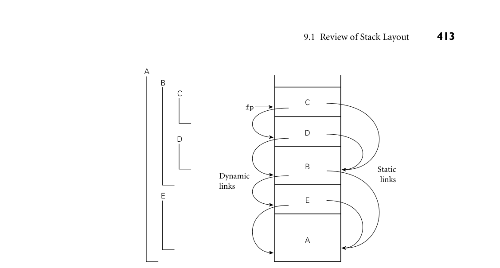
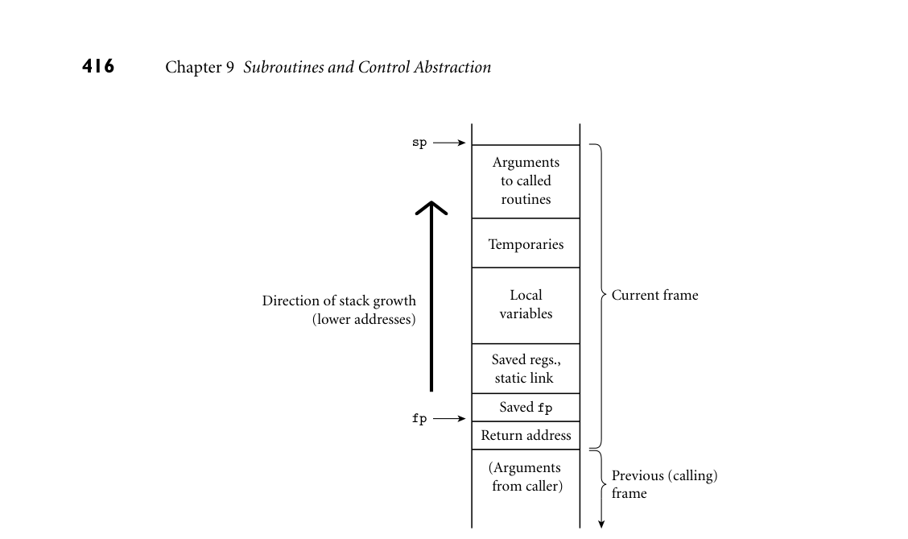
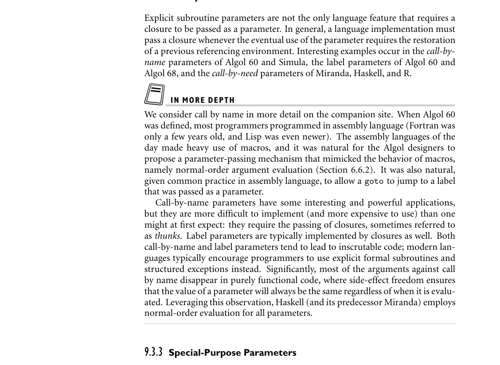
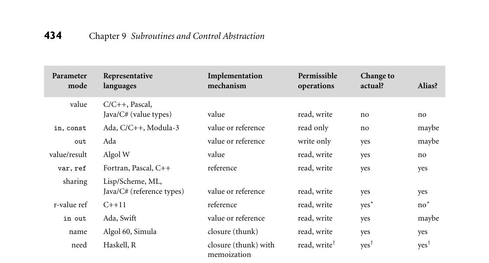
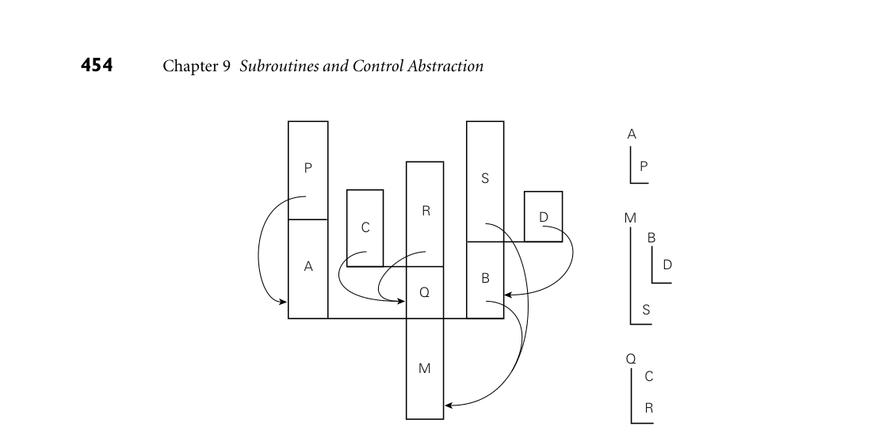
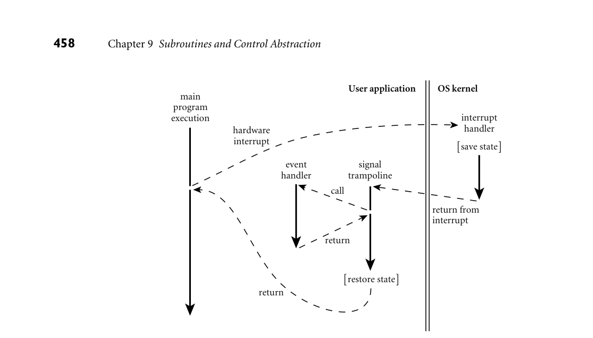

# Chapter 9: Subroutines and Control Abstraction

9 Subroutines and Control Abstraction

In the introduction to Chapter 3, we defined abstraction as a process by which the programmer can associate a name with a potentially complicated pro- gram fragment, which can then be thought of in terms of its purpose or function, rather than in terms of its implementation. We sometimes distinguish between control abstraction, in which the principal purpose of the abstraction is to perform a well-defined operation, and data abstraction, in which the principal purpose of the abstraction is to represent information.1 We will consider data abstraction in more detail in Chapter 10. Subroutines are the principal mechanism for control abstraction in most pro- gramming languages. A subroutine performs its operation on behalf of a caller, who waits for the subroutine to finish before continuing execution. Most sub- routines are parameterized: the caller passes arguments that influence the sub- routine’s behavior, or provide it with data on which to operate. Arguments are also called actual parameters. They are mapped to the subroutine’s formal pa- rameters at the time a call occurs. A subroutine that returns a value is usually called a function. A subroutine that does not return a value is usually called a pro- cedure. Statically typed languages typically require a declaration for every called subroutine, so the compiler can verify, for example, that every call passes the right number and types of arguments. As noted in Section 3.2.2, the storage consumed by parameters and local vari- ables can in most languages be allocated on a stack. We therefore begin this chap- ter, in Section 9.1, by reviewing the layout of the stack. We then turn in Section 9.2 to the calling sequences that serve to maintain this layout. In the process, we revisit the use of static chains to access nonlocal variables in nested subroutines, and con- sider (on the companion site) an alternative mechanism, known as a display, that serves a similar purpose. We also consider subroutine inlining and the represen- tation of closures. To illustrate some of the possible implementation alternatives, we present (again on the companion site) case studies of the LLVM compiler for

1 The distinction betweencontrol and data abstraction is somewhat fuzzy, because the latter usually encapsulates not only information but also the operations that access and modify that informa- tion. Put another way, most data abstractions include control abstraction.

the ARM instruction set and the gcc compiler for 32- and 64-bit x86. We also discuss the register window mechanism of the SPARC instruction set. In Section 9.3 we look more closely at subroutine parameters. We consider parameter-passing modes, which determine the operations that a subroutine can apply to its formal parameters and the effects of those operations on the corre- sponding actual parameters. We also consider named and default parameters, variable numbers of arguments, and function return mechanisms. In Section 9.4, we consider the handling of exceptional conditions. While ex- ceptions can sometimes be confined to the current subroutine, in the general case they require a mechanism to “pop out of” a nested context without returning, so that recovery can occur in the calling context. In Section 9.5, we consider corou- tines, which allow a program to maintain two or more execution contexts, and to switch back and forth among them. Coroutines can be used to implement iter- ators (Section 6.5.3), but they have other uses as well, particularly in simulation and in server programs. In Chapter 13 we will use them as the basis for concur- rent (“quasiparallel”) threads. Finally, in Section 9.6 we consider asynchronous events—things that happen outside a program, but to which it needs to respond.

9.1 Review of Stack Layout

In Section 3.2.2 we discussed the allocation of space on a subroutine call stack EXAMPLE 9.1

Layout of run-time stack (reprise) (Figure 3.1). Each routine, as it is called, is given a new stack frame, or activation record, at the top of the stack. This frame may contain arguments and/or return values, bookkeeping information (including the return address and saved regis- ters), local variables, and/or temporaries. When a subroutine returns, its frame is popped from the stack. ■ At any given time, the stack pointer register contains the address of either the last used location at the top of the stack or the first unused location, depending on convention. The frame pointer register contains an address within the frame. Objects in the frame are accessed via displacement addressing with respect to the frame pointer. If the size of an object (e.g., a local array) is not known at compile EXAMPLE 9.2

Offsets from frame pointer time, then the object is placed in a variable-size area at the top of the frame; its address and dope vector (descriptor) are stored in the fixed-size portion of the frame, at a statically known offset from the frame pointer (Figure 8.7). If there are no variable-size objects, then every object within the frame has a statically known offset from the stack pointer, and the implementation may dispense with the frame pointer, freeing up a register for other use. If the size of an argument is not known at compile time, then the argument may be placed in a variable-size portion of the frame below the other arguments, with its address and dope vector at known offsets from the frame pointer. Alternatively, the caller may simply pass a temporary address and dope vector, counting on the called routine to copy the argument into the variable-size area at the top of the frame. ■ In a language with nested subroutines and static scoping (e.g., Ada, Common EXAMPLE 9.3

Static and dynamic links Lisp, ML, Scheme, or Swift), objects that lie in surrounding subroutines, and


*Figure 9.1 Example of subroutine nesting, taken from Figure 3.5. Within B, C, and D, all five routines are visible. Within A and E, routines A, B, and E are visible, but C and D are not. Given the calling sequence A, E, B, D, C, in that order, frames will be allocated on the stack as shown at right, with the indicated static and dynamic links.*

that are thus neither local nor global, can be found by maintaining a static chain (Figure 9.1). Each stack frame contains a reference to the frame of the lexically surrounding subroutine. This reference is called the static link. By analogy, the saved value of the frame pointer, which will be restored on subroutine return, is called the dynamic link. The static and dynamic links may or may not be the same, depending on whether the current routine was called by its lexically surrounding routine, or by some other routine nested in that surrounding routine. ■ Whether or not a subroutine is called directly by the lexically surrounding rou- tine, we can be sure that the surrounding routine is active; there is no other way that the current routine could have been visible, allowing it to be called. Consider, EXAMPLE 9.4

Visibility of nested routines for example, the subroutine nesting shown in Figure 9.1. If subroutine D is called directly from B, then clearly B’s frame will already be on the stack. How else could D be called? It is not visible in A or E, because it is nested inside of B. A moment’s thought makes clear that it is only when control enters B (placing B’s frame on the stack) that D comes into view. It can therefore be called by C, or by any other routine (not shown) that is nested inside C or D, but only because these are also within B. ■

9.2 Calling Sequences

Maintenance of the subroutine call stack is the responsibility of the calling se- quence—the code executed by the caller immediately before and after a subroutine call—and of the prologue (code executed at the beginning) and epilogue (code exe- cuted at the end) of the subroutine itself. Sometimes the term “calling sequence” is used to refer to the combined operations of the caller, the prologue, and the epilogue. Tasks that must be accomplished on the way into a subroutine include passing parameters, saving the return address, changing the program counter, changing the stack pointer to allocate space, saving registers (including the frame pointer) that contain values that may be overwritten by the callee but are still live (poten- tially needed) in the caller, changing the frame pointer to refer to the new frame, and executing initialization code for any objects in the new frame that require it. Tasks that must be accomplished on the way out include passing return param- eters or function values, executing finalization code for any local objects that re- quire it, deallocating the stack frame (restoring the stack pointer), restoring other saved registers (including the frame pointer), and restoring the program counter. Some of these tasks (e.g., passing parameters) must be performed by the caller, because they differ from call to call. Most of the tasks, however, can be performed either by the caller or the callee. In general, we will save space if the callee does as much work as possible: tasks performed in the callee appear only once in the target program, but tasks performed in the caller appear at every call site, and the typical subroutine is called in more than one place.

Saving and Restoring Registers

Perhaps the trickiest division-of-labor issue pertains to saving registers. The ideal approach (see Section C 5.5.2) is to save precisely those registers that are both live in the caller and needed for other purposes in the callee. Because of separate compilation, however, it is difficult (though not impossible) to determine this intersecting set. A simpler solution is for the caller to save all registers that are in use, or for the callee to save all registers that it will overwrite. Calling sequence conventions for many processors, including the ARM and x86 described in the case studies of Section C 9.2.2, strike something of a com- promise: registers not reserved for special purposes are divided into two sets of approximately equal size. One set is the caller’s responsibility, the other is the callee’s responsibility. A callee can assume that there is nothing of value in any of the registers in the caller-saves set; a caller can assume that no callee will destroy the contents of any registers in the callee-saves set. In the interests of code size, the compiler uses the callee-saves registers for local variables and other long-lived values whenever possible. It uses the caller-saves set for transient values, which are less likely to be needed across calls. The result of these conventions is that the caller-saves registers are seldom saved by either party: the callee knows that


*Figure 9.2 shows one plausible layout for a stack frame, consistent with Figure 3.1. EXAMPLE 9.5*

A typical calling sequence The stack pointer (sp) points to the first unused location on the stack (or the last used location, depending on the compiler and machine). The frame pointer (fp) points to a location near the bottom of the frame. Space for all arguments is reserved in the stack, even if the compiler passes some of them in registers (the callee will need a standard place to save them if it ever calls a nested routine that may try to reach a lexically surrounding parameter via the static chain). To maintain this stack layout, the calling sequence might operate as follows. The caller

* saves any caller-saves registers whose values may be needed after the call
* computes the values of arguments and moves them into the stack or registers
* computes the static link (if this is a language with nested subroutines), and
  passes it as an extra, hidden argument
* uses a special subroutine call instruction to jump to the subroutine, simulta-
  neously passing the return address on the stack or in a register

In its prologue, the callee

* allocates a frame by subtracting an appropriate constant from the sp
* saves the old frame pointer into the stack, and updates it to point to the newly
  allocated frame
* saves any callee-saves registers that may be overwritten by the current routine
  (including the static link and return address, if they were passed in registers)

After the subroutine has completed, the epilogue


*Figure 9.2 A typical stack frame. Though we draw it growing upward on the page, the stack actually grows downward toward lower addresses on most machines. Arguments are accessed at positive offsets from the fp. Local variables and temporaries are accessed at negative offsets from the fp. Arguments to be passed to called routines are assembled at the top of the frame, using positive offsets from the sp.*

* moves the return value (if any) into a register or a reserved location in the stack
* restores callee-saves registers if needed
* restores the fp and the sp
* jumps back to the return address

Finally, the caller

* moves the return value to wherever it is needed
* restores caller-saves registers if needed
  ■

Special-Case Optimizations

Many parts of the calling sequence, prologue, and epilogue can be omitted in common cases. If the hardware passes the return address in a register, then a leaf routine (a subroutine that makes no additional calls before returning)2 can simply

2 A leaf routine is so named because it is a leaf of the subroutine call graph, a data structure men- tioned in Exercise 3.10.

leave it there; it does not need to save it in the stack. Likewise it need not save the static link or any caller-saves registers. A subroutine with no local variables and nothing to save or restore may not even need a stack frame on a RISC machine. The simplest subroutines (e.g., li- brary routines to compute the standard mathematical functions) may not touch memory at all, except to fetch instructions: they may take their arguments in registers, compute entirely in (caller-saves) registers, call no other routines, and return their results in registers. As a result they may be extremely fast.

9.2.1 Displays

One disadvantage of static chains is that access to an object in a scope k levels out requires that the static chain be dereferenced k times. If a local object can be loaded into a register with a single (displacement mode) memory access, an object k levels out will require k + 1 memory accesses. This number can be reduced to a constant by use of a display.

IN MORE DEPTH

As described on the companion site, a display is a small array that replaces the static chain. The jth element of the display contains a reference to the frame of the most recently active subroutine at lexical nesting level j. If the currently active routine is nested i > 3 levels deep, then elements i −1, i −2, and i −3 of the display contain the values that would have been the first three links of the static chain. An object k levels out can be found at a statically known offset from the address stored in element j = i −k of the display. For most programs the cost of maintaining a display in the subroutine calling sequence tends to be slightly higher than that of maintaining a static chain. At the same time, the cost of dereferencing the static chain has been reduced by modern compilers, which tend to do a good job of caching the links in registers when ap- propriate. These observations, combined with the trend toward languages (those descended from C in particular) in which subroutines do not nest, have made displays less common today than they were in the 1970s.

9.2.2 Stack Case Studies: LLVM on ARM; gcc on x86

Calling sequences differ significantly from machine to machine and even com- piler to compiler, though hardware vendors typically publish suggested conven- tions for their respective architectures, to promote interoperability among pro- gram components produced by different compilers. Many of the most signifi- cant differences reflect an evolution over time toward heavier use of registers and lighter use of memory. This evolution reflects at least three important technolog- ical trends: the increasing size of register sets, the increasing gap in speed between

registers and memory (even L1 cache), and the increasing ability of both compil- ers and processors to improve performance by reordering instructions—at least when operands are all in registers. Older compilers, particularly for machines with a small number of registers, tend to pass arguments on the stack; newer compilers, particularly for machines with larger register sets, tend to pass arguments in registers. Older architectures tend to provide a subroutine call instruction that pushes the return address onto the stack; newer architectures tend to put the return address in a register. Many machines provide special instructions of use in the subroutine-call se- quence. On the x86, for example, enter and leave instructions allocate and deallocate stack frames, via simultaneous update of the frame pointer and stack pointer. On the ARM, stm (store multiple) and ldm (load multiple) instructions save and restore arbitrary groups of registers; in one common idiom, the saved set includes the return address (“link register”); when the restored set includes the program counter (in the same position), ldm can pop a set of registers and return from the subroutine in a single instruction. There has also been a trend—though a less consistent one—away from the use of a dedicated frame pointer register. In older compilers, for older machines, it was common to use push and pop instructions to pass stack-based arguments. The resulting instability in the value of the sp made it difficult (though not im- possible) to use that register as the base for access to local variables. A separate frame pointer simplified both code generation and symbolic debugging. At the same time, it introduced additional instructions into the subroutine calling se- quence, and reduced by one the number of registers available for other purposes. Modern compiler writers are increasingly willing to trade complexity for perfor- mance, and often dispense with the frame pointer, at least in simple routines.

IN MORE DEPTH

On the companion site we look in some detail at the stack layout conventions and calling sequences of a representative pair of compilers: the LLVM compiler for the 32-bit ARMv7 architecture, and the gcc compiler for the 32- and 64-bit x86. LLVM is a middle/back end combination originally developed at the University of Illinois and now used extensively in both academia and industry. Among other things, it forms the backbone of the standard tool chains for both iPhone (iOS) and Android devices. The GNU compiler collection, gcc, is a cornerstone of the open source movement, used across a huge variety of laptops, desktops, and servers. Both LLVM and gcc have back ends for many target architectures, and front ends for many programming languages. We focus on their support for C, whose conventions are in some sense a “lowest common denominator” for other languages.

9.2.3 Register Windows

As an alternative to saving and restoring registers on subroutine calls and returns, the original Berkeley RISC machines [PD80, Pat85] introduced a hardware mech- anism known as register windows. The basic idea is to map the ISA’s limited set of register names onto some subset (window) of a much larger collection of physical registers, and to change the mapping when making subroutine calls. Old and new mappings overlap a bit, allowing arguments to be passed (and function results re- turned) in the intersection.

IN MORE DEPTH

We consider register windows in more detail on the companion site. They have appeared in several commercial processors, most notably the Sun SPARC and the Intel IA-64 (Itanium).

9.2.4 In-Line Expansion

As an alternative to stack-based calling conventions, many language implemen- tations allow certain subroutines to be expanded in-line at the point of call. A copy of the “called” routine becomes a part of the “caller”; no actual subroutine call occurs. In-line expansion avoids a variety of overheads, including space al- location, branch delays from the call and return, maintaining the static chain or display, and (often) saving and restoring registers. It also allows the compiler to perform code improvements such as global register allocation, instruction sche- duling, and common subexpression elimination across the boundaries between subroutines—something that most compilers can’t do otherwise. In many implementations, the compiler chooses which subroutines to expand in-line and which to compile conventionally. In some languages, the program- mer can suggest that particular routines be in-lined. In C and C++, the keyword EXAMPLE 9.6

Requesting an inline subroutine inline can be prefixed to a function declaration:

inline int max(int a, int b) {return a > b ? a : b;}

In Ada, the programmer can request in-line expansion with a significant comment, or pragma:

```
function max(a, b : integer) return integer is
begin
if a > b then return a; else return b; end if;
end max;
pragma inline(max);
```

Like the inline of C and C++, this pragma is a hint; the compiler is permitted to ignore it. ■ In Section 3.7 we noted the similarity between in-line expansion and macros, but argued that the former is semantically preferable. In fact, in-line expansion is semantically neutral: it is purely an implementation technique, with no effect on the meaning of the program. In comparison to real subroutine calls, in-line expansion has the obvious disadvantage of increasing code size, since the entire body of the subroutine appears at every call site. In-line expansion is also not an option in the general case for recursive subroutines. For the occasional case in EXAMPLE 9.7

In-lining and recursion which a recursive call is possible but unlikely, it may be desirable to generate a true recursive subroutine, but to expand one level of that routine in-line at each call site. As a simple example, consider a binary tree whose leaves contain character strings. A routine to return the fringe of this tree (the left-to-right concatenation of the values in its leaves) might look like this in C++:

```
string fringe(bin_tree *t) {
// assume both children are nil or neither is
if (t->left == 0) return t->val;
return fringe(t->left) + fringe(t->right);
}
```

A compiler can expand this code in-line if it makes each nested invocation a true subroutine call. Since half the nodes in a binary tree are leaves, this expansion will eliminate half the dynamic calls at run time. If we expand not only the root

DESIGN & IMPLEMENTATION

9.1 Hints and directives The inline keyword in C and C++ suggests but does not require that the compiler expand the subroutine in-line. A conventional implementation may be used when inline has been specified—or an in-line implementation when inline has not been specified—if the compiler has reason to believe that this will result in better code. (In both languages, the inline keyword also has an impact on the rules regarding separate compilation. In particular, to facilitate their inclusion in header files, inline functions are allowed to have multiple definitions. C++ says all the definitions must be the same; in C, the choice among them is explicitly unspecified.) In effect, the inclusion of hints like inline in a programming language represents an acknowledgment that advice from the expert programmer may sometimes be useful with current compiler technology, but that this may change in the future. By contrast, the use of pointer arithmetic in place of array subscripts, as discussed in Sidebar 8.8, is more of a directive than a hint, and may complicate the generation of high-quality code from legacy programs.

calls but also (one level of) the two calls within the true subroutine version, only a quarter of the original dynamic calls will remain. ■

3CHECK YOUR UNDERSTANDING 1. What is a subroutine calling sequence? What does it do? What is meant by the subroutine prologue and epilogue? 2. How do calling sequences typically differ in older (CISC) and newer (RISC) instruction sets? 3. Describe how to maintain the static chain during a subroutine call.

  4.
  What is a display? How does it differ from a static chain?
  5.
  What are the purposes of the stack pointer and frame pointer registers? Why
  does a subroutine often need both?
  6.
  Why do modern machines typically pass subroutine parameters in registers
  rather than on the stack?
  7.
  Why do subroutine calling conventions often give the caller responsibility for
  saving half the registers and the callee responsibility for saving the other half?
  8.
  If work can be done in either the caller or the callee, why do we typically prefer
  to do it in the callee?
  9.
  Why do compilers typically allocate space for arguments in the stack, even
  when they pass them in registers?
* List the optimizations that can be made to the subroutine calling sequence in
  important special cases (e.g., leaf routines).
* How does an in-line subroutine differ from a macro?

* Under what circumstances is it desirable to expand a subroutine in-line?

DESIGN & IMPLEMENTATION

9.2 In-lining and modularity Probably the most important argument for in-line expansion is that it allows programmers to adopt a very modular programming style, with lots of tiny subroutines, without sacrificing performance. This modular programming style is essential for object-oriented languages, as we shall see in Chapter 10. The benefit of in-lining is undermined to some degree by the fact that chang- ing the definition of an in-lined function forces the recompilation of every user of the function; changing the definition of an ordinary function (without changing its interface) forces relinking only. The best of both worlds may be achieved in systems with just-in-time compilation (Section 16.2.1).

9.3 Parameter Passing

Most subroutines are parameterized: they take arguments that control certain aspects of their behavior, or specify the data on which they are to operate. Pa- rameter names that appear in the declaration of a subroutine are known as for- mal parameters. Variables and expressions that are passed to a subroutine in a particular call are known as actual parameters. We have been referring to actual parameters as arguments. In the following two subsections, we discuss the most common parameter-passing modes, most of which are implemented by passing values, references, or closures. In Section 9.3.3 we will look at additional mecha- nisms, including default (optional) parameters, named parameters, and variable- length argument lists. Finally, in Section 9.3.4 we will consider mechanisms for returning values from functions. As we noted in Section 6.1, most languages use a prefix notation for calls to user-defined subroutines, with the subroutine name followed by a parenthe- sized argument list. Lisp places the function name inside the parentheses, as in (max a b). ML dispenses with the parentheses entirely, except when needed for EXAMPLE 9.8

Infix operators disambiguation: max a b. ML also allows the programmer to specify that certain names represent infix operators, which appear between a pair of arguments. In Standard ML one can even specify their precedence:

```
infixr 8 tothe;
(* exponentiation *)
fun x tothe 0 = 1.0
| x tothe n = x * (x tothe(n-1));
(* assume n >= 0 *)
```

The infixr declaration indicates that tothe will be a right-associative binary infix operator, at precedence level 8 (multiplication and division are at level 7, addition and subtraction at level 6). Fortran 90 also allows the programmer to define new infix operators, but it requires their names to be bracketed with pe- riods (e.g., A .cross. B), and it gives them all the same precedence. Smalltalk uses infix (or “mixfix”) notation (without precedence) for all its operations. ■ The uniformity of Lisp and Smalltalk syntax makes control abstraction partic- EXAMPLE 9.9

Control abstraction in Lisp and Smalltalk ularly effective: user-defined subroutines (functions in Lisp, “messages” in Small- talk) use the same style of syntax as built-in operations. As an example, consider if... then ... else:

```
if a > b then max := a; else max := b; end if;
-- Ada
```

```
(if (> a b) (setf max a) (setf max b))
; Lisp
```

```
(a > b) ifTrue: [max <- a] ifFalse: [max <- b].
"Smalltalk"
```

In Ada (as in most imperative languages) it is clear that if... then ... else is a built-in language construct: it does not look like a subroutine call. In Lisp and

Smalltalk, on the other hand, the analogous conditional constructs are syntacti- cally indistinguishable from user-defined operations. They are in fact defined in terms of simpler concepts, rather than being built in, though they require a spe- cial mechanism to evaluate their arguments in normal, rather than applicative, order (Section 6.6.2). ■

9.3.1 Parameter Modes

In our discussion of subroutines so far, we have glossed over the semantic rules that govern parameter passing, and that determine the relationship between ac- tual and formal parameters. Some languages, including C, Fortran, ML, and Lisp, define a single set of rules, which apply to all parameters. Other languages, in- cluding Ada, C++, and Swift, provide two or more sets of rules, corresponding to different parameter-passing modes. As in many aspects of language design, the semantic details are heavily influenced by implementation issues. Suppose for the moment that x is a global variable in a language with a value EXAMPLE 9.10

Passing an argument to a subroutine model of variables, and that we wish to pass x as a parameter to subroutine p:

p(x);

From an implementation point of view, we have two principal alternatives: we may provide p with a copy of x’s value, or we may provide it with x’s address. The two most common parameter-passing modes, called call by value and call by reference, are designed to reflect these implementations. ■ With value parameters, each actual parameter is assigned into the correspond- ing formal parameter when a subroutine is called; from then on, the two are inde- pendent. With reference parameters, each formal parameter introduces, within the body of the subroutine, a new name for the corresponding actual parame- ter. If the actual parameter is also visible within the subroutine under its original name (as will generally be the case if it is declared in a surrounding scope), then the two names are aliases for the same object, and changes made through one will be visible through the other. In most languages (Fortran is an exception; see below) an actual parameter that is to be passed by reference must be an l-value; it cannot be the result of an arithmetic operation, or any other value without an address. As a simple example, consider the following pseudocode: EXAMPLE 9.11

Value and reference parameters x : integer –– global procedure foo(y : integer) y := 3 print x . . . x := 2 foo(x) print x

If y is passed to foo by value, then the assignmentinside foo has no visible effect— y is private to the subroutine—and the program prints 2 twice. If y is passed to foo by reference, then the assignment inside foo changes x—y is just a local name for x—and the program prints 3 twice. ■

Variations on Value and Reference Parameters

If the purpose of call by referenceis to allow the called routine to modify the actual parameter, we can achieve a similar effect using call by value/result, a mode first introduced in Algol W. Like call by value, call by value/result copies the actual parameter into the formal parameter at the beginning of subroutine execution. Unlike call by value, it also copies the formal parameter back into the actual pa- rameter when the subroutine returns. In Example 9.11, value/result would copy EXAMPLE 9.12

Call by value/result x into y at the beginning of foo, and y into x at the end of foo. Because foo accesses x directly in between, the program’s visible behavior would be different than it was with call by reference: the assignment of 3 into y would not affect x until after the inner print statement, so the program would print 2 and then 3. ■

In Pascal, parameters were passed by value by default; they were passed by reference if preceded by the keyword var in their subroutine header’s formal pa- rameter list. Parameters in C are always passed by value, though the effect for arrays is unusual: because of the interoperability of arrays and pointers in C (Sec- tion 8.5.1), what is passed by value is a pointer; changes to array elements accessed through this pointer are visible to the caller. To allow a called routine to modify a EXAMPLE 9.13

Emulating call-by-reference in C variable other than an array in the caller’s scope, the C programmer must pass a pointer to the variable explicitly:

void swap(int *a, int *b) { int t = *a; *a = *b; *b = t; } ... swap(&v1, &v2); ■

Fortran passes all parameters by reference, but does not require that every ac- tual parameter be an l-value. If a built-up expression appears in an argument list, the compiler creates a temporary variable to hold the value, and passes this variable by reference. A Fortran subroutine that needs to modify the values of its formal parameters without modifying its actual parameters must copy the values into local variables, and modify those instead.

DESIGN & IMPLEMENTATION

9.3 Parameter modes While it may seem odd to introduce parameter modes (a semantic issue) in terms of implementation, the distinction between value and reference parame- ters is fundamentally an implementation issue. Most languages with more than one mode (Ada and Swift are notable exceptions) might fairly be characterized as an attempt to paste acceptable semantics onto the desired implementation, rather than to find an acceptable implementation of the desired semantics.

Call by Sharing Call by value and call by reference make the most sense in a language with a value model of variables: they determine whether we copy the variable or pass an alias for it. Neither option really makes sense in a language like Smalltalk, Lisp, ML, or Ruby, in which a variable is already a reference. Here it is most natural simply to pass the reference itself, and let the actual and formal parameters refer to the same object. Clu called this mode call by sharing. It is different from call by value because, although we do copy the actual parameter into the formal parameter, both of them are references; if we modify the object to which the formal parameter refers, the program will be able to see those changes through the actual parameter after the subroutine returns. Call by sharing is also different from call by reference, because although the called routine can change the value of the object to which the actual parameter refers, it cannot make the argument refer to a different object. As we noted in Sections 6.1.2 and 8.5.1, a reference model of variables does not necessarily require that every object be accessed indirectly by address: the imple- mentation can create multiple copies of immutable objects (numbers, characters, etc.) and access them directly. Call by sharing is thus commonly implemented the same as call by value for small objects of immutable type. In keeping with its hybrid model of variables, Java uses call by value for vari- ables of primitive, built-in types (all of which are values), and call by sharing for variables of user-defined class types (all of which are references). An interesting consequence is that a Java subroutine cannot change the value of an actual pa- rameter of primitive type. A similar approach is the default in C#, but because the language allows users to create both value (struct) and reference (class) types, both cases are considered call by value. That is, whether a variable is a value or a reference, we always pass it by copying. (Some authors describe Java the same way.) When desired, parameters in C# can be passed by reference instead, by labeling both a formal parameter and each corresponding argument with the ref or out keyword. Both of these modes are implemented by passing an address; they differ in that a ref argument must be definitely assigned prior to the call, as described in Section 6.1.3; an out argument need not. In contrast to Java, therefore, a C# subroutine can change the value of an actual parameter of primitive type, if the parameter is passed ref or out. Similarly, if a variable of class (reference) type is passed as a ref or out parameter, it may end up referring to a different object as a result of subroutine execution—something that is not possible with call by sharing.

The Purpose of Call by Reference Historically, there were two principal issues that a programmer might consider when choosing between value and reference parameters in a language (e.g., Pascal or Modula) that provided both. First, if the called routine was supposed to change the value of an actual parameter (argu- ment), then the programmer had to pass the parameter by reference. Conversely, to ensure that the called routine could not modify the argument, the program- mer could pass the parameter by value. Second, the implementation of value pa-

rameters would copy actuals to formals, a potentially time-consuming operation when arguments were large. Reference parameters can be implemented simply by passing an address. (Of course, accessing a parameter that is passed by reference requires an extra level of indirection. If the parameter were used often enough, the cost of this indirection might outweigh the cost of copying the argument.) The potential inefficiency of large value parameters may prompt programmers to pass an argument by reference when passing by value would be semantically more appropriate. Pascal programmers, for example, were commonly taught to use var (reference) parameters both for arguments that need to be modified and for arguments that are very large. In a similar vein, C programmers today are commonly taught to pass pointers (created with &) for both to-be-modified and very large arguments. Unfortunately, the latter justification tends to lead to buggy code, in which a subroutine modifies an argument that the caller meant to leave unchanged.

Read-Only Parameters To combine the efficiency of reference parameters and the safety of value parameters, Modula-3 provided a READONLY parameter mode. Any formal parameter whose declaration was preceded by READONLY could not be changed by the called routine: the compiler prevented the programmer from using that formal parameter on the left-hand side of any assignment statement, reading it from a file, or passing it by reference to any other subroutine. Small READONLY parameters were generally implemented by passing a value; larger READONLY parameters were implemented by passing an address. As in Fortran, a Modula-3 compiler would create a temporary variable to hold the value of any built-up expression passed as a large READONLY parameter. The equivalent of READONLY parameters is also available in C, which allows any EXAMPLE 9.14

const parameters in C variable or parameter declaration to be preceded by the keyword const. Const variables are “elaboration-time constants,” as described in Section 3.2. Const parameters are particularly useful when passing pointers to large structures:

```
void append_to_log(const huge_record* r) { ...
...
append_to_log(&my_record);
```

Here the keyword const applies to the record to which r points;3 the callee will be unable to change the record’s contents. Note, however, that in C the caller must create a pointer to the record explicitly, and the compiler does not have the option of passing by value. ■ One traditional problem with parameter modes—and with the READONLY mode in particular—is that they tend to confuse the key pragmatic issue (does the implementation pass a value or a reference?) with two semantic issues: is the

3 Following the usual rules for parsing C declarations (footnote in Example 8.46), r is a pointer to a huge_record whose value is constant. If we wanted r to be a constant that points to a huge_record, we should need to say huge_record* const r.

callee allowed to change the formal parameter and, if so, will the changes be re- flected in the actual parameter? C keeps the pragmatic issue separate, by forcing the programmer to pass references explicitly with pointers. Still, its const mode serves double duty: is the intent of const foo* p to protect the actual parameter from change, or to document the fact that the subroutine thinks of the formal parameter as a constant rather than a variable, or both?

Parameter Modes in Ada

Ada provides three parameter-passing modes, called in, out, and in out. In parameters pass information from the caller to the callee; they can be read by the callee but not written. Out parameters pass information from the callee to the caller. In Ada 83 they can be written by the callee but not read; in Ada 95 they can be both read and written, but they begin their life uninitialized. In out pa- rameters pass information in both directions; they can be both read and written. Changes to out or in out parameters always change the actual parameter. For parameters of scalar and access (pointer) types, Ada specifies that all three modes are to be implemented by copying values. For these parameters, then, in is call by value, in out is call by value/result, and out is simply call by result (the value of the formal parameter is copied into the actual parameter when the subroutine returns). For parameters of most constructed types, however, Ada specifically permits an implementation to pass either values or references. In most languages, these two different mechanisms would lead to different seman- tics: changes made to an in out parameter that is passed by reference will affect the actual parameter immediately; changes made to an in out parameter that is passed by value will not affect the actual parameter until the subroutine returns. As noted in Example 9.12, the difference can lead to different behavior in the presence of aliases. One possible way to hide the distinction between reference and value/result would be to outlaw the creation of aliases, as Euclid does. Ada takes a simpler tack: a program that can tell the difference between value and reference-based implementations of (nonscalar, nonpointer) in out parameters is said to be er- roneous—incorrect, but in a way that the language implementation is not required to catch. Ada’s semantics for parameter passing allow a single set of modes to be used not only for subroutine parameters but also for communication among concur- rently executing tasks (to be discussed in Chapter 13). When tasks are executing on separate machines, with no memory in common, passing the address of an actual parameter is not a practical option. Most Ada compilers pass large argu- ments to subroutines by reference; they pass them to the entry points of tasks by copying.

References in C++

Programmers who switch to C after some experience with other languages are of- ten frustrated by C’s lack of reference parameters. As noted above, one can always arrange to modify an object by passing a pointer, but then the formal parameter

is declared as a pointer, and must be explicitly dereferenced whenever it is used. C++ addresses this problem by introducing an explicit notion of a reference. Ref- EXAMPLE 9.15

Reference parameters in C++ erence parameters are specified by preceding their name with an ampersand in the header of the function:

void swap(int &a, int &b) { int t = a; a = b; b = t; }

In the code of this swap routine, a and b are ints, not pointers to ints; no dereferencing is required. Moreover, the caller passes as arguments the variables whose values are to be swapped, rather than passing pointers to them. ■ As in C, a C++ parameter can be declared to be const to ensure that it is not modified. For large types, const reference parameters in C++ provide the same combination of speed and safety found in the READONLY parameters of Modula-3: they can be passed by address, and cannot be changed by the called routine. References in C++ see their principal use as parameters, but they can appear in other contexts as well. Any variable can be declared to be a reference: EXAMPLE 9.16

References as aliases in C++ int i; int &j = i; ... i = 2; j = 3; cout << i; // prints 3

Here j is a reference to (an alias for) i. The initializer in the declaration is re- quired; it identifies the object for which j is an alias. Moreover it is not possible later to change the object to which j refers; it will always refer to i. Any change to i or j can be seen by reading the other. Most C++ compilers implement references with addresses. In this example, i will be assigned a loca- tion that contains an integer, while j will be assigned a location that contains the address of i. Despite their different implementation, however, there is no seman- tic difference between i and j; the exact same operations can be applied to either, with precisely the same results. ■ In C, programmers sometimes use a pointer to avoid repeated uses of the same EXAMPLE 9.17

Simplifying code with an in-line alias complex expression:

```
{
element* e = &ruby.chemical_composition.elements[1];
e->name = "Al";
e->atomic_number = 13;
e->atomic_weight = 26.98154;
e->metallic = true;
}
```

References avoid the need for pointer syntax:

{ element& e = ruby.chemical_composition.elements[1]; e.name = "Al"; e.atomic_number = 13; e.atomic_weight = 26.98154; e.metallic = true; } ■

Aside from function parameters, however, the most important use of refer- ences in C++ is for function returns. Section C 8.7 explains how references are EXAMPLE 9.18

Returning a reference from a function used for I/O in C++. The overloaded << and >> operators return a reference to their first argument, which can in turn be passed to subsequent << or >> opera- tions. The syntax

cout << a << b << c;

is short for

((cout.operator<<(a)).operator<<(b)).operator<<(c);

Without references, << and >> would have to return a pointer to their stream:

((cout.operator<<(a))->operator<<(b))->operator<<(c);

or

*(*(cout.operator<<(a)).operator<<(b)).operator<<(c);

This change would spoil the cascading syntax of the operator form:

*(*(cout << a) << b) << c;

Like pointers, referencesreturned from functions introduce the opportunity to create dangling references in a language (like C++) with limited extent for local variables. In our I/O example, the return value is the same stream that was passed into operator<< as a parameter; since this outlives the function invocation, con- tinued use of the reference is safe. ■ It should be noted that the ability to return references from functions is not new in C++: Algol 68 provides the same capability. The object-oriented features of C++, and its operator overloading, make reference returns particularly useful.

R-value References

One feature that is distinctive in C++ is the notion of an r-value reference, intro- duced in C++11. R-value references allow an argument that would normally be considered an r-value—typically, a built-up expression—to be passed to a func- tion by reference. To see why this might be useful, consider the following decla- EXAMPLE 9.19

R-value references in C++11 ration:

obj o2 = o1;

Assuming that o1 is also of class obj, the compiler will initialize o2 by calling obj’s copy constructor method, passing o1 as argument. As we shall see in Sec- tion 10.3, a constructor can be declared to take parameters like those of any other function. Historically, the parameter of obj’s copy constructor would have been a constant reference (const obj&), and the body of the constructor would have inspected this parameter to decide how to initialize o2. So far so good. Now consider the case in which objects of class obj contain pointers to dynamically allocated state. (The strings, vectors, lists, trees, and hash tables of the standard library all have such dynamic state.) If that state is mutable, the constructor will generally need to allocate and initialize a copy, so that neither object will be dam- aged by subsequent changes to the other. But now consider the declaration

obj o3 = foo("hi mom");

Assuming that foo has return type obj, the compiler will again create a call to the copy constructor, but this time it may pass a temporary object (call it t) used to hold the value returned from foo. As before, the constructor will allocate and initialize a copy of the state contained in t, but upon its return the copy in t will be destroyed (by calling its destructor method, which will presumably free the space it consumes in the heap). Wouldn’t it be handy if we could transfer t’s state into o3, rather than creating a copy and then immediately destroying the original? This is precisely what r-value references allow. In addition to the conventional copy constructor, with its const obj& pa- rameter, C++11 allows the programmer to declare a move constructor, with an obj&& parameter (double ampersand, no const). The compiler will use the move constructor when—and only when—the parameter in a declaration is a “temporary”—a value that will no longer be accessible after evaluation of the ex- pression in which it appears. In the declaration of o3, the return value of foo is such a temporary. If the dynamically allocated state of an obj object is accessed through a field named payload, the move constructor might be as simple as

```
obj::obj(obj&& other) {
payload = other.payload;
other.payload = nullptr;
}
```

The explicit null-ing of other.payload prevents other’s destructor from free- ing the transferred state. ■ In some cases, the programmer may know that a value will never be used after passing it as a parameter, but the compiler may be unable to deduce this fact. To force the use of a move constructor, the programmer can wrap the value in a call to the standard library move routine:

obj o4 = std::move(o3);

The move routine generates no code: it is, in effect, a cast. Behavior is undefined if the program actually does contain a subsequent use of o3. Like regular references, r-value references can be used in the declaration of ar- bitrary variables in C++. In practice, they seldom appear outside the parameters of move constructors and the analogous move assignment methods, which over- load the = operator.

Closures as Parameters

A closure (a reference to a subroutine, together with its referencing environment) may be passed as a parameter for any of several reasons. The most obvious of these arises when the parameter is declared to be a subroutine (sometimes called a formal subroutine). In Ada one might write EXAMPLE 9.20

Subroutines as parameters in Ada 1. type int_func is access function (n : integer) return integer; 2. type int_array is array (positive range <>) of integer; 3. procedure apply_to_A (f : int_func; A : in out int_array) is 4. begin 5. for i in A'range loop 6. A(i) := f(A(i)); 6. end loop; 8. end apply_to_A; ... 9. k : integer := 3; -- in nested scope ... 10. function add_k (m : integer) return integer is 11. begin 12. return m + k; 13. end add_k; ... 14. apply_to_A (add_k'access, B);

As discussed in Section 3.6.1, a closure needs to include both a code address and a referencing environment because, in a language with nested subroutines, we need to make sure that the environment available to f at line 6 is the same that would have been available to add_k if it had been called directly at line 14—in particular, that it includes the binding for k. ■ Subroutines are routinely passed as parameters (and returned as results) in functional languages. A list-based version of apply_to_A would look something EXAMPLE 9.21

First-class subroutines in Scheme like this in Scheme (for the meanings of car, cdr, and cons, see Section 8.6):

```
(define apply-to-L
(lambda (f l)
(if (null? l) '()
(cons (f (car l)) (apply-to-L f (cdr l))))))
```

Since Scheme is dynamically typed, there is no need to specify the type of f. At run time, a Scheme implementation will announce a dynamic semantic error in (f (car l)) if f is not a function, and in (null? l), (car l), or (cdr l) if l is not a list. ■ The code in OCaml and other ML dialects is similar, but the implementation EXAMPLE 9.22

First-class subroutines in OCaml uses inference (Section 7.2.4) to determine the types of f and l at compile time:

let rec apply_to_L f l = match l with | [] -> [] | h :: t -> f h :: apply_to_L f t;; ■

As noted in Section 3.6, C and C++ have no need of subroutine closures, be- EXAMPLE 9.23

Subroutine pointers in C and C++ cause their subroutines do not nest. Simple pointers to subroutines suffice. These are permitted both as parameters and as variables.

```
void apply_to_A(int (*f)(int), int A[], int A_size) {
int i;
for (i = 0; i < A_size; i++) A[i] = f(A[i]);
}
```

The syntax f(n) is used not only when f is the name of a function but also when f is a pointer to a subroutine; the pointer need not be dereferenced explicitly. ■

In object-oriented languages, one can approximate the behavior of a subrou- tine closure, even without nested subroutines, by packaging a method and its “environment” within an explicit object. We described these object closures in Section 3.6.3, noting in particular their integration with lambda expressions and the standard function class in C++11. Because they are ordinary objects, object closures require no special mechanisms to pass them as parameters or to store them in variables. The delegates of C# extend the notion of object closures to provide type safety without the restrictions of inheritance. A delegate can be instantiated not only with a specified object method (subsuming the object closures of C++ and Java) but also with a static function (subsuming the subroutine pointers of C and C++) or with an anonymous nested delegate or lambda expression (subsuming true subroutine closures). If an anonymous delegate or lambda expression refers to objects declared in the surrounding method, then those objects have unlimited extent. Finally, as we shall see in Section 9.6.2, a C# delegate can actually contain a list of closures, in which case calling the delegate has the effect of calling all the entries on the list, in turn. (This behavior generally makes sense only when each entry has a void return type. It is used primarily when processing events.)


*Figure 9.3 contains a summary of the common parameter-passing modes. In this subsection we examine other aspects of parameter passing.*

Default (Optional) Parameters

In Section 3.3.6, we noted that default parameters provide an attractive alternative to dynamic scope for changing the behavior of a subroutine. A default parameter is one that need not necessarily be provided by the caller; if it is missing, then a preestablished default value will be used instead. One common use of default parameters is in I/O library routines (described in Section C 8.7.3). In Ada, for example, the put routine for integers has the EXAMPLE 9.24

Default parameters in Ada following declaration in the text_IO library package:


*Figure 9.3 Parameter-passing modes. Column 1 indicates common names for modes. Column 2 indicates prominent languages that use the modes, or that introduced them. Column 3 indicates implementation via passing of values, references, or closures. Column 4 indicates whether the callee can read or write the formal parameter. Column 5 indicates whether changes to the formal parameter affect the actual parameter. Column 6 indicates whether changes to the formal or actual parameter, during the execution of the subroutine, may be visible through the other. ∗Behavior is undefined if the program attempts to use an r-value argument after the call. †Changes to arguments passed by need in R will happen only on the first use; changes in Haskell are not permitted.*

```
type field is integer range 0..integer'last;
type number_base is integer range 2..16;
default_width : field
:= integer'width;
default_base
: number_base := 10;
procedure put(item
: in integer;
width : in field
:= default_width;
base
: in number_base := default_base);
```

Here the declaration of default_width uses the built-in type attribute width to determine the maximum number of columns required to print an integer in decimal on the current machine (e.g., a 32-bit integer requires no more than 11 columns, including the optional minus sign). Any formal parameter that is “assigned” a value in its subroutine heading is optional in Ada. In our text_IO example, the programmer can call put with one, two, or three arguments. No matter how many are provided in a particular call, the code for put can always assume it has all three parameters. The imple- mentation is straightforward: in any call in which actual parameters are missing, the compiler pretends as if the defaults had been provided; it generates a calling sequence that loads those defaults into registers or pushes them onto the stack,

as appropriate. On a 32-bit machine, put(37) will print the string “37” in an 11-column field (with nine leading blanks) in base-10 notation. Put(37, 4) will print “37” in a four-column field (two leading blanks), and put(37, 4, 8) will print “45” (37 = 458) in a four-column field. Because the default_width and default_base variables are part of the text_IO interface, the programmer can change them if desired. When using default values in calls with missing actuals, the compiler loads the defaults from the variables of the package. As noted in Section C 8.7.3, there are overloaded in- stances of put for all the built-in types. In fact, there are two overloaded instances of put for every type, one of which has an additional first parameter that speci- fies the output file to which to write a value.4 It should be emphasized that there is nothing special about I/O as far as default parameters are concerned: defaults can be used in any subroutine declaration. In addition to Ada, default parameters appear in C++, C#, Common Lisp, Fortran 90, and Python. ■

Named Parameters

In all of our discussions so far we have been assuming that parameters are posi- tional: the first actual parameter corresponds to the first formal parameter, the second actual to the second formal, and so on. In some languages, including Ada, C#, Common Lisp, Fortran 90, Python, and Swift, this need not be the case. These languages allow parameters to be named. Named parameters (also called keyword parameters) are particularly useful in conjunction with default parame- ters. Positional notation allows us to write put(37, 4) to print “37” in a four- column field, but it does not allow us to print in octal in a field of default width: any call (with positional notation) that specifies a base must also specify a width, explicitly, because the width parameter precedes the base in put’s parameter list. Named parameters provide the Ada programmer with a way around this problem: EXAMPLE 9.25

Named parameters in Ada put(item => 37, base => 8);

Because the parameters are named, their order does not matter; we can also write

put(base => 8, item => 37);

We can even mix the two approaches, using positional notation for the first few parameters, and names for all the rest:

put(37, base => 8); ■

In addition to allowing parameters to be specified in arbitrary order, omitting any intermediate default parameters for which special values are not required,

4 The real situation is actually a bit more complicated: The put routine for integers is nested inside integer_IO, a generic package that is in turn inside of text_IO. The programmer must instantiate a separate version of the integer_IO package for each variety (size) of integer type.

named parameter notation has the advantage of documenting the purpose of each parameter. For a subroutine with a very large number of parameters, it can be difficult to remember which is which. Named notation makes the meaning of EXAMPLE 9.26

Self-documentation with named parameters arguments explicit in the call, as in the following hypothetical example:

format_page(columns => 2, window_height => 400, window_width => 200, header_font => Helvetica, body_font => Times, title_font => Times_Bold, header_point_size => 10, body_point_size => 11, title_point_size => 13, justification => true, hyphenation => false, page_num => 3, paragraph_indent => 18, background_color => white); ■

Variable Numbers of Arguments

Several languages, including Lisp, C and its descendants, and most of the script- ing languages, allow the user to define subroutines that take a variable number of arguments. Examples of such subroutines can be found in Section C 8.7.3: the printf and scanf functions of C’s stdio I/O library. In C, printf can be declared as follows:

```
int printf(char *format, ...) {
...
```

The ellipsis (...) in the function header is a part of the language syntax. It in- dicates that there are additional parameters following the format, but that their types and numbers are unspecified. Since C and C++ are statically typed, addi- tional parameters are not type safe. They are type safe in Common Lisp and the scripting languages, however, thanks to dynamic typing. Within the body of a function with a variable-length argument list, the C or C++ programmer must use a collection of standard routines to access the extra arguments. Originally defined as macros, these routines have implementations that vary from machine to machine, depending on how arguments are passed to functions; today the necessary support is usually built into the compiler. For EXAMPLE 9.27

Variable number of arguments in C printf, variable arguments would be used as follows in C:

```
#include <stdarg.h>
/* macros and type definitions */
int printf(char *format, ...) {
va_list args;
va_start(args, format);
...
char cp = va_arg(args, char);
...
double dp = va_arg(args, double);
...
va_end(args);
}
```

Here args is defined as an object of type va_list, a special (implementation- dependent) type used to enumerate the elided parameters. The va_start routine takes the last declared parameter (in this case, format) as its second argument. It initializes its first argument (in this case args) so that it can be used to enumerate the rest of the caller’s actual parameters. At least one formal parameter must be declared; they can’t all be elided. Each call to va_arg returns the value of the next elided parameter. Two ex- amples appear above. Each specifies the expected type of the parameter, and assigns the result into a variable of the appropriate type. If the expected type is different from the type of the actual parameter, chaos can result. In printf, the %X placeholders in the format string are used to determine the type: printf contains a large switch statement, with one arm for each possible X. The arm for %c contains a call to va_arg(args, char); the arm for %f contains a call to va_arg(args, double). All C floating-point types are extended to double- precision before being passed to a subroutine, so there is no need inside printf to worry about the distinction between floats and doubles. Scanf, on the other hand, must distinguish between pointers to floats and pointers to doubles. The call to va_end allows the implementation to perform any necessary cleanup op- erations (e.g., deallocation of any heap space used for the va_list, or repair of any changes to the stack frame that might confuse the epilogue code). ■ Like C and C++, C# and recent versions of Java support variable numbers of parameters, but unlike their parent languages they do so in a type-safe manner, by requiring all trailing parameters to share a common type. In Java, for example, EXAMPLE 9.28

Variable number of arguments in Java one can write

```
static void print_lines(String foo, String... lines) {
System.out.println("First argument is \"" + foo + "\".");
System.out.println("There are " +
lines.length + " additional arguments:");
for (String str: lines) {
System.out.println(str);
}
}
...
print_lines("Hello, world", "This is a message", "from your sponsor.");
```

Here again the ellipsis in the method header is part of the language syntax. Method print_lines has two arguments. The first, foo, is of type String; the second, lines, is of type String.... Within print_lines, lines functions as if it had type String[] (array of String). The caller, however, need not package the second and subsequent parameters into an explicit array; the compiler does this automatically, and the program prints

First argument is "Hello, world". There are 2 additional arguments: This is a message from your sponsor. ■

The parameter declaration syntax is slightly different in C#: EXAMPLE 9.29

Variable number of arguments in C# static void print_lines(String foo, params String[] lines) { Console.WriteLine("First argument is \"" + foo + "\"."); Console.WriteLine("There are " + lines.Length + " additional arguments:"); foreach (String line in lines) { Console.WriteLine(line); } }

The calling syntax is the same. ■

9.3.4 Function Returns

The syntax by which a function indicates the value to be returned varies greatly. In languages like Lisp, ML, and Algol 68, which do not distinguish between ex- pressions and statements, the value of a function is simply the value of its body, which is itself an expression. In several early imperative languages, including Algol 60, Fortran, and Pas- cal, a function specified its return value by executing an assignment statement whose left-hand side was the name of the function. This approach has an unfor- tunate interaction with the usual static scope rules (Section 3.3.1): the compiler must forbid any immediately nested declaration that would hide the name of the function, since the function would then be unable to return. This special case is EXAMPLE 9.30

return statement avoided in more recent imperative languages by introducing an explicit return statement:

return expression

In addition to specifying a value, return causes the immediate termination of the subroutine. A function that has figured out what to return but doesn’t want to return yet can always assign the return value into a temporary variable, and then return it later:

rtn := expression ... return rtn ■

Fortran separates termination of a subroutine from the specification of return values: it specifies the return value by assigning to the function name, and has a return statement that takes no arguments. Argument-bearing return statements and assignment to the function name EXAMPLE 9.31

Incremental computation of a return value both force the programmer to employ a temporary variable in incremental com- putations. Here is an example in Ada:

```
type int_array is array (integer range <>) of integer;
-- array of integers with unspecified integer bounds
function A_max(A : int_array) return integer is
rtn : integer;
begin
rtn := integer'first;
for i in A'first .. A'last loop
if A(i) > rtn then rtn := A(i); end if;
end loop;
return rtn;
end A_max;
```

Here rtn must be declared as a variable so that the function can read it as well as write it. Because rtn is a local variable, most compilers will allocate it within the stack frame of A_max. The return statement must then copy that variable’s value into the return location allocated by the caller. ■ Some languages eliminate the need for a local variable by allowing the result of a function to have a name in its own right. In Go one can write EXAMPLE 9.32

Explicitly named return values in Go func A_max(A []int) (rtn int) { rtn = A[0] for i := 1; i < len(A); i++ { if A[i] > rtn { rtn = A[i] } } return }

Here rtn can reside throughout its lifetime in the return location allocated by the caller. A similar facility can be found in Eiffel, in which every function contains an implicitly declared object named Result. This object can be both read and written, and is returned to the caller when the function returns. ■ Many early languages placed restrictions on the types of objects that could be returned from a function. In Algol 60 and Fortran 77, a function had to return a scalar value. In Pascal and early versions of Modula-2, it could return a scalar or a pointer. Most imperative languages are more flexible: Algol 68, Ada, C, For- tran 90, and many (nonstandard) implementations of Pascal allow functions to return values of composite type. ML, its descendants, and several scripting lan- EXAMPLE 9.33

Multivalue returns guages allow a function to return a tuple of values. In Python, for example, we might write

def foo(): return 2, 3 ... i, j = foo() ■

In functional languages, it is commonplace to return a subroutine as a closure. Many imperative languages permit this as well. C has no closures, but allows a function to return a pointer to a subroutine.

3CHECK YOUR UNDERSTANDING 13. What is the difference between formal and actual parameters? 14. Describe four common parameter-passing modes. How does a programmer choose which one to use when? 15. Explain the rationale for READONLY parameters in Modula-3.

* What parameter mode is typically used in languages with a reference model
  of variables?

* Describe the parameter modes of Ada. How do they differ from the modes of
  other modern languages?

* Give an example in which it is useful to return a reference from a function in
  C++.

* What is an r-value reference? Why might it be useful?
* List three reasons why a language implementation might implement a param-
  eter as a closure.
* What is a conformant (open) array?

* What are default parameters? How are they implemented?
* What are named (keyword) parameters? Why are they useful?

* Explain the value of variable-length argument lists. What distinguishes such
  lists in Java and C# from their counterparts in C and C++?

* Describe three common mechanisms for specifying the return value of a func-
  tion. What are their relative strengths and drawbacks?

9.4 Exception Handling

Several times in the preceding chapters and sections we have referred to exception- handling mechanisms. We have delayed detailed discussion of these mechanisms until now because exception handling generally requires the language implemen- tation to “unwind” the subroutine call stack. An exception can be defined as an unexpected—or at least unusual—condition that arises during program execution, and that cannot easily be handled in the local context. It may be detected automatically by the language implementation, or the program may raise or throw it explicitly (the two terms are synonymous). The most common exceptions are various sorts of run-time errors. In an I/O library, for example, an input routine may encounter the end of its file before it can read a requested value, or it may find punctuation marks or letters on the

input when it is expecting digits. To cope with such errors without an exception- handling mechanism, the programmer has basically three options, none of which is entirely satisfactory:

* “Invent” a value that can be used by the caller when a real value could not be
  returned.
* Return an explicit “status” value to the caller, who must inspect it after every
  call. Most often, the status is passed through an extra, explicit parameter. In
  some languages, the regular return value and the status may be returned to-
  gether as a tuple.
* Rely on the caller to pass a closure (in languages that support them) for an
  error-handling routine that the normal routine can call when it runs into
  trouble.

The first of these options is fine in certain cases, but does not work in the general case. Options 2 and 3 tend to clutter up the program, and impose overhead that we should like to avoid in the common case. The tests in option 2 are particularly offensive: they obscure the normal flow of events in the common case. Because they are so tedious and repetitive, they are also a common source of errors; one can easily forget a needed test. Exception-handling mechanisms address these is- sues by moving error-checking code “out of line,” allowing the normal case to be specified simply, and arranging for control to branch to a handler when appro- priate. Exception handling was pioneered by PL/I, which includes an executable state- EXAMPLE 9.34

ON conditions in PL/I ment of the form

ON condition statement

The nested statement (often a GOTO or a BEGIN...END block) is a handler. It is not executed when the ON statement is encountered, but is “remembered” for future reference. It will be executed later if exception condition (e.g., OVERFLOW) arises. Because the ON statement is executable, the binding of handlers to exceptions depends on the flow of control at run time. ■ If a PL/I exception handler is invoked and then “returns” (i.e., does not per- form a GOTO to somewhere else in the program), then one of two things will hap- pen. For exceptions that the language designers considered to be fatal, the pro- gram itself will terminate. For “recoverable” exceptions, execution will resume at the statement following the one in which the exception occurred. Unfortunately, experience with PL/I revealed that both the dynamic binding of handlers to ex- ceptions and the automatic resumption of code in which an exception occurred were confusing and error-prone. Many more recent languages, including Ada, Python, PHP, Ruby, C++, Java, C#, and ML, provide exception-handling facilities in which handlers are lexically bound to blocks of code, and in which the execution of the handler replaces the yet-to-be-completed portion of the block. In C++ we might write EXAMPLE 9.35

```
try {
...
if (something_unexpected)
throw my_error("oops!");
...
cout << "everything's ok\n";
...
} catch (my_error e) {
cout << e.explanation << "\n";
}
```

If something_unexpected occurs, this code will throw an exception of class my_error. This exception will be caught by the catch block, whose parameter, e, has a matching type (here assumed to have a string field named explanation). The catch block will then execute in place of the remainder of the try block. ■ Code blocks with handlers can nest: EXAMPLE 9.36

Nested try blocks try { ... try { ... if (something_unexpected) throw my_error("oops!"); ... cout << "everything's ok\n"; ... } catch (some_other_error e1) { cout << "not this one\n"; } ... } catch (my_error e) { cout << e.explanation << "\n"; }

When the exception is thrown, control transfers to the innermost matching han- dler within the current subroutine. ■ If there is no matching handler in the current subroutine, then the subroutine EXAMPLE 9.37

returns abruptly and the exception is re raised at the point of call:

Propagation of an exception out of a called routine

```
try {
...
foo();
...
cout << "everything's ok\n";
...
} catch (my_error e) {
cout << e.explanation << "\n";
}
```

```
void foo() {
...
if (something_unexpected)
throw my_error("oops!");
...
}
```

If the exception is not handled in the calling routine, it continues to propagate back up the dynamic chain. If it is not handled in the program’s main routine, then a predefined outermost handler is invoked, and usually terminates the pro- gram. ■ In a sense, the dependence of exception handling on the order of subroutine calls might be considered a form of dynamic binding, but it is a much more re- stricted form than is found in PL/I. Rather than say that a handler in a calling routine has been dynamically bound to an error in a called routine, we prefer to say that the handler is lexically bound to the expression or statement that calls the called routine. An exception that is not handled inside a called routine can then be modeled as an “exceptional return”; it causes the calling expression or statement to raise an exception, which is again handled lexically within its subroutine. In practice, exception handlers tend to perform three kinds of operations. First, ideally, a handler will compensate for the exception in a way that allows the program to recover and continue execution. For example, in response to an “out of memory” exception in a storage management routine, a handler might ask the operating system to allocate additional space to the application, after which it could complete the requested operation. Second, when an exception occurs in a given block of code but cannot be handled locally, it is often important to declare a local handler that cleans up any resources allocated in the local block, and then “reraises” the exception, so that it will continue to propagate back to a handler that can (hopefully) recover. Third, if recovery is not possible, a handler can at least print a helpful error message before the program terminates. As discussed in Section 6.2.1, exceptions are related to, but distinct from, the notion of multilevel returns. A routine that performs a multilevel return is func- tioning as expected; in Eiffel terminology, it is fulfilling its contract. A routine that raises an exception is not functioning as expected; it cannot fulfill its con- tract. Common Lisp and Ruby distinguish between these two related concepts, but most languages do not; in most, a multilevel return requires the outer caller to provide a trivial handler. Common Lisp is also unusual in providing four different versions of its exception-handling mechanism. Two of these provide the usual “exceptional re- turn” semantics; the others are designed to repair the problem and restart eval- uation of some dynamically enclosing expression. Orthogonally, two perform their work in the referencing environment where the handler is declared; the oth- ers perform their work in the environment where the exception first arises. The latter option allows an abstraction to provide several alternative strategies for re- covery from exceptions. The user of the abstraction can then specify, dynamically, which of these strategies should be used in a given context. We will consider Com- mon Lisp further in Exercise 9.22 and Exploration 9.43. The “exceptional return” mechanism, with work performed in the environment of the handler, is known as handler-case; it provides semantics comparable to those of most other modern languages.

9.4.1 Defining Exceptions

In many languages, dynamic semantic errors automatically result in exceptions, which the program can then catch. The programmer can also define additional, application-specific exceptions. Examples of predefined exceptions include arith- metic overflow, division by zero, end-of-file on input, subscript and subrange er- rors, and null pointer dereference. The rationale for defining these as exceptions (rather than as fatal errors) is that they may arise in certain valid programs. Some other dynamic errors (e.g., return from a subroutine that has not yet designated a return value) are still fatal in most languages. In C++ and Common Lisp, excep- tions are all programmer defined. In PHP, the set_error_handler function can be used to turn built-in semantic errors into ordinary exceptions. In Ada, some of the predefined exceptions can be suppressed by means of a pragma. An Ada exception is simply an object of the built-in exception type: EXAMPLE 9.38

What is an exception? declare empty_queue : exception;

In Modula-3, exceptions are another “kind” of object, akin to constants, types, variables, or subroutines:

EXCEPTION empty_queue;

In most object-oriented languages, an exception is an instance of some predefined or user-defined class type:

class empty_queue { }; ■

Most languages allow an exception to be “parameterized,” so the code that raises the exception can pass information to the code that handles it. In object- EXAMPLE 9.39

Parameterized exceptions oriented languages, the “parameters” are simply the fields of the class:

```
class duplicate_in_set {
// C++
public:
item dup;
// element that was inserted twice
duplicate_in_set(item d) : dup(d) { }
};
...
throw duplicate_in_set(d);
```

In Modula-3, the parameters are included in the exception declaration, much as they are in a subroutine header (the Modula-3 empty_queue in Example 9.38 has no parameters). In Ada, the standard Exceptions library can be used to pass information from a raise statement to a handler. Without the library, an exception is simply a tag, with no value other than its name. ■ If a subroutine raises an exception but does not catch it internally, it may “return” in an unexpected way. This possibility is an important part of the rou- tine’s interface to the rest of the program. Consequently, several languages, in- cluding Modula-3, C++, and Java, include in each subroutine header a list of

the exceptions that may propagate out of the routine. This list is mandatory in Modula-3: it is a run-time error if an exception arises that does not appear in the header and is not caught internally. The list is optional in C++: if it appears, the semantics are the same as in Modula-3; if it is omitted, all exceptions are permitted to propagate. Java adopts an intermediate approach: it segregates its exceptions into “checked” and “unchecked” categories. Checked exceptions must be declared in subroutine headers; unchecked exceptions need not. Unchecked exceptions are typically run-time errors that most programs will want to be fatal (e.g., subscript out of bounds)—and that would therefore be a nuisance to de- clare in every function—but that a highly robust program may want to catch if they occur in library routines.

9.4.2 Exception Propagation

In most languages, a block of code can have a list of exception handlers. In C++: EXAMPLE 9.40

Multiple handlers in C++ try { // try to read from file ... // potentially complicated sequence of operations // involving many calls to stream I/O routines ... } catch(end_of_file e1) { ... } catch(io_error e2) { // handler for any io_error other than end_of_file ... } catch(...) { // handler for any exception not previously named // (in this case, the triple-dot ellipsis is a valid C++ token; // it does not indicate missing code) }

When an exception arises, the handlers are examined in order; control is trans- ferred to the first one that matches the exception. In C++, a handler matches if it names a class from which the exception is derived, or if it is a catch-all (...). In the example here, let us assume that end_of_file is a subclass of io_error. Then an end_of_file exception, if it arises, will be handled by the first of the three catch clauses. All other I/O errors will be caught by the second; all non- I/O errors will be caught by the third. If the last clause were missing, non-I/O errors would continue to propagate outward in the current subroutine, and then up the dynamic chain. ■ An exception that is declared in a recursive subroutine will be caught by the innermost handler for that exception at run time. If an exception propagates out of the scope in which it was declared, it can no longer be named by a handler, and thus can be caught only by a “catch-all” handler. In a language with concurrency,

one must consider what will happen if an exception is not handled at the outer- most level of a concurrent thread of control. In Modula-3 and C++, the entire program terminates abnormally; in Ada and Java, the affected thread terminates quietly; in C#, the behavior is implementation defined.

Handlers on Expressions

In an expression-oriented language such as ML or Common Lisp, an exception handler is attached to an expression, rather than to a statement. Since execu- tion of the handler replaces the unfinished portion of the protected code when an exception occurs, a handler attached to an expression must provide a value for the expression. (In a statement-oriented language, the handler—like most statements—is executed for its side effects.) In the OCaml dialect of ML, a han- EXAMPLE 9.41

Exception handler in OCaml dler looks like this:

let foo = try a / b with Division_by_zero -> max_int;;

Here a / b is the protected expression, try and with are keywords, Division_ by_zero is an exception (a value built from the exception constructor), and max_int is an expression (in this case a constant) whose value replaces the value of the expression in which the Division_by_zero exception arose. Both the protected expression and the handler could in general be arbitrarily complicated, with many nested function calls. Exceptions that arise within a nested call (and are not handled locally) propagate back up the dynamic chain, just as they do in most statement-oriented languages. ■

Cleanup Operations

In the process of searching for a matching handler, the exception-handling mech- anism must “unwind” the run-time stack by reclaiming the frames of any sub- routines from which the exception escapes. Reclaiming a frame requires not only that its space be popped from the stack but also that any registers that were saved as part of the calling sequence be restored. (We discuss implementation issues in more detail in Section 9.4.3.) In C++, an exception that leaves a scope, whether a subroutine or just a nested block, requires the language implementation to call destructor functions

DESIGN & IMPLEMENTATION

9.4 Structured exceptions Exception-handling mechanisms are among the most complex aspects of mod- ern language design, from both a semantic and a pragmatic point of view. Pro- grammers have used subroutines since before there were computers (they ap- pear, among other places, in the 19th-century notes of Countess Ada Augusta Byron). Structured exceptions, by contrast, were not invented until the 1970s, and did not become commonplace until the 1980s.

for any objects declared within that scope. Destructors (to be discussed in more detail in Section 10.3) are often used to deallocate heap space and other re- sources (e.g., open files). Similar functionality is provided in Common Lisp by an unwind-protect expression, and in Modula-3, Python, Java, and C# by means of try... finally constructs. Code in Python might look like this: EXAMPLE 9.42

finally clause in Python try: # protected block my_stream = open("foo.txt", "r") # "r" means "for reading" for line in my_stream: ... finally: my_stream.close()

A finally clause will be executed whenever control escapes from the protected block, whether the escape is due to normal completion, an exit from a loop, a return from the current subroutine, or the propagation of an exception. We have assumed in our example that my_stream is not bound to anything at the begin- ning of the code, and that it is harmless to close a not-yet-opened stream. ■

9.4.3 Implementation of Exceptions

The most obvious implementation for exceptions maintains a linked-list stack of EXAMPLE 9.43

Stacked exception handlers handlers. When control enters a protected block, the handler for that block is added to the head of the list. When an exception arises, either implicitly or as a result of a raise or throw statement, the language run-time system pops the innermost handler off the list and calls it. The handler begins by checking to see if it matches the exception that occurred; if not, it simply reraises it:

if exception matches duplicate in set . . . else reraise exception

To implement propagation back down the dynamic chain, each subroutine has an implicit handler that performs the work of the subroutine epilogue code and then reraises the exception. ■ If a protected block of code has handlers for several different exceptions, they EXAMPLE 9.44

Multiple exceptions per handler are implemented as a single handler containing a multiarm if statement:

if exception matches end of file . . . elsif exception matches io error . . . else . . . –– “catch-all” handler ■

The problem with this implementation is that it incurs run-time overhead in the common case. Every protected block and every subroutine begins with code to push a handler onto the handler list, and ends with code to pop it back off the list. We can usually do better. The only real purpose of the handler list is to determine which handler is active. Since blocks of source code tend to translate into contiguous blocks of machine language instructions, we can capture the correspondence between handlers and protected blocks in the form of a table generated at compile time. Each entry in the table contains two fields: the starting address of a block of code and the address of the corresponding handler. The table is sorted on the first field. When an exception occurs, the language run-time system performs binary search in the table, using the program counter as key, to find the handler for the current block. If that handler reraises the exception, the process repeats: handlers themselves are blocks of code, and can be found in the table. The only subtlety arises in the case of the implicit handlers associated with propagation out of subroutines: such a handler must ensure that the reraise code uses the return address of the subroutine, rather than the current program counter, as the key for table lookup. The cost of raising an exception is higher in this second implementation, by a factor logarithmic in the total number of handlers. But this cost is paid only when an exception actually occurs. Assuming that exceptions are unusual events, the net impact on performance is clearly beneficial: the cost in the common case is zero. In its pure form the table-based approach requires that the compiler have access to the entire program, or that the linker provide a mechanism to glue sub- tables together. If code fragments are compiled independently, we can employ a hybrid approach in which the compiler creates a separate table for each subrou- tine, and each stack frame contains a pointer to the appropriate table.

Exception Handling without Exceptions

It is worth noting that exceptions can sometimes be simulated in a language that does not provide them as a built-in. In Section 6.2 we noted that Pascal permitted gotos to labels outside the current subroutine, that Algol 60 allowed labels to be passed as parameters, and that PL/I allowed them to be stored in variables. These mechanisms permit the program to escape from a deeply nested context, but in a very unstructured way. A more structured alternative can be found in the call-with-current- continuation (call-cc) routine of languages like Scheme and Ruby. As de- scribed in Section 6.2.2, call-cc takes a single argument f , which is itself a func- tion. It calls f, passing as argument a continuation c (a closure) that captures the current program counter and referencing environment. At any point in the fu- ture, f can call c to reestablish the saved environment. If nested calls have been made, control abandons them, as it does with exceptions. If we represent a pro- tected block and its handlers as closures (lambda expressions), call-cc can be used to maintain a stack of continuations to which one should jump to emulate raise/throw. We explore this option further in Exercise 9.18.

Intermediate between the anarchy of nonlocal gotos and the generality of EXAMPLE 9.45

setjmp and longjmp in C call/cc, C provides a pair of library routines entitled setjmp and longjmp. Setjmp takes as argument a buffer into which to capture a representation of the program’s current state. This buffer can later be passed as the first argument to longjmp, to restore the captured state. Calls to setjmp return an integer: zero indicates “normal” return; nonzero values (provided as the second argument to longjmp) indicate exceptional “returns” from longjmp. Typical uses look like

if (!setjmp(buffer)) { /* protected code */ } else { /* handler */ } or

switch (setjmp(buffer)) { case 0: /* protected code */ break; case 1: /* handler 1 */ break; ... case n: /* handler n */ break: }

When initially called, setjmp returns a 0, and control enters the protected code. If longjmp(buffer, v) is called anywhere within the protected code, or in any- thing called by that code, then setjmp will appear to return again, this time with a return value of v, causing control to enter a handler. Unlike the closure created by call/cc, the information captured by setjmp has limited extent: the behav- ior of longjmp(buffer, v) is undefined if the function containing the call to setjmp has returned. ■ The typical implementation of setjmp and longjmp saves the current ma- chine registers in the setjmp buffer, and restores them in longjmp. There is no list of handlers; rather than “unwinding” the stack, the implementation simply tosses all the nested frames by restoring old values of the sp and fp. The problem with this approach is that the register contents at the beginning of the handler do not reflect the effects of the successfully completed portion of the protected code: they were saved before that code began to run. Any changes to variables that have

DESIGN & IMPLEMENTATION

9.5 setjmp Because it saves multiple registers to memory, the usual implementation of setjmp is quite expensive—more so than entry to a protected block in the “obvious” implementation of exceptions described above. While implemen- tors are free to use a more efficient, table-driven approach if desired, the usual implementation minimizes the complexity of the run-time system and elimi- nates the need for linker-supported integration of tables from separately com- piled modules and libraries.

been written through to memory will be visible in the handler, but changes that were cached in registers will be lost. To address this limitation, C allows the pro- grammer to specify that certain variables are volatile. A volatile variable is one whose value in memory can change “spontaneously,” for example as the result of activity by an I/O device or a concurrent thread of control. C implementations are required to store volatile variables to memory whenever they are written, and to load them from memory whenever they are read. If a handler needs to see changes to a variable that may be modified by the protected code, then the pro- grammer must include the volatile keyword in the variable’s declaration.

3CHECK YOUR UNDERSTANDING 26. Describe three ways in which a language may allow programmers to declare exceptions.

* Explain why it is useful to define exceptions as classes in C++, Java, and C#.
* Explain the behavior and purpose of a try... finally construct.

* Describe the algorithm used to identify an appropriate handler when an ex-
  ception is raised in a language like Ada or C++.

* Explain how to implement exceptions in a way that incurs no cost in the com-
  mon case (when exceptions don’t arise).

* How do the exception handlers of a functional language like ML differ from
  those of an imperative language like C++?

* Describe the operations that must be performed by the implicit handler for a
  subroutine.

* Summarize the shortcomings of the setjmp and longjmp library routines
  of C.

* What is a volatile variable in C? Under what circumstances is it useful?

9.5 Coroutines

Given an understanding of the layout of the run-time stack, we can now consider the implementation of more general control abstractions—coroutines in particu- lar. Like a continuation, a coroutine is represented by a closure (a code address and a referencing environment), into which we can jump by means of a nonlocal goto, in this case a special operation known as transfer. The principal differ- ence between the two abstractions is that a continuation is a constant—it does not change once created—while a coroutine changes every time it runs. When we goto a continuation, our old program counter is lost, unless we explicitly create a new continuation to hold it. When we transfer from one coroutine to another,

our old program counter is saved: the coroutine we are leaving is updated to re- flect it. Thus, if we perform a goto into the same continuation multiple times, each jump will start at precisely the same location, but if we perform a transfer into the same coroutine multiple times, each jump will take up where the previous one left off. In effect, coroutines are execution contexts that exist concurrently, but that ex- ecute one at a time, and that transfer control to each other explicitly, by name. Coroutines can be used to implement iterators (Section 6.5.3) and threads (to be discussed in Chapter 13). They are also useful in their own right, particularly for certain kinds of servers, and for discrete event simulation. Threads have ap- peared, historically, as far back as Algol 68. Today they can be found in Ada, Java, C#, C++, Python, Ruby, Haskell, Go, and Scala, among many others. They are also commonly provided (though with somewhat less attractive syntax and se- mantics) outside the language proper by means of library packages. Coroutines are less common as a user-level programming abstraction. Historically, the two most important languages to provide them were Simula and Modula-2. We fo- cus in the following subsections on the implementation of coroutines and (on the companion site) on their use in iterators (Section C 9.5.3) and discrete event simulation (Section C 9.5.4). As a simple example of an application in which coroutines might be useful, EXAMPLE 9.46

Explicit interleaving of concurrent computations imagine that we are writing a “screen saver” program, which paints a mostly black picture on the screen of an inactive laptop, and which keeps the picture moving, to avoid liquid-crystal “burn-in.” Imagine also that our screen saver performs “sanity checks” on the file system in the background, looking for corrupted files. We could write our program as follows:

loop –– update picture on screen –– perform next sanity check

The problem with this approach is that successive sanity checks (and to a lesser extent successive screen updates) are likely to depend on each other. On most systems, the file-system checking code has a deeply nested control structure con- taining many loops. To break it into pieces that can be interleaved with the screen updates, the programmer must follow each check with code that saves the state of the nested computation, and must precede the following check with code that restores that state. ■ A much more attractive approach is to cast the operations as coroutines:5 EXAMPLE 9.47

Interleaving coroutines

5 Threads could also be used in this example, and might in fact serve our needs a bit better. Corou- tines suffice because there is a small number of execution contexts (namely two), and because it is easy to identify points at which one should transfer to the other.

us, cfs : coroutine

coroutine update screen() –– initialize detach loop . . . transfer(cfs) . . .

coroutine check file system() –– initialize detach for all files . . . transfer(us) . . . transfer(us) . . . transfer(us) . . .

begin –– main us := new update screen() cfs := new check file system() transfer(us)

The syntax here is based loosely on that of Simula. When first created, a coroutine performs any necessary initialization operations, and then detaches itself from the main program. The detach operation creates a coroutine object to which control can later be transfered, and returns a reference to this coroutine to the caller. The transfer operation saves the current program counter in the current coroutine object and resumes the coroutine specified as a parameter. The main body of the program plays the role of an initial, default coroutine. Calls to transfer from within the body of check file system can occur at ar- bitrary places, including nested loops and conditionals. A coroutine can also call subroutines, just as the main program can, and calls to transfer may appear inside these routines. The context needed to perform the “next” sanity check is captured by the program counter, together with the local variables of check file system and any called routines, at the time of the transfer. As in Example 9.46, the programmer must specify when to stop checking the file system and update the screen; coroutines make the job simpler by providing a transfer operation that eliminates the need to save and restore state explicitly. To decide where to place the calls to transfer, we must consider both performance and correctness. For performance, we must avoid doing too much work between calls, so that screen updates aren’t too infrequent. For correctness, we must avoid doing a transfer in the middle of any check that might be compromised by file access in update screen. Parallel threads (to be described in Chapter 13) would

DESIGN & IMPLEMENTATION

9.6 Threads and coroutines As we shall see in Section 13.2.4, it is easy to build a simple thread package given coroutines. Most programmers would agree, however, that threads are substantially easier to use, because they eliminate the need for explicit transfer operations. This contrast—a lot of extra functionality for a little extra imple- mentation complexity—probably explains why coroutines as an explicit pro- gramming abstraction are relatively rare.

eliminate the first of these problems by ensuring that the screen updater receives a share of the processor on a regular basis, but would complicate the second prob- lem: we should need to synchronize the two routines explicitly if their references to files could interfere. ■

9.5.1 Stack Allocation

Because they are concurrent (i.e., simultaneously started but not completed), coroutines cannot share a single stack: their subroutine calls and returns, taken as a whole, do not occur in last-in-first-out order. If each coroutine is declared at the outermost level of lexical nesting (as was required in Modula-2), then their stacks are entirely disjoint: the only objects they share are global, and thus statically allo- cated. Most operating systems make it easy to allocate one stack, and to increase its portion of the virtual address space as necessary during execution. It is not as easy to allocate an arbitrary number of such stacks; space for coroutines was historically something of an implementation challenge, at least on machines with limited virtual address space (64-bit architectures ease the problem, by making virtual addresses relatively plentiful). The simplest approach is to give each coroutine a fixed amount of statically allocated stack space. This approach was adopted in Modula-2, which required the programmer to specify the size and location of the stack when initializing a coroutine. It was a run-time error for the coroutine to need additional space. Some Modula-2 implementations would catch the overflow and halt with an er- ror message; others would display abnormal behavior. If the coroutine used less (virtual) space than it was given, the excess was simply wasted. If stack frames are allocated from the heap, as they are in most functional lan- guage implementations, then the problems of overflow and internal fragmenta- tion are avoided. At the same time, the overhead of each subroutine call increases. An intermediate option is to allocate the stack in large, fixed-size “chunks.” At each call, the subroutine calling sequence checks to see whether there is sufficient space in the current chunk to hold the frame of the called routine. If not, another chunk is allocated and the frame is put there instead. At each subroutine return, the epilogue code checks to see whether the current frame is the last one in its chunk. If so, the chunk is returned to a “free chunk” pool. To reduce the over- head of calls, the compiler can use the ordinary central stack if it is able to verify that a subroutine will not perform a transfer before returning [Sco91].

DESIGN & IMPLEMENTATION

9.7 Coroutine stacks Many languages require coroutines or threads to be declared at the outermost level of lexical nesting, to avoid the complexity of noncontiguous stacks. Most thread libraries for sequential languages (the POSIX standard pthread library among them) likewise require or at least permit the use of contiguous stacks.


*Figure 9.4 A cactus stack. Each branch to the side represents the creation of a coroutine (A, B, C, and D). The static nesting of blocks is shown at right. Static links are shown with arrows. Dynamic links are indicated simply by vertical arrangement: each routine has called the one above it. (Coroutine B, for example, was created by the main program, M. B in turn called subroutine S and created coroutine D.)*

If coroutines can be created at arbitrary levels of lexical nesting (as they could EXAMPLE 9.48

Cactus stacks in Simula), then two or more coroutines may be declared in the same nonglobal scope, and must thus share access to objects in that scope. To implement this sharing, the run-time system must employ a so-called cactus stack (named for its resemblance to the Saguaro cacti of the American Southwest; see Figure 9.4). Each branch off the stack contains the frames of a separate coroutine. The dy- namic chain of a given coroutine ends in the block in which the coroutine began execution. The static chain of the coroutine, however, extends down into the re- mainder of the cactus, through any lexically surrounding blocks. In addition to the coroutines of Simula, cactus stacks are needed for the threads of any language with lexically nested threads. “Returning” from the main block of a coroutine must generally terminate the program, as there is no indication of what routine to transfer to. Because a coroutine only runs when specified as the target of a transfer, there is never any need to terminate it explicitly. When a given corou- tine is no longer needed, the programmer can simply reuse its stack space or, in a language with garbage collection, allow the collector to reclaim it automati- cally. ■

9.5.2 Transfer

To transfer from one coroutine to another, the run-time system must change the program counter (PC), the stack, and the contents of the processor’s registers. These changes are encapsulated in the transfer operation: one coroutine calls

transfer; a different one returns. Because the change happens inside transfer, changing the PC from one coroutine to another simply amounts to remembering the right return address: the old coroutine calls transfer from one location in the program; the new coroutine returns to a potentially different location. If transfer saves its return address in the stack, then the PC will change automatically as a side effect of changing stacks. So how do we change stacks? The usual approach is simply to change the stack pointer register, and to avoid using the frame pointer inside of transfer itself. At EXAMPLE 9.49

Switching coroutines the beginning of transfer we push all the callee-saves registers onto the current stack, along with the return address (if it wasn’t already pushed by the subroutine call instruction). We then change the sp, pop the (new) return address (ra) and other registers off the new stack, and return:

transfer: push all registers other than sp (including ra) *current coroutine := sp current coroutine := r1 –– argument passed to transfer sp := *r1 pop all registers other than sp (including ra) return ■

The data structure that represents a coroutine or thread is called a context block. In a simple coroutine package, the context block contains a single value: the coroutine’s sp as of its most recent transfer. (A thread package generally places additional information in the context block, such as an indication of priority, or pointers to link the thread onto various scheduling queues. Some coroutine or thread packages choose to save registers in the context block, rather than at the top of the stack; either approach works fine.) In Modula-2, the coroutine creation routine would initialize the coroutine’s stack to look like the frame of transfer, with a return address and register contents initialized to permit a “return” into the beginning of the coroutine’s code. The creation routine would set the sp value in the context block to point into this artificial frame, and return a pointer to the context block. To begin execution of the coroutine, some existing routine would need to transfer to it. In Simula (and in the code in Example 9.47), the coroutine creation routine would begin to execute the new coroutine immediately, as if it were a subroutine. After the coroutine completed any application-specific initialization, it would perform a detach operation. Detach would set up the coroutine stack to look like the frame of transfer, with a return address that pointed to the following statement. It would then allow the creation routine to return to its own caller. In all cases, transfer expects a pointer to a context block as argument; by deref- erencing the pointer it can find the sp of the next coroutine to run. A global (static) variable, called current coroutine in the code of Example 9.49, contains a pointer to the context block of the currently running coroutine. This pointer allows transfer to find the location in which it should save the old sp.

9.5.3 Implementation of Iterators

Given an implementation of coroutines, iterators are almost trivial: one coroutine is used to represent the main program; a second is used to represent the iterator. Additional coroutines may be needed if iterators nest.

IN MORE DEPTH

Additional details appear on the companion site. As it turns out, coroutines are overkill for iterator implementation. Most compilers use one of two simpler alter- natives. The first of these keeps all state in a single stack, but sometimes executes in a frame other than the topmost. The second employs a compile-time code transformation to replace true iterators, transparently, with equivalent iterator objects.

9.5.4 Discrete Event Simulation

One of the most important applications of coroutines (and the one for which Simula was designed and named) is discrete event simulation. Simulation in gen- eral refers to any process in which we create an abstract model of some real-world system, and then experiment with the model in order to infer properties of the real-world system. Simulation is desirable when experimentation with the real world would be complicated, dangerous, expensive, or otherwise impractical. A discrete event simulation is one in which the model is naturally expressed in terms of events (typically interactions among various interesting objects) that happen at specific times. Discrete event simulation is usually not appropriate for contin- uous processes, such as the growth of crystals or the flow of water over a surface, unless these processes are captured at the level of individual particles.

IN MORE DEPTH

On the companion site we consider a traffic simulation, in which events model interactions among automobiles, intersections, and traffic lights. We use a sep- arate coroutine for each trip to be taken by car. At any given time we run the coroutine with the earliest expected arrival time at an upcoming intersection. We keep inactive coroutines in a priority queue ordered by those arrival times.

9.6 Events

An event is something to which a running program (a process) needs to respond, but which occurs outside the program, at an unpredictable time. Events are com- monly caused by inputs to a graphical user interface (GUI) system: keystrokes,

mouse motions, button clicks. They may also be network operations or other asynchronous I/O activity: the arrival of a message, the completion of a previ- ously requested disk operation. In the I/O operations discussed in Section C 8.7, and in Section C 8.7.3 in par- ticular, we assumed that a program looking for input will request it explicitly, and will wait if it isn’t yet available. This sort of synchronous (at a specified time) and blocking (potentially wait-inducing) input is generally not acceptable for modern applications with graphical interfaces. Instead, the programmer usually wants a handler—a special subroutine—to be invoked when a given event occurs. Han- dlers are sometimes known as callback functions, because the run-time system calls back into the main program instead of being called from it. In an object- oriented language, the callback function may be a method of some handler object, rather than a static subroutine.

9.6.1 Sequential Handlers

Traditionally, event handlers were implemented in sequential programming lan- guages as “spontaneous” subroutine calls, typically using a mechanism defined and implemented by the operating system, outside the language proper. To pre- pare to receive events through this mechanism, a program—call it P—invokes a setup handler library routine, passing as argument the subroutine it wants to have invoked when the event occurs. At the hardware level, asynchronous device activity during P’s execution will trigger an interrupt mechanism that saves P’s registers, switches to a different stack, and jumps to a predefined address in the OS kernel. Similarly, if some other process Q is running when the interrupt occurs (or if some action in Q it- self needs to be reflected to P as an event), the kernel will have saved P’s state at the end of its last time slice. Either way, the kernel must arrange to invoke the appropriate event handler despite the fact that P may be at a place in its code where a subroutine call cannot normally occur (e.g., it may be halfway through the calling sequence for some other subroutine). Figure 9.5 illustrates the typical implementation of spontaneous subroutine EXAMPLE 9.50

Signal trampoline calls—as used, for example, by the Unix signal mechanism. The language run- time library contains a block of code known as the signal trampoline. It also in- cludes a buffer writable by the kernel and readable by the runtime. Before de- livering a signal, the kernel places the saved state of P into the shared buffer. It then switches back to P’s user-level stack and jumps into the signal trampoline. The trampoline creates a frame for itself in the stack and then calls the event handler using the normal subroutine calling sequence. (The correctness of this mechanism depends on there being nothing important in the stack beyond the location specified by the stack pointer register at the time of the interrupt.) When the event handler returns, the trampoline restores state (including all registers) from the buffer written by the kernel, and jumps back into the main program. To avoid recursive events, the kernel typically disables further signals when it jumps


*Figure 9.5 Signal delivery through a trampoline. When an interrupt occurs (or when another process performs an operation that should appear as an event), the main program may be at an arbitrary place in its code. The kernel saves state and invokes a trampoline routine that in turn calls the event handler through the normal calling sequence. After the event handler returns, the trampoline restores the saved state and returns to where the main program left off.*

to the signal trampoline. Immediately before jumping back to the original pro- gram code, the trampoline performs a kernel call to reenable signals. Depending on the details of the operating system, the kernel may buffer some modest num- ber of signals while they are disabled, and deliver them once the handler reenables them. ■ In practice, most event handlers need to share data structures with the main program (otherwise, how would they get the program to do anything interesting in response to the event?). We must take care to make sure neither the handler nor the main program ever sees these shared structures in an inconsistent state. Specifically, we must prevent a handler from looking at data when the main pro- gram is halfway through modifying it, or modifying data when the main program is halfway through reading it. The typical solution is to synchronize access to such shared structures by bracketing blocks of code in the main program with kernel calls that disable and reenable signals. We will use a similar mechanism to im- plement threads on top of coroutines in Section 13.2.4. More general forms of synchronization will appear in Section 13.3.

9.6.2 Thread-Based Handlers

In modern programming languages and run-time systems, events are often han- dled by a separate thread of control, rather than by spontaneous subroutine calls. With a separate handler thread, input can again be synchronous: the handler thread makes a system call to request the next event, and waits for it to occur. Meanwhile, the main program continues to execute. If the program wishes to be able to handle multiple events concurrently, it may create multiple handler threads, each of which calls into the kernel to wait for an event. To protect the integrity of shared data structures, the main program and the handler thread(s) will generally require a full-fledged synchronization mechanism, as discussed in Section 13.3: disabling signals will not suffice. Many contemporary GUI systems are thread-based, though some have just one handler thread. Examples include the OpenGL Utility Toolkit (GLUT), the GNU Image Manipulation Program (GIMP) Tool Kit (Gtk), the JavaFX library, and the .NET Windows Presentation Foundation (WPF). In C#, an event handler is an in- EXAMPLE 9.51

An event handler in C# stance of a delegate type—essentially, a list of subroutine closures (Section 3.6.3). Using Gtk#, the standard GUI for the Mono project, we might create and initialize a button as follows:

```
void Paused(object sender, EventArgs a) {
// do whatever needs doing when the pause button is pushed
}
...
Button pauseButton = new Button("pause");
pauseButton.Clicked += new EventHandler(Paused);
```

Button and EventHandler are defined in the Gtk# library. Button is a class that represents the graphical widget. EventHandler is a delegate type, with which Paused is compatible. Its first argument indicates the object that caused the event; its second argument describes the event itself. Button.Clicked is the button’s event handler: a field of EventHandler type. The += operator adds a new closure to the delegate’s list.6 The graphics library arranges for a thread to call into the kernel to wait for user interface events. When our button is pushed, the call will return from the kernel, and the thread will invoke each of the entries on the delegate list. ■ As described in Section 3.6.3, C# allows the handler to be specified more suc- EXAMPLE 9.52

An anonymous delegate handler cinctly as an anonymous delegate:

pauseButton.Clicked += delegate(object sender, EventArgs a) { // do whatever needs doing }; ■

6 Technically, Clicked is of event EventHandler type. The event modifier makes the delegate private, so it can be invoked only from within the class in which it was declared. At the same time, it creates a public property, with add and remove accessor methods. These allow code outside the class to add handlers to the event (with +=) and remove them from it (with -=).

Other languages and systems are similar. In JavaFX, an event handler is typ- EXAMPLE 9.53

An event handler in Java ically an instance of a class that implements the EventHandler<ActionEvent> interface, with a method named handle:

class PauseListener implements EventHandler<ActionEvent> { public void handle(ActionEvent e) { // do whatever needs doing } } ... Button pauseButton = new Button(); pauseButton.setText("pause"); pauseButton.setOnAction(new PauseListener()); ■

Written in this form, the syntax is more cumbersome than it was in C#. We EXAMPLE 9.54

An anonymous inner class handler can simplify it some using an anonymous inner class:

```
pauseButton.setOnAction(new EventHandler<ActionEvent>() {
public void handle(ActionEvent e) {
// do whatever needs doing
}
});
```

Here the definition of our PauseListener class is embedded, without the name, in a call to new, which is in turn embedded in the argument list of setOnAction. Like an anonymous delegate in C#, an anonymous class in Java can have only a single instance. ■ We can simplify the syntax even further by using a Java 8 lambda expression: EXAMPLE 9.55

Handling an event with a lambda expression pauseButton.setOnAction(e -> { // do whatever needs doing });

This example leverages the functional interface convention of Java lambda ex- pressions, described in Example 3.41. Using this convention, we have effectively matched the brevity of C#. ■ The action performed by a handler needs to be simple and brief, so the handler thread can call back into the kernel for another event. If the handler takes too long, the user is likely to find the application nonresponsive. If an event needs to initiate something that is computationally demanding, or that may need to perform additional I/O, the handler may create a new thread to do the work; alternatively, it may pass a request to some existing worker thread.

3CHECK YOUR UNDERSTANDING 35. What was the first high-level programming language to provide coroutines? 36. What is the difference between a coroutine and a thread?

* Why doesn’t the transfer library routine need to change the program counter
  when switching between coroutines?

* Describe three alternative means of allocating coroutine stacks. What are their
  relative strengths and weaknesses?

* What is a cactus stack? What is its purpose?
* What is discrete event simulation? What is its connection with coroutines?

* What is an event in the programming language sense of the word?
* Summarize the two main implementation strategies for events.
* Explain the appeal of anonymous delegates (C#) and anonymous inner classes
  (Java) for handling events.

9.7 Summary and Concluding Remarks

This chapter has focused on the subject of control abstraction, and on subroutines in particular. Subroutines allow the programmer to encapsulate code behind a narrow interface, which can then be used without regard to its implementation. We began our study of subroutines in Section 9.1 by reviewing the manage- ment of the subroutine call stack. We then considered the calling sequences used to maintain the stack, with extra sections on the companion site devoted to dis- plays; case studies of the LLVM and gcc compilers on ARM and x86, respectively; and the register windows of the SPARC. After a brief consideration of in-line ex- pansion, we turned in Section 9.3 to the subject of parameters. We first consid- ered parameter-passing modes, all of which are implemented by passing values, references, or closures. We noted that the goals of semantic clarity and imple- mentation speed sometimes conflict: it is usually most efficient to pass a large parameter by reference, but the aliasing that results can lead to program bugs. In Section 9.3.3 we considered special parameter-passing mechanisms, including default (optional) parameters, named parameters, and variable-length parameter lists. In the final three major sections we considered exception-handling mecha- nisms, which allow a program to “unwind” in a well-structured way from a nested sequence of subroutine calls; coroutines, which allow a program to maintain (and switch between) two or more execution contexts; and events, which allow a pro- gram to respond to asynchronous external activity. On the companion site we explained how coroutines are used for discrete event simulation. We also noted

that they could be used to implement iterators, but here simpler alternatives exist. In Chapter 13, we will build on coroutines to implement threads, which run (or appear to run) in parallel with one another. In several cases we can discern an evolving consensus about the sorts of con- trol abstractions that a language should provide. The limited parameter-passing modes of languages like Fortran and Algol 60 have been replaced by more ex- tensive or flexible options. Several languages augment the standard positional notation for arguments with default and named parameters. Less-structured error-handling mechanisms, such as label parameters, nonlocal gotos, and dy- namically bound handlers, have been replaced by structured exception handlers that are lexically scoped within subroutines, and can be implemented at zero cost in the common (no-exception) case. The spontaneous subroutine call of tradi- tional signal-handling mechanisms have been replaced by callbacks in a dedicated thread. In many cases, implementing these newer features has required that com- pilers and run-time systems become more complex. Occasionally, as in the case of call-by-name parameters, label parameters, or nonlocal gotos, features that were semantically confusing were also difficult to implement, and abandoning them has made compilers simpler. In yet other cases language features that are useful but difficult to implement continue to appear in some languages but not in others. Examples in this category include first-class subroutines, coroutines, iterators, continuations, and local objects with unlimited extent.

9.8 Exercises

9.1 Describe as many ways as you can in which functions in imperative pro- gramming languages differ from functions in mathematics.

9.2 Consider the following code in C++:

```
class string_map {
string cached_key;
string cached_val;
const string complex_lookup(const string key);
// body specified elsewhere
public:
const string operator[](const string key) {
if (key == cached_key) return cached_val;
string rtn_val = complex_lookup(key);
cached_key = key;
cached_val = rtn_val;
return rtn_val;
}
};
```

Suppose that string_map::operator[] contains the only call to complex_ lookup anywhere in the program. Explain why it would be unwise for the programmer to expand that call textually in-line and eliminate the separate function.

9.3 Using your favorite language and compiler, write a program that can tell the order in which certain subroutine parameters are evaluated.

9.4 Consider the following (erroneous) program in C:

```
void foo() {
int i;
printf("%d ", i++);
}
```

```
int main() {
int j;
for (j = 1; j <= 10; j++) foo();
}
```

Local variable i in subroutine foo is never initialized. On many systems, however, the program will display repeatable behavior, printing 0 1 2 3 4 5 6 7 8 9. Suggest an explanation. Also explain why the behavior on other systems might be different, or nondeterministic.

9.5 The standard calling sequence for the c. 1980 Digital VAX instruction set employed not only a stack pointer (sp) and frame pointer (fp), but a sep- arate arguments pointer (ap) as well. Under what circumstances might this separate pointer be useful? In other words, when might it be handy not to have to place arguments at statically known offsets from the fp?

9.6 Write (in the language of your choice) a procedure or function that will have four different effects, depending on whether arguments are passed by value, by reference, by value/result, or by name.

9.7 Consider an expression like a + b that is passed to a subroutine in Fortran. Is there any semantically meaningful difference between passing this expres- sion as a reference to an unnamed temporary (as Fortran does) or passing it by value (as one might, for example, in Pascal)? That is, can the program- mer tell the difference between a parameter that is a value and a parameter that is a reference to a temporary?

9.8 Consider the following subroutine in Fortran 77:

```
subroutine shift(a, b, c)
integer a, b, c
a = b
b = c
end
```

Suppose we want to call shift(x, y, 0) but we don’t want to change the value of y. Knowing that built-up expressions are passed as temporaries, we decide to call shift(x, y+0, 0). Our code works fine at first, but then (with some compilers) fails when we enable optimization. What is going on? What might we do instead?

9.9 In some implementations of Fortran IV, the following code would print a 3. Can you suggest an explanation? How do you suppose more recent Fortran implementations get around the problem?

```
c
main program
call foo(2)
print*, 2
stop
end
subroutine foo(x)
x = x + 1
return
end
```

9.10 Suppose you are writing a program in which all parameters must be passed by name. Can you write a subroutine that will swap the values of its actual parameters? Explain. (Hint: Consider mutually dependent parameters like i and A[i].)

9.11 Can you write a swap routine in Java, or in any other language with only call-by-sharing parameters? What exactly should swap do in such a lan- guage? (Hint: Think about the distinction between the object to which a variable refers and the value [contents] of that object.)

9.12 As noted in Section 9.3.1, out parameters in Ada 83 can be written by the callee but not read. In Ada 95 they can be both read and written, but they begin their life uninitialized. Why do you think the designers of Ada 95 made this change? Does it have any drawbacks?

9.13 Taking a cue from Ada, Swift provides an inout parameter mode. The lan- guage manual does not specify whether inout parameters are to be passed by reference or value-result. Write a program that determines the imple- mentation used by your local Swift compiler.

9.14 Fields of packed records (Example 8.8) cannot be passed by reference in Pas- cal. Likewise, when passing a subrange variable by reference, Pascal requires that all possible values of the corresponding formal parameter be valid for the subrange:

```
type small = 1..100;
R = record x, y : small; end;
S = packed record x, y : small; end;
var
a : 1..10;
b : 1..1000;
c : R;
d : S;
procedure foo(var n : small);
begin
n := 100;
writeln(a);
end;
```

```
...
a := 2;
foo(b);
(* ok *)
foo(a);
(* static semantic error *)
foo(c.x);
(* ok *)
foo(d.x);
(* static semantic error *)
```

Using what you have learned about parameter-passing modes, explain these language restrictions.

9.15 Consider the following declaration in C:

double(*foo(double (*)(double, double[]), double)) (double, ...);

Describe in English the type of foo.

9.16 Does a program run faster when the programmer leaves optional parame- ters out of a subroutine call? Why or why not?

9.17 Why do you suppose that variable-length argument lists are so seldom sup- ported by high-level programming languages?

9.18 Building on Exercise 6.35, show how to implement exceptions using call- with-current-continuation in Scheme. Model your syntax after the handler-case of Common Lisp. As in Exercise 6.35, you will probably need define-syntax and dynamic-wind.

9.19 Given what you have learned about the implementation of structured ex- ceptions, describe how you might implement the nonlocal gotos of Pascal or the label parameters of Algol 60 (Section 6.2). Do you need to place any restrictions on how these features can be used?

9.20 Describe a plausible implementation of C++ destructors or Java try... finally blocks. What code must the compiler generate, at what points in the program, to ensure that cleanup always occurs when leaving a scope?

9.21 Use threads to build support for true iterators in Java. Try to hide as much of the implementation as possible behind a reasonable interface. In particular, hide any uses of new thread, thread.start, thread.join, wait, and notify inside implementations of routines named yield (to be called by an iterator) and in the standard Java Iterator interface routines (to be called in the body of a loop). Compare the performance of your iterators to that of the built-in iterator objects (it probably won’t be good). Discuss any weaknesses you encounter in the abstraction facilities of the language.

9.22 In Common Lisp, multilevel returns use catch and throw; exception han- dling in the style of most other modern languages uses handler-case and error. Show that the distinction between these is mainly a matter of style, rather than expressive power. In other words, show that each facility can be used to emulate the other.


*Figure 9.6 A problematic program in C to illustrate the use of signals. In most Unix systems, the SIGTSTP signal is generated by typing control-Z at the keyboard.*

9.23 Compile and run the program in Figure 9.6. Explain its behavior. Create a new version that behaves more predictably.

9.24 In C#, Java, or some other language with thread-based event handling, build a simple program around the “pause button” of Examples 9.51–9.54. Your program should open a small window containing a text field and two but- tons, one labeled “pause”, the other labeled “resume”. It should then display an integer in the text field, starting with zero and counting up once per sec- ond. If the pause button is pressed, the count should suspend; if the resume button is pressed, it should continue. Note that your program will need at least two threads—one to do the counting, one to handle events. In Java, the JavaFX package will create the handler thread automatically, and your main program can do the counting. In C#, some existing thread will need to call Application.Run in order to become a handler thread. In this case you’ll need a second thread to do the counting.

9.25 Extend your answer to the previous problem by adding a “clone” button. Pushing this button should create an additional window containing another counter. This will, of course, require additional threads.

9.26–9.36 In More Depth.

9.9 Explorations

9.37 Explore the details of subroutine calls in the GNU Ada translator gnat. Pay particular attention to the more complex language features, including decla- rations in nested blocks (Section 3.3.2), dynamic-size arrays (Section 8.2.2), in/out parameters (Section 9.3.1), optional and named parameters (Sec- tion 9.3.3), generic subroutines (Section 7.3.1), exceptions (Section 9.4), and concurrency (“Launch-at-Elaboration,” Section 13.2.3).

9.38 If you were designing a new imperative language, what set of parameter modes would you pick? Why?

9.39 Learn about references and the reference assignment operator in PHP. Dis- cuss the similarities and differences between these and the references of C++. In particular, note that assignments in PHP can change the object to which a reference variable refers. Why does PHP allow this but C++ does not?

9.40 Learn about pointers to methods in C++. What are they useful for? How do they differ from a C# delegate that encapsulates a method?

9.41 Find manuals for several languages with exceptions and look up the set of predefined exceptions—those that may be raised automatically by the lan- guage implementation. Discuss the differences among the sets defined by different languages. If you were designing an exception-handling facility, what exceptions, if any, would you make predefined? Why?

9.42 Eiffel is an exception to the “replacement model” of exception handling. Its rescue clause is superficially similar to a catch block, but it must either retry the routine to which it is attached or allow the exception to propa- gate up the call chain. Put another way, the default behavior when control falls off the end of the rescue clause is to reraise the exception. Read up on “Design by Contract,” the programming methodology supported by this exception-handling mechanism. Do you agree or disagree with the argu- ment against replacement? Explain.

9.43 Learn the details of nonlocal control transfer in Common Lisp. Write a tu- torial that explains tagbody and go; block and return-from; catch and throw; and restart-case, restart-bind, handler-case, handler- bind, find-restart, invoke-restart, ignore-errors, signal, and error. What do you think of all this machinery? Is it over-kill? Be sure to give an example that illustrates the use of handler-bind.

9.44 For Common Lisp, Modula-3, and Java, compare the semantics of unwind- protect and try...finally. Specifically, what happens if an exception arises within a cleanup clause?

9.45 As noted near the end of Section 9.6.2, an event-handler needs either to execute quickly or to pass its work off to another thread. A particularly ele- gant mechanism for the latter can be found in the async and await prim-

itives of C# 5 and the similar async and let! of F#. Read up on the asyn- chronous programming model supported by these promitives. Explain their (implementation-level) connection to iterators (Section C 9.5.3). Write a GUI-based program or a network server that makes good use of them.

9.46 Compare and contrast the event-handling mechanisms of several GUI sys- tems. How are handlers bound to events? Can you control the order in which they are invoked? How many event-handling threads does each sys- tem support? How and when are handler threads created? How do they synchronize with the rest of the program?

9.47–9.52 In More Depth.

## 9.10 Bibliographic Notes

Recursive subroutines became known primarily through McCarthy’s work on Lisp [McC60].7 Stack-based space management for recursive subroutines devel- oped with compilers for Algol 60 (see, e.g., Randell and Russell [RR64]). (Because of issues of extent, subroutine space in Lisp requires more general, heap-based al- location.) Dijkstra [Dij60] presents an early discussion of the use of displays to access nonlocal data. Hanson [Han81] argues that nested subroutines are unnec- essary. Calling sequences and stack conventions for gcc are partially documented in the texinfo files distributed with the compiler (see www.gnu.org/software/gcc). Documentation for LLVM can be found at llvm.org. Several of the details de- scribed on the companion site were “reverse engineered” by examining the output of the two compilers. The Ada language rationale [IBFW91, Chap. 8] contains an excellent discus- sion of parameter-passing modes. Harbison [Har92, Secs. 6.2–6.3] describes the Modula-3 modes and compares them to those of other languages. Liskov and Guttag [LG86, p. 25] liken call-by-sharing in Clu to parameter passing in Lisp. Call-by-name parameters have their roots in the lambda calculus of Alonzo Church [Chu41], which we consider in more detail in Section C 11.7.1. Thunks were first described by Ingerman [Ing61]. Fleck [Fle76] discusses the problems involved in trying to write a swap routine with call-by-name parameters (Exer- cise 9.10). MacLaren [Mac77] describes exception handling in PL/I. The lexically scoped alternative of Ada, and of most more recent languages, draws heavily on the work of Goodenough [Goo75]. Ada’s semantics are described formally by Luckam and

7 John McCarthy (1927–2011), long-time Professor at MIT and then Stanford Universities, was one of the founders of the field of Artificial Intelligence. He introduced Lisp in 1958, and also made key contributions to the early development of time-sharing and the use of mathematical logic to reason about computer programs. He received the ACM Turing Award in 1971.

Polak [LP80]. Clu’s exceptions are an interesting historical precursor; details can be found in the work of Liskov and Snyder [LS79]. Meyer [Mey92a] discusses De- sign by Contract and exception handling in Eiffel. Friedman, Wand, and Haynes [FWH01, Chaps. 8–9] provide an excellent explanation of continuation-passing style in Scheme. An early description of coroutines appears in the work of Conway [Con63], who used them to represent the phases of compilation. Birtwistle et al.[BDMN73] provide a tutorial introduction to the use of coroutines for simulation in Sim- ula 67. Cactus stacks date from at least the mid-1960s; they were supported di- rectly in hardware by the Burroughs B6500 and B7500 computers [HD68]. Murer et al. [MOSS96] discuss the implementation of iterators in the Sather program- ming language (a descendant of Eiffel). Von Behren et al. [vCZ+03] describe a system with chunk-based stack allocation.

