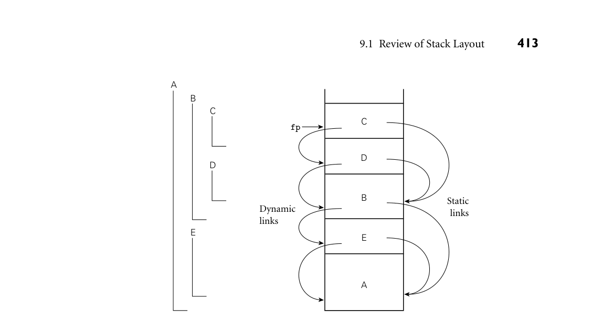

# 9.1 Review of Stack Layout

the ARM instruction set and the gcc compiler for 32- and 64-bit x86. We also discuss the register window mechanism of the SPARC instruction set. In Section 9.3 we look more closely at subroutine parameters. We consider parameter-passing modes, which determine the operations that a subroutine can apply to its formal parameters and the effects of those operations on the corre- sponding actual parameters. We also consider named and default parameters, variable numbers of arguments, and function return mechanisms. In Section 9.4, we consider the handling of exceptional conditions. While ex- ceptions can sometimes be confined to the current subroutine, in the general case they require a mechanism to “pop out of” a nested context without returning, so that recovery can occur in the calling context. In Section 9.5, we consider corou- tines, which allow a program to maintain two or more execution contexts, and to switch back and forth among them. Coroutines can be used to implement iter- ators (Section 6.5.3), but they have other uses as well, particularly in simulation and in server programs. In Chapter 13 we will use them as the basis for concur- rent (“quasiparallel”) threads. Finally, in Section 9.6 we consider asynchronous events—things that happen outside a program, but to which it needs to respond. 9.1 Review of Stack Layout

In Section 3.2.2 we discussed the allocation of space on a subroutine call stack EXAMPLE 9.1

Layout of run-time stack (reprise) (Figure 3.1). Each routine, as it is called, is given a new stack frame, or activation record, at the top of the stack. This frame may contain arguments and/or return values, bookkeeping information (including the return address and saved regis- ters), local variables, and/or temporaries. When a subroutine returns, its frame is popped from the stack. ■ At any given time, the stack pointer register contains the address of either the last used location at the top of the stack or the first unused location, depending on convention. The frame pointer register contains an address within the frame. Objects in the frame are accessed via displacement addressing with respect to the frame pointer. If the size of an object (e.g., a local array) is not known at compile EXAMPLE 9.2

Offsets from frame pointer time, then the object is placed in a variable-size area at the top of the frame; its address and dope vector (descriptor) are stored in the fixed-size portion of the frame, at a statically known offset from the frame pointer (Figure 8.7). If there are no variable-size objects, then every object within the frame has a statically known offset from the stack pointer, and the implementation may dispense with the frame pointer, freeing up a register for other use. If the size of an argument is not known at compile time, then the argument may be placed in a variable-size portion of the frame below the other arguments, with its address and dope vector at known offsets from the frame pointer. Alternatively, the caller may simply pass a temporary address and dope vector, counting on the called routine to copy the argument into the variable-size area at the top of the frame. ■ In a language with nested subroutines and static scoping (e.g., Ada, Common EXAMPLE 9.3

*Figure 9.1 Example of subroutine nesting, taken from Figure 3.5. Within B, C, and D, all five routines are visible. Within A and E, routines A, B, and E are visible, but C and D are not. Given the calling sequence A, E, B, D, C, in that order, frames will be allocated on the stack as shown at right, with the indicated static and dynamic links.*

that are thus neither local nor global, can be found by maintaining a static chain (Figure 9.1). Each stack frame contains a reference to the frame of the lexically surrounding subroutine. This reference is called the static link. By analogy, the saved value of the frame pointer, which will be restored on subroutine return, is called the dynamic link. The static and dynamic links may or may not be the same, depending on whether the current routine was called by its lexically surrounding routine, or by some other routine nested in that surrounding routine. ■ Whether or not a subroutine is called directly by the lexically surrounding rou- tine, we can be sure that the surrounding routine is active; there is no other way that the current routine could have been visible, allowing it to be called. Consider, EXAMPLE 9.4

Visibility of nested routines for example, the subroutine nesting shown in Figure 9.1. If subroutine D is called directly from B, then clearly B’s frame will already be on the stack. How else could D be called? It is not visible in A or E, because it is nested inside of B. A moment’s thought makes clear that it is only when control enters B (placing B’s frame on the stack) that D comes into view. It can therefore be called by C, or by any other routine (not shown) that is nested inside C or D, but only because these are also within B. ■

