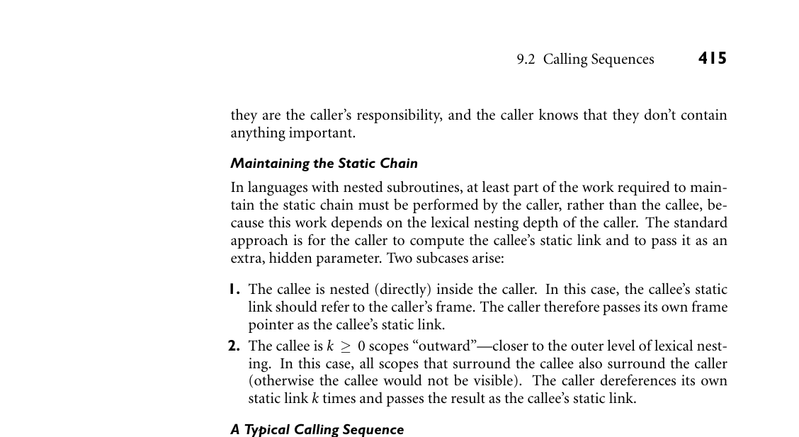
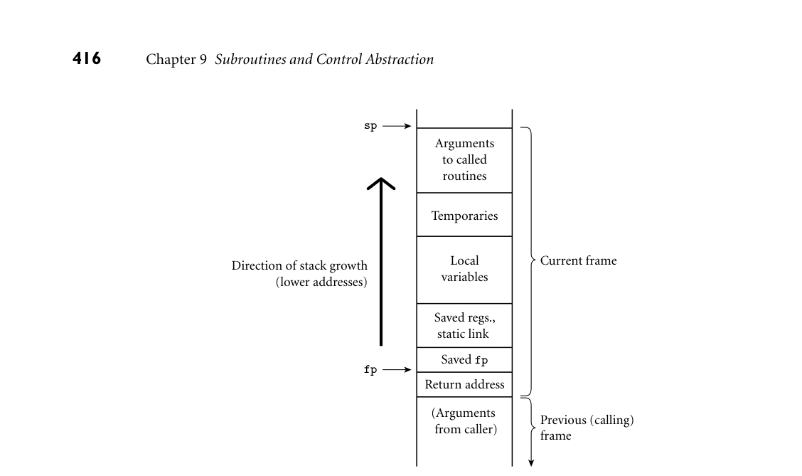

# 9.2 Calling Sequences

414 Chapter 9 Subroutines and Control Abstraction

9.2 Calling Sequences

Maintenance of the subroutine call stack is the responsibility of the calling se- quence—the code executed by the caller immediately before and after a subroutine call—and of the prologue (code executed at the beginning) and epilogue (code exe- cuted at the end) of the subroutine itself. Sometimes the term “calling sequence” is used to refer to the combined operations of the caller, the prologue, and the epilogue. Tasks that must be accomplished on the way into a subroutine include passing parameters, saving the return address, changing the program counter, changing the stack pointer to allocate space, saving registers (including the frame pointer) that contain values that may be overwritten by the callee but are still live (poten- tially needed) in the caller, changing the frame pointer to refer to the new frame, and executing initialization code for any objects in the new frame that require it. Tasks that must be accomplished on the way out include passing return param- eters or function values, executing finalization code for any local objects that re- quire it, deallocating the stack frame (restoring the stack pointer), restoring other saved registers (including the frame pointer), and restoring the program counter. Some of these tasks (e.g., passing parameters) must be performed by the caller, because they differ from call to call. Most of the tasks, however, can be performed either by the caller or the callee. In general, we will save space if the callee does as much work as possible: tasks performed in the callee appear only once in the target program, but tasks performed in the caller appear at every call site, and the typical subroutine is called in more than one place.

Saving and Restoring Registers

Perhaps the trickiest division-of-labor issue pertains to saving registers. The ideal approach (see Section C 5.5.2) is to save precisely those registers that are both live in the caller and needed for other purposes in the callee. Because of separate compilation, however, it is difficult (though not impossible) to determine this intersecting set. A simpler solution is for the caller to save all registers that are in use, or for the callee to save all registers that it will overwrite. Calling sequence conventions for many processors, including the ARM and x86 described in the case studies of Section C 9.2.2, strike something of a com- promise: registers not reserved for special purposes are divided into two sets of approximately equal size. One set is the caller’s responsibility, the other is the callee’s responsibility. A callee can assume that there is nothing of value in any of the registers in the caller-saves set; a caller can assume that no callee will destroy the contents of any registers in the callee-saves set. In the interests of code size, the compiler uses the callee-saves registers for local variables and other long-lived values whenever possible. It uses the caller-saves set for transient values, which are less likely to be needed across calls. The result of these conventions is that the caller-saves registers are seldom saved by either party: the callee knows that

*Figure 9.2 shows one plausible layout for a stack frame, consistent with Figure 3.1. EXAMPLE 9.5*

A typical calling sequence The stack pointer (sp) points to the first unused location on the stack (or the last used location, depending on the compiler and machine). The frame pointer (fp) points to a location near the bottom of the frame. Space for all arguments is reserved in the stack, even if the compiler passes some of them in registers (the callee will need a standard place to save them if it ever calls a nested routine that may try to reach a lexically surrounding parameter via the static chain). To maintain this stack layout, the calling sequence might operate as follows. The caller

1. saves any caller-saves registers whose values may be needed after the call 2. computes the values of arguments and moves them into the stack or registers 3. computes the static link (if this is a language with nested subroutines), and passes it as an extra, hidden argument 4. uses a special subroutine call instruction to jump to the subroutine, simulta- neously passing the return address on the stack or in a register

In its prologue, the callee

1. allocates a frame by subtracting an appropriate constant from the sp 2. saves the old frame pointer into the stack, and updates it to point to the newly allocated frame 3. saves any callee-saves registers that may be overwritten by the current routine (including the static link and return address, if they were passed in registers)

After the subroutine has completed, the epilogue

*Figure 9.2 A typical stack frame. Though we draw it growing upward on the page, the stack actually grows downward toward lower addresses on most machines. Arguments are accessed at positive offsets from the fp. Local variables and temporaries are accessed at negative offsets from the fp. Arguments to be passed to called routines are assembled at the top of the frame, using positive offsets from the sp.*

1. moves the return value (if any) into a register or a reserved location in the stack 2. restores callee-saves registers if needed 3. restores the fp and the sp 4. jumps back to the return address

Finally, the caller

1. moves the return value to wherever it is needed 2. restores caller-saves registers if needed ■

Special-Case Optimizations

Many parts of the calling sequence, prologue, and epilogue can be omitted in common cases. If the hardware passes the return address in a register, then a leaf routine (a subroutine that makes no additional calls before returning)2 can simply

2 A leaf routine is so named because it is a leaf of the subroutine call graph, a data structure men- tioned in Exercise 3.10.

9.2 Calling Sequences 417

leave it there; it does not need to save it in the stack. Likewise it need not save the static link or any caller-saves registers. A subroutine with no local variables and nothing to save or restore may not even need a stack frame on a RISC machine. The simplest subroutines (e.g., li- brary routines to compute the standard mathematical functions) may not touch memory at all, except to fetch instructions: they may take their arguments in registers, compute entirely in (caller-saves) registers, call no other routines, and return their results in registers. As a result they may be extremely fast.

9.2.1 Displays

One disadvantage of static chains is that access to an object in a scope k levels out requires that the static chain be dereferenced k times. If a local object can be loaded into a register with a single (displacement mode) memory access, an object k levels out will require k + 1 memory accesses. This number can be reduced to a constant by use of a display.

IN MORE DEPTH

As described on the companion site, a display is a small array that replaces the static chain. The jth element of the display contains a reference to the frame of the most recently active subroutine at lexical nesting level j. If the currently active routine is nested i > 3 levels deep, then elements i −1, i −2, and i −3 of the display contain the values that would have been the first three links of the static chain. An object k levels out can be found at a statically known offset from the address stored in element j = i −k of the display. For most programs the cost of maintaining a display in the subroutine calling sequence tends to be slightly higher than that of maintaining a static chain. At the same time, the cost of dereferencing the static chain has been reduced by modern compilers, which tend to do a good job of caching the links in registers when ap- propriate. These observations, combined with the trend toward languages (those descended from C in particular) in which subroutines do not nest, have made displays less common today than they were in the 1970s.

9.2.2 Stack Case Studies: LLVM on ARM; gcc on x86

Calling sequences differ significantly from machine to machine and even com- piler to compiler, though hardware vendors typically publish suggested conven- tions for their respective architectures, to promote interoperability among pro- gram components produced by different compilers. Many of the most signifi- cant differences reflect an evolution over time toward heavier use of registers and lighter use of memory. This evolution reflects at least three important technolog- ical trends: the increasing size of register sets, the increasing gap in speed between

418 Chapter 9 Subroutines and Control Abstraction

registers and memory (even L1 cache), and the increasing ability of both compil- ers and processors to improve performance by reordering instructions—at least when operands are all in registers. Older compilers, particularly for machines with a small number of registers, tend to pass arguments on the stack; newer compilers, particularly for machines with larger register sets, tend to pass arguments in registers. Older architectures tend to provide a subroutine call instruction that pushes the return address onto the stack; newer architectures tend to put the return address in a register. Many machines provide special instructions of use in the subroutine-call se- quence. On the x86, for example, enter and leave instructions allocate and deallocate stack frames, via simultaneous update of the frame pointer and stack pointer. On the ARM, stm (store multiple) and ldm (load multiple) instructions save and restore arbitrary groups of registers; in one common idiom, the saved set includes the return address (“link register”); when the restored set includes the program counter (in the same position), ldm can pop a set of registers and return from the subroutine in a single instruction. There has also been a trend—though a less consistent one—away from the use of a dedicated frame pointer register. In older compilers, for older machines, it was common to use push and pop instructions to pass stack-based arguments. The resulting instability in the value of the sp made it difficult (though not im- possible) to use that register as the base for access to local variables. A separate frame pointer simplified both code generation and symbolic debugging. At the same time, it introduced additional instructions into the subroutine calling se- quence, and reduced by one the number of registers available for other purposes. Modern compiler writers are increasingly willing to trade complexity for perfor- mance, and often dispense with the frame pointer, at least in simple routines.

IN MORE DEPTH

On the companion site we look in some detail at the stack layout conventions and calling sequences of a representative pair of compilers: the LLVM compiler for the 32-bit ARMv7 architecture, and the gcc compiler for the 32- and 64-bit x86. LLVM is a middle/back end combination originally developed at the University of Illinois and now used extensively in both academia and industry. Among other things, it forms the backbone of the standard tool chains for both iPhone (iOS) and Android devices. The GNU compiler collection, gcc, is a cornerstone of the open source movement, used across a huge variety of laptops, desktops, and servers. Both LLVM and gcc have back ends for many target architectures, and front ends for many programming languages. We focus on their support for C, whose conventions are in some sense a “lowest common denominator” for other languages.

9.2 Calling Sequences 419

9.2.3 Register Windows

As an alternative to saving and restoring registers on subroutine calls and returns, the original Berkeley RISC machines [PD80, Pat85] introduced a hardware mech- anism known as register windows. The basic idea is to map the ISA’s limited set of register names onto some subset (window) of a much larger collection of physical registers, and to change the mapping when making subroutine calls. Old and new mappings overlap a bit, allowing arguments to be passed (and function results re- turned) in the intersection.

IN MORE DEPTH

We consider register windows in more detail on the companion site. They have appeared in several commercial processors, most notably the Sun SPARC and the Intel IA-64 (Itanium).

9.2.4 In-Line Expansion

As an alternative to stack-based calling conventions, many language implemen- tations allow certain subroutines to be expanded in-line at the point of call. A copy of the “called” routine becomes a part of the “caller”; no actual subroutine call occurs. In-line expansion avoids a variety of overheads, including space al- location, branch delays from the call and return, maintaining the static chain or display, and (often) saving and restoring registers. It also allows the compiler to perform code improvements such as global register allocation, instruction sche- duling, and common subexpression elimination across the boundaries between subroutines—something that most compilers can’t do otherwise. In many implementations, the compiler chooses which subroutines to expand in-line and which to compile conventionally. In some languages, the program- mer can suggest that particular routines be in-lined. In C and C++, the keyword EXAMPLE 9.6

Requesting an inline subroutine inline can be prefixed to a function declaration:

inline int max(int a, int b) {return a > b ? a : b;}

In Ada, the programmer can request in-line expansion with a significant comment, or pragma:

function max(a, b : integer) return integer is begin if a > b then return a; else return b; end if; end max; pragma inline(max);

420 Chapter 9 Subroutines and Control Abstraction

Like the inline of C and C++, this pragma is a hint; the compiler is permitted to ignore it. ■ In Section 3.7 we noted the similarity between in-line expansion and macros, but argued that the former is semantically preferable. In fact, in-line expansion is semantically neutral: it is purely an implementation technique, with no effect on the meaning of the program. In comparison to real subroutine calls, in-line expansion has the obvious disadvantage of increasing code size, since the entire body of the subroutine appears at every call site. In-line expansion is also not an option in the general case for recursive subroutines. For the occasional case in EXAMPLE 9.7

In-lining and recursion which a recursive call is possible but unlikely, it may be desirable to generate a true recursive subroutine, but to expand one level of that routine in-line at each call site. As a simple example, consider a binary tree whose leaves contain character strings. A routine to return the fringe of this tree (the left-to-right concatenation of the values in its leaves) might look like this in C++:

string fringe(bin_tree *t) { // assume both children are nil or neither is if (t->left == 0) return t->val; return fringe(t->left) + fringe(t->right); }

A compiler can expand this code in-line if it makes each nested invocation a true subroutine call. Since half the nodes in a binary tree are leaves, this expansion will eliminate half the dynamic calls at run time. If we expand not only the root

DESIGN & IMPLEMENTATION

9.1 Hints and directives The inline keyword in C and C++ suggests but does not require that the compiler expand the subroutine in-line. A conventional implementation may be used when inline has been specified—or an in-line implementation when inline has not been specified—if the compiler has reason to believe that this will result in better code. (In both languages, the inline keyword also has an impact on the rules regarding separate compilation. In particular, to facilitate their inclusion in header files, inline functions are allowed to have multiple definitions. C++ says all the definitions must be the same; in C, the choice among them is explicitly unspecified.) In effect, the inclusion of hints like inline in a programming language represents an acknowledgment that advice from the expert programmer may sometimes be useful with current compiler technology, but that this may change in the future. By contrast, the use of pointer arithmetic in place of array subscripts, as discussed in Sidebar 8.8, is more of a directive than a hint, and may complicate the generation of high-quality code from legacy programs.

9.2 Calling Sequences 421

calls but also (one level of) the two calls within the true subroutine version, only a quarter of the original dynamic calls will remain. ■

3CHECK YOUR UNDERSTANDING 1. What is a subroutine calling sequence? What does it do? What is meant by the subroutine prologue and epilogue? 2. How do calling sequences typically differ in older (CISC) and newer (RISC) instruction sets? 3. Describe how to maintain the static chain during a subroutine call.

4. What is a display? How does it differ from a static chain? 5. What are the purposes of the stack pointer and frame pointer registers? Why does a subroutine often need both? 6. Why do modern machines typically pass subroutine parameters in registers rather than on the stack? 7. Why do subroutine calling conventions often give the caller responsibility for saving half the registers and the callee responsibility for saving the other half? 8. If work can be done in either the caller or the callee, why do we typically prefer to do it in the callee? 9. Why do compilers typically allocate space for arguments in the stack, even when they pass them in registers? 10. List the optimizations that can be made to the subroutine calling sequence in important special cases (e.g., leaf routines). 11. How does an in-line subroutine differ from a macro?

12. Under what circumstances is it desirable to expand a subroutine in-line?

DESIGN & IMPLEMENTATION

9.2 In-lining and modularity Probably the most important argument for in-line expansion is that it allows programmers to adopt a very modular programming style, with lots of tiny subroutines, without sacrificing performance. This modular programming style is essential for object-oriented languages, as we shall see in Chapter 10. The benefit of in-lining is undermined to some degree by the fact that chang- ing the definition of an in-lined function forces the recompilation of every user of the function; changing the definition of an ordinary function (without changing its interface) forces relinking only. The best of both worlds may be achieved in systems with just-in-time compilation (Section 16.2.1).

