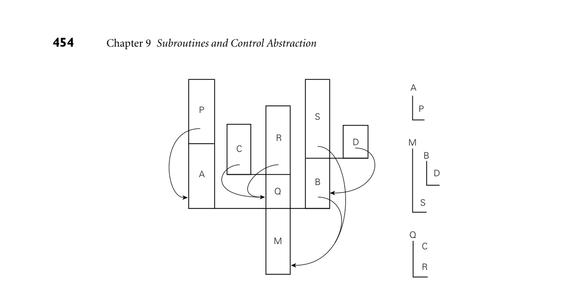

# 9.5 Coroutines

450 Chapter 9 Subroutines and Control Abstraction

been written through to memory will be visible in the handler, but changes that were cached in registers will be lost. To address this limitation, C allows the pro- grammer to specify that certain variables are volatile. A volatile variable is one whose value in memory can change “spontaneously,” for example as the result of activity by an I/O device or a concurrent thread of control. C implementations are required to store volatile variables to memory whenever they are written, and to load them from memory whenever they are read. If a handler needs to see changes to a variable that may be modified by the protected code, then the pro- grammer must include the volatile keyword in the variable’s declaration.

3CHECK YOUR UNDERSTANDING 26. Describe three ways in which a language may allow programmers to declare exceptions.

27. Explain why it is useful to define exceptions as classes in C++, Java, and C#. 28. Explain the behavior and purpose of a try... finally construct.

29. Describe the algorithm used to identify an appropriate handler when an ex- ception is raised in a language like Ada or C++.

30. Explain how to implement exceptions in a way that incurs no cost in the com- mon case (when exceptions don’t arise).

31. How do the exception handlers of a functional language like ML differ from those of an imperative language like C++?

32. Describe the operations that must be performed by the implicit handler for a subroutine.

33. Summarize the shortcomings of the setjmp and longjmp library routines of C.

34. What is a volatile variable in C? Under what circumstances is it useful?

9.5 Coroutines

Given an understanding of the layout of the run-time stack, we can now consider the implementation of more general control abstractions—coroutines in particu- lar. Like a continuation, a coroutine is represented by a closure (a code address and a referencing environment), into which we can jump by means of a nonlocal goto, in this case a special operation known as transfer. The principal differ- ence between the two abstractions is that a continuation is a constant—it does not change once created—while a coroutine changes every time it runs. When we goto a continuation, our old program counter is lost, unless we explicitly create a new continuation to hold it. When we transfer from one coroutine to another,

9.5 Coroutines 451

our old program counter is saved: the coroutine we are leaving is updated to re- flect it. Thus, if we perform a goto into the same continuation multiple times, each jump will start at precisely the same location, but if we perform a transfer into the same coroutine multiple times, each jump will take up where the previous one left off. In effect, coroutines are execution contexts that exist concurrently, but that ex- ecute one at a time, and that transfer control to each other explicitly, by name. Coroutines can be used to implement iterators (Section 6.5.3) and threads (to be discussed in Chapter 13). They are also useful in their own right, particularly for certain kinds of servers, and for discrete event simulation. Threads have ap- peared, historically, as far back as Algol 68. Today they can be found in Ada, Java, C#, C++, Python, Ruby, Haskell, Go, and Scala, among many others. They are also commonly provided (though with somewhat less attractive syntax and se- mantics) outside the language proper by means of library packages. Coroutines are less common as a user-level programming abstraction. Historically, the two most important languages to provide them were Simula and Modula-2. We fo- cus in the following subsections on the implementation of coroutines and (on the companion site) on their use in iterators (Section C 9.5.3) and discrete event simulation (Section C 9.5.4). As a simple example of an application in which coroutines might be useful, EXAMPLE 9.46

Explicit interleaving of concurrent computations imagine that we are writing a “screen saver” program, which paints a mostly black picture on the screen of an inactive laptop, and which keeps the picture moving, to avoid liquid-crystal “burn-in.” Imagine also that our screen saver performs “sanity checks” on the file system in the background, looking for corrupted files. We could write our program as follows:

loop –– update picture on screen –– perform next sanity check

The problem with this approach is that successive sanity checks (and to a lesser extent successive screen updates) are likely to depend on each other. On most systems, the file-system checking code has a deeply nested control structure con- taining many loops. To break it into pieces that can be interleaved with the screen updates, the programmer must follow each check with code that saves the state of the nested computation, and must precede the following check with code that restores that state. ■ A much more attractive approach is to cast the operations as coroutines:5 EXAMPLE 9.47

Interleaving coroutines

5 Threads could also be used in this example, and might in fact serve our needs a bit better. Corou- tines suffice because there is a small number of execution contexts (namely two), and because it is easy to identify points at which one should transfer to the other.

452 Chapter 9 Subroutines and Control Abstraction

us, cfs : coroutine

coroutine update screen() –– initialize detach loop . . . transfer(cfs) . . .

coroutine check file system() –– initialize detach for all files . . . transfer(us) . . . transfer(us) . . . transfer(us) . . .

begin –– main us := new update screen() cfs := new check file system() transfer(us)

The syntax here is based loosely on that of Simula. When first created, a coroutine performs any necessary initialization operations, and then detaches itself from the main program. The detach operation creates a coroutine object to which control can later be transfered, and returns a reference to this coroutine to the caller. The transfer operation saves the current program counter in the current coroutine object and resumes the coroutine specified as a parameter. The main body of the program plays the role of an initial, default coroutine. Calls to transfer from within the body of check file system can occur at ar- bitrary places, including nested loops and conditionals. A coroutine can also call subroutines, just as the main program can, and calls to transfer may appear inside these routines. The context needed to perform the “next” sanity check is captured by the program counter, together with the local variables of check file system and any called routines, at the time of the transfer. As in Example 9.46, the programmer must specify when to stop checking the file system and update the screen; coroutines make the job simpler by providing a transfer operation that eliminates the need to save and restore state explicitly. To decide where to place the calls to transfer, we must consider both performance and correctness. For performance, we must avoid doing too much work between calls, so that screen updates aren’t too infrequent. For correctness, we must avoid doing a transfer in the middle of any check that might be compromised by file access in update screen. Parallel threads (to be described in Chapter 13) would

DESIGN & IMPLEMENTATION

9.6 Threads and coroutines As we shall see in Section 13.2.4, it is easy to build a simple thread package given coroutines. Most programmers would agree, however, that threads are substantially easier to use, because they eliminate the need for explicit transfer operations. This contrast—a lot of extra functionality for a little extra imple- mentation complexity—probably explains why coroutines as an explicit pro- gramming abstraction are relatively rare.

9.5 Coroutines 453

eliminate the first of these problems by ensuring that the screen updater receives a share of the processor on a regular basis, but would complicate the second prob- lem: we should need to synchronize the two routines explicitly if their references to files could interfere. ■

9.5.1 Stack Allocation

Because they are concurrent (i.e., simultaneously started but not completed), coroutines cannot share a single stack: their subroutine calls and returns, taken as a whole, do not occur in last-in-first-out order. If each coroutine is declared at the outermost level of lexical nesting (as was required in Modula-2), then their stacks are entirely disjoint: the only objects they share are global, and thus statically allo- cated. Most operating systems make it easy to allocate one stack, and to increase its portion of the virtual address space as necessary during execution. It is not as easy to allocate an arbitrary number of such stacks; space for coroutines was historically something of an implementation challenge, at least on machines with limited virtual address space (64-bit architectures ease the problem, by making virtual addresses relatively plentiful). The simplest approach is to give each coroutine a fixed amount of statically allocated stack space. This approach was adopted in Modula-2, which required the programmer to specify the size and location of the stack when initializing a coroutine. It was a run-time error for the coroutine to need additional space. Some Modula-2 implementations would catch the overflow and halt with an er- ror message; others would display abnormal behavior. If the coroutine used less (virtual) space than it was given, the excess was simply wasted. If stack frames are allocated from the heap, as they are in most functional lan- guage implementations, then the problems of overflow and internal fragmenta- tion are avoided. At the same time, the overhead of each subroutine call increases. An intermediate option is to allocate the stack in large, fixed-size “chunks.” At each call, the subroutine calling sequence checks to see whether there is sufficient space in the current chunk to hold the frame of the called routine. If not, another chunk is allocated and the frame is put there instead. At each subroutine return, the epilogue code checks to see whether the current frame is the last one in its chunk. If so, the chunk is returned to a “free chunk” pool. To reduce the over- head of calls, the compiler can use the ordinary central stack if it is able to verify that a subroutine will not perform a transfer before returning [Sco91].

DESIGN & IMPLEMENTATION

9.7 Coroutine stacks Many languages require coroutines or threads to be declared at the outermost level of lexical nesting, to avoid the complexity of noncontiguous stacks. Most thread libraries for sequential languages (the POSIX standard pthread library among them) likewise require or at least permit the use of contiguous stacks.

*Figure 9.4 A cactus stack. Each branch to the side represents the creation of a coroutine (A, B, C, and D). The static nesting of blocks is shown at right. Static links are shown with arrows. Dynamic links are indicated simply by vertical arrangement: each routine has called the one above it. (Coroutine B, for example, was created by the main program, M. B in turn called subroutine S and created coroutine D.)*

If coroutines can be created at arbitrary levels of lexical nesting (as they could EXAMPLE 9.48

Cactus stacks in Simula), then two or more coroutines may be declared in the same nonglobal scope, and must thus share access to objects in that scope. To implement this sharing, the run-time system must employ a so-called cactus stack (named for its resemblance to the Saguaro cacti of the American Southwest; see Figure 9.4). Each branch off the stack contains the frames of a separate coroutine. The dy- namic chain of a given coroutine ends in the block in which the coroutine began execution. The static chain of the coroutine, however, extends down into the re- mainder of the cactus, through any lexically surrounding blocks. In addition to the coroutines of Simula, cactus stacks are needed for the threads of any language with lexically nested threads. “Returning” from the main block of a coroutine must generally terminate the program, as there is no indication of what routine to transfer to. Because a coroutine only runs when specified as the target of a transfer, there is never any need to terminate it explicitly. When a given corou- tine is no longer needed, the programmer can simply reuse its stack space or, in a language with garbage collection, allow the collector to reclaim it automati- cally. ■

9.5.2 Transfer

To transfer from one coroutine to another, the run-time system must change the program counter (PC), the stack, and the contents of the processor’s registers. These changes are encapsulated in the transfer operation: one coroutine calls

9.5 Coroutines 455

transfer; a different one returns. Because the change happens inside transfer, changing the PC from one coroutine to another simply amounts to remembering the right return address: the old coroutine calls transfer from one location in the program; the new coroutine returns to a potentially different location. If transfer saves its return address in the stack, then the PC will change automatically as a side effect of changing stacks. So how do we change stacks? The usual approach is simply to change the stack pointer register, and to avoid using the frame pointer inside of transfer itself. At EXAMPLE 9.49

Switching coroutines the beginning of transfer we push all the callee-saves registers onto the current stack, along with the return address (if it wasn’t already pushed by the subroutine call instruction). We then change the sp, pop the (new) return address (ra) and other registers off the new stack, and return:

transfer: push all registers other than sp (including ra) *current coroutine := sp current coroutine := r1 –– argument passed to transfer sp := *r1 pop all registers other than sp (including ra) return ■

The data structure that represents a coroutine or thread is called a context block. In a simple coroutine package, the context block contains a single value: the coroutine’s sp as of its most recent transfer. (A thread package generally places additional information in the context block, such as an indication of priority, or pointers to link the thread onto various scheduling queues. Some coroutine or thread packages choose to save registers in the context block, rather than at the top of the stack; either approach works fine.) In Modula-2, the coroutine creation routine would initialize the coroutine’s stack to look like the frame of transfer, with a return address and register contents initialized to permit a “return” into the beginning of the coroutine’s code. The creation routine would set the sp value in the context block to point into this artificial frame, and return a pointer to the context block. To begin execution of the coroutine, some existing routine would need to transfer to it. In Simula (and in the code in Example 9.47), the coroutine creation routine would begin to execute the new coroutine immediately, as if it were a subroutine. After the coroutine completed any application-specific initialization, it would perform a detach operation. Detach would set up the coroutine stack to look like the frame of transfer, with a return address that pointed to the following statement. It would then allow the creation routine to return to its own caller. In all cases, transfer expects a pointer to a context block as argument; by deref- erencing the pointer it can find the sp of the next coroutine to run. A global (static) variable, called current coroutine in the code of Example 9.49, contains a pointer to the context block of the currently running coroutine. This pointer allows transfer to find the location in which it should save the old sp.

