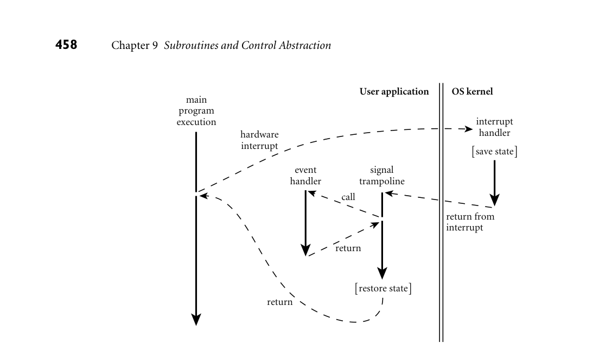

# 9.6 Events

456 Chapter 9 Subroutines and Control Abstraction

9.5.3 Implementation of Iterators

Given an implementation of coroutines, iterators are almost trivial: one coroutine is used to represent the main program; a second is used to represent the iterator. Additional coroutines may be needed if iterators nest.

IN MORE DEPTH

Additional details appear on the companion site. As it turns out, coroutines are overkill for iterator implementation. Most compilers use one of two simpler alter- natives. The first of these keeps all state in a single stack, but sometimes executes in a frame other than the topmost. The second employs a compile-time code transformation to replace true iterators, transparently, with equivalent iterator objects.

9.5.4 Discrete Event Simulation

One of the most important applications of coroutines (and the one for which Simula was designed and named) is discrete event simulation. Simulation in gen- eral refers to any process in which we create an abstract model of some real-world system, and then experiment with the model in order to infer properties of the real-world system. Simulation is desirable when experimentation with the real world would be complicated, dangerous, expensive, or otherwise impractical. A discrete event simulation is one in which the model is naturally expressed in terms of events (typically interactions among various interesting objects) that happen at specific times. Discrete event simulation is usually not appropriate for contin- uous processes, such as the growth of crystals or the flow of water over a surface, unless these processes are captured at the level of individual particles.

IN MORE DEPTH

On the companion site we consider a traffic simulation, in which events model interactions among automobiles, intersections, and traffic lights. We use a sep- arate coroutine for each trip to be taken by car. At any given time we run the coroutine with the earliest expected arrival time at an upcoming intersection. We keep inactive coroutines in a priority queue ordered by those arrival times.

9.6 Events

An event is something to which a running program (a process) needs to respond, but which occurs outside the program, at an unpredictable time. Events are com- monly caused by inputs to a graphical user interface (GUI) system: keystrokes,

9.6 Events 457

mouse motions, button clicks. They may also be network operations or other asynchronous I/O activity: the arrival of a message, the completion of a previ- ously requested disk operation. In the I/O operations discussed in Section C 8.7, and in Section C 8.7.3 in par- ticular, we assumed that a program looking for input will request it explicitly, and will wait if it isn’t yet available. This sort of synchronous (at a specified time) and blocking (potentially wait-inducing) input is generally not acceptable for modern applications with graphical interfaces. Instead, the programmer usually wants a handler—a special subroutine—to be invoked when a given event occurs. Han- dlers are sometimes known as callback functions, because the run-time system calls back into the main program instead of being called from it. In an object- oriented language, the callback function may be a method of some handler object, rather than a static subroutine.

9.6.1 Sequential Handlers

Traditionally, event handlers were implemented in sequential programming lan- guages as “spontaneous” subroutine calls, typically using a mechanism defined and implemented by the operating system, outside the language proper. To pre- pare to receive events through this mechanism, a program—call it P—invokes a setup handler library routine, passing as argument the subroutine it wants to have invoked when the event occurs. At the hardware level, asynchronous device activity during P’s execution will trigger an interrupt mechanism that saves P’s registers, switches to a different stack, and jumps to a predefined address in the OS kernel. Similarly, if some other process Q is running when the interrupt occurs (or if some action in Q it- self needs to be reflected to P as an event), the kernel will have saved P’s state at the end of its last time slice. Either way, the kernel must arrange to invoke the appropriate event handler despite the fact that P may be at a place in its code where a subroutine call cannot normally occur (e.g., it may be halfway through the calling sequence for some other subroutine). Figure 9.5 illustrates the typical implementation of spontaneous subroutine EXAMPLE 9.50

Signal trampoline calls—as used, for example, by the Unix signal mechanism. The language run- time library contains a block of code known as the signal trampoline. It also in- cludes a buffer writable by the kernel and readable by the runtime. Before de- livering a signal, the kernel places the saved state of P into the shared buffer. It then switches back to P’s user-level stack and jumps into the signal trampoline. The trampoline creates a frame for itself in the stack and then calls the event handler using the normal subroutine calling sequence. (The correctness of this mechanism depends on there being nothing important in the stack beyond the location specified by the stack pointer register at the time of the interrupt.) When the event handler returns, the trampoline restores state (including all registers) from the buffer written by the kernel, and jumps back into the main program. To avoid recursive events, the kernel typically disables further signals when it jumps

*Figure 9.5 Signal delivery through a trampoline. When an interrupt occurs (or when another process performs an operation that should appear as an event), the main program may be at an arbitrary place in its code. The kernel saves state and invokes a trampoline routine that in turn calls the event handler through the normal calling sequence. After the event handler returns, the trampoline restores the saved state and returns to where the main program left off.*

458 Chapter 9 Subroutines and Control Abstraction

User application

OS kernel

main program execution

interrupt handler

hardware interrupt

[save state]

event handler signal trampoline

call

return from interrupt

return

[restore state]

return

to the signal trampoline. Immediately before jumping back to the original pro- gram code, the trampoline performs a kernel call to reenable signals. Depending on the details of the operating system, the kernel may buffer some modest num- ber of signals while they are disabled, and deliver them once the handler reenables them. ■ In practice, most event handlers need to share data structures with the main program (otherwise, how would they get the program to do anything interesting in response to the event?). We must take care to make sure neither the handler nor the main program ever sees these shared structures in an inconsistent state. Specifically, we must prevent a handler from looking at data when the main pro- gram is halfway through modifying it, or modifying data when the main program is halfway through reading it. The typical solution is to synchronize access to such shared structures by bracketing blocks of code in the main program with kernel calls that disable and reenable signals. We will use a similar mechanism to im- plement threads on top of coroutines in Section 13.2.4. More general forms of synchronization will appear in Section 13.3.

9.6 Events 459

9.6.2 Thread-Based Handlers

In modern programming languages and run-time systems, events are often han- dled by a separate thread of control, rather than by spontaneous subroutine calls. With a separate handler thread, input can again be synchronous: the handler thread makes a system call to request the next event, and waits for it to occur. Meanwhile, the main program continues to execute. If the program wishes to be able to handle multiple events concurrently, it may create multiple handler threads, each of which calls into the kernel to wait for an event. To protect the integrity of shared data structures, the main program and the handler thread(s) will generally require a full-fledged synchronization mechanism, as discussed in Section 13.3: disabling signals will not suffice. Many contemporary GUI systems are thread-based, though some have just one handler thread. Examples include the OpenGL Utility Toolkit (GLUT), the GNU Image Manipulation Program (GIMP) Tool Kit (Gtk), the JavaFX library, and the .NET Windows Presentation Foundation (WPF). In C#, an event handler is an in- EXAMPLE 9.51

An event handler in C# stance of a delegate type—essentially, a list of subroutine closures (Section 3.6.3). Using Gtk#, the standard GUI for the Mono project, we might create and initialize a button as follows:

void Paused(object sender, EventArgs a) { // do whatever needs doing when the pause button is pushed } ... Button pauseButton = new Button("pause"); pauseButton.Clicked += new EventHandler(Paused);

Button and EventHandler are defined in the Gtk# library. Button is a class that represents the graphical widget. EventHandler is a delegate type, with which Paused is compatible. Its first argument indicates the object that caused the event; its second argument describes the event itself. Button.Clicked is the button’s event handler: a field of EventHandler type. The += operator adds a new closure to the delegate’s list.6 The graphics library arranges for a thread to call into the kernel to wait for user interface events. When our button is pushed, the call will return from the kernel, and the thread will invoke each of the entries on the delegate list. ■ As described in Section 3.6.3, C# allows the handler to be specified more suc- EXAMPLE 9.52

An anonymous delegate handler cinctly as an anonymous delegate:

pauseButton.Clicked += delegate(object sender, EventArgs a) { // do whatever needs doing }; ■

6 Technically, Clicked is of event EventHandler type. The event modifier makes the delegate private, so it can be invoked only from within the class in which it was declared. At the same time, it creates a public property, with add and remove accessor methods. These allow code outside the class to add handlers to the event (with +=) and remove them from it (with -=).

460 Chapter 9 Subroutines and Control Abstraction

Other languages and systems are similar. In JavaFX, an event handler is typ- EXAMPLE 9.53

An event handler in Java ically an instance of a class that implements the EventHandler<ActionEvent> interface, with a method named handle:

class PauseListener implements EventHandler<ActionEvent> { public void handle(ActionEvent e) { // do whatever needs doing } } ... Button pauseButton = new Button(); pauseButton.setText("pause"); pauseButton.setOnAction(new PauseListener()); ■

Written in this form, the syntax is more cumbersome than it was in C#. We EXAMPLE 9.54

An anonymous inner class handler can simplify it some using an anonymous inner class:

pauseButton.setOnAction(new EventHandler<ActionEvent>() { public void handle(ActionEvent e) { // do whatever needs doing } });

Here the definition of our PauseListener class is embedded, without the name, in a call to new, which is in turn embedded in the argument list of setOnAction. Like an anonymous delegate in C#, an anonymous class in Java can have only a single instance. ■ We can simplify the syntax even further by using a Java 8 lambda expression: EXAMPLE 9.55

Handling an event with a lambda expression pauseButton.setOnAction(e -> { // do whatever needs doing });

This example leverages the functional interface convention of Java lambda ex- pressions, described in Example 3.41. Using this convention, we have effectively matched the brevity of C#. ■ The action performed by a handler needs to be simple and brief, so the handler thread can call back into the kernel for another event. If the handler takes too long, the user is likely to find the application nonresponsive. If an event needs to initiate something that is computationally demanding, or that may need to perform additional I/O, the handler may create a new thread to do the work; alternatively, it may pass a request to some existing worker thread.

