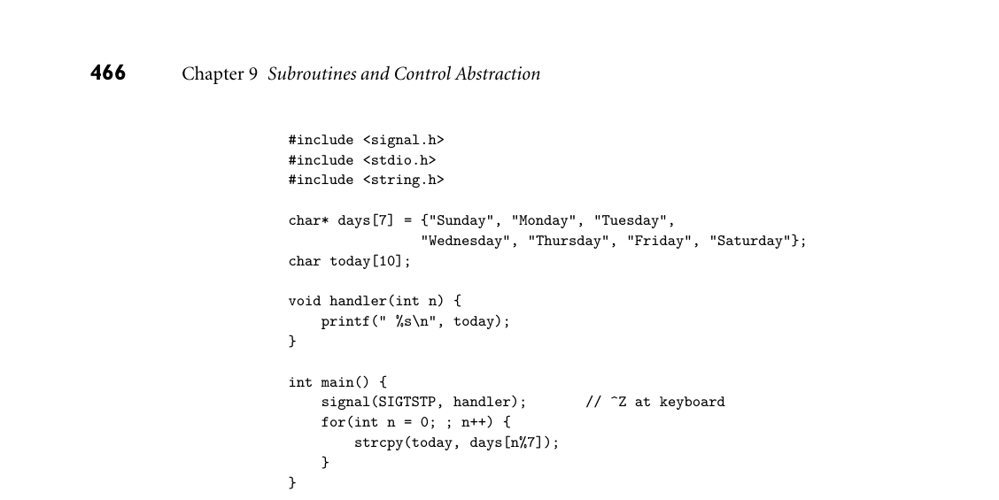

# 9.8 Exercises

462 Chapter 9 Subroutines and Control Abstraction

that they could be used to implement iterators, but here simpler alternatives exist. In Chapter 13, we will build on coroutines to implement threads, which run (or appear to run) in parallel with one another. In several cases we can discern an evolving consensus about the sorts of con- trol abstractions that a language should provide. The limited parameter-passing modes of languages like Fortran and Algol 60 have been replaced by more ex- tensive or flexible options. Several languages augment the standard positional notation for arguments with default and named parameters. Less-structured error-handling mechanisms, such as label parameters, nonlocal gotos, and dy- namically bound handlers, have been replaced by structured exception handlers that are lexically scoped within subroutines, and can be implemented at zero cost in the common (no-exception) case. The spontaneous subroutine call of tradi- tional signal-handling mechanisms have been replaced by callbacks in a dedicated thread. In many cases, implementing these newer features has required that com- pilers and run-time systems become more complex. Occasionally, as in the case of call-by-name parameters, label parameters, or nonlocal gotos, features that were semantically confusing were also difficult to implement, and abandoning them has made compilers simpler. In yet other cases language features that are useful but difficult to implement continue to appear in some languages but not in others. Examples in this category include first-class subroutines, coroutines, iterators, continuations, and local objects with unlimited extent. 9.8 Exercises

9.1 Describe as many ways as you can in which functions in imperative pro- gramming languages differ from functions in mathematics. 9.2 Consider the following code in C++:

class string_map { string cached_key; string cached_val; const string complex_lookup(const string key); // body specified elsewhere public: const string operator { if (key == cached_key) return cached_val; string rtn_val = complex_lookup(key); cached_key = key; cached_val = rtn_val; return rtn_val; } };

Suppose that string_map::operator[] contains the only call to complex_ lookup anywhere in the program. Explain why it would be unwise for the programmer to expand that call textually in-line and eliminate the separate function.

9.8 Exercises 463

9.3 Using your favorite language and compiler, write a program that can tell the order in which certain subroutine parameters are evaluated. 9.4 Consider the following (erroneous) program in C:

void foo() { int i; printf("%d ", i++); }

int main() { int j; for (j = 1; j <= 10; j++) foo(); }

Local variable i in subroutine foo is never initialized. On many systems, however, the program will display repeatable behavior, printing 0 1 2 3 4 5 6 7 8 9. Suggest an explanation. Also explain why the behavior on other systems might be different, or nondeterministic. 9.5 The standard calling sequence for the c. 1980 Digital VAX instruction set employed not only a stack pointer (sp) and frame pointer (fp), but a sep- arate arguments pointer (ap) as well. Under what circumstances might this separate pointer be useful? In other words, when might it be handy not to have to place arguments at statically known offsets from the fp? 9.6 Write (in the language of your choice) a procedure or function that will have four different effects, depending on whether arguments are passed by value, by reference, by value/result, or by name. 9.7 Consider an expression like a + b that is passed to a subroutine in Fortran. Is there any semantically meaningful difference between passing this expres- sion as a reference to an unnamed temporary (as Fortran does) or passing it by value (as one might, for example, in Pascal)? That is, can the program- mer tell the difference between a parameter that is a value and a parameter that is a reference to a temporary? 9.8 Consider the following subroutine in Fortran 77:

subroutine shift(a, b, c) integer a, b, c a = b b = c end

Suppose we want to call shift(x, y, 0) but we don’t want to change the value of y. Knowing that built-up expressions are passed as temporaries, we decide to call shift(x, y+0, 0). Our code works fine at first, but then (with some compilers) fails when we enable optimization. What is going on? What might we do instead?

464 Chapter 9 Subroutines and Control Abstraction

9.9 In some implementations of Fortran IV, the following code would print a 3. Can you suggest an explanation? How do you suppose more recent Fortran implementations get around the problem?

c main program call foo(2) print*, 2 stop end subroutine foo(x) x = x + 1 return end

9.10 Suppose you are writing a program in which all parameters must be passed by name. Can you write a subroutine that will swap the values of its actual parameters? Explain. (Hint: Consider mutually dependent parameters like i and A[i].) 9.11 Can you write a swap routine in Java, or in any other language with only call-by-sharing parameters? What exactly should swap do in such a lan- guage? (Hint: Think about the distinction between the object to which a variable refers and the value [contents] of that object.) 9.12 As noted in Section 9.3.1, out parameters in Ada 83 can be written by the callee but not read. In Ada 95 they can be both read and written, but they begin their life uninitialized. Why do you think the designers of Ada 95 made this change? Does it have any drawbacks? 9.13 Taking a cue from Ada, Swift provides an inout parameter mode. The lan- guage manual does not specify whether inout parameters are to be passed by reference or value-result. Write a program that determines the imple- mentation used by your local Swift compiler. 9.14 Fields of packed records (Example 8.8) cannot be passed by reference in Pas- cal. Likewise, when passing a subrange variable by reference, Pascal requires that all possible values of the corresponding formal parameter be valid for the subrange:

type small = 1..100; R = record x, y : small; end; S = packed record x, y : small; end; var a : 1..10; b : 1..1000; c : R; d : S; procedure foo(var n : small); begin n := 100; writeln(a); end;

9.8 Exercises 465

... a := 2; foo(b); (* ok *) foo(a); (* static semantic error *) foo(c.x); (* ok *) foo(d.x); (* static semantic error *)

Using what you have learned about parameter-passing modes, explain these language restrictions. 9.15 Consider the following declaration in C:

double(*foo(double (*)(double, double[]), double)) (double, ...);

Describe in English the type of foo. 9.16 Does a program run faster when the programmer leaves optional parame- ters out of a subroutine call? Why or why not? 9.17 Why do you suppose that variable-length argument lists are so seldom sup- ported by high-level programming languages? 9.18 Building on Exercise 6.35, show how to implement exceptions using call- with-current-continuation in Scheme. Model your syntax after the handler-case of Common Lisp. As in Exercise 6.35, you will probably need define-syntax and dynamic-wind. 9.19 Given what you have learned about the implementation of structured ex- ceptions, describe how you might implement the nonlocal gotos of Pascal or the label parameters of Algol 60 (Section 6.2). Do you need to place any restrictions on how these features can be used? 9.20 Describe a plausible implementation of C++ destructors or Java try... finally blocks. What code must the compiler generate, at what points in the program, to ensure that cleanup always occurs when leaving a scope? 9.21 Use threads to build support for true iterators in Java. Try to hide as much of the implementation as possible behind a reasonable interface. In particular, hide any uses of new thread, thread.start, thread.join, wait, and notify inside implementations of routines named yield (to be called by an iterator) and in the standard Java Iterator interface routines (to be called in the body of a loop). Compare the performance of your iterators to that of the built-in iterator objects (it probably won’t be good). Discuss any weaknesses you encounter in the abstraction facilities of the language. 9.22 In Common Lisp, multilevel returns use catch and throw; exception han- dling in the style of most other modern languages uses handler-case and error. Show that the distinction between these is mainly a matter of style, rather than expressive power. In other words, show that each facility can be used to emulate the other.

*Figure 9.6 A problematic program in C to illustrate the use of signals. In most Unix systems, the SIGTSTP signal is generated by typing control-Z at the keyboard.*

9.23 Compile and run the program in Figure 9.6. Explain its behavior. Create a new version that behaves more predictably. 9.24 In C#, Java, or some other language with thread-based event handling, build a simple program around the “pause button” of Examples 9.51–9.54. Your program should open a small window containing a text field and two but- tons, one labeled “pause”, the other labeled “resume”. It should then display an integer in the text field, starting with zero and counting up once per sec- ond. If the pause button is pressed, the count should suspend; if the resume button is pressed, it should continue. Note that your program will need at least two threads—one to do the counting, one to handle events. In Java, the JavaFX package will create the handler thread automatically, and your main program can do the counting. In C#, some existing thread will need to call Application.Run in order to become a handler thread. In this case you’ll need a second thread to do the counting. 9.25 Extend your answer to the previous problem by adding a “clone” button. Pushing this button should create an additional window containing another counter. This will, of course, require additional threads.

9.26–9.36 In More Depth.

