# Part II: Core Issues in Language Design

## II Core Issues in Language Design

Having laid the foundation in Part I, we now turn to issues that lie at the core of most programming languages: control fow, data types, and abstractions of both control and data.

Chapter 6 considers control flow, including expression evaluation, sequencing, selection,  iteration, and recursion. In many cases we will see design decisions that refect the sometimes  complementary but often competing goals of conceptual clarity and effcient implementation.  Several issues, including the distinction between references and values and between applicative  (eager) and lazy evaluation, will recur in later chapters.

The next two chapters consider the subject of types. Chapter 7 covers type systems and type  checking, including the notions of equivalence, compatibility, and inference of types. It also  considers the subject of parametric polymorphism, in both its implicit and explicit (generic)  forms. Chapter 8 then presents a survey of concrete composite types, including records and  variants, arrays, strings, sets, pointers, lists, and fles. The section on pointers includes an  introduction to garbage collection techniques.

Both control and data are amenable to abstraction, the process whereby complexity is hidden behind a simple and well-defned interface. Control abstraction is the subject of Chapter 9. Subroutines are the most common control abstraction, but we also consider exceptions  and coroutines, and return briefy to the subjects of continuations and iterators, introduced in  Chapter 6. The coverage of subroutines focuses on calling sequences and on parameter-passing  mechanisms.

```
Chapter 10 returns to the subject of data abstraction, introduced in Chapter 3. In many 
modern  languages this subject  takes the  form  of  object orientation, characterized by an encapsulation mechanism, inheritance, and dynamic method dispatch (subtype polymorphism). Our 
coverage of object-oriented languages will also touch on constructors, access control, generics, 
closures, and mix-in and multiple inheritance.
```

## 6 Control Flow

Having considered the mechanisms that a compiler uses to enforce semantic rules (Chapter 4) and the characteristics of the target machines for which  compilers must generate code (Chapter 5), we now return to core issues in language design. Specifcally, we turn in this chapter to the issue of control flow or  ordering in program execution. Ordering is fundamental to most models of computing. It determines what should be done frst, what second, and so forth, to  accomplish some desired task. We can organize the language mechanisms used to  specify ordering into several categories:

* Sequencing: Statements are to be executed (or expressions evaluated) in a cer­

tain specifed order—usually the order in which they appear in the program  text.  2. Selection: Depending on some run-time condition, a choice is to be made  among two or more statements or expressions. The most common selection  constructs are if and case (switch) statements. Selection is also sometimes  referred to as alternation.  3. Iteration: A given fragment of code is to be executed repeatedly, either a cer­

```
tain number of times, or until a certain run-time condition is true. Iteration 
constructs include for/do, while, and  repeat loops. 
4. Procedural abstraction: A potentially complex collection of control constructs 
(a subroutine) is encapsulated in a way that allows it to be treated as a single 
unit, usually subject to parameterization. 
5. Recursion: An expression is defned in terms of (simpler versions of) itself, ei­
```

ther directly or indirectly; the computational model requires a stack on which  to save information about partially evaluated instances of the expression. Recursion is usually defned by means of self-referential subroutines.  6. Concurrency: Two or more program fragments are to be executed/evaluated  “at the same time,” either in parallel on separate processors, or interleaved on  a single processor in a way that achieves the same effect.  7. Exception handling and speculation: A program fragment is executed optimisti­

cally, on the assumption that some expected condition will be true. If that con­

dition turns out to be false, execution branches to a handler that executes in  place of the remainder of the protected fragment (in the case of exception handling), or in place of the entire protected fragment (in the case of speculation).  For speculation, the language implementation must be able to undo, or “roll  back,” any visible effects of the protected code.  8. Nondeterminacy: The ordering or choice among statements or expressions is  deliberately left unspecifed, implying that any alternative will lead to correct  results. Some languages require the choice to be random, or fair, in some formal sense of the word.

Though the syntactic and semantic details vary from language to language, these  categories cover all of the control-fow constructs and mechanisms found in most  programming languages. A programmer who thinks in terms of these categories,  rather than the syntax of some particular language, will fnd it easy to learn new  languages, evaluate the tradeoffs among languages, and design and reason about  algorithms in a language-independent way.

```
Subroutines are the subject of Chapter 9. Concurrency is the subject of Chapter 13. Exception handling and speculation are discussed in those chapters as 
well, in Sections 9.4 and 13.4.4. The bulk of the current chapter (Sections 6.3 
through 6.7) is devoted to the fve remaining categories. We begin in Section 6.1 
by considering the evaluation of expressions—the building blocks on which all 
higher-level ordering is based. We consider the syntactic form of expressions, the 
precedence and associativity of operators,  the  order  of evaluation  of operands,  
and the semantics of the assignment statement. We focus in particular on the 
distinction between variables that hold a value and variables that hold a reference 
to a value; this distinction will play an important role many times in future chapters. In Section 6.2 we consider the difference between structured and unstructured 
(goto-based) control fow.
```

```
The relative importance of different categories of control fow varies significantly among the different classes of programming languages. Sequencing is 
central to imperative (von Neumann and object-oriented) languages, but plays 
a relatively minor role in functional languages, which emphasize the evaluation 
of expressions, de-emphasizing or eliminating statements (e.g., assignments) that 
affect program output in any way other than through the return of a value. Similarly, functional languages make heavy use of recursion, while imperative languages tend to emphasize iteration. Logic languages tend to de-emphasize or hide 
the issue of control  fow  entirely:  The programmer  simply specifes a set of inference rules; the language implementation must fnd an order in which to apply 
those rules that will allow it to deduce values that satisfy some desired property.
```

### 6.1 Expression Evaluation

An expression generally consists of either a simple object (e.g., a literal constant,  or a named variable or constant) or an operator or function applied to a col­

```
lection of operands or arguments, each of which in turn is an expression. It 
is conventional to use the term operator for built-in functions that use special, 
simple syntax, and to use the term operand for  an argument of  an operator.  In  
most imperative languages, function calls consist of a function name followed by 
a parenthesized, comma-separated list of arguments, as in
```

EXAMPLE 6.1

A typical function call

my_func(A, B, C)  ■

EXAMPLE 6.2

Operators are typically simpler, taking only one or two arguments, and dispensing  with the parentheses and commas:

Typical operators

```
a + b  
- c
```

```
As we saw in Section 3.5.2, some languages defne their operators as syntactic 
sugar for more “normal”-looking functions. In Ada, for example, a + b  is short 
for "+"(a, b); in C++, a + b  is short for a.operator+(b) or operator+(a, 
b) (whichever is defned). 
■ 
In general, a language may specify that function calls (operator invocations) 
employ prefx, infx, or postfx notation. 
These terms indicate, respectively, 
whether the function name appears before, among, or after its several arguments:
```

```
prefx: 
op a b  
or 
op (a, b) 
or 
(op a b)  
infx: 
a op b 
postfx: 
a b op
```

Most imperative languages use infx notation for binary operators and prefx  notation for unary operators and (with parentheses around the arguments) other  functions. Lisp uses prefx notation for all functions, but with the third of the  variants above: in what is known as Cambridge Polish1 notation, it places the  function name inside the parentheses:

EXAMPLE 6.3

Cambridge Polish (prefix)  notation

(* (+ 1 3) 2)  ; that would be (1 + 3) * 2 in infix  (append a b c my_list)  ■

EXAMPLE 6.4

ML-family languages dispense with the parentheses altogether, except when  they are required for disambiguation:

Juxtaposition in ML

max (2 + 3) 4;;  =⇒ 5  ■

1  Prefx notation was popularized by Polish logicians of the early 20th century; Lisp-like parenthesized syntax was frst employed (for noncomputational purposes) by philosopher W. V. Quine of  Harvard University (Cambridge, MA).

A few languages, notably ML and the R scripting language, allow the user to  create new infx operators. Smalltalk uses infx notation for all functions (which

```
EXAMPLE 6.5 
it calls messages), both built-in and user-defned. The following Smalltalk stateMixfix notation in Smalltalk 
ment sends a “displayOn: at:” message to graphical object myBox, with  arguments myScreen and 100@50 (a pixel location). It corresponds to what other 
languages would call the invocation of the “displayOn: at:” function with arguments myBox, myScreen, and  100@50.
```

myBox displayOn: myScreen at: 100@50  ■

EXAMPLE 6.6  This sort of multiword infx notation occurs occasionally in other languages as  Conditional expressions  well.2 In Algol one can say

a := if b <> 0 then a/b else 0;

Here “if... then ... else” is a three-operand infx operator. The equivalent operator in C is written “... ? ... : ...”:

```
a  = b  != 0 ?  a/b : 0;  
■
```

Postfx notation is used for most functions in Postscript, Forth, the input language of certain hand-held calculators, and the intermediate code of some compilers. Postfx appears in a few places in other languages as well. Examples include the pointer dereferencing operator (^) of Pascal and the post-increment  and decrement operators (++ and --) of C and its descendants.

## 6.1.1 Precedence and Associativity

Most languages provide a rich set of built-in arithmetic and logical operators.  When written in infx notation, without parentheses, these operators lead to am-

EXAMPLE 6.7  biguity as to what is an operand of what. In Fortran, for example, which uses **  A complicated Fortran  for exponentiation, how should we parse a + b * c**d**e/f? Should this be  expression  grouped as

((((a + b) * c)**d)**e)/f

or

a + (((b * c)**d)**(e/f))

or

2  Most authors use the term “infx” only for binary operators. Multiword operators may be called  “mixfx,” or left unnamed.

a + ((b * (c**(d**e)))/f)

or yet some other option? (In Fortran, the answer is the last of the options  shown.)  ■  In any given language, the choice among alternative evaluation orders depends  on the precedence and associativity of operators, concepts we introduced in Section 2.1.3. Issues of precedence and associativity do not arise in prefx or postfx  notation.

Precedence rules specify that certain operators, in the absence of parentheses,

```
EXAMPLE 6.8 
group “more tightly” than other operators. In most languages multiplication and 
Precedence in four 
division group more tightly than addition and subtraction, so 2 + 3 × 4 is  14 and  
influential languages 
not 20. Details vary widely from one language to another, however. Figure 6.1 
shows the levels of precedence for several well-known languages. 
■ 
The precedence structure of C (and, with minor variations, of its descendants, 
C++, Java, and C#) is substantially richer than that of most other languages. It 
is, in fact, richer than shown in Figure 6.1, because several additional constructs, 
including type casts, function calls, array subscripting, and record feld selection, 
are classifed as operators in C. It is probably fair to say that most C programmers do not remember all of their language’s precedence levels. The intent of 
the language designers was presumably to ensure that “the right thing” will usually happen when parentheses are not used to force a particular evaluation order. 
Rather than count on this, however, the wise programmer will consult the manual 
or add parentheses.
```

EXAMPLE 6.9  It is also probably fair to say that the relatively fat precedence hierarchy of PasA “gotcha” in Pascal  cal was a mistake. Novice Pascal programmers would frequently write conditions  precedence  like

if A  < B  and C <  D then (* ouch *)

```
Unless A, B, C, and  D were all of type Boolean, which is unlikely, this code would 
result in a static semantic error, since the rules of precedence cause it to group as A 
< (B  and  C) < D. (And even if all four operands were of type Boolean, the result 
was almost certain to be something other than what the programmer intended.) 
Most languages avoid this problem by giving arithmetic operators higher precedence than relational (comparison) operators, which in turn have higher precedence than the logical operators. Notable exceptions include APL and Smalltalk, 
in which all operators are of equal precedence; parentheses must be used to specify 
grouping. 
■
```

```
EXAMPLE 6.10 
Associativity rules specify whether sequences of operators of equal precedence 
Common rules for 
group to the right or to the left. Conventions here are somewhat more uniform 
associativity 
across languages, but still display some variety. The basic arithmetic operators 
almost always associate left-to-right, so 9 - 3 - 2  is 4 and not 8. In  Fortran,  
as noted above, the exponentiation operator (**) follows standard mathematical 
convention, and associates right-to-left, so 4**3**2 is 262144 and not 4096. 
In Ada, exponentiation does not associate: one must write either (4**3)**2 or
```

Fortran  Pascal  C  Ada

++, -- (post-inc., dec.)

**  not  ++, -- (pre-inc., dec.),  abs (absolute value),  +, - (unary),  not, **  &, * (address, contents of),  !, ~ (logical, bit-wise not)

*, /  *, /,  * (binary), /,  *, /, mod, rem  div, mod, and  % (modulo division)

+, - (unary  +, - (unary and  +, - (binary)  +, - (unary)  and binary)  binary), or

```
<<, >> 
+, - (binary), 
(left and  right bit  shift)  
& (concatenation)
```

.eq., .ne., .lt.,  <, <=, >, >=,  <, <=, >, >=  =, /= , <, <=, >, >=  .le., .gt., .ge.  =, <>, IN  (inequality tests)  (comparisons)

.not.  ==, != (equality tests)

& (bit-wise and)

^ (bit-wise exclusive or)

| (bit-wise inclusive or)

.and.  && (logical and)  and, or, xor  (logical operators)

.or.  || (logical or)

.eqv., .neqv.  ?: (if ...then ...else)  (logical comparisons)

=, +=, -=, *=, /=, %=,  >>=, <<=, &=, ^=, |=  (assignment)

, (sequencing)

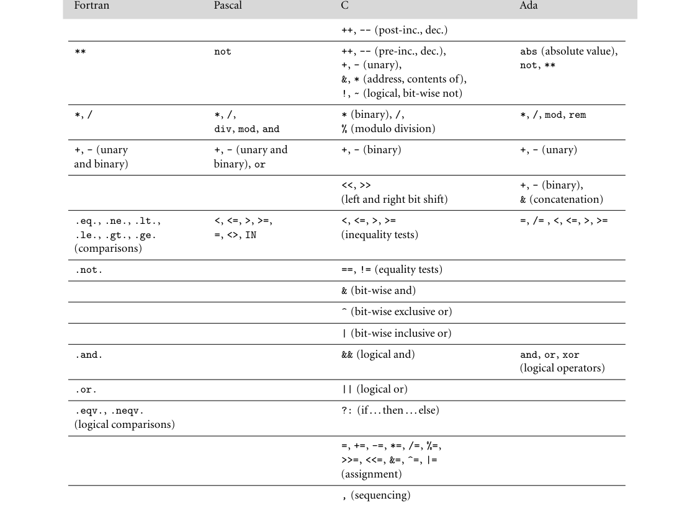
*Figure 6.1  Operator precedence levels in Fortran, Pascal, C, and Ada. The operators at the top of the fgure group most  tightly.*

```
4**(3**2); the language syntax does not allow the unparenthesized form. In 
languages that allow assignments inside expressions (an option we will consider 
more in Section 6.1.2), assignment associates right-to-left. Thus in C, a = b =  
a + c  assigns a + c  into b and then assigns the same value into a. 
■
```

EXAMPLE 6.11  Haskell is unusual in allowing the programmer to specify both the associativity  User-defined precedence  and the precedence of user-defned operators. The predefned ^ operator, for exand associativity in Haskell

ample, which indicates integer exponentiation, is declared in the standard library  (and could be redefned by the programmer) as

infixr 8 ^

```
Here infixr means “right associative infx operator,” so 4 ^ 3 ^ 2  groups as 
4 ^  (3  ^ 2)  rather than as (4  ^  3) ^ 2. The  similar  infixl and infix declarations specify left associativity and nonassociativity, respectively. Precedence 
levels run from 0 (loosest) to 9 (tightest). If no “fxity” declaration is provided, 
newly defned operators are left associative by default, and group at level 9. Function application (specifed simply via juxtaposition in Haskell) groups tightest of 
all—effectively at level 10. 
■ 
Because the rules for precedence and associativity vary so much from one language to another, a programmer who works in several languages is wise to make 
liberal use of parentheses.
```

## 6.1.2 Assignments

In a purely functional language, expressions are the building blocks of programs,  and computation consists entirely of expression evaluation. The effect of any  individual expression on the overall computation is limited to the value that expression provides to its surrounding context. Complex computations employ recursion to generate a potentially unbounded number of values, expressions, and  contexts.

In an imperative language, by contrast, computation typically consists of an  ordered series of changes to the values of variables in memory. Assignments provide the principal means by which to make the changes. Each assignment takes  a pair of arguments: a value and a reference to a variable into which the value  should be placed.

In general, a programming language construct is said to have a side effect if it  infuences subsequent computation (and ultimately program output) in any way  other than by returning a value for use in the surrounding context. Assignment is  perhaps the most fundamental side effect: while the evaluation of an assignment  may sometimes yield a value, what we really care about is the fact that it changes  the value of a variable, thereby infuencing the result of any later computation in  which the variable appears.

```
Many imperative languages distinguish between expressions, which  always  produce a value, and may or may not have side effects, and statements, which  are  executed solely for their side effects, and return no useful value. Given the centrality 
of assignment, imperative programming is sometimes described as “computing 
by means of side effects.”
```

```
At the opposite extreme, purely functional  languages have no  side effects.  As  a  
result, the value of an expression in such a language depends only on the referencing environment in which the expression is evaluated, not on  the time at which
```

the evaluation occurs. If an expression yields a certain value at one point in time,  it is guaranteed to yield the same value at any point in time. In fancier terms,  expressions in a purely functional language are said to be referentially transparent.

```
Haskell and Miranda are purely functional. Many other languages are mixed: 
ML and Lisp are mostly functional, but make assignment available to programmers who want it. C#, Python, and Ruby are mostly imperative, but provide 
a variety of features (frst-class functions, polymorphism, functional values and 
aggregates, garbage collection, unlimited extent) that allow them to be used in 
a largely functional style. We will return to functional programming, and the 
features it requires, in several future sections, including 6.2.2, 6.6, 7.3, 8.5.3, 8.6, 
and all of Chapter 11.
```

References and Values

On the surface, assignment appears to be a very straightforward operation. Below the surface, however, there are some subtle but important differences in the  semantics of assignment in different imperative languages. These differences are  often invisible, because they do not affect the behavior of simple programs. They  have a major impact, however, on programs that use pointers, and will be explored in further detail in Section 8.5. We provide an introduction to the issues  here.

EXAMPLE 6.12  Consider the following assignments in C:  L-values and r-values

```
d =  a;  
a =  b +  c;
```

```
In the frst statement, the right-hand side of the assignment refers to the value of 
a, which  we  wish  to  place  into  d. In the second statement, the left-hand side 
refers to the location of a, where we want to put the sum of b and c. Both  
interpretations—value and location—are possible because a variable in C (as in 
many other languages) is a named container for a value. We sometimes say that 
languages like C use a value model of variables. Because of their use on the lefthand side of assignment statements, expressions that denote locations are referred 
to as l-values. Expressions that denote values (possibly the value stored in a location) are referred to as r-values. Under a value model of variables, a given expression  can be  either an l-value  or  an  r-value,  depending  on the  context  in which  it  
appears. 
■ 
Of course, not all expressions can be l-values, because not all values have a
```

```
EXAMPLE 6.13 
location, and not all names are variables. In most languages it makes no sense to 
L-values in C 
say 2 + 3 = a, or  even  a = 2 + 3, if  a is the name of a constant. By the same token, 
not all l-values are simple names; both l-values and r-values can be complicated 
expressions. In C one may write
```

(f(a)+3)->b[c] = 2;

In this expression f(a) returns a pointer to some element of an array of pointers  to structures (records). The assignment places the value 2 into the c-th element

a 4  a 4

b 2  b

2

c 2  c

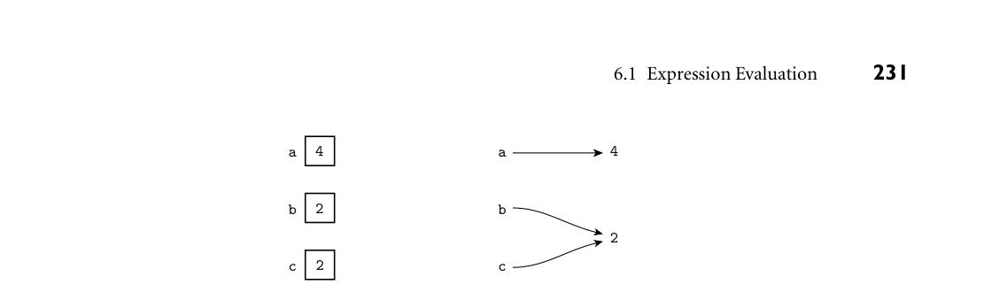
*Figure 6.2  The value (left) and reference (right) models of variables. Under the reference  model, it becomes important to distinguish between variables that refer to the same object and  variables that refer to different objects whose values happen (at the moment) to be equal.*

of feld b of the structure pointed at by the third array element after the one to  which f’s return value points.  ■  In C++ it is even possible for a function to return a reference to a structure,  rather than a pointer to it, allowing one to write

EXAMPLE 6.14

L-values in C++

g(a).b[c] = 2;  ■

We will consider references further in Section 9.3.1.

```
A language can make the distinction between l-values and r-values more explicit by employing a reference model of variables. Languages that do this include 
Algol 68, Clu, Lisp/Scheme, ML, and Smalltalk. In these languages, a variable is 
not a named container for a value; rather, it is a named reference to a value.  The  
following fragment of code is syntactically valid in both Pascal and Clu:
```

EXAMPLE 6.15

Variables as values and  references

```
b :=  2;  
c :=  b;  
a  := b +  c;
```

A Pascal programmer might describe this code by saying: “We put the value 2 in b  and then copy it into c. We then read these values, add them together, and place  the resulting 4 in a.” The Clu programmer would say: “We let b refer to 2 and  then let c refer to it also. We then pass these references to the + operator, and let  a refer to the result, namely 4.”

```
These two  ways  of thinking  are illustrated in Figure 6.2.  With a value model  
of variables, any integer variable can contain the value 2. With a reference model 
of variables, there is (at least conceptually) only one 2—a sort of Platonic Ideal— 
to which any variable can refer. The practical effect is the same in this example, 
because integers are immutable: the value of 2 never changes, so we can’t tell 
the difference between two copies of the number 2 and two references to “the” 
number 2. 
■ 
In a language that uses the reference model, every variable is an l-value. When 
it appears in a context that expects an r-value, it must be dereferenced to obtain 
the value to which it refers. In most languages with a reference model (including 
Clu), the dereference is implicit and automatic. In ML, the programmer must use
```

an explicit dereference operator, denoted with a prefx exclamation point. We will  revisit ML pointers in Section 8.5.1.

The difference between the value and reference models of variables becomes  particularly important (specifcally, it can affect program output and behavior)  if the values to which variables refer can change “in place,” as they do in many  programs with linked data structures, or if it is possible for variables to refer to  different objects that happen to have the “same” value. In this latter case it becomes important to distinguish between variables that refer to the same object  and variables that refer to different objects whose values happen (at the moment)  to be equal. (Lisp, as we shall see in Sections 7.4 and 11.3.3, provides more than  one notion of equality, to accommodate this distinction.) We will discuss the  value and reference models of variables further in Section 8.5.

```
Java uses a value model for built-in types and a reference model for userdefned types (classes). C# and Eiffel allow the programmer to choose between 
the value and reference models for each individual user-defned type. A C# class 
is a reference type; a struct is a value type.
```

Boxing

A drawback of using a value model for built-in types is that they can’t be passed

```
EXAMPLE 6.16 
uniformly to methods that expect class-typed parameters. Early versions of Java 
Wrapper classes 
required the programmer to “wrap” objects of built-in types inside corresponding 
predefned class types in order to insert them in standard container (collection) 
classes:
```

```
import java.util.Hashtable; 
... 
Hashtable ht = new Hashtable(); 
... 
Integer N = new Integer(13); 
// Integer is a "wrapper" class 
ht.put(N, new Integer(31)); 
Integer M = (Integer) ht.get(N); 
int m = M.intValue();
```

```
The wrapper class was needed here because Hashtable expects a parameter of 
object type, and an int is not an object. 
■
```

DESIGN & IMPLEMENTATION

## 6.1 Implementing the reference model  It is tempting to assume that the reference model of variables is inherently  more expensive than the value model, since a naive implementation would  require a level of indirection on every access. As we shall see in Section 8.5.1,  however, most compilers for languages with a reference model use multiple  copies of immutable objects for the sake of effciency, achieving exactly the  same performance for simple types that they would with a value model.

EXAMPLE 6.17  C# and more recent versions of Java perform automatic boxing and unboxing  Boxing in Java 5 and C#  operations that avoid the wrapper syntax in many cases:

ht.put(13, 31);  int m = (Integer) ht.get(13);

Here the Java compiler creates hidden Integer objects to hold the values 13 and  31, so they may be passed to put as references. The Integer cast on the return  value is still needed, to make sure that the hash table entry for 13 is really an  integer and not, say, a foating-point number or string. Generics, which we will  consider in Section 7.3.1, allow the programmer to declare a table containing only  integers. In Java, this would eliminate the need to cast the return value. In C#, it  would eliminate the need for boxing.  ■

Orthogonality

A common design goal is to make the various features of a language as orthogonal  as possible. Orthogonality means that features can be used in any combination,  the combinations all make sense, and the meaning of a given feature is consistent,  regardless of the other features with which it is combined.

Algol 68 was one of the frst languages to make orthogonality a principal design  goal, and in fact few languages since have given the goal such weight. Among  other things, Algol 68 is said to be expression-oriented: it has no separate notion  of statement. Arbitrary expressions can appear in contexts that would call for  a statement in many other languages, and constructs that are considered to be

EXAMPLE 6.18  statements in other languages can appear within expressions. The following, for  Expression orientation in  example, is valid in Algol 68:  Algol 68

```
begin 
a  := if b <  c then d else e;  
a := begin f(b); g(c) end; 
g(d); 
2 + 3  
end
```

```
Here the value of the if... then ... else construct is either the value of its then 
part or the value of its else part, depending on the value of the condition. The 
value of the “statement list” on the right-hand side of the second assignment is 
the value of its fnal “statement,” namely the return value of g(c). There  is  no  
need to distinguish between procedures and functions, because every subroutine 
call returns a value. The value returned by g(d) is discarded in this example. 
Finally, the value of the code fragment as a whole is 5, the sum of 2 and 3. 
■ 
C takes an intermediate approach. It distinguishes between statements and expressions, but one of the classes of statement is an “expression statement,” which 
computes the value of an expression and then throws it away; in effect, this allows 
an expression to appear in any context that would require a statement in most 
other languages. Unfortunately, as we noted in Section 3.7, the reverse is not the
```

case: statements cannot in general be used in an expression context. C provides  special expression forms for selection and sequencing. Algol 60 defnes if...

then ... else as both a statement and an expression.

```
Both Algol 68 and C allow assignments within expressions. The value of an 
assignment is simply the value of its right-hand side. Where most of the descendants of Algol 60 use the := token to represent assignment, C follows Fortran in 
simply using =. It  uses  == to represent a test for equality (Fortran uses .eq.).
```

EXAMPLE 6.19  Moreover, in any context that expects a Boolean value, C accepts anything that  A “gotcha” in C conditions  can be coerced to be an integer. It interprets zero as false; any other value is true.3  As a result, both of the following constructs are valid—common—in C:

if (a == b) {  /* do the following if a equals b */  ...

if (a = b) {  /* assign b into a and then do  the following if the result is nonzero */  ...

```
Programmers who are accustomed to Ada or some other language in which = is 
the equality test frequently write the second form above when the frst is what is 
intended. This sort of bug can be very hard to fnd. 
■ 
Though it provides a true Boolean type (bool), C++ shares the problem of C, 
because it provides automatic coercions from numeric, pointer, and enumeration 
types. Java and C# eliminate the problem by disallowing integers in Boolean contexts. The assignment operator is still =, and the equality test is still ==, but  the  
statement if (a = b) ... will generate a compile-time type clash error unless a 
and b are both of Boolean type.
```

Combination Assignment Operators

Because they rely so heavily on side effects, imperative programs must frequently

EXAMPLE 6.20  update a variable. It is thus common in many languages to see statements like  Updating assignments

a =  a +  1;

or, worse,

b.c[3].d = b.c[3].d * e;

Such statements are not only cumbersome to write and to read (we must examine  both sides of the assignment carefully to see if they really are the same), they also

3  Historically, C lacked a separate Boolean type. C99 added _Bool, but it’s really just a 1-bit integer.

result in redundant address calculations (or at least extra work to eliminate the  redundancy in the code improvement phase of compilation).  ■

EXAMPLE 6.21  If the address calculation has a side effect, then we may need to write a pair of  Side effects and updates  statements instead. Consider the following code in C:

```
void update(int A[], int index_fn(int n)) { 
int i, j;  
/* calculate i */ 
... 
j = index_fn(i); 
A[j] = A[j] + 1;  
}
```

Here we cannot safely write

A[index_fn(i)] = A[index_fn(i)] + 1;

```
We have to introduce the temporary variable j because we don’t  know  whether  
index_fn has a side effect or not. If it is being used, for example, to keep a log 
of elements that have been updated, then we shall want to make sure that update 
calls it only once. 
■ 
To eliminate the clutter and compile- or run-time cost of redundant address 
calculations, and to avoid the issue of repeated side effects, many languages, beginning with Algol 68, and including C and its descendants, provide so-called
```

EXAMPLE 6.22  assignment operators to update a variable. Using assignment operators, the stateAssignment operators  ments in Example 6.20 can be written as follows:

```
a +=  1;  
b.c[3].d *= e;
```

and the two assignments in the update function can be replaced with

A[index_fn(i)] += 1;

In addition to being aesthetically cleaner, the assignment operator form guarantees that the address calculation and any side effects happen only once.  ■  As shown in Figure 6.1, C provides 10 different assignment operators, one for

EXAMPLE 6.23  each of its binary arithmetic and bit-wise operators. C also provides prefx and  Prefix and postfix inc/dec  postfx increment and decrement operations. These allow even simpler code in

update:

A[index_fn(i)]++;

or

++A[index_fn(i)];

More signifcantly, increment and decrement operators provide elegant syntax for  code that uses an index or a pointer to traverse an array:

A[--i] = b;  *p++ = *q++;

When prefxed to an expression, the ++ or -- operator increments or decrements  its operand before providing a value to the surrounding context. In the postfx  form, ++ or -- updates its operand after providing a value. If i is 3 and p and q  point to the initial elements of a pair of arrays, then b will be assigned into A[2]  (not A[3]), and the second assignment will copy the initial elements of the arrays  (not the second elements).  ■

EXAMPLE 6.24  The prefx forms of ++ and -- are syntactic sugar for += and -=. We could  Advantages of postfix  have written  inc/dec

A[i -= 1] =  b;

above. The postfx forms are not syntactic sugar. To obtain an effect similar to  the second statement above we would need an auxiliary variable and a lot of extra  notation:

```
*(t =  p, p += 1,  t) = *(t =  q, q +=  1, t);  
■
```

```
Both the assignment operators (+=, -=) and the increment and decrement operators (++, --) do “the right thing” when applied to pointers in C (assuming 
those pointers point into an array). If p points to element i of an array, where 
each element occupies n bytes (including any bytes required for alignment, as 
discussed in Section C 5.1), then p +=  3  points to element i + 3, 3n bytes later in 
memory. We will discuss pointers and arrays in C in more detail in Section 8.5.1.
```

Multiway Assignment

We have already seen that the right associativity of assignment (in languages that

```
EXAMPLE 6.25 
allow assignment in expressions) allows one to write things like a = b = c. In  
Simple multiway 
several languages, including Clu, ML, Perl, Python, and Ruby, it is also possible 
assignment 
to write
```

a, b = c, d;

Here the comma in the right-hand side is not the sequencing operator of C.  Rather, it serves to defne an expression, or tuple, consisting of multiple r-values.  The comma operator on the left-hand side produces a tuple of l-values. The effect

4 of the assignment is to copy c into a and d into b.  ■

EXAMPLE 6.26  While we could just as easily have written  Advantages of multiway  assignment

4  The syntax shown here is for Perl, Python, and Ruby. Clu uses := for assignment. ML requires  parentheses around each tuple.

a =  c;  b =  d;

the multiway (tuple) assignment allows us to write things like

a, b = b, a;  (* swap a and b *)

which would otherwise require auxiliary variables. Moreover, multiway assignment allows functions to return tuples, as well as single values:

a, b,  c = foo(d, e, f);

This notation eliminates the asymmetry (nonorthogonality) of functions in most  programming languages, which allow an arbitrary number of arguments, but  only a single return.  ■

## 3CHECK YOUR UNDERSTANDING  1.  Name eight major categories of control-fow mechanisms.  2. What  distinguishes  operators from other sorts of functions?

```
3. 
Explain the difference between prefix, infix, and  postfix notation. What is 
Cambridge Polish notation? Name two programming languages that use postfx notation. 
4. 
Why don’t issues of associativity and precedence arise in Postscript or Forth?
```

```
5. 
What does it mean for an expression to be referentially transparent? 
6. 
What is the difference between a value model of variables and a reference 
model of variables? Why is the distinction important? 
7.
What
 is
 an
 l-value? An  r-value?
```

```
8. 
Why is the distinction between mutable and immutable values important in 
the implementation of a language with a reference model of variables? 
9.
Defne
 orthogonality in the context of programming language design. 
10. What is the difference between a statement and an expression? What  does  it  
mean for a language to be expression-oriented? 
11. What are the advantages of updating a variable with an assignment operator, 
rather than with a regular assignment in which the variable appears on both 
the left- and right-hand sides?
```

## 6.1.3 Initialization

Because they already provide a construct (the assignment statement) to set the  value of a variable, imperative languages do not always provide a means of specifying an initial value for a variable in its declaration. There are several reasons,  however, why such initial values may be useful:

* As suggested in Figure 3.3, a static variable that is local to a subroutine needs
  an initial value in order to be useful.
* For any statically allocated variable, an initial value that is specifed in the dec­

laration can be preallocated in global memory by the compiler, avoiding the  cost of assigning an initial value at run time.  3. Accidental use of an uninitialized variable is one of the most common pro­

gramming errors. One of the easiest ways to prevent such errors (or at least  ensure that erroneous behavior is repeatable) is to give every variable a value  when it is frst declared.

Most languages allow variables of built-in types to be initialized in their declarations. A more complete and orthogonal approach to initialization requires  a notation for aggregates: built-up structured values of user-defned composite  types. Aggregates can be found in several languages, including C, C++, Ada, Fortran 90, and ML; we will discuss them further in Section 7.1.3.

It should be emphasized that initialization saves time only for variables that  are statically allocated. Variables allocated in the stack or heap at run time must  be initialized at run time.5 It is also worth noting that the problem of using an  uninitialized variable occurs not only after elaboration, but also as a result of any  operation that destroys a variable’s value without providing a new one. Two of the  most common such operations are explicit deallocation of an object referenced  through a pointer and modifcation of the tag of a variant record. We will consider  these operations further in Sections 8.5 and C 8.1.3, respectively.

If a variable is not given an initial value explicitly in its declaration, the language may specify a default value. In C, for example, statically allocated variables  for which the programmer does not provide an initial value are guaranteed to be  represented in memory as if they had been initialized to zero. For most types on  most machines, this is a string of zero bits, allowing the language implementation  to exploit the fact that most operating systems (for security reasons) fll newly  allocated memory with zeros. Zero-initialization applies recursively to the subcomponents of variables of user-defned composite types. Java and C# provide a  similar guarantee for the felds of all class-typed objects, not just those that are  statically allocated. Most scripting languages provide a default initial value for all  variables, of all types, regardless of scope or lifetime.

5  For variables that are accessed indirectly (e.g., in languages that employ a reference model of  variables), a compiler can often reduce the cost of initializing a stack or heap variable by placing  the initial value in static memory, and only creating the pointer to it at elaboration time.

Dynamic Checks

Instead of giving every uninitialized variable a default value, a language or implementation can choose to defne the use of an uninitialized variable as a dynamic  semantic error, and can catch these errors at run time. The advantage of the semantic checks is that they will often identify a program bug that is masked or  made more subtle by the presence of a default value. With appropriate hardware  support, uninitialized variable checks can even be as cheap as default values, at  least for certain types. In particular, a compiler that relies on the IEEE standard  for foating-point arithmetic can fll uninitialized foating-point numbers with a  signaling NaN value, as discussed in Section C 5.2.2. Any attempt to use such a  value in a computation will result in a hardware interrupt, which the language  implementation may catch (with a little help from the operating system), and use  to trigger a semantic error message.

```
For most types on most machines, unfortunately, the costs of catching all uses 
of an uninitialized variable at run time are considerably higher. If every possible 
bit pattern of the variable’s representation in memory designates some legitimate 
value (and this is often the case), then extra space must be allocated somewhere 
to hold an initialized/uninitialized fag. This fag must be set to “uninitialized” at 
elaboration time and to “initialized” at assignment time. It must also be checked 
(by  extra  code) at every  use,  or  at least at every  use that the  code  improver  is  
unable to prove is redundant.
```

Definite Assignment

For local variables of methods, Java and C# defne a notion of definite assignment  that precludes the use of uninitialized variables. This notion is based on the con-

EXAMPLE 6.27  trol fow of the program, and can be statically checked by the compiler. Roughly  Programs outlawed by  speaking, every possible control path to an expression must assign a value to every  definite assignment  variable in that expression. This is a conservative rule; it can sometimes prohibit  programs that would never actually use an uninitialized variable. In Java:

```
int i; 
int j  = 3;  
... 
if (j > 0) {
```

```
i =  2;  
} 
... 
// no assignments to j in here 
if (j > 0) {
```

System.out.println(i);  // error: "i might not have been initialized"  }

While a human being might reason that i will be used only when it has previously  been given a value, such determinations are undecidable in the general case, and  the compiler does not attempt them.  ■

Constructors

Many object-oriented languages (Java and C# among them) allow the programmer to defne types for which initialization of dynamically allocated variables  occurs automatically, even when no initial value is specifed in the declaration.  Some—notably C++—also distinguish carefully between initialization and assignment. Initialization is interpreted as a call to a constructor function for the  variable’s type, with the initial value as an argument. In the absence of coercion,  assignment is interpreted as a call to the type’s assignment operator or, if none  has been defned, as a simple bit-wise copy of the value on the assignment’s righthand side. The distinction between initialization and assignment is particularly  important for user-defned abstract data types that perform their own storage  management. A typical example occurs in variable-length character strings. An  assignment to such a string must generally deallocate the space consumed by the  old value of the string before allocating space for the new value. An initialization  of the string must simply allocate space. Initialization with a nontrivial value is  generally cheaper than default initialization followed by assignment, because it  avoids deallocation of the space allocated for the default value. We will return to  this issue in Section 10.3.2.

Neither Java nor C# distinguishes between initialization and assignment: an  initial value can be given in a declaration, but this is the same as an immediate subsequent assignment. Java uses a reference model for all variables of userdefned object types, and provides for automatic storage reclamation, so assignment never copies values. C# allows the programmer to specify a value model  when desired (in which case assignment does copy values), but otherwise mirrors  Java.

## 6.1.4 Ordering within Expressions

While precedence and associativity rules defne the order in which binary infx  operators are applied within an expression, they do not specify the order in which

EXAMPLE 6.28  the operands of a given operator are evaluated. For example, in the expression  Indeterminate ordering

a  - f(b) - c  * d

```
we know from associativity that f(b) will be subtracted from a before performing the second subtraction, and we know from precedence that the right operand 
of that second subtraction will be the result of c * d, rather than merely c, but  
without additional information we do not know whether a - f(b) will be evaluated before or after c * d. Similarly, in a subroutine call with multiple arguments
```

f(a, g(b), h(c))

we do not know the order in which the arguments will be evaluated.  ■  There are two main reasons why the order can be important:

```
1. Side effects: If f(b) may modify d, then the value of a - f(b) - c * d will 
depend on whether the frst subtraction or the multiplication is performed 
frst. Similarly, if g(b) may modify a and/or c, then the values passed to 
f(a, g(b), h(c)) will depend on the order in which the arguments are evaluated. 
■ 
2. Code improvement: The order of evaluation of subexpressions has an impact 
on both register allocation and instruction scheduling. In the expression a * b  
+ f(c), it is probably desirable to call f before evaluating a * b, because  the  
product, if calculated frst, would need to be saved during the call to f, and  f 
might want to use all the registers in which it might easily be saved. In a similar 
vein, consider the sequence
```

EXAMPLE 6.29

A value that depends on  ordering

EXAMPLE 6.30

An optimization that  depends on ordering

```
a := B[i]; 
c  := a  * 2  + d *  3;
```

```
On an in-order processor, it is probably desirable to evaluate d * 3  before evaluating a * 2, because the previous statement, a := B[i], will need to load a 
value from memory. Because loads are slow, if the processor attempts to use 
the value of a in the next instruction (or even the next few instructions on 
many machines), it will have to wait. If it does something unrelated instead 
(i.e., evaluate d * 3), then the load can proceed in parallel with other computation. 
■
```

Because of the importance of code improvement, most language manuals say  that the order of evaluation of operands and arguments is undefned. (Java and  C# are unusual in this regard: they require left-to-right evaluation.) In the absence of an enforced order, the compiler can choose whatever order is likely to  result in faster code.

DESIGN & IMPLEMENTATION

6.2 Safety versus performance  A recurring theme in any comparison between C++ and Java is the latter’s willingness to accept additional run-time cost in order to obtain cleaner semantics  or increased reliability. Defnite assignment is one example: it may force the  programmer to perform “unnecessary” initializations on certain code paths,  but in so doing it avoids the many subtle errors that can arise from missing  initialization in other languages. Similarly, the Java specifcation mandates automatic garbage collection, and its reference model of user-defned types forces  most objects to be allocated in the heap. As we shall see in future chapters, Java  also requires both dynamic binding of all method invocations and run-time  checks for out-of-bounds array references, type clashes, and other dynamic  semantic errors. Clever compilers can reduce or eliminate the cost of these  requirements in certain common cases, but for the most part the Java design  refects an evolutionary shift away from performance as the overriding design  goal.

Applying Mathematical Identities

Some language implementations (e.g., for dialects of Fortran) allow the compiler  to rearrange expressions involving operators whose mathematical abstractions are  commutative, associative, and/or distributive, in order to generate faster code.

EXAMPLE 6.31  Consider the following Fortran fragment:  Optimization and

```
a = b + c  
mathematical “laws”
```

d = c + e + b

Some compilers will rearrange this as

```
a = b + c  
d = b + c + e
```

They  can then recognize  the  common subexpression in the frst and second statements, and generate code equivalent to

```
a = b + c  
d = a + e
```

Similarly,

a = b/c/d  e = f/d/c

may be rearranged as

```
t = c * d  
a = b/t  
e = f/t  
■
```

Unfortunately, while mathematical arithmetic obeys a variety of commutative, associative, and distributive laws, computer arithmetic is not as orderly. The

DESIGN & IMPLEMENTATION

6.3 Evaluation order  Expression evaluation presents a diffcult tradeoff between semantics and implementation. To limit surprises, most language defnitions require the compiler, if it ever reorders expressions, to respect any ordering imposed by parentheses. The programmer can therefore use parentheses to prevent the application of arithmetic “identities” when desired. No similar guarantee exists with  respect to the order of evaluation of operands and arguments. It is therefore  unwise to write expressions in which a side effect of evaluating one operand or  argument can affect the value of another. As we shall see in Section 6.3, some  languages, notably Euclid and Turing, outlaw such side effects.

EXAMPLE 6.32

```
problem is that numbers in a computer are of limited precision. Suppose a, b, 
and c are all integers between two billion and three billion. With 32-bit arithmetic, the expression b - c + d  can be evaluated safely left-to-right (232 is a little 
less than 4.3 billion). If the compiler attempts to reorganize this expression as 
b + d - c, however (e.g., in order to delay its use of c), then arithmetic overfow 
will occur. Despite our intuition from math, this reorganization is unsafe. 
■ 
Many languages, including Pascal and most of its descendants, provide dynamic semantic checks to detect arithmetic overfow. In some implementations 
these checks can be disabled to eliminate their run-time overhead. In C and C++, 
the effect of arithmetic overfow is implementation-dependent. In Java, it is well 
defned: the language defnition specifes the size of all numeric types, and requires two’s complement integer and IEEE foating-point arithmetic. In C#, the 
programmer can explicitly request the presence or absence of checks by tagging 
an expression or statement with the checked or unchecked keyword. In a completely different vein, Scheme, Common Lisp, and several scripting languages 
place no a priori limit on the size of integers; space is allocated to hold extra-large 
values on demand.
```

Overflow and arithmetic  “identities”

```
Even in the absence of overfow, the limited precision of foating-point arithmetic can cause different arrangements of the “same” expression to produce signifcantly different results, invisibly. Single-precision IEEE foating-point numbers devote one bit to the sign, eight bits to the exponent (power of two), and 
23 bits to the mantissa. Under this representation, a + b  is guaranteed to result 
in a loss of information if | log2(a/b)| > 23. Thus if b = -c, then  a + b + c  
may appear to be zero, instead of a, if  the  magnitude  of  a is small, while the 
magnitudes of b and c are large. In a similar vein, a number like 0.1 cannot be 
represented precisely, because its binary representation is a “repeating decimal”: 
0.0001001001.... For certain values of x, (0.1 + x) * 10.0 and 1.0 + (x * 
10.0) can differ by as much as 25%, even when 0.1 and x are of the same magnitude. 
■
```

EXAMPLE 6.33

Reordering and numerical  stability

## 6.1.5 Short-Circuit Evaluation

```
Boolean expressions provide a special and important opportunity for code improvement and increased readability. 
Consider the expression (a  < b) and  
(b < c). If  a is greater than b, there is really no point in checking to see whether 
b is less than c; we know the overall expression must be false. Similarly, in the 
expression (a > b) or (b >  c), if  a is indeed greater than b there is no point in 
checking to see whether b is greater than c; we know the overall expression must 
be true. A compiler that performs short-circuit evaluation of Boolean expressions 
will generate code that skips the second half of both of these computations when 
the overall  value can be  determined  from  the frst  half.  
■ 
Short-circuit evaluation can save signifcant amounts of time in certain situations:
```

EXAMPLE 6.34

Short-circuited  expressions

EXAMPLE 6.35

Saving time with  short-circuiting

if (very_unlikely_condition && very_expensive_function()) ...  ■

EXAMPLE 6.36

But time is not the only consideration, or even the most important.  Shortcircuiting changes the semantics of Boolean expressions. In C, for example, one  can use the following code to search for an element in a list:

Short-circuit pointer  chasing

```
p = my_list; 
while (p && p->key  != val)  
p = p->next;
```

C short-circuits its && and || operators, and uses zero for both null and false, so  p->key will be accessed if and only if p is non-null. The syntactically similar code  in Pascal does not work, because Pascal does not short-circuit and and or:

p := my_list;  while (p <> nil) and (p^.key <> val) do  (* ouch! *)  p := p^.next;

Here both of the <> relations will be evaluated before and-ing their results together. At the end of an unsuccessful search, p will be nil, and the attempt to  access p^.key will be a run-time (dynamic semantic) error, which the compiler  may or may not have generated code to catch. To avoid this situation, the Pascal  programmer must introduce an auxiliary Boolean variable and an extra level of  nesting:

p := my_list;  still_searching := true;  while still_searching do

if p = nil then  still_searching := false  else if p^.key = val then  still_searching := false  else  p := p^.next;  ■

EXAMPLE 6.37

Short-circuit evaluation can also be used to avoid out-of-bound subscripts:

Short-circuiting and other  errors

const int MAX = 10;  int A[MAX];  /* indices from 0 to 9 */  ...  if (i >= 0 && i < MAX && A[i] > foo) ...

division by zero:

if (d == 0 || n/d < threshold) ...

and various other errors.  ■

There are situations, however, in which short circuiting may not be appropriate. In particular, if expressions E1 and E2 both have side effects, we may want  the conjunction E1 and E2 (and likewise E1 or E2) to evaluate both halves (Exercise 6.12). To accommodate such situations while still allowing short-circuit  evaluation in scenarios like those of Examples 6.35 through 6.37, a few languages

EXAMPLE 6.38  include both regular and short-circuit Boolean operators. In Ada, for example,  Optional short-circuiting  the regular Boolean operators are and and or; the short-circuit versions are the  two-word combinations and then and or else:

found_it := p /= null and then p.key = val;  ...  if d = 0.0 or else n/d < threshold then ...

(Ada uses /= for “not equal.”) In C, the bit-wise & and | operators can be used as  non-short-circuiting alternatives to && and || when their arguments are logical  (zero or one) values.  ■  If we think of and and or as binary operators, short circuiting can be considered an example of delayed or lazy evaluation: the operands are “passed” unevaluated. Internally, the operator evaluates the frst operand in any case, the second  only when needed. In a language like Algol 68, which allows arbitrary control fow  constructs to be used inside expressions, conditional evaluation can be specifed  explicitly with if... then ... else; see Exercise 6.13.

When used to determine the fow of control in a selection or iteration construct, short-circuit Boolean expressions do not really have to calculate a Boolean  value; they simply have to ensure that control takes the proper path in any given  situation. We will look more closely at the generation of code for short-circuit  expressions in Section 6.4.1.

## 3CHECK YOUR UNDERSTANDING  12. Given the ability to assign a value into a variable, why is it useful to be able to  specify an initial value?

```
13. What  are  aggregates? Why  are  they  useful?  
14. Explain the notion of definite assignment in Java and C#.
```

* Why is it generally expensive to catch all uses of uninitialized variables at run
  time?

```
16. Why is it impossible to catch all uses of uninitialized variables at compile time? 
17. Why do most languages leave unspecifed the order in which the arguments 
of an operator or function are evaluated? 
18. What  is  short-circuit Boolean evaluation? Why is it useful?
```

### 6.2 Structured and Unstructured Flow

Control fow in assembly languages is achieved by means of conditional and unconditional jumps (branches). Early versions of Fortran mimicked the low-level  approach by relying heavily on goto statements for most nonprocedural control  fow:

EXAMPLE 6.39

Control flow with gotos in  Fortran

if (A .lt. B) goto 10  ! ".lt." means "<"  ...  10

The 10 on the bottom line is a statement label. Goto statements also featured  prominently in other early imperative languages.  ■  Beginning in the late 1960s, largely in response to an article by Edsger Dijkstra [Dij68b],6 language designers hotly debated the merits and evils of gotos.  It seems fair to say the detractors won. Ada and C# allow gotos only in limited  contexts. Modula (1, 2, and 3), Clu, Eiffel, Java, and most of the scripting languages do not allow them at all. Fortran 90 and C++ allow them primarily for  compatibility with their predecessor languages. (Java reserves the token goto as  a keyword, to make it easier for a Java compiler to produce good error messages  when a programmer uses a C++ goto by mistake.)

The abandonment of gotos was part of a larger “revolution” in software engineering known as structured programming. Structured programming was the  “hot trend” of the 1970s, in much the same way that object-oriented programming was the trend of the 1990s. Structured programming emphasizes top-down  design (i.e., progressive refnement), modularization of code, structured types  (records, sets, pointers, multidimensional arrays), descriptive variable and constant names, and extensive commenting conventions. The developers of structured programming were able to demonstrate that within a subroutine, almost  any well-designed imperative algorithm can be elegantly expressed with only sequencing, selection, and iteration. Instead of labels, structured languages rely on  the boundaries of lexically nested constructs as the targets of branching control.

Many of the structured control-fow constructs familiar to modern programmers were pioneered by Algol 60. These include the if... then ... else construct and both enumeration (for) and logically (while) controlled loops. The  modern case (switch) statement was introduced by Wirth and Hoare in Algol W [WH66] as an alternative to the more unstructured computed goto and  switch constructs of Fortran and Algol 60, respectively. (The switch statement  of C bears a closer resemblance to the Algol W case statement than to the Algol  60 switch.)

6  Edsger W. Dijkstra (1930–2002) developed much of the logical foundation of our modern understanding of concurrency. He was also responsible, among many other contributions, for the  semaphores of Section 13.3.5 and for much of the practical development of structured programming. He received the ACM Turing Award in 1972.

## 6.2.1 Structured Alternatives to goto

Once the principal structured constructs had been defned, most of the controversy surrounding gotos revolved around a small number of special cases, each  of which was eventually addressed in structured ways. Where once a goto might  have been used to jump to the end of the current subroutine, most modern languages provide an explicit return statement. Where once a goto might have  been used to escape from the middle of a loop, most modern languages provide a  break or exit statement for this purpose. (Some languages also provide a statement that will skip the remainder of the current iteration only: continue in C;  cycle in Fortran 90; next in Perl.) More signifcantly, several languages allow  a program to return from a nested chain of subroutine calls in a single operation, and many provide a way to raise an exception that propagates out to some  surrounding context. Both of these capabilities might once have been attempted  with (nonlocal) gotos.

Multilevel Returns

Returns and (local) gotos allow control to return from the current subroutine.

EXAMPLE 6.40  On occasion it may make sense to return from a surrounding routine. Imagine, for  Escaping a nested  example, that we are searching for an item matching some desired pattern within  subroutine  a collection of fles. The search routine might invoke several nested routines, or  a single routine multiple times, once for each place in which to search. In such a  situation certain historic languages, including Algol 60, PL/I, and Pascal, permitted a goto to branch to a lexically visible label outside the current subroutine:

function search(key : string) : string;  var rtn : string;  ...

procedure search_file(fname : string);  ...  begin

...  for ... (* iterate over lines *)  ...  if found(key, line) then begin

rtn := line;  goto 100;  end;  ...  end;  ...  begin (* search *)

...

for ... (* iterate over files *)  ...  search_file(fname);  ...  100:  return rtn;  end;  ■

In the event of a nonlocal goto, the language implementation must guarantee  to repair the run-time stack of subroutine call information. This repair operation  is known as unwinding. It requires not only that the implementation deallocate  the stack frames of any subroutines from which we have escaped, but also that  it perform any bookkeeping operations, such as restoration of register contents,  that would have been performed when returning from those routines.

As a more structured alternative to the nonlocal goto, Common Lisp provides  a return-from statement that names the lexically surrounding function or block  from which to return, and also supplies a return value (eliminating the need for  the artifcial rtn variable in Example 6.40).

```
But what if  search_file were not nested inside of search? We  might,  for  
example, wish to call it from routines that search fles in different orders. Algol 60, 
Algol 68, and PL/I allowed labels to be passed as parameters, so a dynamically
```

EXAMPLE 6.41  nested subroutine could perform a goto to a caller-defned location. Common  Structured nonlocal  Lisp again provides a more structured alternative, also available in Ruby. In either  transfers  language an expression can be surrounded with a catch block, whose value can  be provided by any dynamically nested routine that executes a matching throw.  In Ruby we might write

```
def searchFile(fname, pattern) 
file = File.open(fname) 
file.each {|line|
```

throw :found, line if line =~ /#{pattern}/  }  end

match = catch :found do  searchFile("f1", key)  searchFile("f2", key)  searchFile("f3", key)  "not found\n"  # default value for catch,  end  # if control gets this far  print match

```
Here the throw expression specifes a tag, which must appear in a matching 
catch, together  with  a  value  (line) to be returned as the value of the catch. 
(The if clause attached to the throw performs a regular-expression pattern 
match, looking for pattern within line. We will consider pattern matching 
in more detail in Section 14.4.2.) 
■
```

Errors and Other Exceptions

```
The notion of a multilevel return assumes that the callee knows what the caller 
expects, and can return an appropriate value. In a related and arguably more 
common situation, a deeply nested block or subroutine may discover that it is 
unable to proceed with its usual function, and moreover lacks the contextual information it would need to recover in any graceful way. Eiffel formalizes this 
notion by saying that every software component has a contract—a specifcation 
of the function it performs. A component that is unable to fulfll its contract is 
said to fail.  Rather than return in the  normal  way,  it  must  arrange  for  control  to  
“back out” to some context in which the program is able to recover. Conditions 
that require a program to “back out” are usually called exceptions. We mentioned 
an example in Section C 2.3.5, where we considered phrase-level recovery from 
syntax errors in a recursive descent parser.
```

EXAMPLE 6.42

The most straightforward but generally least satisfactory way to cope with exceptions is to use auxiliary Boolean variables within a subroutine (if still_ok  then ...) and to return status codes from calls:

Error checking with status  codes

status := my_proc(args);  if status = ok then ...  ■

The auxiliary Booleans can be eliminated by using a nonlocal goto or multilevel  return, but the caller to which we return must still inspect status codes explicitly. As a structured alternative, many modern languages provide an exceptionhandling mechanism for convenient, nonlocal recovery from exceptions. We will  discuss exception handling in more detail in Section 9.4. Typically the programmer appends a block of code called a handler to any computation in which an  exception may arise. The job of the handler is to take whatever remedial action is  required to recover from the exception. If the protected computation completes  in the normal fashion, execution of the handler is skipped.

Multilevel returns and structured exceptions have strong similarities. Both involve a control transfer from some inner, nested context back to an outer context,  unwinding the stack on the way. The distinction lies in where the computing occurs. In a multilevel return the inner context has all the information it needs. It  completes its computation, generating a return value if appropriate, and transfers  to the outer context in a way that requires no post-processing. At an exception,  by contrast, the inner context cannot complete its work—it cannot fulfll its contract. It performs an “abnormal” return, triggering execution of the handler.

Common Lisp and Ruby provide mechanisms for both multilevel returns and  exceptions, but this dual support is relatively rare. Most languages support only  exceptions; programmers implement multilevel returns by writing a trivial handler. In an unfortunate overloading of terminology, the names catch and throw,  which Common Lisp and Ruby use for multilevel returns, are used for exceptions  in several other languages.

## 6.2.2 Continuations

```
The notion of nonlocal gotos that unwind the stack can be generalized by defning what are known as continuations.  In low-level  terms,  a  continuation consists of a code address, a referencing environment that should be established (or 
restored) when jumping to that address, and a reference to another continuation that represents what to do in the event of a subsequent subroutine return. 
(The chain of return continuations constitutes a backtrace of the run-time stack.) 
In higher-level terms, a continuation is an abstraction that captures a context 
in which execution might continue. Continuations are fundamental to denotational semantics. They also appear as frst-class values in several programming 
languages (notably Scheme and Ruby), allowing the programmer to defne new 
control-fow constructs.
```

```
Continuation support in Scheme takes the form of a function named callwith-current-continuation, often abbreviated call/cc. This  function  takes  
a single argument  f , which is itself a function of one argument. Call/cc calls f , 
passing as argument a continuation c that captures the current program counter, 
referencing environment, and stack backtrace. The continuation is implemented 
as a closure, indistinguishable from the closures used to represent subroutines 
passed as parameters. At any point in the future, f can call c, passing it a value, v. 
The  call will “return”  v into c’s captured context, as if it had been returned by the 
original call to call/cc.
```

```
EXAMPLE 6.43 
Ruby support is similar: 
A simple Ruby 
def foo(i, c)
continuation
```

printf "start %d; ", i  if i < 3 then foo(i+1, c) else c.call(i) end  printf "end %d; ", i  end

v = callcc { |d| foo(1, d) }  printf "got %d\n", v

Here the parameter to callcc is a block—roughly, a lambda expression. The  block’s parameter is the continuation c, which its body passes, together with the

DESIGN & IMPLEMENTATION

6.4 Cleaning up continuations  The implementation of continuations in Scheme and Ruby is surprisingly  straightforward. Because local variables have unlimited extent in both languages, activation records must in general be allocated on the heap. As a result, explicit deallocation of frames in the current context is neither required  nor appropriate when jumping through a continuation: if those frames are  no longer accessible, they will eventually be reclaimed by the standard garbage  collector (more on this in Section 8.5.3).

```
number 1, to subroutine foo. The subroutine then calls itself twice recursively 
before executing c.call(i). Finally, the call method jumps into the context 
captured by c, making  i (that is, 3) appear to have been returned by callcc. 
The fnal program output is start 1; start 2; start 3; got 3. 
■ 
In this simple example, the jump into the continuation behaved much as an 
exception would, popping out of a series of nested calls. But continuations can
```

```
EXAMPLE 6.44 
do much more. Like other closures, they can be saved in variables, returned from 
Continuation reuse and 
subroutines, or called repeatedly, even after control has returned out of the conunlimited extent 
text in which they were created (this means that they require unlimited extent; see  
Section 3.6). Consider the following more subtle example:
```

```
def here 
return callcc { |a| return a } 
end
```

```
def bar(i) 
printf "start %d; ", i 
b = if i < 3 then bar(i+1) else here end 
printf "end %d; ", i 
return b 
end
```

```
n = 3  
c = bar(1) 
n -=  1  
puts 
# print newline 
if n > 0 then c.call(c) end 
puts "done"
```

```
This code performs three nested calls to bar, returning a continuation created by 
function here in the middle of the innermost call. Using that continuation, we 
can jump back into the nested calls of bar—in  fact,  we  can  do so repeatedly.  Note  
that while c’s captured referencing environment remains the same each time, the 
value of n can change. The fnal program output is
```

```
start 1; start 2; start 3; end 3; end 2; end 1; 
end 3; end 2; end 1;  
end 3; end 2; end 1;  
done 
■
```

Call/cc suffces to build a wide variety of control abstractions, including  gotos, midloop exits, multilevel returns, exceptions, iterators (Section 6.5.3),  call-by-name parameters (Section 9.3.1), and coroutines (Section 9.5). It even  subsumes the notion of returning from a subroutine, though it seldom replaces  it in practice. Used in a disciplined way, continuations make a language surprisingly extensible. At the same time, they allow the undisciplined programmer to  construct completely inscrutable programs.

### 6.3 Sequencing

Like assignment, sequencing is central to imperative programming. It is the principal means of controlling the order in which side effects (e.g., assignments) occur: when one statement follows another in the program text, the frst statement  executes before the second. In most imperative languages, lists of statements can  be enclosed with begin... end or { ... } delimiters and then used in any context  in which a single statement is expected. Such a delimited list is usually called  a compound statement. A compound statement optionally preceded by a set of  declarations is sometimes called a block.

```
In languages like Algol 68, which blur or eliminate the distinction between 
statements and expressions, the value of a statement (expression) list is the value 
of its fnal element. In Common Lisp, the programmer can choose to return 
the value of the frst element, the second, or the last. Of course, sequencing is a 
useless operation unless the subexpressions that do not play a part in the return 
value have side effects.  The various  sequencing  constructs  in  Lisp  are used only  
in program fragments that do not conform to a purely functional programming 
model.
```

```
Even in imperative languages, there is debate as to the value of certain kinds of 
side effects. In Euclid and Turing, for example, functions (i.e., subroutines that 
return values, and that therefore can appear within expressions) are not permitted 
to have side effects. Among other things, side-effect freedom ensures that a Euclid 
or Turing function, like its counterpart in mathematics, is always idempotent: if  
called repeatedly with the same set of arguments, it will always return the same 
value, and the number of consecutive calls (after the frst) will not affect the results 
of subsequent execution. In addition, side-effect freedom for functions means 
that the value of a subexpression will never depend on whether that subexpression 
is evaluated before or after calling a function in some other subexpression. These 
properties make it easier for a programmer or theorem-proving system to reason 
about program behavior. They also simplify code improvement, for example by 
permitting the safe rearrangement of expressions.
```

EXAMPLE 6.45  Unfortunately, there are some situations in which side effects in functions are  Side effects in a random  highly desirable. We saw one example in the label name function of Figure 3.3.  number generator  Another arises in the typical interface to a pseudorandom number generator:

procedure srand(seed : integer)  –– Initialize internal tables.  –– The pseudorandom generator will return a different  –– sequence of values for each different value of seed.

function rand() : integer  –– No arguments; returns a new “random” number.

Obviously rand needs to have a side effect, so that it will return a different value  each time it is called. One could always recast it as a procedure with a reference  parameter:

procedure rand(ref n : integer)

but most programmers would fnd this less appealing. Ada strikes a compromise:  it allows side effects in functions in the form of changes to static or global variables, but does not allow a function to modify its parameters.  ■

### 6.4 Selection

EXAMPLE 6.46  Selection statements in most imperative languages employ some variant of the  Selection in Algol 60  if... then ... else notation introduced in Algol 60:

if condition then statement  else if condition then statement  else if condition then statement  ...  else statement  ■

```
As we saw in Section 2.3.2, languages differ in the details of the syntax. In Algol 
60 and Pascal both the then clause and the else clause were defned to contain 
a single statement (this could of course be a begin... end compound statement). 
To avoid grammatical ambiguity, Algol 60 required that the statement after the 
then begin with something other than if (begin is fne). Pascal eliminated this 
restriction in favor of a “disambiguating rule” that associated an else with the 
closest unmatched then. Algol 68, Fortran 77, and more modern languages avoid 
the ambiguity by allowing a statement list to follow either then or else, with  a  
terminating keyword at the end of the construct.
```

EXAMPLE 6.47  To keep terminators from piling up at the end of nested if statements, most  elsif/elif  languages with terminators provide a special elsif or elif keyword. In Ruby,  one writes

if a == b then  ...  elsif a == c then  ...  elsif a == d then  ...  else  ...  end  ■

EXAMPLE 6.48  In Lisp, the equivalent construct is  cond in Lisp

```
(cond 
((= A B)  
(...))
```

```
((= A C)  
(...)) 
((= A D)  
(...)) 
(T 
(...)))
```

Here cond takes as arguments a sequence of pairs. In each pair the frst element is a condition; the second is an expression to be returned as the value of  the overall construct if the condition evaluates to T (T means “true” in most Lisp  dialects).  ■

## 6.4.1 Short-Circuited Conditions

While the condition in an if... then ... else statement is a Boolean expression,  there is usually no need for evaluation of that expression to result in a Boolean  value in a register. Most machines provide conditional branch instructions that  capture simple comparisons. Put another way, the purpose of the Boolean expression in a selection statement is not to compute a value to be stored, but to cause  control to branch to various locations. This observation allows us to generate  particularly effcient code (called jump code) for expressions that are amenable to  the short-circuit evaluation of Section 6.1.5. Jump code is applicable not only to  selection statements such as if... then ... else, but to logically controlled loops  as well; we will consider the latter in Section 6.5.5.

In the usual process of code generation, a synthesized attribute of the root of  an expression subtree acquires the name of a register into which the value of the  expression will be computed at run time. The surrounding context then uses  this register name when generating code that uses the expression. In jump code,  inherited attributes of the root inform it of the addresses to which control should  branch if the expression is true or false, respectively.

EXAMPLE 6.49  Suppose, for example, that we are generating code for the following source:  Code generation for a  Boolean condition  if ((A > B) and (C > D)) or (E = F) then

then clause  else

else clause

In a language without short-circuit evaluation, the output code would look something like this:

r1 := A  –– load  r2 := B  r1 := r1 > r2  r2 := C  r3 := D

r2 := r2 > r3  r1 := r1 & r2  r2 := E  r3 := F  r2 := r2 = r3  r1 := r1 | r2  if r1 = 0 goto L2  L1: then clause  –– (label not actually used)  goto L3  L2: else clause  L3:

The root of the subtree for ((A > B) and (C > D)) or (E ∗= F) would name r1 as the  register containing the expression value.  ■

EXAMPLE 6.50  In jump code, by contrast, the inherited attributes of the condition’s root  Code generation for  would indicate that control should “fall through” to L1 if the condition is true, or  short-circuiting  branch to L2 if the condition is false. Output code would then look something  like this:

r1 := A  r2 := B  if r1 <= r2 goto L4  r1 := C  r2 := D  if r1 > r2 goto L1  L4: r1 := E  r2 := F  if r1 = r2 goto L2  L1: then clause

goto L3  L2: else clause  L3:

Here the value of the Boolean condition is never explicitly placed into a register.  Rather it is implicit in the fow of control. Moreover for most values of A, B, C, D,  and E, the execution path through the jump code is shorter and therefore faster  (assuming good branch prediction) than the straight-line code that calculates the  value of every subexpression.  ■

DESIGN & IMPLEMENTATION

6.5 Short-circuit evaluation  Short-circuit evaluation is one of those happy cases in programming language  design where a clever language feature yields both more useful semantics and a  faster implementation than existing alternatives. Other at least arguable examples include case statements, local scopes for for loop indices (Section 6.5.1),  and Ada-style parameter modes (Section 9.3.1).

EXAMPLE 6.51

If the value of a short-circuited expression is needed explicitly, it can of course  be generated, while still using jump code for effciency. The Ada fragment

Short-circuit creation of a  Boolean value

found_it := p /= null and then p.key = val;

is equivalent to

if p /= null and then p.key = val then  found_it := true;  else  found_it := false;  end if;

and can be translated as

r1 := p  if r1 = 0 goto L1  r2 := r1→key  if r2 = val goto L1  r1 := 1  goto L2  L1: r1 := 0  L2: found it := r1

```
The astute reader  will  notice that the  frst  goto L1 can be replaced by goto L2, 
since r1 already contains a zero in this case. The code improvement phase of the 
compiler will notice this also, and make the change. It is easier to fx this sort of 
thing in the code improver than it is to generate the better version of the code in 
the frst place. The code improver has to be able to recognize jumps to redundant 
instructions for other reasons anyway; there is no point in building special cases 
into the short-circuit evaluation routines. 
■
```

6.4.2 Case/Switch Statements

The case statements of Algol W and its descendants provide alternative syntax  for a special case of nested if... then ... else. When each condition compares  the same expression to a different compile-time constant, then the following code  (written here in Ada)

EXAMPLE 6.52

case statements and  nested ifs

```
i := ... -- potentially complicated expression 
if  i =  1 then
```

```
clause A 
elsif i = 2  or i  = 7  then
```

clause B  elsif i in 3..5 then

```
clause C 
elsif i = 10  then
```

clause D  else

clause E  end if;

can be rewritten as

case ... -- potentially complicated expression  is  when 1  => clause A  when 2 | 7  => clause B  when 3..5  => clause C  when 10  => clause D  when others => clause E  end case;

The elided code fragments (clause A, clause B, etc.) after the arrows are called the  arms of the case statement. The lists of constants in front of the arrows are case  statement labels. The constants in the label lists must be disjoint, and must be of a  type compatible with the tested (“controlling”) expression. Most languages allow  this type to be anything whose values are discrete: integers, characters, enumerations, and subranges of the same. C# and (recent versions of) Java allow strings  as well.  ■  The case statement version of the code above is certainly less verbose than the  if... then ... else version, but syntactic elegance is not the principal motivation  for providing a case statement in a programming language. The principal mo-

EXAMPLE 6.53  tivation is to facilitate the generation of effcient target code. The if... then ...  Translation of nested ifs  else statement is most naturally translated as follows:

r1 := . . .  –– calculate controlling expression  if r1 = 1 goto L1  clause A  goto L6  L1: if r1 = 2 goto L2  if r1 = 7 goto L3  L2: clause B  goto L6  L3: if r1 < 3 goto L4  if r1 > 5 goto L4  clause C  goto L6  L4: if r1 = 10 goto L5

clause D  goto L6  L5: clause E  L6:  ■

Rather than test its controlling expression sequentially against a series of possible values, the case statement is meant to compute an address to which it jumps

EXAMPLE 6.54  in a single instruction. The general form of the anticipated target code appears  Jump tables  in Figure 6.3. The elided calculation at label L6 can take any of several forms.  The most common of these simply indexes into an array, as shown in Figure 6.4.

goto L6  –– jump to code to compute address  L1: clause A

goto L7  L2: clause B

goto L7  L3: clause C

```
goto L7 
. . .  
L4: clause D
```

goto L7  L5: clause E

goto L7

L6: r1 := . . .  –– computed target of branch  goto *r1  L7:

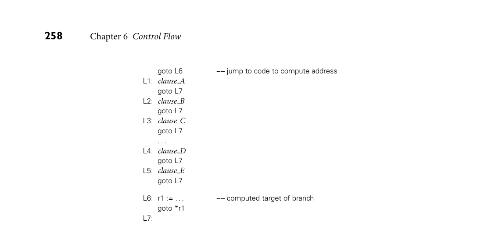
*Figure 6.3  General form of target code generated for a five-arm case statement.*

T:  &L1  –– controlling expression = 1  &L2  &L3  &L3  &L3  &L5  &L2  &L5  &L5  &L4  –– controlling expression = 10  L6: r1 := . . .  –– calculate controlling expression  if r1 < 1 goto L5  if r1 > 10 goto L5  –– L5 is the “else” arm  r1 −:= 1  –– subtract off lower bound  r1 := T[r1]  goto *r1  L7:

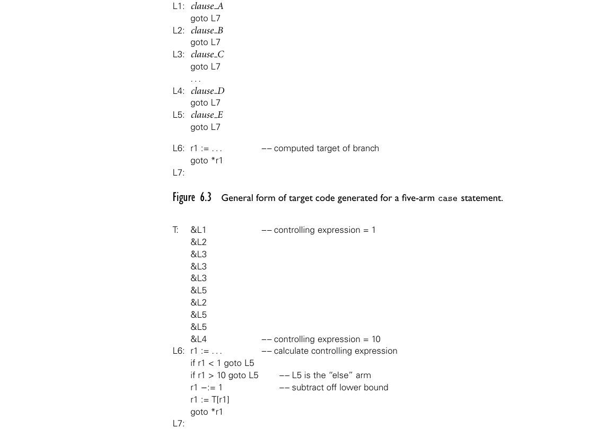
*Figure 6.4  Jump table to control branching in a case statement. This code replaces the last  three lines of Figure 6.3.*

## The “code” at label T in that fgure is in fact an array of addresses, known as a  jump table. It contains one entry for each integer between the lowest and highest  values, inclusive, found among the case statement labels. The code at L6 checks  to make sure that the controlling expression is within the bounds of the array (if  not, we should execute the others arm of the case statement). It then fetches  the corresponding entry from the table and branches to it.  ■

Alternative Implementations

A jump table is fast: it begins executing the correct arm of the case statement  in constant time, regardless of the value of the controlling expression. It is also  space effcient when the overall set of case statement labels is dense and does not  contain large ranges. It can consume an extraordinarily large amount of space,  however, if the set of labels is nondense, or includes large value ranges. Alternative methods to compute the address to which to branch include sequential  testing, hashing, and binary search. Sequential testing (as in an if... then ...  else statement) is the method of choice if the total number of case statement  labels is small. It chooses an arm in O(n) time, where n is the number of labels.  A hash table is attractive if the set of label values is large, but has many missing  values and no large ranges. With an appropriate hash function it will choose the  right arm in O(1) time. Unfortunately, a hash table, like a jump table, requires a  separate entry for each possible value of the controlling tested expression, making  it unsuitable for statements with large value ranges. Binary search can accommodate ranges easily. It chooses an arm in O(log n) time.

To generate good code for all possible case statements, a compiler needs to be  prepared to use a variety of strategies. During compilation it can generate code  for the various arms of the case statement as it fnds them, while simultaneously  building up an internal data structure to describe the label set. Once it has seen  all the arms, it can decide which form of target code to generate. For the sake  of simplicity, most compilers employ only some of the possible implementations.  Some use binary search in lieu of hashing. Some generate only jump tables; others only that plus sequential testing. Users of less sophisticated compilers may  need to restructure their case statements if the generated code turns out to be  unexpectedly large or slow.

Syntax and Label Semantics

```
As with if... then ... else statements, the syntactic details of case statements 
vary from language to language. Different languages use different punctuation 
to delimit labels and arms. More signifcantly, languages differ in whether they 
permit label ranges, whether they permit (or require) a default (others) clause,  
and in how they handle a value that fails to match any label at run time.
```

In some languages (e.g., Modula), it is a dynamic semantic error for the controlling expression to have a value that does not appear in the label lists. Ada

DESIGN & IMPLEMENTATION

6.6 Case statements  Case statements are one of the clearest examples of language design driven by  implementation. Their primary reason for existence is to facilitate the generation of jump tables. Ranges in label lists (not permitted in Pascal or C) may  reduce effciency slightly, but binary search is still dramatically faster than the  equivalent series of ifs.

requires the labels to cover all possible values in the domain of the controlling  expression’s type; if the type has a very large number of values, then this coverage must be accomplished using ranges or an others clause. In some languages,  notably C and Fortran 90, it is not an error for the tested expression to evaluate  to a missing value. Rather, the entire construct has no effect when the value is  missing.

The C switch Statement

C’s syntax for case (switch) statements (retained by C++ and Java) is unusual  in several respects:

switch (... /* controlling expression */) {  case 1:  clause A  break;  case 2:  case 7:  clause B  break;  case 3:  case 4:  case 5:  clause C  break;  case 10: clause D

break;  default: clause E  break;  }

Here each possible value for the tested expression must have its own label  within the switch; ranges are not allowed. In fact, lists of labels are not allowed, but the effect of lists can be achieved by allowing a label (such as 2, 3,  and 4 above) to have an empty arm that simply “falls through” into the code for  the subsequent label. Because of the provision for fall-through, an explicit break  statement must be used to get out of the switch at the end of an arm, rather than

EXAMPLE 6.55  falling through into the next. There are rare circumstances in which the ability to  Fall-through in C switch  fall through is convenient:  statements

letter_case = lower;  switch (c) {  ...  case 'A' :

letter_case = upper;  /* FALL THROUGH! */  case 'a' :  ...  break;  ...  }  ■

```
Most of the time, however, the need to insert a break at the end of each arm— 
and the compiler’s willingness to accept arms without breaks, silently—is a recipe 
for unexpected and diffcult-to-diagnose bugs. C# retains the familiar C syntax, 
including multiple consecutive labels, but requires every nonempty arm to end 
with a break, goto, continue, or  return.
```

## 3CHECK YOUR UNDERSTANDING  19. List the principal uses of goto, and the structured alternatives to each.

```
20. Explain the distinction between exceptions and multilevel returns. 
21. What  are  continuations? What other language features do they subsume?
```

```
22. Why is sequencing a comparatively unimportant form of control fow in Lisp? 
23. Explain why it may sometimes be useful for a function to have side effects. 
24. Describe  the  jump code implementation of short-circuit Boolean evaluation.
```

* Why do imperative languages commonly provide a case or switch statement
  in addition to if... then ... else?
* Describe three different search strategies that might be employed in the im­

plementation of a case statement, and the circumstances in which each  would be desirable.

```
27. Explain  the  use  of  break to terminate the arms of a C switch statement, and 
the behavior that arises if a break is accidentally omitted.
```

### 6.5 Iteration

Iteration and recursion are the two mechanisms that allow a computer to perform similar operations repeatedly. Without at least one of these mechanisms,  the running time of a program (and hence the amount of work it can do and the  amount of space it can use) would be a linear function of the size of the program  text. In a very real sense, it is iteration and recursion that make computers useful  for more than fxed-size tasks. In this section we focus on iteration. Recursion is  the subject of Section 6.6.

Programmers in imperative languages tend to use iteration more than they  use recursion (recursion is more common in functional languages). In most languages, iteration takes the form of loops. Like the statements in a sequence, the iterations of a loop are generally executed for their side effects: their modifcations  of variables. Loops come in two principal varieties, which differ in the mechanisms used to determine how many times to iterate. An enumeration-controlled  loop is executed once for every value in a given fnite set; the number of iterations  is known before the frst iteration begins. A logically controlled loop is executed

until some Boolean condition (which must generally depend on values altered in  the loop) changes value. Most (though not all) languages provide separate constructs for these two varieties of loop.

## 6.5.1 Enumeration-Controlled Loops

Enumeration-controlled iteration originated with the do loop of Fortran I. Similar mechanisms have been adopted in some form by almost every subsequent  language, but syntax and semantics vary widely. Even Fortran’s own loop has

EXAMPLE 6.56  evolved considerably over time. The modern Fortran version looks something  Fortran 90 do loop  like this:

do i = 1, 10, 2  ...  enddo

```
Variable i is called the index of the loop. The expressions that follow the equals 
sign are i’s initial value, its  bound, and  the  step size. With the values shown here, 
the body of the loop (the statements between the loop header and the enddo delimiter) will execute fve times, with i set to 1, 3, ..., 9 in successive iterations. ■
```

EXAMPLE 6.57  Many other languages provide similar functionality. In Modula-2 one would  Modula-2 for loop  say

FOR i := first TO last BY step DO  ...  END

```
By choosing different values of first, last, and  step, we could arrange to iterate over an arbitrary arithmetic sequence of integers, namely i = first, first 
+ step, ..., first + (last − first)/step ⌋× step. 
■ 
Following the lead of Clu, many modern languages allow enumerationcontrolled loops to iterate over much more general fnite sets—the nodes of a 
tree, for example, or the elements of a collection. We consider these more general 
iterators in Section 6.5.3. For the moment we focus on arithmetic sequences. For 
the sake of simplicity, we use the name “for loop” as a general term, even for 
languages that use a different keyword.
```

⌊

Code Generation for for Loops

EXAMPLE 6.58  Naively, the loop of Example 6.57 can be translated as  Obvious translation of a

r1 := frst  for loop

r2 := step  r3 := last  L1: if r1 > r3 goto L2  . . .  –– loop body; use r1 for i  r1 := r1 + r2  goto L1  L2:  ■

EXAMPLE 6.59  A slightly better if less straightforward translation is  for loop translation with  test at the bottom  r1 := frst  r2 := step  r3 := last  goto L2  L1: . . .  –– loop body; use r1 for i  r1 := r1 + r2  L2: if r1 ≤ r3 goto L1

```
This version is likely to be faster, because each iteration contains a single conditional branch, rather than a conditional branch at the top and an unconditional branch at the bottom. (We will consider yet another version in Exercise C 17.4.) 
■ 
Note that both of these translations employ a loop-ending test that is fundamentally directional: as shown, they assume that all the realized values of i will 
be smaller than last. If the loop goes “the other direction”—that is, if first > 
last, and  step < 0—then we will need to use the inverse test to end the loop. To 
allow the compiler to make the right choice, many languages restrict the generality 
of their arithmetic sequences. Commonly, step is required to be a compile-time 
constant. Ada actually limits the choices to ±1. Several languages, including both 
Ada and Pascal, require special syntax for loops that iterate “backward” (for i 
in reverse 10..1 in Ada; for i := 10 downto 1 in Pascal).
```

Obviously, one can generate code that checks the sign of step at run time,  and chooses a test accordingly. The obvious translations, however, are either time

EXAMPLE 6.60  or space ineffcient. An arguably more attractive approach, adopted by many  for loop translation with  Fortran compilers, is to precompute the number of iterations, place this iteration  an iteration count  count in a register, decrement the register at the end of each iteration, and branch  back to the top of the loop if the count is not yet zero:

```
r1 := frst 
r2 := step 
r3 := max( (last − frst + step)/step , 0) 
–– iteration count 
–– NB: this calculation may require several instructions. 
–– It is guaranteed to result in a value within the precision of the machine, 
–– but we may have to be careful to avoid overfow during its calculation. 
if r3 ≤ 0 goto L2 
L1: . . . 
–– loop body; use r1 for i 
r1 := r1 + r2 
r3 := r3 −1 
if r3 > 0 goto L1 
i :=  r1  
L2: 
■
```

⌊ ⌋

The use of the iteration count avoids the need to test the sign of step within

EXAMPLE 6.61  the loop. Assuming we have been suitably careful in precomputing the count, it  A “gotcha” in the naive  also avoids a problem we glossed over in the naive translations of Examples 6.58  loop translation

and 6.59:  If last is near the maximum value representable by integers on our  machine, naively adding step to the fnal legitimate value of i may result in arithmetic overfow. The “wrapped” number may then appear to be smaller (much  smaller!) than last, and we may have translated perfectly good source code into  an infnite loop.  ■  Some processors, including the Power family, PA-RISC, and most CISC machines, can decrement the iteration count, test it against zero, and conditionally  branch, all in a single instruction. For many loops this results in very effcient  code.

Semantic Complications

The astute reader may have noticed that use of an iteration count is fundamentally dependent on being able to predict the number of iterations before the loop  begins to execute. While this prediction is possible in many languages, including  Fortran and Ada, it is not possible in others, notably C and its descendants. The  difference stems largely from the following question: is the for loop construct  only for iteration, or is it simply meant to make enumeration easy? If the language insists on enumeration, then an iteration count works fne. If enumeration  is only one possible purpose for the loop—more specifcally, if the number of iterations or the sequence of index values may change as a result of executing the frst  few iterations—then we may need to use a more general implementation, along  the lines of Example 6.59, modifed if necessary to handle dynamic discovery of  the direction of the terminating test.

DESIGN & IMPLEMENTATION

6.7 Numerical imprecision  Among its many changes to the do loop of Fortran IV, Fortran 77 allowed the  index, bounds, and step size of the loop to be foating-point numbers, not  just integers. Interestingly, this feature was taken back out of the language in  Fortran 90.

The problem with real-number sequences is that limited precision can cause  comparisons (e.g., between the index and the bound) to produce unexpected  or even implementation-dependent results when the values are close to one  another. Should

for x := 1.0 to 2.0 by 1.0 / 3.0

execute three iterations or four? It depends on whether 1.0 / 3.0 is rounded up  or down. The Fortran 90 designers appear to have decided that such ambiguity  is philosophically inconsistent with the idea of fnite enumeration. The programmer who wants to iterate over foating-point values must use an explicit  comparison in a pretest or post-test loop (Section 6.5.5).

The choice between requiring and (merely) enabling enumeration manifests  itself in several specifc questions:

* Can control enter or leave the loop in any way other than through the enumer­

ation mechanism?  2. What happens if the loop body modifes variables that were used to compute  the end-of-loop bound?  3. What happens if the loop body modifes the index variable itself?  4. Can the program read the index variable after the loop has completed, and if  so, what will its value be?

Questions (1) and (2) are relatively easy to resolve. Most languages allow a  break/exit statement to leave a for loop early. Fortran IV allowed a goto to  jump into a loop, but this was generally regarded as a language faw; Fortran 77  and most other languages prohibit such jumps. Similarly, most languages (but  not C; see Section 6.5.2) specify that the bound is computed only once, before the  frst iteration, and kept in a temporary location. Subsequent changes to variables  used to compute the bound have no effect on how many times the loop iterates.

EXAMPLE 6.62

Questions (3) and (4) are more diffcult. Suppose we write (in no particular  language)

Changing the index in a  for loop

for i := 1 to 10 by 2

...  if i = 3

i := 6

```
What should happen at the end of the i=3 iteration? Should the next iteration 
have i = 5 (the next element of the arithmetic sequence specifed in the loop 
header), i = 8 (2 more than 6), or even conceivably i = 7 (the  next  value of  
the sequence after 6)? One can imagine reasonable arguments for each of these 
options. To avoid the need to choose, many languages prohibit changes to the 
loop index within the body of the loop. Fortran makes the prohibition a matter of programmer discipline: the implementation is not required to catch an 
erroneous update. Pascal provided an elaborate set of conservative rules [Int90, 
Sec. 6.8.3.9] that allowed the compiler to catch all possible updates. These rules 
were complicated by the fact that the index variable was declared outside the loop; 
it might be visible to subroutines called from the loop even if it was not passed as 
a parameter. 
■ 
If control escapes the loop with a break/exit, the natural value for the index would seem to be the one that was current at the time of the escape. For 
“normal” termination, on the other hand, the natural value would seem to be 
the frst one that exceeds the loop bound. Certainly that is the value that will be 
produced by the implementation of Example 6.59. Unfortunately, as we noted in 
Example 6.60, the “next” value for some loops may be outside the range of integer 
precision. For other loops, it may be semantically invalid:
```

EXAMPLE 6.63

Inspecting the index after a  for loop

c : ’a’..’z’  –– character subrange  ...  for c := ’a’ to ’z’ do

...  –– what comes after ’z’?

Requiring the post-loop value to always be the index of the fnal iteration is  unattractive from an implementation perspective: it would force us to replace  Example 6.59 with a translation that has an extra branch instruction in every iteration:

r1 := ’a’  r2 := ’z’  if r1 > r2 goto L3  –– Code improver may remove this test,  –– since ’a’ and ’z’ are constants.  L1: . . .  –– loop body; use r1 for i  if r1 = r2 goto L2  r1 := r1 + 1  goto L1  L2: i := r1  L3:

Of course, the compiler must generate this sort of code in any event (or use an  iteration count) if arithmetic overfow may interfere with testing the terminating  condition. To permit the compiler to use the fastest correct implementation in all  cases, several languages, including Fortran 90 and Pascal, say that the value of the  index is undefned after the end of the loop.  ■  An attractive solution to both the index modifcation problem and the postloop value problem was pioneered by Algol W and Algol 68, and subsequently  adopted by Ada, Modula 3, and many other languages. In these, the header of the  loop is considered to contain a declaration of the index. Its type is inferred from  the bounds of the loop, and its scope is the loop’s body. Because the index is not  visible outside the loop, its value is not an issue. Of course, the programmer must  not give the index the same name as any variable that must be accessed within the  loop, but this is a strictly local issue: it has no ramifcations outside the loop.

## 6.5.2 Combination Loops

Algol 60 provided a single loop construct that subsumed the properties of more  modern enumeration and logically controlled loops. It allowed the programmer  to specify an arbitrary number of “enumerators,” each of which could be a single  value, a range of values similar to those of modern enumeration-controlled loops,  or an expression with a terminating condition. Common Lisp provides an even  more powerful facility, with four separate sets of clauses, to initialize index variables (of which there may be an arbitrary number), test for loop termination (in  any of several ways), evaluate body expressions, and clean up at loop termination.

A much simpler form of combination loop appears in C and its successors.  Semantically, the C for loop is logically controlled. It was designed, however, to

EXAMPLE 6.64  make enumeration easy. Our Modula-2 example  Combination (for) loop  in C  FOR i := first TO last BY step DO  ...  END

would  usually  be  written in C  as

for (i = first; i <= last; i += step) {  ...  }

With caveats for a few special cases, C defnes this to be equivalent to

{  i = first;  while (i <= last) {

...  i += step;  }  ■  }

This defnition means that it is the programmer’s responsibility to worry about  the effect of overfow on testing of the terminating condition. It also means that  both the index and any variables contained in the terminating condition can be  modifed by the body of the loop, or by subroutines it calls, and these changes will  affect the loop control. This, too, is the programmer’s responsibility.

Any of the three clauses in the for loop header can be null (the condition is  considered true if missing). Alternatively, a clause can consist of a sequence of  comma-separated expressions. The advantage of the C for loop over its while  loop equivalent is compactness and clarity. In particular, all of the code affecting

DESIGN & IMPLEMENTATION

## 6.8 for loops  Modern for loops refect the impact of both semantic and implementation  challenges. Semantic challenges include changes to loop indices or bounds  from within the loop, the scope of the index variable (and its value, if any, outside the loop), and gotos that enter or leave the loop. Implementation challenges include the imprecision of foating-point values, the direction of the  bottom-of-loop test, and overfow at the end of the iteration range. The “combination loops” of C (Section 6.5.2) move responsibility for these challenges  out of the compiler and into the application program.

the fow of control is localized within the header. In the while loop, one must  read both the top and the bottom of the loop to know what is going on.

While the logical iteration semantics of the C for loop eliminate any ambiguity about the value of the index variable after the end of the loop, it may still be  convenient to make the index local to the body of the loop, by declaring it in the  header’s initialization clause. In Example 6.64, variable i must be declared in the

EXAMPLE 6.65  surrounding scope. If we instead write  C for loop with a local  index  for (int i = first; i <= last; i += step) {  ...  }

then i will not be visible outside. It will still, however, be vulnerable to (deliberate  or accidental) modifcation within the loop.  ■

## 6.5.3 Iterators

In all of the examples we have seen so far (with the possible exception of the combination loops of Algol 60, Common Lisp, or C), a for loop iterates over the elements of an arithmetic sequence. In general, however, we may wish to iterate over  the elements of any well-defned set (what are often called collections, or instances  of a container class, in object-oriented code). Clu introduced an elegant iterator  mechanism (also found in Python, Ruby, and C#) to do precisely that. Euclid and  several more recent languages, notably C++, Java, and Ada 2012, defne a standard interface for iterator objects (sometimes called enumerators) that are equally  easy to use, but not as easy to write. Icon, conversely, provides a generalization  of iterators, known as generators, that combines enumeration with backtracking  search.7

True Iterators

Clu, Python, Ruby, and C# allow any container abstraction to provide an iterator  that enumerates its items. The iterator resembles a subroutine that is permitted to  contain yield statements, each of which produces a loop index value. For loops

EXAMPLE 6.66  are then designed to incorporate a call to an iterator. The Modula-2 fragment  Simple iterator in Python

FOR i := first TO last BY step DO  ...  END

would be written as follows in Python:

7  Unfortunately, terminology is not consistent across languages. Euclid uses the term “generator”  for what are called “iterator objects” here. Python uses it for what are called “true iterators” here.

```
class BinTree: 
def __init__(self): 
# constructor 
self.data = self.lchild = self.rchild = None 
... 
# other methods: insert, delete, lookup, ...
```

```
def preorder(self): 
if self.data != None: 
yield self.data 
if self.lchild != None: 
for d in self.lchild.preorder(): 
yield d 
if self.rchild != None: 
for d in self.rchild.preorder(): 
yield d
```

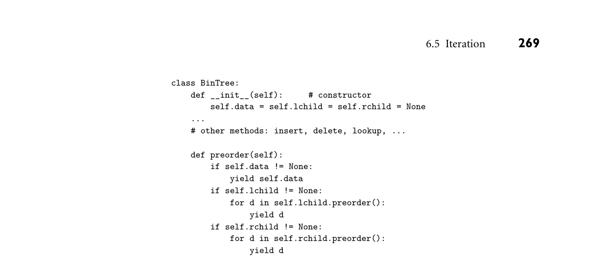
*Figure 6.5  Python iterator for preorder enumeration of the nodes of a binary tree. Because  Python is dynamically typed, this code will work for any data that support the operations needed  by insert, lookup, and so on (probably just <). In a statically typed language, the BinTree  class would need to be generic.*

for i in range(first, last, step):  ...

Here range is a built-in iterator that yields the integers from first to first +  (last − first)/step ⌋× step in increments of step.  ■  When called, the iterator calculates the frst index value of the loop, which it  returns to the main program by executing a yield statement. The yield behaves like return, except that when control transfers back to the iterator after  completion of the frst iteration of the loop, the iterator continues where it last  left off—not at the beginning of its code. When the iterator has no more elements  to yield it simply returns (without a value), thereby terminating the loop.

⌊

In effect, an iterator is a separate thread of control, with its own program  counter, whose execution is interleaved with that of the for loop to which it supplies index values.8 The iteration mechanism serves to “decouple” the algorithm  required to enumerate elements from the code that uses those elements.

EXAMPLE 6.67  The range iterator is predefned in Python. As a more illustrative example,  Python iterator for tree  consider the preorder enumeration of values stored in a binary tree. A Python  enumeration  iterator for this task appears in Figure 6.5. Invoked from the header of a for  loop, it yields the value in the root node (if any) for the frst iteration and then  calls itself recursively, twice, to enumerate values in the left and right subtrees. ■

8  Because iterators are interleaved with loops in a very regular way, they can be implemented more  easily (and cheaply) than fully general threads. We will consider implementation options further  in Section C 9.5.3.

Iterator Objects

As realized in most imperative languages, iteration involves both a special form  of for loop and a mechanism to enumerate values for the loop. These concepts  can be separated. Euclid, C++, Java, and Ada 2012 all provide enumerationcontrolled loops reminiscent of those of Python. They have no yield statement,  however, and no separate thread-like context to enumerate values; rather, an iterator is an ordinary object (in the object-oriented sense of the word) that provides methods for initialization, generation of the next index value, and testing  for completion. Between calls, the state of the iterator must be kept in the object’s  data members.

```
EXAMPLE 6.68 
Figure 6.6 contains the Java equivalent of the BinTree class of Figure 6.5. 
Java iterator for tree 
Given this code, we can write 
enumeration
```

BinTree<Integer> myTree = ...  ...  for (Integer i : myTree) {

System.out.println(i);  }

The loop here is syntactic sugar for

for (Iterator<Integer> it = myTree.iterator(); it.hasNext();) {  Integer i = it.next();  System.out.println(i);  }

The expression following the colon in the more concise version of the loop must  be an object that supports the standard Iterable interface. This interface includes an iterator() method that returns an Iterator object.  ■

EXAMPLE 6.69  C++ takes a related but somewhat different approach. With appropriate defIteration in C++11  nitions, the Java for loop of the previous example could be written as follows in  C++11:

tree_node* my_tree = ...  ...  for (int n : *my_tree) {

cout << n << "\n";  }

DESIGN & IMPLEMENTATION

## 6.9 “True” iterators and iterator objects  While the iterator library mechanisms of C++ and Java are highly useful,  it is worth emphasizing that they are not the functional equivalents of “true”  iterators, as found in Clu, Python, Ruby, and C#. Their key limitation is the  need to maintain all intermediate state in the form of explicit data structures,  rather than in the program counter and local variables of a resumable execution context.

```
class BinTree<T> implements Iterable<T> { 
BinTree<T> left; 
BinTree<T> right; 
T val;  
... 
// other methods: insert, delete, lookup, ...
```

public Iterator<T> iterator() {

```
return new TreeIterator(this); 
} 
private class TreeIterator implements Iterator<T> {
```

private Stack<BinTree<T>> s = new Stack<BinTree<T>>();  TreeIterator(BinTree<T> n) {

if (n.val != null) s.push(n);  }  public boolean hasNext() {

return !s.empty();  }  public T next() {

if (!hasNext()) throw new NoSuchElementException();  BinTree<T> n = s.pop();  if (n.right != null) s.push(n.right);  if (n.left != null) s.push(n.left);  return n.val;  }  public void remove() {  throw new UnsupportedOperationException();  }  }  }

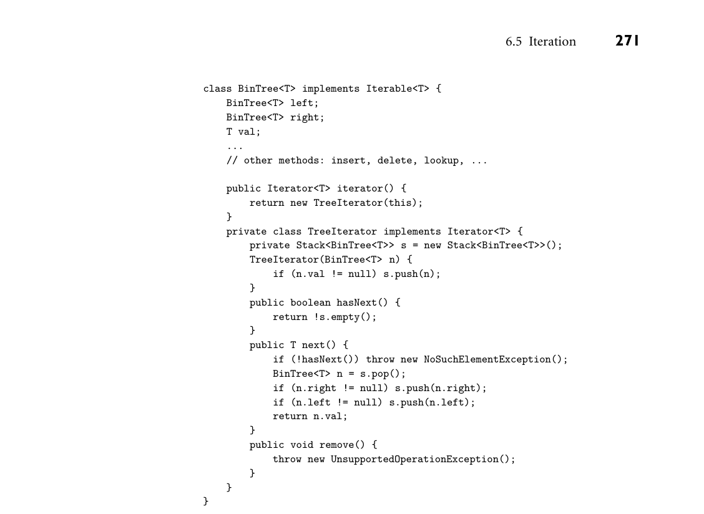
*Figure 6.6  Java code for preorder enumeration of the nodes of a binary tree. The nested  TreeIterator class uses an explicit Stack object (borrowed from the standard library) to keep  track of subtrees whose nodes have yet to be enumerated. Java generics, specifed as <T> type  arguments for BinTree, Stack, Iterator, and  Iterable, allow next to return an object of  the appropriate type, rather than the undifferentiated Object. The  remove method is part of  the Iterator interface, and must therefore be provided, if only as a placeholder.*

This loop is syntactic sugar for

for (tree_node::iterator it = my_tree->begin();

it != my_tree->end(); ++it) {  int n = *it;  cout << n << "\n";  }

Where a Java iterator has methods to produce successive elements of a collection  on demand (and to indicate when there are no more), a C++ iterator is designed

to act as a special kind of pointer. Support routines in the standard library leverage the language’s unusually fexible operator overloading and reference mechanisms to redefne comparison (!=), increment (++), dereference (*), and so on  in a way that makes iterating over the elements of a collection look very much like  using pointer arithmetic to traverse a conventional array (“Pointers and Arrays in  C,” Section 8.5.1).

As in the Java example, iterator it encapsulates all the state needed to fnd  successive elements of the collection, and to determine when there are no more.  To obtain the current element, we “dereference” the iterator, using the * or ->  operators. The initial value of the iterator is produced by a collection’s begin  method. To advance to the following element, we use the increment (++) operator. The end method returns a special iterator that “points beyond the end” of the  collection. The increment (++) operator must return a reference that tests equal  to this special iterator when the collection has been exhausted.  ■  Code to implement our C++ tree iterator is somewhat messier than the Java  version of Figure 6.6, due to operator overloading, the value model of variables  (which requires explicit references and pointers), and the lack of garbage collection. We leave the details to Exercise 6.19.

Iterating with First-Class Functions

In functional languages, the ability to specify a function “in line” facilitates a programming idiom in which the body of a loop is written as a function, with the  loop index as an argument. This function is then passed as the fnal argument to

EXAMPLE 6.70  an iterator, which is itself a function. In Scheme we might write  Passing the “loop body” to  an iterator in Scheme  (define uptoby  (lambda (low high step f)  (if (<= low high)  (begin  (f low)  (uptoby (+ low step) high step f))  '())))

We could then sum the frst 50 odd numbers as follows:

(let ((sum 0))  (uptoby 1 100 2  (lambda (i)  (set! sum (+ sum i))))  sum)  =⇒ 2500

Here the body of the loop, (set! sum (+ sum i)), is an assignment. The =⇒  symbol (not a part of Scheme) is used here to mean “evaluates to.”  ■

```
EXAMPLE 6.71 
Smalltalk, which we consider in Section C 10.7.1, supports a similar idiom: 
Iteration with blocks in 
Smalltalk 
sum <- 0.  
1 to: 100 by: 2 do: 
[:i | sum <- sum + i]
```

```
Like a lambda expression in Scheme, a square-bracketed block in Smalltalk creates 
a frst-class function, which we then pass as argument to the to: by: do: iterator. 
The iterator calls the function repeatedly, passing successive values of the index 
variable i as argument. 
■ 
Iterators in Ruby are also similar, with functional semantics but syntax remi-
```

```
EXAMPLE 6.72 
niscent of Python or C#. Our uptoby iterator in Ruby could be written as follows: 
Iterating with procs in 
Ruby 
def uptoby(first, last, inc)
```

while first <= last do  yield first  first += inc  end  end  ...  sum = 0  uptoby(1, 100, 2) { |i| sum += i }  puts sum  =⇒ 2500

This code is defned as syntactic sugar for

def uptoby(first, last, inc, block)

while first <= last do  block.call(first)  first += inc  end  end  ...  sum = 0  uptoby(1, 100, 2, Proc.new { |i| sum += i })  puts sum

When a block, delimited by braces or do... end, follows the parameter list of a  function invocation, Ruby passes a closure representing the block (a “proc”) as  an implicit extra argument to the function. Within the body of the function,  yield is defned as a call to the function’s last parameter, which must be a proc,  and need not be explicitly declared.

For added convenience, all of Ruby’s collection objects (arrays, ranges, mappings, and sets) support a method named each that will invoke a block for every  element of the collection. To sum the frst 100 integers (without the step size of  2), we could say

sum = 0  (1..100).each { |i| sum += i }  puts sum  =⇒ 5050

This code serves as the defnition of conventional for-loop syntax, which is further syntactic sugar:

sum = 0  for i in (1..100) do

```
sum += i  
end 
puts sum
```

In Lisp and Scheme, one can defne similar syntactic sugar using continuations  (Section 6.2.2) and lazy evaluation (Section 6.6.2); we consider this possibility in  Exercises 6.34 and 6.35.  ■

Iterating without Iterators

EXAMPLE 6.73  In a language with neither true iterators nor iterator objects, we can still decouImitating iterators in C  ple the enumeration of a collection from actual use of the elements by adopting  appropriate programming conventions. In C, for example, we might defne a  tree_iter type and associated functions that could be used in a loop as follows:

bin_tree *my_tree;  tree_iter ti;  ...  for (ti_create(my_tree, &ti); !ti_done(ti); ti_next(&ti)) {

bin_tree *n = ti_val(ti);  ...  }  ti_delete(&ti);

There are two principal differences between this code and the more structured alternatives: (1) the syntax of the loop is a good bit less elegant (and arguably more  prone to accidental errors), and (2) the code for the iterator is simply a type and  some associated functions—C provides no abstraction mechanism to group them  together as a module or a class. By providing a standard interface for iterator abstractions, object-oriented languages facilitate the design of higher-order mechanisms that manipulate whole collections: sorting them, merging them, fnding  their intersection or difference, and so on. We leave the C code for tree_iter  and the various ti_ functions to Exercise 6.20.  ■

## 6.5.4 Generators in Icon

Icon generalizes the concept of iterators, providing a generator mechanism that  causes any expression in which it is embedded to enumerate multiple values on  demand.

IN MORE DEPTH

We consider Icon generators in more detail on the companion site. The language’s  enumeration-controlled loop, the every loop, can contain not only a generator,

but any expression that contains a generator. Generators can also be used in constructs like if statements, which will execute their nested code if any generated  value makes the condition true, automatically searching through all the possibilities. When generators are nested, Icon explores all possible combinations of  generated values, and will even backtrack where necessary to undo unsuccessful  control-fow branches or assignments.

## 6.5.5 Logically Controlled Loops

In comparison to enumeration-controlled loops, logically controlled loops have  many fewer semantic subtleties. The only real question to be answered is where  within the body of the loop the terminating condition is tested. By far the most

EXAMPLE 6.74  common approach is to test the condition before each iteration. The familiar  while loop in Algol-W  while loop syntax for this was introduced in Algol-W:

while condition do statement

To allow the body of the loop to be a statement list, most modern languages use  an explicit concluding keyword (e.g., end), or bracket the body with delimiters  (e.g., { ... }). A few languages (notably Python) indicate the body with an extra  level of indentation.  ■

Post-test Loops

Occasionally it is handy to be able to test the terminating condition at the bottom  of a loop. Pascal introduced special syntax for this case, which was retained in

EXAMPLE 6.75  Modula but dropped in Ada. A post-test loop allows us, for example, to write  Post-test loop in Pascal  repeat and Modula

readln(line)  until line[1] = '$';

instead of

readln(line);  while line[1] <> '$' do  readln(line);

The difference between these constructs is particularly important when the body  of the loop is longer. Note that the body of a post-test loop is always executed at  least once.  ■

EXAMPLE 6.76  C provides a post-test loop whose condition works “the other direction” (i.e.,  Post-test loop in C  “while” instead of “until”):

do {  line = read_line(stdin);  } while (line[0] != '$');

■

Mid-test Loops

Finally, as we noted in Section 6.2.1, it is sometimes appropriate to test the terminating condition in the middle of a loop. In many languages this “mid-test”  can be accomplished with a special statement nested inside a conditional: exit

```
EXAMPLE 6.77 
in Ada, break in C, last in Perl. In Section 6.4.2 we saw a somewhat unusual use 
break statement in C 
of break to leave a C switch statement. More conventionally, C also uses break 
to exit the closest for, while, or  do loop:
```

```
for (;;) {  
line = read_line(stdin); 
if (all_blanks(line)) break; 
consume_line(line); 
}
```

Here the missing condition in the for loop header is assumed to always be  true. (C programmers have traditionally preferred this syntax to the equivalent  while (1), presumably because it was faster in certain early C compilers.)  ■

EXAMPLE 6.78  In some languages, an exit statement takes an optional loop-name argument  Exiting a nested loop in  that allows control to escape a nested loop. In Ada we might write  Ada

outer: loop

get_line(line, length);  for i in 1..length loop

exit outer when line(i) = '$';  consume_char(line(i));  end loop;  end loop outer;  ■

EXAMPLE 6.79  In Perl this would be  Exiting a nested loop in  Perl  outer: while (<>) {  # iterate over lines of input  foreach $c (split //) {  # iterate over remaining chars  last outer if ($c =~ '\$'); # exit main loop if we see a $ sign  consume_char($c);  }  }  ■

Java extends the C/C++ break statement in a similar fashion, with optional labels  on loops.

## 3CHECK YOUR UNDERSTANDING  28. Describe three subtleties in the implementation of enumeration-controlled  loops.  29. Why do most languages not allow the bounds or increment of an enumerationcontrolled loop to be foating-point numbers?

* Why do many languages require the step size of an enumeration-controlled
  loop to be a compile-time constant?
* Describe the “iteration count” loop implementation. What problem(s) does
  it solve?
* What are the advantages of making an index variable local to the loop it con­

trols?

```
33. Does C have enumeration-controlled loops? Explain. 
34. What  is  a  collection (a container instance)? 
35. Explain the difference between true iterators and iterator objects.
```

* Cite two advantages of iterator objects over the use of programming conven­

tions in a language like C.

```
37. Describe the approach to iteration typically employed in languages with frstclass functions. 
38. Give an example in which a mid-test loop results in more elegant code than 
does a pretest or post-test loop.
```

### 6.6 Recursion

```
Unlike the control-fow mechanisms discussed so far, recursion requires no special syntax. In any language that provides subroutines (particularly functions), all 
that is required is to permit functions to call themselves, or to call other functions 
that then call them back in turn. Most programmers learn in a data structures 
class that recursion and (logically controlled) iteration provide equally powerful 
means of computing functions: any iterative algorithm can be rewritten, automatically, as a recursive algorithm, and vice versa. We will compare iteration and 
recursion in more detail in the frst subsection below. In the following subsection 
we will consider the possibility of passing unevaluated expressions into a function. While usually inadvisable, due to implementation cost, this technique will 
sometimes allow us to write elegant code for functions that are only defned on a 
subset of the possible inputs, or that explore logically infnite data structures.
```

## 6.6.1 Iteration and Recursion

As we noted in Section 3.2, Fortran 77 and certain other languages do not permit  recursion. A few functional languages do not permit iteration. Most modern  languages, however, provide both mechanisms. Iteration is in some sense the  more “natural” of the two in imperative languages, because it is based on the  repeated modifcation of variables. Recursion is the more natural of the two in

functional languages, because it does not change variables. In the fnal analysis,

EXAMPLE 6.80  which to use in which circumstance is mainly a matter of taste. To compute a  A “naturally iterative”  sum,  problem



f (i)

1≤i≤10

it seems natural to use iteration. In C one would say

```
typedef int (*int_func) (int); 
int summation(int_func f, int low, int high) { 
/* assume low <= high */ 
int total = 0; 
int i; 
for (i = low; i <= high; i++) {
```

total += f(i);  // (C will automatically dereference  // a function pointer when we attempt to call it.)  }  return total;  }  ■

EXAMPLE 6.81  To compute a value defned by a recurrence,  A “naturally recursive”  ⎧ problem  ⎨ a  if a = b  gcd(a, b)  ≡  gcd(a−b, b)  if a > b  ⎩ (positive integers, a, b)  gcd(a, b−a)  if b > a

recursion may seem more natural:

int gcd(int a, int b) {  /* assume a, b > 0 */  if (a == b) return a;  else if (a > b) return gcd(a-b, b);  else return gcd(a, b-a);  }  ■

```
EXAMPLE 6.82 
In both these cases, the choice could go the other way: 
Implementing problems 
“the other way” 
typedef int (*int_func) (int); 
int summation(int_func f, int low, int high) { 
/* assume low <= high */ 
if (low == high) return f(low); 
else return f(low) + summation(f, low+1, high); 
}
```

int gcd(int a, int b) {

/* assume a, b > 0 */  while (a != b) {

```
if (a >  b) a  = a-b;  
else b = b-a; 
} 
return a; 
} 
■
```

Tail Recursion

It is sometimes argued that iteration is more effcient than recursion. It is more  accurate to say that naive implementation of iteration is usually more effcient  than naive implementation of recursion. In the examples above, the iterative implementations of summation and greatest divisors will be more effcient than the  recursive implementations if the latter make real subroutine calls that allocate  space on a run-time stack for local variables and bookkeeping information. An  “optimizing” compiler, however, particularly one designed for a functional language, will often be able to generate excellent code for recursive functions. It  is particularly likely to do so for tail-recursive functions such as gcd above. A  tail-recursive function is one in which additional computation never follows a recursive call: the return value is simply whatever the recursive call returns. For  such functions, dynamically allocated stack space is unnecessary: the compiler  can reuse the space belonging to the current iteration when it makes the recursive  call. In effect, a good compiler will recast the recursive gcd function above as  follows:

EXAMPLE 6.83

Iterative implementation of  tail recursion

int gcd(int a, int b) {

/* assume a, b > 0 */  start:

if (a == b) return a;  else if (a > b) {

```
a = a-b; goto start; 
} else  {
```

b = b-a; goto start;  }  }  ■

Even for functions that are not tail-recursive, automatic, often simple transformations can produce tail-recursive code. The general case of the transformation employs conversion to what is known as continuation-passing style [FWH01,  Chaps. 7–8]. In effect, a recursive function can always avoid doing any work after  returning from a recursive call by passing that work into the recursive call, in the  form of a continuation.

Some specifc transformations (not based on continuation passing) are often  employed by skilled users of functional languages. Consider, for example, the  recursive summation function above, written here in Scheme:

EXAMPLE 6.84

By-hand creation of  tail-recursive code

(define summation  (lambda (f low high)

```
(if (= low high)  
(f low) 
; then part 
(+ (f low) (summation f (+ low 1) high))))) 
; else part
```

Recall that Scheme, like all Lisp dialects, uses Cambridge Polish notation for expressions. The lambda keyword is used to introduce a function. As recursive calls  return, our code calculates the sum from “right to left”: from high down to low.  If the programmer (or compiler) recognizes that addition is associative, we can  rewrite the code in a tail-recursive form:

(define summation  (lambda (f low high subtotal)

```
(if (= low high)  
(+ subtotal (f low)) 
(summation f (+ low 1) high (+ subtotal (f low))))))
```

Here the subtotal parameter accumulates the sum from left to right, passing it  into the recursive calls. Because it is tail recursive, this function can be translated  into machine code that does not allocate stack space for recursive calls. Of course,  the programmer won’t want to pass an explicit subtotal parameter to the initial  call, so we hide it (the parameter) in an auxiliary, “helper” function:

(define summation  (lambda (f low high)  (letrec ((sum-helper  (lambda (low subtotal)  (let ((new_subtotal (+ subtotal (f low))))

(if (= low high)  new_subtotal  (sum-helper (+ low 1) new_subtotal))))))  (sum-helper low 0))))

```
The let construct in Scheme serves to introduce a nested scope in which local 
names (e.g., new_subtotal) can  be  defned.  The  letrec construct permits the 
defnition of recursive functions (e.g., sum-helper). 
■
```

Thinking Recursively

Detractors of functional programming sometimes argue, incorrectly, that recur-

EXAMPLE 6.85  sion leads to algorithmically inferior programs. Fibonacci numbers, for example,  Naive recursive Fibonacci  are defned by the mathematical recurrence  function



```
1
 if
n = 0 or  n = 1
Fn 
≡ 
Fn−1 + Fn−2 
otherwise 
(non-negative integer n)
```

The naive way to implement this recurrence in Scheme is

(define fib  (lambda (n)

```
(cond ((= n 0) 1) 
((= n 1) 1) 
(#t (+  (fib  (- n  1)) (fib (- n 2)))))))  
; #t means 'true' in Scheme 
■
```

Unfortunately, this algorithm takes exponential time, when linear time is possi-

```
EXAMPLE 6.86 
ble.9 In C, one might write 
Linear iterative Fibonacci 
function 
int fib(int n) { 
int f1 =  1; int f2 = 1;  
int i; 
for (i =  2; i <=  n; i++)  {  
int temp = f1 +  f2;  
f1 = f2; f2 = temp; 
} 
return f2; 
} 
■
```

One can write this iterative algorithm in Scheme: the language includes (non-

EXAMPLE 6.87  functional) iterative features. It is probably better, however, to draw inspiration  Efficient tail-recursive  from the tail-recursive version of the summation example above, and write the  Fibonacci function  following O(n) recursive function:

(define fib  (lambda (n)  (letrec ((fib-helper  (lambda (f1 f2 i)

```
(if (= i n)  
f2 
(fib-helper f2 (+ f1 f2) (+ i 1)))))) 
(fib-helper 0 1 0))))
```

For a programmer accustomed to writing in a functional style, this code is perfectly natural. One might argue that it isn’t “really” recursive; it simply casts an  iterative algorithm in a tail-recursive form, and this argument has some merit.  Despite the algorithmic similarity, however, there is an important difference between the iterative algorithm in C and the tail-recursive algorithm in Scheme: the  latter has no side effects. Each recursive call of the fib-helper function creates  a new scope, containing new variables. The language implementation may be  able to reuse the space occupied by previous instances of the same scope, but it  guarantees that this optimization will never introduce bugs.  ■

9  Actually, one can do substantially better than linear time using algorithms based on binary matrix  multiplication or closest-integer rounding of continuous functions, but these approaches suffer  from high constant-factor costs or problems with numeric precision. For most purposes the  linear-time algorithm is a reasonable choice.

## 6.6.2 Applicative- and Normal-Order Evaluation

Throughout the discussion so far we have assumed implicitly that arguments are  evaluated before passing them to a subroutine. This need not be the case. It is  possible to pass a representation of the unevaluated arguments to the subroutine  instead, and to evaluate them only when (if) the value is actually needed. The former option (evaluating before the call) is known as applicative-order evaluation;  the latter (evaluating only when the value is actually needed) is known as normalorder evaluation. Normal-order evaluation is what naturally occurs in macros  (Section 3.7). It also occurs in short-circuit Boolean evaluation (Section 6.1.5),  call-by-name parameters (to be discussed in Section 9.3.1), and certain functional  languages (to be discussed in Section 11.5).

Algol 60 uses normal-order evaluation by default for user-defned functions  (applicative order is also available). This choice was presumably made to mimic  the behavior of macros (Section 3.7). Most programmers in 1960 wrote mainly  in assembler, and were accustomed to macro facilities. Because the parameterpassing mechanisms of Algol 60 are part of the language, rather than textual abbreviations, problems like misinterpreted precedence or naming conficts do not  arise. Side effects, however, are still very much an issue. We will discuss Algol 60  parameters in more detail in Section 9.3.1.

Lazy Evaluation

From the points of view of clarity and effciency, applicative-order evaluation is  generally preferable to normal-order evaluation. It is therefore natural for it to  be employed in most languages. In some circumstances, however, normal-order  evaluation can actually lead to faster code, or to code that works when applicativeorder evaluation would lead to a run-time error. In both cases, what matters is  that normal-order evaluation will sometimes not evaluate an argument at all, if  its value is never actually needed. Scheme provides for optional normal-order

DESIGN & IMPLEMENTATION

6.10 Normal-order evaluation  Normal-order evaluation is one of many examples we have seen where arguably desirable semantics have been dismissed by language designers because  of fear of implementation cost. Other examples in this chapter include sideeffect freedom (which allows normal order to be implemented via lazy evaluation), iterators (Section 6.5.3), and nondeterminacy (Section 6.7). As noted  in Sidebar 6.2, however, there has been a tendency over time to trade a bit of  speed for cleaner semantics and increased reliability. Within the functional  programming community, Haskell and its predecessor Miranda are entirely  side-effect free, and use normal-order (lazy) evaluation for all parameters.

```
10
evaluation in the form of built-in functions called delay and force. 
These 
functions provide an implementation of lazy evaluation. In  the  absence  of  side  
effects, lazy evaluation has the same semantics as normal-order evaluation, but 
the implementation keeps track of which expressions have already been evaluated, 
so it can reuse their values if they are needed more than once in a given referencing 
environment.
```

```
A delayed expression is sometimes called a promise. The  mechanism  used  
to keep track of which promises have already been evaluated is sometimes called 
memoization.11 Because applicative-order evaluation is the default in Scheme, the 
programmer must use special syntax not only to pass an unevaluated argument, 
but also to use it. In Algol 60, subroutine headers indicate which arguments are 
to be passed which way; the point of call and the uses of parameters within subroutines look the same in either case.
```

One important use of lazy evaluation is to create so-called infinite or lazy data

EXAMPLE 6.88  structures, which are “feshed out” on demand. The following example, adapted  Lazy evaluation of an  from version 5 of the Scheme manual [KCR+98, p. 28], creates a “list” of all the  infinite data structure  natural numbers:

(define naturals  (letrec ((next (lambda (n) (cons n (delay (next (+ n 1)))))))

(next 1)))  (define head car)  (define tail (lambda (stream) (force (cdr stream))))

Here cons can be thought of, roughly, as a concatenation operator. Car returns  the head of a list; cdr returns everything but the head. Given these defnitions,  we can access as many natural numbers as we want:

(head naturals)  =⇒ 1  (head (tail naturals))  =⇒ 2  (head (tail (tail naturals)))  =⇒ 3

The list will occupy only as much space as we have actually explored. More elaborate lazy data structures (e.g., trees) can be valuable in combinatorial search  problems, in which a clever algorithm may explore only the “interesting” parts  of a potentially enormous search space.  ■

### 6.7 Nondeterminacy

Our fnal category of control fow is nondeterminacy. A nondeterministic construct is one in which the choice between alternatives (i.e., between control paths)

10 More precisely, delay is a special form, rather than a function. Its argument is passed to it un­

evaluated.

11 Within the functional programming community, the term “lazy evaluation” is often used for any  implementation that declines to evaluate unneeded function parameters; this includes both naive  implementations of normal-order evaluation and the memoizing mechanism described here.

is deliberately unspecifed. We have already seen examples of nondeterminacy  in the evaluation of expressions (Section 6.1.4): in most languages, operator or  subroutine arguments may be evaluated in any order. Some languages, notably  Algol 68 and various concurrent languages, provide more extensive nondeterministic mechanisms, which cover statements as well.

IN MORE DEPTH

Further discussion of nondeterminism can be found on the companion site. Absent a nondeterministic construct, the author of a code fragment in which order  does not matter must choose some arbitrary (artifcial) order. Such a choice can  make it more diffcult to construct a formal correctness proof. Some language  designers have also argued that it is inelegant. The most compelling uses for nondeterminacy arise in concurrent programs, where imposing an arbitrary choice  on the order in which a thread interacts with its peers may cause the system as a  whole to deadlock. For such programs one may need to ensure that the choice  among nondeterministic alternatives is fair in some formal sense.

## 3CHECK YOUR UNDERSTANDING  39. What  is  a  tail-recursive function? Why is tail recursion important?  40. Explain the difference between applicative- and normal-order evaluation of  expressions. Under what circumstances is each desirable?  41. What  is  lazy evaluation? What  are  promises? What  is  memoization?

* Give two reasons why lazy evaluation may be desirable.
* Name a language in which parameters are always evaluated lazily.

* Give two reasons why a programmer might sometimes want control fow to
  be nondeterministic.

### 6.8 Summary and Concluding Remarks

In this chapter we introduced the principal forms of control fow found in programming languages: sequencing, selection, iteration, procedural abstraction,  recursion, concurrency, exception handling and speculation, and nondeterminacy. Sequencing specifes that certain operations are to occur in order, one after  the other. Selection expresses a choice among two or more control-fow alternatives. Iteration and recursion are the two ways to execute operations repeatedly. Recursion defnes an operation in terms of simpler instances of itself; it  depends on procedural abstraction. Iteration repeats an operation for its side

effect(s). Sequencing and iteration are fundamental to imperative programming.  Recursion is fundamental to functional programming. Nondeterminacy allows  the programmer to leave certain aspects of control fow deliberately unspecifed.  We touched on concurrency only briefy; it will be the subject of Chapter 13.  Procedural abstractions (subroutines) are the subject of Chapter 9. Exception  handling and speculation will be covered in Sections 9.4 and 13.4.4.

Our survey of control-fow mechanisms was preceded by a discussion of expression evaluation. We considered the distinction between l-values and r-values,  and between the value model of variables, in which a variable is a named container for data, and the reference model of variables, in which a variable is a reference to a data object. We considered issues of precedence, associativity, and  ordering within expressions. We examined short-circuit Boolean evaluation and  its implementation via jump code, both as a semantic issue that affects the correctness of expressions whose subparts are not always well defned, and as an  implementation issue that affects the time required to evaluate complex Boolean  expressions.

```
In our survey we encountered many examples of control-fow constructs 
whose syntax and semantics have evolved considerably over time. An important 
early example was the phasing out of goto-based control fow and the emergence 
of a consensus on structured alternatives. While convenience and readability are 
diffcult to quantify, most programmers would agree that the control-fow constructs of a language like Ada are a dramatic improvement over those of, say, 
Fortran IV. Examples of features in Ada that are specifcally designed to rectify 
control-fow problems in earlier languages include explicit terminators (end if, 
end loop, etc.) for structured constructs; elsif clauses; label ranges and default 
(others) clauses  in  case statements; implicit declaration of for loop indices as 
read-only local variables; explicit return statements; multilevel loop exit statements; and exceptions.
```

The evolution of constructs has been driven by many goals, including ease  of programming, semantic elegance, ease of implementation, and run-time effciency. In some cases these goals have proved complementary. We have seen  for example that short-circuit evaluation leads both to faster code and (in many  cases) to cleaner semantics. In a similar vein, the introduction of a new local  scope for the index variable of an enumeration-controlled loop avoids both the  semantic problem of the value of the index after the loop and (to some extent)  the implementation problem of potential overfow.

In other cases improvements in language semantics have been considered  worth a small cost in run-time effciency. We saw this in the development of  iterators: like many forms of abstraction, they add a modest amount of run-time  cost in many cases (e.g., in comparison to explicitly embedding the implementation of the enumerated collection in the control fow of the loop), but with a large  pay-back in modularity, clarity, and opportunities for code reuse. In a similar  vein, the developers of Java would argue that for many applications the portability and safety provided by extensive semantic checking, standard-format numeric  types, and so on are far more important than speed.

```
In several cases, advances in compiler technology or in the simple willingness 
of designers to build more complex compilers have made it possible to incorporate features once considered too expensive. Label ranges in Ada case statements 
require that the compiler be prepared to generate code employing binary search. 
In-line functions in C++ eliminate the need to choose between the ineffciency 
of tiny functions and the messy semantics of macros. Exceptions (as we shall see 
in Section 9.4.3) can be implemented in such a way that they incur no cost in the 
common case (when they do not occur), but the implementation is quite tricky. 
Iterators, boxing, generics (Section 7.3.1), and frst-class functions are likewise 
rather tricky, but are increasingly found in mainstream imperative languages.
```

Some implementation techniques (e.g., rearranging expressions to uncover  common subexpressions, or avoiding the evaluation of guards in a nondeterministic construct once an acceptable choice has been found) are suffciently important to justify a modest burden on the programmer (e.g., adding parentheses  where necessary to avoid overfow or ensure numeric stability, or ensuring that  expressions in guards are side-effect-free). Other semantically useful mechanisms  (e.g., lazy evaluation, continuations, or truly random nondeterminacy) are usually considered complex or expensive enough to be worthwhile only in special  circumstances (if at all).

In comparatively primitive languages, we can often obtain some of the benefts  of missing features through programming conventions. In early dialects of Fortran, for example, we can limit the use of gotos to patterns that mimic the control  fow of more modern languages. In languages without short-circuit evaluation,  we can write nested selection statements. In languages without iterators, we can  write sets of subroutines that provide equivalent functionality.

### 6.9 Exercises

## 6.1  We noted in Section 6.1.1 that most binary arithmetic operators are leftassociative in most programming languages. In Section 6.1.4, however, we  also noted that most compilers are free to evaluate the operands of a binary  operator in either order. Are these statements contradictory? Why or why  not?  6.2  As noted in Figure 6.1, Fortran and Pascal give unary and binary minus the  same level of precedence. Is this likely to lead to nonintuitive evaluations of  certain expressions? Why or why not?  6.3  In Example 6.9 we described a common error in Pascal programs caused by  the fact that and and or have precedence comparable to that of the arithmetic operators. Show how a similar problem can arise in the stream-based  I/O of C++ (described in Section C 8.7.3). (Hint: Consider the precedence  of << and >>, and the operators that appear below them in the C column of  Figure 6.1.)  6.4  Translate the following expression into postfx and prefx notation:

[−b + sqrt(b × b − 4 × a × c)]/(2 × a)

```
Do you need a special symbol for unary negation? 
6.5 
In Lisp, most of the arithmetic operators are defned to take two or more 
arguments, rather than strictly two. Thus (* 2 3 4 5)  evaluates to 120, 
and (- 16 9 4) evaluates to 3. Show that parentheses are necessary to disambiguate arithmetic expressions in Lisp (in other words, give an example 
of an expression whose meaning is unclear when parentheses are removed).
```

In Section 6.1.1 we claimed that issues of precedence and associativity do  not arise with prefx or postfx notation. Reword this claim to make explicit  the hidden assumption.  6.6  Example 6.33 claims that “For certain values of x, (0.1 + x) * 10.0 and  1.0 + (x * 10.0) can differ by as much as 25%, even when 0.1 and x  are of the same magnitude.” Verify this claim. (Warning: If you’re using an x86 processor, be aware that foating-point calculations [even on  single-precision variables] are performed internally with 80 bits of precision. Roundoff errors will appear only when intermediate results are stored  out to memory [with limited precision] and read back in again.)  6.7  Is &(&i) ever valid in C? Explain.  6.8  Languages that employ a reference model of variables also tend to employ  automatic garbage collection. Is this more than a coincidence? Explain.  6.9  In Section 6.1.2 (“Orthogonality”), we noted that C uses = for assignment  and == for equality testing. The language designers state: “Since assignment  is about twice as frequent as equality testing in typical C programs, it’s appropriate that the operator be half as long” [KR88, p. 17]. What do you  think of this rationale?  6.10 Consider a language implementation in which we wish to catch every use of  an uninitialized variable. In Section 6.1.3 we noted that for types in which  every possible bit pattern represents a valid value, extra space must be used  to hold an initialized/uninitialized fag. Dynamic checks in such a system  can be expensive, largely because of the address calculations needed to access the fags. We can reduce the cost in the common case by having the  compiler generate code to automatically initialize every variable with a distinguished sentinel value. If at some point we fnd that a variable’s value is  different from the sentinel, then that variable must have been initialized. If  its value is the sentinel, we must double-check the fag. Describe a plausible  allocation strategy for initialization fags, and show the assembly language  sequences that would be required for dynamic checks, with and without the  use of sentinels.  6.11 Write an attribute grammar, based on the following context-free grammar,  that accumulates jump code for Boolean expressions (with short-circuiting)

into a synthesized attribute code of condition, and then uses this attribute  to generate code for if statements.

stmt −→ if condition then stmt else stmt

−→ other stmt  condition −→ c term | condition or c term  c term −→ c factor | c term and c factor  c factor −→ ident relation ident | ( condition ) | not ( condition )  relation −→ < | <= | = | <> | > | >=

```
You may assume that the code attribute has already been initialized for 
other stmt and ident nodes. 
(For hints, see Fischer et al.’s compiler 
book [FCL10, Sec. 14.1.4].) 
6.12 Describe a plausible scenario in which a programmer might wish to avoid 
short-circuit evaluation of a Boolean expression. 
6.13 Neither Algol 60 nor Algol 68 employs short-circuit evaluation for Boolean 
expressions. In both languages, however, an if... then ... else construct 
can be used as an expression. 
Show how to use if... then ... else to 
achieve the effect of short-circuit evaluation. 
6.14 Consider the following expression in C: a/b > 0 && b/a > 0. What  will  
be the result of evaluating this expression when a is zero? What will be the 
result when b is zero? Would it make sense to try to design a language in 
which this expression is guaranteed to evaluate to false when either a or 
b (but not both) is zero? Explain your answer. 
6.15 As noted in Section 6.4.2, languages vary in how they handle the situation 
in which the controlling expression in a case statement does not appear 
among the labels on the arms. C and Fortran 90 say the statement has no 
effect. Pascal and Modula say it results in a dynamic semantic error. Ada 
says that the labels must cover all possible values for the type of the expression, so the question of a missing value can never arise at run time. What 
are the tradeoffs among these alternatives? Which do you prefer? Why? 
6.16 The equivalence of for and while loops, mentioned in Example 6.64, is 
not precise. Give an example in which it breaks down. Hint: think about 
the continue statement. 
6.17 Write the equivalent of Figure 6.5 in C# or Ruby. Write a second version 
that performs an in-order enumeration, rather than preorder. 
6.18 Revise the algorithm of Figure 6.6 so that it performs an in-order enumera­
```

tion, rather than preorder.  6.19 Write a C++ preorder iterator to supply tree nodes to the loop in Exam­

ple 6.69. You will need to know (or learn) how to use pointers, references,  inner classes, and operator overloading in C++. For the sake of (relative)  simplicity, you may assume that the data in a tree node is always an int;  this will save you the need to use generics. You may want to use the stack  abstraction from the C++ standard library.

```
6.20 Write code for the tree_iter type (struct) and  the  ti_create, ti_done, 
ti_next, ti_val, and  ti_delete functions employed in Example 6.73. 
6.21 Write, in C#, Python, or Ruby, an iterator that yields
```

(a) all permutations of the integers 1 . . n  (b) all combinations of k integers from the range 1 . . n (0 ≤ k ≤ n).

You may represent your permutations and combinations using either a list  or an array.  6.22 Use iterators to construct a program that outputs (in some order) all struc­

turally distinct binary trees of n nodes. Two trees are considered structurally  distinct if they have different numbers of nodes or if their left or right subtrees are structurally distinct. There are, for example, fve structurally distinct trees of three nodes:

These are most easily output in “dotted parenthesized form”:

(((.).).)  ((.(.)).)  ((.).(.))  (.((.).))  (.(.(.)))

(Hint: Think recursively! If you need help, see Section 2.2 of the text by  Finkel [Fin96].)  6.23 Build true iterators in Java using threads. (This requires knowledge of ma­

```
terial in Chapter 13.) Make your solution as clean and as general as possible. 
In particular, you should provide the standard Iterator or IEnumerable 
interface, for use with extended for loops, but the programmer should not 
have to write these. Instead, he or she should write a class with an Iterate 
method, which should in turn be able to call a Yield method, which you 
should also provide. Evaluate the cost of your solution. How much more 
expensive is it than standard Java iterator objects? 
6.24 In an expression-oriented language such as Algol 68 or Lisp, a while loop (a 
do loop in Lisp) has a value as an expression. How do you think this value 
should be determined? (How is it determined in Algol 68 and Lisp?) Is 
the value a useless artifact of expression orientation, or are there reasonable 
programs in which it might actually be used? What do you think should 
happen if the condition on the loop is such that the body is never executed? 
6.25 Consider a mid-test loop, here written in C, that looks for blank lines in its 
input:
```

for (;;) {  line = read_line();  if (all_blanks(line)) break;  consume_line(line);  }

Show how you might accomplish the same task using a while or do  (repeat) loop, if mid-test loops were not available. (Hint: One alternative duplicates part of the code; another introduces a Boolean fag variable.)  How do these alternatives compare to the mid-test version?  Rubin [Rub87] used the following example (rewritten here in C) to argue  in favor of a goto statement:

## 6.26

```
int first_zero_row = -1; 
/* none */ 
int i, j;  
for (i = 0;  i <  n; i++)  {
```

for (j = 0;  j <  n; j++)  {

if (A[i][j]) goto next;  }  first_zero_row = i;  break;  next: ;  }

The intent of the code is to fnd the frst all-zero row, if any, of an n × n  matrix. Do you fnd the example convincing? Is there a good structured  alternative in C? In any language?  Bentley [Ben00, Chap. 4] provides the following informal description of  binary search:

## 6.27

We are to determine whether the sorted array X[1..N] contains the element T....  Binary search solves the problem by keeping track of a range within the array in  which T must be if it is anywhere in the array. Initially, the range is the entire  array. The range is shrunk by comparing its middle element to T and discarding  half the range. The process continues until T is discovered in the array or until  the range in which it must lie is known to be empty.

Write code for binary search in your favorite imperative programming language. What loop construct(s) did you fnd to be most useful? NB: when he  asked more than a hundred professional programmers to solve this problem, Bentley found that only about 10% got it right the frst time, without  testing.  A loop invariant is a condition that is guaranteed to be true at a given point  within the body of a loop on every iteration. Loop invariants play a major  role in axiomatic semantics, a formal reasoning system used to prove properties of programs. In a less formal way, programmers who identify (and  write down!) the invariants for their loops are more likely to write correct  code. Show the loop invariant(s) for your solution to the preceding exercise.

## 6.28

```
(Hint: You will fnd the distinction between < and ≤[or between > and ≥] 
to be crucial.) 
If you have taken a course in automata theory or recursive function theory, 
explain why while loops are strictly more powerful than for loops. (If you 
haven’t had such a course, skip this question!) Note that we’re referring here 
to Ada-style for loops, not C-style. 
Show how to calculate the number of iterations of a general Fortran 90style do loop. Your code should be written in an assembler-like notation, 
and should be guaranteed to work for all valid bounds and step sizes. Be 
careful of overfow! (Hint: While the bounds and step size of the loop can 
be either positive or negative, you can safely use an unsigned integer for the 
iteration count.) 
Write a tail-recursive function in Scheme or ML to compute n factorial 

(n! =  
i = 1 × 2 ×  · · ·  ×  n). (Hint: You will probably want to 
1≤i≤n 
defne a “helper” function, as discussed in Section 6.6.1.) 
Is it possible to write a tail-recursive version of the classic quicksort algorithm? Why or why not? 
Give an example in C in which an in-line subroutine may be signifcantly 
faster than a functionally equivalent macro. Give another example in which 
the macro is likely to be faster. (Hint: Think about applicative vs normalorder evaluation of arguments.) 
Use lazy evaluation (delay and force) to implement iterator objects in 
Scheme. More specifcally, let an iterator be either the null list or a pair 
consisting of an element and a promise which when forced will  return  an  
iterator. Give code for an uptoby function that returns an iterator, and a 
for-iter function that accepts as arguments a one-argument function and 
an iterator. These should allow you to evaluate such expressions as
```

## 6.29

## 6.30

## 6.31

## 6.32

## 6.33

## 6.34

(for-iter (lambda (e) (display e) (newline)) (uptoby 10 50 3))

```
Note that unlike the standard Scheme for-each, for-iter should not require the existence of a list containing the elements over which to iterate; 
the intrinsic space required for (for-iter f (uptoby 1 n 1)) should be 
only O(1), rather than O(n). 
(Diffcult) Use call-with-current-continuation (call/cc) to  implement the following structured nonlocal control transfers in Scheme. (This 
requires knowledge of material in Chapter 11.) You will probably want to 
consult a Scheme manual for documentation not only on call/cc, but on 
define-syntax and dynamic-wind as well. 
(a) Multilevel returns. Model your syntax after the catch and throw of 
Common Lisp. 
(b) True iterators. In a style reminiscent of Exercise 6.34, let an iterator be a 
function which when call/cc-ed will return either a null list or a pair
```

## 6.35

consisting of an element and an iterator. As in that previous exercise,  your implementation should support expressions like

(for-iter (lambda (e) (display e) (newline)) (uptoby 10 50 3))

```
Where the implementation of uptoby in Exercise 6.34 required the use 
of delay and force, however, you should provide an iterator macro 
(a Scheme special form) and  a  yield function that allows uptoby to 
look like an ordinary tail-recursive function with an embedded yield:
```

(define uptoby  (iterator (low high step)  (letrec ((helper (lambda (next)  (if (> next high) '()

(begin  ; else clause  (yield next)  (helper (+ next step)))))))  (helper low))))

6.36–6.40 In More Depth.

### 6.10 Explorations

```
6.41 Loop unrolling (described in Exercise C 5.21 and Section C 17.7.1) is a code 
transformation that replicates the body of a loop and reduces the number 
of iterations, thereby decreasing loop overhead and increasing opportunities to improve the performance of the processor pipeline by reordering instructions. Unrolling is traditionally implemented by the code improvement phase of a compiler. It can be implemented at source level, however, if 
we are faced with the prospect of “hand optimizing” time-critical code on a 
system whose compiler is not up to the task. Unfortunately, if we replicate 
the body of a loop k times, we must deal with the possibility that the original 
number of loop iterations, n, may not be a multiple of k. Writing  in  C,  and  
letting k = 4, we might transform the main loop of Exercise C 5.21 from
```

```
i =  0;  
do { 
sum += A[i]; squares += A[i] * A[i]; i++; 
} while (i < N);
```

to

```
i = 0;  j = N/4;  
do { 
sum += A[i]; squares += A[i] * A[i]; i++; 
sum += A[i]; squares += A[i] * A[i]; i++; 
sum += A[i]; squares += A[i] * A[i]; i++; 
sum += A[i]; squares += A[i] * A[i]; i++; 
} while (--j > 0); 
do { 
sum += A[i]; squares += A[i] * A[i]; i++; 
} while (i < N);
```

In 1983, Tom Duff of Lucasflm realized that code of this sort can be  “simplifed” in C by interleaving a switch statement and a loop. The result  is rather startling, but perfectly valid C. It’s known in programming folklore  as “Duff’s device”:

```
i =  0; j =  (N+3)/4;  
switch (N%4) { 
case 0: do{ sum += A[i]; squares += A[i] * A[i]; i++; 
case 3: 
sum += A[i]; squares += A[i] * A[i]; i++; 
case 2: 
sum += A[i]; squares += A[i] * A[i]; i++; 
case 1: 
sum += A[i]; squares += A[i] * A[i]; i++; 
} while (--j > 0); 
}
```

Duff announced his discovery with “a combination of pride and revulsion.”  He noted that “Many people... have said that the worst feature of C is that  switches don’t break automatically before each case label. This code  forms some sort of argument in that debate, but I’m not sure whether it’s  for or against.” What do you think? Is it reasonable to interleave a loop  and a switch in this way? Should a programming language permit it? Is  automatic fall-through ever a good idea?  6.42 Using your favorite language and compiler, investigate the order of evalu­

ation of subroutine parameters. Are they usually evaluated left-to-right or  right-to-left? Are they ever evaluated in the other order? (Can you be sure?)  Write a program in which the order makes a difference in the results of the  computation.  6.43 Consider the different approaches to arithmetic overfow adopted by Pascal,  C, Java, C#, and Common Lisp, as described in Section 6.1.4. Speculate  as to the differences in language design goals that might have caused the  designers to adopt the approaches they did.  6.44 Learn more about container classes and the design patterns (structured pro­

gramming idioms) they support. Explore the similarities and differences  among the standard container libraries of C++, Java, and C#. Which of  these libraries do you fnd the most appealing? Why?

6.45 In Examples 6.43 and 6.72 we suggested that a Ruby proc (a block, passed  to a function as an implicit extra argument) was “roughly” equivalent to  a lambda expression. As it turns out, Ruby has both procs and lambda  expressions, and they’re almost—but not quite—the same. Learn about the  details, and the history of their development. In what situations will a proc  and a lambda behave differently, and why?  6.46 One of the most popular idioms for large-scale systems is the so-called vis­

```
itor pattern. It has several uses, one of which resembles the “iterating with 
frst-class functions” idiom of Examples 6.70 and 6.71. Briefy, elements 
of a container class provide an accept method that expects as argument 
an object that implements the visitor interface. This interface in turn has 
a method named visit that expects an argument of element type. To iterate over a collection, we implement the “loop body” in the visit method of 
a visitor object. This object constitutes a closure of the sort described in 
Section 3.6.3. Any information that visit needs (beyond the identify of the 
“loop index” element) can be encapsulated in the object’s felds. An iterator method for the collection passes the visitor object to the accept method 
of each element. Each element in turn calls the visit method of the visitor 
object, passing itself as argument.
```

Learn more about the visitor pattern. Use it to implement iterators for a  collection—preorder, inorder, and postorder traversals of a binary tree, for  example. How do visitors compare with equivalent iterator-based code? Do  they add new functionality? What else are visitors good for, in addition to  iteration?  6.47–6.50 In More Depth.

### 6.11 Bibliographic Notes

Many of the issues discussed in this chapter feature prominently in papers on  the history of programming languages. Pointers to several such papers can be  found in the Bibliographic Notes for Chapter 1. Fifteen papers comparing Ada,  C, and Pascal can be found in the collection edited by Feuer and Gehani [FG84].  References for individual languages can be found in Appendix A.

Niklaus Wirth has been responsible for a series of infuential languages over a  30-year period, including Pascal [Wir71], its predecessor Algol W [WH66], and  the successors Modula [Wir77b], Modula-2 [Wir85b], and Oberon [Wir88b].  The case statement of Algol W is due to Hoare [Hoa81]. Bernstein [Ber85]  considers a variety of alternative implementations for case, including multilevel versions appropriate for label sets consisting of several dense “clusters” of  values. Guarded commands (Section C 6.7) are due to Dijkstra [Dij75]. Duff’s  device (Exploration 6.41) was originally posted to netnews, an early on-line discussion group system, in May of 1984. The original posting appears to have been

lost, but Duff’s commentary on it can be found at many Internet sites, including  www.lysator.liu.se/c/duffs-device.html.

Debate over the supposed merits or evils of the goto statement dates from at  least the early 1960s, but became a good bit more heated in the wake of a 1968  article by Dijkstra (“Go To Statement Considered Harmful” [Dij68b]). The structured programming movement of the 1970s took its name from the text of Dahl,  Dijkstra, and Hoare [DDH72]. A dissenting letter by Rubin in 1987 (“ ‘GOTO  Considered Harmful’ Considered Harmful” [Rub87]; Exercise 6.26) elicited a  furry of responses.

What has been called the “reference model of variables” in this chapter is called  the “object model” in Clu; Liskov and Guttag describe it in Sections 2.3 and 2.4.2  of their text on abstraction and specifcation [LG86]. Clu iterators are described  in an article by Liskov et al. [LSAS77], and in Chapter 6 of the Liskov and Guttag  text. Icon generators are discussed in Chapters 11 and 14 of the text by Griswold and Griswold [GG96]. Ruby blocks, procs, and iterators are discussed in  Chapter 4 of the text by Thomas et al. [TFH13]. The tree-enumeration algorithm of Exercise 6.22 was originally presented (without iterators) by Solomon  and Finkel [SF80].

Several texts discuss the use of invariants (Exercise 6.28) as a tool for writing  correct programs. Particularly noteworthy are the works of Dijkstra [Dij76] and  Gries [Gri81]. Kernighan and Plauger provide a more informal discussion of the  art of writing good programs [KP78].

The Blizzard [SFL+94] and Shasta [SG96] systems for software distributed  shared memory (S-DSM) make use of sentinels (Exercise 6.10). We will discuss  S-DSM in Section 13.2.1.

Michaelson [Mic89, Chap. 8] provides an accessible formal treatment of  applicative-order, normal-order, and lazy evaluation. The concept of memoization is originally due to Michie [Mic68]. Friedman, Wand, and Haynes provide  an excellent discussion of continuation-passing style [FWH01, Chaps. 7–8].

## 7 Type Systems

Most programming languages include a notion of type for expressions  and/or objects.1 Types serve several important purposes:

* Types provide implicit context for many operations, so that the programmer

```
EXAMPLE 7.1 
does not have to specify that context explicitly. In C, for instance, the expresOperations that leverage 
sion a + b  will use integer addition if a and b are of integer (int) type;  it  
type information 
will use foating-point addition if a and b are of foating-point (double or 
float) type. Similarly, the operation new p in Pascal, where p is a pointer, 
will allocate a block of storage from the heap that is the right size to hold an 
object of the type pointed to by p; the programmer does not have to specify 
(or even know) this size. In C++, Java, and C#, the operation new my_type() 
not only allocates (and returns a pointer to) a block of storage sized for an object of type my_type; it also automatically calls any user-defned initialization 
(constructor) function that has been associated with that type. 
■
```

EXAMPLE 7.2  2. Types limit the set of operations that may be performed in a semantically valid  Errors captured by type  program. They prevent the programmer from adding a character and a record,  information  for example, or from taking the arctangent of a set, or passing a fle as a parameter to a subroutine that expects an integer. While no type system can promise  to catch every nonsensical operation that a programmer might put into a program by mistake, good type systems catch enough mistakes to be highly valuable in practice.  ■  3. If types are specifed explicitly in the source program (as they are in many  but not all languages), they can often make the program easier to read and  understand. In effect, they serve as stylized documentation, whose correctness  is checked by the compiler. (On the fip side, the need for this documentation  can sometimes make the program harder to write.)  4. If types are known at compile time (either because the programmer specifes  them explicitly or because the compiler is able to infer them), they can be used

1  Recall that unless otherwise noted we are using the term “object” informally to refer to anything  that might have a name. Object-oriented languages, which we will study in Chapter 10, assign a  narrower, more formal, meaning to the term.

EXAMPLE 7.3

to drive important performance optimizations. As a simple example, recall the  concept of aliases, introduced in Section 3.5.1, and discussed in Sidebar 3.7.  If a program performs an assignment through a pointer, the compiler may be  able to infer that objects of unrelated types cannot possibly be affected; their  values can safely remain in registers, even if loaded prior to the assignment. ■

Types as a source of “may  alias” information

```
Section 7.1 looks more closely at the meaning and purpose of types. It presents 
some basic defnitions, and introduces the notions of polymorphism and orthogonality. Section 7.2 takes a closer look at type checking; in particular, it considers 
type equivalence (when can we say that two types are the same?), type compatibility 
(when  can  we  use a value of a given  type in  a  given  context?),  and  type inference 
(how do we deduce the type of an expression from the types of its components 
and that of the surrounding context?).
```

As an example of both polymorphism and sophisticated inference, Section 7.2.4 surveys the type system of ML, which combines, to a large extent, the  effciency and early error reporting of compilation with the convenience and fexibility of interpretation. We continue the study of polymorphism in Section 7.3,  with a particular emphasis on generics, which allow a body of code to be parameterized explicitly for multiple types. Finally, in Section 7.4, we consider what  it means to compare two complex objects for equality, or to assign one into the  other. In Chapter 8 we will consider syntactic, semantic, and pragmatic issues  for some of the most important composite types: records, arrays, strings, sets,  pointers, lists, and fles.

### 7.1 Overview

Computer hardware can interpret bits in memory in several different ways: as instructions, addresses, characters, and integer and foating-point numbers of various lengths. The bits themselves, however, are untyped: the hardware on most  machines makes no attempt to keep track of which interpretations correspond to  which locations in memory. Assembly languages refect this lack of typing: operations of any kind can be applied to values in arbitrary locations. High-level  languages, by contrast, almost always associate types with values, to provide the  contextual information and error checking alluded to above.

```
Informally, a type system consists of (1) a mechanism to defne types and associate them with certain language constructs, and (2) a set of rules for type equivalence, type compatibility, and  type inference. The constructs that must have types 
are precisely those that have values, or that can refer to objects that have values. These constructs include named constants, variables, record felds, parameters, and sometimes subroutines; literal constants (e.g., 17, 3.14, "foo"); and 
more complicated expressions containing these. Type equivalence rules determine when the types of two values are the same. Type compatibility rules determine when a value of a given type can be used in a given context. Type inference 
rules defne the type of an expression based on the types of its constituent parts or
```

(sometimes) the surrounding context. In a language with polymorphic variables  or parameters, it may be important to distinguish between the type of a reference  or pointer and the type of the object to which it refers: a given name may refer to  objects of different types at different times.

```
Subroutines are considered to have types in some languages, but not in others. 
Subroutines need to have types if they are frst- or second-class values (i.e., if they 
can be passed as parameters, returned by functions, or stored in variables). In 
each of these cases there is a construct in the language whose value is a dynamically determined subroutine; type information allows the language to limit the set 
of acceptable values to those that provide a particular subroutine interface (i.e., 
particular numbers and types of parameters). In a statically scoped language that 
never creates references to subroutines dynamically (one in which subroutines 
are always third-class values), the compiler can always identify the subroutine to 
which a name refers, and can ensure that the routine is called correctly without 
necessarily employing a formal notion of subroutine types.
```

```
Type checking is the process of ensuring that a program obeys the language’s 
type compatibility rules. A violation of the rules is known as a type clash. A  
language is said to be strongly typed if it prohibits, in a way that the language 
implementation can enforce, the application of any operation to any object that 
is not intended to support that operation. A language is said to be statically typed 
if it is strongly typed and type checking can be performed at compile time. In the 
strictest sense of the term, few languages are statically typed. In practice, the term 
is often applied to languages in which most type checking can be performed at 
compile time, and the rest can be performed at run time.
```

Since the mid 1970s, most newly developed languages have tended to be  strongly (though not necessarily statically) typed. Interestingly, C has become  more strongly typed with each successive version of the language, though various  loopholes remain; these include unions, nonconverting type casts, subroutines  with variable numbers of parameters, and the interoperability of pointers and  arrays (to be discussed in Section 8.5.1). Implementations of C rarely check anything at run time.

DESIGN & IMPLEMENTATION

```
7.1 Systems programming 
The standard argument against complete type safety in C is that systems programs need to be able to “break” types on occasion. Consider, for example, 
the code that implements  dynamic memory management (e.g., malloc and 
free). This code must interpret the same bytes, at different times, as unallocated space, metadata, or (parts of) user-defned data structures. “By fat” 
conversions between types are inescapable. Such conversions need not, however, be subtle. Largely in reaction to experience with C, the designers of C# 
chose to permit operations that break the type system only within blocks of 
code that have been explicitly labeled unsafe.
```

```
Dynamic (run-time) type checking can be seen as a form of late binding, and 
tends to be found in languages that delay other issues until run time as well. Static 
typing is thus the norm in languages intended for performance; dynamic typing is 
more common in languages intended for ease of programming. Lisp and Smalltalk are dynamically (though strongly) typed. Most scripting languages are also 
dynamically typed; some (e.g., Python and Ruby) are strongly typed. Languages 
with dynamic scoping are generally dynamically typed (or not typed at all): if the 
compiler can’t identify the object to which a name refers, it usually can’t determine the type of  the object  either.
```

## 7.1.1 The Meaning of “Type”

```
While every programmer has at least an informal notion of what is meant by 
“type,” that notion can be formalized in several different ways. Three of the most 
popular are what we might call the denotational, structural, and  abstraction-based 
points of view. From the denotational point of view, a type is simply a set of values. A value has a given type if it belongs to the set; an object has a given type if 
its value is guaranteed to be in the set. From the structural point of view, a type 
is either one of a small collection of built-in types (integer, character, Boolean, 
real, etc.; also called primitive or predefined types), or a composite type created by
```

DESIGN & IMPLEMENTATION

7.2 Dynamic typing  The growing popularity of scripting languages has led a number of prominent software developers to publicly question the value of static typing. They  ask: given that we can’t check everything at compile time, how much pain is it  worth to check the things we can? As a general rule, it is easier to write typecorrect code than to prove that we have done so, and static typing requires  such proofs. As type systems become more complex (due to object orientation, generics, etc.), the complexity of static typing increases correspondingly.

Anyone who has written extensively in Ada or C++ on the one hand, and in  Python or Scheme on the other, cannot help but be struck at how much easier  it is to write code, at least for modest-sized programs, without complex type  declarations. Dynamic checking incurs some run-time overhead, of course,  and may delay the discovery of bugs, but this is increasingly seen as insignifcant in comparison to the potential increase in human productivity. An intermediate position, epitomized by the ML family of languages but increasingly  adopted (in limited form) by others, retains the requirement that types be statically known, but relies on the compiler to infer them automatically, without  the need for some (or—in the case of ML—most) explicit declarations. We  will discuss this topic more in Section 7.2.3. Static and dynamic typing and  the role of inference promise to provide some of the most interesting language  debates of the coming decade.

applying a type constructor (record, array, set, etc.) to one or more simpler  types. (This use of the term “constructor” is unrelated to the initialization functions of object-oriented languages. It also differs in a more subtle way from the  use of the term in ML.) From the abstraction-based point of view, a type is an interface consisting of a set of operations with well-defned and mutually consistent  semantics. For both programmers and language designers, types may also refect  a mixture of these viewpoints.

In denotational semantics (one of several ways to formalize the meaning of  programs), a set of values is known as a domain. Types are domains, and the  meaning of an expression is a value from the domain that represents the expression’s type. Some domains—the integers, for example—are simple and familiar.  Others are more complex. An array can be thought of as a value from a domain  whose elements are functions; each of these functions maps values from some fnite index type (typically a subset of the integers) to values of some other element  type. As it turns out, denotational semantics can associate a type with everything  in a program—even statements with side effects. The meaning of an assignment  statement is a value from a domain of higher-level functions, each of whose elements maps a store—a mapping from names to values that represents the current  contents of memory—to another store, which represents the contents of memory  after the assignment.

One of the nice things about the denotational view of types is that it allows us  in many cases to describe user-defned composite types (records, arrays, etc.) in  terms of mathematical operations on sets. We will allude to these operations again  under “Composite Types” in Section 7.1.4. Because it is based on mathematical  objects, the denotational view of types usually ignores such implementation issues as limited precision and word length. This limitation is less serious than it  might at frst appear: Checks for such errors as arithmetic overfow are usually  implemented outside of the type system of a language anyway. They result in a  run-time error, but this error is not called a type clash.

When a programmer defnes an enumerated type (e.g., enum hue {red,  green, blue} in C), he or she certainly thinks of this type as a set of values.  For other varieties of user-defned type, this denotational view may not be as natural. Instead, the programmer may think in terms of the way the type is built  from simpler types, or in terms of its meaning or purpose. These ways of thinking refect the structural and abstraction-based points of view, respectively. The  structural point of view was pioneered by Algol W and Algol 68, and is characteristic of many languages designed in the 1970s and 1980s. The abstraction-based  point of view was pioneered by Simula-67 and Smalltalk, and is characteristic of  modern object-oriented languages; it can also be found in the module constructs  of various other languages, and it can be adopted as a matter of programming  discipline in almost any language. We will consider the structural point of view  in more detail in Chapter 8, and the abstraction-based in Chapter 10.

## 7.1.2 Polymorphism

Polymorphism, which we mentioned briefy in Section 3.5.2, takes its name from  the Greek, and means “having multiple forms.” It applies to code—both data  structures and subroutines—that is designed to work with values of multiple  types. To maintain correctness, the types must generally have certain characteristics in common, and the code must not depend on any other characteristics. The  commonality is usually captured in one of two main ways. In parametric polymorphism the code takes a type (or set of types) as a parameter, either explicitly  or implicitly. In subtype polymorphism, the code is designed to work with values  of some specifc type T, but the programmer can defne additional types to be  extensions or refnements of T, and the code will work with these subtypes as well.

Explicit parametric polymorphism, also known as generics (or templates in  C++), typically appears in statically typed languages, and is usually implemented  at compile time. The implicit version can also be implemented at compile time—  specifcally, in ML-family languages; more commonly, it is paired with dynamic  typing, and the checking occurs at run time.

```
Subtype polymorphism appears primarily in object-oriented languages. With 
static typing, most of the work required to deal with multiple types can be performed at compile time: the principal run-time cost is an extra level of indirection 
on method invocations. Most languages that envision such an implementation, 
including C++, Eiffel, OCaml, Java, and C#, provide a separate mechanism for 
generics, also checked mainly at compile time. The combination of subtype and 
parametric polymorphism is particularly useful for container (collection) classes 
such as “list of T” (List<T>) or  “stack  of  T” (Stack<T>), where T is initially 
unspecifed, and can be instantiated later as almost any type.
```

By contrast, dynamically typed object-oriented languages, including Smalltalk,  Python, and Ruby, generally use a single mechanism for both parametric and subtype polymorphism, with checking delayed until run time. A unifed mechanism  also appears in Objective-C, which provides dynamically typed objects on top of  otherwise static typing.

We will consider parametric polymorphism in more detail in Section 7.3, after  our coverage of typing in ML. Subtype polymorphism will largely be deferred to  Chapter 10, which covers object orientation, and to Section 14.4.4, which focuses  on objects in scripting languages.

## 7.1.3 Orthogonality

In Section 6.1.2 we discussed the importance of orthogonality in the design of  expressions, statements, and control-fow constructs. In a highly orthogonal language, these features can be used, with consistent behavior, in almost any combination. Orthogonality is equally important in type system design. A highly orthogonal language tends to be easier to understand, to use, and to reason about in

a formal way. We have noted that languages like Algol 68 and C enhance orthogonality by eliminating (or at least blurring) the distinction between statements  and expressions. To characterize a statement that is executed for its side effect(s),  and that has no useful values, some languages provide a trivial type with a single

```
EXAMPLE 7.4 
value. In C and Algol 68, for example, a subroutine that is meant to be used as a 
void (trivial) type 
procedure is generally declared with a return type of void. In  ML,  the  trivial  type  
is called unit. If the programmer wishes to call a subroutine that does return a 
value, but the value is not needed in this particular case (all that matters is the 
side effect[s]), then the return value in C can be discarded by “casting” it to void:
```

foo_index = insert_in_symbol_table(foo);  ...  (void) insert_in_symbol_table(bar);  /* don't care where it went */  /* cast is optional; implied if omitted */  ■

EXAMPLE 7.5  In a language (e.g., Pascal) without a trivial type, the latter of these two calls would  Making do without void  need to use a dummy variable:

var dummy : symbol_table_index;  ...  dummy := insert_in_symbol_table(bar);  ■

As another example of orthogonality, consider the common need to “erase” the  value of a variable—to indicate that it does not hold a valid value of its type. For  pointer types, we can often use the value null. For enumerations, we can add an  extra “none of the above” alternative to the set of possible values. But these two  techniques are very different, and they don’t generalize to types that already make  use of all available bit patterns in the underlying implementation.

```
EXAMPLE 7.6 
To address the need for “none of the above” in a more orthogonal way, many 
Option types in OCaml 
functional languages—and some imperative languages as well—provide a special 
type constructor, often called Option or Maybe. In  OCaml,  we  can  write
```

```
let divide n d : float option = 
(* n and d are parameters *) 
match d with 
(* "float option" is the return type *) 
| 0. -> None  
| _ 
-> Some (n /. d);; 
(* underscore means "anything else" *)
```

let show v : string =  match v with  | None  -> "??"  | Some x -> string_of_float x;;

```
Here function divide returns None if asked to divide by zero; otherwise it returns 
Some x, where  x is the desired quotient. Function show returns either "??" or 
the string representation of x, depending on whether parameter v is None or 
Some x. 
■
```

Option types appear in a variety of other languages, including Haskell (which  calls them Maybe), Scala, C#, Swift, and (as generic library classes) Java and C++.

EXAMPLE 7.7  In the interest of brevity, C# and Swift use a trailing question mark instead of the  Option types in Swift  option constructor. Here is the previous example, rewritten in Swift:

func divide(n : Double, d : Double) -> Double? {  if d == 0 { return nil }  return n / d  }

func show(v : Double?) -> String {  if v == nil { return "??" }  return "\(v!)"  // interpolate v into string  }

```
With these defnitions, show(divide(3.0, 4.0)) will evaluate to "0.75", while  
show(divide(3.0, 0.0)) will evaluate to "??". 
■ 
Yet another example of orthogonality arises when specifying literal values for 
objects of composite type. Such literals are sometimes known as aggregates. They  
are particularly valuable for the initialization of static data structures; without 
them, a program may need to waste time performing initialization at run time.
```

EXAMPLE 7.8  Ada provides aggregates for all its structured types. Given the following declaAggregates in Ada  rations

type person is record  name : string (1..10);  age : integer;  end record;  p, q : person;  A, B : array (1..10) of integer;

we can write the following assignments:

```
p := ("Jane Doe 
", 37); 
q := (age => 36, name => "John Doe 
"); 
A := (1, 0, 3, 0, 3, 0, 3, 0, 0, 0); 
B  := (1 => 1, 3  | 5  | 7  => 3, others  => 0);
```

```
Here the aggregates assigned into p and A are positional; the aggregates assigned 
into q and B name their elements explicitly. The aggregate for B uses a shorthand 
notation to assign the same value (3) into array elements 3, 5, and  7, and  to  assign a 0 into all unnamed felds. Several languages, including C, C++, Fortran 90, 
and Lisp, provide similar capabilities. 
■ 
ML provides a very general facility for composite expressions, based on the use 
of constructors (discussed in Section 11.4.3). Lambda expressions, which we saw 
in Section 3.6.4 and will discuss again in Chapter 11, amount to aggregates for 
values that are functions.
```

## 7.1.4 Classification of Types

The terminology for types varies some from one language to another. This subsection presents defnitions for the most common terms. Most languages provide  built-in types similar to those supported in hardware by most processors: integers, characters, Booleans, and real (foating-point) numbers.

```
Booleans (sometimes called logicals) are typically implemented as single-byte 
quantities, with 1 representing true and 0 representing false. In  a  few  languages and implementations, Booleans may be packed into arrays using only one 
bit per value. As noted in Section 6.1.2 (“Orthogonality”), C was historically unusual in omitting a Boolean type: where most languages would expect a Boolean 
value, C expected an integer, using zero for false and anything else for true. 
C99 introduced a new _Bool type, but it is effectively an integer that the compiler is permitted to store in a single bit. As noted in Section C 6.5.4, Icon replaces 
Booleans with a more general notion of success and failure.
```

Characters have traditionally been implemented as one-byte quantities as well,  typically (but not always) using the ASCII encoding. More recent languages (e.g.,  Java and C#) use a two-byte representation designed to accommodate (the commonly used portion of) the Unicode character set. Unicode is an international  standard designed to capture the characters of a wide variety of languages (see  Sidebar 7.3). The frst 128 characters of Unicode (\u0000 through \u007f)  are identical to ASCII. C and C++ provide both regular and “wide” characters,  though for wide characters both the encoding and the actual width are implementation dependent. Fortran 2003 supports four-byte Unicode characters.

Numeric Types

A few languages (e.g., C and Fortran) distinguish between different lengths of integers and real numbers; most do not, and leave the choice of precision to the  implementation. Unfortunately, differences in precision across language implementations lead to a lack of portability: programs that run correctly on one system may produce run-time errors or erroneous results on another. Java and C#  are unusual in providing several lengths of numeric types, with a specifed precision for each.

A few languages, including C, C++, C#, and Modula-2, provide both signed  and unsigned integers (Modula-2 calls unsigned integers cardinals). A few languages (e.g., Fortran, C, Common Lisp, and Scheme) provide a built-in complex  type, usually implemented as a pair of foating-point numbers that represent the  real and imaginary Cartesian coordinates; other languages support these as a standard library class. A few languages (e.g., Scheme and Common Lisp) provide a  built-in rational type, usually implemented as a pair of integers that represent  the numerator and denominator. Most varieties of Lisp also support integers  of arbitrary precision, as do most scripting languages; the implementation uses  multiple words of memory where appropriate. Ada supports fixed-point types,  which are represented internally by integers, but have an implied decimal point  at a programmer-specifed position among the digits. Several languages support

decimal types that use a base-10 encoding to avoid round-off anomalies in fnancial and human-centered arithmetic (see Sidebar 7.4).

Integers, Booleans, and characters are all examples of discrete types (also called  ordinal types): the domains to which they correspond are countable (they have  a one-to-one correspondence with some subset of the integers), and have a welldefned notion of predecessor and successor for each element other than the frst  and the last. (In most implementations the number of possible integers is fnite,  but this is usually not refected in the type system.) Two varieties of user-defned  types, enumerations and subranges, are also discrete. Discrete, rational, real, and

DESIGN & IMPLEMENTATION

7.3 Multilingual character sets  The ISO 10646 international standard defnes a Universal Character Set (UCS)  intended to include all characters of all known human languages. (It also sets  aside a “private use area” for such artifcial [constructed] languages as Klingon,  Tengwar, and Cirth [Tolkien Elvish]. Allocation of this private space is coordinated by a volunteer organization known as the ConScript Unicode Registry.)  All natural languages currently employ codes in the 16-bit Basic Multilingual  Plane (BMP): 0x0000 through 0xfffd.

Unicode is an expanded version of ISO 10646, maintained by an international consortium of software manufacturers. In addition to mapping tables,  it covers such topics as rendering algorithms, directionality of text, and sorting  and comparison conventions.

```
While recent languages have moved toward 16- or 32-bit internal character representations, these cannot be used for external storage—text fles— 
without causing severe problems with backward compatibility. To accommodate Unicode without breaking existing tools, Ken Thompson in 1992 proposed a multibyte “expanding” code known as UTF-8 (UCS/Unicode Transformation Format, 8-bit), and codifed as a formal annex (appendix) to ISO 
10646. UTF-8 characters occupy a maximum of 6 bytes—3 if they lie in the 
BMP, and only 1 if they are ordinary ASCII. The trick is to observe that ASCII 
is a 7-bit code; in any legacy text fle the most signifcant bit of every byte is 0. 
In UTF-8 a most signifcant bit of 1 indicates a multibyte character. Two-byte 
codes begin with the bits 110. Three-byte codes begin with 1110. Second  and  
subsequent bytes of multibyte characters always begin with 10.
```

On some systems one also fnds fles encoded in one of ten variants of the  older 8-bit ISO 8859 standard, but these are inconsistently rendered across  platforms. On the web, non-ASCII characters are typically encoded with numeric character references, which bracket a Unicode value, written in decimal  or hex, with an ampersand and a semicolon. The copyright symbol (©), for  example, is &#169;. Many characters also have symbolic entity names (e.g.,  &copy;), but not all browsers support these.

complex types together constitute the scalar types. Scalar types are also sometimes called simple types.

Enumeration Types

Enumerations were introduced by Wirth in the design of Pascal. They facilitate  the creation of readable programs, and allow the compiler to catch certain kinds  of programming errors. An enumeration type consists of a set of named elements.

EXAMPLE 7.9  In Pascal, one could write  Enumerations in Pascal

type weekday = (sun, mon, tue, wed, thu, fri, sat);

The values of an enumeration type are ordered, so comparisons are generallyvalid  (mon < tue), and there is usually a mechanism to determine the predecessor or  successor of an enumeration value (in Pascal, tomorrow := succ(today)). The

DESIGN & IMPLEMENTATION

7.4 Decimal types  A few languages, notably Cobol and PL/I, provide a decimal type for fxedpoint representation of integer quantities. These types were designed primarily  to exploit the binary-coded decimal (BCD) integer format supported by many  traditional CISC machines. BCD devotes one nibble (four bits—half a byte)  to each decimal digit. Machines that support BCD in hardware can perform  arithmetic directly on the BCD representation of a number, without converting it to and from binary form. This capability is particularly useful in business  and fnancial applications, which treat their data as both numbers and character strings.

With the growth in on-line commerce, the past few years have seen renewed  interest in decimal arithmetic. The 2008 revision of the IEEE 754 foatingpoint standard includes decimal foating-point types in 32-, 64-, and 128-bit  lengths. These represent both the mantissa (signifcant bits) and exponent in  binary, but interpret the exponent as a power of ten, not a power of two. At  a given length, values of decimal type have greater precision but smaller range  than binary foating-point values. They are ideal for fnancial calculations, because they capture decimal fractions precisely. Designers hope the new standard will displace existing incompatible decimal formats, not only in hardware  but also in software libraries, thereby providing the same portability and predictability that the original 754 standard provided for binary foating-point.

```
C# includes a 128-bit decimal type that is compatible with the new standard. Specifcally, a C# decimal variable includes 96 bits of precision, a sign, 
and a decimal scaling factor that can vary between 10−28 and 1028. IBM,  for  
which business and fnancial applications have always been an important market, has included a hardware implementation of the standard (64- and 128-bit 
widths) in its pSeries RISC machines, beginning with the POWER6.
```

ordered nature of enumerations facilitates the writing of enumeration-controlled  loops:

for today := mon to fri do begin ...

It also allows enumerations to be used to index arrays:

var daily_attendance : array [weekday] of integer;  ■

EXAMPLE 7.10  An alternative to enumerations, of course, is simply to declare a collection of  Enumerations as constants  constants:

const sun  =  0; mon =  1; tue = 2; wed =  3; thu = 4;  fri  =  5; sat =  6;

In C, the difference between the two approaches is purely syntactic:

enum weekday {sun, mon, tue, wed, thu, fri, sat};

is essentially equivalent to

```
typedef int weekday; 
const weekday sun = 0, mon = 1, tue = 2, 
wed =  3, thu = 4,  fri = 5, sat =  6;  
■
```

In Pascal and most of its descendants, however, the difference between an enumeration and a set of integer constants is much more signifcant: the enumeration is a full-fedged type, incompatible with integers. Using an integer or an  enumeration value in a context expecting the other will result in a type clash error at compile time.

```
EXAMPLE 7.11 
Values of an enumeration type are typically represented by small integers, usuConverting to and from 
ally a consecutive range of small integers starting at zero. In many languages these 
enumeration type 
ordinal values are semantically signifcant, because built-in functions can be used 
to convert an enumeration value to its ordinal value, and sometimes vice versa. In 
Ada, these conversions employ the attributes pos and val: weekday‚pos(mon) 
= 1  and weekday‚val(1) = mon. 
■ 
Several languages allow the programmer to specify the ordinal values of enu-
```

EXAMPLE 7.12  meration types, if the default assignment is undesirable. In C, C++, and C#, one  Distinguished values for  could write  enums

enum arm_special_regs {fp = 7, sp = 13, lr = 14, pc = 15};

(The intuition behind these values is explained in Sections C 5.4.5 and C 9.2.2.)  In Ada this declaration would be written

type arm_special_regs is (fp, sp, lr, pc);  -- must be sorted  for arm_special_regs use (fp => 7, sp => 13, lr => 14, pc => 15);  ■

EXAMPLE 7.13

In recent versions of Java one can obtain a similar effect by giving values an  extra feld (here named register):

Emulating distinguished  enum values in Java

enum arm_special_regs { fp(7), sp(13), lr(14), pc(15);

private final int register;  arm_special_regs(int r) { register = r; }  public int reg() { return register; }  }  ...  int n = arm_special_regs.fp.reg();  ■

As noted in Section 3.5.2, Pascal and C do not allow the same element name  to be used in more than one enumeration type in the same scope. Java and  C# do, but the programmer must identify elements using fully qualifed names:

arm_special_regs.fp.  Ada relaxes this requirement by saying that element  names are overloaded; the type prefx can be omitted whenever the compiler can  infer it from context (Example 3.22). C++ historically mirrored C in prohibiting  duplicate enum names. C++11 introduced a new variety of enum that mirrors Java  and C# (Example 3.23).

Subrange Types

Like enumerations, subranges were frst introduced in Pascal, and are found in  many subsequent languages. A subrange is a type whose values compose a contiguous subset of the values of some discrete base type (also called the parent  type). In Pascal and most of its descendants, one can declare subranges of integers, characters, enumerations, and even other subranges. In Pascal, subranges  looked like this:

EXAMPLE 7.14

Subranges in Pascal

type test_score = 0..100;  workday = mon..fri;  ■

DESIGN & IMPLEMENTATION

## 7.5 Multiple sizes of integers  The space savings possible with (small-valued) subrange types in Pascal and  Ada is achieved in several other languages by providing more than one size  of built-in integer type. C and C++, for example, support integer arithmetic  on signed and unsigned variants of char, short, int, long, and  long long  types, with monotonically nondecreasing sizes.2

```
2 
More specifcally, C requires ranges for these types corresponding to lengths of at least 1, 2, 2, 4, 
and 8 bytes, respectively. In practice, one fnds implementations in which plain ints are 2, 4, or 
8 bytes long, including some in which they are the same size as shorts but  shorter  than  longs, 
and some in which they are the same size as longs, and longer than shorts.
```

EXAMPLE 7.15  In Ada one would write  Subranges in Ada

type test_score is new integer range 0..100;  subtype workday is weekday range mon..fri;

```
The range... portion of the defnition in Ada is called a type constraint. In  this  
example test_score is a derived type, incompatible with integers. The workday 
type, on the other hand, is a constrained subtype; workdays and  weekdays can  
be more or less freely intermixed. The distinction between derived types and 
subtypes is a valuable feature of Ada; we will discuss it further in Section 7.2.1. ■
```

```
One could of course use integers to represent test scores, or a weekday to represent a workday. Using an explicit subrange has several advantages. For one 
thing, it helps to document the program. A comment could also serve as documentation, but comments have a bad habit of growing out of date as programs 
change, or of being omitted in the frst place. Because the compiler analyzes a 
subrange declaration, it knows the expected range of subrange values, and can 
generate code to perform dynamic semantic checks to ensure that no subrange 
variable is ever assigned an invalid value. These checks can be valuable debugging 
tools. In addition, since the compiler knows the number of values in the subrange, it can sometimes use fewer bits to represent subrange values than it would 
need to use to represent arbitrary integers. In the example above, test_score 
values  can be stored in a single  byte.
```

EXAMPLE 7.16  Most implementations employ the same bit patterns for integers and subSpace requirements of  ranges, so subranges whose values are large require large storage locations, even  subrange type  if the number of distinct values is small. The following type, for example,

type water_temperature = 273..373;  (* degrees Kelvin *)

would be stored in at least two bytes. While there are only 101 distinct values in  the type, the largest (373) is too large to ft in a single byte in its natural encoding.  (An unsigned byte can hold values in the range 0 . . 255; a signed byte can hold  values in the range −128 . . 127.)  ■

Composite Types

```
Nonscalar types are usually called composite types. They are generally created by 
applying a type constructor to one or more simpler types. Options, which  we  introduced in Example 7.6, are arguably the simplest composite types, serving only to 
add an extra “none of the above” to the values of some arbitrary base type. Other 
common composite types include records (structures), variant records (unions), 
arrays, sets, pointers, lists, and fles. All but pointers and lists are easily described 
in terms of mathematical set operations (pointers and lists can be described mathematically as well, but the description is less intuitive).
```

```
Records (structs) were introduced by Cobol, and have been supported by most 
languages since the 1960s. A record consists of collection of fields, each  of
```

which belongs to a (potentially different) simpler type. Records are akin to  mathematical tuples; a record type corresponds to the Cartesian product of the  types of the felds.  Variant records (unions) differ from “normal” records in that only one of a vari­

```
ant record’s felds (or collections of felds) is valid at any given time. A variant 
record type is the disjoint union of its feld types, rather than their Cartesian 
product. 
Arrays are the most commonly used composite types. An array can be thought 
of as a function that maps members of an index type to members of a component type. Arrays of characters are often referred to as strings, and  are  often  
supported by special-purpose operations not available for other arrays. 
Sets, like enumerations and subranges, were introduced by Pascal. A set type is 
the mathematical powerset of its base type, which must often be discrete. A 
variable of a set type contains a collection of distinct elements of the base type. 
Pointers are l-values. A pointer value is a reference to an object of the pointer’s 
base type. Pointers are often but not always implemented as addresses. They 
are most often used to implement recursive data types. A type T is recursive 
if an object of type T may contain one or more references to other objects of 
type T. 
Lists, like arrays, contain a sequence of elements, but there is no notion of map­
```

ping or indexing. Rather, a list is defned recursively as either an empty list  or a pair consisting of a head element and a reference to a sublist. While the  length of an array must be specifed at elaboration time in most (though not  all) languages, lists are always of variable length. To fnd a given element of a  list, a program must examine all previous elements, recursively or iteratively,  starting at the head. Because of their recursive defnition, lists are fundamental  to programming in most functional languages.  Files are intended to represent data on mass-storage devices, outside the memory  in which other program objects reside. Like arrays, most fles can be conceptualized as a function that maps members of an index type (generally integer)  to members of a component type. Unlike arrays, fles usually have a notion  of current position, which allows the index to be implied implicitly in consecutive operations. Files often display idiosyncrasies inherited from physical input/output devices. In particular, the elements of some fles must be accessed  in sequential order.

We will examine composite types in more detail in Chapter 8.

## 3CHECK YOUR UNDERSTANDING  1.  What purpose(s) do types serve in a programming language?

```
2. 
What does it mean for a language to be strongly typed? Statically typed? What  
prevents, say, C from being strongly typed?
```

  3.
  Name two programming languages that are strongly but dynamically
  typed.
  4.
  What
  is
  a
  type clash?

```
5. 
Discuss the differences among the denotational, structural, and  abstractionbased views of types.
```

  6.
  What does it mean for a set of language features (e.g., a type system) to be
  orthogonal?
  7.
  What
  are
  aggregates?
  8.
  What
  are
  option types? What purpose do they serve?

  9.
  What
  is
  polymorphism? What distinguishes its parametric and subtype varieties? What are generics?

* What is the difference between discrete and scalar types?
* Give two examples of languages that lack a Boolean type. What do they use
  instead?
* In what ways may an enumeration type be preferable to a collection of named
  constants? In what ways may a subrange type be preferable to its base type?
  In what ways may a string be preferable to an array of characters?

### 7.2 Type Checking

```
In most statically typed languages, every defnition of an object (constant, variable, subroutine, etc.) must specify the object’s type. Moreover, many of the contexts in which an object might appear are also typed, in the sense that the rules of 
the language constrain the types that an object in that context may validly possess. 
In the subsections below we will consider the topics of type equivalence, type compatibility, and  type inference. Of the three, type compatibility is the one of most 
concern to programmers. It determines when an object of a certain type can be 
used in a certain context. At a minimum, the object can be used if its type and the 
type expected by the context are equivalent (i.e., the same). In many languages, 
however, compatibility is a looser relationship than equivalence: objects and contexts are often compatible even when their types are different. Our discussion of 
type compatibility will touch on the subjects of type conversion (also called casting), which changes a value of one type into a value of another; type coercion, 
which performs a conversion automatically in certain contexts; and nonconverting type casts, which are sometimes used in systems programming to interpret 
the  bits  of  a  value of one  type  as  if  they  represented  a  value of  some other  type.
```

Whenever an expression is constructed from simpler subexpressions, the question arises: given the types of the subexpressions (and possibly the type expected

by the surrounding context), what is the type of the expression as a whole? This  question is answered by type inference. Type inference is often trivial: the sum of  two integers is still an integer, for example. In other cases (e.g., when dealing with  sets) it is a good bit trickier. Type inference plays a particularly important role  in ML, Miranda, and Haskell, in which almost all type annotations are optional,  and will be inferred by the compiler when omitted.

## 7.2.1 Type Equivalence

```
In a language in which the user can defne new types, there are two principal 
ways of defning type equivalence. Structural equivalence is based on the content 
of type defnitions: roughly speaking, two types are the same if they consist of 
the same components,  put together  in the  same  way.  Name equivalence is based 
on the lexical occurrence of type defnitions: roughly speaking, each defnition 
introduces a new type. Structural equivalence is used in Algol-68, Modula-3, 
and (with various wrinkles) C and ML. Name equivalence appears in Java, C#, 
standard Pascal, and most Pascal descendants, including Ada.
```

The exact defnition of structural equivalence varies from one language to another. It requires that one decide which potential differences between types are  important, and which may be considered unimportant. Most people would probably agree that the format of a declaration should not matter—identical declarations that differ only in spacing or line breaks should still be considered equivalent. Likewise, in a Pascal-like language with structural equivalence,

EXAMPLE 7.17

Trivial differences in type

type R1 = record

a, b : integer  end;

should probably be considered the same as

type R2 = record

a : integer;  b : integer  end;

But what about

type R3 = record

b : integer;  a : integer  end;

Should the reversal of the order of the felds change the type? ML says no; most  languages say yes.  ■  In a similar vein, consider the following arrays, again in a Pascal-like notation:

EXAMPLE 7.18

type str = array [1..10] of char;

type str = array [0..9] of char;

Here the length of the array is the same in both cases, but the index values are  different. Should these be considered equivalent? Most languages say no, but  some (including Fortran and Ada) consider them compatible.  ■  To determine if two types are structurally equivalent, a compiler can expand  their defnitions by replacing any embedded type names with their respective definitions, recursively, until nothing is left but a long string of type constructors,  feld names, and built-in types. If these expanded strings are the same, then the  types are equivalent, and conversely. Recursive and pointer-based types complicate matters, since their expansion does not terminate, but the problem is not  insurmountable; we consider a solution in Exercise 8.15.

EXAMPLE 7.19  Structural equivalence is a straightforward but somewhat low-level, impleThe problem with  mentation-oriented way to think about types. Its principal problem is an inability  structural equivalence  to distinguish between types that the programmer may think of as distinct, but  which happen by coincidence to have the same internal structure:

  1.
  type student = record
  2.
  name, address : string
  3.
  age : integer

  4.
  type school = record
  5.
  name, address : string
  6.
  age : integer

```
7. 
x : student; 
8. 
y : school; 
9. 
. . .  
10. 
x  :=  y;  
–– is this  an error?
```

Most programmers would probably want to be informed if they accidentally assigned a value of type school into a variable of type student, but a compiler whose  type checking is based on structural equivalence will blithely accept such an assignment.

```
Name equivalence is based on the assumption that if the programmer goes 
to the effort of writing two type defnitions, then those defnitions are probably 
meant to represent different types. In the example above, variables x and y will 
be considered to have different types under name equivalence: x uses the type 
declared at line 1; y uses  the type declared at line  4.  
■
```

Variants of Name Equivalence

One subtlety in the use of name equivalence arises in the simplest of type decla-

EXAMPLE 7.20  rations:  Alias types

type new_type = old_type;  (* Algol family syntax *)

```
typedef old_type new_type; 
/* C family syntax */
```

```
Here new_type is said to be an alias for old_type. Should we treat them as two 
names for the same type, or as names for two different types that happen to have 
the same internal structure? The “right” approach may vary from one program 
to another. 
■ 
Users of any Unix-like system will be familiar with the notion of permission bits 
on fles. These specify whether the fle is readable, writable, and/or executable 
by its owner, group members, or others. Within the system libraries, the set of 
permissions for a fle is represented as a value of type mode_t. In  C,  this  type  is  
commonly defned as an alias for the predefned 16-bit unsigned integer type:
```

EXAMPLE 7.21

Semantically equivalent  alias types

typedef uint16_t mode_t;

While C uses structural equivalence for scalar types,3 we can imagine the issue  that would arise if it used name equivalence uniformly. By convention, permission sets are manipulated using bitwise integer operators:

mode_t my_permissions = S_IRUSR | S_IWUSR | S_IRGRP;  /* I can read and write; members of my group can read. */  ...  if (my_permissions & S_IWUSR) ...

```
This convention depends on the equivalence of mode_t and uint16_t. One  
could ask programmers to convert mode_t objects explicitly to uint_16 before applying an integer operator—or even suggest that mode_t be an abstract 
type, with insert, remove, and  lookup operations that hide the internal 
representation—but C programmers would probably regard either of these options as unnecessarily cumbersome: in “systems” code, it seems reasonable to 
treat mode_t and uint16_t the same. 
■ 
Unfortunately, there are other times when aliased types should probably not 
be the same:
```

EXAMPLE 7.22

Semantically distinct alias  types

type celsius_temp = real;

fahrenheit_temp = real;  var  c : celsius_temp;  f : fahrenheit_temp;  ...  f := c;  (* this should probably be an error *)  ■

```
A language in which aliased types are considered distinct is said to have strict 
name equivalence. A language in which aliased types are considered equivalent is 
said to have loose name equivalence. Most Pascal-family languages use loose name 
equivalence. Ada achieves the best of both worlds by allowing the programmer 
to indicate whether an alias represents a derived type or a subtype. A  subtype  is
```

EXAMPLE 7.23

Derived types and  subtypes in Ada

3  Ironically, it uses name equivalence for structs.

compatible with its base (parent) type; a derived type is incompatible. (Subtypes  of the same base type are also compatible with each other.) Our examples above  would be written

subtype mode_t is integer range 0..2**16-1;  -- unsigned 16-bit integer  ...  type celsius_temp is new integer;  type fahrenheit_temp is new integer;  ■

One way to think about the difference between strict and loose name equivalence is to remember the distinction between declarations and defnitions (Section 3.3.3). Under strict name equivalence, a declaration type A = B is considered  a defnition. Under loose name equivalence it is merely a declaration; A shares the  defnition of B.

EXAMPLE 7.24  Consider the following example:  Name vs structural  equivalence  1.  type cell  = . . .  –– whatever  2.  type alink  = pointer to cell  3.  type blink  = alink  4.  p, q : pointer to cell  5.  r  : alink  6.  s  : blink 7.  t  : pointer to cell  8.  u  : alink

Here the declaration at line 3 is an alias; it defnes blink to be “the same as” alink.  Under strict name equivalence, line 3 is both a declaration and a defnition, and  blink is a new type, distinct from alink. Under loose name equivalence, line 3 is  just a declaration; it uses the defnition at line 2.

```
Under strict name equivalence, p and q have  the same  type,  because they both  
use the anonymous (unnamed) type defnition on the right-hand side of line 4, 
and r and u have the same type, because they both use the defnition at line 2. 
Under loose name equivalence, r, s, and  u all have the same type, as do p and q. 
Under structural equivalence, all six of the variables shown have the same type, 
namely pointer to whatever cell is. 
■ 
Both structural and name equivalence can be tricky to implement in the presence of separate compilation. We will return to this issue in Section 15.6.
```

Type Conversion and Casts

In a language with static typing, there are many contexts in which values of a

```
EXAMPLE 7.25 
specifc type are expected. In the statement 
Contexts that expect a 
given type 
a :=  expression
```

we expect the right-hand side to have the same type as a. In the expression

a + b

the overloaded + symbol designates either integer or foating-point addition; we  therefore expect either that a and b will both be integers, or that they will both be  reals. In a call to a subroutine,

foo(arg1,  arg2, . . . , argN)

```
we expect the types of the arguments to match those of the formal parameters, as 
declared in the subroutine’s header. 
■ 
Suppose for the moment that we require in each of these cases that the types 
(expected and provided) be exactly the same. Then if the programmer wishes to 
use a value of one  type  in  a context  that  expects  another,  he or she  will  need  to  
specify an explicit type conversion (also sometimes called a type cast). Depending 
on the types involved, the conversion may or may not require code to be executed 
at run time. There are three principal cases:
```

* The types would be considered structurally equivalent, but the language uses
  name equivalence. In this case the types employ the same low-level representation, and have the same set of values. The conversion is therefore a purely
  conceptual operation; no code will need to be executed at run time.
* The types have different sets of values, but the intersecting values are repre­

```
sented  in  the same  way.  One  type  may  be a subrange  of the other, for  example,  
or one may consist of two’s complement signed integers, while the other is 
unsigned. If the provided type has some values that the expected type does 
not, then code must be executed at run time to ensure that the current value 
is among those that are valid in the expected type. If the check fails, then a 
dynamic semantic error results. If the check succeeds, then the underlying representation of the value can be used, unchanged. Some language implementations may allow the check to be disabled, resulting in faster but potentially 
unsafe code. 
3. The types have different low-level representations, but we can nonetheless de­
```

fne some sort of correspondence among their values. A 32-bit integer, for  example, can be converted to a double-precision IEEE foating-point number  with no loss of precision. Most processors provide a machine instruction to  effect this conversion. A foating-point number can be converted to an integer  by rounding or truncating, but fractional digits will be lost, and the conversion will overfow for many exponent values. Again, most processors provide  a machine instruction to effect this conversion. Conversions between different  lengths of integers can be effected by discarding or sign-extending high-order  bytes.

EXAMPLE 7.26  We can illustrate these options with the following examples of type conversions  Type conversions in Ada  in Ada:

n : integer;  -- assume 32 bits  r : long_float;  -- assume IEEE double-precision  t : test_score;  -- as in Example 7.15  c : celsius_temp;  -- as in Example 7.23

...  t := test_score(n);  -- run-time semantic check required  n := integer(t);  -- no check req.; every test_score is an int  r := long_float(n);  -- requires run-time conversion  n := integer(r);  -- requires run-time conversion and check  n := integer(c);  -- no run-time code required  c := celsius_temp(n);  -- no run-time code required

```
In each of the six assignments, the name of a type is used as a pseudofunction that performs a type conversion. The frst conversion requires a run-time 
check to ensure that the value of n is within the bounds of a test_score. The  
second conversion requires no code, since every possible value of t is acceptable 
for n. The third and fourth conversions require code to change the low-level representation of values. The fourth conversion also requires a semantic check. It 
is generally understood that converting from a foating-point value to an integer 
results in the loss of fractional digits; this loss is not an error. If the conversion 
results in integer overfow, however, an error needs to result. The fnal two conversions require no run-time code; the integer and celsius_temp types (at 
least as we have defned them) have the same sets of values and the same underlying representation. A purist might say that celsius_temp should be defned as 
new integer range -273..integer‚last, in  which  case  a  run-time  semantic  
check would be required on the fnal conversion. 
■
```

EXAMPLE 7.27  A type conversion in C (what C calls a type cast) is specifed by using the name  Type conversions in C  of the desired type, in parentheses, as a prefx operator:

r = (float) n;  /* generates code for run-time conversion */  n = (int) r;  /* also run-time conversion, with no overflow check */

C and its descendants do not by default perform run-time checks for arithmetic overfow on any operation, though such checks can be enabled if desired  in C#.  ■

Nonconverting Type Casts  Occasionally, particularly in systems programs,  one needs to change the type of a value without changing the underlying implementation; in other words, to interpret the bits of a value of one type as if they  were another type. One common example occurs in memory allocation algorithms, which use a large array of bytes to represent a heap, and then reinterpret  portions of that array as pointers and integers (for bookkeeping purposes), or as  various user-allocated data structures. Another common example occurs in highperformance numeric software, which may need to reinterpret a foating-point  number as an integer or a record, in order to extract the exponent, signifcand,  and sign felds. These felds can be used to implement special-purpose algorithms  for square root, trigonometric functions, and so on.

A change of type that does not alter the underlying bits is called a nonconverting type cast, or sometimes a type pun.  It should not be confused with

use of the term cast for conversions in languages like C. In Ada, nonconverting casts can be effected using instances of a built-in generic subroutine called  unchecked_conversion:

EXAMPLE 7.28

Unchecked conversions in  Ada

-- assume 'float' has been declared to match IEEE single-precision  function cast_float_to_int is

new unchecked_conversion(float, integer);  function cast_int_to_float is

new unchecked_conversion(integer, float);  ...  f := cast_int_to_float(n);  n := cast_float_to_int(f);  ■

EXAMPLE 7.29

C++ inherits the casting mechanism of C, but also provides a family of semantically cleaner alternatives. Specifcally, static_cast performs a type conversion, reinterpret_cast performs a nonconverting type cast, and dynamic_  cast allows programs that manipulate pointers of polymorphic types to perform  assignments whose validity cannot be guaranteed statically, but can be checked at  run time (more on this in Chapter 10). Syntax for each of these is that of a generic  function:

Conversions and  nonconverting casts in  C++

DESIGN & IMPLEMENTATION

```
7.6 Nonconverting casts 
C programmers sometimes attempt a nonconverting type cast (type pun) by 
taking the address of an object, converting  the type of  the resulting  pointer,  
and then dereferencing:
```

r = *((float *) &n);

```
This arcane bit of hackery usually incurs no run-time cost, because most (but 
not all!) implementations use the same representation for pointers to integers 
and pointers to foating-point values—namely, an address. The ampersand 
operator (&) means “address of,” or “pointer to.” The parenthesized (float *) 
is the type name for “pointer to foat” (foat is a built-in foating-point type). 
The prefx * operator is a pointer dereference. The overall construct causes the 
compiler to interpret the bits of n as if it were a float. The reinterpretation 
will succeed only if n is an l-value (has an address), and ints and  floats have  
the same size (again, this second condition is often but not always true in C). If 
n does not have an address then the compiler will announce a static semantic 
error. If int and float do not occupy the same number of bytes, then the 
effect of the cast may depend on a variety of factors, including the relative size 
of the objects, the alignment and “endian-ness” of memory (Section C 5.2), 
and the choices the compiler has made regarding what to place in adjacent 
locations in memory. Safer and more portable nonconverting casts can be 
achieved in C by means of unions (variant records); we consider this option 
in Exercise C 8.24.
```

double d = ...  int n = static_cast<int>(d);

There is also a const_cast that can be used to remove read-only qualifcation.  C-style type casts in C++ are defned in terms of const_cast, static_cast,  and reinterpret_cast; the precise behavior depends on the source and target  types.  ■  Any nonconverting type cast constitutes a dangerous subversion of the language’s type system. In a language with a weak type system such subversions can  be diffcult to fnd. In a language with a strong type system, the use of explicit  nonconverting type casts at least labels the dangerous points in the code, facilitating debugging if problems arise.

## 7.2.2 Type Compatibility

Most languages do not require equivalence of types in every context. Instead,  they merely say that a value’s type must be compatible with that of the context  in which it appears. In an assignment statement, the type of the right-hand side  must be compatible with that of the left-hand side. The types of the operands  of + must both be compatible with some common type that supports addition  (integers, real numbers, or perhaps strings or sets). In a subroutine call, the types  of any arguments passed into the subroutine must be compatible with the types  of the corresponding formal parameters, and the types of any formal parameters  passed back to the caller must be compatible with the types of the corresponding  arguments.

The defnition of type compatibility varies greatly from language to language.  Ada takes a relatively restrictive approach: an Ada type S is compatible with an  expected type T if and only if (1) S and T are equivalent, (2) one is a subtype of the  other (or both are subtypes of the same base type), or (3) both are arrays, with the  same numbers and types of elements in each dimension. Pascal was only slightly  more lenient: in addition to allowing the intermixing of base and subrange types,  it allowed an integer to be used in a context where a real was expected.

Coercion

```
Whenever a language allows a value of one type to be used in a context that expects another, the language implementation must perform an automatic, implicit 
conversion to the expected type. This conversion is called a type coercion. Like  the  
explicit conversions of Section 7.2.1, coercion may require run-time code to perform a dynamic semantic check or to convert between low-level representations.
```

EXAMPLE 7.30  C, which has a relatively weak type system, performs quite a bit of coercion.  Coercion in C  It allows values of most numeric types to be intermixed in expressions, and will  coerce types back and forth “as necessary.” Consider the following declarations:

short int s;  unsigned long int l;  char c;  /* may be signed or unsigned -- implementation-dependent */  float f;  /* usually IEEE single-precision */  double d;  /* usually IEEE double-precision */

Suppose that these variables are 16, 32, 8, 32, and 64 bits in length, respectively—  as is common on 32-bit machines. Coercion may have a variety of effects when a  variable of one type is assigned into another:

```
s =  l;  /*  l's low-order bits are interpreted as a signed number. */ 
l = s; 
/* s is sign-extended to the longer length, then
```

its bits are interpreted as an unsigned number. */  s = c;  /* c is either sign-extended or zero-extended to s's length;

the result is then interpreted as a signed number. */  f = l;  /* l is converted to floating-point.  Since f has fewer  significant bits, some precision may be lost. */  d = f;  /* f is converted to the longer format; no precision is lost. */  f = d;  /* d is converted to the shorter format; precision may be lost.

If d's value cannot be represented in single-precision, the  result is undefined, but NOT a dynamic semantic error. */ ■

Coercion is a somewhat controversial subject in language design. Because it  allows types to be mixed without an explicit indication of intent on the part of  the programmer, it represents a signifcant weakening of type security. At the  same time, some designers have argued that coercions are a natural way in which  to support abstraction and program extensibility, by making it easier to use new  types in conjunction with existing ones. This extensibility argument is particularly compelling in scripting languages (Chapter 14), which are dynamically typed  and emphasize ease of programming. Most scripting languages support a wide  variety of coercions, though there is some variation: Perl will coerce almost anything; Ruby is much more conservative.

Among statically typed languages, there is even more variety. Ada coerces  nothing but explicit constants, subranges, and in certain cases arrays with the  same type of elements. Pascal would coerce integers to foating-point in expressions and assignments. Fortran will also coerce foating-point values to integers in  assignments, at a potential loss of precision. C will perform these same coercions  on arguments to functions.

Some compiled languages even support coercion on arrays and records. Fortran 90 permits this whenever the expected and actual types have the same shape.  Two arrays have the same shape if they have the same number of dimensions,  each dimension has the same size (i.e., the same number of elements), and the  individual elements have the same shape. Two records have the same shape if  they have the same number of felds, and corresponding felds, in order, have the  same shape. Field names do not matter, nor do the actual high and low bounds of  array dimensions. Ada’s coercion rules for arrays are roughly equivalent to those  of Fortran 90. C provides no operations that take an entire array as an operand.

C does, however, allow arrays and pointers to be intermixed in many cases; we  will discuss this unusual form of type compatibility further in Section 8.5.1. Neither Ada nor C allows records (structures) to be intermixed unless their types are  name equivalent.

C++ provides what may be the most extreme example of coercion in a statically typed language. In addition to a rich set of built-in rules, C++ allows the  programmer to defne coercion operations to and from existing types when defning a new type (a class). The rules for applying these operations interact in complicated ways with the rules for resolving overloading (Section 3.5.2); they add  signifcant fexibility to the language, but are one of the most diffcult C++ features to understand and use correctly.

Overloading and Coercion

We have noted (in Section 3.5) that overloading and coercion (as well as various forms of polymorphism) can sometimes be used to similar effect. It is worth  elaborating on the distinctions here. An overloaded name can refer to more than

```
EXAMPLE 7.31 
one object; the ambiguity must be resolved by context. Consider the addition of 
Coercion vs overloading of 
numeric quantities. In the expression a + b, + may refer to either the integer or 
addends 
the foating-point addition operation. In a language without coercion, a and b 
must either both be integer or both be real; the compiler chooses the appropriate 
interpretation of + depending on their type. In a language with coercion, + refers 
to the foating-point addition operation if either a or b is real; otherwise it refers 
to the integer addition operation. If only one of a and b is real, the other is coerced to match. One could imagine a language in which + was not overloaded, but 
rather referred to foating-point addition in all cases. Coercion could still allow + 
to take integer arguments, but they would always be converted to real. The problem with this approach is that conversions from integer to foating-point format 
take a non-negligible amount of time, especially on machines without hardware 
conversion instructions, and foating-point addition is signifcantly more expensive than integer addition. 
■ 
In most languages, literal constants (e.g., numbers, character strings, the 
empty set [[ ]] or  the  null  pointer  [nil])  can be  intermixed  in expressions  with  
values of many types. One might say that constants are overloaded: nil for example might be thought of as referring to the null pointer value for whatever 
type is needed in the surrounding context. More commonly, however, constants 
are simply treated as a special case in the language’s type-checking rules. Internally, the compiler considers a constant to have one of a small number of builtin “constant types” (int const, real const, string, null), which it then coerces to 
some more appropriate type as necessary, even if coercions are not supported 
elsewhere in the language. Ada formalizes this notion of “constant type” for numeric quantities: an integer constant (one without a decimal point) is said to 
have type universal_integer; a real-number constant (one with an embedded 
decimal point and/or an exponent) is said to have type universal_real. The  
universal_integer type is compatible with any integer type; universal_real 
is compatible with any fxed-point or foating-point type.
```

Universal Reference Types

```
For systems programming, or to facilitate the writing of general-purpose container (collection) objects (lists, stacks, queues, sets, etc.) that hold references to 
other objects, several languages provide a universal reference type. In C and C++, 
this type is called void *. In Clu it is called any; in Modula-2, address; in  
Modula-3, refany; in  Java,  Object; in  C#,  object. Arbitrary l-values can be 
assigned into an object of universal reference type, with no concern about type 
safety: because the type of the object referred to by a universal reference is unknown, the compiler will not allow any operations to be performed on that object. 
Assignments back into objects of a particular reference type (e.g., a pointer to a 
programmer-specifed record type) are a bit trickier, if type safety is to be maintained. We would not want a universal reference to a foating-point number, for 
example, to be assigned into a variable that is supposed to hold a reference to an 
integer, because subsequent operations on the “integer” would interpret the bits 
of the object incorrectly. In object-oriented languages, the question of how to ensure the validity of a universal-to-specifc assignment generalizes to the question 
of how to ensure the validity of any assignment in which the type of the object 
on left-hand side supports operations that the object on the right-hand side may 
not.
```

One way to ensure the safety of universal to specifc assignments (or, in general,  less specifc to more specifc assignments) is to make objects self-descriptive—  that is, to include in the representation of each object a tag that indicates its  type. This approach is common in object-oriented languages, which generally  need it for dynamic method binding. Type tags in objects can consume a nontrivial amount of space, but allow the implementation to prevent the assignment  of an object of one type into a variable of another. In Java and C#, a universal  to specifc assignment requires a type cast, and will generate an exception if the  universal reference does not refer to an object of the casted type. In Eiffel, the  equivalent operation uses a special assignment operator (?= instead of :=); in  C++ it uses a dynamic_cast operation.

```
EXAMPLE 7.32 
In early versions of Java and C#, programmers would often create container 
Java container of Object 
classes that held objects of the universal reference class (Object or object, respectively). This idiom has become less common with the introduction of generics (to be discussed in Section 7.3.1), but it is still occasionally used for containers 
that hold objects of more than one class. When an object is removed from such a 
container, it must be assigned (with a type cast) into a variable of an appropriate 
class before anything interesting can be done with it:
```

```
import java.util.*; 
// library containing Stack container class 
... 
Stack myStack = new Stack(); 
String s = "Hi, Mom"; 
Foo f = new Foo(); 
// f is of user-defined class type Foo 
...
```

myStack.push(s);  myStack.push(f);  // we can push any kind of object on a stack  ...  s = (String) myStack.pop();

// type cast is required, and will generate an exception at run  // time if element at top-of-stack is not a string  ■

In a language without type tags, the assignment of a universal reference into an  object of a specifc reference type cannot be checked, because objects are not selfdescriptive: there is no way to identify their type at run time. The programmer  must therefore resort to an (unchecked) type conversion.

## 7.2.3 Type Inference

We have seen how type checking ensures that the components of an expression  (e.g., the arguments of a binary operator) have appropriate types. But what determines the type of the overall expression? In many cases, the answer is easy.  The result of an arithmetic operator usually has the same type as the operands  (possibly after coercing one of them, if their types were not the same). The result of a comparison is usually Boolean. The result of a function call has the type  declared in the function’s header. The result of an assignment (in languages in  which assignments are expressions) has the same type as the left-hand side. In a  few cases, however, the answer is not obvious. Operations on subranges and composite objects, for example, do not necessarily preserve the types of the operands.  We examine these cases in the remainder of this subsection. In the following section, we consider a more elaborate form of type inference found in ML, Miranda,  and Haskell.

Subranges and Sets

For arithmetic operators, a simple example of inference arises when one or more  operands have subrange types. Given the following Pascal defnitions, for example,

EXAMPLE 7.33

Inference of subrange types

type Atype = 0..20;

Btype = 10..20;  var  a : Atype;  b : Btype;

```
what is the type of a + b? Certainly it is neither Atype nor Btype, since  the  
possible values range from 10 to 40. One could imagine it being a new anonymous 
subrange type with 10 and 40 as bounds. The usual answer is to say that the result 
of any arithmetic operation on a subrange has the subrange’s base type—in this 
case, integer.
```

If the result of an arithmetic operation is assigned into a variable of a subrange type, then a dynamic semantic check may be required. To avoid the expense of some unnecessary checks, a compiler may keep track at compile time  of the largest and smallest possible values of each expression, in essence computing the anonymous 10... 40 type. More sophisticated techniques can be used to  eliminate many checks in loops; we will consider these in Section C 17.5.2.  ■

EXAMPLE 7.34  Operations with type implications also occur when manipulating sets. Pascal  Type inference for sets  and Modula, for example, supported union (+), intersection (*), and difference  (-) on sets of discrete values. Set operands were said to have compatible types if  their elements had the same base type T. The result of a set operation was then of  type set of T. As with subranges, a compiler could avoid the need for run-time  bounds checks in certain cases by keeping track of the minimum and maximum  possible members of the set expression.  ■

Declarations

Ada was among the frst languages to make the index of a for loop a new, local  variable, accessible only in the loop. Rather than require the programmer to specify the type of this variable, the language implicitly assigned it the base type of the  expressions provided as bounds for the loop.

Extensions of this idea appear in several more recent languages, including  Scala, C# 3.0, C++11, Go, and Swift, all of which allow the programmer to omit  type information from a variable declaration when the intent of the declaration

```
EXAMPLE 7.35 
can be inferred  from context.  In C#,  for example,  one  can write  
var declarations in C#
```

var i = 123;  // equiv. to int i = 123;  var map = new Dictionary<string, int>();  // equiv. to  // Dictionary<string, int> map = new Dictionary<string, int>();

Here the (easily determined) type of the right-hand side of the assignment can be  used to infer the variable’s type, freeing us from the need to declare it explicitly.  We can achieve a similar effect in C++ with the auto keyword; in Scala we simply  omit the type name when declaring an initialized variable or constant.  ■

EXAMPLE 7.36  The convenience of inference increases with complex declarations. Suppose,  Avoiding messy  for example, that we want to perform what mathematicians call a reduction on  declarations  the elements of a list—a “folding together” of values using some binary function.  Using C++ lambda syntax (Section 3.6.4), we might write

auto reduce = [](list<int> L, int f(int, int), int s) {  // the initial value of s should be the identity element for f  for (auto e : L) {

s = f(e, s);  }  return s;  };  }  ...  int sum = reduce(my_list, [](int a, int b){return a+b;}, 0);  int product = reduce(my_list, [](int a, int b){return a*b;}, 1);

Here the auto keyword allows us to omit what would have been a rather daunting  indication of type:

int (*reduce) (list<int>, int (*)(int, int), int) = ...  = [](list<int> L, int f(int, int), int s){...  ■

EXAMPLE 7.37  C++ in fact goes one step further, with a decltype keyword that can be used to  decltype in C++11  match the type of any existing expression. The decltype keyword is particularly  handy in templates, where it is sometimes impossible to provide an appropriate  static type name. Consider, for example, a generic arithmetic package, parameterized by operand types A and B:

```
template <typename A, typename B> 
... 
A a;  B b;  
decltype(a + b) sum;
```

```
Here  the type of  sum depends on the types of A and B under the C++ coercion 
rules. If A and B are both int, for example, then sum will be an int. If  one  of  A 
and B is double and the other is int, then  sum will be a double. With appropriate (user-provided) coercion rules, sum might  be inferred to  have a  complex  (real  
+ imaginary) or arbitrary-precision (“bignum”) type. 
■
```

## 7.2.4 Type Checking in ML

The most sophisticated form of type inference occurs in the ML family of functional languages, including Haskell, F#, and the OCaml and SML dialects of ML  itself. Programmers have the option of declaring the types of objects in these languages, in which case the compiler behaves much like that of a more traditional  statically typed language. As we noted near the beginning of Section 7.1, however, programmers may also choose not to declare certain types, in which case  the compiler will infer them, based on the known types of literal constants, the  explicitly declared types of any objects that have them, and the syntactic structure

of the program. ML-style type inference is the invention of the language’s creator,  Robin Milner.4

```
The key  to  the inference  mechanism  is to  unify the (partial) type information 
available for two expressions whenever the rules of the type system say that their 
types must be the same. Information known about each is then known about the 
other as well. Any discovered inconsistencies are identifed as static semantic errors. Any expression whose type remains incompletely specifed after inference is 
automatically polymorphic; this is the implicit parametric polymorphism referred 
to in Section 7.1.2. ML family languages also incorporate a powerful run-time 
pattern-matching facility and several unconventional structured types, including 
ordered tuples, (unordered) records, lists, a datatype mechanism that subsumes 
unions and recursive types, and a rich module system with inheritance (type extension) and explicit parametric polymorphism (generics). We will consider ML 
types in more detail in Section 11.4.
```

EXAMPLE 7.38  The following is an OCaml version of the tail-recursive Fibonacci function  Fibonacci function in  introduced in Example 6.87:  OCaml

```
1. 
let fib n =  
2. 
let rec fib_helper n1 n2 i = 
3. 
if i =  n then n2  
4. 
else fib_helper n2 (n1 + n2) (i + 1) in 
5. 
fib_helper 0 1 0;;
```

```
The inner let construct introduces a nested scope: function fib_helper is 
nested inside fib. 
The body of the outer function, fib, is the expression 
fib_helper 0 1 0. The  body  of  fib_helper is an if... then ... else expression; it evaluates to either n2 or to fib_helper n2 (n1 + n2) (i + 1), depending on whether the third argument to fib_helper is n or not. The keyword 
rec indicates that fib_helper is  recursive,  so  its  name should  be made available  
within its own body—not just in the body of the let.
```

```
Given this function defnition, an OCaml compiler will reason roughly as follows: Parameter i of fib_helper must have type int, because it is added to 1 
at line 4. Similarly, parameter n of fib must have type int, because it is compared to i at line 3. In the call to fib_helper at line 5, the types of all three 
arguments are int, and since this is the only call, the types of n1 and n2 are int. 
Moreover  the type of  i is consistent with the earlier inference, namely int, and  
the types of the arguments to the recursive call at line 4 are similarly consistent. 
Since fib_helper returns n2 at line 3, the result of the call at line 5 will be an 
int. Since  fib immediately returns this result as its own result, the return type 
of fib is int. 
■
```

4  Robin Milner (1934–2010), of Cambridge University’s Computer Laboratory, was responsible  not only for the development of ML and its type system, but for the Logic of Computable Functions, which provides a formal basis for machine-assisted proof construction, and the Calculus of  Communicating Systems, which provides a general theory of concurrency. He received the ACM  Turing Award in 1991.

EXAMPLE 7.39

Of course, if any of our functions or parameters had been declared with explicit  types, these would have been checked for consistency with all the other evidence.  We might, for example, have begun with

Checking with explicit  types

let fib (n : int) : int = ...

```
to indicate that the function’s parameter and return value were both expected to 
be integers. In a sense, explicit type declarations in OCaml serve as compilerchecked documentation. 
■ 
Because OCaml is a functional language, every construct is an expression. The 
compiler infers a type for every object and every expression. Because functions 
are frst-class values, they too have types. The type of fib above is int -> int; 
that is, a function from integers to integers. The type of fib_helper is int -> 
int -> int -> int; that is, a function that takes three integer arguments and 
produces an integer result. Note that parentheses are generally omitted in both 
declarations of and calls to multiargument functions. If we had said
```

EXAMPLE 7.40

Expression types

let rec fib_helper (n1, n2, i) =  if i = n then n2  else fib_helper (n2, n1+n2, i+1) in ...

then fib_helper would have accepted a single expression—a three-element tuple—as argument.5  ■  Type correctness in the ML family amounts to what we might call type consistency: a program is type correct if the type checking algorithm can reason out a  unique type for every expression, with no contradictions and no ambiguous occurrences of overloaded names. If the programmer uses an object inconsistently,  the compiler will complain. In a program containing the following defnition,

EXAMPLE 7.41

Type inconsistency

let circum r = r *. 2.0 *. 3.14159;;

```
the compiler will infer that circum’s parameter is of type float, because it is 
combined with the foating-point constants 2.0 and 3.14159, using  *., the  
foating-point multiplication operator (here the dot is part of the operator name; 
there is a separate integer multiplication operator, *). If we attempt to apply 
circum to an integer argument, the compiler will produce a type clash error message. 
■ 
Though the language is usually compiled in production environments, the 
standard OCaml distribution also includes an interactive interpreter. The programmer can interact with the interpreter “on line,” giving it input a line at a
```

5  Multiple arguments are actually somewhat more complicated than suggested here, due to the fact  that functions in OCaml are automatically curried; see Section 11.6 for more details.

time. The interpreter processes this input incrementally, generating an intermediate representation for each source code function, and producing any appropriate static error messages. This style of interaction blurs the traditional distinction between interpretation and compilation. While the language implementation remains active during program execution, it performs all possible semantic  checks—everything that the production compiler would check—before evaluating a given program fragment.

In comparison to languages in which programmers must declare all types explicitly, the type inference of ML-family languages has the advantage of brevity  and convenience for interactive use. More important, it provides a powerful form

```
EXAMPLE 7.42 
of implicit parametric polymorphism more or less for free. While all uses of 
Polymorphic functions 
objects in an OCaml program must be consistent, they do not have to be completely specifed. Consider the OCaml function shown in Figure 7.1. Here the 
‚
equality test (=) is a built-in polymorphic function of type 
a ->  ‚a -> bool; 
that is, a function that takes two arguments of the same type and produces a 
Boolean result. The token ‚a is called a type variable; it  stands  for  any  type,
```

DESIGN & IMPLEMENTATION

```
7.7 Type classes for overloaded functions in Haskell 
In the OCaml code of Figure 7.1, parameters x, p, and  q must support the 
equality operator (=). OCaml makes this easy by allowing anything to be 
compared for equality, and then checking at run time to make sure that the 
comparison actually makes sense. An attempt to compare two functions, for 
example, will result in a run-time error. This is unfortunate, given that most 
other type checking in OCaml (and in other ML-family languages) can happen 
at compile time. In a similar vein, OCaml provides a built-in defnition of ordering (<, >, <=, and  >=) on almost all types, even when it doesn’t make sense, 
so that the programmer can create polymorphic functions like min, max, and  
sort, which require it. A function like average, which might plausibly work 
in a polymorphic fashion for all numeric types (presumably with roundoff for 
integers) cannot be defned in OCaml: each numeric type has its own addition 
and division operations; there is no operator overloading.
```

```
Haskell overcomes these limitations using the machinery of type classes. As  
mentioned in Example 3.28, these explicitly identify the types that support a 
particular overloaded function or set of functions. Elements of any type in the 
Ord class, for example, support the <, >, <=, and  >= operations. Elements of 
any type in the Enum class are countable; Num types support addition, subtraction, and multiplication; Fractional and Real types additionally support 
division. In the Haskell equivalent of the code in Figure 7.1, parameters x, p, 
and q would be inferred to belong to some type in the class Eq. Elements  of  
an array passed to sort would be inferred to belong to some type in the class 
Ord. Type consistency in Haskell can thus be verifed entirely at compile time: 
there is no need for run-time checks.
```

let compare x p q =  if x = p then  if x = q then "both"  else "first"  else  if x = q then "second"  else "neither";;

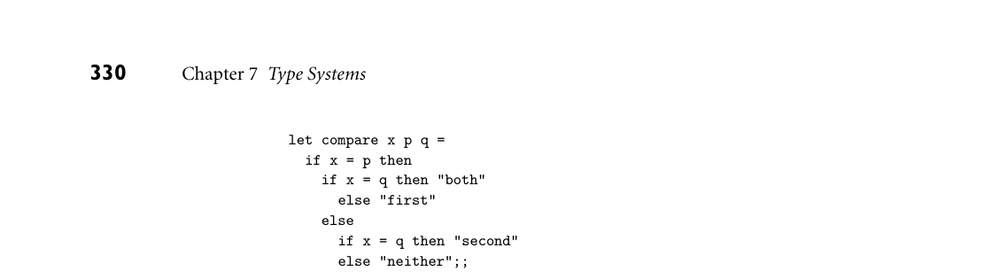
*Figure 7.1  An OCaml program to illustrate checking for type consistency.*

```
and takes, implicitly, the role of an explicit type parameter in a generic construct 
(Sections 7.3.1 and 10.1.1). Every instance of ‚a in a given call to = must represent the same type, but instances of ‚a in different calls can be different. Starting 
with the type of =, an OCaml compiler can reason that the type of compare is 
‚a ->  ‚a ->  ‚a -> string. Thus  compare is polymorphic; it does not depend on the types of x, p, and  q, so long as they are all the same. The key point 
to observe is that the programmer did not have to do anything special to make 
compare polymorphic: polymorphism is a natural consequence of ML-style type 
inference. 
■
```

Type Checking

An OCaml compiler verifes type consistency with respect to a well-defned set of  constraints. For example,

```
All occurrences of the same identifer (subject to scope rules) have the same 
type. 
In an if... then ... else expression, the condition is of type bool, and  the  
then and else clauses have the same type.
```

```
‚
A programmer-defned function has type 
a ->  ‚b ->  ... -> ‚r, where  ‚a, 
‚b, and so forth are the types of the function’s parameters, and ‚r is the type 
of its result (the expression that forms its body). 
When a function is applied (called), the types of the arguments that are passed 
are the same as the types of the parameters in the function’s defnition. The 
type of the application (i.e., the expression constituted by the call) is the same 
as  the type of the  result  in  the function’s defnition.
```

In any case where two types A and B are required to be “the same,” the OCaml  compiler must unify what it knows about A and B to produce a (potentially more  detailed) description of their common type. The inference can work in either

```
EXAMPLE 7.43 
direction, or both directions at once. For example, if the compiler has determined 
A simple instance of 
that E1 is an expression of type ‚a * int (that is, a two-element tuple whose 
unification 
second element is known to be an integer), and that E2 is an expression of type 
string * ‚b, then in the expression if x then E1 else E2, it  can  infer  that  
‚a is string and ‚b is int. Thus  x is of type bool, and  E1 and E2 are of type 
string * int. 
■
```

DESIGN & IMPLEMENTATION

7.8 Unifcation  Unifcation is a powerful technique. In addition to its role in type inference  (which also arises in the templates [generics] of C++), unifcation plays a central role in the computational model of Prolog and other logic languages. We  will consider this latter role in Section 12.1. In the general case the cost of unifying the types of two expressions can be exponential [Mai90], but the pathological cases tend not to arise in practice.

## 3CHECK YOUR UNDERSTANDING  13. What is the difference between type equivalence and type compatibility?

* Discuss the comparative advantages of structural and name equivalence for
  types. Name three languages that use each approach.

* Explain the difference between strict and loose name equivalence.
* Explain the distinction between derived types and subtypes in Ada.

* Explain the differences among type conversion, type coercion, and  nonconvert­

ing type casts.

* Summarize the arguments for and against coercion.
* Under what circumstances does a type conversion require a run-time check?

```
20. What purpose is served by universal reference types? 
21. What  is  type inference? Describe three contexts in which it occurs. 
22. Under what circumstances does an ML compiler announce a type clash?
```

```
23. Explain how the type inference of ML leads naturally to polymorphism. 
24. Why do ML programmers often declare the types of variables, even when they 
don’t have to? 
25. What  is  unification? What  is  its  role  in  ML?
```

### 7.3 Parametric Polymorphism

As we have seen in the previous section, functions in ML-family languages are  naturally polymorphic. Consider the simple task of fnding the minimum of two

EXAMPLE 7.44  values. In OCaml, the function  Finding the minimum in  OCaml or Haskell  let min x y = if x < y then x else y;;

```
can be applied to arguments of any type, though sometimes the built-in defnition 
of < may not be what the programmer would like. In Haskell the same function 
(minus the trailing semicolons) could be applied to arguments of any type in 
the class Ord; the programmer could add new types to this class by providing a 
defnition of <. Sophisticated type inference allows the compiler to perform most 
checking at compile time in OCaml, and all of it in Haskell (see Sidebar 7.7 for 
details). 
‚
In OCaml, our min function would be said to have type 
a ->  ‚a ->  ‚a; in  
Haskell, it would be Ord a =>  a ->  a ->  a. While the explicit parameters of min 
are x and y, we  can  think  of  a as an extra, implicit parameter—a type parameter. For this reason, ML-family languages are said to provide implicit parametric 
polymorphism. 
■ 
Languages without compile-time type inference can provide similar convenience and expressiveness, if we are willing to delay type checking until run time.
```

EXAMPLE 7.45  In Scheme, our min function would be written like this:  Implicit polymorphism in  (define min (lambda (a b) (if (< a b) a b))) Scheme

```
As in OCaml or Haskell, it makes no mention of types. The typical Scheme implementation employs an interpreter that examines the arguments to min and 
determines, at run time, whether they are mutually compatible and support a < 
operator. Given the defnition above, the expression (min 123 456) evaluates 
to 123; (min 3.14159 2.71828) evaluates to 2.71828. The expression (min 
"abc" "def") produces a run-time error when evaluated, because the string 
comparison operator is named string<?, not  <. 
■ 
Similar run-time checks for object-oriented languages were pioneered by 
Smalltalk, and appear in Objective C, Swift, Python, and Ruby, among others. 
In these languages, an object is assumed to have an acceptable type if it supports
```

EXAMPLE 7.46  whatever method is currently being invoked. In Ruby, for example, min is a preDuck typing in Ruby  defned method supported by collection classes. Assuming that the elements of  collection C support a comparison (<=> operator), C.min will return the minimum element:

[5, 9, 3, 6].min  # 3  (array)  (2..10).min  # 2  (range)  ["apple", "pear", "orange"].min  # "apple" (lexicographic order)  ["apple", "pear", "orange"].min {

|a,b| a.length <=> b.length  }  # "pear"

For the fnal call to min, we have provided, as a trailing block, an alternative defnition of the comparison operator.  ■  This operational style of checking (an object has an acceptable type if it supports the requested method) is sometimes known as duck typing. It takes its name  from the notion that “if it walks like a duck and quacks like a duck, then it must

6 be a duck.”

6  The origins of this “duck test” colloquialism are uncertain, but they go back at least as far as the  early 20th century. Among other things, the test was widely cited in the 1940s and 50s as a means  of identifying supposed Communist sympathizers.

## 7.3.1 Generic Subroutines and Classes

```
The disadvantage of polymorphism in Scheme,  Smalltalk,  Ruby, and  the like is the  
need for run-time checking, which incurs nontrivial costs, and delays the reporting of errors. The implicit polymorphism of ML-family languages avoids these 
disadvantages, but requires advanced type inference. For other compiled languages, explicit parametric polymorphism (otherwise known as generics) allows 
the programmer to specify type parameters when declaring a subroutine or class. 
The compiler then uses these parameters in the course of static type checking.
```

Languages that provide generics include Ada, C++ (which calls them tem-

```
EXAMPLE 7.47 
plates), Eiffel, Java, C#, and Scala. As a concrete example, consider the overloaded 
Generic min function 
min functions on the left side of Figure 7.2. Here the integer and foating-point 
in Ada 
versions differ only in the types of the parameters and return value. We can exploit this similarity to defne a single version that works not only for integers and 
reals, but for any type whose values are totally ordered. This code appears on 
the right side of Figure 7.2. The initial (bodyless) declaration of min is preceded 
by a generic clause specifying that two things are required in order to create a 
concrete instance of a minimum function: a type, T, and a corresponding comparison routine. This declaration is followed by the actual code for min, and  
instantiations of this code for integer and foating-point types. Given appropriate 
comparison routines (not shown), we can also instantiate versions for types like 
string and date, as shown on the last two lines. (The "<" operation mentioned 
in the defnition of string_min is presumably overloaded; the compiler resolves 
the overloading by fnding the version of "<" that takes arguments of type T, 
where T is already known to be string.) 
■ 
In an object-oriented language, generics are most often used to parameterize
```

EXAMPLE 7.48  entire classes. Among other things, such classes may serve as containers—data  Generic queues in C++  abstractions whose instances hold a collection of other objects, but whose operations are generally oblivious to the type of the objects they contain. Examples of  containers include stack, queue, heap, set, and dictionary (mapping) abstractions,  implemented as lists, arrays, trees, or hash tables. In the absence of generics, it is  possible in some languages (C is an obvious example, as were early versions of  Java and C#) to defne a queue of references to arbitrary objects, but use of such  a queue requires type casts that abandon compile-time checking (Exercise 7.8). A  simple generic queue in C++ appears in Figure 7.3.  ■  We can think of generic parameters as supporting compile-time customization, allowing the compiler to create an appropriate version of the parameterized  subroutine or class. In some languages—Java and C#, for example—generic parameters must always be types. Other languages are more general. In Ada and

EXAMPLE 7.49  C++, for example, a generic can be parameterized by values as well. We can see  Generic parameters  an example in Figure 7.3, where an integer parameter has been used to specify the

function min(x, y : integer)  generic  return integer is  begin  if x < y then return x;  else return y;  end if;  end min;

type T is private;  with function "<"(x, y : T) return Boolean;  function min(x, y : T) return T;

function min(x, y : T) return T is  begin

if x < y then return x;  else return y;  end if;  end min;

function min(x, y : long_float)  return long_float is  begin  if x < y then return x;  else return y;  end if;  end min;

function int_min is new min(integer, "<");  function real_min is new min(long_float, "<");  function string_min is new min(string, "<");  function date_min is new min(date, date_precedes);

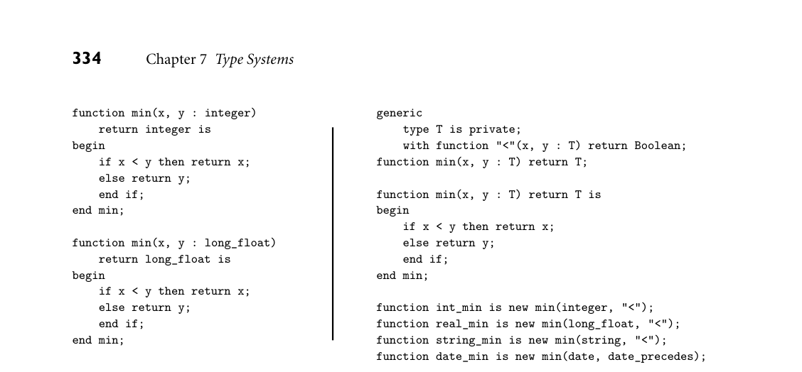
*Figure 7.2  Overloading (left) versus generics (right) in Ada.*

maximum length of the queue. In C++, this value must be a compile-time constant; in Ada, which supports dynamic-size arrays (Section 8.2.2), its evaluation  can be delayed until elaboration time.  ■

Implementation Options

Generics can be implemented several ways. In most implementations of Ada and  C++ they are a purely static mechanism: all the work required to create and use  multiple instances of the generic code takes place at compile time. In the usual  case, the compiler creates a separate copy of the code for every instance. (C++

DESIGN & IMPLEMENTATION

## 7.9 Generics in ML  Perhaps surprisingly, given the implicit polymorphism that comes “for free”  with type inference, both OCaml and SML provide explicit polymorphism—  generics—as well, in the form of parameterized modules called functors. Unlike the implicit polymorphism, functors allow the OCaml or SML programmer to indicate that a collection of functions and other values (i.e., the contents  of a module) share a common set of generic parameters. This sharing is then  enforced by the compiler. Moreover, any types exported by a functor invocation (generic instantiation) are guaranteed to be distinct, even though their  signatures (interfaces) are the same. As in Ada and C++, generic parameters  in  ML  can be values  as well  as types.

```
NB: While Haskell also provides something called a Functor (specifcally, 
a type class that supports a mapping function), its use of the term has little in 
common with that of OCaml and SML.
```

```
template<class item, int max_items = 100> 
class queue {
```

item items[max_items];  int next_free, next_full, num_items;  public:

queue() : next_free(0), next_full(0), num_items(0) { }  bool enqueue(const item& it) {

if (num_items == max_items) return false;  ++num_items;  items[next_free] = it;  next_free = (next_free + 1) % max_items;  return true;  }  bool dequeue(item* it) {

if (num_items == 0) return false;  --num_items;  *it = items[next_full];  next_full = (next_full + 1) % max_items;  return true;  }  };  ...  queue<process> ready_list;  queue<int, 50> int_queue;

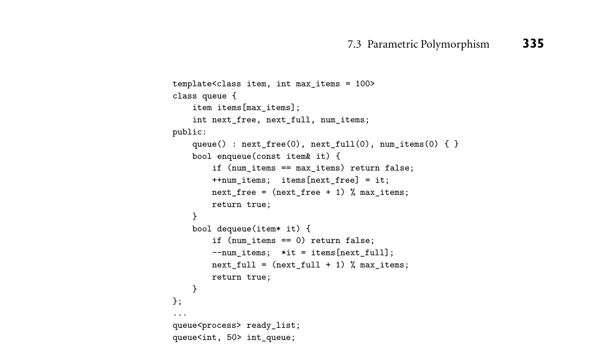
*Figure 7.3  Generic array-based queue in C++.*

goes farther, and arranges to type-check each of these instances independently.) If  several queues are instantiated with the same set of arguments, then the compiler  may share the code of the enqueue and dequeue routines among them. A clever  compiler may arrange to share the code for a queue of integers with the code for  a queue of foating-point numbers, if the two types happen to have the same size,  but this sort of optimization is not required, and the programmer should not be  surprised if it doesn’t occur.

```
Java, by contrast, guarantees that all instances of a given generic will share the 
same code at run time. In effect, if T is a generic type parameter in Java, then objects of class T are treated as instances of the standard base class Object, except  
that the programmer does not have to insert explicit casts to use them as objects 
of class T, and the compiler guarantees, statically, that the elided casts will never 
fail. C# plots an intermediate course. Like C++, it will create specialized implementations of a generic for different primitive or value types. Like Java, however, 
it requires that the generic code itself be demonstrably type safe, independent 
of the arguments provided in any particular instantiation. We will examine the 
tradeoffs among C++, Java, and C# generics in more detail in Section C 7.3.2.
```

Generic Parameter Constraints

Because a generic is an abstraction, it is important that its interface (the header of  its declaration) provide all the information that must be known by a user of the  abstraction. Several languages, including Ada, Java, C#, Scala, OCaml, and SML,

attempt to enforce this rule by constraining generic parameters. Specifcally, they  require that the operations permitted on a generic parameter type be explicitly  declared.

EXAMPLE 7.50  In Ada, the programmer can specify the operations of a generic type parameter  with constraints in Ada  by means of a trailing with clause. We saw a simple example in the “minimum”  function of Figure 7.2 (right side). The declaration of a generic sorting routine in  Ada might be similar:

generic  type T is private;  type T_array is array (integer range <>) of T;  with function "<"(a1, a2 : T) return boolean;  procedure sort(A : in out T_array);

Without the with clause, procedure sort would be unable to compare elements of A for ordering, because type T is private—it supports only assignment, testing for equality and inequality, and a few other standard attributes (e.g.,  size).  ■  Java and C# employ a particularly clean approach to constraints that exploits  the ability of object-oriented types to inherit methods from a parent type or interface. We defer a full discussion of inheritance to Chapter 10. For now, we note  that it allows the Java or C# programmer to require that a generic parameter support a particular set of methods, much as the type classes of Haskell constrain the

EXAMPLE 7.51  types of acceptable parameters to an implicitly polymorphic function. In Java, we  Generic sorting routine in  might declare and use a sorting routine as follows:  Java

DESIGN & IMPLEMENTATION

```
7.10 Overloading and polymorphism 
Given that a compiler will often create multiple instances of the code for a 
generic subroutine, specialized to a given set of generic parameters, one might 
be forgiven for wondering: what exactly is the difference between the left and 
right sides of Figure 7.2? The answer lies in the generality of the polymorphic 
code. With overloading the programmer must write a separate min routine 
for every type, and while the compiler will choose among these automatically, 
the fact that they do something similar with their arguments is purely a matter 
of convention. Generics, on the other hand, allow the compiler to create an 
appropriate version for every needed type. The similarity of the calling syntax 
(and of the generated code, when conventions are followed) has led some authors to refer to overloading as ad hoc (special case) polymorphism. There  is  
no particular reason, however, for the programmer to think of polymorphism 
in terms of multiple copies: from a semantic (conceptual) point of view, overloaded subroutines use a single name for more than one thing; a polymorphic 
subroutine is a single thing.
```

public static <T extends Comparable<T>> void sort(T A[]) {

...  if (A[i].compareTo(A[j]) >= 0) ...  ...  }  ...  Integer[] myArray = new Integer[50];  ...  sort(myArray);

```
Where C++ requires a template<type args> prefx before a generic method, Java 
puts the type parameters immediately in front of the method’s return type. The 
extends clause constitutes a generic constraint: Comparable is an interface (a 
set of required methods) from the Java standard library; it includes the method 
compareTo. This method returns −1, 0, or 1, respectively, depending on whether 
the current object is less than, equal to, or greater than the object passed as a parameter. The compiler checks to make sure that the objects in any array passed 
to sort are of a type that implements Comparable, and are therefore guaranteed to provide compareTo. If  T had needed additional interfaces (that is, if we 
had wanted more constraints), they could have been specifed with a commaseparated list: <T extends I1, I2, I3>. 
■ 
C# syntax is similar:
```

EXAMPLE 7.52

Generic sorting routine  in C#

static void sort<T>(T[] A) where T : IComparable {

...  if (A[i].CompareTo(A[j]) >= 0) ...  ...  }  ...  int[] myArray = new int[50];  sort(myArray);

C# puts the type parameters after the name of the subroutine, and the constraints  (the where clause) after the regular parameter list. The compiler is smart enough  to recognize that int is a primitive type, and generates a customized implementation of sort, eliminating the need for Java’s Integer wrapper class, and producing faster code.  ■  A few languages forgo explicit constraints, but still check how parameters are  used. In C++, for example, the header of a generic sorting routine can be extremely simple:

EXAMPLE 7.53

Generic sorting routine in  C++

template<typename T>  void sort(T A[], int A_size) { ...

No mention is made of the need for a comparison operator. The body of a generic  can (attempt to) perform arbitrary operations on objects of a generic parameter

```
type, but if the generic is instantiated with a type that does not support that operation, the compiler will announce a static semantic error. Unfortunately, because 
the header of the generic does not necessarily specify which operations will be 
required, it can be diffcult for the programmer to predict whether a particular 
instantiation will cause an error message. Worse, in some cases the type provided 
in a particular instantiation may support an operation required by the generic’s 
code, but that operation may not do “the right thing.” Suppose in our C++ sorting example that the code for sort makes use of the < operator. For ints and  
doubles, this operator will do what one would expect. For character strings, 
however, it will compare pointers, to see which referenced character has a lower 
address in memory. If the programmer is expecting comparison for lexicographic 
ordering, the results may be surprising!
```

```
To avoid surprises, it is best to avoid implicit use of the operations of a generic 
parameter type. The next version of the C++ standard is likely to incorporate syntax for explicit template constraints [SSD13]. For now, the comparison routine 
can be provided as a method of class T, an  extra  argument  to  the  sort routine, or 
an extra generic parameter. To facilitate the frst of these options, the programmer may choose to emulate Java or C#, encapsulating the required methods in an 
abstract base class from which the type T may inherit. 
■
```

Implicit Instantiation

```
EXAMPLE 7.54 
Because a class is a type, one must generally create an instance of a generic class 
Generic class instance in 
(i.e., an object) before the generic can be used. The declaration provides a natural 
C++ 
place to provide generic arguments:
```

queue<int, 50> *my_queue = new queue<int, 50>();  // C++  ■

EXAMPLE 7.55  Some languages (Ada among them) also require generic subroutines to be inGeneric subroutine  stantiated explicitly before they can be used:  instance in Ada

procedure int_sort is new sort(integer, int_array, "<");  ...  int_sort(my_array);  ■

Other languages (C++, Java, and C# among them) do not require this. Instead

EXAMPLE 7.56  they treat generic subroutines as a form of overloading. Given the C++ sorting  Implicit instantiation in  routine of Example 7.53 and the following objects:  C++

```
int ints[10]; 
double reals[50]; 
string strings[30]; 
// library class string has lexicographic operator<
```

we can perform the following calls without instantiating anything explicitly:

sort(ints, 10);  sort(reals, 50);  sort(strings, 30);

Explicit (generics)  Implicit  Ada  C++  Java  C#  Lisp  ML

Applicable to  subroutines,  modules

subroutines,  classes

subroutines,  classes

subroutines,  classes

functions  functions

Abstract over  types; subroutines; values of  arbitrary types

types; enum,  int, and pointer  constants

types only  types only  types only  types only

Constraints  explicit  (varied)

implicit  explicit  (inheritance)

explicit  (inheritance)

implicit  implicit

Checked at  compile time  (defnition)

compile time  (instantiation)

compile time  (defnition)

compile time  (defnition)

run time  compile time  (inferred)

Natural  implementation

multiple copies  multiple copies  single copy  (erasure)

multiple copies  (reifcation)

single copy  single copy

Subroutine  instantiation

explicit  implicit  implicit  implicit  —  —

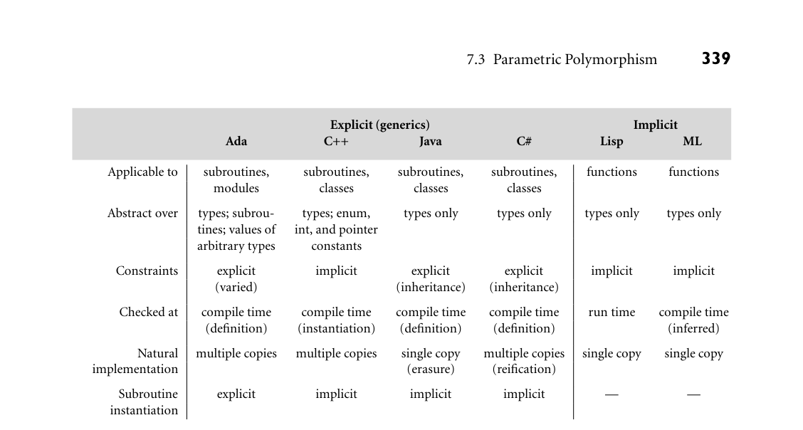
*Figure 7.4  Mechanisms for parametric polymorphism in Ada, C++, Java, C#, Lisp, and ML. Erasure and reifcation are  discussed in Section C 7.3.2.*

In each case, the compiler will implicitly instantiate an appropriate version of the  sort routine. Java and C# have similar conventions. To keep the language manageable, the rules for implicit instantiation in C++ are more restrictive than the  rules for resolving overloaded subroutines in general. In particular, the compiler  will not coerce a subroutine argument to match a type expression containing a  generic parameter (Exercise C 7.26).  ■  Figure 7.4 summarizes the features of Ada, C++, Java, and C# generics, and of  the implicit parametric polymorphism of Lisp and ML. Further explanation of  some of the details appears in Section C 7.3.2.

## 7.3.2 Generics in C++, Java, and C#

Several of the key tradeoffs in the design of generics can be illustrated by comparing the features of C++, Java, and C#. C++ is by far the most ambitious of  the three. Its templates are intended for almost any programming task that requires substantially similar but not identical copies of an abstraction. Java and C#  provide generics purely for the sake of polymorphism. Java’s design was heavily  infuenced by the desire for backward compatibility, not only with existing versions of the language, but with existing virtual machines and libraries. The C#  designers, though building on an existing language, did not feel as constrained.  They had been planning for generics from the outset, and were able to engineer  substantial new support into the .NET virtual machine.

IN MORE DEPTH

```
On the companion site we discuss C++, Java, and C# generics in more detail, and 
consider the impact of their differing designs on the quality of error messages, the 
speed and size of generated code, and the expressive power of the notation. We 
note in particular the very different mechanisms used to make generic classes and 
methods support as broad a class of generic arguments as possible.
```

### 7.4 Equality Testing and Assignment

For simple, primitive data types such as integers, foating-point numbers, or characters, equality testing and assignment are relatively straightforward operations,  with obvious semantics and obvious implementations (bit-wise comparison or  copy). For more complicated or abstract data types, both semantic and implementation subtleties arise.

Consider for example the problem of comparing two character strings. Should  the expression s = t determine whether s and t

are aliases for one another?  occupy storage that is bit-wise identical over its full length?  contain the same sequence of characters?  would appear the same if printed?

The second of these tests is probably too low level to be of interest in most programs; it suggests the possibility that a comparison might fail because of garbage  in currently unused portions of the space reserved for a string. The other three  alternatives may all be of interest in certain circumstances, and may generate different results.

In many cases the defnition of equality boils down to the distinction between  l-values and r-values: in the presence of references, should expressions be considered equal only if they refer to the same object, or also if the objects to which  they refer are in some sense equal? The frst option (refer to the same object) is  known as a shallow comparison. The second (refer to equal objects) is called a  deep comparison. For complicated data structures (e.g., lists or graphs) a deep  comparison may require recursive traversal.

In imperative programming languages, assignment operations may also be  deep or shallow. Under a reference model of variables, a shallow assignment  a := b will make a refer to the object to which b refers. A deep assignment  will create a copy of the object to which b refers, and make a refer to the copy.  Under a value model of variables, a shallow assignment will copy the value of b  into a, but if that value is a pointer (or a record containing pointers), then the  objects to which the pointer(s) refer will not be copied.  Most programming languages employ both shallow comparisons and shallow

EXAMPLE 7.57  assignment. A few (notably Python and the various dialects of Lisp and ML)  Equality testing in Scheme

provide more than one option for comparison. Scheme, for example, has three  general-purpose equality-testing functions:

(eq? a b)  ; do a and b refer to the same object?  (eqv? a b)  ; are a and b known to be semantically equivalent?  (equal? a b)  ; do a and b have the same recursive structure?

Both eq? and eqv? perform a shallow comparison. The former may be faster  for certain types in certain implementations; in particular, eqv? is required to  detect the equality of values of the same discrete type, stored in different locations;  eq? is not. The simpler eq? behaves as one would expect for Booleans, symbols  (names), and pairs (things built by cons), but can have implementation-defned  behavior on numbers, characters, and strings:

(eq? #t #t)  =⇒  #t (true)  (eq? 'foo 'foo)  =⇒  #t  (eq? '(a b) '(a b))  =⇒  #f (false); created by separate cons-es  (let ((p '(a b)))

(eq? p p))  =⇒  #t; created by the same cons  (eq? 2 2)  =⇒ implementation dependent  (eq? "foo" "foo")  =⇒ implementation dependent

```
In any particular implementation, numeric, character, and string tests will always 
work the same way; if (eq? 2 2) returns true, then  (eq? 37 37) will return 
true also. Implementations are free to choose whichever behavior results in the 
fastest code.
```

The exact rules that govern the situations in which eqv? is guaranteed to return true or false are quite involved. Among other things, they specify that  eqv? should behave as one might expect for numbers, characters, and nonempty  strings, and that two objects will never test true for eqv? if there are any circumstances under which they would behave differently. (Conversely, however, eqv? is  allowed to return false for certain objects—functions, for example—that would  behave identically in all circumstances.)7 The eqv? predicate is “less discriminating” than eq?, in the sense that eqv? will never return false when eq? returns  true.

```
For structures (lists), eqv? returns false if its arguments refer to different 
root cons cells. In many programs this is not the desired behavior. The equal? 
predicate recursively traverses two lists to see if their internal structure is the same 
and their leaves are eqv?. The  equal? predicate may lead to an infnite loop if 
the programmer has used the imperative features of Scheme to create a circular 
list. 
■
```

7  Signifcantly, eqv? is also allowed to return false when comparing numeric values of different  types: (eqv? 1 1.0) may evaluate to #f. For numeric code, one generally wants the separate  = function: (= val1 val2) will perform the necessary coercion and test for numeric equality  (subject to rounding errors).

Deep assignments are relatively rare. They are used primarily in distributed  computing, and in particular for parameter passing in remote procedure call  (RPC) systems. These will be discussed in Section C 13.5.4.

For user-defned abstractions, no single language-specifed mechanism for  equality testing or assignment is likely to produce the desired results in all cases.  Languages with sophisticated data abstraction mechanisms usually allow the programmer to defne the comparison and assignment operators for each new data  type—or to specify that equality testing and/or assignment is not allowed.

## 3CHECK YOUR UNDERSTANDING  26. Explain the distinction between implicit and explicit parametric polymor­

```
phism. What are their comparative advantages? 
27. What  is  duck typing? What is its connection to polymorphism? In what lan­
```

guages does it appear?  28. Explain the distinction between overloading and generics. Why is the former  sometimes called ad hoc polymorphism?

* What is the principal purpose of generics? In what sense do generics serve a
  broader purpose in C++ and Ada than they do in Java and C#?

* Under what circumstances can a language implementation share code among
  separate instances of a generic?

```
31. What  are  container classes? What do they have to do with generics? 
32. What does it mean for a generic parameter to be constrained? Explain  the  
difference between explicit and implicit constraints. Describe how interface 
classes can be used to specify constraints in Java and C#.
```

* Why will C# accept int as a generic argument, but Java won’t?
* Under what circumstances will C++ instantiate a generic function implicitly?

* Why is equality testing more subtle than it frst appears?

### 7.5 Summary and Concluding Remarks

```
This chapter has surveyed the fundamental concept of types. In  the  typical  programming language, types serve two principal purposes: they provide implicit 
context for many operations, freeing the programmer from the need to specify 
that context explicitly, and they allow the compiler to catch a wide variety of 
common programming errors. When discussing types, we noted that it is sometimes helpful to distinguish among denotational, structural, and abstractionbased points of view, which regard types, respectively, in terms of their values, 
their substructure, and the operations they support.
```

```
In a typical programming language, the type system consists of a set of builtin types, a mechanism to defne new types, and rules for type equivalence, type 
compatibility, and  type inference. Type equivalence determines when two values 
or named objects have the same type. Type compatibility determines when a value 
of one type may be used in a context that “expects” another type. Type inference 
determines the type of an expression based on the types of its components or 
(sometimes) the surrounding context. A language is said to be strongly typed if it 
never allows an operation to be applied to an object that does not support it; a 
language is said to be statically typed if it enforces strong typing at compile time.
```

We introduced terminology for the common built-in types and for enumerations, subranges, and the common type constructors (more on the latter will  appear in Chapter 8). We discussed several different approaches to type equivalence, compatibility, and inference. We also examined type conversion, coercion,  and nonconverting casts. In the area of type equivalence, we contrasted the structural and name-based approaches, noting that while name equivalence appears to  have gained in popularity, structural equivalence retains its advocates.

Expanding on material introduced in Section 3.5.2, we explored several styles  of polymorphism, all of which allow a subroutine—or the methods of a class—to  operate on values of multiple types, so long as they only use those values in ways  their types support. We focused in particular on parametric polymorphism, in  which the types of the values on which the code will operate are passed to it as  extra parameters, implicitly or explicitly. The implicit alternative appears in the  static typing of ML and its descendants, and in the dynamic typing of Lisp, Smalltalk, and many other languages. The explicit alternative appears in the generics of  many modern languages. In Chapter 10 we will consider the related topic of subtype polymorphism.

In our discussion of implicit parametric polymorphism, we devoted considerable attention to type checking in ML, where the compiler uses a sophisticated  system of inference to determine, at compile time, whether a type error (an attempt to perform an operation on a type that doesn’t support it) could ever occur at run time—all without access to type declarations in the source code. In  our discussion of generics we explored alternative ways to express constraints on  generic parameters. We also considered implementation strategies. As examples,  we contrasted (on the companion site) the generic facilities of C++, Java, and C#.

More so, perhaps, than in previous chapters, our study of types has highlighted  fundamental differences in philosophy among language designers. As we have  seen, some languages use variables to name values; others, references. Some languages do all or most of their type checking at compile time; others wait until  run time. Among those that check at compile time, some use name equivalence;  others, structural equivalence. Some languages avoid type coercions; others embrace them. Some avoid overloading; others again embrace them. In each case,  the choice among design alternatives refects nontrivial tradeoffs among competing language goals, including expressiveness, ease of programming, quality and  timing of error discovery, ease of debugging and maintenance, compilation cost,  and run-time performance.

### 7.6 Exercises

## 7.1  Most statically typed languages developed since the 1970s (including Java,  C#, and the descendants of Pascal) use some form of name equivalence for  types. Is structural equivalence a bad idea? Why or why not?  7.2  In the following code, which of the variables will a compiler consider to have  compatible types under structural equivalence? Under strict name equivalence? Under loose name equivalence?

```
type T = array [1..10] of integer 
S = T  
A : T  
B : T  
C : S  
D : array [1..10] of integer
```

## 7.3  Consider the following declarations:

```
1. 
type cell 
–– a forward declaration 
2. 
type cell ptr = pointer to cell 
3. 
x : cell  
4. 
type cell = record 
5. 
val : integer 
6. 
next : cell ptr 
7. 
y : cell
```

```
Should the declaration at line 4 be said to introduce an alias type? Under 
strict name equivalence, should x and y have the same type? Explain. 
7.4 
Suppose you are implementing an Ada compiler, and must support arithmetic on 32-bit fxed-point binary numbers with a programmer-specifed 
number of fractional bits. Describe the code you would need to generate 
to add, subtract, multiply, or divide two fxed-point numbers. You should 
assume that the hardware provides arithmetic instructions only for integers 
and IEEE foating-point. You may assume that the integer instructions preserve full precision; in particular, integer multiplication produces a 64-bit 
result. Your description should be general enough to deal with operands 
and results that have different numbers of fractional bits. 
7.5 
When Sun Microsystems ported Berkeley Unix from the Digital VAX to the 
Motorola 680x0 in the early 1980s, many C programs stopped working, and 
had to be repaired. In effect, the 680x0 revealed certain classes of program 
bugs that one could “get away with” on the VAX. One of these classes of bugs 
occurred in programs that use more than one size of integer (e.g., short 
and long), and arose from the fact that the VAX is a little-endian machine, 
while the 680x0 is big-endian (Section C 5.2). Another class of bugs occurred in programs that manipulate both null and empty strings. It arose
```

from the fact that location zero in a Unix process’s address space on the VAX  always contained a zero, while the same location on the 680x0 is not in the  address space, and will generate a protection error if used. For both of these  classes of bugs, give examples of program fragments that would work on a  VAX but not on a 680x0.  7.6  Ada provides two “remainder” operators, rem and mod for integer types,  defned as follows [Ame83, Sec. 4.5.5]:

```
Integer division and remainder are defned by the relation A = (A/B)*B + (A rem 
B), where  (A rem B) has the sign of A and an absolute value less than the absolute 
value of B. Integer division satisfes the identity (-A)/B = -(A/B) = A/(-B).
```

```
The result of the modulus operation is such that (A mod B) has the sign of 
B and an absolute value less than the absolute value of B; in addition, for some 
integer value N, this result must satisfy the relation A = B*N  + (A mod  B).
```

Give values of A and B for which A rem B and A mod B differ. For what  purposes would one operation be more useful than the other? Does it make  sense to provide both, or is it overkill?

Consider also the % operator of C and the mod operator of Pascal. The  designers of these languages could have picked semantics resembling those  of either Ada’s rem or its mod. Which did they pick? Do you think they  made the right choice?  7.7  Consider the problem of performing range checks on set expressions in Pascal. Given that a set may contain many elements, some of which may be  known at compile time, describe the information that a compiler might  maintain in order to track both the elements known to belong to the set  and the possible range of unknown elements. Then explain how to update  this information for the following set operations: union, intersection, and  difference. The goal is to determine (1) when subrange checks can be eliminated at run time and (2) when subrange errors can be reported at compile  time. Bear in mind that the compiler cannot do a perfect job: some unnecessary run-time checks will inevitably be performed, and some operations  that must always result in errors will not be caught at compile time. The  goal is to do as good a job as possible at reasonable cost.  7.8  In Section 7.2.2 we introduced the notion of a universal reference type  (void * in C) that refers to an object of unknown type. Using such references, implement a “poor man’s generic queue” in C, as suggested in Section 7.3.1. Where do you need type casts? Why? Give an example of a use of  the queue that will fail catastrophically at run time, due to the lack of type  checking.  7.9  Rewrite the code of Figure 7.3 in Ada, Java, or C#.  7.10 (a) Give a generic solution to Exercise 6.19.

(b) Translate this solution into Ada, Java, or C#.  7.11 In your favorite language with generics, write code for simple versions of  the following abstractions:

## (a) a stack, implemented as a linked list  (b) a priority queue, implemented as a skip list or a partially ordered tree  embedded in an array  (c)  a dictionary (mapping), implemented as a hash table  7.12 Figure 7.3 passes integer max_items to the queue abstraction as a generic  parameter. Write an alternative version of the code that makes max_items  a parameter to the queue constructor instead. What is the advantage of the  generic parameter version?  7.13 Rewrite the generic sorting routine of Examples 7.50–7.52 (with con­

straints) using OCaml or SML functors.  7.14 Flesh out the C++ sorting routine of Example 7.53.  Demonstrate that  this routine does “the wrong thing” when asked to sort an array of char*  strings.  7.15 In Example 7.53 we mentioned three ways to make the need for compar­

```
isons more explicit when defning a generic sort routine in C++: make the 
comparison routine a method of the generic parameter class T, an  extra  argument to the sort routine, or an extra generic parameter. Implement these 
options and discuss their comparative strengths and weaknesses. 
7.16 Yet another solution to the problem of the previous exercise is to make the 
sorting routine a method of a sorter class. The comparison routine can 
then be passed into the class as a constructor argument. Implement this 
option and compare it to those of the previous exercise. 
7.17 Consider the following code skeleton in C++:
```

#include <list>  using std::list;

```
class foo { ... 
class bar : public foo { ...
```

static void print_all(list<foo*> &L) { ...

list<foo*> LF;  list<bar*> LB;  ...  print_all(LF);  // works fine  print_all(LB);  // static semantic error

Explain why the compiler won’t allow the second call. Give an example of  bad things that could happen if it did.  7.18 Bjarne Stroustrup, the original designer of C++, once described templates  as “a clever kind of macro that obeys the scope, naming, and type rules of  C++” [Str13, 2nd ed., p. 257].  How close is the similarity? What can  templates do that macros can’t? What do macros do that templates don’t?

## 7.19 In Section 9.3.1 we noted that Ada 83 does not permit subroutines to be  passed as parameters, but that some of the same effect can be achieved with  generics. Suppose we want to apply a function to every member of an array.  We might write the following in Ada 83:

generic  type item is private;  type item_array is array (integer range <>) of item;  with function F(it : in item) return item;  procedure apply_to_array(A : in out item_array);

procedure apply_to_array(A : in out item_array) is  begin  for i in A'first..A'last loop  A(i) := F(A(i));  end loop;  end apply_to_array;

```
Given an array of  integers,  scores, and a function on integers, foo, we  can  
write:
```

procedure apply_to_ints is

new apply_to_array(integer, int_array, foo);  ...  apply_to_ints(scores);

How general is this mechanism? What are its limitations? Is it a reasonable  substitute for formal (i.e., second-class, as opposed to third-class) subroutines?  7.20 Modify the code of Figure 7.3 or your solution to Exercise 7.12 to throw an  exception if an attempt is made to enqueue an item in a full queue, or to  dequeue an item from an empty queue.

7.21–7.27 In More Depth.

### 7.7 Explorations

## 7.28 Some language defnitions specify a particular representation for data types  in memory, while others specify only the semantic behavior of those types.  For languages in the latter class, some implementations guarantee a particular representation, while others reserve the right to choose different representations in different circumstances. Which approach do you prefer? Why?  7.29 Investigate the typestate mechanism employed by Strom et al. in the Hermes  programming language [SBG+91]. Discuss its relationship to the notion of  defnite assignment in Java and C# (Section 6.1.3).

```
7.30 Several recent projects attempt to blur the line between static and dynamic 
typing by adding optional type declarations to scripting languages. These 
declarations support a strategy of gradual typing, in which programmers 
initially write in a traditional scripting style and then add declarations incrementally to increase reliability or decrease run-time cost. Learn about 
the Dart, Hack, and TypeScript languages, promoted by Google, Facebook, 
and Microsoft, respectively. What are your impressions? How easy do you 
think it will be in practice to retroft declarations into programs originally 
developed without them? 
7.31 Research the type systems of Standard ML, OCaml, Haskell, and F#. What 
are the principal differences? What might explain the different choices made 
by the language designers? 
7.32 Write a program in C++ or Ada that creates at least two concrete types or 
subroutines from the same template/generic. Compile your code to assembly language and look at the result. Describe the mapping from source to 
target code. 
7.33 While Haskell does not include generics (its parametric polymorphism is 
implicit), its type classes can be considered a generalization of type constraints. Learn more about type classes. Discuss their relevance to polymorphic functions, as well as more general uses. You might want to look 
ahead to the discussion of monads in Section 11.5.2. 
7.34 Investigate the notion of type conformance, employed by Black et al. in the 
Emerald programming language [BHJL07]. Discuss how conformance relates to the type inference of ML and to the class-based typing of objectoriented languages. 
7.35 C++11 introduces so-called variadic templates, which  take  a  variable  num­
```

```
ber of generic parameters. Read up on how these work. Show how they 
might be used to  replace  the usual  cout << expr1 << ... << exprn syntax 
of formatted output with print(expr1 , ... , exprn ), while retaining full 
static type checking.
```

7.36–7.38 In More Depth.

### 7.8 Bibliographic Notes

References to general information on the various programming languages mentioned in this chapter can be found in Appendix A, and in the Bibliographic  Notes for Chapters 1 and 6. Welsh, Sneeringer, and Hoare [WSH77] provide a  critique of the original Pascal defnition, with a particular emphasis on its type  system. Tanenbaum’s comparison of Pascal and Algol 68 also focuses largely on  types [Tan78]. Cleaveland [Cle86] provides a book-length study of many of the issues in this chapter. Pierce [Pie02] provides a formal and detailed modern coverage of the subject. The ACM Special Interest Group on Programming Languages

launched a biennial workshop on Types in Language Design and Implementation  in 2003.

```
What we have referred to as the denotational model of types originates with 
Hoare [DDH72]. Denotational formulations of the overall semantics of programming languages are discussed in the Bibliographic Notes for Chapter 4. A 
related but distinct body of work uses algebraic techniques to formalize data abstraction; key references include Guttag [Gut77] and Goguen et al. [GTW78]. 
Milner’s original paper [Mil78] is the seminal reference on type inference in ML. 
Mairson [Mai90] proves that the cost of unifying ML types is O(2n), where  n is the 
length of the program. Fortunately, the cost is linear in the size of the program’s 
type expressions, so the worst case arises only in programs whose semantics are 
too complex for a human being to understand anyway.
```

Hoare [Hoa75] discusses the defnition of recursive types under a reference  model of variables. Cardelli and Wegner survey issues related to polymorphism,  overloading, and abstraction [CW85]. The Character Model standard for the  World Wide Web provides a remarkably readable introduction to the subtleties  and complexities of multilingual character sets [Wor05].

Garcia et al. provide a detailed comparison of generic facilities in ML, C++,  Haskell, Eiffel, Java, and C# [GJL+03]. The C# generic facility is described by  Kennedy and Syme [KS01]. Java generics are based on the work of Bracha et  al. [BOSW98]. Erwin Unruh is credited with discovering that C++ templates  could trick the compiler into performing nontrivial computation. His specifc  example (www.erwin-unruh.de/primorig.html) did not compile, but caused the  compiler to generate a sequence of n error messages, embedding the frst n primes.  Abrahams and Gurtovoy provide a book-length treatment of template metaprogramming [AG05], the feld that grew out of this discovery.

## 8 Composite Types

Chapter 7 introduced the notion of types as a way to organize the many  values and objects manipulated by computer programs. It also introduced terminology for both built-in and composite types. As we noted in Section 7.1.4,  composite types are formed by joining together one or more simpler types using  a type constructor. From a denotational perspective, the constructors can be modeled as operations on sets, with each set representing one of the simpler types.

In the current chapter we will survey the most important type constructors:  records, arrays, strings, sets, pointers, lists, and fles. In the section on records  we will also consider both variants (unions) and tuples. In the section on pointers, we will take a more detailed look at the value and reference models of variables introduced in Section 6.1.2, and the heap management issues introduced in  Section 3.2. The section on fles (mostly on the companion site) will include a  discussion of input and output mechanisms.

### 8.1 Records (Structures)

```
Record types allow related data of heterogeneous types to be stored and manipulated together. Originally introduced by Cobol, records also appeared in Algol 68, 
which called them structures, and introduced the keyword struct. Many  modern languages, including C and its descendants, employ the Algol terminology. 
Fortran 90 simply calls its records “types”: they are the only form of programmerdefned type other than arrays, which have their own special syntax. Structures 
in C++ are defned as a special form of class (one in which members are globally 
visible by default). Java has no distinguished notion of struct; its  programmers use classes in all cases. C# and Swift use a reference model for variables of 
class types, and a value model for variables of struct types. In these languages, 
structs do not support inheritance. For the sake of simplicity, we will use the 
term “record” in most of our discussion to refer to the relevant construct in all 
these languages.
```

## 8.1.1 Syntax and Operations

EXAMPLE 8.1  In C, a simple record might be defned as follows:  A C struct

struct element {  char name[2];  int atomic_number;  double atomic_weight;  _Bool metallic;  };  ■

Each of the record components is known as a field. To refer to a given feld of a

EXAMPLE 8.2  record, most languages use “dot” notation:  Accessing record fields

element copper;  const double AN = 6.022e23;  /* Avogadro's number */  ...  copper.name[0] = 'C'; copper.name[1] = 'u';  double atoms = mass / copper.atomic_weight * AN;

In Fortran 90 one would say copper%name and copper%atomic_weight. Cobol  reverses the order of the feld and record names: name of copper and atomic_  weight of copper. In Common Lisp, one would say (element-name copper)

and (element-atomic_weight copper).  Most languages allow record defnitions to be nested. Again in C:

■

EXAMPLE 8.3

Nested records

struct ore {

char name[30];  struct {

char name[2];  int atomic_number;  double atomic_weight;  _Bool metallic;  } element_yielded;  };

Alternatively, one could say

struct ore {

char name[30];  struct element element_yielded;  };

In Fortran 90 and Common Lisp, only the second alternative is permitted:  record felds can have record types, but the declarations cannot be lexically  nested. Naming for nested records is straightforward: malachite.element_

yielded.atomic_number in C; atomic_number of element_yielded of malachite in Cobol; (element-atomic_number (ore-element_yielded mala-

chite)) in Common Lisp.  ■  As noted in Example 7.17, ML and its relatives differ from most languages in  OCaml records and tuples  specifying that the order of record felds is insignifcant. The OCaml record value

EXAMPLE 8.4

{name = "Cu"; atomic_number = 29; atomic_weight = 63.546; metallic  = true} is the same as the value {atomic_number = 29; name = "Cu"; atomic_  weight = 63.546; metallic = true}—they will test true for equality.

```
OCaml’s tuples, which we mentioned briefy in Section 7.2.4, and will visit 
again in Section 11.4.3, resemble records whose felds are ordered, but unnamed. 
In SML, the other leading ML dialect, the resemblance is actually equivalence: 
tuples are defned as syntactic sugar for records whose feld names are small integers. The values ("Cu", 29), {1 = "Cu", 2 = 29}, and  {2 = 29, 1 = "Cu"} 
will all test true for equality in SML. 
■
```

## 8.1.2 Memory Layout and Its Impact

The felds of a record are usually stored in adjacent locations in memory. In its  symbol table, the compiler keeps track of the offset of each feld within each  record type. When it needs to access a feld, the compiler will often generate a  load or store instruction with displacement addressing. For a local object, the  base register is typically the frame pointer; the displacement is then the sum of  the record’s offset from the register and the feld’s offset within the record.

EXAMPLE 8.5  A likely layout for our element type on a 32-bit machine appears in Figure 8.1.  Memory layout for a  Because the name feld is only two characters long, it occupies two bytes in memrecord type  ory. Since atomic_number is an integer, and must (on most machines) be wordaligned, there is a two-byte “hole” between the end of name and the beginning  of atomic_number. Similarly, since Boolean variables (in most language implementations) occupy a single byte, there are three bytes of empty space between the  end of the metallic feld and the next aligned location. In an array of elements,  most compilers would devote 20 bytes to every member of the array.  ■

DESIGN & IMPLEMENTATION

```
8.1 Struct tags and typedef in C and C++ 
One of the peculiarities of the C type system is that struct tags are not exactly 
type names. In Example 8.1, the name of the type is the two-word phrase 
struct element. We  used  this  name  to  declare  the  element_yielded feld 
of the second struct in Example 8.3. To obtain a one-word name, one can say 
typedef struct element element_t, or  even  typedef struct element 
element: struct  tags  and  typedef names have separate name spaces, so the 
same name can be used in each. C++ eliminates this idiosyncrasy by allowing 
the struct tag to be used as a type name without the struct prefx; in effect, it 
performs the typedef implicitly.
```

4 bytes/32 bits

name

atomic_number

atomic_weight

metallic

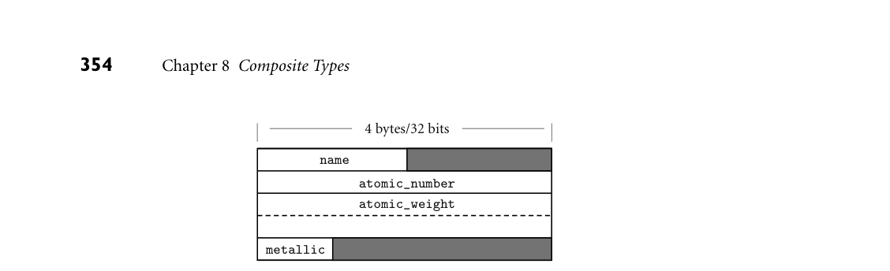
*Figure 8.1  Likely layout in memory for objects of type element on a 32-bit machine. Alignment restrictions lead to the shaded “holes.”*

In a language with a value model of variables, nested records are naturally  embedded in the parent record, where they function as large felds with word or  double-word alignment. In a language with a reference model of variables, felds  of record type are typically references to data in another location. The difference  is a matter not only of memory layout, but also of semantics. We can see the

EXAMPLE 8.6  difference in Figure 8.2. In C, with a value model of variables, data is laid out as  Nested records as values  shown at the top of the fgure. In the following code, using the declarations at the  top of the fgure, the assignment of s1 into s2 copies the embedded T:

struct S s1;  struct S s2;  s1.n.j = 0;  s2 = s1;  s2.n.j = 7;  printf("%d\n", s1.n.j);  /* prints 0 */  ■

EXAMPLE 8.7  In Java, by contrast, with a reference model of variables, data is laid out as  Nested records as  shown at the bottom of the fgure. In the following code, using the declarations  references  at the bottom of the fgure, assignment of s1 into s2 copies only the reference, so

s2.n.j is an alias for s1.n.j:

S s1 = new S();  s1.n = new T();  // fields initialized to 0  S s2 = s1;  s2.n.j = 7;  System.out.println(s1.n.j);  // prints 7  ■

```
EXAMPLE 8.8 
A few languages and implementations allow the programmer to specify that a 
Layout of packed types 
record type (or an array, set, or fle type) should be packed. In  Ada,  one  uses  a  
pragma:
```

type element = record

...  end;  pragma Pack(element);

struct T {

int j;  int k;  };  struct S {

i

n.j

n.k

int i;  struct T n;

};

```
class T {
 public int j;
 public int k; 
} 
class S {
 public int i;
 public T n;
```

i

n j

k

}

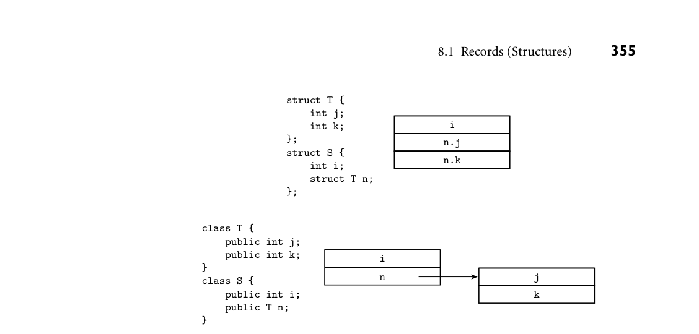
*Figure 8.2  Layout of memory for a nested struct (class) in C (top) and Java (bottom).  This layout refects the fact that n is an embedded value in C, but a reference in Java. We have  assumed here that integers and pointers have equal size.*

When compiling with gcc, one  uses  an  attribute:

struct __attribute__ ((__packed__)) element {  ...  }

The Ada syntax is built into the language; the gcc syntax is a GNU extension. In  either case, the directive asks the compiler to optimize for space instead of speed.  Typically, a compiler will implement a packed record without holes, by simply  “pushing the felds together.” To access a nonaligned feld, however, it will have  to issue a multi-instruction sequence that retrieves the pieces of the feld from  memory and then reassembles them in a register. A likely packed layout for our  element type (again for a 32-bit machine) appears in Figure 8.3. It is 15 bytes in  length. An array of packed element records would probably devote 16 bytes to  each member of the array; that is, it would align each element. A packed array  of packed records might devote only 15 bytes to each; only every fourth element  would be aligned.  ■

EXAMPLE 8.9  Most languages allow a value to be assigned to an entire record in a single  Assignment and  operation:  comparison of records

my_element := copper;

Ada also allows records to be compared for equality (if my_element = copper  then ...). Many other languages (including C and its successors) support assignment but not equality testing, though C++ allows the programmer to defne  the latter for individual record types.  ■

4 bytes/32 bits

atomic_

name

number

atomic_weight

metallic


*Figure 8.3  Likely memory layout for packed element records. The atomic_number and  atomic_weight felds are nonaligned, and can only be read or written (on most machines) via  multi-instruction sequences.*

For small records, both copies and comparisons can be performed in-line on  a feld-by-feld basis. For longer records, we can save signifcantly on code space  by deferring to a library routine. A block_copy routine can take source address,  destination address, and length as arguments, but the analogous block_compare  routine would fail on records with different (garbage) data in the holes. One  solution is to arrange for all holes to contain some predictable value (e.g., zero),  but this requires code at every elaboration point. Another is to have the compiler  generate a customized feld-by-feld comparison routine for every record type.  Different routines would be called to compare records of different types.

EXAMPLE 8.10  In addition to complicating comparisons, holes in records waste space. PackMinimizing holes by sorting  ing eliminates holes, but at potentially heavy cost in access time. A compromise,  fields  adopted by some compilers, is to sort a record’s felds according to the size of  their alignment constraints. All byte-aligned felds might come frst, followed by  any half-word aligned felds, word-aligned felds, and (if the hardware requires)  double-word-aligned felds. For our element type, the resulting rearrangement  is shown in Figure 8.4.  ■  In most cases, reordering of felds is purely an implementation issue: the programmer need not be aware of it, so long as all instances of a record type are  reordered in the same way. The exception occurs in systems programs, which  sometimes “look inside” the implementation of a data type with the expectation  that it will be mapped to memory in a particular way. A kernel programmer, for  example, may count on a particular layout strategy in order to defne a record

DESIGN & IMPLEMENTATION

8.2 The order of record felds  Issues of record feld order are intimately tied to implementation tradeoffs:  Holes in records waste space, but alignment makes for faster access. If holes  contain garbage we can’t compare records by looping over words or bytes, but  zeroing out the holes would incur costs in time and code space. Predictable  layout is important for mirroring hardware structures in “systems” languages,  but reorganization may be advantageous in large records if we can group frequently accessed felds together, so they lie in the same cache line.

4 bytes/32 bits

name  metallic

atomic_number

atomic_weight

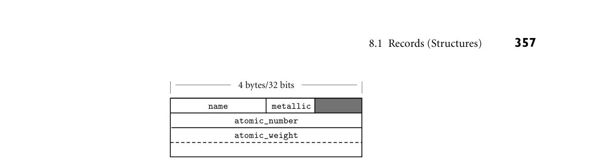
*Figure 8.4  Rearranging record fields to minimize holes. By sorting felds according to the size  of their alignment constraint, a compiler can minimize the space devoted to holes, while keeping  the felds aligned.*

that mimics the organization of memory-mapped control registers for a particular Ethernet device. C and C++, which are designed in large part for systems  programs, guarantee that the felds of a struct will be allocated in the order  declared. The frst feld is guaranteed to have the coarsest alignment required  by the hardware for any type (generally a four- or eight-byte boundary). Subsequent felds have the natural alignment for their type. Fortran 90 allows the  programmer to specify that felds must not be reordered; in the absence of such a  specifcation the compiler can choose its own order. To accommodate systems  programs, Ada, C, and C++ all allow the programmer to specify exactly how  many bits to devote to each feld of a record. Where a “packed” directive is essentially a nonbinding indication of the programmer’s priorities, bit lengths on  feld declarations are a binding specifcation of assembly-level layout.

## 8.1.3 Variant Records (Unions)

Programming languages of the 1960s and 1970s were designed in an era of severe memory constraints. Many allowed the programmer to specify that certain  variables (presumably ones that would never be used at the same time) should be

EXAMPLE 8.11  allocated “on top of” one another, sharing the same bytes in memory. C’s syntax,  A union in C  heavily infuenced by Algol 68, looks very much like a struct:

union {  int i;  double d;  _Bool b;  };

The overall size of this union would be that of its largest member (presumably d).  Exactly which bytes of d would be overlapped by i and b is implementation dependent, and presumably infuenced by the relative sizes of types, their alignment  constraints, and the endian-ness of the hardware.  ■  In practice, unions have been used for two main purposes. The frst arises in  systems programs, where unions allow the same set of bytes to be interpreted in

different ways at different times. The canonical example occurs in memory management, where storage may sometimes be treated as unallocated space (perhaps  in need of “zeroing out”), sometimes as bookkeeping information (length and  header felds to keep track of free and allocated blocks), and sometimes as userallocated data of arbitrary type. While nonconverting type casts (Section 7.2.1)  can be used to implement heap management routines, unions are a better indication of the programmer’s intent: the bits are not being reinterpreted, they are  being used for independent purposes.1

The second, historical purpose for unions was to represent alternative sets of

EXAMPLE 8.12  felds within a record. A record representing an employee, for example, might  Motivation for variant  have several common felds (name, address, phone, department, ID number) and  records  various other felds depending on whether the person in question works on a  salaried, hourly, or consulting basis. Traditional C unions were awkward when  used for this purpose. A much cleaner syntax appeared in the variant records  of Pascal and its successors, which allow the programmer to specify that certain  felds within a record should overlap in memory. Similar functionality was added  to C11 and C++11 in the form of anonymous unions.  ■

IN MORE DEPTH

We discuss unions and variant records in more detail on the companion site.  Topics we consider include syntax, safety, and memory layout issues. Safety is  a particular concern: where nonconverting type casts allow a programmer to circumvent the language’s type system explicitly, a naive realization of unions makes  it easy to do so by accident. Ada imposes limits on the use of unions and variant  records that allow the compiler to verify, statically, that all programs are type-safe.  We also note that inheritance in object-oriented languages provides an attractive  alternative to type-safe variant records in most cases. This observation largely  accounts for the omission of unions and variant records from most more recent  languages.

## 3CHECK YOUR UNDERSTANDING  1. What  are  struct tags in C? How are they related to type names? How did they  change in C++?

  2.
  How do the records of ML differ from those of most other languages?
  3.
  Discuss the signifcance of “holes” in records. Why do they arise? What problems do they cause?

```
1 
By contrast, the other example mentioned under Nonconverting Type Casts in Section 7.2.1— 
examination of the internal structure of a foating-point number—does indeed reinterpret bits. 
Unions  can also  be  used  in this  case  (Exercise  C  8.24), but here a nonconverting cast is a better 
indication of intent.
```

  4.
  Why is it easier to implement assignment than comparison for records?

  5.
  What
  is
  packing? What are its advantages and disadvantages?
  6.
  Why might a compiler reorder the felds of a record? What problems might
  this cause?
  7.
  Briefy describe two purposes for unions/variant records.

### 8.2 Arrays

Arrays are the most common and important composite data types. They have  been a fundamental part of almost every high-level language, beginning with Fortran I. Unlike records, which group related felds of disparate types, arrays are  usually homogeneous. Semantically, they can be thought of as a mapping from  an index type to a component or element type. Some languages (e.g., Fortran) require that the index type be integer; many languages allow it to be any discrete  type. Some languages (e.g., Fortran 77) require that the element type of an array  be scalar. Most (including Fortran 90) allow any element type.

Some languages (notably scripting languages, but also some newer imperative  languages, including Go and Swift) allow nondiscrete index types. The resulting  associative arrays must generally be implemented with hash tables or search trees;  we consider them in Section 14.4.3. Associative arrays also resemble the dictionary or map types supported by the standard libraries of many object-oriented  languages. In C++, operator overloading allows these types to use conventional  array-like syntax. For the purposes of this chapter, we will assume that array  indices are discrete. This admits a (much more effcient) contiguous allocation  scheme, to be described in Section 8.2.3. We will also assume that arrays are  dense—that a large fraction of their elements are not equal to zero or some other  default value. The alternative—sparse arrays—arises in many important scientifc problems. For these, libraries (or, in rare cases, the language itself) may  support an alternative implementation that explicitly enumerates only the nondefault values.

## 8.2.1 Syntax and Operations

```
Most languages refer to an element of an array by appending a subscript—usually 
delimited  by square brackets—to  the name of the  array:  A[3]. A few languages— 
notably Fortran and Ada—use parentheses instead: A(3).
```

EXAMPLE 8.13  In some languages one declares an array by appending subscript notation to  Array declarations  the syntax that would be used to declare a scalar. In C:

char upper[26];

In Fortran:

character, dimension (1:26) :: upper  character (26) upper  ! shorthand notation

In C, the lower bound of an index range is always zero: the indices of an n-element  array are 0 . . .n − 1. In Fortran, the lower bound of the index range is one by  default. Fortran 90 allows a different lower bound to be specifed if desired, using  the notation shown in the frst of the two declarations above.

Many Algol descendants use an array constructor instead. In Ada, for example, one might say

upper : array (character range 'a'..'z') of character;  ■

EXAMPLE 8.14

Most languages make it easy to declare multidimensional arrays:

Multidimensional arrays

mat : array (1..10, 1..10) of long_float;  -­ Ada

real, dimension (10,10) :: mat  ! Fortran

In some languages, one can also declare a multidimensional array by using the  array constructor more than once in the same declaration. In Modula-3, for  example,

VAR mat : ARRAY [1..10], [1..10] OF REAL;

is syntactic sugar for

VAR mat : ARRAY [1..10] OF ARRAY [1..10] OF REAL;

and mat[3, 4] is syntactic sugar for mat[3][4].  ■

EXAMPLE 8.15  In Ada, by contrast,  Multidimensional vs  built-up arrays  mat1 : array (1..10, 1..10) of long_float;

is not the same as

type vector is array (integer range <>) of long_float;  type matrix is array (integer range <>) of vector (1..10);  mat2 : matrix (1..10);

Variable mat1 is a two-dimensional array; mat2 is an array of one-dimensional  arrays. With the former declaration, we can access individual real numbers as  mat1(3, 4); with the latter we must say mat2(3)(4). The two-dimensional  array is arguably more elegant, but the array of arrays supports additional operations: it allows us to name the rows of mat2 individually (mat2(3) is a 10element, single-dimensional array), and it allows us to take slices, as discussed

```
below (mat2(3)(2..6) is  a fve-element  array of real numbers;  mat2(3..7) is a 
fve-element array of ten-element arrays). 
■ 
In C, one must also declare an array of arrays, and use two-subscript notation, 
but C’s integration of pointers and arrays (to be discussed in Section 8.5.1) means 
that slices are not supported:
```

EXAMPLE 8.16

Arrays of arrays in C

double mat[10][10];

Given this defnition, mat[3][4] denotes an individual element of the array, but  mat[3] denotes a reference, either to the third row of the array or to the frst  element of that row, depending on context.  ■

DESIGN & IMPLEMENTATION

## 8.3 Is [ ]  an operator?  Associative arrays in C++ are typically defned by overloading operator[ ].  C#, like C++, provides extensive facilities for operator overloading, but it does  not use these facilities to support associative arrays. Instead, the language provides a special indexer mechanism, with its own unique syntax:

```
class directory { 
Hashtable table; 
// from standard library 
... 
public directory() { 
// constructor 
table = new Hashtable(); 
} 
... 
public string this[string name] { 
// indexer method 
get { 
return (string) table[name]; 
} 
set {
```

table[name] = value;  // value is implicitly  }  }  }  // a parameter of set  ...  directory d = new directory();  ...  d["Jane Doe"] = "234-5678";  Console.WriteLine(d["Jane Doe"]);

Why the difference? In C++, operator[] can return a reference (an explicit  l-value), which can be used on either side of an assignment (further information can be found under “References in C++” in Section 9.3.1). C# has no  comparable l-value mechanism, so it needs separate methods to get and set  the value of d["Jane Doe"].

matrix(3:6, 4:7)  matrix(6:, 5)

matrix(:4, 2:8:2)  matrix(:, (/2, 5, 9/))

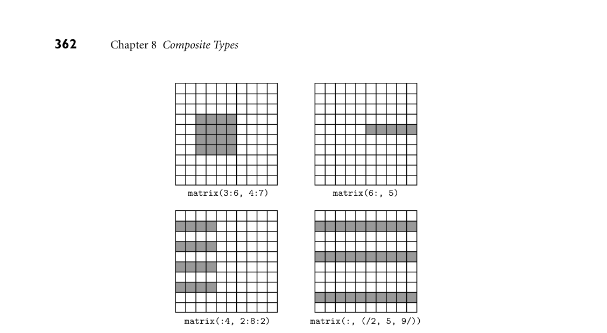
*Figure 8.5  Array slices (sections) in Fortran 90. Much like the values in the header of an  enumeration-controlled loop (Section 6.5.1), a : b : c in a subscript indicates positions a, a + c,  a + 2c,  . . .  through  b. If  a or b is omitted, the corresponding bound of the array is assumed. If c is  omitted, 1 is assumed. It is even possible to use negative values of c in order to select positions in  reverse order. The slashes in the second subscript of the lower right example delimit an explicit  list of positions.*

Slices and Array Operations

```
EXAMPLE 8.17 
A slice or section is a rectangular portion of an array. Fortran 90 provides exArray slice operations 
tensive facilities for slicing, as do Go and many scripting languages. Figure 8.5 
illustrates some of the possibilities in Fortran 90, using the declaration of mat 
from Example 8.14. Ada provides more limited support: a slice is simply a contiguous range of elements in a one-dimensional array. As we saw in Example 8.15, 
the elements can themselves be arrays, but there is no way to extract a slice along 
both dimensions as a single operation. 
■ 
In most languages, the only operations permitted on an array are selection 
of an element (which can then be used for whatever operations are valid on its 
type), and assignment. A few languages (e.g., Ada and Fortran 90) allow arrays to 
be compared for equality. Ada allows one-dimensional arrays whose elements are 
discrete to be compared for lexicographic ordering: A < B  if the frst element of A 
that is not equal to the corresponding element of B is less than that corresponding element. Ada also allows the built-in logical operators (or, and, xor) to  be  
applied to Boolean arrays.
```

Fortran 90 has a very rich set of array operations: built-in operations that take  entire arrays as arguments. Because Fortran uses structural type equivalence, the

```
operands of an array operator need only have the same element type and shape. 
In particular, slices of the same shape can be intermixed in array operations, even 
if the arrays from which they were sliced have very different shapes. Any of the 
built-in arithmetic operators will take arrays as operands; the result is an array, 
of the same shape as the operands, whose elements are the result of applying 
the operator to corresponding elements. As a simple example, A + B  is an array 
each of whose elements is the sum of the corresponding elements of A and B. 
Fortran 90 also provides a huge collection of intrinsic, or built-in functions. More 
than 60 of these (including logic and bit manipulation, trigonometry, logs and 
exponents, type conversion, and string manipulation) are defned on scalars, but 
will also perform their operation element-wise if passed arrays as arguments. The 
function tan(A), for example, returns an array consisting of the tangents of the 
elements of A. Many additional intrinsic functions are defned solely on arrays. 
These include searching and summarization, transposition, and reshaping and 
subscript permutation.
```

Fortran 90 draws signifcant inspiration from APL, an array manipulation language developed by Iverson and others in the early to mid-1960s.2 APL was designed primarily as a terse mathematical notation for array manipulations. It  employs an enormous character set that made it diffcult to use with traditional  keyboards and textual displays. Its variables are all arrays, and many of the special characters denote array operations. APL implementations are designed for  interpreted, interactive use. They are best suited to “quick and dirty” solution of  mathematical problems. The combination of very powerful operators with very  terse notation makes APL programs notoriously diffcult to read and understand.  J, a successor to APL, uses a conventional character set.

## 8.2.2 Dimensions, Bounds, and Allocation

In all of the examples in the previous subsection, the shape of the array (including  bounds) was specifed in the declaration. For such static shape arrays, storage can  be managed in the usual way: static allocation for arrays whose lifetime is the  entire program; stack allocation for arrays whose lifetime is an invocation of a  subroutine; heap allocation for dynamically allocated arrays with more general  lifetime.

Storage management is more complex for arrays whose shape is not known  until elaboration time, or whose shape may change during execution. For these  the compiler must arrange not only to allocate space, but also to make shape  information available at run time (without such information, indexing would  not be possible). Some dynamically typed languages allow run-time binding of

2  Kenneth Iverson (1920–2004), a Canadian mathematician, joined the faculty at Harvard University in 1954, where he conceived APL as a notation for describing mathematical algorithms.  He moved to IBM in 1960, where he helped develop the notation into a practical programming  language. He was named an IBM Fellow in 1970, and received the ACM Turing Award in 1979.

both the number and bounds of dimensions. Compiled languages may allow  the bounds to be dynamic, but typically require the number of dimensions to  be static. A local array whose shape is known at elaboration time may still be  allocated in the stack. An array whose size may change during execution must  generally be allocated in the heap.

```
In the frst subsection below we consider the descriptors, or  dope vectors,3 used 
to hold shape information at run time. We then consider stack- and heap-based 
allocation, respectively, for dynamic shape arrays.
```

Dope Vectors

During compilation, the symbol table maintains dimension and bounds information for every array in the program. For every record, it maintains the offset  of every feld. When the number and bounds of array dimensions are statically  known, the compiler can look them up in the symbol table in order to compute  the address of elements of the array. When these values are not statically known,  the compiler must generate code to look them up in a dope vector at run time.

In the general case a dope vector must specify the lower bound of each dimension and the size of each dimension other than the last (which is always the size of  the element type, and will thus be statically known). If the language implementation performs dynamic semantic checks for out-of-bounds subscripts in array  references, then the dope vector may contain upper bounds as well. Given lower  bounds and sizes, the upper bound information is redundant, but including it  avoids the need to recompute repeatedly at run time.

The contents of the dope vector are initialized at elaboration time, or whenever the number or bounds of dimensions change. In a language like Fortran 90,  whose notion of shape includes dimension sizes but not lower bounds, an assignment statement may need to copy not only the data of an array, but dope vector  contents as well.

In a language that provides both a value model of variables and arrays of dynamic shape, we must consider the possibility that a record will contain a feld  whose size is not statically known. In this case the compiler may use dope vectors  not only for dynamic shape arrays, but also for dynamic shape records. The dope  vector for a record typically indicates the offset of each feld from the beginning  of the record.

Stack Allocation

Subroutine parameters and local variables provide the simplest examples of dynamic shape arrays. Early versions of Pascal required the shape of all arrays to be  specifed statically. Standard Pascal allowed dynamic arrays as subroutine parameters, with shape fxed at subroutine call time. Such parameters are sometimes

```
3 
The name “dope  vector”  presumably derives  from  the notion of  “having  the dope  on (something),” a colloquial expression that originated in horse racing: advance knowledge that a horse 
has been drugged (“doped”) is of signifcant, if unethical, use in placing bets.
```

void square(int n, double M[n][n]) {  double T[n][n];  for (int i = 0; i < n; i++) {  // compute product into T  for (int j = 0; j < n; j++) {  double s = 0;  for (int k = 0; k < n; k++) {

s += M[i][k] * M[k][j];  }  T[i][j] = s;  }  }  for (int i = 0; i < n; i++) {  // copy T back into M  for (int j = 0; j < n; j++) {  M[i][j] = T[i][j];  }  }  }

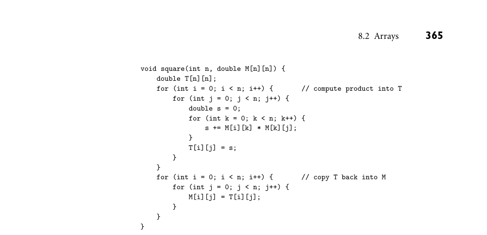
*Figure 8.6  A dynamic local array in C. Function square multiplies a matrix by itself and  replaces the original with the product. To do so it needs a scratch array of the same shape as  the parameter. Note that the declarations of M and T both rely on parameter n.*

known as conformant arrays. Among other things, they facilitate the construction of linear algebra libraries, whose routines must typically work on arrays of  arbitrary size. To implement such an array, the compiler arranges for the caller to  pass both the data of the array and an appropriate dope vector. If the array is of  dynamic shape in the caller’s context, the dope vector may already be available. If  the array is of static shape in the caller’s context, an appropriate dope vector will  need to be created prior to the call.

Ada and C (though not C++) support dynamic shape for both parameters and

EXAMPLE 8.18  local variables. Among other things, local arrays can be declared to match the  Local arrays of dynamic  shape of conformant array parameters, facilitating the implementation of algoshape in C  rithms that require temporary space for calculations. Figure 8.6 contains a simple  example in C. Function square accepts an array parameter M of dynamic shape  and allocates a local variable T of the same dynamic shape.  ■

EXAMPLE 8.19  In many languages, including Ada and C, the shape of a local array becomes  Stack allocation of  fxed at elaboration time. For such arrays it is still possible to place the space for  elaborated arrays  the array in the stack frame of its subroutine, but an extra level of indirection is  required (see Figure 8.7). In order to ensure that every local object can be found  using a known offset from the frame pointer, we divide the stack frame into a  fixed-size part and a variable-size part. An object whose size is statically known  goes in the fxed-size part. An object whose size is not known until elaboration  time goes in the variable-size part, and a pointer to it, together with a dope vector, goes in the fxed-size part. If the elaboration of the array is buried in a nested  block, the compiler delays allocating space (i.e., changing the stack pointer) until  the block is entered. It still allocates space for the pointer and the dope vector

sp

-- Ada:  procedure foo(size : integer) is

Variable-size  M : array (1..size, 1..size)  part of the frame  of long_float;  ...  begin

M

Temporaries

...  end foo;

Pointer to M

Local  variables  Fixed-size part  of the frame  // C99:  void foo(int size) {  double M[size][size];  ...  fp }

Dope vector

Bookkeeping

Return address

Arguments  and returns

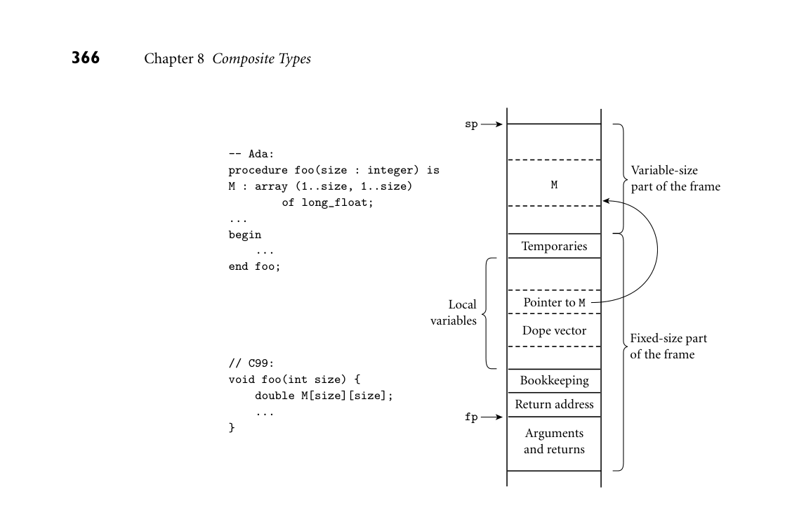
*Figure 8.7  Elaboration-time allocation of arrays. Here M is a square two-dimensional array  whose bounds are determined by a parameter passed to foo at run time. The compiler arranges  for a pointer to M and a dope vector to reside at static offsets from the frame pointer. M cannot  be placed among the other local variables because it would prevent those higher in the frame  from having static offsets. Additional variable-size arrays or records are easily accommodated.*

among the local variables when the subroutine itself is entered. Records of dynamic shape are handled in a similar way.  ■

EXAMPLE 8.20  Fortran 90 allows specifcation of the bounds of an array to be delayed until  Elaborated arrays in  after elaboration, but it does not allow those bounds to change once they have  Fortran 90  been defned:

real, dimension (:,:), allocatable :: mat

! mat is two-dimensional, but with unspecified bounds  ...  allocate (mat (a:b, 0:m-1))

! first dimension has bounds a..b; second has bounds 0..m-1  ...  deallocate (mat)

! implementation is now free to reclaim mat's space

Execution of an allocate statement can be treated like the elaboration of a dynamic shape array in a nested block. Execution of a deallocate statement can

be treated like the end of the nested block (restoring the previous stack pointer)  if there are no other arrays beyond the specifed one in the stack. Alternatively,  dynamic shape arrays can be allocated in the heap, as described in the following  subsection.  ■

Heap Allocation

Arrays that can change shape at arbitrary times are sometimes said to be fully  dynamic. Because changes in size do not in general occur in FIFO order, stack  allocation will not suffce; fully dynamic arrays must be allocated in the heap.

Several languages, including all the major scripting languages, allow strings—  arrays of characters—to change size after elaboration time. Java and C# provide  a similar capability (with a similar implementation), but describe the semantics  differently: string variables in these languages are references to immutable string  objects:

EXAMPLE 8.21

Dynamic strings in Java and  C#

String s = "short";  // This is Java; use lower-case 'string' in C#  ...  s = s + " but sweet";  // + is the concatenation operator

```
Here the declaration String s introduces a string variable, which we initialize 
with a reference to the constant string "short". In the subsequent assignment, + 
creates a new string containing the concatenation of the old s and the constant " 
but sweet"; s is then set to refer to this new string, rather than the old. Note that 
arrays of characters are not the same as strings in Java and C#: the length of an 
array is fxed at elaboration time, and its elements can be modifed in place. 
■ 
Dynamically resizable arrays (other than strings) appear in APL, Common 
Lisp, and the various scripting languages. They are also supported by the vector, 
Vector, and  ArrayList classes of the C++, Java, and C# libraries, respectively. 
In contrast to the allocate-able arrays of Fortran 90, these arrays can change 
their shape—in particular, can grow—while retaining their current content. In 
many cases, increasing the size will require that the run-time system allocate a 
larger block, copy any data that are to be retained from the old block to the new, 
and then deallocate the old.
```

If the number of dimensions of a fully dynamic array is statically known, the  dope vector can be kept, together with a pointer to the data, in the stack frame  of the subroutine in which the array was declared. If the number of dimensions  can change, the dope vector must generally be placed at the beginning of the heap  block instead.

In the absence of garbage collection, the compiler must arrange to reclaim the  space occupied by fully dynamic arrays when control returns from the subroutine in which they were declared. Space for stack-allocated arrays is of course  reclaimed automatically by popping the stack.

## 8.2.3 Memory Layout

Arrays in most language implementations are stored in contiguous locations in  memory. In a one-dimensional array, the second element of the array is stored  immediately after the frst; the third is stored immediately after the second, and  so forth. For arrays of records, alignment constraints may result in small holes  between consecutive elements.

For multidimensional arrays, it still makes sense to put the frst element of  the array in the array’s frst memory location. But which element comes next?

```
EXAMPLE 8.22 
There are two reasonable answers, called row-major and column-major order. In 
Row-major vs 
row-major order, consecutive locations in memory hold elements that differ by 
column-major array layout 
one in the fnal subscript (except at the ends of rows). A[2, 4], for  example,  
is followed by A[2, 5]. In column-major order, consecutive locations hold elements that differ by one in the initial subscript: A[2, 4] is followed by A[3, 
4]. These options are illustrated for two-dimensional arrays in Figure 8.8. The 
layouts for three or more dimensions are analogous. Fortran uses column-major 
order; most other languages use row-major order. (Correspondence with Fran 
Allen4 suggests that column-major order was originally adopted in order to accommodate idiosyncrasies of the console debugger and instruction set of the IBM 
model 704 computer, on which the language was frst implemented.) The advantage of row-major order is that it makes it easy to defne a multidimensional array 
as an array of subarrays, as described in Section 8.2.1. With column-major order, 
the elements of the subarray would not be contiguous in memory. 
■ 
The difference between row- and column-major layout can be important for 
programs that use nested loops to access all the elements of a large, multidimensional array. On modern machines the speed of such loops is often limited 
by memory system performance, which depends heavily on the effectiveness of
```

EXAMPLE 8.23  caching (Section C 5.1). Figure 8.8 shows the orientation of cache lines for rowArray layout and cache  and column-major layout of arrays. When code traverses a small array, all or most  performance  of its elements are likely to remain in the cache through the end of the nested  loops, and the orientation of cache lines will not matter. For a large array, however, lines that are accessed early in the traversal are likely to be evicted to make  room for lines accessed later in the traversal. If array elements are accessed in  order of consecutive addresses, then each miss will bring into the cache not only  the desired element, but the next several elements as well. If elements are accessed  across cache lines instead (i.e., along the rows of a Fortran array, or the columns of  an array in most other languages), then there is a good chance that almost every

4  Fran Allen (1932–) joined IBM’s T. J. Watson Research Center in 1957, and stayed for her entire  professional career. Her seminal paper, Program Optimization [All69] helped launch the feld  of code improvement. Her PTRAN (Parallel TRANslation) group, founded in the early 1980s,  developed much of the theory of automatic parallelization. In 1989 Dr. Allen became the frst  woman to be named an IBM Fellow. In 2006 she became the frst to receive the ACM Turing  Award.

Row-major order  Column-major order

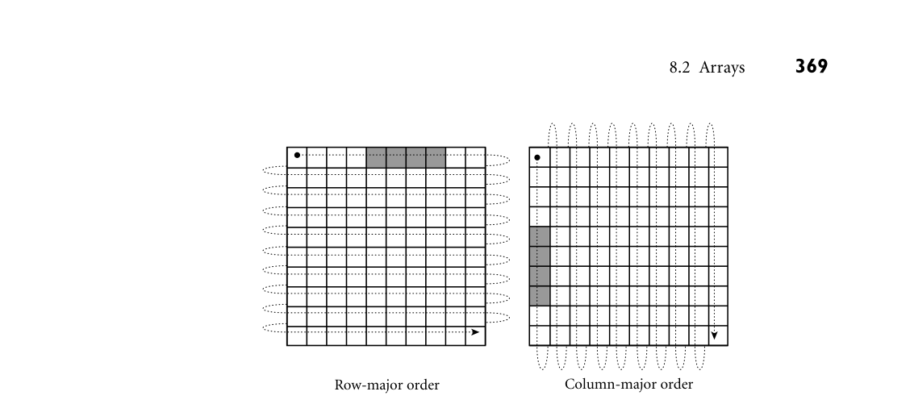
*Figure 8.8  Row- and column-major memory layout for two-dimensional arrays. In row-major  order, the elements of a row are contiguous in memory; in column-major order, the elements  of a column are contiguous. The second cache line of each array is shaded, on the assumption  that each element is an eight-byte foating-point number, that cache lines are 32 bytes long (a  common size), and that the array begins at a cache line boundary. If the array is indexed from  A[0,0] to A[9,9], then in the row-major case elements A[0,4] through A[0,7] share a cache line;  in the column-major case elements A[4,0] through A[7,0] share a cache line.*

access will result in a cache miss, dramatically reducing the performance of the  code. In C, one should write

```
for (i =  0; i <  N; i++) {  
/* rows  */  
for (j = 0; j < N; j++) { 
/* columns */ 
... A[i][j] ... 
} 
}
```

In Fortran:

```
do j = 1, N 
! columns 
do i = 1, N 
! rows 
... A(i, j) ...  
end do 
end do 
■
```

Row-Pointer Layout

Some languages employ an alternative to contiguous allocation for some arrays.  Rather than require the rows of an array to be adjacent, they allow them to lie  anywhere in memory, and create an auxiliary array of pointers to the rows. If the  array has more than two dimensions, it may be allocated as an array of pointers  to arrays of pointers to .... This row-pointer memory layout requires more space

```
in most cases, but has three potential advantages. The frst is of historical interest 
only: on machines designed before about 1980, row-pointer layout sometimes 
led to faster code (see the discussion of address calculations below). Second, rowpointer layout allows the rows to have different lengths, without devoting space 
to holes at the ends of the rows. This representation is sometimes called a ragged 
array. The lack of holes may sometimes offset the increased space for pointers. 
Third, row-pointer layout allows a program to construct an array from preexisting 
rows (possibly scattered throughout memory) without copying. C, C++, and 
C# provide both contiguous and row-pointer organizations for multidimensional 
arrays. Technically speaking, the contiguous layout is a true multidimensional 
array, while the row-pointer layout is an array of pointers to arrays. Java uses the 
row-pointer layout  for all  arrays.
```

```
EXAMPLE 8.24 
By far the most common use of the row-pointer layout in C is to represent 
Contiguous vs row-pointer 
arrays of strings. A typical example appears in Figure 8.9. In this example (reprearray layout 
senting the days of the week), the row-pointer memory layout consumes 57 bytes 
for the characters themselves (including a NUL byte at the end of each string), 
plus 28 bytes for pointers (assuming a 32-bit architecture), for a total of 85 bytes. 
The contiguous layout alternative devotes 10 bytes to each day (room enough for 
Wednesday and its NUL byte), for a total of 70 bytes. The additional space required 
for the row-pointer organization comes to 21 percent. In some cases, row pointers may actually save space. A Java compiler written in C, for example, would 
probably use row pointers to store the character-string representations of the 51 
Java keywords and word-like literals. This data structure would use 55 × 4 = 220 
bytes for the pointers (on a 32-bit machine), plus 366 bytes for the keywords, 
for a total of 586 bytes. Since the longest keyword (synchronized) requires  13  
bytes (including space for the terminating NUL), a contiguous two-dimensional 
array would consume 55 × 13 = 715 bytes (716 when aligned). In this case, row 
pointers save a little over 18%. 
■
```

DESIGN & IMPLEMENTATION

8.4 Array layout  The layout of arrays in memory, like the ordering of record felds, is intimately  tied to tradeoffs in design and implementation. While column-major layout  appears to offer no advantages on modern machines, its continued use in Fortran means that programmers must be aware of the underlying implementation in order to achieve good locality in nested loops. Row-pointer layout,  likewise, has no performance advantage on modern machines (and a likely  performance penalty, at least for numeric code), but it is a more natural ft for  the “reference to object” data organization of languages like Java. Its impacts  on space consumption and locality may be positive or negative, depending on  the details of individual applications.

char days[][10] = {  "Sunday", "Monday", "Tuesday",  "Wednesday", "Thursday",  "Friday", "Saturday"  };  ...  days[2][3] == 's';  /* in Tuesday */

char *days[] = {  "Sunday", "Monday", "Tuesday",  "Wednesday", "Thursday",  "Friday", "Saturday"  };  ...  days[2][3] == 's';  /* in Tuesday */

S u n d a y

S u n d a y  M o n d a y  T u e s d a y  W e d n e s d a y  T h u r s d a y  F r i d a y  S a t u r d a y

M o n d a y

T

u

e s d a y

W e d n e s

d a y

s h

T

u r

d a y

F i r

d a y

d a y S a t u r

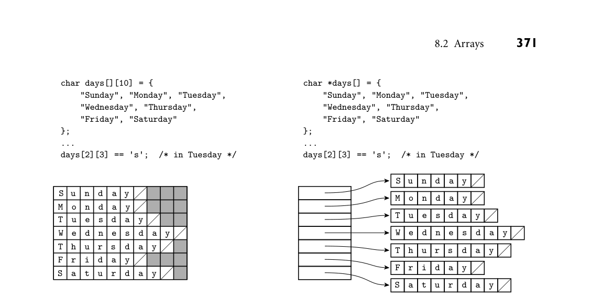
*Figure 8.9  Contiguous array allocation vs row pointers in C. The declaration on the left is a true two-dimensional array. The  slashed boxes are NUL bytes; the shaded areas are holes. The declaration on the right is a ragged array of pointers to arrays of  characters. The arrays of characters may be located anywhere in memory—next to each other or separated, and in any order.  In both cases, we have omitted bounds in the declaration that can be deduced from the size of the initializer (aggregate). Both  data structures permit individual characters to be accessed using double subscripts, but the memory layout (and corresponding  address arithmetic) is quite different.*

Address Calculations

For the usual contiguous layout of arrays, calculating the address of a particular  element is somewhat complicated, but straightforward. Suppose a compiler is  given the following declaration for a three-dimensional array:

EXAMPLE 8.25

Indexing a contiguous array

A :  array [L1 . .  U1] of  array  [L2 . .  U2] of  array  [L3 . .  U3] of  elem  type;

Let us defne constants for the sizes of the three dimensions:

S3  S2  S1

= size of elem type

= (U3 − L3 + 1) × S3

= (U2 − L2 + 1) × S2

```
Here  the size of  a  row  (S2) is the size of an individual element (S3) times  the  
number of elements in a row (assuming row-major layout). The size of a plane 
(S1) is  the  size  of  a row (S2) times the number of rows in a plane. The address of 
A[i, j, k] is then
```

L3

L1

L2

j

k

Address of A

i

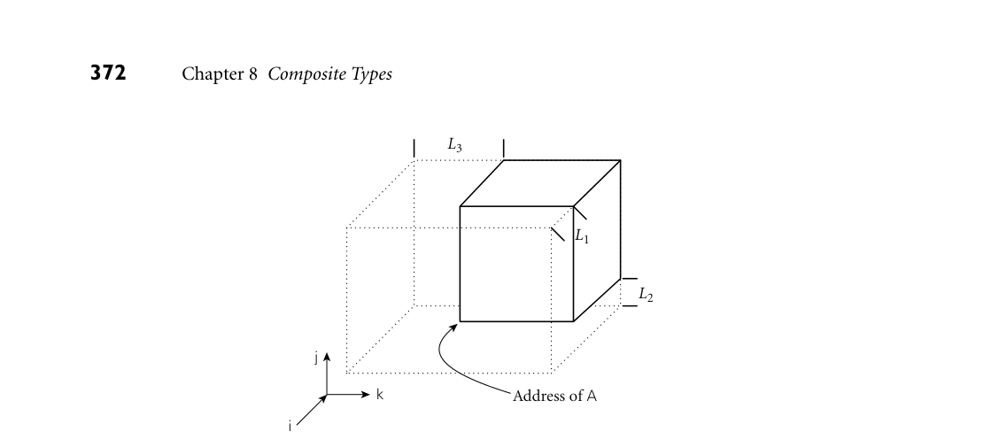
*Figure 8.10  Virtual location of an array with nonzero lower bounds.  By computing the  constant portions of an array index at compile time, we effectively index into an array whose  starting address is offset in memory, but whose lower bounds are all zero.*

address of A

+ (i − L1) × S1

+ (j − L2) × S2

+ (k − L3) × S3

```
As written, this computation involves three multiplications and six additions/subtractions. We could compute the entire expression at run time, but in most cases 
a little rearrangement reveals that much of the computation can be performed 
at compile time. In particular, if the bounds of the array are known at compile 
time, then S1, S2, and  S3 are compile-time constants, and the subtractions of lower 
bounds can be distributed out of the parentheses:
```

(i × S1) + (j × S2) + (k × S3) + address of A

−[(L1 × S1) + (L2 × S2) + (L3 × S3)]

The bracketed expression in this formula is a compile-time constant (assuming  the bounds of A are statically known). If A is a global variable, then the address of  A is statically known as well, and can be incorporated in the bracketed expression.  If A is a local variable of a subroutine (with static shape), then the address of A  can be decomposed into a static offset (included in the bracketed expression) plus  the contents of the frame pointer at run time. We can think of the address of A  plus the bracketed expression as calculating the location of an imaginary array  whose [i, j, k]th element coincides with that of A, but whose lower bound in each  dimension is zero. This imaginary array is illustrated in Figure 8.10.  ■

```
EXAMPLE 8.26 
If i, j, and/or  k is known at compile time, then additional portions of the calStatic and dynamic 
culation of the address of A[i, j, k] will move from the dynamic to the static part of 
portions of an array index
```

the formula shown above. If all of the subscripts are known, then the entire address can be calculated statically. Conversely, if any of the bounds of the array are  not known at compile time, then portions of the calculation will move from the  static to the dynamic part of the formula. For example, if L1 is not known until  run time, but k is known to be 3 at compile time, then the calculation becomes

(i × S1) + (j × S2) − (L1 × S1) + address of A − [(L2 × S2) + (L3 × S3) − (3 × S3)]

```
Again, the bracketed part can be computed at compile time. If lower bounds are 
always restricted to zero, as they are in C, then they never contribute to run-time 
cost. 
■ 
In all  our  examples,  we have ignored  the issue of dynamic  semantic  checks  
for out-of-bound subscripts. We explore the code for these in Exercise 8.10. In 
Section C 17.5.2 we will  consider  code improvement  techniques  that  can  be used  
to eliminate many checks statically, particularly in enumeration-controlled loops.
```

```
EXAMPLE 8.27 
The notion of “static part” and “dynamic part” of an address computation 
Indexing complex 
generalizes to more than just arrays. Suppose, for example, that V is a messy 
structures 
local array of records containing a nested, two-dimensional array in feld M. The  
address of V[i].M[3, j] could be calculated as
```

DESIGN & IMPLEMENTATION

## 8.5 Lower bounds on array indices  In C, the lower bound of every array dimension is always zero. It is often assumed that the language designers adopted this convention in order to avoid  subtracting lower bounds from indices at run time, thereby avoiding a potential source of ineffciency. As our discussion has shown, however, the compiler  can avoid any run-time cost by translating to a virtual starting location. (The  one exception to this statement occurs when the lower bound has a very large  absolute value: if any index (scaled by element size) exceeds the maximum offset available with displacement mode addressing [typically 215 bytes on RISC  machines], then subtraction may still be required at run time.)

A more likely explanation lies in the interoperability of arrays and pointers  in C (Section 8.5.1): C’s conventions allow the compiler to generate code for an  index operation on a pointer without worrying about the lower bound of the  array into which the pointer points. Interestingly, Fortran array dimensions  have a default lower bound of 1; unless the programmer explicitly specifes  a lower bound of 0, the compiler must always translate to a virtual starting  location.

i × S1

V

V × S1

V

−L1

+M’s offset as a feld

+(3 − L1

* × S

M  1  +j × S2

M

M × S

M  2 2  +fp  + offset of V in frame

−L

Here the calculations on the left must be performed at run time; the calculations  on the right can be performed at compile time. (The notation for bounds and size  places the name of the variable in a superscript and the dimension in a subscript:  LM is the lower bound of the second dimension of M.) 2  ■

EXAMPLE 8.28  Address calculation for arrays that use row pointers is comparatively straightIndexing a row-pointer  forward. Using our three-dimensional array A as an example, the expression  array  A[i, j, k] is equivalent, in C notation, to (*(*A[i])[j])[k].  If the intermediate  pointer loads both hit in the cache, the code to evaluate this expression is likely to  be comparable in cost to that of the contiguous allocation case (Example 8.26). If  the intermediate loads miss in the cache, it will be substantially slower. On a 1970s  CISC machine, the balance would probably have tipped the other way: multiplies  would have been slower, and memory accesses faster. In any event (contiguous or  row-pointer allocation, old or new machine), important code improvements will  often be possible when several array references use the same subscript expression,  or when array references are embedded in loops.  ■

## 3CHECK YOUR UNDERSTANDING  8.  What is an array slice? For what purposes are slices useful?  9.  Is there any signifcant difference between a two-dimensional array and an  array of one-dimensional arrays?  10. What is the shape of an array?

```
11. What  is  a  dope vector? What purpose does it serve? 
12. Under what circumstances can an array declared within a subroutine be al­
```

located in the stack? Under what circumstances must it be allocated in the  heap?

```
13. What  is  a  conformant array? 
14. Discuss the comparative advantages of contiguous and row-pointer layout for 
arrays. 
15. Explain the difference between row-major and column-major layout for con­
```

tiguously allocated arrays. Why does a programmer need to know which lay­

out the compiler uses? Why do most language designers consider row-major  layout to be better?  16. How much of the work of computing the address of an element of an array  can be performed at compile time? How much must be performed at run  time?

### 8.3 Strings

In some languages, a string is simply an array of characters. In other languages,  strings have special status, with operations that are not available for arrays of  other sorts.  Scripting languages like Perl, Python, and Ruby have extensive  suites of built-in string operators and functions, including sophisticated pattern matching facilities based on regular expressions.  Some special-purpose  languages—Icon, in particular—provide even more sophisticated mechanisms,  including general-purpose generators and backtracking search. We will consider  the string and pattern-matching facilities of scripting languages in more detail in  Section 14.4.2. Icon was discussed in Section C 6.5.4. In the remainder of the  current section we focus on the role of strings in more traditional languages.

Almost all programming languages allow literal strings to be specifed as a sequence of characters, usually enclosed in single or double quote marks. Most languages distinguish between literal characters (often delimited with single quotes)  and literal strings (often delimited with double quotes). A few languages make no  such distinction, defning a character as simply a string of length one. Most languages also provide escape sequences that allow nonprinting characters and quote  marks to appear inside literal strings.

EXAMPLE 8.29  C and C++ provide a very rich set of escape sequences. An arbitrary characCharacter escapes in C  ter can be represented by a backslash followed by (a) 1 to 3 octal (base 8) digits,  and C++  (b) an x and one or more hexadecimal (base-16) digits, (c) a u and exactly four  hexadecimal digits, or (d) a U and exactly eight hexadecimal digits. The \U notation is meant to capture the four-byte (32-bit) Unicode character set described  in Sidebar 7.3. The \u notation is for characters in the Basic Multilingual Plane.  Many of the most common control characters also have single-character escape  sequences, many of which have been adopted by other languages as well. For example, \n is a line feed; \t is a tab; \r is a carriage return; \\ is a backslash.  C# omits the octal sequences of C and C++; Java also omits the 32-bit extended  sequences.  ■  The set of operations provided for strings is strongly tied to the implementation envisioned by the language designer(s). Several languages that do not in general allow arrays to change size dynamically do provide this fexibility for strings.  The rationale is twofold. First, manipulation of variable-length strings is fundamental to a huge number of computer applications, and in some sense “deserves” special treatment. Second, the fact that strings are one-dimensional, have

one-byte elements, and never contain references to anything else makes dynamicsize strings easier to implement than general dynamic arrays.

Some languages require that the length of a string-valued variable be bound  no later than elaboration time, allowing the variable to be implemented as a contiguous array of characters in the current stack frame. Ada supports a few string

```
EXAMPLE 8.30 
operations, including assignment and comparison for lexicographic ordering. C, 
char* assignment in C 
on the other hand, provides only the ability to create a pointer to a string literal. 
Because of C’s unifcation of arrays and pointers, even assignment is not supported. Given the declaration char *s, the statement s = "abc" makes s point 
to the constant "abc" in static storage. If s is declared as an array, rather than 
a pointer  (char s[4]), then the statement will trigger an error message from 
the compiler. To assign one array into another in C, the program must copy the 
characters individually. 
■ 
Other languages allow the length of a string-valued variable to change over its 
lifetime, requiring that the variable be implemented as a block or chain of blocks 
in the heap. ML and Lisp provide strings as a built-in type. C++, Java, and C# 
provide them as predefned classes of object, in the formal, object-oriented sense. 
In all these languages a string variable is a reference to a string. Assigning a new 
value to such a variable makes it refer to a different object—each such object 
is immutable. Concatenation and other string operators implicitly create new 
objects. The space used by objects that are no longer reachable from any variable 
is reclaimed automatically.
```

### 8.4 Sets

A programming language set is an unordered collection of an arbitrary number  of distinct values of a common type. Sets were introduced by Pascal, and have  been supported by many subsequent languages. The type from which elements

```
EXAMPLE 8.31 
of a set are drawn is known as the base or universe type. Pascal sets were restricted 
Set types in Pascal 
to discrete base types, and overloaded +, *, and  - to provide set union, intersection, and difference operations, respectively. The intended implementation was a 
characteristic array—a bit vector whose length (in bits) is the number of distinct 
values of the base type. A one in the kth position in the bit vector indicates that 
the kth element of the base type is a member of the set; a zero indicates that it is 
not. In a language that uses ASCII, a set of characters would occupy 128 bits—16 
bytes. Operations on bit-vector sets can make use of fast logical instructions on 
most machines. Union is bit-wise or; intersection is bit-wise and; difference is 
bit-wise not, followed by bit-wise and. 
■ 
Unfortunately, bit vectors do not work well for large base types: a set of integers, represented as a bit vector, would consume some 500 megabytes on a 32-bit 
machine. With 64-bit integers, a bit-vector set would consume more memory 
than is currently contained on all the computers in the world. Because of this 
problem, some languages (including early versions of Pascal, though not the ISO 
standard) limited sets to base types of fewer than some fxed number of values.
```

For sets of elements drawn from a large universe, most modern languages use  alternative implementations, whose size is proportional to the number of elements present, rather than to the number of values in the base type. Most languages also provide a built-in iterator (Section 6.5.3) to yield the elements of the  set. A distinction is often made between sorted lists, whose base type must support some notion of ordering, and whose iterators yield the elements smallest-tolargest, and unordered lists, whose iterators yield the elements in arbitrary order.  Ordered sets are commonly implemented with skip lists or various sorts of trees.  Unordered sets are commonly implemented with hash tables.

Some languages (Python and Swift, for example) provide sets as a built-in type  constructor. The Python version can be seen in Example 14.67. In many objectoriented languages, sets are supported by the standard library instead. A few languages and libraries have no built-in set constructor, but do provide associative  arrays (also known as “hashes,” “dictionaries,” or “maps”). These can be used to  emulate unordered sets, by mapping all (and only) the desired elements to some  dummy value. In Go, for example, we can write

EXAMPLE 8.32

Emulating a set with a map  in Go

my_set := make(map[int]bool)  // mapping from int to bool  my_set[3] = true  // inserts <3, true> in mapping  ...  delete(my_set, i)  // removes <i, true>, if present  ...  if my_set[j] { ...  // true if present

```
If M is a mapping from type D to type R in Go, and if k ∈ D is not mapped to 
anything in R, the expression M[k] will return the “zero value” of type R. For  
Booleans, the zero value happens to be false, so the test in the last line of our 
example will return false if j is not in my_set. Deleting a no-longer-present 
element is preferable to mapping it explicitly to false, because deletion reclaims 
the space in the underlying hash table; mapping to false does not. 
■
```

### 8.5 Pointers and Recursive Types

A recursive type is one whose objects may contain one or more references to other  objects of the type. Most recursive types are records, since they need to contain  something in addition to the reference, implying the existence of heterogeneous  felds. Recursive types are used to build a wide variety of “linked” data structures,  including lists and trees.

```
In languages that use a reference model of variables, it is easy for a record of 
type foo to include a reference to another record of type foo: every  variable  
(and hence every record feld) is a reference anyway. In languages that use a value 
model of variables, recursive types require the notion of a pointer: a  variable  (or  
feld) whose value is a reference to some object. Pointers were frst introduced in 
PL/I.
```

```
In some languages (e.g., Pascal, Modula-3, and  Ada  83), pointers  were  restricted to point only to objects in the heap. The only way to create a new pointer 
value (without using variant records or casts to bypass the type system) was to call 
a built-in function that allocated  a  new  object  in the  heap  and  returned  a  pointer  
to it. In other languages, both old and new, one can create a pointer to a nonheap 
object by using an “address of” operator. We will examine pointer operations 
and the ramifcations of the reference and value models in more detail in the frst 
subsection below.
```

In any language that permits new objects to be allocated from the heap, the  question arises: how and when is storage reclaimed for objects that are no longer  needed? In short-lived programs it may be acceptable simply to leave the storage  unused, but in most cases unused space must be reclaimed, to make room for  other things. A program that fails to reclaim the space for objects that are no  longer needed is said to “leak memory.” If such a program runs for an extended  period of time, it may run out of space and crash.

Some languages, including C, C++, and Rust, require the programmer to reclaim space explicitly. Other languages, including Java, C#, Scala, Go, and all the  functional and scripting languages, require the language implementation to reclaim unused objects automatically. Explicit storage reclamation simplifes the  language implementation, but raises the possibility that the programmer will  forget to reclaim objects that are no longer live (thereby leaking memory), or  will accidentally reclaim objects that are still in use (thereby creating dangling  references). Automatic storage reclamation (otherwise known as garbage collection) dramatically simplifes the programmer’s task, but imposes certain runtime costs, and raises the question of how the language implementation is to  distinguish garbage from active objects. We will discuss dangling references and  garbage collection further in Sections 8.5.2 and 8.5.3, respectively.

## 8.5.1 Syntax and Operations

Operations on pointers include allocation and deallocation of objects in the heap,  dereferencing of pointers to access the objects to which they point, and assign-

DESIGN & IMPLEMENTATION

```
8.6 Implementation of pointers 
It is common for programmers (and even textbook writers) to equate pointers 
with addresses, but this is a mistake. A pointer is a high-level concept: a reference to an object. An address is a low-level concept: the location of a word 
in memory. Pointers are often implemented as addresses, but not always. On 
a machine  with  a  segmented memory architecture, a pointer may consist of a 
segment id and an offset within the segment. In a language that attempts to 
catch uses of dangling references, a pointer may contain both an address and 
an access key.
```

ment of one pointer into another. The behavior of these operations depends  heavily on whether the language is functional or imperative, and on whether it  employs a reference or value model for variables/names.

```
Functional languages generally employ a reference model for names (a purely 
functional language has no variables or assignments). Objects in a functional language tend to be allocated automatically as needed, with a structure determined 
by the language implementation. Variables in an imperative language may use 
either a value or a reference model, or some combination of the two. In C or Ada, 
which employ a value model, the assignment A = B  puts the value of B into A. If  
we want B to refer to an object, and we want A = B  to make A refer to the object 
to which B refers, then A and B must be pointers. In Smalltalk or Ruby, which 
employ a reference model, the assignment A = B  always makes A refer to the same 
object to which B refers.
```

```
Java charts an intermediate course, in which the usual implementation of the 
reference model is made explicit in the language semantics. Variables of built-in 
Java types (integers, foating-point numbers, characters, and Booleans) employ a 
value model; variables of user-defned types (strings, arrays, and other objects in 
the object-oriented sense of the word) employ a reference model. The assignment 
A = B  in Java places the value of B into A if A and B are of built-in type; it makes 
A refer to the object to which B refers if A and B are of user-defned type. C# mirrors Java by default, but additional language features, explicitly labeled “unsafe,” 
allow systems programmers to use pointers when desired.
```

Reference Model

EXAMPLE 8.33  In ML-family languages, the variant mechanism can be used to declare recursive  Tree type in OCaml  types (shown here in OCaml syntax):

type chr_tree = Empty | Node of char * chr_tree * chr_tree;;

Here a chr_tree is either an Empty leaf or a Node consisting of a character and  two child trees. (Further details can be found in Section 11.4.3.)

```
It is natural in OCaml to include a chr_tree within a chr_tree because every 
variable is a reference. The tree Node (‚R‚, Node (‚X‚, Empty, Empty), Node 
(‚Y‚, Node (‚Z‚, Empty, Empty), Node (‚W‚, Empty, Empty))) would 
most likely be represented in memory as shown in Figure 8.11. Each individual rectangle in the right-hand portion of this fgure represents a block of storage 
allocated from the heap. In effect, the tree is a tuple (record) tagged to indicate 
that it is a Node. This tuple in turn refers to two other tuples that are also tagged as 
Nodes.  At  the fringe  of the  tree  are tuples  that are  tagged  as  Empty; these  contain  
no further references. Because all Empty tuples are the same, the implementation 
is free to use just one, and to have every reference point to it. 
■
```

```
EXAMPLE 8.34 
In Lisp, which uses a reference model of variables but is not statically typed, 
Tree type in Lisp 
our tree could be specifed textually as ‚(#\R (#\X ()()) (#\Y (#\Z ()()) 
(#\W ()()))). Each level of parentheses brackets the elements of a list. In  this  
case, the outermost such list contains three elements: the character R and nested
```

Node R

Node X

Node Y

Z R

Node

Node W

X

Y

W Z

Empty

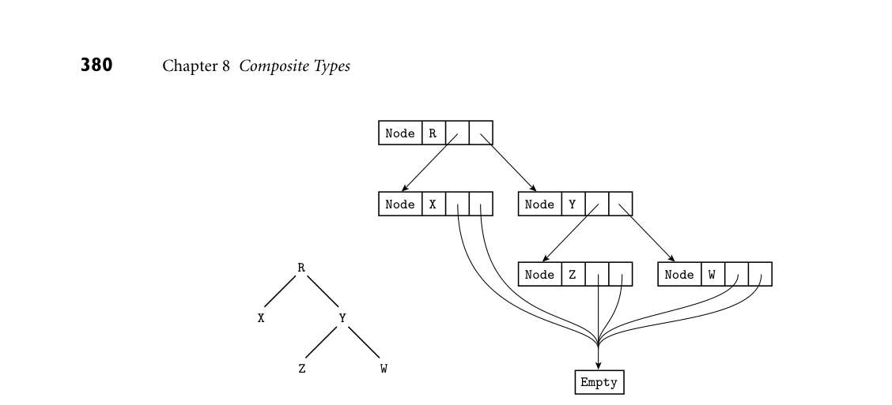
*Figure 8.11  Implementation of a tree in ML. The abstract (conceptual) tree is shown at the  lower left.*

```
lists to represent the left and right subtrees. (The prefx #\ notation serves the 
same purpose as surrounding quotes in other languages.) Semantically, each list 
is a pair of references: one to the head and one to the remainder of the list. As 
we noted in Section 8.5.1, these semantics are almost always refected in the implementation by a cons cell containing two pointers. A binary tree can thus be 
represented as a three-element (three cons cell) list, as shown in Figure 8.12. At 
the top level of the fgure, the frst cons cell points to R; the second and third 
point to nested lists representing the left and right subtrees. Each block of memory is tagged to indicate whether it is a cons cell or an atom. An  atom  is  anything  
other than a cons cell; that is, an object of a built-in type (integer, real, character, 
string, etc.), or a user-defned structure (record) or array. The uniformity of Lisp 
lists (everything is a cons cell or an atom) makes it easy to write polymorphic 
functions, though without the static type checking of ML. 
■ 
If one programs in a purely functional style in ML or in Lisp, the data structures created with recursive types turn out to be acyclic. New objects refer to old 
ones, but old ones neverchange, and thus neverpoint to new ones. Circular structures are typically defned by using the imperative features of the languages. (For 
an exception  to  this  rule,  see Exercise  8.21.)  In ML,  the imperative features  include an explicit notion of pointer, discussed briefy under “Value Model” below.
```

Even when writing in a functional style, one often fnds a need for types that

EXAMPLE 8.35  are mutually recursive. In a compiler, for example, it is likely that symbol table  Mutually recursive types  records and syntax tree nodes will need to refer to each other. A syntax tree node  in OCaml  that represents a subroutine call will need to refer to the symbol table record that  represents the subroutine. The symbol table record, for its part, will need to refer  to the syntax tree node at the root of the subtree that represents the subroutine’s  code. If types are declared one at a time, and if names must be declared before  they can be used, then whichever mutually recursive type is declared frst will be

C  C

C

R

A

C  C  C  C

C  C

A

X

A

Y

C  C  C

C  C  C

A

A  W

Z


*Figure 8.12  Implementation of a tree in Lisp. A diagonal slash through a box indicates a null pointer. The C and A tags serve  to distinguish the two kinds of memory blocks: cons cells and blocks containing atoms.*

unable to refer to the other. ML family languages address this problem by allowing  types to be declared together as a group. Using OCaml syntax,

type subroutine_info = {code: syn_tree_node; ...}  (* record *)  and subr_call_info  = {subr: sym_tab_rec; ...}  (* record *)  and sym_tab_rec =  (* variant *)  Variable of ...  | Type of ...  | ...  | Subroutine of subroutine_info  and syn_tree_node =  (* variant *)  Expression of ...  | Loop of ...  | ...  | Subr_call of subr_call_info;;

Mutually recursive types of this sort are trivial in Lisp, since it is dynamically  typed. (Common Lisp includes a notion of structures, but feld types are not  declared. In simpler Lisp dialects programmers use nested lists in which felds are  merely positional conventions.)  ■

Value Model

EXAMPLE 8.36

In Ada, our tree data type would be declared as follows:

Tree types in Ada and C

type chr_tree;  type chr_tree_ptr is access chr_tree;  type chr_tree is record

left, right : chr_tree_ptr;  val : character;  end record;

In C, the equivalent declaration is

struct chr_tree {

struct chr_tree *left, *right;  char val;  };

As mentioned in Section 3.3.3, Ada and C both rely on incomplete type declarations to accommodate recursive defnition.  ■  No aggregate syntax is available for linked data structures in Ada or C; a tree  must be constructed node by node. To allocate a new node from the heap, the  programmer calls a built-in function. In Ada:

EXAMPLE 8.37

Allocating heap nodes

my_ptr := new chr_tree;

In C:

my_ptr = malloc(sizeof(struct chr_tree));

C’s malloc is defned as a library function, not a built-in part of the language  (though many compilers recognize and optimize it as a special case). The programmer must specify the size of the allocated object explicitly, and while the  return value (of type void*) can be assigned into any pointer, the assignment is  not type safe.  ■  C++, Java, and C# replace malloc with a built-in, type-safe new:

EXAMPLE 8.38

Object-oriented allocation  of heap nodes

my_ptr = new chr_tree( arg list );

In addition to “knowing” the size of the requested type, the C++/Java/C# new will  automatically call any user-specifed constructor (initialization) function, passing  the specifed argument list. In a similar but less fexible vein, Ada’s new may  specify an initial value for the allocated object:

my_ptr := new chr_tree'(null, null, 'X');  ■

EXAMPLE 8.39

After we have allocated and linked together appropriate nodes in C or Ada,  our tree example is likely to be implemented as shown in Figure 8.13. A leaf is  distinguished from an internal node simply by the fact that its two pointer felds  are null.  ■  To access the object referred to by a pointer, most languages use an explicit  dereferencing operator. In Pascal and Modula this operator took the form of a  postfx “up-arrow”:

Pointer-based tree

EXAMPLE 8.40

Pointer dereferencing

R

X  Y

Z  W

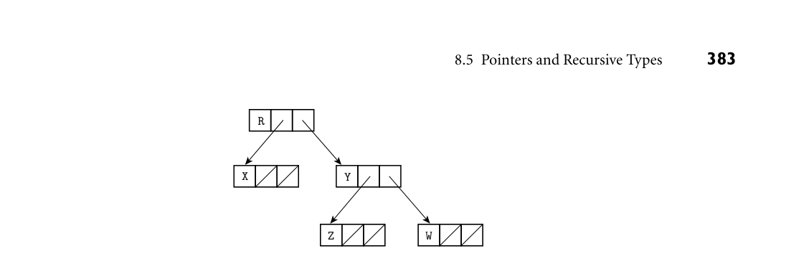
*Figure 8.13  Typical implementation of a tree in a language with explicit pointers.  Figure 8.12, a diagonal slash through a box indicates a null pointer.*

As in

my_ptr^.val := 'X';

In C it is a prefx star:

(*my_ptr).val = 'X';

Because pointers so often refer to records (structs), for which the prefx notation  is awkward, C also provides a postfx “right-arrow” operator that plays the role of  the “up-arrow dot” combination in Pascal:

my_ptr->val = 'X';  ■

EXAMPLE 8.41

```
On the assumption that pointers almost always refer to records, Ada dispenses 
with dereferencing altogether. The same dot-based syntax can be used to access 
either a feld of the record foo or a feld of the record pointed to by foo, depending 
on the type of  foo:
```

Implicit dereferencing in  Ada

T : chr_tree;  P : chr_tree_ptr;  ...  T.val := 'X';  P.val := 'Y';

In those cases in which one actually wants to name the entire object referred to by  a pointer, Ada provides a special “pseudofeld” called all:

T := P.all;

In essence, pointers in Ada are automatically dereferenced when needed.  ■  The imperative features of OCaml and other ML dialects include an assignment statement, but this statement requires that the left-hand side be a pointer:  its effect is to make the pointer refer to the object on the right-hand side. To access the object referred to by a pointer, one uses an exclamation point as a prefx  dereferencing operator:

EXAMPLE 8.42

Pointer dereferencing in  OCaml

```
let p = ref 2;; 
(* p is a pointer to 2 *) 
... 
p := 3;; 
(* p now points to 3 *) 
... 
let n  = !p in ...
```

(* n is simply 3 *)

The net result is to make the distinction between l-values and r-values very explicit. Most languages blur the distinction by implicitly dereferencing variables on  the right-hand side of every assignment statement. Ada and Go blur the distinction further by dereferencing pointers automatically in certain circumstances. ■

The imperative features of Lisp do not include a dereferencing operator. Since  every object has a self-evident type, and assignment is performed using a small  set of built-in operators, there is never any ambiguity as to what is intended.

```
EXAMPLE 8.43 
Assignment in Common Lisp employs the setf operator (Scheme uses set!, 
Assignment in Lisp 
set-car!, and  set-cdr!), rather than the more common = or :=. For  example,  
if foo refers to a list, then (cdr foo) is the right-hand (“rest of list”) pointer of 
the frst node in the list, and the assignment (set-cdr! foo foo) makes this 
pointer refer back to foo, creating a one-node circular list:
```

foo  C

foo  C

C

C

A  a

A  b

A  a

A  b  ■

Pointers and Arrays in C

EXAMPLE 8.44  Pointers and arrays are closely linked in C. Consider the following declarations:  Array names and pointers  in C  int n;  int *a;  /* pointer to integer */  int b[10];  /* array of 10 integers */

Now all of the following are valid:

  1.
  a = b;
  /* make a point to the initial element of b */
  2.
  n = a[3];
  3.
  n = *(a+3);
  /* equivalent to previous line */
  4.
  n = b[3];
  5.
  n = *(b+3);
  /* equivalent to previous line */

In most contexts, an unsubscripted array name in C is automatically converted  to a pointer to the array’s frst element (the one with index zero), as shown here  in line 1. (Line 5 embodies the same conversion.) Lines 3 and 5 illustrate pointer  arithmetic: Given a pointer to an element of an array, the addition of an integer  k produces a pointer to the element k positions later in the array (earlier if k is

negative). The prefx * is a pointer dereference operator. Pointer arithmetic is  valid only within the bounds of a single array, but C compilers are not required  to check this.

```
Remarkably, the subscript operator [ ]  in C is actually defned in terms of 
pointer arithmetic: lines 2 and 4 are syntactic sugar for lines 3 and 5, respectively. More precisely, E1[E2], for any expressions E1 and E2, is  defned  to  
be (*((E1)+(E2))), which is of course the same as (*((E2)+(E1))). (Extra  
parentheses have been used in this defnition to avoid any questions of precedence if E1 and E2 are complicated expressions.) Correctness requires only that 
one operand of [ ]  have an array or pointer type and the other have an integral 
type. Thus A[3] is equivalent to 3[A], something that comes as a surprise to 
most programmers. 
■
```

DESIGN & IMPLEMENTATION

## 8.7 Stack smashing  The lack of bounds checking on array subscripts and pointer arithmetic is a  major source of bugs and security problems in C. Many of the most infamous  Internet viruses have propagated by means of stack smashing, a  particularly   nasty form of buffer overflow attack. Consider a (very naive) routine designed  to read a number from an input stream:

int get_acct_num(FILE *s) {  char buf[100];  Stack  char *p = buf;  growth  do {

buf

/* read from stream s: */  Higher  *p = getc(s);  addresses  } while (*p++ != '\n');  *p = '\0';  Previous  /* convert ascii to int: */  (calling) return atoi(buf);  frame  }

Return address

```
If the stream provides more than 100 characters without a newline (‚\n‚), 
those characters will overwrite memory beyond the confnes of buf, as  shown  
by the large white arrow in the fgure. A careful attacker may be able to invent 
a string whose bits include both a sequence of valid machine instructions and 
a replacement value for the subroutine’s return address. When the routine 
attempts to return, it will jump into the attacker’s instructions instead.
```

Stack smashing can be prevented by manually checking array bounds in C,  or by confguring the hardware to prevent the execution of instructions in the  stack (see Sidebar C 9.10). It would never have been a problem in the frst  place, however, if C had been designed for automatic bounds checks.

```
In addition to allowing an integer to be added to a pointer, C allows pointers 
to be subtracted from one another or compared for ordering, provided that they 
refer to elements of the same array. The comparison p < q, for  example,  tests  
to see if p refers to an element closer to the beginning of the array than the one 
referred to by q. The expression p - q  returns the number of array positions that 
separate the elements to which p and q refer. All arithmetic operations on pointers “scale” their results as appropriate, based on the size of the referenced objects. 
For multidimensional arrays with row-pointer layout, a[i][j] is equivalent to 
(*(a+i))[j] or *(a[i]+j) or *(*(a+i)+j). 
■ 
Despite the interoperability of pointers and arrays in C, programmers need 
to be aware that the two are not the same, particularly in the context of variable 
declarations, which need to allocate space when elaborated. The declaration of 
a pointer variable allocates space to hold a pointer, while the declaration of an 
array variable allocates space to hold the whole array. In the case of an array 
the declaration must specify a size for each dimension. Thus int *a[n], when  
elaborated, will allocate space for n row pointers; int a[n][m] will allocate space 
for a two-dimensional array with contiguous layout.5 As a convenience, a variable 
declaration that includes initialization to an aggregate can omit the size of the 
outermost dimension if that information can be inferred from the contents of the 
aggregate:
```

EXAMPLE 8.45

Pointer comparison and  subtraction in C

EXAMPLE 8.46

Pointer and array  declarations in C

int a[][2] = {{1, 2}, {3, 4}, {5, 6}};  // three rows  ■

DESIGN & IMPLEMENTATION

```
8.8 Pointers and arrays 
Many C programs use pointers instead of subscripts to iterate over the elements of arrays. Before the development of modern optimizing compilers, 
pointer-based array traversal often served to eliminate redundant address calculations, thereby leading to faster code. With modern compilers, however, 
the opposite may be true: redundant address calculations can  be  identifed  as  
common subexpressions, and certain other code improvements are easier for 
indices than they are for pointers. In particular, as we shall see in Chapter 17, 
pointers make it signifcantly more diffcult for the code improver to determine 
when two l-values may be aliases for one other.
```

Today the use of pointer arithmetic is mainly a matter of personal taste:  some C programmers consider pointer-based algorithms to be more elegant  than their array-based counterparts, while others fnd them harder to read.  Certainly the fact that arrays are passed as pointers makes it natural to write  subroutines in the pointer style.

5  To read declarations in C, it is helpful to follow the following rule: start at the name of the variable  and work right as far as possible, subject to parentheses; then work left as far as possible; then  jump out a level of parentheses and repeat. Thus int *a[n] means that a is an n-element array  of pointers to integers, while int (*a)[n] means that a is a pointer to an n-element array of  integers.

EXAMPLE 8.47

```
When an array is included in the argument list of a function call, C passes a 
pointer to the frst element of the array, not the array itself. For a one-dimensional array of integers, the corresponding formal parameter may be declared as 
int a[ ] or int *a. For a two-dimensional array of integers with row-pointer 
layout, the formal parameter may be declared as int *a[ ] or int **a. For  a  twodimensional array with contiguous layout, the formal parameter may be declared 
as int a[ ][m] or int (*a)[m]. The size of the frst dimension is irrelevant; 
all that is passed is a pointer, and C performs no dynamic checks to ensure that 
references are within the bounds of the array. 
■ 
In all cases, a declaration must allow the compiler (or human reader) to determine the size of  the  elements of an array or, equivalently, the size of the objects 
referred to by a pointer. Thus neither int a[ ][ ] nor int (*a)[ ] is a valid 
variable or parameter declaration: neither provides the compiler with the size 
information it needs to generate code for a +  i  or a[i]. 
The built-in sizeof operator returns the size in bytes of an object or type. 
When given an array as argument it returns the size of the entire array. When 
given a pointer as argument it returns the size of the pointer itself. If a is an 
array, sizeof(a) / sizeof(a[0]) returns the number of elements in the array. 
Similarly, if pointers occupy 4 bytes and double-precision foating-point numbers 
occupy 8 bytes, then given
```

Arrays as parameters in C

EXAMPLE 8.48

sizeof in C

double *a;  double (*b)[10];

/* pointer to double */  /* pointer to array of 10 doubles */

```
we have sizeof(a) = sizeof(b) = 4,  sizeof(*a) = sizeof(*b[0]) = 8,  and  
sizeof(*b) = 80. 
In most cases, sizeof can be evaluated at compile time. 
The principal exception occurs for variable-length arrays, whose size may not be 
known until elaboration time:
```

void f(int len) {  int A[len];  /* sizeof(A) == len * sizeof(int) */  ■

## 3CHECK YOUR UNDERSTANDING  17. Name three languages that provide particularly extensive support for charac­

ter strings.  18. Why might a language permit operations on strings that it does not provide  for arrays?  19. What are the strengths and weaknesses of the bit-vector representation for  sets? How else might sets be implemented?  20. Discuss the tradeoffs between pointers and the recursive types that arise nat­

urally in a language with a reference model of variables.

* Summarize the ways in which one dereferences a pointer in various program­

ming languages.  22. What is the difference between a pointer and an address? Between a pointer  and a reference?  23. Discuss the advantages and disadvantages of the interoperability of pointers  and arrays in C.

* Under what circumstances must the bounds of a C array be specifed in its
  declaration?

## 8.5.2 Dangling References

When a heap-allocated object is no longer live, a long-running program needs  to reclaim the object’s space. Stack objects are reclaimed automatically as part  of the subroutine calling sequence. How are heap objects reclaimed? There are  two alternatives. Languages like C, C++, and Rust require the programmer to  reclaim an object explicitly. In C, for example, one says free(my_ptr); in C++,  delete my_ptr. C++ provides additional functionality: prior to reclaiming the  space, it automatically calls any user-provided destructor function for the object.  A destructor can reclaim space for subsidiary objects, remove the object from  indices or tables, print messages, or perform any other operation appropriate at  the end of the object’s lifetime.  ■  A dangling reference is a live pointer that no longer points to a valid object.  In languages like C and C++, which allow the programmer to create pointers  to stack objects, a dangling reference may be created when a subroutine returns  while some pointer in a wider scope still refers to a local object of that subroutine:

EXAMPLE 8.49

Explicit storage  reclamation

EXAMPLE 8.50

Dangling reference to a  stack variable in C++

```
int i  = 3;  
int *p =  &i;  
... 
void foo() { int n = 5; 
p = &n; } 
... 
cout << *p; 
// prints 3 
foo(); 
... 
cout << *p; 
// undefined behavior: n is no longer live 
■
```

EXAMPLE 8.51

In a language with explicit reclamation of heap objects, a dangling reference is  created whenever the programmer reclaims an object to which pointers still refer:

Dangling reference to a  heap variable in C++

```
int *p =  new int;  
*p = 3; 
... 
cout << *p; 
// prints 3 
delete p; 
... 
cout << *p; 
// undefined behavior: *p has been reclaimed
```

Note that even if the reclamation operation were to change its argument to a null  pointer, this would not solve the problem, because other pointers might still refer  to the same object.  ■  Because a language implementation may reuse the space of reclaimed stack  and heap objects, a program that uses a dangling reference may read or write bits  in memory that are now part of some other object. It may even modify bits that  are now part of the implementation’s bookkeeping information, corrupting the  structure of the stack or heap.

Algol 68 addressed the problem of dangling references to stack objects by forbidding a pointer from pointing to any object whose lifetime was briefer than  that of the pointer itself. Unfortunately, this rule is diffcult to enforce. Among  other things, since both pointers and objects to which pointers might refer can be  passed as arguments to subroutines, dynamic semantic checks are possible only if  reference parameters are accompanied by a hidden indication of lifetime. Ada has  a more restrictive rule that is easier to enforce: it forbids a pointer from pointing  to any object whose lifetime is briefer than that of the pointer’s type.

IN MORE DEPTH

On the companion site we consider two mechanisms that are sometimes used  to catch dangling references at run time. Tombstones introduce an extra level of  indirection on every pointer access. When an object is reclaimed, the indirection  word (tombstone) is marked in a way that invalidates future references to the  object. Locks and keys add a word to every pointer and to every object in the  heap; these words must match for the pointer to be valid. Tombstones can be  used in languages that permit pointers to nonheap objects, but they introduce  the secondary problem of reclaiming the tombstones themselves. Locks and keys  are somewhat simpler, but they work only for objects in the heap.

## 8.5.3 Garbage Collection

Explicit reclamation of heap objects is a serious burden on the programmer and a  major source of bugs (memory leaks and dangling references). The code required  to keep track of object lifetimes makes programs more diffcult to design, implement, and maintain. An attractive alternative is to have the language implementation notice when objects are no longer useful and reclaim them automatically.

```
Automatic reclamation (otherwise known as garbage collection) is more  or  less  essential for functional languages: delete is a very imperative sort of operation, 
and the ability to construct and return arbitrary objects from functions means 
that many objects that would be allocated on the stack in an imperative language 
must be allocated from the heap in a functional language, to give them unlimited 
extent.
```

Over time, automatic garbage collection has become popular for imperative  languages as well. It can be found in, among others, Java, C#, Scala, Go, and all  the major scripting languages. Automatic collection is diffcult to implement, but  the diffculty pales in comparison to the convenience enjoyed by programmers  once the implementation exists. Automatic collection also tends to be slower  than manual reclamation, though it eliminates any need to check for dangling  references.

Reference Counts

When is an object no longer useful? One possible answer is: when no pointers to it  exist.6 The simplest garbage collection technique simply places a counter in each  object that keeps track of the number of pointers that refer to the object. When  the object is created, this reference count is set to one, to represent the pointer

DESIGN & IMPLEMENTATION

8.9 Garbage collection  Garbage collection presents a classic tradeoff between convenience and safety  on the one hand and performance on the other. Manual storage reclamation,  implemented correctly by the application program, is almost invariably faster  than any automatic garbage collector. It is also more predictable: automatic  collection is notorious for its tendency to introduce intermittent “hiccups” in  the execution of real-time or interactive programs.

Ada takes the unusual position of refusing to take a stand: the language  design makes automatic garbage collection possible, but implementations are  not required to provide it, and programmers can request manual reclamation  with a built-in routine called Unchecked_Deallocation. Newer versions of  the language provide extensive facilities whereby programmers can implement  their own storage managers (garbage collected or not), with different types of  pointers corresponding to different storage “pools.”

In a similar vein, the Real Time Specifcation for Java allows the programmer to create so-called scoped memory areas that are accessible to only a subset of the currently running threads. When all threads with access to a given  area terminate, the area is reclaimed in its entirety. Objects allocated in a  scoped memory area are never examined by the garbage collector; performance anomalies due to garbage collection can therefore be avoided by providing scoped memory to every real-time thread.

returned by the new operation. When one pointer is assigned into another, the  run-time system decrements the reference count of the object (if any) formerly  referred to by the assignment’s left-hand side, and increments the count of the  object referred to by the right-hand side. On subroutine return, the calling sequence epilogue must decrement the reference count of any object referred to by  a local pointer that is about to be destroyed. When a reference count reaches zero,  its object can be reclaimed. Recursively, the run-time system must decrement  counts for any objects referred to by pointers within the object being reclaimed,  and reclaim those objects if their counts reach zero. To prevent the collector from  following garbage addresses, each pointer must be initialized to null at elaboration time.

In order for reference counts to work, the language implementation must be  able to identify the location of every pointer. When a subroutine returns, it must  be able to tell which words in the stack frame represent pointers; when an object  in the heap is reclaimed, it must be able to tell which words within the object  represent pointers. The standard technique to track this information relies on  type descriptors generated by the compiler. There is one descriptor for every distinct type in the program, plus one for the stack frame of each subroutine, and  one for the set of global variables. Most descriptors are simply a table that lists  the offsets within the type at which pointers can be found, together with the addresses of descriptors for the types of the objects referred to by those pointers.  For a tagged variant record (discriminated union) type, the descriptor is a bit  more complicated: it must contain a list of values (or ranges) for the tag, together with a table for the corresponding variant. For untagged variant records,  there is no acceptable solution: reference counts work only if the language is  strongly typed (but see the discussion of “Conservative Collection” at the end of  Section 8.5.3).

EXAMPLE 8.52  The most important problem with reference counts stems from their defniReference counts and  tion of a “useful object.” While it is defnitely true that an object is useless if no  circular structures  references to it exist, it may also be useless when references do exist. As shown  in Figure 8.14, reference counts may fail to collect circular structures. They work  well only for structures that are guaranteed to be noncircular. Many language  implementations use reference counts for variable-length strings; strings never  contain references to anything else. Perl uses reference counts for all dynamically allocated data; the manual warns the programmer to break cycles manually  when data aren’t needed anymore. Some purely functional languages may also be  able to use reference counts safely in all cases, if the lack of an assignment statement prevents them from introducing circularity. Finally, reference counts can  be used to reclaim tombstones. While it is certainly possible to create a circular  structure with tombstones, the fact that the programmer is responsible for explicit deallocation of heap objects implies that reference counts will fail to reclaim  tombstones only when the programmer has failed to reclaim the objects to which  they refer.  ■

Stack  Heap

stooges  2  "larry"

1  "moe"

1  "curly"

stooges := nil;

stooges

1 "larry"  1  "moe"

1 "curly"


*Figure 8.14  Reference counts and circular lists. The list shown here cannot be found via any  program variable, but because it is circular, every cell contains a nonzero count.*

Smart Pointers  The general term smart pointer refers to a program-level object (implemented on top of the language proper) that mimics the behavior of a  pointer, but with additional semantics. The most common use of smart pointers  is to implement reference counting in a language that normally supports only  manual storage reclamation. Other uses include bounds checking on pointer  arithmetic, instrumentation for debugging or performance analysis, and tracking of references to external objects—e.g., open fles.

```
Particularly rich support for smart pointers can be found in the C++ standard library, whose unique_ptr, shared_ptr, and  weak_ptr classes leverage 
operator overloading, constructors, destructors, and move semantics to simplify 
the otherwise diffcult task of manual reclamation. A unique_ptr is what its 
name implies—the only reference to an object. If the unique_ptr is destroyed 
(typically because the function in which it was declared returns), then the object to which it points is reclaimed by the pointer’s destructor, as suggested in 
Section 8.5.2. If one unique_ptr is assigned into another (or passed as a parameter), the overloaded assignment operator or constructor transfers ownership 
of the pointed-to object by changing the old pointer to null. (Move  semantics, which we will describe in more detail in under “References in C++” in Section 9.3.1, often allow the compiler to optimize away the cost of the ownership 
transfer.)
```

The shared_ptr type implements a reference count for the pointed-to object,  typically storing it in a hidden, tombstone-like intermediate object. Counts are  incremented in shared_ptr constructors, decremented in destructors, and ad­

justed (in both directions) by assignment operations. When circular structures  are required, or when the programmer wants to maintain bookkeeping information without artifcially extending object lifetimes, a weak_ptr can be used  to point to an object without contributing to reference counting. The C++ library will reclaim an object when no shared_ptr to it remains; any remaining  weak_ptrs will subsequently behave as if they were null.

Tracing Collection

As we have seen, reference counting defnes an object to be useful if there exists  a pointer to it. A better defnition might say that an object is useful if it can be  reached by following a chain of valid pointers starting from something that has a  name (i.e., something outside the heap). According to this defnition, the blocks  in the bottom half of Figure 8.14 are useless, even though their reference counts  are nonzero. Tracing collectors work by recursively exploring the heap, starting  from external pointers, to determine what is useful.

Mark-and-Sweep  The classic mechanism to identify useless blocks, under this  more accurate defnition, is known as mark-and-sweep. It proceeds in three main  steps, executed by the garbage collector when the amount of free space remaining  in the heap falls below some minimum threshold:

* The collector walks through the heap, tentatively marking every block as “use­

less.”

DESIGN & IMPLEMENTATION

8.10 What exactly is garbage?  Reference counting implicitly defnes a garbage object as one to which no  pointers exist. Tracing implicitly defnes it as an object that is no longer reachable from outside the heap. Ideally, we’d like an even stronger defnition: a  garbage object is one that the program will never use again. We settle for nonreachability because this ideal defnition is undecidable. The difference can  matter in practice: if a program maintains a pointer to an object it will never  use again, then the garbage collector will be unable to reclaim it. If the number  of such objects grows with time, then the program has a memory leak, despite  the presence of a garbage collector. (Trivially we could imagine a program that  added every newly allocated object to a global list, but never actually perused  the list. Such a program would defeat the collector entirely.)

For the sake of space effciency, programmers are advised to “zero out” any  pointers they no longer need. Doing this can be diffcult, but not as diffcult  as fully manually reclamation—in particular, we do not need to realize when  we are zeroing the last pointer to a given object. For the same reason, dangling  references can never arise: the garbage collector will refrain from reclaiming  any object that is reachable along some other path.

* Beginning with all pointers outside the heap, the collector recursively explores
  all linked data in the program, marking each newly discovered block as “useful.” (When it encounters a block that is already marked as “useful,” the collector knows it has reached the block over some previous path, and returns
  without recursing.)
* The collector again walks through the heap, moving every block that is still
  marked “useless” to the free list.

Several potential problems with this algorithm are immediately apparent.  First, both the initial and fnal walks through the heap require that the collector be able to tell where every “in-use” block begins and ends. In a language with  variable-size heap blocks, every block must begin with an indication of its size,  and of whether it is currently free. Second, the collector must be able in Step 2 to  fnd the pointers contained within each block. The standard solution is to place a  pointer to a type descriptor near the beginning of each block.

Pointer Reversal  The exploration step (Step 2) of mark-and-sweep collection is  naturally recursive. The obvious implementation needs a stack whose maximum  depth is proportional to the longest chain through the heap. In practice, the space  for this stack may not be available: after all, we run garbage collection when we’re

EXAMPLE 8.53  about to run out of space!7 An alternative implementation of the exploration  Heap tracing with pointer  step uses a technique frst suggested by Schorr and Waite [SW67] to embed the  reversal  equivalent of the stack in already-existing felds in heap blocks. More specifcally,  as the collector explores the path to a given block, it reverses the pointers it follows,  so that each points back to the previous block instead of forward to the next.  This pointer-reversal technique is illustrated in Figure 8.15.  As it explores, the  collector keeps track of the current block and the block from whence it came.

To return from block X to block U (after part (d) of the fgure), the collector will use the reversed pointer in U to restore its notion of previous block (T).  It will then fip the reversed pointer back to X and update its notion of current  block to U. If the block to which it has returned contains additional pointers,  the collector will proceed forward again; otherwise it will return across the previous reversed pointer and try again. At most one pointer in every block will be  reversed at any given time. This pointer must be marked, probably by means of  another bookkeeping feld at the beginning of each block. (We could mark the  pointer by setting one of its low-order bits, but the cost in time would probably  be prohibitive: we’d have to search the block on every visit.)  ■

Stop-and-Copy  In a language with variable-size heap blocks, the garbage collector can reduce external fragmentation by performing storage compaction.

7  In many language implementations, the stack and heap grow toward each other from opposite  ends of memory (Section 15.4); if the heap is full, the stack can’t grow. In a system with virtual  memory the distance between the two may theoretically be enormous, but the space that backs  them up on disk is still limited, and shared between them.

prev

prev

R

R

(a)

(b)

curr

curr

S  T

S  T

U  V

U  V

W  X

W  X

prev

prev

R

R

(c)

(d)

curr

curr

S  T

T S

U  V

U  V

W  X

W  X

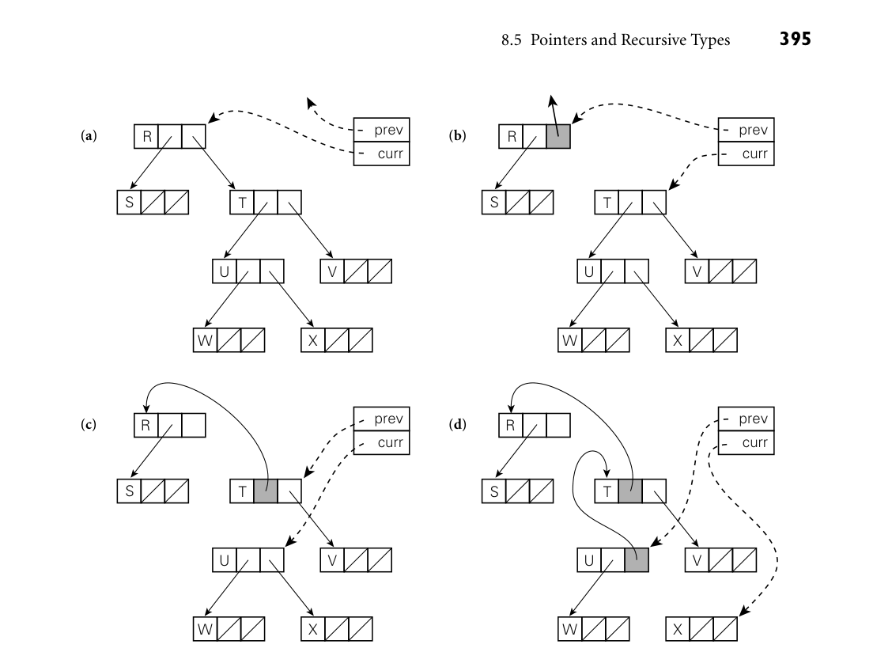
*Figure 8.15  Heap exploration via pointer reversal. The block currently under examination is indicated by the curr pointer.  The previous block is indicated by the prev pointer. As the garbage collector moves from one block to the next, it changes the  pointer it follows to refer back to the previous block. When it returns to a block it restores the pointer. Each reversed pointer  must be marked (indicated with a shaded box), to distinguish it from other, forward pointers in the same block.*

Many garbage collectors employ a technique known as stop-and-copy that  achieves compaction while simultaneously eliminating Steps 1 and 3 in the standard mark-and-sweep algorithm. Specifcally, they divide the heap into two regions of equal size. All allocation happens in the frst half. When this half is  (nearly) full, the collector begins its exploration of reachable data structures.  Each reachable block is copied into contiguous locations in the second half of  the heap, with no external fragmentation. The old version of the block, in the  frst half of the heap, is overwritten with a “useful” fag and a pointer to the new  location. Any other pointer that refers to the same block (and is found later in  the exploration) is set to point to the new location. When the collector fnishes its  exploration, all useful objects have been moved (and compacted) into the second

half of the heap, and nothing in the frst half is needed anymore. The collector  can therefore swap its notion of frst and second halves, and the program can continue. Obviously, this algorithm suffers from the fact that only half of the heap  can be used at any given time, but in a system with virtual memory it is only the  virtual space that is underutilized; each “half” of the heap can occupy most of  physical memory as needed. Moreover, by eliminating Steps 1 and 3 of standard  mark-and-sweep, stop-and-copy incurs overhead proportional to the number of  nongarbage blocks, rather than the total number of blocks.

Generational Collection  To further reduce the cost of tracing collection, some  garbage collectors employ a “generational” technique, exploiting the observation  that most dynamically allocated objects are short lived. The heap is divided into  multiple regions (often two). When space runs low the collector frst examines  the youngest region (the “nursery”), which it assumes is likely to have the highest proportion of garbage. Only if it is unable to reclaim suffcient space in this  region does the collector examine the next-older region. To avoid leaking storage  in long-running systems, the collector must be prepared, if necessary, to examine the entire heap. In most cases, however, the overhead of collection will be  proportional to the size of the youngest region only.

DESIGN & IMPLEMENTATION

8.11 Reference counts versus tracing  Reference counts require a counter feld in every heap object. For small objects such as cons cells, this space overhead may be signifcant. The ongoing  expense of updating reference counts when pointers are changed can also be  signifcant in a program with large amounts of pointer manipulation. Other  garbage collection techniques, however, have similar overheads. Tracing generally requires a reversed pointer indicator in every heap block, which reference  counting does not, and generational collectors must generally incur overhead  on every pointer assignment in order to keep track of pointers into the newest  section of the heap.

The two principal tradeoffs between reference counting and tracing are the  inability of the former to handle cycles and the tendency of the latter to “stop  the world” periodically in order to reclaim space. On the whole, implementors  tend to favor reference counting for applications in which circularity is not an  issue, and tracing collectors in the general case. Some real-world systems mix  the two approaches, using reference counts on an ongoing basis, with an occasional tracing collection to catch any circular structures. The “stop the world”  problem can also be addressed with incremental or concurrent collectors, which  interleave their execution with the rest of the program, but these tend to have  higher total overhead. Effcient, effective garbage collection techniques remain  an active area of research.

Any object that survives some small number of collections (often one) in its  current region is promoted (moved) to the next older region, in a manner reminiscent of stop-and-copy. Tracing of the nursery requires, of course, that pointers from old objects to new objects we treated as external “roots” of exploration.  Promotion likewise requires that pointers from old objects to new objects be updated to refect the new locations. While old-space-to-new-space pointers tend  to be rare, a generational collector must be able to fnd them all quickly. At each  pointer assignment, the compiler generates code to check whether the new value  is an old-to-new pointer; if so, it adds the pointer to a hidden list accessible to the

8 collector. This instrumentation on assignments is known as a write barrier.

Conservative Collection  Language implementors have traditionally assumed  that automatic storage reclamation is possible only in languages that are strongly  typed: both reference counts and tracing collection require that we be able to fnd  the pointers within an object. If we are willing to admit the possibility that some  garbage will go unreclaimed, it turns out that we can implement mark-and-sweep  collection without being able to fnd pointers [BW88]. The key is to observe that  any given block in the heap spans a relatively small number of addresses. There is  only a very small probability that some word in memory that is not a pointer will  happen to contain a bit pattern that looks like one of those addresses.

```
If we assume, conservatively, that everything that seems to point into a heap 
block is in fact a valid pointer, then we can proceed with mark-and-sweep collection. When space runs low, the collector (as usual) tentatively marks all blocks in 
the heap as useless. It then scans all word-aligned quantities in the stack and in 
global storage. If any of these words appears to contain the address of something 
in  the heap,  the collector  marks the  block that contains that address as useful.  
Recursively, the collector then scans all word-aligned quantities in the block, and 
marks as  useful any other  blocks whose  addresses are found therein. Finally (as 
usual), the collector reclaims any blocks that are still marked useless.
```

The algorithm is completely safe (in the sense that it never reclaims useful  blocks) so long as the programmer never “hides” a pointer. In C, for example,  the collector is unlikely to function correctly if the programmer casts a pointer to  int and then xors it with a constant, with the expectation of restoring and using  the pointer at a later time. In addition to sometimes leaving garbage unclaimed,  conservative collection suffers from the inability to perform compaction: the collector can never be sure which “pointers” should be changed.

8  Unfortunately, the word “barrier”is heavily overloaded. Garbage collection barriers are unrelated  to the synchronization barriers of Section 13.3.1, the memory barriers of Section 13.3.3, or the  RTL barriers of Section C 15.2.1.

## 3CHECK YOUR UNDERSTANDING  25. What  are  dangling references? How are they created, and why are they a prob­

lem?

```
26. What  is  garbage? How is it created, and why is it a problem? Discuss the 
comparative advantages of reference counts and tracing collection as a means 
of solving the problem. 
27. What  are  smart pointers? What purpose do they serve?
```

* Summarize the differences among mark-and-sweep, stop-and-copy, and gen­

```
erational garbage collection. 
29. What  is  pointer reversal? What problem does it address? 
30. What is “conservative” garbage collection? How does it work?
```

* Do dangling references and garbage ever arise in the same programming lan­

guage? Why or why not?

* Why was automatic garbage collection so slow to be adopted by imperative
  programming languages?
* What are the advantages and disadvantages of allowing pointers to refer to
  objects that do not lie in the heap?

### 8.6 Lists

A list is defned recursively as either the empty list or a pair consisting of an initial  object (which may be either a list or an atom) and another (shorter) list. Lists  are ideally suited to programming in functional and logic languages, which do  most of their work via recursion and higher-order functions (to be described in  Section 11.6).

Lists can also be used in imperative programs. They are supported by builtin type constructors in a few traditional compiled languages (e.g., Clu) and in  most modern scripting languages. They are also commonly supported by library  classes in object-oriented languages, and programmers can build their own in any  language with records and pointers. Since many of the standard list operations  tend to generate garbage, lists tend to work best in a language with automatic  garbage collection.

```
One key aspect of lists is very different in the two main functional language 
families. Lists in ML are homogeneous: every element of the list must have the 
same type. Lisp lists, by contrast, are heterogeneous: any  object  may  be  placed
```

EXAMPLE 8.54  in a list, so long as it is never used in an inconsistent fashion.9 These different  Lists in ML and Lisp

9  Recall that objects are self-descriptive in Lisp. The only type checking occurs when a function  “deliberately” inspects an argument to see whether it is a list or an atom of some particular type.

```
approaches lead to different implementations. An ML list is usually a chain of 
blocks, each of which contains an element and a pointer to the next block. A 
Lisp list is a chain of cons cells, each of which contains two pointers, one to the 
element and one to the next cons cell (see Figures 8.11 and 8.12). For historical 
reasons, the two pointers in a cons cell are known as the car and the cdr; they  
represent the head of the list and the remaining elements, respectively. In both 
semantics (homogeneity vs heterogeneity) and implementation (chained blocks 
vs cons cells), Clu resembles ML, while Python and Prolog (to be discussed in 
Section 12.2) resemble Lisp. 
■
```

```
EXAMPLE 8.55 
Both ML and Lisp provide convenient notation for lists. In the OCaml dialect 
List notation 
of ML, a list is enclosed in square brackets, with elements separated by semicolons: [a; b; c; d]. A Lisp list is enclosed in parentheses, with elements separated by white space: (a b c  d). In both cases, the notation represents a proper 
list—one whose innermost pair consists of the fnal element and the empty list. 
In Lisp, it is also possible to construct an improper list, whose fnal pair contains 
two elements. (Strictly speaking, such a list does not conform to the standard recursive defnition.) Lisp systems provide a more general, but cumbersome dotted 
list notation that captures both proper and improper lists. A dotted list is either 
an atom (possibly null) or a pair consisting of two dotted lists separated by a period and enclosed in parentheses. The dotted list (a . (b . (c . (d . null)))) is 
the same as  (a b c d). The  list  (a . (b . (c . d))) is improper; its fnal cons cell 
contains a pointer to d in the second position, where a pointer to a list is normally 
required. 
■ 
Both ML and Lisp provide a wealth of built-in polymorphic functions to manipulate arbitrary lists. Because programs are lists in Lisp, Lisp must distinguish between lists that are to be evaluated and lists that are to be left “as is,”
```

DESIGN & IMPLEMENTATION

```
8.12 car and cdr 
The names  of  the functions  car and cdr are historical accidents: they derive from the original (1959) implementation of Lisp on the IBM 704 at MIT. 
The machine architecture included 15-bit “address” and “decrement” felds in 
some of the (36-bit) loop-control instructions, together with additional instructions to load an index register from, or store it to, one of these felds 
within a 36-bit memory word. The designers of the Lisp interpreter decided 
to make cons cells mimic the internal format of instructions, so they could 
exploit these special instructions. In now archaic usage, memory words were 
also known as “registers.” What might appropriately have been called “frst” 
and “rest” pointers thus came to be known as the CAR (contents of address 
feld of register) and CDR (contents of decrement feld of register). The 704, 
incidentally, was also the machine on which Fortran was frst developed, and 
the frst commercial machine to include hardware foating-point and magnetic 
core memory.
```

```
as structures. To prevent a literal list from being evaluated, the Lisp programmer 
may quote it: (quote (a b c d)), abbreviated ‚(a b c d). To  evaluate  an  internal list (e.g., one returned by a function), the programmer may pass it to the 
built-in function eval. In ML, programs are not lists, so a literal list is always a 
structural aggregate.
```

EXAMPLE 8.56  The most fundamental operations on lists are those that construct them from  Basic list operations in Lisp  their components or extract their components from them. In Lisp:

```
(cons 'a '(b)) 
=⇒ (a b) 
(car '(a b)) 
=⇒ a 
(car nil) 
=⇒ ?? 
(cdr '(a b c)) 
=⇒ (b c) 
(cdr '(a)) 
=⇒ nil 
(cdr nil) 
=⇒ ?? 
(append '(a b) '(c d)) 
=⇒ (a b c  d)
```

```
Here we have used =⇒ to mean “evaluates to.” The car and cdr of the empty list 
(nil) are  defned  to  be  nil in Common Lisp; in Scheme they result in a dynamic 
semantic error. 
■
```

```
EXAMPLE 8.57 
In OCaml the equivalent operations are written as follows: 
Basic list operations in 
OCaml 
a ::  [b]  
=⇒ [a; b] 
hd [a, b] 
=⇒ a 
hd [] 
=⇒ run-time exception 
tl [a, b, c] 
=⇒ [b, c] 
tl [a] 
=⇒ [] 
tl [] 
=⇒ run-time exception 
[a, b] @  [c, d]  
=⇒ [a; b; c; d]
```

Run-time exceptions may be caught by the program if desired; further details will  appear in Section 9.4.  ■  Both ML and Lisp provide many additional list functions, including ones that  test a list to see if it is empty; return the length of a list; return the nth element  of a list, or a list consisting of all but the frst n elements; reverse the order of the  elements of a list; search a list for elements matching some predicate; or apply a  function to every element of a list, returning the results as a list.

Several languages, including Miranda, Haskell, Python, and F#, provide lists  that resemble those of ML, but with an important additional mechanism, known  as list comprehensions. These are adapted from traditional mathematical set notation. A common form comprises an expression, an enumerator, and one or more

EXAMPLE 8.58  flters. In Haskell, the following denotes a list of the squares of all odd numbers  List comprehensions  less than 100:

[i*i | i <- [1..100], i `mod` 2 ==  1]

In Python we would write

[i*i for i in range(1,  100) if i %  2 == 1]

In F# the equivalent is

[for i in 1..100 do if i % 2 = 1 then yield i*i]

All of these are meant to capture the mathematical

{i × i | i ∈{1, . . . , 100} ∧i mod 2 = 1}

We could of course create an equivalent list with a series of appropriate function  calls. The brevity of the list comprehension syntax, however, can sometimes lead  to remarkably elegant programs (see, e.g., Exercise 8.22).  ■

### 8.7 Files and Input/Output

Input/output (I/O) facilities allow a program to communicate with the outside  world. In discussing this communication, it is customary to distinguish between  interactive I/O and I/O with fles. Interactive I/O generally implies communication with human users or physical devices, which work in parallel with the running program, and whose input to the program may depend on earlier output  from the program (e.g., prompts). Files generally refer to off-line storage implemented by the operating system. Files may be further categorized into those that  are temporary and those that are persistent. Temporary fles exist for the duration  of a single program run; their purpose is to store information that is too large to  ft in the memory available to the program. Persistent fles allow a program to  read data that existed before the program began running, and to write data that  will continue to exist after the program has ended.

I/O is one of the most diffcult aspects of a language to design, and one that  displays the least commonality from one language to the next. Some languages  provide built-in file data types and special syntactic constructs for I/O. Others  relegate I/O entirely to library packages, which export a (usually opaque) file  type and a variety of input and output subroutines. The principal advantage of  language integration is the ability to employ non-subroutine-call syntax, and to  perform operations (e.g., type checking on subroutine calls with varying numbers  of parameters) that may not otherwise be available to library routines. A purely  library-based approach to I/O, on the other hand, may keep a substantial amount  of “clutter” out of the language defnition.

IN MORE DEPTH

```
An overview of language-level I/O mechanisms can be found on the companion 
site. After a brief introduction to interactive and fle-based I/O, we focus mainly 
on the common case of  text files. The data in a text fle are stored in character
```

form, but may be converted to and from internal types during read and write  operations. As examples, we consider the text I/O facilities of Fortran, Ada, C,  and C++.

## 3CHECK YOUR UNDERSTANDING  34. Why are lists so heavily used in functional programming languages?  35. What  are  list comprehensions? What languages support them?

* Compare and contrast the support for lists in ML- and Lisp-family languages.
* Explain the distinction between interactive and file-based I/O; between tem­

porary and persistent fles.  38. What are some of the tradeoffs between supporting I/O in the language  proper versus supporting it in libraries?

### 8.8 Summary and Concluding Remarks

This section concludes the fourth of our six core chapters on language design  (names [from Part I], control fow, type systems, composite types, subroutines,  and classes). In our survey of composite types, we spent the most time on records,  arrays, and recursive types. Key issues for records include the syntax and semantics of variant records, whole-record operations, type safety, and the interaction  of each of these with memory layout. Memory layout is also important for arrays,  in which it interacts with binding time for shape; static, stack, and heap-based  allocation strategies; effcient array traversal in numeric applications; the interoperability of pointers and arrays in C; and the available set of whole-array and  slice-based operations.

```
For recursive data types, much depends on the choice between the value and 
reference models of variables/names. Recursive types are a natural fallout of the 
reference model; with the value model they require the notion of a pointer: a  
variable whose value is a reference. The distinction between values and references is important from an implementation point of view: it would be wasteful 
to implement built-in types as references, so languages with a reference model 
generally implement built-in and user-defned types differently. Java refects this 
distinction in the language semantics, calling for a value model of built-in types 
and a reference model for objects of user-defned class types.
```

Recursive types are generally used to create linked data structures. In most  cases these structures must be allocated from a heap. In some languages, the programmer is responsible for deallocating heap objects that are no longer needed.  In other languages, the language run-time system identifes and reclaims such  garbage automatically. Explicit deallocation is a burden on the programmer, and

```
leads to the problems of memory leaks and dangling references. While language implementations almost never attempt to catch memory leaks (see Exploration 3.34 
and Exercise C 8.28, however, for some ideas on this subject) tombstones or locks 
and keys are sometimes used to catch dangling references. Automatic garbage 
collection can be expensive, but has proved increasingly popular. Most garbagecollection techniques rely either on reference counts or on some form of recursive 
exploration (tracing) of currently accessible structures. Techniques in this latter 
category include mark-and-sweep, stop-and-copy, and  generational collection.
```

```
Few areas of language design display as much variation as I/O. Our discussion (largely on the companion site) distinguished between interactive I/O, which  
tends to be very platform specifc, and file-based I/O, which subdivides into temporary files, used for voluminous data within a single program run, and persistent 
files, used for off-line storage. Files also subdivide into those that represent their 
information in a binary form that mimics layout in memory and those that convert to and from character-based text.  In comparison to  binary fles,  text  fles  
generally incur both time and space overhead, but they have the important advantages of portability and human readability.
```

In our examination of types, we saw many examples of language innovations  that have served to improve the clarity and maintainability of programs, often  with little or no performance overhead. Examples include the original idea of  user-defned types (Algol 68), enumeration and subrange types (Pascal), the integration of records and variants (Pascal), and the distinction between subtypes  and derived types in Ada. In Chapter 10 we will examine what many consider the  most important language innovation of the past 30 years, namely object orientation.

```
As in previous chapters, we saw several cases in which a language’s convenience, orthogonality, or type safety appears to have been compromised in order to  simplify the  compiler,  or to  make compiled programs smaller or faster.  
Examples include the lack of an equality test for records in many languages, the 
requirement in Pascal and Ada that the variant portion of a record lie at the end, 
the limitations in many languages on the maximum size of sets, the lack of type 
checking for I/O in C, and the general lack of dynamic semantic checks in many 
language implementations. We also saw several examples of language features 
introduced at least in part for the sake of effcient implementation. These include packed types, multilength numeric types, decimal arithmetic, and C-style 
pointer arithmetic.
```

At the same time, one can identify a growing willingness on the part of language designers and users to tolerate complexity and cost in language implementation in order to improve semantics. Examples here include the type-safe variant  records of Ada; the standard-length numeric types of Java and C#; the variablelength strings and string operators of modern scripting languages; the late binding of array bounds in Ada, C, and the various scripting languages; and the wealth  of whole-array and slice-based array operations in Fortran 90. One might also include the polymorphic type inference of ML and its descendants. Certainly one  should include the widespread adoption of automatic garbage collection. Once

considered too expensive for production-quality imperative languages, garbage  collection is now standard not only in functional and scripting languages, but in  Ada, Java, C#, Scala, and Go, among others.

### 8.9 Exercises

## 8.1  Suppose we are compiling for a machine with 1-byte characters, 2-byte  shorts, 4-byte integers, and 8-byte reals, and with alignment rules that require the address of every primitive data element to be an even multiple of  the element’s size. Suppose further that the compiler is not permitted to  reorder felds. How much space will be consumed by the following array?  Explain.

A : array [0..9] of record

```
s : short 
c :  char  
t : short 
d :  char  
r :  real  
i : integer
```

## 8.2  In Example 8.10 we suggested the possibility of sorting record felds by  their alignment requirement, to minimize holes.  In the example, we  sorted smallest-alignment-frst. What would happen if we sorted longestalignment-frst? Do you see any advantages to this scheme? Any disadvantages? If the record as a whole must be an even multiple of the longest  alignment, do the two approaches ever differ in total space required?  8.3  Give Ada code to map from lowercase to uppercase letters, using  (a) an array  (b) a function

Note the similarity of syntax: in both cases upper(‚a‚) is ‚A‚ .  8.4  In Section 8.2.2 we noted that in a language with dynamic arrays and a  value model of variables, records could have felds whose size is not known  at compile time. To accommodate these, we suggested using a dope vector  for the record, to track the offsets of the felds.

Suppose instead that we want to maintain a static offset for each feld.  Can we devise an alternative strategy inspired by the stack frame layout of  Figure 8.7, and divide each record into a fxed-size part and a variable-size  part? What problems would we need to address? (Hint: Consider nested  records.)  8.5  Explain how to extend Figure 8.7 to accommodate subroutine arguments  that are passed by value, but whose shape is not known until the subroutine  is called at run time.

## 8.6  Explain how to obtain the effect of Fortran 90’s allocate statement for  one-dimensional arrays using pointers in C. You will probably fnd that  your solution does not generalize to multidimensional arrays. Why not?  If you are familiar with C++, show how to use its class facilities to solve  the problem.  8.7  Example 8.24, which considered the layout of a two-dimensional array of  characters, counted only the space devoted to characters and pointers. This  is appropriate if the space is allocated statically, as a global array of days or  keywords known at compile time. Supposed instead that space is allocated  in the heap, with 4 or 8 bytes of overhead for each contiguous block of  storage. How does this change the tradeoffs in space effciency?  8.8  Consider the array indexing calculation of Example 8.25. Suppose that i,  j, and  k are already loaded into registers, and that A’s elements are integers, allocated contiguously in memory on a 32-bit machine. Show, in the  pseudo-assembly notation of Sidebar 5.1, the instruction sequence to load  A[i, j, k] into a register. You may assume the existence of an indexed addressing mode capable of scaling by small powers of two. Assuming the  fnal memory load is a cache hit, how many cycles is your code likely to  require on a modern processor?  8.9  Continuing the previous exercise, suppose that A has row-pointer layout,  and that i, j, and  k are again available in registers. Show pseudo-assembler  code to load A[i, j, k] into a register. Assuming that all memory loads are  cache hits, how many cycles is your code likely to require on a modern processor?  8.10 Repeat the preceding two exercises, modifying your code to include run­

time checking of array subscript bounds.  8.11 In Section 8.2.3 we discussed how to differentiate between the constant and  variable portions of an array reference, in order to effciently access the subparts of array and record objects. An alternative approach is to generate  naive code and count on the compiler’s code improver to fnd the constant  portions, group them together, and calculate them at compile time. Discuss  the advantages and disadvantages of each approach.  8.12 Consider the following C declaration, compiled on a 64-bit x86 machine:

struct {  int n;  char c;  } A[10][10];

If the address of A[0][0] is 1000 (decimal), what is the address of A[3][7]?  8.13 Suppose we are generating code for an imperative language on a machine  with 8-byte foating-point numbers, 4-byte integers, 1-byte characters, and  4-byte alignment for both integers and foating-point numbers. Suppose

further that we plan to use contiguous row-major layout for multidimensional arrays, that we do not wish to reorder felds of records or pack either  records or arrays, and that we will assume without checking that all array  subscripts are in bounds.  (a) Consider the following variable declarations:

A : array [1..10, 10..100] of real  i : integer  x : real

Show the code that our compiler should generate for the following assignment: x := A[3,i]. Explain how you arrived at your answer.  (b) Consider the following more complex declarations:

r : record

```
x : integer 
y :  char  
A : array [1..10, 10..20] of record
```

```
z :  real  
B : array [0..71] of char 
j, k : integer
```

Assume that these declarations are local to the current subroutine. Note  the lower bounds on indices in A; the frst element is A[1,10].

```
Describe how r would be laid out in memory. Then show code to 
load r.A[2,j].B[k] into a register. Be sure to indicate which portions of 
the address calculation could be performed at compile time. 
8.14 Suppose A is a 10×10 array of (4-byte) integers, indexed from [0][0] through 
[9][9]. Suppose further that the address of A is currently in register r1, the  
value of integer i is currently in register r2, and the value of integer j is 
currently in register r3.
```

```
Give pseudo-assembly language for a code sequence that will load the 
value of A[i][j] into register r1 (a) assuming that A is implemented using 
(row-major) contiguous allocation; (b) assuming that A is implemented 
using row pointers. Each line of your pseudocode should correspond to 
a single instruction on a typical modern machine. You may use as many 
registers as you need. You need not preserve the values in r1, r2, and  r3. 
You may assume that i and j are in bounds, and that addresses are 4 bytes 
long.
```

Which code sequence is likely to be faster? Why?  8.15 Pointers and recursive type defnitions complicate the algorithm for deter­

mining structural equivalence of types. Consider, for example, the following defnitions:

type A = record

x : pointer to B  y : real

type B = record

x : pointer to A  y : real

The simple defnition of structural equivalence given in Section 7.2.1 (expand the subparts recursively until all you have is a string of built-in types  and type constructors; then compare them) does not work: we get an infnite expansion (type A = record x : pointer to record x : pointer to record  x : pointer to record . . . ). The obvious reinterpretation is to say two types  A and B are equivalent if any sequence of feld selections, array subscripts,  pointer dereferences, and other operations that takes one down into the  structure of A, and that ends at a built-in type, always encounters the same  feld names, and ends at the same built-in type when used to dive into the  structure of B—and vice versa. Under this reinterpretation, A and B above  have the same type. Give an algorithm based on this reinterpretation that  could be used in a compiler to determine structural equivalence. (Hint: The  fastest approach is due to J. Král [Krá73]. It is based on the algorithm used  to fnd the smallest deterministic fnite automaton that accepts a given regular language. This algorithm was outlined in Example 2.15; details can be  found in any automata theory textbook [e.g., [HMU07]].)  8.16 Explain the meaning of the following C declarations:

double *a[n];  double (*b)[n];  double (*c[n])();  double (*d())[n];

```
8.17 In Ada 83, pointers (access variables) can point only to objects in the heap. 
Ada 95 allows  a new  kind  of  pointer,  the  access all type, to point to 
other objects as well, provided that those objects have been declared to be 
aliased:
```

type int_ptr is access all Integer;  foo : aliased Integer;  ip : int_ptr;  ...  ip := foo'Access;

The ‚Access attribute is roughly equivalent to C’s “address of” (&) operator. How would you implement access all types and aliased objects?  How would your implementation interact with automatic garbage collection (assuming it exists) for objects in the heap?  8.18 As noted in Section 8.5.2, Ada 95 forbids an access all pointer from re­

ferring to any object whose lifetime is briefer than that of the pointer’s type.  Can this rule be enforced completely at compile time? Why or why not?

## 8.19 In much of the discussion of pointers in Section 8.5, we assumed implicitly  that every pointer into the heap points to the beginning of a dynamically  allocated block of storage. In some languages, including Algol 68 and C,  pointers may also point to data inside a block in the heap. If you were trying  to implement dynamic semantic checks for dangling references or, alternatively, automatic garbage collection (precise or conservative), how would  your task be complicated by the existence of such “internal pointers”?  8.20 (a) Occasionally one encounters the suggestion that a garbage-collected  language should provide a delete operation as an optimization: by  explicitly delete-ing objects that will never be used again, the programmer might save the garbage collector the trouble of fnding and reclaiming those objects automatically, thereby improving performance.  What do you think of this suggestion? Explain.  (b) Alternatively, one might allow the programmer to “tenure” an object,  so that it will never be a candidate for reclamation. Is this a good idea?  8.21 In Example 8.52 we noted that functional languages can safely use reference  counts since the lack of an assignment statement prevents them from introducing circularity. This isn’t strictly true; constructs like the Lisp letrec  can also be used to make cycles, so long as uses of circularly defned names  are hidden inside lambda expressions in each defnition:

(define foo  (lambda ()

(letrec ((a (lambda(f) (if f #\A b)))  (b (lambda(f) (if f #\B c)))  (c (lambda(f) (if f #\C a))))  a)))

Each of the functions a, b, and  c contains a reference to the next:

((foo) #t)  =⇒ #\A  (((foo) #f) #t)  =⇒ #\B  ((((foo) #f) #f) #t)  =⇒ #\C  (((((foo) #f) #f) #f) #t)  =⇒ #\A

How might you address this circularity without giving up on reference  counts?  8.22 Here is a skeleton for the standard quicksort algorithm in Haskell:

quicksort [] = []  quicksort (a : l) = quicksort [...] ++ [a] ++ quicksort [...]

The ++ operator denotes list concatenation (similar to @ in ML). The :  operator is equivalent to ML’s :: or Lisp’s cons. Show how to express the  two elided expressions as list comprehensions.

## 8.23–8.31 In More Depth.

### 8.10 Explorations

8.32 If you have access to a compiler that provides optional dynamic semantic  checks for out-of-bounds array subscripts, use of an inappropriate record  variant, and/or dangling or uninitialized pointers, experiment with the cost  of these checks. How much do they add to the execution time of programs  that make a signifcant number of checked accesses? Experiment with different levels of optimization (code improvement) to see what effect each has  on the overhead of checks.  8.33 Write a library package that might be used by a language implementation to  manage sets of elements drawn from a very large base type (e.g., integer).  You should support membership tests, union, intersection, and difference.  Does your package allocate memory from the heap? If so, what would a  compiler that assumed the use of your package need to do to make sure that  space was reclaimed when no longer needed?  8.34 Learn about SETL [SDDS86], a programming language based on sets, de­

```
signed by Jack Schwartz of New York University. List the mechanisms provided as built-in set operations. Compare this list with the set facilities of 
other programming languages. What data structure(s) might a SETL implementation use to represent sets in a program? 
8.35 The HotSpot Java compiler and virtual machine implements an entire suite 
of garbage collectors: a traditional generational collector, a compacting collector for the old generation, a low pause-time parallel collector for the 
nursery, a high-throughput parallel collector for the old generation, and 
a “mostly concurrent” collector for the old generation that runs in parallel 
with the main program. Learn more about these algorithms. When is each 
used, and why? 
8.36 Implement your favorite garbage collection algorithm in Ada. Alternatively, 
implement a simplifed version of the shared_ptr class in C++, for which 
storage is garbage collected. You’ll want to use templates (generics) so that 
your class can be instantiated for arbitrary pointed-to types. 
8.37 Experiment with the cost of garbage collection in your favorite language im­
```

plementation. What kind of collector does it use? Can you create artifcial  programs for which it performs particularly well or poorly?  8.38 Learn about weak references in Java. How do they interact with garbage  collection? How do they compare to weak_ptr objects in C++? Describe  several scenarios in which they may be useful.

8.39–8.41 In More Depth.

### 8.11 Bibliographic Notes

While arrays are the oldest composite data type, they remain an active subject  of language design. Representative contemporary work can be found in the proceedings of the 2014 SIGPLAN International Workshop on Libraries, Languages,  and Compilers for Array Programming [Hen14]. Implementation issues for arrays and records are discussed in all the standard compiler texts. Chamberlain  and Snyder describe support for sparse arrays in the ZPL programming language [CS01].

Tombstones are due to Lomet [Lom75, Lom85]. Locks and keys are due to  Fischer and LeBlanc [FL80]. The latter also discuss how to check for various  other dynamic semantic errors in Pascal, including those that arise with variant  records.

Garbage collection remains a very active topic of research.  Much of the  ongoing work is reported at ISMM, the annual International Symposium on  Memory Management (www.sigplan.org/Conferences/ISMM).  Constant-space  (pointer-reversing) mark-and-sweep garbage collection is due to Schorr and  Waite [SW67]. Stop-and-copy collection was developed by Fenichel and Yochelson [FY69], based on ideas due to Minsky. Deutsch and Bobrow [DB76] describe an incremental garbage collector that avoids the “stop-the-world” phenomenon. Wilson and Johnstone [WJ93] describe a later incremental collector.  The conservative collector described at the end of Section 8.5.3 is due to Boehm  and Weiser [BW88]. Cohen [Coh81] surveys garbage-collection techniques as of  1981; Wilson [Wil92b] and Jones and Lins [JL96] provide somewhat more recent  views. Bacon et al. [BCR04] argue that reference counting and tracing are really  dual views of the same underlying storage problem.

## 9 Subroutines and Control Abstraction

In the introduction to Chapter 3, we defned abstraction as a process by  which the programmer can associate a name with a potentially complicated program fragment, which can then be thought of in terms of its purpose or function,  rather than in terms of its implementation. We sometimes distinguish between  control abstraction, in which the principal purpose of the abstraction is to perform  a well-defned operation, and data abstraction, in which the principal purpose of  the abstraction is to represent information.1 We will consider data abstraction in  more detail in Chapter 10.

Subroutines are the principal mechanism for control abstraction in most programming languages. A subroutine performs its operation on behalf of a caller,  who waits for the subroutine to fnish before continuing execution. Most subroutines are parameterized: the caller passes arguments that infuence the subroutine’s behavior, or provide it with data on which to operate. Arguments are  also called actual parameters. They are mapped to the subroutine’s formal parameters at the time a call occurs. A subroutine that returns a value is usually  called a function. A subroutine that does not return a value is usually called a procedure. Statically typed languages typically require a declaration for every called  subroutine, so the compiler can verify, for example, that every call passes the right  number and types of arguments.

```
As noted in Section 3.2.2, the storage consumed by parameters and local variables can in most languages be allocated on a stack. We therefore begin this chapter, in Section 9.1, by reviewing the layout of the stack. We then turn in Section 9.2 
to the calling sequences that serve to maintain this layout. In the process, we revisit 
the use of static chains to access nonlocal variables in nested subroutines, and consider (on the companion site) an alternative mechanism, known as a display, that  
serves a similar purpose. We also consider subroutine inlining and the representation of closures. To illustrate some of the possible implementation alternatives, 
we present (again on the companion site) case studies of the LLVM compiler for
```

1  The distinction betweencontrol and data abstraction is somewhat fuzzy, because the latter usually  encapsulates not only information but also the operations that access and modify that information. Put another way, most data abstractions include control abstraction.

the ARM instruction set and the gcc compiler for 32- and 64-bit x86. We also  discuss the register window mechanism of the SPARC instruction set.

In Section 9.3 we look more closely at subroutine parameters. We consider  parameter-passing modes, which determine the operations that a subroutine can  apply to its formal parameters and the effects of those operations on the corresponding actual parameters. We also consider named and default parameters,  variable numbers of arguments, and function return mechanisms.

In Section 9.4, we consider the handling of exceptional conditions. While exceptions can sometimes be confned to the current subroutine, in the general case  they require a mechanism to “pop out of” a nested context without returning, so  that recovery can occur in the calling context. In Section 9.5, we consider coroutines, which allow a program to maintain two or more execution contexts, and to  switch back and forth among them. Coroutines can be used to implement iterators (Section 6.5.3), but they have other uses as well, particularly in simulation  and in server programs. In Chapter 13 we will use them as the basis for concurrent (“quasiparallel”) threads. Finally, in Section 9.6 we consider asynchronous  events—things that happen outside a program, but to which it needs to respond.

### 9.1 Review of Stack Layout

```
EXAMPLE 9.1 
In Section 3.2.2 we discussed the allocation of space on a subroutine call stack 
Layout of run-time stack 
(Figure 3.1). Each routine, as it is called, is given a new stack frame, or  activation 
(reprise) 
record, at the top of the stack. This frame may contain arguments and/or return 
values, bookkeeping information (including the return address and saved registers), local variables, and/or temporaries. When a subroutine returns, its frame is 
popped from the stack. 
■ 
At any given time, the stack pointer register contains the address of either the 
last used location at the top of the stack or the frst unused location, depending 
on convention. The frame pointer register contains an address within the frame. 
Objects in the frame are accessed via displacement addressing with respect to the
```

EXAMPLE 9.2  frame pointer. If the size of an object (e.g., a local array) is not known at compile  Offsets from frame pointer  time, then the object is placed in a variable-size area at the top of the frame; its  address and dope vector (descriptor) are stored in the fxed-size portion of the  frame, at a statically known offset from the frame pointer (Figure 8.7). If there  are no variable-size objects, then every object within the frame has a statically  known offset from the stack pointer, and the implementation may dispense with  the frame pointer, freeing up a register for other use. If the size of an argument is  not known at compile time, then the argument may be placed in a variable-size  portion of the frame below the other arguments, with its address and dope vector  at known offsets from the frame pointer. Alternatively, the caller may simply pass  a temporary address and dope vector, counting on the called routine to copy the  argument into the variable-size area at the top of the frame.  ■

EXAMPLE 9.3  In a language with nested subroutines and static scoping (e.g., Ada, Common  Static and dynamic links  Lisp, ML, Scheme, or Swift), objects that lie in surrounding subroutines, and

A

B

C

C

fp

D

D

B

Static  Dynamic

links  links  E

E

A


*Figure 9.1  Example of subroutine nesting, taken from Figure 3.5. Within B, C, and  D, all  fve   routines are visible. Within A and E, routines  A, B, and  E are visible, but C and D are not.  Given the calling sequence A, E, B, D, C, in that order, frames will be allocated on the stack as  shown at right, with the indicated static and dynamic links.*

```
that are thus neither local nor global, can be found by maintaining a static chain 
(Figure 9.1). Each stack frame contains a reference to the frame of the lexically 
surrounding subroutine. This reference is called the static link. By  analogy,  the  
saved value of the frame pointer, which will be restored on subroutine return, is 
called the dynamic link. The static and dynamic links may or may not be the same, 
depending on whether the current routine was called by its lexically surrounding 
routine, or by some other routine nested in that surrounding routine. 
■ 
Whether or not a subroutine is called directly by the lexically surrounding routine, we can be sure that the surrounding routine is active; there is no other way 
that the current routine could have been visible, allowing it to be called. Consider, 
for example, the subroutine nesting shown in Figure 9.1. If subroutine D is called 
directly from B, then clearly B’s frame will already be on the stack. How else 
could D be called? It is not visible in A or E, because it is nested inside of B. A  
moment’s thought makes clear that it is only when control enters B (placing B’s 
frame on the stack) that D comes into view. It can therefore be called by C, or  
by any other routine (not shown) that is nested inside C or D, but only because 
these are also within B. 
■
```

EXAMPLE 9.4

Visibility of nested routines

### 9.2 Calling Sequences

Maintenance of the subroutine call stack is the responsibility of the calling sequence—the code executed by the caller immediately before and after a subroutine  call—and of the prologue (code executed at the beginning) and epilogue (code executed at the end) of the subroutine itself. Sometimes the term “calling sequence”  is used to refer to the combined operations of the caller, the prologue, and the  epilogue.

Tasks that must be accomplished on the way into a subroutine include passing  parameters, saving the return address, changing the program counter, changing  the stack pointer to allocate space, saving registers (including the frame pointer)  that contain values that may be overwritten by the callee but are still live (potentially needed) in the caller, changing the frame pointer to refer to the new frame,  and executing initialization code for any objects in the new frame that require it.  Tasks that must be accomplished on the way out include passing return parameters or function values, executing fnalization code for any local objects that require it, deallocating the stack frame (restoring the stack pointer), restoring other  saved registers (including the frame pointer), and restoring the program counter.  Some of these tasks (e.g., passing parameters) must be performed by the caller,  because they differ from call to call. Most of the tasks, however, can be performed  either by the caller or the callee. In general, we will save space if the callee does  as much work as possible: tasks performed in the callee appear only once in the  target program, but tasks performed in the caller appear at every call site, and the  typical subroutine is called in more than one place.

Saving and Restoring Registers

Perhaps the trickiest division-of-labor issue pertains to saving registers. The ideal  approach (see Section C 5.5.2) is to save precisely those registers that are both  live in the caller and needed for other purposes in the callee. Because of separate  compilation, however, it is diffcult (though not impossible) to determine this  intersecting set. A simpler solution is for the caller to save all registers that are in  use, or for the callee to save all registers that it will overwrite.

Calling sequence conventions for many processors, including the ARM and  x86 described in the case studies of Section C 9.2.2, strike something of a compromise: registers not reserved for special purposes are divided into two sets of  approximately equal size. One set is the caller’s responsibility, the other is the  callee’s responsibility. A callee can assume that there is nothing of value in any of  the registers in the caller-saves set; a caller can assume that no callee will destroy  the contents of any registers in the callee-saves set. In the interests of code size,  the compiler uses the callee-saves registers for local variables and other long-lived  values whenever possible. It uses the caller-saves set for transient values, which  are less likely to be needed across calls. The result of these conventions is that  the caller-saves registers are seldom saved by either party: the callee knows that

they are the caller’s responsibility, and the caller knows that they don’t contain  anything important.

Maintaining the Static Chain

In languages with nested subroutines, at least part of the work required to maintain the static chain must be performed by the caller, rather than the callee, because this work depends on the lexical nesting depth of the caller. The standard  approach is for the caller to compute the callee’s static link and to pass it as an  extra, hidden parameter. Two subcases arise:

```
1. The callee is nested (directly) inside the caller. In this case, the callee’s static 
link should refer to the caller’s frame. The caller therefore passes its own frame 
pointer as the callee’s static link. 
2. The callee is  k ≥ 0 scopes “outward”—closer to the outer level of lexical nest­
```

ing. In this case, all scopes that surround the callee also surround the caller  (otherwise the callee would not be visible). The caller dereferences its own  static link k times and passes the result as the callee’s static link.

A Typical Calling Sequence

EXAMPLE 9.5  Figure 9.2 shows one plausible layout for a stack frame, consistent with Figure 3.1.  A typical calling sequence  The stack pointer (sp) points to the frst unused location on the stack (or the last  used location, depending on the compiler and machine). The frame pointer (fp)  points to a location near the bottom of the frame. Space for all arguments is  reserved in the stack, even if the compiler passes some of them in registers (the  callee will need a standard place to save them if it ever calls a nested routine that  may try to reach a lexically surrounding parameter via the static chain).  To maintain this stack layout, the calling sequence might operate as follows.  The caller

* saves any caller-saves registers whose values may be needed after the call
* computes the values of arguments and moves them into the stack or registers
* computes the static link (if this is a language with nested subroutines), and
  passes it as an extra, hidden argument
* uses a special subroutine call instruction to jump to the subroutine, simulta­

neously passing the return address on the stack or in a register

In its prologue, the callee

* allocates a frame by subtracting an appropriate constant from the sp
* saves the old frame pointer into the stack, and updates it to point to the newly
  allocated frame
* saves any callee-saves registers that may be overwritten by the current routine
  (including the static link and return address, if they were passed in registers)

After the subroutine has completed, the epilogue

sp

Arguments  to called  routines

Temporaries

Local  variables

Current frame  Direction of stack growth  (lower addresses)

Saved regs.,  static link

Saved fp

fp

Return address

(Arguments   from caller)

Previous (calling)  frame


*Figure 9.2  A typical stack frame. Though we draw it growing upward on the page, the stack  actually grows downward toward lower addresses on most machines. Arguments are accessed  at positive offsets from the fp. Local variables and temporaries are accessed at negative offsets  from the fp. Arguments to be passed to called routines are assembled at the top of the frame,  using positive offsets from the sp.*

* moves the return value (if any) into a register or a reserved location in the stack
* restores callee-saves registers if needed
* restores the fp and the sp
* jumps back to the return address

Finally, the caller

* moves the return value to wherever it is needed
* restores caller-saves registers if needed
  ■

Special-Case Optimizations

Many parts of the calling sequence, prologue, and epilogue can be omitted in  common cases. If the hardware passes the return address in a register, then a leaf  routine (a subroutine that makes no additional calls before returning)2 can simply

```
2 
A leaf routine is so named because it is a leaf of the subroutine call graph, a  data  structure  mentioned in Exercise 3.10.
```

leave it there; it does not need to save it in the stack. Likewise it need not save the  static link or any caller-saves registers.

A subroutine with no local variables and nothing to save or restore may not  even need a stack frame on a RISC machine. The simplest subroutines (e.g., library routines to compute the standard mathematical functions) may not touch  memory at all, except to fetch instructions: they may take their arguments in  registers, compute entirely in (caller-saves) registers, call no other routines, and  return their results in registers. As a result they may be extremely fast.

## 9.2.1 Displays

One disadvantage of static chains is that access to an object in a scope k levels  out requires that the static chain be dereferenced k times. If a local object can be  loaded into a register with a single (displacement mode) memory access, an object  k levels out will require k + 1 memory accesses. This number can be reduced to a  constant by use of a display.

IN MORE DEPTH

```
As described on the companion site, a display is a small array that replaces the 
static chain. The jth element of the display contains a reference to the frame of 
the most recently active subroutine at lexical nesting level j. If the currently active 
routine is nested i > 3 levels deep, then elements i − 1, i − 2, and i − 3 of the  
display contain the values that would have been the frst three links of the static 
chain. An object k levels out can be found at a statically known offset from the 
address stored in element j = i − k of the display.
```

For most programs the cost of maintaining a display in the subroutine calling  sequence tends to be slightly higher than that of maintaining a static chain. At the  same time, the cost of dereferencing the static chain has been reduced by modern  compilers, which tend to do a good job of caching the links in registers when appropriate. These observations, combined with the trend toward languages (those  descended from C in particular) in which subroutines do not nest, have made  displays less common today than they were in the 1970s.

9.2.2 Stack Case Studies: LLVM on ARM; gcc on x86

Calling sequences differ signifcantly from machine to machine and even compiler to compiler, though hardware vendors typically publish suggested conventions for their respective architectures, to promote interoperability among program components produced by different compilers. Many of the most signifcant differences refect an evolution over time toward heavier use of registers and  lighter use of memory. This evolution refects at least three important technological trends: the increasing size of register sets, the increasing gap in speed between

registers and memory (even L1 cache), and the increasing ability of both compilers and processors to improve performance by reordering instructions—at least  when operands are all in registers.

Older compilers, particularly for machines with a small number of registers,  tend to pass arguments on the stack; newer compilers, particularly for machines  with larger register sets, tend to pass arguments in registers. Older architectures  tend to provide a subroutine call instruction that pushes the return address onto  the stack; newer architectures tend to put the return address in a register.

Many machines provide special instructions of use in the subroutine-call sequence. On the x86, for example, enter and leave instructions allocate and  deallocate stack frames, via simultaneous update of the frame pointer and stack  pointer. On the ARM, stm (store multiple) and ldm (load multiple) instructions  save and restore arbitrary groups of registers; in one common idiom, the saved  set includes the return address (“link register”); when the restored set includes  the program counter (in the same position), ldm can pop a set of registers and  return from the subroutine in a single instruction.

There has also been a trend—though a less consistent one—away from the use  of a dedicated frame pointer register. In older compilers, for older machines, it  was common to use push and pop instructions to pass stack-based arguments.  The resulting instability in the value of the sp made it diffcult (though not impossible) to use that register as the base for access to local variables. A separate  frame pointer simplifed both code generation and symbolic debugging. At the  same time, it introduced additional instructions into the subroutine calling sequence, and reduced by one the number of registers available for other purposes.  Modern compiler writers are increasingly willing to trade complexity for performance, and often dispense with the frame pointer, at least in simple routines.

IN MORE DEPTH

```
On the companion site we look in some detail at the stack layout conventions and 
calling sequences of a representative pair of compilers: the LLVM compiler for 
the 32-bit ARMv7 architecture, and the gcc compiler for the 32- and 64-bit x86. 
LLVM is a middle/back end combination originally developed at the University 
of Illinois and now used extensively in both academia and industry. Among other 
things, it forms the backbone of the standard tool chains for both iPhone (iOS) 
and Android devices. The GNU compiler collection, gcc, is  a  cornerstone  of  
the open source movement, used across a huge variety of laptops, desktops, and 
servers. Both LLVM and gcc have back ends for many target architectures, and 
front ends for many programming languages. We focus on their support for C, 
whose conventions are in some sense a “lowest common denominator” for other 
languages.
```

## 9.2.3 Register Windows

```
As an alternative to saving and restoring registers on subroutine calls and returns, 
the original Berkeley RISC machines [PD80, Pat85] introduced a hardware mechanism known as register windows. The  basic  idea  is  to  map  the  ISA’s  limited  set  of  
register names onto some subset (window) of a much larger collection of physical 
registers, and to change the mapping when making subroutine calls. Old and new 
mappings overlap a bit, allowing arguments to be passed (and function results returned) in the intersection.
```

IN MORE DEPTH

We consider register windows in more detail on the companion site. They have  appeared in several commercial processors, most notably the Sun SPARC and the  Intel IA-64 (Itanium).

## 9.2.4 In-Line Expansion

As an alternative to stack-based calling conventions, many language implementations allow certain subroutines to be expanded in-line at the point of call. A  copy of the “called” routine becomes a part of the “caller”; no actual subroutine  call occurs. In-line expansion avoids a variety of overheads, including space allocation, branch delays from the call and return, maintaining the static chain or  display, and (often) saving and restoring registers. It also allows the compiler to  perform code improvements such as global register allocation, instruction scheduling, and common subexpression elimination across the boundaries between  subroutines—something that most compilers can’t do otherwise.

In many implementations, the compiler chooses which subroutines to expand  in-line and which to compile conventionally. In some languages, the program-

EXAMPLE 9.6  mer can suggest that particular routines be in-lined. In C and C++, the keyword  Requesting an inline  inline can be prefxed to a function declaration:  subroutine

inline int max(int a, int b) {return a > b ? a : b;}

In Ada, the programmer can request in-line expansion with a significant comment,  or pragma:

function max(a, b : integer) return integer is  begin

if a > b then return a; else return b; end if;  end max;  pragma inline(max);

Like the inline of C and C++, this pragma is a hint; the compiler is permitted  to ignore it.  ■  In Section 3.7 we noted the similarity between in-line expansion and macros,  but argued that the former is semantically preferable. In fact, in-line expansion  is semantically neutral: it is purely an implementation technique, with no effect  on the meaning of the program. In comparison to real subroutine calls, in-line  expansion has the obvious disadvantage of increasing code size, since the entire  body of the subroutine appears at every call site. In-line expansion is also not an

EXAMPLE 9.7  option in the general case for recursive subroutines.  For the occasional case in  In-lining and recursion  which a recursive call is possible but unlikely, it may be desirable to generate a true  recursive subroutine, but to expand one level of that routine in-line at each call  site. As a simple example, consider a binary tree whose leaves contain character  strings. A routine to return the fringe of this tree (the left-to-right concatenation  of the values in its leaves) might look like this in C++:

string fringe(bin_tree *t) {  // assume both children are nil or neither is  if (t->left == 0) return t->val;  return fringe(t->left) + fringe(t->right);  }

A compiler can expand this code in-line if it makes each nested invocation a true  subroutine call. Since half the nodes in a binary tree are leaves, this expansion  will eliminate half the dynamic calls at run time. If we expand not only the root

DESIGN & IMPLEMENTATION

9.1 Hints and directives  The inline keyword in C and C++ suggests but does not require that the  compiler expand the subroutine in-line. A conventional implementation may  be used when inline has been specifed—or an in-line implementation when  inline has not been specifed—if the compiler has reason to believe that this  will result in better code. (In both languages, the inline keyword also has an  impact on the rules regarding separate compilation. In particular, to facilitate  their inclusion in header fles, inline functions are allowed to have multiple  defnitions. C++ says all the defnitions must be the same; in C, the choice  among them is explicitly unspecifed.)

In effect, the inclusion of hints like inline in a programming language  represents an acknowledgment that advice from the expert programmer may  sometimes be useful with current compiler technology, but that this may  change in the future. By contrast, the use of pointer arithmetic in place of  array subscripts, as discussed in Sidebar 8.8, is more of a directive than a hint,  and may complicate the generation of high-quality code from legacy programs.

calls but also (one level of) the two calls within the true subroutine version, only  a quarter of the original dynamic calls will remain.  ■

## 3CHECK YOUR UNDERSTANDING  1.  What is a subroutine calling sequence?  What does  it do?  What is meant  by  the   subroutine prologue and epilogue?  2.  How do calling sequences typically differ in older (CISC) and newer (RISC)  instruction sets?  3.  Describe how to maintain the static chain during a subroutine call.

```
4.
What
 is
 a
 display? How does it differ from a static chain? 
5. 
What are the purposes of the stack pointer and frame pointer registers? Why 
does a subroutine often need both? 
6. 
Why do modern machines typically pass subroutine parameters in registers 
rather than on the stack? 
7. 
Why do subroutine calling conventions often give the caller responsibility for 
saving half the registers and the callee responsibility for saving the other half? 
8. 
If work can be done in either the caller or the callee, why do we typically prefer 
to do it in the callee? 
9. 
Why do compilers typically allocate space for arguments in the stack, even 
when they pass them in registers? 
10. List the optimizations that can be made to the subroutine calling sequence in 
important special cases (e.g., leaf routines). 
11. How  does  an  in-line subroutine differ from a macro?
```

* Under what circumstances is it desirable to expand a subroutine in-line?

DESIGN & IMPLEMENTATION

9.2 In-lining and modularity  Probably the most important argument for in-line expansion is that it allows  programmers to adopt a very modular programming style, with lots of tiny  subroutines, without sacrifcing performance. This modular programming  style is essential for object-oriented languages, as we shall see in Chapter 10.  The beneft of in-lining is undermined to some degree by the fact that changing the defnition of an in-lined function forces the recompilation of every  user of the function; changing the defnition of an ordinary function (without  changing its interface) forces relinking only. The best of both worlds may be  achieved in systems with just-in-time compilation (Section 16.2.1).

### 9.3 Parameter Passing

Most subroutines are parameterized: they take arguments that control certain  aspects of their behavior, or specify the data on which they are to operate. Parameter names that appear in the declaration of a subroutine are known as formal parameters. Variables and expressions that are passed to a subroutine in a  particular call are known as actual parameters. We have been referring to actual  parameters as arguments. In the following two subsections, we discuss the most  common parameter-passing modes, most of which are implemented by passing  values, references, or closures. In Section 9.3.3 we will look at additional mechanisms, including default (optional) parameters, named parameters, and variablelength argument lists. Finally, in Section 9.3.4 we will consider mechanisms for  returning values from functions.

As we noted in Section 6.1, most languages use a prefx notation for calls  to user-defned subroutines, with the subroutine name followed by a parenthesized argument list. Lisp places the function name inside the parentheses, as in

EXAMPLE 9.8  (max a b). ML dispenses with the parentheses entirely, except when needed for  Infix operators  disambiguation: max a b. ML also allows the programmer to specify that certain  names represent infx operators, which appear between a pair of arguments. In  Standard ML one can even specify their precedence:

infixr 8 tothe;  (* exponentiation *)  fun x tothe 0 = 1.0  | x tothe n = x * (x tothe(n-1));  (* assume n >= 0 *)

The infixr declaration indicates that tothe will be a right-associative binary  infx operator, at precedence level 8 (multiplication and division are at level 7,  addition and subtraction at level 6). Fortran 90 also allows the programmer to  defne new infx operators, but it requires their names to be bracketed with periods (e.g., A .cross. B), and it gives them all the same precedence. Smalltalk  uses infx (or “mixfx”) notation (without precedence) for all its operations.  ■

EXAMPLE 9.9  The uniformity of Lisp and Smalltalk syntax makes control abstraction particControl abstraction in Lisp  ularly effective: user-defned subroutines (functions in Lisp, “messages” in Smalland Smalltalk  talk) use the same style of syntax as built-in operations. As an example, consider  if... then ... else:

if a > b then max := a; else max := b; end if;  -- Ada

(if (> a b) (setf max a) (setf max b))  ; Lisp

(a > b) ifTrue: [max <- a] ifFalse: [max <- b].  "Smalltalk"

In Ada (as in most imperative languages) it is clear that if... then ... else is a  built-in language construct: it does not look like a subroutine call. In Lisp and

Smalltalk, on the other hand, the analogous conditional constructs are syntactically indistinguishable from user-defned operations. They are in fact defned in  terms of simpler concepts, rather than being built in, though they require a special mechanism to evaluate their arguments in normal, rather than applicative,  order (Section 6.6.2).  ■

## 9.3.1 Parameter Modes

In our discussion of subroutines so far, we have glossed over the semantic rules  that govern parameter passing, and that determine the relationship between actual and formal parameters. Some languages, including C, Fortran, ML, and Lisp,  defne a single set of rules, which apply to all parameters. Other languages, including Ada, C++, and Swift, provide two or more sets of rules, corresponding  to different parameter-passing modes. As in many aspects of language design, the  semantic details are heavily infuenced by implementation issues.

EXAMPLE 9.10  Suppose for the moment that x is a global variable in a language with a value  Passing an argument to a  model of variables, and that we wish to pass x as a parameter to subroutine p:  subroutine

p(x);

From an implementation point of view, we have two principal alternatives: we  may provide p with a copy of x’s value, or we may provide it with x’s address.  The two most common parameter-passing modes, called call by value and call by  reference, are designed to refect these implementations.  ■  With value parameters, each actual parameter is assigned into the corresponding formal parameter when a subroutine is called; from then on, the two are independent. With reference parameters, each formal parameter introduces, within  the body of the subroutine, a new name for the corresponding actual parameter. If the actual parameter is also visible within the subroutine under its original  name (as will generally be the case if it is declared in a surrounding scope), then  the two names are aliases for the same object, and changes made through one  will be visible through the other. In most languages (Fortran is an exception; see  below) an actual parameter that is to be passed by reference must be an l-value;  it cannot be the result of an arithmetic operation, or any other value without an  address.

```
EXAMPLE 9.11 
As a simple example, consider the following pseudocode: 
Value and reference 
parameters 
x : integer 
–– global 
procedure foo(y : integer) 
y :=  3  
print x 
. . .  
x := 2  
foo(x) 
print x
```

If y is passed to foo by value, then the assignment inside foo has no visible effect—  y is private to the subroutine—and the program prints 2 twice. If y is passed to  foo by reference, then the assignment inside foo changes x—y is just a local name  for x—and the program prints 3 twice.  ■

Variations on Value and Reference Parameters

```
If the purpose of call by referenceis to allow the called routine to modify the actual 
parameter, we can achieve a similar effect using call by value/result, a  mode  frst  
introduced in Algol W. Like call by value, call by value/result copies the actual 
parameter into the formal parameter at the beginning of subroutine execution. 
Unlike call by value, it also copies the formal parameter back into the actual pa-
```

```
EXAMPLE 9.12 
rameter when the subroutine returns. In Example 9.11, value/result would copy 
Call by value/result 
x into y at the beginning of foo, and  y into x at the end of foo. Because  foo 
accesses x directly in between, the program’s visible behavior would be different 
than it was with call by reference: the assignment of 3 into y would not affect x 
until after the inner print statement, so the program would print 2 and then 3. ■
```

In Pascal, parameters were passed by value by default; they were passed by  reference if preceded by the keyword var in their subroutine header’s formal parameter list. Parameters in C are always passed by value, though the effect for  arrays is unusual: because of the interoperability of arrays and pointers in C (Section 8.5.1), what is passed by value is a pointer; changes to array elements accessed

EXAMPLE 9.13  through this pointer are visible to the caller. To allow a called routine to modify a  Emulating call-by-reference  variable other than an array in the caller’s scope, the C programmer must pass a  in C  pointer to the variable explicitly:

void swap(int *a, int *b) { int t = *a; *a = *b; *b = t; }  ...  swap(&v1, &v2);  ■

Fortran passes all parameters by reference, but does not require that every actual parameter be an l-value. If a built-up expression appears in an argument  list, the compiler creates a temporary variable to hold the value, and passes this  variable by reference. A Fortran subroutine that needs to modify the values of its  formal parameters without modifying its actual parameters must copy the values  into local variables, and modify those instead.

DESIGN & IMPLEMENTATION

9.3 Parameter modes  While it may seem odd to introduce parameter modes (a semantic issue) in  terms of implementation, the distinction between value and reference parameters is fundamentally an implementation issue. Most languages with more than  one mode (Ada and Swift are notable exceptions) might fairly be characterized  as an attempt to paste acceptable semantics onto the desired implementation,  rather than to fnd an acceptable implementation of the desired semantics.

```
Call by Sharing 
Call by value and call by reference make the most sense in a 
language with a value model of variables: they determine whether we copy the 
variable or pass an alias for it. Neither option really makes sense in a language 
like Smalltalk, Lisp, ML, or Ruby, in which a variable is already a reference. Here 
it is most natural simply to pass the reference itself, and let the actual and formal 
parameters refer to the same object. Clu called this mode call by sharing. It  is  
different from call by value because, although we do copy the actual parameter 
into the formal parameter, both of them are references; if we modify the object to 
which the formal parameter refers, the program will be able to see those changes 
through the actual parameter after the subroutine returns. Call by sharing is also 
different from call by reference, because although the called routine can change 
the value of the object to which the actual parameter refers, it cannot make the 
argument refer to a different object.
```

As we noted in Sections 6.1.2 and 8.5.1, a reference model of variables does not  necessarily require that every object be accessed indirectly by address: the implementation can create multiple copies of immutable objects (numbers, characters,  etc.) and access them directly. Call by sharing is thus commonly implemented the  same as call by value for small objects of immutable type.

```
In keeping with its hybrid model of variables, Java uses call by value for variables of primitive, built-in types (all of which are values), and call by sharing for 
variables of user-defned class types (all of which are references). An interesting 
consequence is that a Java subroutine cannot change the value of an actual parameter of primitive type. A similar approach is the default in C#, but because 
the language allows users to create both value (struct) and reference (class) 
types, both cases are considered call by value. That is, whether a variable is a 
value or a reference, we always pass it by copying. (Some authors describe Java 
the same way.)
```

```
When desired, parameters in C# can be passed by reference instead, by labeling 
both a formal parameter and each corresponding argument with the ref or out 
keyword. Both of these modes are implemented by passing an address; they differ 
in that a ref argument must be definitely assigned prior to the call, as described 
in Section 6.1.3; an out argument need not. In contrast to Java, therefore, a C# 
subroutine can change the value of an actual parameter of primitive type, if the 
parameter is passed ref or out. Similarly, if a variable of class (reference) type 
is passed as a ref or out parameter, it may end up referring to a different object 
as a result of subroutine execution—something that is not possible with call by 
sharing.
```

The Purpose of Call by Reference  Historically, there were two principal issues  that a programmer might consider when choosing between value and reference  parameters in a language (e.g., Pascal or Modula) that provided both. First, if the  called routine was supposed to change the value of an actual parameter (argument), then the programmer had to pass the parameter by reference. Conversely,  to ensure that the called routine could not modify the argument, the programmer could pass the parameter by value. Second, the implementation of value pa­

rameters would copy actuals to formals, a potentially time-consuming operation  when arguments were large. Reference parameters can be implemented simply by  passing an address. (Of course, accessing a parameter that is passed by reference  requires an extra level of indirection. If the parameter were used often enough,  the cost of this indirection might outweigh the cost of copying the argument.)

```
The potential ineffciency of large value parameters may prompt programmers 
to pass an argument by reference when passing by value would be semantically 
more appropriate. Pascal programmers, for example, were commonly taught to 
use var (reference) parameters both for arguments that need to be modifed and 
for arguments that are very large. In a similar vein, C programmers today are 
commonly taught to pass pointers (created with &) for  both  to-be-modifed  and  
very large arguments. Unfortunately, the latter justifcation tends to lead to buggy 
code, in which a subroutine modifes an argument that the caller meant to leave 
unchanged.
```

Read-Only Parameters  To combine the effciency of reference parameters and  the safety of value parameters, Modula-3 provided a READONLY parameter mode.  Any formal parameter whose declaration was preceded by READONLY could not  be changed by the called routine: the compiler prevented the programmer from  using that formal parameter on the left-hand side of any assignment statement,  reading it from a fle, or passing it by reference to any other subroutine. Small  READONLY parameters were generally implemented by passing a value; larger  READONLY parameters were implemented by passing an address. As in Fortran,  a Modula-3 compiler would create a temporary variable to hold the value of any  built-up expression passed as a large READONLY parameter.

EXAMPLE 9.14  The equivalent of READONLY parameters is also available in C, which allows any  const parameters in C  variable or parameter declaration to be preceded by the keyword const. Const  variables are “elaboration-time constants,” as described in Section 3.2. Const  parameters are particularly useful when passing pointers to large structures:

void append_to_log(const huge_record* r) { ...  ...  append_to_log(&my_record);

Here the keyword const applies to the record to which r points;3 the callee will  be unable to change the record’s contents. Note, however, that in C the caller  must create a pointer to the record explicitly, and the compiler does not have the  option of passing by value.  ■  One traditional problem with parameter modes—and with the READONLY  mode in particular—is that they tend to confuse the key pragmatic issue (does  the implementation pass a value or a reference?) with two semantic issues: is the

3  Following the usual rules for parsing C declarations (footnote in Example 8.46), r is a pointer  to a huge_record whose value is constant. If we wanted r to be a constant that points to a  huge_record, we should need to say huge_record* const r.

callee allowed to change the formal parameter and, if so, will the changes be refected in the actual parameter? C keeps the pragmatic issue separate, by forcing  the programmer to pass references explicitly with pointers. Still, its const mode  serves double duty: is the intent of const foo* p to protect the actual parameter  from change, or to document the fact that the subroutine thinks of the formal  parameter as a constant rather than a variable, or both?

Parameter Modes in Ada

```
Ada provides three parameter-passing modes, called in, out, and  in out. In 
parameters pass information from the caller to the callee; they can be read by the 
callee but not written. Out parameters pass information from the callee to the 
caller. In Ada 83 they can be written by the callee but not read; in Ada 95 they 
can be both read and written, but they begin their life uninitialized. In out parameters pass information in both directions; they can be both read and written. 
Changes to out or in out parameters always change the actual parameter.
```

For parameters of scalar and access (pointer) types, Ada specifes that all three  modes are to be implemented by copying values. For these parameters, then, in  is call by value, in out is call by value/result, and out is simply call by result  (the value of the formal parameter is copied into the actual parameter when the  subroutine returns). For parameters of most constructed types, however, Ada  specifcally permits an implementation to pass either values or references. In  most languages, these two different mechanisms would lead to different semantics: changes made to an in out parameter that is passed by reference will affect  the actual parameter immediately; changes made to an in out parameter that is  passed by value will not affect the actual parameter until the subroutine returns.  As noted in Example 9.12, the difference can lead to different behavior in the  presence of aliases.

One possible way to hide the distinction between reference and value/result  would be to outlaw the creation of aliases, as Euclid does. Ada takes a simpler  tack: a program that can tell the difference between value and reference-based  implementations of (nonscalar, nonpointer) in out parameters is said to be erroneous—incorrect, but in a way that the language implementation is not required  to catch.

Ada’s semantics for parameter passing allow a single set of modes to be used  not only for subroutine parameters but also for communication among concurrently executing tasks (to be discussed in Chapter 13). When tasks are executing  on separate machines, with no memory in common, passing the address of an  actual parameter is not a practical option. Most Ada compilers pass large arguments to subroutines by reference; they pass them to the entry points of tasks by  copying.

References in C++

Programmers who switch to C after some experience with other languages are often frustrated by C’s lack of reference parameters. As noted above, one can always  arrange to modify an object by passing a pointer, but then the formal parameter

is declared as a pointer, and must be explicitly dereferenced whenever it is used.  C++ addresses this problem by introducing an explicit notion of a reference. Reference parameters are specifed by preceding their name with an ampersand in  the header of the function:

EXAMPLE 9.15

Reference parameters in  C++

void swap(int &a, int &b) { int t = a; a = b; b = t; }

```
In the code of  this  swap routine, a and b are ints, not pointers to ints; no 
dereferencing is required. Moreover, the caller passes as arguments the variables 
whose values are to be swapped, rather than passing pointers to them. 
■ 
As in C, a C++ parameter can be declared to be const to ensure that it is not 
modifed. For large types, const reference parameters in C++ provide the same 
combination of speed and safety found in the READONLY parameters of Modula-3: 
they can be passed by address, and cannot be changed by the called routine.
```

References in C++ see their principal use as parameters, but they can appear  in other contexts as well. Any variable can be declared to be a reference:

EXAMPLE 9.16

References as aliases in  C++

```
int i; 
int &j =  i;  
... 
i =  2;  
j =  3;  
cout << i; 
// prints 3
```

Here j is a reference to (an alias for) i. The initializer in the declaration is required; it identifes the object for which j is an alias. Moreover it is not possible  later to change the object to which j refers; it will always refer to i.

Any change to i or j can be seen by reading the other. Most C++ compilers  implement references with addresses. In this example, i will be assigned a location that contains an integer, while j will be assigned a location that contains the  address of i. Despite their different implementation, however, there is no semantic difference between i and j; the exact same operations can be applied to either,  with precisely the same results.  ■  In C, programmers sometimes use a pointer to avoid repeated uses of the same  complex expression:

EXAMPLE 9.17

Simplifying code with an  in-line alias

{

element* e = &ruby.chemical_composition.elements[1];  e->name = "Al";  e->atomic_number = 13;  e->atomic_weight = 26.98154;  e->metallic = true;  }

References avoid the need for pointer syntax:

{

element& e = ruby.chemical_composition.elements[1];  e.name = "Al";  e.atomic_number = 13;  e.atomic_weight = 26.98154;  e.metallic = true;  }  ■

Aside from function parameters, however, the most important use of references in C++ is for function returns. Section C 8.7 explains how references are  used for I/O in C++. The overloaded << and >> operators return a reference to  their frst argument, which can in turn be passed to subsequent << or >> operations. The syntax

EXAMPLE 9.18

Returning a reference from  a function

cout << a << b << c;

is short for

((cout.operator<<(a)).operator<<(b)).operator<<(c);

Without references, << and >> would have to return a pointer to their stream:

((cout.operator<<(a))->operator<<(b))->operator<<(c);

or

*(*(cout.operator<<(a)).operator<<(b)).operator<<(c);

This change would spoil the cascading syntax of the operator form:

*(*(cout << a) << b) << c;

Like pointers, references returned from functions introduce the opportunity to  create dangling references in a language (like C++) with limited extent for local  variables. In our I/O example, the return value is the same stream that was passed  into operator<< as a parameter; since this outlives the function invocation, continued use of the reference is safe.  ■  It should be noted that the ability to return references from functions is not  new in C++: Algol 68 provides the same capability. The object-oriented features  of C++, and its operator overloading, make reference returns particularly useful.

R-value References

One feature that is distinctive in C++ is the notion of an r-value reference, introduced in C++11. R-value references allow an argument that would normally be  considered an r-value—typically, a built-up expression—to be passed to a func-

EXAMPLE 9.19  tion by reference. To see why this might be useful, consider the following declaR-value references in  ration:  C++11

obj o2 =  o1;

```
Assuming that o1 is also of class obj, the compiler will initialize o2 by calling 
obj’s copy constructor method, passing o1 as argument. As we shall see in Section 10.3, a constructor can be declared to take parameters like those of any other 
function. Historically, the parameter of obj’s copy constructor would have been 
a constant reference (const obj&), and the body of the constructor would have 
inspected this parameter to decide how to initialize o2. So far so good. Now 
consider the case in which objects of class obj contain pointers to dynamically 
allocated state. (The strings, vectors, lists, trees, and hash tables of the standard 
library all have such dynamic state.) If that state is mutable, the constructor will 
generally need to allocate and initialize a copy, so that neither object will be damaged by subsequent changes to the other. But now consider the declaration
```

obj o3 = foo("hi mom");

```
Assuming that foo has return type obj, the compiler will again create a call to 
the copy constructor, but this time it may pass a temporary object (call it t) used  
to hold the value returned from foo. As before, the constructor will allocate and 
initialize a copy of the state contained in t, but upon its return the copy in t will be 
destroyed (by calling its destructor method, which will presumably free the space 
it consumes in the heap). Wouldn’t it be handy if we could transfer t’s state into 
o3, rather than creating a copy and then immediately destroying the original? 
This is precisely what r-value references allow.
```

```
In addition to the conventional copy constructor, with its const obj& parameter, C++11 allows the programmer to declare a move constructor, with  an  
obj&& parameter (double ampersand, no const). The compiler will use the 
move constructor when—and only when—the parameter in a declaration is a 
“temporary”—a value that will no longer be accessible after evaluation of the expression in which it appears. In the declaration of o3, the  return  value  of  foo is 
such a temporary. If the dynamically allocated state of an obj object is accessed 
through a feld named payload, the move constructor might be as simple as
```

obj::obj(obj&& other) {  payload = other.payload;  other.payload = nullptr;  }

The explicit null-ing of other.payload prevents other’s destructor from freeing the transferred state.  ■  In some cases, the programmer may know that a value will never be used after  passing it as a parameter, but the compiler may be unable to deduce this fact. To  force the use of a move constructor, the programmer can wrap the value in a call  to the standard library move routine:

obj o4 = std::move(o3);

The move routine generates no code: it is, in effect, a cast. Behavior is undefned  if the program actually does contain a subsequent use of o3.

Like regular references, r-value references can be used in the declaration of arbitrary variables in C++. In practice, they seldom appear outside the parameters  of move constructors and the analogous move assignment methods, which overload the = operator.

Closures as Parameters

A closure (a reference to a subroutine, together with its referencing environment)  may be passed as a parameter for any of several reasons. The most obvious of  these arises when the parameter is declared to be a subroutine (sometimes called  a formal subroutine). In Ada one might write

EXAMPLE 9.20

Subroutines as parameters  in Ada

  1.
  type int_func is access function (n : integer) return integer;
  2.
  type int_array is array (positive range <>) of integer;
  3.
  procedure apply_to_A (f : int_func; A : in out int_array) is
  4.
  begin
  5.
  for i in A'range loop
  6.
  A(i) := f(A(i));
  6.
  end loop;
  8.
  end apply_to_A;
  ...
  9.
  k : integer := 3;
  -- in nested scope
  ...
  10.
  function add_k (m : integer) return integer is
  11.
  begin
  12.
  return m + k;
  13.
  end add_k;
  ...
  14.
  apply_to_A (add_k'access, B);

```
As discussed in Section 3.6.1, a closure needs to include both a code address and a 
referencing environment because, in a language with nested subroutines, we need 
to make sure that the environment available to f at line 6 is the same that would 
have been available to add_k if it had been called directly at line 14—in particular, 
that it includes the binding for k. 
■ 
Subroutines are routinely passed as parameters (and returned as results) in 
functional languages. A list-based version of apply_to_A would look something 
like this in Scheme (for the meanings of car, cdr, and  cons, see  Section  8.6):
```

EXAMPLE 9.21

```
First-class subroutines in 
Scheme
```

(define apply-to-L  (lambda (f l)  (if (null? l) '()  (cons (f (car l)) (apply-to-L f (cdr l))))))

```
Since Scheme is dynamically typed, there is no need to specify the type of f. At  
run time, a Scheme implementation will announce a dynamic semantic error in 
(f (car l)) if f is not a function, and in (null? l), (car l), or  (cdr l) if l 
is not a list. 
■
```

```
EXAMPLE 9.22 
The code in OCaml and other ML dialects is similar, but the implementation 
First-class subroutines in 
uses inference (Section 7.2.4) to determine the types of f and l at compile time: 
OCaml
```

```
let rec apply_to_L f l = 
match l with 
| []  
-> []  
| h  :: t -> f  h ::  apply_to_L  f t;;  
■
```

EXAMPLE 9.23  As noted in Section 3.6, C and C++ have no need of subroutine closures, beSubroutine pointers in C  cause their subroutines do not nest. Simple pointers to subroutines suffce. These  and C++  are permitted both as parameters and as variables.

void apply_to_A(int (*f)(int), int A[], int A_size) {  int i;  for (i = 0; i < A_size; i++) A[i] = f(A[i]);  }

```
The syntax f(n) is used not only when f is  the name of  a  function but  also  when  
f is a pointer to a subroutine; the pointer need not be dereferenced explicitly. ■
```

```
In object-oriented languages, one can approximate the behavior of a subroutine closure, even without nested subroutines, by packaging a method and its 
“environment” within an explicit object. We described these object closures in 
Section 3.6.3, noting in particular their integration with lambda expressions and 
the standard function class in C++11. Because they are ordinary objects, object 
closures require no special mechanisms to pass them as parameters or to store 
them in variables.
```

The delegates of C# extend the notion of object closures to provide type safety  without the restrictions of inheritance. A delegate can be instantiated not only  with a specifed object method (subsuming the object closures of C++ and Java)  but also with a static function (subsuming the subroutine pointers of C and C++)  or with an anonymous nested delegate or lambda expression (subsuming true  subroutine closures). If an anonymous delegate or lambda expression refers to  objects declared in the surrounding method, then those objects have unlimited  extent. Finally, as we shall see in Section 9.6.2, a C# delegate can actually contain  a list of closures, in which case calling the delegate has the effect of calling all the  entries on the list, in turn. (This behavior generally makes sense only when each  entry has a void return type. It is used primarily when processing events.)

## 9.3.2 Call by Name

Explicit subroutine parameters are not the only language feature that requires a  closure to be passed as a parameter. In general, a language implementation must  pass a closure whenever the eventual use of the parameter requires the restoration  of a previous referencing environment. Interesting examples occur in the call-byname parameters of Algol 60 and Simula, the label parameters of Algol 60 and  Algol 68, and the call-by-need parameters of Miranda, Haskell, and R.

IN MORE DEPTH

```
We consider call by name in more detail on the companion site. When Algol 60 
was defned, most programmers programmed in assembly language (Fortran was 
only a few years old, and Lisp was even newer). The assembly languages of the 
day made heavy use of macros, and it was natural for the Algol designers to 
propose a parameter-passing mechanism that mimicked the behavior of macros, 
namely normal-order argument evaluation (Section 6.6.2). It was also natural, 
given common practice in assembly language, to allow a goto to jump to a label 
that  was passed as a parameter.
```

Call-by-name parameters have some interesting and powerful applications,  but they are more diffcult to implement (and more expensive to use) than one  might at frst expect: they require the passing of closures, sometimes referred to  as thunks. Label parameters are typically implemented by closures as well. Both  call-by-name and label parameters tend to lead to inscrutable code; modern languages typically encourage programmers to use explicit formal subroutines and  structured exceptions instead. Signifcantly, most of the arguments against call  by name disappear in purely functional code, where side-effect freedom ensures  that the value of a parameter will always be the same regardless of when it is evaluated. Leveraging this observation, Haskell (and its predecessor Miranda) employs  normal-order evaluation for all parameters.

## 9.3.3 Special-Purpose Parameters


*Figure 9.3 contains a summary of the common parameter-passing modes. In this  subsection we examine other aspects of parameter passing.*

Default (Optional) Parameters

In Section 3.3.6, we noted that default parameters provide an attractive alternative  to dynamic scope for changing the behavior of a subroutine. A default parameter  is one that need not necessarily be provided by the caller; if it is missing, then a  preestablished default value will be used instead.  One common use of default parameters is in I/O library routines (described  in Section C 8.7.3). In Ada, for example, the put routine for integers has the  following declaration in the text_IO library package:

EXAMPLE 9.24

Default parameters in Ada

Parameter  Representative  Implementation  Permissible  Change to  mode  languages  mechanism  operations  actual?  Alias?

value  C/C++, Pascal,  Java/C# (value types)  value  read, write  no  no

in, const  Ada, C/C++, Modula-3  value or reference  read only  no  maybe

out  Ada  value or reference  write only  yes  maybe

value/result  Algol W  value  read, write  yes  no

var, ref  Fortran, Pascal, C++  reference  read, write  yes  yes

sharing  Lisp/Scheme, ML,  Java/C# (reference types)  value or reference  read, write  yes  yes

r-value ref  C++11  reference  read, write  yes ∗  no ∗

in out  Ada, Swift  value or reference  read, write  yes  maybe

name  Algol 60, Simula  closure (thunk)  read, write  yes  yes

need  Haskell, R  closure (thunk) with  read, write†  yes†  yes†

memoization


*Figure 9.3  Parameter-passing modes. Column 1 indicates common names for modes. Column 2 indicates prominent  languages that use the modes, or that introduced them. Column 3 indicates implementation via passing of values, references, or  closures. Column 4 indicates whether the callee can read or write the formal parameter. Column 5 indicates whether changes  to the formal parameter affect the actual parameter. Column 6 indicates whether changes to the formal or actual parameter,  during the execution of the subroutine, may be visible through the other. ∗Behavior is undefned if the program attempts to  use an r-value argument after the call. †Changes to arguments passed by need in R will happen only on the frst use; changes in  Haskell are not permitted.*

type field is integer range 0..integer'last;  type number_base is integer range 2..16;  default_width : field  := integer'width;  default_base  : number_base := 10;  procedure put(item  : in integer;  width : in field  := default_width;  base  : in number_base := default_base);

Here the declaration of default_width uses the built-in type attribute width  to determine the maximum number of columns required to print an integer in  decimal on the current machine (e.g., a 32-bit integer requires no more than 11  columns, including the optional minus sign).

```
Any formal parameter that is “assigned” a value in its subroutine heading is 
optional in Ada. In our text_IO example, the programmer can call put with 
one, two, or three arguments. No matter how many are provided in a particular 
call,  the code for  put can always assume it has all three parameters. The implementation is straightforward: in any call in which actual parameters are missing, 
the compiler pretends as if the defaults had been provided; it generates a calling 
sequence that loads those defaults into registers or pushes them onto the stack,
```

as appropriate. On a 32-bit machine, put(37) will print the string “37” in an  11-column feld (with nine leading blanks) in base-10 notation. Put(37, 4) will  print “37” in a four-column feld (two leading blanks), and put(37, 4, 8) will  print “45” (37 = 458) in a four-column feld.

Because the default_width and default_base variables are part of the  text_IO interface, the programmer can change them if desired. When using  default values in calls with missing actuals, the compiler loads the defaults from  the variables of the package. As noted in Section C 8.7.3, there are overloaded instances of put for all the built-in types. In fact, there are two overloaded instances  of put for every type, one of which has an additional frst parameter that specifes the output fle to which to write a value.4 It should be emphasized that there  is nothing special about I/O as far as default parameters are concerned: defaults  can be used in any subroutine declaration. In addition to Ada, default parameters  appear in C++, C#, Common Lisp, Fortran 90, and Python.  ■

Named Parameters

In all of our discussions so far we have been assuming that parameters are positional: the frst actual parameter corresponds to the frst formal parameter, the  second actual to the second formal, and so on. In some languages, including  Ada, C#, Common Lisp, Fortran 90, Python, and Swift, this need not be the case.  These languages allow parameters to be named. Named parameters (also called  keyword parameters) are particularly useful in conjunction with default parameters. Positional notation allows us to write put(37, 4) to print “37” in a fourcolumn feld, but it does not allow us to print in octal in a feld of default width:  any call (with positional notation) that specifes a base must also specify a width,  explicitly, because the width parameter precedes the base in put’s parameter list.  Named parameters provide the Ada programmer with a way around this problem:

EXAMPLE 9.25

Named parameters in Ada

put(item => 37, base => 8);

Because the parameters are named, their order does not matter; we can also write

put(base => 8, item => 37);

We can even mix the two approaches, using positional notation for the frst few  parameters, and names for all the rest:

put(37, base => 8);  ■

In addition to allowing parameters to be specifed in arbitrary order, omitting  any intermediate default parameters for which special values are not required,

4  The real situation is actually a bit more complicated: The put routine for integers is nested  inside integer_IO, a generic package that is in turn inside of text_IO. The programmer must  instantiate a separate version of the integer_IO package for each variety (size) of integer type.

named parameter notation has the advantage of documenting the purpose of each  parameter. For a subroutine with a very large number of parameters, it can be  diffcult to remember which is which. Named notation makes the meaning of  arguments explicit in the call, as in the following hypothetical example:

EXAMPLE 9.26

Self-documentation with  named parameters

format_page(columns => 2,

window_height => 400, window_width => 200,  header_font => Helvetica, body_font => Times,  title_font => Times_Bold, header_point_size => 10,  body_point_size => 11, title_point_size => 13,  justification => true, hyphenation => false,  page_num => 3, paragraph_indent => 18,  background_color => white);  ■

Variable Numbers of Arguments

Several languages, including Lisp, C and its descendants, and most of the scripting languages, allow the user to defne subroutines that take a variable number  of arguments. Examples of such subroutines can be found in Section C 8.7.3:  the printf and scanf functions of C’s stdio I/O library. In C, printf can be  declared as follows:

int printf(char *format, ...) {  ...

The ellipsis (...) in the function header is a part of the language syntax. It indicates that there are additional parameters following the format, but that their  types and numbers are unspecifed. Since C and C++ are statically typed, additional parameters are not type safe. They are type safe in Common Lisp and the  scripting languages, however, thanks to dynamic typing.

Within the body of a function with a variable-length argument list, the C or  C++ programmer must use a collection of standard routines to access the extra  arguments. Originally defned as macros, these routines have implementations  that vary from machine to machine, depending on how arguments are passed  to functions; today the necessary support is usually built into the compiler. For  printf, variable arguments would be used as follows in C:

EXAMPLE 9.27

Variable number of  arguments in C

#include <stdarg.h>  /* macros and type definitions */  int printf(char *format, ...) {

va_list args;  va_start(args, format);  ...

char cp = va_arg(args, char);  ...  double dp = va_arg(args, double);  ...  va_end(args);  }

Here args is defned as an object of type va_list, a special (implementationdependent) type used to enumerate the elided parameters. The va_start routine  takes the last declared parameter (in this case, format) as its second argument. It  initializes its frst argument (in this case args) so that it can be used to enumerate  the rest of the caller’s actual parameters. At least one formal parameter must be  declared; they can’t all be elided.

```
Each call to va_arg returns the value of the next elided parameter. Two examples appear above. Each specifes the expected type of the parameter, and 
assigns the result into a variable of the appropriate type. If the expected type 
is different from the type of the actual parameter, chaos can result. In printf, 
the %X placeholders in the format string are used to determine the type: printf 
contains a large switch statement, with one arm for each possible X. The  arm  
for %c contains a call to va_arg(args, char); the  arm  for  %f contains a call 
to va_arg(args, double). All C foating-point types are extended to doubleprecision before being passed to a subroutine, so there is no need inside printf 
to worry about the distinction between floats and  doubles. Scanf, on the other 
hand, must distinguish between pointers to floats and pointers to doubles. The 
call to va_end allows the implementation to perform any necessary cleanup operations (e.g., deallocation of any heap space used for the va_list,  or repair of  
any changes to the stack frame that might confuse the epilogue code). 
■ 
Like C and C++, C# and recent versions of Java support variable numbers of 
parameters, but unlike their parent languages they do so in a type-safe manner,
```

EXAMPLE 9.28  by requiring all trailing parameters to share a common type. In Java, for example,  Variable number of  one can write  arguments in Java

static void print_lines(String foo, String... lines) {  System.out.println("First argument is \"" + foo + "\".");  System.out.println("There are " +

lines.length + " additional arguments:");  for (String str: lines) {  System.out.println(str);  }  }  ...  print_lines("Hello, world", "This is a message", "from your sponsor.");

```
Here again the ellipsis in the method header is part of the language syntax. 
Method print_lines has two arguments. The frst, foo, is  of  type  String; the  
second, lines, is  of  type  String.... Within  print_lines, lines functions as 
if it had type String[] (array of String). The caller, however, need not package 
the second and subsequent parameters into an explicit array; the compiler does 
this automatically, and the program prints
```

First argument is "Hello, world".  There are 2 additional arguments:  This is a message  from your sponsor.  ■

EXAMPLE 9.29  The parameter declaration syntax is slightly different in C#:  Variable number of  arguments in C#  static void print_lines(String foo, params String[] lines) {  Console.WriteLine("First argument is \"" + foo + "\".");  Console.WriteLine("There are " +  lines.Length + " additional arguments:");  foreach (String line in lines) {  Console.WriteLine(line);  }  }

The calling syntax is the same.  ■

## 9.3.4 Function Returns

The syntax by which a function indicates the value to be returned varies greatly.  In languages like Lisp, ML, and Algol 68, which do not distinguish between expressions and statements, the value of a function is simply the value of its body,  which is itself an expression.

In several early imperative languages, including Algol 60, Fortran, and Pascal, a function specifed its return value by executing an assignment statement  whose left-hand side was the name of the function. This approach has an unfortunate interaction with the usual static scope rules (Section 3.3.1): the compiler  must forbid any immediately nested declaration that would hide the name of the

EXAMPLE 9.30  function, since the function would then be unable to return. This special case is  return statement  avoided in more recent imperative languages by introducing an explicit return  statement:

return expression

In addition to specifying a value, return causes the immediate termination of  the subroutine. A function that has fgured out what to return but doesn’t want  to return yet can always assign the return value into a temporary variable, and  then return it later:

rtn := expression  ...  return rtn  ■

Fortran separates termination of a subroutine from the specifcation of return  values: it specifes the return value by assigning to the function name, and has a

return statement that takes no arguments.

EXAMPLE 9.31  Argument-bearing return statements and assignment to the function name  Incremental computation  both force the programmer to employ a temporary variable in incremental comof a return value  putations. Here is an example in Ada:

type int_array is array (integer range <>) of integer;

-- array of integers with unspecified integer bounds  function A_max(A : int_array) return integer is  rtn : integer;  begin

```
rtn := integer'first; 
for i in  A'first .. A'last loop
```

if A(i) > rtn then rtn := A(i); end if;  end loop;  return rtn;  end A_max;

```
Here rtn must be declared as a variable so that the function can read it as well as 
write it. Because rtn is a local variable, most compilers will allocate it within the 
stack frame of A_max. The  return statement must then copy that variable’s value 
into the return location allocated by the caller. 
■ 
Some languages eliminate the need for a local variable by allowing the result of 
a function to have a name in its own right. In Go one can write
```

EXAMPLE 9.32

Explicitly named return  values in Go

func A_max(A []int) (rtn int) {

```
rtn = A[0]  
for i :=  1; i <  len(A);  i++ {
```

if A[i] > rtn { rtn = A[i] }  }  return  }

Here rtn can reside throughout its lifetime in the return location allocated by the  caller. A similar facility can be found in Eiffel, in which every function contains  an implicitly declared object named Result. This object can be both read and  written, and is returned to the caller when the function returns.  ■  Many early languages placed restrictions on the types of objects that could be  returned from a function. In Algol 60 and Fortran 77, a function had to return  a scalar value. In Pascal and early versions of Modula-2, it could return a scalar  or a pointer. Most imperative languages are more fexible: Algol 68, Ada, C, Fortran 90, and many (nonstandard) implementations of Pascal allow functions to  return values of composite type. ML, its descendants, and several scripting languages allow a function to return a tuple of values. In Python, for example, we  might write

EXAMPLE 9.33

Multivalue returns

def foo():

return 2, 3  ...  i, j = foo()  ■

In functional languages, it is commonplace to return a subroutine as a closure.  Many imperative languages permit this as well. C has no closures, but allows a  function to return a pointer to a subroutine.

## 3CHECK YOUR UNDERSTANDING  13. What is the difference between formal and actual parameters?  14. Describe four common parameter-passing modes. How does a programmer  choose which one to use when?  15. Explain the rationale for READONLY parameters in Modula-3.

* What parameter mode is typically used in languages with a reference model
  of variables?

* Describe the parameter modes of Ada. How do they differ from the modes of
  other modern languages?

* Give an example in which it is useful to return a reference from a function in
  C++.

```
19. What  is  an  r-value reference? Why  might  it  be  useful?  
20. List three reasons why a language implementation might implement a param­
```

```
eter as a closure. 
21. What  is  a  conformant (open) array?
```

```
22. What  are  default parameters? How are they implemented? 
23. What  are  named (keyword) parameters? Why  are  they  useful?
```

* Explain the value of variable-length argument lists. What distinguishes such
  lists in Java and C# from their counterparts in C and C++?

* Describe three common mechanisms for specifying the return value of a func­

tion. What are their relative strengths and drawbacks?

### 9.4 Exception Handling

Several times in the preceding chapters and sections we have referred to exceptionhandling mechanisms. We have delayed detailed discussion of these mechanisms  until now because exception handling generally requires the language implementation to “unwind” the subroutine call stack.

An exception can be defned as an unexpected—or at least unusual—condition  that arises during program execution, and that cannot easily be handled in the  local context. It may be detected automatically by the language implementation,  or the program may raise or throw it explicitly (the two terms are synonymous).  The most common exceptions are various sorts of run-time errors. In an I/O  library, for example, an input routine may encounter the end of its fle before it  can read a requested value, or it may fnd punctuation marks or letters on the

input when it is expecting digits. To cope with such errors without an exceptionhandling mechanism, the programmer has basically three options, none of which  is entirely satisfactory:

* “Invent” a value that can be used by the caller when a real value could not be
  returned.
* Return an explicit “status” value to the caller, who must inspect it after every
  call. Most often, the status is passed through an extra, explicit parameter. In
  some languages, the regular return value and the status may be returned together as a tuple.
* Rely on the caller to pass a closure (in languages that support them) for an
  error-handling routine that the normal routine can call when it runs into
  trouble.

The frst of these options is fne in certain cases, but does not work in the general  case. Options 2 and 3 tend to clutter up the program, and impose overhead that  we should like to avoid in the common case. The tests in option 2 are particularly  offensive: they obscure the normal fow of events in the common case. Because  they are so tedious and repetitive, they are also a common source of errors; one  can easily forget a needed test. Exception-handling mechanisms address these issues by moving error-checking code “out of line,” allowing the normal case to be  specifed simply, and arranging for control to branch to a handler when appropriate.

EXAMPLE 9.34

Exception handling was pioneered by PL/I, which includes an executable statement of the form

ON conditions in PL/I I

ON condition  statement

The nested statement (often a GOTO or a BEGIN...END block) is a handler. It is not  executed when the ON statement is encountered, but is “remembered” for future  reference. It will be executed later if exception condition (e.g., OVERFLOW) arises.  Because the ON statement is executable, the binding of handlers to exceptions  depends on the fow of control at run time.  ■  If a PL/I exception handler is invoked and then “returns” (i.e., does not perform a GOTO to somewhere else in the program), then one of two things will happen. For exceptions that the language designers considered to be fatal, the program itself will terminate. For “recoverable” exceptions, execution will resume at  the statement following the one in which the exception occurred. Unfortunately,  experience with PL/I revealed that both the dynamic binding of handlers to exceptions and the automatic resumption of code in which an exception occurred  were confusing and error-prone.

Many more recent languages, including Ada, Python, PHP, Ruby, C++, Java,  C#, and ML, provide exception-handling facilities in which handlers are lexically  bound to blocks of code, and in which the execution of the handler replaces the  yet-to-be-completed portion of the block. In C++ we might write

EXAMPLE 9.35

try {

...  if (something_unexpected)

throw my_error("oops!");  ...  cout << "everything's ok\n";  ...  } catch (my_error e) {

cout << e.explanation << "\n";  }

If something_unexpected occurs, this code will throw an exception of class

```
my_error. This  exception  will  be  caught by the catch block, whose parameter, e, 
has a matching type (here assumed to have a string feld named explanation).
```

The catch block will then execute in place of the remainder of the try block.  ■  Code blocks with handlers can nest:  Nested try blocks

EXAMPLE 9.36

try {

...  try {

...  if (something_unexpected)

throw my_error("oops!");  ...  cout << "everything's ok\n";  ...  } catch (some_other_error e1) {

cout << "not this one\n";  }  ...  } catch (my_error e) {

cout << e.explanation << "\n";  }

When the exception is thrown, control transfers to the innermost matching handler within the current subroutine.  ■

EXAMPLE 9.37  If there is no matching handler in the current subroutine, then the subroutine  Propagation of an  returns abruptly and the exception is re raised at the point of call:  exception out of a called  routine  try {  void foo() {  ...  ...  foo();  if (something_unexpected)  ...  throw my_error("oops!");  cout << "everything's ok\n";  ...  ...  }  } catch (my_error e) {

cout << e.explanation << "\n";  }

If the exception is not handled in the calling routine, it continues to propagate  back up the dynamic chain. If it is not handled in the program’s main routine,  then a predefned outermost handler is invoked, and usually terminates the program.  ■  In a sense, the dependence of exception handling on the order of subroutine  calls might be considered a form of dynamic binding, but it is a much more restricted form than is found in PL/I. Rather than say that a handler in a calling  routine has been dynamically bound to an error in a called routine, we prefer to  say that the handler is lexically bound to the expression or statement that calls the  called routine. An exception that is not handled inside a called routine can then be  modeled as an “exceptional return”; it causes the calling expression or statement  to raise an exception, which is again handled lexically within its subroutine.

```
In practice, exception handlers tend to perform three kinds of operations. 
First, ideally, a handler will compensate for the  exception in a way  that allows  
the program to recover and continue execution. For example, in response to an 
“out of memory” exception in a storage management routine, a handler might ask 
the operating system to allocate additional space to the application, after which it 
could complete the requested operation. Second, when an exception occurs in a 
given block of code but cannot be handled locally, it is often important to declare 
a local handler that cleans up any resources allocated in the local block, and then 
“reraises” the exception, so that it will continue to propagate back to a handler 
that can (hopefully) recover. Third, if recovery is not possible, a handler can at 
least print a helpful error message before the program terminates.
```

As discussed in Section 6.2.1, exceptions are related to, but distinct from, the  notion of multilevel returns. A routine that performs a multilevel return is functioning as expected; in Eiffel terminology, it is fulflling its contract. A routine  that raises an exception is not functioning as expected; it cannot fulfll its contract. Common Lisp and Ruby distinguish between these two related concepts,  but most languages do not; in most, a multilevel return requires the outer caller  to provide a trivial handler.

Common Lisp is also unusual in providing four different versions of its  exception-handling mechanism. Two of these provide the usual “exceptional return” semantics; the others are designed to repair the problem and restart evaluation of some dynamically enclosing expression. Orthogonally, two perform  their work in the referencing environment where the handler is declared; the others perform their work in the environment where the exception frst arises. The  latter option allows an abstraction to provide several alternative strategies for recovery from exceptions. The user of the abstraction can then specify, dynamically,  which of these strategies should be used in a given context. We will consider Common Lisp further in Exercise 9.22 and Exploration 9.43. The “exceptional return”  mechanism, with work performed in the environment of the handler, is known as  handler-case; it provides semantics comparable to those of most other modern  languages.

## 9.4.1 Defining Exceptions

In many languages, dynamic semantic errors automatically result in exceptions,  which the program can then catch. The programmer can also defne additional,  application-specifc exceptions. Examples of predefned exceptions include arithmetic overfow, division by zero, end-of-fle on input, subscript and subrange errors, and null pointer dereference. The rationale for defning these as exceptions  (rather than as fatal errors) is that they may arise in certain valid programs. Some  other dynamic errors (e.g., return from a subroutine that has not yet designated a  return value) are still fatal in most languages. In C++ and Common Lisp, exceptions are all programmer defned. In PHP, the set_error_handler function can  be used to turn built-in semantic errors into ordinary exceptions. In Ada, some  of the predefned exceptions can be suppressed by means of a pragma.

EXAMPLE 9.38  An Ada exception is simply an object of the built-in exception type:  What is an exception?

declare empty_queue : exception;

In Modula-3, exceptions are another “kind” of object, akin to constants, types,  variables, or subroutines:

EXCEPTION empty_queue;

```
In most object-oriented languages, an exception is an instance of some predefned 
or user-defned class type:
```

```
class empty_queue { }; 
■
```

Most languages allow an exception to be “parameterized,” so the code that

EXAMPLE 9.39  raises the exception can pass information to the code that handles it. In objectParameterized exceptions  oriented languages, the “parameters” are simply the felds of the class:

```
class duplicate_in_set { 
// C++ 
public: 
item dup; 
// element that was inserted twice 
duplicate_in_set(item d) : dup(d) { } 
}; 
... 
throw duplicate_in_set(d);
```

In Modula-3, the parameters are included in the exception declaration, much as  they are in a subroutine header (the Modula-3 empty_queue in Example 9.38  has no parameters). In Ada, the standard Exceptions library can be used to  pass information from a raise statement to a handler. Without the library, an  exception is simply a tag, with no value other than its name.  ■  If a subroutine raises an exception but does not catch it internally, it may  “return” in an unexpected way. This possibility is an important part of the routine’s interface to the rest of the program. Consequently, several languages, including Modula-3, C++, and Java, include in each subroutine header a list of

the exceptions that may propagate out of the routine. This list is mandatory in  Modula-3: it is a run-time error if an exception arises that does not appear in  the header and is not caught internally. The list is optional in C++: if it appears,  the semantics are the same as in Modula-3; if it is omitted, all exceptions are  permitted to propagate. Java adopts an intermediate approach: it segregates its  exceptions into “checked” and “unchecked” categories. Checked exceptions must  be declared in subroutine headers; unchecked exceptions need not. Unchecked  exceptions are typically run-time errors that most programs will want to be fatal  (e.g., subscript out of bounds)—and that would therefore be a nuisance to declare in every function—but that a highly robust program may want to catch if  they occur in library routines.

## 9.4.2 Exception Propagation

EXAMPLE 9.40  In most languages, a block of code can have a list of exception handlers. In C++:  Multiple handlers in C++

```
try {  
// try to read from  file  
... 
// potentially complicated sequence of operations 
// involving many calls to stream I/O routines 
... 
} catch(end_of_file e1) { 
... 
} catch(io_error e2) { 
// handler for any io_error other than end_of_file 
... 
} catch(...) { 
// handler for any exception not previously named 
// (in this case, the triple-dot ellipsis is a valid C++ token; 
// it does not indicate missing code) 
}
```

```
When an exception arises, the handlers are examined in order; control is transferred to the frst one that matches the exception. In C++, a handler matches if 
it names a class from which the exception is derived, or if it is a catch-all (...). 
In the example here, let us assume that end_of_file is a subclass of io_error. 
Then an end_of_file exception, if it arises, will be handled by the frst of the 
three catch clauses. All other I/O errors will be caught by the second; all nonI/O errors will be caught by the third. If the last clause were missing, non-I/O 
errors would continue to propagate outward in the current subroutine, and then 
up the dynamic chain. 
■ 
An exception that is declared in a recursive subroutine will be caught by the 
innermost handler for that exception at run time. If an exception propagates out 
of the scope in which it was declared, it can no longer be named by a handler, and 
thus can be caught only by a “catch-all” handler. In a language with concurrency,
```

one must consider what will happen if an exception is not handled at the outermost level of a concurrent thread of control. In Modula-3 and C++, the entire  program terminates abnormally; in Ada and Java, the affected thread terminates  quietly; in C#, the behavior is implementation defned.

Handlers on Expressions

In an expression-oriented language such as ML or Common Lisp, an exception  handler is attached to an expression, rather than to a statement. Since execution of the handler replaces the unfnished portion of the protected code when  an exception occurs, a handler attached to an expression must provide a value  for the expression. (In a statement-oriented language, the handler—like most

EXAMPLE 9.41  statements—is executed for its side effects.) In the OCaml dialect of ML, a hanException handler in  dler looks like this:  OCaml

let foo = try a / b with Division_by_zero -> max_int;;

```
Here a / b  is the protected expression, try and with are keywords, Division_ 
by_zero is an exception (a value built from the exception constructor), and 
max_int is an expression (in this case a constant) whose value replaces the value 
of the expression in which the Division_by_zero exception arose. Both the 
protected expression and the handler could in general be arbitrarily complicated, 
with many nested function calls. Exceptions that arise within a nested call (and 
are not handled locally) propagate back up the dynamic chain, just as they do in 
most statement-oriented languages. 
■
```

Cleanup Operations

In the process of searching for a matching handler, the exception-handling mechanism must “unwind” the run-time stack by reclaiming the frames of any subroutines from which the exception escapes. Reclaiming a frame requires not only  that its space be popped from the stack but also that any registers that were saved  as part of the calling sequence be restored. (We discuss implementation issues in  more detail in Section 9.4.3.)

In C++, an exception that leaves a scope, whether a subroutine or just a  nested block, requires the language implementation to call destructor functions

DESIGN & IMPLEMENTATION

9.4 Structured exceptions  Exception-handling mechanisms are among the most complex aspects of modern language design, from both a semantic and a pragmatic point of view. Programmers have used subroutines since before there were computers (they appear, among other places, in the 19th-century notes of Countess Ada Augusta  Byron). Structured exceptions, by contrast, were not invented until the 1970s,  and did not become commonplace until the 1980s.

for any objects declared within that scope. Destructors (to be discussed in more  detail in Section 10.3) are often used to deallocate heap space and other resources (e.g., open fles). Similar functionality is provided in Common Lisp by an  unwind-protect expression, and in Modula-3, Python, Java, and C# by means  of try... finally constructs. Code in Python might look like this:

EXAMPLE 9.42

finally clause in Python

try:  my_stream = open("foo.txt", "r")  for line in my_stream:

# protected block  # "r" means "for reading"

...  finally:  my_stream.close()

A finally clause will be executed whenever control escapes from the protected  block, whether the escape is due to normal completion, an exit from a loop, a  return from the current subroutine, or the propagation of an exception. We have  assumed in our example that my_stream is not bound to anything at the beginning of the code, and that it is harmless to close a not-yet-opened stream.  ■

## 9.4.3 Implementation of Exceptions

EXAMPLE 9.43

```
The most obvious implementation for exceptions maintains a linked-list stack of 
handlers. When control enters a protected block, the handler for that block is 
added to the head of the list. When an exception arises, either implicitly or as 
a result  of a  raise or throw statement, the language run-time system pops the 
innermost handler off the list and calls it. The handler begins by checking to see 
if it matches the exception that occurred; if not, it simply reraises it:
```

Stacked exception handlers

if exception matches duplicate in set

```
. . .  
else
```

reraise exception

To implement propagation back down the dynamic chain, each subroutine has  an implicit handler that performs the work of the subroutine epilogue code and  then reraises the exception.  ■  If a protected block of code has handlers for several different exceptions, they  are implemented as a single handler containing a multiarm if statement:

EXAMPLE 9.44

Multiple exceptions per  handler

if exception matches end of fle

```
. . .  
elsif exception matches io error
```

```
. . .  
else
```

. . .  –– “catch-all” handler  ■

The problem with this implementation is that it incurs run-time overhead in  the common case. Every protected block and every subroutine begins with code  to push a handler onto the handler list, and ends with code to pop it back off the  list. We can usually do better.

The only real purpose of the handler list is to determine which handler is active.  Since blocks of source code tend to translate into contiguous blocks of machine  language instructions, we can capture the correspondence between handlers and  protected blocks in the form of a table generated at compile time. Each entry  in the table contains two felds: the starting address of a block of code and the  address of the corresponding handler. The table is sorted on the frst feld. When  an exception occurs, the language run-time system performs binary search in the  table, using the program counter as key, to fnd the handler for the current block.  If that handler reraises the exception, the process repeats: handlers themselves  are blocks of code, and can be found in the table. The only subtlety arises in  the case of the implicit handlers associated with propagation out of subroutines:  such a handler must ensure that the reraise code uses the return address of the  subroutine, rather than the current program counter, as the key for table lookup.

The cost of raising an exception is higher in this second implementation, by  a factor logarithmic in the total number of handlers. But this cost is paid only  when an exception actually occurs. Assuming that exceptions are unusual events,  the net impact on performance is clearly benefcial: the cost in the common case  is zero. In its pure form the table-based approach requires that the compiler have  access to the entire program, or that the linker provide a mechanism to glue subtables together. If code fragments are compiled independently, we can employ a  hybrid approach in which the compiler creates a separate table for each subroutine, and each stack frame contains a pointer to the appropriate table.

Exception Handling without Exceptions

It is worth noting that exceptions can sometimes be simulated in a language that  does not provide them as a built-in. In Section 6.2 we noted that Pascal permitted  gotos to labels outside the current subroutine, that Algol 60 allowed labels to be  passed as parameters, and that PL/I allowed them to be stored in variables. These  mechanisms permit the program to escape from a deeply nested context, but in a  very unstructured way.

A more structured alternative can be found in the call-with-currentcontinuation (call-cc) routine of languages like Scheme and Ruby. As described in Section 6.2.2, call-cc takes a single argument f , which is itself a function. It calls f, passing as argument a continuation c (a closure) that captures the  current program counter and referencing environment. At any point in the future, f can call c to reestablish the saved environment. If nested calls have been  made, control abandons them, as it does with exceptions. If we represent a protected block and its handlers as closures (lambda expressions), call-cc can be  used to maintain a stack of continuations to which one should jump to emulate  raise/throw. We explore this option further in Exercise 9.18.

```
EXAMPLE 9.45 
Intermediate between the anarchy of nonlocal gotos and  the  generality  of  
setjmp and longjmp in C 
call/cc, C provides a pair of library routines entitled setjmp and longjmp. 
Setjmp takes as argument a buffer into which to capture a representation of the 
program’s current state. This buffer can later be passed as the frst argument to 
longjmp, to restore the captured state. Calls to setjmp return an integer: zero 
indicates “normal” return; nonzero values (provided as the second argument to 
longjmp) indicate exceptional “returns” from longjmp. Typical uses look like
```

if (!setjmp(buffer)) {  switch (setjmp(buffer)) {  /* protected code */  case 0:  } else {  /* protected code */  /* handler */  break; or  }  case 1:  /* handler 1 */  break;  ...  case n:  /* handler n */  break:  }

```
When initially called, setjmp returns a 0, and control enters the protected code. 
If longjmp(buffer, v) is called anywhere within the protected code, or in anything called by that code, then setjmp will appear to return again, this time with 
a return value of v, causing control to enter a handler. Unlike the closure created 
by call/cc, the information captured by setjmp has limited extent: the behavior of longjmp(buffer, v) is undefned if the function containing the call to 
setjmp has returned. 
■ 
The typical implementation of setjmp and longjmp saves the current machine registers in the setjmp buffer, and restores them in longjmp. There  is  no  
list of handlers; rather than “unwinding” the stack, the implementation simply 
tosses all the nested frames by restoring old values of the sp and fp. The  problem  
with this approach is that the register contents at the beginning of the handler do 
not refect the effects of the successfully completed portion of the protected code: 
they were saved before that code began to run. Any changes to variables that have
```

DESIGN & IMPLEMENTATION

9.5 setjmp  Because it saves multiple registers to memory, the usual implementation of  setjmp is quite expensive—more so than entry to a protected block in the  “obvious” implementation of exceptions described above. While implementors are free to use a more effcient, table-driven approach if desired, the usual  implementation minimizes the complexity of the run-time system and eliminates the need for linker-supported integration of tables from separately compiled modules and libraries.

been written through to memory will be visible in the handler, but changes that  were cached in registers will be lost. To address this limitation, C allows the programmer to specify that certain variables are volatile. A volatile variable is one  whose value in memory can change “spontaneously,” for example as the result of  activity by an I/O device or a concurrent thread of control. C implementations  are required to store volatile variables to memory whenever they are written, and  to load them from memory whenever they are read. If a handler needs to see  changes to a variable that may be modifed by the protected code, then the programmer must include the volatile keyword in the variable’s declaration.

## 3CHECK YOUR UNDERSTANDING  26. Describe three ways in which a language may allow programmers to declare  exceptions.

* Explain why it is useful to defne exceptions as classes in C++, Java, and C#.
* Explain the behavior and purpose of a try... finally construct.

* Describe the algorithm used to identify an appropriate handler when an ex­

ception is raised in a language  like  Ada  or C++.

* Explain how to implement exceptions in a way that incurs no cost in the com­

mon case (when exceptions don’t arise).

* How do the exception handlers of a functional language like ML differ from
  those of an imperative language like C++?

* Describe the operations that must be performed by the implicit handler for a
  subroutine.

* Summarize the shortcomings of the setjmp and longjmp library routines
  of C.

* What  is  a  volatile variable in C? Under what circumstances is it useful?

### 9.5 Coroutines

```
Given an understanding of the layout of the run-time stack, we can now consider 
the implementation of more general control abstractions—coroutines in particular. Like a continuation, a coroutine is represented by a closure (a code address 
and a referencing environment), into which we can jump by means of a nonlocal 
goto, in  this  case  a  special  operation  known  as  transfer. The principal difference between the two abstractions is that a continuation is a constant—it does 
not change once created—while a coroutine changes every time it runs. When we 
goto a continuation, our old program counter is lost, unless we explicitly create 
a new continuation to hold it. When we transfer from one coroutine to another,
```

our old program counter is saved: the coroutine we are leaving is updated to refect it. Thus, if we perform a goto into the same continuation multiple times,  each jump will start at precisely the same location, but if we perform a transfer  into the same coroutine multiple times, each jump will take up where the previous  one left off.

In effect, coroutines are execution contexts that exist concurrently, but that execute one at a time, and that transfer control to each other explicitly, by name.  Coroutines can be used to implement iterators (Section 6.5.3) and threads (to be  discussed in Chapter 13). They are also useful in their own right, particularly  for certain kinds of servers, and for discrete event simulation. Threads have appeared, historically, as far back as Algol 68. Today they can be found in Ada, Java,  C#, C++, Python, Ruby, Haskell, Go, and Scala, among many others. They are  also commonly provided (though with somewhat less attractive syntax and semantics) outside the language proper by means of library packages. Coroutines  are less common as a user-level programming abstraction. Historically, the two  most important languages to provide them were Simula and Modula-2. We focus in the following subsections on the implementation of coroutines and (on  the companion site) on their use in iterators (Section C 9.5.3) and discrete event  simulation (Section C 9.5.4).

EXAMPLE 9.46  As a simple example of an application in which coroutines might be useful,  Explicit interleaving of  imagine that we are writing a “screen saver” program, which paints a mostly black  concurrent computations  picture on the screen of an inactive laptop, and which keeps the picture moving,  to avoid liquid-crystal “burn-in.” Imagine also that our screen saver performs  “sanity checks” on the fle system in the background, looking for corrupted fles.  We could write our program as follows:

loop

–– update picture on screen  –– perform next sanity check

The problem with this approach is that successive sanity checks (and to a lesser  extent successive screen updates) are likely to depend on each other. On most  systems, the fle-system checking code has a deeply nested control structure containing many loops. To break it into pieces that can be interleaved with the screen  updates, the programmer must follow each check with code that saves the state  of the nested computation, and must precede the following check with code that  restores that state.  ■

EXAMPLE 9.47  A much more attractive approach is to cast the operations as coroutines:5

Interleaving coroutines

5  Threads could also be used in this example, and might in fact serve our needs a bit better. Coroutines suffce because there is a small number of execution contexts (namely two), and because it  is easy to identify points at which one should transfer to the other.

```
us, cfs : coroutine 
coroutine update screen() 
–– initialize 
coroutine check fle system() 
detach 
–– initialize 
loop 
detach 
. . .
for all fles 
transfer(cfs) 
. . .  
. . .
transfer(us) 
. . .  
begin 
–– main 
transfer(us) 
us := new update screen() 
. . .  
cfs := new check fle system() 
transfer(us) 
transfer(us) 
. . .
```

The syntax here is based loosely on that of Simula. When frst created, a coroutine  performs any necessary initialization operations, and then detaches itself from  the main program. The detach operation creates a coroutine object to which  control can later be transfered, and returns a reference to this coroutine to the  caller. The transfer operation saves the current program counter in the current  coroutine object and resumes the coroutine specifed as a parameter. The main  body of the program plays the role of an initial, default coroutine.

Calls to transfer from within the body of check fle system can occur at arbitrary places, including nested loops and conditionals. A coroutine can also call  subroutines, just as the main program can, and calls to transfer may appear inside  these routines. The context needed to perform the “next” sanity check is captured  by the program counter, together with the local variables of check fle system and  any called routines, at the time of the transfer.

As in Example 9.46, the programmer must specify when to stop checking the  fle system and update the screen; coroutines make the job simpler by providing a  transfer operation that eliminates the need to save and restore state explicitly. To  decide where to place the calls to transfer, we must consider both performance  and correctness. For performance, we must avoid doing too much work between  calls, so that screen updates aren’t too infrequent. For correctness, we must avoid  doing a transfer in the middle of any check that might be compromised by fle  access in update screen. Parallel threads (to be described in Chapter 13) would

DESIGN & IMPLEMENTATION

9.6 Threads and coroutines  As we shall see in Section 13.2.4, it is easy to build a simple thread package  given coroutines. Most programmers would agree, however, that threads are  substantially easier to use, because they eliminate the need for explicit transfer  operations. This contrast—a lot of extra functionality for a little extra implementation complexity—probably explains why coroutines as an explicit programming abstraction are relatively rare.

eliminate the frst of these problems by ensuring that the screen updater receives a  share of the processor on a regular basis, but would complicate the second problem: we should need to synchronize the two routines explicitly if their references  to fles could interfere.  ■

## 9.5.1 Stack Allocation

Because they are concurrent (i.e., simultaneously started but not completed),  coroutines cannot share a single stack: their subroutine calls and returns, taken as  a whole, do not occur in last-in-frst-out order. If each coroutine is declared at the  outermost level of lexical nesting (as was required in Modula-2), then their stacks  are entirely disjoint: the only objects they share are global, and thus statically allocated. Most operating systems make it easy to allocate one stack, and to increase  its portion of the virtual address space as necessary during execution. It is not  as easy to allocate an arbitrary number of such stacks; space for coroutines was  historically something of an implementation challenge, at least on machines with  limited virtual address space (64-bit architectures ease the problem, by making  virtual addresses relatively plentiful).

The simplest approach is to give each coroutine a fxed amount of statically  allocated stack space. This approach was adopted in Modula-2, which required  the programmer to specify the size and location of the stack when initializing a  coroutine. It was a run-time error for the coroutine to need additional space.  Some Modula-2 implementations would catch the overfow and halt with an error message; others would display abnormal behavior. If the coroutine used less  (virtual) space than it was given, the excess was simply wasted.

If stack frames are allocated from the heap, as they are in most functional language implementations, then the problems of overfow and internal fragmentation are avoided. At the same time, the overhead of each subroutine call increases.  An intermediate option is to allocate the stack in large, fxed-size “chunks.” At  each call, the subroutine calling sequence checks to see whether there is suffcient  space in the current chunk to hold the frame of the called routine. If not, another  chunk is allocated and the frame is put there instead. At each subroutine return,  the epilogue code checks to see whether the current frame is the last one in its  chunk. If so, the chunk is returned to a “free chunk” pool. To reduce the overhead of calls, the compiler can use the ordinary central stack if it is able to verify  that a subroutine will not perform a transfer before returning [Sco91].

DESIGN & IMPLEMENTATION

9.7 Coroutine stacks  Many languages require coroutines or threads to be declared at the outermost  level of lexical nesting, to avoid the complexity of noncontiguous stacks. Most  thread libraries for sequential languages (the POSIX standard pthread library  among them) likewise require or at least permit the use of contiguous stacks.

A

P  P

S

R

D

M

C

B

D

A

B

Q

S

Q M

C

R


*Figure 9.4  A cactus stack. Each branch to the side represents the creation of a coroutine  (A, B, C, and  D). The static nesting of blocks is shown at right. Static links are shown with  arrows. Dynamic links are indicated simply by vertical arrangement: each routine has called the  one above it. (Coroutine B, for example, was created by the main program, M. B in turn called  subroutine S and created coroutine D.)*

EXAMPLE 9.48  If coroutines can be created at arbitrary levels of lexical nesting (as they could  Cactus stacks  in Simula), then two or more coroutines may be declared in the same nonglobal  scope, and must thus share access to objects in that scope. To implement this  sharing, the run-time system must employ a so-called cactus stack (named for its  resemblance to the Saguaro cacti of the American Southwest; see Figure 9.4).  Each branch off the stack contains the frames of a separate coroutine. The dynamic chain of a given coroutine ends in the block in which the coroutine began  execution. The static chain of the coroutine, however, extends down into the remainder of the cactus, through any lexically surrounding blocks. In addition to  the coroutines of Simula, cactus stacks are needed for the threads of any language  with lexically nested threads. “Returning” from the main block of a coroutine  must generally terminate the program, as there is no indication of what routine  to transfer to. Because a coroutine only runs when specifed as the target of a  transfer, there is never any need to terminate it explicitly. When a given coroutine is no longer needed, the programmer can simply reuse its stack space or,  in a language with garbage collection, allow the collector to reclaim it automatically.  ■

## 9.5.2 Transfer

## To transfer from one coroutine to another, the run-time system must change the  program counter (PC), the stack, and the contents of the processor’s registers.  These changes are encapsulated in the transfer operation: one coroutine calls

transfer; a different one returns. Because the change happens inside transfer,  changing the PC from one coroutine to another simply amounts to remembering  the right return address: the old coroutine calls transfer from one location in the  program; the new coroutine returns to a potentially different location. If transfer  saves its return address in the stack, then the PC will change automatically as a  side effect of changing stacks.

So  how  do  we change stacks?  The usual  approach  is  simply  to  change the stack

```
EXAMPLE 9.49 
pointer register, and to avoid using the frame pointer inside of transfer itself. At 
Switching coroutines 
the beginning of transfer we push all the callee-saves registers onto the current 
stack, along with the return address (if it wasn’t already pushed by the subroutine 
call instruction). We then change the sp, pop the (new) return address (ra) and  
other registers off the new stack, and return:
```

transfer:  push all registers other than sp (including ra)  *current coroutine := sp  current coroutine := r1  –– argument passed to transfer  sp := *r1  pop all registers other than sp (including ra)  return  ■

The data structure that represents a coroutine or thread is called a context  block. In a simple coroutine package, the context block contains a single value: the  coroutine’s sp as of its most recent transfer. (A thread package generally places  additional information in the context block, such as an indication of priority, or  pointers to link the thread onto various scheduling queues. Some coroutine or  thread packages choose to save registers in the context block, rather than at the  top of the stack; either approach works fne.)

In Modula-2, the coroutine creation routine would initialize the coroutine’s  stack to look like the frame of transfer, with a return address and register contents  initialized to permit a “return” into the beginning of the coroutine’s code. The  creation routine would set the sp value in the context block to point into this  artifcial frame, and return a pointer to the context block. To begin execution of  the coroutine, some existing routine would need to transfer to it.

In Simula (and in the code in Example 9.47), the coroutine creation routine  would begin to execute the new coroutine immediately, as if it were a subroutine.  After the coroutine completed any application-specifc initialization, it would  perform a detach operation. Detach would set up the coroutine stack to look  like the frame of transfer, with a return address that pointed to the following  statement. It would then allow the creation routine to return to its own caller.

In all cases, transfer expects a pointer to a context block as argument; by dereferencing the pointer it can fnd the sp of the next coroutine to run. A global  (static) variable, called current coroutine in the code of Example 9.49, contains  a pointer to the context block of the currently running coroutine. This pointer  allows transfer to fnd the location in which it should save the old sp.

## 9.5.3 Implementation of Iterators

Given an implementation of coroutines, iterators are almost trivial: one coroutine  is used to represent the main program; a second is used to represent the iterator.  Additional coroutines may be needed if iterators nest.

IN MORE DEPTH

Additional details appear on the companion site. As it turns out, coroutines are  overkill for iterator implementation. Most compilers use one of two simpler alternatives. The frst of these keeps all state in a single stack, but sometimes executes  in a frame other than the topmost. The second employs a compile-time code  transformation to replace true iterators, transparently, with equivalent iterator  objects.

## 9.5.4 Discrete Event Simulation

One of the most important applications of coroutines (and the one for which  Simula was designed and named) is discrete event simulation. Simulation in general refers to any process in which we create an abstract model of some real-world  system, and then experiment with the model in order to infer properties of the  real-world system. Simulation is desirable when experimentation with the real  world would be complicated, dangerous, expensive, or otherwise impractical. A  discrete event simulation is one in which the model is naturally expressed in terms  of events (typically interactions among various interesting objects) that happen  at specifc times. Discrete event simulation is usually not appropriate for continuous processes, such as the growth of crystals or the fow of water over a surface,  unless these processes are captured at the level of individual particles.

IN MORE DEPTH

On the companion site we consider a traffc simulation, in which events model  interactions among automobiles, intersections, and traffc lights. We use a separate coroutine for each trip to be taken by car. At any given time we run the  coroutine with the earliest expected arrival time at an upcoming intersection. We  keep inactive coroutines in a priority queue ordered by those arrival times.

### 9.6 Events

An event is something to which a running program (a process) needs to respond,  but which occurs outside the program, at an unpredictable time. Events are commonly caused by inputs to a graphical user interface (GUI) system: keystrokes,

mouse motions, button clicks. They may also be network operations or other  asynchronous I/O activity: the arrival of a message, the completion of a previously requested disk operation.

In the I/O operations discussed in Section C 8.7, and in Section C 8.7.3 in particular, we assumed that a program looking for input will request it explicitly, and  will wait if it isn’t yet available. This sort of synchronous (at a specifed time) and  blocking (potentially wait-inducing) input is generally not acceptable for modern  applications with graphical interfaces. Instead, the programmer usually wants a  handler—a special subroutine—to be invoked when a given event occurs. Handlers are sometimes known as callback functions, because the run-time system  calls back into the main program instead of being called from it. In an objectoriented language, the callback function may be a method of some handler object,  rather than a static subroutine.

## 9.6.1 Sequential Handlers

Traditionally, event handlers were implemented in sequential programming languages as “spontaneous” subroutine calls, typically using a mechanism defned  and implemented by the operating system, outside the language proper. To prepare to receive events through this mechanism, a program—call it P—invokes  a setup handler library routine, passing as argument the subroutine it wants to  have invoked when the event occurs.

At the hardware level, asynchronous device activity during P’s execution will  trigger an interrupt mechanism that saves P’s registers, switches to a different  stack, and jumps to a predefned address in the OS kernel. Similarly, if some  other process Q is running when the interrupt occurs (or if some action in Q itself needs to be refected to P as an event), the kernel will have saved P’s state at  the end of its last time slice. Either way, the kernel must arrange to invoke the  appropriate event handler despite the fact that P may be at a place in its code  where a subroutine call cannot normally occur (e.g., it may be halfway through  the calling sequence for some other subroutine).

```
EXAMPLE 9.50 
Figure 9.5 illustrates the typical implementation of spontaneous subroutine 
Signal trampoline 
calls—as used, for example, by the Unix signal mechanism. 
The language runtime library contains a block of code known as the signal trampoline. It  also  includes a buffer writable by the kernel and readable by the runtime. Before delivering a signal, the kernel places the saved state of P into the shared buffer. It 
then switches back to P’s user-level stack and jumps into the signal trampoline. 
The trampoline creates a frame for itself in the stack and then calls the event 
handler using the normal subroutine calling sequence. (The correctness of this 
mechanism depends on there being nothing important in the stack beyond the 
location specifed by the stack pointer register at the time of the interrupt.) When 
the event handler returns, the trampoline restores state (including all registers) 
from the buffer written by the kernel, and jumps back into the main program. To 
avoid recursive events, the kernel typically disables further signals when it jumps
```

User application  OS kernel  main  program  execution  interrupt

handler

hardware  interrupt

[save state]

event  handler  signal  trampoline

call

return from  interrupt

return

[restore state]

return


*Figure 9.5  Signal delivery through a trampoline. When an interrupt occurs (or when another  process performs an operation that should appear as an event), the main program may be at an  arbitrary place in its code. The kernel saves state and invokes a trampoline routine that in turn  calls the event handler through the normal calling sequence. After the event handler returns, the  trampoline restores the saved state and returns to where the main program left off.*

```
to the signal trampoline. Immediately before jumping back to the original program code, the trampoline performs a kernel call to reenable signals. Depending 
on the details of the operating system, the kernel may buffer some modest number of signals while they are disabled, and deliver them once the handler reenables 
them. 
■ 
In practice, most event handlers need to share data structures with the main 
program (otherwise, how would they get the program to do anything interesting 
in  response  to  the event?).  We  must take care to  make  sure  neither  the handler  
nor the main program ever sees these shared structures in an inconsistent state. 
Specifcally, we must prevent a handler from looking at data when the main program is halfway through modifying it, or modifying data when the main program 
is halfway through reading it. The typical solution is to synchronize access to such 
shared structures by bracketing blocks of code in the main program with kernel 
calls that disable and reenable signals. We will use a similar mechanism to implement threads on top of coroutines in Section 13.2.4. More general forms of 
synchronization will appear in Section 13.3.
```

## 9.6.2 Thread-Based Handlers

In modern programming languages and run-time systems, events are often handled by a separate thread of control, rather than by spontaneous subroutine calls.  With a separate handler thread, input can again be synchronous: the handler  thread makes a system call to request the next event, and waits for it to occur.  Meanwhile, the main program continues to execute. If the program wishes to  be able to handle multiple events concurrently, it may create multiple handler  threads, each of which calls into the kernel to wait for an event. To protect the  integrity of shared data structures, the main program and the handler thread(s)  will generally require a full-fedged synchronization mechanism, as discussed in  Section 13.3: disabling signals will not suffce.

Many contemporary GUI systems are thread-based, though some have just one  handler thread. Examples include the OpenGL Utility Toolkit (GLUT), the GNU  Image Manipulation Program (GIMP) Tool Kit (Gtk), the JavaFX library, and the

EXAMPLE 9.51  .NET Windows Presentation Foundation (WPF). In C#, an event handler is an inAn event handler in C#  stance of a delegate type—essentially, a list of subroutine closures (Section 3.6.3).  Using Gtk#, the standard GUI for the Mono project, we might create and initialize  a button as follows:

void Paused(object sender, EventArgs a) {

// do whatever needs doing when the pause button is pushed  }  ...  Button pauseButton = new Button("pause");  pauseButton.Clicked += new EventHandler(Paused);

```
Button and EventHandler are defned in the Gtk# library. Button is a class that 
represents the graphical widget. EventHandler is a delegate type, with which 
Paused is compatible. Its frst argument indicates the object that caused the 
event; its second argument describes the event itself. Button.Clicked is the 
button’s event handler: a feld of EventHandler type. The += operator adds a 
new closure to the delegate’s list.6 The graphics library arranges for a thread to 
call into the kernel to wait for user interface events. When our button is pushed, 
the call will return from the kernel, and the thread will invoke each of the entries 
on the delegate list. 
■
```

EXAMPLE 9.52  As described in Section 3.6.3, C# allows the handler to be specifed more sucAn anonymous delegate  cinctly as an anonymous delegate:  handler

pauseButton.Clicked += delegate(object sender, EventArgs a) {  // do whatever needs doing  };  ■

```
6 
Technically, Clicked is of event EventHandler type. The event modifer makes the delegate 
private, so it can be invoked only from within the class in which it was declared. At the same time, 
it creates a public property, with  add and remove accessor methods. These allow code outside the 
class to add handlers to the event (with +=) and remove them from it (with -=).
```

```
EXAMPLE 9.53 
Other languages and systems are similar. In JavaFX, an event handler is typAn event handler in Java 
ically an instance of a class that implements the EventHandler<ActionEvent> 
interface, with a method named handle:
```

```
class PauseListener implements EventHandler<ActionEvent> { 
public void handle(ActionEvent e) { 
// do whatever needs doing 
} 
} 
... 
Button pauseButton = new Button(); 
pauseButton.setText("pause"); 
pauseButton.setOnAction(new PauseListener()); 
■
```

```
EXAMPLE 9.54 
Written in this form, the syntax is more cumbersome than it was in C#. We 
An anonymous inner class 
can simplify it some using an anonymous inner class: 
handler
```

pauseButton.setOnAction(new EventHandler<ActionEvent>() {  public void handle(ActionEvent e) {  // do whatever needs doing  }  });

```
Here the defnition of our PauseListener class is embedded, without the name, 
in a call to new, which is in turn embedded in the argument list of setOnAction. 
Like an anonymous delegate in C#, an anonymous class in Java can have only a 
single instance. 
■
```

EXAMPLE 9.55  We can simplify the syntax even further by using a Java 8 lambda expression:  Handling an event with a  lambda expression  pauseButton.setOnAction(e -> {  // do whatever needs doing  });

```
This example leverages the functional interface convention of Java lambda expressions, described in Example 3.41. Using this convention, we have effectively 
matched the brevity of C#. 
■ 
The action performed by a handler needs to be simple and brief, so the handler 
thread can call back into the kernel for another event. If the handler takes too 
long, the user is likely to fnd the application nonresponsive. If an event needs 
to initiate something that is computationally demanding, or that may need to 
perform additional I/O, the handler may  create  a new  thread to do the  work;  
alternatively, it may pass a request to some existing worker thread.
```

## 3CHECK YOUR UNDERSTANDING  35. What was the frst high-level programming language to provide coroutines?  36. What is the difference between a coroutine and a thread?

```
37. Why  doesn’t  the  transfer library routine need to change the program counter 
when switching between coroutines?
```

* Describe three alternative means of allocating coroutine stacks. What are their
  relative strengths and weaknesses?

```
39. What  is  a  cactus stack? What  is  its  purpose?  
40. What  is  discrete event simulation? What is its connection with coroutines?
```

```
41. What  is  an  event in the programming language sense of the word? 
42. Summarize the two main implementation strategies for events. 
43. Explain the appeal of anonymous delegates (C#) and anonymous inner classes 
(Java) for handling events.
```

### 9.7 Summary and Concluding Remarks

This chapter has focused on the subject of control abstraction, and on subroutines  in particular. Subroutines allow the programmer to encapsulate code behind a  narrow interface, which can then be used without regard to its implementation.

We began our study of subroutines in Section 9.1 by reviewing the management of the subroutine call stack. We then considered the calling sequences used  to maintain the stack, with extra sections on the companion site devoted to displays; case studies of the LLVM and gcc compilers on ARM and x86, respectively;  and the register windows of the SPARC. After a brief consideration of in-line expansion, we turned in Section 9.3 to the subject of parameters. We frst considered parameter-passing modes, all of which are implemented by passing values,  references, or closures. We noted that the goals of semantic clarity and implementation speed sometimes confict: it is usually most effcient to pass a large  parameter by reference, but the aliasing that results can lead to program bugs.  In Section 9.3.3 we considered special parameter-passing mechanisms, including  default (optional) parameters, named parameters, and variable-length parameter  lists.

In the fnal three major sections we considered exception-handling mechanisms, which allow a program to “unwind” in a well-structured way from a nested  sequence of subroutine calls; coroutines, which allow a program to maintain (and  switch between) two or more execution contexts; and events, which allow a program to respond to asynchronous external activity. On the companion site we  explained how coroutines are used for discrete event simulation. We also noted

```
that they could be used to implement iterators, but here simpler alternatives exist. 
In Chapter 13, we will build on coroutines to implement threads, which  run  (or  
appear to run) in parallel with one another.
```

```
In several cases we can discern an evolving consensus about the sorts of control abstractions that a language should provide. The limited parameter-passing 
modes of languages like Fortran and Algol 60 have been replaced by more extensive or fexible options. Several languages augment the standard positional 
notation for arguments with default and named parameters. Less-structured 
error-handling mechanisms, such as label parameters, nonlocal gotos, and dynamically bound handlers, have been replaced by structured exception handlers 
that are lexically scoped within subroutines, and can be implemented at zero cost 
in the common (no-exception) case. The spontaneous subroutine call of traditional signal-handling mechanisms have been replaced by callbacks in a dedicated 
thread. In many cases, implementing these newer features has required that compilers and run-time systems become more complex. Occasionally, as in the case 
of call-by-name parameters, label parameters, or nonlocal gotos, features that 
were semantically confusing were also diffcult to implement, and abandoning 
them has made compilers simpler. In yet other cases language features that are 
useful but diffcult to implement continue to appear in some languages but not 
in others. Examples in this category include frst-class subroutines, coroutines, 
iterators, continuations, and local objects with unlimited extent.
```

### 9.8 Exercises

## 9.1  Describe as many ways as you can in which functions in imperative programming languages differ from functions in mathematics.  9.2  Consider the following code in C++:

```
class string_map { 
string cached_key; 
string cached_val; 
const string complex_lookup(const string key);
```

// body specified elsewhere  public:

const string operator[](const string key) {  if (key == cached_key) return cached_val;  string rtn_val = complex_lookup(key);  cached_key = key;  cached_val = rtn_val;  return rtn_val;  }  };

Suppose that string_map::operator[] contains the only call to complex_  lookup anywhere in the program. Explain why it would be unwise for the  programmer to expand that call textually in-line and eliminate the separate  function.

## 9.3  Using your favorite language and compiler, write a program that can tell the  order in which certain subroutine parameters are evaluated.  9.4  Consider the following (erroneous) program in C:

void foo() {  int i;  printf("%d ", i++);  }

int main() {  int j;  for (j = 1; j <= 10; j++) foo();  }

```
Local variable i in subroutine foo is never initialized. On many systems, 
however, the program will display repeatable behavior, printing 0 1 2 3 4  
5 6 7 8 9. Suggest an explanation. Also explain why the behavior on other 
systems might be different, or nondeterministic. 
9.5 
The standard calling sequence for the c. 1980 Digital VAX instruction set 
employed not only a stack pointer (sp) and frame pointer (fp), but a separate arguments pointer (ap) as well. Under what circumstances might this 
separate pointer be useful? In other words, when might it be handy not to 
have to place arguments at statically known offsets from the fp? 
9.6 
Write (in the language of your choice) a procedure or function that will have 
four different effects, depending on whether arguments are passed by value, 
by reference, by value/result, or by name. 
9.7 
Consider an expression like a + b  that is passed to a subroutine in Fortran. 
Is there any semantically meaningful difference between passing this expression as a reference to an unnamed temporary (as Fortran does) or passing 
it by value (as one might, for example, in Pascal)? That is, can the programmer tell the difference between a parameter that is a value and a parameter 
that is a reference to a temporary? 
9.8 
Consider the following subroutine in Fortran 77:
```

```
subroutine shift(a, b, c) 
integer a, b, c 
a = b  
b = c  
end
```

Suppose we want to call shift(x, y, 0) but we don’t want to change the  value of y. Knowing that built-up expressions are passed as temporaries,  we decide to call shift(x, y+0, 0). Our code works fne at frst, but then  (with some compilers) fails when we enable optimization. What is going  on? What might we do instead?

## 9.9  In some implementations of Fortran IV, the following code would print a 3.  Can you suggest an explanation? How do you suppose more recent Fortran  implementations get around the problem?

c  main program  call foo(2)  print*, 2  stop  end  subroutine foo(x)

```
x = x + 1  
return 
end
```

## 9.10 Suppose you are writing a program in which all parameters must be passed  by name. Can you write a subroutine that will swap the values of its actual  parameters? Explain. (Hint: Consider mutually dependent parameters like  i and A[i].)  9.11 Can you write a swap routine in Java, or in any other language with only  call-by-sharing parameters? What exactly should swap do in such a language? (Hint: Think about the distinction between the object to which a  variable refers and the value [contents] of that object.)  9.12 As noted in Section 9.3.1, out parameters in Ada 83 can be written by the  callee but not read. In Ada 95 they can be both read and written, but they  begin their life uninitialized. Why do you think the designers of Ada 95  made this change? Does it have any drawbacks?  9.13 Taking a cue from Ada, Swift provides an inout parameter mode. The lan­

```
guage manual does not specify whether inout parameters are to be passed 
by reference or value-result. Write a program that determines the implementation  used by your local Swift  compiler.  
9.14 Fields of packed records (Example 8.8) cannot be passed by reference in Pas­
```

cal. Likewise, when passing a subrange variable by reference, Pascal requires  that all possible values of the corresponding formal parameter be valid for  the subrange:

```
type small = 1..100; 
R = record x, y : small; end; 
S = packed record x, y : small; end; 
var 
a : 1..10; 
b : 1..1000; 
c : R;  
d : S;  
procedure foo(var n : small); 
begin 
n := 100; 
writeln(a); 
end;
```

```
... 
a :=  2;  
foo(b); 
(* ok *) 
foo(a); 
(* static semantic error *) 
foo(c.x); 
(* ok *) 
foo(d.x); 
(* static semantic error *)
```

Using what you have learned about parameter-passing modes, explain these  language restrictions.  9.15 Consider the following declaration in C:

double(*foo(double (*)(double, double[]), double)) (double, ...);

Describe in English the type of foo.  9.16 Does a program run faster when the programmer leaves optional parame­

ters out of a subroutine call? Why or why not?  9.17 Why do you suppose that variable-length argument lists are so seldom sup­

ported by high-level programming languages?  9.18 Building on Exercise 6.35, show how to implement exceptions using call­

with-current-continuation in Scheme. Model your syntax after the  handler-case of Common Lisp. As in Exercise 6.35, you will probably  need define-syntax and dynamic-wind.  9.19 Given what you have learned about the implementation of structured ex­

```
ceptions, describe how you might implement the nonlocal gotos of  Pascal  
or the label parameters of Algol 60 (Section 6.2). Do you need to place any 
restrictions on how these features can be used? 
9.20 Describe a plausible implementation of C++ destructors or Java try... 
finally blocks. What code must the compiler generate, at what points 
in the program, to ensure that cleanup always occurs when leaving a scope? 
9.21 Use threads to build support for true iterators in Java. Try to hide as much of 
the implementation as possible behind a reasonable interface. In particular, 
hide any uses of new thread, thread.start, thread.join, wait, and  
notify inside implementations of routines named yield (to be called by 
an iterator) and in the standard Java Iterator interface routines (to be 
called in the body of a loop). Compare the performance of your iterators to 
that of the built-in iterator objects (it probably won’t be good). Discuss any 
weaknesses you encounter in the abstraction facilities of the language. 
9.22 In Common Lisp, multilevel returns use catch and throw; exception  han­
```

dling in the style of most other modern languages uses handler-case and  error. Show that the distinction between these is mainly a matter of style,  rather than expressive power. In other words, show that each facility can be  used to emulate the other.

#include <signal.h>  #include <stdio.h>  #include <string.h>

char* days[7] = {"Sunday", "Monday", "Tuesday",  "Wednesday", "Thursday", "Friday", "Saturday"};  char today[10];

void handler(int n) {  printf(" %s\n", today);  }

int main() {  signal(SIGTSTP, handler);  // ^Z at keyboard  for(int n = 0; ; n++) {

strcpy(today, days[n%7]);  }  }


*Figure 9.6  A problematic program in C to illustrate the use of signals. In most Unix systems,  the SIGTSTP signal is generated by typing control-Z at the keyboard.*

## 9.23 Compile and run the program in Figure 9.6. Explain its behavior. Create a  new version that behaves more predictably.  9.24 In C#, Java, or some other language with thread-based event handling, build  a simple program around the “pause button” of Examples 9.51–9.54. Your  program should open a small window containing a text feld and two buttons, one labeled “pause”, the other labeled “resume”. It should then display  an integer in the text feld, starting with zero and counting up once per second. If the pause button is pressed, the count should suspend; if the resume  button is pressed, it should continue.

Note that your program will need at least two threads—one to do the  counting, one to handle events. In Java, the JavaFX package will create the  handler thread automatically, and your main program can do the counting.  In C#, some existing thread will need to call Application.Run in order to  become a handler thread. In this case you’ll need a second thread to do the  counting.  9.25 Extend your answer to the previous problem by adding a “clone” button.  Pushing this button should create an additional window containing another  counter. This will, of course, require additional threads.

## 9.26–9.36 In More Depth.

### 9.9 Explorations

```
9.37 Explore the details of subroutine calls in the GNU Ada translator gnat. Pay  
particular attention to the more complex language features, including declarations in nested blocks (Section 3.3.2), dynamic-size arrays (Section 8.2.2), 
in/out parameters (Section 9.3.1), optional and named parameters (Section 9.3.3), generic subroutines (Section 7.3.1), exceptions (Section 9.4), 
and concurrency (“Launch-at-Elaboration,” Section 13.2.3). 
9.38 If you were designing a new imperative language, what set of parameter 
modes would you pick? Why? 
9.39 Learn about references and the reference assignment operator in PHP. Dis­
```

```
cuss the similarities and differences between these and the references of 
C++. In particular, note that assignments in PHP can change the object 
to which a reference variable refers. Why does PHP allow this but C++ does 
not? 
9.40 Learn about pointers to methods in C++. What are they useful for? How 
do they differ from a C# delegate that encapsulates a method? 
9.41 Find manuals for several languages with exceptions and look up the set of 
predefned exceptions—those that may be raised automatically by the language implementation. Discuss the differences among the sets defned by 
different languages. If you were designing an exception-handling facility, 
what exceptions, if any, would you make predefned? Why? 
9.42 Eiffel is an exception to the “replacement model” of exception handling. Its 
rescue clause is superfcially similar to a catch block, but it must either 
retry the routine to which it is attached or allow the exception to propagate up the call chain. Put another way, the default behavior when control 
falls  off the  end of the  rescue clause is to reraise the exception. Read up 
on “Design by Contract,” the programming methodology supported by this 
exception-handling mechanism. Do you agree or disagree with the argument against replacement? Explain. 
9.43 Learn the details of nonlocal control transfer in Common Lisp. Write a tu­
```

```
torial that explains tagbody and go; block and return-from; catch and 
throw; and  restart-case, restart-bind, handler-case, handlerbind, find-restart, invoke-restart, ignore-errors, signal, and  
error. What do you think of all this machinery? Is it over-kill? Be sure 
to give an example that illustrates the use of handler-bind. 
9.44 For Common Lisp, Modula-3, and Java, compare the semantics of unwindprotect and try...finally. Specifcally, what happens if an exception 
arises within a cleanup clause? 
9.45 As noted near the end of Section 9.6.2, an event-handler needs either to 
execute quickly or to pass its work off to another thread. A particularly elegant mechanism for the latter can be found in the async and await prim­
```

itives of C# 5 and the similar async and let! of F#. Read up on the asynchronous programming model supported by these promitives. Explain their  (implementation-level) connection to iterators (Section C 9.5.3). Write a  GUI-based program or a network server that makes good use of them.  9.46 Compare and contrast the event-handling mechanisms of several GUI sys­

tems. How are handlers bound to events? Can you control the order in  which they are invoked? How many event-handling threads does each system support? How and when are handler threads created? How do they  synchronize with the rest of the program?

9.47–9.52 In More Depth.

### 9.10 Bibliographic Notes

Recursive subroutines became known primarily through McCarthy’s work on  Lisp [McC60].7 Stack-based space management for recursive subroutines developed with compilers for Algol 60 (see, e.g., Randell and Russell [RR64]). (Because  of issues of extent, subroutine space in Lisp requires more general, heap-based allocation.) Dijkstra [Dij60] presents an early discussion of the use of displays to  access nonlocal data. Hanson [Han81] argues that nested subroutines are unnecessary.

Calling sequences and stack conventions for gcc are partially documented in  the texinfo fles distributed with the compiler (see www.gnu.org/software/gcc).  Documentation for LLVM can be found at llvm.org. Several of the details described on the companion site were “reverse engineered” by examining the output  of the two compilers.

The Ada language rationale [IBFW91, Chap. 8] contains an excellent discussion of parameter-passing modes.  Harbison [Har92, Secs. 6.2–6.3] describes  the Modula-3 modes and compares them to those of other languages. Liskov  and Guttag [LG86, p. 25] liken call-by-sharing in Clu to parameter passing in  Lisp. Call-by-name parameters have their roots in the lambda calculus of Alonzo  Church [Chu41], which we consider in more detail in Section C 11.7.1. Thunks  were frst described by Ingerman [Ing61]. Fleck [Fle76] discusses the problems  involved in trying to write a swap routine with call-by-name parameters (Exercise 9.10).

MacLaren [Mac77] describes exception handling in PL/I. The lexically scoped  alternative of Ada, and of most more recent languages, draws heavily on the work  of Goodenough [Goo75]. Ada’s semantics are described formally by Luckam and

7  John McCarthy (1927–2011), long-time Professor at MIT and then Stanford Universities, was  one of the founders of the feld of Artifcial Intelligence. He introduced Lisp in 1958, and also  made key contributions to the early development of time-sharing and the use of mathematical  logic to reason about computer programs. He received the ACM Turing Award in 1971.

Polak [LP80]. Clu’s exceptions are an interesting historical precursor; details can  be found in the work of Liskov and Snyder [LS79]. Meyer [Mey92a] discusses Design by Contract and exception handling in Eiffel. Friedman, Wand, and Haynes  [FWH01, Chaps. 8–9] provide an excellent explanation of continuation-passing  style in Scheme.

An early description of coroutines appears in the work of Conway [Con63],  who used them to represent the phases of compilation. Birtwistle et al.[BDMN73]  provide a tutorial introduction to the use of coroutines for simulation in Simula 67. Cactus stacks date from at least the mid-1960s; they were supported directly in hardware by the Burroughs B6500 and B7500 computers [HD68]. Murer  et al. [MOSS96] discuss the implementation of iterators in the Sather programming language (a descendant of Eiffel). Von Behren et al. [vCZ+03] describe a  system with chunk-based stack allocation.

## 10 Data Abstraction and Object

## Orientation

In Chapter 3 we presented several stages in the development of data abstraction, with an emphasis on the scoping mechanisms that control the visibility  of names. We began with global variables, whose lifetime spans program execution. We then added local variables, whose lifetime is limited to the execution of a  single subroutine; nested scopes, which allow subroutines themselves to be local;  and static variables, whose lifetime spans execution, but whose names are visible  only within a single scope. These were followed by modules, which allow a collection of subroutines to share a set of static variables; module types, which allow the  programmer to instantiate multiple instances of a given abstraction, and classes,  which allow the programmer to defne families of related abstractions.

```
Ordinary modules encourage a “manager” style of programming, in which a 
module exports an abstract type. Module types and classes allow the module 
itself to be the abstract type. The distinction becomes apparent in two ways. First, 
the explicit create and destroy routines typically exported from a manager 
module are replaced by creation and destruction of an instance of the module 
type. Second, invocation of a routine in a particular module instance replaces 
invocation of a general routine that expects a variable of the exported type as 
argument. Classes build on the module-as-type approach by adding mechanisms 
for inheritance, which allows new abstractions to be defned as refnements or 
extensions to existing ones, and dynamic method binding, which allows a new 
version of an abstraction to display newly refned behavior, even when used in 
a context that expects an earlier version. An instance of a class is known as an 
object; languages and programming techniques based on classes are said to be
```

1 object-oriented.

The stepwise evolution of data abstraction mechanisms presented in Chapter 3  is a useful way to organize ideas, but it does not completely refect the historical  development of language features. In particular, it would be inaccurate to suggest that object-oriented programming developed as an outgrowth of modules.

1  In previous chapters we used the term “object” informally to refer to almost anything that can  have a name. In this chapter we will use it only to refer to an instance of a class.

Rather, all three of the fundamental concepts of object-oriented programming—  encapsulation, inheritance, and dynamic method binding—have their roots in  the Simula programming language, developed in the mid-1960s by Ole-Johan  Dahl and Kristen Nygaard of the Norwegian Computing Center.2 In comparison  to modern object-oriented languages, Simula was weak in the data hiding part of  encapsulation, and it was in this area that Clu, Modula, Euclid, and related languages made important contributions in the 1970s. At the same time, the ideas of  inheritance and dynamic method binding were adopted and refned in Smalltalk  over the course of the 1970s.

Smalltalk employed a distinctive “message-based” programming model, with  dynamic typing and unusual terminologyand syntax. The dynamic typing tended  to make implementations relatively slow, and delayed the reporting of errors. The  language was also tightly integrated into a graphical programming environment,  making it diffcult to port across systems. For these reasons, Smalltalk was less  widely used than one might have expected, given the infuence it had on subsequent developments. Languages like Eiffel, C++, Ada 95, Fortran 2003, Java, and  C# represented to a large extent a reintegration of the inheritance and dynamic  method binding of Smalltalk with “mainstream” imperative syntax and semantics. In an alternative vein, Objective-C combined Smalltalk-style messaging and  dynamic typing, in a relatively pure and unadulterated form, with traditional C  syntax for intra-object operations. Object orientation has also become important in functional languages, as exemplifed by the Common Lisp Object System  (CLOS [Kee89; Ste90, Chap. 28]) and the objects of OCaml.

More recently, dynamically typed objects have gained new popularity in languages like Python and Ruby, while statically typed objects continue to appear  in languages like Scala and Go. Swift, the successor to Objective-C, follows the  pattern of its predecessor (and of OCaml, in fact) in layering dynamically typed  objects on top of an otherwise statically typed language.

```
In Section 10.1 we provide an overview of object-oriented programming and 
of its three fundamental concepts. We consider encapsulation and data hiding in 
more detail in Section 10.2. We then consider object initialization and fnalization in Section 10.3, and dynamic method binding in Section 10.4. In Section 10.6 
(mostly on the companion site) we consider the subject of multiple inheritance, in  
which a class is defned in terms of more than one existing class. As we shall see, 
multiple inheritance introduces some particularly thorny semantic and implementation challenges. Finally, in Section 10.7, we revisit the defnition of object 
orientation, considering the extent to which a language can or should model ev­
```

2  Kristen Nygaard (1926–2002) was widely admired as a mathematician, computer language pioneer, and social activist. His career included positions with the Norwegian Defense Research  Establishment, the Norwegian Operational Research Society, the Norwegian Computing Center,  the Universities of Aarhus and Oslo, and a variety of labor, political, and social organizations.  Ole-Johan Dahl (1931–2002) also held positions at the Norwegian Defense Research Establishment and the Norwegian Computing Center, and was the founding member of the Informatics  department at Oslo. Together, Nygaard and Dahl shared the 2001 ACM Turing Award.

erything as an object. Most of our discussion will focus on Smalltalk, Eiffel, C++,  and Java, though we shall have occasion to mention many other languages as well.  We will return to the subject of dynamically typed objects in Section 14.4.4.

### 10.1 Object-Oriented Programming

Object-oriented programming can be seen as an attempt to enhance opportunities for code reuse by making it easy to defne new abstractions as extensions or

```
EXAMPLE 10.1 
refinements of existing abstractions. As a starting point for examples, consider a 
list_node class in C++ 
collection of integers, implemented as a doubly linked list of records (we’ll consider collections of other types of objects in Section 10.1.1). Figure 10.1 contains 
C++ code for the elements of our collection. The example employs a “module-astype” style of abstraction: each element is a separate object of class list_node. 
The class contains both data members (prev, next, head_node, and  val) and  
subroutine members (predecessor, successor, insert_before and remove). 
Subroutine members are called methods in many object-oriented languages; data 
members are also called fields. The  keyword  this in C++ refers to the object of 
which the currently executing method is a member. In Smalltalk and Objective-C, 
the equivalent keyword is self; in Eiffel it is current. 
■
```

```
EXAMPLE 10.2 
Given the existence of the list_node class, we could defne a list of integers as 
list class that uses 
follows: 
list_node
```

```
class list { 
list_node header; 
public: 
// no explicit constructor required; 
// implicit construction of 'header' suffices 
int empty() {
```

return header.singleton();  }  list_node* head() {

return header.successor();  }  void append(list_node *new_node) {

header.insert_before(new_node);  }  ~list() {  // destructor  if (!header.singleton())  throw new list_err("attempt to delete nonempty list");  }  };

To create an empty list, one could then write

list* my_list_ptr = new list;

```
class list_err { 
// exception 
public:
```

const char *description;  list_err(const char *s) {description = s;}  };

class list_node {

list_node* prev;  list_node* next;  list_node* head_node;  public:

int val;  // the actual data in a node  list_node() {  // constructor  prev = next = head_node = this;  // point to self  val = 0;  // default value  }  list_node* predecessor() {

if (prev == this || prev == head_node) return nullptr;  return prev;  }  list_node* successor() {

if (next == this || next == head_node) return nullptr;  return next;  }  bool singleton() {

return (prev == this);  }  void insert_before(list_node* new_node) {

if (!new_node->singleton())

throw new list_err("attempt to insert node already on list");  prev->next = new_node;  new_node->prev = prev;  new_node->next = this;  prev = new_node;  new_node->head_node = head_node;  }  void remove() {  if (singleton())

throw new list_err("attempt to remove node not currently on list");  prev->next = next;  next->prev = prev;  prev = next = head_node = this;  // point to self  }  ~list_node() {  // destructor  if (!singleton())  throw new list_err("attempt to delete node still on list");  }  };

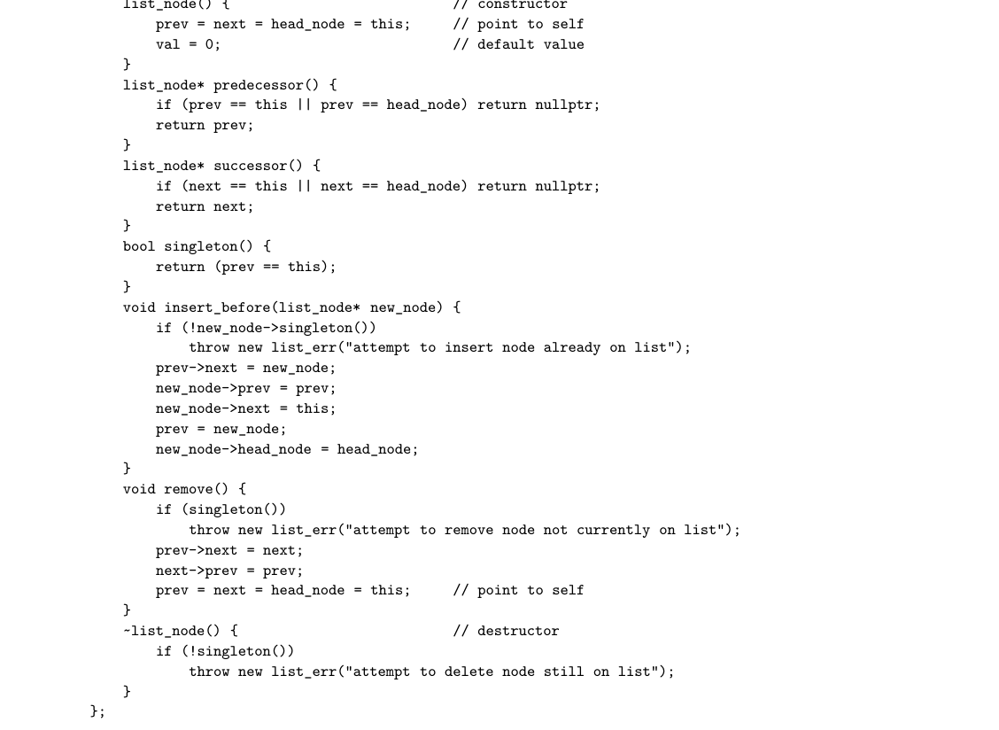
*Figure 10.1  A simple class for list nodes in C++. In this example we envision a list of integers.*

Records to  be inserted into  a  list  are created  in  much  the same  way:

list_node* elem_ptr = new list_node;  ■

EXAMPLE 10.3  In C++, one can also simply declare an object of a given class:  Declaration of in-line  (expanded) objects  list my_list;  list_node elem;

```
Our list class includes such an object (header) as  a  feld.  When  created  with  
new, an object is allocated in the heap; when created via elaboration of a declaration it is allocated statically or on the stack, depending on lifetime (Eiffel calls 
such objects “expanded”). Whether on the stack or in the heap, object creation 
causes the invocation of a programmer-specifed initialization routine, known as 
a constructor. In C++ and its descendants, Java and C#, the name of the constructor is the same as that of the class itself. C++ also allows the programmer to 
specify a destructor method that will be invoked automatically when an object is 
destroyed, either by explicit programmer action or by return from the subroutine 
in which it was declared. The destructor’s name is also the same as that of the 
class, but with a leading tilde (~). Destructors are commonly used for storage 
management and error checking. 
■ 
If a constructor has parameters, corresponding arguments must be provided
```

EXAMPLE 10.4  when declaring an in-line object or creating an object in the heap. Suppose, for  Constructor arguments  example, that our list_node constructor had been written to take an explicit  parameter:

```
class list_node { 
... 
list_node(int v) {
```

```
prev = next = head_node = this; 
val = v;  
}
```

Each in-line declaration or call to new would then need to provide a value:

list_node element1(0);  // in-line  list_node *e_ptr = new list_node(13);  // heap

As we shall see in Section 10.3.1, C++ actually allows us to declare both constructors, and uses the usual rules of function overloading to differentiate between  them: declarations without a value will call the no-parameter constructor; declarations with an integer argument will call the integer-parameter constructor.  ■

Public and Private Members

```
The public label within the declaration of list_node separates members required by the implementation of the abstraction from members available to users 
of the abstraction. In the terminology of Section 3.3.4, members that appear after 
the public label are exported from the class; members that appear before the label are not. C++ also provides a private label, so the publicly visible portions of 
a class can be listed frst if desired (or even intermixed). In many other languages, 
public data and subroutine members (felds and methods) must be individually 
so labeled (more on this in Section 10.2.2). Note that C++ classes are open scopes, 
as defned in Section 3.3.4; nothing needs to be explicitly imported.
```

In many languages—C++ among them—certain information can be left out  of the initial declaration of a module or class, and provided in a separate fle not

EXAMPLE 10.5  visible to users of the abstraction. In our running example, we could declare the  Method declaration  public methods of list_node without providing their bodies:  without definition

```
class list_node { 
list_node* prev; 
list_node* next; 
list_node* head_node; 
public: 
int val; 
list_node(); 
list_node* predecessor(); 
list_node* successor(); 
bool singleton(); 
void insert_before(list_node* new_node);
```

DESIGN & IMPLEMENTATION

```
10.1 What goes in a class declaration? 
Two rules govern the choice of what to put in the declaration of a class, rather 
than in a separate defnition. First, the declaration must contain all the information that a programmer needs in order to use the abstraction correctly. 
Second, the declaration must contain all the information that the compiler 
needs in order to generate code. The second rule is generally broader: it tends 
to force information that is not required by the frst rule into (the private part 
of) the interface, particularly in languages that use a value model of variables, 
instead of a reference model. If the compiler must generate code to allocate 
space (e.g., in stack frames) to hold an instance of a class, then it must know 
the size of that instance; this is the rationale for including private felds in the 
class declaration. In addition, if the compiler is to expand any method calls inline then it must have their code available. In-line expansion of the smallest, 
most common methods of an object-oriented program tends to be crucial for 
good performance.
```

void remove();  ~list_node();  };  ■

```
This somewhat abbreviated class declaration might then be put in a .h “header” 
fle, with method bodies relegated to a .cc “implementation” fle. (C++ conventions for separate compilation are similar to those of C, which we saw in Section C 3.8. The fle name suffxes used here are those expected by the GNU g++ 
compiler.) Within a.cc fle, the header of a method defnition must identify the 
class to which it belongs by using a :: scope resolution operator:
```

EXAMPLE 10.6

Separate method definition

void list_node::insert_before(list_node* new_node) {

if (!new_node->singleton())

throw new list_err("attempt to insert node already on list");  prev->next = new_node;  new_node->prev = prev;  new_node->next = this;  prev = new_node;  new_node->head_node = head_node;  }  ■

Tiny Subroutines

Object-oriented programs tend to make many more subroutine calls than do  ordinary imperative programs, and the subroutines tend to be shorter. Lots of  things that would be accomplished by direct access to record felds in a von Neumann language tend to be hidden inside object methods in an object-oriented  language. Many programmers in fact consider it bad style to declare public felds,  because doing so gives users of an abstraction direct access to the internal representation, and makes it impossible to change that representation without changing the user code as well. Arguably, we should make the val feld of list_node  private, with get_val and set_val methods to read and write it.

C# provides a property mechanism specifcally designed to facilitate the declaration of methods (called accessors) to “get” and “set” private felds. Using this  mechanism, a C# version of our val feld could be written as follows:

EXAMPLE 10.7

property and indexer  methods in C#

class list_node {

...  int val;  // val (lower case 'v') is private  public int Val {

get {  // presence of get accessor and optional  return val;  // set accessor means that Val is a property  }  set {

val = value;  // value is a keyword: argument to set  }  }  ...  }

```
Users of the list_node class can now access the (private) val feld through the 
(public) Val property as if it were a feld:
```

list_node n;  ...  int a = n.Val;  // implicit call to get method  n.Val = 3;  // implicit call to set method

In effect, C# indexers provide the look of direct feld access (from the perspective of a class’s users) while preserving the ability to change the implementation.  A similar indexer mechanism can make objects of arbitrary classes look like arrays, with conventional subscript syntax in both l-value and r-value contexts. An  example appears in Sidebar 8.3.

In C++, operator overloading and references can be used to provide the equivalent of indexers, but not of properties.  ■

Derived Classes

```
EXAMPLE 10.8 
Suppose now that we already have a list abstraction, and would like a queue abqueue class derived from 
straction. We could defne the queue from scratch, but much of the code would 
list 
look  the same as  in Figure 10.1.  In an  object-oriented  language we have the alternative of deriving the queue from the list, allowing it to inherit preexisting felds 
and methods:
```

```
class queue : public list { 
// queue is derived from list 
public: 
// no specialized constructor or destructor required 
void enqueue(int v) {
```

append(new list_node(v));  // append is inherited from list  }  int dequeue() {

if (empty())

throw new list_err("attempt to dequeue from empty queue");  list_node* p = head();  // head is also inherited  p->remove();  int v = p->val;  delete p;  return v;  }  };

```
Here queue is said to be a derived class (also called a child class or subclass); list 
is said to be a base class (also called a parent class or superclass). The derived 
class inherits all the felds and methods of the base class, automatically. All the 
programmer needs to declare explicitly are members that a queue has but a list 
lacks—in this case, the enqueue and dequeue methods. We shall see examples 
shortly in which derived classes have extra felds as well. 
■
```

```
In C++, public members of a base class are always visible inside the methods 
of a derived class. They are visible to users of the derived class only if the base class 
name is preceded with the keyword public in the frst line of the derived class’s 
declaration. Of course, we may not always want these members to be visible. In 
our queue example, we have chosen to pass integers to and from enqueue and 
dequeue, and to allocate and deallocate the list_nodes internally. If we want to 
keep these list nodes hidden, we must prevent the user from accessing the head 
and append methods of class list. We  can  do  so  by  making  list a private base 
class instead:
```

EXAMPLE 10.9

Hiding members of a base  class

class queue : private list { ...

To make the empty method visible again, we can call it out explicitly:

public:  using list::empty;

We will discuss the visibility of class members in more detail in Section 10.2.2. ■

```
When an object of a derived class is created in C++, the compiler arranges to 
call the constructor for the base class frst, and then to call the constructor of the 
derived class. In our queue example, where the derived class lacks a constructor, 
the list constructor will still be called—which is, of course, what we want. We 
will discuss constructors further in Section 10.3.
```

```
By deriving new classes from old ones, the programmer can create arbitrarily deep class hierarchies, with additional functionality at every level of the tree. 
The standard libraries for Smalltalk and Java are as many as seven and eight levels 
deep, respectively. (Unlike C++, both Smalltalk and Java have a single root superclass, Object, from which all other classes are derived. C#, Objective-C, and 
Eiffel have a similar class; Eiffel calls it ANY.)
```

Modifying Base Class Methods

```
In addition to defning new felds and methods, and hiding those it no longer 
wants to be visible, a derived class can redefine a member of a base class simply by 
providing a new version. In our queue example, we might want to defne a new 
head method that “peeks” at the frst element of the queue, without removing it:
```

EXAMPLE 10.10

Redefining a method in a  derived class

class queue : private list {

...  int head() {

if (empty())

throw new list_err("attempt to peek at head of empty queue");  return list::head()->val;  }

```
Note that the head method of class list is still visible to methods of class 
queue (but not to its users!) when identifed with the scope resolution operator (list::). 
■
```

Other object-oriented languages provide other means of accessing the mem-

```
EXAMPLE 10.11 
bers of a base class. In Smalltalk, Objective-C, Java, and C#, one uses the keyword 
Accessing base class 
base or super: 
members
```

list::head();  // C++  super.head();  // Java  base.head();  // C#  super head.  // Smalltalk  [super head]  // Objective-C  ■

EXAMPLE 10.12  In Eiffel, one must explicitly rename methods inherited from a base class, in  Renaming methods in Eiffel  order to make them accessible:

```
class queue 
inherit
```

list

rename

head as list_head  ...  -- other renames  end

```
Within methods of queue, the  head method of list can be invoked as 
list_head. C++ and Eiffel cannot use the keyword super, because it would 
be ambiguous in the presence of multiple inheritance. 
■
```

Objects as Fields of Other Objects

```
EXAMPLE 10.13 
As an alternative to deriving queue from list,  we might  choose to  include  a  
A queue that contains a list 
list as a field of a queue instead:
```

class queue {

list contents;  public:

bool empty() {

return contents.empty();  }  void enqueue(const int v) {

contents.append(new list_node(v));  }  int dequeue() {

if (empty())

throw new list_err("attempt to dequeue from empty queue");  list_node* p = contents.head();  p->remove();  int v = p->val;  delete p;  return v;  }  };

```
The practical difference is small in this example. The choice mainly boils down 
to whether we think of a queue as a special kind of list, or whether we think of a 
queue as an abstraction that uses a list as part of its implementation. The cases 
in which inheritance is most compelling are those in which we want to be able 
to use an object of a derived class (a “client,” say) in a context that expects an 
object of a base class (a “person,” say), and have that object behave in a special 
way by virtue of belonging to the derived class (e.g., include extra information 
when printed). We will consider these sorts of cases in Section 10.4. 
■
```

## 10.1.1 Classes and Generics

The astute reader may have noticed that our various lists and queues have all  embedded the assumption that the item in each list node is an integer. In practice,  we should like to be able to have lists and queues of many kinds of items, all based  on a single copy of the bulk of the code. In a dynamically typed language like Ruby  or Python, this is natural: the val feld would have no static type, and objects of  any kind could be added to, and removed from, lists and queues.

```
In a statically typed language like C++, it is tempting to create a generalpurpose list_node class that has no val feld, and then derive subclasses (e.g., 
int_list_node) that add the values. While this approach can be made to work,
```

```
EXAMPLE 10.14 
it has some unfortunate limitations. Suppose we defne a gp_list_node type, 
Base class for 
with the felds and methods needed to implement list operations, but without a 
general-purpose lists 
val payload:
```

```
class gp_list_node { 
gp_list_node* prev; 
gp_list_node* next; 
gp_list_node* head_node; 
public: 
gp_list_node(); 
// assume method bodies given separately 
gp_list_node* predecessor(); 
gp_list_node* successor(); 
bool singleton(); 
void insert_before(gp_list_node* new_node); 
void remove(); 
~gp_list_node(); 
};
```

To create nodes that can be used in a list of integers, we will need a val feld and  some constructors:

```
class int_list_node : public gp_list_node { 
public: 
int val; 
// the actual data in a node 
int_list_node() { val = 0; } 
int_list_node(int v) { val = v; } 
...
```

```
Initialization of the prev, next, and  head_node felds will remain in the hands of 
the gp_list_node constructor, which will be called automatically whenever we 
create a int_list_node object. The singleton, insert_before, and  remove 
methods can likewise be inherited from gp_list_node intact, as can the destructor. 
■
```

```
EXAMPLE 10.15 
But what about  successor and predecessor? If we leave these unchanged, 
The problem with 
they will continue to return values of type gp_list_node, not  int_list_node: 
type-specific extensions
```

int_list_node* p = ...  // whatever  int v = p->successor().val  // won't compile!

As far as the compiler is concerned, the successor of an int_list_node will have  no val feld. To fx the problem, we will need explicit casts:

int_list_node* predecessor() {

return static_cast<int_list_node*>(gp_list_node::predecessor());  }  int_list_node* successor() {

return static_cast<int_list_node*>(gp_list_node::successor());  }

In a similar vein, we can create a general-purpose list class:

```
class gp_list { 
gp_list_node head_node; 
public: 
bool empty(); 
// method bodies again given separately 
gp_list_node* head(); 
void append(gp_list_node *new_node); 
~gp_list(); 
};
```

```
But if  we extend  it to create  an  int_list class, we will need a cast in the head 
method:
```

```
class int_list : public gp_list { 
public: 
int_list_node* head() { 
// redefinition; hides original 
return static_cast<int_list_node*>(gp_list::head()); 
} 
};
```

Assuming we write our code correctly, none of our casts will introduce bugs. They  may, however, prevent the compiler from catching bugs if we write our code incorrectly:

```
class string_list_node : public gp_list_node { 
// analogous to int_list_node 
... 
}; 
... 
string_list_node n("boo!"); 
int_list L; 
L.append(&n); 
cout << "0x" << hex << L.head()->val;
```

```
On the author’s 64-bit Macbook, this code prints “0x6f6f6208.” 
What happened? 
Method int_list::append, inherited from gp_list, expects  a  parameter of type gp_list_node*, and since string_list_node is derived from 
gp_list_node, a  pointer  to  node  n is acceptable. But when we peek at this 
node, the cast in L.head() tells the compiler not to complain when we treat the 
node (which  can’t  be proven  to  be  anything  more specifc  than a  gp_list_node) 
as if we were certain it held an int. Not coincidentally, the upper three bytes 
of 0x6f6f6208 contain, in reverse order, the ASCII codes of the characters 
“boo.” 
■
```

EXAMPLE 10.16  Things get even worse if we try to defne a general-purpose analogue of the  How do you name an  queue from Examples 10.8–10.10:  unknown type?

```
class gp_queue : private gp_list { 
public: 
using gp_list::empty; 
void enqueue(const ?? v); 
// what is "??" ? 
?? dequeue(); 
?? head(); 
};
```

How do we talk about the objects the queue is supposed to contain when we don’t  even know their type?  ■

```
EXAMPLE 10.17 
The answer, of course, is generics (Section C 7.3.2)—templates, in C++. These 
Generic lists in C++ 
allow us to defne a list_node<T> class that can be instantiated for any data type 
T, without the need for either inheritance or type casts:
```

```
template<typename V> 
class list_node { 
list_node<V>* prev; 
list_node<V>* next; 
list_node<V>* head_node; 
public: 
V val;  
list_node<V>* predecessor() { ... 
list_node<V>* successor() { ... 
void insert_before(list_node<V>* new_node) { ... 
... 
};
```

```
template<typename V> 
class list { 
list_node<V> header; 
public: 
list_node<V>* head() { ... 
void append(list_node<V> *new_node) { ... 
... 
};
```

```
template<typename V> 
class queue : private list<V> { 
public:
```

using list<V>::empty;  void enqueue(const V v) { ...  V dequeue() { ...  V head() { ...  };

```
typedef list_node<int> int_list_node; 
typedef list_node<string> string_list_node; 
typedef list<int> int_list; 
...
```

DESIGN & IMPLEMENTATION

## 10.2 Containers/collections  In object-oriented programming, an abstraction that holds a collection of objects of some given class is often called a container. Common containers include sorted and unsorted sets, stacks, queues, and dictionaries, implemented  as lists, trees, hash tables, and various other concrete data structures. All of the  major object-oriented languages include extensive container libraries. A few of  the issues involved in their creation have been hinted at in this section: Which  classes are derived from which others? When do we say that “X is a Y” instead  of “X contains / uses a Y”? Which operations are supported, and what is their  time complexity? How much “memory churn” (heap allocation and garbage  collection) does each operation incur? Is everything type safe? How extensive  is the use of generics? How easy is it to iterate over the contents of a container? Given these many questions, the design of safe, effcient, and fexible  container libraries is a complex and diffcult art. For an approach that builds  on the gp_list_node base class of Example 10.14, but still leverages templates  to avoid the need for type casts, see Exercise 10.8.

int_list_node n(3);  string_list_node s("boo!");  int_list L;  L.append(&n);  // ok  L.append(&s);  // will not compile!  ■

In a nutshell, generics exist for the purpose of abstracting over unrelated types,  something that inheritance does not support. In addition to C++, generics appear  in most other statically typed object-oriented languages, including Eiffel, Java, C#,  and OCaml.

## 3CHECK YOUR UNDERSTANDING  1.  What are generally considered to be the three defning characteristics of  object-oriented programming?  2.  In what programming language of the 1960s does object orientation fnd its  roots? Who invented that language? Summarize the evolution of the three  defning characteristics since that time.

  3.
  Name three important benefts of abstraction.
  4.
  What are the more common names for subroutine member and data member?

  5.
  What
  is
  a
  property in C#?
  6.
  What is the purpose of the “private” part of an object interface? Why can’t it
  be hidden completely?
  7.
  What is the purpose of the :: operator in C++?

  8.
  Explain why in-line subroutines are particularly important in object-oriented
  languages.

```
9.
What
 are
 constructors and destructors? 
10. Give two other terms, each, for base class and derived class.
```

* Explain why generics may be useful in an object-oriented language, despite
  the extensive polymorphism already provided by inheritance.

### 10.2 Encapsulation and Inheritance

Encapsulation mechanisms enable the programmer to group data and the subroutines that operate on them together in one place, and to hide irrelevant  details from the users of an abstraction.  In the preceding section (and likewise Section 3.3.5) we cast object-oriented programming as an extension of the

“module-as-type” mechanisms of Simula and Euclid. It is also possible to cast  object-oriented programming in a “module-as-manager” framework.  In the  frst subsection below we consider the data-hiding mechanisms of modules in  non-object-oriented languages. In the second subsection we consider the new  data-hiding issues that arise when we add inheritance to modules. In the third  subsection we briefy return to the module-as-manager approach, and show how  several languages, including Ada 95 and Fortran 2003, add inheritance to records,  allowing (static) modules to continue to provide data hiding.

## 10.2.1 Modules

Scope rules for data hiding were one of the principal innovations of Clu, Modula,  Euclid, and other module-based languages of the 1970s. In Clu and Euclid, the  declaration and defnition (header and body) of a module always appeared together. In Modula-2, programmers had the option of placing the header and the  body in separate fles. Unfortunately, there was no way to divide the header into  public and private parts; everything in it was public (i.e., exported). The only  concession to data hiding was that pointer types could be declared in a header  without revealing the structure of the objects to which they pointed. Compilers  could generate code for the users of a module (Sidebar 10.1) without the hidden  information, since pointers are all of equal size on most machines.

EXAMPLE 10.18  Ada increases fexibility by allowing the header of a package to be divided into  Data hiding in Ada  public and private parts. Details of an exported type can be made opaque by  putting them in the private part of the header and simply naming the type in the  public part:

package foo is  -- header  ...  type T is private;  ...  private  -- definitions below here are inaccessible to users  ...  type T is ...  -- full definition  ...  end foo;

The private part provides the information the compiler needs to allocate objects  “in line.” A change to the body of a module never forces recompilation of any of  the users of the module. A change to the private part of the module header may  force recompilation, but it never requires changes to the source code of the users.  A change to the public part of a header is a change to the module’s interface: it  will often require us to change the code of users.  ■  Because they affect only the visibility of names, static, manager-style modules  introduce no special code generation issues. Storage for variables and other data  inside a module is managed in precisely the same way as storage for data immediately outside the module. If the module appears in a global scope, then its data

can be allocated statically. If the module appears within a subroutine, then its data  can be allocated on the stack, at known offsets, when the subroutine is called, and  reclaimed when it returns.

Module types, as in Euclid and ML, are somewhat more complicated: they  allow a module to have an arbitrary number of instances. The obvious implementation then resembles that of a record. If all of the data in the module have  a statically known size, then each individual datum can be assigned a static offset  within the module’s storage. If the size of some of the data is not known until run  time, then the module’s storage can be divided into fxed-size and variable-size  portions, with a dope vector (descriptor) at the beginning of the fxed-size portion. Instances of the module can be allocated statically, on the stack, or in the  heap, as appropriate.

The “this” Parameter

One additional complication arises for subroutines inside a module. How do  they know which variables to use? We could, of course, replicate the code for  each subroutine in each instance of the module, just as we replicate the data.  This replication would be highly wasteful, however, as the copies would vary only  in the details of address computations. A better technique is to create a single  instance of each module subroutine, and to pass that instance, at run time, the  address of the storage of the appropriate module instance. This address takes the

EXAMPLE 10.19  form of an extra, hidden frst parameter for every module subroutine. A Euclid  The hidden this  call of the form  parameter

my_stack.push(x)

is translated as if it were really

push(my_stack, x)

where my_stack is passed by reference. The same translation occurs in objectoriented languages.  ■

Making Do without Module Headers

As noted in Section C 3.8, Java packages and C/C++/C# namespaces can be spread  across multiple compilation units (fles). In C, C++, and C#, a single fle can also  contain pieces of more than one namespace. More signifcantly, many modern  languages, including Java and C#, dispense with the notion of separate headers  and bodies. While the programmer must still defne the interface (and specify it  via public declarations), there is no need to manually identify code that needs to  be in the header for implementation reasons: instead the compiler is responsible  for extracting this information automatically from the full text of the module.  For software engineering purposes it may still be desirable to create preliminary  “skeleton” versions of a module, against which other modules can be compiled,  but this is optional. To assist in project management and documentation, many  Java and C# implementations provide a tool that will extract from the complete  text of a module the minimum information required by its users.

## 10.2.2 Classes

```
With the introduction of inheritance, object-oriented languages must supplement the scope rules of module-based languages to cover additional issues. For 
example, how much control should a base class exercise over the visibility of its 
members in derived classes? Should private members of a base class be visible 
to methods of a derived class? Should public members of a base class always be 
public members of a derived class (i.e., be visible to users of the derived class)?
```

```
We touched on these questions in Example 10.9, where we declared class queue 
as a private list, hiding public members of the base class from users of the 
derived class—except for method empty, which we made explicitly visible again
```

```
EXAMPLE 10.20 
with a using declaration. C++ allows the inverse strategy as well: methods of an 
Hiding inherited methods 
otherwise public base class can be explicitly deleted from the derived class:
```

```
class queue : public list { 
... 
void append(list_node *new_node) = delete;
```

```
Similar deletion mechanisms can be found in Eiffel, Python, and Ruby. 
■ 
In addition to the public and private labels, C++ allows members of a class 
to be designated protected. A protected member is visible only to methods of 
its own class or of classes derived from that class. In our examples, a protected 
member M of list would be accessible not only to methods of list itself but 
also to methods of queue. Unlike public members, however, M would not be 
visible to arbitrary users of list or queue objects.
```

```
EXAMPLE 10.21 
The protected keyword can also be used when specifying a base class: 
protected base class in 
C++ 
class derived : protected base { ...
```

```
Here public members of the base class act like protected members of the derived 
class. 
■ 
The basic philosophy behind the visibility rules of C++ can be summarized as 
follows:
```

```
Any class can limit the visibility of its members. Public members are visible 
anywhere the class declaration is in scope. Private members are visible only 
inside the class’s methods. Protected members are visible inside methods of 
the class or its descendants. (As an exception to the normal rules, a class can 
specify that certain other friend classes or subroutines should have access to 
its private members.) 
A derived class can restrict the visibility of members of a base class, but can 
never increase it.3 Private members of a base class are never visible in a derived
```

```
3 
A derived class can of course declare a new member with the same name as some existing member, 
but the two will then coexist, as discussed in Example 10.10.
```

```
class. Protected and public members of a public base class are protected or 
public, respectively, in a derived class. Protected and public members of a 
protected base class are protected members of a derived class. Protected and 
public members of a private base class are private members of a derived class. 
A derived class that limits the visibility of members of a base class by declaring 
that base class protected or private can restore the visibility of individual 
members of the base class by inserting a using declaration in the protected 
or public portion of the derived class declaration. 
A derived class can make methods (though not felds) of a base class inaccessible (to others and to itself) by explicitly delete-ing them.
```

```
Other object-oriented languages take different approaches to visibility. Eiffel is more fexible than C++ in the patterns of visibility it can support, but it 
does not adhere to the frst of the C++ principles above. Derived classes in Eiffel can both restrict and increase the visibility of members of base classes. Every 
method (called a feature in Eiffel) can specify its own export status. If  the  status  
is {NONE} then the member is effectively private (called secret in Eiffel). If the 
status is {ANY} then the member is effectively public (called generally available in 
Eiffel). In the general case the status can be an arbitrary list of class names, in 
which case the feature is said to be selectively available to those classes and their 
descendants only. Any feature inherited from a base class can be given a new 
status in a derived class.
```

```
Java and C# follow C++ in the declaration of public, protected, and  
private members, but do not provide the protected and private designations for base classes; a derived class can neither increase nor restrict the visibility 
of members of a base class. It can, however, hide a feld or override a method  by  
defning  a  new  one  with  the same name;  the lack of a scope resolution  operator  
makes the old member inaccessible to users of the new class. In Java, the overriding version of a method cannot have more restrictive visibility than the version in 
the base class.
```

```
The protected keyword has a slightly different meaning in Java than it does 
in C++: a protected member of a Java class is visible not only within derived 
classes but also within the entire package (namespace) in which the class is declared. A class member with no explicit access modifer in Java is visible throughout the package in which the class is declared, but not in any derived classes that 
reside in other packages. C# defnes protected as C++ does, but provides an 
additional internal keyword that makes a member visible throughout the assembly in which the class appears. (An assembly is a collection of linked-together 
compilation units, comparable to a .jar fle in Java.) Members of a C# class are 
private by default.
```

In Smalltalk and Objective-C, the issue of member visibility never arises: the  language allows code at run time to attempt a call of any method name in any  object. If the method exists (with the right number of parameters), then the  invocation proceeds; otherwise a run-time error results. There is no way in these  languages to make a method available to some parts of a program but not to

```
others. In a related vein, Python class members are always public. In Ruby, felds 
are always  private;  more  than that,  they  are accessible only  to  methods  of  the  
individual object to which they belong.
```

Static Fields and Methods

```
Orthogonal to the visibility implied by public, private, or  protected, most  
object-oriented languages allow individual felds and methods to be declared 
static. Static class members are thought of as “belonging” to the class as a 
whole, not to any individual object. They are therefore sometimes referred to as 
class felds and methods, as opposed to instance felds and methods. (This terminology is most common in languages that create a special metaobject to represent 
each class—see Example 10.26. The class felds and methods are thought of as 
belonging to the metaobject.) A single copy of each static feld is shared by all 
instances of its class: changes made to that feld in methods of one object will be 
visible to methods of all other objects of the class. A static method, for its part, 
has no this parameter (explicit or implicit); it cannot access nonstatic (instance) 
felds. A nonstatic (instance) method, on the other hand, can access both static 
and nonstatic felds.
```

## 10.2.3 Nesting (Inner Classes)

```
Many languages allow class declarations to nest. This raises an immediate question: if Inner is a member of Outer, can  Inner’s methods see Outer’s members, 
and if so, which instance do they see? The simplest answer, adopted in C++ and 
C#, is to allow access to only the static members of the outer class, since these have 
only a single instance. In effect, nesting serves simply as a means of information
```

```
EXAMPLE 10.22 
hiding. Java takes a more sophisticated approach. It allows a nested (inner) class  
Inner classes in Java 
to access arbitrary members of its surrounding class. Each instance of the inner 
class must therefore belong to an instance of the outer class.
```

class Outer {

```
int n; 
class Inner {
```

public void bar() { n = 1; }  }  Inner i;  Outer() { i = new Inner(); }  // constructor  public void foo() {

```
n =  0;  
System.out.println(n); 
// prints 0 
i.bar(); 
System.out.println(n); 
// prints 1 
} 
}
```

```
If there are multiple instances of Outer, each instance will have a different n, 
and calls to Inner.bar will access the appropriate n. To  make  this  work,  each  
instance of Inner (of which there may of course be an arbitrary number) must 
contain a hidden pointer to the instance of Outer to which it belongs. If a nested 
class in  Java  is declared  to  be  static, it behaves as in C++ and C#, with access to 
only the static members of the surrounding class.
```

```
Java classes can also be nested inside methods. Such a local class has access 
not only to all members of the surrounding class but also to the parameters and 
variables of the method in which it is nested. The catch is that any parameters 
or variables that the nested class actually uses must be “effectively fnal”—either 
declared final explicitly or at least never modifed (by the nested class, the surrounding method, or any other code) after the nested class is elaborated. This 
rule permits the implementation to make a copy of the referenced objects rather 
than maintaining a reference (i.e., a static link) to the frame of the surrounding 
method. 
■ 
Inner and local classes in Java are widely used to create object closures, as  described in Section 3.6.3. In Section 9.6.2 we used them as handlers for events. 
We also noted that a local class in Java can be anonymous: it can appear, in-line, 
inside a call to new (Example 9.54).
```

## 10.2.4 Type Extensions

Smalltalk, Objective-C, Eiffel, C++, Java, and C# were all designed from the outset as object-oriented languages, either starting from scratch or from an existing language without a strong encapsulation mechanism. They all support a  module-as-type approach to abstraction, in which a single mechanism (the class)  provides both encapsulation and inheritance. Several other languages, including Modula-3 and Oberon (both successors to Modula-2), CLOS, Ada 95/2005,  and Fortran 2003, can be characterized as object-oriented extensions to languages  in which modules already provide encapsulation. Rather than alter the existing  module mechanism, these languages provide inheritance and dynamic method  binding through a mechanism for extending records.

EXAMPLE 10.23

```
In Ada 2005, our list and queue abstractions could be defned as shown in 
Figure 10.2. To control access to the structure of types, we hide them inside Ada 
packages. The procedures initialize, finalize, enqueue, and  dequeue of 
g_list.queue can convert their parameter self to a list_ptr, because  queue 
is an extension of list. Package  g_list.queue is said to be a child of package 
g_list because its name is prefxed with that of its parent. A child package in 
Ada is similar to a derived class in Eiffel or C++, except that it is still a manager, 
not a type. Like Eiffel, but unlike C++, Ada allows the body of a child package to 
see the private parts of the parent package.
```

List and queue abstractions  in Ada 2005

All of the list and queue subroutines in Figure 10.2 take an explicit frst parameter. Ada 95 and CLOS do not use “object.method()” notation. Python and  Ada 2005 do use this notation, but only as syntactic sugar: a call to A.B(C, D)

generic  type item is private;  -- Ada supports both type  default_value : item;  -- and value generic parameters  package g_list is  list_err : exception;  type list_node is tagged private;

-- 'tagged' means extendable; 'private' means opaque  type list_node_ptr is access all list_node;  -- 'all' means that this can point at 'aliased' nonheap data  procedure initialize(self : access list_node; v : item := default_value);

-- 'val' will get default value if second parameter is not provided  procedure finalize(self : access list_node);  function get_val(self : access list_node) return item;  function predecessor(self : access list_node) return list_node_ptr;  function successor(self : access list_node) return list_node_ptr;  function singleton(self : access list_node) return boolean;  procedure insert_before(self : access list_node; new_node : list_node_ptr);  procedure remove(self : access list_node);

type list is tagged private;  type list_ptr is access all list;  procedure initialize(self : access list);  procedure finalize(self : access list);  function empty(self : access list) return boolean;  function head(self : access list) return list_node_ptr;  procedure append(self : access list; new_node : list_node_ptr);  private

type list_node is tagged record  prev, next, head_node : list_node_ptr;  val : item;  end record;  type list is tagged record  head_node : aliased list_node;  -- 'aliased' means that an 'all' pointer can refer to this  end record;  end g_list;  ...  package body g_list is

-- definitions of subroutines  ...  end g_list;

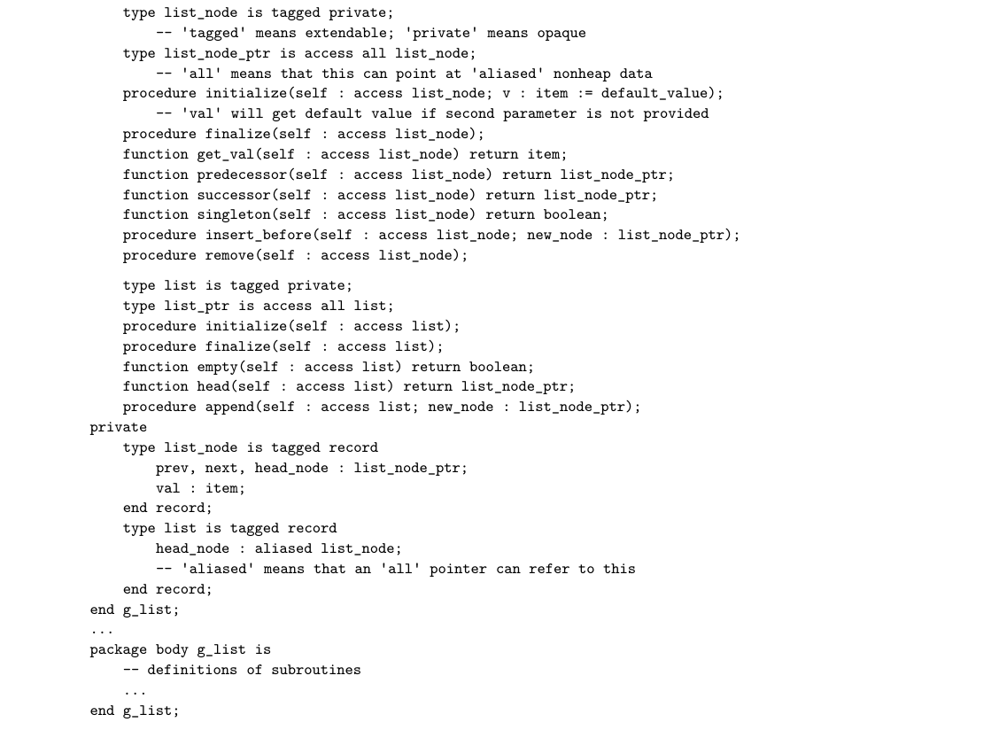
*Figure 10.2  Generic list and queue abstractions in Ada 2005. The tagged types list and queue provide inheritance; the  packages provide encapsulation. Declaring self to have type access XX (instead of XX_ptr) causes the compiler to recognize  the subroutine as a method of the tagged type; ptr.method(args) is syntactic sugar for method(ptr,args) if ptr refers to  an object of a tagged type. Function delete_node (next page) uses the Unchecked_Deallocation library package to create  a type-specifc routine for memory reclamation. The expression list_ptr(self) is a (type-safe) cast. (continued)*

```
with g_list; 
-- import parent package 
generic package g_list.queue is 
-- dot means queue is child of g_list 
type queue is new list with private;
```

-- 'new' means it's a subtype; 'with' means it's an extension  type queue_ptr is access all queue;  procedure initialize(self : access queue);  procedure finalize(self : access queue);  function empty(self : access queue) return boolean;  procedure enqueue(self : access queue; v : item);  function dequeue(self : access queue) return item;  function head(self : access queue) return item;  private

type queue is new list with null record;  -- no new fields  end g_list.queue;  ...  with Ada.Unchecked_Deallocation;  -- for delete_node, below  package body g_list.queue is

```
procedure initialize(self : access queue) is 
begin 
list_ptr(self).initialize; 
-- call base class constructor 
end initialize;
```

procedure finalize(self : access queue) is ...  -- similar  function empty(self : access queue) return boolean is ...  -- to initialize

procedure enqueue(self : access queue; v : item) is  new_node : list_node_ptr;  -- local variable  begin

new_node := new list_node;  new_node.initialize;  -- no automatic constructor calls  list_ptr(self).append(new_node);  end enqueue;

procedure delete_node is new Ada.Unchecked_Deallocation  (Object => list_node, Name => list_node_ptr);

function dequeue(self : access queue) return item is  head_node : list_node_ptr;  rtn : item;  begin

if list_ptr(self).empty then raise list_err; end if;  head_node := list_ptr(self).head;  head_node.remove;  rtn := head_node.val;  delete_node(head_node);  return rtn;  end dequeue;

function head(self : access queue) return item is ...  -- similar to delete  end g_list.queue;


*Figure 10.2  (continued)*

```
is interpreted as a call to B(A, C, D), where  B is declared as a three-parameter 
subroutine. Arbitrary Ada code can pass an object of type queue to any routine 
that expects a list;  as in Java,  there  is no way  for  a  derived  type to hide the  public  
members of a base type. 
■
```

## 10.2.5 Extending without Inheritance

```
The desire to extend the functionality of an existing abstraction is one of the principal motivations for object-oriented programming. Inheritance is the standard 
mechanism that makes such extension possible. There are times, however, when 
inheritance is not an option, particularly when dealing with preexisting code. The 
class one wants to extend may not permit inheritance, for instance: in Java, it may 
be labeled final; in  C#,  it  may  be  sealed. Even if inheritance is possible in principle, there may be a large body of existing code that uses the original class name, 
and it may not be feasible to go back and change all the variable and parameter 
declarations to use a new derived type.
```

EXAMPLE 10.24  For situations like these, C# provides extension methods, which give the appearExtension methods in C#  ance of extending an existing class:

```
static class AddToString { 
public static int toInt(this string s) { 
return int.Parse(s); 
} 
}
```

```
An extension method must be static, and  must  be  declared  in  a  static class. 
Its frst parameter must be prefxed with the keyword this. The method can then 
be invoked as if it were a member of the class of which this is an instance:
```

int n = myString.toInt();

Together, the method declaration and use are syntactic sugar for

```
static class AddToString { 
public static int toInt (string s) { 
// no 'this' 
return int.Parse(s); 
} 
} 
... 
int n = AddToString.toInt(myString); 
■
```

```
No special functionality is available to extension methods. In particular, they 
cannot access private members of the class that they extend, nor do they support 
dynamic method binding (Section 10.4). By contrast, several scripting languages, 
including JavaScript and Ruby, really do allow the programmer to add new methods to existing classes—or even to individual objects. We will explore these options further in Section 14.4.4.
```

## 3CHECK YOUR UNDERSTANDING  12. What  is  meant  by  an  opaque export from a module?  13. What  are  private types in Ada?

```
14. Explain the signifcance of the this parameter in object-oriented languages. 
15. How do Java and C# make do without explicit class headers? 
16. Explain the distinctions among private, protected, and  public class 
members in C++.
```

```
17. Explain the distinctions among private, protected, and  public base 
classes in C++.
```

```
18. Describe the notion of selective availability in Eiffel. 
19. How do the rules for member name visibility in Smalltalk and Objective-C 
differ from the rules of most other object-oriented languages? 
20. How  do  inner classes in Java differ from most other nested classes?
```

```
21. Describe the key design difference between the object-oriented features of 
Smalltalk, Eiffel, and C++ on the one hand, and Ada, CLOS, and Fortran 
on the other. 
22. What  are  extension methods in C#? What purpose do they serve?
```

### 10.3 Initialization and Finalization

In Section 3.2 we defned the lifetime of an object to be the interval during which  it occupies space and can thus hold data. Most object-oriented languages provide  some sort of special mechanism to initialize an object automatically at the beginning of its lifetime. When written in the form of a subroutine, this mechanism is  known as a constructor. Though the name might be thought to imply otherwise,  a constructor does not allocate space; it initializes space that has already been allocated. A few languages provide a similar destructor mechanism to finalize an  object automatically at the end of its lifetime. Several important issues arise:

```
Choosing a constructor: An object-oriented language may permit a class to have 
zero, one, or many distinct constructors. In the latter case, different constructors may have different names, or it may be necessary to distinguish among 
them by number and types of arguments. 
References and values: If variables are references, then every object must be cre­
```

ated explicitly, and it is easy to ensure that an appropriate constructor is called.  If variables are values, then object creation can happen implicitly as a result of  elaboration. In this latter case, the language must either permit objects to begin

```
their lifetime uninitialized, or it must provide a way to choose an appropriate 
constructor for every elaborated object. 
Execution order: When an object of a derived class is created in C++, the com­
```

```
piler guarantees that the constructors for any base classes will be executed, outermost frst, before the constructor for the derived class. Moreover, if a class 
has members that are themselves objects of some class, then the constructors 
for the members will be called before the constructor for the object in which 
they are contained. These rules are a source of considerable syntactic and semantic complexity: when combined with multiple constructors, elaborated 
objects, and multiple inheritance, they can sometimes induce a complicated 
sequence of nested constructor invocations, with overload resolution, before 
control even enters a given scope. Other languages have simpler rules. 
Garbage collection: Most object-oriented languages provide some sort of con­
```

structor mechanism. Destructors are comparatively rare. Their principal purpose is to facilitate manual storage reclamation in languages like C++. If the  language implementation collects garbage automatically, then the need for destructors is greatly reduced.

In the remainder of this section we consider these issues in more detail.

## 10.3.1 Choosing a Constructor

Smalltalk, Eiffel, C++, Java, and C# all allow the programmer to specify more  than one constructor for a given class. In C++, Java, and C#, the constructors  behave like overloaded subroutines: they must be distinguished by their numbers

EXAMPLE 10.25  and types of arguments. In Smalltalk and Eiffel, different constructors can have  Naming constructors in  different names; code that creates an object must name a constructor explicitly.  Eiffel  In Eiffel one might say

```
class COMPLEX 
creation 
new_cartesian, new_polar 
feature {ANY} 
x, y : REAL
```

new_cartesian(x_val, y_val : REAL) is  do  x := x_val; y := y_val  end

new_polar(rho, theta : REAL) is  do  x := rho * cos(theta)  y := rho * sin(theta)  end

-- other public methods

feature {NONE}

-- private methods

```
end -- class COMPLEX 
... 
a, b : COMPLEX 
... 
!!b.new_cartesian(0, 1) 
!!a.new_polar(1, pi/2)
```

```
The !! operator is Eiffel’s equivalent of new. Because class COMPLEX specifed 
constructor (“creator”) methods, the compiler will insist that every use of !! 
specify a constructor name and arguments. There is no straightforward analog 
of this code in C++; the fact that both constructors take two real arguments 
means that they could not be distinguished by overloading. 
■ 
Smalltalk resembles Eiffel in the use of multiple named constructors, but it distinguishes more sharply between operations that pertain to an individual object 
and operations that pertain to a class of objects. Smalltalk also adopts an anthropomorphic programming model in which every operation is seen as being executed by some specifc object in response to a request (a “message”) from some 
other object. Since it makes little sense for an object O to create itself, O must 
be created by some other object (call it C) that  represents  O’s class. Of course, 
because C is an object, it must itself belong to some class. The result of this reasoning is a system in which each class defnition really introduces a pair of classes 
and a pair of objects to represent them. Objective-C and CLOS have similar dual 
hierarchies, as do Python and Ruby.
```

```
EXAMPLE 10.26 
Consider, for example, the standard class named Date. Corresponding to 
Metaclasses in Smalltalk 
Date is a single object (call it D) that performs operations on behalf of the class. 
In particular, it is D that creates new objects of class Date. Because only objects 
execute operations (classes don’t), we don’t really need a name for D; we can  simply use the name of the class it represents:
```

todaysDate <- Date today

```
This code causes D to execute the today constructor of class Date, and assigns a 
reference to the newly created object into a variable named todaysDate.
```

```
So what is the class of D ? It clearly isn’t Date, because  D represents  class Date. 
Smalltalk says that D is an object (in fact the only object) of the metaclass Date 
class. For technical reasons, it is also necessary for Date class to be represented 
by an object. To avoid an infnite regression, all objects that represent metaclasses 
are instances of a single class named Metaclass. 
■ 
A few historic languages—notably Modula-3 and Oberon— provided no constructors at all: the programmer had to initialize everything explicitly. Ada 95
```

supports automatic calls to constructors and destructors (Initialize and

Finalize routines) only for objects of types derived from the standard library  type Controlled.

## 10.3.2 References and Values

```
Many object-oriented languages, including Simula, Smalltalk, Python, Ruby, and 
Java, use a programming model in which variables refer to objects. A few languages, including C++ and Ada, allow a variable to have a value that is an object. 
Eiffel uses a reference model by default, but allows the programmer to specify that 
certain classes should be expanded, in which case variables of those classes will 
use a value model. In a similar vein, C# and Swift use struct to defne types 
whose variables are values, and class to defne types whose variables are references.
```

With a reference model for variables, every object is created explicitly, and it  is easy to ensure that an appropriate constructor is called. With a value model  for variables, object creation can happen implicitly as a result of elaboration. In  Ada, which doesn’t provide automatic calls to constructors by default, elaborated  objects begin life uninitialized, and it is possible to accidentally attempt to use a  variable before it has a value. In C++, the compiler ensures that an appropriate  constructor is called for every elaborated object, but the rules it uses to identify  constructors and their arguments can sometimes be confusing.

```
EXAMPLE 10.27 
If a C++ variable of class type foo is declared with no initial value, then the 
Declarations and 
compiler will call foo’s zero-argument constructor (if no such constructor exists, 
constructors in C++ 
but other constructors do, then the declaration is a static semantic error—a call 
to a nonexistent subroutine):
```

foo b;  // calls foo::foo()

DESIGN & IMPLEMENTATION

10.3 The value/reference tradeoff  The reference model of variables is arguably more elegant than the value  model, particularly for object-oriented languages, but generally requires that  objects be allocated from the heap, and imposes (in the absence of compiler  optimizations) an extra level of indirection on every access. The value model  tends to be more effcient, but makes it diffcult to control initialization. In  languages with a reference model (including Java), an optimization known  as escape analysis can sometimes allow the compiler to determine that references to a given object will always be contained within (will never escape) a  given method. In this case the object can be allocated in the method’s stack  frame, avoiding the overhead of heap allocation and, more signifcantly, eventual garbage collection.

If the programmer wants to call a different constructor, the declaration must specify constructor arguments to drive overload resolution:

foo b(10, 'x');  // calls foo::foo(int, char)  foo c{10, 'x'};  // alternative syntax in C++11  ■

EXAMPLE 10.28  The most common argument list consists of a single object, of the same type as  Copy constructors  the object being declared:

foo a;  ...  foo b(a);  // calls foo::foo(foo&)  foo c{a};  // alternative syntax

Usually the programmer’s intent is to declare a new object whose initial value is  “the same as” that of the existing object. In this case it may be more natural to  write

foo a;  // calls foo::foo()  ...  foo b = a;  // calls foo::foo(foo&)

```
In recognition of this intent, a single-argument constructor (of matching type) is 
sometimes called a copy constructor.  It is important  to  realize  that the  equals  sign  
(=) in this most recent declaration of b indicates initialization, not assignment. 
The effect is exactly the same as in the declarations foo b(a) or foo b{a}. It  is  
not the same  as in the  similar code fragment
```

foo a, b;  // calls foo::foo() twice  ...  b = a;  // calls foo::operator=(foo&)

Here a and b are initialized with the zero-argument constructor, and the later  use of the equals sign indicates assignment, not initialization. The distinction is a  common source of confusion in C++ programs. It arises from the combination  of a value model of variables and an insistence that every elaborated object be  initialized by a constructor. The rules are simpler in languages that use a uniform  value model for class-type variables: if every object is created by an explicit call  to new or its equivalent, each such call provides the “hook” at which to call a  constructor.  ■

EXAMPLE 10.29  In C++, the requirement that every object be constructed (and likewise deTemporary objects  structed) applies not only to objects with names but also to temporary objects.  The following, for example, entails a call to both the string(const char*) constructor and the ~string() destructor:

cout << string("Hi, Mom").length();  // prints 7

The destructor is called at the end of the output statement: the temporary object  behaves as if its scope were just the line shown here.

```
In a similar vein, the following entails not only two calls to the default string 
constructor (to initialize a and b) and  a  call  to  string::operator+(), but  also  a  
constructor call to initialize the temporary object returned by operator+()—the 
object whose length is then queried by the caller:
```

string a, b;  ...  (a + b).length();

As is customary for values returned from functions, the space for the temporary  object is likely to be allocated (at a statically known offset) in the stack frame of  the caller—that is, in the routine that calls both operator+() and length(). ■

```
EXAMPLE 10.30 
Now consider the code for some function f, returning a value of class type 
Return value optimization 
foo. If instances of foo are too big to ft in a register, the compiler will arrange 
for f’s caller to pass an extra, hidden parameter that specifes the location into 
which f should construct the return value. If the return statement itself creates a 
temporary object—
```

return foo( args )

—that object can easily be constructed at the caller-specifed address. But suppose  f’s source looks more like this:

foo rtn;  ...  // complex code to initialize the fields of rtn  return rtn;

```
Because we have used a named, non-temporary variable, the compiler may need 
to invoke a copy constructor to copy rtn into the location in the caller’s frame.4 
It is also permitted, however (if other return statements don’t have conficting 
needs), to construct rtn itself at the caller-specifed location from the outset, and 
to elide the copy operation. This option is known as return value optimization. It  
turns out to signifcantly improve the performance of many C++ programs.
```

```
In Example 10.29, the value a + b  was passed immediately to length(), allowing the compiler to use the same temporary object in the caller’s frame as both the 
return value from operator+() and the this argument for length(). In  other  
programs the compiler may need to invoke a copy constructor after a function 
returns:
```

```
foo c; 
... 
c =  f(  args );
```

4  The compiler may also use a move constructor (“R-value References,” Section 9.3.1), if available.  To avoid excess confusion, we limit the discussion here to copy constructors.

Here the location of c cannot be passed as the hidden parameter to f unless the  compiler is able to prove that c’s value will not be used (via an alias, perhaps)  during the call. The bottom line: returning an object from a function in C++  may entail zero, one, or two invocations of the return type’s copy constructor, depending on whether the compiler is able to optimize either or both of the return  statement and the subsequent use in the caller.  ■

```
EXAMPLE 10.31 
While Eiffel has both dynamically allocated and expanded objects, its strategy 
Eiffel constructors and 
with regard to constructors is somewhat simpler. Specifcally, every variable is 
expanded objects 
initialized to a default value. For built-in types (integer, foating-point, character, 
etc.), which are always expanded, the default values are all zero. For references 
to objects, the default value is void (null). For variables of expanded class types, 
the defaults are applied recursively to members. As noted above, new objects are 
created by invoking Eiffel’s !! creation operator:
```

!!var.creator(args)

```
where var is a variable of some class type T and creator is a constructor for 
T. In the common case, var will be a reference, and the creation operator will 
allocate space for an object of class T and then call the object’s constructor. This 
same syntax is permitted, however, when T is an expanded class type, in which 
case var will actually be an object, rather than a reference. In this case, the !!
```

DESIGN & IMPLEMENTATION

```
10.4 Initialization and assignment 
Issues around initialization and assignment in C++ can sometimes have a surprising effect on performance—and potentially on program behavior as well. 
As noted in the body of the text, “foo a =  b”  is likely  to  be more effcient  than  
“foo a; a = b”—and may lead to different behavior if foo’s copy constructor 
and assignment operator have not been designed to be semantically equivalent. 
Similar issues may arise with operator+() and operator+=(), operator*() 
and operator*=(), and the other analogous pairs of operations.
```

Similar issues may also arise when making function calls. A parameter that  is passed by value typically induces an implicit call to a copy constructor. A  parameter that is passed by reference does not, and may be equally acceptable,  especially if declared to be const. (In C++11, the value parameter may also  use a move constructor.) From a performance perspective, the cost of a copy or  more constructor may or may not be outweighed by the cost of indirection and  the possibility that code improvement may be inhibited by potential aliases.  From a behavioral perspective, calls to different constructors and operators,  induced by tiny source code changes, can be a source of very subtle bugs. C++  programmers must exercise great care to avoid side effects in constructors and  to ensure that all intuitively equivalent methods have identical semantics in  practice. Even then, performance tradeoffs may be very hard to predict.

operator simply passes to the constructor (a reference to) the already-allocated  object.  ■

## 10.3.3 Execution Order

```
As we have seen, C++ insists that every object be initialized before it can be used. 
Moreover, if the object’s class (call it B) is derived from some other class (call it 
A), C++ insists on calling an A constructor before calling a B constructor, so that 
the derived class is guaranteed never to see its inherited felds in an inconsistent 
state. When the programmer creates an object of class B (either via declaration or 
with a call to new), the creation operation specifes arguments for a B constructor. 
These arguments allow the C++ compiler to resolve overloading when multiple 
constructors exist. But where does the compiler obtain arguments for the A constructor? Adding them to the creation syntax (as Simula did) would be a clear
```

```
EXAMPLE 10.32 
violation of abstraction. The answer adopted in C++ is to allow the header of the 
Specification of base class 
constructor of a derived class to specify base class constructor arguments: 
constructor arguments
```

```
foo::foo( foo params ) : bar( bar args ) {  
...
```

```
Here foo is derived from bar. The  list  foo params consists of formal parameters 
for this particular foo constructor. Between the parameter list and the opening 
brace of the subroutine defnition is a “call” to a constructor for the base class 
bar. The arguments to the bar constructor can be arbitrarily complicated expressions involving the foo parameters. The compiler will arrange to execute the 
bar constructor before beginning execution of the foo constructor. 
■
```

```
EXAMPLE 10.33 
Similar syntax allows the C++ programmer to specify constructor arguments 
Specification of member 
or initial values for members of the class. In Figure 10.1, for example, we could 
constructor arguments 
have used this syntax to initialize prev, next, head_node, and  val in the constructor for list_node:
```

DESIGN & IMPLEMENTATION

10.5 Initialization of “expanded” objects  C++ inherits from C a design philosophy that emphasizes execution speed,  minimal run-time support, and suitability for “systems” programming, in  which the programmer needs to be able to write code whose mapping to assembly language is straightforward and self-evident. The use of a value model  for variables in C++ is thus more than an attempt to be backward compatible  with C; it refects the desire to allocate variables statically or on the stack whenever possible, to avoid the overhead of dynamic allocation, deallocation, and  frequent indirection. In later sections we shall see several other manifestations  of the C++ philosophy, including manual storage reclamation (Section 10.3.4)  and static method binding (Section 10.4.1).

list_node() : prev(this), next(this), head_node(this), val(0) {  // empty body -- nothing else to do  }

Given that all of these members have simple (pointer or integer) types, there will  be no signifcant difference in the generated code. But suppose we have members  that are themselves objects of some nontrivial class:

```
class foo : bar { 
mem1_t member1; 
// mem1_t and 
mem2_t member2; 
// mem2_t are classes 
... 
}
```

```
foo::foo( foo params ) : bar( bar args ), member1(mem1 init val ), 
member2( mem2 init val ) {  
...
```

Here the use of embedded calls in the header of the foo constructor causes the  compiler to call the copy constructors for the member objects, rather than calling the default (zero-argument) constructors, followed by operator= within the  body of the constructor. Both semantics and performance may be different as a  result.  ■

```
EXAMPLE 10.34 
When the code of one constructor closely resembles that of another, C++ also 
Constructor forwarding 
allows the member-and-base-class-initializer syntax to be used to forward one 
constructor to another. In Example 10.4 we introduced a new integer-parameter 
constructor for the list_node class of Figure 10.1. Given the existence of this 
new constructor, we could re-write the default (no-parameter) constructor as
```

```
class list_node { 
... 
list_node() : list_node(0) { } 
// forward to (int) constructor
```

Any declaration of a list_node that does not provide an argument will now call  the integer-parameter constructor with an argument of 0.  ■

```
EXAMPLE 10.35 
Like C++, Java insists that a constructor for a base class be called before the 
Invocation of base class 
constructor for a derived class. The syntax is a bit simpler, however; the initial 
constructor in Java 
line of the code for the derived class constructor may consist of a “call” to the 
base class constructor:
```

super( args );

```
(C# has a similar mechanism.) As noted in Section 10.1, super is a Java keyword 
that refers to the base class of the class in whose code it appears. If the call to 
super is missing, the Java compiler automatically inserts a call to the base class’s 
zero-argument constructor (in which case such a constructor must exist). 
■
```

```
Because Java uses a reference model uniformly for all objects, any class members that are themselves objects will actually be references, rather than “expanded” 
objects (to use the Eiffel term). Java simply initializes such members to null. If  
the programmer wants something different, he or she must call new explicitly 
within the constructor of the surrounding class. Smalltalk and (in the common 
case) C# and Eiffel adopt a similar approach. In C#, members whose types are 
structs are initialized by setting all of their felds to zero or null. In Eiffel, if a 
class contains members  of  an  expanded class type, that type is required to have 
a single constructor, with no arguments; the Eiffel compiler arranges to call this 
constructor when the surrounding object is created.
```

```
Smalltalk, Eiffel, CLOS, and Objective-C are all more lax than C++ regarding 
the initialization of base classes. The compiler or interpreter arranges to call the 
constructor (creator, initializer) for each newly created object automatically, but 
it does not arrange to call constructors for base classes automatically; all it does is 
initialize base class data members to default (zero or null) values. If the derived 
class wants different behavior, its constructor(s) must call a constructor for the 
base class explicitly.
```

## 10.3.4 Garbage Collection

```
When a C++ object is destroyed, the destructor for the derived class is called frst, 
followed by those of the base class(es), in reverse order of derivation. By far the
```

```
EXAMPLE 10.36 
most common use of destructors in C++ is manual storage reclamation. Consider 
Reclaiming space with 
again the queue class of Figure10.8. Because our queue is derived from the list 
destructors 
of Figure 10.2, its default destructor will call the explicit ~list destructor, which 
will throw an exception if the list (i.e., the queue) is nonempty. Suppose instead 
that we wish to allow the destruction of a nonempty queue, and simply clean up 
its space. Since queue nodes are created by enqueue, and are used only within the 
code of the queue itself, we can safely arrange for the queue’s destructor to delete 
any nodes that remain:
```

~queue() {

while (!empty()) {  list_node* p = contents.head();  p->remove();  delete p;  }  }

Alternatively, since dequeue has already been designed to delete the node that  contained the dequeued element:

~queue() {  while (!empty()) {  int v = dequeue();  }  }

In modern C++ code, storage management is often facilitated through the use of  smart pointers (Section 8.5.3). These arrange, in the destructor for a pointer, to  determine whether any other pointers to the same object continue to exist—and  if not, to reclaim that pointed-to object.  ■  In languages with automatic garbage collection, there is much less need for  destructors. In fact, the entire idea of destruction is suspect in a garbage-collected  language, because the programmer has little or no control over when an object is  going to be destroyed. Java and C# allow the programmer to declare a finalize  method that will be called immediately before the garbage collector reclaims the  space for an object, but the feature is not widely used.

## 3CHECK YOUR UNDERSTANDING  23. Does a constructor allocate space for an object? Explain.  24. What  is  a  metaclass in Smalltalk?

```
25. Why is object initialization simpler in a language with a reference model of 
variables (as opposed to a value model)? 
26. How does a C++ (or Java or C#) compiler tell which constructor to use for a 
given object? How does the answer differ for Eiffel and Smalltalk? 
27. What  is  escape analysis? Describe why it might be useful in a language with a 
reference model of variables. 
28. Summarize the rules in C++ that determine the order in which constructors 
are called for a class, its base class(es), and the classes of its felds. How are 
these rules simplifed in other languages?
```

* Explain the difference between initialization and assignment in C++.
* Why does C++ need destructors more than Eiffel does?

### 10.4 Dynamic Method Binding

```
One of the principal consequences of inheritance/type extension is that a derived 
class D has all the members—data and subroutines—of its base class C. As  long  
as D does not hide any of the publicly visible members of C (see Exercise 10.15), 
it makes sense to allow an object of class D to be used in any context that expects 
an object of class C: anything we might want to do to an object of class C we can 
also do to an object of class D. In other words, a derived class that does not hide 
any publicly visible members of its base class is a subtype of that base class.
```

The ability to use a derived class in a context that expects its base class is called

```
EXAMPLE 10.37 
subtype polymorphism. If we imagine an administrative computing system for a 
Derived class objects in a 
university, we might derive classes student and professor from class person: 
base class context
```

```
class person { ... 
class student : public person { ... 
class professor : public person { ...
```

Because both student and professor objects have all the properties of a person  object, we should be able to use them in a person context:

student s;  professor p;  ...  person *x = &s;  person *y = &p;

Moreover a subroutine like

void person::print_mailing_label() { ...

would be polymorphic—capable of accepting arguments of multiple types:

s.print_mailing_label();  // i.e., print_mailing_label(s)  p.print_mailing_label();  // i.e., print_mailing_label(p)

As with other forms of polymorphism, we depend on the fact that print_mail­

ing_label uses only those features of its formal parameter that all actual parameters will have in common.  ■

EXAMPLE 10.38  But now suppose that we have redefned print_mailing_label in each of  Static and dynamic method  the two derived classes. We might, for example, want to encode certain inforbinding  mation (student’s year in school, professor’s home department) in the corner  of the label.  Now we have multiple versions of our subroutine—student::  print_mailing_label and professor::print_mailing_label, rather than  the single, polymorphic person::print_mailing_label. Which  version  we will get depends on the object:

s.print_mailing_label();  // student::print_mailing_label(s)  p.print_mailing_label();  // professor::print_mailing_label(p)

But what about

x->print_mailing_label();  // ??  y->print_mailing_label();  // ??

```
Does the choice of the method to be called depend on the types of the variables x 
and y, or on the classes of the objects s and p to which those variables refer? 
■ 
The frst  option (use the  type  of  the reference)  is known  as  static method binding. The second option (use the class of the object) is known as dynamic method 
binding. Dynamic method binding is central to object-oriented programming. 
Imagine, for example, that our administrative computing program has created 
a list of  persons who have overdue library books. The list may contain both 
students and  professors. If we traverse the list and print a mailing label for 
each person, dynamic method binding will ensure that the correct printing routine is called for each individual. In this situation the defnitions in the derived 
classes are said to override the defnition in the base class.
```

Semantics and Performance

```
The principal argument against static method binding—and thus in favor of 
dynamic binding based on the type of the referenced object—is that the static 
approach denies the derived class control over the consistency of its own state.
```

EXAMPLE 10.39  Suppose, for example, that we are building an I/O library that contains a  The need for dynamic  text_file class:  binding

```
class text_file { 
char *name; 
long position; 
// file pointer 
public: 
void seek(long whence); 
... 
};
```

Now suppose we have a derived class read_ahead_text_file:

```
class read_ahead_text_file : public text_file { 
char *upcoming_characters; 
public: 
void seek(long whence); 
// redefinition 
... 
};
```

```
The code for  read_ahead_text_file::seek will undoubtedly need to change 
the value of the cached upcoming_characters. If the method is not dynamically dispatched, however, we cannot guarantee that this will happen: if we pass a 
read_ahead_text_file reference to a subroutine that expects a text_file reference as argument, and if that subroutine then calls seek, we’ll  get  the  version  
of seek in  the base class.  
■ 
Unfortunately, as we shall see in Section 10.4.3, dynamic method binding 
imposes run-time overhead. 
While this overhead is generally modest, it is 
nonetheless a concern for small subroutines in performance-critical applications. 
Smalltalk, Objective-C, Python, and Ruby use dynamic method binding for all 
methods. Java and Eiffel use dynamic method binding by default, but allow individual methods and (in Java) classes to be labeled final (Java) or frozen (Eiffel), 
in which case they cannot be overridden by derived classes, and can therefore 
employ an optimized implementation. Simula, C++, C#, and Ada 95 use static 
method binding by default, but allow the programmer to specify dynamic binding 
when desired. In these latter languages it is common terminology to distinguish 
between overriding a method that uses dynamic binding and (merely) redefining a 
method that uses static binding. For the sake of clarity, C# requires explicit use of 
the keywords override and new whenever a method in a derived class overrides 
or redefnes (respectively) a method of the same name in a base class. Java and 
C++11 have similar annotations whose use is encouraged but not required.
```

## 10.4.1 Virtual and Nonvirtual Methods

```
In Simula, C++, and C#, which use static method binding by default, the programmer can specify that particular methods should use dynamic binding by 
labeling them as virtual. Calls to virtual methods are dispatched to the appropriate implementation at run time, based on the class of the object, rather
```

EXAMPLE 10.40  than the type of the reference. In C++ and C#, the keyword virtual prefxes the  Virtual methods in C++  subroutine declaration:5

and C#

```
class person { 
public: 
virtual void print_mailing_label(); 
... 
■
```

Ada 95 adopts a different approach. Rather than associate dynamic dispatch  with particular methods, the Ada 95 programmer associates it with certain refer-

```
EXAMPLE 10.41 
ences. In our mailing label example, a formal parameter or an access variable 
Class-wide types in Ada 95 
(pointer) can be declared to be of the class-wide type person‚Class, in  which  
case all calls to all methods of that parameter or variable will be dispatched based 
on the class of the object to which it refers:
```

type person is tagged record ...  type student is new person with ...  type professor is new person with ...

procedure print_mailing_label(r : person) is ...  procedure print_mailing_label(s : student) is ...  procedure print_mailing_label(p : professor) is ...

procedure print_appropriate_label(r : person'Class) is  begin  print_mailing_label(r);  -- calls appropriate overloaded version, depending  -- on type of r at run time  end print_appropriate_label;  ■

## 10.4.2 Abstract Classes

In most object-oriented languages it is possible to omit the body of a virtual

```
EXAMPLE 10.42 
method in a base class. In Java and C#, one does so by labeling both the class 
Abstract methods in Java 
and the missing method as abstract: 
and C#
```

```
5 
C++ also uses the virtual keyword in certain circumstances to prefx the name of a base class 
in the header of the declaration of a derived class. This usage supports the very different purpose 
of shared multiple inheritance, which we will consider in Section C 10.6.3.
```

abstract class person {

...  public abstract void print_mailing_label();  ...  ■

EXAMPLE 10.43

The notation in C++ is somewhat less intuitive: one follows the subroutine declaration with an “assignment” to zero:

Abstract methods in C++

class person {

...  public:

virtual void print_mailing_label() = 0;  ...

```
C++ refers to abstract methods as pure virtual methods. 
■ 
Regardless of declaration syntax, a class is said to be abstract if it has at least 
one abstract method. It is not possible to declare an object of an abstract class, 
because it would be missing at least one member. The only purpose of an abstract 
class is to serve as a base for other, concrete classes. A concrete class (or one of its 
intermediate ancestors) must provide a real defnition for every abstract method 
it inherits. The existence of an abstract method in a base class provides a “hook” 
for dynamic method binding; it allows the programmer to write code that calls 
methods of (references to) objects of the base class, under the assumption that 
appropriate concrete methods will be invoked at run time. Classes that have no 
members other than abstract methods—no felds or method bodies—are called 
interfaces in Java, C#, and Ada 2005. They support a restricted, “mix-in” form of 
multiple inheritance, which we will consider in Section 10.5.6
```

## 10.4.3 Member Lookup

```
With static method binding (as in Simula, C++, C#, or Ada 95), the compiler can 
always tell which version of a method to call, based on the type of the variable 
being used. With dynamic method binding, however, the object referred to by 
a reference or pointer variable must contain suffcient information to allow the 
code generated by the compiler to fnd the right version of the method at run 
time. The most common implementation represents each object with a record 
whose frst feld contains the address of a virtual method table (vtable) for  the  
object’s class (see Figure 10.3). The vtable is an array whose ith entry indicates 
the address of the code for the object’s ith  virtual method.  All objects of  a  given  
concrete class share the same vtable. 
■ 
Suppose that the this (self) pointer for methods is passed in register r1, 
that m is the third method of class foo, and  that  f is a pointer to an object of class 
foo. Then the code to call f->m() looks something like this:
```

EXAMPLE 10.44

Vtables

EXAMPLE 10.45

Implementation of a virtual  method call

6  Terminology differs in other languages. In Eiffel, an interface is called a fully deferred class. In  Scala, it’s called a trait.

```
class foo { 
F 
foo’s vtable
int a;
 
double b;
 
char c; 
public: 
virtual void k( ... 
virtual int l( ... 
virtual void m(); 
virtual double n( ...
 
... 
} F;
```

foo::k

a

foo::l

b  code pointers

foo::n  foo::m

c

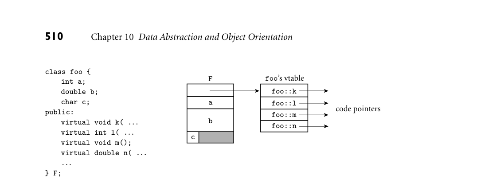
*Figure 10.3  Implementation of virtual methods. The representation of object F begins with the address of the vtable for  class foo. (All objects of this class will point to the same vtable.) The vtable itself consists of an array of addresses, one for the  code of each virtual method of the class. The remainder of F consists of the representations of its felds.*

```
class bar : public foo { 
B 
bar’s vtable
 
int w; 
public: 
void m() override; 
virtual double s( ... 
virtual char *t( ...
 
... 
} B;
```

foo::k

a

foo::l

bar::m  code pointers

b

foo::n  bar::s

w  c

bar::t

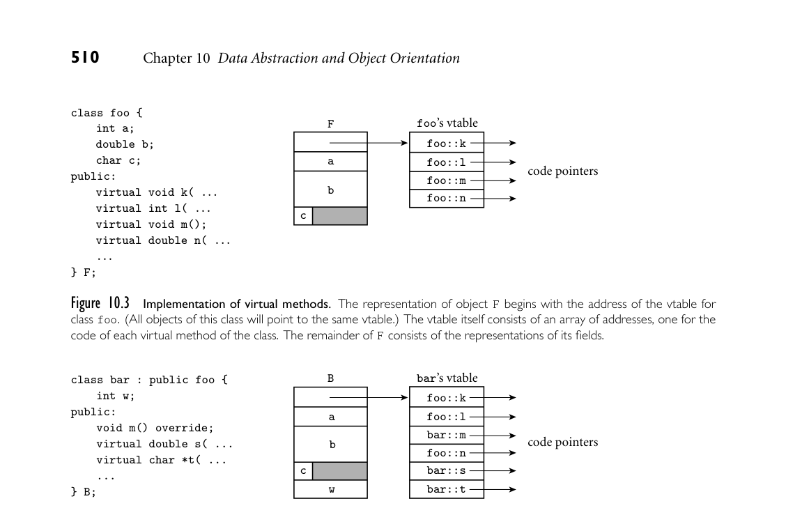
*Figure 10.4  Implementation of single inheritance. As in Figure 10.3, the representation of object B begins with the address of  its class’s vtable. The frst four entries in the table represent the same members as they do for foo, except that one—m—has  been overridden and now contains the address of the code for a different subroutine. Additional felds of bar follow the ones  inherited from foo in the representation of B; additional virtual methods follow the ones inherited from foo in the vtable of  class bar.*

r1 := f  r2 := ∗r1  –– vtable address  r2 := ∗(r2 + (3−1) × 4)  –– assuming 4 = sizeof (address)  call ∗r2

## On a typical modern machine this calling sequence is two instructions (both of  which access memory) longer than a call to a statically identifed method. The  extra overhead can be avoided whenever the compiler can deduce the type of the  relevant object at compile time. The deduction is trivial for calls to methods of  object-valued variables (as opposed to references and pointers).  ■

```
EXAMPLE 10.46 
If bar is derived from foo, we place its additional felds at the end of the 
Implementation of single 
“record” that represents it. We create a vtable for bar by copying the vtable for 
inheritance 
foo, replacing the entries of any virtual methods overridden by bar, and appending entries for any virtual methods introduced in bar (see Figure 10.4). 
If we 
have an object of class bar we can safely assign its address into a variable of type 
foo*:
```

```
class foo { ... 
class bar : public foo { ... 
... 
foo F; 
bar B; 
foo* q; 
bar* s; 
... 
q = &B; 
// ok; references through q will use prefixes 
// of B's data space and vtable 
s = &F; 
// static semantic error; F lacks the additional 
// data and vtable entries of a bar
```

```
In C++ (as in all statically typed object-oriented languages), the compiler can 
verify the type correctness of this code statically. It may not know what the class 
of the object referred to by q will be at run time, but it knows that it will either be 
foo or something derived (directly or indirectly) from foo, and  this  ensures  that  
it will have all the members that may be accessed by foo-specifc code. 
■
```

EXAMPLE 10.47  C++ allows “backward” assignments by means of a dynamic_cast operator:  Casts in C++

s = dynamic_cast<bar*>(q);  // performs a run-time check

If the run-time check fails, s is assigned a null pointer. For backward compatibility C++ also supports traditional C-style casts of object pointers and references:

s = (bar*) q;  // permitted, but risky

With a C-style cast it is up to the programmer to ensure that the actual object  involved is of an appropriate type: no dynamic semantic check is performed.  ■  Java and C# employ the traditional cast notation, but perform the dy-

EXAMPLE 10.48  namic check. Eiffel has a reverse assignment operator, ?=, which (like the C++  Reverse assignment in  dynamic_cast) assigns an object reference into a variable if and only if the type  Eiffel and C#  at run time is acceptable:

DESIGN & IMPLEMENTATION

## 10.6 Reverse assignment  Implementations of Eiffel, Java, C#, and C++ support dynamic checks on reverse assignment by including in each vtable the address of a run-time type descriptor. In C++, dynamic_cast is permitted only on pointers and references  of polymorphic types (classes with virtual methods), since objects of nonpolymorphic types do not have vtables. A separate static_cast operation can  be used on nonpolymorphic types, but it performs no run-time check, and is  thus inherently unsafe when applied to a pointer of a derived class type.

```
class foo ... 
class bar inherit foo ... 
... 
f :  foo  
b :  bar  
... 
f := b 
-- always ok 
b ?= f 
-- reverse assignment: b gets f if f refers to a bar object 
-- at run time; otherwise b gets void
```

C# provides an as operator that performs a similar function.  ■  As noted in Section 7.3, Smalltalk employs “duck typing”: variables are untyped references, and a reference to any object may be assigned into any variable. Only when code actually attempts to invoke an operation (send a “message”) at run time does the language implementation check to see whether the  operation is supported by the object; if so, the object’s type is assumed to be acceptable. The implementation is straightforward: felds of an object are never

DESIGN & IMPLEMENTATION

## 10.7 The fragile base class problem  Under certain circumstances, it can be desirable to perform method lookup at  run time even when the language permits compile-time lookup. In Java, for  example, dynamic lookup (or “just-in-time” compilation) can help to avoid  important instances of the fragile base class problem, in which seemingly benign changes to a base class may break the behavior of a derived class.

Java implementations depend on the presence of a large standard library.  This library is expected to evolve over time. Though the designers will presumably be careful to maximize backward compatibility—seldom if ever deleting  any members of a class—it is likely that users of old versions of the library will  on occasion attempt to run code that was written with a new version of the  library in mind. In such a situation it would be disastrous to rely on static assumptions about the representation of library classes: code that tries to use a  newly added library feature could end up accessing memory beyond the end of  the available representation. Run-time method lookup, by contrast (or compilation performed against the currently available version of the library), will  produce a helpful “member not found in your version of the class” dynamic  error message.

```
A variety of other techniques can be used to guard against aspects of the 
fragile base class problem. In Objective-C, for example, modifcations to a library class typically take the form of a separately compiled extension called 
a category, which is loaded into a program at run time. The loading mechanism updates the dictionary in which the runtime system performs dynamic 
method lookup. Without the category, attempts to use the new functionality 
will automatically elicit a “method not found” error.
```

public; methods provide the only means of object interaction. The representation of an object begins with the address of a type descriptor. The type descriptor  contains a dictionary that maps method names to code fragments. At run time,  the Smalltalk interpreter performs a lookup operation in the dictionary to see if  the method is supported. If not, it generates a “message not understood” error—  the equivalent of a type-clash error in Lisp. CLOS, Objective-C, Swift, and the  object-oriented scripting languages provide similar semantics, and invite similar  implementations. The dynamic approach is arguably more fexible than the static,  but it imposes signifcant cost when methods are small, and delays the reporting  of errors.

In addition to imposing the overhead of indirection, virtual methods often  preclude the in-line expansion of subroutines at compile time. The lack of in-line  subroutines can be a serious performance problem when subroutines are small  and frequently called. Like C, C++ attempts to avoid run-time overhead whenever possible: hence its use of static method binding as the default, and its heavy  reliance on object-valued variables, for which even virtual methods can be dispatched at compile time.

## 10.4.4 Object Closures

We have noted (in Section 3.6.4 and elsewhere) that object closures can be used  in an object-oriented language to achieve roughly the same effect as subroutine  closures in a language with nested subroutines—namely, to encapsulate a method  with context for later execution. It should be noted that this mechanism relies, for

EXAMPLE 10.49  its full generality, on dynamic method binding. Recall the plus_x object closure  Virtual methods in an  from Example 3.36, here adapted to the apply_to_A code of Example 9.23, and  object closure  rewritten in generic form:

```
template<typename T> 
class un_op { 
public:
```

virtual T operator()(T i) const = 0;  };

```
class plus_x : public un_op<int> { 
const int x; 
public: 
plus_x(int n) : x(n) { } 
virtual int operator()(int i) const { return i + x; } 
};
```

void apply_to_A(const un_op<int>& f, int A[], int A_size) {  int i;  for (i = 0; i < A_size; i++) A[i] = f(A[i]);  }  ...

int A[10];  apply_to_A(plus_x(2), A, 10);

Any object derived from un_op<int> can be passed to apply_to_A. The “right”  function will always be called because operator() is virtual.  ■  A particularly useful idiom for many applications is to encapsulate a method

```
EXAMPLE 10.50 
and its arguments in an object closure for later execution. Suppose, for example, 
Encapsulating arguments 
that we are writing a discrete event simulation, as described in Section C 9.5.4. We 
might like a general mechanism that allows us to schedule a call to an arbitrary 
subroutine, with an arbitrary set of parameters, to occur at some future point in 
time. If the subroutines we want to have called vary in their numbers and types 
of parameters, we won’t be able to pass them to a general-purpose schedule_at 
routine. We can solve the problem with object closures, as shown in Figure 10.5. 
This technique is suffciently common that C++11 supports it with standard library routines. The fn_call and call_foo classes of Figure 10.5 could be omitted in C++11. Function schedule_at would then  be defned  to  take an  object  of  
class std::function<void()> (function object encapsulating a function to be 
called with zero arguments) as its frst parameter. Object cf, which Figure 10.5 
passes in that frst parameter position, would be declared as
```

std::function<void()> cf = std::bind(foo, 3, 3.14, 'x');

The bind routine (an automatically instantiated generic function) encapsulates  its frst parameter (a function) together with the arguments that should eventually  be passed to that function. The standard library even provides a “placeholder”  mechanism (not shown here) that allows the programmer to bind only a subset  of the function’s parameters, so that parameters eventually passed to the function  object can be used to fll in the remaining positions.  ■  Object closures are commonly used in Java (and several other languages) to  encapsulate start-up arguments for newly created threads of control (more on  this in Section 13.2.3). They can also be used (as noted in Exploration 6.46) to  implement iterators via the visitor pattern.

## 3CHECK YOUR UNDERSTANDING  31. Explain the difference between dynamic and static method binding (i.e., be­

tween virtual and nonvirtual methods).  32. Summarize the fundamental argument for dynamic method binding. Why  do C++ and C# use static method binding by default?  33. Explain the distinction between redefining and overriding a method.

```
34. What  is  a  class-wide type in Ada 95? 
35. Explain the connection between dynamic method binding and polymor­
```

phism.

```
class fn_call { 
public:
```

virtual void operator()() = 0;  };  void schedule_at(fn_call& fc, time t) {

...  }  ...  void foo(int a, double b, char c) {

```
... 
} 
class call_foo : public fn_call {
```

int arg1;  double arg2;  char arg3;  public:

call_foo(int a, double b, char c) :  // constructor  arg1(a), arg2(b), arg3(c) {  // member initialization is all that is required  }  void operator()() {  foo(arg1, arg2, arg3);  }  };  ...  call_foo cf(3, 3.14, 'x');  // declaration/constructor call  schedule_at(cf, now() + delay);

// at some point in the future, the discrete event system  // will call cf.operator()(), which will cause a call to  // foo(3, 3.14, 'x')

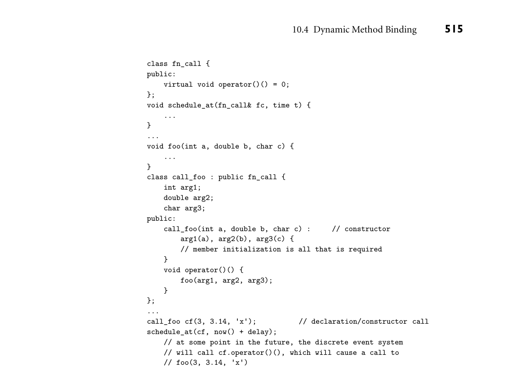
*Figure 10.5  Subroutine pointers and virtual methods. Class call_foo encapsulates a subroutine pointer and values to be passed to the subroutine. It exports a parameter-less subroutine  that can be used to trigger the encapsulated call.*

```
36. What  is  an  abstract method (also called a pure virtual method in C++ and a 
deferred feature in Eiffel)? 
37. What  is  reverse assignment? Why does it require a run-time check?
```

## 38. What  is  a  vtable? How is it used?  39. What is the fragile base class problem?

```
40. What  is  an  abstract (deferred) class? 
41. Explain the importance of virtual methods for object closures.
```

### 10.5 Mix-In Inheritance

```
When building an object-oriented system, it is often diffcult to design a perfect 
inheritance tree, in which every class has exactly one parent. A cat may be an 
animal, a  pet, a  family_member, or  an  object_of_affection. A  widget in 
the company database may be a sortable_object (from the reporting system’s 
perspective), a graphable_object (from the window system’s perspective), or 
a storable_object (from the fle system’s perspective); how do we choose just 
one?
```

```
In the general case, we could imagine allowing a class to have an arbitrary 
number of parents, each of which could provide it with both felds and methods 
(both abstract and concrete). This sort of “true” multiple inheritance is provided 
by several languages, including C++, Eiffel, CLOS, OCaml, and Python; we will 
consider it in Section 10.6. Unfortunately, it introduces considerable complexity 
in both language semantics and run-time implementation. In practice, a more 
limited mechanism, known as mix-in inheritance, is often all we really need.
```

```
EXAMPLE 10.51 
Consider our widgets, for example. Odds are, the reporting system doesn’t 
The motivation for 
really defne what a widget is; it simply needs to be able to manipulate widgets in 
interfaces 
certain well-defned ways—to sort them, for example. Likewise, the windowing 
system probably doesn’t need to provide any state or functionality for widgets; it 
simply needs to be able to display them on a screen. To capture these sorts of requirements, a language with mix-in inheritance allows the programmer to defne 
the interface that a class must provide in order for its objects to be used in certain 
contexts. For widgets, the reporting system might defne a sortable_object 
interface; the window system might defne a graphable_object interface; the 
fle system might defne a storable_object interface. No actual functionality would be provided by any of the interfaces: the designer of the widget class 
would need to provide appropriate implementations. 
■ 
In effect—as we noted in Section 10.4.2—an interface is a class containing only 
abstract methods—no felds or method bodies. So long as it inherits from only 
one “real” parent, a class can “mix in” an arbitrary number of interfaces. If a formal parameter of a subroutine is declared to have an interface type, then any class 
that implements (inherits from) that interface can be passed as the corresponding 
actual parameter. The classes of objects that can legitimately be passed need not 
have a common class ancestor.
```

In recent years, mix-ins have become a common approach—arguably the  dominant approach—to multiple inheritance. Though details vary from one language to another, interfaces appear in Java, C#, Scala, Objective-C, Swift, Go,  Ada 2005, and Ruby, among others.

```
EXAMPLE 10.52 
Elaborating on our widget example, suppose that we have been given generalMixing interfaces into a 
purpose Java code that will sort objects according to some textual feld, display a 
derived class 
graphic representation of an object within a web browser window (hiding and 
refreshing as appropriate), and store references to objects by name in a dictionary 
data structure. Each of these capabilities would be represented by an interface.
```

```
If we have already developed some complicated class of widget objects, we can 
make use of the general-purpose code by mixing the appropriate interfaces into 
classes derived from widget, as shown in Figure 10.6. 
■
```

## 10.5.1 Implementation

```
In a language like Ruby, Objective-C, or Swift, which uses dynamic method 
lookup, the methods of an interface can simply be added to the method dictionary of any class that implements the interface. In any context that requires the 
interface type, the usual lookup mechanism will fnd the proper methods. In a 
language with fully static typing, in which pointers to methods are expected to lie 
at known vtable offsets, new machinery is required. The challenge boils down to 
a need for multiple views of an object.
```

```
In Figure 10.6, method dictionary.insert expects a storable_object 
view of its parameter—a way to fnd the parameter’s get_stored_name method. 
The get_stored_name method, however, is implementedby augmented_widget, 
and will expect an augmented_widget view of its this parameter—a way to fnd 
the object’s felds and other methods. Given that augmented_widget implements 
three different interfaces, there is no way that a single vtable can suffce: its frst 
entry can’t be the frst method of sortable_object, graphable_object, and  
storable_object simultaneously.
```

EXAMPLE 10.53

Compile-time  implementation of mix-in  inheritance

The most common solution, shown in Figure 10.7, is to include three extra  vtable pointers in each augmented_widget object—one for each of the implemented interfaces. For each interface view we can then use a pointer to the place  within the object where the corresponding vtable pointer appears. The offset of  that pointer from the beginning of the object is known as the “this correction”;  it is stored at the beginning of the vtable.

Suppose now that we wish to call dictionary.insert on an augmented_  widget object w, whose address is currently in register r1. The compiler, which  knows the offset c of w’s storable_object vtable pointer, will add c to r1 before passing it to insert. So far so good. What happens when insert calls  storable_object.get_stored_name?  Assuming that the storable_object  view of w is available in, say, register r1, the compiler will generate code that looks  something like this:

r2 := ∗r1  –– vtable address  r3 := ∗r2  –– this correction  r3 +:= r1  –– address of w  call ∗(r2+4)  –– method address

Here we have assumed that the this correction occupies the frst four bytes  of the vtable, and that the address of get_stored_name lies immediately after it, in the table’s frst regular slot. We have also assumed that this should  be passed in register r3, and that there are no other arguments. On a typical modern machine this code is two instructions (a load and a subtraction)

```
public class widget { ... 
} 
interface sortable_object {
```

```
String get_sort_name(); 
bool less_than(sortable_object o); 
// All methods of an interface are automatically public. 
} 
interface graphable_object { 
void display_at(Graphics g, int x, int y); 
// Graphics is a standard library class that provides a context 
// in which to render graphical objects. 
} 
interface storable_object {
```

```
String get_stored_name(); 
} 
class named_widget extends widget implements sortable_object {
```

public String name;  public String get_sort_name() {return name;}  public bool less_than(sortable_object o) {

```
return (name.compareTo(o.get_sort_name()) < 0); 
// compareTo is a method of the standard library class String. 
} 
} 
class augmented_widget extends named_widget
```

implements graphable_object, storable_object {  ...  // more data members  public void display_at(Graphics g, int x, int y) {

```
... 
// series of calls to methods of g 
} 
public String get_stored_name() {return name;} 
} 
... 
class sorted_list {
```

```
public void insert(sortable_object o) { ... 
public sortable_object first() { ... 
... 
} 
class browser_window extends Frame { 
// Frame is the standard library class for windows. 
public void add_to_window(graphable_object o) { ... 
... 
} 
class dictionary { 
public void insert(storable_object o) { ... 
public storable_object lookup(String name) { ... 
... 
}
```

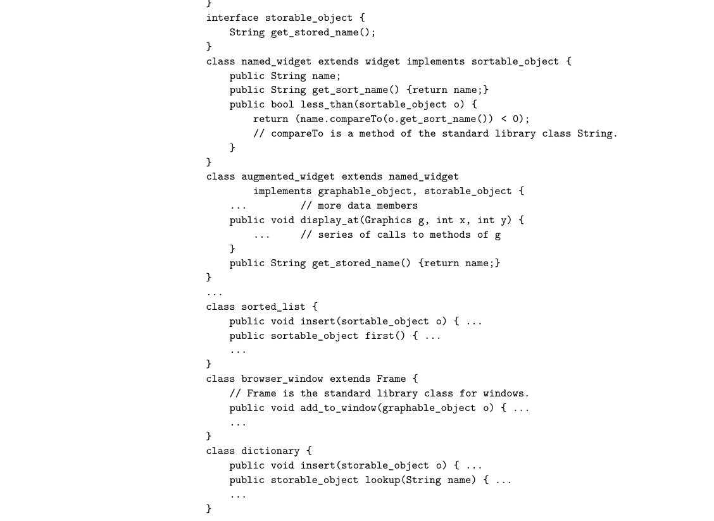
*Figure 10.6  Interface classes in Java. By implementing the sortable_object interface in  named_widget and the graphable_object and storable_object interfaces in augmented_  widget, we obtain the ability to pass objects of those classes to and from such routines as  sorted_list.insert, browser_window.add_to_window, and  dictionary.insert.*

augmented_widget

object  vtable

widget view

augmented_  widget part

a  b

widget fields

sortable_object view

name  −a

c

sortable_  object part

graphable_object view

storable_object view

−b

graphable_  object part

−c

storable_  object part

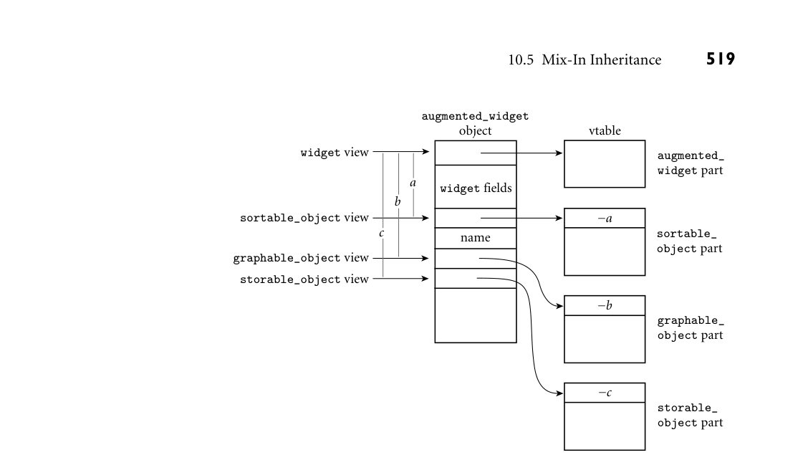
*Figure 10.7  Implementation of mix-in inheritance. Objects of class augmented_widget contain four vtable addresses, one for the class itself (as in Figure 10.3), and three for the implemented interfaces. The view of the object that is passed to interface routines points directly  at the relevant vtable pointer. The vtable then begins with a “this correction” offset, used to  regenerate a pointer to the object itself.*

longer than the code required with single inheritance. Once it executes, however,  augmented_widget.get_stored_name will be running with exactly the parameter it expects: a reference to an augmented_widget object.  ■

## 10.5.2 Extensions

The description of interfaces above refects historical versions of Java, with one  omission: in addition to abstract methods, an interface can defne static final  (constant) felds. Because such felds can never change, they introduce no runtime complexity or overhead—the compiler can, effectively, expand them in place  wherever they are used.

```
Beginning with Java 8, interfaces have also been extended to allow static 
and default methods, both of which are given bodies—code—in the declaration of the interface. A static method, like a static final feld, introduces 
no implementation complexity: it requires no access to object felds, so there is 
no ambiguity about what view to pass as this—there is no this parameter. Default methods are a bit more tricky. Their code is intended to be used by any 
class that does not override it. This convention is particularly valuable for library
```

```
maintainers: it allows new methods to be added to an existing library interface 
without breaking existing user code, which would otherwise have to be updated 
to implement the new methods in any class that inherits from the interface.
```

```
EXAMPLE 10.54 
Suppose, for example, that we are engaged in a localization project, which 
Use of default methods 
aims to adapt some existing code to multiple languages and cultures. In the 
code of Figure 10.6, we might wish to add a new get_local_name method to 
the storable_object interface. Given a reference to a storable_object, updated user code could then call this new method, rather than get_stored_name, 
to obtain a string appropriate for use in the local context. A concrete class that 
inherits from storable_object, and that has been updated as part of the localization project, might provide its own implementation of get_local_name. But  
what about classes that haven’t been updated yet (or that may never be updated)? 
These could leverage default methods to fall back on some general-purpose translation mechanism:
```

default String get_local_name() {  return backup_translation(get_stored_name());  }

```
To use the default, each concrete class that inherits from storable_object 
would need to be recompiled, but its source code could remain unchanged. 
■ 
Because a default method is defned within the interface declaration, it can see 
only the methods and (static) felds of the interface itself (along with any visible 
names from surrounding scopes). In particular, it has no access to other members of classes that inherit from the interface, and thus no need of an object view 
that would allow it to fnd those members. At the same time, the method does
```

```
EXAMPLE 10.55 
require access to the object’s interface-specifc vtable. In our storable_object 
Implementation of 
example, the default get_local_name has to be  able  to fnd, and  call,  the  version  
default methods 
of get_stored_name defned by the concrete class. The usual way to implement 
this access depends on tiny forwarding routines: for each class C that inherits 
from storable_object and that needs the default code, the compiler generates a 
static, C-specifc forwarding routine that accepts the concrete-class-specifc this 
parameter, adds back in the this correction that the regular calling sequence just 
subtracted out, and passes the resulting pointer-to-vtable-pointer to the default 
method. 
■ 
As it turns out, the equivalent of default methods has long been provided by 
the Scala programming language, whose mix-ins are known as traits. In  fact,  
traits support not only default methods but also mutable felds. Rather than try to 
create a view that would make these felds directly accessible, the Scala compiler 
generates, for each concrete class that inherits from the trait, a pair of hidden 
accessor methods analogous to the properties of C# (Example 10.7). References 
to the accessor methods are then included in the interface-specifc vtable, where 
they can be called by default methods. In any class that does not provide its own 
defnition of a trait feld, the compiler creates a new private feld to be used by the 
accessor methods.
```

### 10.6 True Multiple Inheritance

```
As described in Section 10.5, mix-in inheritance allows an interface to specify 
functionality that must be provided by an inheriting class in order for objects of 
that class to be used in a given context. Crucially, an interface does not, for the 
most part, provide that functionality itself. Even default methods serve mainly to 
orchestrate access to functionality provided by the inheriting class.
```

At times it can be useful to inherit real functionality from more than one base

```
EXAMPLE 10.56 
class. Suppose, for example, that our administrative computing system needs 
Deriving from two base 
to keep track of information about every system user, and that the university 
classes 
provides every student with an account. It may then be desirable to derive class 
student from both person and system_user.  In C++  we  can say
```

class student : public person, public system_user { ...

```
Now an object of class student will have all the felds and methods of both a 
person and a system_user. The declaration in Eiffel is analogous:
```

```
class student 
inherit 
person 
system_user 
feature 
... 
■
```

True multiple inheritance appears in several other languages as well, including  CLOS, OCaml, and Python. Many older languages, including Simula, Smalltalk,  Modula-3, and Oberon, provided only single inheritance. Mix-in inheritance is a  common compromise.

IN MORE DEPTH

Multiple inheritance introduces a wealth of semantic and pragmatic issues, which  we consider on the companion site:

```
Suppose two parent classes provide a method with the same name. Which one 
do we use in the child? Can we access both? 
Suppose two parent classes are both derived from some common “grandparent” class. Does the “grandchild” have one copy or two of the grandparent’s 
felds? 
Our implementation of single inheritance relies on the fact that the representation of an object of the parent class is a prefx of the representation of an 
object of a derived class. With multiple inheritance, how can each parent be a 
prefx of the child?
```

Multiple inheritance with a common “grandparent” is known as repeated inheritance. Repeated inheritance with separate copies of the grandparent is known  as replicated inheritance; repeated inheritance with a single copy of the grandparent is known as shared inheritance. Shared inheritance is the default in Eiffel.  Replicated inheritance is the default in C++. Both languages allow the programmer to obtain the other option when desired.

### 10.7 Object-Oriented Programming Revisited

At the beginning of this chapter, we characterized object-oriented programming  in terms of three fundamental concepts: encapsulation, inheritance, and dynamic  method binding. Encapsulation allows the implementation details of an abstraction to be hidden behind a simple interface. Inheritance allows a new abstraction  to be defned as an extension or refnement of some existing abstraction, obtaining some or all of its characteristics automatically. Dynamic method binding allows the new abstraction to display its new behavior even when used in a context  that expects the old abstraction.

Different programming languages support these fundamental concepts to different degrees. In particular, languages differ in the extent to which they require  the programmer to write in an object-oriented style. Some authors argue that  a truly object-oriented language should make it diffcult or impossible to write  programs that are not object-oriented. From this purist point of view, an objectoriented language should present a uniform object model of computing, in which  every data type is a class, every variable is a reference to an object, and every  subroutine is an object method. Moreover, objects should be thought of in anthropomorphic terms: as active entities responsible for all computation.

Smalltalk and Ruby come close to this ideal. In fact, as described in the subsection below (mostly on the companion site), even such control-fow mechanisms  as selection and iteration are modeled as method invocations in Smalltalk. On the  other hand, Ada 95 and Fortran 2003 are probably best characterized as von Neumann languages that permit the programmer to write in an object-oriented style  if desired.

So what about C++? It certainly has a wealth of features, including several  (multiple inheritance, elaborate access control, strict initialization order, destructors, generics) that are useful in object-oriented programs and that are not found  in Smalltalk. At the same time, it has a wealth of problematic wrinkles. Its  simple types are not classes. It has subroutines outside of classes. It uses static  method binding and replicated multiple inheritance by default, rather than the  more costly virtual alternatives. Its unchecked C-style type casts provide a major loophole for type checking and access control. Its lack of garbage collection is  a major obstacle to the creation of correct, self-contained abstractions. Probably  most serious of all, C++ retains all of the low-level mechanisms of C, allowing  the programmer to escape or subvert the object-oriented model of programming

entirely. It has been suggested that the best C++ programmers are those who did  not learn C frst: they are not as tempted to write “C-style” programs in the newer  language. On balance, it is probably safe to say that C++ is an object-oriented  language in the same sense that Common Lisp is a functional language. With the  possible exception of garbage collection, C++ provides all of the necessary tools,  but it requires substantial discipline on the part of the programmer to use those  tools “correctly.”

## 10.7.1 The Object Model of Smalltalk

Historically, Smalltalk was considered the canonical object-oriented language.  The original version of the language was designed by Alan Kay as part of his doctoral work at the University of Utah in the late 1960s. It was then adopted by the  Software Concepts Group at the Xerox Palo Alto Research Center (PARC), and  went through fve major revisions in the 1970s, culminating in the Smalltalk-80  language.7

IN MORE DEPTH

We have mentioned several features of Smalltalk in previous sections. A somewhat longer treatment can be found on the companion site, where we focus in  particular on Smalltalk’s anthropomorphic programming model. A full introduction to the language is beyond the scope of this book.

## 3CHECK YOUR UNDERSTANDING  42. What  is  mix-in inheritance? What problem does it solve?

```
43. Outline a possible implementation of mix-in inheritance for a language with 
statically typed objects. Explain in particular the need for interface-specifc 
views of  an  object.  
44. Describe how mix-ins (and their implementation) can be extended with de­
```

fault method implementations, static (constant) felds, and even mutable  felds.  45. What does true multiple inheritance make possible that mix-in inheritance  does not?

7  Alan Kay (1940–) joined PARC in 1972. In addition to developing Smalltalk and its graphical  user interface, he conceived and promoted the idea of the laptop computer, well before it was  feasible to build one. He became a Fellow at Apple Computer in 1984, and has subsequently held  positions at Disney and Hewlett-Packard. He received the ACM Turing Award in 2003.

```
46. What  is  repeated inheritance? What is the distinction between replicated and 
shared repeated inheritance? 
47.  What does it mean  for  a language  to provide  a  uniform object model? Name  
two languages that do so.
```

### 10.8 Summary and Concluding Remarks

This has been the last of our six core chapters on language design: names (Chapter 3), control fow (Chapter 6), type systems (Chapter 7), composite types  (Chapter 8), subroutines (Chapter 9), and objects (Chapter 10).

```
We began in Section 10.1 by identifying three fundamental concepts of objectoriented programming: encapsulation, inheritance, and  dynamic method binding. 
We also introduced the terminology of classes, objects, and methods. We had 
already seen encapsulation in the modules of Chapter 3. Encapsulation allows 
the details of a complicated data abstraction to be hidden behind a comparatively 
simple interface. Inheritance extends the utility of encapsulation by making it 
easy for programmers to defne new abstractions as refnements or extensions of 
existing abstractions. Inheritance provides a natural basis for polymorphic subroutines: if a subroutine expects an instance of a given class as argument, then an 
object of any class derived from the expected one can be used instead (assuming 
that it retains the entire existing interface). Dynamic method binding extends this 
form of polymorphism by arranging for a call to one of the parameter’s methods 
to use the implementation associated with the class of the actual object at run 
time, rather than the implementation associated with the declared class of the parameter. We noted that some languages, including Modula-3, Oberon, Ada 95, 
and Fortran 2003, support object orientation through a type extension mechanism, in which encapsulation is associated with modules, but inheritance and 
dynamic method binding are associated with a special form of record.
```

In later sections we covered object initialization and fnalization, dynamic  method binding, and (on the companion site) multiple inheritance in some detail. In many cases we discovered tradeoffs between functionality on the one hand  and simplicity and execution speed on the other. Treating variables as references,  rather than values, often leads to simpler semantics, but requires extra indirection. Garbage collection, as previously noted in Section 8.5.3, dramatically eases  the creation and maintenance of software, but imposes run-time costs. Dynamic  method binding requires (in the general case) that methods be dispatched using vtables or some other lookup mechanism. Fully general implementations of  multiple inheritance tend to impose overheads even when unused.

In several cases we saw time/space tradeoffs as well. In-line subroutines, as previously noted in Section 9.2.4, can dramatically improve the performance of code  with many small subroutines, not only by eliminating the overhead of the subroutine calls themselves, but by allowing register allocation, common subexpres­

sion analysis, and other “global” code improvements to be applied across calls.  At the same time, in-line expansion generally increases the size of object code.  Exercises C 10.28 and C 10.30 explore similar tradeoffs in the implementation of  multiple inheritance.

Historically, Smalltalk was widely regarded as the purest and most fexible of  the object-oriented languages. Its lack of compile-time type checking, however,  together with its “message-based” model of computation and its need for dynamic method lookup, tended to make its implementations rather slow. C++,  with its object-valued variables, default static binding, minimal dynamic checks,  and high-quality compilers, was largely responsible for popularizing objectoriented programming in the 1990s. Today objects are ubiquitous—in statically  typed, compiled languages like Java and C#; in dynamically typed languages like  Python, Ruby, PHP, and JavaScript; and even in systems based on binary components or human-readable service invocations over the World Wide Web (more on  these in the Bibliographic Notes).

### 10.9 Exercises

## 10.1  Some language designers argue that object orientation eliminates the need  for nested subroutines. Do you agree? Why or why not?  10.2  Design a class hierarchy to represent syntax trees for the CFG of Figure 4.5. Provide a method in each class to return the value of a node.  Provide constructors that play the role of the make_leaf, make_un_op,  and make_bin_op subroutines.  10.3  Repeat the previous exercise, but using a variant record (union) type to  represent syntax tree nodes. Repeat again using type extensions. Compare the three solutions in terms of clarity, abstraction, type safety, and  extensibility.  10.4  Using the C# indexer mechanism, create a hash table class that can be  indexed like an array. (In effect, create a simple version of the System  .Collections.Hashtable container class.) Alternatively, use an overloaded version of operator[] to build a similar class in C++.  10.5  In the spirit of Example 10.8, write a double-ended queue (deque) abstraction (pronounced “deck”), derived from a doubly linked list base class.  10.6  Use templates (generics) to abstract your solutions to the previous two  questions over the type of data in the container.  10.7  Repeat Exercise 10.5 in Python or Ruby.  Write a simple program to  demonstrate that generics are not needed to abstract over types. What  happens if you mix objects of different types in the same deque?  10.8  When using the list class of Example 10.17, the typical C++ programmer  will use a pointer type for generic parameter V, so that  list_nodes point   to the elements of the list. An alternative implementation would include

```
next and prev pointers for the list within the elements themselves— 
typically by arranging for the element type to inherit from something like 
the gp_list_node class of Example 10.14. The result is sometimes called 
an intrusive list. 
(a) Explain how you might build intrusive lists in C++ without requir­
```

```
ing users to pepper their code with explicit type casts. Hint: given 
multiple inheritance, you will probably need to determine, for each 
concrete element type, the offset within the representation of the type 
at which the next and prev pointers appear. For further ideas, search 
for information on the boost::intrusive::list class of the popular Boost library. 
(b) Discuss the relative advantages and disadvantages of intrusive and 
non-intrusive lists. 
10.9 
Can you emulate the inner class of Example 10.22 in C# or C++? (Hint: 
You’ll need an explicit version of Java’s hidden reference to the surrounding class.) 
10.10 
Write a package body for the list abstraction of Figure 10.2. 
10.11 
Rewrite the list and queue abstractions in Eiffel, Java, and/or C#. 
10.12 
Using C++, Java, or C#, implement a Complex class in the spirit of Example 10.25. Discuss the time and space tradeoffs between maintaining all 
four values (x, y,  , and  θ) in the state of the object, or keeping only two 
and computing the others on demand. 
10.13 
Repeat the previous two exercises for Python and/or Ruby. 
10.14 
Compare Java final methods with C++ nonvirtual methods. How are 
they the same? How are they different? 
10.15 
In several object-oriented languages, including C++ and Eiffel, a derived 
class can hide members of the base class. In C++, for example, we can 
declare a base class to be public, protected, or  private:
```

```
class B : public A { ... 
// public members of A are public members of B 
// protected members of A are protected members of B 
... 
class C : protected A { ...
```

```
// public and protected members of A are protected members of C 
... 
class D : private A { ...
```

// public and protected members of A are private members of D

In all cases, private members of A are inaccessible to methods of B, C,  or D.

```
Consider the impact of protected and private base classes on dynamic method binding. Under what circumstances can a reference to an 
object of class B, C, or  D be assigned into a variable of type A*?
```

## 10.16  What happens to the implementation of a class if we redefne a data member? For example, suppose we have

```
class foo { 
public: 
int a; 
char *b; 
}; 
... 
class bar : public foo { 
public:
```

float c;  int b;  };

```
Does the representation of a bar object contain one b feld or two? If two, 
are both accessible, or only one? Under what circumstances? 
10.17 
Discuss the relative merits of classes and type extensions. Which do you 
prefer? Why? 
10.18 
Building on the outline of Example 10.28, write a program that illustrates 
the difference between copy constructors and operator= in C++. Your 
code should include examples of each situation in which one of these 
may be called (don’t forget parameter passing and function returns). Instrument the copy constructors and assignment operators in each of your 
classes so that they will print their names when called. Run your program 
to verify that its behavior matches your expectations. 
10.19 
What do you think of the decision, in C++, C#, and Ada 95, to use static 
method binding, rather than dynamic, by default? Is the gain in implementation speed worth the loss in abstraction and reusability? Assuming that we sometimes want static binding, do you prefer the method-bymethod approach of C++ and C#, or the variable-by-variable approach of 
Ada 95? Why? 
10.20 
If foo is an abstract class in a C++ program, why is it acceptable to declare 
variables of type foo*, but  not  of  type  foo? 
10.21 
Consider the Java program shown in Figure 10.8. Assume that this is to be 
compiled to native code on a machine with 4-byte addresses.
```

(a) Draw a picture of the layout in memory of the object created at line

* Show all virtual function tables.
  (b) Give assembly-level pseudocode for the call to c.val at line 19. You
  may assume that the address of c is in register r1 immediately before
  the call, and that this same register should be used to pass the hidden
  this parameter. You may ignore the need to save and restore registers,
  and don’t worry about where to put the return value.

  1.
  interface Pingable {
  2.
  public void ping();
  3.
  }

```
4. 
class Counter implements Pingable { 
5. 
int count = 0; 
6. 
public void ping() { 
7. 
++count; 
8. 
} 
9. 
public int val() { 
10. 
return count; 
11. 
} 
12. 
}
```

```
13. 
public class Ping { 
14. 
public static void main(String args[]) { 
15. 
Counter c = new Counter(); 
16. 
c.ping(); 
17. 
c.ping(); 
18. 
int v = c.val(); 
19. 
System.out.println(v); 
20. 
} 
21. 
}
```

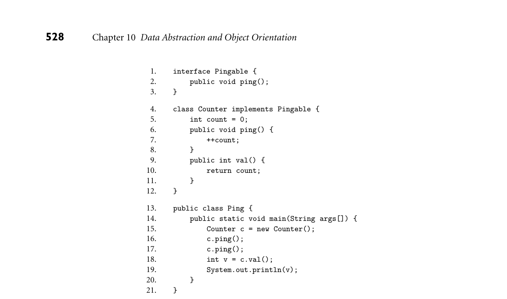
*Figure 10.8  A simple program in Java.*

## (c)  Give assembly-level pseudocode for the call to c.ping at line 17.  Again, assume that the address of c is in register r1, that this is the  same register that should be used to pass this, and  that  you  don’t   need to save or restore any registers.  (d) Give assembly-levelpseudocode for the body of method Counter.ping  (again ignoring register save/restore).

## 10.22  In Ruby, as in Java 8 or Scala, an interface (mix-in) can provide method  code as well as signatures. (It can’t provide data members; that would  be multiple inheritance.) Explain why dynamic typing makes this feature  more powerful than it is in the other languages.

## 10.23–10.31 In More Depth.

### 10.10 Explorations

## 10.32  Return for a moment to Exercise 3.7. Build a (more complete) C++ version of the singly linked list library of Figure 3.16. Discuss the issue of

```
storage management. Under what circumstances should one delete the elements of a list when deleting the list itself? What should the destructor for 
list_node do? Should it delete its data member? Should it recursively 
delete node next? 
10.33 
The discussion in this chapter has focused on the classic “class-based” approach to object-oriented programming languages, pioneered by Simula 
and Smalltalk. There is an alternative, “object-based” approach that dispenses with the notion of class. In object-based programming, methods 
are directly associated with objects, and new objects are created using existing objects as prototypes. Learn about Self, the canonical object-based 
programming language, and JavaScript, the most widely used. What do 
you think of their approach? How does it compare to the class-based alternative? You may fnd it helpful to read the coverage of JavaScript in 
Section 14.4.4. 
10.34 
As described in Section C 5.5.1, performance on pipelined processors depends critically on the ability of the hardware to successfully predict the 
outcome of branches, so that processing of subsequent instructions can 
begin before processing of the branch has completed. In object-oriented 
programs, however, knowing the outcome of a branch is not enough: because branches are so often dispatched through vtables, one must also predict the destination. Learn how branch prediction works in one or more 
modern processors. How well do these processors handle object-oriented 
programs? 
10.35 
Explore the implementation of mix-in inheritance in a just-in-time (native 
code) Java compiler. Does it follow the strategy of Section 10.5? How 
effcient is it? 
10.36 
Explore the implementation of mix-in inheritance in Ruby. How does it 
differ from that of Java? 
10.37 
Learn about type hierarchy analysis and type propagation, which  can  sometimes be used to infer the concrete type of objects at compile time, allowing the compiler to generate direct calls to methods, rather than indirecting through vtables. How effective are these techniques? What fraction of method calls are they able to optimize in typical benchmarks? 
What are their limitations? (You might start with the papers of Bacon 
and Sweeney [BS96] and Diwan et al. [DMM96].)
```

10.38–10.39 In More Depth.

### 10.11 Bibliographic Notes

Appendix A contains bibliographic citations for the various languages discussed  in this chapter, including Simula, Smalltalk, C++, Eiffel, Java, C#, Modula-3,  Oberon, Ada 95, Fortran 2003, Python, Ruby, Objective-C, Swift, Go, OCaml,

and CLOS. Other object-oriented versions of Lisp include Loops [BS83] and Flavors [Moo86].

Ellis and Stroustrup [ES90] provide extensive discussion of both semantic and  pragmatic issues for historic versions of C++. Parts III and IV of Stroustrup’s  text [Str13] provide a comprehensive survey of the design and implementation of  container classes in C++. Deutsch and Schiffman [DS84] describe techniques to  implement Smalltalk effciently. Borning and Ingalls [BI82] discuss multiple inheritance in an extension to Smalltalk-80. Strongtalk [Sun06] is a strongly typed  successor to Smalltalk developed at Sun Microsystems in the 1990s, and since released as open source. Gil and Sweeney [GS99] describe optimizations that can  be used to reduce the time and space complexity of multiple inheritance.

Dolby [Dol97] describes how an optimizing compiler can identify circumstances in which a nested object can be expanded (in the Eiffel sense) while retaining reference semantics. Bacon and Sweeney [BS96] and Diwan et al. [DMM96]  discuss techniques to infer the concrete type of objects at compile time, thereby  avoiding the overhead of vtable indirection. Driesen [Dri93] presents an alternative to vtables that requires whole-program analysis, but provides extremely  effcient method dispatch, even in languages with dynamic typing and multiple  inheritance.

Binary component systems allow code produced by arbitrary compilers for arbitrary languages to be joined together into a working program, often spanning  a distributed collection of machines. CORBA [Sie00] is a component standard  promulgated by the Object Management Group, a consortium of over 700 companies. .NET is a competing standard from Microsoft Corporation (microsoft.  com/net), based in part on their earlier ActiveX, DCOM, and OLE [Bro96] products. JavaBeans [Sun97] is a CORBA-compliant binary standard for components  written in Java.

With the explosion of web services, distributed systems have been designed to  exchange and manipulate objects in human-readable form. SOAP [Wor12], originally an acronym for Simple Object Access Protocol, is a standard for web-based  information transfer and method invocation. Its underlying data is typically encoded as XML (extensible markup language) [Wor06a]. In recent years, SOAP  has largely been supplanted by REST (Representational State Transfer) [Fie00], a  more informal set of conventions layered on top of ordinary HTTP. The underlying data in REST may take a variety of forms—most commonly JSON (JavaScript  Object Notation) [ECM13].

Many of the seminal papers in object-oriented programming have appeared  in the proceedings of the ACM OOPSLA conferences (Object-Oriented Programming Systems, Languages, and Applications), held annually since 1986, and published as special issues of ACM SIGPLAN Notices. Wegner [Weg90] enumerates  the defning characteristics of object orientation. Meyer [Mey92b, Sec. 21.10]  explains the rationale for dynamic method binding. Ungar and Smith [US91]  describe Self, the canonical object-based (as opposed to class-based) language.

