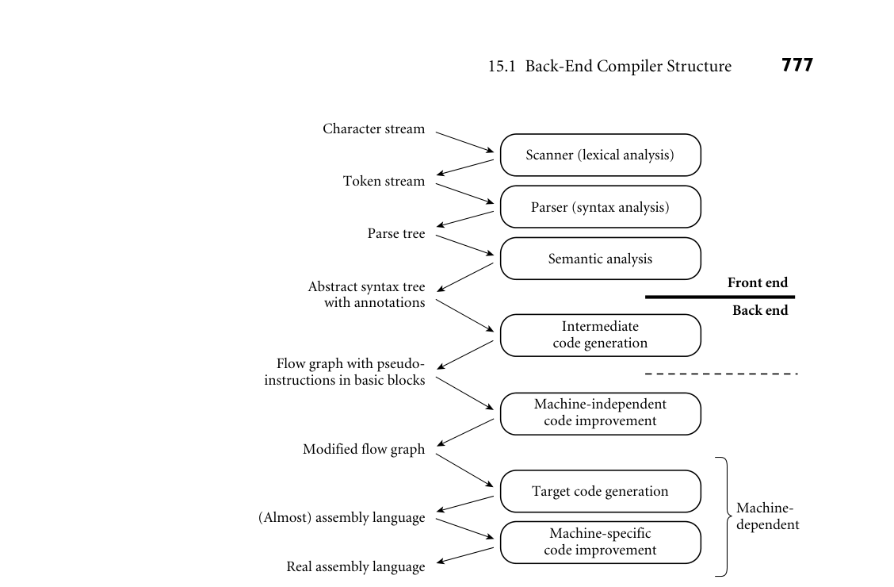
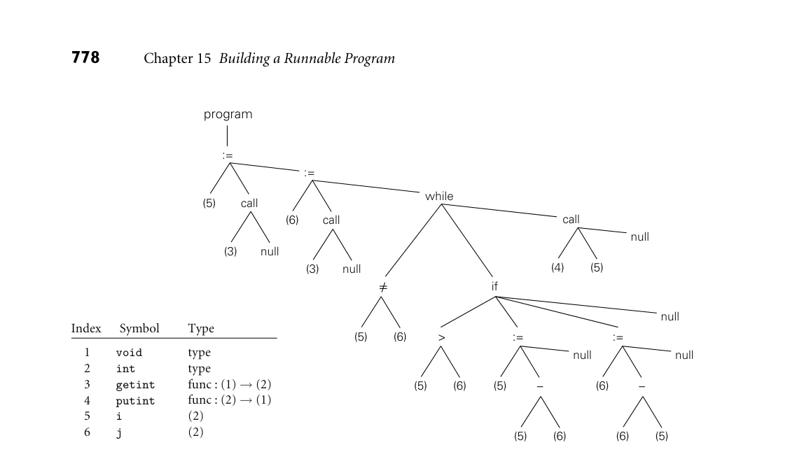
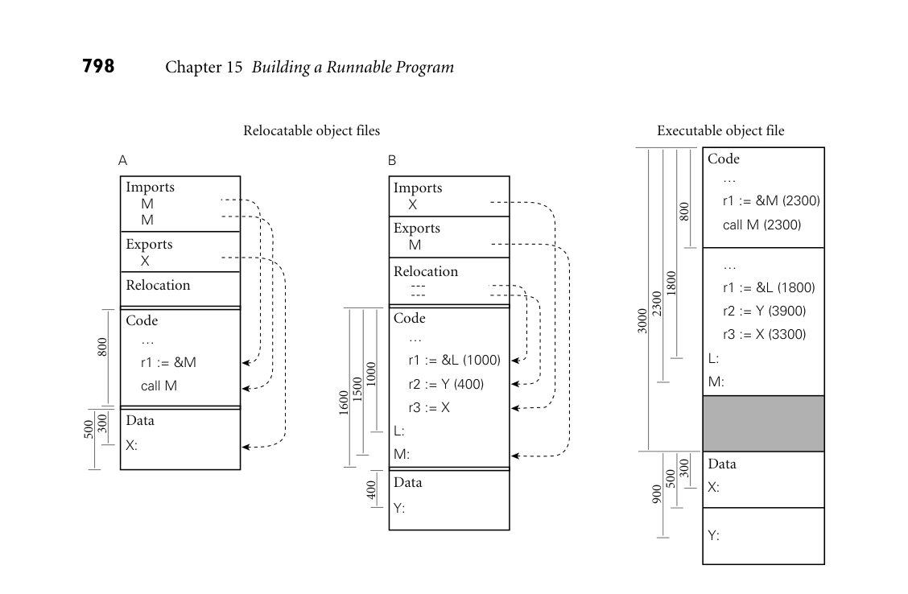

# Part IV: A Closer Look at Implementation

## **IV**

## **A Closer Look at Implementation**

In this, the final and shortest of the major parts of the text, we return our focus to implemen-
tation issues.
Chapter 15 considers the work that must be done, in the wake of semantic analysis, to
generate a runnable program. The first half of the chapter describes, in general terms, the
structure of the* back end* of the typical compiler, surveys intermediate program representations,
and uses the attribute grammar framework of Chapter 4 to describe how a compiler produces
assembly-level code. The second half of the chapter describes the structure of the typical process
address space, and explains how the* assembler* and* linker* transform the output of the compiler
into executable code.
In any nontrivial language implementation, the compiler assumes the existence of a large
body of preexisting code for storage management, exception handling, dynamic linking, and
the like. A more sophisticated language may require events, threads, and messages as well.
When the libraries that implement these features depend on knowledge of the compiler or of
the structure of the running program, they are said to constitute a* run-time system*. We consider
such systems in Chapter 16. We focus in particular on* virtual machines*; run-time manipulation
of machine code; and* reflection* mechanisms, which allow a program to reason about its run-
time structure and types.
The back-end compiler description in Chapter 15 is by necessity simplistic. Entire books
and courses are devoted to the fuller story, most of which focuses on the* code improvement* or
*optimization* techniques used to produce efficient code. Chapter 17 of the current text, con-
tained entirely on the companion site, provides an overview of code improvement. Since most
programmers will never write the back end of a compiler, the goal of Chapter 17 is more to
convey a sense of what the compiler does than exactly how it does it. Programmers who un-
derstand this material will be in a better position to “work with” the compiler, knowing what
is possible, what to expect in common cases, and how to avoid programming idioms that are
hard to optimize. Topics include local and “global” (procedure-level) redundancy elimination,
data flow analysis, loop optimization, and register allocation.

This page intentionally left blank

**775**

Phases of compilation
piler. The first three phases (scanning, parsing, and semantic analysis) are lan-
guage dependent; the last two (target code generation and machine-specific code
improvement) are machine dependent, and the middle two (intermediate code
generation and machine-independent code improvement) are (to first approxi-
mation) dependent on neither the language nor the machine. The scanner and
parser drive a set of action routines that build a syntax tree. The semantic analyzer
traverses the tree, performing all static semantic checks and initializing various at-
tributes (mainly symbol table pointers and indications of the need for dynamic
checks) of use to the back end.
■
While certain code improvements can be performed on syntax trees, a less hi-
erarchical representation of the program makes most code improvement easier.
Our example compiler therefore includes an explicit phase for intermediate code
generation. The code generator begins by grouping the nodes of the tree into
*basic blocks*, each of which consists of a maximal-length set of operations that
should execute sequentially at run time, with no branches in or out. It then cre-
ates a* control flow graph* in which the nodes are basic blocks and the arcs represent
interblock control flow. Within each basic block, operations are represented as
instructions for an idealized machine with an unlimited number of registers. We
will call these* virtual registers*. By allocating a new one for every computed value,
the compiler can avoid creating artificial connections between otherwise inde-
pendent computations too early in the compilation process.
In Example 1.20 we used a simple greatest common divisor (GCD) program
**EXAMPLE** 15.2

GCD program abstract
syntax tree (reprise)
to illustrate the phases of compilation. The syntax tree for this program appeared
in Figure 1.6; it is reproduced here (in slightly altered form) as Figure 15.2. A cor-
responding control flow graph appears in Figure 15.3. We will discuss techniques
to generate this graph in Section 15.3 and Exercise 15.6. Additional examples of
control flow graphs will appear in Chapter 17.
■

Flow graph with pseudo-
instructions in basic blocks

Machine-
dependent

Modified flow graph

(Almost) assembly language

Real assembly language

Parser (syntax analysis)

Semantic analysis

Intermediate
code generation

Machine-independent
code improvement

Target code generation

Machine-specific
code improvement

**Back end**



*Figure 15.1 A plausible set of compiler phases. Here we have shown a sharper separation between semantic analysis and intermediate code generation than we considered in Chapter 1 (see Figure 1.3). Machine-independent code improvement employs an intermediate form that resembles the assembly language for an idealized machine with an unlimited number of reg- isters. Machine-specific code improvement—register allocation and instruction scheduling in particular—employs the assembly language of the target machine. The dashed line shows a common “break point” between the front end and back end of a two-pass compiler. In some implementations, machine-independent code improvement may be located in a separate “middle end” pass.*

```
The machine-independent code improvement phase of compilation performs
a variety of transformations on the control flow graph. It modifies the instruction
sequence within each basic block to eliminate redundant loads, stores, and arith-
metic computations; this is local code improvement. It also identifies and removes
a variety of redundancies across the boundaries between basic blocks within a
subroutine; this is global code improvement. As an example of the latter, an ex-
pression whose value is computed immediately before an if statement need not
be recomputed within the code that follows the else. Likewise an expression that
appears within the body of a loop need only be evaluated once if its value will not
change in subsequent iterations. Some global improvements change the number
of basic blocks and/or the arcs among them.
```

null
null

null

program



*Figure 15.2 Syntax tree and symbol table for the GCD program. The only difference from Figure 1.6 is the addition of explicit null nodes to indicate empty argument lists and to terminate statement lists.*

### It is worth noting that “global” code improvement typically considers only the

### current subroutine, not the program as a whole. Much recent research in com-

### piler technology has been aimed at “truly global” techniques, known as* inter-*

### *procedural code improvement*. Since programmers are generally unwilling to give

### up separate compilation (recompiling hundreds of thousands of lines of code is a

### very time-consuming operation), a practical interprocedural code improver must

### do much of its work at link time. One of the (many) challenges to be overcome

### is to develop a division of labor and an intermediate representation that allow the

### compiler to do as much work as possible during (separate) compilation, but leave

### enough of the details undecided that the link-time code improver is able to do its

### job.

### Following machine-independent code improvement, the next phase of com-

### pilation is target code generation. This phase strings the basic blocks together

### into a linear program, translating each block into the instruction set of the target

### machine and generating branch instructions (or “fall-throughs”) that correspond

### to the arcs of the control flow graph. The output of this phase differs from real

### assembly language primarily in its continued reliance on virtual registers. So long

### as the pseudoinstructions of the intermediate form are reasonably close to those

### of the target machine, this phase of compilation, though tedious, is more or less

### straightforward.

 
r1 := &L (1000)

 
r2 := Y (400)

 
r3 := X

L:

M:

800
300
500

A

Imports
 
M
 
M

Relocation

Exports
 
X

Data

X:

Code
 
…

 
r1 := &M

 
call M



*Figure 15.9 Linking relocatable object files A and B to make an executable object file. For simplicity of presentation, A’s code section has been placed at offset 0, with B’s code section immediately after, at offset 800 (addresses increase down the page). To allow the operating system to establish different protections for the code and data segments, A’s data section has been placed at the next page boundary (offset 3000), with B’s data section immediately after (offset 3500). External references to M and X have been set to use the appropriate addresses. Internal references to L and Y have been updated by adding in the starting addresses of B’s code and data sections, respectively.*

### 15.6.1** Relocation and Name Resolution**

### Each relocatable object file contains the information required for linking: the

### import, export, and relocation tables. A static linker uses this information in a

### two-phase process analogous to that described for assemblers in Section 15.5. In

### the first phase, the linker gathers all of the compilation units together, chooses an

### order for them in memory, and notes the address at which each will consequently

### lie. In the second phase, the linker processes each unit, replacing unresolved exter-

### nal references with appropriate addresses, and modifying instructions that need

### to be relocated to reflect the addresses of their units. These phases are illustrated

**EXAMPLE** 15.17
Static linking
### pictorially in Figure 15.9. Addresses and offsets are assumed to be written in hex-

adecimal notation, with a page size of 4K (100016) bytes.
### ■

### Libraries present a bit of a challenge. Many consist of hundreds of separately

### compiled program fragments, most of which will not be needed by any particular

