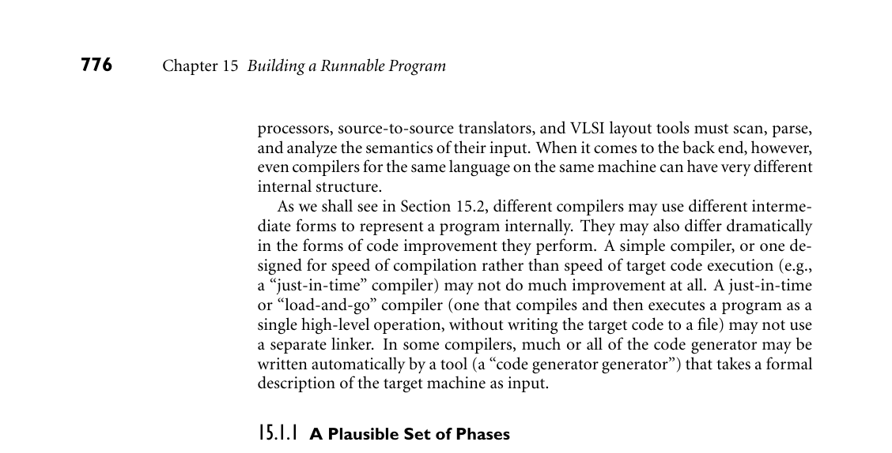
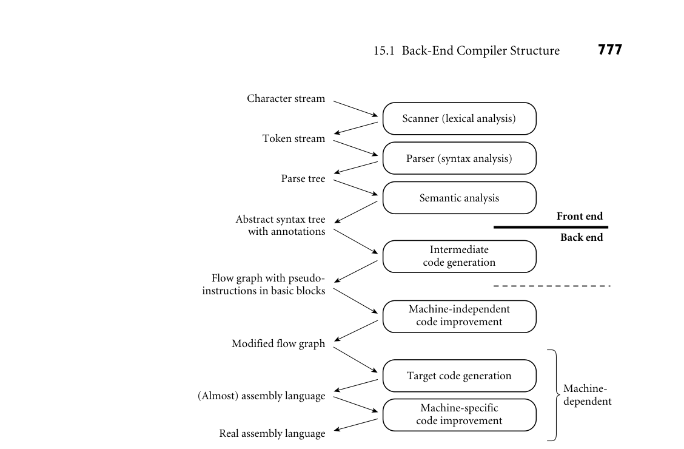
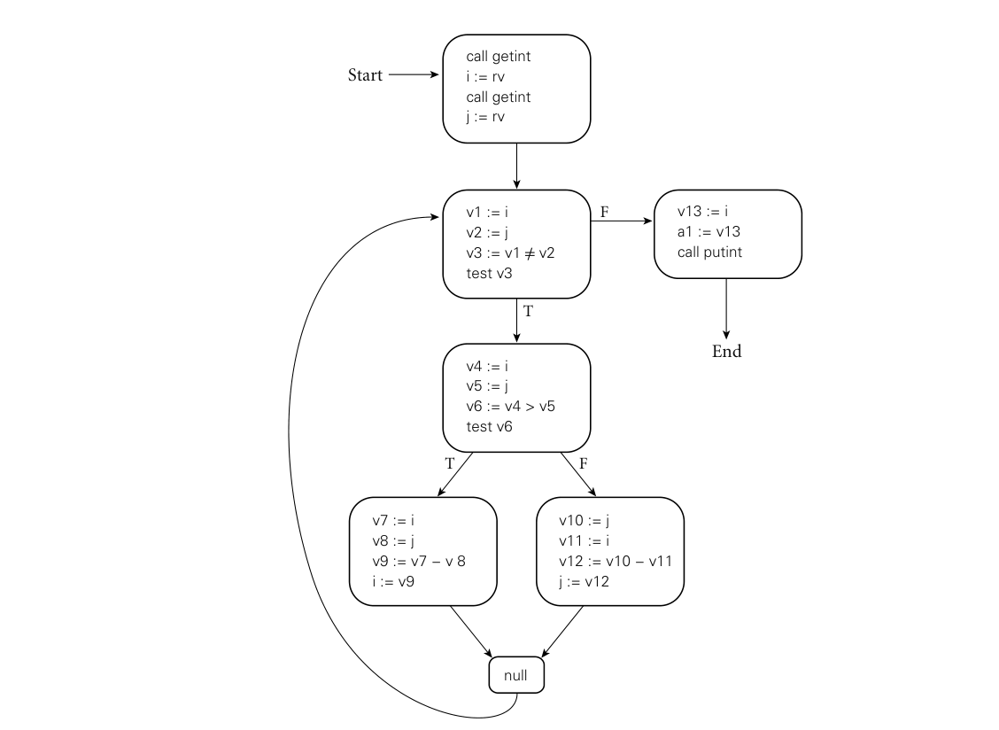

# 15.1 Back-End Compiler Structure

15 Building a Runnable Program

As noted in Section 1.6, the various phases of compilation are commonly grouped into a front end responsible for the analysis of source code, a back end responsible for the synthesis of target code, and often a “middle end” responsible for language- and machine-independent code improvement. Chapters 2 and 4 discussed the work of the front end, culminating in the construction of a syntax tree. The current chapter turns to the work of the back end, and specifically to code generation, assembly, and linking. We will continue with code improvement in Chapter 17. In Chapters 6 through 10, we often discussed the code that a compiler would generate to implement various language features. Now we will look at how the compiler produces that code from a syntax tree, and how it combines the out- put of multiple compilations to produce a runnable program. We begin in Sec- tion 15.1 with a more detailed overview of the work of program synthesis than was possible in Chapter 1. We focus in particular on one of several plausible ways of dividing that work into phases. In Section 15.2 we then consider the many possible forms of intermediate code passed between these phases. On the com- panion site we provide a bit more detail on two concrete examples—the GIMPLE and RTL formats used by the GNU compilers. We will consider two additional intermediate forms in Chapter 16: Java bytecode and the Common Intermedi- ate Language (CIL) used by Microsoft and other implementors of the Common Language Infrastructure. In Section 15.3 we discuss the generation of assembly code from an abstract syntax tree, using attribute grammars as a formal framework. In Section 15.4 we discuss the internal organization of binary object files and the layout of programs in memory. Section 15.5 describes assembly. Section 15.6 considers linking. 15.1 Back-End Compiler Structure

As we noted in Chapter 4, there is less uniformity in back-end compiler structure than there is in front-end structure. Even such unconventional compilers as text

775

*Figure 15.1 illustrates a plausible seven-phase structure for a conventional com- EXAMPLE 15.1*

776 Chapter 15 Building a Runnable Program

processors, source-to-source translators, and VLSI layout tools must scan, parse, and analyze the semantics of their input. When it comes to the back end, however, even compilers for the same language on the same machine can have very different internal structure. As we shall see in Section 15.2, different compilers may use different interme- diate forms to represent a program internally. They may also differ dramatically in the forms of code improvement they perform. A simple compiler, or one de- signed for speed of compilation rather than speed of target code execution (e.g., a “just-in-time” compiler) may not do much improvement at all. A just-in-time or “load-and-go” compiler (one that compiles and then executes a program as a single high-level operation, without writing the target code to a file) may not use a separate linker. In some compilers, much or all of the code generator may be written automatically by a tool (a “code generator generator”) that takes a formal description of the target machine as input.

15.1.1 A Plausible Set of Phases

Phases of compilation piler. The first three phases (scanning, parsing, and semantic analysis) are lan- guage dependent; the last two (target code generation and machine-specific code improvement) are machine dependent, and the middle two (intermediate code generation and machine-independent code improvement) are (to first approxi- mation) dependent on neither the language nor the machine. The scanner and parser drive a set of action routines that build a syntax tree. The semantic analyzer traverses the tree, performing all static semantic checks and initializing various at- tributes (mainly symbol table pointers and indications of the need for dynamic checks) of use to the back end. ■ While certain code improvements can be performed on syntax trees, a less hi- erarchical representation of the program makes most code improvement easier. Our example compiler therefore includes an explicit phase for intermediate code generation. The code generator begins by grouping the nodes of the tree into basic blocks, each of which consists of a maximal-length set of operations that should execute sequentially at run time, with no branches in or out. It then cre- ates a control flow graph in which the nodes are basic blocks and the arcs represent interblock control flow. Within each basic block, operations are represented as instructions for an idealized machine with an unlimited number of registers. We will call these virtual registers. By allocating a new one for every computed value, the compiler can avoid creating artificial connections between otherwise inde- pendent computations too early in the compilation process. In Example 1.20 we used a simple greatest common divisor (GCD) program EXAMPLE 15.2

GCD program abstract syntax tree (reprise) to illustrate the phases of compilation. The syntax tree for this program appeared in Figure 1.6; it is reproduced here (in slightly altered form) as Figure 15.2. A cor- responding control flow graph appears in Figure 15.3. We will discuss techniques to generate this graph in Section 15.3 and Exercise 15.6. Additional examples of control flow graphs will appear in Chapter 17. ■

*Figure 15.1 A plausible set of compiler phases. Here we have shown a sharper separation between semantic analysis and intermediate code generation than we considered in Chapter 1 (see Figure 1.3). Machine-independent code improvement employs an intermediate form that resembles the assembly language for an idealized machine with an unlimited number of reg- isters. Machine-specific code improvement—register allocation and instruction scheduling in particular—employs the assembly language of the target machine. The dashed line shows a common “break point” between the front end and back end of a two-pass compiler. In some implementations, machine-independent code improvement may be located in a separate “middle end” pass.*

15.1 Back-End Compiler Structure 777

Character stream

Scanner (lexical analysis)

Token stream

Parser (syntax analysis)

Parse tree

Semantic analysis

Abstract syntax tree with annotations Front end

Back end

Intermediate code generation

Flow graph with pseudo- instructions in basic blocks

Machine-independent code improvement

Modified flow graph

Target code generation

Machine- dependent

(Almost) assembly language

Machine-specific code improvement

Real assembly language

The machine-independent code improvement phase of compilation performs a variety of transformations on the control flow graph. It modifies the instruction sequence within each basic block to eliminate redundant loads, stores, and arith- metic computations; this is local code improvement. It also identifies and removes a variety of redundancies across the boundaries between basic blocks within a subroutine; this is global code improvement. As an example of the latter, an ex- pression whose value is computed immediately before an if statement need not be recomputed within the code that follows the else. Likewise an expression that appears within the body of a loop need only be evaluated once if its value will not change in subsequent iterations. Some global improvements change the number of basic blocks and/or the arcs among them.

*Figure 15.2 Syntax tree and symbol table for the GCD program. The only difference from Figure 1.6 is the addition of explicit null nodes to indicate empty argument lists and to terminate statement lists.*

778 Chapter 15 Building a Runnable Program

program

:= :=

while

call (5) call (6) call

null

(3) null

(4) (5)

(3) null

=/

if

null

Index Symbol Type

(5) (6)

> := :=

void int getint putint i j

type type func : (1) → (2) func : (2) → (1) (2) (2)

1 2 3 4 5 6

null null

(5) (6) (5)

(6)

− −

(5) (6) (6) (5)

It is worth noting that “global” code improvement typically considers only the current subroutine, not the program as a whole. Much recent research in com- piler technology has been aimed at “truly global” techniques, known as inter- procedural code improvement. Since programmers are generally unwilling to give up separate compilation (recompiling hundreds of thousands of lines of code is a very time-consuming operation), a practical interprocedural code improver must do much of its work at link time. One of the (many) challenges to be overcome is to develop a division of labor and an intermediate representation that allow the compiler to do as much work as possible during (separate) compilation, but leave enough of the details undecided that the link-time code improver is able to do its job. Following machine-independent code improvement, the next phase of com- pilation is target code generation. This phase strings the basic blocks together into a linear program, translating each block into the instruction set of the target machine and generating branch instructions (or “fall-throughs”) that correspond to the arcs of the control flow graph. The output of this phase differs from real assembly language primarily in its continued reliance on virtual registers. So long as the pseudoinstructions of the intermediate form are reasonably close to those of the target machine, this phase of compilation, though tedious, is more or less straightforward.

*Figure 15.3 Control flow graph for the GCD program. Code within basic blocks is shown in the pseudo-assembly notation introduced in Sidebar 5.1, with a different virtual register (here named v1. . . v13) for every computed value. Registers a1 and rv are used to pass values to and from subroutines.*

15.1 Back-End Compiler Structure 779

call getint i := rv call getint j := rv

Start

v13 := i a1 := v13 call putint

F

v1 := i v2 := j v3 := v1 =/ v2 test v3

T

End

v4 := i v5 := j v6 := v4 > v5 test v6

T F

v7 := i v8 := j v9 := v7 − v 8 i := v9

v10 := j v11 := i v12 := v10 − v11 j := v12

null

To reduce programmer effort and increase the ease with which a compiler can be ported to a new target machine, target code generators are sometimes gen- erated automatically from a formal description of the machine. Automatically generated code generators all rely on some sort of pattern-matching algorithm to replace sequences of intermediate code instructions with equivalent sequences of target machine instructions. References to several such algorithms can be found in the Bibliographic Notes at the end of this chapter; details are beyond the scope of this book.

