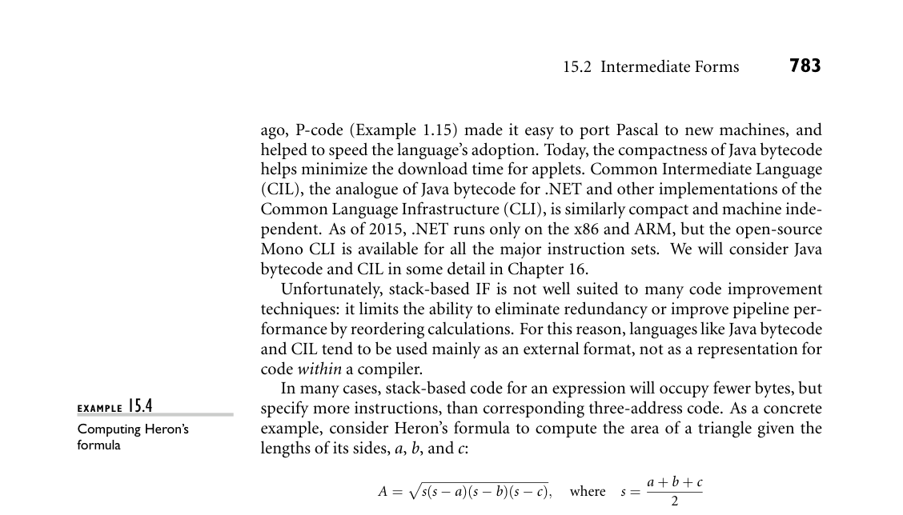

# 15.2 Intermediate Forms

780 Chapter 15 Building a Runnable Program

The final phase of our example compiler structure consists of register alloca- tion and instruction scheduling, both of which can be thought of as machine- specific code improvement. Register allocation requires that we map the unlim- ited virtual registers employed in earlier phases onto the bounded set of architec- tural registers available in the target machine. If there aren’t enough architectural registers to go around, we may need to generate additional loads and stores to multiplex a given architectural register among two or more virtual registers. In- struction scheduling (described in Sections C 5.5 and C 17.6) consists of reorder- ing the instructions of each basic block in an attempt to fill the pipeline(s) of the target machine.

15.1.2 Phases and Passes

In Section 1.6 we defined a pass of compilation as a phase or sequence of phases that is serialized with respect to the rest of compilation: it does not start until previous phases have completed, and it finishes before any subsequent phases start. If desired, a pass may be written as a separate program, reading its input from a file and writing its output to a file. Two-pass compilers are particularly common. They may be divided between semantic analysis and intermediate code generation or between intermediate code generation and machine-independent code improvement. In either case, the first pass is commonly referred to as the “front end” and the second pass as the “back end.” Like most compilers, our example generates symbolic assembly language as its output (a few compilers, including those written by IBM for the Power family, generate binary machine code directly). The assembler (not shown in Figure 15.1) behaves as an extra pass, assigning addresses to fragments of data and code, and translating symbolic operations into their binary encodings. In most cases, the input to the compiler will have consisted of source code for a single compilation unit. After assembly, the output will need to be linked to other fragments of the application, and to various preexisting subroutine libraries. Some of the work of linking may be delayed until load time (immediately prior to program execution) or even until run time (during program execution). We will discuss assembly and linking in Sections 15.5 through 15.7. 15.2 Intermediate Forms

An intermediate form (IF) provides the connection between phases of machine- independent code improvement, and continues to represent the program during the various back-end phases. IFs can be classified in terms of their level, or degree of machine dependence. High-level IFs are often based on trees or directed acyclic graphs (DAGs) that directly capture the hierarchical structure of modern programming languages.

15.2 Intermediate Forms 781

A high-level IF facilitates certain kinds of machine-independent code improve- ment, incremental program updates (e.g., in a language-based editor), and direct interpretation (most interpreters employ a tree-based internal IF). Because the permissible structure of a tree can be described formally by a set of productions (as described in Section 4.6), manipulations of tree-based forms can be written as attribute grammars. The most common medium-level IFs employ three-address instructions for a simple idealized machine, typically one with an unlimited number of registers. Often the instructions are embedded in a control flow graph. Since the typical instruction specifies two operands, an operator, and a destination, three-address instructions are sometimes called quadruples. Low-level IFs usually resemble the assembly language of some particular target machine, most often the physical machine on which the target code will execute. Different compilers use different IFs. Many compilers use more than one IF internally, though in the common two-pass organization one of these is distin- guished as “the” intermediate form by virtue of being the externally visible con- nection between the front end and the back end. In the example of Section 15.1.1, EXAMPLE 15.3

Intermediate forms in Figure 15.1 the syntax trees passed from semantic analysis to intermediate code generation constitute a high-level IF. Control flow graphs containing pseudo-assembly lan- guage (passed in and out of machine-independent code improvement) are a medium-level IF. The assembly language of the target machine (initially with virtual registers; later with architectural registers) serves as a low-level IF. The distinction between “high-,” “medium-,” and “low-level” IFs is of course somewhat arbitrary: the plausible design space is very large, with a nearly contin- uous spectrum from abstract to machine-dependent. ■ Compilers that have back ends for several different target architectures tend to do as much work as possible on a high- or medium-level IF, so that the machine- independent parts of the code improver can be shared by different back ends. By contrast, some (but not all) compilers that generate code for a single architecture perform most code improvement on a comparatively low-level IF, closely mod- eled after the assembly language of the target machine. In a multilanguage compiler family, an IF that is independent of both source language and target machine allows a software vendor who wishes to sell compil- ers for n languages on m machines to build just n front ends and m back ends, rather than n × m integrated compilers. Even in a single-language compiler fam- ily, a common, possibly language-dependent IF simplifies the task of porting to a new machine by isolating the code that needs to be changed. In a rich pro- gram development environment, there may be a variety of tools in addition to the passes of the compiler that understand and operate on the IF. Examples include editors, assemblers, linkers, debuggers, pretty-printers, and version-management software. In a language system capable of interprocedural (whole-program) code improvement, separately compiled modules and libraries may be compiled only to the IF, rather than the target language, leaving the final stages of compilation to the linker.

782 Chapter 15 Building a Runnable Program

To be stored in a file, an IF requires a linear representation. Sequences of three- address instructions are naturally linear. Tree-based IFs can be linearized via or- dered traversal. Structures like control flow graphs can be linearized by replacing pointers with indices relative to the beginning of the file.

15.2.1 GIMPLE and RTL

Many readers will be familiar with the gcc compilers. Distributed as open source by the Free Software Foundation, gcc is used very widely in both academia and industry. The standard distribution includes front ends for C, C++, Objective- C, Ada, Fortran, Go, and Java. Front ends for additional languages, including Cobol, Modula-2 and 3, Pascal and PL/I, are separately available. The C compiler is the original, and the one most widely used (gcc originally stood for “GNU C compiler”). There are back ends for dozens of processor architectures, including all commercially significant options. There are also GNU implementations, not based on gcc, for some two dozen additional languages.

IN MORE DEPTH

Gcc has three main IFs. Most of the (language-specific) front ends employ, in- ternally, some variant of a high-level syntax tree form known as GENERIC. Early phases of machine-independent code improvement use a somewhat lower-level tree form known as GIMPLE (still a high-level IF). Later phases use a linear form known as RTL (register transfer language). RTL is a medium-level IF, but a bit higher level than most: it overlays a control flow graph on of a sequence of pseu- doinstructions. RTL was, for many years, the principal IF for gcc. GIMPLE was introduced in 2005 as a more suitable form for machine-independent code im- provement. We consider GIMPLE and RTL in more detail on the companion site.

15.2.2 Stack-Based Intermediate Forms

In situations where simplicity and brevity are paramount, designers often turn to stack-based languages. Operations in a such a language pop arguments from— and push results to—a common implicit stack. The lack of named operands means that a stack-based language can be very compact. In certain HP calcu- lators (Exercise 4.7), stack-based expression evaluation serves to minimize the number of keystrokes required to enter equations. For embedded devices and printers, stack-based evaluation in Forth and Postscript serves to reduce memory and bandwidth requirements, respectively (see Sidebar 15.1). Medium-levelstack-based intermediate languages are similarly attractive when passing code from a compiler to an interpreter or virtual machine. Forty years

*Figure 15.4 compares bytecode and three-address versions of this formula. Each line represents a single instruction. If we assume that a, b, c, and s are all among the first few local variables of the current subroutine, both the Java Virtual Ma- chine (JVM) and the CLI will be able to move them to or from the stack with single-byte instructions. Consequently, the second-to-last instruction in the left column is the only one that needs more than a single byte (it takes three: one for*

DESIGN & IMPLEMENTATION

15.1 Postscript One of the most pervasive uses of stack-based languages today occurs in doc- ument preparation. Many document compilers (TEX, Microsoft Word, etc.) generate Postscript or the related Portable Document Format (PDF) as their target language. (Most document compilers employ some special-purpose in- termediate language as well, and have multiple back ends, so they can generate multiple target languages.) Postscript is stack-based. It is portable, compact, and easy to generate. It is also written in ASCII, so it can be read (albeit with some difficulty) by hu- man beings. Postscript interpreters are embedded in most professional-quality printers. Issues of code improvement are relatively unimportant: most of the time required for printing is consumed by network delays, mechanical paper transport, and data manipulations embedded in (optimized) library routines; interpretation time is seldom a bottleneck. Compactness on the other hand is crucial, because it contributes to network delays.

