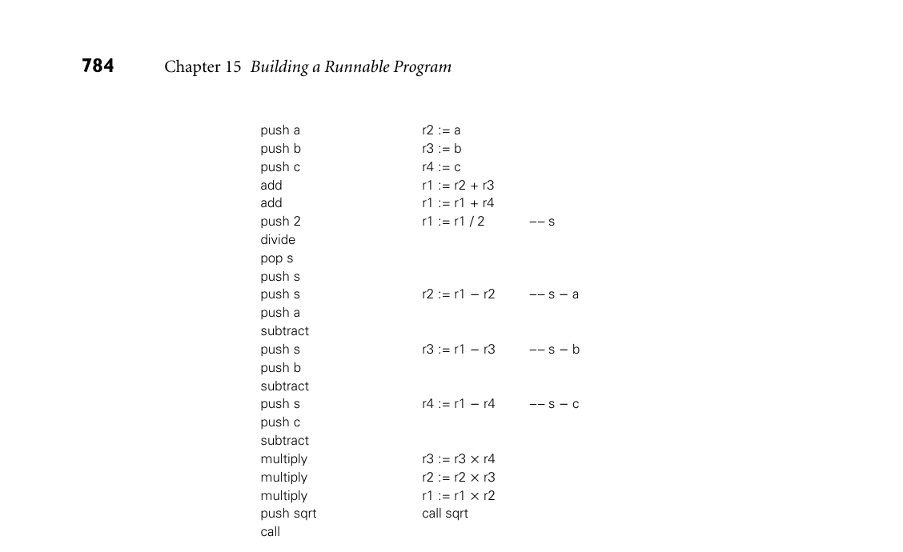
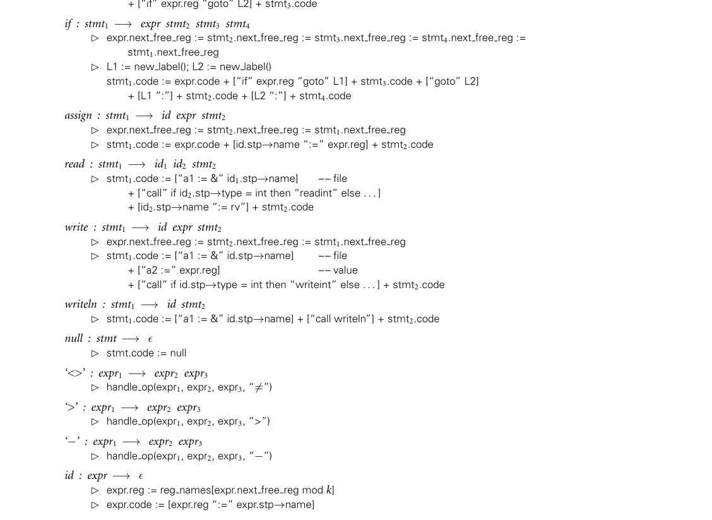
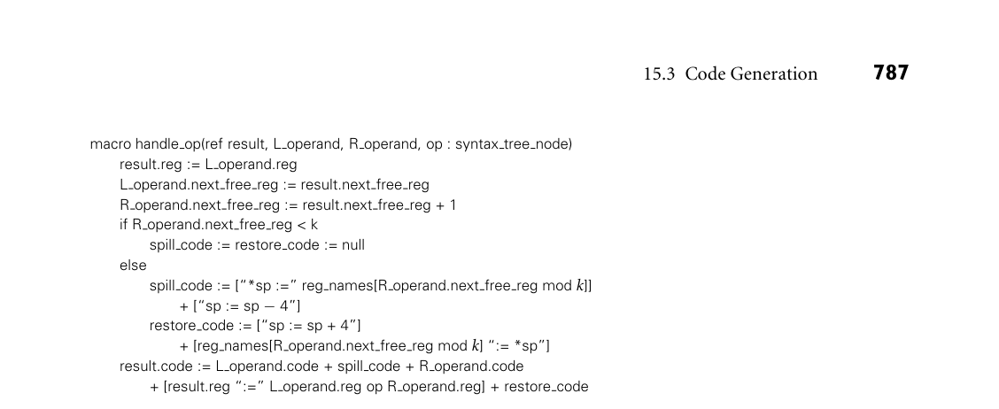
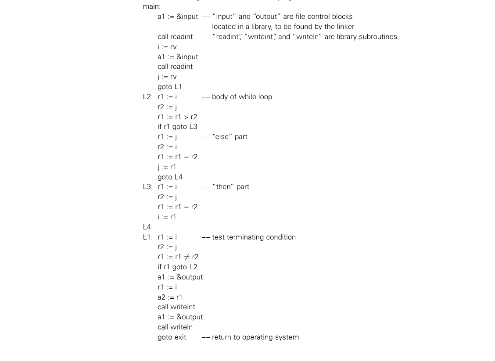

# 15.3 Code Generation

*Figure 15.4 Stack-based versus three-address IF. Shown are two versions of code to compute the area of a triangle using Heron’s formula. At left is a stylized version of Java bytecode or CLI Common Intermediate Language. At right is corresponding pseudo-assembler for a machine with three-address instructions. The bytecode requires a larger number of instructions, but occupies less space.*

the push operation and two to specify the sqrt routine). This gives us a total of 23 instructions in 25 bytes. By contrast, three-address code for the same formula keeps a, b, c, and s in registers, and requires only 13 instructions. Unfortunately, in typical notation each instruction but the last will be four bytes in length (the last will be eight), and our 13 instructions will occupy 56 bytes. ■ 15.3 Code Generation

The back-end structure of Figure 15.1 is too complex to present in any detail in a EXAMPLE 15.5

Simpler compiler structure single chapter. To limit the scope of our discussion, we will content ourselves in this chapter with producing correct but naive code. This choice will allow us to consider a significantly simpler middle and back end. Starting with the structure of Figure 15.1, we drop the machine-independent code improver and then merge intermediate and target code generation into a single phase. This merged phase

*Figure 15.5 A simpler, nonoptimizing compiler structure, assumed in Section 15.3. The target code generation phase closely resembles the intermediate code generation phase of Figure 15.1.*

generates pure, linear assembly language; because we are not performing code improvements that alter the program’s control flow, there is no need to represent that flow explicitly in a control flow graph. We also adopt a much simpler register allocation algorithm, which can operate directly on the syntax tree prior to code generation, eliminating the need for virtual registers and the subsequent mapping onto architectural registers. Finally, we drop instruction scheduling. The result- ing compiler structure appears in Figure 15.5. Its code generation phase closely resembles the intermediate code generation of Figure 15.1. ■

15.3.1 An Attribute Grammar Example

Like semantic analysis, intermediate code generation can be formalized in terms of an attribute grammar, though it is most commonly implemented via hand- written ad hoc traversal of a syntax tree. We present an attribute grammar here for the sake of clarity. In Figure 1.7, we presented naive x86 assembly language for the GCD pro- gram. We will use our attribute grammar example to generate a similar version here, but for a RISC-like machine, and in pseudo-assembly notation. Because this notation is now meant to represent target code, rather than medium- or low-level intermediate code, we will assume a fixed, limited register set reminiscent of real machines. We will reserve several registers (a1, a2, sp, rv) for special purposes; others (r1 . . rk) will be available for temporary values and expression evaluation. Figure 15.6 contains a fragment of our attribute grammar. To save space, we EXAMPLE 15.6

An attribute grammar for code generation have shown only those productions that actually appear in Figure 15.2. As in

786 Chapter 15 Building a Runnable Program

reg names : array [0..k−1] of register name := [“r1”, “r2”, . . . , “rk”] –– ordered set of temporaries

program −→stmt  stmt.next free reg := 0  program.code := [“main:”] + stmt.code + [“goto exit”]

*Figure 15.6 Attribute grammar to generate code from a syntax tree. Square brackets delimit individual target instructions. Juxtaposition indicates concatenation within instructions; the ‘+’ operator indicates concatenation of instruction lists. The handle op macro is used in three of the attribute rules. (continued)*

*Figure 15.6 (continued)*

Chapter 4, notation like while : stmt on the left-hand side of a production in- dicates that a while node in the syntax tree is one of several kinds of stmt node; it may serve as the stmt in the right-hand side of its parent production. In our attribute grammar fragment, program, expr, and stmt all have a synthesized at- tribute code that contains a sequence of instructions. Program has an inherited attribute name of type string, obtained from the compiler command line. Id has a synthesized attribute stp that points to the symbol table entry for the identi- fier. Expr has a synthesized attribute reg that indicates the register that will hold the value of the computed expression at run time. Expr and stmt have an inher- ited attribute next free reg that indicates the next register (in an ordered set of temporaries) that is available for use (i.e., that will hold no useful value at run time) immediately before evaluation of a given expression or statement. (For simplicity, we will be managing registers as if they were a stack; more on this in Section 15.3.2.) ■ Because we use a symbol table in our example, and because symbol tables lie outside the formal attribute grammar framework, we must augment our attribute grammar with some extra code for storage management. Specifically, prior to evaluating the attribute rules of Figure 15.6, we must traverse the symbol table in order to calculate stack-frame offsets for local variables and parameters (two of which—i and j—occur in the GCD program) and in order to generate assembler directives to allocate space for global variables (of which our program has none). Storage allocation and other assembler directives will be discussed in more detail in Section 15.5.

15.3.2 Register Allocation

Evaluation of the rules of the attribute grammar itself consists of two main tasks. In each subtree we first determine the registers that will be used to hold various quantities at run time; then we generate code. Our naive register allocation strat- EXAMPLE 15.7

Stack-based register allocation

788 Chapter 15 Building a Runnable Program

egy uses the next free reg inherited attribute to manage registers r1. . . rk as an expression evaluation stack. To calculate the value of (a + b) × (c −(d / e)), for example, we would generate the following:

r1 := a –– push a r2 := b –– push b r1 := r1 + r2 –– add r2 := c –– push c r3 := d –– push d r4 := e –– push e r3 := r3 / r4 –– divide r2 := r2 −r3 –– subtract r1 := r1 × r2 –– multiply

Allocation of the next register on the “stack” occurs in the production id : expr −→ϵ, where we use expr.next free reg to index into reg names, the ar- ray of temporary register names, and in macro handle op, where we increment next free reg to make this register unavailable during evaluation of the right- hand operand. There is no need to “pop” the “register stack” explicitly; this hap- pens automatically when the attribute evaluator returns to a parent node and uses the parent’s (unmodified) next free reg attribute. In our example grammar, left- hand operands are the only constructs that tie up a register during the evaluation of anything else. In a more complete grammar, other long-term uses of registers would probably occur in constructs like for loops (for the step size, index, and bound). In a particularly complicated fragment of code it is possible to run out of ar- chitectural registers. In this case we must spill one or more registers to memory. Our naive register allocator pushes a register onto the program’s subroutine call stack, reuses the register for another purpose, and then pops the saved value back into the register before it is needed again. In effect, architectural registers hold the top k elements of an expression evaluation stack of effectively unlimited size. ■ It should be emphasized that our register allocation algorithm, while correct, makes very poor use of machine resources. We have made no attempt to reor- ganize expressions to minimize the number of registers used, or to keep com- monly used variables in registers over extended periods of time (avoiding loads and stores). If we were generating medium-levelintermediate code, instead of tar- get code, we would employ virtual registers, rather than architectural ones, and would allocate a new one every time we needed it, never reusing one to hold a dif- ferent value. Mapping of virtual registers to architectural registers would occur much later in the compilation process. Target code for the GCD program appears in Figure 15.7. The first few lines are EXAMPLE 15.8

GCD program target code generated during symbol table traversal, prior to attribute evaluation. Attribute program.name might be passed to the assembler, to tell it the name of the file into which to place the runnable program. A real compiler would probably also generate assembler directives to embed symbol-table information in the target program. As in Figure 1.7, the quality of our code is very poor. We will investigate

15.3 Code Generation 789

*Figure 15.7 Target code for the GCD program, generated from the syntax tree of Figure 15.2, using the attribute grammar of Figure 15.6.*

