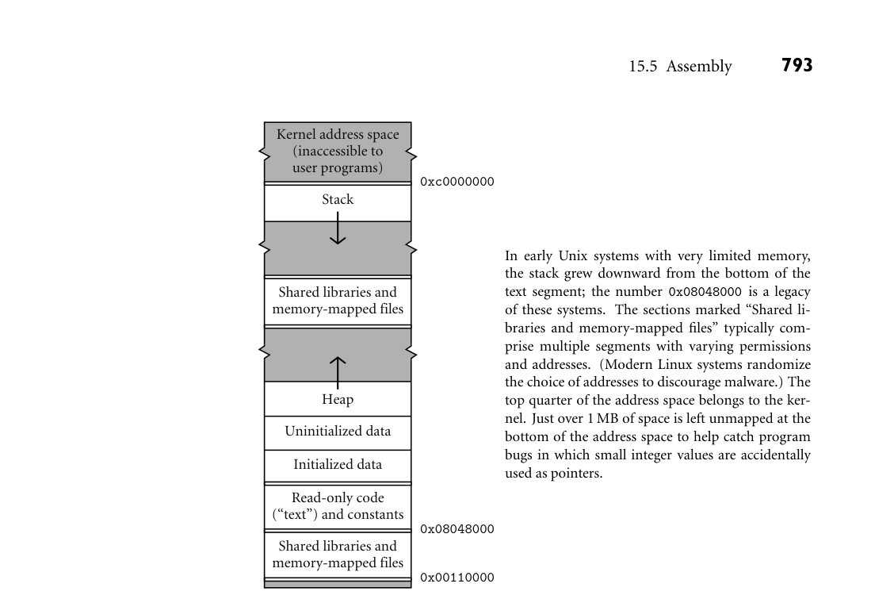

# 15.5 Assembly

792 Chapter 15 Building a Runnable Program

Stack: May be allocated in some fixed amount at load time. More commonly, is given a small initial size, and is then extended automatically by the operating system in response to (faulting) accesses beyond the current segment end. Heap: Like stack, may be allocated in some fixed amount at load time. More commonly, is given a small initial size, and is then extended in response to explicit requests (via system call) from heap-management library routines. Files: In many systems, library routines allow a program to map a file into mem- ory. The map routine interacts with the operating system to create a new seg- ment for the file, and returns the address of the beginning of the segment. The contents of the segment are usually fetched from disk on demand, in response to page faults. Dynamic libraries: Modern operating systems typically arrange for most pro- grams to share a single copy of the code for popular libraries (Section C 15.7). From the point of view of an individual process, each such library tends to oc- cupy a pair of segments: one for the shared code, one for linkage information and for a private copy of any writable data the library may need.

The layout of these segments for a contemporary 32-bit Linux system on the EXAMPLE 15.9

Linux address space layout x86 appears in Figure 15.8. Relative placements and addresses may be different for other operating systems and machines. ■ 15.5 Assembly

Some compilers translate source files directly into object files acceptable to the linker. More commonly, they generate assembly language that must subsequently be processed by an assembler to create an object file. In our examples we have consistently employed a symbolic (textual) notation for code. Within a compiler, the representation would not be textual, but it would still be symbolic, most likely consisting of records and linked lists. To translate this symbolic representation into executable code, we must

1. Replace opcodes and operands with their machine language encodings. 2. Replace uses of symbolic names with actual addresses.

These are the principal tasks of an assembler. In the early days of computing, most programmers wrote in assembly lan- guage. To simplify the more tedious and repetitive aspects of assembly program- ming, assemblers often provided extensive macro expansion facilities. With the ubiquity of modern high-level languages, such programmer-centric features have largely disappeared. Almost all assembly language programs today are written by compilers. When passing assembly language directly from the compiler to the assembler, it EXAMPLE 15.10

Assembly as a final compiler pass makes sense to use some internal (records and linked lists) representation. At the

*Figure 15.8 Layout of 32-bit process address space in x86 Linux (not to scale). Double lines separate regions with potentially different access permissions.*

same time, we must provide a textual front end to accommodate the occasional need for human input:

Source program

Assembler source Assembler source Compiler

Internal data structures

Assembler front end

Assembler back end

Object code

794 Chapter 15 Building a Runnable Program

The assembler front end simply translates textual source into internal symbolic form. By sharing the assembler back end, the compiler and assembler front end avoid duplication of effort. For debugging purposes, the compiler will generally have an option to dump a textual representation of the code it passes to the as- sembler. ■ An alternative organization has the compiler generate object code directly: EXAMPLE 15.11

Direct generation of object code

Source program

Assembler source

Compiler

Assembler Disassembler

Object code

Assembler source

This organization gives the compiler a bit more flexibility: operations nor- mally performed by an assembler (e.g., assignment of addresses to variables) can be performed earlier if desired. Because there is no separate assembly pass, the overall translation to object code may be slightly faster. The stand-alone assem- bler can be relatively simple. If it is used only for small, special-purpose code fragments, it probably doesn’t need to perform instruction scheduling or other machine-specific code improvement. Using a disassembler instead of an assem- bly language dump from the compiler ensures that what the programmer sees corresponds precisely to what is in the object file. If the compiler uses a fancier assembler as a back end, then any program modifications effected by the assem- bler will not be visible in the assembly language dumped by the compiler. ■

15.5.1 Emitting Instructions

The most basic task of the assembler is to translate symbolic representations of instructions into binary form. In some assemblers this is an entirely straight- forward task, because there is a one-to-one correspondence between mnemonic operations and instruction op-codes. Many assemblers, however, make minor changes to their input in order to improve performance or to extend the instruc- tion set in ways that make the assembly language easier for human beings to read. The GNU assembler, gas, is among the more conservative, but even it takes a few liberties. For example, some compilers generate nop instructions to cache-align EXAMPLE 15.12

Compressing nops certain basic blocks (e.g., function prologues). To reduce the number of cycles these consume, gas will combine multiple consecutive nops into multibyte in- structions that have no effect. (On the x86, there are 2-, 4-, and 7-byte variants of the lea instruction that can be used to move a register into itself.) ■

15.5 Assembly 795

For jumps to nearby addresses, gas uses an instruction variant that specifies EXAMPLE 15.13

Relative and absolute branches an offset from the pc. For jumps to distant addresses (or to addresses not known until link time), it uses a longer variant that specifies an absolute address. A few x86 instructions (not typically generated by modern compilers) don’t have the longer variant. For these, some assemblerswill reverse the sense of the conditional test to hop over an unconditional jump. Gas simply fails to handle them. ■ At the more aggressive end of the spectrum, SGI’s assembler for the MIPS EXAMPLE 15.14

Pseudoinstructions instruction set provides a large number of pseudoinstructions that translate into different real instructions depending on their arguments, or that correspond to multi-instruction sequences. For example, there are two integer add instructions on the MIPS: one of them adds two registers; the other adds a register and a con- stant. The assembler provides a single pseudoinstruction, which it translates into the appropriate variant. In a similar vein, the assembler provides a pseudoinstruc- tion to load an arbitrary constant into a register. Since all instructions are 32 bits long, this pseudoinstruction must be translated into a pair of real instructions when the constant won’t fit in 16 bits. Some pseudoinstructions may generate even longer sequences. Integer division can take as many as 11 real instructions, to check for errors and to move the quotient from a temporary location into the desired register. ■ In effect, the SGI assembler implements a “cleaned-up” variant of the real ma- chine. In addition to providing pseudoinstructions, it reorganizes instructions to hide the existence of delayed branches (Section C 5.5.1) and to improve the ex- pected performance of the processor pipeline. This reorganization constitutes a final pass of instruction scheduling (Sections C 5.5.1 and C 17.6). Though the job could be handled by the compiler, the existence of pseudoinstructions like the in- teger division example argues strongly for doing it in the assembler. In addition to having two branch delays that might be filled by neighboring instructions, the expanded division sequence can be used as a source of instructions to fill nearby branch, load, or functional unit delays. In addition to translating from symbolic to binary instruction representations, EXAMPLE 15.15

Assembler directives most assemblers respond to a variety of directives. Gas provides more than 100 of these. A few examples follow.

Segment switching: The .text directive indicates that subsequent instructions and data should be placed in the code (text) segment. The .data directive indicates that subsequent instructions and data should be placed in the initial- ized data segment. (It is possible, though uncommon, to put instructions in the data segment, or data in the code segment.) The .space n directive indi- cates that n bytes of space should be reserved in the uninitialized data segment. (This latter directive is usually preceded by a label.) Data generation: The .byte, .hword, .word, .float, and .double directives each take a sequence of arguments, which they place in successive locations in the current segment of the output program. They differ in the types of operands. The related.ascii directive takes a single character string as argu- ment, which it places in consecutive bytes.

796 Chapter 15 Building a Runnable Program

Symbol identification: The.globl name directive indicates that name should be entered into the table of exported symbols. Alignment: The.align n directive causes the subsequent output to be aligned at an address evenly divisible by 2n. ■

15.5.2 Assigning Addresses to Names

Like compilers, assemblers commonly work in several phases. If the input is tex- tual, an initial phase scans and parses the input, and builds an internal represen- tation. In the most common organization there are two additional phases. The first identifies all internal and external (imported) symbols, assigning locations to the internal ones. This phase is complicated by the fact that the length of some in- structions (on a CISC machine) or the number of real instructions produced by a pseudoinstruction (on a RISC machine) may depend on the number of significant bits in an address. Given values for symbols, the final phase produces object code. Within the object file, any symbol mentioned in a .globl directive must ap- pear in the table of exported symbols, with an entry that indicates the symbol’s address. Any symbol referred to in a directive or an instruction, but not defined in the input program, must appear in the table of imported symbols, with an en- try that identifies all places in the code at which such references occur. Finally, any instruction or datum whose value depends on the placement of the current file within the address space of a running program must be listed in the relocation table. Historically, assemblers distinguished between absolute and relocatable words EXAMPLE 15.16

Encoding of addresses in object files in an object file. Absolute words were known at assembly time; they did not need to be changed by the linker. Examples include constants and register–register instructions. A relocatable word, in contrast, needed to be modified by adding to it the address within the final program of the code or data segment of the object file in which it appeared. A CISC jump instruction, for example, might consist of a 1-byte jmp opcode followed by a 4-byte target address. For a local target, the address bytes in the object file would contain the symbol’s offset within the file. The linker would finalize the address by adding the address of the file’s code segment in the final version of the program. On modern machines, this single form of relocation no longer suffices. Ad- dresses are encoded into instructions in many different ways, and these encodings must be reflected in the relocation table and the import table. On a 32-bit ARM processor, for example, an unconditional branch (b) instruction has a 24-bit off- set field. The processor left-shifts this field by two bits, sign-extends it, and then adds it to the address of the branch instruction itself to obtain the target address.1

1 The size of the offset implies that branches on ARM are limited to jumps of ≤32 MB in either direction. If the linker discovers that a target is farther away than that, it must generate “veneer” code that loads the target address into r12 (which is reserved for this purpose) and then performs and indirect branch.

