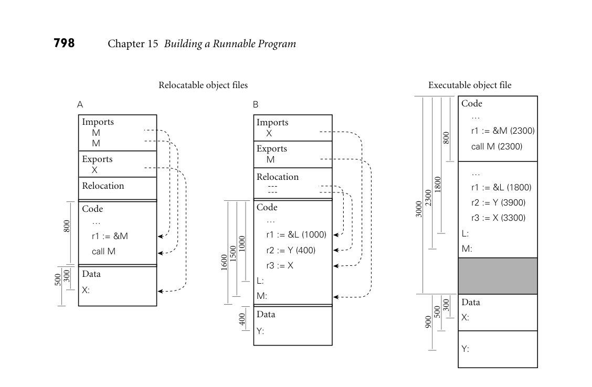

# 15.6 Linking

15.6 Linking
**797**

To relocate such an instruction, the linker must add the address of the target code
segment and the offset within it of the target instruction, subtract the address
of the current code segment and the offset within it of the branch instruction,
perform a two-bit right arithmetic shift, and truncate the result to 24 bits. In a
similar vein, a 32-bit load on ARM requires a two-instruction sequence analogous
to that of Example 15.14; if the loaded quantity is relocatable, the linker must re-
calculate the 16-bit operands of both instructions. Modern assemblers and object
file formats reflect this diversity of relocation modes.
■
## 15.6

**Linking**
Most language implementations—certainly all that are intended for the construc-
tion of large programs—support separate compilation: fragments of the program
can be compiled and assembled more or less independently. After compilation,
these fragments (known as* compilation units*) are “glued together” by a* linker*.
In many languages and environments, the programmer explicitly divides the pro-
gram into modules or files, each of which is separately compiled. More integrated
environments may abandon the notion of a file in favor of a database of subrou-
tines, each of which is separately compiled.
The task of a linker is to join together compilation units. A* static linker* does
its work prior to program execution, producing an executable object file. A* dy-*
*namic linker* (described in Section C 15.7) does its work after the (first part of the)
program has been brought into memory for execution.
Each to-be-linked compilation unit must be a relocatable object file. Typically,
some files will have been produced by compiling fragments of the application
being constructed, while others will be preexisting library packages needed by
the application. Since most programs make use of libraries, even a “one-file”
application typically needs to be linked.
Linking involves two subtasks: relocation and the resolution of external ref-
erences. Some authors refer to relocation as* loading*, and call the entire “joining
together” process “link-loading.” Other authors (including the current one) use
“loading” to refer to the process of bringing an executable object file into memory
for execution. On very simple machines, or on machines with very simple oper-
ating systems, loading entails relocation. More commonly, the operating system
uses virtual memory to give every program the impression that it starts at some
standard address. In many systems loading also entails a certain amount of link-
ing (Section C 15.7).

1800
800
500
300

Executable object file

Data

X:

Y:

Code
 
…

 
r1 := &M (2300)

 
call M (2300)

 
…

 
r1 := &L (1800)

 
r2 := Y (3900)

 
r3 := X (3300)

L:

M:

1000
400
1500
1600

Imports
 
X

Data

Y:

Exports
 
M

B

Relocation

Code
 
…

 
r1 := &L (1000)

 
r2 := Y (400)

 
r3 := X

L:

M:

800
300
500

A

Imports
 
M
 
M

Relocation

Exports
 
X

Data

X:

Code
 
…

 
r1 := &M

 
call M

*Figure 15.9 Linking relocatable object files A and B to make an executable object file. For simplicity of presentation, A’s code section has been placed at offset 0, with B’s code section immediately after, at offset 800 (addresses increase down the page). To allow the operating system to establish different protections for the code and data segments, A’s data section has been placed at the next page boundary (offset 3000), with B’s data section immediately after (offset 3500). External references to M and X have been set to use the appropriate addresses. Internal references to L and Y have been updated by adding in the starting addresses of B’s code and data sections, respectively.*

### 15.6.1** Relocation and Name Resolution**

### Each relocatable object file contains the information required for linking: the

### import, export, and relocation tables. A static linker uses this information in a

### two-phase process analogous to that described for assemblers in Section 15.5. In

### the first phase, the linker gathers all of the compilation units together, chooses an

### order for them in memory, and notes the address at which each will consequently

### lie. In the second phase, the linker processes each unit, replacing unresolved exter-

### nal references with appropriate addresses, and modifying instructions that need

### to be relocated to reflect the addresses of their units. These phases are illustrated

**EXAMPLE** 15.17
Static linking
### pictorially in Figure 15.9. Addresses and offsets are assumed to be written in hex-

adecimal notation, with a page size of 4K (100016) bytes.
### ■

### Libraries present a bit of a challenge. Many consist of hundreds of separately

### compiled program fragments, most of which will not be needed by any particular

