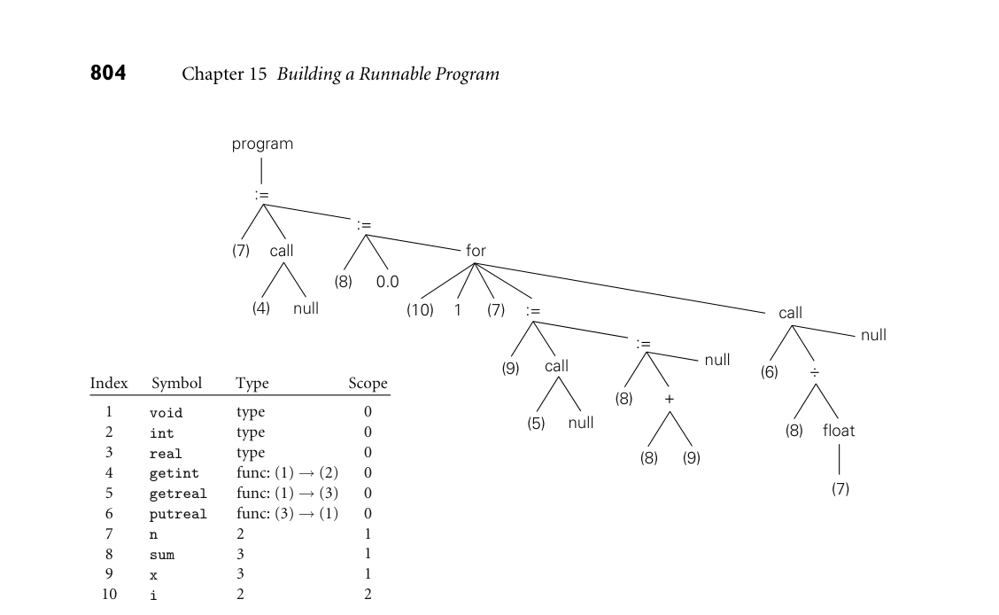

# 15.9 Exercises

15.9 Exercises
**803**

or even run time, to allow programs to share the code segments of large, popu-
lar libraries. For many languages the linker must perform a certain amount of
semantic checking, to guarantee type consistency. In more aggressive optimiz-
ing compilation systems (not discussed in this text), the linker may also perform
interprocedural code improvement.
As noted in Section 1.5, the typical programming environment includes a host
of additional tools, including debuggers, performance profilers, configuration
and version managers, style checkers, preprocessors, pretty-printers, testing sys-
tems, and perusal and cross-referencing utilities. Many of these tools, particularly
in well-integrated environments, are directly supported by the compiler. Many
make use, for example, of symbol-table information embedded in object files.
Performance profilers and testing systems often rely on special instrumentation
code inserted by the compiler at subroutine calls, loop boundaries, and other key
points in the code. Perusal, style-checking, and pretty-printing programs may
share the compiler’s scanner and parser. Configuration tools often rely on lists of
interfile dependences, again generated by the compiler, to tell when a change to
one part of a large system may require that other parts be recompiled.
## 15.9

**Exercises**
15.1
If you were writing a two-pass compiler, why might you choose a high-
level IF as the link between the front end and the back end? Why might
you choose a medium-level IF?
15.2
Consider a language like Ada or Modula-2, in which a module* M* can be
divided into a specification (header) file and an implementation (body)
file for the purpose of separate compilation (Section 10.2.1). Should* M*’s
specification itself be separately compiled, or should the compiler simply
read it in the process of compiling* M*’s body and the bodies of other mod-
ules that use abstractions defined in* M*? If the specification is compiled,
what should the output consist of?
15.3
Many research compilers (e.g., for SR [AO93], Cedar [SZBH86], Lynx
[Sco91], and Modula-3 [Har92]) have used C as their IF. C is well doc-
umented and mostly machine independent, and C compilers are much
more widely available than alternative back ends. What are the disadvan-
tages of generating C, and how might they be overcome?
15.4
List as many ways as you can think of in which the back end of a just-
in-time compiler might differ from that of a more conventional compiler.
What design goals dictate the differences?
15.5
Suppose that* k* (the number of temporary registers) in Figure 15.6 is 4 (this
is an artificially small number for modern machines). Give an example of
an expression that will lead to register spilling under our naive register
allocation algorithm.

for

:=

1
2
3
4
5
6
7
8
9
10

type
type
type
func: (1) *→* (2)
func: (1) *→* (3)
func: (3) *→* (1)
2
3
3
2

0
0
0
0
0
0
1
1
1
2

(7)

(8)
0.0

(10)
1

(8)
(9)

call
null

null

(8)

(7)

float

(6)
(9)

(8)

(7)
call

(4)

null

call

(5)

null

void
int
real
getint
getreal
putreal
n
sum
x
i

Index
Symbol
Type
Scope

:=

:=

+

÷



*Figure 15.10 Syntax tree and symbol table for a program that computes the average of N real numbers. The children of the for node are the index variable, the lower bound, the upper bound, and the body.*

```
15.6
Modify the attribute grammar of Figure 15.6 in such a way that it will gen-
erate the control flow graph of Figure 15.3 instead of the linear assembly
code of Figure 15.7.
15.7
Add productions and attribute rules to the grammar of Figure 15.6 to han-
dle Ada-style for loops (described in Section 6.5.1). Using your modi-
fied grammar, hand-translate the syntax tree of Figure 15.10 into pseudo-
assembly notation. Keep the index variable and the upper loop bound in
registers.
15.8
One problem (of many) with the code we generated in Section 15.3 is that
it computes at run time the value of expressions that could have been com-
puted at compile time. Modify the grammar of Figure 15.6 to perform a
simple form of constant folding: whenever both operands of an operator
are compile-time constants, we should compute the value at compile time
and then generate code that uses the value directly. Be sure to consider
how to handle overflow.
15.9
Modify the grammar of Figure 15.6 to generate jump code for Boolean
expressions, as described in Section 6.4.1. You should assume short-circuit
evaluation (Section 6.1.5).
```

